# Все ответы к госам

## Графы

### Билет 1. Графы: определения и основные операции над графами

#### 1. Краткая идея

Графовая модель описывает систему как набор объектов и связей между ними. Объекты называются вершинами, связи - ребрами или дугами. Графы удобны там, где важна не внутренняя природа объектов, а структура отношений: дороги между городами, зависимости задач, социальные связи, компьютерные сети, схемы переходов состояний, отношения наследования и т.д.

Главная идея графов: сложную систему можно изучать через свойства ее связности, маршрутов, циклов, степеней вершин, подструктур и преобразований. Для анализа графа важно уметь:

- корректно задать граф;
- понимать, к какому виду он относится;
- выполнять основные операции над графами;
- выбирать подходящее представление: множественное, матричное, списковое;
- распознавать инварианты, которые сохраняются при изоморфизме или преобразованиях.

#### 2. Основные определения

##### 2.1. Неориентированный граф

Неориентированный граф обычно задается парой:

\[
G = (V, E),
\]

где:

- \(V\) - множество вершин;
- \(E\) - множество ребер;
- каждое ребро в простом неориентированном графе является неупорядоченной парой различных вершин: \(\{u, v\}\), где \(u, v \in V\), \(u \ne v\).

Если \(e = \{u, v\}\), то говорят:

- ребро \(e\) соединяет вершины \(u\) и \(v\);
- вершины \(u\) и \(v\) смежны;
- ребро \(e\) инцидентно вершинам \(u\) и \(v\).

##### 2.2. Ориентированный граф

Ориентированный граф, или орграф, задается парой:

\[
D = (V, A),
\]

где:

- \(V\) - множество вершин;
- \(A\) - множество дуг;
- каждая дуга является упорядоченной парой \((u, v)\), где \(u, v \in V\).

Для дуги \((u, v)\):

- \(u\) - начало дуги;
- \(v\) - конец дуги;
- дуга направлена из \(u\) в \(v\).

В орграфе наличие дуги \((u, v)\) не означает наличие дуги \((v, u)\).

##### 2.3. Петли и кратные ребра

Петля - ребро или дуга, соединяющая вершину с самой собой:

- в неориентированном графе: \(\{v, v\}\);
- в орграфе: \((v, v)\).

Кратные, или параллельные, ребра - несколько ребер, соединяющих одну и ту же пару вершин. Для орграфа кратные дуги имеют одинаковое начало и одинаковый конец.

Если граф допускает петли и кратные ребра, его часто называют мультиграфом. Если допускаются только кратные ребра без петель, терминология может зависеть от учебника, но на экзамене важно явно проговорить соглашение.

##### 2.4. Смежность, инцидентность, степень

Вершины \(u\) и \(v\) смежны, если между ними есть ребро.

Ребро и вершина инцидентны, если эта вершина является одним из концов ребра.

Степень вершины \(v\) в неориентированном графе обозначается \(\deg(v)\) и равна числу ребер, инцидентных вершине \(v\). Петля обычно дает вклад 2 в степень вершины, потому что оба конца петли совпадают с этой вершиной.

Для орграфа различают:

- полустепень исхода \(\deg^+(v)\) - количество дуг, выходящих из \(v\);
- полустепень захода \(\deg^-(v)\) - количество дуг, входящих в \(v\);
- полную степень: \(\deg(v) = \deg^+(v) + \deg^-(v)\).

##### 2.5. Маршрут, цепь, путь, цикл

Маршрут в неориентированном графе - последовательность вершин и ребер:

\[
v_0, e_1, v_1, e_2, \ldots, e_k, v_k,
\]

где каждое ребро \(e_i\) соединяет \(v_{i-1}\) и \(v_i\).

В орграфе аналогично говорят о направленном маршруте, если каждая дуга идет в нужном направлении: \((v_{i-1}, v_i)\).

Часто различают:

- маршрут - вершины и ребра могут повторяться;
- цепь - ребра не повторяются;
- простая цепь, или путь, - вершины не повторяются;
- замкнутый маршрут - начальная и конечная вершины совпадают;
- цикл - замкнутый путь, в котором все вершины, кроме первой и последней, различны.

Некоторые авторы используют слова "цепь" и "путь" иначе, поэтому на экзамене полезно сначала дать свое соглашение.

##### 2.6. Связность

Неориентированный граф называется связным, если для любых двух его вершин существует путь между ними.

Компонента связности - максимальный по включению связный подграф. Если граф несвязный, он распадается на несколько компонент связности.

Для орграфов различают:

- сильную связность: для любых \(u\) и \(v\) существует направленный путь из \(u\) в \(v\) и из \(v\) в \(u\);
- слабую связность: если отбросить направления дуг, полученный неориентированный граф связен;
- одностороннюю связность: для любых двух вершин хотя бы одна достижима из другой.

##### 2.7. Подграф

Граф \(H = (V_H, E_H)\) называется подграфом графа \(G = (V, E)\), если:

\[
V_H \subseteq V,\quad E_H \subseteq E,
\]

и каждое ребро из \(E_H\) соединяет вершины из \(V_H\).

Важные частные случаи:

- остовный подграф - подграф, содержащий все вершины исходного графа;
- индуцированный подграф \(G[S]\) по множеству вершин \(S \subseteq V\) - подграф, содержащий все ребра исходного графа, оба конца которых лежат в \(S\);
- реберно-индуцированный подграф - подграф, заданный выбранным множеством ребер и всеми их концами.

#### 3. Виды графов

##### 3.1. Простой граф

Простой граф - неориентированный граф без петель и кратных ребер. В простом графе между двумя различными вершинами может быть не более одного ребра.

Пример простого графа:

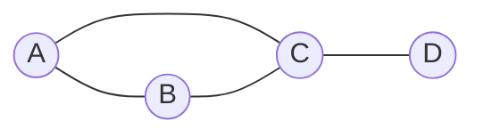

Для этого графа:

- \(V = \{A, B, C, D\}\);
- \(E = \{\{A,B\}, \{A,C\}, \{B,C\}, \{C,D\}\}\);
- \(\deg(A)=2\), \(\deg(B)=2\), \(\deg(C)=3\), \(\deg(D)=1\).

##### 3.2. Полный граф

Полный граф \(K_n\) - простой граф на \(n\) вершинах, в котором каждая пара различных вершин соединена ребром.

Число ребер в полном графе:

\[
|E(K_n)| = \frac{n(n-1)}{2}.
\]

##### 3.3. Пустой и нулевой граф

Пустой граф часто означает граф без ребер: \(E = \varnothing\). При этом вершины могут быть.

Нулевой граф иногда означает граф без вершин: \(V = \varnothing\). Терминология не всегда едина, поэтому лучше уточнять определение.

##### 3.4. Регулярный граф

Граф называется \(r\)-регулярным, если степень каждой его вершины равна \(r\):

\[
\forall v \in V: \deg(v)=r.
\]

Например, цикл \(C_n\) при \(n \ge 3\) является 2-регулярным графом.

##### 3.5. Двудольный граф

Граф называется двудольным, если множество его вершин можно разбить на две доли \(X\) и \(Y\) так, что каждое ребро соединяет вершину из \(X\) с вершиной из \(Y\), а внутри одной доли ребер нет.

\[
V = X \cup Y,\quad X \cap Y = \varnothing.
\]

Критерий: граф двудолен тогда и только тогда, когда в нем нет циклов нечетной длины.

Полный двудольный граф \(K_{m,n}\) содержит все возможные ребра между долями размеров \(m\) и \(n\), поэтому имеет \(mn\) ребер.

##### 3.6. Взвешенный граф

Взвешенный граф - граф, в котором ребрам или дугам сопоставлены веса:

\[
w: E \to \mathbb{R}
\]

или для орграфа:

\[
w: A \to \mathbb{R}.
\]

Вес может означать расстояние, стоимость, пропускную способность, время, вероятность, штраф и т.д.

##### 3.7. Планарный граф

Планарный граф - граф, который можно изобразить на плоскости так, чтобы его ребра пересекались только в общих вершинах.

Для связного планарного графа справедлива формула Эйлера:

\[
|V| - |E| + |F| = 2,
\]

где \(F\) - множество граней плоского изображения графа.

##### 3.8. Дерево и лес

Дерево - связный ациклический неориентированный граф.

Эквивалентные свойства дерева на \(n\) вершинах:

- граф связен и не содержит циклов;
- между любыми двумя вершинами существует ровно один простой путь;
- граф связен и имеет \(n-1\) ребро;
- граф ацикличен и имеет \(n-1\) ребро.

Лес - неориентированный граф без циклов. Каждая компонента связности леса является деревом.

#### 4. Операции над графами

Операции над графами позволяют строить новые графы из существующих, упрощать модель, выделять важные части или сравнивать структуры.

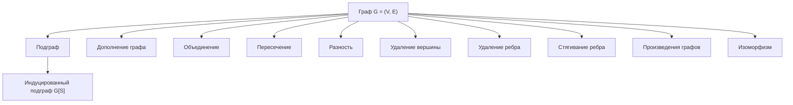

##### 4.1. Объединение графов

Пусть:

\[
G_1=(V_1,E_1),\quad G_2=(V_2,E_2).
\]

Объединением графов называется граф:

\[
G_1 \cup G_2 = (V_1 \cup V_2,\ E_1 \cup E_2).
\]

Если множества вершин пересекаются, общие вершины отождествляются. Если графы простые, результат остается простым при обычном множественном объединении ребер.

##### 4.2. Пересечение графов

Пересечение графов:

\[
G_1 \cap G_2 = (V_1 \cap V_2,\ E_1 \cap E_2),
\]

при условии, что ребра из \(E_1 \cap E_2\) имеют оба конца в \(V_1 \cap V_2\). На практике иногда сначала пересекают множества вершин, а затем берут только те общие ребра, которые допустимы в новом графе.

##### 4.3. Разность графов

Разность по ребрам:

\[
G_1 - E_2 = (V_1,\ E_1 \setminus E_2).
\]

Разность по вершинам:

\[
G - S
\]

означает удаление всех вершин из \(S \subseteq V\) и всех инцидентных им ребер.

Важно не путать удаление ребра и удаление вершины:

- при удалении ребра вершины остаются;
- при удалении вершины исчезают все инцидентные ей ребра.

##### 4.4. Дополнение графа

Для простого графа \(G=(V,E)\) дополнение \(\overline{G}\) имеет то же множество вершин, а его ребра соединяют те пары различных вершин, которые не были соединены в \(G\):

\[
\overline{G} = (V,\ \{\{u,v\}: u,v \in V,\ u \ne v,\ \{u,v\}\notin E\}).
\]

Иными словами:

\[
E(\overline{G}) = E(K_{|V|}) \setminus E(G).
\]

Для дополнения простого графа:

\[
\deg_{\overline{G}}(v) = |V|-1-\deg_G(v).
\]

##### 4.5. Удаление вершины и ребра

Удаление вершины \(v\):

\[
G - v = (V \setminus \{v\},\ E'),
\]

где \(E'\) содержит все ребра из \(E\), не инцидентные вершине \(v\).

Удаление ребра \(e\):

\[
G - e = (V,\ E \setminus \{e\}).
\]

Эти операции часто применяются при доказательствах по индукции, анализе связности, поиске мостов и точек сочленения.

##### 4.6. Добавление вершины и ребра

Добавление изолированной вершины:

\[
G' = (V \cup \{x\}, E).
\]

Добавление ребра между существующими вершинами:

\[
G' = (V,\ E \cup \{\{u,v\}\}).
\]

В простом графе ребро можно добавить только если \(u \ne v\) и такого ребра еще нет.

##### 4.7. Стягивание ребра

Стягивание ребра \(e=\{u,v\}\) - операция, при которой вершины \(u\) и \(v\) объединяются в одну новую вершину, а ребро \(e\) исчезает. Все ребра, ранее инцидентные \(u\) или \(v\), становятся инцидентными новой вершине.

После стягивания в общем случае могут появиться петли или кратные ребра. Если результат должен быть простым графом, петли удаляют, а кратные ребра заменяют одним ребром.

Стягивание важно в теории миноров графов и в алгоритмах на графах.

##### 4.8. Разбиение ребра

Разбиение ребра \(\{u,v\}\) - обратная по смыслу операция к стягиванию: ребро удаляется, добавляется новая вершина \(x\), а вместо исходного ребра появляются два ребра:

\[
\{u,x\},\quad \{x,v\}.
\]

Эта операция сохраняет связность, но увеличивает число вершин и ребер на 1.

##### 4.9. Слияние и отождествление вершин

Отождествление вершин - операция, при которой несколько вершин заменяются одной. Она похожа на стягивание, но не обязательно применяется только к концам одного ребра.

При отождествлении также могут возникать петли и кратные ребра.

##### 4.10. Произведения графов

Существует несколько стандартных произведений графов. На экзамене обычно достаточно знать, что это операции, строящие граф на декартовом произведении множеств вершин.

Для графов \(G=(V_G,E_G)\) и \(H=(V_H,E_H)\) множество вершин произведения часто имеет вид:

\[
V(G \square H) = V_G \times V_H.
\]

Для декартова произведения \(G \square H\) вершины \((g,h)\) и \((g',h')\) смежны, если:

- \(g=g'\) и \(\{h,h'\}\in E_H\);
- или \(h=h'\) и \(\{g,g'\}\in E_G\).

Например, прямоугольные решетки можно рассматривать как декартовы произведения путей.

##### 4.11. Транспонирование орграфа

Для орграфа \(D=(V,A)\) транспонированный, или обратный, орграф \(D^T\) получается заменой направления каждой дуги:

\[
A(D^T)=\{(v,u):(u,v)\in A(D)\}.
\]

Эта операция используется, например, в алгоритмах поиска сильных компонент связности.

##### 4.12. Замыкание отношения достижимости

Если орграф рассматривать как бинарное отношение на множестве вершин, то можно строить транзитивное замыкание. В нем дуга \((u,v)\) присутствует тогда и только тогда, когда в исходном орграфе существует направленный путь из \(u\) в \(v\).

Транзитивное замыкание помогает отвечать на вопросы достижимости.

#### 5. Матричные и множественные представления

##### 5.1. Множественное представление

Самое строгое математическое задание графа:

\[
G=(V,E).
\]

Пример:

\[
V=\{1,2,3,4\},
\]

\[
E=\{\{1,2\}, \{1,3\}, \{2,3\}, \{3,4\}\}.
\]

Такое представление удобно для определений, доказательств и операций над множествами.

##### 5.2. Матрица смежности

Для простого неориентированного графа с вершинами \(v_1,\ldots,v_n\) матрица смежности \(A=(a_{ij})\) задается так:

\[
a_{ij} =
\begin{cases}
1, & \text{если } \{v_i,v_j\}\in E,\\
0, & \text{иначе.}
\end{cases}
\]

Свойства матрицы смежности простого неориентированного графа:

- матрица симметрична: \(a_{ij}=a_{ji}\);
- на главной диагонали стоят нули, если нет петель;
- сумма элементов \(i\)-й строки равна степени вершины \(v_i\);
- сумма всех элементов матрицы равна \(2|E|\).

Для примера из раздела 3.1 при порядке вершин \(A,B,C,D\):

\[
\begin{pmatrix}
0 & 1 & 1 & 0\\
1 & 0 & 1 & 0\\
1 & 1 & 0 & 1\\
0 & 0 & 1 & 0
\end{pmatrix}
\]

Для орграфа матрица смежности обычно задается так:

\[
a_{ij}=1 \Leftrightarrow (v_i,v_j)\in A.
\]

Она не обязана быть симметричной. Сумма строки дает полустепень исхода, сумма столбца - полустепень захода.

##### 5.3. Матрица инцидентности

Пусть граф имеет вершины \(v_1,\ldots,v_n\) и ребра \(e_1,\ldots,e_m\). Матрица инцидентности \(B\) имеет размер \(n \times m\).

Для неориентированного графа:

\[
b_{ij}=1,
\]

если вершина \(v_i\) инцидентна ребру \(e_j\), иначе \(b_{ij}=0\). Для петли иногда ставят 2, потому что петля дважды инцидентна одной вершине.

Для ориентированного графа часто используют знаковую матрицу инцидентности:

\[
b_{ij} =
\begin{cases}
-1, & \text{если дуга } e_j \text{ выходит из } v_i,\\
1, & \text{если дуга } e_j \text{ входит в } v_i,\\
0, & \text{иначе.}
\end{cases}
\]

Иногда знаки выбирают наоборот. Главное - явно указать соглашение.

##### 5.4. Список смежности

Список смежности хранит для каждой вершины список ее соседей.

Для графа из примера:

```text
A: B, C
B: A, C
C: A, B, D
D: C
```

Такое представление удобно для алгоритмов обхода, особенно если граф разреженный, то есть \(|E|\) существенно меньше \(|V|^2\).

##### 5.5. Список ребер

Список ребер - перечисление всех ребер:

```text
(A, B)
(A, C)
(B, C)
(C, D)
```

Он прост, компактен и удобен для алгоритмов, которые сортируют или просматривают ребра, например для алгоритма Краскала.

#### 6. Свойства и инварианты

##### 6.1. Лемма о рукопожатиях

Для любого конечного неориентированного графа:

\[
\sum_{v\in V}\deg(v)=2|E|.
\]

Каждое ребро дает вклад 2 в сумму степеней: по одному на каждый конец, а петля также считается дважды.

Следствие: число вершин нечетной степени в любом неориентированном графе четно.

Для орграфа:

\[
\sum_{v\in V}\deg^+(v)=|A|,
\]

\[
\sum_{v\in V}\deg^-(v)=|A|,
\]

поэтому:

\[
\sum_{v\in V}\deg^+(v)=\sum_{v\in V}\deg^-(v).
\]

##### 6.2. Изоморфизм графов

Графы \(G_1=(V_1,E_1)\) и \(G_2=(V_2,E_2)\) изоморфны, если существует биекция:

\[
f: V_1 \to V_2
\]

такая, что:

\[
\{u,v\}\in E_1 \Leftrightarrow \{f(u),f(v)\}\in E_2.
\]

Изоморфные графы имеют одинаковую структуру, хотя вершины могут называться по-разному.

Инварианты изоморфизма - свойства, сохраняющиеся при переименовании вершин:

- число вершин;
- число ребер;
- последовательность степеней;
- число компонент связности;
- наличие циклов заданной длины;
- связность;
- двудольность;
- планарность;
- диаметр и радиус, если граф связный.

Важно: совпадение некоторых инвариантов еще не гарантирует изоморфизм, но различие хотя бы одного инварианта доказывает, что графы не изоморфны.

##### 6.3. Последовательность степеней

Последовательность степеней - список степеней всех вершин, обычно упорядоченный по невозрастанию.

Например, для графа из раздела 3.1:

\[
(3,2,2,1).
\]

Она часто используется как быстрый тест на неизоморфность.

##### 6.4. Расстояние, эксцентриситет, радиус и диаметр

Расстояние \(d(u,v)\) между вершинами \(u\) и \(v\) - длина кратчайшего пути между ними. Если пути нет, расстояние может считаться бесконечным или неопределенным в рамках компоненты.

Эксцентриситет вершины:

\[
e(v)=\max_{u\in V} d(v,u)
\]

для связного графа.

Радиус графа:

\[
r(G)=\min_{v\in V} e(v).
\]

Диаметр графа:

\[
d(G)=\max_{v\in V} e(v).
\]

Центр графа - множество вершин с минимальным эксцентриситетом.

##### 6.5. Мосты и точки сочленения

Мост - ребро, удаление которого увеличивает число компонент связности.

Точка сочленения - вершина, удаление которой вместе с инцидентными ребрами увеличивает число компонент связности.

Эти понятия показывают уязвимые элементы сети.

##### 6.6. Независимость и клики

Независимое множество вершин - множество вершин, никакие две из которых не смежны.

Клика - множество вершин, любые две из которых смежны. Иначе говоря, клика - полный подграф.

В дополнении графа независимые множества переходят в клики, а клики - в независимые множества.

#### 7. Примеры

##### 7.1. Пример задания графа и его дополнения

Пусть:

\[
V=\{1,2,3,4\},
\]

\[
E=\{\{1,2\}, \{2,3\}\}.
\]

Тогда полный граф на этих вершинах имеет ребра:

\[
\{\{1,2\}, \{1,3\}, \{1,4\}, \{2,3\}, \{2,4\}, \{3,4\}\}.
\]

Дополнение графа:

\[
E(\overline{G})=\{\{1,3\}, \{1,4\}, \{2,4\}, \{3,4\}\}.
\]

##### 7.2. Пример операции удаления вершины

Если в графе:

\[
E=\{\{A,B\}, \{A,C\}, \{B,C\}, \{C,D\}\}
\]

удалить вершину \(C\), то исчезнут все ребра, инцидентные \(C\):

\[
\{A,C\}, \{B,C\}, \{C,D\}.
\]

Останется:

\[
V'=\{A,B,D\},\quad E'=\{\{A,B\}\}.
\]

Вершина \(D\) станет изолированной.

##### 7.3. Пример матрицы смежности для орграфа

Пусть:

\[
V=\{1,2,3\},
\]

\[
A=\{(1,2),(2,3),(3,1),(1,3)\}.
\]

При порядке вершин \(1,2,3\):

\[
\begin{pmatrix}
0 & 1 & 1\\
0 & 0 & 1\\
1 & 0 & 0
\end{pmatrix}
\]

Суммы строк:

- для вершины 1: \(\deg^+(1)=2\);
- для вершины 2: \(\deg^+(2)=1\);
- для вершины 3: \(\deg^+(3)=1\).

Суммы столбцов:

- для вершины 1: \(\deg^-(1)=1\);
- для вершины 2: \(\deg^-(2)=1\);
- для вершины 3: \(\deg^-(3)=2\).

#### 8. Типичные ошибки

1. Путать ребро и дугу. В неориентированном графе \(\{u,v\}=\{v,u\}\), а в орграфе \((u,v)\) и \((v,u)\) - разные дуги.

2. Считать, что граф обязательно должен быть связным. По общему определению граф может быть несвязным.

3. Забывать удалять инцидентные ребра при удалении вершины.

4. Путать подграф и индуцированный подграф. В индуцированном подграфе по выбранным вершинам должны быть все ребра исходного графа между этими вершинами.

5. Неверно считать степень петли. В неориентированном графе петля обычно дает вклад 2 в степень вершины.

6. Считать, что совпадение числа вершин, числа ребер и последовательности степеней доказывает изоморфизм. Это только необходимые признаки, но не достаточные в общем случае.

7. Строить дополнение для графа с петлями и кратными ребрами без уточнения соглашений. Классическое дополнение определяется для простого графа.

8. Путать матрицу смежности и матрицу инцидентности. Матрица смежности имеет размер \(|V|\times|V|\), а матрица инцидентности - \(|V|\times|E|\).

9. Для орграфа ошибочно считать матрицу смежности симметричной. Симметричность характерна для неориентированных графов.

10. Называть любой замкнутый маршрут циклом. В цикле, по стандартному определению, вершины не должны повторяться, кроме совпадения первой и последней.

#### 9. Что сказать на экзамене

Хороший ответ можно построить так:

1. Начать с общей идеи: граф - модель объектов и связей.

2. Дать формальное определение неориентированного графа \(G=(V,E)\), затем орграфа \(D=(V,A)\).

3. Объяснить различие между вершинами, ребрами, дугами, петлями и кратными ребрами.

4. Ввести базовые отношения: смежность вершин, инцидентность ребра и вершины, степень вершины, входящая и исходящая степени в орграфе.

5. Рассказать про маршруты, пути, циклы, связность и компоненты связности.

6. Перечислить основные виды графов: простой, мультиграф, ориентированный, взвешенный, полный, пустой, двудольный, регулярный, планарный, дерево.

7. Перейти к операциям: объединение, пересечение, разность, дополнение, удаление и добавление вершин и ребер, стягивание ребра, разбиение ребра, транспонирование орграфа.

8. Показать способы представления: множества \(V,E\), матрица смежности, матрица инцидентности, список смежности, список ребер.

9. Завершить свойствами и инвариантами: лемма о рукопожатиях, последовательность степеней, связность, компоненты, изоморфизм, мосты, точки сочленения.

Ключевая формулировка: графовая модель фиксирует структуру отношений, а операции над графами позволяют выделять подструктуры, объединять модели, удалять элементы, строить дополнения и преобразовывать граф без потери контроля над его свойствами.

### Билет 2. Формы задания графов; метрические характеристики графа

#### 1. Формы задания графов

Граф задается множеством вершин и множеством связей между ними. В общем виде граф обозначают

\[
G=(V,E),
\]

где \(V\) — множество вершин, а \(E\) — множество ребер. Если ребра имеют направление, граф называется ориентированным, или орграфом. Если направление не задано, граф называется неориентированным. Если каждому ребру сопоставлено число, например длина, стоимость, пропускная способность или время перехода, граф называется взвешенным.

Один и тот же граф можно задать разными способами. Выбор формы зависит от того, какие операции нужно выполнять: быстро проверять наличие ребра, перечислять соседей вершины, запускать алгоритмы кратчайших путей, хранить разреженный или плотный граф.

##### 1.1. Список ребер

Список ребер — это перечисление всех ребер графа.

Для неориентированного графа ребро записывают как неупорядоченную пару:

\[
\{u,v\}.
\]

Для ориентированного графа дуга записывается как упорядоченная пара:

\[
(u,v),
\]

где \(u\) — начало дуги, \(v\) — конец дуги.

Для взвешенного графа удобно хранить тройки:

\[
(u,v,w),
\]

где \(w\) — вес ребра или дуги.

**Пример.** Пусть

\[
V=\{A,B,C,D,E\},
\]

а множество ребер неориентированного графа:

\[
E=\{AB,AC,BD,CD,DE\}.
\]

Тогда список ребер можно записать так:

| Ребро | Концы ребра |
|---|---|
| 1 | \(A,B\) |
| 2 | \(A,C\) |
| 3 | \(B,D\) |
| 4 | \(C,D\) |
| 5 | \(D,E\) |

**Достоинства:**

- простая и компактная форма для разреженных графов;
- удобно добавлять новые ребра;
- естественно хранить веса ребер;
- хорошо подходит для алгоритмов, которые обрабатывают все ребра, например алгоритма Краскала.

**Недостатки:**

- проверка наличия конкретного ребра \((u,v)\) обычно требует просмотра списка;
- неудобно быстро получать всех соседей вершины без дополнительной структуры;
- для частых запросов смежности может быть медленнее матрицы смежности.

Память: \(O(m)\), где \(m=|E|\).

##### 1.2. Список смежности

Список смежности для каждой вершины хранит список вершин, смежных с ней.

Для неориентированного графа каждое ребро \(uv\) обычно записывается дважды: \(v\) в списке соседей \(u\) и \(u\) в списке соседей \(v\). Для ориентированного графа в списке вершины \(u\) хранят вершины, в которые выходят дуги из \(u\).

Для графа из примера:

| Вершина | Соседи |
|---|---|
| \(A\) | \(B,C\) |
| \(B\) | \(A,D\) |
| \(C\) | \(A,D\) |
| \(D\) | \(B,C,E\) |
| \(E\) | \(D\) |

Если граф взвешенный, рядом с соседом указывают вес:

| Вершина | Соседи с весами |
|---|---|
| \(A\) | \((B,2),(C,5)\) |
| \(B\) | \((A,2),(D,1)\) |

**Достоинства:**

- экономно хранит разреженные графы;
- удобно перечислять соседей вершины;
- хорошо подходит для обходов в ширину и глубину, алгоритма Дейкстры на разреженных графах, поиска компонент связности.

**Недостатки:**

- проверка наличия ребра \(uv\) требует поиска \(v\) в списке соседей \(u\);
- в неориентированном графе ребро хранится дважды;
- для плотных графов преимущество по памяти уменьшается.

Память: \(O(n+m)\), где \(n=|V|\), \(m=|E|\).

##### 1.3. Список инцидентности

Список инцидентности для каждой вершины хранит ребра, которым эта вершина инцидентна, то есть ребра, для которых она является одним из концов.

Для примера с ребрами

\[
e_1=AB,\ e_2=AC,\ e_3=BD,\ e_4=CD,\ e_5=DE
\]

получим:

| Вершина | Инцидентные ребра |
|---|---|
| \(A\) | \(e_1,e_2\) |
| \(B\) | \(e_1,e_3\) |
| \(C\) | \(e_2,e_4\) |
| \(D\) | \(e_3,e_4,e_5\) |
| \(E\) | \(e_5\) |

**Достоинства:**

- удобно работать с ребрами как с самостоятельными объектами;
- полезно, когда у ребер много атрибутов: вес, цвет, пропускная способность, номер, состояние;
- удобно для задач, где важно отношение "вершина — ребро", например в сетевых моделях.

**Недостатки:**

- менее удобно напрямую получать соседние вершины;
- проверка смежности двух вершин требует анализа инцидентных ребер;
- часто используется как вспомогательная, а не основная форма хранения.

Память: \(O(n+m)\), при этом каждое неориентированное ребро встречается в двух списках инцидентности.

##### 1.4. Матрица смежности

Матрица смежности — это квадратная матрица \(A\) размера \(n \times n\), где строки и столбцы соответствуют вершинам графа.

Для невзвешенного графа:

\[
a_{ij}=
\begin{cases}
1, & \text{если вершины } v_i \text{ и } v_j \text{ смежны},\\
0, & \text{иначе}.
\end{cases}
\]

Для ориентированного графа \(a_{ij}=1\), если есть дуга из \(v_i\) в \(v_j\). Для неориентированного графа матрица смежности симметрична относительно главной диагонали.

Для графа из примера в порядке вершин \(A,B,C,D,E\):

|   | A | B | C | D | E |
|---|---:|---:|---:|---:|---:|
| A | 0 | 1 | 1 | 0 | 0 |
| B | 1 | 0 | 0 | 1 | 0 |
| C | 1 | 0 | 0 | 1 | 0 |
| D | 0 | 1 | 1 | 0 | 1 |
| E | 0 | 0 | 0 | 1 | 0 |

**Достоинства:**

- проверка наличия ребра выполняется за \(O(1)\);
- удобно применять матричные методы;
- хорошо подходит для плотных графов;
- в ориентированном графе легко отличать входящие и исходящие дуги по столбцам и строкам.

**Недостатки:**

- требует \(O(n^2)\) памяти даже для разреженного графа;
- перечисление соседей вершины требует просмотра всей строки, то есть \(O(n)\);
- при большом количестве вершин и малом числе ребер хранится много нулей.

Память: \(O(n^2)\).

##### 1.5. Матрица инцидентности

Матрица инцидентности описывает связь вершин и ребер. Ее строки соответствуют вершинам, а столбцы — ребрам.

Для неориентированного графа:

\[
b_{ij}=
\begin{cases}
1, & \text{если вершина } v_i \text{ инцидентна ребру } e_j,\\
0, & \text{иначе}.
\end{cases}
\]

Для ориентированного графа часто используют знаковую матрицу инцидентности:

\[
b_{ij}=
\begin{cases}
-1, & \text{если дуга } e_j \text{ выходит из } v_i,\\
1, & \text{если дуга } e_j \text{ входит в } v_i,\\
0, & \text{если вершина } v_i \text{ не инцидентна дуге } e_j.
\end{cases}
\]

Для неориентированного графа с ребрами \(e_1=AB\), \(e_2=AC\), \(e_3=BD\), \(e_4=CD\), \(e_5=DE\):

|   | \(e_1\) | \(e_2\) | \(e_3\) | \(e_4\) | \(e_5\) |
|---|---:|---:|---:|---:|---:|
| A | 1 | 1 | 0 | 0 | 0 |
| B | 1 | 0 | 1 | 0 | 0 |
| C | 0 | 1 | 0 | 1 | 0 |
| D | 0 | 0 | 1 | 1 | 1 |
| E | 0 | 0 | 0 | 0 | 1 |

**Достоинства:**

- хорошо показывает отношение вершин и ребер;
- удобна для алгебраических методов теории графов;
- полезна в задачах потоков, электрических цепей, сетевых моделей.

**Недостатки:**

- память \(O(nm)\), что может быть много;
- проверка смежности вершин не так удобна, как в матрице смежности;
- для простого хранения больших разреженных графов обычно менее практична, чем список смежности.

Память: \(O(nm)\).

##### 1.6. Матрица весов и матрица расстояний

Матрица весов используется для взвешенных графов. В ячейке \(w_{ij}\) хранится вес ребра между \(v_i\) и \(v_j\). Если ребра нет, часто записывают \(\infty\), пустое значение или специальную константу. На главной диагонали обычно стоит 0, так как расстояние от вершины до самой себя равно 0.

Для взвешенного графа:

|   | A | B | C | D |
|---|---:|---:|---:|---:|
| A | 0 | 2 | 5 | \(\infty\) |
| B | 2 | 0 | \(\infty\) | 1 |
| C | 5 | \(\infty\) | 0 | 3 |
| D | \(\infty\) | 1 | 3 | 0 |

Матрица расстояний отличается от матрицы весов тем, что в ней хранится не вес непосредственного ребра, а длина кратчайшего пути между каждой парой вершин:

\[
d_{ij}=d(v_i,v_j).
\]

Для невзвешенного графа длина пути обычно измеряется числом ребер. Для взвешенного графа длина пути равна сумме весов входящих в него ребер.

**Достоинства матрицы расстояний:**

- сразу дает расстояние между любой парой вершин;
- удобна для вычисления эксцентриситета, радиуса, диаметра и центра;
- является результатом алгоритмов поиска всех кратчайших путей, например алгоритма Флойда — Уоршелла.

**Недостатки:**

- требует \(O(n^2)\) памяти;
- построение может быть дорогим для больших графов;
- при изменении ребер может потребоваться пересчет расстояний.

##### 1.7. Визуальное задание графа

Граф можно задать рисунком: вершины изображаются точками или кругами, а ребра — линиями или стрелками. Такой способ удобен для понимания структуры небольших графов, но не является строгим для машинной обработки, если рисунок не сопровождается формальным описанием.

Пример рассматриваемого графа:

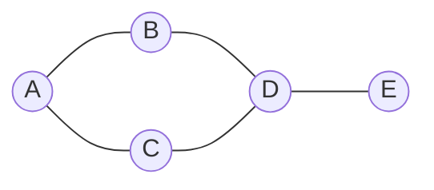

**Достоинства:**

- наглядность;
- удобно видеть мосты, циклы, центральные и периферийные вершины;
- хорошо подходит для объяснения и проверки небольших примеров.

**Недостатки:**

- для больших графов рисунок становится перегруженным;
- расположение вершин может вводить в заблуждение: геометрическая близость на рисунке не всегда означает малое графовое расстояние;
- неудобно непосредственно выполнять алгоритмы без перевода в формальную структуру.

##### 1.8. Сравнение форм задания графов

Пусть \(n\) — число вершин, \(m\) — число ребер.

| Форма задания | Память | Быстрая проверка ребра | Быстрое перечисление соседей | Когда удобна |
|---|---:|---:|---:|---|
| Список ребер | \(O(m)\) | Нет, обычно \(O(m)\) | Нет | Разреженные графы, обработка всех ребер |
| Список смежности | \(O(n+m)\) | Зависит от структуры списка | Да, \(O(\deg v)\) | Обходы, компоненты связности, кратчайшие пути в разреженных графах |
| Список инцидентности | \(O(n+m)\) | Не напрямую | Через инцидентные ребра | Задачи, где ребра имеют самостоятельное значение |
| Матрица смежности | \(O(n^2)\) | Да, \(O(1)\) | Нужно просмотреть строку: \(O(n)\) | Плотные графы, матричные методы |
| Матрица инцидентности | \(O(nm)\) | Не напрямую | Не напрямую | Алгебраические методы, сетевые модели |
| Матрица весов | \(O(n^2)\) | Да, если хранит прямые ребра | Нужно просмотреть строку | Взвешенные плотные графы |
| Матрица расстояний | \(O(n^2)\) | Не про наличие ребра, а про кратчайшее расстояние | Не перечисляет соседей | Анализ метрических характеристик |
| Визуальное задание | Зависит от рисунка | Нет | Наглядно для малых графов | Объяснение структуры, иллюстрация |

Главное практическое правило: для разреженных графов чаще используют списки смежности, а для плотных графов и частых запросов "есть ли ребро между \(u\) и \(v\)" — матрицу смежности.

#### 2. Метрические характеристики графа

Метрические характеристики описывают расстояния между вершинами и положение вершин внутри графа. Обычно они рассматриваются для связных неориентированных графов. В ориентированных графах расстояния зависят от направления дуг, поэтому путь из \(u\) в \(v\) может существовать, а из \(v\) в \(u\) — нет.

##### 2.1. Маршрут, цепь, путь и кратчайший путь

**Маршрут** — последовательность вершин и ребер, в которой каждое ребро соединяет соседние вершины последовательности. В маршруте вершины и ребра могут повторяться.

**Цепь** — маршрут, в котором ребра не повторяются.

**Простая цепь**, или простой путь в распространенной терминологии, — маршрут, в котором вершины не повторяются.

**Длина пути** в невзвешенном графе равна числу ребер в пути. Во взвешенном графе длина пути равна сумме весов его ребер.

**Кратчайший путь** между вершинами \(u\) и \(v\) — путь минимальной длины среди всех путей из \(u\) в \(v\).

##### 2.2. Расстояние

Расстояние между вершинами \(u\) и \(v\), обозначаемое \(d(u,v)\), — это длина кратчайшего пути между ними.

Для невзвешенного графа:

\[
d(u,v)=\min \{\text{число ребер в пути из }u\text{ в }v\}.
\]

Если \(u=v\), то

\[
d(u,u)=0.
\]

Если пути между вершинами нет, расстояние считают бесконечным:

\[
d(u,v)=\infty.
\]

В связном неориентированном графе между любой парой вершин существует путь, поэтому все расстояния конечны. Связность является важным условием корректного вычисления радиуса, диаметра, центра и среднего расстояния в обычном конечном виде. Если граф несвязный, эти характеристики либо определяют отдельно для компонент связности, либо используют специальные соглашения.

Для неориентированного графа расстояние обладает свойствами метрики:

1. \(d(u,v)\ge 0\);
2. \(d(u,v)=0\) тогда и только тогда, когда \(u=v\);
3. \(d(u,v)=d(v,u)\);
4. \(d(u,w)\le d(u,v)+d(v,w)\) — неравенство треугольника.

##### 2.3. Эксцентриситет вершины

Эксцентриситет вершины \(v\), обозначаемый \(e(v)\), — это максимальное расстояние от \(v\) до всех остальных вершин графа:

\[
e(v)=\max_{u\in V} d(v,u).
\]

Иными словами, эксцентриситет показывает, насколько далеко от вершины \(v\) находится самая удаленная от нее вершина.

##### 2.4. Радиус графа

Радиус графа \(r(G)\) — минимальный эксцентриситет среди всех вершин:

\[
r(G)=\min_{v\in V} e(v).
\]

Радиус показывает, насколько близко можно выбрать "центральную" вершину так, чтобы самая дальняя вершина была как можно ближе.

##### 2.5. Диаметр графа

Диаметр графа \(d(G)\), или \(\operatorname{diam}(G)\), — максимальный эксцентриситет среди всех вершин:

\[
\operatorname{diam}(G)=\max_{v\in V} e(v).
\]

Эквивалентно диаметр — это наибольшее расстояние между двумя вершинами графа:

\[
\operatorname{diam}(G)=\max_{u,v\in V} d(u,v).
\]

Диаметр показывает "размер" графа в метрическом смысле.

##### 2.6. Центр графа

Центр графа \(C(G)\) — множество вершин, эксцентриситет которых равен радиусу:

\[
C(G)=\{v\in V: e(v)=r(G)\}.
\]

Центральные вершины наиболее выгодны с точки зрения максимального расстояния до остальных вершин. Например, при размещении склада, сервера или диспетчерского пункта центр графа минимизирует худший случай удаленности.

##### 2.7. Периферия графа

Периферия графа \(P(G)\) — множество вершин, эксцентриситет которых равен диаметру:

\[
P(G)=\{v\in V: e(v)=\operatorname{diam}(G)\}.
\]

Периферийные вершины находятся "на краях" графа: от них до некоторых других вершин расстояние максимально.

##### 2.8. Ярус, слой, сфера и шар

Для фиксированной вершины \(v\) можно разбить остальные вершины по расстояниям от нее.

**Ярус** или **слой** номер \(k\) относительно вершины \(v\) — множество вершин, находящихся от \(v\) на расстоянии \(k\):

\[
L_k(v)=\{u\in V: d(v,u)=k\}.
\]

Например:

- \(L_0(v)=\{v\}\);
- \(L_1(v)\) — все соседи вершины \(v\);
- \(L_2(v)\) — вершины, достижимые из \(v\) кратчайшим путем длины 2.

В некоторых курсах множество \(L_k(v)\) называют сферой радиуса \(k\) с центром \(v\). Шар радиуса \(k\) — это множество вершин, расстояние до которых не превосходит \(k\):

\[
B_k(v)=\{u\in V: d(v,u)\le k\}.
\]

Ярусы естественно возникают при обходе графа в ширину: первая волна обхода дает слой 1, вторая — слой 2 и так далее.

##### 2.9. Среднее расстояние

Среднее расстояние в связном неориентированном графе — это среднее значение расстояния между всеми различными парами вершин:

\[
\overline{d}(G)=\frac{2}{n(n-1)}\sum_{\{u,v\}\subseteq V} d(u,v).
\]

Можно также записать через упорядоченные пары:

\[
\overline{d}(G)=\frac{1}{n(n-1)}\sum_{u\ne v} d(u,v).
\]

Среднее расстояние показывает типичную удаленность вершин друг от друга. В сетевых задачах оно связано со средней длиной маршрута передачи, средним числом пересадок или средним числом промежуточных переходов.

##### 2.10. Схема связей метрических характеристик

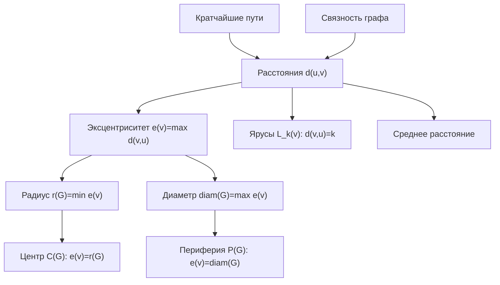

#### 3. Мини-расчет характеристик на примере

Рассмотрим неориентированный невзвешенный граф:


Множество вершин:

\[
V=\{A,B,C,D,E\}.
\]

Множество ребер:

\[
E=\{AB,AC,BD,CD,DE\}.
\]

Граф связный: из любой вершины можно попасть в любую другую. Значит, все расстояния конечны.

##### 3.1. Матрица расстояний

Найдем кратчайшие расстояния между всеми парами вершин.

- Из \(A\): \(d(A,A)=0\), \(d(A,B)=1\), \(d(A,C)=1\), \(d(A,D)=2\), \(d(A,E)=3\).
- Из \(B\): \(d(B,A)=1\), \(d(B,B)=0\), \(d(B,C)=2\), \(d(B,D)=1\), \(d(B,E)=2\).
- Из \(C\): \(d(C,A)=1\), \(d(C,B)=2\), \(d(C,C)=0\), \(d(C,D)=1\), \(d(C,E)=2\).
- Из \(D\): \(d(D,A)=2\), \(d(D,B)=1\), \(d(D,C)=1\), \(d(D,D)=0\), \(d(D,E)=1\).
- Из \(E\): \(d(E,A)=3\), \(d(E,B)=2\), \(d(E,C)=2\), \(d(E,D)=1\), \(d(E,E)=0\).

Матрица расстояний:

|   | A | B | C | D | E |
|---|---:|---:|---:|---:|---:|
| A | 0 | 1 | 1 | 2 | 3 |
| B | 1 | 0 | 2 | 1 | 2 |
| C | 1 | 2 | 0 | 1 | 2 |
| D | 2 | 1 | 1 | 0 | 1 |
| E | 3 | 2 | 2 | 1 | 0 |

##### 3.2. Кратчайшие пути

Примеры кратчайших путей:

- между \(A\) и \(D\): \(A-B-D\) или \(A-C-D\), длина 2;
- между \(A\) и \(E\): \(A-B-D-E\) или \(A-C-D-E\), длина 3;
- между \(B\) и \(C\): \(B-A-C\) или \(B-D-C\), длина 2;
- между \(D\) и \(E\): \(D-E\), длина 1.

Важно, что кратчайший путь может быть не единственным.

##### 3.3. Эксцентриситеты

Эксцентриситет вершины — максимум в соответствующей строке матрицы расстояний:

| Вершина | Расстояния до остальных вершин | Эксцентриситет |
|---|---|---:|
| \(A\) | \(0,1,1,2,3\) | 3 |
| \(B\) | \(1,0,2,1,2\) | 2 |
| \(C\) | \(1,2,0,1,2\) | 2 |
| \(D\) | \(2,1,1,0,1\) | 2 |
| \(E\) | \(3,2,2,1,0\) | 3 |

Значит:

\[
e(A)=3,\quad e(B)=2,\quad e(C)=2,\quad e(D)=2,\quad e(E)=3.
\]

##### 3.4. Радиус, диаметр, центр и периферия

Радиус равен минимальному эксцентриситету:

\[
r(G)=\min\{3,2,2,2,3\}=2.
\]

Диаметр равен максимальному эксцентриситету:

\[
\operatorname{diam}(G)=\max\{3,2,2,2,3\}=3.
\]

Центр графа — вершины с эксцентриситетом 2:

\[
C(G)=\{B,C,D\}.
\]

Периферия графа — вершины с эксцентриситетом 3:

\[
P(G)=\{A,E\}.
\]

Интерпретация: вершины \(B,C,D\) являются наиболее центральными, потому что самая удаленная от каждой из них вершина находится не дальше чем на 2 ребра. Вершины \(A\) и \(E\) периферийные, так как расстояние между ними равно диаметру графа:

\[
d(A,E)=3.
\]

##### 3.5. Ярусы относительно вершины \(D\)

Разобьем вершины на слои по расстоянию от \(D\):

\[
L_0(D)=\{D\},
\]

\[
L_1(D)=\{B,C,E\},
\]

\[
L_2(D)=\{A\}.
\]

Более дальних слоев нет, потому что \(e(D)=2\). Следовательно, все вершины графа находятся от \(D\) на расстоянии не более 2.

Для вершины \(A\) слои будут другими:

\[
L_0(A)=\{A\},\quad L_1(A)=\{B,C\},\quad L_2(A)=\{D\},\quad L_3(A)=\{E\}.
\]

Это согласуется с \(e(A)=3\).

##### 3.6. Среднее расстояние

В графе \(n=5\) вершин, поэтому число неупорядоченных пар вершин:

\[
\frac{n(n-1)}{2}=\frac{5\cdot 4}{2}=10.
\]

Сложим расстояния между всеми различными неупорядоченными парами:

| Пара | Расстояние |
|---|---:|
| \(A,B\) | 1 |
| \(A,C\) | 1 |
| \(A,D\) | 2 |
| \(A,E\) | 3 |
| \(B,C\) | 2 |
| \(B,D\) | 1 |
| \(B,E\) | 2 |
| \(C,D\) | 1 |
| \(C,E\) | 2 |
| \(D,E\) | 1 |

Сумма:

\[
1+1+2+3+2+1+2+1+2+1=16.
\]

Среднее расстояние:

\[
\overline{d}(G)=\frac{16}{10}=1{,}6.
\]

То есть в среднем две вершины данного графа находятся друг от друга на расстоянии 1,6 ребра.

#### 4. Связность и конечность расстояний

Для метрических характеристик принципиально важно, является ли граф связным.

Если граф связный, то:

- между любыми двумя вершинами существует путь;
- все расстояния \(d(u,v)\) конечны;
- эксцентриситет каждой вершины конечен;
- радиус, диаметр, центр, периферия и среднее расстояние определяются обычным образом.

Если граф несвязный, то:

- между вершинами из разных компонент связности пути нет;
- расстояние между такими вершинами равно \(\infty\) или не определено;
- эксцентриситеты могут стать бесконечными;
- радиус и диаметр всего графа в стандартном смысле также могут быть бесконечными;
- на практике метрики часто считают отдельно для каждой компоненты связности.

Например, если к рассмотренному графу добавить изолированную вершину \(F\), то расстояние \(d(A,F)\) не будет конечным, потому что пути из \(A\) в \(F\) нет. Поэтому перед вычислением метрических характеристик обычно сначала проверяют связность графа.

#### 5. Краткий итог

Формы задания графов делятся на списковые, матричные и визуальные. Списки ребер, смежности и инцидентности экономны для разреженных графов и удобны для алгоритмической обработки. Матрица смежности требует больше памяти, но позволяет мгновенно проверять наличие ребра. Матрица инцидентности отражает связь вершин и ребер. Матрицы весов и расстояний применяются для взвешенных графов и метрического анализа.

Метрические характеристики строятся на понятии кратчайшего пути. Расстояния между вершинами позволяют определить эксцентриситеты, радиус, диаметр, центр, периферию, ярусы и среднее расстояние. Для связного графа все эти величины конечны и хорошо определены; для несвязного графа их обычно рассматривают по компонентам связности или вводят специальные соглашения о бесконечных расстояниях.

### Билет 3. Специальные графы: полносвязные, однородные, двудольные, кубические графы, цепи и деревья; дополнения, изоморфизм графов

#### 1. Базовые обозначения

Граф обычно обозначают как

$$
G = (V, E),
$$

где \(V\) — множество вершин, \(E\) — множество ребер. В простом неориентированном графе ребро — это неупорядоченная пара различных вершин \(\{u, v\}\), петли и кратные ребра отсутствуют.

Основные величины:

- \(|V| = n\) — число вершин графа;
- \(|E| = m\) — число ребер графа;
- \(\deg(v)\) — степень вершины \(v\), то есть число ребер, инцидентных вершине \(v\);
- для простого неориентированного графа выполняется лемма о рукопожатиях:

$$
\sum_{v \in V} \deg(v) = 2|E|.
$$

Каждое ребро дает вклад 1 в степень каждого из двух своих концов, поэтому сумма степеней всегда в два раза больше числа ребер.

#### 2. Полный, или полносвязный, граф \(K_n\)

Полный граф \(K_n\) — это простой граф на \(n\) вершинах, в котором каждая пара различных вершин соединена ребром.

Иначе:

$$
E(K_n) = \{\{u, v\}: u, v \in V,\ u \ne v\}.
$$

Свойства полного графа:

- каждая вершина смежна со всеми остальными \(n - 1\) вершинами;
- степень каждой вершины равна

$$
\deg(v) = n - 1;
$$

- число ребер равно числу неупорядоченных пар вершин:

$$
|E(K_n)| = C_n^2 = \frac{n(n - 1)}{2};
$$

- \(K_n\) является \((n - 1)\)-регулярным графом;
- \(K_1\) имеет 0 ребер, \(K_2\) имеет 1 ребро, \(K_3\) — треугольник, \(K_4\) — полный граф на четырех вершинах.

Пример полного графа \(K_4\):

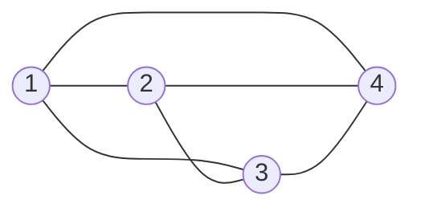

Экзаменационное замечание: если в графе на \(n\) вершинах число ребер равно \(\frac{n(n - 1)}{2}\), то это максимальное возможное число ребер для простого графа. Такой граф обязательно полный.

#### 3. Регулярные, или однородные, графы

Граф называется регулярным, или однородным, степени \(r\), если степени всех его вершин одинаковы и равны \(r\):

$$
\forall v \in V:\ \deg(v) = r.
$$

Такой граф также называют \(r\)-регулярным.

Если граф \(G\) является \(r\)-регулярным и имеет \(n\) вершин, то по лемме о рукопожатиях:

$$
nr = 2|E|,
$$

откуда

$$
|E| = \frac{nr}{2}.
$$

Следствия:

- произведение \(nr\) должно быть четным;
- не существует простого \(r\)-регулярного графа на \(n\) вершинах, если \(nr\) нечетно;
- для простого графа обязательно \(0 \le r \le n - 1\);
- полный граф \(K_n\) является \((n - 1)\)-регулярным;
- цикл \(C_n\) при \(n \ge 3\) является 2-регулярным графом;
- кубический граф — частный случай регулярного графа при \(r = 3\).

Примеры:

- \(K_5\) — 4-регулярный граф;
- квадрат \(C_4\) — 2-регулярный граф;
- граф без ребер на \(n\) вершинах — 0-регулярный граф.

#### 4. Двудольные графы

Граф называется двудольным, если множество его вершин можно разбить на два непересекающихся подмножества \(X\) и \(Y\) так, что каждое ребро соединяет вершину из \(X\) с вершиной из \(Y\). Ребер внутри одной доли быть не должно.

Формально:

$$
V = X \cup Y,\quad X \cap Y = \varnothing,
$$

и для любого ребра \(\{u, v\} \in E\) выполнено:

$$
u \in X,\ v \in Y
$$

или наоборот.

Важный критерий:

> Граф является двудольным тогда и только тогда, когда он не содержит циклов нечетной длины.

Например:

- путь \(P_n\) всегда двудолен;
- четный цикл \(C_{2k}\) двудолен;
- нечетный цикл \(C_{2k+1}\), например треугольник \(C_3\), не является двудольным.

##### Полный двудольный граф \(K_{m,n}\)

Полный двудольный граф \(K_{m,n}\) — это двудольный граф с долями размеров \(m\) и \(n\), в котором каждая вершина первой доли соединена с каждой вершиной второй доли.

Свойства \(K_{m,n}\):

- число вершин:

$$
|V| = m + n;
$$

- число ребер:

$$
|E(K_{m,n})| = mn;
$$

- каждая вершина из доли размера \(m\) имеет степень \(n\);
- каждая вершина из доли размера \(n\) имеет степень \(m\);
- \(K_{m,n}\) является регулярным тогда и только тогда, когда \(m = n\);
- \(K_{1,n}\) — звезда: одна центральная вершина соединена с \(n\) листьями.

Пример полного двудольного графа \(K_{2,3}\):

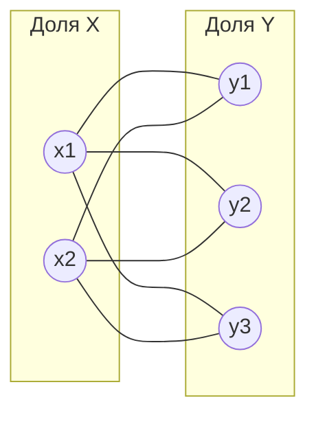

Экзаменационное замечание: двудольность часто проверяют попыткой раскрасить вершины в два цвета так, чтобы концы каждого ребра имели разные цвета. Если возникает противоречие, значит в графе есть нечетный цикл.

#### 5. Кубические графы

Кубический граф — это 3-регулярный граф, то есть граф, в котором степень каждой вершины равна 3:

$$
\forall v \in V:\ \deg(v) = 3.
$$

Если кубический граф имеет \(n\) вершин, то:

$$
\sum_{v \in V} \deg(v) = 3n = 2|E|,
$$

следовательно:

$$
|E| = \frac{3n}{2}.
$$

Отсюда следует, что число вершин кубического графа должно быть четным.

Примеры кубических графов:

- \(K_4\): каждая из 4 вершин имеет степень 3;
- граф куба: 8 вершин, 12 ребер, степень каждой вершины равна 3;
- полный двудольный граф \(K_{3,3}\): 6 вершин, 9 ребер, каждая вершина имеет степень 3.

Экзаменационное замечание: если в задаче сказано, что граф кубический, сразу можно записать \(|E| = \frac{3n}{2}\) и сделать вывод, что \(n\) четно.

#### 6. Цепи, пути и циклы

В разных учебниках термины "цепь" и "путь" могут использоваться немного по-разному, поэтому на экзамене важно уточнять принятую терминологию.

Обычно используют такие определения:

- маршрут — последовательность вершин и ребер, где каждое ребро соединяет соседние вершины последовательности;
- цепь — маршрут, в котором ребра не повторяются;
- простая цепь, или путь, — маршрут, в котором вершины не повторяются;
- замкнутая цепь — цепь, у которой начальная и конечная вершины совпадают;
- цикл — замкнутая цепь, в которой все вершины, кроме первой и последней, различны.

Путь на \(n\) вершинах обозначают \(P_n\). Он имеет:

$$
|V(P_n)| = n,\quad |E(P_n)| = n - 1.
$$

Степени вершин в \(P_n\) при \(n \ge 2\):

- две концевые вершины имеют степень 1;
- остальные \(n - 2\) вершин имеют степень 2.

Цикл на \(n\) вершинах обозначают \(C_n\), где \(n \ge 3\). Он имеет:

$$
|V(C_n)| = n,\quad |E(C_n)| = n.
$$

Каждая вершина цикла имеет степень 2, поэтому \(C_n\) является 2-регулярным графом.

Пример пути \(P_5\) и цикла \(C_5\):

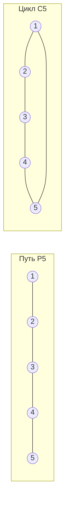

#### 7. Деревья

Дерево — это связный граф без циклов.

Эквивалентные определения дерева для конечного простого графа:

1. \(G\) связен и не содержит циклов.
2. \(G\) связен и имеет \(|E| = |V| - 1\).
3. \(G\) не содержит циклов и имеет \(|E| = |V| - 1\).
4. Между любыми двумя вершинами существует единственный простой путь.
5. Граф минимально связен: удаление любого ребра нарушает связность.
6. Граф максимально ацикличен: добавление любого нового ребра создает цикл.

Если дерево имеет \(n\) вершин, то:

$$
|E| = n - 1.
$$

Лист дерева — вершина степени 1. В любом дереве с \(n \ge 2\) есть хотя бы два листа.

Примеры деревьев:

- путь \(P_n\) является деревом;
- звезда \(K_{1,n}\) является деревом;
- любое дерево двудольно, потому что в нем нет циклов, а значит нет нечетных циклов.

Пример дерева-звезды \(K_{1,4}\):

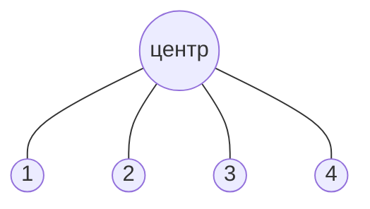

Экзаменационное замечание: если граф связный и в нем \(n - 1\) ребро, то для конечного простого графа этого достаточно, чтобы заключить, что он дерево. Если граф несвязный, равенство \(|E| = n - 1\) само по себе не гарантирует, что граф является деревом.

#### 8. Дополнение графа

Дополнение графа \(G\) обозначают \(\overline{G}\). Это граф на том же множестве вершин, в котором две различные вершины соединены ребром тогда и только тогда, когда они не соединены ребром в исходном графе.

Формально, если \(G = (V, E)\), то:

$$
\overline{G} = (V, \overline{E}),
$$

где

$$
\overline{E} = \{\{u, v\}: u, v \in V,\ u \ne v,\ \{u, v\} \notin E\}.
$$

То есть для каждой пары различных вершин ровно одно из двух утверждений истинно:

- либо \(\{u, v\}\) является ребром \(G\);
- либо \(\{u, v\}\) является ребром \(\overline{G}\).

Свойства дополнения:

- \(G\) и \(\overline{G}\) имеют одно и то же множество вершин;
- объединение ребер \(G\) и \(\overline{G}\) дает полный граф \(K_n\);
- множества ребер \(E(G)\) и \(E(\overline{G})\) не пересекаются;
- если \(|V| = n\), то

$$
|E(G)| + |E(\overline{G})| = \frac{n(n - 1)}{2};
$$

- степень вершины в дополнении:

$$
\deg_{\overline{G}}(v) = n - 1 - \deg_G(v);
$$

- дополнение полного графа \(K_n\) — пустой граф на \(n\) вершинах;
- дополнение пустого графа на \(n\) вершинах — полный граф \(K_n\).

Пример: дополнение пути \(P_4\). В \(P_4\) есть ребра \(12\), \(23\), \(34\). В дополнении на тех же вершинах остаются ребра \(13\), \(14\), \(24\).

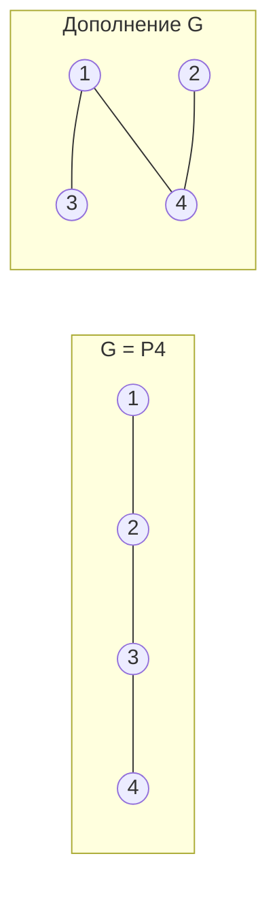

Экзаменационное замечание: при построении дополнения нельзя добавлять петли. Вершина не соединяется сама с собой ни в простом графе, ни в его дополнении.

#### 9. Изоморфизм графов

Два графа \(G_1 = (V_1, E_1)\) и \(G_2 = (V_2, E_2)\) называются изоморфными, если существует биекция

$$
f: V_1 \to V_2
$$

такая, что для любых вершин \(u, v \in V_1\):

$$
\{u, v\} \in E_1 \iff \{f(u), f(v)\} \in E_2.
$$

То есть изоморфизм — это переименование вершин, при котором полностью сохраняется структура смежности.

Важно:

- биекция означает взаимно однозначное соответствие вершин;
- смежные вершины должны переходить в смежные;
- несмежные вершины должны переходить в несмежные;
- изоморфные графы имеют одинаковую структуру, хотя могут быть нарисованы по-разному и вершины могут иметь разные имена.

Пример изоморфных графов: оба графа являются циклом длины 4.

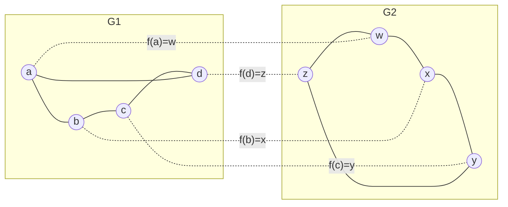

Здесь можно задать биекцию:

$$
f(a)=w,\quad f(b)=x,\quad f(c)=y,\quad f(d)=z.
$$

Она сохраняет все ребра: \(ab \mapsto wx\), \(bc \mapsto xy\), \(cd \mapsto yz\), \(da \mapsto zw\).

#### 10. Инварианты изоморфизма

Инвариант графа — характеристика, которая не меняется при изоморфизме.

Если графы изоморфны, то у них обязательно совпадают:

- число вершин;
- число ребер;
- набор степеней вершин, то есть степенная последовательность;
- число компонент связности;
- связность или несвязность;
- наличие циклов;
- число циклов заданной длины, например число треугольников;
- двудольность;
- регулярность и степень регулярности;
- число листьев;
- диаметр, радиус, расстояния между вершинами с учетом структуры;
- размеры максимальных клик и независимых множеств.

Степенная последовательность — это степени всех вершин, обычно записанные в невозрастающем порядке. Например, если степени вершин равны \(3, 1, 2, 2\), то степенная последовательность:

$$
(3, 2, 2, 1).
$$

Важно: совпадение инвариантов не всегда доказывает изоморфизм, но несовпадение хотя бы одного инварианта сразу доказывает неизоморфность.

Пример неизоморфных графов с одинаковым числом вершин и ребер:

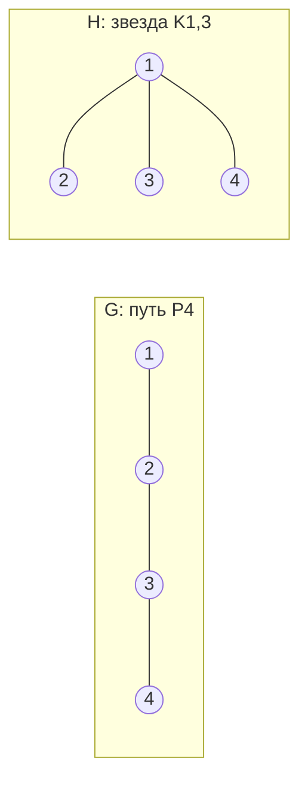

Оба графа имеют 4 вершины и 3 ребра, но они не изоморфны:

- у \(P_4\) степенная последовательность \((2, 2, 1, 1)\);
- у \(K_{1,3}\) степенная последовательность \((3, 1, 1, 1)\).

Так как степенные последовательности различаются, изоморфизма быть не может.

#### 11. Как доказывать изоморфизм

Чтобы доказать, что два графа изоморфны, нужно явно построить биекцию между их вершинами и проверить сохранение смежности.

Алгоритм рассуждения:

1. Проверить, что числа вершин и ребер совпадают.
2. Сравнить степенные последовательности.
3. Подобрать соответствие вершин одинаковых степеней.
4. Проверить, что каждое ребро первого графа переходит в ребро второго.
5. Проверить, что несмежность также сохраняется, либо сослаться на то, что биекция сохраняет все ребра и число ребер совпадает.

Схема проверки:

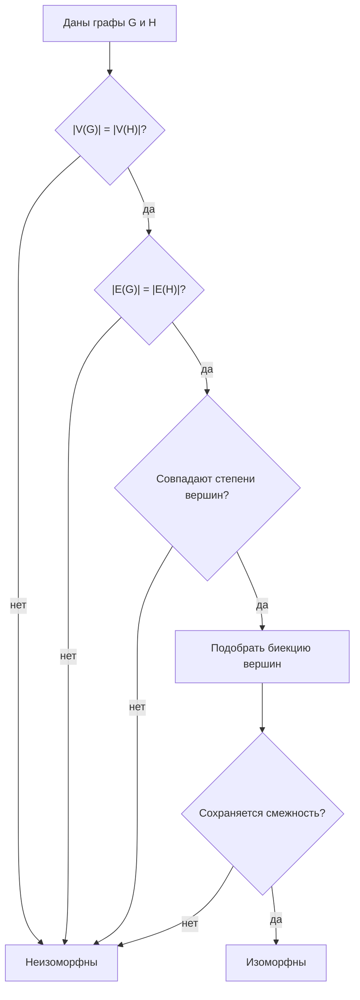

Пример доказательства:

Пусть \(G\) — квадрат с вершинами \(1,2,3,4\), а \(H\) — квадрат с вершинами \(a,b,c,d\). Если ребра:

$$
E(G)=\{12,23,34,41\},
$$

$$
E(H)=\{ab,bc,cd,da\},
$$

то отображение

$$
f(1)=a,\quad f(2)=b,\quad f(3)=c,\quad f(4)=d
$$

является изоморфизмом, потому что каждое ребро \(G\) переходит в соответствующее ребро \(H\).

#### 12. Как опровергать изоморфизм

Чтобы доказать, что графы не изоморфны, достаточно найти хотя бы один инвариант, который у них различается.

Чаще всего проверяют:

1. число вершин;
2. число ребер;
3. степенную последовательность;
4. число компонент связности;
5. наличие мостов или точек сочленения;
6. число треугольников или циклов заданной длины;
7. двудольность;
8. число вершин определенной степени, например число листьев.

Пример:

- граф \(C_4\) имеет 4 вершины, 4 ребра и является 2-регулярным;
- граф, состоящий из треугольника и одной изолированной вершины, тоже имеет 4 вершины, но только 3 ребра.

Так как число ребер различается, эти графы не изоморфны.

Более тонкий пример: два графа могут иметь одинаковые числа вершин, ребер и одинаковую степенную последовательность, но все равно быть неизоморфными. Тогда нужно смотреть более сильные инварианты: связность, циклы, расстояния, расположение вершин одинаковых степеней, число треугольников, структуру окрестностей.

#### 13. Связь специальных графов между собой

Краткая сводка:

| Граф | Основная характеристика | Число ребер |
|---|---|---|
| \(K_n\) | каждая пара вершин соединена | \(\frac{n(n-1)}{2}\) |
| \(r\)-регулярный | все степени равны \(r\) | \(\frac{nr}{2}\) |
| \(K_{m,n}\) | полный двудольный граф | \(mn\) |
| кубический граф | все степени равны 3 | \(\frac{3n}{2}\) |
| путь \(P_n\) | простая цепь из \(n\) вершин | \(n-1\) |
| цикл \(C_n\) | замкнутый путь из \(n\) вершин | \(n\) |
| дерево | связный ациклический граф | \(n-1\) |

Полезные связи:

- \(K_n\) является \((n - 1)\)-регулярным;
- \(C_n\) является 2-регулярным;
- \(K_{n,n}\) является \(n\)-регулярным;
- \(K_{3,3}\) является кубическим;
- \(K_4\) является кубическим;
- любое дерево двудольно;
- любой путь является деревом;
- любой цикл не является деревом, потому что содержит цикл;
- дополнение полного графа пусто;
- изоморфизм сохраняет все перечисленные свойства.

#### 14. Типовые экзаменационные вопросы и ответы

**Почему в полном графе \(K_n\) ровно \(\frac{n(n-1)}{2}\) ребер?**

Потому что каждое ребро соответствует паре различных вершин. Число таких пар равно \(C_n^2 = \frac{n(n-1)}{2}\).

**Может ли существовать 3-регулярный граф на 5 вершинах?**

Нет. Для кубического графа \(3n = 2|E|\). При \(n=5\) получаем \(15 = 2|E|\), что невозможно, так как левая часть нечетна, а правая четна.

**Почему нечетный цикл не двудолен?**

Если раскрашивать вершины нечетного цикла в два цвета по очереди, то последняя вершина окажется того же цвета, что и первая, хотя они смежны. Это противоречит определению двудольного графа.

**Почему дерево с \(n\) вершинами имеет \(n-1\) ребро?**

Интуитивно дерево строится добавлением вершин по одной: каждая новая вершина должна быть соединена ровно одним ребром с уже построенной частью, иначе либо граф останется несвязным, либо появится цикл. Формально это доказывается индукцией по числу вершин.

**Достаточно ли совпадения степенных последовательностей для изоморфизма?**

Нет. Совпадение степенных последовательностей является необходимым условием, но не достаточным. Для доказательства изоморфизма нужно построить биекцию вершин и проверить сохранение смежности.

**Как быстро доказать, что графы неизоморфны?**

Нужно найти различающийся инвариант: число вершин, число ребер, степени, число компонент, наличие треугольников, двудольность, число листьев и т.д.

#### 15. Короткий план ответа на экзамене

1. Дать определение простого графа, степени вершины и лемму о рукопожатиях.
2. Определить \(K_n\), записать \(\deg(v)=n-1\) и \(|E|=\frac{n(n-1)}{2}\).
3. Определить регулярный граф и формулу \(|E|=\frac{nr}{2}\).
4. Определить двудольный граф и \(K_{m,n}\), записать \(|E|=mn\), упомянуть критерий отсутствия нечетных циклов.
5. Определить кубический граф и вывести \(|E|=\frac{3n}{2}\).
6. Объяснить цепь, путь, цикл, дерево и формулу для дерева \(|E|=n-1\).
7. Дать определение дополнения графа и формулы для числа ребер и степеней в дополнении.
8. Дать определение изоморфизма через биекцию вершин и сохранение смежности.
9. Перечислить инварианты и объяснить, как доказывать и опровергать изоморфизм.

### Билет 4. Связность графов; понятие разреза, параметры вершинной и реберной связности; алгоритмы нахождения компонент связности

#### 1. Связность графов

Связность описывает, можно ли переходить между вершинами графа по его ребрам или дугам.

Пусть дан неориентированный граф `G = (V, E)`, где `V` - множество вершин, `E` - множество ребер. Путь между вершинами `u` и `v` - последовательность вершин

```text
u = v0, v1, ..., vk = v,
```

такая, что каждая соседняя пара `vi, vi+1` соединена ребром.

Неориентированный граф называется связным, если для любых двух вершин `u, v in V` существует путь из `u` в `v`.

Если такой путь существует не для всех пар вершин, граф несвязен. Тогда он распадается на несколько максимальных связных частей - компонент связности.

##### Примеры

- Цепь `1 - 2 - 3 - 4` связна.
- Граф с ребрами `{(1,2), (2,3), (4,5)}` несвязен: вершины `{1,2,3}` образуют одну компоненту, а `{4,5}` - другую.
- Изолированная вершина тоже является компонентой связности из одной вершины.

#### 2. Связность в ориентированных графах

Пусть дан ориентированный граф `D = (V, A)`, где `A` - множество дуг. В ориентированном графе важно направление дуг.

##### Сильная связность

Ориентированный граф называется сильно связным, если для любых двух вершин `u` и `v`:

- существует ориентированный путь из `u` в `v`;
- существует ориентированный путь из `v` в `u`.

Иначе говоря, из каждой вершины можно добраться в каждую другую с учетом направлений дуг.

Максимальное по включению множество вершин, внутри которого любые две вершины взаимно достижимы, называется сильно связной компонентой, или SCC, от английского `strongly connected component`.

Пример сильно связной компоненты: цикл `1 -> 2 -> 3 -> 1`.

##### Слабая связность

Ориентированный граф называется слабо связным, если после замены всех дуг неориентированными ребрами получается связный неориентированный граф.

То есть для слабой связности направления дуг временно игнорируются.

Пример:

```text
1 -> 2 <- 3
```

Этот ориентированный граф не является сильно связным: например, из `2` нельзя добраться в `1` или `3`. Но он слабо связен, потому что если забыть направления, получится связная цепь `1 - 2 - 3`.

#### 3. Компоненты связности

Компонента связности неориентированного графа - это максимальный по включению связный подграф.

Иными словами, множество вершин `C subseteq V` является компонентой связности, если:

1. любые две вершины из `C` соединены путем;
2. нельзя добавить в `C` никакую другую вершину графа, сохранив свойство связности.

Компоненты связности попарно не пересекаются и вместе покрывают все множество вершин `V`.

Если граф имеет ровно одну компоненту связности, он связен. Если компонент больше одной, он несвязен.

#### 4. Разрезы

Разрез - это способ разделить граф на части удалением некоторых вершин или ребер.

##### Реберный разрез

Реберным разрезом называется множество ребер, удаление которых нарушает связность графа, то есть увеличивает число компонент связности.

Часто разрез задают через разбиение множества вершин на две непустые части:

```text
V = S union (V \ S), где S != empty и V \ S != empty.
```

Тогда реберный разрез `delta(S)` - это множество всех ребер, имеющих один конец в `S`, а другой в `V \ S`.

Взвешенный вариант: если ребрам заданы пропускные способности или веса, то вес разреза равен сумме весов ребер, пересекающих это разбиение.

##### Вершинный разрез

Вершинным разрезом называется множество вершин, удаление которых вместе с инцидентными им ребрами делает граф несвязным.

Обычно при определении вершинной связности не рассматривают удаление всех вершин сразу и отдельно оговаривают случаи малых графов.

Пример: если граф состоит из двух циклов, соединенных одной общей вершиной `x`, то удаление `x` разделит граф на две части. Значит, `{x}` - вершинный разрез.

##### Связь с разделением пар вершин

Разрез часто рассматривают не только как глобальное разрушение связности графа, но и как разделение двух заданных вершин `s` и `t`.

- `s-t` реберный разрез - множество ребер, после удаления которых нет пути из `s` в `t`.
- `s-t` вершинный разрез - множество вершин, после удаления которых нет пути из `s` в `t`.

Такие разрезы особенно важны в задачах потоков и надежности сетей.

#### 5. Мосты и точки сочленения

##### Мост

Мостом в неориентированном графе называется ребро, удаление которого увеличивает число компонент связности.

Иначе говоря, мост - это ребро, через которое проходит вся связь между некоторыми двумя частями графа.

Свойство:

- ребро является мостом тогда и только тогда, когда оно не принадлежит ни одному циклу.

Если ребро лежит на цикле, то после его удаления связь между его концами сохраняется по оставшейся части цикла.

##### Точка сочленения

Точкой сочленения, или артикуляционной вершиной, называется вершина, удаление которой увеличивает число компонент связности графа.

Пример: в цепи `1 - 2 - 3` вершина `2` является точкой сочленения, потому что после ее удаления вершины `1` и `3` окажутся в разных компонентах.

В цикле точек сочленения нет: удаление одной вершины не разрушает связность оставшихся вершин.

#### 6. Вершинная и реберная связность

##### Вершинная связность `kappa(G)`

Вершинная связность графа `kappa(G)` - это минимальное число вершин, удаление которых делает граф несвязным.

Для связного графа:

```text
kappa(G) = min размер вершинного разреза.
```

Если граф уже несвязен, обычно считают `kappa(G) = 0`.

Интуитивный смысл: `kappa(G)` показывает, сколько вершин нужно вывести из строя, чтобы разрушить связность сети.

Примеры:

- Для цепи длины хотя бы 2: `kappa(G) = 1`.
- Для цикла `C_n`, `n >= 3`: `kappa(G) = 2`.
- Для полного графа `K_n`: `kappa(K_n) = n - 1`, потому что надо удалить `n - 1` вершин, чтобы оставшаяся часть перестала быть связной в нетривиальном смысле.

##### Реберная связность `lambda(G)`

Реберная связность графа `lambda(G)` - это минимальное число ребер, удаление которых делает граф несвязным.

Для связного графа:

```text
lambda(G) = min размер реберного разреза.
```

Если граф уже несвязен, обычно считают `lambda(G) = 0`.

Интуитивный смысл: `lambda(G)` показывает, сколько каналов связи нужно удалить, чтобы сеть распалась.

Примеры:

- Если в графе есть мост, то `lambda(G) = 1`.
- Для цикла `C_n`, `n >= 3`: `lambda(G) = 2`.
- Для полного графа `K_n`: `lambda(K_n) = n - 1`.

##### Минимальная степень `delta(G)`

`delta(G)` - минимальная степень вершины графа:

```text
delta(G) = min deg(v), v in V.
```

Если взять вершину минимальной степени и удалить все инцидентные ей ребра, эта вершина станет изолированной. Поэтому связность графа нельзя быть больше `delta(G)` в реберном смысле.

##### Неравенство между параметрами

Для любого связного неориентированного графа справедливо:

```text
kappa(G) <= lambda(G) <= delta(G).
```

Смысл неравенства:

- `lambda(G) <= delta(G)`: достаточно удалить все ребра, инцидентные вершине минимальной степени, чтобы изолировать ее.
- `kappa(G) <= lambda(G)`: вершинное разрушение не сложнее реберного в минимальном смысле; из минимального реберного разреза можно получить ограничение на число вершин, через которые этот разрез соединяет части графа.

Важно: равенство выполняется не всегда.

Пример строгого различия:

- В графе с мостом: `lambda(G) = 1`, а `delta(G)` может быть больше `1` в некоторых частях графа, но если есть висячая вершина, то `delta(G) = 1`.
- В графах с узкой вершинной перемычкой может быть `kappa(G) = 1`, но `lambda(G) > 1`.

#### 7. Диаграмма: компоненты, мост и разрез

На схеме вершины `A, B, C, D, E` образуют одну компоненту, вершины `F, G, H` - вторую. Ребро `C-D` является мостом внутри первой компоненты: если удалить его, часть `{D,E}` отделится от `{A,B,C}`. Ребра между множествами `S` и `T` образуют реберный разрез.

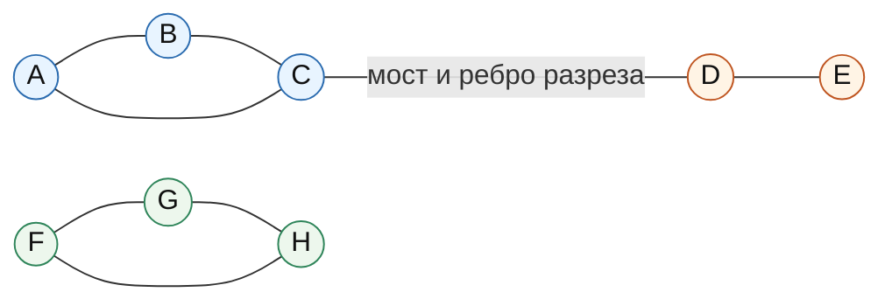

#### 8. Алгоритм нахождения компонент связности в неориентированном графе

Компоненты связности можно найти с помощью обхода в глубину `DFS` или обхода в ширину `BFS`.

Идея:

1. Все вершины сначала непосещенные.
2. Перебираем вершины графа.
3. Если вершина еще не посещена, запускаем из нее `DFS` или `BFS`.
4. Все вершины, достигнутые этим запуском, образуют одну компоненту связности.
5. Повторяем, пока все вершины не будут посещены.

##### Псевдокод DFS

```text
components = []
visited[v] = false для всех v

for v in V:
    if not visited[v]:
        current_component = []
        dfs(v)
        components.append(current_component)

dfs(v):
    visited[v] = true
    current_component.append(v)
    for to in adj[v]:
        if not visited[to]:
            dfs(to)
```

##### Псевдокод BFS

```text
components = []
visited[v] = false для всех v

for v in V:
    if not visited[v]:
        current_component = []
        queue = [v]
        visited[v] = true

        while queue not empty:
            x = queue.pop_front()
            current_component.append(x)

            for to in adj[x]:
                if not visited[to]:
                    visited[to] = true
                    queue.push_back(to)

        components.append(current_component)
```

##### Сложность

При хранении графа списками смежности:

```text
O(|V| + |E|)
```

Каждая вершина посещается один раз, каждое ребро просматривается не более двух раз в неориентированном графе.

При матрице смежности сложность обхода обычно:

```text
O(|V|^2)
```

потому что для каждой вершины приходится просматривать всю строку матрицы.

#### 9. Диаграмма: схема DFS/BFS для компонент связности

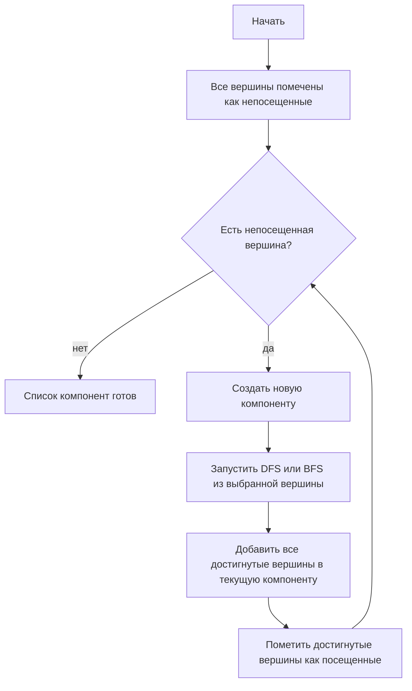

#### 10. Сильно связные компоненты в ориентированном графе

Для ориентированных графов обычные компоненты связности не отражают направления дуг. Поэтому часто ищут сильно связные компоненты.

##### Алгоритм Косарайю

Алгоритм Косарайю находит все SCC за два обхода DFS.

Идея:

1. Выполнить DFS в исходном графе и записать вершины в порядке завершения обработки.
2. Построить транспонированный граф `G^T`, в котором все дуги обращены.
3. Перебирать вершины в порядке убывания времени завершения из первого DFS.
4. Запускать DFS в транспонированном графе из еще не посещенных вершин.
5. Каждая такая область достижимости в `G^T` является одной SCC.

Сложность:

```text
O(|V| + |E|)
```

если граф хранится списками смежности и транспонированный граф строится за линейное время.

Память:

```text
O(|V| + |E|)
```

если явно хранить транспонированный граф.

##### Алгоритм Тарьяна для SCC

Алгоритм Тарьяна находит SCC за один DFS, используя:

- `tin[v]` или `disc[v]` - время входа в вершину;
- `low[v]` - минимальное время входа вершины, достижимой из `v` по дереву DFS и обратным/внутренним дугам;
- стек активных вершин текущего DFS.

Идея:

1. Запускаем DFS.
2. При входе в вершину кладем ее в стек.
3. Пересчитываем `low[v]` по дугам из `v`.
4. Если `low[v] == tin[v]`, то `v` является корнем SCC.
5. Снимаем вершины со стека до `v`; снятое множество образует одну SCC.

Сложность:

```text
O(|V| + |E|)
```

Память:

```text
O(|V|)
```

без учета хранения самого графа.

#### 11. Поиск мостов через `tin` и `low`

Мосты в неориентированном графе можно найти одним DFS.

Для каждой вершины `v` храним:

- `tin[v]` - время входа в вершину при DFS;
- `low[v]` - минимальное `tin`, достижимое из `v` или из потомков `v` по дереву DFS, если разрешить пройти не более одного обратного ребра.

При обходе ребра дерева DFS `v - to`, где `to` - потомок `v`, после обработки `to` проверяем:

```text
если low[to] > tin[v], то ребро (v, to) - мост.
```

Почему это верно:

- `low[to] > tin[v]` означает, что из поддерева `to` нельзя попасть в `v` или в предков `v` по обратному ребру;
- значит, единственная связь поддерева `to` с остальным графом идет через ребро `(v, to)`;
- удаление этого ребра отделит поддерево, поэтому ребро является мостом.

##### Псевдокод

```text
timer = 0
visited[v] = false для всех v

dfs(v, parent):
    visited[v] = true
    tin[v] = low[v] = timer
    timer += 1

    for to in adj[v]:
        if to == parent:
            continue

        if visited[to]:
            low[v] = min(low[v], tin[to])
        else:
            dfs(to, v)
            low[v] = min(low[v], low[to])

            if low[to] > tin[v]:
                (v, to) является мостом
```

Сложность:

```text
O(|V| + |E|)
```

Память:

```text
O(|V|)
```

без учета хранения графа.

Замечание: если в графе есть кратные ребра, условие `to == parent` нужно обрабатывать аккуратнее, например хранить идентификаторы ребер, иначе можно ошибочно принять одно из параллельных ребер за мост.

#### 12. Поиск точек сочленения через `tin` и `low`

Точки сочленения также находятся одним DFS.

Для вершины `v`, не являющейся корнем DFS-дерева, условие точки сочленения:

```text
существует потомок to такой, что low[to] >= tin[v].
```

Это означает, что поддерево `to` не имеет обратного ребра в строгого предка `v`. Если удалить `v`, это поддерево отделится.

Для корня DFS-дерева правило особое:

```text
корень является точкой сочленения тогда и только тогда,
когда у него есть хотя бы два ребенка в DFS-дереве.
```

Почему для корня отдельное условие:

- у корня нет предков;
- если из корня выросли два независимых DFS-поддерева, то между ними нет ребер, иначе DFS присоединил бы их в одно поддерево;
- удаление корня разделит эти поддеревья.

##### Псевдокод

```text
timer = 0
visited[v] = false для всех v

dfs(v, parent):
    visited[v] = true
    tin[v] = low[v] = timer
    timer += 1
    children = 0

    for to in adj[v]:
        if to == parent:
            continue

        if visited[to]:
            low[v] = min(low[v], tin[to])
        else:
            dfs(to, v)
            low[v] = min(low[v], low[to])

            if low[to] >= tin[v] and parent != none:
                v является точкой сочленения

            children += 1

    if parent == none and children > 1:
        v является точкой сочленения
```

Сложность:

```text
O(|V| + |E|)
```

Память:

```text
O(|V|)
```

без учета хранения графа.

#### 13. Диаграмма: логика `tin/low` для мостов и точек сочленения

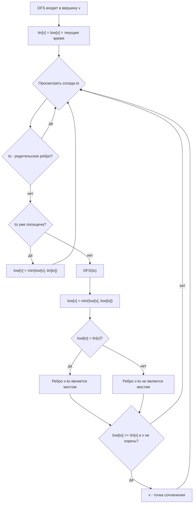

#### 14. Связь разрезов с max-flow/min-cut

В ориентированных и неориентированных сетях с пропускными способностями разрезы тесно связаны с потоками.

Пусть есть сеть с источником `s`, стоком `t` и пропускными способностями ребер. `s-t` разрезом называется разбиение вершин на две части:

```text
S и T = V \ S,
где s in S, t in T.
```

Пропускная способность разреза - сумма пропускных способностей всех дуг из `S` в `T`.

Теорема Форда-Фалкерсона о максимальном потоке и минимальном разрезе:

```text
величина максимального s-t потока равна пропускной способности минимального s-t разреза.
```

Практический смысл:

- если нужно найти минимальный набор ребер, отделяющий `s` от `t`, можно построить потоковую сеть;
- после нахождения максимального потока остаточная сеть показывает минимальный разрез;
- вершины, достижимые из `s` в остаточной сети, образуют сторону `S`, остальные вершины - сторону `T`;
- ребра исходной сети из `S` в `T` дают минимальный разрез.

##### Использование для реберных разрезов

Если все ребра имеют единичную пропускную способность, минимальный `s-t` разрез равен минимальному числу ребер, которые надо удалить, чтобы отделить `s` от `t`.

Для поиска глобальной реберной связности можно рассматривать минимальные разрезы между различными парами вершин или использовать специализированные алгоритмы, например алгоритм Стоера-Вагнера для неориентированного глобального минимального разреза.

##### Использование для вершинных разрезов

Вершинный разрез можно свести к реберному разрезу через расщепление вершин:

1. Каждую вершину `v` заменяют двумя вершинами `v_in` и `v_out`.
2. Добавляют ребро `v_in -> v_out` с пропускной способностью, равной цене удаления вершины. Для обычного случая цена равна `1`.
3. Каждое исходное ребро или дугу перенаправляют через соответствующие `out` и `in` вершины.
4. Минимальный разрез в новой сети соответствует минимальному набору удаляемых вершин.

Такой прием позволяет искать минимальные вершинные `s-t` разрезы с помощью алгоритмов максимального потока.

##### Сложность потокового подхода

Сложность зависит от выбранного алгоритма максимального потока:

- Форд-Фалкерсон: `O(E * F)` для целочисленных пропускных способностей, где `F` - величина максимального потока; при иррациональных пропускных способностях возможны проблемы с завершением.
- Эдмондс-Карп: `O(V * E^2)`.
- Диниц: обычно указывается `O(V^2 * E)` в общем случае; для некоторых классов сетей есть более сильные оценки.

#### 15. Краткая таблица алгоритмов

| Задача | Граф | Основная идея | Сложность |
|---|---|---|---|
| Компоненты связности | Неориентированный | Запуски DFS/BFS из непосещенных вершин | `O(V + E)` |
| Слабые компоненты | Ориентированный | Игнорировать направления дуг и запустить DFS/BFS | `O(V + E)` |
| SCC, Косарайю | Ориентированный | DFS, транспонированный граф, второй DFS по порядку завершения | `O(V + E)` |
| SCC, Тарьян | Ориентированный | Один DFS, стек, значения `tin/low` | `O(V + E)` |
| Мосты | Неориентированный | DFS и условие `low[to] > tin[v]` | `O(V + E)` |
| Точки сочленения | Неориентированный | DFS и условие `low[to] >= tin[v]` | `O(V + E)` |
| Минимальный `s-t` реберный разрез | Сеть | Max-flow/min-cut | зависит от max-flow |
| Минимальный `s-t` вершинный разрез | Сеть | Расщепление вершин + max-flow/min-cut | зависит от max-flow |

Здесь `V = |V|`, `E = |E|`.

#### 16. Главное для ответа на экзамене

Связность в неориентированном графе означает существование пути между любой парой вершин. Если граф несвязен, он распадается на компоненты связности, которые находятся линейным DFS или BFS.

В ориентированном графе различают сильную связность, где достижимость должна быть взаимной с учетом направлений дуг, и слабую связность, где направления игнорируются. Сильно связные компоненты находят алгоритмами Косарайю или Тарьяна за `O(V + E)`.

Разрез - это множество ребер или вершин, удаление которого разделяет граф. Минимальный размер вершинного разреза задает вершинную связность `kappa(G)`, а минимальный размер реберного разреза - реберную связность `lambda(G)`. Для связного графа выполняется фундаментальное неравенство:

```text
kappa(G) <= lambda(G) <= delta(G).
```

Мост - ребро, удаление которого увеличивает число компонент. Точка сочленения - вершина с тем же свойством. И мосты, и точки сочленения эффективно находятся одним DFS с временами входа `tin` и значениями `low`.

Разрезы также связаны с потоками: по теореме max-flow/min-cut величина максимального потока из `s` в `t` равна емкости минимального `s-t` разреза. Поэтому задачи о минимальных реберных и вершинных разрезах можно решать через алгоритмы максимального потока, а вершинный разрез сводить к реберному с помощью расщепления вершин.

### Билет 5. Эйлеровы графы

#### 1. Основные определения

Пусть дан граф \(G = (V, E)\). В этом билете важны не вершины, а ребра: эйлеровость описывает возможность пройти по всем ребрам графа ровно один раз.

**Маршрут** - последовательность вершин и ребер
\[
v_0, e_1, v_1, e_2, \ldots, e_k, v_k,
\]
где каждое ребро \(e_i\) соединяет соседние вершины \(v_{i-1}\) и \(v_i\). В ориентированном графе направление каждого ребра должно совпадать с направлением движения.

**Цепь** - маршрут, в котором ребра не повторяются. Вершины при этом могут повторяться.

**Эйлерова цепь** или **эйлеров путь** - цепь, проходящая по каждому ребру графа ровно один раз. В разных курсах термины "путь" и "цепь" могут различаться строже, но в теме эйлеровых графов обычно имеется в виду именно отсутствие повторения ребер.

**Эйлеров цикл** - замкнутая эйлерова цепь, то есть цепь, которая проходит по каждому ребру ровно один раз и заканчивается в той же вершине, где началась.

**Эйлеров граф** - граф, в котором существует эйлеров цикл.

**Полуэйлеров граф** - граф, в котором существует эйлерова цепь, но не обязательно эйлеров цикл. Для неориентированного графа это обычно случай ровно двух вершин нечетной степени.

#### 2. Отличие от гамильтонова графа

Эйлеровы и гамильтоновы задачи похожи формулировкой, но принципиально различаются объектом обхода.

| Понятие | Что должно быть пройдено ровно один раз | Что может повторяться | Типичная сложность проверки |
|---|---|---|---|
| Эйлеров путь/цикл | Все ребра | Вершины могут повторяться | Проверяется простыми условиями на степени и связность |
| Гамильтонов путь/цикл | Все вершины | Ребра выбираются не все, вершины не повторяются | В общем случае задача NP-полная |

Пример: граф может быть эйлеровым, но не гамильтоновым, и наоборот. Эйлеровость определяется локальными степенями вершин и связностью нужной части графа. Для гамильтоновости такого простого полного критерия в общем случае нет.

#### 3. Условия существования в неориентированном графе

Рассмотрим неориентированный граф \(G\). Вершины степени 0, то есть изолированные вершины, не мешают эйлерову обходу, потому что в них нет ребер, которые надо проходить.

Поэтому связность проверяется не для всего множества вершин, а для части графа, содержащей ребра.

##### 3.1. Связность по ребрам

Граф должен быть связен по ребрам: все вершины ненулевой степени должны лежать в одной компоненте связности.

Иными словами, если удалить все изолированные вершины, оставшийся граф должен быть связным.

Если это условие нарушено, пройти все ребра одним непрерывным маршрутом невозможно: после обхода ребер одной компоненты нельзя перейти в другую.

##### 3.2. Эйлеров цикл

Неориентированный граф имеет эйлеров цикл тогда и только тогда, когда:

1. Все вершины ненулевой степени лежат в одной компоненте связности.
2. Степень каждой вершины четна.

Почему нужны четные степени: если вершина не является начальной и конечной отдельно, то каждый вход в нее должен быть "скомпенсирован" выходом из нее. В цикле начальная вершина тоже одновременно является конечной, поэтому и для нее ребра разбиваются на пары "вошли - вышли". Значит, каждая степень четна.

##### 3.3. Эйлерова цепь без замыкания

Неориентированный граф имеет эйлерову цепь тогда и только тогда, когда:

1. Все вершины ненулевой степени лежат в одной компоненте связности.
2. Количество вершин нечетной степени равно 0 или 2.

Возможны два случая:

- **0 нечетных вершин**: существует эйлеров цикл; эйлерову цепь можно начать в любой вершине ненулевой степени.
- **2 нечетные вершины**: существует незамкнутая эйлерова цепь; она должна начинаться в одной нечетной вершине и заканчиваться в другой.

Если нечетных вершин больше двух, эйлеровой цепи нет.

#### 4. Условия существования в ориентированном графе

Для ориентированного графа вместо обычной степени рассматривают:

- \(\deg^+(v)\) - исходящая степень вершины \(v\), количество дуг, выходящих из \(v\);
- \(\deg^-(v)\) - входящая степень вершины \(v\), количество дуг, входящих в \(v\).

Вершины с \(\deg^+(v) + \deg^-(v) = 0\) можно игнорировать при проверке связности.

##### 4.1. Ориентированный эйлеров цикл

Ориентированный граф имеет эйлеров цикл тогда и только тогда, когда:

1. Для каждой вершины выполнен баланс:
   \[
   \deg^+(v) = \deg^-(v).
   \]
2. Все вершины с ненулевой суммарной степенью принадлежат одной сильно связной части графа.

Сильная связность нужной части означает, что между любыми двумя вершинами, которые участвуют в ребрах, есть ориентированный путь в обе стороны. Изолированные вершины не учитываются.

Иногда критерий формулируют так: после удаления изолированных вершин граф должен быть сильно связным, а входящие и исходящие степени всех вершин должны совпадать.

##### 4.2. Ориентированная эйлерова цепь без замыкания

Ориентированный граф имеет эйлерову цепь из \(s\) в \(t\), где \(s \ne t\), тогда и только тогда, когда:

1. Для начальной вершины \(s\):
   \[
   \deg^+(s) = \deg^-(s) + 1.
   \]
2. Для конечной вершины \(t\):
   \[
   \deg^-(t) = \deg^+(t) + 1.
   \]
3. Для всех остальных вершин:
   \[
   \deg^+(v) = \deg^-(v).
   \]
4. Вершины, участвующие в ребрах, лежат в одной связной части с учетом направлений. Удобная строгая проверка: если добавить искусственную дугу \(t \to s\), то в полученном графе все вершины ненулевой степени должны лежать в одной сильно связной компоненте.

Если все вершины сбалансированы, то это случай эйлерова цикла. Если есть ровно одна вершина с избытком исходящей степени на 1 и ровно одна вершина с избытком входящей степени на 1, то возможна незамкнутая цепь.

#### 5. Пример эйлерова графа

Рассмотрим неориентированный граф с ребрами:
\[
AB,\ BC,\ CA,\ CD,\ DE,\ EC.
\]

Это две треугольные части, склеенные по вершине \(C\). Степени вершин:

| Вершина | Степень |
|---|---:|
| A | 2 |
| B | 2 |
| C | 4 |
| D | 2 |
| E | 2 |

Все степени четные, а все вершины ненулевой степени лежат в одной компоненте связности. Значит, граф эйлеров.

Один из эйлеровых циклов:
\[
A \to B \to C \to D \to E \to C \to A.
\]

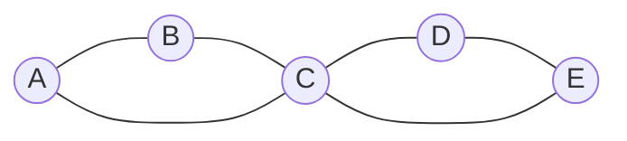

Если из этого графа удалить ребро \(CA\), то степени \(A\) и \(C\) станут нечетными. Тогда эйлерова цепь еще существует, но уже не цикл: она должна начинаться в одной из нечетных вершин и заканчиваться в другой.

#### 6. Алгоритм Хиерхольцера

Алгоритм Хиерхольцера - основной эффективный алгоритм построения эйлерова цикла. Он работает за линейное время по числу ребер при правильном хранении графа.

Идея:

1. Начать из любой вершины с ненулевой степенью.
2. Идти по еще не использованным ребрам, пока не вернемся в начальную вершину. Получится первый цикл.
3. Если в построенном цикле есть вершина, из которой выходит неиспользованное ребро, начать из нее новый цикл по неиспользованным ребрам.
4. Вклеить новый цикл в уже построенный маршрут в той вершине, где он начался.
5. Повторять, пока все ребра не будут использованы.

Алгоритм корректен, потому что в эйлеровом графе степени четные. Если мы вошли в некоторую вершину по неиспользованному ребру, то при локальном обходе из нее, кроме момента возврата в стартовую вершину текущего цикла, должно найтись ребро для выхода. Поэтому обход по неиспользованным ребрам не "застревает" в чужой вершине, а замыкается в цикл.

##### 6.1. Блок-схема алгоритма

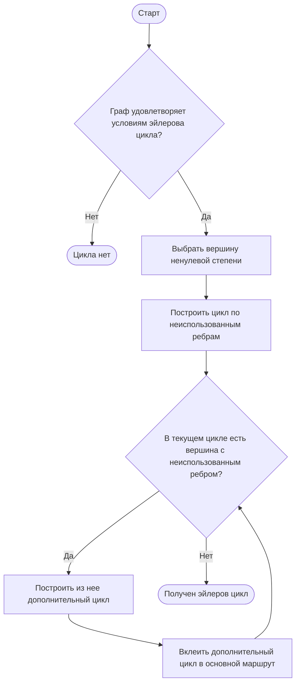

##### 6.2. Псевдокод для неориентированного графа

Ниже приведен вариант через стек. Он строит цикл без явной операции "вклейки": стек хранит текущий незавершенный обход, а ответ формируется при откате.

```text
Hierholzer(G):
    проверить условия существования эйлерова цикла
    если условия не выполнены:
        вернуть "цикла нет"

    start = любая вершина с deg(start) > 0
    stack = [start]
    answer = []

    пока stack не пуст:
        v = stack.last()

        если у v есть неиспользованное ребро (v, u):
            пометить ребро (v, u) как использованное
            удалить его из списков доступных ребер v и u
            stack.push(u)
        иначе:
            answer.push(v)
            stack.pop()

    развернуть answer
    вернуть answer
```

Результат `answer` - последовательность вершин эйлерова цикла. Соседние вершины в этой последовательности соединены ребрами исходного графа, и каждое ребро используется ровно один раз.

Для ориентированного графа псевдокод почти такой же, но берется только исходящая неиспользованная дуга \((v, u)\), и удалять ее нужно только из списка исходящих дуг вершины \(v\).

##### 6.3. Сложность

При хранении графа списками смежности и удалении/пропуске уже использованных ребер за \(O(1)\) амортизированно:

- проверка степеней занимает \(O(|V| + |E|)\);
- проверка связности или сильной связности занимает \(O(|V| + |E|)\);
- сам алгоритм Хиерхольцера проходит каждое ребро один раз, поэтому занимает \(O(|E|)\);
- итоговая сложность: \(O(|V| + |E|)\);
- память: \(O(|V| + |E|)\).

#### 7. Пример работы Хиерхольцера по шагам

Возьмем тот же граф:
\[
AB,\ BC,\ CA,\ CD,\ DE,\ EC.
\]

Алгоритм может построить цикл так:

1. Начинаем в вершине \(A\).
2. Идем по ребрам \(A \to B \to C \to A\). Получили первый цикл:
   \[
   A \to B \to C \to A.
   \]
3. В текущем цикле есть вершина \(C\), из которой остались неиспользованные ребра \(CD\) и \(CE\).
4. Из \(C\) строим дополнительный цикл:
   \[
   C \to D \to E \to C.
   \]
5. Вклеиваем дополнительный цикл в первый в вершине \(C\):
   \[
   A \to B \to C \to D \to E \to C \to A.
   \]
6. Неиспользованных ребер больше нет. Полученная последовательность является эйлеровым циклом.

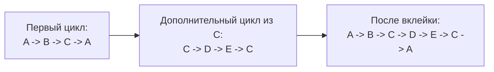

Пошаговая идея вклейки важна: Хиерхольцер не пытается сразу угадать весь маршрут. Он находит локальные циклы и объединяет их в один общий цикл, пока не будут исчерпаны все ребра.

#### 8. Алгоритм Флёри

Алгоритм Флёри исторически более ранний и интуитивный способ построения эйлеровой цепи или цикла.

Идея:

1. Если строится цикл, начать в любой вершине ненулевой степени.
2. Если строится незамкнутая эйлерова цепь в неориентированном графе, начать в одной из двух вершин нечетной степени.
3. На каждом шаге выбирать ребро, которое не является мостом в оставшемся графе, если есть альтернатива.
4. Пройти по выбранному ребру и удалить его из графа.
5. Повторять, пока все ребра не будут удалены.

Мост - ребро, удаление которого увеличивает число компонент связности. Если преждевременно пройти по мосту, можно отрезать часть еще не использованных ребер и потерять возможность закончить обход.

Недостаток алгоритма Флёри: на каждом шаге надо проверять, является ли ребро мостом в текущем остаточном графе. Наивная реализация может работать за \(O(|E| \cdot (|V| + |E|))\), что значительно хуже Хиерхольцера.

Поэтому на практике для построения эйлеровых циклов и цепей обычно используют алгоритм Хиерхольцера.

#### 9. Краткий конспект условий

##### Неориентированный граф

| Требуемый объект | Условие на связность | Условие на степени |
|---|---|---|
| Эйлеров цикл | Все вершины ненулевой степени в одной компоненте | Все степени четные |
| Эйлерова цепь | Все вершины ненулевой степени в одной компоненте | Нечетных вершин 0 или 2 |

##### Ориентированный граф

| Требуемый объект | Условие на связность | Условие на входящие/исходящие степени |
|---|---|---|
| Эйлеров цикл | Все вершины ненулевой степени в одной сильно связной части | Для всех \(v\): \(\deg^+(v) = \deg^-(v)\) |
| Эйлерова цепь из \(s\) в \(t\) | После добавления дуги \(t \to s\) нужная часть сильно связна | У \(s\): исходящих на 1 больше; у \(t\): входящих на 1 больше; остальные сбалансированы |

#### 10. Типичные ошибки

1. Проверять связность всего графа вместе с изолированными вершинами. Изолированные вершины не мешают эйлерову циклу, потому что не содержат ребер.
2. Путать эйлеров цикл с гамильтоновым. Эйлеров цикл проходит все ребра, гамильтонов - все вершины.
3. Для ориентированного графа проверять только равенство входящих и исходящих степеней, забывая про сильную связность нужной части.
4. Для неориентированного графа считать, что наличие двух нечетных вершин дает цикл. Оно дает только незамкнутую эйлерову цепь.
5. В алгоритме Флёри выбирать мост при наличии других ребер. Это может разрушить возможность завершить обход.

#### 11. Итог

Эйлерова теория графов отвечает на вопрос, можно ли пройти каждое ребро ровно один раз. Для неориентированных графов ключевые условия - связность всех вершин ненулевой степени и количество нечетных вершин: 0 для цикла, 0 или 2 для цепи. Для ориентированных графов нужны баланс входящих и исходящих степеней и сильная связность части графа, где есть дуги.

Основной алгоритм построения эйлерова цикла - алгоритм Хиерхольцера. Он последовательно строит циклы по неиспользованным ребрам и вклеивает их в общий маршрут. При списках смежности он работает за \(O(|V| + |E|)\), поэтому является стандартным практическим способом нахождения эйлеровых циклов.

### Билет 6. Гамильтоновы графы

#### 1. Основные определения

Пусть дан граф \(G = (V, E)\), где \(V\) — множество вершин, \(E\) — множество ребер.

**Гамильтонов путь** — простой путь, проходящий через каждую вершину графа ровно один раз.

Иными словами, если в графе \(n\) вершин, то гамильтонов путь имеет вид

\[
v_1, v_2, \ldots, v_n,
\]

где все вершины \(v_i\) различны, и для каждого \(i = 1, \ldots, n - 1\) существует ребро \((v_i, v_{i+1})\).

**Гамильтонов цикл** — простой цикл, проходящий через каждую вершину графа ровно один раз и возвращающийся в начальную вершину:

\[
v_1, v_2, \ldots, v_n, v_1.
\]

Здесь все вершины \(v_1, \ldots, v_n\) различны, для всех соседних вершин в последовательности есть ребра, и дополнительно существует ребро \((v_n, v_1)\).

**Гамильтонов граф** — граф, содержащий хотя бы один гамильтонов цикл.

Если граф содержит гамильтонов путь, но не содержит гамильтонова цикла, его обычно не называют гамильтоновым, хотя иногда говорят, что граф обладает гамильтоновым путем.

#### 2. Отличие гамильтонова графа от эйлерова

Гамильтоновость и эйлеровость — разные свойства графа.

| Свойство | Гамильтонов путь/цикл | Эйлеров путь/цикл |
|---|---|---|
| Что нужно пройти | Все вершины | Все ребра |
| Сколько раз можно посещать | Каждую вершину ровно один раз, кроме возврата в начало для цикла | Ребро ровно один раз, вершины могут повторяться |
| Объект изучения | Порядок обхода вершин | Порядок обхода ребер |
| Критерий | Простого полного критерия для общего графа нет | Есть простой критерий через степени вершин и связность |

Например, квадрат с одной диагональю может иметь гамильтонов цикл, потому что можно обойти все вершины по периметру. Но эйлеров цикл в нем отсутствует, если степени вершин не все четные.

Для эйлерова цикла в неориентированном графе известен точный критерий: граф должен быть связным по ребрам, а степени всех вершин должны быть четными. Для гамильтонова цикла аналогичного простого критерия для произвольного графа не существует.

#### 3. Необходимые условия существования гамильтонова цикла

Если граф гамильтонов, то он обязан удовлетворять некоторым простым необходимым условиям.

1. **Связность.**  
   Граф с гамильтоновым циклом обязательно связен: цикл проходит через все вершины, значит из любой вершины можно добраться до любой другой вдоль этого цикла.

2. **Минимальная степень не меньше 2.**  
   В гамильтоновом цикле каждая вершина имеет двух соседей в этом цикле: предыдущую и следующую. Поэтому в исходном графе у каждой вершины должна быть степень хотя бы 2.

3. **Отсутствие мостов.**  
   Если ребро является мостом, то его удаление разделяет граф на компоненты. Гамильтонов цикл не может содержать мост: из одной части графа пришлось бы перейти по мосту и затем вернуться, используя то же ребро второй раз, что невозможно для простого цикла.

Эти условия являются необходимыми, но не достаточными. То есть если граф связен, все степени хотя бы 2 и мостов нет, из этого еще не следует, что он гамильтонов.

#### 4. Почему нет простого критерия

Для произвольного графа задача проверки существования гамильтонова цикла является NP-полной. Это означает, что:

- известны алгоритмы, которые проверяют наличие гамильтонова цикла полным перебором или динамическим программированием;
- в худшем случае время их работы растет экспоненциально;
- не известен полиномиальный алгоритм для всех графов;
- не существует простого критерия наподобие эйлерова критерия через степени вершин.

Поэтому в теории графов часто используют:

- **достаточные условия**, которые гарантируют гамильтоновость, но не являются необходимыми;
- **алгоритмы поиска**, которые либо находят цикл, либо доказывают его отсутствие перебором вариантов;
- **эвристики**, которые часто быстро находят хороший цикл, но не всегда дают доказательство существования или отсутствия.

#### 5. Достаточные условия гамильтоновости

##### 5.1. Теорема Дирака

Пусть \(G\) — простой неориентированный граф с \(n \ge 3\) вершинами.

Если степень каждой вершины не меньше половины числа вершин:

\[
\delta(G) \ge \frac{n}{2},
\]

то граф \(G\) является гамильтоновым.

Здесь \(\delta(G)\) — минимальная степень вершины графа.

Важно: условие Дирака является достаточным, но не необходимым. Существуют гамильтоновы графы, у которых минимальная степень меньше \(n/2\).

Пример: простой цикл \(C_5\) гамильтонов, но каждая вершина имеет степень 2, а \(n/2 = 2.5\). Условие Дирака не выполнено, но гамильтонов цикл есть.

##### 5.2. Теорема Оре

Пусть \(G\) — простой неориентированный граф с \(n \ge 3\) вершинами.

Если для любых двух несмежных вершин \(u\) и \(v\) выполнено:

\[
\deg(u) + \deg(v) \ge n,
\]

то граф \(G\) является гамильтоновым.

Условие Оре также является достаточным, но не необходимым.

Теорема Оре сильнее теоремы Дирака в том смысле, что из условия Дирака следует условие Оре: если каждая вершина имеет степень хотя бы \(n/2\), то для любых двух вершин сумма степеней не меньше \(n\). Но условие Оре может выполняться и тогда, когда не все степени по отдельности достигают \(n/2\).

##### 5.3. Примеры неусловий

Следующие утверждения не являются достаточными условиями гамильтоновости:

1. **Граф связен.**  
   Этого недостаточно. Например, дерево с числом вершин больше 2 связно, но не имеет циклов вообще, значит не может быть гамильтоновым.

2. **Все степени положительны.**  
   Это означает только отсутствие изолированных вершин. Граф может быть связным или несвязным, но гамильтонов цикл из этого не следует.

3. **Минимальная степень равна 2.**  
   Даже если у каждой вершины степень не меньше 2, граф может не иметь гамильтонова цикла. Например, две треугольные части, соединенные через одну общую вершину, имеют циклы, но общий гамильтонов цикл невозможен: через разделяющую вершину пришлось бы проходить более одного раза.

4. **Граф имеет много ребер.**  
   Большое количество ребер помогает, но само по себе без точного условия не гарантирует гамильтоновость.

#### 6. Пример гамильтонова цикла

Рассмотрим граф с вершинами \(A, B, C, D, E\). В нем есть гамильтонов цикл:

\[
A \to B \to C \to D \to E \to A.
\]

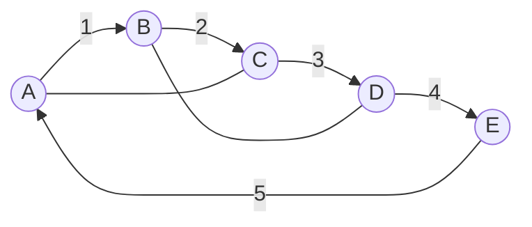

В этом графе ребра \(A-B\), \(B-C\), \(C-D\), \(D-E\), \(E-A\) образуют гамильтонов цикл. Дополнительные ребра \(A-C\) и \(B-D\) не мешают существованию цикла.

#### 7. Алгоритм поиска гамильтонова цикла перебором с возвратом

Самый естественный точный алгоритм — backtracking, или поиск с возвратом. Он строит путь по одной вершине и отбрасывает ветви, которые уже не могут привести к гамильтонову циклу.

##### 7.1. Идея алгоритма

1. Выбрать стартовую вершину \(s\).
2. Начать путь с вершины \(s\).
3. На каждом шаге пытаться добавить к текущему пути новую вершину, смежную с последней вершиной пути.
4. Запрещать повторное добавление уже посещенных вершин.
5. Если путь содержит все вершины, проверить, есть ли ребро из последней вершины обратно в \(s\).
6. Если такое ребро есть, найден гамильтонов цикл.
7. Если продолжить путь нельзя, вернуться назад и попробовать другой вариант.

##### 7.2. Псевдокод

```text
HamiltonianCycle(G):
    s = любая вершина графа
    path = [s]
    used = {s}
    return DFS(path, used)

DFS(path, used):
    if length(path) == |V|:
        if edge(path[-1], path[0]) exists:
            return path + [path[0]]
        else:
            return null

    last = path[-1]

    for each vertex v adjacent to last:
        if v not in used:
            add v to path and used

            if DFS(path, used) found cycle:
                return cycle

            remove v from path and used

    return null
```

##### 7.3. Отсечения

Чтобы уменьшить перебор, используют отсечения:

- если граф несвязен, гамильтонова цикла нет;
- если есть вершина степени меньше 2, гамильтонова цикла нет;
- если в процессе поиска у непосещенной вершины не остается потенциальных соседей для включения в цикл, ветвь можно отбросить;
- можно начинать всегда с одной фиксированной вершины, потому что гамильтонов цикл можно записать с любой вершины;
- для неориентированного графа можно зафиксировать второго соседа стартовой вершины, чтобы не проверять зеркальные копии одного и того же цикла;
- вершины можно перебирать в порядке эвристики: сначала вершины с меньшей степенью, потому что для них меньше вариантов.

##### 7.4. Сложность

В худшем случае backtracking имеет факториальную сложность:

\[
O(n!)
\]

или близкую к ней, потому что алгоритм фактически перебирает перестановки вершин. На практике отсечения сильно сокращают перебор, но экспоненциальная природа задачи остается.

#### 8. Динамическое программирование Хелда-Карпа по подмножествам

Для точного решения можно использовать динамическое программирование по подмножествам вершин. Этот подход похож на алгоритм Хелда-Карпа для задачи коммивояжера.

##### 8.1. Состояние

Зафиксируем стартовую вершину \(s\).

Определим:

\[
dp[S][v] = true,
\]

если существует простой путь, который:

- начинается в \(s\);
- проходит ровно по вершинам множества \(S\);
- заканчивается в вершине \(v\).

Здесь \(S\) — подмножество вершин, содержащее \(s\), а \(v \in S\).

##### 8.2. Переход

Состояние \(dp[S][v]\) истинно, если существует вершина \(u \in S\), \(u \ne v\), такая что:

\[
dp[S \setminus \{v\}][u] = true
\]

и в графе есть ребро \((u, v)\).

То есть вершину \(v\) можно добавить в конец уже построенного пути.

##### 8.3. Проверка цикла

После заполнения таблицы нужно проверить, существует ли вершина \(v \ne s\), для которой:

\[
dp[V][v] = true
\]

и есть ребро \((v, s)\).

Если да, то существует гамильтонов цикл.

##### 8.4. Сложность

Количество подмножеств вершин равно \(2^n\). Для каждого подмножества рассматриваются возможные последние вершины и переходы.

Обычно сложность оценивается как:

\[
O(n^2 2^n)
\]

по времени и

\[
O(n 2^n)
\]

по памяти.

Такой алгоритм лучше факториального перебора по асимптотике, но все равно экспоненциальный. Он подходит для графов умеренного размера, но быстро становится непрактичным при больших \(n\).

#### 9. Эвристические методы

Эвристики не гарантируют правильный ответ во всех случаях, но часто помогают быстро найти гамильтонов цикл в больших графах.

Примеры эвристик:

1. **Жадное построение пути.**  
   На каждом шаге выбирается подходящая непосещенная соседняя вершина, например вершина с наименьшей степенью или с наименьшим числом дальнейших вариантов.

2. **Случайный поиск с перезапусками.**  
   Алгоритм много раз строит случайные пути. Если путь зашел в тупик, поиск начинается заново.

3. **Локальные улучшения.**  
   Используются перестановки фрагментов пути, похожие на приемы 2-opt и 3-opt из задачи коммивояжера.

4. **Генетические алгоритмы и муравьиные алгоритмы.**  
   Представляют возможные обходы как кандидатов и улучшают их с помощью вероятностных правил.

5. **SAT/ILP-сведение.**  
   Задача кодируется как формула выполнимости или задача целочисленного линейного программирования. Затем используется готовый решатель.

Эвристики полезны, когда нужно быстро найти цикл, но если цикл не найден, это обычно не доказывает, что его не существует.

#### 10. Блок-схема backtracking-алгоритма

```mermaid
flowchart TD
    Start([Старт]) --> CheckGraph{Граф связен<br/>и min degree >= 2?}
    CheckGraph -- Нет --> NoCycle([Гамильтонова цикла нет])
    CheckGraph -- Да --> Init[Выбрать стартовую вершину s<br/>path = s]
    Init --> Extend{Можно добавить<br/>непосещенного соседа?}
    Extend -- Да --> Add[Добавить вершину в путь]
    Add --> AllVisited{Все вершины<br/>посещены?}
    AllVisited -- Нет --> Extend
    AllVisited -- Да --> Close{Есть ребро<br/>из последней вершины в s?}
    Close -- Да --> Found([Цикл найден])
    Close -- Нет --> Backtrack[Откатить последний выбор]
    Extend -- Нет --> Backtrack
    Backtrack --> HasChoice{Остались варианты?}
    HasChoice -- Да --> Extend
    HasChoice -- Нет --> NoCycle
```

#### 11. Пошаговый пример поиска гамильтонова цикла

Рассмотрим граф:

\[
V = \{A, B, C, D, E\}
\]

\[
E = \{AB, AC, AE, BC, BD, CD, DE\}.
\]

Его можно представить так:

```mermaid
graph LR
    A((A)) --- B((B))
    A --- C((C))
    A --- E((E))
    B --- C
    B --- D((D))
    C --- D
    D --- E
```

Попробуем найти гамильтонов цикл backtracking-алгоритмом. Стартуем из вершины \(A\).

##### Шаг 1

Текущий путь:

\[
A
\]

Соседи вершины \(A\): \(B, C, E\). Выберем \(B\).

Путь:

\[
A \to B
\]

##### Шаг 2

Из вершины \(B\) можно перейти в \(C\) или \(D\), потому что \(A\) уже посещена. Сначала пробуем \(C\).

Путь:

\[
A \to B \to C
\]

##### Шаг 3

Из вершины \(C\) непосещенный сосед — \(D\). Добавляем \(D\).

Путь:

\[
A \to B \to C \to D
\]

##### Шаг 4

Из вершины \(D\) непосещенный сосед — \(E\). Добавляем \(E\).

Путь:

\[
A \to B \to C \to D \to E
\]

Теперь посещены все вершины. Проверяем, есть ли ребро из \(E\) обратно в \(A\). Такое ребро есть: \(EA \in E\).

Значит найден гамильтонов цикл:

\[
A \to B \to C \to D \to E \to A.
\]

Дерево поиска для этого удачного случая:

```mermaid
graph TD
    A0["A"] --> AB["A-B"]
    A0 --> AC["A-C"]
    A0 --> AE["A-E"]
    AB --> ABC["A-B-C"]
    AB --> ABD["A-B-D"]
    ABC --> ABCD["A-B-C-D"]
    ABCD --> ABCDE["A-B-C-D-E"]
    ABCDE --> Cycle["A-B-C-D-E-A<br/>цикл найден"]
```

Если бы на каком-то шаге выбранная ветвь не позволила посетить все вершины или не дала ребра возврата в \(A\), алгоритм откатился бы назад и попробовал следующую ветвь.

#### 12. Итог

Гамильтонов цикл — это цикл, проходящий через все вершины графа ровно один раз. Граф называется гамильтоновым, если содержит такой цикл. В отличие от эйлерова цикла, где важны все ребра и есть простой критерий через степени вершин, для гамильтонова цикла простого полного критерия в общем случае нет.

Связность, отсутствие вершин степени меньше 2 и отсутствие мостов являются необходимыми условиями, но не гарантируют гамильтоновость. Достаточные условия дают теоремы Дирака и Оре: они позволяют сразу утверждать, что граф гамильтонов, если граф достаточно плотный. Для поиска цикла применяют backtracking с отсечениями, динамическое программирование Хелда-Карпа по подмножествам и различные эвристические методы.

### Билет 7. Графы типа "дерево": определения; остовное дерево, фундаментальное множество циклов

#### 1. Графы типа "дерево"

В этом билете рассматриваются конечные неориентированные графы. Если специально не оговорено иное, под графом понимается простой граф:
\[
G = (V, E),
\]
где \(V\) - множество вершин, \(E\) - множество ребер, каждое ребро соединяет две различные вершины.

**Дерево** - один из важнейших классов графов. Интуитивно дерево - это связный граф без "замкнутых обходов": из любой вершины в любую другую можно пройти, но при этом нет циклов.

Формально:

**Дерево** - это связный неориентированный граф, не содержащий циклов.

Например, граф

```mermaid
graph TD
    A((A)) --- B((B))
    A --- C((C))
    B --- D((D))
    B --- E((E))
    C --- F((F))
```

является деревом: он связен, и в нем нельзя начать движение из вершины, пройти по различным ребрам и вернуться в исходную вершину.

#### 2. Эквивалентные определения дерева

Для конечного неориентированного графа \(T = (V, E)\) с \(n = |V|\) вершинами следующие утверждения эквивалентны. Каждое из них можно использовать как определение дерева.

1. **\(T\) связен и не содержит циклов.**

   Это основное определение: дерево - связный ациклический граф.

2. **\(T\) не содержит циклов и имеет \(n - 1\) ребро.**

   Ациклический граф с \(n - 1\) ребром не может распадаться на несколько компонент: если бы компонент было больше одной, ребер было бы меньше. Поэтому он связен и является деревом.

3. **\(T\) связен и имеет \(n - 1\) ребро.**

   Связный граф с \(n\) вершинами должен иметь не меньше \(n - 1\) ребра. Если ребер ровно \(n - 1\), то "лишних" ребер нет, значит циклов быть не может.

4. **Между любыми двумя различными вершинами существует ровно одна простая цепь.**

   Связность дает существование цепи. Отсутствие циклов дает единственность: если бы между двумя вершинами было две разные простые цепи, их объединение содержало бы цикл.

5. **\(T\) является минимально связным графом.**

   Это значит, что \(T\) связен, но удаление любого ребра нарушает связность. В дереве каждое ребро является мостом.

6. **\(T\) является максимально ациклическим графом.**

   Это значит, что \(T\) не содержит циклов, но добавление любого нового ребра между двумя несмежными вершинами создает цикл.

Эти формулировки полезны в разных задачах. Например, при доказательствах часто удобно использовать свойство единственности пути, а при подсчете - свойство \(|E| = n - 1\).

#### 3. Лес, компоненты леса и листья

**Лес** - неориентированный граф без циклов.

Иными словами, лес - это граф, каждая компонента связности которого является деревом.

Если лес имеет:

- \(n\) вершин;
- \(m\) ребер;
- \(k\) компонент связности,

то
\[
m = n - k.
\]

Действительно, каждая компонента леса является деревом. Если в \(i\)-й компоненте \(n_i\) вершин, то в ней \(n_i - 1\) ребро. Поэтому
\[
m = \sum_{i=1}^{k}(n_i - 1)
= \sum_{i=1}^{k} n_i - k
= n - k.
\]

**Лист** дерева - вершина степени 1.

Степень вершины - количество инцидентных ей ребер. В дереве лист - это "концевая" вершина, из которой выходит ровно одно ребро.

В дереве с числом вершин \(n \ge 2\) всегда есть хотя бы два листа.

Краткое объяснение: возьмем в дереве самый длинный простой путь. Его концы не могут иметь соседей вне этого пути, иначе путь можно было бы продолжить. Также у концов не может быть дополнительных соседей внутри пути, иначе возник бы цикл. Значит, оба конца этого пути имеют степень 1, то есть являются листьями.

#### 4. Корневое дерево: корень, уровни, предки и потомки

Обычное дерево не имеет выделенного направления. Но часто удобно выбрать одну вершину особой.

**Корневое дерево** - дерево, в котором выделена одна вершина, называемая **корнем**.

Пусть корень обозначен \(r\). Тогда для любой вершины \(v\) существует единственный простой путь из \(r\) в \(v\). Это позволяет ввести иерархические понятия.

**Уровень вершины** - расстояние от корня до этой вершины, то есть длина единственного пути от корня до нее.

- корень имеет уровень 0;
- соседи корня имеют уровень 1;
- вершины на расстоянии 2 от корня имеют уровень 2;
- и так далее.

**Родитель вершины** \(v \ne r\) - предыдущая вершина на единственном пути от корня \(r\) к \(v\).

**Сын** или **дочерняя вершина** вершины \(u\) - вершина \(v\), для которой \(u\) является родителем.

**Предок** вершины \(v\) - любая вершина, лежащая на пути от корня к \(v\). Обычно вершину \(v\) также могут считать своим собственным предком, если это явно оговорено; в строгом смысле предками часто называют только вершины выше \(v\).

**Потомок** вершины \(u\) - вершина \(v\), для которой \(u\) лежит на пути от корня к \(v\).

Пример корневого дерева с корнем \(A\):

```mermaid
graph TD
    A((A, уровень 0)) --- B((B, уровень 1))
    A --- C((C, уровень 1))
    B --- D((D, уровень 2))
    B --- E((E, уровень 2))
    C --- F((F, уровень 2))
    E --- G((G, уровень 3))
```

Здесь:

- \(A\) - корень;
- \(B\) и \(C\) - потомки \(A\);
- \(A\) - предок всех остальных вершин;
- \(B\) - родитель вершин \(D\) и \(E\);
- \(D\), \(F\), \(G\) - листья;
- уровень \(G\) равен 3.

#### 5. Основные свойства дерева на \(n\) вершинах

Пусть \(T\) - дерево с \(n\) вершинами.

##### 5.1. Число ребер

Если \(n \ge 1\), то дерево имеет ровно
\[
n - 1
\]
ребро.

Это одно из главных свойств дерева.

Доказательство по индукции:

- при \(n = 1\) дерево состоит из одной вершины и не имеет ребер, то есть \(0 = 1 - 1\);
- пусть утверждение верно для деревьев с \(n - 1\) вершинами;
- в дереве с \(n \ge 2\) есть лист;
- удалим лист и инцидентное ему ребро;
- останется дерево с \(n - 1\) вершинами, в нем \(n - 2\) ребра;
- возвращая удаленный лист, получаем \(n - 1\) ребро.

##### 5.2. Единственность пути

Между любыми двумя вершинами дерева существует ровно один простой путь.

Если бы путей было два, то их объединение содержало бы цикл. Это противоречит определению дерева.

##### 5.3. Каждое ребро дерева является мостом

**Мост** - ребро, удаление которого увеличивает число компонент связности графа.

В дереве удаление любого ребра разрывает единственный путь между некоторыми вершинами, поэтому дерево становится несвязным. Значит, каждое ребро дерева - мост.

##### 5.4. Добавление любого нового ребра создает ровно один цикл

Пусть в дереве \(T\) добавили ребро \(uv\), которого раньше не было. В дереве уже существовал единственный путь из \(u\) в \(v\). Новое ребро \(uv\) вместе с этим путем образует цикл.

Цикл ровно один, потому что путь между \(u\) и \(v\) в дереве был единственным.

##### 5.5. Связный граф содержит остовное дерево

Если граф \(G\) связен, то из него можно удалить ребра, принадлежащие циклам, пока циклов не останется. Связность при этом сохраняется, потому что удаление ребра из цикла не разрывает граф: между его концами остается путь по остальной части цикла. В результате получится связный ациклический подграф, то есть дерево, содержащее все вершины \(G\). Это и есть остовное дерево.

#### 6. Остовное дерево связного графа

Пусть \(G = (V, E)\) - связный неориентированный граф.

**Остовный подграф** графа \(G\) - подграф, содержащий все вершины \(G\). То есть у него то же множество вершин \(V\), но, возможно, меньше ребер.

**Остовное дерево** графа \(G\) - остовный подграф, который является деревом.

Обозначим остовное дерево через \(T = (V, E_T)\), где
\[
E_T \subseteq E.
\]

Так как \(T\) является деревом на \(n = |V|\) вершинах, то
\[
|E_T| = n - 1.
\]

Остовное дерево:

- содержит все вершины исходного графа;
- содержит только часть ребер исходного графа;
- является связным;
- не содержит циклов;
- показывает минимальный набор ребер, достаточный для сохранения связности.

Если связный граф \(G\) имеет \(n\) вершин и \(m\) ребер, то любое его остовное дерево содержит \(n - 1\) ребро. Все остальные ребра исходного графа не входят в выбранное остовное дерево.

#### 7. Хорды относительно остовного дерева

Пусть \(T\) - выбранное остовное дерево связного графа \(G\).

**Хорда относительно остовного дерева** - ребро графа \(G\), которое не принадлежит остовному дереву \(T\).

Иначе говоря, если
\[
E_T
\]
- множество ребер остова, то множество хорд:
\[
E \setminus E_T.
\]

Число хорд равно
\[
|E \setminus E_T| = m - (n - 1) = m - n + 1.
\]

Это число называется **цикломатическим числом** связного графа:
\[
\mu(G) = m - n + 1.
\]

Цикломатическое число показывает, сколько независимых циклов есть в связном графе. В частности:

- если \(\mu(G) = 0\), то \(m = n - 1\), граф является деревом;
- если \(\mu(G) > 0\), то в графе есть циклы;
- каждая хорда относительно фиксированного остова порождает один фундаментальный цикл.

Для несвязного графа с \(k\) компонентами связности аналогичная формула имеет вид
\[
\mu(G) = m - n + k.
\]
Но в данном билете главным образом рассматривается связный граф, поэтому используется формула \(m - n + 1\).

#### 8. Фундаментальные циклы, связанные с деревом

Пусть \(G\) - связный граф, \(T\) - его остовное дерево.

Возьмем хорду \(e = uv\), то есть ребро \(uv \in E \setminus E_T\).

В дереве \(T\) между вершинами \(u\) и \(v\) существует единственный простой путь. Обозначим его через
\[
P_T(u, v).
\]

Тогда ребро \(uv\) вместе с путем \(P_T(u, v)\) образует цикл:
\[
C_e = P_T(u, v) \cup \{uv\}.
\]

Этот цикл называется **фундаментальным циклом**, соответствующим хорде \(e\) относительно остовного дерева \(T\).

Важно:

- один фундаментальный цикл соответствует ровно одной хорде;
- каждый фундаментальный цикл содержит свою хорду;
- остальные ребра цикла лежат в остовном дереве;
- число фундаментальных циклов равно числу хорд, то есть \(m - n + 1\);
- фундаментальные циклы зависят от выбора остовного дерева.

**Фундаментальное множество циклов** относительно остовного дерева \(T\) - это множество всех фундаментальных циклов, полученных добавлением к \(T\) каждой хорды графа \(G\).

Если хорды обозначены \(e_1, e_2, \ldots, e_{\mu}\), где
\[
\mu = m - n + 1,
\]
то фундаментальное множество циклов имеет вид
\[
\{C_{e_1}, C_{e_2}, \ldots, C_{e_{\mu}}\}.
\]

Это множество важно потому, что оно образует базис циклов графа над полем \(\mathbb{F}_2\): любой цикл графа можно представить как симметрическую разность некоторых фундаментальных циклов. Для экзамена достаточно понимать содержательный смысл: фундаментальные циклы дают независимое описание всех циклов графа через выбранное остовное дерево и оставшиеся ребра-хорды.

#### 9. Пример: связный граф, остов и фундаментальные циклы

Рассмотрим связный граф \(G\) с вершинами
\[
V = \{A, B, C, D, E, F\}
\]
и ребрами
\[
E =
\{AB, AC, BC, BD, CD, CE, DE, DF, EF\}.
\]

Здесь:

- \(n = 6\);
- \(m = 9\);
- цикломатическое число
  \[
  \mu(G) = m - n + 1 = 9 - 6 + 1 = 4.
  \]

Значит, относительно любого остовного дерева у графа будет 4 хорды и 4 фундаментальных цикла.

Выберем остовное дерево \(T\) с ребрами
\[
E_T = \{AB, AC, BD, CE, DF\}.
\]

Проверим:

- оно содержит все 6 вершин;
- в нем 5 ребер, то есть \(n - 1 = 5\);
- оно связно;
- значит, это остовное дерево.

Остов \(T\):

```mermaid
graph TD
    A((A)) --- B((B))
    A --- C((C))
    B --- D((D))
    C --- E((E))
    D --- F((F))
```

Оставшиеся ребра графа \(G\) являются хордами:
\[
E \setminus E_T = \{BC, CD, DE, EF\}.
\]

Каждая хорда дает фундаментальный цикл.

##### 9.1. Хорда \(BC\)

В остове путь между \(B\) и \(C\):
\[
B - A - C.
\]

Добавляем хорду \(BC\). Получаем фундаментальный цикл:
\[
C_{BC}: B - A - C - B.
\]

##### 9.2. Хорда \(CD\)

В остове путь между \(C\) и \(D\):
\[
C - A - B - D.
\]

Добавляем хорду \(CD\). Получаем:
\[
C_{CD}: C - A - B - D - C.
\]

##### 9.3. Хорда \(DE\)

В остове путь между \(D\) и \(E\):
\[
D - B - A - C - E.
\]

Добавляем хорду \(DE\). Получаем:
\[
C_{DE}: D - B - A - C - E - D.
\]

##### 9.4. Хорда \(EF\)

В остове путь между \(E\) и \(F\):
\[
E - C - A - B - D - F.
\]

Добавляем хорду \(EF\). Получаем:
\[
C_{EF}: E - C - A - B - D - F - E.
\]

Та же ситуация на диаграмме: сплошные ребра образуют остов, пунктирные ребра - хорды. Каждая пунктирная хорда вместе с единственным путем по остову образует свой фундаментальный цикл.

```mermaid
graph TD
    A((A)) --- B((B))
    A --- C((C))
    B --- D((D))
    C --- E((E))
    D --- F((F))

    B -.- C
    C -.- D
    D -.- E
    E -.- F
```

Можно также выделить один фундаментальный цикл отдельно. Например, для хорды \(CD\) цикл состоит из пути \(C - A - B - D\) по остову и хорды \(CD\):

```mermaid
graph LR
    C((C)) --- A((A))
    A --- B((B))
    B --- D((D))
    D -.- C
```

#### 10. Почему фундаментальных циклов ровно \(m - n + 1\)

Пусть \(G\) - связный граф с \(n\) вершинами и \(m\) ребрами, а \(T\) - его остовное дерево.

Так как \(T\) - дерево на всех \(n\) вершинах, в нем ровно \(n - 1\) ребро.

Все ребра графа \(G\), не попавшие в \(T\), являются хордами. Поэтому число хорд:
\[
m - (n - 1) = m - n + 1.
\]

Каждая хорда создает ровно один фундаментальный цикл, потому что в дереве между концами хорды существует ровно один путь. Следовательно, число фундаментальных циклов тоже равно
\[
m - n + 1.
\]

Это число не зависит от того, какое именно остовное дерево выбрано. Однако сами фундаментальные циклы могут измениться при выборе другого остова.

#### 11. Краткая схема ответа на экзамене

Если нужно ответить компактно, можно держать следующую структуру:

1. Дерево - связный ациклический граф.
2. Эквивалентно: связный граф с \(n - 1\) ребром; ациклический граф с \(n - 1\) ребром; между любыми двумя вершинами есть единственный простой путь; минимально связный граф; максимально ациклический граф.
3. Лес - граф без циклов, его компоненты являются деревьями.
4. Лист - вершина степени 1; в любом дереве с \(n \ge 2\) есть минимум два листа.
5. Корневое дерево - дерево с выделенным корнем; уровень вершины - расстояние от корня; предки и потомки определяются единственным путем от корня.
6. В дереве на \(n\) вершинах ровно \(n - 1\) ребро; каждое ребро является мостом; добавление любого нового ребра создает ровно один цикл.
7. Остовное дерево связного графа - дерево, содержащее все вершины графа и часть его ребер.
8. Ребра, не вошедшие в остов, называются хордами относительно остова.
9. Каждая хорда \(uv\) вместе с единственным путем между \(u\) и \(v\) в остове образует фундаментальный цикл.
10. Число хорд и фундаментальных циклов равно цикломатическому числу связного графа:
    \[
    \mu(G) = m - n + 1.
    \]

### Билет 8. Остовные деревья графа, задача перечисления деревьев, алгоритмы поиска минимальных остовных деревьев

#### 1. Краткая идея

Остовное дерево связного графа - это способ оставить в графе ровно столько ребер, чтобы все вершины остались достижимыми, но циклов уже не было. Для связного графа с `n` вершинами любой остов содержит `n - 1` ребро. Если ребрам заданы веса, возникает задача минимального остовного дерева: среди всех остовов выбрать остов с минимальной суммой весов.

На экзамене удобно сразу разделить три близкие задачи:

1. **Построить какой-нибудь остов**: достаточно DFS или BFS.
2. **Перечислить все остовные деревья**: комбинаторная задача, используют рекурсию по ребру, удаление/стягивание, матричную теорему Кирхгофа для подсчета.
3. **Найти минимальный остов**: используют алгоритмы Краскала, Прима, Борувки.

#### 2. Основные определения

Пусть `G = (V, E)` - конечный неориентированный граф.

**Остовный подграф** графа `G` - подграф `H = (V, E_H)`, который содержит все вершины исходного графа и некоторое подмножество ребер `E_H ⊆ E`.

**Остовное дерево** графа `G` - остовный подграф, который является деревом, то есть связен и не содержит циклов.

**Остовный лес** - аналог для несвязного графа: в каждой компоненте связности строится свое дерево. Если в графе `c` компонент и `n` вершин, остовный лес содержит `n - c` ребер.

**Вес графа** - функция `w: E -> R`, которая каждому ребру сопоставляет число. Вес остова:

```text
w(T) = sum_{e in E(T)} w(e)
```

**Минимальное остовное дерево** (minimum spanning tree, MST) - остовное дерево `T`, для которого сумма весов минимальна среди всех остовных деревьев графа.

Если граф несвязен, минимального остовного дерева для всего графа нет, но можно искать **минимальный остовный лес**.

```mermaid
graph LR
    A((A)) ---|4| B((B))
    A ---|2| C((C))
    B ---|1| C
    B ---|5| D((D))
    C ---|3| D
    C ---|6| E((E))
    D ---|2| E
```

В этом графе остов должен включить все пять вершин и ровно `5 - 1 = 4` ребра.

#### 3. Свойства остовных деревьев

Для связного графа `G = (V, E)` с `|V| = n`:

- остовное дерево существует тогда и только тогда, когда граф связен;
- любое остовное дерево содержит все вершины графа;
- любое остовное дерево содержит ровно `n - 1` ребро;
- добавление к остову любого ребра из `E \ E(T)` создает ровно один цикл;
- удаление из дерева любого ребра разбивает его на две компоненты;
- если граф сам является деревом, его единственное остовное дерево - он сам.

Остовные деревья важны потому, что они сохраняют достижимость, но удаляют избыточность циклов. В сетевых задачах это означает минимальную связную инфраструктуру: все узлы соединены, но нет лишних каналов.

```mermaid
graph TD
    subgraph "Исходный граф G"
        A1((A)) --- B1((B))
        A1 --- C1((C))
        B1 --- C1
        B1 --- D1((D))
        C1 --- D1
        C1 --- E1((E))
        D1 --- E1
    end

    subgraph "Один из остовов T"
        A2((A)) --- C2((C))
        C2 --- B2((B))
        C2 --- D2((D))
        D2 --- E2((E))
    end
```

#### 4. Задача перечисления остовных деревьев

Задача перечисления состоит в том, чтобы получить все различные остовные деревья графа `G`. Это сложнее, чем просто найти один остов, потому что число остовов может быть очень большим.

Например, в полном графе `K_n` число остовных деревьев равно:

```text
n^(n-2)
```

Это формула Кэли. Уже для `K_6` получается `6^4 = 1296` остовов.

##### 4.1. Рекурсия по ребру: удаление и стягивание

Для выбранного ребра `e` все остовные деревья графа делятся на два класса:

- остовы, которые **содержат** ребро `e`;
- остовы, которые **не содержат** ребро `e`.

Если остов не содержит `e`, можно удалить `e` из графа.

Если остов содержит `e`, можно стянуть `e`, то есть объединить его концы в одну вершину. После стягивания остовы меньшего графа соответствуют остовам исходного графа, в которые входит `e`.

Обозначим через `τ(G)` число остовных деревьев графа `G`. Тогда для обычного ребра, не являющегося петлей, выполняется рекуррентная идея:

```text
τ(G) = τ(G - e) + τ(G / e)
```

где `G - e` - граф с удаленным ребром, а `G / e` - граф со стянутым ребром.

```mermaid
flowchart TD
    S["Выбрать ребро e"] --> Q{"Включаем e в остов?"}
    Q -->|Нет| D["Рассмотреть G - e"]
    Q -->|Да| C["Рассмотреть G / e\nи запомнить e"]
    D --> R1["Перечислить остовы без e"]
    C --> R2["Перечислить остовы с e"]
    R1 --> U["Объединить результаты"]
    R2 --> U
```

Для практического перечисления дополнительно нужны отсечения:

- если граф стал несвязным, ветка не дает остовов;
- если выбранных ребер уже больше `n - 1`, ветка невозможна;
- если выбранные ребра образуют цикл, их нельзя все включить в дерево;
- если осталось недостаточно ребер для связности, ветка отбрасывается.

##### 4.2. Матричная теорема Кирхгофа

Теорема Кирхгофа, или матричная теорема о деревьях, дает способ **посчитать** число остовных деревьев без явного перечисления.

Пусть `A` - матрица смежности графа, `D` - диагональная матрица степеней вершин. Тогда

```text
L = D - A
```

называется матрицей Лапласа графа.

Чтобы найти число остовных деревьев `τ(G)`, нужно:

1. построить матрицу Лапласа `L`;
2. удалить из нее любую одну строку и соответствующий столбец;
3. вычислить определитель полученной матрицы.

Этот определитель равен числу остовных деревьев графа.

Важно: теорема Кирхгофа считает количество остовов, но сама по себе не перечисляет их явно.

#### 5. Минимальное остовное дерево

Задача MST формулируется так:

```text
Дан связный неориентированный взвешенный граф G = (V, E, w).
Найти остовное дерево T, минимизирующее sum w(e) по e in T.
```

Обычно предполагают, что граф неориентированный. В ориентированных графах аналогичная задача называется задачей минимального ветвления или арборесценции и решается другими алгоритмами, например алгоритмом Эдмондса.

В MST веса могут быть отрицательными, нулевыми или положительными. Алгоритмы Краскала, Прима и Борувки работают и с отрицательными весами, потому что им важно только сравнение ребер.

Если все веса различны, минимальное остовное дерево единственно. Если есть равные веса, MST может быть несколько.

#### 6. Свойства разреза и цикла

Корректность основных алгоритмов MST обычно доказывают через два свойства.

##### 6.1. Свойство разреза

Разрезом называется разбиение множества вершин на две непустые части `S` и `V \ S`. Ребро пересекает разрез, если один его конец лежит в `S`, а другой - в `V \ S`.

**Свойство разреза:** если взять разрез, который не пересекает уже выбранные безопасные ребра, то минимальное по весу ребро, пересекающее этот разрез, можно безопасно добавить в некоторое MST.

Именно это свойство объясняет алгоритмы Прима, Краскала и Борувки: они каждый раз добавляют ребро, которое является минимальным для некоторого разреза.

##### 6.2. Свойство цикла

**Свойство цикла:** если в цикле есть ребро, вес которого строго больше весов всех остальных ребер цикла, то это ребро не входит ни в одно MST.

Интуиция: в цикле можно удалить самое тяжелое ребро, и связность не нарушится, а суммарный вес уменьшится.

```mermaid
graph LR
    A((A)) ---|1| B((B))
    B ---|2| C((C))
    C ---|5| A
    C ---|3| D((D))
    D ---|4| A
```

В цикле `A-B-C-A` ребро `A-C` веса `5` хуже альтернативного обхода через `A-B-C`, поэтому при строгом максимуме оно не нужно для MST.

#### 7. Алгоритм Краскала

Алгоритм Краскала строит MST, добавляя ребра в порядке возрастания веса и не допуская циклов.

##### Шаги алгоритма

1. Отсортировать все ребра по неубыванию веса.
2. Изначально каждую вершину считать отдельной компонентой.
3. Перебирать ребра от меньшего веса к большему.
4. Если концы ребра лежат в разных компонентах, добавить ребро в остов и объединить компоненты.
5. Если концы ребра уже в одной компоненте, пропустить ребро, иначе появится цикл.
6. Остановиться, когда выбрано `n - 1` ребро.

Для быстрой проверки компонент используют структуру **DSU** (disjoint set union, система непересекающихся множеств).

##### Псевдокод

```text
Kruskal(G):
    T = empty set
    sort E by weight
    make_set(v) for every v in V

    for each edge (u, v) in sorted E:
        if find(u) != find(v):
            T.add((u, v))
            union(u, v)
        if |T| == |V| - 1:
            break

    return T
```

##### Сложность

Сортировка ребер занимает `O(m log m)`. Операции DSU почти линейны: `O(m α(n))`, где `α` - обратная функция Аккермана, практически константа. Поэтому общая сложность:

```text
O(m log m)
```

Краскал особенно удобен для разреженных графов и когда ребра уже легко отсортировать.

```mermaid
flowchart TD
    A["Отсортировать ребра по весу"] --> B["T = пусто, DSU по вершинам"]
    B --> C{"Есть следующее ребро?"}
    C -->|Нет| F["Вернуть T"]
    C -->|Да| D{"Концы в разных компонентах?"}
    D -->|Да| E["Добавить ребро в T\nunion(u, v)"]
    D -->|Нет| G["Пропустить ребро"]
    E --> H{"|T| = n - 1?"}
    G --> C
    H -->|Да| F
    H -->|Нет| C
```

#### 8. Алгоритм Прима

Алгоритм Прима растит одно дерево. На каждом шаге он выбирает самое легкое ребро, которое соединяет уже построенную часть с новой вершиной.

##### Шаги алгоритма

1. Выбрать стартовую вершину `s`.
2. Считать ее начальным деревом.
3. Среди всех ребер, выходящих из построенного дерева наружу, выбрать ребро минимального веса.
4. Добавить это ребро и новую вершину.
5. Повторять, пока не будут добавлены все вершины.

Это прямое применение свойства разреза: текущие вершины дерева образуют одну часть разреза, остальные вершины - другую.

##### Псевдокод

```text
Prim(G, s):
    for v in V:
        key[v] = infinity
        parent[v] = null
    key[s] = 0
    Q = all vertices

    while Q is not empty:
        u = vertex from Q with minimum key[u]
        remove u from Q
        for each edge (u, v) with v in Q:
            if w(u, v) < key[v]:
                key[v] = w(u, v)
                parent[v] = u

    return edges (parent[v], v)
```

##### Сложность

Зависит от реализации:

- матрица смежности и простой поиск минимума: `O(n^2)`;
- списки смежности и бинарная куча: `O(m log n)`;
- фибоначчиева куча теоретически: `O(m + n log n)`.

Прим часто удобен для плотных графов, особенно в реализации `O(n^2)`.

```mermaid
graph LR
    A((A)) ---|2| C((C))
    C ---|1| B((B))
    C ---|3| D((D))
    D ---|2| E((E))

    A -. "4, не выбрано" .- B
    B -. "5, не выбрано" .- D
    C -. "6, не выбрано" .- E
```

Для исходного графа из первого примера одно MST состоит из ребер `BC(1)`, `AC(2)`, `DE(2)`, `CD(3)`. Его вес равен `1 + 2 + 2 + 3 = 8`.

#### 9. Алгоритм Борувки

Алгоритм Борувки одновременно расширяет все компоненты. На каждой итерации для каждой текущей компоненты выбирается минимальное ребро, выходящее из нее наружу. Все такие ребра добавляются, после чего компоненты объединяются.

##### Шаги алгоритма

1. Изначально каждая вершина - отдельная компонента.
2. Для каждой компоненты найти минимальное внешнее ребро.
3. Добавить все найденные ребра, не создавая противоречий.
4. Объединить компоненты.
5. Повторять, пока не останется одна компонента.

На каждой фазе число компонент обычно уменьшается как минимум вдвое, поэтому фаз `O(log n)`.

Сложность простой реализации:

```text
O(m log n)
```

Алгоритм хорошо параллелится, потому что минимальные исходящие ребра разных компонент можно искать независимо.

```mermaid
flowchart LR
    C0["{A}, {B}, {C}, {D}, {E}"] --> C1["Добавить минимальные ребра\nдля одиночных компонент"]
    C1 --> C2["{A,B,C}, {D,E}"]
    C2 --> C3["Добавить минимальное ребро\nмежду компонентами"]
    C3 --> C4["{A,B,C,D,E}\nMST построено"]
```

#### 10. Пошаговый пример MST

Рассмотрим граф:

```mermaid
graph LR
    A((A)) ---|4| B((B))
    A ---|2| C((C))
    B ---|1| C
    B ---|5| D((D))
    C ---|3| D
    C ---|6| E((E))
    D ---|2| E
```

Отсортируем ребра:

| Ребро | Вес |
|---|---:|
| `B-C` | 1 |
| `A-C` | 2 |
| `D-E` | 2 |
| `C-D` | 3 |
| `A-B` | 4 |
| `B-D` | 5 |
| `C-E` | 6 |

Алгоритм Краскала:

1. Берем `B-C` веса `1`. Цикла нет.
2. Берем `A-C` веса `2`. Компонента `{A,B,C}`.
3. Берем `D-E` веса `2`. Компонента `{D,E}`.
4. Берем `C-D` веса `3`. Соединяем две компоненты.
5. Уже выбрано `n - 1 = 4` ребра, остов готов.

Итог:

```text
T = {B-C, A-C, D-E, C-D}
w(T) = 1 + 2 + 2 + 3 = 8
```

Ребро `A-B` веса `4` не берется, потому что после выбора `B-C` и `A-C` оно создало бы цикл `A-B-C-A`.

#### 11. Сравнение алгоритмов MST

| Алгоритм | Идея | Типичная структура данных | Сложность | Когда удобен |
|---|---|---|---:|---|
| Краскал | брать легчайшие ребра без циклов | сортировка + DSU | `O(m log m)` | разреженные графы, реберное представление |
| Прим | растить одно дерево от вершины | куча или матрица | `O(m log n)` или `O(n^2)` | плотные графы, списки/матрица смежности |
| Борувка | каждая компонента берет минимальное внешнее ребро | DSU, сканирование ребер | `O(m log n)` | параллельные вычисления, теоретические гибриды |

Все три алгоритма используют один и тот же принцип: добавлять только безопасные ребра, которые могут входить в некоторое минимальное остовное дерево.

#### 12. Типичные ошибки

- **Искать MST в несвязном графе.** В несвязном графе нет остовного дерева всего графа, есть только остовный лес.
- **Путать кратчайшие пути и MST.** Минимальный остов не обязан давать кратчайший путь между каждой парой вершин.
- **Считать, что отрицательные веса запрещены.** Для MST отрицательные веса допустимы; запрет важен, например, для алгоритма Дейкстры, но не для Краскала или Прима.
- **Добавлять ребро в Краскале без проверки цикла.** Главное правило: ребро добавляется только если соединяет разные компоненты.
- **Думать, что MST всегда единственно.** При равных весах может быть несколько минимальных остовов.
- **Путать перечисление и подсчет.** Теорема Кирхгофа считает число остовов, но не выдает список всех деревьев.

#### 13. Что сказать на экзамене

Короткий сильный ответ можно построить так:

1. Остовное дерево связного графа - это связный ациклический остовный подграф; оно содержит все `n` вершин и ровно `n - 1` ребро.
2. Остов существует тогда и только тогда, когда граф связен; в несвязном графе строят остовный лес.
3. Перечислять остовы можно рекурсией по ребру: ветка с удалением ребра и ветка со стягиванием ребра; число остовов можно найти по матричной теореме Кирхгофа через определитель алгебраического дополнения матрицы Лапласа.
4. Минимальное остовное дерево ищут во взвешенном неориентированном графе. Классические алгоритмы: Краскал, Прим, Борувка.
5. Корректность MST-алгоритмов основана на свойствах разреза и цикла: минимальное ребро подходящего разреза безопасно, а строго самое тяжелое ребро цикла не нужно.
6. Краскал сортирует ребра и использует DSU, Прим растит дерево через минимальное внешнее ребро, Борувка параллельно объединяет компоненты минимальными исходящими ребрами.

### Билет 9. Планарность графа: основные понятия, теорема Понтрягина-Куратовского

#### 1. Краткая идея

**Планарность графа** описывает возможность нарисовать граф на плоскости так, чтобы его ребра не пересекались во внутренних точках. Вершины можно располагать где угодно, ребра можно проводить не только прямыми отрезками, но и произвольными непрерывными кривыми. Важно только, чтобы разные ребра встречались лишь в общих концах.

Например, цикл, дерево, квадрат с диагональю и многие сеточные графы планарны. А два классических графа не планарны:

- \(K_5\) - полный граф на пяти вершинах;
- \(K_{3,3}\) - полный двудольный граф с долями по три вершины.

Теорема Понтрягина-Куратовского дает полный критерий непланарности:

> Граф непланарен тогда и только тогда, когда он содержит подграф, гомеоморфный \(K_5\) или \(K_{3,3}\).

Иными словами, всякая непланарность в конечном графе сводится к наличию внутри него одной из двух запрещенных конфигураций: либо "скрытого" \(K_5\), либо "скрытого" \(K_{3,3}\), возможно с ребрами, замененными путями.

#### 2. Основные определения

##### 2.1. Рисунок графа на плоскости

Пусть дан неориентированный граф
\[
G = (V, E).
\]

**Рисунок графа на плоскости** - это изображение графа, при котором:

- каждой вершине \(v \in V\) сопоставлена точка плоскости;
- каждому ребру \(\{u,v\} \in E\) сопоставлена простая кривая, соединяющая точки \(u\) и \(v\);
- кривая ребра не проходит через вершины, кроме своих концов.

Рисунок может иметь пересечения ребер. Если два ребра пересекаются в точке, которая не является их общей вершиной, такое пересечение называется **недопустимым пересечением** для планарной укладки.

Важно: пересечение ребер на одном конкретном рисунке еще не доказывает непланарность. Возможно, граф можно перерисовать иначе.

##### 2.2. Планарный граф

**Планарный граф** - граф, который можно изобразить на плоскости без пересечений ребер во внутренних точках.

Формально граф \(G\) называется планарным, если существует такой его рисунок на плоскости, что любые два ребра имеют общие точки только в следующих случаях:

- они имеют общую вершину, и тогда пересекаются в этой вершине;
- они вообще не имеют общих точек.

Если у ребер нет общей вершины, они не должны пересекаться. Если у ребер есть общая вершина, они могут встречаться только в ней.

##### 2.3. Плоский граф и плоская укладка

Нужно различать два близких понятия.

**Планарный граф** - это абстрактный граф, для которого существует изображение без пересечений.

**Плоский граф** или **плоская укладка** - это уже выбранное конкретное изображение планарного графа на плоскости без пересечений.

Один и тот же планарный граф может иметь разные плоские укладки. Укладки могут отличаться порядком ребер вокруг вершин и набором граней.

Пример планарной укладки:

```mermaid
graph LR
    A((A)) --- B((B))
    B --- C((C))
    C --- D((D))
    D --- A
    A --- C
```

Этот граф можно понимать как квадрат \(A B C D\) с диагональю \(A C\). Если нарисовать его как квадрат и провести диагональ, пересечений ребер нет. Плоскость разбивается на две внутренние треугольные области и одну внешнюю область.

##### 2.4. Грани

Пусть граф уже уложен на плоскости без пересечений. Тогда его ребра и вершины делят плоскость на связные области. Эти области называются **гранями** плоской укладки.

**Грань** - максимальная связная область плоскости, не содержащая точек графа.

Грани бывают:

- **внутренние** - ограниченные области внутри рисунка;
- **внешняя грань** - неограниченная область снаружи рисунка.

Внешняя грань всегда ровно одна. Она тоже считается гранью, хотя не ограничена конечной областью.

Для связного плоского графа с числом вершин \(v\), числом ребер \(e\) и числом граней \(f\) выполняется формула Эйлера:
\[
v - e + f = 2.
\]

Если граф имеет \(c\) компонент связности, то более общая формула:
\[
v - e + f = 1 + c.
\]

##### 2.5. Граница грани

**Граница грани** - это замкнутый обход по ребрам и вершинам, отделяющий данную грань от остальных частей плоскости.

В простых 2-связных плоских графах границы граней выглядят как циклы. В более общем случае граница грани может проходить по одной и той же вершине или ребру несколько раз. Например, если граф является деревом, у него нет циклов, но есть одна грань - внешняя, и каждое ребро лежит на ее границе с двух сторон.

##### 2.6. Пересечения ребер

При проверке планарности нужно различать допустимые и недопустимые встречи ребер.

**Допустимо:**

- ребра \(\{a,b\}\) и \(\{a,c\}\) встречаются в общей вершине \(a\);
- несколько ребер инцидентны одной вершине;
- ребро касается другого ребра только в общей конечной вершине.

**Недопустимо для плоской укладки:**

- два ребра без общей вершины пересекаются;
- ребро проходит через чужую вершину;
- два ребра с общей вершиной дополнительно пересекаются где-то еще.

Если на рисунке есть недопустимое пересечение, это означает только то, что данный рисунок не является плоской укладкой. Сам граф может быть планарным, если существует другой рисунок без таких пересечений.

#### 3. Подразделение ребер и гомеоморфизм графов

##### 3.1. Подразделение ребра

**Подразделить ребро** \(\{u,v\}\) - значит заменить его путем
\[
u - x_1 - x_2 - \ldots - x_k - v,
\]
где \(x_1,\ldots,x_k\) - новые вершины степени 2.

Например, ребро \(uv\) можно заменить на путь \(u-x-v\). Новая вершина \(x\) имеет степень 2 и служит только "точкой на ребре".

Подразделение ребер не меняет планарности:

- если исходный граф планарен, то после вставки вершин на ребра он остается планарным;
- если подразделенный граф планарен, то после стягивания цепочек вершин степени 2 обратно в ребра исходный граф тоже планарен.

##### 3.2. Гомеоморфные графы

Два графа называются **гомеоморфными**, если они могут быть получены из одного и того же графа последовательным подразделением ребер.

Эквивалентная формулировка: граф \(H\) гомеоморфен графу \(F\), если \(H\) получается из \(F\) заменой каждого ребра на путь, причем внутренние вершины этих путей имеют степень 2 и разные пути не имеют общих внутренних вершин.

В контексте теоремы Понтрягина-Куратовского особенно важна такая ситуация:

- в большом графе \(G\) есть подграф \(H\);
- после удаления вершин степени 2 на цепочках этот подграф превращается в \(K_5\) или \(K_{3,3}\);
- значит, \(H\) является подразделением \(K_5\) или \(K_{3,3}\).

Такой подграф часто называют **топологическим \(K_5\)** или **топологическим \(K_{3,3}\)**.

##### 3.3. Вершины ветвления

При поиске подграфа, гомеоморфного \(K_5\) или \(K_{3,3}\), удобно выделять **вершины ветвления**.

**Вершины ветвления** - это вершины, соответствующие исходным вершинам \(K_5\) или \(K_{3,3}\). Они соединяются между собой путями, которые изображают ребра исходного запрещенного графа.

Для топологического \(K_5\):

- нужно найти 5 вершин ветвления;
- каждая пара этих вершин должна быть соединена отдельным путем;
- всего нужно 10 путей;
- внутренние вершины этих путей не должны пересекаться между разными путями.

Для топологического \(K_{3,3}\):

- нужно найти 6 вершин ветвления, разбитых на две тройки;
- каждая вершина первой тройки должна соединяться путем с каждой вершиной второй тройки;
- всего нужно 9 путей;
- путей между вершинами внутри одной тройки не требуется.

#### 4. Миноры: обзорно

**Минор графа** получается из графа с помощью трех операций:

1. удаление вершины;
2. удаление ребра;
3. стягивание ребра, то есть отождествление его концов.

Если граф \(H\) можно получить из \(G\) такими операциями, то \(H\) называется **минором** графа \(G\).

Связь с планарностью:

- удаление вершин и ребер у планарного графа сохраняет планарность;
- стягивание ребра в планарной укладке тоже сохраняет планарность;
- поэтому если планарный граф имеет минор \(H\), то \(H\) тоже планарен;
- следовательно, если граф имеет непланарный минор, он сам непланарен.

Миноры важны для теоремы Вагнера:

> Граф планарен тогда и только тогда, когда он не содержит \(K_5\) и \(K_{3,3}\) в качестве миноров.

Это похоже на теорему Понтрягина-Куратовского, но не то же самое. У Куратовского запрещенная конфигурация должна сидеть как подграф с подразделенными ребрами. У Вагнера разрешены еще и стягивания ребер, то есть критерий формулируется через миноры.

#### 5. Теорема Понтрягина-Куратовского

##### 5.1. Формулировка

**Теорема Понтрягина-Куратовского.** Конечный граф \(G\) непланарен тогда и только тогда, когда \(G\) содержит подграф, гомеоморфный одному из графов \(K_5\) или \(K_{3,3}\).

То есть:
\[
G \text{ непланарен}
\iff
G \text{ содержит подразделение } K_5 \text{ или } K_{3,3}.
\]

Развернуто:

- если в графе \(G\) есть подграф, который получается из \(K_5\) или \(K_{3,3}\) заменой ребер на пути, то \(G\) непланарен;
- если граф \(G\) непланарен, то внутри него обязательно найдется такой подграф.

Это не просто достаточное условие, а полный критерий.

##### 5.2. Почему наличие такого подграфа доказывает непланарность

Пусть граф \(G\) содержит подграф \(H\), гомеоморфный \(K_5\) или \(K_{3,3}\).

Если бы \(G\) был планарным, то любой его подграф тоже был бы планарным: из плоской укладки \(G\) можно просто удалить лишние ребра и вершины.

Значит, \(H\) был бы планарным. Но \(H\) получается из \(K_5\) или \(K_{3,3}\) подразделением ребер. Подразделение ребер не меняет планарности. Поэтому из планарности \(H\) следовала бы планарность \(K_5\) или \(K_{3,3}\).

А \(K_5\) и \(K_{3,3}\) непланарны. Получаем противоречие. Следовательно, \(G\) непланарен.

##### 5.3. Почему это также необходимо

Обратная часть глубже:

> если граф непланарен, то его непланарность обязательно вызвана скрытым \(K_5\) или скрытым \(K_{3,3}\).

Интуитивно доказательство опирается на идею минимального непланарного графа. Если из непланарного графа удалить все лишнее, получим минимальный по включению непланарный подграф: удаление любого его ребра делает граф планарным. Теорема утверждает, что такой минимальный непланарный фрагмент неизбежно имеет структуру подразделения \(K_5\) или \(K_{3,3}\).

Полное доказательство обычно требует аккуратного анализа того, как можно добавить последнее ребро к планарной укладке почти планарного графа и почему невозможность провести это ребро без пересечений порождает одну из двух запрещенных топологических конфигураций.

##### 5.4. Схема критерия

```mermaid
flowchart TD
    A[Дан конечный граф G] --> B{Есть подграф,<br/>гомеоморфный K5<br/>или K3,3?}
    B -- Да --> C[G непланарен]
    B -- Нет --> D[G планарен]
    C --> E[Причина: K5 и K3,3 непланарны,<br/>а подразделение ребер<br/>не меняет планарность]
    D --> F[Это полная обратная часть<br/>теоремы Понтрягина-Куратовского]
```

#### 6. Граф \(K_5\)

##### 6.1. Определение

\(K_5\) - полный граф на пяти вершинах. Это означает, что каждая пара различных вершин соединена ребром.

У него:

- \(v = 5\) вершин;
- \(e = \binom{5}{2} = 10\) ребер;
- степень каждой вершины равна 4.

Схематически:

```mermaid
graph LR
    A((1)) --- B((2))
    A --- C((3))
    A --- D((4))
    A --- E((5))
    B --- C
    B --- D
    B --- E
    C --- D
    C --- E
    D --- E
```

Диаграмма показывает все попарные соединения пяти вершин. В конкретном рисунке ребра могут пересекаться, но непланарность \(K_5\) утверждает большее: как бы мы ни переставляли вершины и ни изгибали ребра, полностью избавиться от пересечений невозможно.

##### 6.2. Почему \(K_5\) непланарен

Используем следствие из формулы Эйлера.

Для простого связного планарного графа с \(v \ge 3\) выполняется неравенство:
\[
e \le 3v - 6.
\]

Почему оно верно:

- в простой планарной укладке каждая грань ограничена как минимум тремя ребрами;
- каждое ребро лежит на границе двух граней;
- поэтому \(3f \le 2e\);
- по формуле Эйлера \(v - e + f = 2\);
- отсюда \(e \le 3v - 6\).

Для \(K_5\):
\[
v = 5,\quad e = 10.
\]

Планарность потребовала бы:
\[
10 \le 3 \cdot 5 - 6 = 9.
\]

Это невозможно. Значит, \(K_5\) непланарен.

#### 7. Граф \(K_{3,3}\)

##### 7.1. Определение

\(K_{3,3}\) - полный двудольный граф с двумя долями по три вершины.

Пусть доли:
\[
X = \{x_1,x_2,x_3\}, \quad Y = \{y_1,y_2,y_3\}.
\]

В \(K_{3,3}\):

- ребра есть между каждой вершиной из \(X\) и каждой вершиной из \(Y\);
- ребер внутри \(X\) нет;
- ребер внутри \(Y\) нет;
- всего \(v = 6\) вершин и \(e = 3 \cdot 3 = 9\) ребер.

```mermaid
graph LR
    x1((x1)) --- y1((y1))
    x1 --- y2((y2))
    x1 --- y3((y3))
    x2((x2)) --- y1
    x2 --- y2
    x2 --- y3
    x3((x3)) --- y1
    x3 --- y2
    x3 --- y3
```

Этот граф часто называют задачей о трех домах и трех колодцах: каждый дом нужно соединить с каждым колодцем непересекающимися дорогами. Теорема о непланарности \(K_{3,3}\) говорит, что на плоскости это невозможно.

##### 7.2. Почему \(K_{3,3}\) непланарен

Обычное неравенство \(e \le 3v - 6\) здесь не помогает:
\[
9 \le 3 \cdot 6 - 6 = 12.
\]

Нужно использовать более сильное неравенство для двудольных планарных графов.

Если простой связный планарный граф двудолен и \(v \ge 3\), то в нем нет циклов длины 3, потому что любой цикл в двудольном графе имеет четную длину. Значит, каждая грань ограничена как минимум четырьмя ребрами.

Тогда:
\[
4f \le 2e,
\]
то есть
\[
2f \le e.
\]

Из формулы Эйлера:
\[
v - e + f = 2.
\]

Так как \(f \le e/2\), получаем:
\[
v - e + \frac{e}{2} \ge 2,
\]
\[
v - \frac{e}{2} \ge 2,
\]
\[
e \le 2v - 4.
\]

Для \(K_{3,3}\):
\[
v = 6,\quad e = 9.
\]

Планарность потребовала бы:
\[
9 \le 2 \cdot 6 - 4 = 8.
\]

Это невозможно. Значит, \(K_{3,3}\) непланарен.

#### 8. Как искать запрещенную конфигурацию

Теорема Понтрягина-Куратовского полезна не только как теоретический критерий, но и как способ объяснить, почему конкретный граф непланарен.

##### 8.1. Общая стратегия

Чтобы показать непланарность графа \(G\), можно искать внутри него подразделение \(K_5\) или \(K_{3,3}\).

Практический порядок:

1. Найти вершины больших степеней.
2. Выбрать кандидатов на вершины ветвления.
3. Проверить, можно ли соединить их нужным набором путей.
4. Убедиться, что внутренние вершины этих путей не используются в других путях.
5. Сжать мысленно каждую цепочку вершин степени 2 в одно ребро.
6. Проверить, получается ли \(K_5\) или \(K_{3,3}\).

##### 8.2. Поиск топологического \(K_5\)

Ищем 5 вершин ветвления \(a,b,c,d,e\), между которыми должны быть пути для всех пар:
\[
ab, ac, ad, ae, bc, bd, be, cd, ce, de.
\]

Признаки:

- есть как минимум пять "важных" вершин, каждая из которых имеет много независимых связей;
- между выбранными вершинами видны почти все попарные соединения;
- некоторые ребра могут быть заменены длинными цепочками через вершины степени 2;
- после удаления промежуточных вершин степени 2 остается полный граф на пяти вершинах.

##### 8.3. Поиск топологического \(K_{3,3}\)

Ищем две тройки вершин:
\[
X = \{x_1,x_2,x_3\}, \quad Y = \{y_1,y_2,y_3\}.
\]

Нужны пути:
\[
x_i \leadsto y_j
\quad \text{для всех } i,j \in \{1,2,3\}.
\]

Признаки:

- граф похож на систему связей "каждый из трех объектов слева связан с каждым из трех объектов справа";
- внутри каждой тройки прямые соединения не важны;
- главное - наличие девяти попарно внутренне непересекающихся путей между долями;
- если эти пути заменить ребрами, получится \(K_{3,3}\).

##### 8.4. Что можно удалять при поиске

При поиске запрещенного подграфа разрешено игнорировать лишние элементы:

- лишние вершины;
- лишние ребра;
- хорды;
- дополнительные связи между вершинами.

Теорема требует, чтобы запрещенная конфигурация была **подграфом**. Поэтому если внутри графа есть нужные пути, дополнительные ребра не мешают: их можно просто не брать в рассматриваемый подграф.

##### 8.5. Схема поиска

```mermaid
flowchart LR
    A[Исходный граф G] --> B[Удалить явно лишние<br/>ребра и вершины]
    B --> C{Есть 5 кандидатов<br/>на вершины ветвления?}
    C -- Да --> D[Проверить 10 путей<br/>между всеми парами]
    D --> E{Получается<br/>подразделение K5?}
    E -- Да --> Z[G непланарен]
    C -- Нет --> F[Искать разбиение<br/>6 вершин на две тройки]
    E -- Нет --> F
    F --> G[Проверить 9 путей<br/>между разными долями]
    G --> H{Получается<br/>подразделение K3,3?}
    H -- Да --> Z
    H -- Нет --> I[Этот поиск не нашел<br/>сертификат непланарности]
```

#### 9. Теорема Куратовского и теорема Вагнера

Обе теоремы описывают планарность через два запрещенных графа \(K_5\) и \(K_{3,3}\), но используют разные отношения между графами.

| Критерий | Что запрещено | Какие операции фактически разрешены | Формулировка |
|---|---|---|---|
| Теорема Понтрягина-Куратовского | Подграф, гомеоморфный \(K_5\) или \(K_{3,3}\) | Удаление лишних частей графа; сжатие только цепочек вершин степени 2 в ребра как обратная операция к подразделению | \(G\) непланарен тогда и только тогда, когда содержит подразделение \(K_5\) или \(K_{3,3}\) |
| Теорема Вагнера | Минор \(K_5\) или \(K_{3,3}\) | Удаление вершин, удаление ребер, стягивание ребер | \(G\) планарен тогда и только тогда, когда не содержит \(K_5\) и \(K_{3,3}\) как миноры |

Главное различие:

- у Куратовского запрещенный объект должен быть виден как подграф с ребрами, замененными путями;
- у Вагнера запрещенный объект может проявиться после стягивания ребер, то есть более гибко.

Любое подразделение \(K_5\) или \(K_{3,3}\) содержит соответствующий граф как минор: достаточно стянуть subdivided-пути обратно в ребра. Поэтому критерий Куратовского естественно связан с минорным критерием Вагнера.

Но формулировки не идентичны:

- "содержит подграф, гомеоморфный \(K_5\)" - топологическая формулировка;
- "содержит \(K_5\) как минор" - минорная формулировка.

#### 10. Полезные следствия и проверки

##### 10.1. Неравенство для простых планарных графов

Если \(G\) - простой связный планарный граф и \(v \ge 3\), то:
\[
e \le 3v - 6.
\]

Если это неравенство нарушено, граф точно непланарен.

Но если неравенство выполнено, граф не обязательно планарен. Например, для \(K_{3,3}\):
\[
9 \le 12,
\]
но граф все равно непланарен.

##### 10.2. Неравенство для двудольных планарных графов

Если \(G\) - простой связный двудольный планарный граф и \(v \ge 3\), то:
\[
e \le 2v - 4.
\]

Это неравенство доказывает непланарность \(K_{3,3}\), потому что у него \(v=6\), \(e=9\), а должно быть \(e \le 8\).

##### 10.3. Подграфы планарного графа

Любой подграф планарного графа планарен.

Отсюда важный прием:

> Если в графе найден непланарный подграф, то весь граф непланарен.

Теорема Понтрягина-Куратовского уточняет, какие именно непланарные подграфы достаточно искать: подразделения \(K_5\) и \(K_{3,3}\).

##### 10.4. Подразделение не влияет на планарность

Если заменить ребро путем через новые вершины степени 2, планарность не меняется.

Поэтому графы вида:
\[
K_5 \text{ с подразделенными ребрами}
\]
и
\[
K_{3,3} \text{ с подразделенными ребрами}
\]
остаются непланарными.

#### 11. Типичные ошибки

##### 11.1. Считать пересечение на рисунке доказательством непланарности

Если ребра пересеклись на рисунке, это не значит, что граф непланарен. Возможно, его можно перерисовать без пересечений.

Для доказательства непланарности нужны:

- нарушение необходимого планарного неравенства;
- или нахождение подразделения \(K_5\) или \(K_{3,3}\);
- или другой строгий аргумент.

##### 11.2. Путать планарный и плоский граф

Планарный граф - это граф, который можно уложить на плоскости.

Плоский граф - это уже конкретная укладка без пересечений.

Грани определены именно для плоской укладки, а не просто для абстрактного графа без выбранного рисунка.

##### 11.3. Путать гомеоморфизм и изоморфизм

Изоморфизм требует совпадения структуры вершин и ребер.

Гомеоморфизм допускает подразделение ребер. Поэтому путь длины 3 может играть роль одного ребра исходного \(K_5\) или \(K_{3,3}\), если его внутренние вершины имеют степень 2 в выбранном подграфе.

##### 11.4. Путать теоремы Куратовского и Вагнера

Куратовский:

- запрещены подграфы, гомеоморфные \(K_5\) и \(K_{3,3}\);
- речь идет о подразделениях.

Вагнер:

- запрещены миноры \(K_5\) и \(K_{3,3}\);
- разрешено стягивать ребра.

#### 12. Короткий ответ для устного экзамена

Граф называется планарным, если его можно изобразить на плоскости так, чтобы ребра пересекались только в общих вершинах. Конкретное изображение без пересечений называется плоской укладкой или плоским графом. Такая укладка разбивает плоскость на грани; одна из них является внешней, то есть неограниченной. Для связного плоского графа выполняется формула Эйлера \(v-e+f=2\).

Подразделение ребра - это замена ребра путем через новые вершины степени 2. Графы называются гомеоморфными, если получаются из одного графа подразделением ребер. Подразделение не меняет планарности.

Теорема Понтрягина-Куратовского утверждает: конечный граф непланарен тогда и только тогда, когда он содержит подграф, гомеоморфный \(K_5\) или \(K_{3,3}\). То есть всякая непланарность содержит внутри себя топологический \(K_5\) или топологический \(K_{3,3}\). Граф \(K_5\) непланарен, потому что для него \(v=5\), \(e=10\), а для простого планарного графа должно быть \(e \le 3v-6=9\). Граф \(K_{3,3}\) непланарен, потому что он двудолен, \(v=6\), \(e=9\), а для двудольного планарного графа должно быть \(e \le 2v-4=8\).

Теорема Вагнера близка, но формулируется через миноры: граф планарен тогда и только тогда, когда он не содержит \(K_5\) и \(K_{3,3}\) как миноры. В отличие от гомеоморфного подграфа, минор можно получать не только удалением лишних частей, но и стягиванием ребер.

### Билет 10. Планарность графа: теорема Эйлера и оценка толщины графа, использование дуальных графов

#### 1. Краткая идея

**Планарный граф** - это граф, который можно нарисовать на плоскости так, чтобы его ребра пересекались только в общих концах. Такой рисунок называется **плоской укладкой** или **плоским графом**.

Главная особенность плоского графа состоит в том, что его ребра разбивают плоскость на области - **грани**. Одна грань всегда неограниченная, она называется **внешней гранью**. Для связного плоского графа числа вершин \(n\), ребер \(m\) и граней \(f\) связаны формулой Эйлера:

\[
n - m + f = 2.
\]

Из этой формулы выводятся важные ограничения на число ребер. Они дают быстрые необходимые условия планарности: если граф слишком плотный, он не может быть планарным.

В билете также важны две связанные темы:

- **толщина графа**: сколько планарных подграфов нужно, чтобы покрыть все ребра исходного графа;
- **дуальный граф**: граф, построенный по граням плоской укладки, где грани исходного графа становятся вершинами.

#### 2. Планарные и плоские графы

##### 2.1. Планарность

Граф \(G\) называется **планарным**, если существует его изображение на плоскости без пересечений ребер.

Важно различать:

- **планарный граф** - абстрактный граф, для которого существует хотя бы одна плоская укладка;
- **плоский граф** - уже выбранная конкретная укладка графа на плоскости.

Один и тот же планарный граф может иметь разные плоские укладки, и у них может по-разному выглядеть система граней. При этом для связного графа число граней всегда одно и то же, потому что оно определяется формулой Эйлера:

\[
f = 2 - n + m.
\]

##### 2.2. Грани

Если граф нарисован на плоскости без пересечений, его ребра делят плоскость на связные области. Эти области называются **гранями**.

Грань может быть:

- **внутренней** - ограниченной областью;
- **внешней** - неограниченной областью вокруг всего рисунка.

Длина грани - это число ребер на ее границе, причем если ребро встречается на границе грани дважды, оно считается два раза. Такое происходит, например, с мостами.

Пример плоского графа: квадрат с одной диагональю. У него \(n = 4\), \(m = 5\), \(f = 3\): две внутренние треугольные грани и одна внешняя грань.

```mermaid
flowchart LR
  a((a)) --- b((b))
  b --- c((c))
  c --- d((d))
  d --- a
  a --- c

  F1["F1: внутренняя грань a-b-c"]
  F2["F2: внутренняя грань a-c-d"]
  Fout["Fout: внешняя грань a-b-c-d"]

  F1 --> a
  F2 --> c
  Fout --> d
```

Диаграмма показывает не строгую геометрическую укладку, а состав граней: диагональ \(ac\) делит квадрат на две внутренние треугольные грани.

#### 3. Теорема Эйлера для связного плоского графа

##### 3.1. Формулировка

Пусть \(G\) - связный плоский граф, у которого:

- \(n = |V|\) - число вершин;
- \(m = |E|\) - число ребер;
- \(f\) - число граней, включая внешнюю.

Тогда:

\[
n - m + f = 2.
\]

Эквивалентные формы:

\[
f = m - n + 2,
\]

\[
m = n + f - 2,
\]

\[
n = m - f + 2.
\]

##### 3.2. Идея доказательства

Одна из стандартных идей доказательства - удалять ребра, лежащие на циклах.

1. Если связный плоский граф не является деревом, в нем есть цикл.
2. Удалим ребро из цикла. Граф останется связным, а две грани, разделенные этим ребром, сольются в одну.
3. Поэтому \(m\) уменьшится на 1 и \(f\) уменьшится на 1, а значение \(n - m + f\) не изменится.
4. Повторяем, пока не получим дерево.

Для дерева с \(n\) вершинами:

\[
m = n - 1,
\]

а грань только одна - внешняя:

\[
f = 1.
\]

Тогда:

\[
n - (n - 1) + 1 = 2.
\]

Так как при удалении ребер из циклов величина \(n - m + f\) не менялась, для исходного связного плоского графа тоже верно:

\[
n - m + f = 2.
\]

#### 4. Обобщение формулы Эйлера для несвязного графа

Пусть плоский граф имеет \(c\) компонент связности. Тогда:

\[
n - m + f = 1 + c.
\]

Эквивалентно:

\[
f = m - n + 1 + c.
\]

Проверка на частных случаях:

- если \(c = 1\), получаем формулу связного случая:

\[
n - m + f = 2;
\]

- если граф состоит из \(n\) изолированных вершин, то \(m = 0\), \(c = n\), \(f = 1\), и

\[
n - 0 + 1 = n + 1 = 1 + c.
\]

Интуитивно каждая новая компонента, добавленная в уже нарисованный плоский граф, увеличивает число компонент связности, но не обязательно создает новую внешнюю область: все компоненты могут лежать в одной внешней грани. Поэтому справа появляется \(1 + c\), а не \(2c\).

#### 5. Сумма длин граней

Для плоского графа важна формула:

\[
\sum_{F} \ell(F) = 2m,
\]

где сумма берется по всем граням, а \(\ell(F)\) - длина границы грани \(F\).

Причина простая: каждое ребро имеет две стороны. В плоской укладке каждая сторона ребра прилегает к некоторой грани. Поэтому при суммировании длин всех граней каждое ребро учитывается ровно дважды.

Если ребро является мостом, то одна и та же грань может подходить к нему с обеих сторон. Тогда это ребро дважды входит в границу одной и той же грани, и формула все равно остается верной.

##### Пример

Для квадрата с диагональю:

- ребер \(m = 5\);
- грани имеют длины \(3\), \(3\), \(4\).

Тогда:

\[
3 + 3 + 4 = 10 = 2m.
\]

#### 6. Следствие: оценка \(m \le 3n - 6\)

##### 6.1. Формулировка

Если \(G\) - простой связный планарный граф и \(n \ge 3\), то:

\[
m \le 3n - 6.
\]

Эта оценка верна и для простого планарного графа в целом, если рассматривать каждую компоненту аккуратно, но чаще ее формулируют для связного случая.

##### 6.2. Доказательство

В простом планарном графе при \(n \ge 3\) каждая грань имеет длину не меньше 3. Значит:

\[
\sum_F \ell(F) \ge 3f.
\]

Но сумма длин граней равна \(2m\), поэтому:

\[
2m \ge 3f.
\]

Отсюда:

\[
f \le \frac{2m}{3}.
\]

Подставим это в формулу Эйлера:

\[
n - m + f = 2.
\]

Так как \(f = 2 - n + m\), получаем:

\[
3f \le 2m,
\]

\[
3(2 - n + m) \le 2m,
\]

\[
6 - 3n + 3m \le 2m,
\]

\[
m \le 3n - 6.
\]

##### 6.3. Как использовать оценку

Оценка дает необходимое условие планарности. Если для простого графа с \(n \ge 3\)

\[
m > 3n - 6,
\]

то граф точно не планарен.

Обратное неверно: если \(m \le 3n - 6\), граф не обязательно планарен. Например, \(K_{3,3}\) имеет \(n = 6\), \(m = 9\), и

\[
9 \le 3 \cdot 6 - 6 = 12,
\]

но \(K_{3,3}\) не планарен. Для него нужна более сильная двудольная оценка.

#### 7. Следствие для двудольных графов: \(m \le 2n - 4\)

##### 7.1. Формулировка

Если \(G\) - простой связный планарный двудольный граф и \(n \ge 3\), то:

\[
m \le 2n - 4.
\]

##### 7.2. Почему оценка сильнее

В двудольном графе нет циклов нечетной длины, в частности нет треугольников. Поэтому в простой плоской укладке каждая грань имеет длину не меньше 4.

Тогда:

\[
\sum_F \ell(F) \ge 4f.
\]

Так как:

\[
\sum_F \ell(F) = 2m,
\]

получаем:

\[
2m \ge 4f,
\]

\[
f \le \frac{m}{2}.
\]

Из формулы Эйлера:

\[
f = 2 - n + m.
\]

Значит:

\[
4(2 - n + m) \le 2m,
\]

\[
8 - 4n + 4m \le 2m,
\]

\[
2m \le 4n - 8,
\]

\[
m \le 2n - 4.
\]

##### 7.3. Применение к \(K_{3,3}\)

У полного двудольного графа \(K_{3,3}\):

\[
n = 6,\qquad m = 3 \cdot 3 = 9.
\]

Если бы он был планарным, должно было бы выполняться:

\[
m \le 2n - 4 = 2 \cdot 6 - 4 = 8.
\]

Но:

\[
9 > 8.
\]

Следовательно, \(K_{3,3}\) не планарен.

#### 8. Примеры расчетов по формуле Эйлера

##### 8.1. Дерево

Пусть \(T\) - дерево с \(n = 7\) вершинами.

Для дерева:

\[
m = n - 1 = 6.
\]

Поскольку дерево не содержит циклов, оно не разбивает плоскость на внутренние области, поэтому:

\[
f = 1.
\]

Проверяем:

\[
n - m + f = 7 - 6 + 1 = 2.
\]

##### 8.2. Цикл \(C_5\)

У цикла \(C_5\):

\[
n = 5,\qquad m = 5.
\]

Цикл делит плоскость на две грани: внутреннюю и внешнюю, значит:

\[
f = 2.
\]

Проверка:

\[
5 - 5 + 2 = 2.
\]

Сумма длин граней:

\[
5 + 5 = 10 = 2m.
\]

##### 8.3. Полный граф \(K_4\)

Граф \(K_4\) планарен. У него:

\[
n = 4,\qquad m = \binom{4}{2} = 6.
\]

По формуле Эйлера:

\[
f = 2 - n + m = 2 - 4 + 6 = 4.
\]

Каждая грань в плоской укладке \(K_4\) является треугольником, поэтому сумма длин граней:

\[
3 + 3 + 3 + 3 = 12 = 2m.
\]

Оценка \(m \le 3n - 6\) достигается с равенством:

\[
6 = 3 \cdot 4 - 6.
\]

##### 8.4. Полный граф \(K_5\)

У \(K_5\):

\[
n = 5,\qquad m = \binom{5}{2} = 10.
\]

Для простого планарного графа с \(n = 5\) должно быть:

\[
m \le 3n - 6 = 3 \cdot 5 - 6 = 9.
\]

Но:

\[
10 > 9.
\]

Следовательно, \(K_5\) не планарен.

#### 9. Толщина графа

##### 9.1. Определение

**Толщина графа** \(\theta(G)\) - это минимальное число планарных подграфов, на которые можно разложить множество ребер графа.

Иначе говоря, нужно представить граф \(G = (V, E)\) как объединение планарных графов:

\[
G_1, G_2, \ldots, G_t,
\]

где:

- каждый \(G_i = (V, E_i)\) планарен;
- множества ребер покрывают все ребра исходного графа:

\[
E = E_1 \cup E_2 \cup \ldots \cup E_t;
\]

- обычно можно считать, что \(E_i\) попарно не пересекаются, потому что повторять ребро в разных слоях нет смысла;
- число \(t\) минимально.

Тогда:

\[
\theta(G) = t.
\]

Если граф планарен, то:

\[
\theta(G) = 1.
\]

Если граф непланарен, но его ребра можно разбить на два планарных слоя, то:

\[
\theta(G) = 2.
\]

```mermaid
flowchart TB
  G["Исходный граф G: все ребра"]

  subgraph L1["Слой 1: планарный подграф G1"]
    a1((a)) --- b1((b))
    b1 --- c1((c))
    c1 --- d1((d))
    d1 --- a1
  end

  subgraph L2["Слой 2: планарный подграф G2"]
    a2((a)) --- c2((c))
    b2((b)) --- d2((d))
  end

  G --> a1
  G --> a2
```

Эта схема иллюстрирует идею толщины: ребра исходного графа распределяются по нескольким слоям, и каждый слой должен быть планарным.

##### 9.2. Нижняя оценка через число ребер

Пусть \(G\) - простой граф с \(n \ge 3\) вершинами и \(m\) ребрами. В одном планарном слое может быть не больше \(3n - 6\) ребер. Если граф разложен на \(t\) планарных слоев, то:

\[
m \le t(3n - 6).
\]

Отсюда нижняя оценка:

\[
\theta(G) \ge \left\lceil \frac{m}{3n - 6} \right\rceil.
\]

Если граф двудольный, то каждый планарный двудольный слой содержит не больше \(2n - 4\) ребер. Поэтому для двудольного графа:

\[
\theta(G) \ge \left\lceil \frac{m}{2n - 4} \right\rceil.
\]

Эти оценки являются только нижними. Они показывают, что меньше некоторого числа слоев быть не может, но не гарантируют, что такого числа слоев достаточно.

##### 9.3. Пример: толщина \(K_5\)

Для \(K_5\):

\[
n = 5,\qquad m = 10.
\]

Нижняя оценка:

\[
\theta(K_5) \ge \left\lceil \frac{10}{3 \cdot 5 - 6} \right\rceil
= \left\lceil \frac{10}{9} \right\rceil
= 2.
\]

При этом \(K_5\) действительно можно разложить на два планарных подграфа: например, взять в первом слое цикл \(C_5\), а во втором слое оставшиеся пять диагоналей. Оставшиеся диагонали образуют тоже цикл \(C_5\) на тех же пяти вершинах, только в другом порядке. Каждый цикл планарен.

Значит:

\[
\theta(K_5) = 2.
\]

##### 9.4. Пример: нижняя оценка для \(K_7\)

У \(K_7\):

\[
n = 7,\qquad m = \binom{7}{2} = 21.
\]

В одном планарном слое на 7 вершинах может быть не больше:

\[
3n - 6 = 3 \cdot 7 - 6 = 15
\]

ребер. Поэтому:

\[
\theta(K_7) \ge \left\lceil \frac{21}{15} \right\rceil = 2.
\]

Эта оценка говорит, что одного слоя точно недостаточно. Чтобы доказать точное значение толщины, нужно еще построить разложение на соответствующее число планарных слоев или сослаться на известную теорему.

##### 9.5. Идея для полных графов \(K_n\)

Для полного графа:

\[
m = \binom{n}{2} = \frac{n(n - 1)}{2}.
\]

По реберной оценке:

\[
\theta(K_n) \ge
\left\lceil
\frac{\binom{n}{2}}{3n - 6}
\right\rceil
=
\left\lceil
\frac{n(n - 1)}{6n - 12}
\right\rceil.
\]

Асимптотически это примерно:

\[
\frac{n}{6}.
\]

То есть для больших полных графов число необходимых планарных слоев растет линейно по \(n\). Содержательно это означает: полный граф очень плотный, а каждый планарный слой может содержать только порядка \(3n\) ребер, тогда как в \(K_n\) порядка \(n^2/2\) ребер.

Для некоторых малых графов:

| Граф | \(n\) | \(m\) | Нижняя оценка | Комментарий |
|---|---:|---:|---:|---|
| \(K_4\) | 4 | 6 | 1 | Планарен, \(\theta(K_4)=1\) |
| \(K_5\) | 5 | 10 | 2 | Непланарен, но раскладывается на два цикла |
| \(K_6\) | 6 | 15 | 2 | Один слой невозможен, два слоя достаточны |
| \(K_7\) | 7 | 21 | 2 | Нижняя оценка дает минимум два слоя |

Для общего \(K_n\) существуют классические точные результаты о толщине полных графов, но в базовом экзаменационном ответе обычно достаточно понимать нижнюю оценку, рост порядка \(n/6\) и идею разложения ребер на несколько планарных слоев.

##### 9.6. Идея для полных двудольных графов \(K_{p,q}\)

Для полного двудольного графа \(K_{p,q}\):

\[
n = p + q,\qquad m = pq.
\]

Так как граф двудольный, для одного планарного слоя применима оценка \(2n - 4\):

\[
\theta(K_{p,q}) \ge
\left\lceil
\frac{pq}{2(p + q) - 4}
\right\rceil.
\]

Например, для \(K_{3,3}\):

\[
n = 6,\qquad m = 9,
\]

\[
\theta(K_{3,3}) \ge
\left\lceil
\frac{9}{2 \cdot 6 - 4}
\right\rceil
=
\left\lceil
\frac{9}{8}
\right\rceil
= 2.
\]

Граф \(K_{3,3}\) непланарен, значит одного слоя недостаточно. При этом его можно получить как объединение двух планарных подграфов, поэтому:

\[
\theta(K_{3,3}) = 2.
\]

Общая идея для \(K_{p,q}\) такая же: ребер \(pq\), а один планарный двудольный слой может вместить не более \(2(p+q)-4\) ребер. Поэтому при росте \(p\) и \(q\) требуется все больше слоев.

#### 10. Дуальный граф

##### 10.1. Определение

Пусть \(G\) - связный плоский граф, то есть фиксирована конкретная плоская укладка. **Дуальный граф** \(G^*\) строится так:

1. Каждой грани \(F\) графа \(G\) ставится в соответствие вершина \(F^*\) графа \(G^*\).
2. Для каждого ребра \(e\) графа \(G\), разделяющего две грани \(F_1\) и \(F_2\), в дуальном графе проводится ребро \(e^*\) между вершинами \(F_1^*\) и \(F_2^*\).
3. Ребро \(e^*\) обычно рисуют так, чтобы оно пересекало исходное ребро \(e\) ровно один раз и не пересекало другие ребра.

Если исходный граф имеет \(f\) граней и \(m\) ребер, то у дуального графа:

\[
|V(G^*)| = f,
\]

\[
|E(G^*)| = m.
\]

Для связного плоского графа обычно также верно, что грани дуального графа соответствуют вершинам исходного графа:

\[
|F(G^*)| = n.
\]

##### 10.2. Пример дуального графа

Рассмотрим квадрат с диагональю \(ac\). У исходного графа три грани:

- \(F_1\): треугольник \(abc\);
- \(F_2\): треугольник \(acd\);
- \(F_0\): внешняя грань.

Значит, в дуальном графе будет три вершины: \(F_1^*\), \(F_2^*\), \(F_0^*\).

```mermaid
flowchart LR
  subgraph G["Исходный плоский граф G"]
    a((a)) --- b((b))
    b --- c((c))
    c --- d((d))
    d --- a
    a --- c
  end

  subgraph D["Дуальный граф G*"]
    F1(("F1*"))
    F2(("F2*"))
    F0(("F0*"))
    F1 --- F2
    F1 --- F0
    F1 --- F0
    F2 --- F0
    F2 --- F0
  end

  G -. "грани становятся вершинами" .-> D
```

Почему в дуальном графе появляются кратные ребра:

- ребро \(ac\) разделяет грани \(F_1\) и \(F_2\), поэтому дает ребро \(F_1^*F_2^*\);
- ребра \(ab\) и \(bc\) разделяют \(F_1\) и внешнюю грань \(F_0\), поэтому дают два параллельных ребра между \(F_1^*\) и \(F_0^*\);
- ребра \(ad\) и \(cd\) разделяют \(F_2\) и внешнюю грань \(F_0\), поэтому дают два параллельных ребра между \(F_2^*\) и \(F_0^*\).

##### 10.3. Петли и кратные ребра в дуальном графе

Даже если исходный граф простой, его дуальный граф может быть мультиграфом: в нем могут появляться петли и кратные ребра.

**Кратные ребра** появляются, когда две грани исходного графа имеют на границе несколько общих ребер. Пример выше с квадратом и диагональю как раз дает кратные ребра в дуальном графе.

**Петля** в дуальном графе появляется, если некоторое ребро исходного графа с обеих сторон граничит с одной и той же гранью. В связном графе это происходит для моста.

Пример: если исходный граф является деревом, у него только одна грань - внешняя. Каждое ребро дерева с обеих сторон прилегает к этой же внешней грани. Поэтому дуальный граф дерева имеет одну вершину и петли, соответствующие ребрам дерева.

```mermaid
flowchart LR
  subgraph Tree["Исходный граф: дерево"]
    x((x)) --- y((y))
    y --- z((z))
  end

  subgraph DualTree["Дуальный граф"]
    F(("F0*: единственная грань"))
    F --- F
    F --- F
  end

  Tree -. "мосты дают петли в дуальном графе" .-> DualTree
```

##### 10.4. Зависимость от укладки

Дуальный граф строится не просто по абстрактному планарному графу, а по его конкретной плоской укладке.

Для 3-связных планарных графов укладка на сфере по существу единственна, поэтому дуальный граф определен почти однозначно. Но в общем случае разные плоские укладки одного и того же графа могут давать разные дуальные графы.

Поэтому корректнее говорить:

\[
G^* \text{ - дуальный граф к данной плоской укладке } G.
\]

#### 11. Связь циклов и разрезов в дуальных графах

Одна из главных причин полезности дуального графа: в планарных графах циклы и разрезы переходят друг в друга.

##### 11.1. Цикл в исходном графе дает разрез в дуальном

Пусть в плоском графе \(G\) есть цикл \(C\). Этот цикл отделяет некоторую внутреннюю область от внешней части плоскости.

Рассмотрим множество дуальных ребер, соответствующих ребрам цикла \(C\):

\[
C^* = \{e^* : e \in C\}.
\]

В дуальном графе эти ребра отделяют вершины, соответствующие граням внутри цикла, от вершин, соответствующих граням снаружи. Поэтому цикл исходного графа соответствует разрезу в дуальном графе.

##### 11.2. Разрез в исходном графе дает цикл в дуальном

Наоборот, если в исходном графе взять минимальный разрез, то соответствующие ему дуальные ребра образуют цикл в дуальном графе.

Интуитивно:

- разрез в \(G\) отделяет одну часть вершин от другой;
- в плоской картине граница между этими частями идет по некоторой замкнутой линии;
- в дуальном графе эта замкнутая линия превращается в цикл.

```mermaid
flowchart TB
  subgraph P["Плоский граф G"]
    A((A)) --- B((B))
    B --- C((C))
    C --- D((D))
    D --- A
    A --- C
  end

  subgraph Q["Дуальный граф G*"]
    In(("внутренняя грань"))
    Out(("внешняя грань"))
    Other(("другая грань"))
    In --- Out
    In --- Other
    Other --- Out
  end

  Cycle["Цикл в G"] --> Cut["Разрез в G*"]
  Cut2["Разрез в G"] --> Cycle2["Цикл в G*"]
```

Эта связь особенно важна в алгоритмах: некоторые задачи о разрезах в планарном графе можно перевести в задачи о циклах в дуальном графе, и наоборот.

#### 12. Применения дуальных графов

##### 12.1. Раскраска карт и граней

Если плоский граф задает карту, то грани можно считать странами или областями. Дуальный граф превращает задачу раскраски граней в обычную задачу раскраски вершин:

- грани исходного графа становятся вершинами дуального;
- соседние грани дают ребра в дуальном;
- правильная раскраска граней исходного графа равносильна правильной раскраске вершин дуального графа.

Так формулируется классическая связь с задачами раскраски карт.

##### 12.2. Минимальные разрезы и кратчайшие циклы

В планарных графах разрезы и циклы дуальны. Поэтому:

- минимальный разрез в исходном графе часто можно искать как кратчайший цикл в дуальном графе;
- кратчайший разделяющий цикл можно интерпретировать как разрез в дуальной структуре;
- задачи о потоках и разрезах на плоских сетях иногда упрощаются через переход к дуальному графу.

Например, в дорожной сети, нарисованной планарно, можно изучать, какие дороги нужно удалить, чтобы отделить район от остальной сети. В дуальном графе это может соответствовать поиску замкнутого контура вокруг района.

##### 12.3. Проверка рассуждений о гранях

Дуальный граф удобен, когда нужно рассуждать не о вершинах и ребрах исходной сети, а об областях между ними.

Примеры:

- анализ соседства граней;
- переход от раскраски областей к раскраске вершин;
- изучение мостов: мост в исходном графе превращается в петлю в дуальном;
- изучение кратных соседств граней: несколько общих ребер между двумя гранями превращаются в кратные ребра в дуальном графе.

#### 13. Типовые экзаменационные выводы

##### 13.1. Как доказать непланарность через \(m \le 3n - 6\)

1. Проверить, что граф простой и \(n \ge 3\).
2. Посчитать \(n\) и \(m\).
3. Сравнить \(m\) с \(3n - 6\).
4. Если \(m > 3n - 6\), сделать вывод: граф непланарен.

Пример:

\[
K_5:\quad n = 5,\quad m = 10,\quad 3n - 6 = 9.
\]

Так как \(10 > 9\), граф \(K_5\) непланарен.

##### 13.2. Как доказать непланарность двудольного графа

1. Проверить, что граф простой, двудольный и \(n \ge 3\).
2. Посчитать \(n\) и \(m\).
3. Использовать более сильную оценку:

\[
m \le 2n - 4.
\]

Пример:

\[
K_{3,3}:\quad n = 6,\quad m = 9,\quad 2n - 4 = 8.
\]

Так как \(9 > 8\), граф \(K_{3,3}\) непланарен.

##### 13.3. Как оценить толщину

1. Посчитать число вершин \(n\) и ребер \(m\).
2. Для произвольного простого графа использовать:

\[
\theta(G) \ge \left\lceil \frac{m}{3n - 6} \right\rceil.
\]

3. Для двудольного графа использовать:

\[
\theta(G) \ge \left\lceil \frac{m}{2n - 4} \right\rceil.
\]

4. Помнить, что это только нижняя оценка. Для точного значения нужно либо построить разложение на такое число планарных слоев, либо доказать, что меньше невозможно более сильными методами.

##### 13.4. Как построить дуальный граф

1. Зафиксировать плоскую укладку исходного графа.
2. В каждой грани поставить вершину дуального графа.
3. Для каждого исходного ребра провести дуальное ребро между вершинами граней, лежащих по разные стороны этого ребра.
4. Если по обе стороны ребра одна и та же грань, получится петля.
5. Если две грани имеют несколько общих ребер, получатся кратные ребра.

#### 14. Краткая сводка формул

| Ситуация | Формула или оценка |
|---|---|
| Связный плоский граф | \(n - m + f = 2\) |
| Плоский граф с \(c\) компонентами | \(n - m + f = 1 + c\) |
| Сумма длин граней | \(\sum_F \ell(F) = 2m\) |
| Простой планарный граф, \(n \ge 3\) | \(m \le 3n - 6\) |
| Простой планарный двудольный граф, \(n \ge 3\) | \(m \le 2n - 4\) |
| Нижняя оценка толщины простого графа | \(\theta(G) \ge \left\lceil \frac{m}{3n - 6} \right\rceil\) |
| Нижняя оценка толщины двудольного графа | \(\theta(G) \ge \left\lceil \frac{m}{2n - 4} \right\rceil\) |
| Дуальный граф | вершины \(G^*\) соответствуют граням \(G\), ребра \(G^*\) соответствуют ребрам \(G\) |

#### 15. Главное, что нужно сказать на экзамене

Планарность графа означает возможность нарисовать граф на плоскости без пересечений ребер. Для связного плоского графа выполняется формула Эйлера:

\[
n - m + f = 2.
\]

Для графа с \(c\) компонентами она принимает вид:

\[
n - m + f = 1 + c.
\]

Так как сумма длин всех граней равна \(2m\), а в простом планарном графе каждая грань имеет длину хотя бы 3, получается оценка:

\[
m \le 3n - 6.
\]

Если граф двудольный, треугольных граней нет, каждая грань имеет длину хотя бы 4, поэтому:

\[
m \le 2n - 4.
\]

Толщина графа \(\theta(G)\) - минимальное число планарных слоев, на которые можно разбить ребра графа. Из ограничений на число ребер в одном планарном слое получаются нижние оценки:

\[
\theta(G) \ge \left\lceil \frac{m}{3n - 6} \right\rceil
\]

и для двудольного случая:

\[
\theta(G) \ge \left\lceil \frac{m}{2n - 4} \right\rceil.
\]

Дуальный граф строится по плоской укладке: грани исходного графа становятся вершинами дуального, а каждое ребро исходного графа дает ребро между вершинами соседних граней. В дуальном графе могут возникать петли и кратные ребра. Важное свойство дуальности: циклы исходного планарного графа соответствуют разрезам дуального графа, а разрезы исходного графа соответствуют циклам дуального. Это используется в задачах о раскраске карт, разрезах, циклах, потоках и анализе областей плоской сети.

### Билет 11. Алгоритмы поиска кратчайшего пути в графе

#### 1. Постановка задачи

Пусть дан граф

\[
G = (V, E),
\]

где \(V\) - множество вершин, \(E\) - множество ребер или дуг. Если граф взвешенный, каждому ребру \((u, v)\) сопоставлен вес \(w(u, v)\), например длина дороги, время, цена перехода или штраф.

**Задача поиска кратчайшего пути** состоит в том, чтобы найти путь с минимальной суммарной стоимостью между вершинами. В невзвешенном графе стоимостью пути обычно считают число ребер, то есть каждое ребро имеет вес 1. Во взвешенном графе стоимость пути равна сумме весов его ребер:

\[
\operatorname{len}(P) = \sum_{(u,v) \in P} w(u,v).
\]

Основные варианты задачи:

- **от одной вершины до одной вершины**: найти кратчайший путь из \(s\) в \(t\);
- **от одной вершины до всех остальных**: найти расстояния \(d[v]\) от источника \(s\) до всех \(v \in V\);
- **между всеми парами вершин**: найти кратчайшие расстояния для всех пар \((u, v)\).

Важно различать:

- невзвешенные и взвешенные графы;
- ориентированные и неориентированные графы;
- графы с неотрицательными весами и графы с отрицательными весами;
- графы с циклами и ациклические ориентированные графы.

Если в графе существует отрицательный цикл, достижимый из источника, то корректного конечного кратчайшего пути до некоторых вершин может не быть: можно проходить по этому циклу снова и снова и уменьшать длину пути без ограничения.

#### 2. Основные алгоритмы

| Алгоритм | Для каких графов подходит | Условия на веса | Что находит | Сложность |
|---|---|---|---|---|
| **BFS** | Ориентированные и неориентированные невзвешенные графы | Все ребра имеют одинаковый вес, обычно 1 | Кратчайшие пути по числу ребер от одного источника | \(O(|V| + |E|)\) |
| **Дейкстра** | Ориентированные и неориентированные взвешенные графы | Все веса неотрицательны: \(w(e) \ge 0\) | Кратчайшие пути от одного источника | \(O((|V|+|E|)\log |V|)\) с очередью с приоритетом |
| **Беллман-Форд** | Ориентированные и неориентированные взвешенные графы | Допустимы отрицательные веса, но не должно быть достижимых отрицательных циклов | Кратчайшие пути от одного источника, обнаружение отрицательного цикла | \(O(|V||E|)\) |
| **Флойд-Уоршелл** | Ориентированные и неориентированные взвешенные графы | Допустимы отрицательные веса, но не должно быть отрицательных циклов | Кратчайшие пути между всеми парами вершин | \(O(|V|^3)\), память \(O(|V|^2)\) |
| **DAG shortest paths** | Ориентированные ациклические графы | Допустимы отрицательные веса, циклов нет | Кратчайшие пути от одного источника | \(O(|V| + |E|)\) после топологической сортировки |
| **A\*** | Обычно графы поиска состояний, карты, маршрутизация | Обычно неотрицательные веса; нужна эвристика \(h(v)\) | Кратчайший путь от \(s\) к \(t\), если эвристика допустима | Зависит от эвристики; в худшем случае близок к Дейкстре |
| **Джонсон** | Разреженные графы, задача всех пар | Допустимы отрицательные веса, но нет отрицательных циклов | Кратчайшие пути между всеми парами | \(O(|V||E|\log |V|)\) при использовании Дейкстры |

Для неориентированного графа каждое ребро \(\{u, v\}\) можно рассматривать как две дуги \((u, v)\) и \((v, u)\) с одинаковым весом. Но если в неориентированном графе есть отрицательное ребро, то оно фактически образует отрицательный цикл длины 2: \(u \to v \to u\). Поэтому в обычной постановке кратчайшие пути в неориентированном графе с отрицательными ребрами требуют осторожности: кратчайший путь может быть не определен.

#### 3. Схема выбора алгоритма

```mermaid
flowchart TD
    A[Нужно найти кратчайший путь] --> B{Граф невзвешенный?}
    B -- Да --> C[BFS]
    B -- Нет --> D{Есть отрицательные веса?}
    D -- Нет --> E[Дейкстра]
    D -- Да --> F{Граф ациклический и ориентированный?}
    F -- Да --> G[DAG shortest paths]
    F -- Нет --> H{Нужны пути от одного источника?}
    H -- Да --> I[Беллман-Форд]
    H -- Нет --> J{Нужны все пары?}
    J -- Да --> K[Флойд-Уоршелл или Джонсон]
    J -- Нет --> L[Свести к задаче от источника или выбрать специализированный метод]
```

Короткое правило:

- невзвешенный граф - BFS;
- взвешенный граф без отрицательных весов - Дейкстра;
- есть отрицательные веса - Беллман-Форд или алгоритм для DAG;
- нужны все пары и граф небольшой - Флойд-Уоршелл;
- нужны все пары в большом разреженном графе - Джонсон;
- есть хорошая геометрическая эвристика и нужен путь до одной цели - A\*.

#### 4. Восстановление пути через предков

Почти все алгоритмы кратчайших путей можно дополнить массивом предков:

\[
parent[v] = \text{вершина, из которой мы пришли в } v \text{ по лучшему известному пути}.
\]

Инициализация:

- \(d[s] = 0\), где \(s\) - стартовая вершина;
- \(d[v] = +\infty\) для всех \(v \ne s\);
- \(parent[v] = null\) для всех вершин.

Если алгоритм улучшает расстояние до вершины \(v\) через вершину \(u\), то выполняется:

\[
d[v] = d[u] + w(u,v),
\]

\[
parent[v] = u.
\]

Чтобы восстановить путь из \(s\) в \(t\), нужно идти от \(t\) назад по `parent`:

\[
t,\ parent[t],\ parent[parent[t]],\ldots,s.
\]

Затем полученную последовательность разворачивают. Если \(parent[t] = null\) и \(t \ne s\), то путь из \(s\) в \(t\) не существует.

#### 5. BFS для невзвешенных графов

##### 5.1. Идея

**BFS** - поиск в ширину. Он обходит граф слоями:

- сначала стартовую вершину \(s\);
- затем все вершины на расстоянии 1 ребро от \(s\);
- затем все вершины на расстоянии 2 ребра;
- затем на расстоянии 3 ребра и так далее.

Именно поэтому BFS находит кратчайшие пути в невзвешенном графе: когда вершина впервые попадает в очередь, найден путь с минимальным числом ребер.

Алгоритм подходит:

- для неориентированных невзвешенных графов;
- для ориентированных невзвешенных графов;
- для графов, где все ребра имеют одинаковый положительный вес.

Если ребра имеют разные веса, обычный BFS использовать нельзя: путь с меньшим числом ребер может иметь большую суммарную стоимость.

##### 5.2. Невзвешенный граф для примера BFS

```mermaid
graph LR
    A((A)) --- B((B))
    A --- C((C))
    B --- D((D))
    C --- D
    C --- E((E))
    D --- F((F))
    E --- F
```

Найдем кратчайшие пути от вершины \(A\).

Ребра:

\[
\{A,B\}, \{A,C\}, \{B,D\}, \{C,D\}, \{C,E\}, \{D,F\}, \{E,F\}.
\]

##### 5.3. Псевдокод BFS

```text
BFS(G, s):
    for v in V:
        d[v] = infinity
        parent[v] = null

    d[s] = 0
    queue = empty queue
    push(queue, s)

    while queue is not empty:
        u = pop_front(queue)
        for each neighbor v of u:
            if d[v] == infinity:
                d[v] = d[u] + 1
                parent[v] = u
                push(queue, v)
```

##### 5.4. Пошаговый пример BFS

Старт: \(A\).

Инициализация:

| Вершина | \(d\) | \(parent\) |
|---|---:|---|
| A | 0 | null |
| B | \(\infty\) | null |
| C | \(\infty\) | null |
| D | \(\infty\) | null |
| E | \(\infty\) | null |
| F | \(\infty\) | null |

Очередь: `[A]`.

Шаг 1. Извлекаем `A`.

- соседи: `B`, `C`;
- \(d[B] = 1\), \(parent[B] = A\);
- \(d[C] = 1\), \(parent[C] = A\).

Очередь: `[B, C]`.

Шаг 2. Извлекаем `B`.

- соседи: `A`, `D`;
- `A` уже посещена;
- \(d[D] = 2\), \(parent[D] = B\).

Очередь: `[C, D]`.

Шаг 3. Извлекаем `C`.

- соседи: `A`, `D`, `E`;
- `A` уже посещена;
- `D` уже имеет расстояние 2, улучшения нет;
- \(d[E] = 2\), \(parent[E] = C\).

Очередь: `[D, E]`.

Шаг 4. Извлекаем `D`.

- соседи: `B`, `C`, `F`;
- `B` и `C` уже посещены;
- \(d[F] = 3\), \(parent[F] = D\).

Очередь: `[E, F]`.

Шаг 5. Извлекаем `E`.

- соседи: `C`, `F`;
- обе вершины уже имеют расстояния;
- путь \(A \to C \to E \to F\) тоже имеет длину 3, но он не короче уже найденного.

Очередь: `[F]`.

Шаг 6. Извлекаем `F`. Новых вершин нет.

Итог:

| Вершина | Кратчайшее расстояние от A | Предок |
|---|---:|---|
| A | 0 | null |
| B | 1 | A |
| C | 1 | A |
| D | 2 | B |
| E | 2 | C |
| F | 3 | D |

Кратчайший путь из \(A\) в \(F\):

1. Идем назад по предкам: \(F \leftarrow D \leftarrow B \leftarrow A\).
2. Разворачиваем последовательность.
3. Получаем \(A \to B \to D \to F\).

Длина пути равна 3 ребрам. Также существует другой кратчайший путь той же длины: \(A \to C \to E \to F\). BFS обычно возвращает один из возможных кратчайших путей, зависящий от порядка просмотра соседей.

##### 5.5. Корректность BFS

BFS поддерживает инвариант: очередь содержит вершины текущего и следующего слоя. Все вершины с расстоянием \(k\) обрабатываются раньше, чем вершины с расстоянием \(k+1\). Поэтому если вершина \(v\) впервые обнаружена из вершины \(u\), то путь до \(v\) имеет длину \(d[u] + 1\), и более короткого пути быть не может: все вершины предыдущих слоев уже были рассмотрены.

##### 5.6. Сложность BFS

При хранении графа списками смежности:

\[
T = O(|V| + |E|),
\]

потому что каждая вершина помещается в очередь не более одного раза, а каждое ребро просматривается ограниченное число раз.

Память:

\[
O(|V|)
\]

на массивы расстояний, предков и очередь, плюс память на хранение самого графа.

#### 6. Алгоритм Дейкстры для взвешенных графов с неотрицательными весами

##### 6.1. Идея

Алгоритм Дейкстры решает задачу кратчайших путей от одной стартовой вершины \(s\) во взвешенном графе, если все веса ребер неотрицательны.

Главная идея:

- для каждой вершины хранится лучшее известное расстояние \(d[v]\);
- на каждом шаге выбирается еще не окончательно обработанная вершина с минимальным \(d[v]\);
- после выбора ее расстояние считается окончательным;
- затем алгоритм пытается улучшить расстояния до ее соседей.

Операция улучшения называется **релаксацией ребра**:

\[
\text{если } d[u] + w(u,v) < d[v],
\]

то

\[
d[v] = d[u] + w(u,v), \quad parent[v] = u.
\]

Алгоритм подходит:

- для ориентированных графов с неотрицательными весами;
- для неориентированных графов с неотрицательными весами;
- для поиска путей от одного источника до всех вершин;
- для поиска пути до одной цели, если остановиться после окончательной обработки целевой вершины.

Алгоритм не подходит при отрицательных весах: вершина может быть признана окончательной слишком рано, а затем найден более дешевый путь через отрицательное ребро.

##### 6.2. Взвешенный граф для примера Дейкстры

```mermaid
graph LR
    A((A)) -- "2" --> B((B))
    A -- "5" --> C((C))
    B -- "1" --> C
    B -- "2" --> D((D))
    C -- "3" --> D
    C -- "1" --> E((E))
    D -- "2" --> E
```

Найдем кратчайшие пути от \(A\) в ориентированном взвешенном графе.

Дуги:

\[
(A,B,2), (A,C,5), (B,C,1), (B,D,2), (C,D,3), (C,E,1), (D,E,2).
\]

Все веса неотрицательны, поэтому алгоритм Дейкстры применим.

##### 6.3. Псевдокод Дейкстры

```text
Dijkstra(G, s):
    for v in V:
        d[v] = infinity
        parent[v] = null

    d[s] = 0
    pq = priority queue ordered by distance
    push(pq, (0, s))

    while pq is not empty:
        (dist, u) = extract_min(pq)

        if dist != d[u]:
            continue

        for each edge (u, v) with weight w:
            if d[u] + w < d[v]:
                d[v] = d[u] + w
                parent[v] = u
                push(pq, (d[v], v))
```

Вариант с `dist != d[u]` позволяет не удалять старые записи из очереди. Если вершина попала в очередь несколько раз, актуальной считается только запись с текущим минимальным расстоянием.

##### 6.4. Пошаговый пример Дейкстры

Инициализация:

| Вершина | \(d\) | \(parent\) |
|---|---:|---|
| A | 0 | null |
| B | \(\infty\) | null |
| C | \(\infty\) | null |
| D | \(\infty\) | null |
| E | \(\infty\) | null |

Очередь с приоритетом: `(0, A)`.

Шаг 1. Извлекаем `A`, потому что \(d[A] = 0\).

Релаксации:

- \(A \to B\), вес 2: \(0 + 2 < \infty\), значит \(d[B] = 2\), \(parent[B] = A\);
- \(A \to C\), вес 5: \(0 + 5 < \infty\), значит \(d[C] = 5\), \(parent[C] = A\).

Текущие расстояния:

| Вершина | A | B | C | D | E |
|---|---:|---:|---:|---:|---:|
| \(d\) | 0 | 2 | 5 | \(\infty\) | \(\infty\) |

Шаг 2. Извлекаем `B`, потому что \(d[B] = 2\).

Релаксации:

- \(B \to C\), вес 1: \(2 + 1 = 3 < 5\), значит \(d[C] = 3\), \(parent[C] = B\);
- \(B \to D\), вес 2: \(2 + 2 = 4 < \infty\), значит \(d[D] = 4\), \(parent[D] = B\).

Текущие расстояния:

| Вершина | A | B | C | D | E |
|---|---:|---:|---:|---:|---:|
| \(d\) | 0 | 2 | 3 | 4 | \(\infty\) |

Шаг 3. Извлекаем `C`, потому что \(d[C] = 3\).

Релаксации:

- \(C \to D\), вес 3: \(3 + 3 = 6\), это не меньше \(d[D] = 4\), улучшения нет;
- \(C \to E\), вес 1: \(3 + 1 = 4 < \infty\), значит \(d[E] = 4\), \(parent[E] = C\).

Текущие расстояния:

| Вершина | A | B | C | D | E |
|---|---:|---:|---:|---:|---:|
| \(d\) | 0 | 2 | 3 | 4 | 4 |

Шаг 4. Извлекаем одну из вершин с расстоянием 4, например `D`.

Релаксация:

- \(D \to E\), вес 2: \(4 + 2 = 6\), это не меньше \(d[E] = 4\), улучшения нет.

Шаг 5. Извлекаем `E`. Исходящих дуг нет.

Итог:

| Вершина | Кратчайшее расстояние от A | Предок |
|---|---:|---|
| A | 0 | null |
| B | 2 | A |
| C | 3 | B |
| D | 4 | B |
| E | 4 | C |

Кратчайший путь из \(A\) в \(E\):

1. Идем назад: \(E \leftarrow C \leftarrow B \leftarrow A\).
2. Разворачиваем.
3. Получаем \(A \to B \to C \to E\).

Длина:

\[
2 + 1 + 1 = 4.
\]

##### 6.5. Почему нужны неотрицательные веса

Ключевое свойство Дейкстры: когда извлечена вершина с минимальной временной меткой \(d[u]\), это расстояние уже нельзя улучшить. Это верно только при неотрицательных весах: любой дальнейший путь через еще не обработанные вершины добавит неотрицательную стоимость и не сможет неожиданно уменьшить путь к \(u\).

Если есть отрицательное ребро, это рассуждение ломается. Например, вершина \(x\) может быть обработана с расстоянием 10, а позже найдется путь через другую вершину и отрицательное ребро со стоимостью 3. Поэтому для отрицательных весов используют Беллмана-Форда или специальные методы.

##### 6.6. Сложность Дейкстры

Если выбирать минимум простым просмотром массива:

\[
O(|V|^2).
\]

Такой вариант удобен для плотных графов или учебной реализации.

Если использовать списки смежности и очередь с приоритетом:

\[
O((|V| + |E|)\log |V|).
\]

Память:

\[
O(|V| + |E|)
\]

на граф, расстояния, предков и очередь.

#### 7. Алгоритм Беллмана-Форда для отрицательных весов

##### 7.1. Идея

Алгоритм Беллмана-Форда решает задачу кратчайших путей от одной вершины и допускает отрицательные веса. Он основан на последовательной релаксации всех ребер.

Если кратчайший путь не содержит циклов, то в нем не более \(|V|-1\) ребер. Поэтому после \(|V|-1\) полных проходов по всем ребрам все кратчайшие расстояния должны быть найдены, если отрицательного цикла нет.

Алгоритм подходит:

- для ориентированных графов с отрицательными весами;
- для графов с неотрицательными весами, хотя Дейкстра обычно быстрее;
- для обнаружения отрицательного цикла, достижимого из источника.

В неориентированных графах отрицательное ребро обычно означает проблему, потому что его можно пройти туда и обратно, получив отрицательный цикл. Поэтому Беллман-Форд особенно естественен для ориентированных графов.

##### 7.2. Псевдокод Беллмана-Форда

```text
BellmanFord(G, s):
    for v in V:
        d[v] = infinity
        parent[v] = null

    d[s] = 0

    repeat |V| - 1 times:
        changed = false
        for each edge (u, v) with weight w:
            if d[u] != infinity and d[u] + w < d[v]:
                d[v] = d[u] + w
                parent[v] = u
                changed = true
        if not changed:
            break

    for each edge (u, v) with weight w:
        if d[u] != infinity and d[u] + w < d[v]:
            report negative cycle reachable from s
```

Последний проход нужен не для поиска расстояний, а для проверки. Если после \(|V|-1\) итераций еще можно улучшить какое-то расстояние, значит существует достижимый отрицательный цикл.

##### 7.3. Пошаговый пример Беллмана-Форда

Рассмотрим ориентированный граф:

\[
(S,A,4), (S,B,5), (A,B,-2), (A,C,6), (B,C,3), (C,D,2), (B,D,7).
\]

Здесь есть отрицательное ребро \(A \to B\) веса \(-2\), но отрицательных циклов нет.

Инициализация:

| Вершина | \(d\) | \(parent\) |
|---|---:|---|
| S | 0 | null |
| A | \(\infty\) | null |
| B | \(\infty\) | null |
| C | \(\infty\) | null |
| D | \(\infty\) | null |

Полный проход 1 по ребрам:

- \(S \to A\): \(d[A] = 4\), \(parent[A] = S\);
- \(S \to B\): \(d[B] = 5\), \(parent[B] = S\);
- \(A \to B\): \(4 + (-2) = 2 < 5\), значит \(d[B] = 2\), \(parent[B] = A\);
- \(A \to C\): \(4 + 6 = 10\), значит \(d[C] = 10\), \(parent[C] = A\);
- \(B \to C\): \(2 + 3 = 5 < 10\), значит \(d[C] = 5\), \(parent[C] = B\);
- \(C \to D\): \(5 + 2 = 7\), значит \(d[D] = 7\), \(parent[D] = C\);
- \(B \to D\): \(2 + 7 = 9\), это не меньше \(d[D] = 7\).

После прохода 1:

| Вершина | S | A | B | C | D |
|---|---:|---:|---:|---:|---:|
| \(d\) | 0 | 4 | 2 | 5 | 7 |

Полный проход 2:

- ни одно ребро не дает улучшения;
- можно остановиться досрочно.

Итог:

| Вершина | Кратчайшее расстояние от S | Предок |
|---|---:|---|
| S | 0 | null |
| A | 4 | S |
| B | 2 | A |
| C | 5 | B |
| D | 7 | C |

Кратчайший путь из \(S\) в \(D\):

\[
D \leftarrow C \leftarrow B \leftarrow A \leftarrow S.
\]

После разворота:

\[
S \to A \to B \to C \to D.
\]

Длина:

\[
4 + (-2) + 3 + 2 = 7.
\]

Если бы после \(|V|-1 = 4\) проходов еще нашлось ребро, которое уменьшает расстояние, Беллман-Форд сообщил бы о достижимом отрицательном цикле.

##### 7.4. Сложность Беллмана-Форда

В худшем случае выполняется \(|V|-1\) проходов по всем ребрам:

\[
O(|V||E|).
\]

Память:

\[
O(|V|)
\]

на массивы расстояний и предков, если список ребер уже хранится отдельно.

#### 8. Флойд-Уоршелл

Алгоритм Флойда-Уоршелла решает задачу кратчайших путей между всеми парами вершин. Он использует динамическое программирование.

Идея: постепенно разрешать использовать в качестве промежуточных вершин только первые \(k\) вершин. Пусть

\[
dist[i][j]
\]

- длина лучшего известного пути из \(i\) в \(j\). Тогда переход:

\[
dist[i][j] = \min(dist[i][j],\ dist[i][k] + dist[k][j]).
\]

Применимость:

- ориентированные и неориентированные графы;
- допускает отрицательные веса;
- не допускает отрицательные циклы;
- удобен для плотных графов и небольшого числа вершин.

Сложность:

\[
O(|V|^3)
\]

по времени и

\[
O(|V|^2)
\]

по памяти.

Восстановление пути возможно через матрицу `next[i][j]` или `parent[i][j]`, где хранится следующая вершина на кратчайшем пути из \(i\) в \(j\).

#### 9. Кратчайшие пути в DAG

**DAG** - ориентированный ациклический граф. В таком графе можно найти кратчайшие пути за линейное время, даже если веса отрицательные.

Алгоритм:

1. Выполнить топологическую сортировку вершин.
2. Инициализировать \(d[s] = 0\), остальные расстояния равными \(\infty\).
3. Просматривать вершины в топологическом порядке.
4. Для каждой исходящей дуги выполнять релаксацию.

Почему это работает: в DAG все пути идут в направлении топологического порядка. Когда алгоритм обрабатывает вершину \(u\), все возможные способы прийти в \(u\) уже были рассмотрены.

Применимость:

- только ориентированные ациклические графы;
- веса могут быть положительными, нулевыми или отрицательными;
- отрицательных циклов быть не может, потому что циклов вообще нет.

Сложность:

\[
O(|V| + |E|).
\]

#### 10. A\* обзорно

Алгоритм **A\*** похож на Дейкстру, но использует эвристику для более направленного поиска к цели. Для вершины \(v\) он оценивает:

\[
f(v) = g(v) + h(v),
\]

где:

- \(g(v)\) - уже известная стоимость пути от старта до \(v\);
- \(h(v)\) - эвристическая оценка расстояния от \(v\) до цели.

Если \(h(v)\) никогда не переоценивает реальное расстояние до цели, эвристика называется **допустимой**. В этом случае A\* находит оптимальный путь.

Примеры эвристик:

- евклидово расстояние на плоскости;
- манхэттенское расстояние на клеточной карте;
- географическое расстояние по прямой для дорожных графов.

A\* применяют, когда нужна не вся таблица расстояний, а путь от конкретного старта к конкретной цели. При \(h(v) = 0\) алгоритм превращается в Дейкстру.

#### 11. Алгоритм Джонсона обзорно

Алгоритм Джонсона решает задачу кратчайших путей между всеми парами вершин в разреженном графе. Он полезен, когда Флойд-Уоршелл с его \(O(|V|^3)\) слишком дорог.

Идея:

1. Добавить новую вершину \(q\) и дуги нулевого веса из \(q\) во все вершины.
2. Запустить Беллмана-Форда из \(q\), чтобы найти потенциалы \(h[v]\).
3. Если найден отрицательный цикл, задача не имеет корректного решения.
4. Перевзвесить ребра так:

\[
w'(u,v) = w(u,v) + h[u] - h[v].
\]

5. После такого преобразования все новые веса \(w'(u,v)\) становятся неотрицательными.
6. Запустить Дейкстру из каждой вершины.
7. Вернуть настоящие расстояния обратным преобразованием:

\[
d(u,v) = d'(u,v) - h[u] + h[v].
\]

Алгоритм допускает отрицательные веса, но не допускает отрицательные циклы.

Сложность при использовании очереди с приоритетом:

\[
O(|V||E|\log |V|)
\]

для разреженных графов.

#### 12. Сравнение применимости к типам графов

| Тип графа | Подходящий алгоритм | Комментарий |
|---|---|---|
| Невзвешенный неориентированный | BFS | Находит минимальное число ребер |
| Невзвешенный ориентированный | BFS | Учитывает направление дуг |
| Взвешенный неориентированный, веса \(\ge 0\) | Дейкстра | Неориентированное ребро рассматривается как два направления |
| Взвешенный ориентированный, веса \(\ge 0\) | Дейкстра | Классический случай |
| Ориентированный граф с отрицательными весами | Беллман-Форд | Также проверяет отрицательные циклы |
| Ориентированный ациклический граф | DAG shortest paths | Работает даже с отрицательными весами |
| Все пары, небольшой граф | Флойд-Уоршелл | Простая реализация, \(O(|V|^3)\) |
| Все пары, большой разреженный граф | Джонсон | Комбинация Беллмана-Форда и Дейкстры |
| Поиск на карте от точки к точке | A\* | Эффективен при хорошей эвристике |

#### 13. Типичные ошибки

1. **Запускать Дейкстру на графе с отрицательными весами.**  
   Это может дать неверный результат, потому что свойство окончательности расстояния больше не выполняется.

2. **Использовать BFS во взвешенном графе.**  
   BFS минимизирует число ребер, а не сумму весов.

3. **Забывать про ориентацию дуг.**  
   В ориентированном графе наличие дуги \(u \to v\) не означает наличие дуги \(v \to u\).

4. **Не проверять достижимость.**  
   Если \(d[v] = \infty\), пути из источника в \(v\) нет.

5. **Не хранить предков.**  
   Без массива `parent` можно знать длину кратчайшего пути, но нельзя восстановить сам путь.

6. **Игнорировать отрицательные циклы.**  
   Если отрицательный цикл достижим из источника, понятие конечного кратчайшего пути до некоторых вершин теряет смысл.

#### 14. Краткий итог

Для поиска кратчайшего пути выбор алгоритма зависит прежде всего от весов и структуры графа. В невзвешенных графах оптимален BFS: он работает за \(O(|V|+|E|)\) и находит минимальное число ребер. Во взвешенных графах с неотрицательными весами используют алгоритм Дейкстры: он постепенно фиксирует вершины с минимальным расстоянием и эффективно работает с очередью с приоритетом. Если встречаются отрицательные веса, нужен Беллман-Форд или специальный алгоритм для DAG; Беллман-Форд также умеет обнаруживать отрицательные циклы.

Для задачи всех пар применяют Флойда-Уоршелла на небольших или плотных графах и Джонсона на больших разреженных графах. Для поиска пути к одной цели в пространственных задачах часто используют A\*, который ускоряет поиск за счет эвристики.

Во всех этих алгоритмах путь восстанавливается одинаково: при каждом улучшении расстояния сохраняется предок вершины, а затем путь строится обратным проходом от целевой вершины к источнику.

### Билет 12. Раскраска ребер, вершин и граней графов, хроматический индекс графа; базовые алгоритмы раскраски графа

#### 1. Общая идея раскраски графов

**Раскраска графа** - это назначение цветов некоторым объектам графа так, чтобы соседние или конфликтующие объекты получали разные цвета.

В зависимости от того, что именно раскрашивается, различают:

- **вершинную раскраску**: цвета назначаются вершинам;
- **реберную раскраску**: цвета назначаются ребрам;
- **раскраску граней** плоского графа: цвета назначаются областям плоскости, на которые граф ее разбивает.

Во всех трех случаях основная задача похожа: найти раскраску с минимальным числом цветов. Это число становится важным инвариантом графа.

Интуитивные прикладные интерпретации:

- вершины - события, экзамены, процессы, частоты; ребро означает конфликт, значит конфликтующие объекты нельзя назначить в один цвет/слот;
- ребра - каналы связи, матчи, передачи данных; смежные ребра нельзя выполнить одновременно одним ресурсом;
- грани - регионы на карте; соседние регионы должны иметь разные цвета.

Обычно в теории раскрасок рассматривают **простые неориентированные графы**: без петель и кратных ребер. Петля сразу делает правильную вершинную раскраску невозможной, потому что вершина была бы смежна сама с собой.

#### 2. Вершинная раскраска и хроматическое число

##### 2.1. Определение

Пусть дан граф
\[
G = (V, E).
\]

**Правильная вершинная раскраска** графа \(G\) в \(k\) цветов - это отображение
\[
c: V \to \{1, 2, \ldots, k\},
\]
такое что для любого ребра \(uv \in E\)
\[
c(u) \ne c(v).
\]

То есть любые две смежные вершины должны иметь разные цвета.

**Хроматическое число** графа \(G\), обозначается \(\chi(G)\), - это минимальное число цветов, достаточное для правильной вершинной раскраски графа:
\[
\chi(G) = \min\{k \mid G \text{ имеет правильную вершинную раскраску в } k \text{ цветов}\}.
\]

Если \(\chi(G) \le k\), граф называют **\(k\)-раскрашиваемым**.

##### 2.2. Пример вершинной раскраски

Цикл \(C_5\) нечетной длины требует 3 цвета. Попробовать раскрасить его в 2 цвета нельзя: при чередовании цветов по циклу последняя вершина окажется смежной с первой и получит тот же цвет.

```mermaid
graph LR
    A((A)) --- B((B))
    B --- C((C))
    C --- D((D))
    D --- E((E))
    E --- A

    classDef red fill:#ffd6d6,stroke:#b71c1c,color:#111;
    classDef blue fill:#d6e8ff,stroke:#0d47a1,color:#111;
    classDef green fill:#d9f7d9,stroke:#1b5e20,color:#111;

    class A,C red;
    class B,D blue;
    class E green;
```

Здесь:

- \(c(A)=c(C)=1\);
- \(c(B)=c(D)=2\);
- \(c(E)=3\).

Каждое ребро соединяет вершины разных цветов, поэтому раскраска правильная. Так как \(C_5\) - нечетный цикл, двух цветов недостаточно, значит \(\chi(C_5)=3\).

##### 2.3. Простые значения хроматического числа

Для некоторых графов \(\chi(G)\) известно сразу:

| Граф | Хроматическое число |
|---|---:|
| Пустой граф без ребер | \(1\), если есть хотя бы одна вершина |
| Полный граф \(K_n\) | \(n\) |
| Дерево с хотя бы одним ребром | \(2\) |
| Четный цикл \(C_{2m}\) | \(2\) |
| Нечетный цикл \(C_{2m+1}\) | \(3\) |
| Двудольный непустой граф | \(2\), если есть хотя бы одно ребро |

Для полного графа \(K_n\) каждая вершина смежна с каждой, поэтому никакие две вершины не могут иметь один цвет. Значит, нужно ровно \(n\) цветов.

Для дерева достаточно 2 цветов, потому что дерево двудольно: можно раскрасить вершины по четности расстояния от выбранного корня.

##### 2.4. Нижние оценки для \(\chi(G)\)

Нижняя оценка говорит, меньше какого числа цветов точно не хватит.

1. **По кликовому числу.**

   Пусть \(\omega(G)\) - размер наибольшей клики, то есть наибольшего полного подграфа. Тогда
   \[
   \chi(G) \ge \omega(G).
   \]

   Причина: в клике все вершины попарно смежны, значит все должны иметь разные цвета.

2. **По нечетному циклу.**

   Если граф содержит нечетный цикл, то
   \[
   \chi(G) \ge 3.
   \]

3. **По числу независимости.**

   Пусть \(\alpha(G)\) - размер наибольшего независимого множества вершин. Один цвет может покрыть только независимое множество, поэтому
   \[
   \chi(G) \ge \left\lceil \frac{|V|}{\alpha(G)} \right\rceil.
   \]

##### 2.5. Верхние оценки для \(\chi(G)\)

Верхняя оценка дает гарантированное число цветов, которого достаточно.

1. **Тривиальная оценка.**

   \[
   \chi(G) \le |V|.
   \]

   Можно дать каждой вершине свой цвет.

2. **Оценка через максимальную степень.**

   Пусть
   \[
   \Delta(G)=\max_{v\in V}\deg(v).
   \]
   Тогда
   \[
   \chi(G) \le \Delta(G)+1.
   \]

   Доказательная идея: раскрашиваем вершины жадно в произвольном порядке. У вершины не больше \(\Delta\) уже раскрашенных соседей, значит среди \(\Delta+1\) цветов всегда найдется свободный.

3. **Для двудольных графов.**

   Если граф двудольный, то
   \[
   \chi(G) \le 2.
   \]

   Если в нем есть хотя бы одно ребро, то \(\chi(G)=2\). Если ребер нет, то достаточно одного цвета.

4. **Для планарных графов.**

   По теореме о четырех красках любой простой планарный граф можно правильно раскрасить в 4 цвета:
   \[
   \chi(G) \le 4.
   \]

   Это глубокий факт теории графов. На экзамене обычно достаточно знать формулировку: всякий планарный граф имеет правильную вершинную раскраску не более чем в четыре цвета.

#### 3. Двудольные графы и 2-раскраска

Граф называется **двудольным**, если множество его вершин можно разбить на две доли
\[
V = X \cup Y,\quad X \cap Y = \varnothing,
\]
так что каждое ребро соединяет вершину из \(X\) с вершиной из \(Y\).

Эквивалентные утверждения:

- граф двудолен;
- граф имеет правильную вершинную раскраску в 2 цвета;
- граф не содержит циклов нечетной длины.

Алгоритмически двудольность проверяется обходом BFS или DFS:

1. выбираем нераскрашенную вершину и красим ее в цвет 1;
2. всех ее соседей красим в цвет 2;
3. соседей соседей - снова в цвет 1;
4. если когда-либо обнаружено ребро между вершинами одного цвета, граф не двудолен.

Такой алгоритм работает за
\[
O(|V|+|E|).
\]

#### 4. Реберная раскраска и хроматический индекс

##### 4.1. Определение

**Правильная реберная раскраска** графа \(G=(V,E)\) в \(k\) цветов - это отображение
\[
\varphi: E \to \{1,2,\ldots,k\},
\]
такое что любые два смежных ребра имеют разные цвета.

Два ребра называются **смежными**, если они имеют общую вершину.

**Хроматический индекс** графа \(G\), обозначается \(\chi'(G)\), - это минимальное число цветов, достаточное для правильной реберной раскраски:
\[
\chi'(G)=\min\{k \mid E(G) \text{ можно правильно раскрасить в } k \text{ цветов}\}.
\]

Реберная раскраска разбивает множество ребер на классы цвета. Каждый класс цвета является **паросочетанием**, потому что никакие два ребра одного цвета не имеют общей вершины.

##### 4.2. Пример реберной раскраски

Рассмотрим цикл \(C_4\). Его ребра можно раскрасить в 2 цвета, чередуя цвета по циклу. При этом максимальная степень \(\Delta(C_4)=2\), значит меньше 2 цветов быть не может.

```mermaid
graph LR
    A((A)) --- B((B))
    B --- C((C))
    C --- D((D))
    D --- A

    linkStyle 0 stroke:#d32f2f,stroke-width:4px;
    linkStyle 1 stroke:#1976d2,stroke-width:4px;
    linkStyle 2 stroke:#d32f2f,stroke-width:4px;
    linkStyle 3 stroke:#1976d2,stroke-width:4px;
```

Получаем:
\[
\chi'(C_4)=2.
\]

Для нечетного цикла \(C_{2m+1}\) нужно 3 цвета: двумя цветами ребра не получится чередовать по кругу без конфликта на последнем ребре.

##### 4.3. Нижние оценки для \(\chi'(G)\)

1. **По максимальной степени.**

   \[
   \chi'(G) \ge \Delta(G).
   \]

   Если вершина имеет степень \(\Delta\), то все \(\Delta\) инцидентных ей ребер попарно смежны и должны иметь разные цвета.

2. **По мощности ребер и размеру паросочетания.**

   Один цвет образует паросочетание. Если максимальное паросочетание имеет размер \(\nu(G)\), то
   \[
   \chi'(G) \ge \left\lceil \frac{|E|}{\nu(G)} \right\rceil.
   \]

3. **Для полного графа нечетного порядка.**

   У графа \(K_{2m+1}\) максимальная степень равна \(2m\), но \(\chi'(K_{2m+1})=2m+1\).

   Причина: в одном цвете может быть не больше \(m\) ребер, а всего ребер \(m(2m+1)\), поэтому нужно как минимум \(2m+1\) цветов.

##### 4.4. Верхние оценки и теорема Визинга

Для простых графов ключевой результат - **теорема Визинга**:
\[
\Delta(G) \le \chi'(G) \le \Delta(G)+1.
\]

То есть любой простой граф относится к одному из двух классов:

- **класс 1**: \(\chi'(G)=\Delta(G)\);
- **класс 2**: \(\chi'(G)=\Delta(G)+1\).

Примеры:

- двудольные графы относятся к классу 1;
- четные циклы \(C_{2m}\) имеют \(\chi'=2=\Delta\);
- нечетные циклы \(C_{2m+1}\) имеют \(\chi'=3=\Delta+1\);
- полный граф \(K_{2m}\) имеет \(\chi'=2m-1=\Delta\);
- полный граф \(K_{2m+1}\) имеет \(\chi'=2m+1=\Delta+1\).

Для мультиграфов простая формула Визинга в таком виде уже не применяется; существуют другие оценки, например теорема Шеннона \(\chi'(G)\le \frac{3}{2}\Delta(G)\) для мультиграфов без петель.

##### 4.5. Реберная раскраска двудольных графов

Для двудольного графа верна теорема Кенига о реберной раскраске:
\[
\chi'(G)=\Delta(G).
\]

Это сильнее общей верхней оценки Визинга. Смысл: если граф двудольный, то ребра всегда можно разбить на \(\Delta\) паросочетаний.

Пример: полный двудольный граф \(K_{m,n}\) имеет
\[
\Delta(K_{m,n})=\max(m,n),
\]
и
\[
\chi'(K_{m,n})=\max(m,n).
\]

#### 5. Раскраска граней плоского графа и дуальный граф

##### 5.1. Плоский граф и грани

**Планарный граф** - граф, который можно изобразить на плоскости без пересечений ребер, кроме общих концов.

**Плоский граф** - уже выбранное конкретное изображение планарного графа на плоскости без пересечений.

Такое изображение разбивает плоскость на области, которые называются **гранями**. Одна из граней неограниченная, ее называют **внешней гранью**.

**Правильная раскраска граней** - это назначение цветов граням так, чтобы любые две грани, имеющие общее ребро границы, получили разные цвета.

Если две грани соприкасаются только в вершине, но не имеют общего ребра, они не считаются соседними для раскраски граней.

##### 5.2. Дуальный граф

Для связного плоского графа \(G\) можно построить **дуальный граф** \(G^*\):

- каждой грани графа \(G\) соответствует вершина графа \(G^*\);
- если две грани графа \(G\) имеют общее ребро, то соответствующие вершины в \(G^*\) соединяются ребром;
- ребро дуального графа пересекает соответствующее ребро исходного графа.

Тогда раскраска граней графа \(G\) превращается в обычную вершинную раскраску дуального графа \(G^*\):
\[
\text{раскраска граней }G \quad \Longleftrightarrow \quad \text{раскраска вершин }G^*.
\]

Поэтому минимальное число цветов для раскраски граней равно хроматическому числу дуального графа:
\[
\chi_{\text{faces}}(G)=\chi(G^*).
\]

```mermaid
graph LR
    subgraph G["Плоский граф G: три грани"]
        A((A)) --- B((B))
        B --- C((C))
        C --- A
        A --- D((D))
        D --- C
    end

    subgraph DUAL["Дуальный граф G*"]
        F0((F0 внешняя))
        F1((F1 левая))
        F2((F2 правая))
        F0 --- F1
        F1 --- F2
        F2 --- F0
    end

    classDef outer fill:#eeeeee,stroke:#555,color:#111;
    classDef face1 fill:#ffd6d6,stroke:#b71c1c,color:#111;
    classDef face2 fill:#d6e8ff,stroke:#0d47a1,color:#111;

    class F0 outer;
    class F1 face1;
    class F2 face2;
```

В примере у плоского графа три грани: две внутренние и внешняя. В дуальном графе им соответствуют три вершины. Так как каждая грань соседствует с двумя другими, дуальный граф здесь является треугольником \(K_3\), значит для граней нужно 3 цвета.

##### 5.3. Связь с теоремой о четырех красках

Классическая формулировка теоремы о четырех красках говорит, что любую карту на плоскости можно раскрасить в 4 цвета так, чтобы соседние области имели разные цвета.

В терминах графов это можно понимать так:

- карту можно представить плоским графом, где грани - области карты;
- раскраска областей карты - это раскраска граней плоского графа;
- раскраска граней плоского графа эквивалентна вершинной раскраске дуального графа;
- так как дуальный граф планарен, для него достаточно 4 цветов.

Итак, для плоского графа без патологических особенностей граневой карты:
\[
\chi_{\text{faces}}(G)\le 4.
\]

#### 6. Связь реберной раскраски с линейным графом

**Линейный граф** \(L(G)\) строится по графу \(G\) так:

- вершины \(L(G)\) соответствуют ребрам \(G\);
- две вершины \(L(G)\) смежны тогда и только тогда, когда соответствующие ребра в \(G\) имеют общую вершину.

Тогда реберная раскраска \(G\) - это то же самое, что вершинная раскраска \(L(G)\):
\[
\chi'(G)=\chi(L(G)).
\]

Это полезно алгоритмически: можно свести задачу реберной раскраски к уже известным алгоритмам вершинной раскраски.

Пример: если \(G=C_4\), то \(L(G)\) тоже является циклом \(C_4\). Поэтому
\[
\chi'(C_4)=\chi(L(C_4))=\chi(C_4)=2.
\]

Но у такого подхода есть недостаток: линейный граф может быть плотным. Если в исходном графе есть вершина большой степени \(d\), то все \(d\) инцидентных ей ребер превращаются в клику размера \(d\) в \(L(G)\).

#### 7. Базовые алгоритмы раскраски графа

Задача нахождения \(\chi(G)\) в общем случае вычислительно сложна: проверка, можно ли раскрасить граф в \(k\) цветов, NP-полна при \(k\ge 3\). Поэтому на практике используют как точные переборные методы, так и быстрые эвристики.

##### 7.1. Жадный алгоритм

**Идея:** вершины рассматриваются в некотором порядке, каждой вершине назначается минимальный допустимый цвет, который еще не использован ее уже раскрашенными соседями.

Псевдокод:

```text
GreedyColoring(G, order):
    для каждой вершины v из order:
        forbidden = цвета уже раскрашенных соседей v
        c[v] = минимальный цвет, которого нет в forbidden
    вернуть c
```

Сложность при списках смежности обычно
\[
O(|V|+|E|)
\]
при аккуратной реализации проверки запрещенных цветов.

Плюсы:

- очень простой;
- быстрый;
- всегда строит корректную раскраску;
- гарантирует не больше \(\Delta(G)+1\) цветов.

Минусы:

- результат сильно зависит от порядка вершин;
- может использовать существенно больше цветов, чем оптимум.

Пример: для пути \(P_4\) оптимально нужно 2 цвета, но неудачный порядок в некоторых графах может заставить жадный алгоритм использовать больше цветов, чем \(\chi(G)\).

##### 7.2. Welsh-Powell: упорядоченная жадная раскраска

Алгоритм **Welsh-Powell** - это жадный алгоритм с заранее выбранным хорошим порядком:

1. отсортировать вершины по невозрастанию степеней;
2. обрабатывать вершины в этом порядке;
3. каждой вершине назначать минимальный доступный цвет.

Идея: вершины большой степени создают больше ограничений, поэтому их выгодно раскрасить раньше.

Псевдокод:

```text
WelshPowell(G):
    order = вершины G, отсортированные по убыванию deg(v)
    вернуть GreedyColoring(G, order)
```

Алгоритм не гарантирует оптимальную раскраску, но часто дает хороший результат на практике.

Оценка числа цветов остается:
\[
\text{число использованных цветов} \le \Delta(G)+1.
\]

##### 7.3. Backtracking: точный перебор с возвратом

**Backtracking** используется, когда нужно точно проверить, раскрашивается ли граф в \(k\) цветов, или найти \(\chi(G)\).

Идея:

1. фиксируем число цветов \(k\);
2. выбираем очередную вершину;
3. пробуем назначить ей один из допустимых цветов;
4. если возникает конфликт, откатываемся и пробуем другой цвет;
5. если все вершины раскрашены, раскраска найдена.

Псевдокод:

```text
CanColor(v_index):
    если все вершины раскрашены:
        вернуть true

    v = следующая вершина
    для color от 1 до k:
        если color допустим для v:
            c[v] = color
            если CanColor(v_index + 1):
                вернуть true
            c[v] = uncolored

    вернуть false
```

Чтобы найти \(\chi(G)\), можно запускать проверку для
\[
k=1,2,\ldots,|V|
\]
и остановиться на первом успешном \(k\).

Сложность в худшем случае экспоненциальная:
\[
O(k^{|V|})
\]
без учета отсечений. На практике backtracking улучшают:

- выбирают сначала вершины с большой степенью;
- используют текущую лучшую верхнюю оценку;
- отсекают ветви, которые уже не могут дать лучший ответ;
- применяют проверку связности, кликовые нижние оценки и другие ограничения.

##### 7.4. DSATUR

**DSATUR** - эвристический и одновременно удобный для точного поиска алгоритм, основанный на степени насыщенности.

**Степень насыщенности** вершины - число различных цветов, уже встречающихся среди ее раскрашенных соседей.

На каждом шаге DSATUR выбирает нераскрашенную вершину:

1. с максимальной степенью насыщенности;
2. при равенстве - с большей обычной степенью;
3. при дальнейшем равенстве - по фиксированному правилу.

Затем вершине назначается минимальный допустимый цвет.

```mermaid
flowchart TD
    S([Начало]) --> A[Все вершины не раскрашены]
    A --> B{Есть нераскрашенные вершины?}
    B -- Нет --> F([Готовая раскраска])
    B -- Да --> C[Выбрать вершину с максимальной насыщенностью]
    C --> D[Назначить минимальный допустимый цвет]
    D --> E[Обновить насыщенности соседей]
    E --> B
```

DSATUR часто лучше обычного greedy, потому что выбирает не просто вершины большой степени, а вершины, для которых уже возникло больше всего цветовых ограничений.

В точной версии DSATUR используют backtracking: алгоритм выбирает следующую вершину по правилу насыщенности, пробует допустимые цвета и выполняет отсечения. Это один из классических подходов к точному решению задачи раскраски для графов умеренного размера.

##### 7.5. Алгоритмы реберной раскраски через линейный граф

Базовый универсальный способ:

1. построить линейный граф \(L(G)\);
2. применить к \(L(G)\) алгоритм вершинной раскраски: greedy, Welsh-Powell, DSATUR или backtracking;
3. перенести цвет каждой вершины \(L(G)\) обратно на соответствующее ребро \(G\).

Псевдокод:

```text
EdgeColoringViaLineGraph(G):
    построить L(G)
    color_vertices = VertexColoring(L(G))
    для каждого ребра e in E(G):
        edge_color[e] = color_vertices[vertex corresponding to e]
    вернуть edge_color
```

Преимущества:

- не нужно разрабатывать отдельный алгоритм для ребер;
- сразу используются известные методы вершинной раскраски.

Недостатки:

- \(L(G)\) может иметь много ребер;
- для больших графов подход может быть дорогим по памяти;
- специальные алгоритмы для двудольных графов и графов класса 1 могут быть эффективнее.

#### 8. Подробные примеры

##### 8.1. Полный граф \(K_4\)

Вершинная раскраска:

- в \(K_4\) каждая вершина смежна с каждой;
- значит все 4 вершины должны иметь разные цвета;
- поэтому
  \[
  \chi(K_4)=4.
  \]

Реберная раскраска:

- \(\Delta(K_4)=3\);
- \(K_4\) имеет четное число вершин;
- полный граф \(K_{2m}\) имеет хроматический индекс \(2m-1\);
- поэтому
  \[
  \chi'(K_4)=3.
  \]

##### 8.2. Полный граф \(K_3\)

Для треугольника:
\[
\chi(K_3)=3.
\]

Каждая вершина смежна с двумя другими, поэтому нужны три разные краски.

Для ребер:
\[
\Delta(K_3)=2,
\]
но ребер тоже три, и любые два ребра смежны. Значит, все три ребра должны иметь разные цвета:
\[
\chi'(K_3)=3.
\]

Это пример класса 2:
\[
\chi'(K_3)=\Delta(K_3)+1.
\]

##### 8.3. Дерево

Пусть \(T\) - дерево с хотя бы одним ребром.

Вершинная раскраска:

- дерево не содержит циклов, тем более не содержит нечетных циклов;
- значит дерево двудольно;
- поэтому
  \[
  \chi(T)=2.
  \]

Реберная раскраска:

- дерево является двудольным графом;
- по теореме Кенига
  \[
  \chi'(T)=\Delta(T).
  \]

Например, для звезды \(K_{1,4}\):

- центральная вершина имеет степень 4;
- все 4 ребра попарно смежны в центре;
- нужно 4 цвета;
- значит \(\chi'(K_{1,4})=4\), но \(\chi(K_{1,4})=2\).

##### 8.4. Циклы

Для цикла \(C_n\):

Вершинная раскраска:
\[
\chi(C_n)=
\begin{cases}
2, & n \text{ четно},\\
3, & n \text{ нечетно}.
\end{cases}
\]

Реберная раскраска:
\[
\chi'(C_n)=
\begin{cases}
2, & n \text{ четно},\\
3, & n \text{ нечетно}.
\end{cases}
\]

Объяснение одинаково по идее: в четном цикле цвета можно чередовать, в нечетном чередование ломается при возвращении к началу.

#### 9. Сравнение трех видов раскраски

| Вид раскраски | Что раскрашиваем | Что считается конфликтом | Минимальное число цветов |
|---|---|---|---|
| Вершинная | Вершины | Смежные вершины | \(\chi(G)\) |
| Реберная | Ребра | Ребра с общей вершиной | \(\chi'(G)\) |
| Граневая | Грани плоского графа | Грани с общим ребром границы | \(\chi_{\text{faces}}(G)=\chi(G^*)\) |

Связи между задачами:

- реберная раскраска \(G\) равносильна вершинной раскраске линейного графа \(L(G)\);
- граневая раскраска плоского \(G\) равносильна вершинной раскраске дуального графа \(G^*\);
- все эти задачи используют одну общую идею: объекты, находящиеся в отношении конфликта, должны иметь разные цвета.

#### 10. Ключевые факты для экзамена

1. Вершинная раскраска - это назначение цветов вершинам так, чтобы концы каждого ребра имели разные цвета.

2. Хроматическое число \(\chi(G)\) - минимальное число цветов в правильной вершинной раскраске.

3. Для любого графа:
   \[
   \omega(G)\le \chi(G)\le \Delta(G)+1.
   \]

4. Граф двудолен тогда и только тогда, когда он 2-раскрашиваем, то есть не содержит нечетных циклов.

5. Для планарного графа по теореме о четырех красках:
   \[
   \chi(G)\le 4.
   \]

6. Реберная раскраска - это назначение цветов ребрам так, чтобы смежные ребра имели разные цвета.

7. Хроматический индекс \(\chi'(G)\) - минимальное число цветов в правильной реберной раскраске.

8. Всегда:
   \[
   \chi'(G)\ge \Delta(G).
   \]

9. По теореме Визинга для простого графа:
   \[
   \Delta(G)\le \chi'(G)\le \Delta(G)+1.
   \]

10. Для двудольных графов:
    \[
    \chi'(G)=\Delta(G).
    \]

11. Раскраска граней плоского графа сводится к вершинной раскраске дуального графа:
    \[
    \chi_{\text{faces}}(G)=\chi(G^*).
    \]

12. Базовые алгоритмы:
    - greedy - быстро красит вершины в заданном порядке;
    - Welsh-Powell - greedy после сортировки вершин по убыванию степеней;
    - backtracking - точный перебор с возвратом;
    - DSATUR - выбирает вершину с максимальной насыщенностью;
    - реберную раскраску можно делать через вершинную раскраску линейного графа.

#### 11. Короткий план устного ответа

1. Дать определение правильной вершинной раскраски и \(\chi(G)\).
2. Привести примеры: \(K_n\), деревья, четные и нечетные циклы, двудольные графы.
3. Назвать оценки:
   \[
   \omega(G)\le \chi(G)\le \Delta(G)+1.
   \]
4. Упомянуть планарные графы и теорему о четырех красках.
5. Перейти к реберной раскраске и определить \(\chi'(G)\).
6. Объяснить нижнюю оценку \(\chi'(G)\ge\Delta(G)\).
7. Сформулировать теорему Визинга:
   \[
   \chi'(G)\in\{\Delta(G),\Delta(G)+1\}.
   \]
8. Сказать, что для двудольных графов \(\chi'(G)=\Delta(G)\).
9. Объяснить раскраску граней через дуальный граф.
10. Перечислить алгоритмы: greedy, Welsh-Powell, backtracking, DSATUR, реберная раскраска через \(L(G)\).

## МО и АНАЛ

### Постановка задачи машинного обучения. Типы задач и их различия. Обучение с учителем и без учителя

#### Основные понятия и определения

Машинное обучение - это область искусственного интеллекта, в которой алгоритм строит правило решения задачи по данным. В отличие от обычной программы, где разработчик вручную задает все правила, модель машинного обучения настраивает параметры на примерах и затем применяет найденную закономерность к новым объектам.

Базовая единица данных называется объектом. Объектом может быть письмо, клиент банка, фотография, медицинская запись, транзакция или строка в таблице. Каждый объект описывается признаками: числовыми, категориальными, текстовыми, графическими или другими измеримыми характеристиками. Признаковое описание объекта обычно обозначают \(x\), а множество всех возможных описаний - \(X\).

Если для объекта известен правильный ответ, его обозначают \(y\), а множество возможных ответов - \(Y\). Обучающая выборка в задаче с учителем записывается так:

\[
D = \{(x_i, y_i)\}_{i=1}^{n},
\]

где \(n\) - число размеченных примеров. Цель состоит в построении алгоритма \(a: X \to Y\), который хорошо предсказывает ответы не только на обучающих объектах, но и на новых данных. Это свойство называют обобщающей способностью.

Следует различать модель, алгоритм обучения и обученный алгоритм. Модель задает семейство возможных функций, например линейные модели, деревья решений или нейронные сети. Алгоритм обучения выбирает конкретные параметры модели по данным. Обученный алгоритм - это уже готовое правило, применяемое на практике.

Главное деление задач машинного обучения связано с наличием правильных ответов. В обучении с учителем каждому обучающему объекту соответствует метка или числовое значение. В обучении без учителя меток нет: алгоритм должен найти структуру в самих данных. Также существуют промежуточные постановки, например полуобучение и обучение с подкреплением, но базовое различие проходит именно между размеченными и неразмеченными данными.

```mermaid
flowchart TD
    A[Машинное обучение] --> B[Обучение с учителем]
    A --> C[Обучение без учителя]
    B --> B1[Классификация]
    B --> B2[Регрессия]
    B --> B3[Ранжирование]
    C --> C1[Кластеризация]
    C --> C2[Снижение размерности]
    C --> C3[Поиск аномалий]
```

#### Теория, формулы и интуиция

Формальная постановка задачи включает пространство объектов \(X\), пространство ответов \(Y\), обучающую выборку, семейство моделей и критерий качества. В реальности существует неизвестная зависимость между объектами и ответами. Модель пытается приблизить эту зависимость по ограниченному набору примеров.

Качество модели в обучении с учителем задают через функцию потерь \(L(a(x), y)\). Она показывает, насколько предсказание отличается от правильного ответа. Идеальная цель - минимизировать ожидаемый риск:

\[
R(a) = \mathbb{E}_{(x,y)\sim P} L(a(x), y),
\]

где \(P\) - неизвестное распределение данных. Так как распределение неизвестно, на практике минимизируют эмпирический риск на обучающей выборке:

\[
\hat{R}(a) = \frac{1}{n}\sum_{i=1}^{n} L(a(x_i), y_i).
\]

Интуитивно это означает: выбирается такая модель, которая меньше ошибается на известных примерах. Но минимальная ошибка на обучении не гарантирует хорошую работу в будущем. Если модель слишком сложная, она может запомнить шум и случайные особенности выборки. Это переобучение. Если модель слишком простая и не улавливает закономерность, возникает недообучение. Поэтому важна проверка на отложенных данных и контроль сложности модели.

Часто к функции потерь добавляют регуляризацию:

\[
\frac{1}{n}\sum_{i=1}^{n} L(a(x_i), y_i) + \lambda \Omega(a),
\]

где \(\Omega(a)\) - штраф за сложность, а \(\lambda\) - параметр силы штрафа. Регуляризация помогает модели не подстраиваться чрезмерно под отдельные примеры.

В классификации ответ принадлежит конечному числу классов. Например, письмо является спамом или не спамом, пациент относится к группе риска или не относится, изображение содержит один из нескольких объектов. Если классов два, задача бинарная; если больше двух - многоклассовая. Метриками могут быть accuracy, precision, recall, F1-мера, ROC-AUC и log loss. Выбор метрики зависит от цены ошибок: в медицинской диагностике пропустить болезнь и ошибочно направить здорового человека на проверку - разные ситуации.

В регрессии ответ является числом. Примеры: цена квартиры, спрос на товар, температура, время доставки. Типичные метрики:

\[
MSE = \frac{1}{n}\sum_{i=1}^{n}(y_i-\hat{y}_i)^2,
\qquad
MAE = \frac{1}{n}\sum_{i=1}^{n}|y_i-\hat{y}_i|.
\]

MSE сильнее штрафует большие ошибки, потому что отклонение возводится в квадрат. MAE устойчивее к выбросам, так как ошибка растет линейно.

В ранжировании важно упорядочить объекты. Поисковая система должна поставить более релевантные документы выше, а рекомендательная система - расположить товары или фильмы в полезном для пользователя порядке. Здесь оценивают не только правильность ответа, но и позицию объекта в списке, используя, например, NDCG, MAP или MRR.

В обучении без учителя выборка имеет вид

\[
D = \{x_i\}_{i=1}^{n}.
\]

Правильных ответов нет, поэтому нельзя напрямую посчитать ошибку предсказания. Задача состоит в обнаружении структуры: групп похожих объектов, скрытых факторов, компактного представления или необычных наблюдений. Поэтому оценка результата часто зависит от предметного смысла и дальнейшего применения.

```mermaid
flowchart LR
    A[Данные] --> B{Есть ответы y?}
    B -- Да --> C[С учителем]
    C --> D{Что предсказываем?}
    D -- Класс --> E[Классификация]
    D -- Число --> F[Регрессия]
    D -- Порядок --> G[Ранжирование]
    B -- Нет --> H[Без учителя]
    H --> I{Что ищем?}
    I -- Группы --> J[Кластеризация]
    I -- Новые признаки --> K[Снижение размерности]
    I -- Редкие случаи --> L[Аномалии]
```

#### Методы, алгоритмы или этапы решения

Работа над задачей начинается с постановки цели. Нужно определить, какое решение будет приниматься по результату модели, какие данные доступны, что считается ошибкой и как измеряется успех. Формулировка "улучшить продажи" слишком общая; корректнее поставить задачу как прогноз вероятности покупки, выбор набора рекомендаций или сегментацию клиентов.

Затем собирают и готовят данные. Пропуски, дубликаты, ошибки ввода и разные единицы измерения могут испортить обучение. Категориальные признаки кодируют, числовые признаки иногда масштабируют, тексты переводят в векторное представление, изображения - в массивы пикселей или признаки нейронной сети. Важное требование - не допустить утечки данных, когда в признаки попадает информация, недоступная в момент реального предсказания.

В обучении с учителем данные обычно делят на обучающую, валидационную и тестовую части. На обучающей выборке модель настраивает параметры. На валидационной выбирают гиперпараметры и сравнивают варианты. Тестовая выборка нужна для финальной оценки. Если данных мало, применяют кросс-валидацию.

К основным алгоритмам классификации и регрессии относятся линейные модели, метод ближайших соседей, деревья решений, случайный лес, градиентный бустинг, метод опорных векторов и нейронные сети. Линейная регрессия использует зависимость

\[
\hat{y} = w_0 + w_1x_1 + \dots + w_mx_m.
\]

Логистическая регрессия применяется в классификации и оценивает вероятность класса:

\[
P(y=1|x) = \frac{1}{1 + e^{-w^Tx}}.
\]

Деревья решений строят цепочки правил по признакам. Они понятны и интерпретируемы, но отдельное дерево легко переобучается. Случайный лес усредняет много деревьев и уменьшает нестабильность. Градиентный бустинг строит ансамбль последовательно: каждая новая модель исправляет ошибки предыдущих. На табличных данных это один из самых сильных подходов.

Метод ближайших соседей использует идею, что похожие объекты имеют похожие ответы. Для нового объекта ищут \(k\) ближайших обучающих примеров и агрегируют их ответы. Метод прост, но зависит от выбора метрики расстояния и масштаба признаков.

Для задач без учителя применяют другие алгоритмы. K-средних разбивает объекты на \(k\) кластеров, поочередно назначая объекты ближайшему центру и пересчитывая центры. Иерархическая кластеризация строит дерево вложенных групп. DBSCAN выделяет области высокой плотности и может находить шумовые объекты.

Снижение размерности часто выполняют методом главных компонент, PCA. Он ищет новые оси, вдоль которых разброс данных максимален, и проецирует объекты на меньшее число признаков. PCA полезен для визуализации, сжатия и удаления шума. Для нелинейной визуализации используют t-SNE и UMAP, но их двумерные картинки требуют осторожной интерпретации.

После обучения модель оценивают, интерпретируют и внедряют. На практике работа не заканчивается внедрением: распределение данных может измениться. Поведение пользователей, рыночные цены, мошеннические схемы и язык текстов со временем сдвигаются, поэтому качество модели нужно мониторить и периодически обновлять.

#### Практические примеры

Фильтрация спама - пример классификации. Объектом является письмо, признаками служат слова, отправитель, ссылки, вложения и технические заголовки. Ответ имеет два класса: спам или не спам. Здесь важно учитывать разные цены ошибок: пропущенный спам неприятен, но ошибочно скрытое важное письмо может быть серьезнее.

Прогноз цены квартиры - пример регрессии. Признаками являются площадь, район, этаж, год постройки, расстояние до метро и состояние дома. Ответ - цена. Простая линейная модель дает понятную зависимость, а градиентный бустинг лучше учитывает сложные нелинейные эффекты.

Поисковая выдача - пример ранжирования. Для пары "запрос - документ" модель оценивает релевантность, но главная цель - поставить лучшие документы выше. Ошибка на первой позиции обычно важнее ошибки внизу списка.

Сегментация клиентов интернет-магазина - пример кластеризации. У клиентов есть частота покупок, средний чек, любимые категории и реакция на скидки, но заранее неизвестно, какие группы существуют. Алгоритм может выделить постоянных клиентов, редких покупателей, любителей акций и покупателей дорогих товаров. Ценность результата определяется тем, можно ли использовать эти группы в маркетинге.

Поиск подозрительных банковских операций - пример обнаружения аномалий. Большинство транзакций похожи на обычное поведение клиента, но некоторые выделяются суммой, географией, временем или устройством. Так как размеченных мошеннических случаев мало, методы без учителя помогают найти необычные операции для последующей проверки.

Итак, постановка задачи машинного обучения требует определить объекты, признаки, ответы, метрику качества, ограничения и способ применения результата. Обучение с учителем решает задачи предсказания по размеченным примерам. Обучение без учителя применяется, когда правильных ответов нет и нужно обнаружить структуру данных. От этой разницы зависят выбор алгоритмов, метрик, процедура проверки и интерпретация результата.

### Предварительная обработка данных. Методы обработки. Примеры

#### Основные понятия и определения

Предварительная обработка данных — это совокупность действий, которые переводят исходные данные в форму, пригодную для анализа, построения моделей машинного обучения, визуализации или принятия решений. В реальных задачах данные редко бывают сразу готовы к использованию: в них встречаются пропуски, дубликаты, выбросы, разные форматы записи, ошибки ввода, несогласованные единицы измерения, несбалансированные классы и признаки с разными масштабами. Поэтому качество модели часто определяется не только выбранным алгоритмом, но и подготовкой данных.

Исходные данные — это данные в том виде, в котором они получены из базы данных, файла, API, датчиков, анкет, журналов событий или другой системы. Такие данные могут содержать как полезный сигнал, так и шум. Шумом называют случайные или систематические искажения, которые затрудняют выделение закономерностей: например, опечатки в категориях, некорректные значения возраста, резкие скачки показаний датчика.

Пропущенное значение — это отсутствие значения признака у объекта. Пропуск может возникать случайно, например из-за технического сбоя, или неслучайно, например когда клиент не указывает доход именно в определенной группе заявок. Важно понимать причину пропуска: иногда его можно восстановить, иногда нужно удалить объект, а иногда сам факт отсутствия значения является информативным признаком.

Выброс — это наблюдение, заметно отличающееся от основной массы данных. Выбросы бывают ошибочными, например цена товара `999999` из-за сбоя ввода, и реальными, например очень крупная транзакция в банковских данных. Удалять выбросы автоматически нельзя: сначала нужно понять предметную область и последствия такого решения.

Признак — измеряемое свойство объекта: возраст пользователя, сумма покупки, температура, категория товара, текст отзыва. Целевая переменная — величина, которую нужно предсказать или объяснить: класс письма, цена квартиры, вероятность отказа клиента. Матрица признаков обычно обозначается `X`, а вектор ответов — `y`.

Кодирование признаков — преобразование категориальных или текстовых значений в числовой вид. Масштабирование — изменение числовых признаков так, чтобы они были сопоставимы по диапазону или распределению. Нормализация и стандартизация являются частными способами масштабирования.

Утечка данных — ситуация, когда при подготовке данных в обучающую выборку попадает информация, которая в реальном применении модели была бы неизвестна. Например, если среднее значение для заполнения пропусков посчитать по всей таблице до разделения на обучение и тест, то тестовая часть косвенно повлияет на обучение. Это приводит к завышенной оценке качества модели.

#### Теория, формулы и интуиция

Главная идея предварительной обработки состоит в том, чтобы сделать данные согласованными, численно устойчивыми и содержательно корректными. Алгоритмы анализа данных работают не с «смыслом» таблицы напрямую, а с ее числовым представлением. Если это представление искажено, модель будет находить закономерности в ошибках, технических особенностях сбора или случайном шуме.

Одно из базовых преобразований — стандартизация числового признака. Для значения `x` она задается формулой:

$$
z = \frac{x - \mu}{\sigma},
$$

где `mu` — среднее значение признака, а `sigma` — стандартное отклонение. После стандартизации признак имеет среднее около нуля и стандартное отклонение около единицы. Это важно для методов, чувствительных к масштабу: линейной и логистической регрессии с регуляризацией, метода ближайших соседей, метода опорных векторов, нейронных сетей, кластеризации на основе расстояний.

Другой распространенный способ — min-max нормализация:

$$
x' = \frac{x - x_{min}}{x_{max} - x_{min}}.
$$

Она переводит значения в диапазон от 0 до 1. Такой подход удобен, когда нужно сохранить форму распределения, но привести признаки к единому диапазону. Недостаток состоит в чувствительности к выбросам: одно экстремальное значение может сильно сжать остальные наблюдения.

Для обнаружения выбросов часто используют межквартильный размах:

$$
IQR = Q_3 - Q_1.
$$

Значения ниже `Q1 - 1.5 * IQR` или выше `Q3 + 1.5 * IQR` считают потенциальными выбросами. Этот критерий устойчивее среднего и стандартного отклонения, потому что основан на квартилях и меньше зависит от экстремальных значений.

Заполнение пропусков можно рассматривать как оценивание неизвестных значений. Самый простой вариант — заменить пропуски средним, медианой или модой. Для числовых признаков медиана часто надежнее среднего, если распределение асимметрично или содержит выбросы. Для категориальных признаков используют наиболее частую категорию или отдельную категорию «неизвестно». Более сложные методы восстанавливают пропуски по соседним объектам, регрессионным моделям или итеративным алгоритмам.

Интуитивно предварительная обработка похожа на настройку измерительного прибора перед экспериментом. Если шкалы несогласованы, часть показаний пропала, а часть записана в разных единицах, то даже хороший метод анализа даст сомнительный результат. Обработка не должна искусственно подгонять данные под желаемый ответ. Ее задача — убрать технические и методические помехи, сохранив реальную структуру явления.

Важное теоретическое требование — разделять операции, которые можно обучать на данных, и операции, которые применяются к данным. Например, параметры стандартизации, словарь категорий, медианы для заполнения пропусков и границы выбросов нужно вычислять только на обучающей выборке. Затем эти же параметры применяются к валидационной, тестовой и будущей рабочей выборке. Такой подход сохраняет честность оценки качества.

```mermaid
flowchart TD
    A[Исходные данные] --> B[Профилирование и проверка качества]
    B --> C[Очистка: пропуски, дубликаты, ошибки]
    C --> D[Преобразование признаков]
    D --> E[Кодирование и масштабирование]
    E --> F[Разделение на train, validation, test]
    F --> G[Обучение модели или аналитический вывод]
    G --> H[Контроль качества и интерпретация]
```

#### Методы, алгоритмы и этапы решения

Первый этап — сбор и первичный осмотр данных. На этом шаге выясняют размер таблицы, типы признаков, диапазоны значений, долю пропусков, количество уникальных категорий, наличие дубликатов и очевидных ошибок. Для табличных данных полезны описательные статистики: среднее, медиана, минимум, максимум, стандартное отклонение, квантили. Для категориальных признаков смотрят частоты категорий. Для временных рядов проверяют равномерность временного шага и наличие пропущенных периодов.

Второй этап — очистка данных. Сюда относится удаление полных дубликатов, исправление некорректных форматов, приведение регистра строк, унификация названий категорий и единиц измерения. Например, значения `Moscow`, `Москва` и `moscow` могут обозначать один город, но для алгоритма это разные категории. Очистка особенно важна при объединении нескольких источников.

Третий этап — обработка пропусков. Возможны несколько стратегий. Если пропусков мало и они случайны, строки или столбцы иногда удаляют. Если признак важен, пропуски заполняют статистикой: средним, медианой, модой, константой или отдельной категорией. В задачах с временными рядами используют прямое заполнение предыдущим значением, интерполяцию или сглаживание. В машинном обучении также добавляют бинарный индикатор пропуска: он показывает, было ли исходное значение известно.

Четвертый этап — работа с выбросами. Сначала выбросы обнаруживают: с помощью диаграмм размаха, правил на основе квартилей, z-оценки, предметных ограничений или алгоритмов аномалий. Затем выбирают действие: исправить очевидную ошибку, удалить наблюдение, ограничить значение сверху или снизу, заменить на квантиль, логарифмировать признак или оставить как есть. Решение зависит от смысла признака. Например, отрицательная цена товара почти наверняка ошибка, а высокая сумма заказа может быть важным бизнес-сигналом.

Пятый этап — преобразование признаков. Числовые признаки масштабируют, логарифмируют, дискретизируют или строят на их основе новые признаки. Логарифмирование полезно для положительных величин с длинным правым хвостом: доход, цена, число просмотров. Дискретизация переводит непрерывную величину в интервалы, например возраст в группы. Генерация признаков может включать отношения величин, разности дат, агрегаты по пользователю, скользящие средние, частоты событий.

Шестой этап — кодирование категориальных признаков. При one-hot encoding для каждой категории создается отдельный бинарный столбец. Такой метод прост и хорошо работает при небольшом числе категорий. Для порядковых категорий применяют ordinal encoding, если порядок действительно имеет смысл: например `низкий`, `средний`, `высокий`. Для признаков с большим числом категорий используют частотное кодирование, target encoding или специальные методы, но target encoding требует особенно аккуратной валидации, чтобы не допустить утечки целевой переменной.

Седьмой этап — обработка текстов, изображений или временных данных, если они присутствуют. Для текста применяют токенизацию, приведение к нижнему регистру, удаление лишних символов, лемматизацию, стемминг, удаление стоп-слов, построение TF-IDF или эмбеддингов. Для изображений используют изменение размера, нормализацию пикселей, выравнивание каналов, аугментации. Для временных рядов строят лаговые признаки, сезонные признаки, скользящие средние и признаки календаря.

Восьмой этап — балансировка выборки. В классификации классы часто представлены неравномерно: например мошеннических транзакций намного меньше обычных. Если обучать модель напрямую, она может почти всегда выбирать большинство. Методы решения включают взвешивание классов, undersampling большинства, oversampling меньшинства и синтетическое порождение объектов, например SMOTE. При этом качество нужно оценивать подходящими метриками: precision, recall, F1, ROC-AUC или PR-AUC, а не только accuracy.

Девятый этап — разделение данных и построение конвейера обработки. Хорошая практика — описывать все преобразования как pipeline: сначала обучение параметров обработки на `train`, затем применение тех же шагов к `validation`, `test` и новым данным. Это делает эксперимент воспроизводимым и снижает риск случайной утечки. Для временных рядов нельзя случайно перемешивать прошлое и будущее: обучение должно происходить на более ранних периодах, а проверка — на более поздних.

#### Практические примеры

Рассмотрим задачу прогнозирования цены квартиры. В исходной таблице есть площадь, число комнат, этаж, район, год постройки и цена. На первом этапе проверяют, нет ли квартир с нулевой или отрицательной площадью, слишком большим числом комнат, пропусками в районе. Дубликаты объявлений удаляют, потому что они могут завысить влияние повторяющихся объектов. Пропуски в годе постройки можно заполнить медианой по району или добавить категорию «год неизвестен», если отсутствие информации само по себе влияет на цену.

Числовые признаки цены и площади часто имеют асимметричные распределения, поэтому для них применяют логарифмирование. Район кодируют one-hot encoding, потому что это категориальный признак без естественного порядка. Этаж можно преобразовать в несколько признаков: первый этаж, последний этаж, относительный этаж в доме. После этого признаки стандартизируют, если используется линейная регрессия, метод ближайших соседей или нейронная сеть. Все параметры преобразований считают только на обучающей части данных.

Другой пример — классификация писем на спам и не спам. Исходные письма содержат HTML-разметку, разные кодировки, ссылки, повторяющиеся пробелы и служебные заголовки. Предобработка включает удаление или разбор HTML, приведение текста к единому регистру, токенизацию, нормализацию слов и построение признаков. Простая модель может использовать TF-IDF: каждому слову или n-грамме назначается вес, который растет при частом появлении в конкретном письме и уменьшается при частом появлении во всей коллекции. Если классы несбалансированы, например спама меньше, применяют веса классов или меняют порог принятия решения.

Третий пример — анализ данных интернет-магазина. В таблице заказов могут быть отрицательные количества, отмененные заказы, разные валюты, пропуски в идентификаторе клиента и товары с разными вариантами написания. Сначала приводят валюты к единой базе, отделяют отмены от успешных покупок, нормализуют названия товаров и проверяют даты. Затем строят агрегаты: число заказов на клиента, средний чек, давность последней покупки, частота покупок, доля возвратов. Эти признаки уже лучше отражают поведение клиента, чем отдельные строки заказов.

Для временного ряда продаж предобработка имеет свои особенности. Нельзя просто случайно удалить строки или перемешать данные. Нужно восстановить календарную сетку: если магазин работает ежедневно, каждый день должен присутствовать в ряду, даже если продаж не было. Пропущенные дни можно заполнить нулями или интерполировать, в зависимости от смысла отсутствия записи. Затем добавляют признаки дня недели, месяца, праздников, лаги продаж за предыдущие дни и скользящие средние. Проверка модели выполняется на будущих периодах, а не на случайной части данных.

В медицинских данных предварительная обработка требует особенно осторожной интерпретации. Например, пропуск анализа может означать не техническую ошибку, а то, что врач не назначил исследование из-за отсутствия симптомов. Удаление таких пропусков может исказить выборку. Поэтому часто добавляют индикаторы факта измерения и консультируются с предметными специалистами. Также важно сохранять воспроизводимость: фиксировать правила фильтрации, версии данных, параметры заполнения и причины исключения наблюдений.

Итог предварительной обработки — не просто «чистая таблица», а воспроизводимый процесс перехода от сырых данных к аналитическому набору признаков. Хорошая обработка делает модель устойчивее, метрики честнее, а выводы понятнее. Она не заменяет понимание предметной области, но помогает методам машинного обучения работать с реальной структурой данных, а не с ошибками их записи.

### Визуализация данных. Примеры графиков. Библиотеки в Python

#### Основные понятия и определения

Визуализация данных — это представление числовой, категориальной, временной или пространственной информации в графической форме. Ее цель не просто «сделать красиво», а помочь увидеть структуру данных: распределения, зависимости, выбросы, тренды, группы, аномалии и сравнения. Хороший график сокращает время понимания данных и делает выводы проверяемыми: зритель может сопоставить подписи, шкалы, легенду и форму графика с исходным смыслом признаков.

Данные обычно состоят из наблюдений и признаков. Наблюдение — отдельная строка таблицы, например студент, сделка, измерение температуры за час. Признак — переменная, описывающая наблюдение: возраст, цена, дата, категория товара, координаты. Признаки бывают количественными, категориальными, порядковыми, временными и географическими. От типа признака зависит выбор графика: для количественного распределения подходит гистограмма, для сравнения категорий — столбчатая диаграмма, для динамики во времени — линейный график.

График строится из нескольких элементов. Оси задают шкалы и единицы измерения. Геометрические элементы отображают данные: точки, линии, столбцы, области, прямоугольники, цветовые ячейки. Визуальные каналы — это свойства, которыми кодируются значения: положение, длина, площадь, цвет, оттенок, форма, размер, прозрачность. Подписи, заголовок, легенда и сетка помогают читать изображение, но не должны перегружать его. Важный принцип: один график должен отвечать на понятный аналитический вопрос.

Различают разведочную и объясняющую визуализацию. Разведочная визуализация используется исследователем при анализе: строится много графиков, проверяются гипотезы, ищутся неожиданные зависимости. Объясняющая визуализация предназначена для передачи уже найденного вывода аудитории: она должна быть особенно аккуратной, с ясным акцентом, минимальным шумом и корректным контекстом. Например, при разведке можно построить десятки диаграмм рассеяния между признаками, а в отчете оставить одну, где явно видно влияние площади квартиры на цену.

#### Теория, формулы и интуиция

Основа визуализации — отображение данных в визуальные координаты. Если есть числовой признак `x`, то график переводит его значение в положение на оси. Обычно используется линейная шкала:

```text
x_screen = a * x + b
```

Коэффициенты `a` и `b` подбираются так, чтобы минимальное и максимальное значения данных попали в границы области построения. Если данные сильно различаются по порядку величины, применяют логарифмическую шкалу:

```text
x_screen = a * log(x) + b
```

Логарифмическая шкала полезна, когда важны относительные изменения: рост с 10 до 100 воспринимается так же, как рост со 100 до 1000, потому что оба изменения равны увеличению в 10 раз. Но такую шкалу нужно явно подписывать, иначе график может ввести в заблуждение.

Для гистограммы важна группировка числовой переменной по интервалам. Пусть диапазон значений разбит на `k` корзин ширины `h`. Тогда высота столбца показывает число наблюдений в интервале или плотность. При подсчете частот:

```text
count_j = число x_i, попавших в интервал j
```

Если нужна плотность вероятности, высоты нормируют так, чтобы суммарная площадь столбцов была равна единице:

```text
density_j = count_j / (n * h)
```

Интуитивно гистограмма показывает форму распределения: симметричность, скошенность, несколько пиков, редкие экстремальные значения. Однако вид гистограммы зависит от числа корзин. Слишком мало корзин скрывает детали, слишком много создает шум.

Диаграмма рассеяния показывает связь двух числовых признаков. Каждая точка имеет координаты `(x_i, y_i)`. Если точки вытянуты вдоль возрастающей прямой, связь положительная; если вдоль убывающей — отрицательная. Формально линейная связь часто оценивается коэффициентом корреляции Пирсона:

```text
r = cov(X, Y) / (std(X) * std(Y))
```

Значение `r` близкое к 1 означает сильную положительную линейную связь, близкое к -1 — сильную отрицательную, около 0 — отсутствие именно линейной связи. Но график часто важнее одного числа: зависимость может быть нелинейной, содержать кластеры или выбросы, которые корреляция скрывает.

Временной ряд обычно отображается линией, потому что соседние точки упорядочены по времени и между ними есть естественная последовательность. Линия помогает увидеть тренд, сезонность и резкие изменения. При этом не следует соединять линией несвязанные категории: линия визуально обещает непрерывный переход, которого в данных может не быть.

Цвет в визуализации требует осторожности. Для категорий используют качественные палитры с различимыми цветами. Для числовых величин — последовательные палитры от светлого к темному или расходящиеся палитры, если есть важный ноль или среднее значение. Нельзя кодировать слишком много категорий цветом: легенда станет трудной, а график потеряет читаемость. Также важно учитывать дальтонизм и не полагаться только на различие красного и зеленого.

```mermaid
flowchart TD
    A[Аналитический вопрос] --> B[Тип данных]
    B --> C{Что нужно увидеть?}
    C -->|Распределение| D[Гистограмма или boxplot]
    C -->|Связь признаков| E[Scatter plot или heatmap]
    C -->|Динамика| F[Линейный график]
    C -->|Сравнение категорий| G[Столбчатая диаграмма]
    C -->|Состав целого| H[Stacked bar или treemap]
    D --> I[Проверка шкал и подписей]
    E --> I
    F --> I
    G --> I
    H --> I
```

#### Методы, алгоритмы и этапы решения

Процесс построения визуализации начинается не с выбора библиотеки, а с постановки вопроса. Например: «Какие товары дают основную выручку?», «Есть ли зависимость между опытом и зарплатой?», «Когда происходят пики нагрузки?». Без вопроса легко получить набор декоративных картинок, которые не дают вывода.

Второй этап — подготовка данных. Нужно проверить типы столбцов, пропуски, дубликаты, выбросы, единицы измерения и формат дат. Часто данные агрегируют: считают сумму продаж по месяцам, средний чек по сегментам, количество обращений по дням. Для категорий с большим числом значений выбирают топ-группы, а остальные объединяют в «прочие», иначе график становится нечитаемым.

Третий этап — выбор типа графика. Для распределения одной числовой переменной используют гистограмму, график плотности, boxplot или violin plot. Boxplot показывает медиану, квартили и выбросы. Он компактен и удобен для сравнения распределений по группам. Для связи двух числовых признаков используют диаграмму рассеяния; если точек слишком много, применяют прозрачность, hexbin-график или двумерную тепловую карту. Для матрицы корреляций подходит heatmap. Для категориальных сравнений чаще всего лучше столбчатая диаграмма, причем категории полезно сортировать по значению.

Четвертый этап — настройка визуального кодирования. Наиболее точный канал восприятия — положение на общей шкале, поэтому линейные и точечные графики обычно читаются лучше, чем круговые диаграммы. Длина воспринимается достаточно хорошо, площадь и объем — хуже. Поэтому пузырьковые диаграммы требуют осторожности: зритель может неверно оценить различия по площади. Если нужно показать доли, часто лучше использовать нормированную столбчатую диаграмму, чем круговую, особенно при большом числе категорий.

Пятый этап — оформление. У графика должны быть понятный заголовок, подписи осей с единицами измерения, читаемые деления шкал и легенда, если используется цвет или форма. Нулевую линию следует показывать там, где она важна для интерпретации. Для столбчатых диаграмм ось значений обычно должна начинаться с нуля, иначе разница высот будет визуально преувеличена. Для линейных графиков допустимо сужать диапазон оси, если это явно оправдано и не скрывает контекст.

Шестой этап — проверка вывода. Нужно спросить: «Можно ли по этому графику сделать тот вывод, ради которого он построен? Не искажает ли масштаб смысл? Не скрыты ли важные группы?». Хорошая практика — строить несколько альтернативных графиков для одной задачи и выбирать наиболее честный и простой. В аналитической работе визуализация часто идет вместе со статистическими расчетами: график показывает структуру, а числа подтверждают силу эффекта.

В Python типичный конвейер выглядит так: загрузить данные в `pandas`, очистить и агрегировать таблицу, построить график средствами `matplotlib`, `seaborn`, `plotly` или другой библиотеки, затем сохранить изображение или встроить его в отчет. Для воспроизводимости код построения графиков хранят вместе с анализом, например в Jupyter Notebook или Python-скрипте.

#### Практические примеры

Базовая библиотека визуализации в Python — `matplotlib`. Она низкоуровневая, гибкая и лежит в основе многих других инструментов. С ее помощью можно управлять почти всеми элементами фигуры: осями, шрифтами, сеткой, подписями, цветами, несколькими областями построения. Пример линейного графика:

```python
import matplotlib.pyplot as plt

months = ["Jan", "Feb", "Mar", "Apr", "May"]
revenue = [120, 135, 128, 160, 190]

plt.figure(figsize=(7, 4))
plt.plot(months, revenue, marker="o")
plt.title("Выручка по месяцам")
plt.xlabel("Месяц")
plt.ylabel("Выручка, тыс. руб.")
plt.grid(True, alpha=0.3)
plt.show()
```

Такой график подходит для временной динамики: видно, что после небольшого снижения в марте показатель вырос в апреле и мае. Маркеры полезны, если точек немного; при длинном временном ряде их часто убирают.

`seaborn` — библиотека более высокого уровня, удобная для статистической визуализации. Она хорошо работает с таблицами `pandas` и позволяет быстро строить графики распределений, категориальные сравнения и связи между переменными. Например, диаграмма рассеяния с цветом по категории:

```python
import seaborn as sns
import matplotlib.pyplot as plt

tips = sns.load_dataset("tips")

sns.scatterplot(
    data=tips,
    x="total_bill",
    y="tip",
    hue="time",
    style="time"
)
plt.title("Связь суммы счета и чаевых")
plt.xlabel("Счет")
plt.ylabel("Чаевые")
plt.show()
```

Здесь каждая точка — один заказ, координаты показывают сумму счета и размер чаевых, а цвет разделяет обед и ужин. По такому графику можно увидеть общую положительную связь: большие счета часто сопровождаются большими чаевыми, но разброс остается значительным.

Для интерактивной визуализации часто применяют `plotly`. Графики Plotly можно увеличивать, наводить курсор для просмотра значений, фильтровать элементы легенды и встраивать в веб-страницы. Это удобно для дашбордов и исследовательских отчетов:

```python
import plotly.express as px

df = px.data.gapminder().query("year == 2007")

fig = px.scatter(
    df,
    x="gdpPercap",
    y="lifeExp",
    size="pop",
    color="continent",
    hover_name="country",
    log_x=True,
    title="ВВП на душу населения и продолжительность жизни"
)
fig.show()
```

В этом примере логарифмическая ось `x` нужна из-за сильного разброса ВВП между странами. Размер точки кодирует население, цвет — континент, а всплывающая подсказка показывает страну. Такой график уже передает несколько измерений данных, но важно не перегрузить его дополнительными кодировками.

`pandas` имеет встроенные методы `.plot()`, которые удобны для быстрых проверок. Например, если есть таблица продаж по датам, можно написать `df.groupby("date")["sales"].sum().plot()`. Это не всегда лучший вариант для финального отчета, но очень полезный инструмент разведочного анализа.

Для специализированных задач существуют и другие библиотеки. `bokeh` применяется для интерактивных веб-графиков, `altair` строит декларативные визуализации на основе грамматики Vega-Lite, `geopandas` и `folium` используются для карт, `missingno` помогает визуально анализировать пропуски, `yellowbrick` строит диагностические графики для моделей машинного обучения. В научных расчетах часто встречаются `matplotlib` и `seaborn`, в продуктовой аналитике и BI-отчетах — `plotly`, Dash или Streamlit.

Пример выбора графика по задаче: если нужно сравнить среднюю оценку студентов по факультетам, подойдет отсортированная столбчатая диаграмма с доверительными интервалами. Если нужно понять, различается ли распределение оценок между факультетами, лучше использовать boxplot или violin plot. Если нужно изучить связь времени подготовки и результата экзамена, разумен scatter plot с линией регрессии. Если нужно показать изменение среднего балла по годам, подойдет линейный график.

Главное качество визуализации — соответствие данным и вопросу. Сильная визуализация не маскирует неопределенность, не преувеличивает эффект и не заставляет зрителя угадывать смысл кодировок. В Python есть широкий набор библиотек: от универсального `matplotlib` до интерактивного `plotly`, но выбор инструмента вторичен. Сначала нужно понять тип данных, аналитическую цель и аудиторию, а затем выбрать самый простой график, который честно показывает нужную закономерность.

### Корреляционный анализ. Коэффициент корреляции

#### Основные понятия и определения

Корреляционный анализ - это совокупность статистических методов, с помощью которых изучают наличие, направление и тесноту связи между признаками. Он применяется тогда, когда исследователю важно понять, изменяются ли две величины согласованно: например, связаны ли время подготовки и результат экзамена, цена и спрос, возраст оборудования и число отказов, доход и расходы.

Корреляционная связь отличается от функциональной. При функциональной зависимости каждому значению `x` соответствует строго определенное значение `y`. При корреляционной зависимости такой жесткости нет: одному и тому же значению `x` могут соответствовать разные значения `y`, но в среднем наблюдается некоторая тенденция. Именно поэтому корреляционный анализ работает не с отдельным наблюдением, а с совокупностью парных данных.

Главная характеристика линейной связи двух количественных признаков - коэффициент корреляции. Чаще всего под ним понимают коэффициент корреляции Пирсона. Он показывает, насколько точки на диаграмме рассеяния близки к прямой линии, а также задает направление связи. Значение коэффициента лежит в интервале от `-1` до `1`.

Если коэффициент положителен, связь называется прямой: при увеличении одного признака другой в среднем также увеличивается. Если коэффициент отрицателен, связь обратная: рост одного признака сопровождается средним уменьшением другого. Если коэффициент близок к нулю, линейная связь отсутствует или выражена слабо. Однако это не означает полного отсутствия зависимости: связь может быть нелинейной, например параболической.

Различают генеральный и выборочный коэффициенты корреляции. Генеральный коэффициент, обычно обозначаемый `rho`, относится ко всей изучаемой совокупности. Выборочный коэффициент `r` вычисляется по имеющейся выборке и является оценкой `rho`. Так как выборка случайна, значение `r` может отличаться от истинной корреляции в генеральной совокупности.

Важное ограничение: корреляция не доказывает причинность. Если два признака связаны, это еще не значит, что один является причиной другого. Возможна связь через третий фактор, влияние времени, сезонность, особенности отбора объектов или случайное совпадение. Поэтому корреляционный анализ измеряет статистическую согласованность признаков, но причинное объяснение требует дополнительной содержательной проверки.

#### Теория, формулы и интуиция

Пусть есть `n` пар наблюдений:

```text
(x_1, y_1), (x_2, y_2), ..., (x_n, y_n)
```

Сначала вычисляют выборочные средние:

```text
x_bar = (1/n) * sum(x_i)
y_bar = (1/n) * sum(y_i)
```

Затем анализируют отклонения от средних: `x_i - x_bar` и `y_i - y_bar`. Если большие значения `x` часто соответствуют большим значениям `y`, произведения отклонений в основном положительны. Если большие значения `x` соответствуют малым значениям `y`, произведения отклонений в основном отрицательны. Если устойчивой согласованности нет, положительные и отрицательные произведения взаимно компенсируются.

Выборочная ковариация определяется так:

```text
s_xy = (1/(n - 1)) * sum((x_i - x_bar)(y_i - y_bar))
```

Ковариация показывает совместную изменчивость признаков, но зависит от единиц измерения. Если рост измерять не в сантиметрах, а в метрах, численное значение ковариации изменится. Поэтому ее нормируют на стандартные отклонения признаков. Так получается коэффициент корреляции Пирсона:

```text
r = sum((x_i - x_bar)(y_i - y_bar)) /
    sqrt(sum((x_i - x_bar)^2) * sum((y_i - y_bar)^2))
```

или короче:

```text
r = s_xy / (s_x * s_y)
```

где `s_x` и `s_y` - выборочные стандартные отклонения. Нормировка делает коэффициент безразмерным и ограничивает его пределами `[-1; 1]`. При `r = 1` все точки лежат на возрастающей прямой, при `r = -1` - на убывающей прямой. При `r = 0` линейная согласованность отклонений отсутствует.

Интуитивно корреляцию можно понимать как среднее согласование стандартизированных отклонений. Если оба признака одновременно выше своих средних или одновременно ниже своих средних, вклад в корреляцию положителен. Если один признак выше среднего, а другой ниже, вклад отрицателен. Чем стабильнее такие совпадения по всем наблюдениям, тем ближе коэффициент к `1` или `-1`.

Для приближенной интерпретации часто используют ориентиры: `|r| < 0,3` - слабая связь, `0,3 <= |r| < 0,7` - умеренная, `|r| >= 0,7` - сильная. Эти границы условны. В разных областях одна и та же величина корреляции может иметь разную практическую значимость.

Для проверки статистической значимости часто проверяют гипотезу `H0: rho = 0`. При нормальности данных и независимости наблюдений используют статистику:

```text
t = r * sqrt((n - 2) / (1 - r^2))
```

Она имеет распределение Стьюдента с `n - 2` степенями свободы при верной нулевой гипотезе. Если `p`-значение мало, гипотезу об отсутствии линейной корреляции отвергают. Но статистическая значимость не равна практической важности: на большой выборке даже очень слабая связь может стать формально значимой.

Коэффициент Пирсона хорошо описывает линейные связи, но чувствителен к выбросам. Если связь монотонная, но нелинейная, или данные представлены рангами, применяют ранговую корреляцию Спирмена. Она вычисляется как корреляция Пирсона между рангами значений. Для порядковых данных и небольших выборок также используют коэффициент Кендалла, основанный на сравнении согласованных и несогласованных пар.

#### Методы, алгоритмы и этапы решения

Корреляционный анализ обычно выполняют по последовательному плану. Сначала формулируют задачу: какие признаки сравниваются, почему между ними ожидается связь и для чего нужен результат. Затем собирают парные наблюдения, то есть для каждого объекта должны быть известны оба признака.

Следующий этап - проверка качества данных. Нужно обнаружить пропуски, ошибки ввода, дубли, невозможные значения и выбросы. Пропуски можно удалить или заменить расчетными значениями, но выбранный способ должен быть обоснован. Выбросы также нельзя механически исключать: они могут быть ошибками измерения, но могут отражать важные реальные случаи.

После подготовки данных строят диаграмму рассеяния. Это обязательный шаг, потому что сам коэффициент не показывает форму зависимости. На графике можно увидеть линейную тенденцию, криволинейность, отдельные группы объектов, резкие выбросы или отсутствие видимой структуры.

Затем выбирают коэффициент. Для количественных данных и примерно линейной связи используют Пирсона. Для монотонной зависимости, ранговых шкал или данных с сильными выбросами выбирают Спирмена или Кендалла. После этого вычисляют коэффициент, проверяют значимость, при необходимости строят доверительный интервал и дают содержательную интерпретацию.

```mermaid
flowchart TD
    A[Постановка задачи] --> B[Сбор парных данных]
    B --> C[Проверка качества данных]
    C --> D[Диаграмма рассеяния]
    D --> E{Тип связи}
    E -->|Линейная| F[Коэффициент Пирсона]
    E -->|Монотонная или ранговая| G[Спирмен или Кендалл]
    F --> H[Проверка значимости]
    G --> H
    H --> I[Интерпретация результата]
```

При ручном расчете удобно составить таблицу. В ней для каждой пары наблюдений находят отклонения `x_i - x_bar` и `y_i - y_bar`, затем считают три столбца: квадрат первого отклонения, квадрат второго отклонения и произведение отклонений. Суммы этих столбцов подставляют в формулу Пирсона. Если признаков много, рассчитывают корреляционную матрицу, где каждая ячейка содержит коэффициент корреляции между двумя переменными.

#### Практические примеры

Первый пример - связь между подготовкой и результатом экзамена. Пусть по пяти студентам известны часы подготовки и баллы:

| Студент | Часы `x` | Балл `y` |
|---|---:|---:|
| 1 | 1 | 55 |
| 2 | 2 | 60 |
| 3 | 3 | 68 |
| 4 | 4 | 74 |
| 5 | 5 | 82 |

Здесь при росте числа часов балл также растет. Диаграмма рассеяния будет похожа на возрастающую прямую, а коэффициент Пирсона окажется близким к `1`. Это означает сильную положительную линейную связь в данной выборке. Корректный вывод: большее время подготовки связано с более высоким баллом. Некорректный вывод: время подготовки является единственной причиной результата. На оценку также могут влиять способности, качество подготовки, сложность билета и состояние студента.

Второй пример - цена и спрос. Если магазин анализирует цену товара и число проданных единиц, часто наблюдается отрицательная корреляция: при росте цены спрос уменьшается. Значение `r = -0,75` можно интерпретировать как сильную обратную линейную связь. Но для управленческого решения этого мало: нужно учесть сезон, рекламу, акции конкурентов, доход покупателей и наличие заменителей.

Третий пример показывает ограничение Пирсона. Пусть урожайность сначала растет при увеличении дозы удобрения, затем достигает максимума и начинает снижаться из-за избытка удобрения. Такая зависимость может быть сильной, но нелинейной. Коэффициент Пирсона при этом способен оказаться близким к нулю, потому что возрастающая и убывающая части компенсируют друг друга. Поэтому перед интерпретацией корреляции важно смотреть график.

На практике корреляционный анализ используют как предварительный этап перед регрессией, прогнозированием и построением моделей. Он помогает найти связанные признаки, выявить избыточные переменные и сформулировать гипотезы. Надежный вывод строится не только по числу `r`, а по сочетанию графика, формулы, проверки значимости и понимания предметной области.

### Регрессионный анализ. Метод наименьших квадратов. Метрики качества регрессии

#### Основные понятия и определения

Регрессионный анализ - это раздел статистики и машинного обучения, изучающий зависимость числовой целевой переменной от одного или нескольких факторов. В задачах регрессии требуется не отнести объект к классу, а предсказать количественное значение: цену квартиры, спрос на товар, время выполнения операции, урожайность, температуру, прибыль предприятия. Формально имеется выборка наблюдений: для каждого объекта известен вектор признаков \(x_i = (x_{i1}, x_{i2}, \ldots, x_{ip})\) и числовой отклик \(y_i\). Нужно построить функцию \(\hat y = f(x)\), которая по новым признакам дает разумное приближение истинного значения.

Целевая переменная, или зависимая переменная, обозначается \(y\). Признаки, или независимые переменные, обозначаются \(x_1, x_2, \ldots, x_p\). Слово "независимые" здесь не всегда означает статистическую независимость, а лишь указывает, что эти переменные используются как объясняющие факторы. Предсказанное моделью значение обозначается \(\hat y\). Разность между реальным и предсказанным значением называется ошибкой или остатком: \(e_i = y_i - \hat y_i\).

Самый важный частный случай - линейная регрессия. В ней предполагается, что условное среднее отклика можно описать линейной комбинацией признаков:

\[
\hat y_i = \beta_0 + \beta_1 x_{i1} + \beta_2 x_{i2} + \ldots + \beta_p x_{ip}.
\]

Коэффициент \(\beta_0\) называется свободным членом или интерсептом. Коэффициент \(\beta_j\) показывает, как в среднем меняется предсказание при увеличении признака \(x_j\) на единицу при фиксированных остальных признаках. Если модель описывает цену квартиры, коэффициент при площади может интерпретироваться как средняя прибавка к цене при увеличении площади на один квадратный метр, если район, этаж и другие признаки не меняются.

Регрессия бывает парной и множественной. В парной регрессии используется один фактор, например зависимость зарплаты от стажа. Во множественной регрессии факторов несколько: зарплата может зависеть от стажа, образования, региона, отрасли и должности. Также различают линейные и нелинейные модели. Важно, что линейная регрессия линейна по параметрам, а не обязательно по исходным признакам. Например, модель

\[
\hat y = \beta_0 + \beta_1 x + \beta_2 x^2
\]

является линейной по коэффициентам \(\beta\), хотя зависимость от \(x\) имеет параболический вид.

#### Теория, формулы и интуиция

Классическая статистическая запись линейной регрессии выглядит так:

\[
y_i = \beta_0 + \beta_1 x_{i1} + \ldots + \beta_p x_{ip} + \varepsilon_i,
\]

где \(\varepsilon_i\) - случайная ошибка, отражающая влияние неучтенных факторов, шум измерений и естественную изменчивость процесса. В матричной форме для всех наблюдений:

\[
y = X\beta + \varepsilon.
\]

Здесь \(y\) - вектор ответов размера \(n\), \(X\) - матрица признаков размера \(n \times (p+1)\), первый столбец которой обычно состоит из единиц для учета свободного члена, \(\beta\) - вектор коэффициентов, \(\varepsilon\) - вектор ошибок.

Метод наименьших квадратов (МНК) выбирает коэффициенты так, чтобы сумма квадратов остатков была минимальной:

\[
RSS(\beta) = \sum_{i=1}^{n} (y_i - \hat y_i)^2
= \sum_{i=1}^{n} (y_i - x_i^T\beta)^2.
\]

В матричной форме целевая функция записывается компактно:

\[
RSS(\beta) = \|y - X\beta\|^2 = (y - X\beta)^T(y - X\beta).
\]

Если матрица \(X^T X\) обратима, решение МНК имеет аналитический вид:

\[
\hat\beta = (X^T X)^{-1}X^T y.
\]

Интуитивно МНК подбирает такую гиперплоскость в пространстве признаков, которая проходит "как можно ближе" к точкам выборки. Квадрат ошибки используется по нескольким причинам. Во-первых, положительные и отрицательные ошибки не компенсируют друг друга. Во-вторых, большие промахи штрафуются сильнее малых, что полезно, если крупные ошибки действительно нежелательны. В-третьих, квадратичная функция удобна математически: она дифференцируема и приводит к явному решению при стандартных условиях.

Для парной линейной регрессии можно представить задачу геометрически: на плоскости есть облако точек, и нужно провести прямую, минимизирующую сумму квадратов вертикальных расстояний от точек до прямой. Эти вертикальные расстояния и есть остатки. МНК не минимизирует расстояния до прямой по перпендикуляру; он минимизирует именно ошибки по оси отклика \(y\), потому что задача состоит в предсказании \(y\) по \(x\).

У классической линейной регрессии есть предпосылки, важные для статистической интерпретации коэффициентов и доверительных интервалов. Обычно предполагают линейность связи по параметрам, отсутствие точной мультиколлинеарности, нулевое условное математическое ожидание ошибки \(E(\varepsilon|X)=0\), постоянную дисперсию ошибок (гомоскедастичность), независимость наблюдений и, для точных маловыборочных выводов, нормальность ошибок. Для построения предсказательной модели часть предпосылок может быть смягчена, но их нарушение влияет на надежность выводов. Например, сильная мультиколлинеарность делает коэффициенты нестабильными: качество предсказаний может оставаться приемлемым, но интерпретировать отдельные коэффициенты становится трудно.

Схематично процесс регрессионного анализа можно представить так:

```mermaid
flowchart TD
    A[Данные: признаки X и отклик y] --> B[Предобработка и анализ]
    B --> C[Выбор формы модели]
    C --> D[Оценка коэффициентов МНК]
    D --> E[Предсказания y_hat]
    E --> F[Остатки e = y - y_hat]
    F --> G[Метрики качества]
    G --> H{Качество достаточно?}
    H -- Да --> I[Интерпретация и применение]
    H -- Нет --> B
```

#### Методы, алгоритмы и этапы решения

Типовой алгоритм применения регрессионного анализа начинается с постановки задачи. Нужно определить, какая переменная является откликом, какие факторы доступны до момента предсказания и как будет измеряться качество. Например, если прогнозируется стоимость объекта недвижимости, нельзя использовать признак "финальная сумма сделки", если он становится известен только после продажи.

Затем выполняют первичный анализ данных. Проверяют пропуски, выбросы, шкалы признаков, распределение целевой переменной, связи между признаками и откликом. Для линейной регрессии особенно полезны диаграммы рассеяния, корреляционная матрица и анализ выбросов. Категориальные признаки обычно кодируют численно, например one-hot-кодированием. Числовые признаки при обычном МНК не обязаны масштабироваться для корректности формул, но масштабирование полезно при регуляризации, градиентных методах и сравнении влияния признаков.

Далее данные часто делят на обучающую и тестовую выборки. На обучающей выборке оцениваются коэффициенты, на тестовой проверяется способность модели работать на новых данных. Если данных мало или требуется более надежная оценка качества, используют кросс-валидацию: выборку несколько раз делят на обучающие и проверочные части, после чего усредняют метрики.

После подготовки строится матрица признаков \(X\), добавляется столбец единиц для свободного члена, и коэффициенты оцениваются методом наименьших квадратов. На практике аналитическая формула через явное обращение матрицы не всегда является лучшим вычислительным способом, потому что обращение матрицы может быть численно неустойчивым. В программных библиотеках часто используют QR-разложение, сингулярное разложение или специализированные численные методы. Если признаков очень много, а данных тоже много, могут применяться итерационные методы оптимизации, например градиентный спуск.

После обучения анализируют остатки. Если остатки имеют выраженную структуру, например растут вместе с предсказанием или зависят от времени, модель не уловила важную закономерность. При гетероскедастичности стандартные ошибки коэффициентов могут быть некорректными; при автокорреляции в временных рядах нарушается независимость ошибок; при нелинейной зависимости нужна другая форма признаков или модель.

Для борьбы с переобучением и нестабильностью часто используют регуляризованные варианты линейной регрессии. Ridge-регрессия добавляет штраф за сумму квадратов коэффициентов:

\[
\sum_{i=1}^{n}(y_i - x_i^T\beta)^2 + \lambda \sum_{j=1}^{p}\beta_j^2.
\]

Она уменьшает разброс оценок и особенно полезна при мультиколлинеарности. Lasso-регрессия добавляет штраф за сумму модулей коэффициентов:

\[
\sum_{i=1}^{n}(y_i - x_i^T\beta)^2 + \lambda \sum_{j=1}^{p}|\beta_j|.
\]

Lasso может занулять часть коэффициентов и тем самым выполнять отбор признаков. Параметр \(\lambda\) обычно выбирают по кросс-валидации.

Качество регрессии оценивают с помощью нескольких метрик, потому что каждая показывает свой аспект ошибки. Средняя абсолютная ошибка:

\[
MAE = \frac{1}{n}\sum_{i=1}^{n}|y_i - \hat y_i|.
\]

MAE измеряется в тех же единицах, что и целевая переменная, и хорошо интерпретируется: если MAE цены равна 50000 рублей, то средний модуль ошибки составляет 50000 рублей. Она менее чувствительна к выбросам, чем квадратичные метрики.

Среднеквадратичная ошибка:

\[
MSE = \frac{1}{n}\sum_{i=1}^{n}(y_i - \hat y_i)^2.
\]

MSE сильнее штрафует крупные ошибки, но измеряется в квадратных единицах, что неудобно для объяснения. Поэтому часто используют корень из MSE:

\[
RMSE = \sqrt{\frac{1}{n}\sum_{i=1}^{n}(y_i - \hat y_i)^2}.
\]

RMSE находится в исходных единицах отклика и особенно полезна, когда большие промахи нужно считать существенно хуже нескольких малых ошибок.

Коэффициент детерминации показывает, какую долю разброса целевой переменной модель объясняет по сравнению с простым прогнозом средним значением:

\[
R^2 = 1 - \frac{\sum_{i=1}^{n}(y_i - \hat y_i)^2}{\sum_{i=1}^{n}(y_i - \bar y)^2}.
\]

Если \(R^2 = 0.8\), это означает, что модель объясняет около 80% вариации отклика относительно среднего. Значение \(R^2\) может быть отрицательным на тестовой выборке, если модель хуже, чем прогноз константой \(\bar y\). Для сравнения моделей с разным числом признаков используют скорректированный коэффициент детерминации:

\[
R^2_{adj} = 1 - (1 - R^2)\frac{n-1}{n-p-1}.
\]

Он штрафует добавление лишних признаков и поэтому лучше подходит для интерпретации в классической статистической регрессии.

Иногда используют MAPE:

\[
MAPE = \frac{100\%}{n}\sum_{i=1}^{n}\left|\frac{y_i - \hat y_i}{y_i}\right|.
\]

Эта метрика выражает ошибку в процентах, но плохо работает, если истинные значения близки к нулю или равны нулю. Поэтому выбор метрики должен соответствовать предметной области. Для прогноза выручки процентная ошибка может быть удобна, а для температуры или остатков на складе она может вести себя неадекватно.

#### Практические примеры

Рассмотрим задачу прогнозирования цены квартиры. Пусть признаки: площадь, расстояние до метро, этаж, возраст дома и район. Линейная модель может иметь вид:

\[
\widehat{price} = \beta_0 + \beta_1 area + \beta_2 metro + \beta_3 floor + \beta_4 age + \beta_5 district.
\]

Если после обучения коэффициент при площади равен 180000, то при прочих равных дополнительный квадратный метр увеличивает прогноз цены примерно на 180000 рублей. Если коэффициент при расстоянии до метро отрицателен, это означает снижение цены при удалении от метро. Однако такая интерпретация корректна только при разумном наборе признаков и отсутствии сильной зависимости между ними. Например, площадь, число комнат и тип квартиры могут быть тесно связаны, из-за чего отдельные коэффициенты становятся менее устойчивыми.

Другой пример - прогнозирование продаж магазина. В качестве факторов можно использовать цену, день недели, наличие акции, расходы на рекламу, сезон, остаток товара и данные о прошлых продажах. Если модель строится для планирования закупок, важно оценивать не только среднюю ошибку, но и цену ошибки. Недопрогноз может привести к дефициту товара, а перепрогноз - к излишкам на складе. Поэтому иногда выбирают не симметричную MSE, а бизнес-метрику или взвешенную ошибку, где разные направления ошибки имеют разную стоимость.

В учебном числовом примере пусть фактические значения спроса равны \(y = [100, 120, 130]\), а прогнозы модели \(\hat y = [90, 125, 135]\). Остатки равны \([10, -5, -5]\). Тогда

\[
MAE = \frac{|10| + |-5| + |-5|}{3} \approx 6.67,
\]

\[
MSE = \frac{10^2 + (-5)^2 + (-5)^2}{3} = 50,
\]

\[
RMSE = \sqrt{50} \approx 7.07.
\]

Эти значения показывают, что средняя ошибка прогноза составляет примерно 6-7 единиц спроса. Если в другом варианте модели MAE чуть ниже, но RMSE заметно выше, это значит, что вторая модель иногда допускает крупные ошибки. Выбор между ними зависит от того, насколько опасны редкие большие промахи.

На практике регрессионный анализ полезен не только как инструмент прогноза, но и как инструмент объяснения. В экономике с его помощью оценивают влияние цены на спрос, рекламы на продажи, образования на доход. В инженерии строят зависимости ресурса детали от нагрузок и температуры. В медицине анализируют связь показателей пациента с количественным исходом, например уровнем давления или временем восстановления. При этом всегда нужно помнить: регрессия обнаруживает статистическую связь, но сама по себе не доказывает причинность. Для причинных выводов требуются дизайн исследования, контроль смешивающих факторов, эксперименты или специальные квазиэкспериментальные методы.

Итак, регрессионный анализ решает задачу предсказания и объяснения числовой переменной по набору факторов. Метод наименьших квадратов является базовым способом оценки параметров линейной модели: он минимизирует сумму квадратов остатков и при стандартных условиях имеет явное матричное решение. Качество модели оценивают через MAE, MSE, RMSE, \(R^2\), скорректированный \(R^2\), MAPE и другие метрики, выбирая их с учетом смысла ошибки в конкретной прикладной задаче.

### Постановка задачи классификации. Примеры. Метрики качества классификации. ROC-кривая

#### Основные понятия и определения

Классификация в машинном обучении — это задача обучения с учителем, в которой по описанию объекта требуется предсказать дискретную метку класса. Объект обычно задается вектором признаков \(x = (x_1, x_2, \ldots, x_d)\), а правильный ответ — меткой \(y\) из конечного множества классов \(Y\). Обучающая выборка имеет вид \(\{(x_i, y_i)\}_{i=1}^{n}\), где для каждого объекта известен правильный класс. Цель состоит в том, чтобы построить алгоритм \(a(x)\), который хорошо предсказывает класс новых, ранее не виденных объектов.

Если классов два, говорят о бинарной классификации. Обычно один класс называют положительным, например «болен», «спам», «мошенническая операция», а другой — отрицательным. Если классов больше двух, задача называется многоклассовой: например, распознавание цифр от 0 до 9, определение темы текста или классификация изображения как «кошка», «собака», «автомобиль». Есть также многометочная классификация, когда объект может относиться сразу к нескольким классам, например текст может одновременно иметь темы «экономика» и «политика».

Важное отличие классификации от регрессии состоит в типе целевой переменной. В регрессии предсказывается число, например цена квартиры или температура, а в классификации — категория. При этом многие классификаторы внутри себя могут оценивать не только сам класс, но и вероятность или скор принадлежности к классу. Например, модель может выдать \(P(y=1|x)=0.83\), а затем по выбранному порогу решить, относить объект к положительному классу или нет.

Качество классификации нельзя оценивать только по факту совпадения ответов, если классы несбалансированы или ошибки имеют разную цену. Например, в медицинской диагностике пропустить болезнь обычно хуже, чем направить здорового пациента на дополнительное обследование. Поэтому используются разные метрики качества: accuracy, precision, recall, F1-мера, ROC-кривая, AUC и другие.

#### Теория, формулы и интуиция

Для бинарной классификации удобно описывать результаты модели через матрицу ошибок. Она сравнивает истинный класс и предсказание алгоритма. Возможны четыре исхода:

- \(TP\), true positive: объект положительный и модель предсказала положительный класс;
- \(TN\), true negative: объект отрицательный и модель предсказала отрицательный класс;
- \(FP\), false positive: объект отрицательный, но модель ошибочно предсказала положительный класс;
- \(FN\), false negative: объект положительный, но модель ошибочно предсказала отрицательный класс.

На основе этих величин строятся основные метрики. Доля правильных ответов, или accuracy, равна

\[
Accuracy = \frac{TP + TN}{TP + TN + FP + FN}.
\]

Эта метрика понятна, но может быть обманчивой при дисбалансе классов. Если в выборке 99% писем не являются спамом, классификатор, всегда отвечающий «не спам», получит accuracy 99%, хотя он совершенно бесполезен для поиска спама.

Точность положительных предсказаний, или precision, показывает, какая доля объектов, предсказанных как положительные, действительно положительна:

\[
Precision = \frac{TP}{TP + FP}.
\]

Эта метрика важна, когда ложные срабатывания дороги. Например, если система блокирует банковскую карту при подозрении на мошенничество, высокий precision означает, что блокировки чаще обоснованы.

Полнота, или recall, показывает, какую долю настоящих положительных объектов модель нашла:

\[
Recall = \frac{TP}{TP + FN}.
\]

Recall важен, когда опасно пропускать положительные случаи. В диагностике тяжелой болезни высокий recall означает, что модель находит большую часть больных пациентов.

Precision и recall часто конфликтуют. Если понизить порог классификации и чаще относить объекты к положительному классу, recall обычно растет, потому что модель пропускает меньше положительных объектов. Но precision может падать, потому что вместе с ними растет число ложных срабатываний. Для компромиссной оценки используют F1-меру:

\[
F_1 = 2 \cdot \frac{Precision \cdot Recall}{Precision + Recall}.
\]

Это гармоническое среднее precision и recall. Оно мало, если хотя бы одна из двух метрик мала, поэтому F1 полезна, когда важны обе стороны качества.

Для многоклассовой классификации метрики часто обобщают через усреднение. При macro-averaging метрика считается отдельно для каждого класса, а затем усредняется с одинаковым весом для всех классов. Это хорошо показывает качество на редких классах. При micro-averaging сначала суммируются \(TP\), \(FP\), \(FN\) по всем классам, а затем считается метрика; такой подход сильнее учитывает частые классы. Weighted-averaging усредняет метрики по классам с весами, пропорциональными числу объектов каждого класса.

ROC-кривая используется для анализа бинарного классификатора, который выдает скор или вероятность положительного класса. Для разных порогов решения вычисляются две величины: true positive rate и false positive rate.

\[
TPR = Recall = \frac{TP}{TP + FN},
\]

\[
FPR = \frac{FP}{FP + TN}.
\]

ROC-кривая строится в координатах \((FPR, TPR)\). Каждая точка соответствует некоторому порогу. Если порог очень высокий, модель почти никого не относит к положительному классу: и \(TPR\), и \(FPR\) малы. Если порог очень низкий, почти все объекты становятся положительными: \(TPR\) стремится к 1, но \(FPR\) тоже растет. Хорошая модель поднимает ROC-кривую ближе к левому верхнему углу: высокий \(TPR\) при низком \(FPR\).

Площадь под ROC-кривой называется AUC ROC. Значение AUC равно 1 для идеального ранжирования и примерно 0.5 для случайного классификатора. Интуитивно AUC можно понимать как вероятность того, что случайно выбранный положительный объект получит скор выше, чем случайно выбранный отрицательный объект. Поэтому AUC оценивает качество ранжирования, а не качество при одном конкретном пороге.

```mermaid
flowchart LR
    A["Модель выдает скор P(y=1|x)"] --> B["Выбор порога"]
    B --> C{"Скор >= порога?"}
    C -- "да" --> D["Предсказан положительный класс"]
    C -- "нет" --> E["Предсказан отрицательный класс"]
    D --> F["TP или FP"]
    E --> G["TN или FN"]
    F --> H["Метрики: precision, recall, FPR"]
    G --> H
    H --> I["ROC-кривая при переборе порогов"]
```

Важно понимать, что ROC-кривая не выбирает порог автоматически. Она показывает, как меняется поведение модели при разных порогах. Финальный порог выбирают с учетом прикладной цены ошибок. В одних задачах лучше терпеть больше ложных срабатываний ради высокого recall, в других — наоборот.

#### Методы, алгоритмы и этапы решения

Решение задачи классификации начинается с формализации классов и сбора размеченных данных. Нужно определить, что именно считается объектом, какие классы допустимы и как присваивается правильная метка. Например, в задаче антиспама объектом является письмо, признаки могут включать слова, адрес отправителя, наличие ссылок и вложений, а метка показывает, является ли письмо спамом.

Следующий этап — подготовка признаков. Числовые признаки часто масштабируют, категориальные кодируют, тексты превращают в векторы с помощью мешка слов, TF-IDF или эмбеддингов, изображения подают в сверточные нейронные сети либо описывают заранее извлеченными признаками. Качество признаков существенно влияет на результат: даже сильный алгоритм плохо работает, если данные не отражают различия между классами.

После этого выборку делят на обучающую, валидационную и тестовую части. На обучающей части модель настраивает параметры, на валидационной подбираются гиперпараметры и порог классификации, на тестовой оценивается итоговое качество. Такое разделение нужно, чтобы не переоценить качество модели из-за подгонки под уже известные данные.

Для классификации применяются разные алгоритмы. Логистическая регрессия строит линейную границу решения и оценивает вероятность положительного класса через сигмоиду. Она интерпретируема, быстро обучается и часто служит сильной базовой моделью. Метод \(k\) ближайших соседей относит объект к классу, наиболее часто встречающемуся среди ближайших объектов обучающей выборки. Деревья решений последовательно разбивают пространство признаков по условиям вида \(x_j < t\); они понятны, но склонны к переобучению. Случайный лес и градиентный бустинг строят ансамбли деревьев и обычно дают высокое качество на табличных данных. Метод опорных векторов ищет разделяющую поверхность с максимальным зазором между классами. Нейронные сети особенно эффективны для изображений, речи, текстов и других сложных структурированных сигналов.

Отдельный этап — выбор функции потерь. Для бинарной классификации часто используется логистическая потеря, или binary cross-entropy:

\[
L = - \frac{1}{n}\sum_{i=1}^{n} \left(y_i \log p_i + (1-y_i)\log(1-p_i)\right),
\]

где \(p_i\) — предсказанная вероятность положительного класса. Для многоклассовой классификации применяют categorical cross-entropy с softmax-выходом. Функция потерь оптимизируется при обучении, а метрики качества используются для оценки результата с точки зрения задачи.

После обучения важно проанализировать матрицу ошибок и метрики. Если классы сбалансированы и ошибки примерно одинаково важны, accuracy может быть достаточной. Если положительный класс редкий, полезнее смотреть precision, recall, F1, PR-кривую и ROC AUC. Если модель используется для ранжирования заявок, AUC может быть особенно информативной. Если модель принимает автоматические решения, необходимо выбрать рабочий порог и проверить качество именно при нем.

На практике также используют кросс-валидацию, регуляризацию, балансировку классов и настройку порога. Дисбаланс можно частично учитывать через веса классов, oversampling редкого класса, undersampling частого класса или специальные методы вроде SMOTE. Однако балансировку нужно делать только на обучающей части, иначе возникает утечка информации из теста.

#### Практические примеры

Первый пример — медицинский скрининг. Пусть модель должна определить, есть ли у пациента заболевание. Положительный класс — «болен». Если модель ошибочно относит больного пациента к здоровым, возникает \(FN\), и болезнь может остаться без лечения. Поэтому в такой задаче часто стремятся к высокому recall. Это может привести к увеличению \(FP\): часть здоровых пациентов получит подозрение на болезнь и пройдет дополнительные обследования. Такой компромисс может быть приемлемым, если цена пропуска болезни выше цены лишней проверки.

Второй пример — фильтрация спама. Положительный класс — «спам». Если обычное письмо попало в спам, это \(FP\), и пользователь может пропустить важное сообщение. Если спам прошел во входящие, это \(FN\). В корпоративной почте может быть важно снижать \(FP\), чтобы не блокировать рабочие письма, то есть повышать precision. В личной почте пользователь может предпочесть более агрессивную фильтрацию, если спам сильно мешает.

Третий пример — кредитный скоринг. Банк оценивает вероятность дефолта заемщика. Модель может выдавать скор риска, а решение принимается по порогу: если риск выше порога, заявка отклоняется или отправляется на ручную проверку. ROC-кривая помогает понять, насколько хорошо модель отделяет надежных клиентов от рискованных при разных порогах. Но сам порог должен выбираться с учетом прибыли, потерь, требований регуляторов и бизнес-стратегии.

Четвертый пример — распознавание рукописных цифр. Это многоклассовая классификация: каждый объект относится к одному из десяти классов. Здесь можно считать accuracy, но полезно также смотреть confusion matrix: например, модель может часто путать 4 и 9 или 3 и 8. Такая диагностика показывает, какие классы требуют дополнительных данных, улучшения признаков или изменения архитектуры.

Пятый пример — модерация комментариев. Комментарий может быть «нормальным», «оскорбительным», «спамом», «угрозой» или одновременно иметь несколько нежелательных признаков. Если система автоматически скрывает сообщения, ложные срабатывания могут ухудшить пользовательский опыт. Если система ничего не скрывает, вредный контент останется видимым. Поэтому часто используют не один порог, а несколько режимов: уверенно вредный контент удаляется автоматически, сомнительный отправляется модератору, безопасный пропускается.

Таким образом, задача классификации состоит не только в построении модели, которая предсказывает метки классов. Важны корректная постановка классов, качественная разметка, выбор признаков, адекватная схема проверки, подбор метрик и интерпретация ошибок. ROC-кривая и AUC полезны для оценки способности модели ранжировать объекты по вероятности положительного класса, а precision, recall и F1 помогают понять практические последствия выбранного порога. Хороший ответ на задачу классификации всегда связывает математические метрики с реальной ценой ошибок в конкретной предметной области.

### Обучающая и валидационная выборки. Этапы решения задачи классификации

#### Основные понятия и определения

В задаче классификации требуется по описанию объекта предсказать его класс: например, определить, является ли письмо спамом, болен ли пациент, относится ли изображение к классу "кошка" или "собака". Формально объект описывается вектором признаков \(x = (x_1, x_2, \ldots, x_d)\), а правильный ответ задается меткой класса \(y\). В бинарной классификации \(y\) принимает одно из двух значений, например \(0\) и \(1\). В многоклассовой классификации классов больше двух, например цифры от 0 до 9.

Данные в машинном обучении обычно представлены выборкой:

\[
D = \{(x_i, y_i)\}_{i=1}^{n},
\]

где \(x_i\) - признаки \(i\)-го объекта, \(y_i\) - его истинная метка, \(n\) - число объектов. Главная цель обучения состоит не в том, чтобы идеально запомнить ответы на уже известных объектах, а в том, чтобы построить алгоритм \(a(x)\), который хорошо работает на новых данных из той же прикладной области.

Обучающая выборка, или train set, - это часть данных, на которой модель подбиравает свои параметры. Например, в логистической регрессии на обучающей выборке подбираются веса признаков, в дереве решений выбираются условия разбиения, в нейронной сети настраиваются веса связей. Именно обучающая выборка "видна" алгоритму во время обучения.

Валидационная выборка, или validation set, - это отдельная часть данных, которую используют для промежуточной оценки качества модели и выбора настроек. На ней обычно подбирают гиперпараметры: глубину дерева, коэффициент регуляризации, число соседей в kNN, порог классификации, архитектуру модели, способ обработки признаков. Валидационная выборка не должна участвовать в прямом обучении параметров модели, иначе оценка качества станет слишком оптимистичной.

Тестовая выборка, или test set, - это независимая часть данных для финальной проверки уже выбранной модели. Ее смысл в том, чтобы имитировать будущие реальные данные. Если много раз подбирать модель по тестовой выборке, она фактически превращается в валидационную, и финальная оценка перестает быть честной.

Разбиение данных на train, validation и test нужно для контроля обобщающей способности. Обобщающая способность - это способность модели делать правильные предсказания не только на известных примерах, но и на ранее не встречавшихся объектах. Если модель хорошо работает на train, но плохо на validation, говорят о переобучении. Если она плохо работает и на train, и на validation, возможно недообучение: модель слишком простая, признаки слабые или обучение настроено неудачно.

#### Теория, формулы и интуиция

При обучении классификатора обычно минимизируется эмпирический риск, то есть средняя ошибка на обучающей выборке:

\[
Q_{train}(a) = \frac{1}{n_{train}}\sum_{i=1}^{n_{train}} L(a(x_i), y_i),
\]

где \(L\) - функция потерь. Для простой классификации можно использовать индикатор ошибки:

\[
L(a(x_i), y_i) = [a(x_i) \ne y_i],
\]

который равен 1 при ошибке и 0 при правильном ответе. На практике часто используют гладкие функции потерь, например логистическую потерю для бинарной классификации:

\[
L(p_i, y_i) = -y_i \log p_i - (1-y_i)\log(1-p_i),
\]

где \(p_i = P(y=1|x_i)\) - оцененная моделью вероятность положительного класса.

Однако минимальная ошибка на обучающей выборке не гарантирует хорошего качества на новых данных. Слишком сложная модель может выучить случайные особенности конкретной выборки: шум в метках, редкие совпадения, выбросы, технические артефакты сбора данных. Поэтому качество оценивают отдельно:

\[
Q_{val}(a) = \frac{1}{n_{val}}\sum_{i=1}^{n_{val}} L(a(x_i), y_i).
\]

Если \(Q_{train}\) низкий, а \(Q_{val}\) заметно выше, модель, скорее всего, переобучилась. Если обе ошибки велики, модель недостаточно выразительна или данные плохо подготовлены. Интуитивно обучающая выборка нужна для "настройки", а валидационная - для проверки, не стала ли настройка слишком узкой и случайной.

В классификации качество часто описывают не только функцией потерь, но и метриками. Accuracy показывает долю правильных ответов:

\[
Accuracy = \frac{TP + TN}{TP + TN + FP + FN}.
\]

Для несбалансированных классов важнее могут быть precision, recall и F1-мера:

\[
Precision = \frac{TP}{TP + FP}, \quad Recall = \frac{TP}{TP + FN},
\]

\[
F_1 = 2 \cdot \frac{Precision \cdot Recall}{Precision + Recall}.
\]

Выбор метрики должен соответствовать смыслу задачи. В медицинском скрининге часто важна полнота, потому что опасно пропустить больного пациента. В антиспам-фильтре может быть важна точность, потому что плохо ошибочно отправлять важные письма в спам. На валидационной выборке можно подобрать не только модель, но и порог принятия решения. Например, если классификатор выдает вероятность \(P(y=1|x)\), стандартный порог 0.5 не всегда оптимален. Его можно изменить так, чтобы достичь нужного баланса между precision и recall.

При разбиении данных важно соблюдать независимость выборок. Все операции, которые "учатся" по данным, нужно настраивать только на train. Например, среднее и стандартное отклонение для стандартизации признаков вычисляют на обучающей выборке, а затем применяют к validation и test. То же относится к отбору признаков, заполнению пропусков, кодированию категорий, балансировке классов. Если использовать информацию из validation или test при подготовке признаков, возникает утечка данных: модель получает косвенное знание о будущих объектах, и оценка качества становится завышенной.

Обычное случайное разбиение может быть неудачным при дисбалансе классов. Если положительный класс редкий, он может случайно почти исчезнуть из validation. Тогда метрики будут нестабильными. Поэтому для классификации часто используют стратифицированное разбиение: доли классов сохраняются примерно одинаковыми во всех частях данных. Например, если мошеннических операций 3%, то и в train, и в validation, и в test желательно иметь примерно ту же долю.

Если данных мало, вместо одного разбиения применяют кросс-валидацию. При \(k\)-fold cross-validation данные делят на \(k\) частей. Модель обучается \(k\) раз: каждый раз одна часть используется как validation, остальные - как train. Итоговое качество усредняется. Это дает более устойчивую оценку, хотя требует больше вычислений. Для классификации также желательно использовать stratified k-fold, чтобы в каждом fold сохранялось распределение классов.

#### Методы, алгоритмы и этапы решения

Решение задачи классификации удобно рассматривать как последовательный pipeline. Он начинается с постановки задачи: нужно понять, что является объектом, какая целевая переменная предсказывается, какие ошибки особенно нежелательны и по какой метрике будет оцениваться результат.

```mermaid
flowchart TD
    A[Постановка задачи] --> B[Сбор и разметка данных]
    B --> C[Разведочный анализ]
    C --> D[Разбиение train validation test]
    D --> E[Предобработка и признаки]
    E --> F[Обучение моделей]
    F --> G[Оценка на validation]
    G --> H{Качество достаточно?}
    H -- Нет --> E
    H -- Да --> I[Финальная проверка на test]
    I --> J[Интерпретация и внедрение]
```

Первый этап - постановка задачи. Нужно определить классы, единицу наблюдения и целевую метку. Например, в задаче кредитного скоринга объектом является заявка клиента, признаки включают доход, возраст, кредитную историю, а метка показывает, был ли дефолт. Также важно определить цену ошибок: отказ хорошему клиенту и одобрение рискованного кредита имеют разную стоимость.

Второй этап - сбор и разметка данных. Качество классификатора ограничено качеством данных. Если метки противоречивы, признаки собраны после наступления события или данные не отражают будущую эксплуатацию модели, алгоритм может показать хорошую валидационную метрику, но провалиться в реальности.

Третий этап - разведочный анализ данных. На нем смотрят распределение классов, пропуски, выбросы, типы признаков, корреляции, возможные источники утечки. Для классификации особенно важно проверить баланс классов. Если один класс встречается намного чаще другого, accuracy может быть бесполезной: модель, всегда предсказывающая частый класс, получит высокую долю правильных ответов, но не решит задачу.

Четвертый этап - разбиение данных. Часто используют пропорции 60/20/20, 70/15/15 или 80/10/10 для train, validation и test. Конкретное соотношение зависит от объема данных. При большом датасете можно выделить достаточно большую тестовую часть без ущерба для обучения. При малом датасете лучше использовать кросс-валидацию и аккуратно оставить небольшой финальный test. Если данные имеют временную природу, например заявки идут по датам, случайное перемешивание может быть неправильным. Тогда обучают на более раннем периоде, валидируют и тестируют на более поздних периодах.

Пятый этап - предобработка и построение признаков. Числовые признаки могут масштабироваться, категориальные - кодироваться, текстовые - преобразовываться в векторы, пропуски - заполняться. Важно, чтобы весь preprocessing был частью единого pipeline: сначала он настраивается на train, затем без перенастройки применяется к validation и test. Это обеспечивает честную проверку.

Шестой этап - обучение базовой модели. Обычно начинают с простого и интерпретируемого алгоритма: логистической регрессии, дерева решений, k ближайших соседей, наивного байесовского классификатора. Базовая модель дает ориентир. Затем можно пробовать более сильные методы: случайный лес, градиентный бустинг, SVM, нейронные сети. Сравнение моделей проводится по одинаковому разбиению и одной заранее выбранной метрике.

Седьмой этап - настройка гиперпараметров. Для этого используют validation или кросс-валидацию. Примеры гиперпараметров: максимальная глубина дерева, число деревьев в ансамбле, коэффициент регуляризации, скорость обучения, число соседей в kNN. Простой перебор называется grid search, случайный перебор - random search. При большом числе параметров применяют более продвинутые методы оптимизации, но принцип остается тем же: параметры модели обучаются на train, а настройки выбираются по validation.

Восьмой этап - анализ метрик и ошибок. Недостаточно увидеть одно число. Нужно посмотреть матрицу ошибок, precision, recall, F1, ROC-AUC или PR-AUC, качество по отдельным группам объектов. Если модель часто ошибается на важной подгруппе, это может быть критично даже при хорошем среднем качестве. На этом этапе можно принять решение изменить признаки, собрать больше данных, сбалансировать классы, поменять метрику или выбрать другой порог.

Девятый этап - финальное обучение и тестирование. После выбора подхода модель часто переобучают на объединении train и validation, чтобы использовать больше данных, а затем один раз оценивают на test. Результат на test считается финальной независимой оценкой. После этого модель можно готовить к внедрению: сохранять preprocessing, фиксировать версии данных и кода, описывать метрики и ограничения.

#### Практические примеры

Рассмотрим задачу фильтрации спама. Есть письма с признаками: частоты слов, наличие ссылок, домен отправителя, длина письма, число вложений. Метка \(y=1\) означает спам, \(y=0\) - нормальное письмо. Данные делят стратифицированно, чтобы доля спама была одинаковой в train, validation и test. На train обучают логистическую регрессию или наивный байесовский классификатор. На validation подбирают порог: если слишком много важных писем попадает в спам, повышают precision; если спам часто проходит во входящие, повышают recall. На test проверяют итоговое качество выбранного решения.

Другой пример - медицинская диагностика. Объектом является пациент, признаки включают результаты анализов и анкетные данные, метка показывает наличие болезни. Здесь опасна ошибка \(FN\), когда больной пациент признан здоровым. Поэтому на validation выбирают модель и порог с высоким recall. При этом precision тоже нельзя игнорировать: слишком много ложных тревог перегрузит врачей и приведет к лишним обследованиям. В такой задаче полезно смотреть не только accuracy, но и матрицу ошибок, recall, precision, ROC-AUC и калибровку вероятностей.

В задаче кредитного скоринга объектом является заявка на кредит. Модель выдает вероятность дефолта. Обучающая выборка содержит прошлые заявки, валидационная используется для выбора алгоритма и порога риска, тестовая - для финальной проверки. Здесь особенно важна временная валидация: если обучаться и проверяться на случайно перемешанных старых и новых заявках, можно получить завышенную оценку. Более честно обучаться на старых данных, а проверять качество на более позднем периоде, потому что именно так модель будет работать после внедрения.

Наконец, рассмотрим классификацию изображений рукописных цифр. Объекты - изображения, классы - цифры от 0 до 9. Обучающая выборка нужна для настройки модели, validation - для выбора архитектуры, числа эпох и регуляризации, test - для финального сравнения. Для многоклассовой задачи важно смотреть качество по каждому классу: модель может хорошо распознавать цифру 1, но путать 3 и 8. Поэтому полезны матрица ошибок и macro-усредненные метрики.

Во всех примерах роль обучающей и валидационной выборок различна. Train отвечает на вопрос "как настроить модель", validation - "какая модель и какие настройки лучше", test - "какого качества ожидать на новых данных". Если эти роли смешиваются, результат становится ненадежным. Поэтому грамотный pipeline классификации строится вокруг честного разделения данных, выбора подходящей метрики, аккуратной предобработки и проверки модели на независимых объектах.

### Постановка задачи кластеризации. Примеры. Метрики качества кластеризации

#### Основные понятия и определения

Кластеризация - это задача машинного обучения без учителя, в которой требуется разбить множество объектов на группы, называемые кластерами, так, чтобы объекты внутри одного кластера были похожи друг на друга, а объекты из разных кластеров существенно различались. В отличие от классификации, в кластеризации заранее не заданы правильные метки классов: алгоритм сам выявляет структуру данных по признакам объектов.

Формально имеется выборка объектов \(X = \{x_1, x_2, \ldots, x_n\}\), где каждый объект \(x_i\) описан набором признаков. Если признаки числовые, объект можно рассматривать как точку в пространстве \(\mathbb{R}^d\). Требуется построить отображение

\[
a: X \rightarrow \{1, 2, \ldots, K\},
\]

где \(a(x_i)\) - номер кластера, к которому отнесен объект, а \(K\) - число кластеров. Иногда \(K\) известно заранее, но часто его нужно выбирать по данным или по смыслу прикладной задачи.

Ключевое понятие в кластеризации - мера близости или расстояния между объектами. Для числовых признаков часто используют евклидово расстояние:

\[
\rho(x_i, x_j) = \sqrt{\sum_{m=1}^{d}(x_{im} - x_{jm})^2}.
\]

Также применяются манхэттенское расстояние, косинусная близость, расстояние Жаккара для множеств, расстояние Хэмминга для бинарных векторов, специальные метрики для временных рядов и графов. Выбор расстояния влияет на результат не меньше, чем выбор алгоритма: два объекта могут быть близкими в одном смысле и далекими в другом.

Кластер - это не обязательно шарообразная группа точек. В зависимости от алгоритма кластеры могут пониматься как плотные области пространства, ветви иерархического дерева, компоненты графа близости или группы объектов, хорошо описываемые одним прототипом. Поэтому постановка задачи всегда включает не только данные, но и предположение о том, что считать естественной группировкой.

#### Теория, формулы и интуиция

Интуитивно хорошая кластеризация должна обладать двумя свойствами: компактностью и разделимостью. Компактность означает, что объекты внутри кластера расположены близко друг к другу. Разделимость означает, что разные кластеры находятся достаточно далеко или имеют разные области плотности. Эти свойства могут конфликтовать: если взять слишком много кластеров, компактность улучшится, но смысловая интерпретация ухудшится; если взять слишком мало, разные группы будут искусственно объединены.

Одна из классических формализаций используется в методе \(k\)-средних. Пусть задано число кластеров \(K\), а у каждого кластера есть центр \(\mu_k\). Нужно минимизировать сумму квадратов расстояний от объектов до центров своих кластеров:

\[
J = \sum_{k=1}^{K}\sum_{x_i \in C_k} \|x_i - \mu_k\|^2.
\]

Здесь \(C_k\) - множество объектов \(k\)-го кластера. Чем меньше значение \(J\), тем компактнее кластеры в евклидовом смысле. Однако эта функция не оценивает смысловую правильность разбиения и склонна предпочитать сферические кластеры примерно одинакового размера.

Для иерархической кластеризации важна идея расстояния между кластерами. Если \(A\) и \(B\) - два кластера, то можно определить:

\[
d_{\min}(A,B)=\min_{x\in A, y\in B}\rho(x,y),
\]

\[
d_{\max}(A,B)=\max_{x\in A, y\in B}\rho(x,y),
\]

\[
d_{\text{avg}}(A,B)=\frac{1}{|A||B|}\sum_{x\in A}\sum_{y\in B}\rho(x,y).
\]

Эти варианты называются single linkage, complete linkage и average linkage. Они дают разные деревья кластеров: первый хорошо находит вытянутые цепочки, но чувствителен к мостам из точек; второй строит более компактные группы; третий является компромиссом.

Качество кластеризации оценивают внутренними, внешними и относительными метриками. Внутренние метрики используют только признаки и результат кластеризации. Они полезны, когда истинных меток нет. Внешние метрики сравнивают кластеры с известной разметкой, если она есть, например в эксперименте или на контрольном наборе данных. Относительные метрики помогают сравнивать разные числа кластеров или разные алгоритмы.

Коэффициент силуэта показывает, насколько объект похож на свой кластер по сравнению с ближайшим чужим кластером. Для объекта \(i\) обозначим \(a(i)\) как среднее расстояние до объектов своего кластера, а \(b(i)\) как минимальное среднее расстояние до объектов другого кластера. Тогда

\[
s(i)=\frac{b(i)-a(i)}{\max(a(i),b(i))}.
\]

Значение \(s(i)\) лежит примерно от \(-1\) до \(1\). Чем ближе к \(1\), тем лучше объект вписывается в свой кластер. Значение около \(0\) означает, что объект находится на границе кластеров. Отрицательное значение указывает, что объект, возможно, отнесен не туда.

Индекс Дэвиса-Болдина измеряет среднюю похожесть каждого кластера на наиболее близкий к нему другой кластер:

\[
DB = \frac{1}{K}\sum_{i=1}^{K}\max_{j\ne i}\frac{S_i+S_j}{M_{ij}},
\]

где \(S_i\) - среднее расстояние объектов кластера \(i\) до его центра, а \(M_{ij}\) - расстояние между центрами кластеров \(i\) и \(j\). Чем меньше DB, тем лучше: внутри кластеров должно быть мало разброса, а между центрами - большое расстояние.

Индекс Калински-Харабаша основан на отношении межкластерной и внутрикластерной дисперсии:

\[
CH = \frac{B/(K-1)}{W/(n-K)}.
\]

Здесь \(B\) - межкластерная дисперсия, \(W\) - внутрикластерная дисперсия, \(n\) - число объектов. Большое значение индекса обычно говорит о более выраженной кластерной структуре.

Если известны истинные классы, применяют внешние метрики. Adjusted Rand Index сравнивает пары объектов: оказались ли они вместе или раздельно в истинной и найденной разметке. Коррекция делает значение устойчивым к случайным совпадениям. Normalized Mutual Information измеряет, сколько информации найденные кластеры дают об истинных классах. Эти метрики важны в научных экспериментах, но в реальных задачах настоящая разметка часто отсутствует.

```mermaid
flowchart TD
    A[Данные без меток] --> B[Выбор признаков и масштаба]
    B --> C[Выбор меры близости]
    C --> D[Алгоритм кластеризации]
    D --> E[Разбиение на кластеры]
    E --> F[Оценка качества]
    F --> G{Результат интерпретируем?}
    G -- да --> H[Использование кластеров в задаче]
    G -- нет --> B
```

#### Методы, алгоритмы и этапы решения

Обычно решение задачи кластеризации начинается с подготовки данных. Числовые признаки масштабируют, потому что признаки с большими значениями могут доминировать в расстоянии. Например, если один признак измеряется в рублях, а другой в процентах, евклидово расстояние без нормировки будет почти полностью определяться рублевым признаком. Часто применяют стандартизацию, min-max нормировку, обработку выбросов, заполнение пропусков и отбор информативных признаков.

Затем выбирают меру близости. Для обычных табличных числовых данных часто подходит евклидово расстояние. Для текстов после векторизации удобно использовать косинусную близость, потому что важнее направление вектора частот или эмбеддинга, а не его длина. Для категориальных признаков нужны другие подходы: кодирование, расстояние Гауэра или алгоритмы, специально рассчитанные на смешанные данные.

Метод \(k\)-средних относится к прототипным методам. Он работает итеративно: сначала выбираются \(K\) центров, затем каждый объект относится к ближайшему центру, после чего центры пересчитываются как средние значения объектов в кластерах. Процесс повторяется до стабилизации. Метод прост, быстр и хорошо работает на больших данных, но требует заранее выбрать \(K\), чувствителен к выбросам и предполагает кластеры примерно выпуклой формы.

Метод \(k\)-медоидов похож на \(k\)-средних, но центром кластера является реальный объект, а не среднее значение. Это делает алгоритм более устойчивым к выбросам и позволяет использовать произвольные матрицы расстояний. Недостаток - большая вычислительная сложность.

Иерархическая кластеризация строит дерево вложенных кластеров - дендрограмму. В агломеративном варианте каждый объект сначала является отдельным кластером, затем ближайшие кластеры последовательно объединяются. Пользователь может выбрать уровень разреза дерева и получить нужное число групп. Такой подход хорошо интерпретируется и не требует сразу фиксировать число кластеров, но плохо масштабируется на очень большие выборки.

DBSCAN относится к плотностным методам. Он формирует кластеры как области высокой плотности, разделенные областями низкой плотности. У алгоритма есть параметры \(\varepsilon\), задающий радиус окрестности, и `min_samples`, задающий минимальное число соседей для плотной точки. DBSCAN умеет находить кластеры произвольной формы и выделять шум, но плохо работает при сильно различающихся плотностях кластеров.

Gaussian Mixture Model рассматривает данные как смесь нескольких нормальных распределений. Каждый объект получает не только номер кластера, но и вероятности принадлежности к компонентам. Это полезно, когда границы между группами размыты. Модель обучается обычно EM-алгоритмом: на E-шаге оцениваются вероятности принадлежности, на M-шаге обновляются параметры распределений.

Спектральная кластеризация строит граф близости объектов и использует собственные векторы матрицы графа для перехода в новое пространство, где структура кластеров становится проще. Она может хорошо работать для сложных нелинейных форм, но требует аккуратного выбора графа и может быть дорогой по памяти.

Выбор числа кластеров - отдельная задача. Для \(k\)-средних часто используют метод локтя: строят граф зависимости внутрикластерной суммы квадратов от \(K\) и ищут точку, после которой улучшение становится слабым. Также применяют силуэт, индекс Калински-Харабаша, информационные критерии AIC и BIC для вероятностных моделей. Но окончательный выбор должен учитывать смысл задачи: математически удобное число кластеров не всегда является полезным для принятия решений.

#### Практические примеры

В маркетинге кластеризация используется для сегментации клиентов. Объекты - клиенты, признаки - частота покупок, средний чек, давность последней покупки, категории товаров, реакция на акции. После кластеризации могут обнаружиться группы: постоянные покупатели с высоким чеком, редкие покупатели, чувствительные к скидкам, новые клиенты без устойчивого поведения. Для такой задачи важно не только получить высокий силуэт, но и дать каждому сегменту понятную бизнес-интерпретацию.

В обработке текстов кластеризация помогает группировать документы по темам. Документы переводят в векторы с помощью TF-IDF или эмбеддингов, затем применяют \(k\)-средних, иерархическую кластеризацию или HDBSCAN. Например, новости могут автоматически разделиться на экономику, спорт, политику и технологии. Для текстов часто используется косинусная близость, поскольку абсолютная длина документа не должна быть главным фактором.

В медицине кластеризация может применяться для поиска подтипов заболеваний. Пациенты описываются лабораторными показателями, симптомами, возрастом, историей лечения. Найденные кластеры могут помочь сформулировать гипотезы о разных механизмах болезни. Однако такая интерпретация требует особой осторожности: кластер - это статистическая группа, а не автоматически доказанная клиническая категория.

В анализе изображений кластеризация используется для сегментации. Например, пиксели изображения можно кластеризовать по цвету и координатам, чтобы выделить области: фон, объект, тень, текстуру. Метод \(k\)-средних часто применяют для сжатия цветовой палитры: все цвета изображения заменяются ближайшими центрами кластеров, и изображение сохраняет общий вид при меньшем числе цветов.

В информационной безопасности кластеризация помогает искать аномалии. Нормальные сетевые соединения образуют плотные группы по длительности, объему трафика, числу пакетов, портам и протоколам. Точки, не попадающие ни в один плотный кластер, могут быть подозрительными. Здесь особенно полезны плотностные методы, потому что они явно выделяют шум и не требуют относить каждый объект к какой-либо группе.

На практике качество кластеризации проверяют не одной метрикой, а сочетанием критериев. Например, можно сравнить несколько алгоритмов по silhouette score, Davies-Bouldin и Calinski-Harabasz, затем визуализировать данные через PCA, t-SNE или UMAP, после чего проверить, имеют ли кластеры прикладной смысл. Хороший результат - это не просто красивые численные значения, а устойчивое, интерпретируемое и полезное разбиение данных.

### Методы решения задачи кластеризации. Иерархические методы. Алгоритм k-means

#### Основные понятия и определения

Кластеризация - это задача обучения без учителя, в которой требуется разбить множество объектов на группы, называемые кластерами, так, чтобы объекты внутри одной группы были похожи друг на друга, а объекты из разных групп заметно различались. В отличие от классификации, здесь заранее нет правильных меток классов: алгоритм сам ищет скрытую структуру данных по признаковому описанию объектов.

Пусть задана выборка \(X = \{x_1, x_2, \ldots, x_n\}\), где каждый объект \(x_i\) описан вектором признаков из пространства \(\mathbb{R}^d\). Результатом кластеризации является разбиение выборки на \(K\) непересекающихся подмножеств \(C_1, C_2, \ldots, C_K\), таких что каждый объект относится хотя бы к одному кластеру. В классической жесткой кластеризации объект принадлежит ровно одному кластеру. В мягкой кластеризации, например в вероятностных моделях смесей, объект может иметь степени принадлежности к нескольким кластерам.

Понятие похожести обычно задается через меру расстояния или сходства. Для числовых признаков часто используют евклидово расстояние:

\[
\rho(x_i, x_j) = \sqrt{\sum_{m=1}^{d}(x_{im} - x_{jm})^2}.
\]

Также применяются манхэттенское расстояние, косинусная мера, расстояние Чебышева, расстояния для категориальных признаков и специальные доменные метрики. Выбор метрики принципиален: алгоритм кластеризации не знает смысл данных, он видит только геометрию, заданную признаками и расстояниями. Поэтому перед кластеризацией обычно проводят нормализацию или стандартизацию признаков, иначе признаки с большими числовыми масштабами начинают доминировать.

Кластер можно понимать по-разному. В центроидных методах кластер - это группа объектов вокруг некоторого центра. В иерархических методах кластер - это узел дерева объединений или разбиений. В плотностных методах кластер - это область повышенной плотности точек. В графовых подходах кластер соответствует плотно связанной компоненте графа похожести. Поэтому не существует универсального алгоритма, который одинаково хорошо решает все задачи: форма кластеров, наличие шума, размерность данных и требование интерпретируемости влияют на выбор метода.

#### Теория, формулы и интуиция

Общая идея кластеризации состоит в оптимизации некоторого критерия качества. Такой критерий может явно задаваться, как в k-means, или быть неявным, как в агломеративной иерархической кластеризации, где на каждом шаге выбирается пара наиболее близких кластеров. Хорошая кластеризация обычно имеет малую внутрикластерную вариативность и большую межкластерную отделимость.

Для кластера \(C_k\) можно определить центроид:

\[
\mu_k = \frac{1}{|C_k|}\sum_{x_i \in C_k} x_i.
\]

Центроид - это средний вектор объектов кластера. Внутрикластерная сумма квадратов расстояний до центроидов записывается так:

\[
WCSS = \sum_{k=1}^{K}\sum_{x_i \in C_k} \|x_i - \mu_k\|^2.
\]

Именно эту величину минимизирует алгоритм k-means. Интуитивно он ищет такие центры кластеров, чтобы каждая точка была как можно ближе к центру своего кластера. Чем меньше \(WCSS\), тем компактнее кластеры. Однако само по себе уменьшение \(WCSS\) не означает, что найдено содержательно правильное разбиение: при увеличении \(K\) значение критерия почти всегда уменьшается, потому что большее число центров лучше подгоняет данные.

Для выбора числа кластеров часто используют метод локтя. Строят график зависимости \(WCSS(K)\) от числа кластеров \(K\). Сначала при росте \(K\) ошибка резко падает, затем улучшение становится слабым. Точка перегиба воспринимается как разумный компромисс между простотой модели и качеством описания данных. Другой подход - силуэт:

\[
s(i) = \frac{b(i) - a(i)}{\max(a(i), b(i))},
\]

где \(a(i)\) - среднее расстояние от объекта \(i\) до объектов своего кластера, а \(b(i)\) - минимальное среднее расстояние от объекта \(i\) до объектов другого ближайшего кластера. Значение силуэта близко к 1 означает удачное размещение объекта, около 0 - объект находится на границе кластеров, отрицательное значение - объект, вероятно, попал не в свой кластер.

Иерархическая кластеризация строит не одно разбиение, а целую вложенную систему кластеров. Ее результат удобно изображать дендрограммой - деревом, где листья соответствуют отдельным объектам, а внутренние узлы показывают объединение кластеров. Высота объединения отражает расстояние или меру неоднородности между объединяемыми кластерами. Чтобы получить конкретное число кластеров, дендрограмму "разрезают" на выбранной высоте.

Главный теоретический вопрос в агломеративной иерархической кластеризации - как определить расстояние между кластерами \(A\) и \(B\), если каждый из них содержит много точек. Используются разные правила связи:

- single linkage: \(D(A,B)=\min_{x \in A, y \in B}\rho(x,y)\), расстояние между ближайшими точками кластеров;
- complete linkage: \(D(A,B)=\max_{x \in A, y \in B}\rho(x,y)\), расстояние между самыми удаленными точками;
- average linkage: среднее расстояние между всеми парами точек из разных кластеров;
- centroid linkage: расстояние между центроидами кластеров;
- метод Уорда: объединяются кластеры, дающие минимальный прирост внутрикластерной суммы квадратов.

Single linkage хорошо находит вытянутые цепочечные структуры, но чувствителен к "мостикам" из близких точек и может объединять разные группы через шум. Complete linkage стремится строить компактные кластеры, но может дробить вытянутые формы. Average linkage является более сбалансированным вариантом. Метод Уорда часто хорошо работает с евклидовыми числовыми данными и дает кластеры, похожие по духу на результат k-means, но при этом сохраняет иерархическую структуру.

```mermaid
flowchart TD
    A[Данные без меток] --> B[Предобработка признаков]
    B --> C{Нужно дерево вложенных групп?}
    C -- да --> D[Иерархическая кластеризация]
    D --> E[Матрица расстояний]
    E --> F[Правило связи: single, complete, average, Ward]
    F --> G[Дендрограмма]
    G --> H[Разрез дерева и итоговые кластеры]
    C -- нет, задано K --> I[k-means]
    I --> J[Инициализация центроидов]
    J --> K[Назначение точек ближайшим центрам]
    K --> L[Пересчет центроидов]
    L --> M{Центры изменились?}
    M -- да --> K
    M -- нет --> H
```

#### Методы, алгоритмы и этапы решения

Методы кластеризации можно разделить на несколько больших групп. Центроидные методы представляют кластеры через центры; главный пример - k-means. Иерархические методы строят дерево объединений или разбиений. Плотностные методы, например DBSCAN, ищут области высокой плотности и позволяют выделять шум. Модельные методы предполагают, что данные порождены вероятностной моделью, например смесью гауссовских распределений. Спектральные методы используют собственные векторы матриц графа похожести и полезны для сложной нелинейной структуры данных.

Иерархические методы бывают агломеративными и дивизивными. Агломеративный подход работает снизу вверх: сначала каждый объект считается отдельным кластером, затем на каждом шаге объединяются два наиболее близких кластера. Процесс продолжается, пока не останется один общий кластер или пока не будет достигнуто заданное число групп. Дивизивный подход работает сверху вниз: сначала все объекты находятся в одном кластере, затем он последовательно разбивается на части. На практике агломеративные методы используются чаще, потому что они проще и имеют более стандартную реализацию.

Алгоритм агломеративной иерархической кластеризации можно описать так:

1. Выбрать признаки, метрику расстояния и способ связи между кластерами.
2. Поместить каждый объект в отдельный кластер.
3. Вычислить расстояния между всеми парами кластеров.
4. Найти пару кластеров с минимальным расстоянием и объединить ее.
5. Обновить расстояния от нового кластера до остальных кластеров.
6. Повторять объединения до получения полной дендрограммы.
7. Выбрать уровень разреза дендрограммы и получить итоговое разбиение.

Сильная сторона иерархических методов - интерпретируемость. Исследователь видит не только итоговые группы, но и то, как они появляются при разных уровнях детализации. Это полезно, когда заранее неизвестно число кластеров или нужно объяснить структуру данных. Недостатки тоже существенны: вычисление матрицы расстояний требует порядка \(O(n^2)\) памяти, а полный алгоритм плохо масштабируется на очень большие выборки. Кроме того, ранние ошибочные объединения обычно нельзя исправить на следующих шагах.

Алгоритм k-means решает другую задачу: он сразу ищет \(K\) компактных групп вокруг центроидов. Число кластеров \(K\) задается заранее. Классическая версия работает с евклидовым расстоянием и числовыми признаками. Этапы алгоритма следующие:

1. Задать число кластеров \(K\).
2. Инициализировать \(K\) центроидов, случайно или методом k-means++.
3. Для каждой точки найти ближайший центроид и назначить точку соответствующему кластеру.
4. Для каждого кластера пересчитать центроид как среднее всех его точек.
5. Повторять шаги назначения и пересчета, пока центроиды или назначения почти не перестанут изменяться.

Формально на шаге назначения для каждого объекта выбирается номер кластера:

\[
c_i = \arg\min_{k \in \{1,\ldots,K\}} \|x_i - \mu_k\|^2.
\]

Затем центры обновляются по формуле среднего:

\[
\mu_k = \frac{1}{|C_k|}\sum_{x_i \in C_k} x_i.
\]

Каждая итерация k-means не увеличивает \(WCSS\), поэтому алгоритм сходится за конечное число шагов к локальному минимуму. Но локальный минимум может зависеть от начальной инициализации. Поэтому на практике алгоритм запускают несколько раз с разными начальными центрами и выбирают решение с минимальным \(WCSS\). Инициализация k-means++ уменьшает риск плохого старта: первый центр выбирается случайно, а следующие выбираются с большей вероятностью среди точек, удаленных от уже выбранных центров.

Преимущества k-means - простота, скорость и хорошая масштабируемость. При фиксированном \(K\), числе итераций \(T\), числе объектов \(n\) и размерности \(d\) сложность примерно равна \(O(nKdT)\), что позволяет применять метод к большим данным. Но у него есть ограничения. Он предполагает компактные примерно сферические кластеры сходного размера, чувствителен к выбросам, требует заранее выбрать \(K\), плохо работает с категориальными признаками без специального кодирования и может давать неустойчивый результат при сильной корреляции или разном масштабе признаков.

Перед применением обоих подходов важно подготовить данные. Обычно удаляют или обрабатывают пропуски, кодируют категориальные признаки, стандартизуют числовые признаки, анализируют выбросы и при необходимости уменьшают размерность методом PCA или другими техниками. После получения кластеров результат интерпретируют: сравнивают распределения признаков по группам, строят профили кластеров, проверяют устойчивость при изменении параметров и оценивают качество через силуэт, индекс Калински-Харабаса, индекс Дэвиса-Болдина или внешние метрики, если есть экспертные метки.

#### Практические примеры

Первый пример - сегментация клиентов интернет-магазина. Для каждого клиента можно взять признаки: частота покупок, средний чек, давность последней покупки, доля возвратов, интерес к категориям товаров. Если бизнес заранее хочет получить, например, пять рабочих сегментов для маркетинговых кампаний, подойдет k-means. После стандартизации признаков алгоритм может выделить группы "частые покупатели с высоким чеком", "редкие покупатели", "новые клиенты", "клиенты с риском ухода" и "охотники за скидками". Названия кластеров задает не алгоритм, а аналитик после изучения средних значений признаков в каждой группе.

Второй пример - анализ учебных результатов студентов. Если неизвестно, сколько типов траекторий существует, полезна иерархическая кластеризация. Объекты описываются баллами по темам, посещаемостью, активностью в системе и сроками сдачи работ. Дендрограмма может показать, что на верхнем уровне студенты делятся на сильную и проблемную группы, а на более низком уровне внутри проблемной группы есть разные причины: слабая база, нерегулярная работа или трудности только с отдельной темой. Такой результат удобен для преподавателя, потому что дерево дает несколько уровней детализации.

Третий пример - группировка документов. Тексты переводят в векторы признаков, например через TF-IDF или эмбеддинги. Для коротких новостей k-means может быстро сгруппировать документы по темам, если заранее задано число рубрик. Но если нужно исследовать коллекцию без заранее известной структуры, иерархический метод с косинусным расстоянием позволит увидеть близкие подтемы: экономика может делиться на банки, рынки и налоги, а политика - на выборы, международные отношения и законодательство.

Четвертый пример - обработка изображений. В задаче сжатия цвета k-means можно применить к пикселям, где каждый пиксель описан тройкой RGB. Если выбрать \(K=16\), алгоритм найдет 16 типичных цветов изображения, а каждый пиксель заменяется ближайшим центроидом. Так изображение хранится с меньшим числом цветов. Это показывает, что кластеризация полезна не только для аналитики таблиц, но и как технический инструмент преобразования данных.

Иерархические методы и k-means часто дополняют друг друга. Иерархическую кластеризацию можно использовать на подвыборке, чтобы понять примерное число групп и выбрать \(K\), а затем применить k-means ко всей большой выборке. Обратная стратегия тоже возможна: сначала быстро получить много мелких кластеров с помощью k-means, а затем кластеризовать их центроиды иерархическим методом. В реальных задачах качество решения определяется не только алгоритмом, но и тем, насколько осмысленно выбраны признаки, метрика расстояния, масштабирование и способ интерпретации результата.

### Деревья решений. Обучение дерева решений

#### Основные понятия и определения

Дерево решений — это модель машинного обучения, которая делает прогноз как последовательность простых проверок над признаками объекта. Внутренние вершины дерева содержат условия вида \(x_j \le t\), \(x_j \in A\) или «значение признака равно категории», ребра соответствуют исходам проверки, а листья содержат итоговый ответ модели. В задаче классификации лист обычно хранит класс или распределение вероятностей по классам, в задаче регрессии — численное значение, например среднее целевой переменной среди объектов, попавших в этот лист.

Главная идея дерева решений состоит в разбиении пространства признаков на области, внутри которых ответ можно считать достаточно однородным. Если модель решает задачу выдачи кредита, дерево может сначала проверить доход клиента, затем возраст, затем наличие просрочек. Если объект проходит по некоторому пути от корня к листу, лист определяет прогноз: «одобрить» или «отказать». Поэтому дерево удобно интерпретировать как набор правил вида «если выполнены такие-то условия, то ответ такой-то».

Обучающая выборка задается набором объектов и ответов:

\[
D = \{(x_i, y_i)\}_{i=1}^{n},
\]

где \(x_i = (x_{i1}, \ldots, x_{id})\) — вектор признаков, \(y_i\) — целевая переменная. Для классификации \(y_i\) принимает значения из конечного множества классов, для регрессии является числом. Дерево строится по обучающим данным так, чтобы в листьях оказывались группы объектов с как можно более похожими ответами.

Важные элементы дерева:

- корень — начальная вершина, куда попадают все объекты;
- внутренний узел — вершина с условием разбиения;
- лист — конечная вершина, в которой выдается прогноз;
- глубина дерева — максимальное число проверок на пути от корня до листа;
- разбиение, или split, — выбор признака и условия, по которому множество объектов делится на подмножества;
- критерий качества разбиения — мера того, насколько после разделения данные стали более однородными.

Деревья относятся к непараметрическим моделям: они не задают заранее фиксированную формулу зависимости \(y\) от \(x\), а адаптируют форму решения к данным. Это делает их гибкими: они умеют находить нелинейные зависимости, учитывать взаимодействия признаков и работать как с числовыми, так и с категориальными признаками. При этом у дерева есть важный недостаток: если не ограничивать рост, оно легко переобучается, то есть хорошо запоминает обучающую выборку, но хуже работает на новых объектах.

#### Теория/формулы/интуиция

Обучение дерева основано на жадном рекурсивном выборе разбиений. На каждом шаге алгоритм рассматривает текущую группу объектов и пытается найти такой вопрос к данным, который лучше всего уменьшит неоднородность целевой переменной. Для классификации неоднородность означает смешение классов в узле: если в узле есть объекты разных классов, прогноз менее уверен; если почти все объекты одного класса, узел чистый. Для регрессии неоднородность обычно означает большой разброс числовых ответов.

Пусть в узел \(S\) попало \(m\) объектов. Для классификации доля класса \(k\) в этом узле равна

\[
p_k = \frac{1}{m}\sum_{(x_i,y_i)\in S} [y_i = k].
\]

Один из популярных критериев неоднородности — энтропия:

\[
H(S) = -\sum_{k=1}^{K} p_k \log_2 p_k.
\]

Если все объекты в узле принадлежат одному классу, энтропия равна нулю. Если классы представлены примерно одинаково, энтропия максимальна. Интуитивно энтропия показывает неопределенность ответа в узле.

Другой распространенный критерий — индекс Джини:

\[
Gini(S) = 1 - \sum_{k=1}^{K} p_k^2.
\]

Он также равен нулю для полностью чистого узла и растет, когда классы перемешаны. Индекс Джини часто используется в алгоритме CART, потому что он прост в вычислении и хорошо работает на практике.

Чтобы оценить конкретное разбиение узла \(S\) на подмножества \(S_L\) и \(S_R\), сравнивают неоднородность до и после split. Например, информационный выигрыш через энтропию:

\[
IG(S, split) = H(S) - \frac{|S_L|}{|S|}H(S_L) - \frac{|S_R|}{|S|}H(S_R).
\]

Чем больше \(IG\), тем лучше разбиение: оно сильнее уменьшает неопределенность. Для критерия Джини аналогично минимизируют взвешенную сумму неоднородностей дочерних узлов:

\[
Q(split) = \frac{|S_L|}{|S|}Gini(S_L) + \frac{|S_R|}{|S|}Gini(S_R).
\]

Лучшим считается разбиение с минимальным \(Q\) или максимальным уменьшением Джини.

Для регрессии вместо энтропии и Джини используют меры разброса. Чаще всего в листе предсказывается среднее значение:

\[
\hat{y}_S = \frac{1}{|S|}\sum_{(x_i,y_i)\in S} y_i,
\]

а качество узла измеряется суммой квадратов отклонений:

\[
MSE(S) = \frac{1}{|S|}\sum_{(x_i,y_i)\in S}(y_i - \hat{y}_S)^2.
\]

Разбиение выбирают так, чтобы уменьшить среднеквадратичную ошибку в дочерних узлах. Интуитивно дерево регрессии пытается разделить данные на области, где целевая переменная почти постоянна.

Пример структуры дерева можно представить так:

```mermaid
flowchart TD
    A[Все клиенты] --> B{Доход >= 80000?}
    B -- да --> C{Были просрочки?}
    B -- нет --> D{Стаж работы >= 2 лет?}
    C -- нет --> E[Одобрить кредит]
    C -- да --> F[Отказать]
    D -- да --> G[Проверить вручную]
    D -- нет --> H[Отказать]
```

В этой схеме каждый путь от корня к листу соответствует правилу. Например: если доход не меньше 80000 и просрочек нет, дерево выдает «одобрить кредит». Такие правила легко объяснить человеку, что отличает деревья от многих менее интерпретируемых моделей.

Однако высокая интерпретируемость сохраняется только у небольших деревьев. Глубокое дерево может содержать сотни условий, и тогда оно становится сложным для анализа. Кроме того, глубокие деревья имеют высокую дисперсию: малое изменение обучающей выборки может заметно изменить структуру дерева. Поэтому на практике важны ограничения роста и методы обрезки.

#### Методы/алгоритмы или этапы решения

Классическое обучение дерева решений выполняется рекурсивно. В корневой узел помещают всю обучающую выборку. Затем алгоритм перебирает возможные разбиения и выбирает лучшее по выбранному критерию. После этого он повторяет процедуру отдельно для каждого дочернего узла. Процесс продолжается до выполнения критерия остановки.

Общий алгоритм построения бинарного дерева можно описать так:

1. Поместить текущую выборку \(S\) в узел.
2. Проверить условия остановки: узел уже достаточно чистый, достигнута максимальная глубина, объектов слишком мало или улучшение качества слишком мало.
3. Если остановка выполнена, сделать узел листом и записать в него прогноз.
4. Иначе перебрать кандидаты на разбиение: признаки и пороги для числовых признаков, варианты разделения категорий для категориальных.
5. Для каждого кандидата вычислить качество разбиения.
6. Выбрать лучший split и разделить \(S\) на дочерние подмножества.
7. Рекурсивно повторить процедуру для дочерних узлов.

Для числового признака \(x_j\) обычно рассматриваются пороги между соседними отсортированными уникальными значениями. Условие имеет вид \(x_j \le t\). Например, если признак «возраст» принимает значения 20, 25, 30 и 40, возможные пороги могут быть 22.5, 27.5 и 35. Для категориального признака можно проверять принадлежность некоторому множеству категорий, но полный перебор всех множеств дорогой, поэтому реализации часто используют упрощения или предварительное кодирование категорий.

Существуют разные исторические алгоритмы деревьев решений. ID3 использует информационный выигрыш на основе энтропии и ориентирован прежде всего на категориальные признаки. C4.5 развивает ID3: поддерживает числовые признаки, пропущенные значения и использует gain ratio, который уменьшает склонность выбирать признаки с большим числом уникальных значений. CART строит бинарные деревья и применим как к классификации, так и к регрессии; для классификации часто использует индекс Джини, для регрессии — MSE.

Критерии остановки нужны, чтобы дерево не запоминало шум. Типичные параметры:

- `max_depth` — максимальная глубина дерева;
- `min_samples_split` — минимальное число объектов, при котором узел можно делить;
- `min_samples_leaf` — минимальное число объектов в листе;
- `min_impurity_decrease` — минимальное уменьшение неоднородности для выполнения split;
- `max_leaf_nodes` — максимальное число листьев.

Еще один важный подход — обрезка дерева, или pruning. Предварительная обрезка ограничивает рост дерева во время построения с помощью перечисленных параметров. Пост-обрезка сначала строит большое дерево, а затем удаляет части, которые плохо улучшают качество на валидации или слишком сильно усложняют модель. В CART используется cost-complexity pruning: минимизируется функционал, где ошибка дерева дополняется штрафом за число листьев:

\[
R_{\alpha}(T) = R(T) + \alpha |T|,
\]

где \(R(T)\) — ошибка дерева, \(|T|\) — число листьев, \(\alpha\) — коэффициент сложности. Чем больше \(\alpha\), тем сильнее штраф за размер дерева и тем проще итоговая модель.

При работе с деревьями важно корректно оценивать качество. Данные делят на обучающую, валидационную и тестовую части или используют кросс-валидацию. Гиперпараметры дерева подбирают по валидационной выборке, а итоговую оценку получают на тестовой, которую не использовали при настройке. Для классификации применяют accuracy, precision, recall, F1, ROC-AUC; для регрессии — MAE, MSE, RMSE, \(R^2\).

Деревья умеют оценивать важность признаков. В простом варианте важность признака измеряют суммарным уменьшением неоднородности во всех узлах, где этот признак использовался. Если разбиения по признаку часто дают большое улучшение, признак считается важным. Но такую важность нужно трактовать осторожно: признаки с большим числом возможных разбиений могут получать завышенную оценку, а коррелирующие признаки делят важность между собой.

#### Практические примеры

Рассмотрим задачу классификации заявок на кредит. Есть признаки: доход, возраст, стаж работы, наличие прошлых просрочек, размер кредита. Целевая переменная — «кредит возвращен» или «кредит не возвращен». Дерево может сначала выбрать признак «были просрочки», потому что он сильно разделяет клиентов по риску. Затем для клиентов без просрочек оно может проверить отношение суммы кредита к доходу, а для клиентов с просрочками — стаж работы. В итоге получаются понятные правила: «если просрочек нет и долговая нагрузка мала, заявка надежна».

Для небольшой иллюстрации пусть в узле 10 клиентов: 6 надежных и 4 рискованных. Доли классов равны \(p_1=0.6\) и \(p_2=0.4\). Индекс Джини:

\[
Gini = 1 - 0.6^2 - 0.4^2 = 0.48.
\]

Если разбиение по признаку «просрочки» дает левый узел из 5 надежных и 1 рискованного клиента, а правый узел из 1 надежного и 3 рискованных, то неоднородность заметно уменьшается. Для левого узла

\[
Gini_L = 1 - (5/6)^2 - (1/6)^2 \approx 0.278,
\]

для правого:

\[
Gini_R = 1 - (1/4)^2 - (3/4)^2 = 0.375.
\]

Взвешенная неоднородность после разбиения:

\[
Q = \frac{6}{10}\cdot 0.278 + \frac{4}{10}\cdot 0.375 \approx 0.317.
\]

Так как \(0.317 < 0.48\), разбиение улучшает чистоту узлов. Алгоритм сравнит это улучшение с другими возможными разбиениями и выберет лучшее.

В задаче регрессии дерево можно использовать для прогнозирования цены квартиры. Признаки: площадь, район, этаж, год постройки, расстояние до метро. Первый split может быть по площади, например «площадь \(\le 45\)». Затем внутри малых квартир дерево может разделить объекты по району, а внутри больших — по расстоянию до метро. В каждом листе прогнозом будет средняя цена квартир, попавших в этот лист. Такое дерево фактически строит кусочно-постоянную аппроксимацию: для каждой области признакового пространства назначается своя средняя цена.

На практике дерево решений часто используют как базовую интерпретируемую модель. Его удобно применять, когда нужно объяснить прогноз в терминах простых условий. Например, в медицине дерево может показать, какие признаки пациента привели к предварительному решению о риске заболевания. В бизнес-аналитике дерево помогает сегментировать клиентов: одни листья соответствуют клиентам с высокой вероятностью оттока, другие — с низкой.

При этом одиночное дерево редко является самой точной моделью на сложных данных. Из-за склонности к переобучению его часто заменяют ансамблями деревьев: случайным лесом, градиентным бустингом, XGBoost, LightGBM или CatBoost. Эти методы используют деревья как строительные блоки и обычно дают более высокое качество, но теряют часть простой интерпретируемости. Поэтому выбор зависит от задачи: если важна прозрачность, подходит небольшое ограниченное дерево; если важнее максимальная точность, чаще выбирают ансамбли.

Итоговый рабочий процесс обычно выглядит так: подготовить данные, обработать пропуски и категориальные признаки, разделить выборку, обучить дерево с разумными ограничениями глубины, подобрать гиперпараметры по валидации, оценить качество на тесте и проанализировать получившиеся правила. Такой подход позволяет использовать сильные стороны деревьев — наглядность, гибкость и способность находить нелинейные зависимости — и одновременно контролировать их главный риск, то есть переобучение.

### Алгоритм k-ближайших соседей

#### Основные понятия и определения

Алгоритм k-ближайших соседей, или k-Nearest Neighbors (kNN), - это метод машинного обучения с учителем, применяемый для классификации и регрессии. Его основная идея проста: похожие объекты обычно имеют похожие ответы. Если новый объект находится рядом с объектами одного класса, то его разумно отнести к этому классу. Если нужно предсказать числовое значение, то его можно оценить по значениям у ближайших похожих объектов.

kNN называют ленивым алгоритмом обучения. На этапе обучения он не строит явную модель, не подбирает коэффициенты и не оценивает параметры распределения. Он фактически запоминает обучающую выборку. Основная работа выполняется во время предсказания: для каждого нового объекта алгоритм ищет ближайшие объекты из обучающего набора и агрегирует их ответы.

Пусть дана обучающая выборка:

$$
X = \{(x_i, y_i)\}_{i=1}^{n},
$$

где \(x_i\) - вектор признаков i-го объекта, \(y_i\) - известный ответ, \(n\) - число объектов. В задаче классификации ответ принадлежит конечному набору классов, например "спам" или "не спам". В задаче регрессии ответ является числом: ценой, температурой, рейтингом, вероятной выручкой.

Параметр \(k\) задает количество соседей, участвующих в принятии решения. При \(k = 1\) новый объект получает ответ самого близкого объекта. При большем \(k\) решение становится устойчивее к отдельным ошибочным меткам и выбросам, но слишком большое значение может сгладить локальную структуру данных. Поэтому \(k\) обычно подбирают по валидационной выборке или с помощью кросс-валидации.

Важнейшая часть kNN - метрика расстояния. Она определяет, какие объекты считать похожими. Для числовых признаков часто используют евклидово расстояние. Для признаков, где важна сумма абсолютных отличий, применяют манхэттенское расстояние. Для текстовых векторов и эмбеддингов часто используют косинусную близость. Если метрика не соответствует смыслу задачи, алгоритм будет находить формально близкие, но практически непохожие объекты.

#### Теория, формулы и интуиция

Каждый объект можно представить точкой в пространстве признаков. Например, студент может описываться двумя признаками: количеством часов подготовки и баллом за пробный тест. Тогда похожие студенты окажутся рядом на плоскости. В реальных задачах признаков может быть десятки или тысячи, но логика сохраняется: ответ для нового объекта оценивается по его локальному окружению.

Евклидово расстояние между объектами \(x\) и \(z\) задается формулой:

$$
\rho(x, z) = \sqrt{\sum_{j=1}^{m}(x_j - z_j)^2},
$$

где \(m\) - число признаков. Манхэттенское расстояние имеет вид:

$$
\rho(x, z) = \sum_{j=1}^{m}|x_j - z_j|.
$$

Обобщением является расстояние Минковского:

$$
\rho_p(x, z) = \left(\sum_{j=1}^{m}|x_j - z_j|^p\right)^{1/p}.
$$

При \(p = 1\) получается манхэттенская метрика, при \(p = 2\) - евклидова.

Для классификации после поиска k ближайших соседей используется голосование. Пусть \(N_k(x)\) - множество индексов k ближайших объектов к новому объекту \(x\). Тогда:

$$
\hat{y}(x) = \arg\max_{c} \sum_{i \in N_k(x)} I(y_i = c),
$$

где \(I(y_i = c)\) равно 1, если сосед принадлежит классу \(c\), и 0 иначе. Предсказывается класс, который чаще всего встречается среди соседей.

Часто применяют взвешенное голосование: более близкий сосед влияет сильнее, чем более дальний. Например:

$$
w_i = \frac{1}{\rho(x, x_i) + \varepsilon},
$$

где \(\varepsilon\) - малое положительное число, защищающее от деления на ноль. Тогда класс выбирается по максимальной сумме весов соседей этого класса:

$$
\hat{y}(x) = \arg\max_{c} \sum_{i \in N_k(x)} w_i I(y_i = c).
$$

Для регрессии базовое предсказание равно среднему значению целевой переменной среди соседей:

$$
\hat{y}(x) = \frac{1}{k}\sum_{i \in N_k(x)} y_i.
$$

Во взвешенном варианте:

$$
\hat{y}(x) = \frac{\sum_{i \in N_k(x)} w_i y_i}{\sum_{i \in N_k(x)} w_i}.
$$

Интуитивно kNN строит локальное приближение зависимости. Он не ищет одну глобальную формулу для всех данных, как линейная регрессия, а предполагает, что в небольшой окрестности объекта ответы меняются относительно плавно. Поэтому метод может хорошо работать при сложных границах классов: граница решения возникает из расположения обучающих объектов.

При этом kNN чувствителен к масштабу признаков. Если один признак измеряется в тысячах, а другой в долях единицы, первый почти полностью определит расстояние. Поэтому перед применением алгоритма признаки обычно стандартизируют:

$$
x' = \frac{x - \mu}{\sigma},
$$

или нормализуют в диапазон от 0 до 1:

$$
x' = \frac{x - x_{\min}}{x_{\max} - x_{\min}}.
$$

Еще одна проблема - проклятие размерности. В пространствах большой размерности расстояния становятся менее информативными: многие объекты оказываются примерно одинаково далекими. Для борьбы с этим используют отбор признаков, снижение размерности, например PCA, или более подходящие метрики.

Сильная сторона kNN состоит в том, что результат можно объяснить через конкретные наблюдения: модель не просто выдает класс или число, а показывает, какие объекты оказались ближайшими. Это удобно в учебных, аналитических и прикладных задачах, где важно не только получить прогноз, но и понять его основание. В то же время качество такого объяснения зависит от качества данных: если в выборке много дублей, ошибок, нерелевантных признаков или устаревших наблюдений, ближайшие соседи будут вводить в заблуждение.

```mermaid
flowchart TD
    A[Новый объект] --> B[Вычислить расстояния до обучающих объектов]
    B --> C[Выбрать k минимальных расстояний]
    C --> D{Тип задачи}
    D -->|Классификация| E[Голосование классов]
    D -->|Регрессия| F[Среднее или взвешенное среднее]
    E --> G[Предсказание]
    F --> G
```

#### Методы, алгоритмы или этапы решения

Практическое применение kNN обычно состоит из следующих этапов.

1. Подготовить данные. Нужно выбрать признаки, обработать пропуски, удалить явные ошибки, закодировать категориальные переменные. Например, категориальный признак "район" можно представить с помощью one-hot encoding.

2. Масштабировать признаки. Для метрического алгоритма это почти всегда обязательный шаг. Без масштабирования расстояние будет отражать не реальную похожесть объектов, а единицы измерения признаков.

3. Выбрать метрику. Евклидова метрика подходит как базовый вариант для числовых признаков. Манхэттенская может быть устойчивее, если признаки имеют разные направления изменения. Косинусная мера полезна для текстов и векторных представлений, где важен угол между векторами.

4. Подобрать \(k\). Малое \(k\) делает модель гибкой, но чувствительной к шуму. Большое \(k\) уменьшает влияние случайностей, но может привести к чрезмерному усреднению. На практике проверяют несколько значений, например 1, 3, 5, 7, 11, 15, и выбирают лучшее по валидационной метрике.

5. Для нового объекта вычислить расстояния до всех объектов обучающей выборки. В наивной реализации это полный перебор.

6. Отсортировать объекты по расстоянию и выбрать k ближайших.

7. Получить ответ: для классификации выполнить голосование, для регрессии посчитать среднее или взвешенное среднее.

8. Оценить качество на тестовой выборке. Для классификации применяют accuracy, precision, recall, F1-score, ROC-AUC; для регрессии - MAE, MSE, RMSE, \(R^2\).

Наивный поиск соседей для одного нового объекта требует порядка \(O(nm)\) операций, где \(n\) - число обучающих объектов, \(m\) - число признаков. Если данных много, предсказание становится дорогим. Для ускорения используют KD-деревья, ball tree и методы приближенного поиска ближайших соседей. Такие структуры особенно полезны при умеренной размерности пространства.

Выбор \(k\) связан с компромиссом между смещением и разбросом. При \(k = 1\) модель почти идеально следует обучающим данным, но легко переобучается. При большом \(k\) модель устойчивее, но может игнорировать локальные закономерности. Хорошее значение обычно находится между этими крайностями.

Также нужно учитывать дисбаланс классов. Если один класс встречается намного чаще, обычное голосование может систематически выбирать его. В этом случае помогают взвешивание соседей, балансировка данных или выбор метрик качества, учитывающих редкий класс.

#### Практические примеры

Первый пример - классификация клиентов банка. Пусть для каждого клиента известны возраст, доход, сумма кредита и факт просрочки. Нужно определить, склонен ли новый клиент к просрочке. После масштабирования признаков алгоритм ищет, например, \(k = 5\) наиболее похожих клиентов. Если среди них четыре клиента имели просрочку, а один не имел, kNN предскажет класс "просрочка". Если используется взвешенное голосование, то самый похожий клиент будет иметь больший вес, чем сосед, расположенный дальше.

Второй пример - оценка стоимости квартиры. Признаками могут быть площадь, этаж, расстояние до метро, район и год постройки. Для новой квартиры алгоритм находит похожие проданные квартиры и усредняет их цены. Если ближайшие объекты действительно похожи, результат легко объяснить: прогноз основан на конкретных аналогах. Это делает kNN интерпретируемым методом.

Рассмотрим короткий числовой пример классификации. Новый объект имеет координаты \(x = (4, 4)\). В обучающей выборке есть объекты \(A=(3,4)\) класса 0, \(B=(5,4)\) класса 0, \(C=(4,6)\) класса 1 и \(D=(8,8)\) класса 1. Евклидовы расстояния до \(A\) и \(B\) равны 1, до \(C\) равно 2, до \(D\) равно \(\sqrt{32}\). При \(k = 3\) ближайшие соседи - \(A\), \(B\), \(C\). Два соседа имеют класс 0, один - класс 1, значит предсказание: класс 0.

Для регрессии пример аналогичен. Пусть нужно предсказать цену товара по весу и рейтингу. Три ближайших товара стоят 900, 1000 и 1100 рублей. При \(k = 3\) прогноз равен:

$$
\hat{y} = \frac{900 + 1000 + 1100}{3} = 1000.
$$

Если первый товар расположен значительно ближе остальных, лучше использовать взвешенное среднее, чтобы его цена сильнее повлияла на результат.

kNN полезен как базовая модель и как понятный пример метрического подхода. Он хорошо подходит для задач, где похожесть объектов действительно связана с целевым ответом, данных не слишком много, а интерпретируемость важна. Однако для больших выборок, шумных данных и пространств высокой размерности часто нужны ускорение поиска, тщательная предобработка или другие модели.

### Переобучение и недообучение. Способы обнаружения и предотвращения

#### Основные понятия и определения

В машинном обучении модель строится не ради хорошего запоминания обучающей выборки, а ради способности правильно работать на новых объектах. Это свойство называют обобщающей способностью. Если алгоритм показывает низкую ошибку на обучающих данных, но заметно ошибается на отложенной выборке или в реальном применении, говорят о переобучении. Если же он плохо работает даже на обучающей выборке, говорят о недообучении. Оба состояния связаны с несоответствием сложности модели, объема данных, качества признаков и истинной сложности зависимости между признаками и целевой переменной.

Пусть есть обучающая выборка \(\{(x_i, y_i)\}_{i=1}^{n}\), где \(x_i\) - вектор признаков объекта, а \(y_i\) - правильный ответ. Модель \(a(x)\) подбирается так, чтобы минимизировать некоторую функцию потерь \(L(y, a(x))\), например квадрат ошибки в регрессии или логистическую потерю в классификации. Эмпирический риск, то есть средняя ошибка на обучающей выборке, равен

\[
R_{train}(a) = \frac{1}{n}\sum_{i=1}^{n} L(y_i, a(x_i)).
\]

Однако на практике важнее не \(R_{train}\), а ожидаемый риск на новых данных:

\[
R(a) = \mathbb{E}_{(x,y)} L(y, a(x)).
\]

Так как истинное распределение данных неизвестно, ожидаемый риск оценивают на валидационной или тестовой выборке. Именно разрыв между обучающей и проверочной ошибкой чаще всего показывает, насколько модель обобщает закономерность, а не просто воспроизводит частные особенности обучающего набора.

Переобучение возникает, когда модель слишком сложна относительно данных. Она улавливает не только полезный сигнал, но и шум: случайные выбросы, ошибки разметки, неустойчивые корреляции, особенности конкретной выборки. Типичные признаки: очень высокая точность на train, существенно худшее качество на validation/test, большая чувствительность к небольшим изменениям данных, нестабильные коэффициенты или слишком сложные правила. Например, глубокое дерево решений без ограничений может построить отдельные ветви под единичные наблюдения и идеально классифицировать train, но плохо работать на новых объектах.

Недообучение возникает, когда модель слишком проста или плохо обучена. Она не способна уловить даже основные закономерности. Типичные признаки: высокая ошибка на train и примерно такая же высокая ошибка на validation/test. Например, попытка описать явно нелинейную зависимость простой линейной регрессией без новых признаков может дать систематические ошибки и на обучающих, и на новых данных.

Важное различие состоит в источнике проблемы. При переобучении модель имеет слишком низкое смещение относительно обучающей выборки, но высокую вариативность: она слишком сильно зависит от конкретного набора данных. При недообучении модель имеет высокое смещение: выбранный класс моделей не содержит достаточно хорошего приближения истинной зависимости или обучение остановлено слишком рано.

#### Теория, формулы и интуиция

Интуитивно процесс обучения можно представить как поиск баланса между простотой и гибкостью. Слишком простая модель сглаживает данные чрезмерно грубо. Слишком сложная модель изгибается под каждую точку. На графике зависимости ошибки от сложности модели обычно видны три области: сначала и обучающая, и проверочная ошибки велики; затем проверочная ошибка уменьшается; после некоторой точки обучающая ошибка продолжает падать, а проверочная начинает расти. Эта последняя область соответствует переобучению.

```mermaid
flowchart LR
    A[Выбор модели и признаков] --> B[Обучение на train]
    B --> C[Оценка ошибки train]
    B --> D[Оценка ошибки validation]
    C --> E{Сравнение ошибок}
    D --> E
    E -- "train высокая, validation высокая" --> F[Недообучение]
    E -- "train низкая, validation высокая" --> G[Переобучение]
    E -- "обе ошибки достаточно низкие" --> H[Хорошее обобщение]
    F --> I[Усложнить модель, признаки или обучение]
    G --> J[Регуляризация, больше данных, упрощение модели]
```

Классическая теория описывает ошибку через компромисс смещения и разброса. Для регрессии с квадратичной потерей математическое ожидание ошибки в точке \(x\) можно разложить так:

\[
\mathbb{E}\big[(y - \hat f(x))^2\big]
= Bias^2(\hat f(x)) + Var(\hat f(x)) + \sigma^2.
\]

Здесь \(Bias^2\) показывает систематическую ошибку модели: насколько среднее предсказание отличается от истинной зависимости. \(Var\) показывает изменчивость модели при обучении на разных выборках из того же распределения. \(\sigma^2\) - неустранимый шум данных: случайность, которую нельзя предсказать по имеющимся признакам. Недообучение обычно связано с большим \(Bias^2\), а переобучение - с большим \(Var\).

Пример с полиномиальной регрессией хорошо иллюстрирует эту идею. Полином первой степени может не описать кривую зависимость и будет недообучен. Полином средней степени может приблизить общий тренд. Полином очень высокой степени может пройти почти через все обучающие точки, но между ними вести себя неустойчиво. Формально все три модели минимизируют похожую функцию потерь, но отличаются размером пространства гипотез: чем больше степень полинома, тем больше вариантов формы доступно модели.

Еще один важный инструмент - разделение данных. Обычно выделяют train для подбора параметров модели, validation для выбора гиперпараметров и test для финальной честной оценки. Если тестовую выборку использовать много раз при подборе модели, она фактически превращается в валидационную, и итоговая оценка становится завышенной. Это особая форма переобучения к процедуре оценки.

Для диагностики полезны кривые обучения. На них по оси \(x\) откладывают размер обучающей выборки, а по оси \(y\) - ошибку или качество на train и validation. Если при увеличении данных train-ошибка низкая, а validation-ошибка остается высокой, модель склонна к переобучению и дополнительные данные могут помочь. Если обе ошибки высоки и близки, модель недообучена: простое добавление данных часто не решит проблему, нужна более выразительная модель, лучшие признаки или более длительное обучение.

Также применяют кривые валидации: фиксируют все настройки, кроме одного гиперпараметра, и смотрят, как меняются train- и validation-метрики. Например, у дерева решений можно менять максимальную глубину. При малой глубине обе ошибки высоки. При умеренной глубине качество на validation улучшается. При слишком большой глубине train-ошибка падает, но validation-ошибка растет. Это помогает выбрать значение гиперпараметра, соответствующее лучшему обобщению.

#### Методы, алгоритмы или этапы решения

Обнаружение переобучения и недообучения обычно начинают с корректной схемы оценки. Первый этап - разделить данные на обучающую, валидационную и тестовую части или использовать кросс-валидацию. При временных рядах нельзя перемешивать наблюдения случайно: нужно сохранять временной порядок, чтобы не допустить утечки будущей информации. При дисбалансе классов полезна стратификация, чтобы доли классов в разбиениях были близки.

Второй этап - выбрать метрику, соответствующую задаче. В регрессии это может быть MAE, RMSE или \(R^2\), в классификации - accuracy, precision, recall, F1, ROC AUC, PR AUC. Неверная метрика способна скрыть проблему: например, при редком положительном классе высокая accuracy может сочетаться с полной неспособностью находить этот класс. После выбора метрики сравнивают качество на train и validation. Низкое качество на обеих выборках указывает на недообучение. Высокое качество на train и низкое на validation указывает на переобучение.

Третий этап - построить диагностические зависимости: кривые обучения, кривые валидации, графики остатков в регрессии, матрицу ошибок в классификации. Важно смотреть не только одно число, но и характер ошибок. Если модель хорошо описывает центральную часть данных, но систематически ошибается на отдельных диапазонах признаков, возможно, ей не хватает признаков или нелинейности. Если ошибки на validation хаотичны, а train почти идеален, вероятно, модель выучила шум.

Для предотвращения недообучения применяют усложнение модели или улучшение представления данных. Можно добавить информативные признаки, преобразования признаков, взаимодействия между признаками, полиномиальные члены, нелинейные модели вместо линейных. В деревьях решений можно увеличить максимальную глубину, уменьшить минимальное число объектов в листе, разрешить больше разбиений. В нейронных сетях можно увеличить число слоев или нейронов, обучать больше эпох, подобрать скорость обучения, улучшить архитектуру. Иногда проблема не в модели, а в данных: признаки плохо измеряют целевое явление, разметка ошибочна или важные факторы отсутствуют.

Для предотвращения переобучения используют методы ограничения сложности. Самый общий подход - регуляризация, то есть добавление штрафа за сложность модели к функции потерь:

\[
Q(w) = \frac{1}{n}\sum_{i=1}^{n} L(y_i, a(x_i; w)) + \lambda \Omega(w).
\]

Параметр \(\lambda\) управляет силой штрафа. При L2-регуляризации \(\Omega(w)=\|w\|_2^2\), поэтому большие веса становятся невыгодными, а модель получается более гладкой. При L1-регуляризации \(\Omega(w)=\|w\|_1\), часть коэффициентов может стать нулевой, что одновременно упрощает модель и выполняет отбор признаков. В линейных моделях эти варианты известны как ridge-регрессия и lasso-регрессия.

В деревьях решений переобучение предотвращают ограничением глубины, минимального числа объектов в листе, минимального выигрыша от разбиения, а также обрезкой дерева. В ансамблях используют усреднение и случайность. Random Forest снижает разброс за счет обучения многих деревьев на бутстрэп-выборках и случайных подмножествах признаков. Градиентный бустинг контролируют числом деревьев, глубиной базовых деревьев, скоростью обучения, subsampling и регуляризацией листьев.

В нейронных сетях распространены early stopping, dropout, weight decay, batch normalization, аугментация данных и уменьшение архитектуры. Early stopping останавливает обучение, когда validation-ошибка перестает улучшаться, даже если train-ошибка продолжает падать. Dropout случайно отключает часть нейронов во время обучения, вынуждая сеть не полагаться на отдельные активации. Аугментация создает дополнительные варианты объектов: повороты и сдвиги изображений, шум, замены слов в текстах, небольшие искажения сигналов. Это расширяет обучающую выборку и делает модель устойчивее.

Отдельно нужно контролировать утечки данных. Утечка возникает, когда в признаки попадает информация, недоступная в момент реального предсказания, или когда нормализация, отбор признаков, кодирование категорий выполняются на всей выборке до разбиения. Тогда validation/test качество выглядит высоким, но в эксплуатации падает. Правильный способ - все преобразования обучать только на train и затем применять к validation/test через единый pipeline.

#### Практические примеры

В задаче предсказания цены квартиры линейная регрессия только по площади может недообучиться: цена зависит также от района, этажа, состояния дома, расстояния до метро, года постройки. На train и validation RMSE будет высоким, остатки покажут систематические ошибки: дорогие районы недооцениваются, старые дома переоцениваются. Решение - добавить признаки, учесть категориальные переменные, попробовать регуляризованную линейную модель, дерево решений или градиентный бустинг. Если же взять очень сложную модель с большим числом признаков и без регуляризации, она может запомнить редкие сочетания адресов и случайные выбросы цен. Тогда train-ошибка будет малой, а validation-ошибка высокой. Здесь помогут кросс-валидация, регуляризация, ограничение глубины деревьев, удаление явных выбросов только по обоснованным правилам и проверка качества на отложенном районе или периоде.

В классификации писем на спам простая модель, использующая только длину письма и число ссылок, может недообучиться: она не учитывает слова, домены отправителей, шаблоны заголовков и другие признаки. Качество будет низким на всех выборках. Добавление текстовых признаков, TF-IDF, n-грамм и признаков отправителя повысит выразительность. Но если использовать слишком редкие токены без ограничения словаря, модель может выучить конкретные адреса и фразы из train. На новых письмах такие совпадения исчезнут, и качество упадет. Для борьбы применяют ограничение словаря, регуляризацию логистической регрессии, кросс-валидацию и оценку на письмах из более позднего временного периода.

В медицинской диагностике переобучение особенно опасно, потому что выборки часто малы, а число признаков велико. Модель может найти случайные корреляции между лабораторными показателями и диагнозом, которые возникли только в конкретной больнице или партии измерений. Поэтому важно иметь внешнюю тестовую выборку, проверять стабильность признаков, использовать регуляризацию и не подбирать гиперпараметры по финальному тесту. Недообучение здесь тоже вредно: слишком грубая модель может пропускать важные случаи болезни. Баланс достигается не максимальной сложностью, а проверенной обобщающей способностью.

В задачах с нейронными сетями типичная картина переобучения выглядит так: loss на train монотонно падает, а loss на validation сначала падает, затем начинает расти. В этот момент модель продолжает лучше запоминать обучающие примеры, но хуже обобщает. Практическое решение - сохранить веса с лучшим validation-качеством, включить early stopping, добавить аугментацию и weight decay, уменьшить сеть или собрать больше данных. Если же и train loss долго остается высоким, нужно проверить скорость обучения, архитектуру, масштабирование признаков, корректность разметки и достаточность числа эпох.

### Нейронные сети. Принцип работы. Основные определения. Однослойные и многослойные нейронные сети

#### Основные понятия и определения

Нейронная сеть - это параметрическая модель машинного обучения, составленная из связанных между собой простых вычислительных элементов, которые по аналогии называют нейронами. Ее задача состоит в том, чтобы по входному вектору признаков \(x\) построить ответ \(\hat y\): класс объекта, вероятность события, численное значение, последовательность токенов и так далее. В отличие от явно заданного алгоритма, нейронная сеть не получает готовые правила принятия решения. Эти правила формируются в процессе обучения через настройку весов и смещений.

Искусственный нейрон принимает несколько входных чисел \(x_1, x_2, \ldots, x_d\), умножает их на веса \(w_1, w_2, \ldots, w_d\), добавляет смещение \(b\) и применяет функцию активации. Формально:

\[
z = \sum_{j=1}^{d} w_j x_j + b,\qquad a = \varphi(z).
\]

Здесь \(z\) называют линейной комбинацией, или входом активации, \(a\) - выходом нейрона, \(\varphi\) - функцией активации. Вес показывает, насколько сильно соответствующий признак влияет на ответ. Смещение позволяет сдвигать границу решения и не привязывать ее к началу координат.

Функция активации нужна, чтобы внести нелинейность. Если убрать активации или заменить их тождественной функцией во всех слоях, даже глубокая сеть сведется к одной линейной модели, потому что композиция линейных преобразований остается линейным преобразованием. Часто используют sigmoid \(\sigma(z)=1/(1+e^{-z})\), гиперболический тангенс \(\tanh(z)\), ReLU \(\max(0,z)\), а в выходном слое многоклассовой классификации - softmax:

\[
softmax(z)_k = \frac{e^{z_k}}{\sum_{r=1}^{K} e^{z_r}}.
\]

Эпоха - это один полный проход алгоритма обучения по всей обучающей выборке. Если выборка большая, ее обычно делят на мини-пакеты, или batches. Тогда внутри одной эпохи сеть несколько раз делает прямой проход, считает ошибку, вычисляет градиенты и обновляет параметры. Число эпох влияет на степень обученности: слишком мало эпох может дать недообучение, слишком много без контроля качества может привести к переобучению.

Обучение нейронной сети - это процесс подбора параметров \(W, b\), при котором уменьшается функция потерь. Функция потерь измеряет, насколько прогноз \(\hat y\) отличается от правильного ответа \(y\). Для регрессии часто используют среднеквадратичную ошибку:

\[
MSE = \frac{1}{n}\sum_{i=1}^{n}(y_i-\hat y_i)^2.
\]

Для классификации часто используют кросс-энтропию, например в многоклассовом случае:

\[
L = -\sum_{k=1}^{K} y_k \log \hat p_k,
\]

где \(y_k\) - индикатор правильного класса, а \(\hat p_k\) - предсказанная вероятность класса \(k\).

Однослойная нейронная сеть обычно означает сеть без скрытых слоев: входные признаки напрямую связаны с выходным слоем. Примеры - персептрон, логистическая регрессия в нейронной записи, линейный классификатор с softmax. Такая модель может хорошо работать, если данные разделимы линейной границей или если признаки уже содержат нужные нелинейные преобразования.

Многослойная нейронная сеть содержит один или несколько скрытых слоев между входом и выходом. Скрытый слой строит новое представление данных: каждый следующий слой комбинирует выходы предыдущего. Благодаря этому сеть может приближать сложные нелинейные зависимости. Классическая полносвязная многослойная сеть называется многослойным персептроном, или MLP.

#### Теория/формулы/интуиция

Работу нейронной сети удобно понимать как последовательное преобразование пространства признаков. На входе объект описан исходными признаками: возрастом клиента, доходом, количеством покупок, пикселями изображения или частотами слов. Первый слой строит из них простые комбинации. Следующие слои строят комбинации комбинаций. В итоге выходной слой получает представление, в котором проще отделить классы или вычислить нужное число.

Для одного слоя с \(m\) нейронами вычисление можно записать в матричной форме:

\[
a = \varphi(Wx + b),
\]

где \(W\) - матрица весов размера \(m \times d\), \(b\) - вектор смещений, \(\varphi\) применяется поэлементно. Для многослойной сети:

\[
a^{(0)} = x,
\]

\[
z^{(l)} = W^{(l)}a^{(l-1)} + b^{(l)},\qquad
a^{(l)} = \varphi^{(l)}(z^{(l)}),\quad l=1,\ldots,L.
\]

Последний слой дает \(\hat y=a^{(L)}\) или параметры распределения ответа. В регрессии выход может быть одним числом без нелинейной активации. В бинарной классификации часто ставят sigmoid и получают вероятность положительного класса. В многоклассовой классификации softmax превращает набор чисел в вероятности классов, сумма которых равна единице.

Интуиция однослойной сети связана с гиперплоскостью. Бинарный персептрон фактически проверяет, по какую сторону от границы \(w^Tx+b=0\) лежит объект. Если точки разных классов можно разделить прямой в двумерном случае, плоскостью в трехмерном или гиперплоскостью в многомерном пространстве, однослойная модель может справиться. Но если классы устроены как задача XOR, где правильный ответ зависит от нелинейного сочетания признаков, одной линейной границы недостаточно.

Многослойная сеть решает эту проблему через скрытые признаки. Например, первый скрытый слой может выделить несколько простых областей, а следующий слой объединит их в сложную форму границы. Поэтому MLP с нелинейными активациями способен аппроксимировать широкий класс функций. Чем больше слоев и нейронов, тем выше выразительность модели, но тем больше риск переобучения, вычислительная стоимость и требования к данным.

Обучение основано на минимизации эмпирического риска:

\[
J(\theta)=\frac{1}{n}\sum_{i=1}^{n}L(y_i, f(x_i;\theta)),
\]

где \(\theta\) обозначает все веса и смещения сети. Параметры обновляют градиентным методом:

\[
\theta \leftarrow \theta - \eta \nabla_{\theta}J(\theta),
\]

где \(\eta\) - скорость обучения. Если \(\eta\) слишком мала, обучение идет медленно. Если слишком велика, оптимизация может стать неустойчивой: ошибка будет колебаться или расти.

Главный технический механизм обучения многослойных сетей - обратное распространение ошибки, или backpropagation. Сначала выполняется прямой проход: сеть получает вход, последовательно вычисляет все слои и дает прогноз. Затем считается функция потерь. После этого по правилу цепочки вычисляются производные ошибки по параметрам каждого слоя, начиная с выходного слоя и двигаясь назад к входу. Эти производные показывают, какие веса нужно увеличить или уменьшить, чтобы снизить ошибку.

```mermaid
flowchart LR
    A["Входные признаки x"] --> B["Нейроны скрытого слоя"]
    B --> C["Выходной слой"]
    C --> D["Прогноз y_hat"]
    D --> E["Функция потерь L(y, y_hat)"]
    E -- "градиенты" --> F["Обратное распространение"]
    F --> G["Обновление весов и смещений"]
    G --> B
```

Важную роль играет нормализация входов. Если один признак измеряется в рублях и принимает значения до миллионов, а другой лежит в диапазоне от 0 до 1, градиентная оптимизация может идти хуже. Поэтому числовые признаки часто стандартизуют: вычитают среднее и делят на стандартное отклонение. Для изображений пиксели приводят к диапазону \([0,1]\) или нормируют по среднему и дисперсии.

#### Методы/алгоритмы или этапы решения

Типичный процесс построения нейронной сети начинается с постановки задачи. Нужно определить, что является входом, что является целевой переменной и какая метрика качества важна. Для кредитного скоринга это может быть вероятность дефолта и ROC AUC, для прогноза цены - MAE или RMSE, для распознавания цифр - accuracy или F1.

Далее готовят данные. Удаляют или обрабатывают пропуски, кодируют категориальные признаки, нормализуют числовые признаки, разбивают данные на обучающую, валидационную и тестовую выборки. Тестовую выборку нельзя использовать для подбора архитектуры и гиперпараметров, иначе итоговая оценка будет завышенной.

Затем выбирают архитектуру. Для простой табличной задачи можно начать с небольшой полносвязной сети: входной слой по числу признаков, один-два скрытых слоя с ReLU, выходной слой под тип задачи. Для бинарной классификации выходной нейрон обычно один, с sigmoid. Для многоклассовой классификации выходов столько, сколько классов, и применяется softmax. Для регрессии выход часто линейный.

После этого параметры инициализируют малыми случайными значениями. Если все веса сделать одинаковыми, нейроны одного слоя будут получать одинаковые градиенты и обучаться одинаково, поэтому сеть не сможет использовать их как разные признаки. Современные варианты инициализации, например Xavier или He, подбирают масштаб весов с учетом числа входов и типа активации.

Один шаг обучения на мини-пакете включает несколько действий:

1. Подать мини-пакет объектов на вход сети.
2. Выполнить прямой проход и получить прогнозы.
3. Посчитать функцию потерь.
4. Выполнить обратное распространение ошибки.
5. Обновить веса оптимизатором.

Простейший оптимизатор - стохастический градиентный спуск. На практике часто используют Adam, RMSProp или SGD с momentum. Они учитывают историю градиентов и могут быстрее сходиться на сложных задачах. При этом оптимизатор не заменяет корректную постановку задачи: плохие данные, неверная разметка и утечки признаков не исправляются выбором более сложного алгоритма.

В конце каждой эпохи качество обычно проверяют на валидационной выборке. Если ошибка на обучении падает, а на валидации начинает расти, сеть переобучается. Тогда применяют регуляризацию: L2-штраф на веса, dropout, раннюю остановку, уменьшение размера сети, добавление данных или аугментации. Ранняя остановка означает, что обучение прекращают, когда валидационное качество перестало улучшаться в течение заданного числа эпох.

Отдельно подбирают гиперпараметры: число слоев, число нейронов, скорость обучения, размер batch, число эпох, тип активации, коэффициент регуляризации. Их нельзя получить прямым обучением как обычные веса, поэтому используют валидацию, поиск по сетке, случайный поиск или более умные методы оптимизации гиперпараметров.

#### Практические примеры

Первый пример - бинарная классификация заявок на кредит. Пусть входные признаки включают доход, возраст, кредитную историю, текущую долговую нагрузку и стаж работы. Однослойная сеть с sigmoid фактически строит логистическую регрессию: она оценивает вероятность дефолта как нелинейное преобразование линейной суммы признаков. Такая модель проста, быстро обучается и хорошо интерпретируется: знак и величина весов показывают направление влияния признаков. Но если риск зависит от сложных сочетаний, например высокий доход снижает риск только при определенном стаже и отсутствии просрочек, многослойная сеть может уловить такие взаимодействия лучше.

Второй пример - распознавание рукописных цифр. Если использовать только однослойную сеть по пикселям, она будет искать линейные шаблоны: одни пиксели повышают вероятность цифры, другие понижают. Это может дать приемлемый результат на простой задаче, но модель плохо учитывает локальные формы: петли, наклоны, сдвиги. Многослойная сеть сначала может выделять простые элементы изображения, затем их комбинации, а потом целые контуры цифр. Для изображений особенно эффективны сверточные сети, но базовый принцип слоев, активаций, функции потерь и обратного распространения остается тем же.

Третий пример - прогноз цены квартиры. Входами могут быть площадь, этаж, район, расстояние до метро, год постройки и состояние дома. Регрессионная нейронная сеть с линейным выходом обучается минимизировать MSE или MAE. Скрытые слои позволяют учитывать нелинейные зависимости: дополнительный квадратный метр может иметь разную ценность в разных районах, а влияние этажа может зависеть от типа дома. Однако для табличных данных нейронная сеть не всегда лучше градиентного бустинга или линейных моделей с хорошими признаками, поэтому качество нужно сравнивать на валидации.

Четвертый пример - простая задача XOR. Даны два бинарных признака \(x_1\) и \(x_2\), ответ равен 1, если признаки различны, и 0, если одинаковы. Однослойная сеть не может провести одну прямую, которая отделит положительные точки от отрицательных. Многослойная сеть с двумя нейронами в скрытом слое может построить промежуточные признаки, соответствующие разным областям, а выходной нейрон объединит их. Этот пример показывает, зачем нужны скрытые слои: они не просто добавляют параметры, а меняют представление задачи.

На практике нейронные сети особенно полезны там, где данные сложные и плохо описываются вручную заданными признаками: изображения, звук, текст, последовательности, большие многомерные наборы сигналов. В таких задачах сеть одновременно учит признаки и решающее правило. Но базовые элементы остаются одинаковыми: нейрон вычисляет взвешенную сумму и активацию, слой преобразует вектор, функция потерь измеряет ошибку, обучение изменяет веса, эпохи организуют многократный проход по данным, а различие между однослойными и многослойными сетями определяет, насколько сложные зависимости модель способна выразить.

### Алгоритм обратного распространения ошибки

#### Основные понятия и определения

Алгоритм обратного распространения ошибки, или backpropagation, - это основной способ вычисления градиентов в многослойных нейронных сетях. Он отвечает на практический вопрос: как понять, насколько каждый вес и каждое смещение сети повлияли на итоговую ошибку? После такого вычисления параметры можно обновить градиентным методом и постепенно уменьшать значение функции потерь.

Нейронная сеть состоит из слоев. Каждый слой получает входной вектор, выполняет аффинное преобразование и применяет нелинейную функцию активации. Для слоя с номером \(l\) обычно записывают:

\[
z^{(l)} = W^{(l)}a^{(l-1)} + b^{(l)}, \qquad a^{(l)} = \varphi^{(l)}(z^{(l)}),
\]

где \(a^{(l-1)}\) - вход слоя, \(W^{(l)}\) - матрица весов, \(b^{(l)}\) - вектор смещений, \(z^{(l)}\) - линейная комбинация до активации, \(a^{(l)}\) - выход слоя, \(\varphi\) - функция активации. Для первого слоя \(a^{(0)} = x\), то есть это исходные признаки объекта.

Функция потерь \(L(\hat y, y)\) измеряет расхождение между предсказанием сети \(\hat y\) и правильным ответом \(y\). В регрессии часто используется среднеквадратичная ошибка, в классификации - кросс-энтропия. Цель обучения - найти такие параметры \(\theta = \{W^{(l)}, b^{(l)}\}\), при которых средняя ошибка на обучающей выборке становится малой:

\[
J(\theta) = \frac{1}{m}\sum_{i=1}^{m} L(f(x_i;\theta), y_i).
\]

Градиент - это вектор частных производных функции потерь по параметрам. Например, \(\frac{\partial L}{\partial W^{(l)}}\) показывает, как изменится ошибка при малом изменении весов слоя \(l\). Если производная положительна, увеличение соответствующего веса увеличивает ошибку; если отрицательна, увеличение веса уменьшает ошибку. Поэтому в градиентном спуске параметры двигают в противоположную сторону градиента:

\[
W^{(l)} \leftarrow W^{(l)} - \eta \frac{\partial L}{\partial W^{(l)}}, \qquad
b^{(l)} \leftarrow b^{(l)} - \eta \frac{\partial L}{\partial b^{(l)}},
\]

где \(\eta\) - скорость обучения. Backpropagation не является отдельным методом оптимизации: он только эффективно вычисляет градиенты. А уже SGD, mini-batch SGD, Momentum, RMSProp, Adam и другие оптимизаторы используют эти градиенты для обновления параметров.

#### Теория, формулы и интуиция

Главная идея обратного распространения основана на правиле цепочки для производных сложной функции. Нейронная сеть - это композиция многих преобразований: вход проходит через первый слой, затем через второй, затем через следующие слои, пока не получится предсказание. Ошибка зависит от последнего выхода, последний выход зависит от предыдущего слоя, предыдущий слой зависит от более раннего, и так далее до входа. Чтобы найти влияние раннего веса на итоговую ошибку, нужно перемножить локальные производные вдоль пути от этого веса к функции потерь.

Если сеть имеет \(L\) слоев, прямой проход можно представить так:

\[
x = a^{(0)} \rightarrow z^{(1)} \rightarrow a^{(1)} \rightarrow \cdots \rightarrow z^{(L)} \rightarrow a^{(L)} = \hat y \rightarrow L(\hat y, y).
\]

Наивное вычисление производных для каждого веса отдельно было бы очень дорогим. Backpropagation использует динамическое программирование: он один раз считает прямой проход, сохраняет промежуточные значения \(z^{(l)}\) и \(a^{(l)}\), а затем идет назад от функции потерь к первым слоям, переиспользуя уже найденные производные. Поэтому стоимость вычисления всех градиентов оказывается сравнимой со стоимостью одного прямого прохода, а не умножается на число параметров.

Введем величину ошибки слоя:

\[
\delta^{(l)} = \frac{\partial L}{\partial z^{(l)}}.
\]

Это не просто ошибка предсказания в бытовом смысле, а производная функции потерь по линейному входу слоя до активации. Именно \(\delta^{(l)}\) удобно распространять назад. Для последнего слоя:

\[
\delta^{(L)} = \frac{\partial L}{\partial a^{(L)}} \odot \varphi'^{(L)}(z^{(L)}),
\]

где \(\odot\) означает поэлементное умножение. Для скрытого слоя:

\[
\delta^{(l)} = \left((W^{(l+1)})^T \delta^{(l+1)}\right) \odot \varphi'^{(l)}(z^{(l)}).
\]

Эта формула хорошо показывает интуицию алгоритма. Ошибка текущего слоя получается из ошибки следующего слоя, умноженной на веса, которые связывают слои, и на производную локальной активации. То есть слой получает "сигнал ответственности": насколько его выходы повлияли на ошибку дальше по сети и насколько сама активация была чувствительна к изменению входа.

После вычисления \(\delta^{(l)}\) градиенты по параметрам слоя записываются просто:

\[
\frac{\partial L}{\partial W^{(l)}} = \delta^{(l)}(a^{(l-1)})^T, \qquad
\frac{\partial L}{\partial b^{(l)}} = \delta^{(l)}.
\]

Для mini-batch из \(m\) объектов обычно усредняют градиенты:

\[
\frac{\partial J}{\partial W^{(l)}} = \frac{1}{m}\Delta^{(l)}(A^{(l-1)})^T, \qquad
\frac{\partial J}{\partial b^{(l)}} = \frac{1}{m}\sum_{i=1}^{m}\delta_i^{(l)}.
\]

Здесь матрицы \(A\) и \(\Delta\) содержат активации и ошибки сразу для нескольких объектов. На практике библиотеки глубокого обучения используют векторизованные операции, потому что они намного быстрее циклов по отдельным примерам.

Для выходного слоя формулы часто упрощаются. Например, если в задаче многоклассовой классификации используется softmax и кросс-энтропия, то:

\[
\delta^{(L)} = \hat y - y.
\]

Это одна из причин популярности такой комбинации: градиент получается численно удобным и легко интерпретируемым. Если предсказанная вероятность класса выше правильной, соответствующий сигнал ошибки положителен и весам нужно уменьшить поддержку этого класса; если ниже - сигнал отрицателен и сеть будет усиливать этот класс.

Важная роль принадлежит функциям активации. Без нелинейностей несколько слоев свелись бы к одному линейному преобразованию, и сеть не могла бы моделировать сложные зависимости. Но производные активаций влияют на качество обратного распространения. У sigmoid и tanh производные малы на насыщенных участках, поэтому в глубоких сетях может возникать затухание градиента: при движении назад производные многократно перемножаются, сигнал становится почти нулевым, ранние слои обучаются медленно. У ReLU производная равна 1 для положительных входов и 0 для отрицательных, поэтому она часто лучше сохраняет градиент, хотя может возникать проблема "мертвых" нейронов.


```mermaid
flowchart LR
    X["Вход x"] --> Z1["z1 = W1*x + b1"]
    Z1 --> A1["a1 = phi1(z1)"]
    A1 --> Z2["z2 = W2*a1 + b2"]
    Z2 --> YH["Предсказание y_hat"]
    YH --> LOSS["Потеря L(y_hat, y)"]

    LOSS -. "градиент" .-> YH
    YH -. "delta2" .-> Z2
    Z2 -. "dL/dW2, dL/db2" .-> A1
    A1 -. "delta1" .-> Z1
    Z1 -. "dL/dW1, dL/db1" .-> X
```

Диаграмма показывает два направления. Сплошные стрелки - прямой проход, где сеть получает предсказание. Пунктирные стрелки - обратный проход, где ошибка превращается в градиенты для каждого слоя.

#### Методы, алгоритмы и этапы решения

Классический цикл обучения нейронной сети с обратным распространением состоит из нескольких этапов.

1. Инициализация параметров. Веса задаются малыми случайными числами, смещения часто инициализируются нулями или малыми константами. Случайность нужна, чтобы разные нейроны не начали обучаться одинаково. Для глубоких сетей используют схемы Xavier/Glorot или He, которые учитывают размер входа и выхода слоя и помогают стабилизировать дисперсию активаций и градиентов.

2. Прямое распространение. Для входного объекта или mini-batch последовательно вычисляются все \(z^{(l)}\) и \(a^{(l)}\), затем получается предсказание \(\hat y\). Промежуточные значения сохраняются, потому что они понадобятся при вычислении производных. Например, чтобы найти градиент по весам слоя, нужен вход этого слоя \(a^{(l-1)}\), а чтобы найти ошибку слоя, нужна производная активации в точке \(z^{(l)}\).

3. Вычисление функции потерь. Модель сравнивает предсказание с правильным ответом. Для одного объекта это \(L(\hat y, y)\), для mini-batch - среднее значение по объектам. Иногда к потере добавляют регуляризацию, например \(L_2\)-штраф \(\lambda \|W\|_2^2\), чтобы веса не становились слишком большими и модель меньше переобучалась.

4. Обратное распространение. Сначала вычисляется \(\delta\) для выходного слоя. Затем для каждого предыдущего слоя, двигаясь от последнего к первому, считается \(\delta^{(l)}\) через ошибку следующего слоя. После этого находятся \(\frac{\partial L}{\partial W^{(l)}}\) и \(\frac{\partial L}{\partial b^{(l)}}\). На этом этапе не изменяются сами параметры; алгоритм только собирает информацию о направлении изменения ошибки.

5. Обновление параметров. Оптимизатор применяет найденные градиенты. В простейшем случае используется градиентный спуск. В mini-batch SGD обновления выполняются после каждой небольшой группы объектов, что ускоряет обучение и добавляет полезный шум. Adam дополнительно хранит скользящие средние градиентов и квадратов градиентов, поэтому часто сходится быстрее и требует меньше ручной настройки.

6. Повторение по эпохам. Один проход по всей обучающей выборке называется эпохой. После каждой эпохи обычно считают качество на валидационной выборке. Это помогает понять, улучшается ли обобщающая способность модели, или сеть уже начала переобучаться.

В псевдокоде алгоритм можно записать так:

```text
инициализировать W, b
для каждой эпохи:
    разбить обучающие данные на mini-batch
    для каждого mini-batch:
        выполнить прямой проход и сохранить z, a
        вычислить значение функции потерь
        вычислить delta для выходного слоя
        для слоев от L-1 до 1:
            распространить delta назад
        вычислить градиенты по W и b
        обновить W и b выбранным оптимизатором
```

В современных фреймворках, таких как PyTorch, TensorFlow и JAX, пользователь обычно не реализует эти формулы вручную. Он задает вычислительный граф: операции прямого прохода и функцию потерь. Система автоматического дифференцирования запоминает граф операций и при вызове backward автоматически применяет правило цепочки. Тем не менее понимание backpropagation важно: оно помогает выбирать архитектуру, функцию активации, скорость обучения, размер batch, регуляризацию и диагностировать проблемы обучения.

#### Практические примеры

Рассмотрим простую сеть для бинарной классификации: два входных признака, один скрытый слой с тремя нейронами ReLU и выходной нейрон sigmoid. Пусть объект описывает клиента: \(x_1\) - нормированный доход, \(x_2\) - нормированный возраст. Нужно предсказать, совершит ли клиент целевое действие. Прямой проход:

\[
z^{(1)} = W^{(1)}x + b^{(1)}, \qquad a^{(1)} = ReLU(z^{(1)}),
\]

\[
z^{(2)} = W^{(2)}a^{(1)} + b^{(2)}, \qquad \hat y = \sigma(z^{(2)}).
\]

Для бинарной классификации удобно использовать бинарную кросс-энтропию:

\[
L(\hat y, y) = -y\log(\hat y) - (1-y)\log(1-\hat y).
\]

Если \(y=1\), а сеть предсказала \(\hat y=0.3\), ошибка велика: модель слишком слабо уверена в правильном классе. Для связки sigmoid и бинарной кросс-энтропии градиент выходного слоя упрощается:

\[
\delta^{(2)} = \hat y - y = 0.3 - 1 = -0.7.
\]

Отрицательное значение означает, что выход \(z^{(2)}\) нужно увеличить, чтобы sigmoid дала большую вероятность класса 1. Градиент по весам второго слоя:

\[
\frac{\partial L}{\partial W^{(2)}} = \delta^{(2)}(a^{(1)})^T.
\]

Если какой-то нейрон скрытого слоя имел большую положительную активацию, соответствующий вес сильнее получит корректировку. Если активация была нулевой из-за ReLU, вклад этого нейрона в градиент выходного веса для данного объекта будет нулевым.

Затем ошибка передается в скрытый слой:

\[
\delta^{(1)} = (W^{(2)})^T\delta^{(2)} \odot ReLU'(z^{(1)}).
\]

Если у скрытого нейрона \(z^{(1)} \le 0\), производная ReLU равна нулю, и для этого объекта нейрон не получает обновления через данный путь. Если \(z^{(1)} > 0\), градиент проходит дальше к весам первого слоя. Так сеть определяет, какие входные признаки и какие скрытые нейроны ответственны за неправильное предсказание.

В программной практике один шаг обучения в PyTorch выглядит почти так же, как математическое описание, только ручные формулы скрыты внутри автоматического дифференцирования:

```python
optimizer.zero_grad()
pred = model(x_batch)
loss = criterion(pred, y_batch)
loss.backward()
optimizer.step()
```

Команда `zero_grad()` очищает старые градиенты, потому что во многих библиотеках они накапливаются. Прямой вызов `model` выполняет forward pass. `loss.backward()` запускает обратное распространение по вычислительному графу и заполняет поля градиентов у параметров. `optimizer.step()` обновляет веса.

На практике эффективность обратного распространения зависит не только от формул, но и от подготовки данных и настройки обучения. Нормализация признаков делает масштабы входов сопоставимыми и улучшает численную устойчивость. Подходящий learning rate критически важен: слишком большой приводит к скачкам и расходимости, слишком маленький делает обучение медленным. Регуляризация, dropout, batch normalization и ранняя остановка помогают стабилизировать обучение и уменьшить переобучение.

Таким образом, обратное распространение ошибки - это вычислительный механизм, который делает обучение глубоких нейронных сетей практически возможным. Он превращает единственное число ошибки на выходе в набор точных градиентов для всех параметров сети. Благодаря правилу цепочки, сохранению промежуточных результатов и движению от последнего слоя к первому алгоритм эффективно распределяет ответственность за ошибку между весами, смещениями и слоями модели.

### Сферы применения нейронных сетей. Примеры. Виды нейронных сетей

#### Основные понятия и определения

Нейронная сеть - это модель машинного обучения, состоящая из связанных искусственных нейронов. Она получает входные данные, преобразует их в слоях и выдает ответ: класс, число, текст, изображение, рекомендацию или управляющее действие. В отличие от алгоритма с явно заданными правилами, нейронная сеть подбирает правила поведения по примерам.

Искусственный нейрон имеет обучаемые параметры: веса и смещение. Слои между входом и выходом называют скрытыми. Если скрытых слоев много, сеть называют глубокой, а соответствующий подход - глубоким обучением. Обучение сети означает настройку параметров так, чтобы предсказания были ближе к правильным ответам.

Данные делят на обучающую, валидационную и тестовую выборки. Обучающая часть нужна для изменения весов, валидационная - для подбора настроек и контроля переобучения, тестовая - для итоговой проверки. Переобучение возникает, когда модель запоминает обучающие примеры, но плохо работает на новых данных. Регуляризация - набор методов, уменьшающих этот риск.

Нейронные сети применяют там, где зависимость между входом и ответом сложна для ручного описания, но есть данные: в компьютерном зрении, обработке речи и текста, медицине, финансах, промышленности, рекомендациях, робототехнике и генерации контента.

#### Теория, формулы и интуиция

Один нейрон вычисляется по формуле:

$$
z=\sum_{i=1}^{n}w_i x_i+b,\qquad y=\varphi(z),
$$

где \(x_i\) - признаки, \(w_i\) - веса, \(b\) - смещение, \(\varphi\) - функция активации. Активация нужна для нелинейности: без нее вся многослойная сеть была бы эквивалентна одному линейному преобразованию. Часто используют ReLU, sigmoid, tanh, GELU и softmax.

Многослойная сеть является композицией функций:

$$
\hat{y}=f(x;\theta)=f_L(f_{L-1}(\ldots f_1(x))),
$$

где \(\theta\) - все параметры. Интуитивно каждый слой строит более удобное представление данных. В изображениях ранние слои находят края и текстуры, поздние - части объектов и целые объекты. В текстах первые представления связаны с токенами, а глубокие слои учитывают контекст.

Для обучения задают функцию потерь. В регрессии часто используют среднеквадратичную ошибку:

$$
L=\frac{1}{m}\sum_{j=1}^{m}(\hat{y}_j-y_j)^2.
$$

В классификации применяют кросс-энтропию:

$$
L=-\sum_{k=1}^{K}y_k\log \hat{p}_k.
$$

Параметры обновляются градиентным спуском или его вариантами:

$$
\theta_{t+1}=\theta_t-\eta\nabla_\theta L(\theta_t),
$$

где \(\eta\) - скорость обучения. Градиенты вычисляются обратным распространением ошибки: сначала сеть делает прямой проход, затем ошибка проходит назад по слоям, и для каждого веса определяется полезное направление изменения.

Основные виды нейронных сетей:

- MLP, или полносвязные сети, применяются для табличных данных, регрессии и простой классификации.
- CNN, или сверточные сети, подходят для изображений, видео и медицинских снимков.
- RNN, LSTM и GRU обрабатывают последовательности и временные ряды.
- Трансформеры используют механизм внимания и применяются для текста, кода, перевода, поиска и мультимодальных задач.
- Автоэнкодеры сжимают и восстанавливают данные, поэтому полезны для снижения размерности, шумоподавления и поиска аномалий.
- Генеративные модели, включая GAN и диффузионные модели, создают новые изображения, тексты, звуки или синтетические данные.
- GNN, или графовые нейронные сети, анализируют вершины и ребра: социальные связи, молекулы, маршруты, рекомендации.

Также нейронные сети различают по режиму обучения. В обучении с учителем каждому объекту соответствует правильный ответ, например метка класса или численное значение. В обучении без учителя модель ищет структуру данных сама: группы похожих объектов, скрытые признаки, аномалии. В обучении с подкреплением агент выбирает действия в среде и получает награду или штраф; такой подход применяют в играх, робототехнике и управлении.

```mermaid
flowchart TD
    A[Нейронные сети] --> B[MLP]
    A --> C[CNN]
    A --> D[RNN, LSTM, GRU]
    A --> E[Трансформеры]
    A --> F[Автоэнкодеры]
    A --> G[Генеративные модели]
    A --> H[GNN]
    B --> B1[Табличные данные]
    C --> C1[Изображения и видео]
    D --> D1[Последовательности]
    E --> E1[Текст и код]
    F --> F1[Сжатие и аномалии]
    G --> G1[Создание данных]
    H --> H1[Графы и связи]
```

#### Методы, алгоритмы и этапы решения

Сначала формулируют задачу: какие данные подаются на вход, какой ответ нужен и какой метрикой измеряется качество. Для классификации используют accuracy, precision, recall, F1-меру, ROC-AUC; для регрессии - MAE, MSE, RMSE. Метрика выбирается по смыслу задачи: в диагностике важна полнота, а в рекомендациях - релевантность выдачи.

Затем готовят данные. Числовые признаки нормализуют, категориальные кодируют, пропуски обрабатывают. Изображения приводят к одному размеру, нормализуют и иногда дополняют аугментациями: поворотами, отражениями, обрезками. Тексты токенизируют. Для временных рядов формируют окна наблюдений и не допускают попадания будущей информации в признаки.

После этого выбирают архитектуру. Для таблиц используют MLP или классические модели. Для изображений - CNN или vision transformer. Для текста и кода - трансформеры. Для временных рядов - RNN, LSTM, GRU, temporal convolution или трансформеры рядов. Для объектов со связями - GNN.

Далее задают функцию потерь, оптимизатор и режим обучения. В бинарной классификации типична связка sigmoid и binary cross-entropy, в многоклассовой - softmax и кросс-энтропия, в регрессии - линейный выход и MSE или MAE. Обучение идет по батчам несколько эпох, качество проверяется на валидационной выборке.

Если сеть переобучается, используют dropout, L2-регуляризацию, early stopping, аугментацию данных, batch normalization или layer normalization. Часто применяют перенос обучения: берут заранее обученную модель и дообучают ее на своей задаче. После обучения модель тестируют, анализируют ошибки и внедряют. В эксплуатации важны скорость ответа, стоимость вычислений, интерпретируемость, защита данных и мониторинг качества.

Перед внедрением также проверяют устойчивость модели к шуму, редким случаям и изменению распределения данных. Это важно, потому что хорошая оценка на тестовой выборке не всегда гарантирует надежную работу в реальной среде.

Отдельно оценивают ошибки модели. Важно смотреть не только среднюю метрику, но и примеры неправильных ответов: какие классы путаются, какие входы слишком шумные, где не хватает данных. Такой анализ помогает улучшить разметку, добавить признаки, изменить архитектуру или собрать новые примеры.

#### Практические примеры

В компьютерном зрении CNN и трансформеры распознают объекты, лица, дефекты и области на изображении. На производстве модель может находить трещины, сколы и царапины деталей. В медицине нейронные сети анализируют рентген, КТ, МРТ и снимки глазного дна, помогая врачу быстрее заметить подозрительные зоны.

В обработке естественного языка трансформеры применяются для перевода, суммаризации, поиска по смыслу, классификации обращений и генерации текста. Например, служба поддержки может определить тему заявки: оплата, доставка, возврат или техническая ошибка, а затем предложить оператору подходящую статью из базы знаний.

В распознавании речи сеть преобразует аудио в текст. Это используется в голосовых ассистентах, субтитрах, диктовке и расшифровке звонков. В синтезе речи модель решает обратную задачу: строит звучание по тексту с учетом пауз, ударений и интонации.

В рекомендательных системах сети прогнозируют, какие товары, фильмы, статьи или треки будут интересны пользователю. Они учитывают историю действий, свойства объектов, похожесть пользователей и контекст. Графовые сети дополнительно используют связи между пользователями, товарами и событиями.

В финансах модели оценивают кредитный риск, выявляют мошенничество и анализируют поведение клиентов. Подозрительная транзакция может быть найдена по необычному сочетанию суммы, места, времени и прошлых операций. В промышленности нейронные сети прогнозируют отказ оборудования по данным датчиков температуры, вибрации, давления и тока.

В транспорте и робототехнике нейронные сети помогают распознавать дорожные знаки, пешеходов, препятствия, положение объектов и команды оператора. В беспилотных системах они обрабатывают данные камер, радаров и лидаров, а в складской робототехнике помогают выбрать объект и спланировать захват.

В генеративных задачах модели создают изображения, музыку, тексты, программный код и синтетические данные. Диффузионные модели превращают шум в изображение по описанию, а языковые модели помогают работать с документами и программами. Такие системы полезны в дизайне, образовании, аналитике и разработке, но требуют проверки фактов, качества, авторских прав и безопасности результата.

Итак, нейронные сети особенно полезны там, где есть данные и трудно вручную описать правила. Вид сети выбирают по типу входа: изображения требуют пространственной обработки, текст и речь - учета контекста, временные ряды - анализа динамики, графы - работы со связями, а генеративные задачи - моделирования распределения данных.

### Свёрточные нейронные сети

#### Основные понятия и определения

Свёрточная нейронная сеть (Convolutional Neural Network, CNN) - это класс нейронных сетей, особенно хорошо подходящий для данных с пространственной или временной структурой: изображений, видеопотоков, спектрограмм, медицинских снимков, временных рядов. Главная идея CNN состоит в том, что признаки в таких данных имеют локальный характер. Например, на изображении сначала полезно находить простые элементы: границы, углы, перепады яркости, цветовые пятна. Затем из них можно собирать более сложные признаки: текстуры, части объектов, целые объекты.

Обычная полносвязная сеть рассматривает вход как длинный вектор и связывает каждый входной признак с каждым нейроном следующего слоя. Для изображения это неэффективно: теряется явная геометрия пикселей, а число параметров быстро становится огромным. CNN использует свёрточные слои, которые применяют небольшие обучаемые фильтры к локальным областям входа. Один и тот же фильтр проходит по всему изображению, поэтому сеть может распознавать один и тот же признак в разных местах.

Основные элементы CNN:

- Входной тензор - обычно изображение размера \(H \times W \times C\), где \(H\) - высота, \(W\) - ширина, \(C\) - число каналов. Для RGB-изображения \(C = 3\).
- Ядро, или фильтр, - небольшая матрица весов, например \(3 \times 3\) или \(5 \times 5\), которая скользит по входу и вычисляет локальные отклики.
- Карта признаков - результат применения одного фильтра ко всем допустимым позициям входа. Если фильтров много, получается несколько карт признаков.
- Шаг (stride) - величина сдвига фильтра при движении по изображению. Шаг 1 сохраняет больше пространственной детализации, шаг 2 уменьшает размер выходной карты.
- Дополнение (padding) - добавление рамки, часто из нулей, вокруг входа. Оно позволяет контролировать размер выхода и учитывать пиксели на границах.
- Пулинг (pooling) - операция уменьшения пространственного размера карты признаков, например max pooling или average pooling.
- Функция активации - нелинейное преобразование, чаще всего ReLU: \(\mathrm{ReLU}(x) = \max(0, x)\).
- Полносвязная часть - завершающие слои, которые используют извлечённые признаки для классификации, регрессии или другой целевой задачи.

CNN можно рассматривать как систему автоматического извлечения признаков. В классическом компьютерном зрении признаки часто проектировались вручную: контуры, дескрипторы углов, гистограммы градиентов. В CNN фильтры обучаются по данным вместе с остальными параметрами модели.

#### Теория/формулы/интуиция

Дискретная двумерная свёртка для одного канала может быть записана так:

$$
Y_{i,j} = \sum_{u=0}^{k_h-1}\sum_{v=0}^{k_w-1} X_{i+u,j+v}K_{u,v} + b,
$$

где \(X\) - входная матрица, \(K\) - ядро размера \(k_h \times k_w\), \(b\) - смещение, \(Y_{i,j}\) - значение выходной карты признаков в позиции \((i,j)\). На практике в библиотеках глубокого обучения часто используется не математическая свёртка с переворотом ядра, а кросс-корреляция, но в контексте CNN её обычно тоже называют свёрткой.

Для изображения с несколькими каналами фильтр имеет размер \(k_h \times k_w \times C\). Тогда отклик вычисляется суммированием по высоте, ширине и каналам:

$$
Y_{i,j,m} =
\sum_{c=1}^{C}\sum_{u=0}^{k_h-1}\sum_{v=0}^{k_w-1}
X_{i+u,j+v,c}K_{u,v,c,m} + b_m,
$$

где \(m\) - номер фильтра. Если в слое \(M\) фильтров, то выход будет иметь \(M\) каналов.

Размер выходной карты признаков по одной пространственной координате вычисляется формулой:

$$
O = \left\lfloor \frac{I + 2P - K}{S} \right\rfloor + 1,
$$

где \(I\) - размер входа, \(K\) - размер ядра, \(P\) - padding, \(S\) - stride. Например, при входе \(32 \times 32\), ядре \(3 \times 3\), padding 1 и stride 1 выход остаётся \(32 \times 32\). Это удобно, когда нужно сохранить пространственное разрешение.

Ключевые свойства CNN:

- Локальная связность. Нейрон свёрточного слоя смотрит не на весь вход, а на небольшое рецептивное поле. Это соответствует природе изображений: соседние пиксели обычно связаны сильнее, чем далёкие.
- Разделение весов. Один фильтр используется во всех позициях изображения. Благодаря этому число параметров резко уменьшается, а сеть получает свойство эквивариантности к сдвигу: если объект немного сдвинулся, карта признаков тоже сдвинется.
- Иерархия признаков. Ранние слои находят простые паттерны, средние слои комбинируют их в части объектов, глубокие слои кодируют более абстрактные признаки.

Интуитивно фильтр можно понимать как маленький шаблон. Если участок изображения похож на шаблон, отклик фильтра будет большим. Например, один фильтр может реагировать на вертикальные границы, другой - на горизонтальные, третий - на цветовой переход. В процессе обучения сеть сама подбирает такие фильтры, чтобы минимизировать функцию потерь.

После свёртки обычно применяют нелинейность. Без нелинейных функций несколько свёрточных слоёв свелись бы к одному линейному преобразованию, и сеть не смогла бы описывать сложные зависимости. ReLU проста, вычислительно дешева и помогает уменьшать проблему затухающих градиентов.

Пулинг уменьшает размер карт признаков и делает представление менее чувствительным к малым сдвигам. Max pooling выбирает максимум в локальном окне, например \(2 \times 2\), и тем самым сохраняет наиболее сильный отклик признака. Average pooling берёт среднее значение и работает более сглаживающе. В современных архитектурах иногда вместо пулинга используют свёртки со stride больше 1, потому что они тоже уменьшают разрешение, но остаются обучаемыми.

Обучение CNN выполняется методом обратного распространения ошибки. Сначала выполняется прямой проход: вход проходит через свёртки, активации, нормализацию, пулинг и классификатор. Затем считается функция потерь, например кросс-энтропия для классификации:

$$
L = -\sum_{r=1}^{R} y_r \log \hat{y}_r,
$$

где \(R\) - число классов, \(y_r\) - истинная метка в one-hot представлении, \(\hat{y}_r\) - предсказанная вероятность класса. После этого градиенты по весам фильтров вычисляются автоматически и параметры обновляются оптимизатором, например SGD, Adam или AdamW.

```mermaid
flowchart LR
    A["Вход: изображение H x W x C"] --> B["Свёрточный слой: фильтры k x k"]
    B --> C["ReLU"]
    C --> D["Пулинг или свёртка со stride"]
    D --> E["Блоки признаков большей глубины"]
    E --> F["Глобальный pooling или flatten"]
    F --> G["Полносвязный классификатор"]
    G --> H["Выход: вероятности классов"]
```

#### Методы/алгоритмы или этапы решения

Типовая работа с CNN начинается с постановки задачи. Нужно определить входные данные, целевую переменную и метрику качества. Для классификации изображений это могут быть accuracy, precision, recall, F1-мера или ROC-AUC. Для сегментации используют IoU и Dice coefficient. Для детекции объектов важна mAP.

Следующий этап - подготовка данных. Изображения приводят к единому размеру, нормализуют значения пикселей, разбивают выборку на обучающую, валидационную и тестовую части. Часто применяют аугментации: случайные повороты, отражения, обрезки, изменение яркости и контраста. Аугментации расширяют эффективное разнообразие обучающих данных и помогают модели не переобучаться на конкретные положения и условия съёмки.

Затем выбирают архитектуру. Для простой задачи может хватить небольшой сети вида:

1. Свёртка \(3 \times 3\), ReLU.
2. Свёртка \(3 \times 3\), ReLU.
3. Max pooling.
4. Несколько аналогичных блоков с увеличением числа каналов.
5. Global average pooling или flatten.
6. Полносвязный слой и softmax.

Для более сложных задач часто используют готовые архитектуры: LeNet, AlexNet, VGG, Inception, ResNet, DenseNet, EfficientNet. Важная идея ResNet - остаточные связи. Вместо того чтобы обучать преобразование \(H(x)\), блок обучает добавку \(F(x)\), а выход имеет вид:

$$
y = F(x) + x.
$$

Такие связи облегчают обучение глубоких сетей, потому что градиент может проходить через короткие пути. Это снижает риск деградации качества при увеличении глубины.

После выбора архитектуры задают функцию потерь, оптимизатор, learning rate, batch size и число эпох. На каждой эпохе модель получает мини-батчи изображений, делает предсказания, считает ошибку, распространяет градиенты назад и обновляет веса. Валидационная выборка используется для контроля качества на данных, не участвующих в обновлении параметров.

Для борьбы с переобучением применяют регуляризацию. Распространённые методы: увеличение данных через аугментации, dropout в полносвязной части, weight decay, batch normalization, ранняя остановка по валидационной метрике. Batch normalization нормализует распределение активаций внутри мини-батча и обычно ускоряет обучение, делая его стабильнее.

Отдельный практический метод - transfer learning. Если данных мало, не всегда разумно обучать CNN с нуля. Можно взять модель, предварительно обученную на большом наборе изображений, например ImageNet, заменить последнюю классификационную голову под свои классы и дообучить модель. Часто сначала замораживают ранние слои, потому что они кодируют универсальные признаки вроде границ и текстур, а затем при необходимости размораживают часть сети для тонкой настройки.

При анализе обученной CNN полезно смотреть не только на итоговую метрику, но и на ошибки. Матрица ошибок показывает, какие классы сеть путает. Визуализации активаций и методы вроде Grad-CAM помогают понять, на какие области изображения модель опирается при решении. Это особенно важно в медицине, промышленной диагностике и других областях, где требуется интерпретируемость.

#### Практические примеры

Классический пример - распознавание рукописных цифр MNIST. Входом является серое изображение \(28 \times 28 \times 1\), а выходом - один из десяти классов. Даже небольшая CNN с двумя свёрточными слоями обычно показывает высокое качество, потому что форма цифр хорошо описывается локальными признаками: дугами, пересечениями, наклонами и замкнутыми контурами.

В задаче классификации фотографий товаров интернет-магазина CNN может определять категорию: обувь, сумка, куртка, часы. Ранние слои находят края и текстуры, средние - элементы вроде подошвы, ремешка или рукава, глубокие - общий образ товара. На практике здесь полезны аугментации, потому что товар может быть снят под разными углами и при разном освещении.

В медицине CNN применяют для анализа рентгеновских снимков, МРТ и КТ. Например, сеть может классифицировать снимок как нормальный или содержащий патологию, а в задаче сегментации - выделять область опухоли или повреждения. В таких задачах важно тщательно валидировать модель, контролировать смещение данных и проверять, не учится ли сеть на посторонних признаках, например на метках оборудования или особенностях конкретной клиники.

В промышленности CNN используют для визуального контроля качества. Камера снимает детали на конвейере, а модель определяет наличие трещин, царапин, деформаций или неправильной сборки. Преимущество CNN здесь в том, что дефекты часто локальны и могут иметь разные положения на изображении. Свёрточные фильтры позволяют искать один и тот же визуальный паттерн по всей поверхности детали.

CNN применяются не только к изображениям. В обработке речи спектрограмму можно рассматривать как двумерное изображение, где одна ось соответствует времени, другая - частоте. Свёрточная сеть выделяет локальные паттерны в частотно-временной области. В анализе временных рядов одномерные свёртки помогают находить короткие характерные фрагменты сигнала, например всплески нагрузки, аномалии датчиков или повторяющиеся паттерны поведения пользователя.

Итак, свёрточные нейронные сети эффективны там, где данные имеют локальную структуру и полезно искать одинаковые признаки в разных позициях. Их сила основана на локальных рецептивных полях, разделении весов, иерархическом извлечении признаков и обучении фильтров напрямую по целевой задаче. На практике качество CNN определяется не только архитектурой, но и подготовкой данных, регуляризацией, корректной валидацией и анализом ошибок.

### 17. Постановка задачи анализа временных рядов. Основные методы решения

#### Основные понятия и определения

Временной ряд -- это последовательность наблюдений некоторой величины, упорядоченная по времени: значения температуры по дням, курс валюты по минутам, объем продаж по месяцам, нагрузка на сервер по секундам. Обычно временной ряд записывают как набор значений \(y_1, y_2, \ldots, y_T\), где индекс \(t\) соответствует моменту времени. Главное отличие временного ряда от обычной выборки состоит в том, что наблюдения часто зависимы: значение сегодня связано со значениями вчера, неделю назад или год назад.

Задача анализа временных рядов состоит в том, чтобы описать структуру этих зависимостей, выделить закономерности, объяснить поведение процесса и, если нужно, построить прогноз будущих значений. В зависимости от цели анализ может быть описательным, прогностическим, диагностическим или управляющим. Например, экономисту важно понять тренд инфляции, инженеру -- обнаружить аномалию в датчике, менеджеру -- спрогнозировать спрос, а системе автоматического управления -- принять решение на основе текущего состояния процесса.

Ключевыми компонентами временного ряда считаются тренд, сезонность, цикличность и случайная составляющая. Тренд отражает долгосрочное направление изменения уровня ряда: рост, спад или плавную стабилизацию. Сезонность описывает регулярные повторения с известным периодом, например недельные колебания посещаемости сайта или годовую сезонность продаж. Цикличность похожа на сезонность, но ее период обычно менее строгий и может зависеть от экономических, социальных или технологических факторов. Остаток, или шум, содержит нерегулярные колебания, которые не объяснены выбранной моделью.

Важное понятие -- стационарность. Ряд называют стационарным в широком смысле, если его математическое ожидание постоянно, дисперсия конечна и постоянна, а ковариация между \(y_t\) и \(y_{t-k}\) зависит только от лага \(k\), но не от самого времени \(t\). Многие классические методы, особенно ARMA/ARIMA-подходы, удобнее применять к стационарным рядам. Если ряд нестационарен из-за тренда или меняющейся дисперсии, его часто преобразуют: берут разности, логарифмы, сезонные разности или удаляют тренд.

Еще одно базовое понятие -- лаг. Лаг \(k\) означает сдвиг ряда на \(k\) моментов назад. Автокорреляция показывает, насколько текущее значение связано с прошлыми значениями. Частная автокорреляция измеряет связь между \(y_t\) и \(y_{t-k}\) после учета промежуточных лагов. Эти характеристики помогают понять память процесса и выбрать порядок модели.

#### Теория, формулы и интуиция

Один из простейших способов описания временного ряда -- разложение на компоненты. В аддитивной модели предполагается

\[
y_t = T_t + S_t + E_t,
\]

где \(T_t\) -- тренд, \(S_t\) -- сезонная компонента, \(E_t\) -- случайная ошибка. Такая запись удобна, когда амплитуда сезонных колебаний примерно постоянна. Если сезонные колебания растут вместе с уровнем ряда, используют мультипликативную модель

\[
y_t = T_t \cdot S_t \cdot E_t.
\]

После логарифмирования мультипликативная модель часто превращается в аддитивную, потому что произведение становится суммой.

Интуитивно анализ временного ряда можно представить как попытку отделить закономерность от случайности. Если ряд растет, нужно понять, является ли рост устойчивым трендом или случайным всплеском. Если значения повторяются каждую неделю, нужно учесть сезонный эффект, иначе прогноз будет систематически ошибаться. Если остатки после модели все еще автокоррелированы, значит модель не извлекла всю временную структуру.

В классической вероятностной постановке временной ряд рассматривается как реализация случайного процесса. Для модели авторегрессии порядка \(p\), обозначаемой AR(\(p\)), текущее значение зависит от \(p\) предыдущих значений:

\[
y_t = c + \varphi_1 y_{t-1} + \varphi_2 y_{t-2} + \ldots + \varphi_p y_{t-p} + \varepsilon_t.
\]

Здесь \(c\) -- константа, \(\varphi_i\) -- параметры, \(\varepsilon_t\) -- белый шум, то есть случайная ошибка с нулевым средним, постоянной дисперсией и отсутствием автокорреляции.

В модели скользящего среднего MA(\(q\)) текущее значение зависит не от прошлых значений самого ряда, а от прошлых ошибок:

\[
y_t = \mu + \varepsilon_t + \theta_1 \varepsilon_{t-1} + \ldots + \theta_q \varepsilon_{t-q}.
\]

Комбинация этих идей дает ARMA(\(p,q\)). Если исходный ряд нестационарен, но становится стационарным после взятия \(d\) разностей, используют ARIMA(\(p,d,q\)). Разность первого порядка задается формулой

\[
\Delta y_t = y_t - y_{t-1}.
\]

Для сезонных рядов применяют SARIMA, где добавляются сезонные авторегрессионные, разностные и скользящие компоненты.

Качество прогноза обычно оценивают на отложенном временном участке, потому что перемешивать наблюдения при проверке временных рядов нельзя: модель должна обучаться на прошлом и проверяться на будущем. Часто используют метрики MAE, MSE, RMSE и MAPE:

\[
MAE = \frac{1}{n}\sum_{t=1}^{n}|y_t - \hat{y}_t|,
\quad
RMSE = \sqrt{\frac{1}{n}\sum_{t=1}^{n}(y_t - \hat{y}_t)^2}.
\]

MAE легче интерпретировать в исходных единицах, RMSE сильнее штрафует крупные ошибки, а MAPE показывает относительную ошибку в процентах, но плохо работает при нулевых или очень малых фактических значениях.

Общая логика анализа временных рядов может быть представлена так:

```mermaid
flowchart TD
    A[Исходный временной ряд] --> B[Визуализация и очистка]
    B --> C[Выделение тренда и сезонности]
    C --> D{Ряд стационарен?}
    D -- Нет --> E[Преобразования: логарифм, разности, сезонные разности]
    E --> D
    D -- Да --> F[Выбор модели]
    F --> G[Оценка параметров]
    G --> H[Диагностика остатков]
    H --> I{Остатки похожи на белый шум?}
    I -- Нет --> F
    I -- Да --> J[Прогноз и оценка качества]
```

#### Методы, алгоритмы и этапы решения

Первый этап анализа -- постановка задачи. Нужно определить, что именно требуется: прогноз на несколько шагов вперед, обнаружение аномалий, классификация рядов, оценка влияния внешних факторов или сглаживание шума. Важно уточнить горизонт прогноза, допустимую ошибку, частоту наблюдений, наличие пропусков и возможность использовать дополнительные признаки. Например, прогноз продаж на один день и прогноз на год требуют разных моделей и разных допущений.

Второй этап -- предварительный анализ данных. Строят график ряда, проверяют пропуски, выбросы, смену режима, резкие разрывы, изменение частоты наблюдений. Пропуски можно заполнять интерполяцией, средними значениями по сезону, модельными прогнозами или оставить специальными признаками, если выбранный алгоритм умеет с ними работать. Выбросы не всегда являются ошибками: для финансового рынка скачок цены может быть важным событием, а для датчика температуры одиночное невозможное значение может быть техническим сбоем.

Третий этап -- анализ структуры. Здесь оценивают тренд, сезонность, автокорреляционную функцию ACF и частную автокорреляционную функцию PACF. Для проверки стационарности применяют тесты, например Дики-Фуллера или KPSS. Если ряд нестационарен, используют преобразования. Логарифм стабилизирует относительные колебания, разности удаляют тренд, сезонные разности помогают убрать регулярный сезонный уровень.

К простым базовым методам относятся наивный прогноз, среднее, скользящее среднее и экспоненциальное сглаживание. Наивный прогноз полагает, что будущее значение равно последнему наблюдению: \(\hat{y}_{t+1}=y_t\). Несмотря на простоту, это сильная базовая линия для многих финансовых и слабо предсказуемых рядов. Скользящее среднее сглаживает локальные колебания, но запаздывает при резкой смене тренда. Экспоненциальное сглаживание присваивает недавним наблюдениям больший вес. В простой форме оно задается как

\[
\hat{y}_{t+1} = \alpha y_t + (1-\alpha)\hat{y}_t,
\]

где \(0<\alpha<1\). Чем больше \(\alpha\), тем быстрее модель реагирует на новые данные. Метод Хольта добавляет тренд, а метод Хольта-Уинтерса учитывает и тренд, и сезонность.

Классические статистические методы включают AR, MA, ARMA, ARIMA и SARIMA. Их преимущество -- интерпретируемость и строгая теория. Они хорошо работают на сравнительно коротких рядах с понятной автокорреляционной структурой. Подбор параметров можно выполнять по графикам ACF/PACF, информационным критериям AIC/BIC или перебором на валидационном участке. После обучения обязательно проверяют остатки: если в них сохраняется автокорреляция, модель недоописала структуру ряда.

Если на ряд влияют внешние переменные, используют регрессионные модели с временными признаками или ARIMAX/SARIMAX. Например, спрос на товар может зависеть не только от прошлых продаж, но и от цены, праздников, рекламных кампаний, погоды и дня недели. В машинном обучении временной ряд часто превращают в табличную задачу: создают лаговые признаки \(y_{t-1}, y_{t-2}\), агрегаты по окнам, календарные признаки, индикаторы праздников и затем обучают линейную регрессию, деревья решений, случайный лес, градиентный бустинг или нейронную сеть. Важно соблюдать временную схему проверки, иначе возникает утечка информации из будущего.

Для сложных и длинных рядов применяют нейросетевые методы: рекуррентные сети, LSTM, GRU, Temporal Convolutional Networks и трансформеры для временных рядов. Они способны учитывать нелинейные зависимости и множество входных признаков, но требуют больше данных, аккуратной регуляризации и серьезной настройки. В практических задачах они не всегда превосходят хорошо построенные статистические модели или градиентный бустинг с качественными признаками.

Отдельная группа методов связана с обнаружением аномалий. Подходы бывают статистическими, например контрольные карты и анализ остатков, и алгоритмическими, например Isolation Forest, One-Class SVM или автоэнкодеры. Часто аномалией считают не само большое значение, а большое отклонение от ожидаемого поведения с учетом тренда и сезонности. Так, высокий объем заказов в декабре может быть нормой, а тот же объем в обычный день -- сигналом необычного события.

Итоговый алгоритм решения обычно выглядит так: сформулировать цель, собрать и упорядочить данные, очистить ряд, построить графики, выделить сезонность и тренд, выбрать базовую модель, затем более сложные модели, проверить качество на будущем интервале, проанализировать остатки, выбрать модель по метрикам и устойчивости, после чего внедрить прогноз или выводы в прикладной процесс. Для реальной эксплуатации также нужны мониторинг качества и регулярное переобучение, потому что структура временного ряда может меняться.

#### Практические примеры

Первый пример -- прогноз месячных продаж магазина. Значение \(y_t\) -- выручка за месяц. На графике видно, что продажи растут и резко увеличиваются в декабре. Здесь есть тренд и годовая сезонность, поэтому простое среднее будет давать плохой прогноз. Подходящими базовыми методами будут Хольт-Уинтерс или SARIMA с сезонным периодом 12. Если известны скидки, рекламные акции и праздники, можно добавить внешние признаки и использовать SARIMAX или градиентный бустинг. Проверять модель нужно на последних месяцах, например обучиться на данных за несколько лет и оценить прогноз на последнем году.

Второй пример -- мониторинг нагрузки на сервер. Данные приходят каждую минуту: число запросов, время ответа, загрузка процессора. Здесь часто есть суточная и недельная сезонность: днем нагрузка выше, ночью ниже, в рабочие дни поведение отличается от выходных. Для прогноза можно использовать сезонное сглаживание или модель с календарными признаками. Для аномалий удобно строить ожидаемый диапазон значений: если фактическая нагрузка сильно выше прогноза и остаток выходит за допустимые границы, система подает сигнал.

Третий пример -- анализ курса валюты. Такой ряд часто не имеет устойчивого прогнозируемого тренда на коротком горизонте, а его изменения ближе к случайному процессу. Наивная модель, где завтрашний курс равен сегодняшнему, может оказаться сильной базовой линией. Вместо прогнозирования самого курса иногда анализируют доходности \(r_t = \log(y_t/y_{t-1})\), потому что они ближе к стационарным. Для оценки риска используют модели волатильности, например ARCH/GARCH, которые описывают не среднее значение ряда, а изменчивость.

Четвертый пример -- временной ряд температуры воздуха. В нем выражена годовая сезонность, но также есть шум и локальные погодные колебания. Если нужно восстановить пропущенные значения, можно использовать интерполяцию и сезонные средние. Если нужно прогнозировать температуру на несколько дней, одного исторического ряда мало: потребуются метеорологические признаки. Этот пример показывает, что временной ряд не всегда сам по себе содержит всю информацию, необходимую для качественного прогноза.

Таким образом, анализ временных рядов объединяет статистическое описание, вероятностное моделирование, машинное обучение и предметную интерпретацию. Главная идея состоит в том, чтобы учитывать порядок наблюдений во времени, отделять регулярные компоненты от случайных колебаний и проверять модель так, как она будет использоваться на практике: прошлое объясняет будущее, а не наоборот.

### Ансамбли моделей. Основные понятия: бэггинг, бустинг, стэкинг. Примеры алгоритмов

#### Основные понятия и определения

Ансамбль моделей в машинном обучении - это метод построения прогноза, при котором итоговое решение получается не одной моделью, а комбинацией нескольких базовых моделей. Идея ансамблирования основана на том, что разные модели могут ошибаться по-разному: одна модель хорошо описывает одни области пространства признаков, другая - другие, третья может быть устойчива к шуму. Если правильно объединить их ответы, можно получить более точный и устойчивый алгоритм, чем любой отдельный участник ансамбля.

Базовую модель ансамбля часто называют слабым или базовым учеником. Слово "слабый" не всегда означает плохую модель: в бустинге слабым учеником обычно называют алгоритм, который лишь немного лучше случайного угадывания, например неглубокое дерево решений. В бэггинге и стэкинге базовые модели могут быть достаточно сильными: деревья, линейные модели, нейронные сети, SVM, kNN и другие методы.

Главные способы объединения прогнозов - усреднение, голосование и обучение метамодели. Для задачи регрессии часто используют среднее:

$$
\hat{y}(x)=\frac{1}{M}\sum_{m=1}^{M} f_m(x),
$$

где \(M\) - число моделей в ансамбле, \(f_m(x)\) - прогноз \(m\)-й модели. Для классификации применяется голосование по классам:

$$
\hat{y}(x)=\arg\max_k \sum_{m=1}^{M} I(f_m(x)=k),
$$

или усреднение вероятностей классов:

$$
\hat{p}(y=k \mid x)=\frac{1}{M}\sum_{m=1}^{M} p_m(y=k \mid x).
$$

Три классические группы ансамблевых методов - бэггинг, бустинг и стэкинг. Бэггинг обучает базовые модели независимо на разных выборках и затем усредняет их ответы. Бустинг строит модели последовательно: каждая следующая модель уделяет больше внимания ошибкам предыдущих. Стэкинг обучает несколько моделей первого уровня, а затем отдельную модель второго уровня, которая учится объединять их прогнозы.

```mermaid
flowchart LR
    A[Обучающая выборка] --> B{Ансамбль}
    B --> C[Бэггинг: независимые модели на bootstrap-выборках]
    B --> D[Бустинг: последовательное исправление ошибок]
    B --> E[Стэкинг: метамодель над прогнозами]
    C --> F[Усреднение или голосование]
    D --> F
    E --> G[Прогноз метамодели]
    F --> H[Итоговый прогноз]
    G --> H
```

#### Теория, формулы и интуиция

Качество модели удобно рассматривать через разложение ошибки на смещение, разброс и шум. В регрессии для квадратичной функции потерь математически это записывают как:

$$
E[(y-\hat{f}(x))^2] = Bias^2[\hat{f}(x)] + Var[\hat{f}(x)] + \sigma^2,
$$

где смещение показывает, насколько в среднем модель далека от истинной зависимости, разброс показывает чувствительность модели к обучающей выборке, а \(\sigma^2\) - неустранимый шум данных. Ансамбли полезны потому, что позволяют управлять смещением и разбросом.

Бэггинг прежде всего снижает разброс. Если обучить несколько нестабильных моделей, например глубоких деревьев решений, на немного разных выборках и усреднить их ответы, случайные колебания отдельных деревьев частично компенсируются. Для независимых моделей с одинаковой дисперсией \(\sigma^2\) дисперсия среднего равна \(\sigma^2/M\). На практике модели не независимы, поэтому более точная формула учитывает корреляцию \(\rho\):

$$
Var\left(\frac{1}{M}\sum_{m=1}^{M} f_m(x)\right)
= \rho\sigma^2 + \frac{1-\rho}{M}\sigma^2.
$$

Из этой формулы видно, что простое увеличение числа моделей не решает проблему полностью, если они слишком похожи. Поэтому в случайном лесе используют не только bootstrap-выборки объектов, но и случайный выбор признаков при построении разбиений в деревьях: это уменьшает корреляцию между деревьями.

Бустинг работает иначе. Его цель - постепенно построить сильную модель как сумму более простых моделей:

$$
F_M(x)=\sum_{m=1}^{M} \alpha_m h_m(x),
$$

где \(h_m(x)\) - базовый алгоритм, а \(\alpha_m\) - вес его вклада. Интуитивно бустинг похож на последовательное уточнение ответа: первая модель строит грубое приближение, вторая исправляет ее ошибки, третья исправляет ошибки уже составной модели и так далее. В градиентном бустинге это формализуется как оптимизация функции потерь. На шаге \(m\) новая модель обучается приближать антиградиент функции потерь по текущим предсказаниям:

$$
r_i^{(m)} = - \left[\frac{\partial L(y_i, F(x_i))}{\partial F(x_i)}\right]_{F=F_{m-1}}.
$$

После этого добавляется новая компонента:

$$
F_m(x)=F_{m-1}(x)+\eta \gamma_m h_m(x),
$$

где \(\eta\) - скорость обучения, а \(\gamma_m\) - коэффициент, найденный минимизацией потерь. Малое значение \(\eta\) делает обучение более осторожным: обычно нужно больше деревьев, но модель лучше обобщает.

Стэкинг не ограничивается усреднением или последовательным исправлением. Он строит новую обучающую выборку, где признаками являются прогнозы базовых моделей. Например, если есть логистическая регрессия, дерево решений и градиентный бустинг, то для каждого объекта можно получить три прогноза или три набора вероятностей классов. Метамодель, например линейная регрессия или логистическая регрессия, учится определять, каким базовым прогнозам больше доверять в разных ситуациях. Важное условие стэкинга - метамодель должна обучаться на прогнозах, полученных без утечки целевой переменной. Поэтому обычно используют out-of-fold прогнозы: базовые модели обучаются на части фолдов, а предсказывают на отложенном фолде.

Сильная сторона ансамблей связана с разнообразием ошибок. Если все модели делают одинаковые ошибки, их объединение почти ничего не дает. Поэтому полезны разные источники разнообразия: разные подвыборки объектов, разные подмножества признаков, разные гиперпараметры, разные семейства моделей, разные функции потерь. Однако ансамбль не является гарантией качества. Он может переобучиться, стать слишком сложным, потерять интерпретируемость и потребовать значительно больше вычислительных ресурсов.

#### Методы, алгоритмы и этапы решения

Бэггинг, или bootstrap aggregating, строится по простой схеме. Сначала из исходной обучающей выборки много раз формируют bootstrap-выборки: каждая такая выборка имеет тот же размер, что и исходная, но объекты берутся с возвращением. Поэтому одни объекты могут попасть несколько раз, а другие не попасть вовсе. Затем на каждой bootstrap-выборке независимо обучается базовая модель. На этапе предсказания ответы моделей объединяются голосованием или усреднением.

Классический пример бэггинга - BaggingClassifier или BaggingRegressor с деревьями решений. Более известный частный случай - случайный лес. В случайном лесе каждое дерево обучается на bootstrap-выборке, а при поиске лучшего разбиения в узле рассматривает не все признаки, а случайное подмножество. Это делает деревья менее похожими и повышает качество усреднения. Случайный лес хорошо работает на табличных данных, устойчив к выбросам и нелинейностям, сравнительно мало требует масштабирования признаков, но может быть тяжелым по памяти и хуже экстраполировать в регрессии.

Для оценки качества в бэггинге можно использовать out-of-bag оценку. Так как примерно треть объектов не попадает в конкретную bootstrap-выборку, для каждого объекта находятся модели, которые не видели его при обучении. Их прогнозы можно использовать как внутреннюю валидацию без отдельного отложенного набора. Это особенно удобно для случайного леса.

Бустинг имеет несколько важных разновидностей. AdaBoost - один из ранних алгоритмов бустинга. В классификации он обучает слабые классификаторы последовательно и изменяет веса объектов: неверно классифицированные объекты получают больший вес, поэтому следующая модель фокусируется на них. Вес самой модели зависит от ее ошибки:

$$
\alpha_m = \frac{1}{2}\ln\frac{1-\varepsilon_m}{\varepsilon_m},
$$

где \(\varepsilon_m\) - взвешенная ошибка слабого классификатора. Итоговый ответ получается взвешенным голосованием.

Градиентный бустинг обобщает идею AdaBoost на разные функции потерь. Вместо прямого изменения весов он обучает новую модель на остатках или псевдоостатках. Для квадратичной ошибки в регрессии псевдоостатки совпадают с обычными остатками:

$$
r_i = y_i - F_{m-1}(x_i).
$$

Популярные реализации градиентного бустинга - Gradient Boosting Machines, XGBoost, LightGBM и CatBoost. XGBoost известен регуляризацией, эффективной работой с разреженными признаками и контролем сложности деревьев. LightGBM использует эффективное построение деревьев и часто очень быстр на больших табличных данных. CatBoost хорошо работает с категориальными признаками, потому что имеет специальные методы кодирования категорий, уменьшающие утечку и переобучение.

Основные гиперпараметры бустинга - число деревьев, глубина деревьев, скорость обучения, минимальное число объектов в листьях, доля объектов и признаков для стохастического обучения, параметры регуляризации. Бустинг часто дает высокое качество, но более чувствителен к настройкам, шуму в данных и утечкам. При слишком большом числе деревьев и слабой регуляризации он может переобучиться, поэтому важны валидационная выборка и early stopping.

Стэкинг обычно строится в несколько этапов. Сначала выбирают несколько достаточно разных моделей первого уровня. Затем обучают их по кросс-валидационной схеме и получают out-of-fold прогнозы для обучающей выборки. Эти прогнозы становятся признаками для метамодели. После обучения метамодели базовые алгоритмы переобучают на всей обучающей выборке. Для нового объекта сначала получают прогнозы базовых моделей, затем передают их метамодели, которая выдает окончательный ответ.

Для классификации в качестве входа метамодели часто используют вероятности классов, а не жесткие метки. Это сохраняет больше информации: прогноз "класс 1 с вероятностью 0.51" и "класс 1 с вероятностью 0.99" имеют разную уверенность, хотя метка одна и та же. Для регрессии метамодель получает численные прогнозы базовых регрессоров. Часто хорошей метамоделью является простая линейная или логистическая регрессия: она снижает риск переобучения и интерпретируемо взвешивает базовые прогнозы.

Отдельно можно упомянуть blending - упрощенный вариант стэкинга. В нем часть обучающей выборки выделяется как holdout-набор. Базовые модели обучаются на основной части, предсказывают на holdout, а метамодель обучается на этих предсказаниях. Blending проще, но менее эффективно использует данные, чем кросс-валидационный стэкинг.

#### Практические примеры

В задаче кредитного скоринга есть табличные данные: возраст клиента, доход, история платежей, наличие просрочек, тип занятости. Одиночное дерево решений может легко переобучиться: оно построит слишком специфические правила для отдельных групп клиентов. Случайный лес уменьшит этот риск, потому что много деревьев будут обучены на разных подвыборках и разных признаках. Итоговое голосование даст более стабильную оценку вероятности дефолта. Такой подход полезен, когда важны надежность и устойчивость к шуму.

В задаче предсказания цены квартиры градиентный бустинг часто оказывается сильнее случайного леса. Цена зависит от нелинейного сочетания площади, района, этажа, года постройки, расстояния до метро, состояния дома и рыночных факторов. Бустинг последовательно исправляет ошибки: первые деревья могут уловить общий вклад площади и района, следующие - поправки для этажности, типа дома и редких комбинаций признаков. CatBoost особенно удобен, если много категориальных признаков: район, серия дома, тип ремонта, застройщик.

В задаче классификации текстов можно применить стэкинг. Пусть первая модель - логистическая регрессия на TF-IDF признаках, вторая - градиентный бустинг на статистических признаках текста, третья - нейронная модель на эмбеддингах. Логистическая регрессия хорошо ловит ключевые слова, бустинг использует длину текста, частоты символов и другие агрегаты, нейронная модель учитывает семантическое сходство. Метамодель на вероятностях этих трех моделей может научиться, что для коротких текстов надежнее TF-IDF, а для перефразированных сообщений - эмбеддинги.

В медицинской диагностике ансамбли применяют осторожно, потому что важны интерпретируемость и контроль ошибок. Например, случайный лес может помочь при предварительной оценке риска заболевания по анализам и анамнезу, но врачам нужны объяснения: важность признаков, калибровка вероятностей, проверка на независимой выборке. Бустинг может дать высокую точность, но при плохой валидации легко выучит особенности конкретной клиники или прибора. Поэтому практическое применение ансамблей всегда требует строгого разделения train/test, анализа утечек и проверки стабильности.

В соревнованиях по машинному обучению ансамбли часто используются как финальный способ повысить качество. Участники обучают несколько сильных моделей с разными признаками, seed-значениями и архитектурами, затем усредняют вероятности или применяют стэкинг. Такой ансамбль может улучшить метрику на несколько десятых или сотых процента, что важно в соревновании. Но в промышленной системе цена усложнения может оказаться выше выигрыша: ансамбль труднее поддерживать, дольше обучать, сложнее обновлять и объяснять пользователям.

Практический выбор метода зависит от данных и требований. Если нужна устойчивая модель с минимальной настройкой, часто начинают со случайного леса или простого бэггинга. Если нужен максимум качества на табличных данных и есть возможность тщательно валидировать модель, обычно пробуют градиентный бустинг: XGBoost, LightGBM или CatBoost. Если уже есть несколько сильных и разнообразных моделей, имеет смысл применить стэкинг, но обязательно строить метапризнаки без утечки через кросс-валидацию. Общая идея остается одной: ансамбль выигрывает тогда, когда отдельные модели достаточно точны и при этом достаточно различны в своих ошибках.

### Дисбаланс классов в задачах классификации. Причины возникновения проблем. Методы борьбы с дисбалансом

#### Основные понятия и определения

Дисбаланс классов в задаче классификации - это ситуация, при которой объекты разных классов представлены в обучающей выборке существенно неравномерно. Например, в задаче выявления мошеннических транзакций нормальных операций может быть 99,9%, а мошеннических - 0,1%; в медицинской диагностике здоровых пациентов может быть намного больше, чем пациентов с редким заболеванием. Класс, объектов которого много, называют мажоритарным, а класс с малым числом объектов - миноритарным.

Важно отличать дисбаланс классов от простой малой выборки. Если оба класса представлены примерно одинаково, но данных мало, проблема в основном связана с высокой дисперсией оценки и переобучением. При дисбалансе же модель может получить много информации о типичном поведении мажоритарного класса и слишком мало - о границе, признаках и разнообразии миноритарного класса. В результате алгоритм может формально показывать высокую точность, но плохо решать прикладную задачу.

Дисбаланс бывает бинарным и многоклассовым. В бинарном случае положительный класс часто соответствует редкому, но важному событию: болезни, отказу оборудования или атаке. В многоклассовой классификации распределение может иметь длинный хвост: несколько популярных классов содержат большую долю данных, а многие классы представлены десятками или единицами примеров.

Степень дисбаланса часто описывают отношением размеров классов:

$$
IR = \frac{N_{majority}}{N_{minority}},
$$

где `IR` - imbalance ratio, `N_{majority}` - число объектов мажоритарного класса, `N_{minority}` - число объектов миноритарного класса. Если `IR = 10`, это умеренный дисбаланс; если `IR = 1000`, проблема обычно требует специальной обработки. Однако важна не только пропорция, но и цена ошибок. Иногда соотношение 1:20 критично, если пропуск редкого события очень дорог, а иногда 1:100 приемлемо, если редкий класс хорошо отделим признаками.

#### Теория, формулы и интуиция

Главная причина, почему дисбаланс создает трудности, связана с функцией потерь и критерием качества. Многие стандартные алгоритмы минимизируют среднюю ошибку по всем объектам. Если редкий класс занимает 1% выборки, то ошибки на нем дают малый вклад в общую среднюю потерю. Модель может снизить глобальную ошибку, почти всегда предсказывая мажоритарный класс.

Простейший пример: в выборке 990 объектов класса 0 и 10 объектов класса 1. Классификатор, который всегда предсказывает 0, имеет accuracy:

$$
Accuracy = \frac{TP + TN}{TP + TN + FP + FN} = \frac{990}{1000} = 0{,}99.
$$

На первый взгляд качество 99% выглядит отличным, но модель не находит ни одного объекта редкого класса. Поэтому accuracy при дисбалансе часто является вводящей в заблуждение метрикой. В таких задачах нужно смотреть на матрицу ошибок:

|                      | Предсказан положительный класс | Предсказан отрицательный класс |
|----------------------|--------------------------------|--------------------------------|
| Истинно положительный | TP                             | FN                             |
| Истинно отрицательный | FP                             | TN                             |

Для миноритарного положительного класса особенно важны precision и recall:

$$
Precision = \frac{TP}{TP + FP},
$$

$$
Recall = \frac{TP}{TP + FN}.
$$

Precision показывает, какая доля объектов, помеченных моделью как положительные, действительно положительна. Recall показывает, какую долю настоящих положительных объектов модель смогла найти. Их гармоническое среднее называется F1-мерой:

$$
F1 = 2 \cdot \frac{Precision \cdot Recall}{Precision + Recall}.
$$

Если важнее не пропустить редкий класс, обычно оптимизируют recall или используют F-beta:

$$
F_\beta = (1 + \beta^2) \cdot \frac{Precision \cdot Recall}{\beta^2 \cdot Precision + Recall},
$$

где при `beta > 1` больше весит полнота, а при `beta < 1` - точность.

Также применяют ROC-AUC и PR-AUC. ROC-кривая строится по true positive rate и false positive rate:

$$
TPR = \frac{TP}{TP + FN}, \quad FPR = \frac{FP}{FP + TN}.
$$

ROC-AUC полезна, но при сильном дисбалансе может быть чрезмерно оптимистичной, потому что `FPR` нормируется на большое число отрицательных объектов. PR-AUC, то есть площадь под precision-recall кривой, часто информативнее для редкого положительного класса, поскольку напрямую показывает компромисс между точностью обнаружений и полнотой.

Еще одна важная идея - априорные вероятности классов. Байесовский классификатор выбирает класс с максимальной апостериорной вероятностью:

$$
\hat{y} = \arg\max_k P(y=k \mid x).
$$

Если один класс встречается намного чаще, его априорная вероятность `P(y=k)` велика. При слабых или шумных признаках модель естественно склоняется к более частому классу. Это не обязательно ошибка алгоритма: проблема возникает, когда целевая функция не соответствует реальной цене решений.

У дисбаланса есть и геометрическая сторона. Миноритарный класс может занимать небольшие, разрозненные области пространства признаков. Если объектов мало, трудно надежно оценить границу между классами. При этом мажоритарные объекты могут окружать миноритарные, образуя перекрытие классов. Тогда простое увеличение веса редкого класса не всегда помогает: модель начинает ловить шум и растет число ложных срабатываний.

```mermaid
flowchart TD
    A[Данные с дисбалансом классов] --> B[Стратифицированное разбиение]
    B --> C[Выбор метрик: F1, recall, PR-AUC, cost]
    C --> D{Проблема в данных или в пороге?}
    D -->|Мало редких примеров| E[Сбор данных, oversampling, SMOTE]
    D -->|Слишком много частых примеров| F[Undersampling, очистка границ]
    D -->|Цена ошибок различна| G[Веса классов, cost-sensitive learning]
    D -->|Вероятности есть, решение неверное| H[Настройка порога и калибровка]
    E --> I[Обучение и проверка на отложенной выборке]
    F --> I
    G --> I
    H --> I
    I --> J[Оценка на бизнес-метриках и мониторинг]
```

#### Методы, алгоритмы и этапы решения

Первый этап работы с дисбалансом - корректная постановка задачи. Нужно определить, какой класс является редким, какие ошибки дороже и какую метрику следует оптимизировать. Например, в антифроде ложноположительное срабатывание может раздражать клиента, но ложноотрицательное может привести к финансовым потерям. В медицине цена пропуска болезни часто выше цены дополнительного обследования. Без этого выбора невозможно понять, что значит "хорошая модель".

Второй этап - правильная валидация. Разбиение на train, validation и test должно быть стратифицированным, то есть сохранять доли классов. Иначе в тестовой выборке может случайно оказаться слишком мало редких объектов, и оценка качества станет нестабильной. При малом числе миноритарных объектов полезна стратифицированная кросс-валидация. Все операции ресемплинга нужно выполнять только на обучающей части внутри каждого фолда, чтобы не допустить утечки данных.

Один из базовых подходов - изменение весов классов. Взвешенная функция потерь штрафует ошибки на редком классе сильнее:

$$
L = \sum_{i=1}^{n} w_{y_i} \cdot \ell(f(x_i), y_i),
$$

где `w_{y_i}` - вес класса объекта `i`. Часто веса выбирают обратно пропорционально частотам классов:

$$
w_k = \frac{n}{K \cdot n_k},
$$

где `n` - общее число объектов, `K` - число классов, `n_k` - число объектов класса `k`. Такой подход есть во многих алгоритмах: логистической регрессии, SVM, деревьях, случайном лесе, градиентном бустинге. Преимущество метода в том, что он не меняет сами данные. Недостаток - при очень шумном редком классе модель может переобучаться на ошибочные или нетипичные примеры.

Второй класс методов - oversampling, то есть увеличение числа объектов миноритарного класса. Простое дублирование редких объектов может помочь алгоритму "увидеть" этот класс, но не добавляет новой информации и повышает риск переобучения. Более развитый метод - SMOTE. Он создает синтетические объекты как интерполяции между близкими миноритарными примерами:

$$
x_{new} = x_i + \lambda (x_{nn} - x_i), \quad \lambda \in [0, 1],
$$

где `x_i` - редкий объект, `x_{nn}` - один из его ближайших соседей того же класса. Идея SMOTE состоит в расширении области миноритарного класса, а не в копировании точек. Есть модификации вроде Borderline-SMOTE и ADASYN, которые уделяют больше внимания объектам около границы. Однако синтетические примеры могут быть вредны, если классы сильно перекрываются или признаки категориальные без корректной обработки.

Третий класс методов - undersampling, то есть уменьшение числа объектов мажоритарного класса. Случайное удаление частых объектов ускоряет обучение, но может выбросить полезную информацию. Более аккуратные методы очищают область границы: Tomek links удаляют пограничные пары ближайших соседей разных классов, а Edited Nearest Neighbors удаляет объекты, чьи метки не согласуются с соседями. Undersampling особенно уместен, когда мажоритарных объектов очень много и они избыточны.

Четвертый подход - настройка порога классификации. Многие модели возвращают вероятность или score, а итоговое решение принимается по порогу:

$$
\hat{y} =
\begin{cases}
1, & p(y=1 \mid x) \ge t, \\
0, & p(y=1 \mid x) < t.
\end{cases}
$$

Стандартный порог `t = 0{,}5` не обязан быть оптимальным. При дисбалансе и разной цене ошибок порог часто сдвигают: чтобы повысить recall редкого класса, его уменьшают; чтобы снизить число ложных тревог, увеличивают. Порог выбирают на validation-выборке по целевой метрике, например максимальному F1, требуемому recall при ограничении на precision или минимальной ожидаемой стоимости ошибок:

$$
Cost = C_{FP} \cdot FP + C_{FN} \cdot FN.
$$

Пятый подход - cost-sensitive learning, обучение с учетом стоимости ошибок. В отличие от простого балансирования классов, здесь веса задаются не только частотами, но и прикладными потерями. Например, если пропуск дефекта стоит в 100 раз дороже ложной проверки, модель должна учитывать это в функции потерь или в выборе порога. Такой подход особенно важен, когда реальное распределение классов менять нельзя, но решение должно быть экономически обоснованным.

Шестой подход - ансамбли и специальные алгоритмы. Balanced Random Forest обучает деревья на сбалансированных подвыборках. EasyEnsemble строит несколько моделей на разных undersampling-выборках мажоритарного класса и объединяет их. Для нейронных сетей применяют focal loss:

$$
FL(p_t) = -\alpha_t (1 - p_t)^\gamma \log(p_t),
$$

которая уменьшает вклад легких примеров и усиливает вклад трудных. Это полезно, когда огромное число простых объектов мажоритарного класса доминирует в обучении.

Седьмой путь - сбор и улучшение данных. Иногда никакой алгоритмический прием не заменяет дополнительные размеченные примеры редкого класса. Полезны активное обучение, целевой сбор редких случаев, уточнение разметки или переход к anomaly detection, если положительных примеров почти нет. При аномалиях модель часто обучают на нормальном классе и ищут отклонения.

#### Практические примеры

Рассмотрим задачу выявления мошеннических транзакций. Пусть мошенничество составляет 0,2% операций. Если обучить модель и оценивать ее по accuracy, почти бесполезный классификатор может получить качество выше 99%. Поэтому сначала выбирают метрики: например, recall мошенничества не ниже 80% при precision не ниже 10%, потому что каждое срабатывание проверяет антифрод-команда. Далее данные разбивают стратифицированно, обучают модель с весами классов или градиентный бустинг, затем подбирают порог по PR-кривой. Если ложных тревог слишком много, повышают порог или добавляют признаки: историю клиента, географию, частоту операций, поведение устройства.

Другой пример - медицинская диагностика редкого заболевания. Здесь пропуск больного пациента может быть критичен, поэтому целевой метрикой может быть высокая полнота. Но нельзя просто заставить модель предсказывать болезнь всем пациентам: precision станет низкой, система перегрузит врачей и вызовет ненужные обследования. На практике используют взвешенное обучение, калибруют вероятности, выбирают несколько порогов риска и разделяют решения: низкий риск - обычное наблюдение, средний - дополнительный анализ, высокий - срочное обследование. Так классификатор становится частью процесса принятия решений, а не единственным источником диагноза.

В промышленном контроле качества брак может встречаться редко, но данные часто имеют визуальную или сенсорную природу. Если дефектов мало, применяют аугментации изображений, oversampling дефектных примеров, focal loss или методы обнаружения аномалий. При этом важно проверять модель на реальных новых партиях продукции: синтетическое увеличение данных может улучшить валидацию, но не покрыть новые типы дефектов. После внедрения нужен мониторинг долей классов, качества разметки, числа ложных тревог и изменений в производстве.

Итак, дисбаланс классов - не просто статистическая неприятность, а несоответствие между распределением данных, функцией потерь и реальной целью задачи. Борьба с ним требует не одного универсального приема, а последовательного процесса: понять цену ошибок, выбрать корректные метрики, обеспечить честную валидацию, применить веса или ресемплинг, настроить порог и проверить результат на независимых данных. Лучшие решения обычно сочетают алгоритмические методы с улучшением данных и ясной прикладной постановкой.

### Обработка естественного языка (NLP). Основные задачи: классификация текстов и генерация

#### Основные понятия и определения

Обработка естественного языка, или NLP (Natural Language Processing), — область машинного обучения и искусственного интеллекта, которая занимается автоматическим анализом, представлением, пониманием и порождением текстов на человеческом языке. В отличие от табличных данных или изображений, язык дискретен, неоднозначен и сильно зависит от контекста: одно и то же слово может иметь разные значения, смысл фразы может меняться из-за порядка слов, отрицаний, стиля, жанра и фоновых знаний.

Основная единица текстовой обработки — токен. Токеном может быть слово, часть слова, знак препинания или специальный символ. Современные модели часто используют subword-токенизацию: редкие слова разбиваются на более частые фрагменты, поэтому модель может работать с новыми словами, опечатками и морфологически богатыми языками. Например, слово может быть представлено не целиком, а как набор подсловных единиц.

Корпус — набор текстов, на котором обучается или оценивается модель. Корпус может быть размеченным, когда каждому примеру сопоставлена целевая метка, или неразмеченным, когда модель учится извлекать закономерности из самого текста. Разметка зависит от задачи: для классификации это класс документа, для анализа тональности — положительная или отрицательная оценка, для извлечения сущностей — границы и типы именованных объектов, для машинного перевода — пары предложений на разных языках.

Векторное представление текста — способ заменить слова, предложения или документы числовыми векторами. Машинная модель не работает с буквами и словами напрямую, поэтому текст нужно перевести в признаки. Ранние подходы использовали мешок слов и TF-IDF, где документ описывается частотами терминов. Более современные подходы используют эмбеддинги: плотные векторы, в которых похожие по смыслу слова или тексты оказываются близко друг к другу в векторном пространстве.

Классификация текстов — задача присвоить тексту одну или несколько категорий. Примеры: определение темы новости, фильтрация спама, анализ тональности отзыва, маршрутизация обращений в поддержку, определение токсичности комментария. Классификация может быть бинарной, многоклассовой или многометочной. В бинарной классификации выбирают один из двух классов, например «спам» или «не спам». В многоклассовой задаче выбирают один класс из нескольких. В многометочной классификации один текст может иметь несколько меток одновременно.

Генерация текста — задача построить новую последовательность токенов по некоторому условию или без него. Условием может быть начало фразы, вопрос пользователя, инструкция, набор фактов, исходный текст для пересказа или документ для перевода. К генеративным задачам относятся автодополнение, диалоговые системы, суммаризация, перевод, перефразирование, генерация ответов на вопросы и написание структурированных документов.

#### Теория, формулы и интуиция

С точки зрения вероятностного моделирования язык можно рассматривать как последовательность токенов. Пусть текст задан последовательностью \(x_1, x_2, \ldots, x_n\). Языковая модель оценивает вероятность всей последовательности:

\[
P(x_1, x_2, \ldots, x_n) = \prod_{t=1}^{n} P(x_t \mid x_1, \ldots, x_{t-1}).
\]

Эта формула выражает простую идею: вероятность текста можно разложить на произведение вероятностей каждого следующего токена при условии всех предыдущих. Генерация работает именно так: модель получает контекст, оценивает распределение вероятностей по словарю и выбирает следующий токен. Затем выбранный токен добавляется к контексту, и процесс повторяется.

Для классификации текст обычно преобразуется в вектор признаков \(h\), после чего классификатор вычисляет вероятности классов. В многоклассовом случае часто используется softmax:

\[
P(y=k \mid x) = \frac{\exp(z_k)}{\sum_{j=1}^{K}\exp(z_j)},
\]

где \(z_k\) — логит класса \(k\), а \(K\) — число классов. Модель выбирает класс с максимальной вероятностью или использует порог, если задача многометочная. Обучение обычно сводится к минимизации функции потерь, например кросс-энтропии:

\[
L = - \sum_{k=1}^{K} y_k \log \hat{y}_k,
\]

где \(y_k\) — истинная метка в one-hot-представлении, а \(\hat{y}_k\) — предсказанная вероятность.

Ключевая интуиция NLP состоит в том, что значение слова определяется контекстом. В простых частотных моделях слово имеет почти фиксированный смысл: «банк» будет одним признаком и в тексте про финансы, и в тексте про берег реки. Контекстные модели, такие как BERT или GPT-подобные трансформеры, строят представление токена с учетом соседних слов и всей доступной последовательности. Поэтому один и тот же токен может получать разные векторы в разных предложениях.

В основе современных NLP-моделей лежит механизм внимания. Он позволяет каждому токену учитывать другие токены последовательности с разными весами. Упрощенно, для матриц запросов \(Q\), ключей \(K\) и значений \(V\) self-attention вычисляется так:

\[
\text{Attention}(Q,K,V) = \text{softmax}\left(\frac{QK^T}{\sqrt{d_k}}\right)V.
\]

Матрица \(QK^T\) показывает, насколько токены «смотрят» друг на друга, деление на \(\sqrt{d_k}\) стабилизирует масштаб, softmax превращает оценки в веса, а умножение на \(V\) дает новое контекстное представление. Благодаря этому модель может связывать удаленные части предложения: подлежащее и сказуемое, местоимение и объект, начало инструкции и требуемый формат ответа.

Для генерации важны не только вероятности, но и стратегия выбора следующего токена. Жадный декодинг всегда берет самый вероятный токен, что может давать однообразные тексты. Beam search хранит несколько наиболее вероятных гипотез и часто используется в переводе или суммаризации. Sampling выбирает токен случайно с учетом распределения вероятностей, поэтому результат становится разнообразнее. Параметры temperature, top-k и top-p управляют степенью случайности: низкая температура делает текст более предсказуемым, высокая — более вариативным, но иногда менее точным.

```mermaid
flowchart TD
    A[Сырой текст] --> B[Очистка и нормализация]
    B --> C[Токенизация]
    C --> D[Векторизация или эмбеддинги]
    D --> E{Тип задачи}
    E --> F[Классификация]
    E --> G[Генерация]
    F --> H[Вероятности классов и метка]
    G --> I[Последовательное предсказание токенов]
    H --> J[Оценка качества]
    I --> J
```

#### Методы, алгоритмы и этапы решения

Классический конвейер NLP начинается с предобработки. В зависимости от задачи выполняют приведение к нижнему регистру, удаление лишних символов, нормализацию пробелов, лемматизацию, стемминг, обработку чисел и ссылок. Однако степень предобработки зависит от модели. Для TF-IDF и линейных классификаторов нормализация часто полезна. Для трансформеров агрессивная очистка может навредить, потому что пунктуация, регистр, эмодзи и специальные символы тоже несут смысл.

Следующий этап — токенизация. В русскоязычных задачах важно учитывать морфологию: окончания, приставки и формы слов. Поэтому subword-подходы удобны: они уменьшают проблему неизвестных слов и позволяют модели обрабатывать формы, которых не было в обучающей выборке. После токенизации текст переводится в числовые идентификаторы, дополняется служебными токенами и масками внимания, а затем подается в модель.

Для классификации один из простых и сильных базовых методов — TF-IDF плюс логистическая регрессия, линейный SVM или наивный байесовский классификатор. TF-IDF повышает вес слов, которые часто встречаются в конкретном документе, но редко встречаются во всем корпусе:

\[
\text{tf-idf}(t,d) = \text{tf}(t,d) \cdot \log \frac{N}{\text{df}(t)}.
\]

Здесь \(\text{tf}(t,d)\) — частота термина \(t\) в документе \(d\), \(N\) — число документов, \(\text{df}(t)\) — число документов, где встречается термин. Такой подход хорошо работает для тематической классификации, спама и задач, где важны ключевые слова. Его преимущества — скорость, интерпретируемость и небольшие требования к данным. Недостатки — слабое понимание порядка слов, контекста и сложной семантики.

Более мощный подход — использовать нейронные эмбеддинги. Сначала применялись word2vec, GloVe и fastText, где каждому слову или подсловной единице сопоставлялся плотный вектор. Затем поверх этих векторов строились CNN, RNN, LSTM или GRU. Рекуррентные сети обрабатывали текст последовательно и могли учитывать порядок слов, но плохо масштабировались на длинные контексты и хуже распараллеливались.

Современный стандарт — трансформеры. Для классификации часто используют encoder-модели, например BERT-подобную архитектуру. Вся последовательность обрабатывается сразу, а специальный агрегирующий вектор или усреднение токенов передается в классификационную голову. Такая модель дообучается на размеченных примерах: общие языковые знания берутся из предварительного обучения на больших корпусах, а конкретная граница классов уточняется на задаче пользователя.

Этапы решения задачи классификации обычно выглядят так: собрать и очистить датасет, определить схему меток, разделить данные на train, validation и test, выбрать baseline, обучить модель, подобрать гиперпараметры, оценить качество, проанализировать ошибки и внедрить модель. Для оценки используют accuracy, precision, recall, F1-score, ROC-AUC, confusion matrix. Если классы несбалансированы, accuracy может вводить в заблуждение: модель, которая всегда выбирает частый класс, покажет высокую точность, но будет бесполезна для редких важных случаев. Поэтому в задачах токсичности, мошенничества или критических обращений часто особенно важны recall и F1.

Для генерации применяются decoder-модели или encoder-decoder-модели. Decoder-модель предсказывает следующий токен по предыдущим и хорошо подходит для диалога, автодополнения и ответов по инструкции. Encoder-decoder архитектура удобна, когда есть входная последовательность и нужно получить выходную: перевод, суммаризация, исправление ошибок, переформулирование. Encoder строит представление исходного текста, а decoder по нему порождает целевой текст.

Практический конвейер генерации включает подготовку промпта или входных данных, токенизацию, получение распределения следующего токена, декодирование, остановку по специальному токену или лимиту длины и постобработку результата. Для прикладных систем важны ограничения: модель может генерировать правдоподобный, но фактически неверный текст; может повторяться; может нарушать формат; может быть чувствительной к формулировке запроса. Поэтому генерацию часто дополняют retrieval-augmented generation, проверкой фактов, шаблонами вывода, правилами валидации и человеческой модерацией.

Отдельно важна настройка моделей под задачу. Fine-tuning изменяет веса модели на специализированном датасете. Prompt engineering управляет поведением через инструкцию и примеры без изменения весов. Retrieval-подход сначала ищет релевантные документы во внешней базе знаний, затем передает их модели как контекст. Это полезно, когда нужно отвечать по актуальным или внутренним данным.

#### Практические примеры

Пример классификации — фильтр обращений в техническую поддержку. На вход поступает текст: «После обновления приложение не запускается, появляется ошибка авторизации». Система должна отнести обращение к категориям «ошибка входа», «проблема после обновления» и, возможно, «высокий приоритет». Если используется TF-IDF, важными признаками станут слова «обновления», «не запускается», «ошибка», «авторизации». Если используется трансформер, модель дополнительно учтет общий смысл: проблема возникла после обновления и связана со входом в систему. Результат можно использовать для автоматической маршрутизации заявки нужной команде.

Другой пример — анализ тональности отзывов. Отзыв «Доставка быстрая, но товар пришел с дефектом» нельзя надежно классифицировать только по отдельным положительным и отрицательным словам. В нем есть смешанная оценка: положительная характеристика доставки и отрицательная характеристика товара. Для бизнеса может быть полезна не только общая тональность, но и aspect-based sentiment analysis, где модель отдельно оценивает аспекты: доставка, качество товара, цена, поддержка.

Пример генерации — автоматическая суммаризация длинной новости. На вход подается статья, а модель должна выдать краткое содержание из нескольких предложений. Экстрактивная суммаризация выбирает важные фрагменты из исходного текста. Абстрактивная суммаризация формулирует новый текст своими словами. Абстрактивный подход гибче, но требует контроля фактической точности: модель может добавить деталь, которой не было в источнике.

Еще один пример — генерация ответа в чат-боте поддержки. Пользователь пишет: «Как восстановить доступ, если я потерял телефон с двухфакторной аутентификацией?» Система может найти в базе знаний инструкцию, передать ее генеративной модели и получить связный ответ. Хорошая архитектура не должна полагаться только на память модели: она должна извлечь актуальную инструкцию, процитировать или пересказать ее, проверить наличие обязательных шагов и не придумывать несуществующие способы восстановления.

В образовательных системах NLP применяют для проверки открытых ответов. Классификационная часть может определить, раскрыта ли тема, а генеративная — сформировать пояснение: какие элементы ответа присутствуют и чего не хватает. При этом оценивание должно быть осторожным: для экзаменационных или юридически значимых решений нужны прозрачные критерии, тестирование на реальных данных и участие эксперта.

Таким образом, классификация и генерация — две центральные группы задач NLP. Классификация превращает текст в решение: метку, вероятность, приоритет или категорию. Генерация превращает условие в новый текст: ответ, перевод, резюме, объяснение или продолжение. Обе группы задач опираются на общую идею: язык нужно представить в числовой форме так, чтобы модель могла учитывать частоты, порядок, контекст и смысловые связи. Разница в том, что классификатор сжимает текст до решения, а генеративная модель разворачивает внутреннее представление обратно в последовательность токенов.

## Прогинж

### 1. Модель SOA для организации машинно-машинного взаимодействия

#### Краткое определение

**SOA (Service-Oriented Architecture, сервис-ориентированная архитектура)** -- это архитектурный подход, при котором функциональность информационных систем оформляется в виде независимых, слабо связанных сервисов с явно описанными контрактами. Сервисы предоставляют бизнес-возможности другим программам по сети, поэтому SOA прежде всего используется для **машинно-машинного взаимодействия**: одна система вызывает операции другой системы без участия человека.

В терминах OASIS SOA рассматривается как способ организовать и использовать распределенные возможности, которые могут принадлежать разным организационным или техническим доменам. На практике это означает: система-потребитель не обязана знать внутреннюю реализацию сервиса, ей достаточно знать контракт, адрес, формат сообщений и правила безопасности.

#### Зачем нужна SOA

SOA появилась как ответ на типичные проблемы крупных корпоративных систем:

- разные приложения написаны на разных языках и работают на разных платформах;
- данные и бизнес-функции дублируются в нескольких системах;
- интеграции "точка-точка" становятся хрупкими и дорогими в сопровождении;
- бизнес-процессы требуют координации нескольких систем: ERP, CRM, биллинга, склада, платежного шлюза, документооборота;
- нужно дать внешним организациям контролируемый доступ к части функций.

SOA решает эти задачи через выделение сервисов с устойчивыми интерфейсами: например, `CustomerService`, `PaymentService`, `OrderService`, `InventoryService`, `NotificationService`.

#### Основные элементы модели SOA

| Элемент | Назначение | Пример |
|---|---|---|
| **Поставщик сервиса** | Реализует бизнес-возможность и публикует интерфейс | Банковская система предоставляет сервис проверки платежа |
| **Потребитель сервиса** | Вызывает сервис для выполнения операции | Интернет-магазин вызывает сервис оплаты |
| **Контракт сервиса** | Описывает операции, входные/выходные данные, ошибки, ограничения | WSDL для SOAP-сервиса, OpenAPI для REST API |
| **Сообщение** | Единица обмена между системами | XML/SOAP-сообщение, JSON-запрос, событие в очереди |
| **Реестр/каталог сервисов** | Позволяет находить сервисы и их описания | UDDI, внутренний API catalog, developer portal |
| **ESB или интеграционная шина** | Маршрутизирует, трансформирует и контролирует сообщения | Mule ESB, Apache ServiceMix, WSO2, IBM Integration Bus |
| **Политики и безопасность** | Задают авторизацию, шифрование, SLA, аудит | OAuth 2.0, mTLS, WS-Security, rate limiting |
| **Оркестрация** | Управляет составным бизнес-процессом из нескольких сервисов | BPMN-процесс обработки заказа |

#### Схема SOA

```mermaid
flowchart LR
    ConsumerA["Потребитель A<br/>CRM / веб-приложение"]
    ConsumerB["Потребитель B<br/>мобильный backend"]
    ConsumerC["Потребитель C<br/>внешний партнер"]

    Gateway["API Gateway / ESB<br/>маршрутизация, безопасность,<br/>трансформация сообщений"]
    Registry["Каталог сервисов<br/>контракты, версии, политики"]

    Order["Order Service<br/>заказы"]
    Payment["Payment Service<br/>платежи"]
    Inventory["Inventory Service<br/>склад"]
    Notify["Notification Service<br/>уведомления"]

    DB1[("БД заказов")]
    DB2[("БД платежей")]
    DB3[("БД склада")]

    ConsumerA --> Gateway
    ConsumerB --> Gateway
    ConsumerC --> Gateway

    Gateway -. поиск контракта .-> Registry
    Gateway --> Order
    Gateway --> Payment
    Gateway --> Inventory
    Gateway --> Notify

    Order --> DB1
    Payment --> DB2
    Inventory --> DB3

    Order -- "запрос оплаты" --> Payment
    Order -- "резерв товара" --> Inventory
    Order -- "событие: заказ оформлен" --> Notify
```

На схеме потребители не обращаются напрямую к внутренним базам данных. Они используют сервисы, а сервисы скрывают реализацию. Каталог помогает найти описание сервиса и его правила, а API Gateway или ESB выполняет общие интеграционные задачи: маршрутизацию, проверку доступа, логирование, преобразование форматов.

#### Принципы SOA

##### 1. Слабая связанность

Потребитель зависит от контракта, а не от внутреннего кода сервиса. Если сервис оплаты меняет базу данных или язык программирования, потребитель не должен изменяться, пока сохраняется контракт.

##### 2. Стандартизированный контракт

Сервис должен иметь формальное описание:

- какие операции доступны;
- какие параметры принимает операция;
- какие данные возвращает;
- какие ошибки возможны;
- какие требования к авторизации и формату сообщений.

Для классических Web Services таким контрактом часто является **WSDL**, для современных HTTP API -- **OpenAPI**, для событийных интеграций -- схемы сообщений, например JSON Schema, Avro или AsyncAPI.

##### 3. Автономность сервиса

Сервис должен самостоятельно управлять своей логикой и данными в пределах своей ответственности. Например, `PaymentService` отвечает за платежи, а `InventoryService` -- за остатки на складе.

##### 4. Повторное использование

Один сервис может использоваться разными приложениями. Например, сервис проверки клиента может вызываться CRM, системой кредитования и личным кабинетом.

##### 5. Композиция сервисов

Сложные бизнес-процессы собираются из нескольких сервисов. Оформление заказа может включать проверку клиента, резервирование товара, оплату, создание доставки и отправку уведомления.

##### 6. Независимость от платформы

SOA хорошо подходит для неоднородной среды: один сервис может быть написан на Java, другой на C#, третий на Python, но они взаимодействуют через общие сетевые протоколы и форматы сообщений.

#### Механизм машинно-машинного взаимодействия

Типовой сценарий взаимодействия выглядит так:

1. Поставщик сервиса публикует контракт: например, WSDL-документ или OpenAPI-спецификацию.
2. Потребитель получает контракт из каталога или документации.
3. Потребитель формирует сообщение согласно контракту.
4. Сообщение передается по сети: HTTP, HTTPS, AMQP, JMS, gRPC или другому протоколу.
5. Интеграционный слой проверяет безопасность, маршрутизирует запрос и при необходимости преобразует формат.
6. Сервис выполняет операцию и возвращает ответ либо публикует событие.
7. Потребитель обрабатывает ответ или подписывается на результат асинхронно.

#### Синхронное и асинхронное взаимодействие

| Подход | Как работает | Когда уместен | Недостатки |
|---|---|---|---|
| **Синхронный вызов** | Потребитель отправляет запрос и ждет ответ | Проверка статуса, расчет цены, авторизация платежа | Зависимость от доступности сервиса, задержки |
| **Асинхронное сообщение** | Потребитель отправляет сообщение в очередь или публикует событие | Уведомления, обработка заказов, интеграция с внешними системами | Сложнее отслеживать результат, нужна идемпотентность |
| **Оркестрация** | Центральный процесс управляет последовательностью вызовов | Длинные бизнес-процессы: кредит, доставка, согласование | Риск появления "центрального монолита процесса" |
| **Хореография** | Сервисы реагируют на события друг друга | Событийные корпоративные процессы | Труднее понять общий поток без трассировки |

#### Технологии и стандарты

##### Классическая SOA на SOAP/Web Services

Классическая корпоративная SOA часто строилась на стеке Web Services:

- **SOAP** -- XML-протокол обмена сообщениями;
- **WSDL** -- описание интерфейса сервиса;
- **UDDI** -- реестр сервисов;
- **WS-Security** -- безопасность SOAP-сообщений;
- **BPEL/BPMN** -- описание и исполнение бизнес-процессов;
- **ESB** -- интеграционная шина для маршрутизации и трансформаций.

Такой стек был распространен в банках, страховых компаниях, государственных информационных системах и крупных корпоративных интеграциях.

##### Современная SOA на HTTP API и событиях

В современных системах SOA-идеи часто реализуются через:

- REST API поверх HTTP/HTTPS;
- OpenAPI-спецификации;
- API Gateway;
- очереди сообщений и брокеры событий: RabbitMQ, Apache Kafka, ActiveMQ;
- gRPC для высокопроизводительных внутренних вызовов;
- контейнеризацию и сервисную инфраструктуру;
- централизованный мониторинг, трассировку и управление версиями API.

Важно: SOA не равна SOAP. SOAP -- один из возможных технических способов реализации SOA.

#### SOAP/Web Services, REST и события

| Критерий | SOAP/Web Services | REST/HTTP API | Событийная интеграция |
|---|---|---|---|
| Формат | Обычно XML | Чаще JSON, иногда XML | JSON, Avro, Protobuf и др. |
| Контракт | WSDL | OpenAPI | AsyncAPI, схемы сообщений |
| Стиль | Операции: `CreateOrder`, `PayInvoice` | Ресурсы: `/orders`, `/payments` | События: `OrderCreated`, `PaymentCompleted` |
| Связность по времени | Обычно синхронная | Обычно синхронная | Асинхронная |
| Сильные стороны | Формальные стандарты, надежность, безопасность сообщений | Простота, широкая поддержка, удобство веб-интеграций | Устойчивость к пиковым нагрузкам, слабая временная связанность |
| Типичные области | Банки, B2B, legacy-интеграции | Веб-сервисы, мобильные backend, публичные API | Очереди задач, уведомления, потоковая обработка |

#### SOA, монолит и микросервисы

| Критерий | Монолит | SOA | Микросервисы |
|---|---|---|---|
| Основная идея | Вся система как единое приложение | Бизнес-возможности доступны как сервисы | Небольшие автономные сервисы с независимой поставкой |
| Гранулярность | Крупная | Средняя или крупная | Обычно мелкая |
| Интеграция | Внутренние вызовы в коде | Контракты, ESB/API Gateway, сообщения | API, события, service mesh |
| Владение данными | Часто общая БД | Может быть общая или разделенная | Обычно база данных на сервис |
| Управление | Часто централизованное | Сильное значение governance | Децентрализованное владение командами |
| Риск | Сложность изменений в большом приложении | Перегруженная интеграционная шина | Сложность эксплуатации распределенной системы |

Микросервисы можно считать более мелкозернистым и организационно децентрализованным развитием сервисного подхода, но SOA обычно шире: она описывает интеграцию бизнес-возможностей в масштабе предприятия, включая старые системы, внешних партнеров и сложные бизнес-процессы.

#### Примеры реализации

##### Пример 1. Интернет-магазин

Интернет-магазин использует несколько сервисов:

- `CatalogService` возвращает товары и цены;
- `InventoryService` проверяет остатки и резервирует товар;
- `OrderService` создает заказ;
- `PaymentService` проводит оплату;
- `DeliveryService` рассчитывает доставку;
- `NotificationService` отправляет письмо или SMS.

Пользователь нажимает "Оформить заказ", но внутри происходит машинно-машинное взаимодействие: frontend или backend магазина вызывает `OrderService`, тот обращается к сервисам склада, оплаты и доставки. Если платеж прошел успешно, публикуется событие `OrderPaid`, на которое реагируют доставка и уведомления.

##### Пример 2. Банк и платежный шлюз

Корпоративная система банка может предоставлять SOAP-сервис `PaymentAuthorizationService`. Внешний платежный шлюз отправляет XML/SOAP-запрос с реквизитами операции. Сервис проверяет подпись, лимиты, статус счета и возвращает результат авторизации. Контракт описан в WSDL, безопасность обеспечивается сертификатами и WS-Security.

Такой пример характерен для B2B-интеграций, где важны строгие контракты, аудит, юридическая значимость сообщений и совместимость между организациями.

##### Пример 3. Межведомственное взаимодействие

Государственная информационная система может запрашивать данные из другой системы через сервис: например, система выдачи услуги проверяет сведения о гражданине, статус документа или наличие задолженности. Потребитель не получает прямой доступ к базе другого ведомства, а вызывает утвержденный сервис с регламентированным контрактом и журналированием обращений.

##### Пример 4. Интеграция ERP и CRM

CRM создает заявку клиента, а ERP должна выставить счет и проверить наличие товара. Вместо прямой связи баз данных используются сервисы:

- CRM вызывает `CustomerService` для проверки клиента;
- ERP вызывает `OrderService` для получения заказов;
- склад публикует событие `StockChanged`;
- сервис отчетности собирает данные через утвержденные API.

Это уменьшает зависимость систем друг от друга и позволяет развивать их независимо.

#### Преимущества SOA

- **Интероперабельность**: разные платформы могут взаимодействовать через открытые протоколы.
- **Повторное использование**: один сервис используется несколькими приложениями.
- **Гибкость бизнес-процессов**: процесс можно собрать из существующих сервисов.
- **Снижение дублирования**: общая бизнес-функция реализуется один раз.
- **Контролируемый доступ**: внешним системам можно дать только нужные операции.
- **Масштабируемость интеграции**: проще подключать новые системы через стандартизированные контракты.

#### Недостатки и ограничения

- **Сложность проектирования контрактов**: плохой контракт трудно менять без нарушения потребителей.
- **Сетевые задержки**: удаленные вызовы медленнее локальных.
- **Распределенные ошибки**: сервис может быть недоступен, сеть может отказать, ответ может задержаться.
- **Сложность версионирования**: разные потребители могут использовать разные версии API.
- **Риск чрезмерной централизации**: ESB может превратиться в узкое место и хранить слишком много бизнес-логики.
- **Дорогое сопровождение governance**: нужны каталог сервисов, политики, мониторинг, аудит, управление SLA.

#### Типичные ошибки и важные замечания

1. **Путать SOA с набором случайных API.** SOA требует осмысленных бизнес-сервисов, контрактов, политик и управления жизненным циклом.
2. **Делать сервисы слишком мелкими или слишком крупными.** Слишком мелкие сервисы создают много сетевых вызовов, слишком крупные превращаются в распределенный монолит.
3. **Открывать прямой доступ к базам данных.** В SOA потребитель должен работать через контракт сервиса, а не через чужую БД.
4. **Закладывать бизнес-логику в ESB.** Шина должна помогать интеграции, но не становиться главным местом реализации предметной области.
5. **Игнорировать версионирование контрактов.** Изменение структуры запроса или ответа может сломать старых потребителей.
6. **Не проектировать отказоустойчивость.** Нужны таймауты, повторные попытки, circuit breaker, очереди, идемпотентные операции.
7. **Считать SOAP обязательным.** SOA может быть реализована через SOAP, REST, gRPC, очереди сообщений и событийные протоколы.
8. **Не вести наблюдаемость.** Для распределенной системы нужны логи, метрики, трассировка и корреляционные идентификаторы запросов.
9. **Подменять слабую связанность общей моделью данных.** Если все сервисы зависят от одной огромной схемы, изменение данных становится общесистемной проблемой.
10. **Не связывать сервисы с бизнес-возможностями.** Хороший сервис отражает устойчивую бизнес-функцию, а не случайный технический слой.

#### Мини-пример контракта REST-сервиса

```http
POST /api/orders
Content-Type: application/json
Authorization: Bearer <token>

{
  "customerId": "C-1024",
  "items": [
    { "sku": "BOOK-1", "quantity": 2 }
  ],
  "paymentMethod": "card"
}
```

Ответ:

```json
{
  "orderId": "O-9001",
  "status": "CREATED",
  "paymentStatus": "PENDING"
}
```

Даже в таком простом примере важны признаки SOA: потребитель вызывает сервис по контракту, передает сообщение в согласованном формате, не знает внутреннюю структуру БД заказов и получает результат через формальный интерфейс.

#### Краткий вывод

SOA -- это модель организации распределенных систем, в которой приложения взаимодействуют через сервисы с четкими контрактами. Для машинно-машинного взаимодействия SOA дает стандартизированный способ связывать разнородные системы: через сообщения, API, реестры, интеграционные шины, политики безопасности и управление версиями. Главная ценность SOA не в конкретной технологии вроде SOAP или REST, а в архитектурном принципе: бизнес-возможности должны быть доступны как управляемые, автономные и переиспользуемые сервисы.

### 2. Интеграция на основе SOAP-протокола. Схемы

#### Определение

**SOAP** (Simple Object Access Protocol, в современных спецификациях название используется как самостоятельное) - это XML-ориентированный протокол обмена структурированными сообщениями между распределенными системами. SOAP применяется в сервис-ориентированной архитектуре, особенно там, где важны строгие контракты, формальная типизация, расширяемость, безопасность, транзакционность и надежная интеграция между корпоративными системами.

SOAP-сервис обычно описывается через **WSDL** (Web Services Description Language), а структура данных - через **XML Schema** (XSD). Клиент не обязан знать внутреннюю реализацию сервиса: он работает с опубликованным контрактом, формирует SOAP-сообщение, отправляет его по транспортному протоколу, чаще всего HTTP/HTTPS, и получает SOAP-ответ.

Ключевая идея SOAP-интеграции: взаимодействие строится не вокруг произвольного HTTP-ресурса, а вокруг формального сообщения и операции, описанной в контракте.

#### Структура SOAP, WSDL и UDDI

##### SOAP-сообщение

SOAP-сообщение является XML-документом с фиксированной общей структурой:

```xml
<?xml version="1.0" encoding="UTF-8"?>
<soap:Envelope xmlns:soap="http://www.w3.org/2003/05/soap-envelope">
  <soap:Header>
    <!-- Необязательные служебные данные:
         безопасность, маршрутизация, корреляция, транзакции -->
  </soap:Header>
  <soap:Body>
    <!-- Основная бизнес-операция или ошибка -->
  </soap:Body>
</soap:Envelope>
```

Основные элементы:

- **Envelope** - корневой элемент SOAP-сообщения. Определяет, что XML-документ является SOAP-сообщением.
- **Header** - необязательный блок метаданных. В нем могут передаваться токены безопасности, идентификаторы корреляции, сведения о транзакциях, маршрутизации и политике обработки.
- **Body** - обязательный блок с полезной нагрузкой: запросом, ответом или ошибкой.
- **Fault** - специальный элемент внутри `Body`, используемый для передачи ошибки в стандартизованном виде.

Пример SOAP-запроса:

```xml
<soap:Envelope xmlns:soap="http://schemas.xmlsoap.org/soap/envelope/"
               xmlns:ord="http://example.com/orders">
  <soap:Header>
    <ord:CorrelationId>7f42-101</ord:CorrelationId>
  </soap:Header>
  <soap:Body>
    <ord:GetOrderRequest>
      <ord:orderId>125</ord:orderId>
    </ord:GetOrderRequest>
  </soap:Body>
</soap:Envelope>
```

Пример SOAP-ответа:

```xml
<soap:Envelope xmlns:soap="http://schemas.xmlsoap.org/soap/envelope/"
               xmlns:ord="http://example.com/orders">
  <soap:Body>
    <ord:GetOrderResponse>
      <ord:orderId>125</ord:orderId>
      <ord:status>PAID</ord:status>
      <ord:amount>1490.00</ord:amount>
    </ord:GetOrderResponse>
  </soap:Body>
</soap:Envelope>
```

Пример SOAP Fault:

```xml
<soap:Envelope xmlns:soap="http://schemas.xmlsoap.org/soap/envelope/">
  <soap:Body>
    <soap:Fault>
      <faultcode>soap:Client</faultcode>
      <faultstring>Invalid order id</faultstring>
      <detail>
        <errorCode>ORDER_ID_INVALID</errorCode>
      </detail>
    </soap:Fault>
  </soap:Body>
</soap:Envelope>
```

##### WSDL

**WSDL** - это XML-документ, описывающий контракт веб-сервиса: какие операции доступны, какие сообщения они принимают и возвращают, какие типы данных используются и по какому адресу вызывается сервис.

Классическая структура WSDL 1.1:

- **types** - описание типов данных, обычно через XSD.
- **message** - описание входных и выходных сообщений.
- **portType** - абстрактный интерфейс сервиса, то есть набор операций.
- **binding** - привязка абстрактных операций к конкретному протоколу и формату, например SOAP over HTTP.
- **service** - конкретная точка доступа, где указан адрес сервиса.

Упрощенный пример WSDL:

```xml
<definitions name="OrderService"
             targetNamespace="http://example.com/orders"
             xmlns="http://schemas.xmlsoap.org/wsdl/"
             xmlns:tns="http://example.com/orders"
             xmlns:soap="http://schemas.xmlsoap.org/wsdl/soap/">

  <types>
    <!-- XSD-схемы бизнес-данных -->
  </types>

  <message name="GetOrderRequestMessage">
    <part name="parameters" element="tns:GetOrderRequest"/>
  </message>

  <message name="GetOrderResponseMessage">
    <part name="parameters" element="tns:GetOrderResponse"/>
  </message>

  <portType name="OrderPortType">
    <operation name="GetOrder">
      <input message="tns:GetOrderRequestMessage"/>
      <output message="tns:GetOrderResponseMessage"/>
    </operation>
  </portType>

  <binding name="OrderSoapBinding" type="tns:OrderPortType">
    <soap:binding style="document"
                  transport="http://schemas.xmlsoap.org/soap/http"/>
  </binding>

  <service name="OrderService">
    <port name="OrderPort" binding="tns:OrderSoapBinding">
      <soap:address location="https://example.com/soap/orders"/>
    </port>
  </service>
</definitions>
```

##### UDDI

**UDDI** (Universal Description, Discovery and Integration) - это реестр веб-сервисов, предназначенный для публикации, поиска и описания сервисов. В классической модели SOA UDDI выполняет роль каталога, где поставщик регистрирует сервис, а потребитель находит его описание и получает ссылку на WSDL.

Роли UDDI:

- **публикация сервиса** - поставщик размещает сведения о сервисе;
- **поиск сервиса** - потребитель находит сервис по имени, категории, поставщику или технической модели;
- **получение контракта** - потребитель получает ссылку на WSDL и формирует клиентскую интеграцию.

На практике публичные UDDI-реестры применяются редко, но сама идея реестра сервисов сохранилась в корпоративных каталогах API, ESB, service registry и discovery-платформах.

#### Общая схема SOAP-интеграции

```mermaid
sequenceDiagram
    participant Provider as Поставщик сервиса
    participant Registry as Реестр/каталог сервисов
    participant Client as Клиентская система
    participant Service as SOAP-сервис

    Provider->>Registry: Публикует описание сервиса и ссылку на WSDL
    Client->>Registry: Ищет нужный сервис
    Registry-->>Client: Возвращает метаданные и WSDL endpoint
    Client->>Service: Запрашивает WSDL
    Service-->>Client: Возвращает WSDL + XSD
    Client->>Client: Генерирует proxy/stub или настраивает клиент
    Client->>Service: Отправляет SOAP Request
    Service->>Service: Валидирует XML, Header, Body, XSD
    Service-->>Client: Возвращает SOAP Response или SOAP Fault
```

#### Жизненный цикл SOAP-вызова

1. **Публикация контракта**

   Поставщик сервиса описывает операции, сообщения, типы данных, binding и endpoint в WSDL. Если используется реестр, сервис регистрируется в UDDI или корпоративном каталоге.

2. **Получение описания сервиса**

   Клиент получает WSDL по URL или из каталога. На этом этапе клиент узнает, какие операции доступны, какие XML-структуры нужно отправлять и какие ответы ожидать.

3. **Генерация клиентского кода**

   По WSDL часто генерируется клиентский proxy/stub. Например, в Java это может быть JAX-WS-клиент, в .NET - WCF-клиент, в Python - клиент на базе Zeep. Генерация снижает риск ручных ошибок в XML.

4. **Формирование SOAP-запроса**

   Клиент формирует XML-документ с `Envelope`, при необходимости добавляет `Header`, помещает бизнес-запрос в `Body`, сериализует параметры согласно XSD.

5. **Передача сообщения**

   SOAP может передаваться по разным транспортам, но чаще всего используется HTTP или HTTPS. Для SOAP 1.1 часто применяется HTTP-заголовок `SOAPAction`, в SOAP 1.2 действие обычно указывается через параметры `Content-Type`.

6. **Обработка на стороне сервиса**

   Сервер разбирает XML, проверяет namespace, валидирует сообщение по XSD, обрабатывает заголовки, выполняет бизнес-операцию и формирует ответ.

7. **Возврат результата**

   При успешном выполнении сервис возвращает SOAP-ответ. При ошибке возвращается SOAP Fault, где указывается тип ошибки и дополнительные детали.

8. **Десериализация ответа**

   Клиент преобразует XML-ответ в объекты прикладного языка, обрабатывает результат или исключение.

#### Схемы и контракты данных

В SOAP-интеграции важную роль играет **XML Schema Definition** (XSD). XSD задает структуру XML-документов, типы полей, обязательность элементов, ограничения значений и пространство имен.

Пример XSD для операции получения заказа:

```xml
<xs:schema xmlns:xs="http://www.w3.org/2001/XMLSchema"
           targetNamespace="http://example.com/orders"
           xmlns:tns="http://example.com/orders"
           elementFormDefault="qualified">

  <xs:element name="GetOrderRequest">
    <xs:complexType>
      <xs:sequence>
        <xs:element name="orderId" type="xs:int"/>
      </xs:sequence>
    </xs:complexType>
  </xs:element>

  <xs:element name="GetOrderResponse">
    <xs:complexType>
      <xs:sequence>
        <xs:element name="orderId" type="xs:int"/>
        <xs:element name="status" type="tns:OrderStatus"/>
        <xs:element name="amount" type="xs:decimal"/>
      </xs:sequence>
    </xs:complexType>
  </xs:element>

  <xs:simpleType name="OrderStatus">
    <xs:restriction base="xs:string">
      <xs:enumeration value="CREATED"/>
      <xs:enumeration value="PAID"/>
      <xs:enumeration value="CANCELLED"/>
    </xs:restriction>
  </xs:simpleType>
</xs:schema>
```

Что задает XSD:

- **структуру сообщения** - какие элементы входят в запрос и ответ;
- **типы данных** - строки, числа, даты, перечисления, сложные типы;
- **обязательность** - через `minOccurs`, `maxOccurs`, `nillable`;
- **ограничения** - длина строки, диапазон чисел, шаблон регулярного выражения, допустимые значения;
- **namespace** - пространство имен, позволяющее различать элементы из разных предметных областей.

Важные понятия схем:

- **qualified elements** - элементы должны быть явно связаны с namespace;
- **complexType** - сложный тип, содержащий набор полей;
- **simpleType** - простой тип с ограничениями;
- **sequence** - строгий порядок элементов;
- **choice** - выбор одного из нескольких элементов;
- **import/include** - подключение внешних схем.

#### Стили SOAP-сообщений

В WSDL и SOAP-интеграциях часто различают стили:

- **RPC style** - сообщение похоже на удаленный вызов процедуры: операция и параметры явно представлены как вызов метода.
- **Document style** - сообщение рассматривается как XML-документ определенного типа.
- **Encoded use** - данные кодируются по правилам SOAP Encoding.
- **Literal use** - XML точно соответствует XSD-схеме.

В современных интеграциях обычно предпочтителен стиль **document/literal**, потому что он лучше согласуется с XSD, WS-I Basic Profile и формальной валидацией сообщений.

#### Примеры реализации

##### Java, JAX-WS

Пример серверного интерфейса:

```java
import jakarta.jws.WebMethod;
import jakarta.jws.WebService;

@WebService
public interface OrderService {
    @WebMethod
    OrderDto getOrder(int orderId);
}
```

Пример реализации:

```java
import jakarta.jws.WebService;

@WebService(endpointInterface = "com.example.OrderService")
public class OrderServiceImpl implements OrderService {
    @Override
    public OrderDto getOrder(int orderId) {
        return new OrderDto(orderId, "PAID", "1490.00");
    }
}
```

Публикация endpoint:

```java
import jakarta.xml.ws.Endpoint;

public class Application {
    public static void main(String[] args) {
        Endpoint.publish(
            "http://localhost:8080/soap/orders",
            new OrderServiceImpl()
        );
    }
}
```

##### C#, WCF-подход

Контракт сервиса:

```csharp
using System.ServiceModel;

[ServiceContract]
public interface IOrderService
{
    [OperationContract]
    OrderDto GetOrder(int orderId);
}
```

Реализация:

```csharp
public class OrderService : IOrderService
{
    public OrderDto GetOrder(int orderId)
    {
        return new OrderDto
        {
            OrderId = orderId,
            Status = "PAID",
            Amount = 1490.00m
        };
    }
}
```

##### Python, клиент Zeep

```python
from zeep import Client

client = Client("https://example.com/soap/orders?wsdl")
response = client.service.GetOrder(orderId=125)

print(response.status)
print(response.amount)
```

Во всех примерах главная особенность одна: клиент и сервер ориентируются на контракт WSDL/XSD, а не на произвольный формат данных.

#### Плюсы SOAP-интеграции

- **Строгий контракт**. WSDL и XSD формально описывают операции, сообщения и типы данных.
- **Хорошая поддержка enterprise-сценариев**. SOAP исторически широко используется в банковских, государственных, страховых и интеграционных системах.
- **Расширяемость через Header**. Можно добавлять безопасность, корреляцию, маршрутизацию и транзакционные метаданные без изменения бизнес-тела сообщения.
- **Стандарты WS-\***. Существуют спецификации для безопасности, надежной доставки, адресации, политик и транзакций: WS-Security, WS-ReliableMessaging, WS-Addressing, WS-Policy.
- **Языковая независимость**. XML, WSDL и XSD позволяют интегрировать системы на Java, .NET, Python, PHP и других платформах.
- **Формальная валидация**. Сообщения можно проверять по XSD до выполнения бизнес-логики.
- **Поддержка синхронных и асинхронных сценариев**. SOAP может использоваться не только поверх HTTP, но и в интеграционных шинах, очередях и корпоративных middleware.

#### Минусы SOAP-интеграции

- **Большой объем сообщений**. XML и служебная обертка делают SOAP тяжелее по сравнению с JSON/REST.
- **Сложность контракта**. WSDL, XSD, namespace, binding и WS-\* требуют аккуратной настройки.
- **Менее удобная ручная отладка**. SOAP-запрос труднее написать вручную, чем простой REST-запрос.
- **Чувствительность к namespace и порядку элементов**. Небольшие отклонения от XSD могут приводить к ошибкам десериализации.
- **Сложность версионирования**. Изменение схемы может ломать сгенерированные клиенты.
- **Зависимость от инструментов**. На практике комфортная работа часто требует генераторов кода, SOAP UI, wsimport, svcutil или аналогичных средств.
- **Избыточность для простых API**. Для CRUD-интерфейсов и публичных веб-API REST/JSON часто проще и дешевле в сопровождении.

#### Типичные ошибки при SOAP-интеграции

1. **Неправильный namespace**

   XML-элемент с правильным именем, но неправильным namespace может не распознаться сервисом. В SOAP это одна из самых частых причин ошибок.

2. **Несоответствие XSD**

   Ошибки возникают, если нарушен тип поля, отсутствует обязательный элемент, превышена длина строки или нарушен порядок элементов в `sequence`.

3. **Путаница SOAP 1.1 и SOAP 1.2**

   У версий отличаются namespace envelope, формат `Fault`, использование `SOAPAction` и `Content-Type`.

4. **Игнорирование SOAP Fault**

   Ошибку нельзя обрабатывать как обычный HTTP-текст. Нужно разбирать `Fault`, его код, причину и блок `detail`.

5. **Нестабильное изменение WSDL**

   Если поставщик меняет WSDL без версионирования, клиенты могут перестать генерироваться или начнут отправлять несовместимые сообщения.

6. **Ручная сборка XML строками**

   При ручной конкатенации легко ошибиться в экранировании, namespace, порядке элементов и кодировке. Лучше использовать XML-библиотеки или сгенерированный клиент.

7. **Недостаточная настройка безопасности**

   Для корпоративных сценариев часто требуется HTTPS, подпись сообщений, шифрование, timestamp, nonce, сертификаты и WS-Security. Простого логина в теле запроса обычно недостаточно.

8. **Неверная обработка дат и чисел**

   Форматы `dateTime`, часовые пояса, decimal-разделители и локали должны соответствовать XML Schema, а не региональным настройкам приложения.

9. **Отсутствие таймаутов и повторов**

   SOAP-интеграция часто используется между критичными системами. Без timeout, retry policy, idempotency key и correlation id легко получить зависшие процессы или дубли операций.

10. **Смешение бизнес-ошибок и транспортных ошибок**

    HTTP 500, сетевой сбой и SOAP Fault с бизнес-кодом - разные ситуации. Их нужно обрабатывать отдельно.

#### Практические рекомендации

- Использовать **document/literal** как основной стиль сообщений.
- Хранить WSDL и XSD в системе контроля версий.
- Вводить версионирование namespace, например `http://example.com/orders/v1`.
- Генерировать клиентский код из WSDL, а не писать XML вручную.
- Проверять SOAP-запросы через SoapUI, Postman, curl или специализированные тесты.
- Валидировать входящие сообщения по XSD до выполнения бизнес-операции.
- Настраивать HTTPS и WS-Security для защищенных интеграций.
- Логировать correlation id, operation name, endpoint, время выполнения и результат, но не писать в лог чувствительные данные.
- Разделять технические ошибки, ошибки контракта и бизнес-ошибки.
- Документировать правила обратной совместимости при изменении схем.

#### Сравнение SOAP и REST

| Критерий | SOAP | REST |
|---|---|---|
| Основная единица | Сообщение/операция | Ресурс |
| Формат | Обычно XML | Обычно JSON, но возможны разные форматы |
| Контракт | WSDL + XSD | OpenAPI/Swagger, документация |
| Строгость типизации | Высокая | Зависит от описания API |
| Безопасность | HTTPS, WS-Security | HTTPS, OAuth2, JWT, mTLS и др. |
| Enterprise-стандарты | Развитая линейка WS-\* | Обычно проще и легче |
| Простота ручного вызова | Ниже | Выше |
| Типичные области | Банки, госуслуги, ERP, B2B | Web API, мобильные приложения, микросервисы |

SOAP не является "устаревшим REST". Это другой подход к интеграции: SOAP делает акцент на формальном контракте сообщения, а REST - на ресурсной модели и использовании HTTP-семантики.

#### Вывод

SOAP-интеграция - это способ построения распределенного взаимодействия на основе XML-сообщений, строгих контрактов WSDL и схем XSD. Она особенно подходит для корпоративных систем, где важны формальная спецификация интерфейса, надежность, безопасность, трассируемость и совместимость между разными платформами.

Главное преимущество SOAP - предсказуемость и строгость контракта. Главные недостатки - сложность, объемность XML и высокая зависимость от корректной настройки WSDL, XSD и WS-\* стандартов. Поэтому SOAP рационально использовать в сложных B2B, государственных, банковских и legacy-интеграциях, а для простых публичных API чаще выбирают REST/JSON.

### 3. Монолитная и микросервисная архитектура. Схема

#### Краткий ответ

**Монолитная архитектура** - это подход, при котором приложение строится как единая программная система: пользовательский интерфейс, бизнес-логика, доступ к данным и интеграции обычно разрабатываются, собираются и разворачиваются как один артефакт.

**Микросервисная архитектура** - это подход, при котором приложение представляется набором небольших автономных сервисов, каждый из которых отвечает за отдельную бизнес-возможность, имеет собственный жизненный цикл разработки и развертывания и взаимодействует с другими сервисами через сеть.

Главное различие: в монолите система масштабируется и изменяется как единое целое, а в микросервисах - по частям. Поэтому монолит проще на старте, но сложнее развивать при росте масштаба, а микросервисы дают гибкость и независимость команд, но требуют зрелой инфраструктуры, DevOps, наблюдаемости и дисциплины проектирования.

#### Монолитная архитектура

Монолитное приложение состоит из нескольких логических слоев, но физически чаще всего является одной системой. Например, интернет-магазин может содержать модули каталога, корзины, заказов, оплаты, склада и пользователей, но все они находятся в одном приложении и используют одну общую базу данных.

Типичная структура монолита:

- пользовательский интерфейс или API;
- слой контроллеров;
- бизнес-логика;
- слой доступа к данным;
- общая база данных;
- единый процесс сборки и развертывания.

Монолит не обязательно означает "плохой код". Хороший монолит может быть модульным: внутренние части разделены по пакетам, слоям или bounded context, зависимости контролируются, а бизнес-логика не перемешана с инфраструктурой. Проблема возникает, когда монолит становится "большим комком грязи": любое изменение затрагивает множество частей системы, а границы модулей существуют только на словах.

##### Схема монолита

```mermaid
flowchart TB
    U[Пользователь] --> UI[Web UI / API]
    UI --> APP[Единое приложение]

    subgraph APP[Монолитное приложение]
        AUTH[Пользователи и авторизация]
        CATALOG[Каталог]
        ORDERS[Заказы]
        PAYMENTS[Платежи]
        REPORTS[Отчеты]
    end

    APP --> DB[(Общая база данных)]
    APP --> EXT[Внешние системы]
```

В этой схеме модули логически различаются, но живут внутри одного приложения. Обычно они разворачиваются одновременно и используют общую схему данных.

#### Микросервисная архитектура

В микросервисной архитектуре система делится на независимые сервисы. Каждый сервис реализует конкретную бизнес-функцию: например, управление пользователями, каталог, заказы, платежи, уведомления. Сервис должен быть достаточно автономным, чтобы команда могла менять и разворачивать его без обязательного изменения всей системы.

Ключевые признаки микросервисов:

- сервис отвечает за ограниченную бизнес-область;
- сервис можно разрабатывать, тестировать и разворачивать независимо;
- сервисы взаимодействуют через API, сообщения или события;
- каждый сервис желательно имеет собственную модель данных;
- отказ одного сервиса не должен автоматически останавливать всю систему;
- инфраструктура включает балансировку, мониторинг, трассировку, логирование, управление конфигурацией и автоматическое развертывание.

Микросервисы часто связывают с Domain-Driven Design: границы сервисов удобно проводить по bounded context, то есть по устойчивым бизнес-границам. Например, "Заказ" в контексте оформления покупки и "Заказ" в контексте бухгалтерии могут иметь разные модели и разные правила.

##### Схема микросервисов

```mermaid
flowchart TB
    U[Пользователь] --> GW[API Gateway]

    GW --> AUTH[Auth Service]
    GW --> CATALOG[Catalog Service]
    GW --> ORDERS[Order Service]
    GW --> PAYMENTS[Payment Service]
    GW --> NOTIFY[Notification Service]

    AUTH --> AUTHDB[(Auth DB)]
    CATALOG --> CATDB[(Catalog DB)]
    ORDERS --> ORDDB[(Order DB)]
    PAYMENTS --> PAYDB[(Payment DB)]

    ORDERS --> MQ[[Message Broker]]
    PAYMENTS --> MQ
    MQ --> NOTIFY

    PAYMENTS --> EXT[Платежный провайдер]
```

В этой схеме сервисы отделены друг от друга. У каждого сервиса своя зона ответственности, свой код и, в идеале, собственное хранилище. Взаимодействие может быть синхронным через HTTP/gRPC или асинхронным через брокер сообщений.

#### Архитектурные особенности

##### Особенности монолита

- **Единое развертывание.** Даже если изменилась одна функция, часто требуется пересобрать и развернуть все приложение.
- **Общая кодовая база.** Команде проще понимать систему на раннем этапе, но при росте проекта возрастает связанность.
- **Общая база данных.** Упрощает транзакции и согласованность данных, но усиливает зависимость модулей друг от друга.
- **Простая инфраструктура.** Обычно достаточно одного приложения, одной базы данных и стандартного CI/CD.
- **Высокая локальная производительность.** Вызовы между модулями происходят внутри процесса, без сетевой задержки.
- **Сложность масштабирования отдельных функций.** Если нагрузка растет только на каталог, масштабировать приходится все приложение.

##### Особенности микросервисов

- **Независимое развертывание.** Изменение сервиса заказов не требует обязательного релиза сервиса каталога.
- **Изоляция данных.** Сервисы не должны напрямую ходить в чужие таблицы; доступ выполняется через API или события.
- **Сетевое взаимодействие.** Появляются задержки, таймауты, ретраи, проблемы совместимости API.
- **Распределенные отказы.** Один сервис может быть доступен, другой недоступен, третий работает медленно.
- **Наблюдаемость как обязательное требование.** Нужны метрики, централизованные логи, трассировка запросов, корреляционные идентификаторы.
- **Сложность транзакций.** Вместо простых ACID-транзакций часто применяются eventual consistency, Saga, outbox pattern.
- **Командная автономность.** Разные команды могут владеть разными сервисами и выбирать подходящие технологии, если это не разрушает общую поддержку системы.

#### Сравнение монолита и микросервисов

| Критерий | Монолит | Микросервисы |
|---|---|---|
| Развертывание | Одно приложение разворачивается целиком | Каждый сервис может разворачиваться отдельно |
| Сложность старта | Ниже | Выше |
| Инфраструктура | Простая | Требуются CI/CD, контейнеризация, оркестрация, мониторинг |
| Масштабирование | Обычно масштабируется все приложение | Можно масштабировать отдельные сервисы |
| Производительность вызовов | Быстрые внутрипроцессные вызовы | Сетевые вызовы медленнее и менее надежны |
| Согласованность данных | Проще обеспечить общей транзакцией | Часто нужна eventual consistency |
| Изоляция отказов | Ошибка может повлиять на весь процесс | Отказы можно изолировать, но это требует проектирования |
| Командная работа | Удобна для небольшой команды | Удобна для нескольких автономных команд |
| Изменение технологий | Сложно менять стек частями | Можно менять стек отдельных сервисов |
| Тестирование | Проще интеграционное тестирование всего приложения | Сложнее контрактное и сквозное тестирование |
| Типичный риск | Сильная связанность и рост сложности | Распределенная сложность и операционные расходы |

#### Примеры применения

##### Когда подходит монолит

Монолит часто является правильным выбором, если:

- продукт находится на ранней стадии и бизнес-требования часто меняются;
- команда небольшая;
- нагрузка умеренная;
- нет необходимости независимо масштабировать разные части системы;
- важна скорость разработки первой версии;
- доменная модель еще плохо понятна;
- система имеет простые транзакции и сильную связность данных.

Примеры:

- MVP интернет-магазина;
- внутренняя CRM для небольшой компании;
- учебная платформа на ранней стадии;
- административная система с ограниченным числом пользователей;
- корпоративное приложение, где надежность важнее технологической гибкости.

##### Когда подходят микросервисы

Микросервисы оправданы, если:

- система большая и развивается несколькими командами;
- разные части системы имеют разную нагрузку;
- требуется независимое развертывание компонентов;
- есть зрелая DevOps-практика;
- доменные границы хорошо понятны;
- бизнес требует высокой скорости независимых изменений;
- есть требования к отказоустойчивости и масштабированию отдельных функций.

Примеры:

- крупный маркетплейс;
- банковская экосистема с множеством продуктов;
- стриминговая платформа;
- сервис доставки с отдельными доменами заказов, логистики, платежей и уведомлений;
- SaaS-платформа с большим числом команд и клиентов.

#### Преимущества и недостатки монолита

##### Преимущества

- Простая разработка, особенно в начале проекта.
- Простое локальное окружение.
- Единая сборка и развертывание.
- Проще обеспечить транзакционную целостность.
- Меньше сетевых взаимодействий.
- Проще отлаживать поток выполнения в одном процессе.
- Ниже требования к инфраструктуре и квалификации эксплуатации.

##### Недостатки

- Сложно масштабировать отдельные части.
- Рост кодовой базы приводит к увеличению связанности.
- Ошибка в одном модуле может повлиять на все приложение.
- Релизы становятся тяжелыми и рискованными.
- Сложнее внедрять новые технологии частично.
- Большой монолит трудно понимать новым разработчикам.
- При плохой модульности изменения в одной области вызывают непредсказуемые последствия в другой.

#### Преимущества и недостатки микросервисов

##### Преимущества

- Независимая разработка и развертывание сервисов.
- Масштабирование конкретных компонентов под их нагрузку.
- Более четкое владение кодом и ответственностью команд.
- Возможность использовать разные технологии для разных задач.
- Лучшая изоляция отказов при правильном проектировании.
- Удобство постепенной модернизации больших систем.
- Хорошая совместимость с контейнерами, облаками и CI/CD.

##### Недостатки

- Высокая инфраструктурная сложность.
- Сложнее тестирование и отладка распределенных сценариев.
- Сетевые задержки и нестабильность становятся частью архитектуры.
- Труднее обеспечивать согласованность данных.
- Нужны API-контракты и управление версиями.
- Нужны мониторинг, трассировка, централизованные логи.
- Возможен "распределенный монолит", когда сервисы формально разделены, но фактически зависят друг от друга так сильно, что не могут изменяться независимо.

#### Типичные ошибки

##### Ошибки при проектировании монолита

1. **Отсутствие модульности.** Все модули напрямую используют классы и таблицы друг друга.
2. **Смешивание слоев.** Бизнес-логика оказывается в контроллерах, SQL-запросах или UI.
3. **Общая модель на все случаи.** Один объект используется для API, базы данных, бизнес-логики и отображения.
4. **Игнорирование границ предметной области.** Каталог, заказы, платежи и пользователи становятся техническими папками, а не бизнес-модулями.
5. **Отсутствие автоматических тестов.** При росте монолита регрессии становятся частыми.

##### Ошибки при проектировании микросервисов

1. **Переход к микросервисам слишком рано.** Если команда мала, домен неясен, а DevOps незрелый, микросервисы замедлят разработку.
2. **Деление по техническим слоям.** Например, отдельный сервис для контроллеров, отдельный для бизнес-логики и отдельный для данных. Это не микросервисная архитектура, а распределение слоев по сети.
3. **Общая база данных для всех сервисов.** Если все сервисы напрямую работают с одной схемой, они остаются сильно связанными.
4. **Синхронные цепочки вызовов.** Запрос пользователя проходит через 8-10 сервисов подряд, и отказ любого сервиса ломает весь сценарий.
5. **Отсутствие контрактов API.** Сервис меняет формат ответа, и потребители ломаются.
6. **Нет наблюдаемости.** Без логов, метрик и трассировки невозможно понять, где возникла проблема.
7. **Неверный размер сервисов.** Слишком крупный сервис становится мини-монолитом, слишком мелкий создает лишнюю сетевую сложность.
8. **Игнорирование данных.** Разработчики делят код, но не продумывают владение данными, транзакции и согласованность.

#### Подход к выбору архитектуры

Выбор архитектуры должен зависеть не от моды, а от контекста:

1. Если система небольшая, команда одна, нагрузка умеренная и бизнес еще ищет продуктовую модель, лучше начать с модульного монолита.
2. Если система уже большая, доменные границы понятны, команды независимы, а отдельные части требуют разного масштабирования, можно переходить к микросервисам.
3. Часто практичный путь - сначала построить хорошо структурированный монолит, затем постепенно выделять сервисы там, где это дает реальную пользу.

Важный принцип: микросервисы не исправляют плохую архитектуру автоматически. Если в монолите нет ясных границ ответственности, после механического разделения получится та же связанность, но уже с сетевыми вызовами, задержками и сложной эксплуатацией.

#### Переход от монолита к микросервисам

Переход обычно выполняют постепенно, а не полной перепиской системы. Один из распространенных подходов - strangler pattern: вокруг старого монолита строятся новые сервисы, которые постепенно забирают на себя отдельные функции.

Упрощенный порядок миграции:

1. Проанализировать предметную область и найти устойчивые границы.
2. Выделить модуль внутри монолита и снизить его зависимости.
3. Зафиксировать контракт API или событий.
4. Перенести данные или определить правила владения ими.
5. Вынести модуль в отдельный сервис.
6. Настроить мониторинг, логирование, трассировку и CI/CD.
7. Постепенно повторить процесс для следующих областей.

```mermaid
flowchart LR
    A[Немодульный монолит] --> B[Модульный монолит]
    B --> C[Выделение первого сервиса]
    C --> D[Гибрид: монолит + сервисы]
    D --> E[Набор микросервисов]

    B -. границы домена .-> C
    C -. API и события .-> D
    D -. независимые релизы .-> E
```

#### Экзаменационный пример

Рассмотрим интернет-магазин.

В монолитной архитектуре каталог, корзина, заказы, платежи и уведомления находятся в одном приложении. Пользователь оформляет заказ, приложение в одной транзакции сохраняет заказ, меняет остатки товара и создает запись об оплате. Это просто и удобно, пока нагрузка невелика и команда одна.

В микросервисной архитектуре каталог, заказы, платежи и уведомления могут быть отдельными сервисами. Сервис заказов создает заказ, публикует событие `OrderCreated`, сервис платежей обрабатывает оплату, сервис уведомлений отправляет письмо или сообщение. Система становится гибче: сервис каталога можно масштабировать отдельно во время распродажи, а платежный сервис можно обновлять независимо. Но появляется сложность: нужно обрабатывать частичные отказы, повторную доставку сообщений, таймауты, идемпотентность и рассинхронизацию данных.

#### Краткий вывод

Монолитная архитектура подходит для небольших и средних систем, быстрого старта, понятных транзакций и небольших команд. Ее главный плюс - простота, главный риск - рост связанности.

Микросервисная архитектура подходит для больших систем с несколькими командами, высокой нагрузкой и потребностью в независимом развитии компонентов. Ее главный плюс - гибкость и масштабируемость, главный риск - распределенная сложность.

На практике разумный выбор часто выглядит так: начинать с модульного монолита, не нарушать границы предметной области, а микросервисы выделять только тогда, когда независимое масштабирование, независимые релизы или автономность команд дают измеримую пользу.

### 4. Интеграция на основе архитектурного стиля REST и GraphQL

#### Краткое содержание

REST и GraphQL - два распространенных подхода к интеграции клиентских и серверных систем через API.

**REST** рассматривает предметную область как набор ресурсов, доступных по URI. Клиент выполняет операции над ресурсами с помощью стандартных HTTP-методов: `GET`, `POST`, `PUT`, `PATCH`, `DELETE`. REST хорошо подходит для простых, стабильных и кэшируемых API, где структура ресурсов понятна заранее.

**GraphQL** рассматривает API как единую типизированную схему. Клиент отправляет запрос к одному endpoint и сам указывает, какие поля ему нужны. GraphQL удобен, когда клиентам нужны разные представления одних и тех же данных, когда важно уменьшить избыточную передачу данных и когда система состоит из множества связанных сущностей.

Оба подхода не являются прямыми заменами друг друга. REST - архитектурный стиль, основанный на ресурсах и ограничениях взаимодействия. GraphQL - спецификация языка запросов, схемы и протокола взаимодействия между клиентом и сервером.

#### REST: идея и основные принципы

REST, Representational State Transfer, был описан Роем Филдингом как архитектурный стиль для распределенных гипермедийных систем. В прикладной разработке REST чаще всего реализуется поверх HTTP.

Ключевая идея REST: сервер предоставляет клиенту не внутренние процедуры, а **ресурсы**. Каждый ресурс имеет идентификатор, обычно URI, а клиент получает или изменяет его состояние через представления: JSON, XML, HTML и т.д.

Пример ресурсов:

```text
/users
/users/42
/users/42/orders
/orders/1001
/products?category=books
```

Основные ограничения REST:

| Ограничение | Смысл |
|---|---|
| Client-Server | Клиент и сервер разделены: клиент отвечает за интерфейс, сервер - за данные и бизнес-логику. |
| Stateless | Каждый запрос содержит всю информацию, нужную серверу для обработки. Сервер не обязан хранить состояние клиентской сессии между запросами. |
| Cacheable | Ответы могут явно помечаться как кэшируемые или некэшируемые. |
| Uniform Interface | Единый интерфейс взаимодействия: ресурсы, URI, методы, представления, коды статуса. |
| Layered System | Между клиентом и сервером могут быть прокси, балансировщики, API gateway, CDN. |
| Code on Demand | Необязательное ограничение: сервер может передавать клиенту исполняемый код, например JavaScript. |

#### REST: ресурсы и HTTP-методы

В REST важно различать **ресурс** и **операцию**. Ресурс обычно задается существительным, а операция выражается HTTP-методом.

| HTTP-метод | Назначение | Пример |
|---|---|---|
| `GET` | Получить ресурс или список ресурсов | `GET /users/42` |
| `POST` | Создать подчиненный ресурс или выполнить операцию, не выражаемую идемпотентным методом | `POST /users` |
| `PUT` | Полностью заменить ресурс известного URI | `PUT /users/42` |
| `PATCH` | Частично изменить ресурс | `PATCH /users/42` |
| `DELETE` | Удалить ресурс | `DELETE /users/42` |

Пример корректного REST-проектирования:

```http
GET /api/users/42 HTTP/1.1
Host: example.com
Accept: application/json
```

Ответ:

```json
{
  "id": 42,
  "name": "Ivan Petrov",
  "email": "ivan@example.com",
  "role": "customer"
}
```

Создание пользователя:

```http
POST /api/users HTTP/1.1
Host: example.com
Content-Type: application/json

{
  "name": "Ivan Petrov",
  "email": "ivan@example.com",
  "role": "customer"
}
```

Ответ:

```http
HTTP/1.1 201 Created
Location: /api/users/42
Content-Type: application/json
```

```json
{
  "id": 42,
  "name": "Ivan Petrov",
  "email": "ivan@example.com",
  "role": "customer"
}
```

#### REST: схема взаимодействия

```mermaid
sequenceDiagram
    participant Client as Клиент
    participant Gateway as API Gateway / Proxy
    participant Server as REST-сервис
    participant DB as База данных

    Client->>Gateway: GET /api/users/42
    Gateway->>Server: Передача HTTP-запроса
    Server->>DB: SELECT user WHERE id = 42
    DB-->>Server: Данные пользователя
    Server-->>Gateway: 200 OK + JSON-представление
    Gateway-->>Client: 200 OK + JSON
```

В REST каждый endpoint обычно соответствует ресурсу или коллекции ресурсов. Если клиенту нужны связанные данные, он часто делает несколько запросов:

```text
GET /api/users/42
GET /api/users/42/orders
GET /api/orders/1001/items
```

Это делает API простым и кэшируемым, но может приводить к проблеме большого числа запросов.

#### GraphQL: идея и основные элементы

GraphQL - это спецификация языка запросов и исполнения API. В отличие от REST, клиент обращается не к множеству ресурсных endpoint, а обычно к одному endpoint, например:

```text
POST /graphql
```

Клиент отправляет запрос, в котором явно перечисляет нужные поля. Сервер обрабатывает запрос на основе схемы и возвращает данные в форме, похожей на форму запроса.

Главные элементы GraphQL:

| Элемент | Смысл |
|---|---|
| Schema | Контракт API: типы, поля, связи, операции. |
| Type | Описание структуры данных, например `User`, `Order`, `Product`. |
| Query | Операция чтения данных. |
| Mutation | Операция изменения данных. |
| Subscription | Подписка на события в реальном времени. |
| Resolver | Функция серверной логики, которая получает значение конкретного поля или операции. |

#### GraphQL: пример схемы

```graphql
type User {
  id: ID!
  name: String!
  email: String!
  orders: [Order!]!
}

type Order {
  id: ID!
  total: Float!
  status: String!
  items: [OrderItem!]!
}

type OrderItem {
  productId: ID!
  name: String!
  quantity: Int!
  price: Float!
}

type Query {
  user(id: ID!): User
  orders(userId: ID!): [Order!]!
}

type Mutation {
  createUser(input: CreateUserInput!): User!
}

input CreateUserInput {
  name: String!
  email: String!
}
```

Здесь `Query` описывает операции чтения, `Mutation` - операции изменения данных, а типы `User`, `Order`, `OrderItem` задают структуру возвращаемых объектов.

#### GraphQL: пример запроса

Клиенту нужны имя пользователя и номера его заказов. В REST для этого часто потребовались бы два endpoint. В GraphQL это можно запросить одним вызовом:

```graphql
query GetUserWithOrders($id: ID!) {
  user(id: $id) {
    id
    name
    orders {
      id
      total
      status
    }
  }
}
```

Переменные:

```json
{
  "id": "42"
}
```

Ответ:

```json
{
  "data": {
    "user": {
      "id": "42",
      "name": "Ivan Petrov",
      "orders": [
        {
          "id": "1001",
          "total": 2500.0,
          "status": "PAID"
        },
        {
          "id": "1002",
          "total": 1200.0,
          "status": "CREATED"
        }
      ]
    }
  }
}
```

#### GraphQL: mutation

Пример создания пользователя:

```graphql
mutation CreateUser($input: CreateUserInput!) {
  createUser(input: $input) {
    id
    name
    email
  }
}
```

Переменные:

```json
{
  "input": {
    "name": "Ivan Petrov",
    "email": "ivan@example.com"
  }
}
```

Ответ:

```json
{
  "data": {
    "createUser": {
      "id": "42",
      "name": "Ivan Petrov",
      "email": "ivan@example.com"
    }
  }
}
```

#### GraphQL: схема взаимодействия

```mermaid
flowchart LR
    C[Клиент] -->|POST /graphql: query или mutation| G[GraphQL endpoint]
    G --> S[GraphQL schema]
    S --> R1[Resolver: user]
    S --> R2[Resolver: orders]
    R1 --> DB1[(Users DB)]
    R2 --> DB2[(Orders DB)]
    DB1 --> R1
    DB2 --> R2
    R1 --> G
    R2 --> G
    G -->|JSON: data/errors| C
```

GraphQL-сервер принимает запрос, проверяет его по схеме, вызывает нужные resolver-функции и собирает единый JSON-ответ.

#### Сравнение REST и GraphQL

| Критерий | REST | GraphQL |
|---|---|---|
| Основная модель | Ресурсы и HTTP-методы | Типизированная схема и запросы |
| Endpoint | Обычно много endpoint: `/users`, `/orders` | Обычно один endpoint: `/graphql` |
| Контракт | Часто OpenAPI/Swagger или документация | Схема GraphQL является частью контракта |
| Выбор полей | Обычно определяется сервером | Клиент сам выбирает нужные поля |
| Кэширование | Хорошо поддерживается HTTP-кэшированием | Сложнее, часто требуется клиентский или специализированный кэш |
| Ошибки | HTTP-коды статуса: `400`, `401`, `404`, `500` | Часто `200 OK` с полем `errors`, хотя транспортные ошибки тоже возможны |
| Версионирование | Часто через `/v1`, `/v2` или заголовки | Чаще через эволюцию схемы и deprecation полей |
| Производительность | Простые запросы эффективны и кэшируемы | Удобно получать связанные данные одним запросом |
| Риск | Overfetching/underfetching, много запросов | Сложные запросы, N+1, труднее ограничивать стоимость |
| Лучшие сценарии | Публичные API, CRUD, кэшируемые ресурсы | Сложные клиентские приложения, разные представления данных, агрегирование сервисов |

#### Overfetching и underfetching

В REST клиент часто получает больше данных, чем нужно, или вынужден делать несколько запросов.

**Overfetching**: клиенту нужно только имя пользователя, но endpoint возвращает полный объект:

```http
GET /api/users/42
```

```json
{
  "id": 42,
  "name": "Ivan Petrov",
  "email": "ivan@example.com",
  "address": "Moscow",
  "createdAt": "2026-01-10T12:00:00Z",
  "internalStatus": "ACTIVE"
}
```

**Underfetching**: клиент получает пользователя, но затем отдельно запрашивает заказы:

```text
GET /api/users/42
GET /api/users/42/orders
```

GraphQL снижает эти проблемы, потому что клиент указывает точный набор полей:

```graphql
query {
  user(id: "42") {
    name
  }
}
```

Но это не означает, что GraphQL всегда быстрее. Если запрос слишком сложный или resolver-функции написаны неэффективно, GraphQL может создать большую нагрузку на сервер.

#### Ошибки и обработка отказов

##### REST

REST обычно использует стандартные HTTP-коды:

| Код | Значение |
|---|---|
| `200 OK` | Успешное получение или изменение ресурса. |
| `201 Created` | Ресурс создан. |
| `204 No Content` | Операция выполнена, тело ответа отсутствует. |
| `400 Bad Request` | Некорректный запрос. |
| `401 Unauthorized` | Не пройдена аутентификация. |
| `403 Forbidden` | Недостаточно прав. |
| `404 Not Found` | Ресурс не найден. |
| `409 Conflict` | Конфликт состояния, например дублирование уникального поля. |
| `500 Internal Server Error` | Ошибка сервера. |

Пример ошибки:

```http
HTTP/1.1 404 Not Found
Content-Type: application/json
```

```json
{
  "error": "USER_NOT_FOUND",
  "message": "User with id 42 was not found"
}
```

##### GraphQL

GraphQL-ответ обычно содержит поле `data`, поле `errors` или оба поля одновременно. Это важно: часть данных может быть успешно возвращена, а часть - завершиться ошибкой.

```json
{
  "data": {
    "user": null
  },
  "errors": [
    {
      "message": "User not found",
      "path": ["user"],
      "extensions": {
        "code": "USER_NOT_FOUND"
      }
    }
  ]
}
```

HTTP-код при этом может быть `200 OK`, если сам GraphQL-запрос был синтаксически корректен и обработан сервером. Для транспортных проблем, ошибок авторизации на уровне endpoint или некорректного JSON могут использоваться обычные HTTP-коды.

#### Пример реализации REST API

Условный пример на JavaScript/Node.js с Express:

```javascript
import express from "express";

const app = express();
app.use(express.json());

const users = new Map();

app.get("/api/users/:id", (req, res) => {
  const user = users.get(req.params.id);

  if (!user) {
    return res.status(404).json({
      error: "USER_NOT_FOUND",
      message: "User was not found"
    });
  }

  return res.json(user);
});

app.post("/api/users", (req, res) => {
  const id = String(users.size + 1);
  const user = {
    id,
    name: req.body.name,
    email: req.body.email
  };

  users.set(id, user);
  return res.status(201).location(`/api/users/${id}`).json(user);
});

app.listen(3000);
```

Особенности примера:

- ресурс пользователя доступен по `/api/users/:id`;
- создание выполняется через `POST /api/users`;
- при создании возвращается `201 Created`;
- при отсутствии пользователя возвращается `404 Not Found`.

#### Пример реализации GraphQL API

Условный пример схемы и resolver-логики:

```javascript
const typeDefs = `
  type User {
    id: ID!
    name: String!
    email: String!
  }

  input CreateUserInput {
    name: String!
    email: String!
  }

  type Query {
    user(id: ID!): User
  }

  type Mutation {
    createUser(input: CreateUserInput!): User!
  }
`;

const users = new Map();

const resolvers = {
  Query: {
    user: (_, { id }) => {
      return users.get(id) ?? null;
    }
  },
  Mutation: {
    createUser: (_, { input }) => {
      const id = String(users.size + 1);
      const user = { id, ...input };
      users.set(id, user);
      return user;
    }
  }
};
```

Особенности примера:

- контракт API описан в GraphQL-схеме;
- клиент сам выбирает поля, которые хочет получить;
- чтение выполняется через `Query`;
- изменение выполняется через `Mutation`;
- resolver-функции связывают схему с реальными данными.

#### Когда выбирать REST

REST обычно лучше выбирать, если:

- API ориентирован на простые CRUD-операции;
- ресурсы хорошо выделяются и имеют понятные URI;
- важно использовать стандартное HTTP-кэширование, CDN и proxy-cache;
- API должен быть простым для внешних интеграторов;
- требуется легкая отладка через браузер, `curl`, Postman;
- нужно хорошо ложиться на существующую инфраструктуру HTTP;
- клиенты примерно одинаково используют данные.

Примеры:

- публичное API интернет-магазина для получения каталога товаров;
- API платежного провайдера;
- CRUD-сервис управления пользователями;
- загрузка файлов;
- API, где важны коды статуса HTTP и стандартная семантика методов.

#### Когда выбирать GraphQL

GraphQL обычно лучше выбирать, если:

- у системы много разных клиентов: web, mobile, admin-panel, partner portal;
- клиентам нужны разные наборы полей из одних и тех же сущностей;
- предметная область содержит много связей между сущностями;
- нужно агрегировать данные из нескольких backend-сервисов;
- важно быстро развивать клиентские интерфейсы без постоянного добавления новых REST endpoint;
- нужно строго типизированное описание API;
- frontend-команды часто страдают от overfetching и underfetching.

Примеры:

- мобильное приложение, где важно не передавать лишние поля;
- сложный личный кабинет с пользователем, заказами, платежами и уведомлениями;
- единый API-шлюз поверх микросервисов;
- интерфейс аналитики, где разные экраны запрашивают разные срезы данных.

#### Типичные ошибки проектирования

##### Ошибки в REST

1. Использование глаголов вместо ресурсов:

   ```text
   Плохо:  /getUser?id=42
   Лучше:  GET /users/42
   ```

2. Игнорирование HTTP-методов:

   ```text
   Плохо:  POST /users/42/delete
   Лучше:  DELETE /users/42
   ```

3. Неверные коды статуса:

   ```text
   Плохо:  200 OK при фактической ошибке
   Лучше:  404 Not Found, 409 Conflict, 400 Bad Request
   ```

4. Отсутствие пагинации для списков:

   ```text
   GET /users?page=1&pageSize=50
   ```

5. Нестабильный формат ошибок, из-за которого клиентам трудно обрабатывать ответы.

##### Ошибки в GraphQL

1. Отсутствие ограничений сложности запроса. Клиент может запросить слишком глубокий граф данных.

2. Проблема N+1, когда resolver для каждого объекта делает отдельный запрос к базе:

   ```text
   1 запрос пользователей + N запросов заказов для каждого пользователя
   ```

   Обычно решается batching/caching-подходом, например DataLoader.

3. Использование GraphQL только как обертки над REST без продуманной схемы.

4. Отсутствие политики deprecation. Старые поля лучше помечать как deprecated, а не удалять резко.

5. Недостаточная авторизация на уровне полей. В GraphQL важно проверять не только доступ к endpoint, но и доступ к конкретным данным.

#### Безопасность

Для REST и GraphQL общими остаются базовые меры:

- аутентификация: session, token, OAuth 2.0, OpenID Connect;
- авторизация на уровне ресурсов, операций и полей;
- валидация входных данных;
- rate limiting;
- журналирование действий;
- защита от инъекций;
- контроль CORS;
- использование HTTPS.

Для GraphQL дополнительно важны:

- лимит глубины запроса;
- лимит сложности запроса;
- ограничение размера тела запроса;
- отключение introspection в публичном production API, если она раскрывает лишнюю информацию;
- persisted queries для контроля допустимых запросов;
- защита resolver-функций от N+1 и неограниченных выборок.

#### Версионирование

В REST распространены такие подходы:

```text
/api/v1/users
/api/v2/users
```

или версия через заголовок:

```http
Accept: application/vnd.example.v2+json
```

В GraphQL чаще стараются не выпускать отдельную версию всей схемы, а развивать ее эволюционно:

```graphql
type User {
  id: ID!
  fullName: String!
  name: String! @deprecated(reason: "Use fullName instead")
}
```

Такой подход позволяет старым клиентам временно продолжать работу, а новым - переходить на новые поля.

#### Итоговое сравнение выбора

```mermaid
flowchart TD
    A[Нужно спроектировать API] --> B{Данные представлены простыми ресурсами?}
    B -->|Да| C{Критично HTTP-кэширование и простая интеграция?}
    C -->|Да| R[Выбрать REST]
    C -->|Нет| D{Клиентам нужны разные наборы полей?}
    B -->|Нет| D
    D -->|Да| G[Выбрать GraphQL]
    D -->|Нет| R
    G --> E[Добавить лимиты сложности, авторизацию полей и защиту от N+1]
    R --> F[Добавить OpenAPI, пагинацию, корректные HTTP-коды и единый формат ошибок]
```

#### Вывод

REST и GraphQL решают одну общую задачу - интеграцию систем через API, но делают это по-разному.

REST лучше подходит для API, где предметная область естественно разбивается на ресурсы, важны стандартные HTTP-методы, кэширование, простота и совместимость с инфраструктурой. REST особенно удобен для публичных API, CRUD-сервисов и интеграций, где клиентам достаточно фиксированных представлений ресурсов.

GraphQL лучше подходит для сложных клиентских приложений и систем с богатыми связями между сущностями. Он позволяет клиенту получать ровно нужные поля и объединять связанные данные в одном запросе. При этом GraphQL требует более строгого контроля сложности запросов, продуманной авторизации, качественной схемы и защиты от неэффективных resolver-функций.

На практике возможна комбинированная архитектура: REST используется для простых ресурсных операций, загрузки файлов, webhook и публичных endpoint, а GraphQL - для сложных клиентских экранов и агрегации данных из нескольких сервисов.

### 5. Интеграция на основе архитектурного стиля WebSocket и WebHook

#### Краткое определение

**WebSocket** - сетевой протокол и архитектурный стиль взаимодействия, при котором клиент и сервер после начального HTTP-запроса устанавливают долговременное двунаправленное соединение. После открытия канала обе стороны могут отправлять сообщения в любой момент без создания нового HTTP-запроса на каждое сообщение. Такой подход используют для real-time интерфейсов: чатов, торговых терминалов, совместного редактирования, онлайн-игр, live-уведомлений.

**WebHook** - способ интеграции, при котором одна система вызывает заранее зарегистрированный HTTP endpoint другой системы при наступлении события. Обычно это callback по HTTP(S): источник события отправляет `POST` с JSON-полезной нагрузкой, а принимающая сторона быстро подтверждает получение кодом `2xx` и обрабатывает событие синхронно или через очередь. WebHook используют для событий платежей, репозиториев, CRM, CI/CD, доставки уведомлений между backend-системами.

Главное различие: **WebSocket поддерживает постоянный real-time канал**, а **WebHook является событийным HTTP-callback без постоянного соединения**.

#### Место в интеграционной архитектуре

Оба подхода относятся к event-driven интеграции, но решают разные задачи.

WebSocket ближе к интерактивной связи "клиент - сервер" или "сервис - сервис", где важны малые задержки, двусторонний обмен и сохранение контекста соединения. Соединение живет минуты, часы или дольше, а сообщения идут по одному каналу.

WebHook ближе к асинхронной интеграции "поставщик события - подписчик", где важны простота, независимость систем и доставка события при изменении состояния. Постоянного канала нет: каждое событие доставляется отдельным HTTP-запросом.

#### WebSocket: схема работы

1. Клиент отправляет HTTP-запрос с заголовком `Upgrade: websocket`.
2. Сервер подтверждает переключение протокола ответом `101 Switching Protocols`.
3. Поверх TCP-соединения начинается WebSocket-обмен кадрами.
4. Клиент и сервер обмениваются сообщениями независимо друг от друга.
5. Для контроля жизнеспособности соединения используют `ping/pong`, heartbeat, таймауты и переподключение.

```mermaid
sequenceDiagram
    participant C as Клиент
    participant S as WebSocket-сервер
    participant B as Backend/БД

    C->>S: HTTP GET /ws + Upgrade: websocket
    S-->>C: 101 Switching Protocols
    C->>S: subscribe {topic: "orders"}
    S->>B: Проверка прав и подписки
    B-->>S: OK
    S-->>C: event {type: "order.created"}
    C->>S: command {type: "order.confirm"}
    S->>B: Изменение состояния
    B-->>S: Результат
    S-->>C: event {type: "order.confirmed"}
```

#### WebHook: схема работы

1. Получатель регистрирует URL endpoint у поставщика событий.
2. Поставщик сохраняет URL, секрет подписи, набор интересующих событий.
3. При наступлении события поставщик отправляет `POST` на endpoint получателя.
4. Получатель проверяет подпись, тип события, идентификатор события и время.
5. Получатель быстро возвращает `2xx`, чтобы подтвердить прием.
6. Основная бизнес-обработка обычно выполняется через очередь или фоновую задачу.
7. При ошибках поставщик может повторять доставку.

```mermaid
flowchart LR
    A[Система-источник события] -->|POST /webhooks/payment| B[Webhook endpoint]
    B --> C{Проверка подписи}
    C -->|OK| D[Идемпотентность: event_id]
    C -->|Ошибка| E[401/403]
    D --> F[Очередь событий]
    F --> G[Worker]
    G --> H[Бизнес-операция: обновить заказ]
    B -->|2xx быстро| A
```

#### Push, real-time и callbacks

Термин **push** означает, что инициатором передачи является не потребитель данных, а система, у которой появилось событие или новое состояние. В этом смысле и WebSocket, и WebHook поддерживают push-модель.

Но push бывает разным:

- **Real-time push**: данные доставляются почти мгновенно по открытому каналу. Это WebSocket, Server-Sent Events, иногда MQTT. Получатель уже подключен и ждет сообщения.
- **Callback push**: источник вызывает URL получателя при событии. Это WebHook. Получатель не держит постоянное соединение с источником, но должен быть доступен по сети.
- **Polling**: потребитель сам периодически спрашивает источник: "есть ли изменения?". Это не push, а pull-модель.

WebSocket уместен, когда пользователь или система должны видеть изменение сразу и поддерживать интерактивный диалог. WebHook уместен, когда одна backend-система должна уведомить другую о факте события.

#### Пример реализации WebSocket

Ниже пример на Node.js с библиотекой `ws`. Сервер принимает соединения, хранит клиентов и рассылает событие всем подключенным пользователям.

```js
// server.js
const http = require("http");
const WebSocket = require("ws");

const server = http.createServer();
const wss = new WebSocket.Server({ server, path: "/ws" });

const clients = new Set();

wss.on("connection", (socket, request) => {
  clients.add(socket);

  socket.send(JSON.stringify({
    type: "connected",
    message: "WebSocket connection established"
  }));

  socket.on("message", (raw) => {
    let message;
    try {
      message = JSON.parse(raw);
    } catch {
      socket.send(JSON.stringify({ type: "error", message: "Invalid JSON" }));
      return;
    }

    if (message.type === "chat.message") {
      const event = JSON.stringify({
        type: "chat.message",
        text: message.text,
        createdAt: new Date().toISOString()
      });

      for (const client of clients) {
        if (client.readyState === WebSocket.OPEN) {
          client.send(event);
        }
      }
    }
  });

  socket.on("close", () => {
    clients.delete(socket);
  });
});

server.listen(8080, () => {
  console.log("WebSocket server listens on http://localhost:8080/ws");
});
```

Клиентская часть:

```html
<script>
  const socket = new WebSocket("ws://localhost:8080/ws");

  socket.addEventListener("open", () => {
    socket.send(JSON.stringify({
      type: "chat.message",
      text: "Привет"
    }));
  });

  socket.addEventListener("message", (event) => {
    const data = JSON.parse(event.data);
    console.log("event from server:", data);
  });
</script>
```

В реальном проекте к этому добавляют аутентификацию, проверку прав на подписку, ограничение размера сообщений, heartbeat, обработку переподключения, логирование и масштабирование через брокер сообщений.

#### Пример реализации WebHook

Пример endpoint на Express. Он принимает событие, проверяет подпись HMAC, защищается от повторной обработки и кладет событие в очередь.

```js
// webhook.js
const crypto = require("crypto");
const express = require("express");

const app = express();
const secret = process.env.WEBHOOK_SECRET;
const processedEvents = new Set();

app.use("/webhooks/orders", express.raw({ type: "application/json" }));

function verifySignature(rawBody, signature, secretValue) {
  const expected = crypto
    .createHmac("sha256", secretValue)
    .update(rawBody)
    .digest("hex");

  return crypto.timingSafeEqual(
    Buffer.from(signature, "hex"),
    Buffer.from(expected, "hex")
  );
}

app.post("/webhooks/orders", async (req, res) => {
  const signature = req.header("X-Signature");

  if (!signature || !verifySignature(req.body, signature, secret)) {
    return res.status(401).send("Invalid signature");
  }

  const event = JSON.parse(req.body.toString("utf8"));

  if (processedEvents.has(event.id)) {
    return res.status(200).send("Already processed");
  }

  processedEvents.add(event.id);

  // В production здесь лучше отправить событие в очередь:
  // await queue.publish("orders.webhook.received", event);
  console.log("received event:", event.type);

  res.status(200).send("OK");
});

app.listen(3000);
```

Пример события:

```json
{
  "id": "evt_10001",
  "type": "order.paid",
  "created_at": "2026-06-03T10:00:00Z",
  "data": {
    "order_id": "ord_42",
    "amount": 1990,
    "currency": "RUB"
  }
}
```

Важная деталь: подпись обычно считают по "сырому" телу запроса, а не по уже распарсенному JSON. Если middleware изменит пробелы, порядок полей или кодировку, проверка подписи может сломаться.

#### Масштабирование WebSocket

Проблема WebSocket состоит в том, что соединение является состоянием. Если пользователь подключился к конкретному экземпляру сервера, этот экземпляр знает его socket. При горизонтальном масштабировании появляются вопросы:

- как маршрутизировать клиента к тому же экземпляру;
- как доставить событие пользователю, если событие появилось на другом экземпляре;
- как хранить подписки;
- как очищать отключенные соединения;
- как выдерживать большое количество открытых TCP-соединений.

Типовая схема:

```mermaid
flowchart TB
    C1[Клиент A] --> LB[Load Balancer]
    C2[Клиент B] --> LB
    LB --> WS1[WebSocket node 1]
    LB --> WS2[WebSocket node 2]
    API[Backend API] --> MQ[Redis Pub/Sub или Kafka]
    MQ --> WS1
    MQ --> WS2
    WS1 --> C1
    WS2 --> C2
```

Load balancer должен поддерживать WebSocket upgrade и длительные соединения. Для доставки событий между экземплярами применяют Redis Pub/Sub, Kafka, RabbitMQ, NATS или другой брокер. Если используется sticky session, она упрощает маршрутизацию, но не отменяет потребность в общей системе публикации событий.

#### Масштабирование WebHook

Webhook endpoint обычно проще масштабировать, потому что каждый вызов является обычным HTTP-запросом. Основной риск не в постоянных соединениях, а в надежной обработке событий.

Хорошая схема обработки:

1. Принять запрос.
2. Проверить подпись и формат.
3. Проверить `event_id` на повтор.
4. Сохранить событие или поставить его в очередь.
5. Быстро вернуть `2xx`.
6. Обработать событие асинхронно.

Такой подход защищает систему от таймаутов поставщика и позволяет повторять обработку внутри своей инфраструктуры.

#### Безопасность WebSocket

Основные меры:

- использовать `wss://`, то есть WebSocket поверх TLS;
- аутентифицировать клиента при подключении: cookie-сессия, JWT, OAuth access token, одноразовый ticket;
- проверять `Origin`, потому что браузер может открыть WebSocket с другого сайта;
- проверять права на каждую подписку и каждую команду, а не только факт подключения;
- ограничивать размер сообщения и частоту сообщений;
- валидировать JSON-схему входящих команд;
- не доверять идентификаторам пользователя из сообщения, брать пользователя из аутентифицированного контекста;
- закрывать неактивные соединения;
- реализовать heartbeat и таймауты;
- логировать важные события без утечки токенов и персональных данных.

Типичная ошибка безопасности - передавать долгоживущий токен в query string: `wss://example.com/ws?token=...`. Такой URL может попасть в логи proxy, браузера или мониторинга. Лучше использовать защищенные cookie, короткоживущий ticket или заголовки там, где это возможно.

#### Безопасность WebHook

Основные меры:

- принимать webhook только по HTTPS;
- проверять подпись сообщения, например HMAC-SHA256;
- использовать отдельный секрет для каждого поставщика или endpoint;
- проверять временную метку, чтобы снизить риск replay-атаки;
- проверять `event_id` и делать обработку идемпотентной;
- быстро отвечать `2xx`, а тяжелую работу переносить в очередь;
- ограничивать входящий трафик rate limit;
- хранить аудит доставок и ошибок;
- не считать IP allowlist единственной защитой, потому что IP-диапазоны могут меняться;
- не выполнять опасные действия только на основании поля `type`, всегда проверять бизнес-состояние через свою БД или API поставщика при необходимости.

Для WebHook особенно важна идемпотентность: одно и то же событие может прийти повторно из-за retry-механизма, сетевого сбоя или ручной повторной отправки.

#### Сравнение WebSocket и WebHook

| Критерий | WebSocket | WebHook |
|---|---|---|
| Тип связи | Долговременное двустороннее соединение | Одноразовый HTTP-callback на событие |
| Инициатор | Любая сторона после открытия канала | Источник события |
| Направление | Full-duplex | Обычно source -> receiver |
| Задержка | Очень низкая, подходит для real-time | Низкая или средняя, зависит от доставки HTTP |
| Состояние | Stateful: нужно хранить соединения | Mostly stateless: каждый запрос независим |
| Масштабирование | Сложнее из-за открытых соединений | Проще, как обычный HTTP endpoint |
| Надежность доставки | Нужно проектировать отдельно | Часто есть retry у поставщика |
| Типовые сценарии | Чат, live dashboard, игры, совместная работа | Платежи, GitHub events, CRM events, CI/CD |
| Безопасность | `wss`, Origin, auth, rate limit | HTTPS, подпись, timestamp, idempotency |
| Когда не подходит | Если события редкие и backend-backend | Если нужен постоянный диалог с малой задержкой |

#### Когда выбирать WebSocket

WebSocket выбирают, если:

- нужен двусторонний обмен;
- важны задержки в миллисекундах;
- клиент должен мгновенно получать изменения;
- сообщения идут часто;
- пользователь находится в активной сессии;
- протокол взаимодействия похож на поток команд и событий.

Примеры:

- чат между пользователями;
- уведомления о статусе заказа в интерфейсе;
- live-таблица котировок;
- онлайн-игра;
- совместное редактирование документа;
- мониторинг инфраструктуры в реальном времени.

#### Когда выбирать WebHook

WebHook выбирают, если:

- одна система должна уведомить другую о событии;
- постоянное соединение не нужно;
- события могут обрабатываться асинхронно;
- интеграция идет между backend-системами;
- достаточно HTTP endpoint и retry-политики;
- важно отделить поставщика события от получателя.

Примеры:

- платежная система сообщает, что платеж прошел;
- GitHub сообщает о push или pull request;
- CRM сообщает о создании лида;
- сервис рассылок сообщает о доставке письма;
- CI-система сообщает о завершении сборки.

#### Совместное использование

На практике WebSocket и WebHook часто используют вместе.

Пример: платежный сервис отправляет backend-приложению webhook `payment.succeeded`. Backend проверяет подпись, обновляет заказ и публикует внутреннее событие. WebSocket-сервер получает внутреннее событие и мгновенно отправляет пользователю обновление в браузер.

```mermaid
sequenceDiagram
    participant P as Платежный провайдер
    participant A as Backend API
    participant Q as Очередь/шина событий
    participant W as WebSocket gateway
    participant U as Браузер пользователя

    P->>A: POST /webhooks/payments payment.succeeded
    A->>A: Проверка подписи и идемпотентности
    A->>Q: publish OrderPaid
    A-->>P: 200 OK
    Q-->>W: OrderPaid
    W-->>U: {type: "order.paid", orderId: "..."}
```

Такой вариант показывает различие ролей: WebHook принимает внешнее backend-событие, а WebSocket доставляет результат пользователю в real-time интерфейс.

#### Типичные ошибки

##### Ошибки при WebSocket

- Отсутствие повторного подключения на клиенте.
- Нет heartbeat, поэтому "мертвые" соединения остаются в памяти.
- Аутентификация проверяется только при подключении, но не проверяются права на конкретные действия.
- Один сервер хранит все соединения, но при масштабировании нет брокера сообщений.
- Нет лимитов на размер и частоту сообщений.
- Неправильная работа за reverse proxy: не поддержан `Upgrade`, слишком короткие таймауты.
- Бизнес-логика зависит от того, что клиент всегда подключен.
- Нет версионирования типов сообщений.
- Секреты или токены передаются в URL и попадают в логи.

##### Ошибки при WebHook

- Нет проверки подписи.
- Подпись считается по измененному JSON, а не по raw body.
- Endpoint долго обрабатывает событие и получает таймаут.
- Нет идемпотентности, поэтому повторная доставка создает дубли.
- Система считает порядок доставки гарантированным, хотя события могут прийти не по порядку.
- Нет журнала входящих событий и статусов обработки.
- Секрет один на все интеграции и не ротируется.
- Любой `2xx` считается успешной бизнес-обработкой, хотя событие могло только попасть в очередь.
- Ошибки webhook обрабатываются вручную, без retry и dead-letter queue.

#### Надежность и проектирование сообщений

Для обоих подходов важно проектировать сообщения как контракт:

- у каждого сообщения должен быть `type`;
- желательно иметь `id`, `created_at`, `version`;
- полезная нагрузка должна быть валидируемой;
- изменения схемы нужно делать обратно совместимыми;
- ошибки нужно возвращать или публиковать в предсказуемом формате;
- критичные операции должны быть идемпотентными.

Пример универсального event envelope:

```json
{
  "id": "evt_20260603_001",
  "type": "order.status_changed",
  "version": 1,
  "created_at": "2026-06-03T10:00:00Z",
  "data": {
    "order_id": "ord_42",
    "status": "paid"
  }
}
```

Такой envelope можно использовать и для webhook, и для WebSocket-событий. Различаться будет транспорт и политика доставки.

#### Вывод

WebSocket и WebHook - два важных подхода к событийной интеграции, но они не являются взаимозаменяемыми. WebSocket нужен для постоянного двустороннего real-time обмена, когда клиент или сервис должен получать события мгновенно и может поддерживать открытое соединение. WebHook нужен для backend-callback интеграции, когда одна система сообщает другой о событии обычным HTTP-запросом.

В экзаменационном ответе важно подчеркнуть: WebSocket - это постоянный канал и full-duplex коммуникация; WebHook - это событийный HTTP callback. WebSocket сложнее масштабировать из-за состояния соединений, а WebHook требует строгой проверки подписи, идемпотентности и обработки повторных доставок. В зрелой архитектуре они часто дополняют друг друга: WebHook принимает внешнее событие, backend фиксирует состояние, а WebSocket доставляет обновление пользователю в реальном времени.

### 6. Протоколы взаимодействия между web-приложениями по сети Интернет

#### Краткое определение

**Протокол взаимодействия web-приложений** - это набор правил, по которым клиент, сервер и промежуточные узлы обмениваются данными по сети: как найти адрес сервера, как установить защищенное соединение, как оформить запрос и ответ, как передать ошибку, как поддерживать поток сообщений и как закрыть соединение.

В типичном web-приложении одновременно участвуют несколько уровней:

- **DNS** преобразует доменное имя в IP-адрес.
- **TCP** или **QUIC/UDP** доставляет байтовый поток или пакеты между узлами.
- **TLS** защищает соединение: шифрование, целостность, проверка сертификата сервера.
- **HTTP/HTTPS** задает базовый формат web-запросов и ответов.
- **REST, SOAP, gRPC, WebSocket, SSE** задают более специализированные модели взаимодействия приложений.

```mermaid
sequenceDiagram
    participant Browser as Клиент / браузер
    participant DNS as DNS-сервер
    participant Server as Web-сервер
    participant API as Приложение / API

    Browser->>DNS: Запрос A/AAAA для example.com
    DNS-->>Browser: IP-адрес сервера
    Browser->>Server: TCP-соединение
    Browser->>Server: TLS handshake, проверка сертификата
    Server-->>Browser: Защищенный канал HTTPS
    Browser->>API: HTTP GET /api/orders
    API-->>Browser: HTTP 200 + JSON
```

#### Сетевой контекст: DNS, TCP, TLS и HTTPS

Перед прикладным обменом web-клиент должен понять, куда подключаться и как защитить соединение.

##### DNS

**DNS** (Domain Name System) сопоставляет доменные имена с адресами и служебными записями. Например, `api.example.com` может быть преобразован в IPv4-адрес через запись `A` или в IPv6-адрес через `AAAA`.

Пример:

```text
api.example.com -> 203.0.113.10
```

Для web-приложений DNS важен, потому что через него реализуются:

- человекочитаемые имена вместо IP-адресов;
- балансировка через несколько записей;
- CDN и географически близкие узлы;
- смена инфраструктуры без смены URL;
- служебные записи для почты, верификации домена и некоторых API-сценариев.

##### TCP

**TCP** обеспечивает надежную доставку байтов: устанавливает соединение, нумерует сегменты, повторяет потерянные данные, управляет потоком и перегрузкой. HTTP/1.1, HTTP/2, WebSocket, SOAP over HTTP и классический gRPC используют TCP как транспорт.

Недостаток TCP для web-сценариев - задержка на установку соединения и проблема head-of-line blocking на уровне TCP: потеря одного пакета может задержать последующие данные в том же соединении.

##### TLS

**TLS** добавляет к транспортному соединению:

- шифрование данных;
- контроль целостности;
- аутентификацию сервера по сертификату;
- согласование криптографических параметров;
- защиту от прослушивания и подмены.

**HTTPS** - это HTTP поверх TLS. Для пользователя и приложения это означает, что URL начинается с `https://`, а данные HTTP-запроса и HTTP-ответа передаются внутри защищенного канала.

Упрощенная схема HTTPS:

```mermaid
flowchart LR
    A[Клиент] --> B[DNS: получить IP]
    B --> C[TCP: установить соединение]
    C --> D[TLS: проверить сертификат и согласовать ключи]
    D --> E[HTTP: отправить запрос]
    E --> F[Ответ приложения]
```

#### HTTP и HTTPS

**HTTP** (Hypertext Transfer Protocol) - основной протокол прикладного уровня для web. Он описывает семантику запросов и ответов: методы, заголовки, статусы, тело сообщения, кэширование, перенаправления, согласование форматов и т.д.

HTTP является протоколом типа **request-response**:

1. Клиент отправляет запрос.
2. Сервер обрабатывает его.
3. Сервер возвращает ответ.

Пример HTTP-запроса:

```http
GET /api/users/42 HTTP/1.1
Host: example.com
Accept: application/json
Authorization: Bearer eyJhbGciOi...
```

Пример HTTP-ответа:

```http
HTTP/1.1 200 OK
Content-Type: application/json
Cache-Control: no-store

{
  "id": 42,
  "name": "Ivan Petrov"
}
```

##### Основные методы HTTP

| Метод | Назначение | Идемпотентность |
|---|---|---|
| `GET` | Получить ресурс | Да |
| `POST` | Создать ресурс или выполнить операцию | Обычно нет |
| `PUT` | Полностью заменить ресурс | Да |
| `PATCH` | Частично изменить ресурс | Не всегда |
| `DELETE` | Удалить ресурс | Да |
| `HEAD` | Получить заголовки без тела | Да |
| `OPTIONS` | Узнать поддерживаемые возможности | Да |

**Идемпотентность** означает, что повтор одного и того же запроса дает тот же эффект на состояние системы. Например, повторный `DELETE /users/42` не должен удалять дополнительные сущности.

##### Коды состояния HTTP

HTTP-статусы группируются по первой цифре:

| Группа | Значение | Примеры |
|---|---|---|
| `1xx` | Информационные ответы | `100 Continue` |
| `2xx` | Успешная обработка | `200 OK`, `201 Created`, `204 No Content` |
| `3xx` | Перенаправления | `301 Moved Permanently`, `302 Found`, `304 Not Modified` |
| `4xx` | Ошибка клиента | `400 Bad Request`, `401 Unauthorized`, `403 Forbidden`, `404 Not Found`, `409 Conflict` |
| `5xx` | Ошибка сервера | `500 Internal Server Error`, `502 Bad Gateway`, `503 Service Unavailable`, `504 Gateway Timeout` |

##### Версии HTTP

| Версия | Ключевые свойства |
|---|---|
| **HTTP/1.1** | Текстовый протокол, keep-alive, один активный ответ на соединение в обычном режиме |
| **HTTP/2** | Бинарное фреймирование, мультиплексирование потоков, HPACK-сжатие заголовков |
| **HTTP/3** | Работает поверх QUIC/UDP, уменьшает влияние потерь пакетов на независимые потоки |

Для web-приложений важно, что семантика методов и статусов в целом сохраняется, а версия HTTP меняет в основном способ передачи сообщений по сети.

#### REST

**REST** (Representational State Transfer) - архитектурный стиль для распределенных систем. В web-разработке REST обычно реализуется поверх HTTP: ресурсы доступны по URI, а операции над ними выражаются HTTP-методами.

REST - это не отдельный сетевой протокол, а набор архитектурных ограничений.

Основные идеи REST:

- **ресурсы** имеют устойчивые URI: `/users/42`, `/orders/1001`;
- клиент и сервер обмениваются **представлениями ресурсов**: JSON, XML, HTML;
- используется единый интерфейс: HTTP-методы и статусы;
- взаимодействие обычно **stateless**: каждый запрос содержит все данные для обработки;
- возможно кэширование;
- клиент отделен от сервера.

Пример REST API:

```http
POST /api/orders HTTP/1.1
Host: shop.example.com
Content-Type: application/json

{
  "userId": 42,
  "items": [
    { "sku": "BOOK-1", "count": 2 }
  ]
}
```

Ответ:

```http
HTTP/1.1 201 Created
Content-Type: application/json
Location: /api/orders/1001

{
  "id": 1001,
  "status": "created"
}
```

##### Типичные REST-ошибки

- Использовать `GET` для операций, меняющих состояние: например, `GET /deleteUser?id=42`.
- Возвращать `200 OK` для всех ошибок вместо корректных `4xx` и `5xx`.
- Делать URL глаголами вместо ресурсов: `/createOrder` вместо `POST /orders`.
- Хранить состояние сессии так, что запрос нельзя обработать независимо.
- Не документировать формат ошибок.

Хороший формат ошибки обычно содержит машинно-читаемый код, текст и детали:

```json
{
  "error": "validation_error",
  "message": "Field email is invalid",
  "details": {
    "field": "email"
  }
}
```

#### SOAP

**SOAP** (Simple Object Access Protocol) - протокол обмена структурированными сообщениями, обычно в XML. Он часто используется в корпоративных интеграциях, банковских системах, государственных сервисах и старых enterprise-системах.

SOAP может работать поверх HTTP, SMTP и других транспортов, но на практике часто встречается **SOAP over HTTP/HTTPS**.

Основные свойства SOAP:

- строгий XML-формат сообщения;
- envelope-структура: `Envelope`, `Header`, `Body`;
- формальное описание сервиса через WSDL;
- расширения WS-* для безопасности, транзакций, надежной доставки;
- высокая совместимость с enterprise-инструментами.

Пример SOAP-запроса:

```xml
POST /PaymentService HTTP/1.1
Host: bank.example.com
Content-Type: application/soap+xml

<?xml version="1.0"?>
<env:Envelope xmlns:env="http://www.w3.org/2003/05/soap-envelope">
  <env:Header>
    <auth:Token xmlns:auth="https://bank.example.com/auth">abc123</auth:Token>
  </env:Header>
  <env:Body>
    <pay:GetPaymentStatus xmlns:pay="https://bank.example.com/payments">
      <pay:PaymentId>1001</pay:PaymentId>
    </pay:GetPaymentStatus>
  </env:Body>
</env:Envelope>
```

Пример SOAP Fault:

```xml
<env:Envelope xmlns:env="http://www.w3.org/2003/05/soap-envelope">
  <env:Body>
    <env:Fault>
      <env:Code>
        <env:Value>env:Sender</env:Value>
      </env:Code>
      <env:Reason>
        <env:Text xml:lang="ru">Некорректный идентификатор платежа</env:Text>
      </env:Reason>
    </env:Fault>
  </env:Body>
</env:Envelope>
```

Плюсы SOAP:

- строгий контракт;
- развитые стандарты безопасности и надежности;
- удобен для формальных интеграций между организациями.

Минусы SOAP:

- большой объем XML;
- сложность настройки;
- менее удобен для browser/mobile-first API;
- выше порог входа по сравнению с REST/JSON.

#### WebSocket

**WebSocket** - протокол для постоянного двустороннего обмена сообщениями между клиентом и сервером. Он начинается с HTTP-запроса на upgrade, после чего соединение переходит в WebSocket-режим.

WebSocket нужен там, где сервер и клиент должны обмениваться данными почти в реальном времени:

- чаты;
- биржевые котировки;
- онлайн-игры;
- совместное редактирование документов;
- уведомления с возможностью ответа клиента;
- панели мониторинга.

Схема установки WebSocket:

```http
GET /chat HTTP/1.1
Host: example.com
Connection: Upgrade
Upgrade: websocket
Sec-WebSocket-Key: dGhlIHNhbXBsZSBub25jZQ==
Sec-WebSocket-Version: 13
```

После успешного upgrade сервер отвечает статусом `101 Switching Protocols`, и стороны начинают обмениваться WebSocket-фреймами.

```mermaid
sequenceDiagram
    participant C as Клиент
    participant S as Сервер

    C->>S: HTTP GET /ws + Upgrade: websocket
    S-->>C: 101 Switching Protocols
    C->>S: WebSocket message: subscribe orders
    S-->>C: WebSocket message: order_updated
    C->>S: WebSocket message: ack
```

Особенности WebSocket:

- одно постоянное соединение;
- обмен в обе стороны без нового HTTP-запроса на каждое сообщение;
- меньшие накладные расходы после установления соединения;
- нужно самостоятельно проектировать формат сообщений и авторизацию;
- сложнее масштабировать, потому что сервер держит активные соединения.

Типичные ошибки:

- не проверять origin и токен авторизации при подключении;
- не реализовывать heartbeat/ping-pong и обнаружение мертвых соединений;
- отправлять слишком крупные сообщения без лимитов;
- не учитывать горизонтальное масштабирование и sticky sessions;
- смешивать бизнес-события без версионирования формата сообщений.

#### SSE

**SSE** (Server-Sent Events) - механизм, при котором сервер отправляет поток событий клиенту по обычному HTTP-соединению. В браузере для этого используется `EventSource`.

SSE подходит для сценариев, где нужен поток данных **от сервера к клиенту**, но не требуется полноценный двусторонний канал:

- уведомления;
- лента событий;
- прогресс длительной операции;
- обновления мониторинга;
- серверная трансляция статусов.

Пример клиента:

```javascript
const events = new EventSource("/api/events");

events.onmessage = (event) => {
  console.log("event:", event.data);
};
```

Пример ответа сервера:

```http
HTTP/1.1 200 OK
Content-Type: text/event-stream
Cache-Control: no-cache

event: order_updated
data: {"id":1001,"status":"paid"}

event: order_updated
data: {"id":1002,"status":"cancelled"}
```

Плюсы SSE:

- проще WebSocket;
- работает поверх HTTP;
- есть автоматическое переподключение в браузере;
- удобно для однонаправленных событий.

Минусы SSE:

- клиент не отправляет сообщения по этому же каналу;
- ограничения браузеров на число соединений могут мешать;
- не все прокси одинаково хорошо работают с долгими streaming-ответами;
- для бинарных данных неудобен.

#### gRPC

**gRPC** - RPC-фреймворк, в котором клиент вызывает методы удаленного сервиса почти как локальные функции. Обычно gRPC использует HTTP/2 как транспорт и Protocol Buffers как язык описания интерфейса и формат сериализации.

Пример `.proto`-контракта:

```proto
syntax = "proto3";

service OrderService {
  rpc GetOrder(GetOrderRequest) returns (Order);
  rpc WatchOrders(WatchOrdersRequest) returns (stream OrderEvent);
}

message GetOrderRequest {
  int64 id = 1;
}

message Order {
  int64 id = 1;
  string status = 2;
}

message WatchOrdersRequest {
  int64 user_id = 1;
}

message OrderEvent {
  int64 order_id = 1;
  string type = 2;
}
```

Возможные типы gRPC-вызовов:

| Тип | Описание |
|---|---|
| Unary RPC | Один запрос - один ответ |
| Server streaming | Один запрос - поток ответов |
| Client streaming | Поток запросов - один ответ |
| Bidirectional streaming | Поток запросов и поток ответов одновременно |

Плюсы gRPC:

- строгий контракт;
- компактная бинарная сериализация;
- высокая производительность;
- поддержка потоков;
- генерация клиентского и серверного кода.

Минусы gRPC:

- хуже читается и отлаживается вручную, чем JSON over HTTP;
- браузерная поддержка требует gRPC-Web или прокси;
- сложнее интегрировать с публичными API для широкого круга клиентов;
- нужен процесс генерации кода из `.proto`.

gRPC особенно полезен для внутренних микросервисных взаимодействий, где важны контракт, производительность и потоковая передача.

#### Сравнение протоколов и подходов

| Подход | Модель | Формат | Транспорт | Лучшие сценарии | Ограничения |
|---|---|---|---|---|---|
| HTTP/HTTPS | Запрос-ответ | Любой: HTML, JSON, XML, файлы | TCP/TLS или QUIC/TLS | Web-страницы, API, загрузка ресурсов | Сам по себе не задает стиль API |
| REST | Ресурсы и HTTP-методы | Обычно JSON | HTTP/HTTPS | Публичные API, CRUD, web/mobile | Нужна дисциплина проектирования |
| SOAP | Формальные XML-сообщения | XML | Часто HTTP/HTTPS | Enterprise, банки, госинтеграции | Сложность и тяжеловесность |
| WebSocket | Постоянный двусторонний канал | Текст/бинарные фреймы | TCP/TLS после HTTP upgrade | Чаты, игры, realtime | Сложнее масштабирование и контроль соединений |
| SSE | Поток сервер-клиент | `text/event-stream` | HTTP/HTTPS | Уведомления, прогресс, live feed | Только server-to-client |
| gRPC | Удаленные вызовы методов | Protobuf | HTTP/2 | Микросервисы, streaming, внутренние API | Не так удобен для обычного браузера |

#### Как выбрать протокол

Для большинства публичных web API разумный выбор по умолчанию - **REST over HTTPS** с JSON: он прост, хорошо поддерживается браузерами, мобильными клиентами, gateway, логированием и инструментами тестирования.

Если нужен постоянный двусторонний realtime-канал, лучше подходит **WebSocket**. Если поток нужен только от сервера к браузеру, проще использовать **SSE**. Если система состоит из внутренних сервисов с жесткими контрактами и высокими требованиями к производительности, стоит рассмотреть **gRPC**. Для формальных интеграций с legacy/enterprise-системами остается актуальным **SOAP**.

```mermaid
flowchart TD
    A[Нужно выбрать способ взаимодействия] --> B{Обычный CRUD/API?}
    B -->|Да| C[REST over HTTPS]
    B -->|Нет| D{Нужен realtime?}
    D -->|Нет| E{Строгий enterprise-контракт?}
    E -->|Да| F[SOAP]
    E -->|Нет| G[HTTP API или gRPC]
    D -->|Да| H{Данные идут в обе стороны?}
    H -->|Да| I[WebSocket]
    H -->|Нет| J[SSE]
    G --> K{Внутренние микросервисы и высокая производительность?}
    K -->|Да| L[gRPC]
    K -->|Нет| C
```

#### Ошибки и проблемы при сетевом взаимодействии

##### Ошибки DNS

- домен не существует;
- неверная DNS-запись;
- устаревший кэш;
- слишком большой TTL при миграции;
- неправильная настройка CDN или балансировщика.

##### Ошибки TCP/TLS

- сервер недоступен по IP и порту;
- истекло время соединения;
- сертификат TLS просрочен или выпущен не на тот домен;
- клиент и сервер не согласовали версию TLS или набор шифров;
- корпоративный proxy вмешивается в TLS-соединение.

##### Ошибки HTTP/API

- некорректный метод или URL;
- неверный формат тела запроса;
- отсутствует `Content-Type`;
- неверные учетные данные;
- CORS-блокировка в браузере;
- превышение лимитов rate limiting;
- таймаут upstream-сервиса;
- несовместимые версии API.

##### Ошибки realtime-протоколов

- обрыв долгого соединения;
- потеря подписки после reconnect;
- дублирование событий;
- отсутствие backpressure;
- неограниченный рост очереди сообщений;
- неконсистентность при масштабировании между несколькими экземплярами сервера.

#### Безопасность

Для web-приложений практически всегда следует использовать **HTTPS**, а не открытый HTTP. Кроме TLS, нужны прикладные меры:

- аутентификация: cookie-сессии, OAuth 2.0, JWT, mutual TLS;
- авторизация на уровне ресурса и действия;
- проверка входных данных;
- защита от CSRF для cookie-based запросов;
- настройка CORS для браузерных клиентов;
- rate limiting и защита от brute force;
- безопасное хранение секретов;
- аудит и логирование без утечки токенов.

Для WebSocket важно проверять не только токен, но и источник подключения (`Origin`), потому что браузер может устанавливать WebSocket-соединение с другого сайта.

#### Вывод

Взаимодействие web-приложений в Интернете строится как стек протоколов. DNS помогает найти сервер, TCP или QUIC доставляет данные, TLS защищает канал, а HTTP/HTTPS задает базовую модель web-обмена. Поверх этой базы используются разные подходы: REST для ресурсных API, SOAP для строгих XML-интеграций, WebSocket для двустороннего realtime, SSE для событий от сервера к клиенту и gRPC для производительного RPC между сервисами.

Главная инженерная задача - выбрать протокол по характеру обмена: запрос-ответ, поток сервер-клиент, двусторонний поток, формальный enterprise-контракт или высокопроизводительный внутренний RPC. Неправильный выбор усложняет масштабирование, безопасность, отладку и поддержку API.

### 7. Шаблоны интеграций информационных систем по структуре взаимодействия

#### Краткий ответ

Интеграционный шаблон по структуре взаимодействия описывает, **как именно информационные системы связаны между собой**: напрямую, через центральный узел, через шину, через брокер сообщений, через API-шлюз или через координацию бизнес-процесса. Такие шаблоны нужны, чтобы управлять связностью систем, масштабируемостью, надежностью, стоимостью сопровождения и контролем над бизнес-процессами.

Основные структурные шаблоны:

1. **Точка-точка (point-to-point)** - системы соединяются напрямую.
2. **Хаб-и-спицы (hub-and-spoke)** - все взаимодействия идут через центральный интеграционный узел.
3. **Шина ESB (Enterprise Service Bus)** - общий интеграционный слой с маршрутизацией, трансформацией и политиками взаимодействия.
4. **Брокер сообщений (message broker)** - асинхронный обмен через очереди и топики.
5. **API Gateway** - единая входная точка для клиентов и внешних систем к набору сервисов.
6. **Choreography / orchestration** - два способа организовать распределенный бизнес-процесс: через самостоятельную реакцию участников на события или через центральный управляющий процесс.

#### 1. Зачем нужны интеграционные шаблоны

В реальной организации редко существует одна монолитная система. Обычно есть ERP, CRM, сайт, мобильное приложение, складская система, биллинг, платежный сервис, BI, документооборот и внешние государственные или партнерские системы. Интеграция нужна, чтобы эти системы обменивались данными и совместно поддерживали бизнес-процессы.

Без выбранного шаблона интеграция быстро становится хаотичной:

- каждую систему приходится связывать с каждой;
- меняется формат данных в одной системе - ломаются многие связи;
- сложно отследить, где потерялось сообщение;
- нет единой политики безопасности;
- возникает дублирование бизнес-логики;
- трудно масштабировать отдельные части процесса.

Структурный шаблон интеграции задает архитектурную форму взаимодействия: кто с кем говорит, кто маршрутизирует запросы, где выполняется преобразование данных, кто отвечает за надежность доставки и где находится управление процессом.

#### 2. Точка-точка (Point-to-Point)

##### Сущность

**Точка-точка** - это прямое соединение двух систем. Одна система вызывает другую напрямую: по REST API, SOAP, RPC, через прямой обмен файлами, прямое подключение к базе данных или другой выделенный канал.

Простейшая схема:

```mermaid
flowchart LR
    A[CRM] --> B[ERP]
    B --> C[Склад]
    A --> C
    C --> D[Биллинг]
    A --> D
```

##### Пример

CRM при создании заказа напрямую вызывает API ERP, чтобы создать заказ в учетной системе. Затем ERP напрямую вызывает складскую систему для резервирования товара.

##### Плюсы

- простая реализация для малого числа систем;
- минимальная инфраструктура;
- низкая начальная стоимость;
- легко понять отдельную интеграционную связь;
- хорошо подходит для единичных интеграций между двумя системами.

##### Минусы

- при росте числа систем количество связей быстро увеличивается;
- высокая связность: изменение API одной системы требует изменений у всех потребителей;
- сложнее централизованно контролировать безопасность, логирование и мониторинг;
- часто появляются разные форматы данных для похожих сущностей;
- трудно переиспользовать интеграционную логику.

Если систем `n`, потенциальное количество прямых связей может приближаться к `n * (n - 1) / 2`. Например, для 6 систем это уже до 15 связей, для 10 - до 45.

##### Когда применять

Точка-точка уместна, если:

- систем мало;
- связь действительно уникальна;
- интеграция простая и стабильная;
- нет потребности в сложной маршрутизации;
- важна скорость реализации.

##### Типичная ошибка

Самая частая ошибка - начать с точки-точки как с временного решения, а затем не пересмотреть архитектуру при росте числа интеграций. В результате возникает "интеграционная паутина", где изменение одной системы затрагивает множество других.

#### 3. Хаб-и-спицы (Hub-and-Spoke)

##### Сущность

**Hub-and-spoke** - шаблон, в котором системы не взаимодействуют напрямую, а подключаются к центральному узлу - хабу. Хаб принимает сообщения, маршрутизирует их, преобразует форматы и передает нужным получателям.

```mermaid
flowchart TB
    H((Интеграционный хаб))
    CRM[CRM] <--> H
    ERP[ERP] <--> H
    WMS[Склад / WMS] <--> H
    BILL[Биллинг] <--> H
    BI[BI / аналитика] <--> H
```

##### Пример

CRM отправляет в хаб событие "создан заказ". Хаб преобразует данные заказа в формат ERP, отправляет заказ в ERP, затем отправляет укрупненные данные в BI и уведомление в складскую систему.

##### Плюсы

- системы меньше зависят друг от друга напрямую;
- проще добавлять новых участников: они подключаются к хабу, а не ко всем системам;
- единое место для маршрутизации и преобразования форматов;
- легче централизовать мониторинг и аудит;
- меньше дублирования интеграционной логики.

##### Минусы

- хаб становится критически важной точкой отказа;
- хаб может превратиться в узкое место производительности;
- при плохом проектировании в хабе накапливается слишком много бизнес-логики;
- команда сопровождения хаба может стать организационным bottleneck;
- нужна отдельная инфраструктура и правила эксплуатации.

##### Когда применять

Hub-and-spoke подходит, когда:

- систем уже несколько и прямые связи становятся неудобными;
- нужно централизованное преобразование форматов;
- требуется единый контроль обмена;
- интеграционные сценарии относительно управляемы и не требуют сложной распределенной событийной модели.

##### Типичная ошибка

Ошибка - сделать хаб не интеграционным посредником, а "суперсистемой", где находится вся бизнес-логика. Тогда доменные системы теряют автономность, а любые изменения проходят через один перегруженный центр.

#### 4. Шина ESB (Enterprise Service Bus)

##### Сущность

**ESB** - это корпоративная сервисная шина, то есть интеграционный слой, через который сервисы и приложения взаимодействуют по единым правилам. По сравнению с простым хабом ESB обычно предоставляет более богатый набор функций:

- маршрутизация сообщений;
- трансформация форматов;
- адаптеры к различным протоколам;
- оркестрация или координация сервисных вызовов;
- политики безопасности;
- мониторинг;
- управление ошибками;
- нормализация сообщений;
- поддержка синхронного и асинхронного обмена.

```mermaid
flowchart LR
    subgraph Systems[Корпоративные системы]
        CRM[CRM]
        ERP[ERP]
        WMS[WMS]
        DMS[Документооборот]
    end

    subgraph ESB[Enterprise Service Bus]
        R[Маршрутизация]
        T[Трансформация]
        P[Политики безопасности]
        M[Мониторинг]
    end

    CRM <--> R
    R --> T
    T --> P
    P --> M
    M <--> ERP
    M <--> WMS
    M <--> DMS
```

##### Пример

Банк использует ESB для интеграции фронт-офисной системы, процессинга карт, антифрод-системы, CRM и хранилища данных. Когда клиент совершает операцию, ESB маршрутизирует запрос, применяет правила безопасности, преобразует формат сообщения и отправляет данные нужным системам.

##### Плюсы

- стандартизация интеграций в крупной организации;
- поддержка разных протоколов и форматов;
- централизованное управление политиками;
- удобно подключать legacy-системы;
- возможность переиспользования сервисов;
- единая наблюдаемость интеграционных потоков.

##### Минусы

- высокая сложность внедрения и сопровождения;
- риск чрезмерной централизации;
- ESB может стать узким местом и единой точкой отказа;
- сильная зависимость команд от интеграционной платформы;
- не всегда хорошо сочетается с микросервисной автономностью, если вся логика маршрутизации и бизнес-процессов сосредоточена в шине.

##### Когда применять

ESB оправдана, когда:

- организация крупная;
- много legacy-систем;
- требуется поддержка разных протоколов;
- есть строгие требования к безопасности, аудиту и управлению;
- нужны централизованные интеграционные политики.

##### Отличие ESB от простого хаба

Hub-and-spoke - это прежде всего топология: есть центральный узел и подключенные системы. ESB - это более функциональная интеграционная платформа, которая может использовать похожую топологию, но добавляет сервисные контракты, политики, адаптеры, трансформации, мониторинг и управление жизненным циклом интеграций.

#### 5. Брокер сообщений

##### Сущность

**Брокер сообщений** - это посредник для асинхронного обмена. Отправитель публикует сообщение в очередь или топик, а получатель забирает его позже. Отправитель и получатель не обязаны быть доступны одновременно.

Распространенные технологии: RabbitMQ, Apache Kafka, ActiveMQ, NATS, Redis Streams, IBM MQ, Azure Service Bus, Amazon SQS/SNS.

```mermaid
flowchart LR
    Producer[Сервис заказов] --> Broker[(Брокер сообщений)]
    Broker --> Queue1[Очередь: резервирование]
    Broker --> Topic1[Топик: order.created]
    Queue1 --> WMS[Склад]
    Topic1 --> BI[Аналитика]
    Topic1 --> Notify[Уведомления]
    Topic1 --> Billing[Биллинг]
```

##### Очередь и топик

**Очередь** обычно используется для распределения задач между обработчиками. Сообщение из очереди обрабатывается одним потребителем или одной группой потребителей.

**Топик** используется для публикации событий нескольким подписчикам. Одно событие "заказ создан" может получить аналитика, биллинг, сервис уведомлений и склад.

##### Пример

Интернет-магазин после оформления заказа публикует событие `OrderCreated`. Складская система резервирует товар, сервис уведомлений отправляет письмо, биллинг готовит счет, аналитика обновляет отчеты. Все они реагируют независимо.

##### Плюсы

- слабая связность отправителей и получателей;
- устойчивость к временной недоступности получателей;
- хорошая масштабируемость обработчиков;
- поддержка событийной архитектуры;
- возможность повторной обработки сообщений;
- естественная интеграция с асинхронными бизнес-процессами.

##### Минусы

- сложнее отлаживать распределенный процесс;
- появляется eventual consistency: данные в разных системах могут сходиться не мгновенно;
- нужны правила идемпотентности, повторов и обработки дублей;
- возможны проблемы порядка сообщений;
- сложнее обеспечить транзакционную целостность между несколькими системами;
- требуется мониторинг очередей, лагов и неуспешных обработок.

##### Когда применять

Брокер сообщений подходит, когда:

- процесс можно выполнять асинхронно;
- отправитель не должен ждать получателя;
- нужно масштабировать обработчиков;
- важно снизить связность;
- одна операция порождает несколько независимых реакций;
- допустима eventual consistency.

##### Типичная ошибка

Ошибка - воспринимать брокер как магическое средство надежности. Брокер доставляет сообщения по своим правилам, но архитектура все равно должна учитывать повторы, дубли, outbox/inbox, dead-letter queues, таймауты, компенсации и идемпотентные обработчики.

#### 6. API Gateway

##### Сущность

**API Gateway** - единая входная точка для клиентов к набору внутренних сервисов. Обычно он находится на границе системы и решает задачи север-юг трафика: клиентские запросы извне направляются во внутренние сервисы.

Функции API Gateway:

- маршрутизация HTTP/gRPC-запросов;
- аутентификация и авторизация;
- rate limiting;
- TLS termination;
- агрегация ответов;
- преобразование протоколов;
- версионирование API;
- логирование и трассировка;
- защита внутренних сервисов от прямого доступа.

```mermaid
flowchart LR
    Client[Web / Mobile / Partner] --> GW[API Gateway]
    GW --> Auth[Auth Service]
    GW --> Orders[Orders API]
    GW --> Payments[Payments API]
    GW --> Catalog[Catalog API]
    Orders --> DB1[(Orders DB)]
    Payments --> DB2[(Payments DB)]
    Catalog --> DB3[(Catalog DB)]
```

##### Пример

Мобильное приложение вызывает один endpoint `/checkout`. API Gateway проверяет токен, ограничивает частоту запросов, направляет часть запроса в сервис заказов, часть - в платежный сервис, а затем возвращает клиенту единый ответ.

##### Плюсы

- скрывает внутреннюю структуру сервисов от клиента;
- централизует безопасность на внешней границе;
- упрощает клиентам доступ к микросервисам;
- помогает управлять версиями API;
- позволяет применять лимиты, кэширование и наблюдаемость.

##### Минусы

- может стать узким местом;
- при избыточной логике превращается в мини-ESB;
- добавляет дополнительный сетевой переход;
- требует высокой доступности;
- ошибки в gateway влияют на всех клиентов.

##### Когда применять

API Gateway нужен, когда:

- есть много внутренних сервисов;
- есть внешние клиенты или партнерские интеграции;
- нужно скрыть внутреннюю топологию;
- требуется единая политика безопасности и лимитов;
- нужно адаптировать API под разные типы клиентов.

##### Отличие API Gateway от ESB

API Gateway в первую очередь управляет внешним доступом к API и клиентским трафиком. ESB решает более широкую задачу внутренней корпоративной интеграции: маршрутизация, трансформация, адаптеры, интеграция legacy-систем, обмен сообщениями и сервисные политики. Gateway не должен становиться местом сложной бизнес-оркестрации.

#### 7. Choreography и orchestration

##### Сущность

В распределенной системе бизнес-процесс часто включает несколько участников. Например, оформление заказа требует создать заказ, списать оплату, зарезервировать товар и отправить уведомление. Такой процесс можно организовать двумя основными способами: **оркестрацией** или **хореографией**.

##### Orchestration

**Orchestration** - есть центральный управляющий компонент, который знает сценарий процесса и вызывает участников в нужном порядке.

```mermaid
sequenceDiagram
    participant C as Клиент
    participant O as Оркестратор заказа
    participant P as Платежи
    participant W as Склад
    participant N as Уведомления

    C->>O: Оформить заказ
    O->>P: Списать оплату
    P-->>O: Оплата успешна
    O->>W: Зарезервировать товар
    W-->>O: Резерв создан
    O->>N: Отправить подтверждение
    O-->>C: Заказ оформлен
```

Плюсы orchestration:

- процесс явно описан в одном месте;
- проще понять последовательность шагов;
- проще реализовать компенсации и контроль состояния;
- удобнее для сложных бизнес-процессов с условиями, таймерами и откатами.

Минусы orchestration:

- оркестратор может стать центральной точкой зависимости;
- сервисы могут стать менее автономными;
- есть риск переноса бизнес-логики из доменных сервисов в оркестратор;
- требуется надежное хранение состояния процесса.

##### Choreography

**Choreography** - нет центрального управляющего процесса. Каждый участник подписывается на события и сам решает, что делать.

```mermaid
sequenceDiagram
    participant O as Orders
    participant B as Broker
    participant P as Payments
    participant W as Warehouse
    participant N as Notifications

    O->>B: OrderCreated
    B->>P: OrderCreated
    P->>B: PaymentCaptured
    B->>W: PaymentCaptured
    W->>B: StockReserved
    B->>N: StockReserved
```

Плюсы choreography:

- слабая связность участников;
- сервисы автономны;
- легко добавлять новых подписчиков на событие;
- хорошо подходит для событийной архитектуры.

Минусы choreography:

- процесс сложнее увидеть целиком;
- труднее отлаживать и сопровождать цепочки событий;
- возможны скрытые зависимости между событиями;
- сложнее управлять компенсациями;
- нужен хороший мониторинг и трассировка.

##### Когда выбирать

Orchestration лучше подходит, когда процесс сложный, требует строгого порядка шагов, компенсаций, SLA, аудита и явного состояния.

Choreography лучше подходит, когда реакции на событие независимы, участники автономны, а добавление новых подписчиков не должно менять инициатора процесса.

На практике часто используется гибрид: крупный процесс управляется оркестратором, а отдельные события внутри него распространяются через брокер сообщений.

#### 8. Сравнение шаблонов

| Шаблон | Структура | Связность | Синхронность | Сильные стороны | Основные риски |
|---|---|---:|---|---|---|
| Точка-точка | Прямые связи между системами | Высокая | Обычно синхронная, но может быть файловой или асинхронной | Простота, низкая начальная стоимость | Интеграционная паутина, сложное сопровождение |
| Hub-and-spoke | Центральный хаб и подключенные системы | Средняя | Синхронная или асинхронная | Централизованная маршрутизация и трансформация | Хаб как узкое место и точка отказа |
| ESB | Корпоративная сервисная шина | Средняя | Синхронная и асинхронная | Стандарты, политики, legacy-интеграция | Сложность, чрезмерная централизация |
| Брокер сообщений | Очереди и топики | Низкая | Асинхронная | Масштабируемость, слабая связность, устойчивость | Дубли, порядок сообщений, eventual consistency |
| API Gateway | Единая внешняя точка входа | Средняя | Обычно синхронная | Безопасность, маршрутизация API, удобство клиентов | Gateway как bottleneck или мини-ESB |
| Orchestration | Центральный управляющий процесс | Средняя | Обычно смешанная | Явный контроль процесса, компенсации | Зависимость от оркестратора |
| Choreography | Участники реагируют на события | Низкая | Асинхронная | Автономность, расширяемость | Сложная наблюдаемость процесса |

#### 9. Обобщенная схема выбора

```mermaid
flowchart TD
    Start[Нужно интегрировать системы] --> Few{Систем мало и связь простая?}
    Few -- Да --> P2P[Точка-точка]
    Few -- Нет --> External{Нужна единая внешняя точка API?}
    External -- Да --> Gateway[API Gateway]
    External -- Нет --> Async{Процесс можно выполнять асинхронно?}
    Async -- Да --> Broker[Брокер сообщений]
    Async -- Нет --> Many{Много корпоративных систем и legacy?}
    Many -- Да --> ESB[ESB]
    Many -- Нет --> Hub[Hub-and-spoke]
    Broker --> Flow{Нужно управлять длинным процессом?}
    Flow -- Да --> Orch[Orchestration или гибрид]
    Flow -- Нет --> Choreo[Choreography]
```

#### 10. Примеры применения

##### Пример 1. Небольшая интеграция CRM и сайта

Сайт передает заявки в CRM через REST API. Участников два, формат стабилен, SLA умеренный. Подходит точка-точка.

Если позже добавятся ERP, колл-центр, аналитика и рассылки, прямое соединение сайта со всеми системами станет неудобным. Тогда лучше перейти к брокеру сообщений или хабу.

##### Пример 2. Корпоративная интеграция банка

Есть АБС, CRM, процессинг карт, антифрод, документооборот, хранилище данных, внешние сервисы. Много протоколов, строгий аудит, legacy-системы. Подходит ESB или развитый интеграционный слой с брокерами и адаптерами.

##### Пример 3. Микросервисный интернет-магазин

Клиентские приложения обращаются к API Gateway. Внутри доменные сервисы обмениваются событиями через брокер: `OrderCreated`, `PaymentCaptured`, `StockReserved`, `ShipmentCreated`. Оформление заказа может управляться оркестратором, если нужны явные компенсации: вернуть оплату, снять резерв, отменить доставку.

##### Пример 4. Аналитическая подписка на события

BI-система должна получать сведения о заказах, но не должна влиять на оформление заказа. Лучше использовать топик брокера сообщений: сервис заказов публикует событие, аналитика подписывается и обрабатывает его независимо.

#### 11. Типовые архитектурные ошибки

1. **Слишком много прямых связей.** На раннем этапе точка-точка выглядит дешево, но при росте систем стоимость изменений резко возрастает.

2. **Бизнес-логика в интеграционном слое.** Хаб, ESB или gateway начинают принимать доменные решения вместо прикладных систем. Это усложняет сопровождение и размывает ответственность.

3. **API Gateway как универсальная шина.** Gateway предназначен для внешнего доступа и пограничных политик. Если в нем появляются сложные маршруты бизнес-процесса, трансформации и состояние, он превращается в плохо управляемую ESB.

4. **Игнорирование асинхронной природы брокера.** Если после публикации события система ожидает мгновенной согласованности во всех сервисах, возникает конфликт с моделью eventual consistency.

5. **Нет идемпотентности.** Повторная доставка сообщения не должна приводить к двойному списанию денег, повторному созданию заказа или двойной отправке критичного действия.

6. **Нет dead-letter queue и политики повторов.** Ошибочные сообщения должны попадать в контролируемую зону разбора, а не бесконечно ломать обработчики.

7. **Отсутствие трассировки.** В распределенной интеграции нужен correlation ID, чтобы отследить путь запроса или события через несколько систем.

8. **Смешение choreography и orchestration без правил.** Если часть процесса управляется оркестратором, а часть неявно продолжается событиями, нужно явно документировать границы ответственности.

9. **Синхронные цепочки через много сервисов.** Длинная цепочка REST-вызовов увеличивает задержку и вероятность отказа всего процесса.

10. **Выбор технологии вместо выбора структуры.** Kafka, RabbitMQ, ESB или API Gateway сами по себе не решают архитектурную задачу. Сначала нужно определить форму взаимодействия, требования к согласованности, задержке, надежности и управлению.

#### 12. Связь с качественными характеристиками

Выбор интеграционного шаблона влияет на нефункциональные требования:

- **Масштабируемость.** Брокер сообщений и choreography обычно масштабируются лучше прямых синхронных цепочек.
- **Надежность.** Асинхронная доставка помогает переживать временную недоступность получателей, но требует повторов и идемпотентности.
- **Сопровождаемость.** Hub, ESB и gateway централизуют контроль, но могут стать перегруженными.
- **Безопасность.** API Gateway и ESB позволяют централизовать политики доступа, но внутренние сервисы все равно должны проверять доверительные границы.
- **Наблюдаемость.** Чем более распределенный процесс, тем важнее трассировка, метрики, логи и correlation ID.
- **Согласованность данных.** Синхронные схемы проще воспринимаются, но хуже масштабируются; асинхронные схемы требуют принятия eventual consistency.

#### 13. Итоговый вывод

Шаблоны интеграций по структуре взаимодействия помогают выбрать правильную форму связи между информационными системами.

**Точка-точка** подходит для простых и малых интеграций, но плохо масштабируется организационно. **Hub-and-spoke** снижает хаос прямых связей за счет центрального узла. **ESB** развивает эту идею до корпоративной интеграционной платформы с маршрутами, адаптерами, политиками и трансформациями. **Брокер сообщений** делает взаимодействие асинхронным и слабосвязанным, что важно для событийных и масштабируемых систем. **API Gateway** решает задачу единой внешней точки доступа к API. **Orchestration** дает явное управление сложным процессом, а **choreography** позволяет участникам автономно реагировать на события.

Главный критерий выбора - не модность технологии, а требования конкретной системы: количество участников, синхронность, задержка, надежность, согласованность данных, сложность процесса, аудит, безопасность и стоимость сопровождения.

### 8. Шаблоны интеграций информационных систем по типу обмена данных

Интеграция информационных систем - это организация обмена данными и событиями между приложениями, сервисами, базами данных и внешними платформами. По типу обмена данные могут передаваться синхронно или асинхронно, отдельными сообщениями или потоками, часто или пакетно, через API, очередь, файл, общую БД или брокер событий.

Выбор шаблона интеграции зависит от требований к задержке, надежности, согласованности данных, объему трафика, стоимости сопровождения и допустимой связанности систем.

#### Основные критерии выбора

- **Синхронность:** вызывающая система ждет ответ или продолжает работу без ожидания.
- **Направление обмена:** один к одному, один ко многим, многие ко многим.
- **Время доставки:** немедленно, по расписанию, по запросу, непрерывным потоком.
- **Связанность:** системы знают друг о друге напрямую или взаимодействуют через посредника.
- **Надежность:** нужна ли гарантированная доставка, повторные попытки, журналирование, идемпотентность.
- **Согласованность:** требуется ли немедленное подтверждение результата или допустима eventual consistency.
- **Объем данных:** отдельные сообщения, большие файлы, массовые выгрузки, телеметрия.

#### Общая схема вариантов обмена

```mermaid
flowchart LR
    A[Система A] -->|Request-response| B[Система B]
    A -.->|Fire-and-forget| Q[Очередь сообщений]
    Q -.-> C[Система C]
    P[Publisher] --> T[Topic / Broker]
    T --> S1[Subscriber 1]
    T --> S2[Subscriber 2]
    D[Consumer] -->|Polling| E[Источник данных]
    F[Producer] ==>|Streaming| G[Stream platform]
    G ==>|Events| H[Consumers]
    I[Batch job] -->|Пакет| J[Хранилище / API]
    K[System K] -->|File transfer| L[SFTP / Object storage]
    M[System M] <-->|Shared database| N[(Общая БД)]
```

#### Request-response

**Request-response** - синхронный шаблон, при котором одна система отправляет запрос другой системе и ожидает ответ. Обычно реализуется через HTTP REST, SOAP, gRPC или внутренний RPC.

##### Схема

```mermaid
sequenceDiagram
    participant Client as Система-клиент
    participant Service as Сервис
    Client->>Service: Запрос: получить/создать данные
    Service->>Service: Проверка, обработка, обращение к БД
    Service-->>Client: Ответ: результат или ошибка
```

##### Примеры

- интернет-магазин запрашивает у платежного шлюза статус оплаты;
- CRM получает карточку клиента из MDM-системы;
- мобильное приложение отправляет запрос на авторизацию;
- сервис доставки рассчитывает стоимость по API логистического провайдера.

##### Преимущества

- простая модель взаимодействия;
- быстрый ответ и понятная семантика ошибки;
- удобно для пользовательских операций;
- легко трассировать один запрос.

##### Недостатки

- вызывающая система зависит от доступности вызываемого сервиса;
- задержка ответа влияет на пользователя или бизнес-процесс;
- при каскаде синхронных вызовов растет риск отказа всей цепочки;
- нужны таймауты, ретраи и circuit breaker.

##### Типичные ошибки

- отсутствие таймаута на внешний вызов;
- бесконечные повторные запросы без backoff;
- использование request-response для долгих фоновых процессов;
- возврат технических ошибок без бизнес-смысла;
- сильная зависимость клиента от внутренней структуры ответа.

#### Fire-and-forget

**Fire-and-forget** - асинхронный шаблон: отправитель передает сообщение и не ждет немедленного результата обработки. Получатель может обработать сообщение позже.

Обычно используется очередь сообщений: RabbitMQ, ActiveMQ, Azure Service Bus, Amazon SQS, Kafka с семантикой очереди.

##### Схема

```mermaid
sequenceDiagram
    participant Producer as Отправитель
    participant Queue as Очередь
    participant Consumer as Получатель
    Producer->>Queue: Сообщение
    Queue-->>Producer: Подтверждение приема
    Queue->>Consumer: Доставка сообщения
    Consumer->>Consumer: Обработка
```

##### Примеры

- после оформления заказа система отправляет задачу на отправку email;
- сервис документов ставит задачу на генерацию PDF;
- веб-приложение отправляет событие аудита;
- сервис регистрации публикует задачу на создание профиля в CRM.

##### Преимущества

- отправитель не блокируется на долгой операции;
- можно сглаживать пики нагрузки;
- повышается устойчивость при временной недоступности получателя;
- удобно для фоновых задач.

##### Недостатки

- результат обработки не доступен сразу;
- сложнее отслеживать end-to-end статус;
- требуется обработка повторной доставки;
- возможна eventual consistency.

##### Типичные ошибки

- считать, что сообщение обработано сразу после отправки;
- не делать обработчики идемпотентными;
- не настраивать dead-letter queue;
- не хранить correlation id для трассировки;
- игнорировать порядок доставки, если он важен.

#### Publish-subscribe

**Publish-subscribe** - шаблон, при котором издатель публикует событие в topic или event bus, а несколько подписчиков независимо получают копии события. Издатель обычно не знает, кто именно подписан.

##### Схема

```mermaid
flowchart LR
    O[Order Service] -->|OrderCreated| B[Event Broker / Topic]
    B --> W[Warehouse Service]
    B --> N[Notification Service]
    B --> A[Analytics Service]
    B --> C[Customer Loyalty Service]
```

##### Примеры

- событие `OrderCreated` получают склад, аналитика, уведомления и программа лояльности;
- изменение профиля клиента распространяется в CRM, биллинг и сервис рассылок;
- событие `PaymentCaptured` запускает выдачу товара и формирование чека;
- мониторинговая система рассылает алерты нескольким обработчикам.

##### Преимущества

- слабая связанность между издателями и подписчиками;
- легко добавлять новых потребителей без изменения издателя;
- подходит для событийной архитектуры;
- масштабируется по подписчикам.

##### Недостатки

- сложнее контролировать глобальный порядок событий;
- нужна схема событий и управление версиями;
- источник не знает, успешно ли все подписчики обработали событие;
- отладка распределенного процесса сложнее, чем в синхронном API.

##### Типичные ошибки

- публиковать слишком крупные события с лишними персональными или внутренними данными;
- менять схему события без обратной совместимости;
- смешивать domain event и command;
- не фиксировать, что означает событие: факт прошлого, а не просьба выполнить действие;
- не проектировать стратегию повторной доставки.

#### Polling

**Polling** - шаблон, при котором потребитель периодически опрашивает источник данных: API, таблицу, очередь, каталог файлов или endpoint статуса.

##### Схема

```mermaid
sequenceDiagram
    participant Consumer as Потребитель
    participant Source as Источник
    loop Каждые N секунд/минут
        Consumer->>Source: Есть новые данные?
        alt Данные есть
            Source-->>Consumer: Новые записи
            Consumer->>Source: Подтверждение/обновление offset
        else Данных нет
            Source-->>Consumer: Пустой ответ
        end
    end
```

##### Примеры

- сервис периодически проверяет статус платежа;
- интеграционный модуль раз в минуту забирает новые заявки из API;
- ETL-процесс ищет новые файлы в SFTP-каталоге;
- система мониторинга опрашивает endpoint состояния.

##### Преимущества

- простая реализация;
- подходит, когда источник не умеет отправлять уведомления;
- потребитель сам контролирует частоту нагрузки;
- удобно для внешних API с ограниченной функциональностью.

##### Недостатки

- задержка зависит от интервала опроса;
- лишние пустые запросы создают нагрузку;
- трудно подобрать частоту для разных режимов нагрузки;
- риск пропуска данных при неправильном хранении offset или watermark.

##### Типичные ошибки

- слишком частый polling без учета rate limit;
- отсутствие курсора, timestamp или offset;
- сравнение только по времени без учета одинаковых timestamp;
- повторная обработка записей без идемпотентности;
- отсутствие backoff при ошибках источника.

#### Streaming

**Streaming** - непрерывная передача потока событий или данных в реальном времени или близко к реальному времени. Данные обрабатываются по мере поступления.

Типичные технологии: Apache Kafka, Apache Flink, Spark Structured Streaming, Pulsar, WebSocket, Server-Sent Events, gRPC streaming.

##### Схема

```mermaid
flowchart LR
    P1[Producers] --> K[(Stream log)]
    K --> C1[Consumer group: обработка заказов]
    K --> C2[Consumer group: аналитика]
    K --> C3[Consumer group: мониторинг]
    C1 --> DB1[(Operational DB)]
    C2 --> DWH[(Data Warehouse)]
```

##### Примеры

- обработка телеметрии устройств IoT;
- онлайн-аналитика кликов и пользовательских событий;
- антифрод-оценка платежей в реальном времени;
- поток котировок, логов, метрик и событий мониторинга.

##### Преимущества

- минимальная задержка между событием и реакцией;
- высокая пропускная способность;
- возможность replay при хранении журнала событий;
- хорошо подходит для аналитики и событийных платформ.

##### Недостатки

- сложнее эксплуатация и мониторинг;
- требуется управление offset, partition, consumer group;
- порядок обычно гарантируется только внутри partition;
- ошибки схемы или ключа партиционирования трудно исправлять после запуска.

##### Типичные ошибки

- выбирать streaming там, где достаточно batch;
- не задавать ключ события и получать хаотичное распределение порядка;
- не контролировать lag потребителей;
- не версионировать схемы сообщений;
- не продумывать retention и replay.

#### Batch

**Batch** - пакетный обмен: данные собираются и передаются большими порциями по расписанию или по событию завершения периода. Часто используется в ETL/ELT, отчетности, синхронизации справочников и финансовых выгрузках.

##### Схема

```mermaid
flowchart LR
    S[(Source systems)] --> E[Extract]
    E --> T[Transform]
    T --> L[Load]
    L --> W[(DWH / Data Mart)]
    Scheduler[Scheduler] -. запускает .-> E
```

##### Примеры

- ночная загрузка продаж в хранилище данных;
- ежедневная сверка платежей с банком;
- ежемесячная выгрузка кадровых данных;
- пересчет витрин аналитики после закрытия периода.

##### Преимущества

- эффективно для больших объемов;
- удобно контролировать окна обработки;
- проще восстанавливать процесс после сбоя;
- хорошо подходит для отчетности и регламентных операций.

##### Недостатки

- данные устаревают между запусками;
- сбой пакета может задержать весь процесс;
- нужны правила дедупликации и повторной загрузки;
- большие batch jobs могут создавать пиковую нагрузку.

##### Типичные ошибки

- не делать пакет перезапускаемым;
- не хранить контрольные суммы и количество записей;
- смешивать инкрементальную и полную загрузку без явных правил;
- не разделять технический статус загрузки и бизнес-статус данных;
- запускать тяжелый batch в рабочее окно основной системы.

#### File transfer

**File transfer** - обмен данными через файлы: CSV, XML, JSON, XLSX, архивы, EDI-документы. Передача выполняется через SFTP, FTPS, SMB, object storage, email-шлюз или интеграционную платформу.

##### Схема

```mermaid
sequenceDiagram
    participant A as Система A
    participant Storage as SFTP / Object Storage
    participant B as Система B
    A->>A: Формирование файла
    A->>Storage: Загрузка data.tmp
    A->>Storage: Переименование в data.ready
    B->>Storage: Чтение готового файла
    B->>B: Валидация и импорт
    B->>Storage: Запись ack/error-файла
```

##### Примеры

- обмен EDI-документами с поставщиками;
- выгрузка реестра платежей в банк;
- загрузка прайс-листов от партнеров;
- передача больших архивов документов между организациями.

##### Преимущества

- подходит для больших объемов и старых систем;
- простая договорная модель формата файла;
- можно использовать существующую инфраструктуру SFTP/object storage;
- удобно для межорганизационного обмена.

##### Недостатки

- высокая задержка по сравнению с API и событиями;
- сложнее контролировать частично загруженные файлы;
- нужны соглашения об именовании, кодировке, формате, ack/error-файлах;
- нет естественной транзакционности между загрузкой файла и обработкой.

##### Типичные ошибки

- читать файл до завершения загрузки;
- не проверять контрольную сумму и размер;
- не фиксировать версию формата;
- не иметь схемы ошибок импорта;
- использовать email как основной канал критической интеграции без контроля доставки.

#### Shared database

**Shared database** - несколько систем напрямую используют одну и ту же базу данных или набор таблиц. Это может быть осознанным решением для тесно связанных компонентов, но часто становится архитектурным антишаблоном.

##### Схема

```mermaid
flowchart LR
    A[Система A] --> DB[(Общая база данных)]
    B[Система B] --> DB
    C[Система C] --> DB
    DB --> R[Общие таблицы и представления]
```

##### Примеры

- несколько модулей монолитной системы работают с общей БД;
- отчетная система читает реплики операционной БД;
- интеграционный модуль забирает данные из специально подготовленных views;
- legacy-системы обмениваются состоянием через общие таблицы.

##### Преимущества

- быстрый доступ к данным без сетевого API;
- не нужен отдельный транспорт сообщений;
- удобно для отчетного чтения через views или read replica;
- может быть приемлемо внутри одного приложения или bounded context.

##### Недостатки

- сильная связанность систем по схеме БД;
- изменение таблиц ломает внешних потребителей;
- сложно разграничивать ответственность за данные;
- риск нарушения бизнес-инвариантов при прямой записи;
- тяжелее масштабировать и сопровождать.

##### Типичные ошибки

- позволять нескольким системам писать в одни и те же таблицы без единого владельца;
- использовать внутренние таблицы вместо стабильных представлений или API;
- не документировать контракт схемы;
- не разделять operational DB и reporting DB;
- строить распределенную бизнес-логику вокруг прямых SQL-записей.

#### Сравнение шаблонов

| Шаблон | Тип обмена | Задержка | Связанность | Где применять | Главный риск |
|---|---|---:|---|---|---|
| Request-response | Синхронный запрос и ответ | Низкая | Средняя/высокая | UI-операции, проверки, команды с быстрым результатом | Недоступность вызываемого сервиса блокирует клиента |
| Fire-and-forget | Асинхронная отправка сообщения | Низкая для отправителя, переменная для обработки | Средняя | Фоновые задачи, уведомления, аудит | Неочевидный статус обработки |
| Publish-subscribe | Асинхронные события многим подписчикам | Низкая/средняя | Низкая | Событийная архитектура, доменные события | Сложность версионирования и трассировки |
| Polling | Периодический опрос | Зависит от интервала | Средняя | Внешние API без push-механизма, статусные проверки | Лишняя нагрузка и задержка |
| Streaming | Непрерывный поток событий | Очень низкая | Низкая/средняя | Телеметрия, аналитика, антифрод, логи | Операционная сложность |
| Batch | Пакетная обработка | Высокая | Средняя | DWH, отчетность, регламентные обмены | Устаревание данных и тяжелые перезапуски |
| File transfer | Файловый обмен | Средняя/высокая | Средняя | B2B, банки, legacy, EDI | Частичные файлы, ошибки формата |
| Shared database | Общая БД | Низкая | Очень высокая | Legacy, отчетные views, tightly coupled modules | Ломкость схемы и размытая ответственность |

#### Практические рекомендации

- Для пользовательских операций, где нужен немедленный ответ, обычно выбирают **request-response**.
- Для фоновых действий без срочного ответа подходит **fire-and-forget**.
- Для распространения факта изменения многим потребителям лучше использовать **publish-subscribe**.
- Если источник не умеет push-уведомления, применяют **polling**, но с backoff, лимитами и курсором.
- Для больших непрерывных потоков событий используют **streaming**.
- Для отчетности, DWH и регламентных загрузок часто достаточно **batch**.
- Для межорганизационного обмена и legacy-интеграций часто применяют **file transfer**.
- **Shared database** стоит использовать осторожно: предпочтительнее read-only views, реплики или API, чем прямой доступ к внутренним таблицам.

#### Общие ошибки интеграций

1. **Нет идемпотентности.** При повторной доставке сообщение или файл обрабатывается дважды и создает дубликаты.
2. **Не определены контракты.** Формат сообщения, API или файла меняется без версии и ломает потребителей.
3. **Нет корреляции.** Без `correlationId` трудно связать запрос, событие, задачу и лог.
4. **Игнорируются таймауты.** Синхронные вызовы зависают и блокируют ресурсы.
5. **Нет DLQ или обработки ошибок.** Невалидные сообщения бесконечно возвращаются в обработку.
6. **Не учтена обратная нагрузка.** Быстрый producer перегружает медленного consumer.
7. **Смешаны команды и события.** Команда требует действия, событие сообщает о факте; путаница ухудшает ответственность.
8. **Нет наблюдаемости.** Без метрик, логов, трассировки и алертов интеграцию трудно сопровождать.
9. **Не продумана безопасность.** Нужно контролировать аутентификацию, авторизацию, шифрование, персональные данные и аудит доступа.
10. **Общая БД используется как универсальная интеграционная шина.** Это быстро приводит к сильной связанности и сложным миграциям.

#### Вывод

Шаблоны интеграции отличаются не только транспортом, но и моделью ответственности. **Request-response** удобен для быстрых операций с немедленным ответом. **Fire-and-forget** и **publish-subscribe** уменьшают связанность и повышают устойчивость, но требуют идемпотентности, трассировки и обработки повторов. **Polling** полезен как компромисс, когда источник не поддерживает события. **Streaming** нужен для непрерывных данных и низкой задержки. **Batch** и **file transfer** остаются практичными для больших объемов, отчетности и B2B-интеграций. **Shared database** следует применять ограниченно, так как она делает системы зависимыми от внутренней схемы данных.

Рациональная архитектура часто комбинирует несколько шаблонов: например, пользовательский запрос оформляет заказ через request-response, событие заказа распространяется через publish-subscribe, email отправляется через fire-and-forget, аналитика получает поток событий, а финансовая сверка выполняется ночным batch-процессом.

### 9. Модели разработки ПО: итеративная, инкрементная, водопадная, спиральная

#### Краткое определение

**Модель жизненного цикла разработки ПО** - это способ организации работ по созданию программной системы: как проходят анализ требований, проектирование, реализация, тестирование, внедрение и сопровождение. Модель задает порядок этапов, правила возврата к предыдущим работам, способ управления рисками и момент, когда заказчик получает работающий результат.

В классических курсах по программной инженерии обычно выделяют несколько базовых моделей: **водопадную**, **итеративную**, **инкрементную** и **спиральную**. На практике они часто комбинируются: например, продукт может выпускаться инкрементами, а каждый инкремент разрабатываться итеративно.

---

#### 1. Водопадная модель

**Водопадная модель** - это последовательная модель разработки, в которой этапы выполняются один за другим: требования, проектирование, реализация, тестирование, внедрение и сопровождение. Переход к следующему этапу предполагает, что предыдущий этап в основном завершен и зафиксирован в документации.

##### Схема жизненного цикла

```text
Требования
    ↓
Проектирование
    ↓
Реализация
    ↓
Тестирование
    ↓
Внедрение
    ↓
Сопровождение
```

##### Особенности

- Требования фиксируются в начале проекта.
- Основной результат ранних этапов - документы: спецификации, архитектура, проектные решения.
- Изменения на поздних стадиях дороги, потому что они затрагивают уже завершенные этапы.
- Модель удобна для контроля сроков, бюджета и ответственности по этапам.

##### Примеры использования

Водопадная модель подходит, когда требования хорошо понятны и редко меняются:

- разработка ПО по государственному или промышленному контракту с жестким техническим заданием;
- системы, где важна сертификация и формальная приемка;
- небольшие проекты с понятным результатом, например автоматизация уже описанного регламентного процесса;
- встраиваемое ПО, если требования к устройству заранее стабильны.

##### Основные риски

- Позднее обнаружение ошибок в требованиях.
- Пользователь видит работающую систему только ближе к концу проекта.
- Сложно реагировать на изменение бизнес-потребностей.
- Есть риск создать корректно реализованную, но уже неактуальную систему.

---

#### 2. Итеративная модель

**Итеративная модель** - это модель, при которой система создается через повторяющиеся циклы разработки. На каждой итерации команда уточняет требования, улучшает архитектуру, реализует часть функциональности, тестирует результат и получает обратную связь.

Главная идея итеративной модели: не пытаться сразу идеально определить и построить всю систему, а постепенно уточнять решение через повторение цикла.

##### Схема жизненного цикла

```text
Итерация 1: анализ → проектирование → реализация → тестирование → оценка
Итерация 2: анализ → проектирование → реализация → тестирование → оценка
Итерация 3: анализ → проектирование → реализация → тестирование → оценка
...
```

##### Особенности

- Требования могут уточняться по мере разработки.
- После каждой итерации появляется улучшенная версия системы или ее прототип.
- Ошибки в понимании задачи выявляются раньше, чем в водопадной модели.
- Команда может пересматривать архитектурные и функциональные решения.

##### Примеры использования

Итеративная модель подходит, когда задача сложная или требования нельзя полностью определить заранее:

- разработка пользовательского интерфейса, где важна обратная связь пользователей;
- исследовательские и инновационные проекты;
- создание прототипа новой информационной системы;
- разработка продукта, где заказчик понимает цель, но не может сразу описать все детали.

##### Основные риски

- Возможен рост сроков из-за постоянного уточнения требований.
- Без дисциплины итерации превращаются в бесконечные переделки.
- Требуется регулярное участие заказчика или представителей пользователей.
- Нужен контроль архитектуры, иначе накопятся технические долги.

---

#### 3. Инкрементная модель

**Инкрементная модель** - это модель, при которой система поставляется частями, то есть инкрементами. Каждый инкремент добавляет завершенный набор функций и увеличивает возможности продукта.

Отличие от итеративной модели: итерация делает систему лучше или точнее, а инкремент добавляет новый законченный фрагмент функциональности. В реальных проектах эти подходы часто применяются вместе: каждый инкремент может разрабатываться за одну или несколько итераций.

##### Схема жизненного цикла

```text
Базовая версия
    ↓
Инкремент 1: критически важные функции
    ↓
Инкремент 2: дополнительные функции
    ↓
Инкремент 3: расширения и интеграции
    ↓
Полная система
```

##### Особенности

- Система начинает приносить пользу до полной реализации всех требований.
- На ранних релизах реализуются наиболее важные функции.
- Заказчик может оценивать продукт постепенно.
- Упрощается приоритизация: сначала делается то, что дает наибольший эффект.

##### Примеры использования

Инкрементная модель подходит, когда продукт можно осмысленно выпускать частями:

- веб-сервис: сначала регистрация и личный кабинет, затем платежи, затем аналитика;
- корпоративная CRM: сначала база клиентов, затем сделки, затем отчеты и интеграции;
- мобильное приложение: сначала основной сценарий пользователя, затем уведомления, поиск и дополнительные настройки;
- образовательная платформа: сначала курсы и уроки, затем тестирование, затем кабинет преподавателя.

##### Основные риски

- Если архитектура плохо спроектирована, новые инкременты будет трудно добавлять.
- Пользователи могут воспринимать ранние версии как неполные.
- Требуется грамотный выбор порядка поставки функций.
- Интеграция поздних инкрементов может оказаться сложнее, чем ожидалось.

---

#### 4. Спиральная модель

**Спиральная модель** - это модель разработки, в которой каждый цикл связан с анализом рисков. Она сочетает идеи итеративной разработки, прототипирования и системного управления рисками.

Каждый виток спирали обычно включает четыре группы работ:

1. Определение целей, ограничений и альтернатив.
2. Анализ и снижение рисков.
3. Разработка и проверка очередной версии.
4. Планирование следующего витка.

##### Схема жизненного цикла

```text
Цели и ограничения
    ↓
Анализ рисков
    ↓
Разработка / прототипирование
    ↓
Оценка результата
    ↓
Планирование следующего витка
    ↺
```

##### Особенности

- Основной акцент делается на рисках: технических, организационных, финансовых, пользовательских.
- На ранних витках могут создаваться прототипы.
- Подходит для крупных и неопределенных проектов.
- Позволяет прекращать или менять проект, если риски становятся неприемлемыми.

##### Примеры использования

Спиральная модель подходит для сложных проектов с высокой неопределенностью:

- разработка крупной банковской или страховой системы;
- системы с высокими требованиями к надежности и безопасности;
- проекты, где нужно проверить новую технологию;
- оборонные, авиационные, медицинские и другие критические системы;
- масштабные платформы с множеством интеграций.

##### Основные риски

- Модель сложна в управлении и требует квалифицированных менеджеров и архитекторов.
- Анализ рисков занимает время и ресурсы.
- Для небольших проектов модель может быть чрезмерно тяжелой.
- Ошибочная оценка рисков снижает преимущества подхода.

---

#### Mermaid-схема сравнения моделей

```mermaid
flowchart TB
    subgraph W["Водопадная модель"]
        W1["Требования"] --> W2["Проектирование"] --> W3["Реализация"] --> W4["Тестирование"] --> W5["Внедрение"]
    end

    subgraph I["Итеративная модель"]
        I1["Анализ"] --> I2["Проектирование"] --> I3["Разработка"] --> I4["Тестирование"] --> I5["Оценка"]
        I5 --> I1
    end

    subgraph N["Инкрементная модель"]
        N1["Инкремент 1: базовые функции"] --> N2["Инкремент 2: расширение"] --> N3["Инкремент 3: интеграции"] --> N4["Готовая система"]
    end

    subgraph S["Спиральная модель"]
        S1["Цели"] --> S2["Анализ рисков"] --> S3["Прототип / разработка"] --> S4["Оценка"] --> S5["План следующего витка"]
        S5 --> S1
    end
```

---

#### Сравнение моделей

| Критерий | Водопадная | Итеративная | Инкрементная | Спиральная |
|---|---|---|---|---|
| Основная идея | Последовательное прохождение этапов | Повторение циклов уточнения и разработки | Поставка системы частями | Разработка через циклы с анализом рисков |
| Требования | Должны быть стабильны заранее | Могут уточняться | Делятся по приоритетам | Уточняются с учетом рисков |
| Когда появляется результат | Обычно в конце проекта | После каждой итерации может быть версия или прототип | После каждого инкремента есть полезная часть продукта | После каждого витка появляется уточненное решение или версия |
| Гибкость к изменениям | Низкая | Высокая | Средняя или высокая | Высокая, но управляемая через риски |
| Управление рисками | Ограниченное, часто позднее | Через раннюю обратную связь | Через поэтапную поставку | Центральный элемент модели |
| Стоимость управления | Низкая или средняя | Средняя | Средняя | Высокая |
| Подходящие проекты | Стабильные и хорошо описанные | Неопределенные, требующие уточнения | Продукты, которые можно выпускать частями | Крупные, дорогие и рискованные |
| Главный риск | Ошибка в требованиях выявится поздно | Бесконечные доработки | Сложность интеграции инкрементов | Сложность и дороговизна управления |

---

#### Взаимосвязь итеративной и инкрементной разработки

Итеративная и инкрементная модели часто смешиваются, но между ними есть принципиальное различие:

- **итеративность** отвечает на вопрос: "Как мы уточняем и улучшаем решение?";
- **инкрементность** отвечает на вопрос: "Как мы поставляем функциональность по частям?".

Пример: команда разрабатывает интернет-магазин.

```text
Инкремент 1: каталог товаров
    Итерация 1: простой список товаров
    Итерация 2: фильтры и карточка товара
    Итерация 3: улучшение интерфейса по обратной связи

Инкремент 2: корзина и оформление заказа
    Итерация 1: базовая корзина
    Итерация 2: промокоды и доставка
    Итерация 3: исправление ошибок и улучшение сценария покупки
```

То есть продукт может расти инкрементами, а качество каждого инкремента повышаться итерациями.

---

#### Риски выбора неподходящей модели

Неправильный выбор модели жизненного цикла может привести к следующим проблемам:

- **Потеря актуальности требований**: характерно для долгого водопадного проекта в изменчивой предметной области.
- **Размывание границ проекта**: характерно для итеративной разработки без контроля объема работ.
- **Проблемы интеграции**: характерны для инкрементной модели, если общая архитектура не была продумана заранее.
- **Избыточная стоимость управления**: возможна при применении спиральной модели в малом и простом проекте.
- **Недостаточная обратная связь**: возникает, если заказчик подключается только на этапе приемки.
- **Технический долг**: появляется, когда быстрые итерации или инкременты не сопровождаются рефакторингом, тестированием и архитектурным контролем.

---

#### Как выбрать модель

Выбор модели зависит от стабильности требований, масштаба проекта, критичности системы и уровня рисков.

| Условие проекта | Наиболее подходящая модель |
|---|---|
| Требования стабильны, нужна формальная приемка | Водопадная |
| Требования неясны, нужен быстрый feedback | Итеративная |
| Продукт можно выпускать полезными частями | Инкрементная |
| Проект крупный, дорогой, технически рискованный | Спиральная |
| Нужно быстро вывести MVP и затем развивать | Инкрементная + итеративная |
| Высокие требования к безопасности и надежности | Спиральная или строгая водопадная с дополнительным контролем |

---

#### Вывод

Водопадная модель удобна для проектов со стабильными требованиями и формальным контролем этапов, но плохо переносит поздние изменения. Итеративная модель позволяет постепенно уточнять решение и раньше получать обратную связь. Инкрементная модель делает возможной поэтапную поставку полезной функциональности. Спиральная модель наиболее ориентирована на управление рисками и подходит для крупных, сложных и критичных проектов.

На практике выбор модели редко бывает полностью "чистым": современные процессы часто объединяют инкрементную поставку, итеративное уточнение и элементы риск-ориентированного планирования.

---

### 10. Наборы практик Scrum и Kanban

#### Краткое определение

**Scrum** и **Kanban** - это наборы agile-практик для организации работы команды, управления потоком задач и регулярной поставки ценности пользователю. Они не являются "языками программирования" или конкретными инструментами. Это способы выстроить процесс: кто принимает решения, как появляется работа, как она проходит через команду, как команда видит прогресс и как улучшает свой способ работы.

**Scrum** задает более формальный каркас: роли, события, артефакты, спринты и правила инспекции результата. Он хорошо подходит, когда нужно регулярно поставлять инкременты продукта, синхронизировать команду вокруг цели и работать с меняющимися требованиями.

**Kanban** задает более потоковый подход: визуализировать работу, ограничивать незавершенную работу, управлять потоком и улучшать процесс постепенно. Он хорошо подходит для поддержки, эксплуатации, сопровождения, аналитики, DevOps и любых процессов, где задачи приходят непрерывно и их трудно жестко упаковать в спринты.

Вопрос формулируется как "Scram и Kanban", но корректное название фреймворка - **Scrum**.

#### Scrum: основные элементы

Scrum строится вокруг коротких итераций, которые называются **спринтами**. В течение спринта команда выбирает ограниченный объем работы, выполняет его и получает проверяемый результат - **инкремент продукта**. После этого команда анализирует продукт и собственный процесс, чтобы улучшить следующую итерацию.

Главная идея Scrum: сложный продукт невозможно полностью спланировать заранее, поэтому команда должна часто поставлять работающий результат, получать обратную связь и адаптировать план.

##### Роли в Scrum

В Scrum используется единая **Scrum-команда**, внутри которой выделяются три ответственности.

| Ответственность | Назначение | Пример |
|---|---|---|
| **Product Owner** | Отвечает за ценность продукта, приоритизацию Product Backlog и ясность того, что нужно делать | Решает, что важнее: новая оплата картой или улучшение поиска |
| **Scrum Master** | Помогает команде правильно применять Scrum, убирает препятствия, развивает самоорганизацию | Помогает устранить задержки согласования с безопасностью |
| **Developers** | Создают инкремент продукта внутри спринта | Разработчики, тестировщики, аналитики, DevOps-инженеры, если они участвуют в поставке результата |

Важно: в Scrum слово **Developers** означает не только программистов, а всех специалистов, которые непосредственно создают готовый инкремент.

##### Артефакты Scrum

Артефакты Scrum нужны для прозрачности. Они помогают видеть, что команда собирается сделать, что делает сейчас и какой результат уже получила.

| Артефакт | Что содержит | Связанное обязательство |
|---|---|---|
| **Product Backlog** | Все известные элементы продукта: функции, улучшения, исправления, технические задачи | **Product Goal** - цель продукта |
| **Sprint Backlog** | Выбранные на спринт задачи и план их выполнения | **Sprint Goal** - цель спринта |
| **Increment** | Готовая часть продукта, соответствующая Definition of Done | **Definition of Done** - критерии готовности |

**Product Backlog** постоянно уточняется. В нем могут быть пользовательские истории, задачи, дефекты, гипотезы, технический долг. Product Owner отвечает за то, чтобы порядок элементов отражал ожидаемую ценность.

**Sprint Backlog** формируется на Sprint Planning. Это не просто список задач, а рабочий план команды на спринт. Он может уточняться внутри спринта, если это помогает достичь Sprint Goal.

**Increment** - это не отчет и не макет, а потенциально поставляемый результат. Если команда сделала код, но он не протестирован и не соответствует Definition of Done, это еще не полноценный инкремент.

##### События Scrum

Scrum использует регулярные события, чтобы команда не управляла процессом хаотично.

| Событие | Цель | Типичный результат |
|---|---|---|
| **Sprint** | Контейнер для работы, обычно до одного месяца | Готовый инкремент продукта |
| **Sprint Planning** | Определить цель спринта и выбрать работу | Sprint Goal и Sprint Backlog |
| **Daily Scrum** | Синхронизировать команду и адаптировать план на ближайший день | Понимание препятствий и текущего фокуса |
| **Sprint Review** | Проверить инкремент с заинтересованными сторонами | Обратная связь и обновление Product Backlog |
| **Sprint Retrospective** | Улучшить способ работы команды | Конкретные действия по улучшению процесса |

##### Схема Scrum

```mermaid
flowchart LR
    Stakeholders["Заинтересованные стороны<br/>пользователи, бизнес, заказчик"]
    PO["Product Owner<br/>управляет ценностью"]
    PB["Product Backlog<br/>идеи, требования, дефекты"]
    Planning["Sprint Planning<br/>выбор цели и работы"]
    SB["Sprint Backlog<br/>план спринта"]
    Sprint["Sprint<br/>1-4 недели работы"]
    Daily["Daily Scrum<br/>ежедневная адаптация"]
    Inc["Increment<br/>готовая часть продукта"]
    Review["Sprint Review<br/>проверка результата"]
    Retro["Retrospective<br/>улучшение процесса"]

    Stakeholders --> PO
    PO --> PB
    PB --> Planning
    Planning --> SB
    SB --> Sprint
    Sprint --> Daily
    Daily --> Sprint
    Sprint --> Inc
    Inc --> Review
    Review --> PB
    Sprint --> Retro
    Retro --> Planning
```

Схема показывает итерационный цикл: работа берется из Product Backlog, превращается в Sprint Backlog, выполняется в спринте, дает инкремент, после чего результат и процесс анализируются.

#### Kanban: основные элементы

**Kanban** - это метод управления потоком работы. В центре Kanban находится не спринт, а **поток задач** от появления запроса до завершения. Команда делает процесс видимым, ограничивает количество одновременно выполняемых задач и постоянно улучшает прохождение работы через систему.

Kanban особенно полезен там, где работа приходит неравномерно: обращения пользователей, баги, инциденты, заявки на доступ, небольшие доработки, задачи эксплуатации.

##### Принципы Kanban

Классический Kanban для разработки и управления знаниями обычно описывают через принципы эволюционного изменения и практики управления потоком.

Основные принципы:

1. **Начинать с текущего процесса**. Kanban не требует сразу перестраивать организацию. Сначала команда визуализирует то, как работа уже выполняется.
2. **Развиваться постепенно**. Улучшения внедряются малыми шагами, чтобы не разрушить работающую систему.
3. **Уважать существующие роли и ответственность**. Kanban не требует переименовывать должности или вводить отдельные роли.
4. **Поощрять лидерство на всех уровнях**. Улучшения могут предлагать не только руководители, но и исполнители, которые видят реальные проблемы потока.

Ключевые практики:

| Практика | Смысл | Пример |
|---|---|---|
| **Визуализировать работу** | Сделать стадии процесса и задачи видимыми | Доска `To Do -> In Progress -> Review -> Done` |
| **Ограничить WIP** | Не брать слишком много задач одновременно | Не более 3 задач в разработке |
| **Управлять потоком** | Следить за скоростью, очередями и блокировками | Если Review переполнен, команда помогает ревью |
| **Делать политики явными** | Описать правила переходов между колонками | В `Done` попадает только протестированная задача |
| **Использовать обратную связь** | Регулярно обсуждать метрики и проблемы | Еженедельный разбор заблокированных задач |
| **Улучшать совместно** | Принимать изменения на основе наблюдений и данных | Уменьшить размер задач, если cycle time слишком велик |

##### Kanban-доска

Kanban-доска отображает рабочий процесс. Колонки соответствуют состояниям работы, а карточки - отдельным задачам. Важный элемент доски - **WIP-лимиты**.

**WIP** (Work In Progress) - количество задач, которые уже начаты, но еще не завершены. Если WIP не ограничивать, команда может начать много задач одновременно, но мало что доводить до конца. В результате растет время ожидания, появляются очереди, а готовая ценность до пользователя доходит медленно.

Пример простой Kanban-доски:

| Backlog | To Do | In Progress WIP=3 | Review WIP=2 | Done |
|---|---|---|---|---|
| Улучшить поиск | Настроить алерты | Исправить баг оплаты | Проверить экспорт CSV | Новый экран профиля |
| Добавить фильтр |  | Обновить API клиента | Проверить текст письма |  |
|  |  | Подготовить миграцию |  |  |

Если в колонке `In Progress` уже 3 задачи, новую задачу туда брать нельзя. Сначала нужно завершить или продвинуть одну из начатых задач. Это заставляет команду фокусироваться на завершении работы, а не на постоянном старте новых задач.

##### Схема Kanban-потока

```mermaid
flowchart LR
    A["Backlog<br/>запросы и идеи"] --> B["To Do<br/>готово к работе"]
    B --> C["In Progress<br/>WIP <= 3"]
    C --> D["Review / Test<br/>WIP <= 2"]
    D --> E["Done<br/>готово и принято"]

    C -. "блокировка" .-> X["Blocked<br/>нужно внешнее решение"]
    X -. "причина устранена" .-> C

    M["Метрики потока<br/>cycle time, lead time,<br/>throughput, WIP"] -. анализ .-> C
    M -. улучшения .-> D
```

На схеме видно, что Kanban управляет не календарной итерацией, а прохождением задач через состояния. Метрики помогают находить узкие места: например, если задачи часто накапливаются в `Review`, значит команде не хватает ревьюеров или правила ревью слишком тяжелые.

#### Сравнение Scrum и Kanban

| Критерий | Scrum | Kanban |
|---|---|---|
| Базовая модель | Итерации, спринты | Непрерывный поток |
| Планирование | На спринт, через Sprint Planning | По мере освобождения пропускной способности |
| Роли | Product Owner, Scrum Master, Developers | Специальные роли не обязательны |
| Основной визуальный инструмент | Sprint Backlog, burndown/burnup, доска спринта | Kanban-доска с WIP-лимитами |
| Ограничение работы | Объем спринта и Sprint Goal | WIP-лимиты по колонкам или стадиям |
| Поставка результата | Обычно в конце или внутри спринта | По мере готовности задач |
| Обратная связь | Sprint Review и Retrospective | Регулярные review потока, анализ метрик, ретроспективы |
| Лучше подходит | Продуктовая разработка с целями и инкрементами | Поддержка, эксплуатация, поток заявок, смешанная работа |
| Риск неправильного применения | Формальные спринты без готового инкремента | Доска без WIP-лимитов и анализа потока |

Scrum и Kanban не являются взаимоисключающими. Команда может использовать Scrum как каркас работы по спринтам и одновременно применять Kanban-практики: визуальную доску, WIP-лимиты, явные политики и метрики потока. Такой подход часто называют **Scrum with Kanban**.

#### Примеры использования

##### Пример 1. Scrum для разработки новой функции

Команда интернет-магазина разрабатывает функцию "оплата частями".

1. Product Owner добавляет в Product Backlog элементы: интеграция с платежным провайдером, экран выбора условий, проверка лимита, уведомление пользователя.
2. На Sprint Planning команда выбирает цель: "пользователь может оформить заказ с оплатой частями в тестовой среде".
3. В течение двух недель Developers реализуют API, интерфейс, тесты и интеграцию.
4. На Daily Scrum команда обсуждает препятствия: например, платежный провайдер задержал тестовые ключи.
5. На Sprint Review команда показывает рабочий сценарий оформления заказа.
6. На Retrospective команда решает раньше запрашивать доступы к внешним системам, чтобы не блокировать спринт.

Почему Scrum подходит: есть продуктовая цель, набор связанных требований, необходимость согласовать ожидания бизнеса и регулярно показывать инкремент.

##### Пример 2. Kanban для службы поддержки

Команда поддержки получает обращения пользователей: ошибки входа, вопросы по оплате, проблемы с выгрузкой отчетов.

Доска:

```text
New -> Triage -> In Progress -> Waiting for User -> Done
```

Правила:

- в `In Progress` не более 5 обращений;
- в `Triage` обращение должно быть классифицировано за 2 часа;
- карточка переходит в `Done` только после подтверждения решения или истечения срока ожидания ответа пользователя;
- заблокированные обращения помечаются причиной блокировки.

Почему Kanban подходит: обращения приходят постоянно, их нельзя удобно ждать до начала следующего спринта, а главная задача команды - уменьшать время реакции и завершения.

##### Пример 3. Kanban для DevOps

DevOps-команда обслуживает CI/CD, инфраструктуру и инциденты.

Типовые карточки:

- настроить мониторинг нового сервиса;
- устранить падение pipeline;
- обновить Kubernetes chart;
- выдать доступ разработчику;
- расследовать рост latency.

Kanban помогает видеть, что команда перегружена срочными инцидентами и не успевает выполнять плановые улучшения. Тогда можно выделить отдельные дорожки доски: `Incidents`, `Requests`, `Improvements`, а также разные WIP-лимиты для срочной и плановой работы.

##### Пример 4. Scrum с Kanban-практиками

Продуктовая команда работает двухнедельными спринтами, но внутри спринта использует Kanban-доску:

```text
Selected for Sprint -> Development WIP=3 -> Review WIP=2 -> Testing WIP=2 -> Done
```

Спринт сохраняет цель и регулярный ритм Scrum, а WIP-лимиты помогают не распыляться и быстрее доводить задачи до Definition of Done. Если `Testing` заполнен, разработчики не начинают новую функцию, а помогают тестированию: пишут автотесты, исправляют дефекты, уточняют окружение.

#### Типичные ошибки

##### Ошибки при использовании Scrum

1. **Нет реального Product Owner**. Приоритеты задают сразу несколько руководителей, поэтому команда получает конфликтующие требования.
2. **Спринт превращается в мини-водопад**. Первая неделя - аналитика, вторая - разработка, последняя пятница - тестирование. В результате инкремент часто не готов.
3. **Daily Scrum становится отчетом начальнику**. Цель Daily - синхронизация команды, а не контроль каждого участника.
4. **Definition of Done отсутствует или слишком слабая**. Команда считает задачу готовой, хотя она не протестирована, не задокументирована или не развернута.
5. **Sprint Review подменяется демонстрацией слайдов**. Review должен проверять реальный инкремент и собирать обратную связь.
6. **Retrospective не приводит к изменениям**. Команда обсуждает проблемы, но не выбирает конкретные действия.

##### Ошибки при использовании Kanban

1. **Доска есть, WIP-лимитов нет**. Тогда Kanban превращается в обычный список задач и не управляет перегрузкой.
2. **WIP-лимиты игнорируются**. Если лимит постоянно нарушается без анализа причин, он перестает быть инструментом управления.
3. **Слишком крупные карточки**. Задачи зависают на доске неделями, поток становится непрозрачным.
4. **Не описаны правила переходов**. Участники по-разному понимают, когда задача может перейти в `Review` или `Done`.
5. **Нет анализа метрик**. Команда видит доску, но не измеряет lead time, cycle time, throughput и причины блокировок.
6. **Kanban используют как способ бесконечно добавлять работу**. Если входящий поток не ограничен, команда быстро перегружается.

#### Как выбрать подход

Scrum стоит выбрать, если:

- команда делает продуктовую разработку;
- есть понятные цели на ближайшие итерации;
- нужна регулярная демонстрация результата заказчику;
- важно управлять Product Backlog и приоритетами;
- команда готова работать по спринтам и улучшать процесс через ретроспективы.

Kanban стоит выбрать, если:

- задачи приходят непрерывно и непредсказуемо;
- важнее управлять временем прохождения задачи, чем планировать итерации;
- команда занимается поддержкой, сопровождением, инфраструктурой или потоком заявок;
- нужно сначала сделать текущий процесс прозрачным, а не резко перестраивать организацию;
- есть проблема с большим количеством начатой, но незавершенной работы.

Комбинированный подход стоит выбрать, если:

- команда работает спринтами, но внутри спринта часто перегружается;
- много задач зависает на ревью или тестировании;
- нужно сохранить Product Owner, Sprint Goal и Review, но улучшить поток выполнения;
- требуется измерять cycle time и управлять WIP.

#### Итоговый вывод

Scrum и Kanban решают близкую задачу - помогают команде поставлять ценность чаще и управлять неопределенностью, но делают это по-разному.

**Scrum** организует работу через спринты, роли, события и артефакты. Его сила - фокус на цели, регулярная поставка инкремента и встроенные точки обратной связи. Он подходит для продуктовой разработки, где важны приоритеты, взаимодействие с заказчиком и последовательное развитие продукта.

**Kanban** организует работу через визуализацию потока, WIP-лимиты, явные политики и постоянное улучшение. Его сила - управление очередями, перегрузкой и временем прохождения задач. Он подходит для процессов с непрерывным входящим потоком: поддержки, эксплуатации, DevOps, сопровождения и небольших доработок.

На практике важно не название метода, а дисциплина его применения. Scrum без готового инкремента и ретроспектив превращается в формальный календарь встреч. Kanban без WIP-лимитов и анализа потока превращается в обычную доску задач. Эффективная команда использует практики осознанно: делает работу видимой, ограничивает перегрузку, регулярно получает обратную связь и улучшает процесс на основе фактов.

### 11. Уровни и типы требований по К. Вигерсу

#### Краткое определение

В модели К. Вигерса требования к программному продукту удобно рассматривать не как один плоский список пожеланий, а как иерархию уровней и набор типов. Уровни показывают, **откуда возникает требование и насколько оно близко к реализации**: от бизнес-целей организации до конкретного поведения системы. Типы показывают, **какую природу имеет требование**: функция, качество, ограничение, интерфейс, бизнес-правило и так далее.

Главная идея схемы на [5, стр. 51]: требования должны прослеживаться сверху вниз. Сначала фиксируется, **зачем бизнесу нужен продукт**, затем - **какие задачи должны решать пользователи**, затем - **какое поведение должна обеспечить система**. Дополнительно на систему влияют бизнес-правила, нефункциональные требования и ограничения.

Если перепутать уровни, команда начинает реализовывать функции без понимания цели, спорить о деталях интерфейса вместо пользовательской задачи или записывать технические решения как будто это потребность заказчика. Поэтому схема Вигерса полезна не только для классификации, но и для управления изменениями, приоритизации, тестирования и трассировки.

#### Схема уровней и типов требований

```mermaid
flowchart TB
    BR["Бизнес-требования<br/>зачем продукт нужен организации"]
    UR["Пользовательские требования<br/>какие цели и задачи решает пользователь"]
    FR["Функциональные требования<br/>что должна делать система"]

    BRules["Бизнес-правила<br/>политики, регламенты, предметные ограничения"]
    NFR["Нефункциональные требования<br/>качество: скорость, надежность, безопасность, удобство"]
    Constraints["Ограничения<br/>заданные технологии, стандарты, сроки, платформы"]
    Interfaces["Внешние интерфейсы<br/>API, UI, протоколы, интеграции"]
    Tests["Приемочные критерии и тесты<br/>как проверить выполнение требований"]

    BR -->|"обосновывают"| UR
    UR -->|"детализируются в"| FR
    BRules -. "порождают или ограничивают" .-> UR
    BRules -. "порождают или ограничивают" .-> FR
    NFR -. "накладываются на" .-> FR
    Constraints -. "сужают варианты реализации" .-> FR
    Interfaces -. "уточняют взаимодействие" .-> FR
    FR -->|"проверяются через"| Tests
    NFR -->|"проверяются через"| Tests
    Constraints -->|"проверяются через"| Tests
```

Комментарий к схеме:

- **Бизнес-требования** находятся на верхнем уровне. Они отвечают на вопрос: какую бизнес-проблему решаем и какой результат должен получить заказчик.
- **Пользовательские требования** связывают бизнес-цель с реальными задачами людей или внешних систем, которые будут пользоваться продуктом.
- **Функциональные требования** описывают поведение продукта, которое нужно разработать, протестировать и принять.
- **Бизнес-правила** не всегда являются требованиями к ПО сами по себе, но из них часто выводятся требования.
- **Нефункциональные требования** задают качество выполнения функций, а не отдельную функцию.
- **Ограничения** фиксируют границы допустимого решения: технологические, нормативные, организационные, контрактные.
- **Интерфейсные требования** уточняют взаимодействие с пользователями, устройствами и другими системами.
- **Тесты и приемочные критерии** должны быть связаны с требованиями, иначе невозможно доказать, что требование выполнено.

#### Бизнес-требования

**Бизнес-требования** описывают цели организации, заказчика или спонсора проекта. Это самый высокий уровень требований. Они объясняют, почему проект вообще должен существовать.

Типичные вопросы:

- какую проблему бизнеса нужно решить;
- какую возможность нужно использовать;
- какой эффект ожидается: рост выручки, снижение затрат, сокращение времени операции, выполнение закона, повышение качества сервиса;
- какие показатели позволят понять, что проект успешен.

Примеры бизнес-требований:

| Ситуация | Бизнес-требование |
|---|---|
| Интернет-магазин теряет покупателей на этапе оплаты | Снизить долю брошенных корзин на этапе оплаты на 20% за полгода |
| Банк долго обрабатывает заявки | Сократить среднее время рассмотрения кредитной заявки с 2 дней до 30 минут |
| Университет ведет ведомости вручную | Уменьшить трудозатраты деканата на обработку ведомостей и снизить число ошибок ввода |
| Компания обязана выполнить закон | Обеспечить соответствие обработке персональных данных требованиям регулятора |

Бизнес-требование обычно не говорит, какую кнопку нарисовать или какой алгоритм использовать. Оно задает направление и критерий ценности. Документально такие требования часто фиксируют в концепции продукта, vision and scope, бизнес-кейсе, дорожной карте или уставе проекта.

#### Пользовательские требования

**Пользовательские требования** описывают цели и задачи пользователей, которые система должна помочь выполнить. Это уровень между бизнесом и конкретной спецификацией поведения системы.

Пользовательское требование отвечает на вопрос: **что пользователь должен иметь возможность сделать с помощью продукта**.

Формы записи:

- пользовательские истории: "Как клиент, я хочу сохранить адрес доставки, чтобы не вводить его при каждом заказе";
- варианты использования: основной сценарий, альтернативные сценарии, исключения;
- сценарии работы;
- job stories;
- описания пользовательских задач.

Примеры:

| Роль | Пользовательское требование |
|---|---|
| Покупатель | Покупатель должен иметь возможность оплатить заказ банковской картой |
| Менеджер склада | Менеджер должен видеть список заказов, которые нужно отгрузить сегодня |
| Преподаватель | Преподаватель должен иметь возможность выставить оценки по ведомости |
| Оператор поддержки | Оператор должен найти обращение клиента по номеру телефона |

Пользовательское требование еще не обязано перечислять все поля, проверки и сообщения об ошибках. Оно фиксирует цель взаимодействия. На его основе аналитик уже выводит функциональные требования.

#### Функциональные требования

**Функциональные требования** описывают конкретное поведение системы: какие действия она выполняет, какие данные принимает, какие результаты выдает, какие проверки делает, какие состояния меняет.

Функциональное требование отвечает на вопрос: **что именно должна делать система при определенных условиях**.

Примеры:

| Пользовательская задача | Функциональные требования |
|---|---|
| Покупатель оплачивает заказ картой | Система должна передавать сумму заказа в платежный шлюз. Система должна сохранять идентификатор платежа. Система должна переводить заказ в статус `Оплачен` после успешного подтверждения |
| Преподаватель выставляет оценки | Система должна отображать список студентов группы. Система должна разрешать ввод оценки из допустимого диапазона. Система должна сохранять дату и автора изменения |
| Оператор ищет обращение клиента | Система должна искать обращения по номеру телефона. Система должна показывать результаты, отсортированные по дате создания |

Хорошее функциональное требование обычно содержит:

- субъект: система, модуль, сервис;
- условие или событие: когда требование применяется;
- действие: что система должна сделать;
- объект действия: с какими данными работает система;
- ожидаемый результат: состояние, ответ, запись, уведомление.

Слабая формулировка: "Сделать удобную оплату".

Более инженерная формулировка: "После получения от платежного шлюза подтверждения успешной оплаты система должна изменить статус заказа на `Оплачен`, сохранить идентификатор транзакции и отправить клиенту уведомление на email".

#### Нефункциональные требования

**Нефункциональные требования** описывают не отдельную бизнес-функцию, а свойства продукта и условия его работы. Их часто называют требованиями к качеству: производительность, надежность, безопасность, масштабируемость, сопровождаемость, удобство использования.

Важный признак: нефункциональное требование должно быть проверяемым. Формулировка "система должна быть быстрой" почти бесполезна, потому что не задает критерий приемки.

Примеры качественных формулировок:

| Тип | Плохая формулировка | Проверяемая формулировка |
|---|---|---|
| Производительность | Система должна быстро открывать каталог | При 1000 одновременных пользователях 95% запросов открытия каталога должны выполняться не дольше 2 секунд |
| Надежность | Система должна редко падать | Доступность сервиса оплаты должна быть не ниже 99,9% в месяц |
| Безопасность | Данные должны быть защищены | Персональные данные должны передаваться только по TLS 1.2 или выше и храниться в зашифрованном виде |
| Удобство | Интерфейс должен быть понятным | Новый оператор после 30 минут обучения должен оформить типовое обращение не более чем за 3 минуты |
| Сопровождаемость | Систему должно быть легко менять | Изменение ставки комиссии должно выполняться через конфигурацию без изменения программного кода |

Нефункциональные требования часто относятся не к одной функции, а ко всему продукту или к группе функций. Например, требование к доступности может относиться ко всей системе, а требование к времени ответа - только к поиску или оплате.

#### Ограничения

**Ограничения** задают рамки, внутри которых команда должна искать решение. Они не описывают желаемое поведение пользователя, а сужают выбор архитектуры, технологий, платформ, сроков, инструментов или способов реализации.

Примеры ограничений:

| Тип ограничения | Пример |
|---|---|
| Технологическое | Backend должен быть реализован на Java 21, потому что компания сопровождает только JVM-стек |
| Платформенное | Мобильное приложение должно работать на Android 10 и выше |
| Интеграционное | Обмен с бухгалтерской системой должен выполняться через существующий SOAP API |
| Нормативное | Система должна хранить журналы доступа не менее 1 года |
| Организационное | Внедрение должно быть завершено до начала приемной кампании |
| Контрактное | Использование платных внешних сервисов допускается только после согласования с заказчиком |

Ограничение важно отличать от требования к качеству. "Система должна отвечать за 2 секунды" - это нефункциональное требование. "Система должна быть развернута в существующем Kubernetes-кластере заказчика" - это ограничение реализации.

#### Бизнес-правила

**Бизнес-правило** - это утверждение о политике, регламенте, вычислении или ограничении предметной области, которое существует независимо от конкретной программы. Программа может автоматизировать применение правила, но само правило принадлежит бизнесу.

Примеры бизнес-правил:

| Предметная область | Бизнес-правило | Возможное требование к системе |
|---|---|---|
| Интернет-магазин | Заказ на сумму от 5000 рублей доставляется бесплатно | Система должна автоматически устанавливать стоимость доставки `0`, если сумма заказа не меньше 5000 рублей |
| Банк | Клиент младше 18 лет не может получить кредит | Система должна отклонять кредитную заявку, если возраст клиента меньше 18 лет |
| Университет | Студент допускается к экзамену только при закрытых лабораторных работах | Система должна блокировать выставление экзаменационной оценки, если у студента есть незачтенные лабораторные |
| Склад | Товар нельзя отгрузить, если остаток меньше количества в заказе | Система должна проверять остаток перед подтверждением отгрузки |

Бизнес-правило может порождать несколько требований: функциональные проверки, сообщения пользователю, права доступа, отчеты, аудит, исключения. Поэтому его полезно хранить отдельно и связывать с требованиями трассировкой.

#### Другие типы требований у Вигерса

Хотя в экзаменационном вопросе обычно выделяют бизнес-, пользовательские, функциональные и нефункциональные требования, у Вигерса полезно помнить и смежные категории.

| Тип | Смысл | Пример |
|---|---|---|
| **Внешние интерфейсные требования** | Описывают взаимодействие с пользователями, устройствами, API, внешними системами | Система должна отправлять запрос в платежный шлюз по REST API в формате JSON |
| **Требования к данным** | Описывают сущности, атрибуты, связи, правила хранения и обработки данных | Для заказа должны храниться номер, дата создания, статус, сумма, клиент и состав позиций |
| **Требования к отчетности** | Описывают отчеты, выгрузки, показатели и периодичность | Система должна формировать отчет по продажам за выбранный период |
| **Требования к безопасности** | Часто рассматриваются как нефункциональные, но могут детализироваться отдельно | Пользователь должен проходить двухфакторную аутентификацию при входе администратора |
| **Требования к сопровождению** | Описывают диагностику, конфигурирование, мониторинг, обновления | Система должна записывать технические ошибки в централизованный журнал |

На практике границы между типами иногда пересекаются. Например, требование к безопасности может быть функциональным ("система должна требовать одноразовый код") и нефункциональным ("секреты должны храниться в зашифрованном виде"). Важно не название категории, а ясность формулировки, проверяемость и связь с целью.

#### Схема трассировки требований

Трассировка показывает, от какой бизнес-цели возникла функция, какие правила на нее влияют и какими тестами она проверяется. Это помогает отвечать на вопросы:

- зачем нужна эта функция;
- какие требования затронет изменение бизнес-правила;
- какие тесты нужно обновить после изменения;
- какие требования не имеют обоснования;
- какие бизнес-цели не покрыты функциональностью.

```mermaid
flowchart LR
    Goal["BR-01<br/>Снизить брошенные корзины<br/>на этапе оплаты"]
    UserReq["UR-01<br/>Покупатель оплачивает заказ<br/>без повторного ввода данных"]
    Rule["BRULE-01<br/>Оплата доступна только<br/>для подтвержденного заказа"]
    Func1["FR-01<br/>Сохранить выбранный способ оплаты"]
    Func2["FR-02<br/>Передать платеж в шлюз"]
    Func3["FR-03<br/>Изменить статус заказа<br/>после подтверждения"]
    Quality["NFR-01<br/>95% платежных операций<br/>до 3 секунд"]
    Test1["AT-01<br/>Успешная оплата картой"]
    Test2["AT-02<br/>Попытка оплатить неподтвержденный заказ"]
    Test3["PT-01<br/>Нагрузочный тест оплаты"]

    Goal --> UserReq
    UserReq --> Func1
    UserReq --> Func2
    UserReq --> Func3
    Rule --> Func2
    Rule --> Test2
    Func2 --> Test1
    Func3 --> Test1
    Quality --> Test3
```

В этой схеме бизнес-требование `BR-01` объясняет ценность: уменьшить потери клиентов при оплате. Пользовательское требование `UR-01` описывает задачу покупателя. Функциональные требования `FR-01`, `FR-02`, `FR-03` задают поведение системы. Бизнес-правило `BRULE-01` ограничивает допустимый сценарий. Нефункциональное требование `NFR-01` задает качество выполнения операции. Приемочные и нагрузочные тесты проверяют, что требования действительно реализованы.

#### Сквозной пример

Рассмотрим систему электронной записи к врачу.

| Уровень или тип | Пример |
|---|---|
| Бизнес-требование | Снизить количество телефонных обращений в регистратуру на 40% за счет онлайн-записи |
| Пользовательское требование | Пациент должен иметь возможность выбрать врача, дату и свободное время приема |
| Функциональное требование | Система должна показывать только свободные интервалы выбранного врача |
| Функциональное требование | После подтверждения записи система должна создать запись приема и отправить пациенту уведомление |
| Бизнес-правило | Один пациент не может иметь две активные записи к одному специалисту на одну дату |
| Нефункциональное требование | 95% операций поиска свободного времени должны выполняться не дольше 2 секунд |
| Ограничение | Система должна интегрироваться с существующей медицинской информационной системой через утвержденный API |
| Интерфейсное требование | Уведомление пациенту должно отправляться через SMS-провайдера по HTTPS API |
| Приемочный критерий | Если пациент выбирает свободный интервал и подтверждает запись, система создает запись и больше не показывает этот интервал как свободный |

Такой пример показывает, что одна пользовательская задача раскладывается на несколько функциональных требований, а бизнес-правила и ограничения уточняют допустимое поведение.

#### Как различать похожие категории

| Формулировка | Категория | Почему |
|---|---|---|
| "Увеличить долю онлайн-продаж до 60%" | Бизнес-требование | Описывает измеримую цель организации |
| "Клиент должен оформить заказ без звонка оператору" | Пользовательское требование | Описывает задачу пользователя |
| "Система должна рассчитать стоимость доставки по адресу" | Функциональное требование | Описывает поведение системы |
| "Расчет доставки должен выполняться не дольше 1 секунды" | Нефункциональное требование | Описывает качество выполнения функции |
| "Доставка бесплатна при заказе от 5000 рублей" | Бизнес-правило | Описывает правило предметной области |
| "Сервис должен быть реализован как часть существующего CRM-модуля" | Ограничение | Ограничивает вариант реализации |
| "Система должна обмениваться данными с CRM через REST API" | Интерфейсное требование | Описывает внешний интерфейс взаимодействия |

Короткая проверка: если формулировка отвечает на вопрос "зачем бизнесу?" - это бизнес-требование; "что пользователь хочет сделать?" - пользовательское; "что должна сделать система?" - функциональное; "насколько хорошо?" - нефункциональное; "по каким правилам предметной области?" - бизнес-правило; "в каких рамках обязаны реализовать?" - ограничение.

#### Типичные ошибки

1. **Смешивают бизнес-цель и функцию.** Например, "добавить личный кабинет" называют бизнес-требованием. На самом деле бизнес-требование должно объяснять, зачем он нужен: снизить нагрузку на поддержку, повысить повторные продажи, ускорить обслуживание.

2. **Записывают решение вместо потребности.** "Использовать PostgreSQL" может быть ограничением, если это обязательное решение заказчика. Но если настоящая потребность - надежное хранение данных, то сначала нужно сформулировать требование к данным и надежности.

3. **Путают пользовательское и функциональное требование.** "Пользователь должен оплатить заказ" - пользовательский уровень. "Система должна отправить платежный запрос в шлюз и сохранить ответ" - функциональный уровень.

4. **Формулируют нефункциональные требования непроверяемо.** Слова "быстро", "удобно", "безопасно", "надежно" без метрик не дают критерия приемки.

5. **Не отделяют бизнес-правила от требований к системе.** Правило "скидка студентам 10%" принадлежит бизнесу. Требования к системе описывают, где это правило применяется, как проверяется статус студента и как отображается скидка.

6. **Не ведут трассировку.** В результате появляются функции без бизнес-обоснования, а при изменении правила непонятно, какие экраны, API и тесты нужно поменять.

7. **Игнорируют ограничения.** Команда может спроектировать хорошее решение, которое невозможно внедрить из-за обязательной платформы, стандартов безопасности, сроков или интеграций.

8. **Смешивают требования и задачи разработки.** "Сверстать экран", "написать миграцию", "добавить endpoint" - это задачи реализации. Требования должны описывать ожидаемое свойство или поведение продукта.

#### Практическая польза классификации

Классификация требований по Вигерсу помогает:

- управлять объемом проекта: видеть, какие функции реально поддерживают бизнес-цели;
- приоритизировать backlog: сначала делать то, что дает измеримую ценность;
- проверять полноту: у бизнес-целей должны быть пользовательские сценарии и функции;
- проводить impact analysis: понимать последствия изменения правила или ограничения;
- строить тестирование: каждый важный функциональный и нефункциональный пункт должен иметь критерии проверки;
- разговаривать с разными участниками проекта на их языке: бизнес говорит о целях, пользователи - о задачах, разработчики - о поведении системы и ограничениях.

#### Итоговый вывод

По К. Вигерсу требования нужно рассматривать на нескольких уровнях: **бизнес-требования** объясняют ценность продукта, **пользовательские требования** описывают цели пользователей, **функциональные требования** задают поведение системы. Рядом с ними находятся **нефункциональные требования**, которые определяют качество работы, **ограничения**, которые задают рамки реализации, и **бизнес-правила**, которые отражают правила предметной области и порождают конкретные требования к системе.

Смысл схемы на [5, стр. 51] - показать, что требования должны быть связаны. Нельзя качественно проектировать и тестировать систему, если функция не прослеживается к пользовательской задаче и бизнес-цели. Правильная классификация делает требования понятными, проверяемыми и управляемыми.

### 12. Свойства качественных требований

#### Краткое определение

**Требование** - это зафиксированное описание того, что система должна делать, какими свойствами должна обладать или каким ограничениям должна соответствовать. Требование связывает потребность заинтересованной стороны с будущей реализацией, тестированием и приемкой продукта.

**Качественное требование** - это не "красиво написанное" требование, а требование, с которым можно работать инженерно: понять его смысл, оценить реализуемость, спроектировать решение, проверить результат и связать его с исходной бизнес-потребностью. В учебной формулировке [5, стр. 54] к таким требованиям обычно относят корректность, полноту, непротиворечивость, однозначность, проверяемость, реализуемость, трассируемость и близкие свойства.

Главная идея: требование должно уменьшать неопределенность, а не создавать новую. Если после чтения требования разные участники проекта представляют себе разные результаты, требование еще не готово к реализации.

#### Зачем проверять качество требований

Ошибки в требованиях особенно дороги, потому что они попадают во все следующие этапы: проектирование, разработку, тестирование, документацию, внедрение. Чем позже обнаружена ошибка, тем дороже ее исправлять.

Плохое требование приводит к типичным последствиям:

- разработчики реализуют не то, что ожидал заказчик;
- тестировщики не могут сформулировать критерии приемки;
- заказчик не может объективно принять или отклонить результат;
- появляются споры о смысле слов "быстро", "удобно", "надежно", "автоматически";
- часть требований дублируется, противоречит друг другу или остается без владельца;
- изменения невозможно контролировать, потому что непонятно, от какой цели они произошли.

#### Свойства хорошего требования

| Свойство | Смысл | Плохой пример | Хороший пример |
|---|---|---|---|
| **Корректность** | Требование действительно отражает потребность заказчика, пользователя, закона или бизнес-процесса. | "Система должна списывать деньги сразу после добавления товара в корзину." | "Система должна списывать деньги только после подтверждения заказа пользователем и успешной проверки платежа." |
| **Полнота** | Указаны все существенные условия: кто выполняет действие, когда, с какими данными, что считается результатом, какие есть исключения. | "Пользователь может восстановить пароль." | "Пользователь может запросить восстановление пароля по email; система отправляет одноразовую ссылку сроком действия 30 минут." |
| **Непротиворечивость** | Требование не конфликтует с другими требованиями, бизнес-правилами, ограничениями и терминологией. | "Пользователь может удалить заказ в любом статусе" и одновременно "Оплаченный заказ нельзя удалить." | "Пользователь может удалить только черновик заказа. Оплаченные заказы можно только отменить через отдельную операцию." |
| **Однозначность** | Формулировка допускает одно разумное толкование. Нет расплывчатых слов без критериев. | "Интерфейс должен быть удобным и современным." | "На странице оформления заказа пользователь должен видеть итоговую сумму, адрес доставки, способ оплаты и кнопку подтверждения без перехода на другие страницы." |
| **Проверяемость** | Можно объективно установить, выполнено требование или нет: тестом, инспекцией, метрикой, демонстрацией. | "Система должна работать быстро." | "Страница каталога должна открываться не дольше 2 секунд при 1000 одновременных пользователях и 95-м процентиле времени ответа." |
| **Реализуемость** | Требование можно выполнить в рамках доступных технологий, бюджета, сроков, компетенций и ограничений среды. | "Система должна гарантировать 100% защиту от любых атак." | "Система должна блокировать учетную запись на 15 минут после 5 неуспешных попыток входа подряд." |
| **Трассируемость** | Можно проследить происхождение требования и его связь с проектными артефактами: целью, задачей, дизайном, кодом, тестом. | "Добавить фильтр" без указания источника и связанных сценариев. | "`REQ-42`: фильтр заказов по статусу, источник - интервью с отделом поддержки, связан с user story `US-17` и тестами `TC-42.1`-`TC-42.4`." |
| **Атомарность** | Одно требование описывает одну проверяемую обязанность системы, а не набор разных функций. | "Система должна регистрировать пользователя, отправлять письмо, показывать подсказки и строить отчет." | "После успешной регистрации система должна отправить пользователю email с подтверждением адреса." |
| **Измеримость** | Для количественных свойств указаны метрики, пороги и условия измерения. | "Система должна быть надежной." | "Система должна сохранять доступность публичного API не ниже 99,9% в месяц, исключая согласованные окна обслуживания." |
| **Приоритетность** | Понятно, насколько требование важно для проекта: обязательно, желательно, отложено. | Все требования помечены как "важные". | "MUST: вход по email и паролю; SHOULD: вход через SSO; COULD: вход через социальные сети." |
| **Согласованность терминов** | Используются одни и те же понятия для одних и тех же сущностей. | В разных местах: "клиент", "покупатель", "пользователь" без различий. | "Пользователь - человек с учетной записью; покупатель - пользователь, оформивший хотя бы один заказ." |
| **Понятность для участников** | Требование написано так, чтобы его понимали аналитик, заказчик, разработчик и тестировщик. | "Реализовать фичу конкурентного омниканального матчинга." | "Система должна объединять обращения одного клиента из email, чата и телефона в одну карточку обращения." |

#### Корректность

Требование корректно, если оно описывает действительно нужное поведение системы. Корректность проверяется не только логикой текста, но и источником: интервью, бизнес-правилом, договором, законом, пользовательским сценарием, архитектурным ограничением.

Плохая формулировка:

> Система должна автоматически отклонять заявку, если клиент не загрузил паспорт.

Проблема: в реальном бизнес-процессе может быть несколько допустимых документов, а паспорт требуется только для отдельных типов заявок.

Хорошая формулировка:

> Для заявки на потребительский кредит система должна отклонить отправку на скоринг, если пользователь не загрузил хотя бы один документ из списка: паспорт РФ, временное удостоверение личности, вид на жительство.

Такое требование точнее отражает предметную область и не навязывает неверное бизнес-правило.

#### Полнота

Полнота означает, что в требовании хватает информации для проектирования и проверки. Часто полезно задавать вопросы: кто, что делает, когда, при каких условиях, какие данные нужны, какой результат ожидается, какие исключения возможны.

Неполное требование:

> Система должна уведомлять пользователя о заказе.

Что неясно: о каком событии уведомлять, каким каналом, кого именно, когда, с каким содержанием, что делать при ошибке доставки.

Более полное требование:

> После перехода заказа в статус `Передан в доставку` система должна отправить покупателю email и push-уведомление с номером заказа, службой доставки и ссылкой на отслеживание. Если push-уведомление не доставлено, повторная отправка не выполняется; email должен быть поставлен в очередь повторной отправки до 3 раз.

Полнота не означает чрезмерную детализацию реализации. Требование должно описывать нужный результат и существенные условия, но не обязательно диктовать внутренний код, если это не является ограничением проекта.

#### Непротиворечивость

Непротиворечивость бывает внутренней и внешней.

**Внутренняя непротиворечивость** - одно требование не содержит конфликта внутри себя.

Плохой пример:

> Пользователь должен обязательно указать номер телефона, но поле телефона является необязательным.

**Внешняя непротиворечивость** - требование не конфликтует с другими требованиями.

Плохая пара требований:

- `REQ-10`: пользователь может изменить email без подтверждения.
- `REQ-21`: любое изменение email должно подтверждаться одноразовым кодом.

Хорошая согласованная версия:

- `REQ-10`: пользователь может изменить email в профиле.
- `REQ-21`: изменение email вступает в силу только после подтверждения одноразовым кодом, отправленным на новый адрес.

Противоречия часто появляются при изменениях: старые требования не удаляют, новые добавляют поверх, а связи между ними не проверяют.

#### Однозначность

Однозначное требование не заставляет участников проекта угадывать смысл. Особенно опасны слова без критериев:

- "быстро";
- "удобно";
- "интуитивно";
- "безопасно";
- "надежно";
- "по возможности";
- "при необходимости";
- "обычно";
- "достаточно";
- "гибко";
- "современно".

Эти слова можно использовать в обсуждении, но в финальном требовании их нужно раскрывать через конкретные условия, сценарии, ограничения или метрики.

Плохой пример:

> По возможности система должна быстро показывать важные уведомления.

Хороший пример:

> Система должна показывать уведомление о блокировке платежа в личном кабинете не позднее чем через 5 секунд после получения события `payment.blocked` от платежного шлюза.

Однозначность также требует стабильной терминологии. Если "заявка", "обращение" и "тикет" означают разные вещи, это нужно явно определить в глоссарии.

#### Проверяемость

Проверяемость означает, что для требования можно составить критерии приемки или тест-кейсы. Если требование нельзя проверить, его нельзя объективно принять.

Плохой пример:

> Система должна быть максимально защищенной.

Почему плохо: нет границы выполнения. Нельзя доказать "максимальность".

Хороший пример:

> Система должна требовать повторную аутентификацию пользователя перед изменением номера телефона, если с момента последнего входа прошло более 30 минут.

Это можно проверить:

- войти в систему;
- подождать или смоделировать истечение 30 минут;
- попытаться изменить номер телефона;
- убедиться, что система требует повторную аутентификацию.

Для нефункциональных требований проверяемость особенно важна. Производительность, доступность, безопасность, совместимость и удобство нужно описывать через измеримые признаки.

#### Реализуемость

Реализуемость не означает, что требование легко выполнить. Оно означает, что требование не противоречит физическим, техническим, юридическим, организационным и экономическим ограничениям проекта.

Нереалистичное требование:

> Система должна обеспечивать нулевое время простоя при любых авариях дата-центра.

Более реализуемая версия:

> При отказе основного дата-центра система должна восстановить прием заказов в резервном дата-центре не позднее 15 минут после подтверждения инцидента; допустимая потеря данных - не более 5 минут.

Здесь указаны инженерные параметры: RTO и RPO. Их можно обсуждать, оценивать, проектировать и проверять.

#### Трассируемость

Трассируемость нужна, чтобы понимать, откуда появилось требование, зачем оно нужно и где оно реализовано. Обычно требование связывают с:

- бизнес-целью;
- заинтересованной стороной или источником;
- пользовательским сценарием;
- архитектурным решением;
- задачами разработки;
- тест-кейсами;
- дефектами;
- изменениями в документации.

Пример трассируемого требования:

```text
REQ-INV-07
Название: Резервирование товара на складе
Источник: интервью с руководителем склада, 2026-05-12
Бизнес-цель: снизить число отмен из-за отсутствия товара
Требование: после подтверждения заказа система должна зарезервировать товар на складе на 30 минут.
Связанные сценарии: US-23, UC-05
Связанные тесты: TC-INV-07-01, TC-INV-07-02
Приоритет: MUST
```

Без трассируемости трудно отвечать на вопросы: "кто это просил?", "что сломается, если убрать?", "какие тесты нужно обновить?", "какие требования затронет изменение?".

#### Атомарность и связность

Требование должно быть достаточно маленьким, чтобы его можно было отдельно проверить, но достаточно осмысленным, чтобы оно не превращалось в бессвязную техническую фразу.

Плохой пример, требование перегружено:

> Система должна регистрировать пользователя, проверять email, отправлять SMS, создавать профиль, начислять бонусы и строить отчет по регистрациям.

Лучше разделить:

- система должна создать учетную запись после отправки валидной регистрационной формы;
- система должна отправить email со ссылкой подтверждения;
- система должна начислить приветственные бонусы после подтверждения email;
- система должна включать подтвержденную регистрацию в отчет по регистрациям.

Так проще назначать ответственность, оценивать трудоемкость, писать тесты и отслеживать выполнение.

#### Примеры улучшения требований

| Тип ошибки | Плохая формулировка | Что не так | Улучшенная формулировка |
|---|---|---|---|
| Расплывчатость | "Система должна быть удобной." | Нет сценария и критерия. | "Пользователь должен иметь возможность оформить заказ из корзины не более чем за 3 шага: адрес, оплата, подтверждение." |
| Нет метрики | "Отчет должен формироваться быстро." | Нельзя проверить скорость. | "Отчет по продажам за месяц должен формироваться не дольше 10 секунд при объеме до 100 000 заказов." |
| Смешение требований | "Система должна принимать платежи и отправлять чеки." | Две разные обязанности. | "Система должна принять оплату банковской картой через платежный шлюз." и "После успешной оплаты система должна отправить электронный чек на email покупателя." |
| Противоречие | "Пользователь может редактировать закрытую заявку." | Может конфликтовать с правилом неизменности закрытых заявок. | "Пользователь может добавить комментарий к закрытой заявке, но не может изменить ее тему, описание, категорию и вложения." |
| Скрытая реализация | "Система должна использовать PostgreSQL для хранения корзины." | Возможно, это не требование заказчика, а преждевременное решение. | "Система должна сохранять содержимое корзины авторизованного пользователя между сессиями не менее 30 дней." |
| Неполное условие | "Система должна блокировать пользователя при ошибках входа." | Не указано число попыток и срок блокировки. | "Система должна блокировать вход на 15 минут после 5 неуспешных попыток ввода пароля подряд для одной учетной записи." |
| Непонятный термин | "Оператор должен видеть проблемные заказы." | Не определено, что такое "проблемный". | "Оператор должен видеть заказы, у которых статус доставки не изменялся более 48 часов после передачи в службу доставки." |

#### Схема проверки качества требования

```mermaid
flowchart TD
    A["Новое или измененное требование"] --> B{"Есть понятный источник?"}
    B -- "нет" --> B1["Уточнить владельца, цель или бизнес-правило"]
    B -- "да" --> C{"Формулировка однозначна?"}
    C -- "нет" --> C1["Убрать расплывчатые слова, определить термины"]
    C -- "да" --> D{"Требование полное?"}
    D -- "нет" --> D1["Добавить условия, данные, результат, исключения"]
    D -- "да" --> E{"Нет конфликтов с другими требованиями?"}
    E -- "нет" --> E1["Согласовать правила и обновить связанные требования"]
    E -- "да" --> F{"Можно проверить?"}
    F -- "нет" --> F1["Добавить критерии приемки, метрики или наблюдаемый результат"]
    F -- "да" --> G{"Можно реализовать в ограничениях проекта?"}
    G -- "нет" --> G1["Пересмотреть сроки, бюджет, технологию или само требование"]
    G -- "да" --> H{"Есть трассировка?"}
    H -- "нет" --> H1["Связать с целью, сценарием, задачей и тестами"]
    H -- "да" --> I["Требование готово к планированию и реализации"]

    B1 --> A
    C1 --> A
    D1 --> A
    E1 --> A
    F1 --> A
    G1 --> A
    H1 --> A
```

#### Практический чек-лист аналитика

Перед передачей требования в разработку полезно пройти короткий контрольный список.

1. **Источник**: понятно, кто или что породило требование?
2. **Цель**: понятно, какую проблему требование решает?
3. **Область действия**: ясно, к какой системе, модулю, роли или сценарию оно относится?
4. **Условия**: указано, когда требование применяется?
5. **Результат**: описано наблюдаемое поведение системы?
6. **Исключения**: описаны важные альтернативные случаи и ошибки?
7. **Термины**: нет ли слов с разным смыслом для разных участников?
8. **Метрики**: есть ли числовые критерии там, где они нужны?
9. **Проверка**: можно ли написать тест или критерий приемки?
10. **Конфликты**: не противоречит ли требование другим требованиям?
11. **Реализуемость**: укладывается ли оно в технические и организационные ограничения?
12. **Трассировка**: есть ли идентификатор, владелец, связь с задачами и тестами?

Если хотя бы по одному пункту ответ отрицательный, требование лучше уточнить до передачи в реализацию.

#### Типичные ошибки при формулировании требований

**Использование оценочных слов без критериев.** Слова "удобный", "быстрый", "надежный" сами по себе не являются требованиями. Их нужно раскрывать через сценарии и измеримые параметры.

**Смешение цели, требования и решения.** Бизнес-цель: "снизить число звонков в поддержку". Требование: "пользователь должен видеть статус доставки в личном кабинете". Решение: "добавить endpoint `/delivery/status`". Если эти уровни смешать, можно преждевременно зафиксировать технический способ и потерять настоящую цель.

**Слишком крупные требования.** Большое требование трудно оценить, реализовать и протестировать. Его лучше разделить на атомарные требования, связанные общим сценарием.

**Отсутствие отрицательных и исключительных сценариев.** Часто описывают только успешный путь: пользователь ввел данные, оплата прошла, отчет построился. Но качество требования зависит и от описания ошибок: неверные данные, недоступный сервис, истекший срок ссылки, нет прав доступа.

**Неявные предположения.** Аналитик может считать очевидным, что "пользователь" - это авторизованный пользователь, а разработчик реализует действие и для гостя. Неявные предположения нужно превращать в явные условия.

**Дублирование требований.** Одно и то же правило записано в разных разделах разными словами. При изменении одно место обновляют, другое забывают, и появляется противоречие.

**Нет приоритета.** Если все требования одинаково важны, команда не может принимать решения при ограниченных сроках. Приоритет должен помогать выбирать, что делать сначала и что можно отложить.

**Нет связи с тестами.** Требование считается готовым слишком рано, хотя тестировщик еще не может проверить его выполнение. Хорошая практика - формулировать критерии приемки вместе с требованием.

#### Связь с функциональными и нефункциональными требованиями

Свойства качества применяются и к функциональным, и к нефункциональным требованиям.

**Функциональное требование** описывает поведение: что система делает.

Пример:

> Система должна позволять пользователю отменить неоплаченный заказ до передачи его в доставку.

**Нефункциональное требование** описывает качество, ограничение или характеристику: насколько быстро, надежно, безопасно, совместимо, сопровождаемо должна работать система.

Пример:

> Операция отмены неоплаченного заказа должна завершаться не дольше 1 секунды при нормальной нагрузке до 500 запросов в минуту.

Оба требования должны быть корректными, полными, непротиворечивыми, однозначными, проверяемыми, реализуемыми и трассируемыми. Разница только в том, что нефункциональные требования чаще требуют метрик и условий измерения.

#### Мини-шаблон хорошего требования

Удобная форма для записи:

```text
ID: REQ-...
Название: краткое имя требования
Источник: кто запросил или какой документ/правило является основанием
Приоритет: MUST / SHOULD / COULD / WON'T или высокий / средний / низкий
Роль/актор: кто взаимодействует с системой
Условие: когда применяется требование
Требование: что система должна сделать
Исключения: что происходит при ошибках или альтернативных условиях
Критерии приемки: как понять, что требование выполнено
Связи: бизнес-цель, сценарии, задачи, тесты, зависимые требования
```

Пример:

```text
ID: REQ-AUTH-03
Название: Блокировка входа после неуспешных попыток
Источник: политика информационной безопасности
Приоритет: MUST
Роль/актор: пользователь с учетной записью
Условие: пользователь вводит неверный пароль
Требование: система должна заблокировать вход в учетную запись на 15 минут после 5 неуспешных попыток подряд.
Исключения: успешный вход сбрасывает счетчик неуспешных попыток.
Критерии приемки: после пятой ошибки вход невозможен даже при верном пароле; после 15 минут вход снова доступен.
Связи: SEC-01, TC-AUTH-03-01, TC-AUTH-03-02
```

#### Краткий ответ для экзамена

Свойства качественных требований - это признаки, по которым требование можно считать пригодным для разработки, тестирования и приемки. Хорошее требование должно быть:

- **корректным** - соответствовать реальной потребности;
- **полным** - содержать необходимые условия, данные, результат и исключения;
- **непротиворечивым** - не конфликтовать с другими требованиями;
- **однозначным** - иметь одно понятное толкование;
- **проверяемым** - позволять объективно установить выполнение;
- **реализуемым** - быть выполнимым в ограничениях проекта;
- **трассируемым** - иметь источник и связи с целями, задачами, тестами;
- **атомарным** - описывать одну проверяемую обязанность;
- **измеримым** для количественных характеристик;
- **приоритизированным** - иметь понятную важность.

Например, плохое требование "система должна работать быстро" не является проверяемым и однозначным. Хорошая версия: "страница каталога должна возвращать ответ не дольше 2 секунд при 1000 одновременных пользователях и 95-м процентиле времени ответа". Такое требование можно измерить, протестировать, обсудить с командой и использовать при приемке.

#### Вывод

Качество требований определяет качество всей последующей разработки. Требование должно быть не просто записано, а доведено до состояния инженерного артефакта: оно понятно участникам проекта, связано с потребностью, не конфликтует с другими правилами, выполнимо, проверяемо и имеет трассировку. Чем лучше сформулированы требования, тем меньше риск переделок, споров при приемке и реализации ненужной функциональности.

### 12. Методы анализа качества интерфейсов

#### Краткое определение

**Анализ качества интерфейса** - это систематическая проверка того, насколько пользовательский интерфейс помогает целевой аудитории решать свои задачи эффективно, результативно, безопасно и с приемлемым уровнем удовлетворенности. В отличие от обычного поиска технических дефектов, анализ интерфейса оценивает не только "работает ли кнопка", но и "понимает ли пользователь, что делать", "сколько усилий требуется", "какие ошибки возникают" и "достигает ли интерфейс бизнес-цели".

Качество интерфейса обычно рассматривают через свойства usability и UX:

- **результативность**: пользователь достигает цели, например оформляет заказ или находит документ;
- **эффективность**: цель достигается за разумное время, с небольшим числом действий и без лишней нагрузки;
- **удовлетворенность**: пользователь воспринимает работу как понятную, удобную и надежную;
- **обучаемость**: новый пользователь быстро понимает, как пользоваться системой;
- **устойчивость к ошибкам**: интерфейс предотвращает ошибки, помогает их заметить и исправить;
- **доступность**: интерфейс пригоден для людей с разными возможностями, устройствами и контекстами использования.

Методы анализа качества интерфейсов делят на несколько групп: экспертные методы, пользовательские исследования, количественные эксперименты, продуктовую аналитику и опросные методы. На практике их комбинируют: экспертная оценка быстро находит очевидные проблемы, юзабилити-тестирование показывает реальное поведение пользователей, A/B-тесты проверяют влияние изменений на метрики, а аналитика выявляет масштаб проблемы на продуктивных данных.

#### Что именно оценивают

Интерфейс нельзя оценивать "вообще". Нужно заранее определить контекст: кто пользователь, какую задачу он решает, в какой среде, на каком устройстве, с какими ограничениями и каким результатом должен завершиться сценарий.

| Объект анализа | Что проверяется | Пример вопроса |
|---|---|---|
| **Навигация** | Понятность структуры, меню, переходов, поиска | Может ли пользователь быстро найти нужный раздел? |
| **Информационная архитектура** | Группировка функций, названия, иерархия данных | Ожидает ли пользователь настройку уведомлений именно в этом разделе? |
| **Визуальная ясность** | Контраст, композиция, читаемость, акценты | Видно ли основное действие на экране? |
| **Формы и ввод** | Валидация, маски, подсказки, обработка ошибок | Понимает ли пользователь, почему поле заполнено неверно? |
| **Обратная связь** | Сообщения о состоянии, загрузке, успехе, ошибке | Ясно ли, что запрос отправлен и что будет дальше? |
| **Сценарии** | Последовательность шагов от цели до результата | Можно ли оформить заказ без лишних возвратов и тупиков? |
| **Доступность** | Клавиатурная навигация, контраст, подписи, screen reader | Можно ли пользоваться интерфейсом без мыши? |
| **Производительность восприятия** | Время реакции, задержки, прогресс-индикаторы | Не воспринимается ли система как зависшая? |

#### Экспертная оценка

**Экспертная оценка** - это анализ интерфейса специалистом по UX, UI, продуктовой аналитике, accessibility или предметной области. Эксперт проходит ключевые экраны и сценарии, фиксирует проблемы, оценивает их серьезность и предлагает исправления.

Главная идея метода: опытный специалист знает типовые паттерны поведения пользователей и типовые дефекты интерфейсов, поэтому может быстро найти проблемы без привлечения большого числа респондентов.

##### Как проводится экспертная оценка

1. Определяются цели оценки: например снизить ошибки при регистрации или проверить готовность интерфейса к запуску.
2. Выбираются пользовательские сценарии: вход, поиск, оформление заявки, оплата, настройка профиля.
3. Эксперт проходит сценарии как пользователь, но анализирует их профессионально.
4. Для каждой проблемы фиксируются экран, описание, причина, риск, серьезность и рекомендация.
5. Проблемы приоритизируются по влиянию на пользователя и бизнес.

Пример шкалы серьезности:

| Уровень | Значение | Пример |
|---|---|---|
| **Critical** | Сценарий невозможно завершить | Кнопка оплаты неактивна, но причина не объяснена |
| **High** | Сценарий завершается с большим риском ошибки | Пользователь может случайно удалить данные без подтверждения |
| **Medium** | Интерфейс замедляет работу или вызывает сомнения | Непонятные подписи полей в форме |
| **Low** | Локальная проблема восприятия | Неровные отступы, второстепенная неясность |

##### Достоинства и ограничения

Преимущества экспертной оценки:

- быстро проводится;
- подходит на ранних этапах, когда еще нет готового продукта;
- не требует набора пользователей;
- хорошо выявляет нарушения стандартов, паттернов и визуальной логики;
- помогает подготовить интерфейс к более дорогим исследованиям.

Ограничения:

- эксперт может ошибаться относительно поведения реальных пользователей;
- результат зависит от квалификации эксперта;
- метод хуже выявляет неожиданные пользовательские стратегии;
- без данных нельзя точно оценить масштаб проблемы.

Экспертная оценка полезна как первый фильтр качества, но ее нельзя считать полной заменой юзабилити-тестирования.

#### Эвристическая оценка

**Эвристическая оценка** - это разновидность экспертной оценки, при которой интерфейс проверяется по набору эвристик, то есть общих правил хорошего интерфейса. Наиболее известны эвристики Якоба Нильсена.

Классические эвристики включают:

1. **Видимость состояния системы**. Пользователь должен понимать, что происходит: загрузка, сохранение, ошибка, успешное завершение.
2. **Соответствие интерфейса реальному миру**. Термины, порядок действий и метафоры должны быть близки пользователю.
3. **Контроль и свобода пользователя**. Нужны отмена, возврат, выход из нежелательного действия.
4. **Согласованность и стандарты**. Одинаковые действия должны выглядеть и работать одинаково.
5. **Предотвращение ошибок**. Лучше не допустить ошибку, чем потом объяснять ее.
6. **Узнавание вместо вспоминания**. Пользователь не должен помнить скрытые команды и данные с предыдущих экранов.
7. **Гибкость и эффективность**. Новичкам нужны подсказки, опытным пользователям - быстрые способы работы.
8. **Минимализм и отсутствие лишнего**. Интерфейс не должен перегружать пользователя нерелевантной информацией.
9. **Помощь в распознавании и исправлении ошибок**. Сообщения об ошибках должны быть конкретными и полезными.
10. **Справка и документация**. Если справка нужна, она должна быть легко доступной и привязанной к задаче.

##### Пример эвристической оценки

Допустим, пользователь заполняет форму регистрации в личном кабинете.

| Наблюдение | Нарушенная эвристика | Риск | Рекомендация |
|---|---|---|---|
| После нажатия "Создать аккаунт" кнопка не показывает состояние загрузки | Видимость состояния системы | Пользователь нажимает несколько раз и создает дублирующие запросы | Добавить disabled-состояние и индикатор "Создаем..." |
| Ошибка "Invalid input" выводится под полем телефона | Соответствие реальному миру; помощь в исправлении ошибок | Пользователь не понимает, что исправить | Писать: "Введите телефон в формате +7 900 000-00-00" |
| Пароль должен содержать спецсимвол, но это становится известно только после отправки формы | Предотвращение ошибок | Повторное заполнение и раздражение | Показать правила пароля до отправки |
| Ссылка "Назад" сбрасывает все введенные данные | Контроль и свобода пользователя | Потеря данных | Сохранять черновик или предупреждать о потере |

Эвристическая оценка хороша тем, что делает экспертную проверку менее субъективной: эксперт не просто говорит "мне неудобно", а связывает проблему с понятным принципом.

#### Когнитивное прохождение

**Когнитивное прохождение** (cognitive walkthrough) - это метод, при котором исследователь пошагово проходит пользовательский сценарий и проверяет, сможет ли новый или неопытный пользователь понять, какое действие выполнить дальше.

Метод особенно полезен для оценки **обучаемости** интерфейса: насколько легко пользователь впервые выполняет задачу без обучения, инструкции и помощи специалиста.

Для каждого шага сценария обычно задают вопросы:

1. Поймет ли пользователь, что ему нужно сделать на этом шаге?
2. Увидит ли он нужный элемент управления?
3. Свяжет ли он этот элемент со своей целью?
4. Получит ли он понятную обратную связь после действия?

##### Пример когнитивного прохождения

Сценарий: пользователь хочет подключить автоплатеж в банковском приложении.

| Шаг | Вопрос анализа | Возможная проблема |
|---|---|---|
| Открыть раздел платежей | Поймет ли пользователь, где искать автоплатеж? | Функция спрятана в "Прочее", а не в "Платежи" |
| Выбрать поставщика услуги | Видит ли пользователь поиск по поставщикам? | Поиск расположен только внизу длинного списка |
| Указать сумму и период | Ясны ли поля и ограничения? | Не объяснено, что сумма должна быть не меньше 100 рублей |
| Подтвердить настройку | Понимает ли пользователь последствия? | Нет явного текста, когда будет первое списание |
| Получить результат | Есть ли понятная обратная связь? | Экран закрывается без подтверждения подключения |

Когнитивное прохождение отличается от обычной экспертной оценки тем, что фокусируется не на всех аспектах интерфейса, а на логике обучения и понимания: "догадается ли пользователь, что делать дальше".

#### Юзабилити-тестирование

**Юзабилити-тестирование** - это наблюдение за реальными или репрезентативными пользователями, которые выполняют типовые задания в интерфейсе. Исследователь фиксирует, где пользователи ошибаются, сомневаются, тратят лишнее время или не достигают цели.

Это один из самых сильных методов анализа, потому что он показывает не мнение эксперта, а фактическое поведение людей.

##### Виды юзабилити-тестирования

| Вид | Описание | Когда применять |
|---|---|---|
| **Модерируемое** | Исследователь дает задания, наблюдает и задает уточняющие вопросы | Когда нужно понять причины поведения |
| **Немодерируемое** | Пользователь выполняет задания самостоятельно, данные записываются инструментом | Когда нужно быстро собрать больше наблюдений |
| **Очное** | Участник и исследователь находятся в одной среде | Для сложных продуктов, оборудования, специальных условий |
| **Удаленное** | Тест проводится через видеосвязь или платформу | Для веб- и мобильных продуктов с распределенной аудиторией |
| **Формативное** | Проводится во время проектирования для поиска проблем | На прототипах и ранних версиях |
| **Суммативное** | Проводится для итоговой оценки по метрикам | Перед релизом или для сравнения версий |

##### Типовой план юзабилити-теста

1. Определить цели исследования: например проверить сценарий первого заказа.
2. Описать целевую аудиторию и критерии отбора участников.
3. Подготовить задания, которые формулируются как пользовательские цели, а не как инструкции по интерфейсу.
4. Подготовить прототип или рабочую версию продукта.
5. Провести пилотный тест на одном участнике.
6. Провести основные сессии, записать экран, действия, комментарии и ошибки.
7. Проанализировать проблемы, сгруппировать их и оценить серьезность.
8. Подготовить рекомендации и проверить исправления повторным тестом.

Важно формулировать задания нейтрально. Плохое задание: "Нажмите кнопку Фильтр и выберите дату". Хорошее задание: "Найдите все операции за прошлый месяц". Во втором случае проверяется, сможет ли пользователь сам обнаружить нужный путь.

##### Что измеряют в юзабилити-тесте

| Метрика | Что показывает | Пример |
|---|---|---|
| **Task success rate** | Доля пользователей, завершивших задачу | 8 из 10 участников оформили заказ |
| **Time on task** | Время выполнения задачи | Среднее время поиска товара - 2 минуты 15 секунд |
| **Error rate** | Количество ошибок на задачу | 4 участника ввели дату в неверном формате |
| **Number of steps/clicks** | Сложность сценария | Для оплаты требуется 9 кликов вместо ожидаемых 4 |
| **Assistance rate** | Как часто нужна помощь модератора | 3 из 5 участников попросили подсказку |
| **SUS/SEQ** | Субъективная оценка удобства | После задания участник ставит 3 из 7 по шкале легкости |

Юзабилити-тестирование не обязано быть большим. Для раннего поиска проблем часто достаточно 5-8 участников на одну относительно однородную группу пользователей. Если аудитории разные, например новички и опытные операторы, их лучше тестировать отдельно.

#### A/B-тестирование

**A/B-тестирование** - это количественный эксперимент, в котором пользователей случайно делят на группы и показывают разные версии интерфейса. Затем сравнивают заранее выбранные метрики: конверсию, время выполнения, количество ошибок, удержание, средний чек, клики по целевому действию.

Пример: часть пользователей видит старую форму заказа, часть - новую форму с упрощенными полями. Если новая версия статистически значимо повышает долю завершенных заказов и не ухудшает другие важные метрики, ее можно внедрять.

##### Когда A/B-тест уместен

A/B-тестирование подходит, если:

- продукт уже имеет достаточный поток пользователей;
- изменение можно изолировать от других изменений;
- есть четкая гипотеза;
- заранее определена основная метрика;
- эксперимент не создает этических, юридических или репутационных рисков;
- результат можно оценить статистически.

Пример гипотезы: "Если заменить текст кнопки `Отправить` на `Получить расчет`, то конверсия в отправку заявки вырастет, потому что пользователь лучше понимает ценность действия".

##### Ограничения A/B-тестов

A/B-тест показывает, **что** одна версия лучше другой по выбранной метрике, но не всегда объясняет, **почему**. Поэтому его полезно сочетать с юзабилити-тестами, интервью и аналитикой поведения.

Типичные ошибки A/B-тестирования:

- запускать тест без гипотезы;
- смотреть слишком много метрик и выбирать удачную постфактум;
- останавливать эксперимент сразу после первого "хорошего" результата;
- проводить тест на слишком малой выборке;
- не учитывать сезонность, каналы трафика и различия сегментов;
- улучшать конверсию ценой роста ошибок, отмен или обращений в поддержку.

#### Продуктовая аналитика интерфейса

**Аналитика интерфейса** - это сбор и анализ событий, которые описывают действия пользователей в продукте: просмотры экранов, клики, ввод, отправку форм, ошибки, возвраты, завершение сценариев.

Аналитика отвечает на вопросы:

- где пользователи выходят из сценария;
- какие функции почти не используются;
- какие ошибки возникают чаще всего;
- сколько времени занимает путь до результата;
- какие сегменты пользователей сталкиваются с проблемой;
- как изменение интерфейса повлияло на поведение после релиза.

##### Основные инструменты аналитики

| Инструмент | Что показывает | Пример использования |
|---|---|---|
| **Воронка** | Потери пользователей между шагами | 40% пользователей уходят на шаге выбора доставки |
| **Когортный анализ** | Поведение групп пользователей во времени | Новые пользователи хуже возвращаются после первой сессии |
| **Карты кликов** | Куда пользователи нажимают | Пользователи кликают на некликабельную картинку товара |
| **Записи сессий** | Реальные последовательности действий | Пользователь несколько раз открывает и закрывает фильтр |
| **Логи ошибок** | Технические и интерфейсные сбои | Частая ошибка валидации поля ИНН |
| **Поисковая аналитика** | Запросы и неудачные поиски | Пользователи ищут "возврат", но раздел называется "рекламации" |

Пример: воронка оформления заказа показывает, что 70% пользователей доходят до выбора доставки, но только 35% переходят к оплате. Юзабилити-тест может объяснить причину: пользователи не видят, что доставка в пункт выдачи выбирается отдельной вкладкой.

#### Опросы и анкетирование

**Опросы** помогают собрать субъективные оценки пользователей: насколько интерфейс понятен, удобен, надежен, вызывает ли доверие, готовы ли пользователи рекомендовать продукт.

Опросы полезны, когда нужно:

- оценить удовлетворенность после выполнения сценария;
- сравнить версии продукта по восприятию;
- собрать массовую обратную связь;
- понять ожидания и боли аудитории;
- дополнить поведенческие данные объяснениями пользователей.

Популярные шкалы и опросники:

| Метод | Что измеряет | Как интерпретировать |
|---|---|---|
| **SUS (System Usability Scale)** | Общую субъективную удобность системы | Итоговый балл от 0 до 100 |
| **SEQ (Single Ease Question)** | Легкость конкретной задачи | Оценка после выполнения задания |
| **CSAT** | Удовлетворенность взаимодействием | "Насколько вы довольны?" |
| **NPS** | Готовность рекомендовать продукт | Индикатор лояльности, но не прямая мера usability |
| **UMUX-LITE** | Краткую оценку полезности и удобства | Удобен для регулярных продуктовых замеров |

Опросы нельзя использовать как единственный метод анализа качества интерфейса. Пользователи могут говорить, что интерфейс удобен, но при этом ошибаться в реальных задачах; или наоборот, критиковать интерфейс, который объективно работает быстрее. Поэтому опросные данные нужно сопоставлять с поведением.

#### Метрики качества интерфейса

Метрики нужны, чтобы перейти от общих фраз к проверяемым критериям. Хорошая метрика связана с пользовательской задачей и помогает принять решение.

##### Пользовательские метрики

| Метрика | Смысл | Пример целевого значения |
|---|---|---|
| **Доля успешного выполнения задачи** | Сколько пользователей достигли цели | Не менее 90% оформляют заявку без помощи |
| **Время выполнения задачи** | Насколько быстро пользователь достигает цели | Медиана поиска документа - до 60 секунд |
| **Число ошибок** | Сколько неправильных действий возникает | Не более 1 критической ошибки на сессию |
| **Число шагов** | Насколько длинный сценарий | Оплата не более чем за 4 основных шага |
| **Повторные попытки** | Где пользователь не понимает, как действовать | Не более 5% повторных отправок формы |
| **Уровень обращений в поддержку** | Какие интерфейсные проблемы доходят до поддержки | Снижение обращений по регистрации на 30% |

##### Продуктовые и бизнес-метрики

| Метрика | Что отражает | Риск неправильной трактовки |
|---|---|---|
| **Conversion rate** | Доля пользователей, завершивших целевое действие | Рост конверсии может сопровождаться ростом возвратов |
| **Drop-off rate** | Потери на шаге сценария | Причина потерь может быть вне интерфейса, например цена |
| **Retention** | Возврат пользователей | Зависит не только от UI, но и от ценности продукта |
| **Activation rate** | Доля пользователей, дошедших до первого полезного результата | Нужно правильно определить "полезный результат" |
| **Support tickets** | Количество проблем, доходящих до поддержки | Часть пользователей не обращается, а просто уходит |

##### Метрики доступности

Для доступности можно проверять:

- долю элементов с корректными текстовыми альтернативами;
- возможность пройти сценарий с клавиатуры;
- контраст текста и фона;
- корректность фокуса;
- понятность подписей полей;
- отсутствие ловушек фокуса в модальных окнах;
- совместимость со screen reader.

Доступность не должна быть финальной проверкой "перед релизом". Ее дешевле учитывать во время проектирования компонентов и дизайн-системы.

#### Схема процесса оценки интерфейса

```mermaid
flowchart TD
    Goal["1. Определить цель оценки<br/>что хотим улучшить или проверить"]
    Users["2. Описать пользователей и контекст<br/>роли, задачи, устройства, ограничения"]
    Scenarios["3. Выбрать ключевые сценарии<br/>регистрация, поиск, заказ, настройка"]
    Methods["4. Выбрать методы анализа<br/>экспертная оценка, тесты, аналитика, опросы"]
    Data["5. Собрать данные<br/>наблюдения, метрики, записи, ответы"]
    Problems["6. Сформулировать проблемы<br/>экран, причина, влияние, доказательство"]
    Priority["7. Приоритизировать<br/>критичность, частота, стоимость исправления"]
    Fixes["8. Исправить интерфейс<br/>прототип, дизайн, разработка"]
    Verify["9. Проверить повторно<br/>ретест, A/B, мониторинг метрик"]

    Goal --> Users
    Users --> Scenarios
    Scenarios --> Methods
    Methods --> Data
    Data --> Problems
    Problems --> Priority
    Priority --> Fixes
    Fixes --> Verify
    Verify -. "если проблемы остались" .-> Scenarios
```

Эта схема подчеркивает, что оценка интерфейса - не одноразовая инспекция, а цикл. После исправлений нужно снова проверять, исчезла ли проблема и не появились ли новые дефекты.

#### Как выбрать метод

| Ситуация | Подходящие методы | Почему |
|---|---|---|
| Есть только идея или ранний прототип | Экспертная оценка, когнитивное прохождение, интервью | Можно быстро проверить логику без разработки |
| Нужно найти основные проблемы перед релизом | Эвристическая оценка, юзабилити-тестирование | Комбинация экспертного и пользовательского взгляда |
| Есть работающий продукт и много пользователей | Аналитика, A/B-тесты, опросы | Можно оценивать реальные данные и масштаб |
| Нужно проверить новый сценарий для новичков | Когнитивное прохождение, модерируемый тест | Важна обучаемость и понимание первого шага |
| Нужно доказать влияние изменения | A/B-тест, анализ метрик до/после | Нужна количественная проверка |
| Есть жалобы, но причина неясна | Аналитика, записи сессий, интервью, юзабилити-тест | Нужно соединить масштаб и объяснение |
| Проверяется соответствие стандартам | Экспертная оценка, accessibility-аудит, чек-листы | Нужна проверка правил и ограничений |

Хорошая стратегия обычно выглядит так: сначала экспертная и эвристическая оценка убирают очевидные ошибки, затем юзабилити-тестирование проверяет реальные сценарии, после релиза аналитика и A/B-тесты отслеживают эффект на большой аудитории.

#### Пример комплексной оценки

Допустим, интернет-магазин хочет улучшить оформление заказа. Пользователи добавляют товары в корзину, но часто не завершают оплату.

1. **Аналитика** показывает: самый большой отток происходит на шаге выбора доставки.
2. **Записи сессий** показывают: пользователи переключают вкладки доставки, возвращаются назад, снова открывают корзину.
3. **Эвристическая оценка** выявляет: стоимость доставки меняется без явного объяснения, состояние системы плохо видно.
4. **Юзабилити-тест** подтверждает: участники не понимают, почему выбранный пункт выдачи стал недоступен.
5. **Исправление**: интерфейс показывает причину недоступности, рекомендует ближайшие варианты и сразу пересчитывает стоимость.
6. **A/B-тест** сравнивает старую и новую версию по доле завершенных заказов, времени выбора доставки и обращениям в поддержку.
7. **Опрос после заказа** проверяет субъективную ясность сценария.

Итоговая оценка становится надежной, потому что проблема подтверждена разными типами данных: поведенческими метриками, наблюдением пользователей, экспертным анализом и экспериментом.

#### Типичные ошибки при анализе качества интерфейсов

1. **Оценивать интерфейс без сценариев.** Фраза "экран неудобный" слишком общая. Нужно проверять конкретную задачу конкретного пользователя.
2. **Подменять пользователя мнением эксперта.** Экспертная оценка полезна, но реальные пользователи могут вести себя иначе.
3. **Спрашивать мнение вместо наблюдения за поведением.** Вопрос "вам удобно?" слабее, чем наблюдение, смог ли пользователь выполнить задачу.
4. **Тестировать только счастливый путь.** Важно проверять ошибки, отмену, возврат, пустые состояния, ограничения, медленную загрузку.
5. **Набирать нерепрезентативных участников.** Если продукт для бухгалтеров, тест на студентах не покажет всех предметных проблем.
6. **Давать подсказки во время юзабилити-теста.** Если модератор ведет пользователя по интерфейсу, тест перестает показывать самостоятельное поведение.
7. **Собирать метрики без гипотезы.** Большой набор чисел не помогает, если заранее не ясно, какое решение нужно принять.
8. **Оптимизировать одну метрику в ущерб другим.** Например, можно повысить конверсию агрессивной кнопкой, но увеличить возвраты и недоверие.
9. **Игнорировать доступность.** Интерфейс может выглядеть хорошим визуально, но быть непроходимым с клавиатуры или screen reader.
10. **Не проводить повторную проверку.** Исправление может не решить исходную проблему или создать новую.
11. **Путать корреляцию и причину.** Если после редизайна выросла конверсия, это могло быть связано с рекламной кампанией или сезонностью.
12. **Фиксировать проблемы без приоритета.** Список из 100 замечаний бесполезен, если не ясно, какие из них блокируют ключевые сценарии.

#### Краткий вывод

Методы анализа качества интерфейсов нужны для того, чтобы оценивать интерфейс не по вкусу разработчика или дизайнера, а по тому, насколько успешно реальные пользователи решают свои задачи. Экспертная и эвристическая оценки быстро выявляют нарушения принципов проектирования. Когнитивное прохождение показывает, понятен ли сценарий новичку. Юзабилити-тестирование обнаруживает реальные проблемы поведения. A/B-тестирование и аналитика позволяют измерить эффект на большой аудитории. Опросы дают субъективную оценку удовлетворенности, но должны использоваться вместе с наблюдением и метриками.

Наиболее надежный подход - комбинировать методы. Качественные методы объясняют причины проблем, количественные методы показывают масштаб и эффект изменений. Поэтому анализ интерфейса должен быть циклом: определить цель, выбрать сценарии, собрать данные, исправить проблемы и проверить результат повторно.

### 13. Проектирование интерфейсов на основе UX/UI-методов

#### Краткое определение

**Проектирование интерфейсов на основе UX/UI-методов** - это системный процесс создания цифрового продукта, в котором решения о структуре, поведении и внешнем виде интерфейса принимаются не только по вкусу разработчика или заказчика, а на основании целей бизнеса, задач пользователей, контекста использования, прототипирования и проверки гипотез.

**UX (User Experience, пользовательский опыт)** отвечает за то, насколько продукт полезен, понятен, удобен и соответствует реальным сценариям пользователя. UX рассматривает весь путь взаимодействия человека с системой: от возникновения потребности до получения результата и последующих действий.

**UI (User Interface, пользовательский интерфейс)** отвечает за визуальную и интерактивную оболочку продукта: экраны, кнопки, формы, навигацию, типографику, цвет, иконки, состояния элементов, анимации и визуальную иерархию.

Главная мысль: **UX определяет, что пользователь должен сделать и почему ему должно быть удобно, а UI определяет, как это действие будет представлено на экране**.

#### UX и UI: различия и связь

UX и UI часто употребляют вместе, но это разные уровни проектирования.

| Аспект | UX | UI |
|---|---|---|
| Основной вопрос | Что нужно пользователю и как он достигнет цели? | Как это будет выглядеть и восприниматься? |
| Фокус | Пользовательские задачи, сценарии, логика, удобство | Визуальный стиль, компоненты, состояния, композиция |
| Артефакты | Исследования, personas, CJM, сценарии, user flow, прототипы, результаты тестов | Макеты экранов, дизайн-система, UI-kit, спецификации компонентов |
| Методы проверки | Интервью, наблюдение, usability testing, аналитика | Визуальная проверка, дизайн-ревью, accessibility-аудит, проверка состояний |
| Ошибка при игнорировании | Продукт красивый, но не решает задачу | Продукт полезный, но неудобный, непонятный или визуально хаотичный |

Например, если проектируется приложение записи к врачу, UX-решение отвечает на вопросы: кому нужна запись, какие шаги проходит пациент, где он может ошибиться, какие данные обязательны, как быстро найти нужного специалиста. UI-решение отвечает на вопросы: как выглядит календарь, какие кнопки основные, как показать свободное время, как оформить подтверждение и ошибку.

#### Общий дизайн-процесс

Проектирование интерфейса обычно строится итерационно: команда изучает пользователей, формулирует проблемы, проектирует решение, проверяет его и уточняет. В стандарте ISO 9241-210 человеко-ориентированное проектирование рассматривается как деятельность на протяжении жизненного цикла интерактивной системы, а не как разовая стадия перед разработкой.

```mermaid
flowchart TD
    A[Постановка цели продукта] --> B[Исследование пользователей и контекста]
    B --> C[Формулирование проблем и требований]
    C --> D[Personas, CJM, сценарии, user flows]
    D --> E[Wireframes и информационная архитектура]
    E --> F[Интерактивный прототип]
    F --> G[Usability testing]
    G --> H{Проблемы критичны?}
    H -- Да --> C
    H -- Нет --> I[UI-дизайн и дизайн-система]
    I --> J[Передача в разработку]
    J --> K[Метрики, аналитика, обратная связь]
    K --> B
```

Такой процесс не означает, что все этапы всегда выполняются долго и формально. В небольшом проекте исследование может состоять из нескольких интервью и анализа обращений пользователей, а прототип может быть собран в виде кликабельного макета. В крупной системе, например в банке или государственном сервисе, процесс требует глубокой аналитики, согласования ролей, проверки доступности и регулярных пользовательских тестов.

#### Исследование пользователей

Исследование пользователей нужно, чтобы понять не абстрактного "среднего пользователя", а реальные группы людей, их цели, ограничения, мотивацию, ошибки и контекст работы. Без исследования команда часто проектирует интерфейс под себя: под свои знания предметной области, терминологию и привычки.

Основные методы исследования:

- **интервью** - разговор с пользователем о задачах, опыте, проблемах и ожиданиях;
- **контекстное наблюдение** - изучение того, как человек выполняет работу в реальной среде;
- **анкетирование** - сбор количественных данных у большой группы пользователей;
- **анализ обращений в поддержку** - выявление повторяющихся проблем, непонятных функций и ошибок;
- **анализ веб- и продуктовой аналитики** - изучение конверсий, отказов, времени выполнения задач, популярных маршрутов;
- **конкурентный анализ** - сравнение решений в аналогичных продуктах;
- **экспертная оценка** - проверка интерфейса по эвристикам, стандартам и типовым UX-паттернам.

Результат исследования должен быть прикладным. Недостаточно написать, что "пользователи хотят удобства". Нужно получить конкретные выводы: какие задачи они решают, что мешает, какие данные нужны на каждом шаге, какие термины им понятны, где цена ошибки особенно высока.

#### Personas

**Persona** - это обобщенный образ типичного пользователя, основанный на исследовании. Persona помогает команде проектировать не для "всех сразу", а для конкретной роли с понятными задачами.

Обычно persona включает:

- имя или условное обозначение;
- роль и контекст использования;
- цели пользователя;
- частые задачи;
- боли и ограничения;
- уровень цифровой грамотности;
- критерии успешного результата.

Пример persona для сервиса записи к врачу:

| Поле | Пример |
|---|---|
| Persona | Анна, 34 года, работающий родитель |
| Цель | Быстро записать ребенка к педиатру на ближайшее удобное время |
| Контекст | Использует смартфон вечером после работы |
| Боль | Не хочет звонить в регистратуру и ждать ответа |
| Ограничение | Плохо ориентируется в медицинских терминах |
| Критерий успеха | Запись подтверждена, время и адрес понятны, есть напоминание |

Важное правило: persona не должна быть художественным рассказом без пользы. Если persona не влияет на решения в интерфейсе, значит она оформлена слишком декоративно. Хорошая persona помогает выбрать приоритеты: какие сценарии проектировать первыми, какие слова использовать, какие ошибки предотвращать.

#### CJM: карта пути пользователя

**CJM (Customer Journey Map, карта пути пользователя/клиента)** описывает путь пользователя по этапам: что он делает, что думает, какие каналы использует, какие эмоции испытывает, где сталкивается с проблемами и где продукт может улучшить опыт.

Типичная структура CJM:

| Этап | Действия пользователя | Боли | Возможности улучшения |
|---|---|---|---|
| Осознал потребность | Понял, что нужно записаться к врачу | Не знает, к какому специалисту идти | Подсказки по симптомам и специализациям |
| Ищет вариант | Открывает сайт или приложение клиники | Много фильтров, непонятные названия | Простая форма поиска и понятные категории |
| Выбирает время | Сравнивает врачей и расписание | Не видно ближайших свободных слотов | Показ ближайшего доступного времени |
| Подтверждает запись | Вводит данные и отправляет форму | Боится ошибиться в телефоне или дате | Проверка данных, экран подтверждения |
| Приходит на прием | Получает напоминание и адрес | Может забыть документы | Напоминание со списком документов |

CJM полезна тем, что показывает не только экранную логику, но и весь пользовательский опыт вокруг продукта. Иногда проблема находится не в кнопке, а в предыдущем шаге: пользователь не понимает, что искать, не доверяет данным или не видит последствий действия.

#### Информационная архитектура и user flow

**Информационная архитектура** определяет, как организованы разделы, данные, функции и навигация. Она отвечает за то, где пользователь ожидает найти нужный объект и как система группирует информацию.

**User flow** описывает последовательность шагов пользователя для достижения цели. Например, для интернет-магазина flow покупки может выглядеть так:

1. Открыть каталог.
2. Отфильтровать товары.
3. Открыть карточку товара.
4. Добавить товар в корзину.
5. Проверить состав заказа.
6. Указать доставку.
7. Выбрать оплату.
8. Подтвердить заказ.
9. Получить подтверждение.

На этом этапе важно учитывать не только "идеальный" путь, но и альтернативные сценарии: пользователь может вернуться назад, удалить товар, изменить адрес, получить ошибку оплаты, открыть интерфейс с мобильного устройства или прервать действие.

#### Wireframes

**Wireframe** - это схематичный макет интерфейса без детальной визуальной стилистики. Он показывает структуру экрана, расположение основных блоков, логику навигации и приоритеты контента.

Wireframes бывают:

- **низкой детализации** - быстрые наброски на бумаге или в редакторе, без точных размеров и визуального стиля;
- **средней детализации** - экраны с сеткой, примерными текстами, расположением форм и кнопок;
- **высокой детализации** - почти готовая структура интерфейса, но еще без финального UI-оформления.

Wireframe нужен, чтобы дешево проверить логику до того, как команда потратит время на красивый визуальный дизайн и разработку. На этой стадии легче переставить блоки, убрать лишний шаг, изменить форму или переосмыслить навигацию.

Пример упрощенного wireframe экрана входа:

```text
+--------------------------------------+
| Логотип                               |
|--------------------------------------|
| Войти в личный кабинет                |
|                                      |
| [ Email или телефон              ]    |
| [ Пароль                         ]    |
|                                      |
| [ Войти ]                             |
|                                      |
| Забыли пароль?    Зарегистрироваться |
+--------------------------------------+
```

#### Прототипирование

**Прототип** - это модель будущего интерфейса, на которой можно проверить сценарий до полноценной реализации. Прототип может быть бумажным, статическим, кликабельным или программным.

Виды прототипов:

- **бумажный прототип** - быстрый способ обсудить идею и порядок экранов;
- **кликабельный прототип** - макет в Figma, Axure, Sketch или другом инструменте, где можно переходить между экранами;
- **HTML/CSS/JS-прототип** - полезен, когда нужно проверить реальное поведение формы, адаптивность, сложное взаимодействие или анимацию;
- **MVP-прототип** - минимальная рабочая версия продукта для проверки ценности решения.

Прототипирование снижает риск разработки ненужной функции. Если пользователи не понимают прототип, то в готовом продукте проблема обычно станет только дороже: придется менять код, документацию, обучение и поддержку.

#### Usability testing

**Usability testing** - это проверка интерфейса с участием пользователей, которые выполняют реалистичные задачи, а исследователь наблюдает, где возникают ошибки, задержки, непонимание или обходные действия.

Типичный сценарий usability testing:

1. Определить цель теста: например, проверить запись на услугу.
2. Выбрать целевых участников, похожих на реальных пользователей.
3. Подготовить задания без подсказок решения.
4. Провести сессии: пользователь думает вслух и выполняет задачи.
5. Зафиксировать ошибки, вопросы, время, незавершенные действия.
6. Приоритизировать проблемы по критичности.
7. Изменить интерфейс и провести повторную проверку.

Метрики usability testing:

| Метрика | Что показывает |
|---|---|
| Task success rate | Доля пользователей, успешно выполнивших задачу |
| Time on task | Время выполнения задачи |
| Error rate | Количество ошибок и неверных действий |
| Drop-off | На каком шаге пользователь прекращает сценарий |
| SUS или похожие шкалы | Субъективная оценка удобства |
| Количество обращений за помощью | Насколько интерфейс понятен без инструкций |

В качественных тестах часто достаточно малой выборки, чтобы найти основные проблемы интерфейса. Nielsen Norman Group в своих материалах рекомендует использовать небольшие итеративные тесты с реалистичными участниками; важнее не один большой тест в конце, а регулярные проверки и исправления по ходу проектирования.

#### UI-дизайн

UI-дизайн превращает проверенную структуру и сценарии в конкретный визуальный интерфейс. Он должен поддерживать UX, а не маскировать его проблемы.

Ключевые принципы UI:

- **визуальная иерархия** - главное действие и ключевая информация должны быть заметны первыми;
- **единообразие** - одинаковые элементы должны выглядеть и вести себя одинаково;
- **обратная связь** - система должна показывать состояние: загрузка, успех, ошибка, недоступность действия;
- **понятные affordances** - пользователь должен понимать, на что можно нажать и что изменится;
- **читаемость** - текст, размеры, контраст и интервалы должны помогать восприятию;
- **доступность** - интерфейс должен быть применим для пользователей с разными возможностями;
- **адаптивность** - интерфейс должен работать на разных экранах и устройствах.

Пример: кнопка основного действия должна визуально отличаться от вторичных действий. Если на экране подтверждения заказа одинаково ярко показаны "Оплатить", "Назад", "Удалить" и "Отменить", пользователь может совершить ошибку. UI должен направлять внимание, но не манипулировать пользователем.

#### Дизайн-системы

**Дизайн-система** - это набор правил, компонентов, токенов, паттернов и документации, которые обеспечивают единый интерфейс в продукте или группе продуктов.

Дизайн-система обычно включает:

- **design tokens** - базовые значения цвета, шрифтов, отступов, радиусов, теней;
- **UI-компоненты** - кнопки, поля ввода, таблицы, модальные окна, меню, карточки;
- **паттерны** - типовые решения для поиска, фильтрации, оформления заказа, авторизации;
- **контент-гайд** - правила текста, терминологии, сообщений об ошибках;
- **accessibility-гайд** - требования к контрасту, клавиатурной навигации, focus states, aria-атрибутам;
- **правила использования** - когда применять компонент, какие есть состояния, какие ошибки недопустимы;
- **библиотеку в коде** - reusable-компоненты для разработки.

Польза дизайн-системы:

- ускоряет разработку за счет готовых компонентов;
- уменьшает визуальный и поведенческий хаос;
- облегчает коммуникацию дизайнеров, аналитиков и разработчиков;
- повышает доступность и качество интерфейса;
- снижает стоимость поддержки продукта.

Примером зрелого подхода является U.S. Web Design System: он объединяет компоненты, паттерны, токены и рекомендации по доступности для государственных цифровых сервисов. Аналогичный принцип используют Material Design, Carbon Design System, Atlassian Design System и внутренние дизайн-системы крупных компаний.

#### Доступность и инклюзивность

Проектирование интерфейса нельзя считать полным без учета доступности. Доступность означает, что продуктом могут пользоваться люди с разными возможностями: с нарушениями зрения, моторики, слуха, когнитивными особенностями, временными ограничениями или ситуационными барьерами.

Практические требования:

- достаточный цветовой контраст текста и фона;
- возможность работы с клавиатуры без мыши;
- видимый фокус интерактивных элементов;
- текстовые альтернативы для изображений;
- понятные подписи полей;
- ошибки формы с объяснением причины и способом исправления;
- отсутствие передачи смысла только цветом;
- корректная семантика HTML для экранных считывателей;
- предсказуемая навигация и структура заголовков.

WCAG формулирует четыре базовых принципа доступности: воспринимаемость, управляемость, понятность и надежность. Для экзамена важно запомнить: доступность - это не отдельная "добавка" после дизайна, а часть качества интерфейса.

#### Пример применения UX/UI-методов

Допустим, нужно спроектировать интерфейс онлайн-записи в университетскую библиотеку.

**Плохой подход:** сразу нарисовать красивый экран с формой, где пользователь должен выбрать корпус, отдел, тип услуги, дату, время, номер читательского билета и тему обращения. Такой интерфейс может выглядеть аккуратно, но быть непонятным.

**UX/UI-подход:**

1. Исследовать пользователей: студенты, преподаватели, сотрудники библиотеки.
2. Выяснить задачи: получить книгу, забронировать место, заказать справку, продлить срок.
3. Составить personas: первокурсник, преподаватель, библиотекарь.
4. Построить CJM: от поиска услуги до получения подтверждения.
5. Спроектировать user flow: выбор услуги -> выбор даты -> ввод данных -> подтверждение.
6. Сделать wireframe и убрать лишние поля.
7. Собрать кликабельный прототип.
8. Провести usability testing со студентами.
9. Исправить непонятные термины и ошибки формы.
10. Оформить UI на основе дизайн-системы университета.

Результат: пользователь видит не бюрократическую форму, а понятный сценарий: "Что вы хотите сделать?", "Когда удобно?", "Как с вами связаться?", "Запись подтверждена".

#### Типовые ошибки при проектировании интерфейсов

Частые ошибки:

- проектирование без исследования реальных пользователей;
- ориентация только на мнение заказчика или команды разработки;
- смешение UX и UI: попытка решить логическую проблему цветом или иконкой;
- слишком ранняя детализация визуального дизайна без проверки сценария;
- перегруженные формы и экраны;
- отсутствие состояний ошибки, загрузки, пустого списка, успеха;
- непонятные названия кнопок: "ОК", "Далее", "Применить" без контекста;
- нарушение единообразия компонентов;
- игнорирование мобильных устройств;
- отсутствие проверки доступности;
- темные паттерны: скрытые условия, навязанные согласия, сложная отмена действия;
- отсутствие метрик после запуска.

Главный риск этих ошибок - команда может сделать продукт, который формально работает, но пользователи не могут эффективно решить свою задачу.

#### Практические правила для экзамена

Для краткого ответа можно запомнить такую формулу:

**UX/UI-проектирование = исследование пользователей + моделирование сценариев + прототипирование + тестирование + визуальное оформление + дизайн-система + постоянное улучшение по метрикам.**

Ключевые артефакты:

- исследовательские выводы;
- personas;
- CJM;
- информационная архитектура;
- user flow;
- wireframes;
- прототип;
- результаты usability testing;
- UI-макеты;
- дизайн-система;
- спецификация для разработки.

Ключевой принцип: каждое решение в интерфейсе должно иметь обоснование. Если элемент добавлен на экран, должно быть понятно, какую пользовательскую задачу он решает.

#### Вывод

Проектирование интерфейсов на основе UX/UI-методов - это не только создание красивых экранов. Это инженерно-дизайнерский процесс, в котором команда изучает пользователей, формулирует задачи, строит сценарии, создает прототипы, проверяет их на реальных людях и только затем детализирует визуальный интерфейс. UX обеспечивает полезность и удобство продукта, UI обеспечивает понятное, единообразное и эстетичное взаимодействие. Дизайн-системы и требования доступности помогают сохранять качество интерфейса при масштабировании продукта.

Хороший интерфейс не заставляет пользователя думать о самой системе. Он помогает быстро, безопасно и понятно выполнить нужную задачу.

### 14. Протоколы взаимодействия между сервисами по сети Интернет

#### Краткое определение

**Протокол взаимодействия между сервисами** - это набор правил, по которым две программные системы находят друг друга в сети, устанавливают соединение, передают запросы, ответы или события, кодируют данные, подтверждают доставку, обрабатывают ошибки и защищают обмен. В сервисной архитектуре протокол важен не только как "формат пакета", но и как договор о поведении: кто инициирует обмен, ожидается ли немедленный ответ, можно ли повторять запрос, как версионируется контракт, как передается ошибка и какие гарантии доставки дает система.

В Интернете сервисы обычно взаимодействуют поверх стека:

- **IP** - адресация и маршрутизация между узлами.
- **TCP** или **UDP/QUIC** - транспорт данных.
- **TLS** - шифрование, контроль целостности и проверка подлинности сервера, иногда и клиента.
- **HTTP/HTTPS, WebSocket, AMQP, MQTT** - прикладной обмен.
- **REST, SOAP, gRPC, WebHook** - архитектурные стили и протоколы/подходы уровня API.

```mermaid
flowchart TB
    subgraph ClientSide[Клиентский или вызывающий сервис]
        C[Service A]
    end

    subgraph Internet[Сеть Интернет]
        DNS[DNS]
        TLS[TLS/HTTPS]
        Broker[Брокер сообщений]
    end

    subgraph ServerSide[Принимающие сервисы]
        API[HTTP API: REST/SOAP/gRPC]
        WS[WebSocket endpoint]
        WH[Webhook endpoint]
        Consumer[Consumer очереди]
    end

    C -->|1. DNS: имя -> IP| DNS
    C -->|2. Синхронный запрос| TLS
    TLS --> API
    API -->|HTTP/gRPC ответ| C
    C <-->|Долгое двустороннее соединение| WS
    API -->|Событие POST callback| WH
    C -->|Публикация сообщения| Broker
    Broker -->|Асинхронная доставка| Consumer
```

Главное различие между протоколами - модель взаимодействия:

- **Синхронная модель**: вызывающий сервис отправляет запрос и ждет ответ в рамках того же взаимодействия. Типичные варианты: HTTP/HTTPS, REST, SOAP, gRPC unary RPC.
- **Асинхронная модель**: отправитель фиксирует событие или сообщение и не ждет немедленного выполнения всей бизнес-операции. Типичные варианты: WebHook, AMQP, MQTT, Kafka-подобные события.
- **Потоковая модель**: соединение живет долго, данные идут многократно и иногда в обе стороны. Типичные варианты: WebSocket, gRPC streaming, MQTT-подписки.

#### HTTP и HTTPS

**HTTP** (Hypertext Transfer Protocol) - базовый прикладной протокол Интернета для модели "запрос - ответ". Он определяет методы, URL, заголовки, тело сообщения, коды состояния, кэширование, перенаправления и согласование форматов. **HTTPS** - это HTTP поверх TLS, то есть защищенный вариант HTTP.

HTTP широко используется как транспорт для REST API, SOAP over HTTP, WebHook, GraphQL и многих служебных API. Современные версии:

- **HTTP/1.1** - текстовый протокол, одно соединение может переиспользоваться для нескольких запросов.
- **HTTP/2** - бинарное фреймирование, мультиплексирование потоков в одном TCP-соединении, эффективные заголовки; используется gRPC.
- **HTTP/3** - HTTP поверх QUIC/UDP, уменьшает задержки установления соединения и решает часть проблем head-of-line blocking на уровне TCP.

##### Структура HTTP-обмена

Пример запроса:

```http
GET /api/orders/42 HTTP/1.1
Host: shop.example.com
Accept: application/json
Authorization: Bearer eyJhbGciOi...
X-Correlation-Id: 9f5b3a1d
```

Пример ответа:

```http
HTTP/1.1 200 OK
Content-Type: application/json
Cache-Control: no-store
X-Correlation-Id: 9f5b3a1d

{
  "id": 42,
  "status": "paid",
  "total": 1990
}
```

Основные методы HTTP:

| Метод | Типичное назначение | Идемпотентность |
|---|---|---|
| `GET` | Получить ресурс | Да |
| `POST` | Создать ресурс или выполнить команду | Обычно нет |
| `PUT` | Полностью заменить ресурс | Да |
| `PATCH` | Частично изменить ресурс | Зависит от операции |
| `DELETE` | Удалить ресурс | Да с точки зрения результата |
| `HEAD` | Получить только заголовки | Да |
| `OPTIONS` | Узнать возможности endpoint, CORS | Да |

Коды состояния группируются так:

| Группа | Смысл | Примеры |
|---|---|---|
| `2xx` | Успех | `200 OK`, `201 Created`, `204 No Content` |
| `3xx` | Перенаправление или кэш | `301`, `302`, `304 Not Modified` |
| `4xx` | Ошибка клиента | `400`, `401`, `403`, `404`, `409`, `422`, `429` |
| `5xx` | Ошибка сервера | `500`, `502`, `503`, `504` |

Для межсервисного взаимодействия особенно важны:

- `401 Unauthorized` - нет корректной аутентификации.
- `403 Forbidden` - пользователь или сервис известен, но прав не хватает.
- `404 Not Found` - ресурс не найден.
- `409 Conflict` - конфликт состояния, например повторное создание заказа.
- `422 Unprocessable Entity` - данные синтаксически верны, но не проходят бизнес-валидацию.
- `429 Too Many Requests` - превышен лимит запросов.
- `503 Service Unavailable` - сервис временно недоступен.
- `504 Gateway Timeout` - промежуточный узел не дождался ответа upstream-сервиса.

#### REST

**REST** (Representational State Transfer) - архитектурный стиль проектирования сетевых API. В REST система представляется как набор ресурсов, у каждого ресурса есть URI, а операции над ресурсами выражаются стандартными HTTP-методами. Обычно данные передаются в JSON, но REST не привязан строго к JSON: возможны XML, HTML, CSV, protobuf и другие представления.

Ключевые идеи REST:

- **Ресурсная модель**: API оперирует сущностями предметной области: `orders`, `users`, `payments`.
- **Единый интерфейс**: используются стандартные HTTP-методы и коды состояния.
- **Stateless**: каждый запрос содержит все, что нужно для его обработки; сервер не обязан хранить контекст диалога.
- **Представления ресурсов**: клиент получает не сам объект БД, а его сетевое представление.
- **Кэшируемость**: для чтения можно использовать HTTP-кэширование.
- **Слои**: между клиентом и сервером могут быть gateway, proxy, CDN, балансировщики.

Пример REST API:

```http
POST /api/orders HTTP/1.1
Host: shop.example.com
Content-Type: application/json
Idempotency-Key: create-order-7c2b

{
  "customerId": 10,
  "items": [
    { "sku": "BOOK-1", "quantity": 2 }
  ]
}
```

Ответ:

```http
HTTP/1.1 201 Created
Content-Type: application/json
Location: /api/orders/42

{
  "id": 42,
  "status": "created"
}
```

Типичная ресурсная схема:

```text
GET    /api/orders        - список заказов
POST   /api/orders        - создать заказ
GET    /api/orders/42     - получить заказ
PATCH  /api/orders/42     - изменить заказ
DELETE /api/orders/42     - отменить или удалить заказ
```

Плюсы REST:

- простота и понятность;
- хорошая совместимость с браузерами, proxy, gateway, логированием и мониторингом;
- удобство для публичных API;
- естественное использование HTTP-кодов, заголовков, кэширования;
- простая отладка через `curl`, Postman, браузерные инструменты.

Минусы REST:

- возможна избыточная передача данных;
- сложные операции иногда плохо укладываются в CRUD-модель;
- нет строгого встроенного контракта, если не использовать OpenAPI;
- трудно выразить двусторонний поток сообщений;
- при большом числе сервисов нужно отдельно решать трассировку, ретраи, таймауты и версионирование.

#### SOAP

**SOAP** (Simple Object Access Protocol) - XML-протокол обмена сообщениями, часто используемый в enterprise-интеграциях. SOAP обычно работает поверх HTTP/HTTPS, но концептуально не ограничен HTTP. Вокруг SOAP исторически сложился набор стандартов WS-* для безопасности, надежной доставки, транзакций и описания контрактов.

Основные элементы SOAP:

- **Envelope** - корневой XML-элемент сообщения.
- **Header** - служебные данные: безопасность, трассировка, транзакционный контекст.
- **Body** - полезная нагрузка: запрос или ответ операции.
- **WSDL** - формальное описание сервиса, операций, типов данных и endpoint.
- **XSD** - XML Schema для строгой типизации сообщений.

Пример SOAP-запроса:

```xml
POST /PaymentService HTTP/1.1
Host: bank.example.com
Content-Type: application/soap+xml

<soap:Envelope xmlns:soap="http://www.w3.org/2003/05/soap-envelope">
  <soap:Header>
    <correlationId>9f5b3a1d</correlationId>
  </soap:Header>
  <soap:Body>
    <CreatePaymentRequest>
      <OrderId>42</OrderId>
      <Amount>1990</Amount>
      <Currency>RUB</Currency>
    </CreatePaymentRequest>
  </soap:Body>
</soap:Envelope>
```

Плюсы SOAP:

- строгий контракт через WSDL/XSD;
- развитые стандарты безопасности и enterprise-интеграции;
- хорошо подходит для систем, где требуется формальная схема сообщений;
- распространен в банковских, государственных и корпоративных системах.

Минусы SOAP:

- XML-сообщения крупнее JSON/protobuf;
- выше сложность разработки и отладки;
- многие современные web/mobile-клиенты предпочитают REST или gRPC;
- интеграция часто требует генерации клиентов и строгого соблюдения схем.

SOAP выбирают, когда важнее формальный контракт, совместимость с legacy/enterprise-системами и стандарты WS-Security, чем легкость и компактность API.

#### gRPC

**gRPC** - высокопроизводительный RPC-фреймворк, в котором сервис описывается через `.proto`-контракт, сообщения кодируются в Protocol Buffers, а транспортом обычно служит HTTP/2. В отличие от REST, где акцент на ресурсах, gRPC ближе к вызову удаленной процедуры: клиент вызывает метод сервиса с типизированным запросом и получает типизированный ответ.

Пример `.proto`-контракта:

```proto
syntax = "proto3";

service OrderService {
  rpc GetOrder(GetOrderRequest) returns (Order);
  rpc CreateOrder(CreateOrderRequest) returns (Order);
  rpc WatchOrders(WatchOrdersRequest) returns (stream OrderEvent);
}

message GetOrderRequest {
  int64 id = 1;
}

message CreateOrderRequest {
  int64 customer_id = 1;
  repeated OrderItem items = 2;
}

message Order {
  int64 id = 1;
  string status = 2;
}

message OrderItem {
  string sku = 1;
  int32 quantity = 2;
}

message WatchOrdersRequest {
  int64 customer_id = 1;
}

message OrderEvent {
  int64 order_id = 1;
  string type = 2;
}
```

Варианты вызовов gRPC:

- **Unary RPC** - один запрос и один ответ.
- **Server streaming** - один запрос, поток ответов от сервера.
- **Client streaming** - поток запросов от клиента, один ответ.
- **Bidirectional streaming** - обе стороны обмениваются потоками сообщений.

Плюсы gRPC:

- строгая типизация и генерация клиентов;
- компактный бинарный формат protobuf;
- высокая производительность;
- поддержка streaming;
- удобен для внутренних микросервисных взаимодействий.

Минусы gRPC:

- хуже подходит для прямого вызова из обычного браузера без дополнительных прокси или gRPC-Web;
- бинарные сообщения сложнее читать при отладке;
- требует дисциплины в развитии `.proto`-контрактов;
- не всегда удобно использовать для публичных API, где ожидаются обычные HTTP/JSON-интерфейсы.

Типичные gRPC-коды ошибок:

| Код | Смысл |
|---|---|
| `OK` | Успех |
| `INVALID_ARGUMENT` | Некорректные входные данные |
| `NOT_FOUND` | Объект не найден |
| `ALREADY_EXISTS` | Объект уже существует |
| `PERMISSION_DENIED` | Нет прав |
| `UNAUTHENTICATED` | Нет аутентификации |
| `DEADLINE_EXCEEDED` | Истек deadline |
| `UNAVAILABLE` | Сервис недоступен |
| `INTERNAL` | Внутренняя ошибка |

#### WebSocket

**WebSocket** - протокол для долговременного двустороннего обмена сообщениями между клиентом и сервером. Соединение начинается как HTTP-запрос с `Upgrade: websocket`, после чего сервер отвечает `101 Switching Protocols`, и стороны переходят к обмену WebSocket-кадрами.

Схема установления:

```http
GET /ws/orders HTTP/1.1
Host: shop.example.com
Upgrade: websocket
Connection: Upgrade
Sec-WebSocket-Key: dGhlIHNhbXBsZSBub25jZQ==
Sec-WebSocket-Version: 13
```

Ответ:

```http
HTTP/1.1 101 Switching Protocols
Upgrade: websocket
Connection: Upgrade
Sec-WebSocket-Accept: s3pPLMBiTxaQ9kYGzzhZRbK+xOo=
```

После открытия соединения:

```json
{ "type": "subscribe", "topic": "orders.42" }
```

Сервер может отправлять события без нового запроса:

```json
{ "type": "order.status.changed", "orderId": 42, "status": "shipped" }
```

WebSocket применяют для:

- чатов;
- торговых терминалов;
- онлайн-игр;
- совместного редактирования;
- live-уведомлений;
- интерфейсов мониторинга;
- сценариев, где обе стороны могут инициировать сообщения.

Плюсы:

- низкая задержка после установления соединения;
- двусторонний обмен;
- меньше накладных расходов, чем постоянный HTTP polling;
- подходит для real-time UI.

Минусы:

- сложнее масштабировать, чем короткие HTTP-запросы;
- нужно управлять reconnect, heartbeat, подписками и backpressure;
- соединения занимают ресурсы сервера;
- промежуточные proxy и балансировщики должны корректно поддерживать WebSocket.

Защищенный WebSocket использует схему `wss://`, то есть WebSocket поверх TLS.

#### WebHook

**WebHook** - способ событийной интеграции, при котором один сервис вызывает заранее зарегистрированный HTTP endpoint другого сервиса при наступлении события. Обычно это `POST` с JSON-телом. В отличие от WebSocket, постоянное соединение не держится: каждое событие доставляется отдельным HTTP-запросом.

Пример события:

```http
POST /webhooks/payment HTTP/1.1
Host: shop.example.com
Content-Type: application/json
X-Event-Id: evt_1001
X-Event-Type: payment.succeeded
X-Signature: sha256=...

{
  "id": "evt_1001",
  "type": "payment.succeeded",
  "createdAt": "2026-06-03T10:00:00Z",
  "data": {
    "paymentId": "pay_55",
    "orderId": 42,
    "amount": 1990
  }
}
```

Получатель должен быстро вернуть `2xx`, чтобы подтвердить прием:

```http
HTTP/1.1 204 No Content
```

Правильная обработка WebHook:

1. Проверить TLS и домен endpoint.
2. Проверить подпись сообщения, например HMAC по телу запроса.
3. Проверить тип события.
4. Проверить уникальный `event_id`, чтобы не обработать дубль.
5. Быстро сохранить событие и вернуть `2xx`.
6. Выполнить бизнес-обработку асинхронно через очередь или фоновую задачу.

Плюсы WebHook:

- простая интеграция через HTTP;
- получатель узнает о событии без polling;
- хорошо подходит для платежей, CI/CD, CRM, репозиториев, уведомлений.

Минусы:

- endpoint получателя должен быть доступен извне;
- доставка обычно "at least once", поэтому возможны повторы;
- отправитель не контролирует внутреннюю обработку события у получателя;
- нужны подписи, защита от replay-атак и идемпотентность.

```mermaid
sequenceDiagram
    participant P as Платежный сервис
    participant W as Webhook endpoint магазина
    participant Q as Очередь событий
    participant Worker as Worker магазина

    P->>W: POST payment.succeeded + подпись
    W->>W: Проверка подписи и event_id
    W->>Q: Сохранить событие
    W-->>P: 204 No Content
    Q-->>Worker: Доставить событие
    Worker->>Worker: Обновить заказ и отправить уведомление
```

#### AMQP и MQTT

HTTP-подходы удобны, когда есть явный endpoint и понятная модель запроса. Но для асинхронной интеграции часто используют брокеры сообщений.

##### AMQP

**AMQP** (Advanced Message Queuing Protocol) - протокол обмена сообщениями через брокер. На практике часто ассоциируется с RabbitMQ. Сервис-производитель публикует сообщение в exchange, брокер маршрутизирует его в очереди, а consumer забирает и подтверждает обработку.

Типичная схема:

```text
Producer -> Exchange -> Queue -> Consumer
```

AMQP полезен, когда нужны:

- очереди заданий;
- подтверждения доставки;
- повторная доставка при сбоях;
- маршрутизация по ключам;
- отложенная или фоновая обработка;
- dead letter queue для сообщений, которые не удалось обработать.

Пример сообщения:

```json
{
  "messageId": "msg-1001",
  "type": "order.created",
  "occurredAt": "2026-06-03T10:00:00Z",
  "payload": {
    "orderId": 42
  }
}
```

##### MQTT

**MQTT** (Message Queuing Telemetry Transport) - легковесный publish/subscribe-протокол. Его часто используют в IoT, телеметрии, мобильных и нестабильных сетях. Клиент публикует сообщения в topic, а другие клиенты подписываются на topics.

Особенности MQTT:

- малая служебная нагрузка;
- topics вида `devices/123/temperature`;
- уровни QoS:
  - `0` - доставить максимум один раз;
  - `1` - доставить минимум один раз;
  - `2` - доставить ровно один раз на уровне протокола;
- retained messages;
- last will message для уведомления об аварийном отключении клиента.

MQTT выбирают для телеметрии и устройств, а AMQP - для backend-очередей и enterprise messaging.

#### Синхронные и асинхронные протоколы

Синхронность означает не конкретный протокол, а ожидание результата. Один и тот же HTTP может использоваться синхронно и асинхронно:

- REST-запрос `GET /orders/42` обычно синхронный: клиент ждет заказ.
- WebHook по HTTP асинхронен относительно бизнес-процесса: источник события отправляет уведомление, а получатель может обработать его позже.

Сравнение:

| Характеристика | Синхронное взаимодействие | Асинхронное взаимодействие |
|---|---|---|
| Типичный пример | REST, SOAP, gRPC unary | WebHook, AMQP, MQTT |
| Ожидание ответа | Да, вызывающий ждет результат | Нет, бизнес-обработка может идти позже |
| Связность сервисов | Выше: доступность вызываемого сервиса критична | Ниже: брокер или callback сглаживает сбои |
| Задержка результата | Малая, если сервис доступен | Может быть больше |
| Масштабирование | Нужно защищаться от каскадных отказов | Удобно сглаживать пики очередями |
| Ошибки | Видны сразу вызывающему | Требуют повторов, DLQ, мониторинга |
| Когда выбирать | Пользователю нужен ответ сейчас | Нужно обработать событие, задачу или поток |

Комбинированный вариант часто выглядит так:

1. Клиент вызывает REST API: `POST /orders`.
2. Сервис быстро создает заказ и возвращает `201 Created`.
3. Сервис публикует событие `order.created` в очередь.
4. Отдельные consumer-сервисы запускают оплату, складскую обработку и уведомления.
5. Клиент получает обновления через WebSocket или периодически читает статус по REST.

#### Сравнение основных вариантов

| Подход | Транспорт и формат | Модель | Где лучше применять | Главные риски |
|---|---|---|---|---|
| HTTP/HTTPS | HTTP + JSON/XML/HTML/etc. | Запрос - ответ | Базовая web-инфраструктура | Неверные таймауты, небезопасный HTTP |
| REST | HTTP + чаще JSON | Ресурсы и представления | Публичные API, CRUD, web/mobile | Нечеткие контракты, overfetching |
| SOAP | HTTP + XML, WSDL | Формальные операции | Enterprise, банки, госинтеграции | Сложность, тяжелые XML-сообщения |
| gRPC | HTTP/2 + protobuf | RPC и streaming | Внутренние микросервисы | Сложнее браузерная и ручная отладка |
| WebSocket | TCP/TLS после HTTP Upgrade | Долгое двустороннее соединение | Real-time интерфейсы | Reconnect, масштабирование, backpressure |
| WebHook | HTTP callback | Событийное уведомление | Платежи, CI/CD, уведомления | Дубли, подписи, доступность endpoint |
| AMQP | Брокер, очереди | Асинхронные сообщения | Backend-задачи, интеграция сервисов | DLQ, порядок, повторная доставка |
| MQTT | Брокер, topics | Pub/sub телеметрия | IoT, датчики, нестабильные сети | QoS, безопасность устройств |

#### Безопасность

Для межсервисного взаимодействия по Интернету базовое правило - использовать **TLS**. Открытый HTTP допустим только во внутренней контролируемой среде и обычно все равно заменяется HTTPS из-за рисков перехвата и подмены.

Основные меры безопасности:

- **HTTPS/TLS** для шифрования и проверки подлинности сервера.
- **mTLS** для взаимной аутентификации сервисов, когда клиентский сервис тоже предъявляет сертификат.
- **OAuth 2.0 / OpenID Connect** для делегированной авторизации и пользовательского контекста.
- **JWT** или opaque-токены для передачи прав доступа.
- **API keys** только для простых сценариев, обязательно с ограничениями по правам и ротацией.
- **HMAC-подпись WebHook** для проверки подлинности отправителя и целостности тела.
- **Защита от replay-атак**: timestamp, nonce, короткое окно допустимости подписи.
- **Валидация входных данных** на уровне схемы и бизнес-правил.
- **Rate limiting** и quotas для защиты от перегрузки и злоупотреблений.
- **CORS** для браузерных HTTP API, если API вызывается из web-страницы.
- **Проверка `Origin` для WebSocket**, потому что браузер может открыть WebSocket с другого сайта.
- **Секреты не логируются**: токены, пароли, подписи и персональные данные должны маскироваться.
- **Принцип минимальных привилегий**: сервисный токен должен иметь только нужные права.

Для gRPC и внутренних сервисов часто используют service mesh или API gateway: они централизуют TLS, mTLS, трассировку, балансировку, ретраи и политики доступа.

#### Ошибки, надежность и эксплуатация

Сетевое взаимодействие ненадежно по природе: сервис может быть недоступен, DNS может вернуть устаревший адрес, соединение может оборваться, а ответ может прийти позже таймаута. Поэтому протокол нужно дополнять эксплуатационными правилами.

##### Таймауты

У каждого сетевого вызова должен быть таймаут:

- connect timeout - сколько ждать установки соединения;
- request timeout - сколько ждать полного ответа;
- read timeout - сколько ждать следующую порцию данных;
- deadline - общий срок выполнения операции в распределенной системе.

Без таймаутов зависший upstream может исчерпать пул потоков или соединений вызывающего сервиса.

##### Повторы

Ретраи помогают при временных сбоях, но опасны для неидемпотентных операций. Повторять безопаснее:

- `GET`, `HEAD`, `PUT`, `DELETE`, если API реализован корректно;
- операции с `Idempotency-Key`;
- сообщения, где consumer умеет распознавать дубли по `messageId` или `eventId`.

Ретраи должны использовать backoff и jitter, чтобы не создать лавину повторных запросов.

##### Идемпотентность

**Идемпотентность** означает, что повторное выполнение операции не меняет итоговый результат сверх первого выполнения. Она критична для платежей, создания заказов, webhook и очередей.

Пример:

```http
POST /api/payments HTTP/1.1
Idempotency-Key: payment-order-42
```

Если клиент повторит запрос с тем же ключом, сервис должен вернуть тот же результат или понятное состояние, а не создать второй платеж.

##### Circuit breaker

Circuit breaker временно прекращает вызовы к проблемному сервису, если ошибок слишком много. Это защищает систему от каскадного отказа. После паузы он может пропустить небольшое число тестовых запросов и восстановить нормальную работу, если upstream снова отвечает.

##### Backpressure

Backpressure - управление ситуацией, когда производитель отправляет данные быстрее, чем получатель способен обработать. Он важен для WebSocket, gRPC streaming, очередей и брокеров. Без backpressure растут буферы, задержки и потребление памяти.

##### Наблюдаемость

Для распределенных протоколов нужны:

- correlation ID / trace ID в заголовках и сообщениях;
- структурированные логи;
- метрики latency, error rate, throughput;
- distributed tracing;
- логирование версий API и кодов ошибок;
- мониторинг очередей, DLQ и потребительского lag.

#### Типовые ошибки проектирования

Частые ошибки при выборе и реализации протоколов:

- использовать синхронный REST-вызов для долгой фоновой операции вместо очереди;
- делать `POST` без идемпотентного ключа для платежей и заказов;
- возвращать все ошибки как `200 OK` с полем `"error"`;
- не задавать таймауты и deadline;
- ретраить неидемпотентные операции;
- не проверять подпись WebHook;
- обрабатывать WebHook долго и не возвращать быстрый `2xx`;
- хранить состояние диалога на сервере в REST API без необходимости;
- не версионировать контракт;
- не документировать API через OpenAPI, WSDL или `.proto`;
- использовать WebSocket там, где достаточно WebHook или polling;
- использовать gRPC для публичного API без учета клиентов, которым нужен HTTP/JSON;
- не защищать API rate limiting и авторизацией;
- смешивать бизнес-ошибки, транспортные ошибки и ошибки валидации в один неструктурированный формат.

#### Как выбрать протокол

```mermaid
flowchart TD
    A[Нужно связать сервисы] --> B{Нужен немедленный ответ?}
    B -->|Да| C{Контракт ресурсный и удобен для HTTP/JSON?}
    C -->|Да| REST[REST over HTTPS]
    C -->|Нет| D{Нужен строгий enterprise XML-контракт?}
    D -->|Да| SOAP[SOAP over HTTPS]
    D -->|Нет| E{Это внутренние сервисы и важна производительность?}
    E -->|Да| GRPC[gRPC over HTTP/2]
    E -->|Нет| HTTP[Обычный HTTP API]
    B -->|Нет| F{Источник должен уведомить внешний endpoint?}
    F -->|Да| WH[WebHook]
    F -->|Нет| G{Нужна очередь задач или надежная доставка?}
    G -->|Да| AMQP[AMQP / брокер сообщений]
    G -->|Нет| H{Нужна телеметрия или IoT pub/sub?}
    H -->|Да| MQTT[MQTT]
    H -->|Нет| I{Нужен постоянный real-time канал?}
    I -->|Да| WS[WebSocket или gRPC streaming]
    I -->|Нет| REST
```

Практические ориентиры:

- **REST over HTTPS** - выбор по умолчанию для публичного API и web/mobile-клиентов.
- **SOAP** - когда уже есть WSDL/XML-контракт, legacy или строгая enterprise-интеграция.
- **gRPC** - когда сервисы находятся внутри контролируемой инфраструктуры и важны скорость, типизация и streaming.
- **WebSocket** - когда нужен постоянный двусторонний real-time канал.
- **WebHook** - когда один сервис должен уведомить другой о событии без polling.
- **AMQP** - когда нужна очередь, сглаживание нагрузки, повторная доставка и фоновые задачи.
- **MQTT** - когда много легких клиентов, датчиков или нестабильных соединений.

#### Вывод

Протоколы взаимодействия между сервисами по Интернету образуют несколько уровней. На транспортном и защитном уровне сервисы используют IP, TCP/UDP/QUIC и TLS. На прикладном уровне чаще всего применяется HTTP/HTTPS, поверх которого строятся REST, SOAP, WebHook и часть других API. Для высокопроизводительных внутренних вызовов используют gRPC поверх HTTP/2 и protobuf. Для постоянного real-time обмена подходит WebSocket. Для асинхронных задач и событий применяют WebHook, AMQP, MQTT и другие брокерные схемы.

Правильный выбор зависит от характера обмена. Если нужен простой ресурсный API - обычно выбирают REST. Если требуется строгий XML-контракт - SOAP. Если важны производительность и типизированный внутренний RPC - gRPC. Если требуется двусторонняя связь в реальном времени - WebSocket. Если нужно уведомить другой сервис о событии - WebHook. Если нужно развязать сервисы во времени и выдерживать пики нагрузки - очередь сообщений.

Для экзамена важно подчеркнуть: протокол - это не только формат передачи данных, но и гарантии взаимодействия. Надежная сервисная интеграция требует HTTPS/TLS, аутентификации, авторизации, таймаутов, идемпотентности, корректных кодов ошибок, повторов с backoff, версионирования контрактов, мониторинга и трассировки.

### 15. Типы пользовательских интерфейсов [5, стр.123]

#### Краткое определение

**Пользовательский интерфейс (User Interface, UI)** - это совокупность средств, через которые пользователь взаимодействует с информационной системой: вводит команды и данные, получает результат, видит состояние системы, исправляет ошибки и управляет ходом работы.

Тип интерфейса определяется не только внешним видом. Важно, **какой способ взаимодействия является основным**: текстовые команды, графические элементы, меню, формы, веб-страницы, мобильные жесты, голос, диалог с ботом, движения тела или иммерсивная среда AR/VR.

Главная идея: **тип интерфейса выбирают под задачу, пользователя и контекст работы**. Один и тот же продукт может сочетать несколько типов: например, веб-сервис имеет GUI, form-based формы, menu-driven навигацию, conversational чат поддержки и CLI для администраторов.

#### Общая классификация

Пользовательские интерфейсы можно классифицировать по каналу взаимодействия, способу ввода, степени свободы пользователя и среде использования.

```mermaid
mindmap
  root((Типы пользовательских интерфейсов))
    Текстовые
      CLI
      TUI
      командные сценарии
    Графические
      GUI
      menu-driven
      form-based
      desktop UI
    Сетевые
      web UI
      responsive UI
      SPA/PWA
    Мобильные
      mobile UI
      touch UI
      wearable UI
    Естественные
      voice UI
      gesture UI
      conversational UI
    Иммерсивные
      AR UI
      VR UI
      mixed reality
```

Эта классификация не является взаимоисключающей. Например, мобильное банковское приложение одновременно является **mobile UI**, **GUI**, **form-based UI** для платежей, **menu-driven UI** для навигации и может иметь **voice UI** или **conversational UI** для поддержки.

#### CLI: командная строка

**CLI (Command Line Interface)** - интерфейс, в котором пользователь вводит текстовые команды, параметры и аргументы, а система возвращает текстовый результат.

Типовые элементы CLI:

- приглашение командной строки;
- команда, например `git status`, `docker run`, `ipconfig`;
- аргументы и флаги, например `--help`, `-v`, `--output`;
- текстовый вывод;
- код завершения команды;
- справка и документация.

Пример:

```bash
git commit -m "Add interface types answer"
```

Преимущества CLI:

- высокая скорость для опытных пользователей;
- удобство автоматизации через скрипты;
- точность и воспроизводимость действий;
- низкие требования к графической среде;
- хорошо подходит для серверов, DevOps, администрирования, разработки.

Недостатки CLI:

- высокий порог входа;
- нужно помнить команды и синтаксис;
- ошибки могут иметь серьезные последствия;
- слабая визуализация сложных объектов;
- новичку трудно понять, какие действия доступны.

CLI хорошо подходит, когда пользователь технически подготовлен, операции повторяются, важна автоматизация и можно описать действие точной командой. Например, системный администратор быстрее создаст резервную копию через команду, чем через многоэкранный мастер.

CLI плохо подходит для массовых потребительских сервисов, визуального редактирования, выбора из большого числа изображений, работы с картами, дизайном или задач, где пользователь не знает точный синтаксис команды.

#### GUI: графический интерфейс

**GUI (Graphical User Interface)** - интерфейс, в котором пользователь взаимодействует с системой через визуальные объекты: окна, кнопки, поля ввода, списки, иконки, вкладки, панели, меню, таблицы.

Классический GUI строится вокруг принципа WIMP:

- **Windows** - окна;
- **Icons** - иконки;
- **Menus** - меню;
- **Pointer** - указатель мыши или аналогичный инструмент.

Примеры GUI:

- операционные системы Windows, macOS, Linux desktop;
- графические редакторы;
- офисные приложения;
- CRM и ERP-системы;
- панели управления оборудованием;
- веб-приложения с визуальными компонентами.

Преимущества GUI:

- ниже порог входа по сравнению с CLI;
- пользователь видит доступные действия;
- удобно работать с визуальными объектами;
- проще поддерживать обратную связь и состояния;
- легче обучать массовую аудиторию.

Недостатки GUI:

- медленнее CLI для повторяемых операций;
- требует больше ресурсов;
- сложный GUI может быть перегружен;
- труднее автоматизировать действия;
- при плохой композиции пользователь теряется среди элементов.

GUI особенно эффективен, когда нужно выбрать объект, сравнить варианты, заполнить данные, редактировать визуальное содержимое или выполнить задачу без знания команд.

#### Menu-driven UI: интерфейс на основе меню

**Menu-driven UI** - интерфейс, где пользователь выбирает действия из заранее заданных пунктов меню. Меню может быть текстовым, графическим, голосовым или встроенным в мобильное приложение.

Примеры:

- банкомат: "Снять наличные", "Проверить баланс", "Оплатить услуги";
- терминал самообслуживания;
- настройки приложения;
- навигационное меню сайта;
- IVR-меню в телефонии: "Нажмите 1 для связи с оператором";
- выпадающее меню в desktop-приложении.

Преимущества menu-driven UI:

- пользователь не должен помнить команды;
- хорошо ограничивает выбор и снижает риск ошибки;
- удобно для конечного набора действий;
- легко обучать новых пользователей;
- подходит для систем самообслуживания.

Недостатки:

- медленно, если меню глубокое;
- трудно найти пункт при плохой структуре;
- плохо подходит для сложных комбинаций параметров;
- пользователь ограничен заранее предусмотренными действиями;
- вложенные меню могут создавать "лабиринт".

Хороший menu-driven UI строится по принципу понятной информационной архитектуры: пункты меню должны быть названы языком пользователя, сгруппированы по смыслу и не требовать долгого поиска.

```mermaid
flowchart TD
    A[Главное меню] --> B[Профиль]
    A --> C[Операции]
    A --> D[Справка]
    C --> E[Создать заявку]
    C --> F[Посмотреть статус]
    C --> G[Отменить заявку]
    E --> H[Форма заявки]
    F --> I[Список заявок]
    G --> J[Подтверждение действия]
```

#### Form-based UI: интерфейс на основе форм

**Form-based UI** - интерфейс, в котором основная работа пользователя состоит во вводе, выборе и проверке данных в полях формы.

Типовые элементы:

- текстовые поля;
- выпадающие списки;
- чекбоксы и радиокнопки;
- переключатели;
- календарь и выбор времени;
- поля загрузки файлов;
- подсказки и маски ввода;
- валидация и сообщения об ошибках;
- кнопки отправки, сохранения, отмены.

Примеры:

- регистрация пользователя;
- оформление заказа;
- налоговая декларация;
- заявка на кредит;
- медицинская анкета;
- создание задачи в системе управления проектами.

Преимущества form-based UI:

- хорошо подходит для структурированных данных;
- упрощает контроль обязательных полей;
- позволяет валидировать ввод до отправки;
- удобно сохранять данные в базу;
- стандартизирует бизнес-процесс.

Недостатки:

- длинные формы утомляют пользователя;
- плохо спроектированная валидация вызывает ошибки;
- пользователь может не понимать, зачем нужны поля;
- сложные формы требуют подсказок, группировки и пошагового режима;
- при неправильном порядке полей пользователь тратит лишние усилия.

Правила хорошей формы:

1. Поля должны соответствовать реальному сценарию пользователя.
2. Обязательные поля должны быть явно обозначены.
3. Ошибка должна объяснять, что именно неверно и как исправить.
4. Формат ввода должен быть очевиден или поддержан маской.
5. Длинные формы лучше делить на логические блоки или шаги.
6. Система должна сохранять введенные данные при ошибке или возврате назад.

#### Web UI: веб-интерфейс

**Web UI** - пользовательский интерфейс, доступный через браузер. Он работает поверх веб-технологий и обычно использует HTML, CSS, JavaScript, HTTP/HTTPS и серверную или клиентскую логику.

Виды web UI:

- классические многостраничные сайты;
- личные кабинеты;
- административные панели;
- интернет-магазины;
- SPA (Single Page Application);
- PWA (Progressive Web App);
- веб-версии корпоративных систем.

Преимущества web UI:

- доступ с разных устройств через браузер;
- не требуется отдельная установка desktop-приложения;
- централизованное обновление;
- удобно связывать с веб-сервисами и API;
- проще масштабировать на массовую аудиторию;
- можно использовать адаптивную верстку.

Недостатки:

- зависимость от сети и браузера;
- ограничения безопасности браузерной среды;
- проблемы производительности при тяжелых интерфейсах;
- необходимость учитывать разные размеры экранов;
- риск плохой доступности при несемантической верстке.

Для web UI особенно важны:

- адаптивность;
- понятная навигация;
- производительность загрузки;
- доступность по WCAG;
- безопасность пользовательских данных;
- корректная обработка ошибок сети;
- совместимость с браузерами.

Пример: интернет-банк в браузере должен одновременно быть понятным для обычного клиента, защищенным, доступным с клавиатуры, устойчивым к ошибкам ввода и достаточно быстрым даже при нестабильном соединении.

#### Mobile UI: мобильный интерфейс

**Mobile UI** - интерфейс для смартфонов, планшетов и других мобильных устройств. Его проектируют с учетом малого экрана, сенсорного ввода, мобильного контекста и ограниченного внимания пользователя.

Особенности mobile UI:

- управление пальцами, а не мышью;
- ограниченная площадь экрана;
- вертикальная прокрутка;
- жесты: касание, свайп, долгий тап, pinch-to-zoom;
- зависимость от ориентации экрана;
- работа в движении и при отвлечении;
- доступ к камере, геолокации, уведомлениям, биометрии.

Преимущества:

- устройство всегда рядом с пользователем;
- можно использовать контекст: местоположение, камеру, датчики;
- удобно для быстрых операций;
- push-уведомления поддерживают сценарии сопровождения;
- биометрия упрощает вход и подтверждение.

Недостатки:

- мало места для сложных таблиц и форм;
- жесты не всегда очевидны;
- пользователь чаще отвлекается;
- сложнее обеспечить точность ввода;
- интерфейс должен учитывать разные размеры экранов и плотность пикселей.

Хороший mobile UI обычно делает один главный сценарий на экране, не перегружает пользователя, использует крупные интерактивные зоны и дает немедленную обратную связь.

#### Gesture/touch UI: жестовый и сенсорный интерфейс

**Touch UI** - интерфейс, основанный на касаниях экрана. **Gesture UI** - более широкий класс, где ввод выполняется жестами: пальцами, рукой, телом, контроллером или движением в пространстве.

Примеры:

- свайп для удаления письма;
- pinch-to-zoom на карте;
- drag-and-drop на доске задач;
- управление презентацией жестом руки;
- игровые интерфейсы с контроллерами движения;
- сенсорные киоски и панели.

Преимущества:

- естественность для простых действий;
- быстрые манипуляции с объектами;
- подходит для карт, изображений, игр, интерактивных досок;
- снижает потребность в клавиатуре;
- может работать в публичных терминалах.

Недостатки:

- скрытые жесты плохо обнаруживаются;
- неточность касаний;
- физическая усталость при длительном использовании;
- сложность поддержки людей с моторными ограничениями;
- жесты могут иметь разные значения в разных культурах и системах.

Жесты лучше использовать как ускорители, а не как единственный способ выполнения критически важного действия. Если пользователь может удалить объект свайпом, должна быть понятная обратная связь и возможность отмены.

#### Voice UI: голосовой интерфейс

**Voice UI (VUI)** - интерфейс, в котором пользователь взаимодействует с системой голосом, а система отвечает голосом, текстом или действием.

Примеры:

- голосовые помощники;
- управление умным домом;
- голосовой набор текста;
- навигация в автомобиле;
- телефонные системы поддержки;
- голосовые команды в мобильном приложении.

Преимущества:

- руки и глаза могут быть заняты;
- подходит для водителей, операторов, людей с ограничениями зрения;
- естественен для простых команд;
- может ускорить поиск и управление;
- полезен там, где клавиатура неудобна.

Недостатки:

- ошибки распознавания речи;
- шумная среда ухудшает качество;
- пользователь не всегда знает допустимые команды;
- конфиденциальность: не все команды удобно произносить вслух;
- сложные данные трудно воспринимать на слух;
- система должна учитывать паузы, уточнения и неоднозначность.

Voice UI хорошо работает для коротких команд: "поставь таймер", "позвони Анне", "найди ближайшую аптеку". Он хуже подходит для сложного анализа таблиц, редактирования длинных форм и задач, где нужно сравнивать много вариантов одновременно.

#### Conversational UI: диалоговый интерфейс

**Conversational UI** - интерфейс, построенный как диалог пользователя с системой. Диалог может быть текстовым, голосовым или смешанным. В отличие от обычного CLI, conversational UI допускает естественный язык, уточняющие вопросы и контекст.

Примеры:

- чат-бот поддержки;
- ассистент в интернет-магазине;
- бот записи к врачу;
- AI-помощник в IDE;
- внутренний корпоративный помощник;
- голосовой помощник с диалоговой логикой.

Преимущества:

- пользователь может формулировать задачу своими словами;
- удобно для поиска, консультации и поддержки;
- система может уточнять недостающие данные;
- хорошо работает как дополнительный канал помощи;
- снижает необходимость изучать структуру меню.

Недостатки:

- ответы могут быть неточными или неоднозначными;
- пользователь не видит полный набор возможностей;
- трудно контролировать сложные бизнес-процессы;
- нужна обработка намерений, контекста и ошибок;
- критические действия требуют подтверждения.

Диалоговый интерфейс особенно полезен, когда пользователь не знает, где искать функцию, или задача формулируется естественным языком: "помоги оформить возврат", "почему платеж не прошел", "подбери тариф для небольшой команды".

Для надежного conversational UI нужны:

- явное подтверждение важных действий;
- показ источника или основания ответа, если решение значимо;
- возможность перейти к обычной форме или оператору;
- сохранение контекста диалога;
- обработка отказов и непонимания;
- ограничение области ответственности бота.

#### AR/VR UI: дополненная и виртуальная реальность

**AR UI (Augmented Reality UI)** - интерфейс, в котором цифровые объекты накладываются на реальный мир. **VR UI (Virtual Reality UI)** - интерфейс внутри полностью виртуальной среды.

Примеры AR:

- подсказки ремонта поверх реального оборудования;
- примерка мебели в комнате через камеру;
- навигационные указатели на местности;
- медицинские и инженерные визуализации;
- обучение работе с устройством.

Примеры VR:

- тренажеры для пилотов и операторов;
- виртуальные лаборатории;
- 3D-моделирование;
- игровые миры;
- обучение опасным операциям без риска.

Преимущества:

- пространственное восприятие сложных объектов;
- обучение через имитацию реальной среды;
- естественная работа с 3D-моделями;
- высокая вовлеченность;
- возможность показывать недоступные или опасные ситуации.

Недостатки:

- дорогое оборудование;
- риск укачивания и усталости;
- сложность проектирования навигации и ввода;
- ограничения доступности;
- высокая цена ошибки в промышленных и медицинских сценариях.

AR/VR оправданы, когда пространственный контекст действительно важен. Если задачу можно проще и надежнее решить обычной формой или веб-интерфейсом, иммерсивный интерфейс будет избыточным.

#### Сравнение основных типов интерфейсов

| Тип интерфейса | Основной ввод | Сильные стороны | Ограничения | Типичные примеры |
|---|---|---|---|---|
| CLI | Текстовые команды | Скорость, автоматизация, точность | Высокий порог входа | Git, терминал, серверное администрирование |
| GUI | Мышь, клавиатура, визуальные элементы | Наглядность, понятность, визуальное управление | Может быть перегружен | ОС, офисные приложения, CRM |
| Menu-driven | Выбор из пунктов | Простота, контроль сценария | Глубокие меню замедляют работу | Банкомат, терминал, настройки |
| Form-based | Поля ввода и выбора | Структурированный сбор данных | Длинные формы утомляют | Регистрация, заявки, анкеты |
| Web UI | Браузер, мышь, клавиатура, touch | Доступность через сеть, обновляемость | Зависимость от браузера и сети | Личный кабинет, интернет-магазин |
| Mobile UI | Сенсорный ввод | Всегда рядом, быстрые сценарии | Малый экран, отвлечения | Банковское приложение, доставка |
| Touch/gesture UI | Касания и жесты | Естественные манипуляции | Скрытые жесты, неточность | Карты, доски, киоски |
| Voice UI | Голос | Hands-free, доступность | Шум, приватность, неоднозначность | Ассистенты, автонавигация |
| Conversational UI | Текстовый или голосовой диалог | Естественный язык, уточнения | Непредсказуемость, нужна проверка | Чат-бот, AI-ассистент |
| AR/VR UI | Пространственные действия | 3D-контекст, обучение, имитация | Цена, утомление, сложность | Тренажеры, AR-инструкции |

#### Схема выбора типа интерфейса

```mermaid
flowchart TD
    A[Нужно выбрать тип интерфейса] --> B{Кто пользователь?}
    B -->|Технический специалист| C{Нужна автоматизация?}
    C -->|Да| D[CLI или API + CLI]
    C -->|Нет| E[GUI или web UI]
    B -->|Массовый пользователь| F{Основной контекст?}
    F -->|Браузер и разные устройства| G[Web UI]
    F -->|Смартфон и быстрые сценарии| H[Mobile UI]
    F -->|Публичный терминал| I[Menu-driven UI]
    F -->|Сбор структурированных данных| J[Form-based UI]
    F -->|Руки заняты или нужен доступ без экрана| K[Voice UI]
    F -->|Пользователь задает вопрос словами| L[Conversational UI]
    F -->|Важен 3D-пространственный контекст| M[AR/VR UI]
    E --> N[Комбинированный интерфейс]
    G --> N
    H --> N
    J --> N
```

На практике решение почти всегда комбинированное. Например, система доставки может иметь:

- web UI для сайта;
- mobile UI для приложения клиента;
- form-based UI для адреса и оплаты;
- menu-driven UI для каталога;
- conversational UI для поддержки;
- CLI для внутренних технических операций.

#### Критерии выбора интерфейса

При выборе типа интерфейса нужно учитывать не "что современнее", а соответствие задаче.

##### 1. Пользователь

Важные вопросы:

- кто будет работать с системой;
- какой у пользователя уровень подготовки;
- работает ли он постоянно или редко;
- есть ли ограничения зрения, слуха, моторики;
- какие термины ему понятны;
- насколько критична ошибка.

Для опытного администратора CLI может быть лучшим вариантом. Для клиента банка лучше использовать GUI, web UI или mobile UI с понятными формами и подтверждениями.

##### 2. Задача

Нужно понять характер задачи:

- разовая или повторяющаяся;
- простая или сложная;
- требует ли визуального сравнения;
- требует ли точного ввода данных;
- нужна ли автоматизация;
- нужно ли показывать пространственный объект;
- нужно ли вести диалог и уточнять намерение.

Если задача - массово обработать файлы, CLI эффективен. Если задача - выбрать квартиру на карте, нужен визуальный web/mobile UI. Если задача - оформить заявление, нужна форма.

##### 3. Контекст использования

Контекст часто важнее внешнего вида:

- офис, дом, улица, автомобиль, производство;
- стабильная или нестабильная сеть;
- большой монитор или маленький экран;
- заняты ли руки пользователя;
- можно ли говорить вслух;
- есть ли шум;
- работает ли пользователь под давлением времени.

Голосовой интерфейс удобен в автомобиле, но не подходит для ввода персональных данных в общественном месте. Мобильный интерфейс удобен в дороге, но сложную финансовую аналитику лучше показывать на большом экране.

##### 4. Цена ошибки

Чем выше цена ошибки, тем больше нужны:

- подтверждение действия;
- предварительный просмотр результата;
- понятные сообщения;
- отмена или откат;
- журнал действий;
- ограничения опасных операций;
- проверка данных.

Например, удаление записи в CRM, перевод денег или изменение медицинских данных не должны выполняться скрытым жестом без подтверждения.

##### 5. Доступность

Интерфейс должен учитывать разных пользователей и разные способы взаимодействия:

- навигация с клавиатуры;
- поддержка screen reader;
- достаточный контраст;
- понятные подписи;
- не только цветовое кодирование;
- крупные зоны касания;
- альтернативы голосу, жестам и изображению.

Доступность не является отдельным украшением. Это свойство качества интерфейса, которое влияет и на обычных пользователей: понятные подписи, хорошая структура и предсказуемые ошибки делают систему лучше для всех.

#### Типичные ошибки проектирования

##### Ошибка 1. Выбор интерфейса по моде

Например, команда добавляет чат-бота, хотя задача лучше решается простой формой с тремя полями. В результате пользователь вынужден вести диалог там, где ему нужен быстрый и предсказуемый ввод.

##### Ошибка 2. Скрытые действия без альтернативы

Жест "свайп влево для удаления" может быть быстрым, но пользователь может не знать о нем или выполнить его случайно. Для критических операций нужна видимая команда, подтверждение и отмена.

##### Ошибка 3. Перегруженный GUI

Если на одном экране слишком много кнопок, вкладок, фильтров и таблиц, интерфейс формально дает все возможности, но фактически мешает работе. Нужно выделять основные сценарии и группировать второстепенные действия.

##### Ошибка 4. Слишком глубокое меню

Пользователь не должен проходить пять уровней навигации ради частой операции. Глубокие меню ухудшают обучаемость и увеличивают время выполнения задачи.

##### Ошибка 5. Формы без нормальной валидации

Типичная проблема: пользователь отправляет форму, получает сообщение "Ошибка", но не понимает, какое поле неверно. Правильный интерфейс показывает ошибку рядом с полем, объясняет причину и сохраняет введенные данные.

##### Ошибка 6. CLI без справки и предсказуемости

CLI для профессионалов тоже нуждается в хорошем дизайне: команды должны быть последовательными, флаги - понятными, `--help` - полезным, ошибки - конкретными. Команда, которая молча удаляет данные или выводит непонятный код ошибки, является плохим интерфейсом.

##### Ошибка 7. Voice UI для сложных данных

Голос плохо подходит для выбора из десятков похожих вариантов или анализа таблицы. Если пользователь должен сравнивать данные, лучше показать экранный интерфейс, а голос оставить для поиска или простых команд.

##### Ошибка 8. Conversational UI без границ ответственности

Если бот обещает решить любую проблему, но не умеет выполнять действия надежно, пользователь теряет доверие. Хороший бот честно показывает, что он может сделать, уточняет данные и передает человека оператору или форме, когда это необходимо.

##### Ошибка 9. Игнорирование контекста мобильного использования

Desktop-интерфейс, просто уменьшенный до размера телефона, обычно не становится mobile UI. На мобильном устройстве нужны другие приоритеты: меньше элементов на экране, крупные зоны касания, короткие сценарии, понятные состояния загрузки и ошибок.

##### Ошибка 10. Иммерсивность ради эффекта

AR/VR не должны использоваться только ради впечатления. Если пользователь оформляет заявку, VR-шлем не нужен. Если пользователь обучается ремонту сложного оборудования, AR-подсказки могут быть оправданы.

#### Примеры выбора интерфейса для разных систем

| Система | Основной пользователь | Лучше использовать | Почему |
|---|---|---|---|
| Система администрирования серверов | DevOps, системный администратор | CLI + web dashboard | CLI для автоматизации, dashboard для мониторинга |
| Интернет-магазин | Массовый покупатель | Web UI + mobile UI + form-based | Нужны каталог, корзина, оформление заказа |
| Банкомат | Клиент банка | Menu-driven UI | Ограниченный набор операций и высокая цена ошибки |
| Медицинская анкета | Пациент и регистратор | Form-based UI | Нужно собрать структурированные данные |
| Навигация в автомобиле | Водитель | Voice UI + visual UI | Руки заняты, но маршрут полезно видеть на экране |
| Служба поддержки | Клиент | Conversational UI + оператор | Пользователь описывает проблему естественным языком |
| CAD/3D-моделирование | Инженер | GUI + gesture/3D controls | Важна визуальная работа с объектами |
| Обучение работе с оборудованием | Техник | AR UI | Подсказки полезны прямо поверх реального объекта |
| Корпоративная CRM | Менеджер | Web GUI + forms + tables | Нужны списки, карточки, фильтры, ввод данных |

#### Комбинированные интерфейсы

Современные системы редко ограничиваются одним типом UI. Комбинированный интерфейс нужен, когда у системы разные пользователи и разные сценарии.

Пример: система управления заявками.

```mermaid
flowchart LR
    A[Клиент] --> B[Mobile UI]
    A --> C[Web UI]
    B --> D[Form-based заявка]
    C --> D
    D --> E[Backend]
    F[Оператор] --> G[Web GUI: таблицы и карточки]
    G --> E
    H[Администратор] --> I[CLI]
    I --> E
    J[Пользователь поддержки] --> K[Conversational UI]
    K --> E
```

Здесь каждый интерфейс решает свою задачу:

- клиенту нужна простая форма и отслеживание статуса;
- оператору нужна таблица, фильтры и карточка заявки;
- администратору нужен CLI для обслуживания;
- пользователю поддержки нужен диалоговый канал для вопросов.

#### Краткие правила проектирования по типам

| Тип | Главное правило |
|---|---|
| CLI | Делать команды последовательными, документированными и безопасными для опасных операций |
| GUI | Показывать доступные действия, состояния и обратную связь |
| Menu-driven | Не делать глубокую навигацию и называть пункты языком пользователя |
| Form-based | Минимизировать поля, валидировать понятно, сохранять введенные данные |
| Web UI | Обеспечить адаптивность, производительность, доступность и безопасность |
| Mobile UI | Проектировать под сенсорный ввод, малый экран и быстрые сценарии |
| Touch/gesture UI | Не прятать критические действия только в жестах |
| Voice UI | Использовать для коротких команд и сценариев без занятых рук |
| Conversational UI | Ограничивать область ответственности и подтверждать важные действия |
| AR/VR UI | Использовать только там, где пространственный контекст дает реальную пользу |

#### Связь с качеством интерфейса

Независимо от типа интерфейса, качество оценивают через общие свойства:

- **результативность** - пользователь достигает цели;
- **эффективность** - цель достигается без лишних действий и затрат времени;
- **удовлетворенность** - интерфейс воспринимается как понятный и удобный;
- **обучаемость** - новый пользователь быстро понимает принцип работы;
- **предсказуемость** - одинаковые действия дают ожидаемый результат;
- **устойчивость к ошибкам** - система предотвращает ошибки и помогает исправлять их;
- **доступность** - интерфейс пригоден для людей с разными возможностями и устройствами.

Тип интерфейса влияет на эти свойства, но не гарантирует их автоматически. GUI может быть неудобным, CLI может быть хорошо спроектированным, а чат-бот может ухудшить опыт, если не понимает пользователя.

#### Вывод

Типы пользовательских интерфейсов различаются способом взаимодействия: команды, графические элементы, меню, формы, веб-страницы, мобильные жесты, голос, диалог, дополненная и виртуальная реальность. У каждого типа есть область, где он особенно эффективен, и область, где он создает лишнюю сложность.

Правильный выбор интерфейса начинается с анализа пользователя, задачи, контекста, цены ошибки и требований доступности. В реальных системах чаще всего используют комбинацию типов: например, web UI для клиентов, form-based сценарии для ввода данных, menu-driven навигацию, mobile UI для быстрых действий, conversational UI для поддержки и CLI для технических специалистов.

Хороший интерфейс - не тот, который выглядит современно, а тот, который помогает конкретному пользователю безопасно, понятно и эффективно выполнить конкретную задачу.

### 16. Метод анализа пользовательского интерфейса по метрикам Константайна и Локвуда

#### Краткое определение

**Метод анализа пользовательского интерфейса по метрикам Константайна и Локвуда** - это способ экспертной и проектной оценки UI в рамках **usage-centered design**: интерфейс проверяется не "на красоту вообще", а на то, насколько хорошо он поддерживает пользовательские роли, задачи, сценарии и навигационные переходы. Метод связывает модели использования с измеримыми признаками интерфейса: количеством действий, видимостью нужных функций, соответствием структуры задачам, согласованностью компоновки и смысловой близостью связанных элементов.

В отличие от общей эвристической оценки, подход Константайна и Локвуда опирается на предварительные модели:

- **роли пользователей** - кто работает с системой и какие цели имеет;
- **модели задач** - какие существенные задачи выполняются, в каком порядке и с каким результатом;
- **сценарии использования** - конкретные прохождения задач через экраны;
- **модель навигации** - какие контексты, окна, страницы и переходы нужны для выполнения задач.

Главная идея: хороший интерфейс должен быть **пригодным к использованию** не абстрактно, а для конкретных ролей и типовых задач. Поэтому метрики оценивают, насколько интерфейс краток, понятен, видим, согласован и логически организован.

#### Место метода в usage-centered design

**Usage-centered design** - это подход Константайна и Локвуда, ориентированный не столько на описание демографических "персон", сколько на **использование системы**: роли, цели, задачи и необходимые взаимодействия. Проектирование начинается с вопроса: "Какие роли какие задачи должны выполнить?", а не с вопроса: "Какие экраны хочется нарисовать?".

В этом подходе интерфейс строится вокруг трех уровней:

| Уровень | Что моделируется | Зачем нужно для анализа |
|---|---|---|
| **Роли** | Типы пользователей, их обязанности, права, цели, частота работы | Проверить, кому интерфейс помогает, а кому мешает |
| **Задачи** | Цели и существенные действия пользователя без привязки к конкретным кнопкам | Сравнить реальный UI с оптимальным ходом работы |
| **Сценарии** | Конкретные пути через экраны, формы, меню, состояния | Найти лишние шаги, тупики, ошибки и перегрузку |
| **Контексты взаимодействия** | Экраны, диалоги, рабочие области, панели | Оценить навигацию, группировку и видимость функций |

В usage-centered design важны **essential use cases** - "существенные варианты использования". Они описывают намерения пользователя и обязанности системы на уровне смысла, без преждевременного выбора UI-решения. Например, не "нажать синюю кнопку `Создать`", а "пользователь инициирует создание заявки; система запрашивает обязательные данные".

#### Основные метрики Константайна и Локвуда

В учебном изложении метод обычно связывают с пятью метриками пригодности интерфейса. Их удобно разделять на процедурные, структурные и семантические.

| Метрика | Тип | Что оценивает | Признак хорошего интерфейса |
|---|---|---|---|
| **Essential Efficiency** | Процедурная | Насколько реальный сценарий близок к минимальному числу существенных шагов | Пользователь делает мало лишних действий |
| **Task Concordance** | Структурная | Насколько организация интерфейса соответствует модели задач и их приоритетам | Частые и важные задачи доступны проще редких |
| **Task Visibility** | Структурно-семантическая | Насколько нужные действия видимы в нужный момент | Пользователь видит, что делать дальше |
| **Layout Uniformity** | Структурная | Насколько одинаково устроены похожие экраны и элементы | Одинаковые действия выглядят и расположены одинаково |
| **Visual Coherence** | Семантическая | Насколько визуальная группировка соответствует смысловым связям | Связанные элементы находятся рядом и воспринимаются как группа |

Эти метрики не заменяют пользовательское тестирование, но хорошо подходят для раннего анализа прототипов, макетов, экранных форм и готовых интерфейсов.

#### Показатели пригодности интерфейса

Пригодность интерфейса в этом методе раскрывается через несколько практических вопросов.

| Показатель | Проверочный вопрос | Как проявляется дефект |
|---|---|---|
| **Результативность** | Может ли роль завершить задачу? | Нужной функции нет, сценарий обрывается, права роли не учтены |
| **Эффективность** | Сколько действий, переходов и возвратов нужно? | Много экранов, повторный ввод, лишние подтверждения |
| **Понятность** | Ясно ли, что делать на каждом шаге? | Неочевидные кнопки, скрытые действия, непонятные названия |
| **Обучаемость** | Можно ли освоить интерфейс по его структуре? | Похожие действия оформлены по-разному |
| **Устойчивость к ошибкам** | Предотвращает ли UI неверные действия? | Нет валидации, опасные действия рядом с обычными |
| **Поддержка ролей** | Видит ли пользователь именно свои задачи? | Оператору показывают администрирование, руководителю - лишние технические формы |
| **Поддержка задач** | Совпадает ли UI с рабочим процессом? | Интерфейс требует шагов, которых нет в реальной задаче |

#### Метрика Essential Efficiency

**Essential Efficiency** показывает, насколько интерфейс свободен от лишних механических действий. Сравниваются:

- **существенные шаги** - минимальные смысловые действия из модели задачи;
- **реальные шаги интерфейса** - клики, переходы, вводы, подтверждения, возвраты, ожидания.

Упрощенно метрику можно считать так:

```text
Essential Efficiency = Существенные шаги / Реальные шаги * 100%
```

Если для создания заявки по модели задачи нужно 4 смысловых шага, а в интерфейсе пользователь выполняет 10 действий, эффективность равна `4 / 10 * 100% = 40%`. Это сигнал, что сценарий перегружен: часть действий можно объединить, автоматизировать или убрать.

Важно: низкое значение не всегда означает плохой интерфейс. Иногда дополнительные шаги нужны из-за безопасности, юридического подтверждения или проверки данных. Но каждый такой шаг должен быть обоснован.

#### Метрика Task Concordance

**Task Concordance** оценивает, насколько структура интерфейса согласована с реальной структурой задач. Если задача частая, критичная или выполняется под давлением времени, она должна быть доступнее, чем редкая вспомогательная операция.

Проверяются следующие признаки:

- основные задачи роли находятся в первом уровне навигации или в рабочей области;
- порядок действий на экране соответствует порядку работы пользователя;
- редкие настройки не мешают частым операциям;
- интерфейс не заставляет пользователя думать в терминах внутренней структуры системы;
- разные роли не получают одинаковый перегруженный экран, если их задачи различаются.

Пример нарушения: оператор call-центра каждый день оформляет обращения, но кнопка `Новое обращение` находится в меню второго уровня, а на главном экране крупно показаны отчеты, которые нужны только руководителю.

#### Метрика Task Visibility

**Task Visibility** показывает, насколько пользователь видит доступные и необходимые действия в нужный момент. Интерфейс может формально поддерживать задачу, но быть плохим, если пользователь не понимает, как ее начать или продолжить.

Оцениваются:

- видимость главного действия на экране;
- понятность названий кнопок, пунктов меню, вкладок;
- наличие подсказок для обязательных полей;
- отображение текущего шага процесса;
- доступность следующего действия после завершения предыдущего;
- явная обратная связь после сохранения, отправки, ошибки.

Условная шкала:

| Балл | Интерпретация |
|---|---|
| **0** | действие скрыто или пользователь должен угадывать |
| **0.5** | действие есть, но плохо заметно или неясно названо |
| **1** | действие видно, понятно и доступно в нужный момент |

Для сценария можно усреднить оценки всех ключевых действий. Если в сценарии из 6 действий два скрыты, два частично понятны и два очевидны, видимость будет низкой: `(0 + 0 + 0.5 + 0.5 + 1 + 1) / 6 = 50%`.

#### Метрика Layout Uniformity

**Layout Uniformity** оценивает согласованность компоновки: похожие элементы должны выглядеть и располагаться похоже. Это снижает когнитивную нагрузку, потому что пользователь переносит опыт с одного экрана на другой.

Проверяются:

- одинаковое расположение основных кнопок: `Сохранить`, `Отмена`, `Назад`;
- единая структура форм: заголовок, обязательные поля, дополнительные параметры, действия;
- одинаковые названия одинаковых операций;
- единый порядок колонок в похожих таблицах;
- единая логика ошибок, предупреждений и статусов;
- отсутствие случайных визуальных различий между одинаковыми компонентами.

Нарушение uniformity: на одном экране подтверждение находится справа и называется `Сохранить`, на другом - слева и называется `Применить`, хотя операция одинаковая.

#### Метрика Visual Coherence

**Visual Coherence** оценивает, насколько визуальная группировка соответствует смысловым связям. Связанные элементы должны быть рядом, иметь общую область, заголовок, выравнивание или другой визуальный признак группы.

Хорошая визуальная согласованность означает:

- поля одного логического блока сгруппированы;
- главное действие визуально выделено сильнее вторичных;
- ошибки находятся рядом с проблемными полями;
- фильтры расположены рядом с таблицей, на которую влияют;
- статус объекта находится рядом с названием или ключевыми данными объекта;
- опасные действия отделены от повседневных.

Плохая визуальная согласованность возникает, когда экран визуально "разваливается": элементы, связанные по смыслу, разбросаны, а несвязанные выглядят как единая группа.

#### Оценка сложности навигации

Навигационная сложность анализируется через сценарии и карту переходов. В методе Константайна и Локвуда это связано прежде всего с **Essential Efficiency**, **Task Visibility** и **Task Concordance**: чем больше лишних переходов и чем хуже видим следующий шаг, тем ниже пригодность интерфейса.

Практические показатели навигационной сложности:

| Показатель | Что измеряется | Плохой признак |
|---|---|---|
| **Длина маршрута** | Сколько экранов проходит пользователь до результата | Частая задача требует 5-7 переходов |
| **Глубина вложенности** | На каком уровне меню находится функция | Важная функция спрятана глубже второго уровня |
| **Ветвление** | Сколько вариантов выбора появляется на шаге | Пользователь видит много равнозначных пунктов |
| **Возвраты** | Сколько раз нужно возвращаться назад | После сохранения нельзя продолжить работу |
| **Тупики** | Есть ли состояния без понятного следующего шага | Нет `Далее`, `Назад`, `Отмена`, статуса |
| **Смена контекста** | Нужно ли переходить в другие разделы ради данных | Для одной заявки нужно открыть несколько несвязанных страниц |

Упрощенная оценка навигации для сценария:

```text
Навигационная сложность =
  количество переходов
+ количество возвратов
+ количество смен контекста
+ штраф за скрытые действия
+ штраф за тупики
```

Чем выше значение, тем больше вероятность ошибок и потери времени. Для частых сценариев навигационная сложность должна быть минимальной.

#### Оценка поддержки пользовательских ролей

Роль в usage-centered design - это не должность и не конкретный человек, а устойчивый тип участия в системе. Например: `оператор`, `эксперт`, `руководитель`, `администратор`, `заявитель`.

Анализ поддержки ролей включает:

1. Определить роли и их цели.
2. Для каждой роли выделить частые, критичные и редкие задачи.
3. Проверить, какие задачи доступны на главном рабочем экране роли.
4. Найти лишние функции, которые не относятся к роли.
5. Проверить права, тексты, статусы и названия с точки зрения роли.
6. Сравнить маршруты выполнения одной задачи для разных ролей.

Пример: в системе согласования документов `автор` должен быстро создать и отправить документ, `согласующий` - увидеть очередь на проверку и принять решение, `администратор` - управлять маршрутами и справочниками. Если все три роли видят одинаковый экран с одинаковым меню, интерфейс формально универсален, но плохо поддерживает реальные рабочие задачи.

#### Оценка поддержки задач и сценариев

Поддержка задач проверяется сравнением модели задачи с фактическим UI.

| Вопрос | Что выявляет |
|---|---|
| Есть ли у задачи явное начало? | Может ли пользователь быстро начать сценарий |
| Есть ли понятный конец? | Видит ли пользователь, что результат достигнут |
| Все ли обязательные данные запрашиваются вовремя? | Не требует ли UI возвращаться назад |
| Нет ли лишних решений? | Не вынужден ли пользователь выбирать технические параметры |
| Сохраняется ли контекст? | Не теряется ли введенная информация при переходах |
| Поддержаны ли исключения? | Что происходит при ошибке, отмене, нехватке прав |

Сценарий считается хорошо поддержанным, если пользователь может пройти его линейно, с понятной обратной связью, без лишнего знания внутренней архитектуры системы.

#### Схема процесса анализа

```mermaid
flowchart TD
    A[Определить цель анализа] --> B[Выделить пользовательские роли]
    B --> C[Построить модели задач]
    C --> D[Описать ключевые сценарии]
    D --> E[Построить карту экранов и навигации]
    E --> F[Оценить Essential Efficiency]
    E --> G[Оценить Task Concordance]
    E --> H[Оценить Task Visibility]
    E --> I[Оценить Layout Uniformity]
    E --> J[Оценить Visual Coherence]
    F --> K[Сводная таблица проблем]
    G --> K
    H --> K
    I --> K
    J --> K
    K --> L[Приоритизация по роли, частоте и риску]
    L --> M[Рекомендации по улучшению UI]
    M --> N[Повторная проверка прототипа или экрана]
```

#### Пример оценки экрана

Предположим, анализируется экран `Создание заявки на ремонт оборудования` для роли `инженер цеха`.

**Модель задачи:**

1. Указать оборудование.
2. Описать проблему.
3. Указать срочность.
4. Отправить заявку.

**Фактический сценарий в интерфейсе:**

1. Открыть раздел `Сервис`.
2. Открыть подраздел `Документы`.
3. Выбрать `Заявки`.
4. Нажать `Создать`.
5. Выбрать тип документа `Ремонт`.
6. Найти оборудование через отдельный справочник.
7. Вернуться в форму.
8. Заполнить описание.
9. Открыть вкладку `Параметры`.
10. Выбрать срочность.
11. Нажать `Записать`.
12. Нажать `Провести`.
13. Нажать `Отправить`.

**Оценка по метрикам:**

| Метрика | Оценка | Обоснование |
|---|---:|---|
| Essential Efficiency | `4 / 13 = 31%` | Много технических действий: выбор типа, справочник, `Записать`, `Провести` |
| Task Concordance | Низкая | Частая задача инженера спрятана в разделе документов |
| Task Visibility | Средняя | Кнопка `Создать` есть, но непонятно, что после `Записать` нужно еще `Провести` и `Отправить` |
| Layout Uniformity | Средняя | Вкладки похожи на другие формы, но действия называются технически |
| Visual Coherence | Средняя | Оборудование и описание рядом, но срочность вынесена на отдельную вкладку |
| Навигационная сложность | Высокая | Есть глубокий путь, справочник, возврат и несколько подтверждений |

**Рекомендации:**

- вынести действие `Создать заявку на ремонт` на рабочий экран инженера;
- объединить `Записать`, `Провести`, `Отправить` в одно пользовательское действие `Отправить заявку`;
- выбирать тип `Ремонт` автоматически из контекста;
- расположить поле срочности на первом экране рядом с описанием проблемы;
- после отправки показывать статус: `Заявка N создана и отправлена диспетчеру`.

После улучшения сценарий может сократиться до 5-6 действий, а Essential Efficiency вырастет примерно до `4 / 6 = 67%`.

#### Типичные ошибки при применении метода

1. **Оценивать экран без ролей.** Один и тот же интерфейс может быть удобен администратору и неудобен оператору.
2. **Подменять задачи функциями системы.** "Открыть справочник" - это функция, а не пользовательская цель.
3. **Считать все задачи одинаково важными.** Частые и критичные задачи должны иметь больший вес.
4. **Игнорировать исключения.** Ошибка, отмена, нехватка прав и неполные данные тоже являются частью сценария.
5. **Механически считать клики.** Не каждый дополнительный шаг плох: иногда он нужен для безопасности или юридического подтверждения.
6. **Оценивать визуальную согласованность только по стилю.** Важна не только одинаковая цветовая схема, но и смысловая группировка элементов.
7. **Не проверять навигационные тупики.** Пользователь должен понимать, что произошло и куда идти дальше.
8. **Не связывать выводы с исправлениями.** Метрика полезна только тогда, когда из нее следует конкретное проектное решение.

#### Достоинства и ограничения

**Достоинства метода:**

- подходит для ранней оценки прототипов;
- связывает UI с задачами, а не только с визуальными правилами;
- помогает сравнивать варианты интерфейса количественно;
- хорошо выявляет лишние шаги и навигационную перегрузку;
- показывает, какие роли и сценарии плохо поддержаны.

**Ограничения:**

- требует предварительного описания ролей и задач;
- часть оценок остается экспертной и зависит от квалификации аналитика;
- метрики не показывают реальные эмоции и поведение пользователей так точно, как usability testing;
- сложные домены требуют весов: частота задачи, риск ошибки, цена задержки;
- нельзя автоматически считать хороший балл гарантией хорошего UX.

На практике метод лучше использовать вместе с эвристической оценкой, пользовательским тестированием, анализом логов и интервью.

#### Вывод

Метод Константайна и Локвуда позволяет системно анализировать пользовательский интерфейс через связь **ролей, задач, сценариев, навигации и визуальной организации**. Его ключевая ценность в том, что интерфейс оценивается как инструмент выполнения работы: насколько быстро пользователь достигает цели, видит ли нужные действия, соответствует ли структура экрана модели задач, сохраняется ли согласованность и поддерживаются ли разные роли.

Для экзамена важно запомнить пять основных метрик: **Essential Efficiency**, **Task Concordance**, **Task Visibility**, **Layout Uniformity**, **Visual Coherence**. Через них оцениваются сложность сценария, навигационная перегрузка, соответствие задачам, видимость действий и согласованность интерфейса.

### 17. Метод анализа пользовательского интерфейса по метрикам GOSM

#### Терминологическое уточнение: GOSM или GOMS

В формулировке вопроса указано **GOSM**, однако в контексте анализа пользовательского интерфейса по действиям пользователя, задачам и временным метрикам, вероятнее всего, имеется в виду **GOMS**. Это стандартный метод инженерного анализа UI, предложенный в области человеко-компьютерного взаимодействия.

**GOMS** расшифровывается как:

- **Goals** - цели пользователя;
- **Operators** - элементарные действия пользователя и системы;
- **Methods** - способы достижения целей, то есть процедуры выполнения задач;
- **Selection rules** - правила выбора метода, если одну цель можно выполнить несколькими способами.

Поэтому в экзаменационном ответе корректно сказать: в учебном материале может быть опечатка или перестановка букв **GOSM**, но стандартное название метода анализа интерфейсов - **GOMS**. Если преподаватель ожидает именно анализ UI, декомпозицию задач, расчет времени выполнения и варианты KLM-GOMS, CMN-GOMS, NGOMSL, CPM-GOMS, то отвечать нужно про **GOMS**, а не про GQM или абстрактный подбор метрик.

#### Назначение метода

**GOMS** - это метод моделирования пользовательской деятельности в интерфейсе. Он описывает, какую цель пользователь хочет достичь, какими элементарными действиями он пользуется, каким способом выполняет задачу и как выбирает между альтернативными способами.

Главная идея метода: интерфейс можно оценивать не только субъективно, например "удобно" или "неудобно", а через формальную модель действий пользователя. Если задача раскладывается на элементарные операции, то можно:

- предсказать время выполнения типовой задачи;
- сравнить два варианта интерфейса до полноценного usability-тестирования;
- найти лишние шаги, избыточные переходы и когнитивные паузы;
- оценить, насколько интерфейс подходит опытному пользователю;
- проверить, не усложняет ли интерфейс часто повторяемые операции;
- выявить места, где пользователь должен слишком много вспоминать, искать или выбирать.

GOMS особенно полезен для анализа интерфейсов, где пользователь выполняет повторяемые, хорошо определенные задачи: оформление заказа, поиск записи, ввод данных, работа оператора в CRM, выполнение команды в графическом редакторе, заполнение формы, настройка параметров, обработка заявки.

Важно: GOMS не заменяет наблюдение за реальными пользователями. Он строит **аналитическую модель** поведения, обычно для пользователя, который уже знает интерфейс и выполняет задачу без случайных ошибок. Поэтому метод хорошо отвечает на вопрос "сколько действий и времени требует задача", но хуже отвечает на вопрос "понятен ли интерфейс новичку с первого раза".

#### Структура GOMS

Классическая модель GOMS состоит из четырех элементов.

| Элемент | Смысл | Пример для UI |
|---|---|---|
| **Goals** | Цели и подцели пользователя | Оформить заказ, найти документ, сохранить отчет, изменить пароль |
| **Operators** | Элементарные действия пользователя или системы | Нажать кнопку, переместить указатель, ввести символ, прочитать сообщение, дождаться ответа |
| **Methods** | Последовательности операторов для достижения цели | Чтобы найти товар: открыть поиск, ввести запрос, нажать Enter, выбрать результат |
| **Selection rules** | Правила выбора между методами | Если известен артикул - искать по артикулу; если известна категория - открыть каталог |

```mermaid
flowchart TD
    G[GOMS: модель выполнения задачи в интерфейсе]
    G --> A[Goals: цели пользователя]
    G --> B[Operators: элементарные операции]
    G --> C[Methods: способы достижения целей]
    G --> D[Selection rules: правила выбора способа]

    A --> A1[Главная цель]
    A --> A2[Подцели]

    B --> B1[Физические действия: клик, ввод, перемещение]
    B --> B2[Когнитивные действия: выбор, вспоминание, решение]
    B --> B3[Ожидание ответа системы]

    C --> C1[Последовательность шагов]
    C --> C2[Альтернативные сценарии]

    D --> D1[Условия выбора]
    D --> D2[Правила для разных контекстов]
```

#### Goals: цели пользователя

**Goal** - это состояние, которого пользователь хочет достичь с помощью интерфейса. Цель формулируется не как действие разработчика и не как элемент экрана, а как пользовательский результат.

Неправильно:

- "нажать кнопку";
- "открыть модальное окно";
- "перейти на страницу оплаты".

Правильно:

- "оформить заказ";
- "найти нужный договор";
- "исправить ошибку в заявке";
- "создать новый отчет";
- "получить подтверждение оплаты".

Цели обычно декомпозируются на подцели. Например, цель "оформить заказ" может состоять из подцелей:

1. Проверить корзину.
2. Указать адрес доставки.
3. Выбрать способ доставки.
4. Выбрать способ оплаты.
5. Подтвердить заказ.

Такая декомпозиция важна, потому что GOMS анализирует не только конечный результат, но и путь пользователя к нему.

#### Operators: операторы

**Operator** - минимальная операция, которую пользователь или система выполняет в модели. Операторы зависят от варианта GOMS. В KLM-GOMS они обычно имеют приближенные временные значения.

Типовые операторы:

| Оператор | Обозначение | Смысл | Типичное время в KLM |
|---|---:|---|---:|
| Нажатие клавиши или кнопки мыши | `K` | Ввод символа, клик, нажатие Enter | около 0,2-1,2 с в зависимости от пользователя и устройства |
| Перемещение указателя | `P` | Навести курсор на объект | около 1,1 с |
| Перенос руки | `H` | Перейти от клавиатуры к мыши или обратно | около 0,4 с |
| Ментальная подготовка | `M` | Принять решение, вспомнить следующий шаг, осознать результат | около 1,35 с |
| Ответ системы | `R` | Ожидание загрузки, поиска, обработки | зависит от системы |

В учебном ответе достаточно понимать, что операторы превращают описание интерфейса в расчетную модель. Например, фраза "пользователь вводит запрос и нажимает поиск" в KLM может быть разложена как:

`M + H + K...K + H + P + K + R`

То есть пользователь сначала осознает действие, переносит руку к клавиатуре, вводит символы, возвращается к мыши, наводит указатель, нажимает кнопку и ждет результат.

#### Methods: методы выполнения целей

**Method** - это конкретная процедура достижения цели, состоящая из операторов и подцелей.

Одна и та же цель может иметь несколько методов. Например, цель "открыть карточку клиента" в CRM можно выполнить так:

- через глобальный поиск;
- через список последних клиентов;
- через раздел "Клиенты" и фильтр;
- через ссылку из связанной заявки.

Каждый метод имеет свою стоимость: количество шагов, время выполнения, когнитивную нагрузку, риск ошибки. GOMS позволяет явно сравнить эти методы.

Пример метода:

**Цель:** найти клиента по номеру телефона.

**Метод через поиск:**

1. Активировать поле поиска.
2. Ввести номер телефона.
3. Запустить поиск.
4. Дождаться результатов.
5. Выбрать найденного клиента.

**Метод через список клиентов:**

1. Открыть раздел "Клиенты".
2. Открыть фильтр.
3. Ввести номер телефона.
4. Применить фильтр.
5. Дождаться результатов.
6. Выбрать найденного клиента.

Если поиск доступен из любого места интерфейса, первый метод обычно быстрее и требует меньше переходов.

#### Selection rules: правила выбора

**Selection rules** нужны, когда пользователь может выбрать один из нескольких методов. Эти правила описывают, при каких условиях применяется тот или иной метод.

Пример:

**Цель:** найти товар.

- Если пользователь знает точное название или артикул, использовать строку поиска.
- Если пользователь знает только тип товара, использовать каталог и фильтры.
- Если товар недавно просматривался, открыть историю просмотров.

В интерфейсном анализе это важно по двум причинам:

1. Можно проверить, поддерживает ли интерфейс естественные стратегии пользователя.
2. Можно увидеть, не заставляет ли интерфейс всех пользователей идти одним длинным путем, хотя для частых случаев должен быть короткий путь.

#### Варианты GOMS

Существует несколько вариантов GOMS. Они различаются точностью, трудоемкостью и тем, какие аспекты поведения пользователя учитывают.

| Вариант | Расшифровка | Особенность | Когда применять |
|---|---|---|---|
| **KLM-GOMS** | Keystroke-Level Model | Самый простой расчет времени через элементарные операторы | Для быстрой оценки скорости выполнения хорошо известной задачи |
| **CMN-GOMS** | Card, Moran, Newell GOMS | Классическая иерархическая модель целей, методов и правил выбора | Для подробного описания структуры пользовательской задачи |
| **NGOMSL** | Natural GOMS Language | Более формальный язык описания методов; позволяет оценивать время выполнения и время обучения | Для анализа обучаемости и документирования процедур |
| **CPM-GOMS** | Cognitive-Perceptual-Motor GOMS | Учитывает параллельность когнитивных, перцептивных и моторных процессов | Для сложных задач, где действия могут перекрываться во времени |

##### KLM-GOMS

**KLM-GOMS** - наиболее известный и простой вариант. Он оценивает время выполнения задачи опытным пользователем без ошибок. Задача раскладывается на последовательность операторов `K`, `P`, `H`, `M`, `R`, затем времена операторов суммируются.

Общая формула:

`Tзадачи = сумма времени всех операторов + время ожидания системы`

Например:

`T = 2M + 3P + 5K + H + R`

Если принять `M = 1,35 с`, `P = 1,1 с`, `K = 0,2 с`, `H = 0,4 с`, `R = 0,8 с`, то:

`T = 2 * 1,35 + 3 * 1,1 + 5 * 0,2 + 0,4 + 0,8 = 7,2 с`

Это не абсолютно точное время для любого человека, а расчетная оценка для сравнения вариантов интерфейса.

##### CMN-GOMS

**CMN-GOMS** - классическая модель, названная по авторам Card, Moran, Newell. Она описывает:

- иерархию целей и подцелей;
- методы достижения целей;
- операторы внутри методов;
- правила выбора между методами.

CMN-GOMS полезен, когда нужно не просто посчитать клики, а показать структуру пользовательской деятельности. Например, он помогает понять, какие подцели интерфейс делает явными, а какие вынуждает пользователя держать в памяти.

##### NGOMSL

**NGOMSL** использует более формальный, почти программный стиль описания методов на естественном языке. Он удобен для описания процедур, инструкций и обучения пользователей.

Пример в упрощенной форме:

```text
Goal: отправить отчет
Method:
  Step 1. Открыть раздел "Отчеты"
  Step 2. Выбрать нужный отчет
  Step 3. Нажать "Отправить"
  Step 4. Подтвердить отправку
Return with goal accomplished
```

NGOMSL может использоваться для оценки не только времени выполнения, но и сложности обучения: чем больше правил, шагов и исключений, тем труднее пользователю освоить интерфейс.

##### CPM-GOMS

**CPM-GOMS** строит модель на основе сетевого графика и допускает параллельное выполнение некоторых процессов. Например, пользователь может читать часть информации, пока рука уже движется к мыши, или система может загружать данные, пока пользователь готовится к следующему действию.

Этот вариант сложнее, но точнее для интерфейсов, где важна высокая производительность: рабочие места операторов, системы управления, профессиональные инструменты.

#### Процесс анализа интерфейса по GOMS

GOMS-анализ обычно выполняется последовательно.

1. **Определить пользователя и контекст.** Нужно понять, кого моделируем: новичка, опытного пользователя, оператора, администратора, клиента, сотрудника поддержки. GOMS чаще моделирует опытного пользователя, который знает интерфейс.

2. **Выбрать типовую задачу.** Задача должна быть конкретной и измеримой: "найти клиента по телефону", "создать заявку", "экспортировать отчет", "оформить заказ".

3. **Сформулировать главную цель.** Цель описывает пользовательский результат, а не элемент интерфейса.

4. **Разложить цель на подцели.** Большая задача делится на логические этапы.

5. **Описать методы.** Для каждой цели указывается последовательность действий, ведущая к результату.

6. **Определить операторы.** Действия переводятся в элементарные операции: клики, ввод, перемещение указателя, ментальные паузы, ожидание.

7. **Добавить правила выбора.** Если есть альтернативные пути, фиксируется, когда пользователь выбирает каждый путь.

8. **Рассчитать метрики.** Обычно считают время выполнения, количество действий, количество переключений между устройствами, число ментальных пауз, количество экранов и потенциальные точки ошибки.

9. **Сравнить варианты интерфейса.** Анализируют, какой вариант короче, быстрее, устойчивее к ошибкам и проще для пользователя.

10. **Сформулировать улучшения.** Убирают лишние шаги, сокращают переключения, делают частые действия доступнее, улучшают обратную связь системы.

```mermaid
flowchart LR
    A[Выбрать пользователя и контекст] --> B[Выбрать типовую задачу]
    B --> C[Сформулировать цель]
    C --> D[Разложить на подцели]
    D --> E[Описать методы выполнения]
    E --> F[Разложить методы на операторы]
    F --> G[Задать правила выбора]
    G --> H[Посчитать метрики: время, шаги, ошибки]
    H --> I[Сравнить варианты интерфейса]
    I --> J[Предложить улучшения]
    J --> K[Проверить новую модель или провести тестирование]
```

#### Декомпозиция задачи

Декомпозиция - центральная часть GOMS. Она показывает, как пользовательская цель превращается в цепочку подцелей и операций.

Рассмотрим задачу: **пользователь хочет найти документ по номеру и открыть его карточку**.

```mermaid
flowchart TD
    A[Goal: открыть карточку документа]
    A --> B[Subgoal: найти документ]
    A --> C[Subgoal: выбрать нужный результат]
    A --> D[Subgoal: проверить, что карточка открыта]

    B --> B1[Method 1: глобальный поиск]
    B --> B2[Method 2: раздел Документы и фильтр]

    B1 --> E1[Открыть поле поиска]
    E1 --> E2[Ввести номер документа]
    E2 --> E3[Запустить поиск]
    E3 --> E4[Дождаться результатов]

    B2 --> F1[Открыть раздел Документы]
    F1 --> F2[Открыть фильтр]
    F2 --> F3[Ввести номер документа]
    F3 --> F4[Применить фильтр]
    F4 --> F5[Дождаться результатов]

    C --> G1[Кликнуть по найденной записи]
    D --> H1[Сверить номер и статус]
```

Для этой задачи можно задать правило выбора:

- если пользователь знает точный номер документа, использовать глобальный поиск;
- если номер неизвестен, но известны дата, тип или статус, использовать раздел "Документы" и фильтр.

Такой анализ помогает увидеть, что интерфейс должен поддерживать разные стратегии поиска, а не только один универсальный путь.

#### Метрики в GOMS-анализе

Слово "метрики" в данном вопросе уместно понимать не как произвольные UX-показатели, а как показатели, которые выводятся из GOMS-модели.

Основные метрики:

| Метрика | Что показывает | Как используется |
|---|---|---|
| **Время выполнения задачи** | Сколько секунд занимает сценарий | Сравнение вариантов UI, оценка производительности |
| **Количество операторов** | Сколько элементарных действий нужно выполнить | Поиск лишних шагов |
| **Количество кликов и вводов** | Насколько физически длинный сценарий | Оптимизация частых операций |
| **Количество ментальных операторов `M`** | Сколько раз пользователь должен подумать, выбрать, вспомнить | Оценка когнитивной нагрузки |
| **Количество переключений `H`** | Как часто пользователь переходит между клавиатурой и мышью | Улучшение эргономики |
| **Количество экранов или переходов** | Насколько длинный путь в интерфейсе | Упрощение навигации |
| **Потенциальные точки ошибки** | Где пользователь может выбрать не то действие или неверно ввести данные | Повышение надежности интерфейса |

В KLM-GOMS главная расчетная метрика - **предсказанное время выполнения задачи**. В более широком GOMS-анализе дополнительно оценивают сложность метода, количество правил выбора, число подцелей и понятность структуры задачи.

#### Расчет времени через KLM

Для расчета времени нужно:

1. Записать точный сценарий.
2. Разложить его на KLM-операторы.
3. Назначить каждому оператору примерное время.
4. Сложить времена.
5. Сравнить с альтернативным интерфейсом или целевым значением.

Типовые значения в учебных расчетах:

| Оператор | Значение | Пример |
|---|---:|---|
| `K` | 0,2 с для простого нажатия опытным пользователем; для текста может быть больше | Нажать клавишу, кликнуть |
| `P` | 1,1 с | Навести указатель на кнопку |
| `H` | 0,4 с | Перенести руку с клавиатуры на мышь |
| `M` | 1,35 с | Подумать, выбрать следующий шаг |
| `R` | переменное | Дождаться загрузки или поиска |

Эти значения являются усредненными. В реальном проекте их можно уточнять под устройство, аудиторию и характер ввода.

#### Пример оценки задачи в интерфейсе

Задача: **найти клиента по телефону в CRM и открыть его карточку**.

Сравним два варианта интерфейса.

##### Вариант A: поиск доступен только через раздел "Клиенты"

Сценарий:

1. Пользователь решает искать клиента.
2. Наводит указатель на пункт меню "Клиенты".
3. Кликает.
4. Ждет загрузку раздела.
5. Наводит указатель на поле фильтра.
6. Кликает в поле.
7. Переносит руку на клавиатуру.
8. Вводит 10 цифр телефона.
9. Нажимает Enter.
10. Ждет результаты.
11. Переносит руку на мышь.
12. Наводит указатель на найденную запись.
13. Кликает по записи.
14. Ждет карточку клиента.

KLM-модель:

`M + P + K + R + P + K + H + 10K + K + R + H + P + K + R`

Примем:

- `M = 1,35 с`;
- `P = 1,1 с`;
- `K = 0,2 с`;
- `H = 0,4 с`;
- загрузка раздела `R1 = 1,0 с`;
- поиск `R2 = 0,8 с`;
- открытие карточки `R3 = 0,8 с`.

Расчет:

| Часть | Операторы | Время |
|---|---|---:|
| Осознать действие | `M` | 1,35 |
| Открыть раздел | `P + K + R1` | 1,1 + 0,2 + 1,0 = 2,3 |
| Активировать фильтр | `P + K` | 1,1 + 0,2 = 1,3 |
| Перейти к вводу и ввести телефон | `H + 10K + K` | 0,4 + 2,0 + 0,2 = 2,6 |
| Дождаться результатов | `R2` | 0,8 |
| Выбрать запись | `H + P + K + R3` | 0,4 + 1,1 + 0,2 + 0,8 = 2,5 |
| **Итого** |  | **10,85 с** |

##### Вариант B: глобальный поиск всегда доступен горячей клавишей

Сценарий:

1. Пользователь решает искать клиента.
2. Нажимает горячую клавишу поиска.
3. Вводит 10 цифр телефона.
4. Нажимает Enter.
5. Ждет результаты.
6. Выбирает первый результат клавишей Enter или кликом.
7. Ждет карточку клиента.

KLM-модель при клавиатурном сценарии:

`M + K + 10K + K + R + K + R`

Расчет:

| Часть | Операторы | Время |
|---|---|---:|
| Осознать действие | `M` | 1,35 |
| Открыть поиск горячей клавишей | `K` | 0,2 |
| Ввести телефон и запустить поиск | `10K + K` | 2,0 + 0,2 = 2,2 |
| Дождаться результатов | `R` | 0,8 |
| Открыть первый результат | `K + R` | 0,2 + 0,8 = 1,0 |
| **Итого** |  | **5,75 с** |

Вывод из примера: вариант B почти в два раза быстрее для опытного пользователя, потому что убирает переход в раздел, наведение на поле фильтра и переключения между мышью и клавиатурой. GOMS показывает не просто "поиск лучше", а объясняет, за счет каких операторов экономится время.

```mermaid
flowchart TB
    A[Цель: открыть карточку клиента]

    A --> B[Вариант A: через раздел Клиенты]
    B --> B1[M: понять следующий шаг]
    B1 --> B2[P K R: открыть раздел]
    B2 --> B3[P K: активировать фильтр]
    B3 --> B4[H 10K K: ввести телефон]
    B4 --> B5[R: дождаться результатов]
    B5 --> B6[H P K R: открыть запись]
    B6 --> B7[Итого: около 10,85 с]

    A --> C[Вариант B: глобальный поиск]
    C --> C1[M: понять следующий шаг]
    C1 --> C2[K: открыть поиск]
    C2 --> C3[10K K: ввести телефон]
    C3 --> C4[R: дождаться результатов]
    C4 --> C5[K R: открыть первый результат]
    C5 --> C6[Итого: около 5,75 с]
```

#### Что можно улучшить по результатам GOMS

После GOMS-анализа обычно предлагают изменения, которые уменьшают стоимость частых задач:

- сделать частые действия доступными с меньшим числом переходов;
- добавить глобальный поиск или быстрые команды;
- сохранить фокус в поле ввода, чтобы не требовать лишний клик;
- поддержать клавиатурные сценарии для опытных пользователей;
- уменьшить количество переключений между мышью и клавиатурой;
- объединить шаги, если они не требуют отдельного решения пользователя;
- показать результат без лишнего экрана подтверждения, если риск ошибки низкий;
- наоборот, добавить подтверждение, если операция опасная;
- улучшить подписи и обратную связь, чтобы уменьшить ментальные паузы;
- ускорить системные ответы, потому что `R` напрямую входит в время задачи.

Важный момент: не все шаги нужно удалять. Иногда дополнительное действие оправдано, если оно снижает риск критической ошибки. Например, подтверждение удаления увеличивает время, но защищает от случайной потери данных.

#### Сильные стороны GOMS

Преимущества метода:

- **Формальность.** GOMS заставляет описать задачу явно: цели, действия, методы и правила выбора.
- **Измеримость.** Можно посчитать время, количество операций, число переключений и ментальных пауз.
- **Сравнимость.** Два варианта интерфейса можно сравнить до реализации или до массового тестирования.
- **Полезность для частых задач.** Метод особенно хорошо работает для операций, которые пользователь выполняет много раз в день.
- **Выявление лишних шагов.** GOMS показывает, какие действия не приближают пользователя к цели.
- **Поддержка проектирования.** Метод помогает обосновать горячие клавиши, быстрый поиск, автозаполнение, сохранение фокуса, сокращение переходов.
- **Связь с производительностью.** В операторских и профессиональных интерфейсах даже небольшая экономия времени на одной операции может быть важна.

#### Ограничения и слабые стороны

Ограничения метода:

- **Ориентация на опытного пользователя.** Классический GOMS обычно моделирует пользователя, который знает интерфейс и не тратит время на обучение.
- **Слабый учет ошибок.** Метод не всегда хорошо предсказывает случайные ошибки, неверные гипотезы и непонимание интерфейса.
- **Слабый учет эмоций и доверия.** GOMS не отвечает напрямую, нравится ли интерфейс пользователю и вызывает ли он уверенность.
- **Трудоемкость для сложных систем.** Подробная модель большого интерфейса может быть слишком объемной.
- **Зависимость от правильной декомпозиции.** Если аналитик неверно описал задачу, расчет будет убедительным, но неправильным.
- **Приблизительность временных коэффициентов.** Значения KLM усреднены и зависят от устройства, навыка пользователя, контекста и типа ввода.
- **Не заменяет тестирование.** GOMS предсказывает поведение, а usability-тест показывает реальное поведение.

Поэтому GOMS лучше использовать вместе с другими методами: экспертной оценкой, когнитивным walkthrough, usability-тестированием, анализом логов, A/B-тестами и опросниками.

#### Типичные ошибки применения

1. **Отвечать про GQM вместо GOMS.** GQM - это Goal-Question-Metric, общий подход к выбору метрик. Для вопроса об анализе UI по целям, операторам, методам и временным расчетам нужен GOMS.

2. **Путать цель с действием интерфейса.** "Нажать кнопку" - это оператор, а не цель. Цель - "отправить заявку" или "получить отчет".

3. **Считать только клики.** В GOMS важны не только клики, но и ввод, наведение, переключение между устройствами, ментальные паузы и ожидание системы.

4. **Игнорировать ментальные операторы.** Если пользователь должен решить, куда идти дальше, прочитать сообщение или выбрать из похожих пунктов, это не бесплатное действие.

5. **Не фиксировать правила выбора.** Если есть несколько способов выполнить задачу, нужно описать, когда выбирается каждый способ.

6. **Моделировать неопределенную задачу.** Задача должна быть конкретной: не "работа с заказами", а "найти заказ по номеру и изменить статус".

7. **Использовать GOMS для оценки первого впечатления.** Метод плохо описывает поведение пользователя, который впервые видит интерфейс и не знает доступных команд.

8. **Считать расчет абсолютной истиной.** KLM дает прогноз и инструмент сравнения, а не точное время для всех пользователей.

9. **Оптимизировать только скорость.** Быстрее не всегда лучше: для опасных операций нужны подтверждения, понятные предупреждения и защита от ошибок.

10. **Не проверять модель на практике.** После аналитического вывода желательно провести хотя бы небольшое наблюдение или тестирование.

#### Связь GOMS с другими методами оценки UI

GOMS занимает место среди аналитических методов оценки интерфейса. Его удобно сравнить с другими подходами.

| Метод | Что оценивает | Чем отличается от GOMS |
|---|---|---|
| **GOMS** | Структуру задачи, действия пользователя, время выполнения | Формально моделирует выполнение задачи |
| **KLM** | Время выполнения через элементарные операции | Является простым вариантом GOMS |
| **Когнитивный walkthrough** | Поймет ли пользователь следующий шаг | Лучше подходит для новичков и обучаемости |
| **Эвристическая оценка** | Нарушения общих принципов usability | Быстрее, но менее расчетна |
| **Usability-тестирование** | Реальное поведение пользователей | Дает эмпирические данные, но требует участников |
| **Анализ логов** | Массовые паттерны поведения | Показывает факты, но не всегда объясняет причины |

Такой сравнительный контекст полезен на экзамене: GOMS - не универсальный метод всего UX-анализа, а именно метод моделирования задач и действий пользователя в интерфейсе.

#### Краткий пример экзаменационного ответа

Если нужно ответить кратко, можно сформулировать так:

**GOMS** - это метод анализа пользовательского интерфейса, в котором деятельность пользователя описывается через **цели** (Goals), **операторы** (Operators), **методы выполнения** (Methods) и **правила выбора** (Selection rules). В вопросе может быть указано GOSM, но стандартный термин в HCI - GOMS. Метод позволяет разложить пользовательскую задачу на подцели и элементарные действия, после чего оценить интерфейс по расчетным метрикам: времени выполнения, количеству кликов, ввода, переключений, ментальных пауз и ожиданий системы. В варианте KLM-GOMS действия кодируются операторами `K`, `P`, `H`, `M`, `R`, каждому оператору задается примерное время, а итоговое время задачи получается суммированием. GOMS применяют для сравнения вариантов интерфейса, поиска лишних шагов и оптимизации частых сценариев. Основные ограничения метода: он лучше описывает опытного пользователя, плохо учитывает ошибки новичков и не заменяет реальное usability-тестирование.

#### Вывод

Метод, который в вопросе назван GOSM, в контексте UI-анализа корректнее раскрывать как **GOMS**. Это классический способ формального анализа пользовательских задач: сначала определяются цели пользователя, затем задача раскладывается на операторы, методы и правила выбора, после чего можно оценить интерфейс по расчетным метрикам. Самый практичный вариант - **KLM-GOMS**, где время выполнения задачи считается как сумма времен элементарных действий. Метод помогает сравнивать интерфейсные решения, находить лишние действия и проектировать более быстрые сценарии, но его нужно дополнять тестированием на реальных пользователях, особенно если важны обучаемость, ошибки новичков и субъективное восприятие.

### 18. Построение карты эмпатий [5, стр.136]

#### Краткое определение

**Карта эмпатии** (empathy map) - это UX-инструмент для структурирования знаний о пользователе: что пользователь говорит, думает, делает и чувствует в конкретном контексте взаимодействия с продуктом. Она помогает команде перейти от абстрактного "среднего пользователя" к более живому и проверяемому образу человека с целями, ограничениями, мотивами, страхами и типичными действиями.

Карту эмпатии обычно строят после пользовательского исследования: интервью, наблюдений, анализа обращений в поддержку, данных аналитики, usability testing, customer journey map и других источников. Важно, что карта эмпатии не должна быть набором фантазий команды о пользователе. Ее ценность появляется тогда, когда элементы карты опираются на реальные данные или явно помечены как гипотезы, требующие проверки.

Главная идея: **карта эмпатии помогает понять не только то, что пользователь делает в интерфейсе, но и почему он действует именно так**.

#### Назначение карты эмпатии в UX

В UX-проектировании карта эмпатии нужна для того, чтобы команда могла согласованно описать пользователя и принять проектные решения с учетом его реального опыта. Она используется на ранних этапах анализа и проектирования, но может обновляться и позже, когда появляются новые данные.

Основные назначения:

1. **Фокусировка на пользователе.** Карта заставляет команду обсуждать не только функции продукта, но и человеческий контекст: задачи, сомнения, эмоции, ожидания и барьеры.
2. **Выявление скрытых потребностей.** Пользователь может прямо говорить одно, но его действия и эмоции показывают другое. Например, он говорит "мне нужен быстрый поиск", а на практике боится ошибиться с выбором и нуждается в понятных подсказках.
3. **Согласование понимания внутри команды.** Аналитик, дизайнер, разработчик, тестировщик и заказчик получают общий артефакт, по которому можно обсуждать требования и интерфейсные решения.
4. **Подготовка к построению personas, CJM и user flow.** Карта эмпатии хорошо дополняет персоны и карту пути пользователя: она объясняет, что происходит с пользователем на уровне мыслей, чувств и поведения.
5. **Формирование UX-гипотез.** Из карты можно вывести гипотезы: какие функции нужны, какие тексты должны быть на экране, где нужны подтверждения, какие шаги нужно упростить.
6. **Приоритизация проблем.** Если на карте видны сильные боли, страхи или повторяющиеся действия-обходы, команда может понять, какие проблемы важнее исправить.
7. **Снижение риска проектирования "под себя".** Карта напоминает, что пользователь может иметь другую терминологию, другой уровень подготовки, другой контекст работы и другую мотивацию.

Карта эмпатии особенно полезна, когда продукт создается для людей, сильно отличающихся от команды разработки: врачей, студентов, пожилых пользователей, операторов колл-центра, бухгалтеров, государственных служащих, клиентов банка, курьеров, администраторов и т.д.

#### Когда применять карту эмпатии

Карту эмпатии целесообразно строить:

- при запуске нового продукта или новой функции;
- после проведения интервью или наблюдения за пользователями;
- перед проектированием интерфейса, чтобы уточнить реальные пользовательские задачи;
- перед составлением personas;
- при анализе проблем существующего продукта;
- перед usability testing, чтобы сформулировать сценарии проверки;
- после usability testing, чтобы обобщить наблюдения о поведении и эмоциях пользователей;
- при конфликте в команде, когда разные участники по-разному представляют целевую аудиторию.

Не стоит использовать карту эмпатии как замену полноценному исследованию. Это не метод сбора данных сам по себе, а способ **организовать и интерпретировать** уже полученные данные.

#### Сегменты пользователя

Карта эмпатии строится не для "всех пользователей сразу", а для конкретного сегмента, роли или персоны. Если разные группы пользователей имеют разные задачи и мотивацию, для них нужны отдельные карты.

**Сегмент пользователя** - это группа пользователей, объединенная существенными признаками, которые влияют на опыт взаимодействия с продуктом.

Сегменты можно выделять по следующим основаниям:

| Основание сегментации | Примеры |
|---|---|
| Роль в системе | студент, преподаватель, администратор, модератор, оператор |
| Цель использования | оформить заказ, записаться на прием, проверить статус, найти документ |
| Частота использования | новый пользователь, регулярный пользователь, эксперт |
| Уровень компетентности | новичок, уверенный пользователь, профессионал предметной области |
| Контекст | дома, на работе, в дороге, в стрессовой ситуации, при ограниченном времени |
| Канал взаимодействия | мобильное приложение, веб-интерфейс, терминал, голосовой помощник |
| Ограничения | слабое зрение, низкая цифровая грамотность, медленный интернет, дефицит времени |
| Мотивация | экономия времени, снижение риска ошибки, контроль процесса, удобство сравнения |

Например, для сервиса записи к врачу нельзя строить одну карту для всех. У пожилого пациента, родителя ребенка, администратора клиники и врача будут разные задачи, страхи, термины и критерии удобства. Поэтому каждая карта должна начинаться с явного ответа на вопросы:

- кто именно является пользователем;
- какую задачу он решает;
- в каком контексте он использует продукт;
- какой результат считает успешным.

#### Основные поля карты: Says, Thinks, Does, Feels

Классическая карта эмпатии часто включает четыре поля:

| Поле | Русский аналог | Что фиксируется |
|---|---|---|
| **Says** | **Говорит** | Прямые высказывания пользователя: цитаты из интервью, фразы из обращений, комментарии при тестировании |
| **Thinks** | **Думает** | Предположения о мыслях, сомнениях, ожиданиях, вопросах и внутренних рассуждениях пользователя |
| **Does** | **Делает** | Наблюдаемое поведение: действия, последовательность шагов, обходные пути, ошибки, паузы |
| **Feels** | **Чувствует** | Эмоциональное состояние: тревога, раздражение, уверенность, облегчение, недоверие, интерес |

Иногда используются расширенные варианты карты:

- **Sees / Видит** - что пользователь видит вокруг себя: интерфейс, рекламу, сообщения, действия коллег, конкурентные продукты;
- **Hears / Слышит** - что говорят коллеги, друзья, поддержка, консультанты, преподаватели;
- **Pains / Боли** - что мешает пользователю, вызывает риск, тревогу или потери;
- **Gains / Выгоды** - что пользователь хочет получить: экономию времени, уверенность, контроль, признание, удобство;
- **Goals / Цели** - какой результат пользователь хочет достичь;
- **Jobs / Задачи** - какую работу пользователь пытается выполнить.

В учебной и практической работе часто достаточно четырех полей Says / Thinks / Does / Feels, но для проектирования продукта полезно дополнительно выделять **цели**, **боли** и **выгоды**, потому что именно они переходят в требования к интерфейсу.

#### Что важно различать в полях

Поля карты не должны дублировать друг друга.

**Says / Говорит** - это то, что можно процитировать или близко пересказать. Например: "Я не понимаю, где посмотреть статус заявки". Это данные из интервью, тестирования, поддержки или отзывов.

**Thinks / Думает** - это внутренние вопросы и предположения пользователя. Например: "Если я нажму эту кнопку, заявка уйдет без проверки?" Такие мысли не всегда произносятся вслух, поэтому их нужно выводить осторожно и помечать как гипотезы, если они не подтверждены.

**Does / Делает** - это наблюдаемое действие. Например: "Пользователь три раза возвращается на предыдущий экран", "открывает FAQ вместо заполнения формы", "копирует номер заявки в заметки".

**Feels / Чувствует** - это эмоция или состояние. Например: "раздражен из-за длинной формы", "тревожится из-за отсутствия подтверждения", "испытывает облегчение после понятного сообщения об успехе".

Типичная ошибка - записывать в поле "чувствует" абстрактные выводы вроде "хочет удобства". Это не чувство, а потребность. Лучше писать конкретнее: "боится ошибиться", "чувствует неопределенность", "раздражается из-за повторного ввода данных".

#### Входные данные для построения

Карта эмпатии должна строиться на основании данных. Чем критичнее продукт, тем важнее качество входных данных.

Основные источники:

1. **Интервью с пользователями.** Позволяют узнать цели, мотивацию, ожидания, язык пользователя и субъективные трудности.
2. **Контекстное наблюдение.** Показывает, как пользователь реально работает в своей среде: какие инструменты использует, где отвлекается, что записывает отдельно, какие действия выполняет вручную.
3. **Usability testing.** Позволяет увидеть, где пользователь ошибается, где теряется, что комментирует и какие эмоции проявляет при выполнении сценариев.
4. **Продуктовая аналитика.** Показывает количественные закономерности: где пользователи уходят, сколько времени проводят на шаге, какие функции используют чаще.
5. **Логи и записи сессий.** Помогают восстановить реальные маршруты и повторяющиеся проблемы.
6. **Обращения в поддержку.** Дают готовые формулировки болей: "не могу найти", "не пришло подтверждение", "непонятно, что делать дальше".
7. **Отзывы, анкеты и NPS-комментарии.** Позволяют увидеть отношение к продукту, но требуют осторожной интерпретации, потому что отзывы часто оставляют пользователи с крайним опытом.
8. **Данные от предметных экспертов.** Полезны для понимания домена, но не заменяют исследование реальных пользователей.
9. **CJM и сценарии использования.** Помогают связать мысли и чувства пользователя с конкретными этапами пути.
10. **Конкурентный анализ.** Показывает, какие ожидания уже сформированы у пользователей похожими продуктами.

Данные на карте желательно маркировать по степени надежности:

- **факт** - подтвержден наблюдением, цитатой или аналитикой;
- **интерпретация** - вывод исследователя на основе нескольких наблюдений;
- **гипотеза** - предположение команды, которое нужно проверить.

#### Процесс построения карты эмпатии

Построение карты эмпатии можно представить как последовательность аналитических шагов.

##### 1. Определить цель карты

Сначала нужно понять, зачем строится карта. Например:

- спроектировать новую функцию;
- улучшить существующий экран;
- понять причины отказов;
- подготовить сценарии usability testing;
- согласовать видение пользователя в команде.

Без цели карта превращается в набор случайных наблюдений. Цель задает фокус: какие данные важны, какой сегмент выбирать, какие выводы делать.

##### 2. Выбрать сегмент или персону

Нужно описать конкретного пользователя:

- роль: кто он;
- задача: что он хочет сделать;
- контекст: где и при каких условиях действует;
- уровень опыта: новичок или постоянный пользователь;
- критерий успеха: как он понимает, что задача выполнена.

Например: "студент 1 курса, который впервые записывается на пересдачу через личный кабинет" - хороший фокус. "Все студенты университета" - слишком широкий фокус.

##### 3. Собрать данные

Команда собирает интервью, заметки наблюдения, цитаты, записи тестирования, обращения в поддержку, аналитику. На этом этапе важно не начинать сразу придумывать решения. Сначала нужно собрать материал о пользователе.

Полезно фиксировать данные на стикерах или в таблице: одна мысль - один стикер. Так легче группировать наблюдения и не смешивать разные проблемы.

##### 4. Разложить данные по полям

Каждое наблюдение помещают в соответствующее поле:

- цитаты - в "Говорит";
- внутренние вопросы и сомнения - в "Думает";
- реальные действия - в "Делает";
- эмоциональные реакции - в "Чувствует";
- препятствия - в "Боли";
- ожидаемые результаты - в "Выгоды" или "Цели".

Если наблюдение подходит сразу в несколько полей, его лучше разделить. Например: пользователь сказал "я боюсь отправить не туда" - это цитата в "Говорит", а "боится ошибочной отправки" - чувство или боль.

##### 5. Сгруппировать повторяющиеся паттерны

После заполнения карты нужно найти повторяющиеся темы:

- частые вопросы;
- типовые страхи;
- повторяющиеся ошибки;
- моменты неопределенности;
- обходные действия;
- конфликт между тем, что пользователь говорит, и тем, что делает.

Например, если пользователи говорят, что форма "нормальная", но при наблюдении часто возвращаются назад и перепроверяют данные, значит существует скрытая проблема уверенности и контроля.

##### 6. Сформулировать инсайты

**Инсайт** - это содержательный вывод о пользователе, который помогает принять проектное решение.

Пример слабого вывода: "Пользователю нужен удобный интерфейс".

Пример полезного инсайта: "Пользователь боится отправить заявку с ошибкой, потому что после отправки не видит понятного способа исправить данные. Поэтому перед отправкой нужен экран проверки и явное сообщение о возможности редактирования".

Хороший инсайт связывает:

- наблюдение;
- причину;
- пользовательскую потребность;
- возможное направление решения.

##### 7. Превратить выводы в требования и гипотезы

Карта эмпатии должна влиять на проектирование. По результатам карты можно сформировать:

- функциональные требования;
- UX-требования;
- тексты интерфейса;
- требования к уведомлениям и обратной связи;
- сценарии тестирования;
- идеи для прототипа;
- метрики проверки.

Например, если пользователь тревожится из-за статуса заявки, требованием может стать "система должна показывать текущий статус заявки и следующий ожидаемый шаг".

##### 8. Проверить и обновить карту

Карта эмпатии не является окончательной истиной. Ее нужно уточнять после новых интервью, тестов, релиза и анализа поведения. Устаревшая карта может вредить, если команда продолжает принимать решения по старым представлениям о пользователе.

#### Схема процесса построения

```mermaid
flowchart TD
    A[Цель UX-анализа] --> B[Выбор сегмента пользователя]
    B --> C[Сбор данных: интервью, наблюдение, аналитика, поддержка]
    C --> D[Разбор данных на наблюдения и цитаты]
    D --> E[Заполнение карты эмпатии]
    E --> E1[Says / Говорит]
    E --> E2[Thinks / Думает]
    E --> E3[Does / Делает]
    E --> E4[Feels / Чувствует]
    E --> F[Поиск паттернов и противоречий]
    F --> G[Инсайты о целях, болях и мотивации]
    G --> H[UX-гипотезы и требования]
    H --> I[Прототипирование и usability testing]
    I --> J{Гипотезы подтвердились?}
    J -- Да --> K[Уточнение решения]
    J -- Нет --> L[Дополнительное исследование]
    L --> C
    K --> M[Обновление карты при новых данных]
    M --> E
```

#### Схема самой карты эмпатии

Упрощенную карту можно представить так:

| | |
|---|---|
| **Говорит (Says)**<br>Прямые фразы, жалобы, комментарии, ожидания | **Думает (Thinks)**<br>Сомнения, вопросы, внутренние рассуждения |
| **Делает (Does)**<br>Наблюдаемые действия, ошибки, обходные пути | **Чувствует (Feels)**<br>Эмоции, напряжение, уверенность, раздражение |
| **Боли (Pains)**<br>Что мешает, пугает, раздражает, создает риск | **Выгоды (Gains)**<br>Что хочет получить, какой результат считает ценным |

В центре карты часто указывают пользователя:

```text
                 +----------------------+
                 |   Пользователь       |
                 |   сегмент / роль     |
                 |   задача / контекст  |
                 +----------------------+

        Говорит                         Думает
        Что произносит?                 Что предполагает?

        Делает                          Чувствует
        Как ведет себя?                 Что переживает?

        Боли                            Выгоды
        Что мешает?                     Что хочет получить?
```

#### Пример: сервис записи к врачу

Рассмотрим продукт: мобильное приложение для записи к врачу в городской поликлинике.

**Сегмент:** взрослый пациент, который редко пользуется медицинскими сервисами и хочет записаться к терапевту из дома.

**Контекст:** пользователь плохо себя чувствует, не хочет звонить в регистратуру, пользуется смартфоном вечером после работы. Ему важно быстро понять, есть ли свободные слоты, и получить подтверждение записи.

##### Карта эмпатии

| Поле | Содержание |
|---|---|
| **Говорит** | "Мне бы просто выбрать врача и время"; "Я не понимаю, чем терапевт отличается от врача общей практики"; "А если я ошибся с поликлиникой?"; "Где посмотреть, что запись точно прошла?" |
| **Думает** | "Вдруг талонов уже нет"; "Если я выберу не того специалиста, меня не примут"; "Нужно ли брать с собой документы"; "Можно ли отменить запись"; "Придет ли подтверждение по SMS?" |
| **Делает** | Открывает список специалистов; несколько раз возвращается к выбору поликлиники; ищет ближайшую дату; нажимает на свободный слот, но долго не подтверждает; после записи ищет раздел "Мои записи"; делает скриншот подтверждения |
| **Чувствует** | Тревожится из-за болезни и неопределенности; раздражается, если свободные слоты не видны сразу; испытывает недоверие, если нет номера записи; чувствует облегчение после явного подтверждения |
| **Боли** | Непонятные медицинские термины; отсутствие свободных слотов; страх записаться не туда; неясный статус записи; невозможность быстро отменить или перенести прием |
| **Выгоды** | Быстро найти ближайшее время; получить понятное подтверждение; видеть адрес, кабинет и список документов; иметь возможность отменить или перенести запись без звонка |

##### Выводы из примера

Из такой карты можно получить конкретные UX-решения:

- показывать ближайшие доступные слоты сразу, без лишних переходов;
- объяснять специальности простыми словами;
- перед подтверждением показывать краткую сводку: врач, дата, время, адрес, поликлиника;
- после записи показывать номер записи и статус;
- добавить понятные действия "Отменить" и "Перенести";
- отправлять подтверждение в приложение, SMS или email;
- использовать спокойные формулировки: "Запись подтверждена", "Вы сможете отменить ее до ...";
- в сценарии usability testing проверить, сможет ли пользователь найти запись после подтверждения.

Это показывает, что карта эмпатии не просто описывает пользователя, а помогает сформировать требования к интерфейсу и проверить их.

#### Пример преобразования карты в требования

| Наблюдение на карте | UX-инсайт | Возможное требование |
|---|---|---|
| Пользователь делает скриншот подтверждения | Он не уверен, что запись сохранена и доступна позже | После записи показать постоянный раздел "Мои записи" и номер записи |
| Пользователь спрашивает, чем отличаются специалисты | Термины системы не совпадают с языком пользователя | Добавить короткие пояснения к специальностям |
| Пользователь долго не нажимает "Подтвердить" | Он боится необратимого действия | Перед отправкой показать экран проверки и возможность изменить данные |
| Пользователь раздражается при отсутствии свободных дат | Ему важно быстро понять доступность услуги | Показывать ближайшую свободную дату и альтернативные поликлиники |
| Пользователь ищет документы для приема | Ему нужен не только факт записи, но и подготовка к визиту | После подтверждения показать список документов и адрес |

#### Связь с другими UX-артефактами

Карта эмпатии редко используется изолированно. Она связана с другими методами UX/UI-проектирования.

| Артефакт | Связь с картой эмпатии |
|---|---|
| **Persona** | Карта эмпатии уточняет внутренний мир и поведение персоны |
| **CJM** | CJM показывает этапы пути, а карта эмпатии раскрывает мысли и чувства на этих этапах |
| **User story** | Из потребностей и болей можно формулировать пользовательские истории |
| **User flow** | Действия из поля Does помогают построить последовательность шагов |
| **Прототип** | Инсайты из карты переходят в интерфейсные решения |
| **Usability testing** | Карта помогает выбрать сценарии и критерии проверки |
| **Требования** | Боли, цели и ожидания превращаются в UX- и функциональные требования |

Например, для user story можно использовать формулу:

```text
Как пациент, который редко пользуется медицинскими сервисами,
я хочу видеть понятное подтверждение записи,
чтобы быть уверенным, что меня примут в выбранное время.
```

Такая история напрямую вытекает из полей "Думает", "Чувствует" и "Боли".

#### Типичные ошибки при построении карты эмпатии

##### 1. Карта построена без данных

Если карта заполнена только предположениями команды, она может закрепить стереотипы. Например, разработчики могут считать, что пользователь "не читает инструкции", хотя на самом деле инструкции написаны непонятным языком или находятся не в том месте.

Правильно: отделять факты от гипотез и проверять ключевые предположения.

##### 2. Слишком широкий пользовательский сегмент

Карта для "всех клиентов", "всех студентов" или "всех сотрудников" обычно бесполезна. Разные пользователи имеют разные цели и ограничения.

Правильно: строить отдельные карты для разных ролей и сценариев.

##### 3. Смешение полей

Команда может записывать действия в "чувства", мысли в "говорит", а выводы о решении - в "делает". В результате карта теряет аналитическую точность.

Правильно: различать цитаты, наблюдения, эмоции, мысли и выводы.

##### 4. Слишком общие формулировки

Фразы вроде "хочет удобства", "любит простоту", "боится сложностей" мало помогают проектированию.

Правильно: писать конкретно: "боится отправить заявку без возможности исправления", "не понимает термин 'прикрепление к поликлинике'", "проверяет статус заявки дважды в день".

##### 5. Игнорирование противоречий

Пользователь может говорить, что интерфейс понятен, но при этом совершать ошибки. Или говорить, что функция не нужна, но регулярно использовать обходной путь.

Правильно: анализировать расхождение между Says и Does. Часто именно там находятся сильные UX-инсайты.

##### 6. Подмена пользователя заказчиком или экспертом

Заказчик и предметный эксперт знают систему лучше реального пользователя. Их мнение важно, но оно не равно пользовательскому опыту.

Правильно: включать данные от реальных пользователей или хотя бы проверять экспертные предположения.

##### 7. Карта не приводит к решениям

Иногда команда красиво оформляет карту, но не переводит выводы в требования, гипотезы и изменения интерфейса.

Правильно: после карты обязательно формулировать инсайты и проектные последствия.

##### 8. Карта не обновляется

Пользовательское поведение меняется: появляется новый интерфейс, новая аудитория, новые каналы, новые ограничения. Старая карта может перестать соответствовать реальности.

Правильно: обновлять карту после новых исследований, релизов и анализа обратной связи.

##### 9. Смешение нескольких сценариев

Один и тот же пользователь может по-разному думать и чувствовать в разных сценариях. Например, "оформить заявку" и "исправить ошибку в заявке" - разные ситуации.

Правильно: строить карту вокруг конкретной задачи или этапа пути.

##### 10. Отсутствие связи с бизнес-целями

Карта эмпатии не должна быть только психологическим описанием. В продуктовой работе она должна помогать улучшать метрики: конверсию, удержание, снижение ошибок, скорость выполнения задачи, удовлетворенность.

Правильно: связывать пользовательские боли с целями продукта и измеримыми критериями успеха.

#### Практические рекомендации

Для качественной карты эмпатии полезно соблюдать несколько правил:

1. **Начинать с вопроса "для кого и для какой задачи?".** Без этого карта будет слишком общей.
2. **Использовать реальные цитаты.** Они сохраняют язык пользователя и помогают команде не переводить все сразу на внутренние термины.
3. **Не смешивать наблюдения и решения.** Сначала понять пользователя, затем проектировать.
4. **Помечать гипотезы.** Если команда предполагает, что пользователь "боится ошибки", нужно указать, чем это подтверждено.
5. **Искать противоречия.** Разница между словами и действиями часто важнее прямых ответов.
6. **Формулировать инсайты.** Карта должна завершаться выводами, а не только заполненными полями.
7. **Проверять выводы тестированием.** UX-решения, полученные из карты, нужно проверять на пользователях.
8. **Делать карту доступной команде.** Она должна использоваться при обсуждении требований, макетов, текстов и приоритизации.

#### Критерии хорошей карты эмпатии

Хорошая карта эмпатии:

- построена для конкретного сегмента и сценария;
- содержит данные из исследований, а не только мнения команды;
- разделяет цитаты, мысли, действия и чувства;
- фиксирует боли и желаемые выгоды;
- содержит конкретные, проверяемые формулировки;
- показывает противоречия между словами и поведением;
- приводит к UX-инсайтам и требованиям;
- может быть обновлена после новых данных;
- понятна всем участникам команды.

Плохая карта эмпатии:

- описывает "всех пользователей";
- состоит из банальных утверждений;
- не имеет связи с реальными данными;
- используется только как формальность;
- не влияет на интерфейс и требования;
- не содержит проверяемых гипотез.

#### Итоговый алгоритм построения

Кратко процесс можно запомнить так:

1. Определить продуктовую или UX-задачу.
2. Выбрать конкретный пользовательский сегмент.
3. Описать контекст и цель пользователя.
4. Собрать данные из интервью, наблюдений, аналитики и поддержки.
5. Разложить данные по полям: говорит, думает, делает, чувствует.
6. Добавить боли, выгоды и цели, если используется расширенная карта.
7. Найти повторяющиеся паттерны и противоречия.
8. Сформулировать инсайты.
9. Превратить инсайты в требования, гипотезы и сценарии тестирования.
10. Проверить решения и обновить карту.

#### Вывод

Карта эмпатии - это простой, но важный инструмент UX-анализа. Она помогает команде увидеть пользователя не как набор демографических характеристик, а как человека, который решает конкретную задачу в конкретном контексте, имеет ожидания, сомнения, эмоции и ограничения.

В экзаменационном ответе важно подчеркнуть, что карта эмпатии строится не ради оформления, а ради принятия проектных решений. Ее результатом должны быть инсайты, UX-гипотезы, требования к интерфейсу и сценарии проверки. Наиболее ценна карта, основанная на реальных данных и построенная для конкретного сегмента пользователя. Если карта показывает, что пользователь говорит, думает, делает и чувствует, команда получает основу для более удобного, понятного и человеко-ориентированного продукта.

### 19. Модели качества программного обеспечения

#### Краткое определение

**Качество программного обеспечения** - это степень, в которой программный продукт удовлетворяет явно заданные и подразумеваемые потребности заинтересованных сторон: пользователей, заказчика, владельца продукта, разработчиков, службы эксплуатации, аудиторов, регуляторов и бизнеса в целом.

Качество нельзя свести только к отсутствию ошибок. Программа может не падать, но быть неудобной, медленной, небезопасной, плохо сопровождаемой или непригодной для переноса на другую платформу. Поэтому в программной инженерии используют **модели качества** - структурированные наборы характеристик, подхарактеристик и метрик, которые помогают:

- формулировать нефункциональные требования;
- проверять полноту требований;
- проектировать архитектуру под важные атрибуты качества;
- выбирать тесты и критерии приемки;
- сравнивать альтернативные решения;
- объяснять заказчику, почему "качественно" означает не только "работает".

Пример: для интернет-банка важны функциональная корректность, безопасность, доступность и производительность; для обучающего приложения - удобство, доступность интерфейса и сопровождаемость; для встроенного ПО медицинского прибора - надежность, безопасность для пользователя и предсказуемость поведения.

---

#### Понятие качества ПО

Качество ПО рассматривают с нескольких точек зрения.

| Точка зрения | Что считается качеством | Пример вопроса |
|---|---|---|
| **Пользовательская** | Пользователь достигает цели быстро, безопасно и без лишних ошибок | Можно ли оформить заказ за 2 минуты? |
| **Функциональная** | Система выполняет нужные функции корректно и полно | Все ли бизнес-правила расчета налога учтены? |
| **Эксплуатационная** | Система стабильно работает в реальной среде | Выдержит ли сервис 10 000 запросов в минуту? |
| **Инженерная** | Код и архитектуру можно понимать, изменять и тестировать | Можно ли добавить новый способ оплаты без переписывания ядра? |
| **Экономическая** | Продукт дает ценность при приемлемой стоимости владения | Не станет ли сопровождение дороже разработки? |
| **Регуляторная** | Система соответствует стандартам, законам и отраслевым требованиям | Соблюдаются ли требования по персональным данным? |

Важно различать:

- **внутреннее качество** - свойства кода, архитектуры, документации, тестов: модульность, читаемость, связность, покрытие тестами;
- **внешнее качество** - свойства, наблюдаемые при выполнении: скорость, надежность, безопасность, корректность результатов;
- **качество при использовании** - результат взаимодействия пользователя с системой в конкретном контексте: эффективность, удовлетворенность, отсутствие риска.

Связь между ними непрямая, но существенная. Например, слабая модульность кода не видна пользователю сразу, но через несколько релизов приводит к дорогим изменениям, дефектам и снижению скорости разработки.

---

#### Зачем нужны модели качества

Модель качества задает общий язык для обсуждения качества. Без модели команда обычно ограничивается расплывчатыми формулировками: "система должна быть быстрой", "интерфейс должен быть удобным", "код должен быть хорошим". Такие требования трудно проверить.

Модель переводит общие ожидания в структуру:

```text
Цель качества
    -> характеристика
        -> подхарактеристика
            -> измеримый критерий
                -> метод проверки
```

Пример:

```text
Система должна быть производительной
    -> Performance efficiency / эффективность производительности
        -> Time behaviour / временное поведение
            -> 95-й перцентиль времени ответа API не более 300 мс
                -> нагрузочный тест в JMeter/k6 на профиле 500 RPS
```

Модели качества особенно полезны при работе с **нефункциональными требованиями**. Функциональное требование отвечает на вопрос "что система должна делать", а качественное требование отвечает на вопрос "как хорошо и в каких условиях она должна это делать".

---

#### Общая схема модели качества

```mermaid
flowchart TB
    Quality["Качество ПО"]

    Quality --> Stakeholders["Потребности заинтересованных сторон"]
    Quality --> Model["Модель качества"]
    Quality --> Metrics["Метрики и критерии приемки"]

    Model --> Characteristics["Характеристики<br/>например: надежность, безопасность, удобство"]
    Characteristics --> Sub["Подхарактеристики<br/>например: доступность, восстановимость"]
    Sub --> Measures["Измерения<br/>SLO, тесты, ревью, аудит"]

    Stakeholders --> Req["Требования качества"]
    Req --> Architecture["Архитектурные решения"]
    Req --> Testing["Тестирование и приемка"]
    Req --> Operation["Эксплуатация и мониторинг"]

    Measures --> Decision["Решение:<br/>принимать, дорабатывать, оптимизировать"]
    Testing --> Decision
    Operation --> Decision
```

Главная идея: модель качества не заменяет требования, тестирование или архитектуру. Она связывает их между собой.

---

#### Модель McCall

##### Суть модели

**Модель McCall** - одна из ранних классических моделей качества ПО. Она была предложена Дж. МакКоллом, П. Ричардсом и Дж. Уолтерсом в отчете *Factors in Software Quality* в 1977 году. Модель строится как иерархия:

```text
Факторы качества -> критерии качества -> метрики
```

**Фактор качества** - крупная характеристика, понятная заказчику и руководителю проекта.  
**Критерий качества** - более конкретное свойство, влияющее на фактор.  
**Метрика** - способ количественно или качественно оценить критерий.

McCall группирует 11 факторов качества по трем направлениям: эксплуатация продукта, изменение продукта и переход продукта в другую среду.

##### Факторы McCall

| Направление | Фактор | Смысл |
|---|---|---|
| **Product operation** - работа продукта | **Correctness** - корректность | Выполняет ли система требуемые функции и бизнес-правила |
|  | **Reliability** - надежность | Насколько стабильно система работает без отказов |
|  | **Efficiency** - эффективность | Насколько рационально используются время и ресурсы |
|  | **Integrity** - целостность/защищенность | Насколько система защищена от несанкционированного доступа и искажения данных |
|  | **Usability** - удобство использования | Насколько просто пользователю освоить и применять систему |
| **Product revision** - изменение продукта | **Maintainability** - сопровождаемость | Насколько легко находить и исправлять дефекты |
|  | **Flexibility** - гибкость | Насколько легко изменять систему под новые требования |
|  | **Testability** - тестируемость | Насколько легко проверять систему и обнаруживать ошибки |
| **Product transition** - перенос продукта | **Portability** - переносимость | Насколько легко перенести систему в другую среду |
|  | **Reusability** - повторное использование | Можно ли использовать части системы в других продуктах |
|  | **Interoperability** - совместимость/взаимодействие | Насколько легко система взаимодействует с другими системами |

##### Примеры критериев и метрик

| Фактор | Возможные критерии | Возможные метрики |
|---|---|---|
| Correctness | полнота, согласованность, трассируемость требований | доля реализованных требований, число дефектов бизнес-логики |
| Reliability | отказоустойчивость, устойчивость к ошибочным данным, восстановление | MTBF, частота отказов, процент успешных операций |
| Efficiency | время выполнения, использование памяти, пропускная способность | p95 latency, CPU/RAM usage, throughput |
| Integrity | контроль доступа, аудит, защита данных | число критических уязвимостей, покрытие ролей правами |
| Usability | обучаемость, понятность, простота операций | время выполнения сценария, SUS-оценка, число ошибок пользователя |
| Maintainability | модульность, простота диагностики, документированность | среднее время исправления дефекта, cyclomatic complexity |
| Flexibility | расширяемость, настраиваемость, слабая связность | время добавления функции, число затронутых модулей |
| Testability | наблюдаемость, управляемость тестовой среды, автоматизация | покрытие тестами, время регрессионного прогона |
| Portability | независимость от платформы, стандартизованные интерфейсы | число поддерживаемых ОС, усилия переноса |
| Reusability | универсальность компонентов, слабая зависимость от контекста | доля повторно используемых модулей |
| Interoperability | совместимые протоколы, форматы данных, API-контракты | число успешных интеграционных сценариев |

##### Пример применения McCall

Допустим, разрабатывается система электронного документооборота. Для заказчика важны:

- **Correctness**: маршруты согласования должны соответствовать регламенту.
- **Integrity**: документы нельзя изменять без прав; все действия должны попадать в журнал аудита.
- **Interoperability**: система должна обмениваться документами с бухгалтерской системой.
- **Maintainability**: регламенты согласования часто меняются, поэтому их нужно изменять без переписывания ядра.

Модель McCall помогает разложить эти ожидания на проверяемые критерии: матрицу прав доступа, тесты маршрутов, интеграционные тесты, метрики времени изменения маршрута.

##### Достоинства и ограничения

Достоинства:

- простая и понятная иерархия;
- хорошо показывает, что качество многомерно;
- связывает факторы качества с измеримыми метриками;
- удобна для аудита и чек-листов.

Ограничения:

- модель появилась до современных веб-, облачных и мобильных систем;
- безопасность описана через Integrity и не раскрыта так подробно, как в современных стандартах;
- нет явного разделения качества продукта и качества при использовании;
- некоторые факторы пересекаются: например, Flexibility, Maintainability и Reusability.

---

#### Модель Boehm

##### Суть модели

**Модель Boehm** - иерархическая модель качества, предложенная Б. Боэмом и соавторами в 1970-х годах. Она пытается связать высокоуровневые цели использования ПО с инженерными свойствами продукта.

Упрощенно модель имеет три уровня:

```text
Высокоуровневые цели качества
    -> промежуточные характеристики
        -> примитивные характеристики, которые можно оценивать
```

Верхний уровень часто описывают через три главные цели:

| Высокоуровневая цель | Смысл |
|---|---|
| **As-is utility / полезность в текущем виде** | Насколько продукт полезен пользователю сейчас |
| **Maintainability / сопровождаемость** | Насколько легко исправлять, понимать и изменять продукт |
| **Portability / переносимость** | Насколько легко использовать продукт в другой технической среде |

##### Промежуточные характеристики Boehm

| Характеристика | Смысл |
|---|---|
| **Reliability** - надежность | Способность выполнять функции без отказов |
| **Efficiency** - эффективность | Рациональное использование ресурсов |
| **Human engineering / usability** - удобство для человека | Удобство взаимодействия пользователя с системой |
| **Testability** - тестируемость | Возможность эффективно проверять систему |
| **Understandability** - понятность | Возможность понять структуру, логику и назначение компонентов |
| **Modifiability** - изменяемость | Возможность вносить изменения с приемлемыми затратами |
| **Portability** - переносимость | Возможность переноса между средами |

##### Примитивные характеристики

На нижнем уровне у Boehm находятся более конкретные свойства, например:

- **Accuracy** - точность результатов;
- **Completeness** - полнота реализации;
- **Robustness** - устойчивость к ошибкам и нестандартным ситуациям;
- **Consistency** - согласованность интерфейсов, данных и поведения;
- **Device independence** - независимость от устройства;
- **Self-containedness** - самодостаточность компонента;
- **Structuredness** - структурированность;
- **Legibility** - читаемость;
- **Conciseness** - лаконичность;
- **Accountability** - возможность установить ответственность и источник действия;
- **Communicativeness** - понятность сообщений и взаимодействий;
- **Augmentability** - возможность расширения.

##### Схема Boehm

```mermaid
flowchart TB
    Q["Общая полезность ПО"]

    Q --> U["Полезность в текущем виде"]
    Q --> M["Сопровождаемость"]
    Q --> P["Переносимость"]

    U --> R["Надежность"]
    U --> E["Эффективность"]
    U --> H["Удобство для пользователя"]

    M --> T["Тестируемость"]
    M --> Und["Понятность"]
    M --> Mod["Изменяемость"]

    P --> Dev["Независимость от устройств"]
    P --> Self["Самодостаточность"]

    R --> Robust["Устойчивость"]
    R --> Acc["Точность"]
    E --> Time["Время выполнения"]
    E --> Res["Использование ресурсов"]
    Und --> Struct["Структурированность"]
    Und --> Leg["Читаемость"]
    Mod --> Ext["Расширяемость"]
```

##### Пример применения Boehm

Предположим, команда поддерживает старую учетную систему. Она работает, но любое изменение занимает недели. В модели Boehm это проблема не столько "полезности в текущем виде", сколько **сопровождаемости**:

- низкая **understandability**: разработчики не понимают связи между модулями;
- низкая **modifiability**: изменение одного отчета ломает расчеты в другом;
- низкая **testability**: нет автоматических тестов и тестовых данных;
- слабая **structuredness**: бизнес-логика смешана с SQL и UI.

Решение будет не только в исправлении дефектов, но и в рефакторинге, модульных тестах, документировании критических правил и выделении доменной логики.

##### Достоинства и ограничения

Достоинства:

- хорошо связывает пользовательскую полезность и инженерные свойства;
- подчеркивает важность сопровождаемости;
- удобна для анализа технического долга;
- показывает, что качество кода влияет на стоимость жизненного цикла.

Ограничения:

- модель исторически ранняя и не содержит современных акцентов на безопасность, приватность, доступность интерфейсов и облачную эксплуатацию;
- терминология отличается от современных стандартов;
- часть характеристик трудно измерять напрямую;
- для практического применения требуется адаптация под проект.

---

#### FURPS и FURPS+

##### Суть модели

**FURPS** - модель классификации требований и атрибутов качества, разработанная в Hewlett-Packard и распространенная через работы Роберта Грейди и Деборы Касвелл. Название образовано от пяти категорий:

```text
F - Functionality
U - Usability
R - Reliability
P - Performance
S - Supportability
```

Модель особенно удобна в прикладной разработке, потому что помогает быстро классифицировать требования на функциональные и нефункциональные.

##### Категории FURPS

| Категория | Перевод | Что включает |
|---|---|---|
| **Functionality** | функциональность | функции, бизнес-правила, возможности, безопасность, совместимость функций |
| **Usability** | удобство использования | понятность, обучаемость, эстетика, документация, доступность для пользователя |
| **Reliability** | надежность | доступность, частота отказов, восстановление, устойчивость к ошибкам |
| **Performance** | производительность | время ответа, пропускная способность, потребление ресурсов, масштабируемость |
| **Supportability** | поддерживаемость | тестируемость, сопровождаемость, конфигурируемость, локализация, расширяемость |

##### FURPS+

Знак **+** добавляет ограничения и дополнительные классы требований, которые не всегда удобно помещать в пять основных букв.

| Элемент FURPS+ | Смысл | Пример |
|---|---|---|
| **Design constraints** | ограничения проектирования | использовать микросервисную архитектуру или конкретный паттерн |
| **Implementation constraints** | ограничения реализации | язык Java 21, база PostgreSQL, фреймворк Spring |
| **Interface requirements** | требования к интерфейсам | REST API, OpenAPI-контракт, формат JSON |
| **Physical requirements** | физические ограничения | работа на терминале с 2 ГБ RAM или в закрытом контуре |
| **Legal/regulatory constraints** | правовые ограничения | персональные данные, лицензии, отраслевые стандарты |

##### Пример применения FURPS+

Для мобильного приложения доставки требования можно разложить так:

| Категория | Пример требования |
|---|---|
| Functionality | Пользователь может выбрать ресторан, оформить заказ и оплатить картой |
| Usability | Новый пользователь должен оформить первый заказ без обучения |
| Reliability | При сбое платежного шлюза заказ не должен потеряться |
| Performance | Экран каталога открывается не дольше 1 секунды при нормальной сети |
| Supportability | Тексты интерфейса должны локализоваться без изменения кода |
| + Interface | Интеграция с платежным шлюзом выполняется через REST API |
| + Legal | Персональные данные хранятся и обрабатываются по требованиям законодательства |

##### Достоинства и ограничения

Достоинства:

- легко запоминается;
- удобна для сбора и классификации требований;
- хорошо подходит для разговоров с заказчиком и аналитиками;
- помогает не забыть производительность, надежность и поддерживаемость.

Ограничения:

- менее строгая, чем ISO/IEC 25010;
- категории могут пересекаться: безопасность иногда относят к Functionality, иногда выделяют отдельно;
- не дает готовой системы подхарактеристик и метрик;
- требует детализации для приемки и тестирования.

---

#### ISO/IEC 25010

##### Общая идея стандарта

**ISO/IEC 25010** входит в семейство стандартов **SQuaRE** (*Systems and software Quality Requirements and Evaluation*). Это современная стандартная модель качества продукта, предназначенная для задания, измерения и оценки качества систем и программных продуктов.

Важно для экзамена:

- во многих учебных материалах используется **ISO/IEC 25010:2011**, где модель качества продукта содержит **8 характеристик** и 31 подхарактеристику, а также отдельно рассматривается качество при использовании;
- текущая редакция **ISO/IEC 25010:2023** обновила модель качества продукта: она содержит **9 характеристик**, добавила **Safety**, переименовала **Usability** в **Interaction capability**, а **Portability** в **Flexibility**; модель качества при использовании вынесена в отдельный стандарт ISO/IEC 25019:2023.

На экзамене обычно достаточно уверенно знать классическую структуру 2011 года и уметь объяснить, что современная редакция развивает ее.

---

#### ISO/IEC 25010:2011 - модель качества продукта

##### 8 характеристик и подхарактеристики

| Характеристика | Подхарактеристики | Смысл |
|---|---|---|
| **Functional suitability** - функциональная пригодность | functional completeness, functional correctness, functional appropriateness | Система предоставляет нужные функции, делает это правильно и уместно для задач пользователя |
| **Performance efficiency** - эффективность производительности | time behaviour, resource utilization, capacity | Система работает достаточно быстро и рационально использует ресурсы |
| **Compatibility** - совместимость | co-existence, interoperability | Система может сосуществовать и взаимодействовать с другими системами |
| **Usability** - удобство использования | appropriateness recognizability, learnability, operability, user error protection, user interface aesthetics, accessibility | Пользователь может понять, освоить и эффективно использовать систему |
| **Reliability** - надежность | maturity, availability, fault tolerance, recoverability | Система стабильно работает, выдерживает сбои и восстанавливается |
| **Security** - защищенность | confidentiality, integrity, non-repudiation, accountability, authenticity | Данные и функции защищены от несанкционированного доступа и искажения |
| **Maintainability** - сопровождаемость | modularity, reusability, analysability, modifiability, testability | Систему можно понимать, изменять, повторно использовать и тестировать |
| **Portability** - переносимость | adaptability, installability, replaceability | Систему можно перенести, установить или заменить в другой среде |

##### Развернутое объяснение характеристик ISO/IEC 25010:2011

###### 1. Functional suitability - функциональная пригодность

Показывает, насколько функции системы соответствуют заданным и подразумеваемым потребностям.

Подхарактеристики:

- **Functional completeness** - полнота: покрыты ли все требуемые задачи.
- **Functional correctness** - корректность: дает ли система правильные результаты.
- **Functional appropriateness** - уместность: помогают ли функции эффективно решать реальные задачи.

Пример: калькулятор налогов должен учитывать все типы ставок, правильно считать сумму и не заставлять пользователя вручную выполнять лишние промежуточные вычисления.

###### 2. Performance efficiency - эффективность производительности

Описывает производительность относительно используемых ресурсов.

Подхарактеристики:

- **Time behaviour** - временное поведение: время ответа, время обработки, задержки.
- **Resource utilization** - использование ресурсов: CPU, память, сеть, диск.
- **Capacity** - емкость: максимальное число пользователей, транзакций, записей, соединений.

Пример: API поиска должен отвечать за 300 мс на 95-м перцентиле при 1000 одновременных пользователях.

###### 3. Compatibility - совместимость

Показывает, может ли система работать рядом с другими системами и обмениваться с ними информацией.

Подхарактеристики:

- **Co-existence** - сосуществование: система не мешает другим продуктам в общей среде.
- **Interoperability** - интероперабельность: система корректно обменивается данными и использует общие протоколы.

Пример: CRM должна обмениваться данными с ERP через согласованный API и не блокировать общие ресурсы сервера.

###### 4. Usability - удобство использования

Описывает, насколько продукт понятен и удобен целевым пользователям.

Подхарактеристики:

- **Appropriateness recognizability** - пользователь понимает, подходит ли система для его задачи.
- **Learnability** - обучаемость.
- **Operability** - управляемость и простота выполнения операций.
- **User error protection** - защита от пользовательских ошибок.
- **User interface aesthetics** - эстетика интерфейса.
- **Accessibility** - доступность для людей с ограничениями и разных условий использования.

Пример: форма перевода денег должна явно показывать сумму, комиссию, получателя и предупреждать о необратимом действии.

###### 5. Reliability - надежность

Показывает, насколько система сохраняет работоспособность в заданных условиях.

Подхарактеристики:

- **Maturity** - зрелость: низкая частота отказов при нормальной эксплуатации.
- **Availability** - доступность: система доступна пользователям в нужное время.
- **Fault tolerance** - отказоустойчивость: система продолжает работать при сбоях компонентов.
- **Recoverability** - восстанавливаемость: система возвращается в рабочее состояние после сбоя.

Пример: интернет-магазин должен сохранять заказ даже при временной недоступности платежного шлюза.

###### 6. Security - защищенность

Описывает защиту информации и функций системы.

Подхарактеристики:

- **Confidentiality** - конфиденциальность: данные доступны только тем, кому разрешено.
- **Integrity** - целостность: данные нельзя незаметно исказить.
- **Non-repudiation** - невозможность отказа от совершенного действия.
- **Accountability** - подотчетность: действия можно связать с субъектом.
- **Authenticity** - подлинность: субъект или ресурс действительно является тем, кем представляется.

Пример: в системе электронного документооборота пользователь не должен иметь возможность подписать документ от имени другого человека, а факт подписи должен фиксироваться в журнале.

###### 7. Maintainability - сопровождаемость

Показывает, насколько эффективно систему можно анализировать, изменять и тестировать.

Подхарактеристики:

- **Modularity** - модульность: изменение одного компонента минимально влияет на другие.
- **Reusability** - повторное использование.
- **Analysability** - анализируемость: можно быстро понять причину дефекта или последствия изменения.
- **Modifiability** - модифицируемость: изменения вносятся без чрезмерных затрат и побочных эффектов.
- **Testability** - тестируемость.

Пример: если новый тип скидки добавляется через отдельную стратегию расчета, а не через переписывание всего checkout, сопровождаемость выше.

###### 8. Portability - переносимость

Описывает, насколько легко перенести продукт в другую среду.

Подхарактеристики:

- **Adaptability** - адаптируемость к другой среде.
- **Installability** - устанавливаемость.
- **Replaceability** - заменяемость другим продуктом или компонентом.

Пример: приложение можно развернуть в тестовой, staging- и production-среде через один и тот же контейнерный образ с разной конфигурацией.

---

#### ISO/IEC 25010:2011 - качество при использовании

Помимо качества продукта, в редакции 2011 года выделялась модель **quality in use** - качество при использовании. Она оценивает не свойства системы сами по себе, а результат использования системы конкретными пользователями в конкретном контексте.

| Характеристика | Подхарактеристики | Смысл |
|---|---|---|
| **Effectiveness** - результативность | - | Пользователь достигает целей точно и полно |
| **Efficiency** - эффективность | - | Пользователь достигает целей с приемлемыми затратами времени и усилий |
| **Satisfaction** - удовлетворенность | usefulness, trust, pleasure, comfort | Пользователь доволен использованием |
| **Freedom from risk** - свобода от риска | economic risk mitigation, health and safety risk mitigation, environmental risk mitigation | Использование не создает неприемлемых рисков |
| **Context coverage** - покрытие контекста | context completeness, flexibility | Система пригодна для разных условий использования |

Пример: интерфейс оператора call-центра может быть функционально полным, но если оператор тратит 2 минуты на поиск карточки клиента вместо 10 секунд, качество при использовании низкое.

---

#### ISO/IEC 25010:2023 - актуальная редакция

В 2023 году ISO/IEC 25010 был обновлен. По официальному описанию ISO, текущий стандарт определяет модель качества продукта для ИКТ-продуктов и программных продуктов и состоит из 9 характеристик, разделенных на подхарактеристики.

##### 9 характеристик ISO/IEC 25010:2023

| Характеристика 2023 | Близкий аналог в 2011 | Основной смысл |
|---|---|---|
| **Functional suitability** | Functional suitability | Функциональная полнота, корректность и уместность |
| **Performance efficiency** | Performance efficiency | Время, ресурсы, емкость |
| **Compatibility** | Compatibility | Сосуществование и взаимодействие |
| **Interaction capability** | Usability | Возможность эффективного взаимодействия пользователя с продуктом |
| **Reliability** | Reliability | Устойчивое функционирование и восстановление |
| **Security** | Security | Защита данных, действий и идентичности |
| **Maintainability** | Maintainability | Анализ, изменение, тестирование и повторное использование |
| **Flexibility** | Portability | Адаптация, масштабирование, установка, замена |
| **Safety** | новая характеристика | Предотвращение вреда людям, бизнесу, имуществу, ПО и окружающей среде |

##### Подхарактеристики ISO/IEC 25010:2023

| Характеристика | Подхарактеристики |
|---|---|
| **Functional suitability** | functional completeness, functional correctness, functional appropriateness |
| **Performance efficiency** | time behaviour, resource utilization, capacity |
| **Compatibility** | co-existence, interoperability |
| **Interaction capability** | appropriateness recognizability, learnability, operability, user error protection, user engagement, inclusivity, user assistance, self-descriptiveness |
| **Reliability** | faultlessness, availability, fault tolerance, recoverability |
| **Security** | confidentiality, integrity, non-repudiation, accountability, authenticity, resistance |
| **Maintainability** | modularity, reusability, analysability, modifiability, testability |
| **Flexibility** | adaptability, scalability, installability, replaceability |
| **Safety** | operational constraint, risk identification, fail safe, hazard warning, safe integration |

Для экзамена можно сказать так: **ISO/IEC 25010 задает эталонную иерархию характеристик качества продукта; в классической редакции 2011 года обычно приводят 8 характеристик, а в текущей редакции 2023 года - 9, потому что Safety стало отдельной характеристикой**.

---

#### Сопоставление моделей

| Критерий | McCall | Boehm | FURPS/FURPS+ | ISO/IEC 25010 |
|---|---|---|---|---|
| Период и роль | Классическая ранняя модель качества | Классическая инженерная модель | Практичная классификация требований | Современный международный стандарт |
| Основная структура | Факторы -> критерии -> метрики | Цели -> характеристики -> примитивные свойства | 5 категорий + ограничения | Характеристики -> подхарактеристики |
| Сильная сторона | Связь качества с метриками | Связь полезности и сопровождаемости | Простота применения в требованиях | Полнота, стандартизованность, современная терминология |
| Удобна для | Аудита, чек-листов, оценки продукта | Анализа технического долга и сопровождаемости | Сбора и классификации требований | Формальных требований, оценки, приемки, закупки |
| Ограничение | Устаревшая терминология | Требует адаптации и метрик | Не очень строгая | Может быть избыточной для малых проектов |
| Безопасность | Integrity | Не выделена подробно | Может входить в Functionality или "+" | Отдельная характеристика Security |
| Удобство | Usability | Human engineering | Usability | Usability в 2011, Interaction capability в 2023 |
| Сопровождаемость | Maintainability, Flexibility, Testability | Один из ключевых фокусов | Supportability | Maintainability |

---

#### Как применять модели качества на практике

##### 1. Определить заинтересованные стороны

Для одного и того же продукта разные участники видят качество по-разному:

- пользователь хочет быстро и удобно решить задачу;
- заказчик хочет бизнес-эффект и приемлемую стоимость;
- разработчик хочет понятную архитектуру;
- эксплуатация хочет наблюдаемость, надежность и восстановление;
- служба безопасности хочет контроль доступа, аудит и защиту данных;
- регулятор хочет соответствие нормам.

##### 2. Выбрать релевантные характеристики

Не все характеристики одинаково важны в каждом проекте. Для прототипа может быть важнее функциональная пригодность и скорость изменения, чем переносимость. Для банковской системы безопасность и надежность критичнее визуальной эстетики.

Пример приоритизации:

| Тип системы | Наиболее критичные характеристики |
|---|---|
| Интернет-банк | security, reliability, functional correctness, performance efficiency |
| Медицинское устройство | safety, reliability, functional correctness, recoverability |
| CRM для малого бизнеса | usability, functional suitability, maintainability |
| API-платформа | interoperability, performance efficiency, availability, security |
| Библиотека для разработчиков | reusability, testability, documentation, compatibility |
| Стартап-прототип | functional suitability, modifiability, usability |

##### 3. Превратить характеристики в измеримые требования

Плохие формулировки:

- "Система должна быть быстрой".
- "Интерфейс должен быть удобным".
- "Приложение должно быть надежным".
- "Код должен быть поддерживаемым".

Хорошие формулировки:

- "95-й перцентиль времени ответа `GET /orders` не превышает 300 мс при нагрузке 500 RPS".
- "Новый оператор после 30 минут обучения оформляет заявку без помощи наставника".
- "Доступность сервиса в рабочее время не ниже 99,9% за календарный месяц".
- "Новая ставка налога добавляется без изменения существующих классов расчета и покрывается unit-тестами".

##### 4. Связать требования с архитектурой

Качественные требования часто определяют архитектуру:

- высокая доступность -> репликация, health checks, failover, очереди;
- безопасность -> аутентификация, авторизация, шифрование, аудит;
- сопровождаемость -> модульная архитектура, слабая связность, тесты;
- производительность -> кэширование, индексы, асинхронная обработка;
- переносимость -> контейнеризация, конфигурация через окружение, независимость от платформы;
- интероперабельность -> стандартизованные API, схемы данных, версионирование контрактов.

##### 5. Задать методы проверки

| Характеристика | Как проверять |
|---|---|
| Functional suitability | функциональные тесты, приемочные сценарии, трассировка требований |
| Performance efficiency | нагрузочные тесты, профилирование, мониторинг ресурсов |
| Compatibility | интеграционные тесты, contract testing, проверка форматов |
| Usability / interaction capability | UX-тесты, эвристическая оценка, аналитика пользовательских ошибок |
| Reliability | chaos testing, тесты восстановления, SLO/SLA мониторинг |
| Security | threat modeling, SAST/DAST, pentest, аудит прав |
| Maintainability | code review, статический анализ, метрики сложности, тестируемость |
| Portability / flexibility | тестовые развертывания, контейнеризация, миграционные проверки |
| Safety | анализ рисков, fail-safe сценарии, проверки ограничений эксплуатации |

---

#### Пример комплексного применения модели

Пусть команда разрабатывает сервис записи к врачу.

##### Требования качества

| Характеристика | Требование | Проверка |
|---|---|---|
| Functional suitability | Пациент может найти врача, выбрать слот и получить подтверждение записи | приемочный сценарий end-to-end |
| Functional correctness | Нельзя записаться на занятый слот | тесты конкурентной записи |
| Performance efficiency | Поиск свободных слотов отвечает до 500 мс на p95 | нагрузочный тест |
| Reliability | При сбое SMS-провайдера запись сохраняется, уведомление повторяется позже | тест отказа внешнего сервиса |
| Security | Пациент видит только свои записи и персональные данные | тесты авторизации |
| Usability | Пользователь может записаться без звонка в регистратуру | UX-тестирование сценария |
| Maintainability | Новый тип расписания врача добавляется без изменения API записи | архитектурное ревью и unit-тесты |
| Compatibility | Сервис передает данные в медицинскую информационную систему | интеграционный тест |
| Safety | Ошибочная отмена критически важного приема требует явного подтверждения | сценарии защиты от опасных действий |

##### Вывод по примеру

Одна и та же функция "записаться к врачу" имеет разные аспекты качества. Модель качества помогает не ограничиться проверкой кнопки "Записаться", а учесть конкурентность, безопасность данных, отказ внешних сервисов, понятность интерфейса и последствия ошибок.

---

#### Типичные ошибки при использовании моделей качества

##### 1. Считать качество только отсутствием дефектов

Низкое число багов не означает высокое качество. Система может быть стабильной, но медленной, неудобной или неподдерживаемой.

##### 2. Писать неизмеримые требования

Фраза "система должна быть надежной" не задает критерий приемки. Нужно указать условия, порог и способ проверки: например, доступность 99,9% в рабочее время, восстановление после сбоя не дольше 10 минут.

##### 3. Копировать всю модель без приоритизации

Если все характеристики объявлены одинаково важными, команда фактически не имеет приоритетов. Качество всегда связано с компромиссами: максимальная безопасность, максимальная удобность и минимальная стоимость редко достигаются одновременно.

##### 4. Путать функциональные и качественные требования

"Пользователь может оплатить заказ" - функциональное требование.  
"Оплата подтверждается не дольше 3 секунд в 95% случаев" - требование производительности.  
"Платежные данные не сохраняются в открытом виде" - требование безопасности.

##### 5. Не связывать качество с архитектурой

Нельзя добавить высокую доступность или безопасность "в конце" только тестированием. Многие свойства качества должны быть заложены в архитектуру с начала проекта.

##### 6. Игнорировать качество сопровождения

Проект может быстро выйти на рынок, но стать дорогим в развитии из-за плохой модульности, слабых тестов и неясной архитектуры. Maintainability часто определяет стоимость владения продуктом.

##### 7. Измерять только то, что легко измерить

Количество строк кода или процент покрытия тестами сами по себе не гарантируют качество. Метрики должны быть связаны с реальными рисками и целями продукта.

##### 8. Смешивать Safety и Security

**Security** - защита от несанкционированных действий, атак и нарушения свойств информации.  
**Safety** - предотвращение вреда людям, имуществу, бизнесу, программам или окружающей среде.

Пример: защита медицинской системы от взлома - Security; предотвращение опасной дозировки лекарства из-за ошибки интерфейса - Safety.

---

#### Короткая шпаргалка для экзамена

**Модель качества ПО** - это структурированное описание характеристик, по которым оценивается качество программного продукта.

**McCall**:

- 1977 год;
- факторы -> критерии -> метрики;
- 11 факторов;
- три группы: product operation, product revision, product transition;
- факторы: correctness, reliability, efficiency, integrity, usability, maintainability, flexibility, testability, portability, reusability, interoperability.

**Boehm**:

- иерархическая модель;
- связывает полезность, сопровождаемость и переносимость с инженерными характеристиками;
- важные характеристики: reliability, efficiency, human engineering, testability, understandability, modifiability, portability;
- хорошо подходит для анализа сопровождаемости и технического долга.

**FURPS/FURPS+**:

- Functionality, Usability, Reliability, Performance, Supportability;
- плюс ограничения проектирования, реализации, интерфейсов, физической среды, законодательства;
- удобна для классификации требований.

**ISO/IEC 25010**:

- часть семейства SQuaRE;
- стандартная модель качества продукта;
- ISO/IEC 25010:2011: 8 характеристик: functional suitability, performance efficiency, compatibility, usability, reliability, security, maintainability, portability;
- ISO/IEC 25010:2023: 9 характеристик: functional suitability, performance efficiency, compatibility, interaction capability, reliability, security, maintainability, flexibility, safety.

---

#### Вывод

Качество программного обеспечения - многомерное понятие. Оно включает не только корректность функций, но и надежность, производительность, безопасность, удобство, сопровождаемость, совместимость, переносимость и безопасность применения. Поэтому в программной инженерии используют модели качества.

McCall и Boehm заложили классический подход: качество раскладывается на иерархию характеристик, критериев и измерений. FURPS/FURPS+ удобна как практичная схема классификации требований. ISO/IEC 25010 является современной стандартной моделью, которая помогает формально задавать, измерять и оценивать качество продукта.

Главная практическая мысль: модель качества полезна только тогда, когда характеристики превращаются в измеримые требования, архитектурные решения, тесты и критерии приемки.

---

### 20. Контроль и обеспечение качества ПО [8]

#### Краткое определение

**Качество программного обеспечения** - это степень, в которой программный продукт и процесс его создания удовлетворяют требованиям, ожиданиям пользователей, ограничениям предметной области и принятым инженерным стандартам.

В управлении качеством ПО обычно различают три близких, но не одинаковых понятия:

- **QA (Quality Assurance, обеспечение качества)** - процессная деятельность: как организовать разработку так, чтобы дефекты предотвращались заранее.
- **QC (Quality Control, контроль качества)** - продуктовая контрольная деятельность: как проверить конкретный результат работы и понять, соответствует ли он требованиям.
- **Testing (тестирование)** - один из основных методов QC: выполнение проверок, статический анализ или иная верификация, направленная на обнаружение дефектов и получение информации о качестве.

Главная мысль: **QA отвечает за систему предотвращения дефектов, QC - за контроль результата, тестирование - за один из инструментов такого контроля**. Поэтому неверно говорить, что "QA = тестировщик" или что "качество обеспечивается только тестами".

#### QA, QC и testing: различия

| Критерий | QA: обеспечение качества | QC: контроль качества | Testing: тестирование |
|---|---|---|---|
| Основной вопрос | Как построить процесс, чтобы дефектов было меньше? | Соответствует ли конкретный артефакт требованиям? | Есть ли дефекты в продукте или компоненте? |
| Фокус | Процесс разработки и управления | Продукт, документация, код, релиз | Проверяемый объект: модуль, API, UI, система |
| Характер | Предупреждающий | Обнаруживающий и подтверждающий | Обнаруживающий, измеряющий, подтверждающий |
| Когда применяется | На протяжении всего жизненного цикла | На контрольных точках и перед передачей результата | На разных уровнях: unit, integration, system, acceptance |
| Примеры | политика качества, стандарты кодирования, процесс ревью, Definition of Done, аудит процесса | приемка требований, ревью архитектуры, проверка сборки, контроль релиза | модульные, интеграционные, системные, нагрузочные, регрессионные тесты |
| Результат | Улучшенный и управляемый процесс | Решение о соответствии/несоответствии | Отчеты о тестах, дефекты, покрытие, оценка риска |

##### Простая аналогия

Если команда выпускает интернет-магазин:

- **QA** задает правила: требования должны иметь критерии приемки, код проходит ревью, сборка запускает автотесты, релиз идет через quality gate.
- **QC** проверяет результаты: спецификация оформлена, API соответствует контракту, релизная сборка прошла smoke-проверку.
- **Testing** выполняет конкретные проверки: добавить товар в корзину, оплатить заказ, проверить ошибку при неверной карте, измерить время ответа под нагрузкой.

#### Место качества в жизненном цикле ПО

Качество нельзя "добавить" в конце проекта. Оно формируется во всех видах работ: анализ требований, проектирование, разработка, интеграция, тестирование, сопровождение.

```mermaid
flowchart LR
    A[Требования] --> B[Проектирование]
    B --> C[Разработка]
    C --> D[Интеграция]
    D --> E[Тестирование]
    E --> F[Релиз]
    F --> G[Эксплуатация]
    G --> A

    QA[QA: политика, стандарты, процесс, обучение, аудит, улучшение]
    QC[QC: ревью, инспекции, тесты, проверки, метрики, приемка]

    QA -. задает правила .-> A
    QA -. задает правила .-> B
    QA -. задает правила .-> C
    QA -. задает правила .-> D
    QA -. задает правила .-> E
    QA -. задает правила .-> F

    QC -. контролирует артефакты .-> A
    QC -. контролирует артефакты .-> B
    QC -. контролирует артефакты .-> C
    QC -. контролирует артефакты .-> D
    QC -. контролирует артефакты .-> E
    QC -. контролирует артефакты .-> F
```

На практике это означает, что качество проверяют не только на готовом продукте. Требования, архитектура, код, тестовые сценарии, документация, конфигурация окружений и процесс релиза тоже являются объектами контроля.

#### Цели обеспечения качества

Обеспечение качества ПО преследует несколько целей:

- снизить вероятность дефектов до того, как они попадут в код и релиз;
- сделать процесс разработки воспроизводимым и управляемым;
- обеспечить соответствие требованиям заказчика, нормативным ограничениям и внутренним стандартам;
- повысить предсказуемость сроков, стоимости и рисков;
- создать объективные критерии приемки;
- обеспечить трассируемость: от требования к реализации, тестам, дефектам и релизу;
- организовать постоянное улучшение процесса на основе данных.

Важно: QA не гарантирует абсолютного отсутствия ошибок. В сложных системах это практически недостижимо. QA создает систему, при которой ошибки обнаруживаются раньше, обходятся дешевле и реже повторяются.

#### Процесс обеспечения качества ПО

Типичный процесс QA можно представить как цикл управления качеством.

```mermaid
flowchart TD
    P[Планирование качества] --> S[Стандарты и политики]
    S --> R[Ревью и профилактика дефектов]
    R --> T[Тестовая стратегия и контрольные точки]
    T --> M[Метрики и мониторинг]
    M --> A[Анализ дефектов и причин]
    A --> I[Улучшение процесса]
    I --> P
```

##### 1. Планирование качества

На этапе планирования команда определяет:

- какие характеристики качества важны для продукта;
- какие риски являются критичными;
- какие стандарты и практики применяются;
- какие артефакты должны быть проверены;
- какие виды тестирования нужны;
- какие quality gates блокируют переход на следующий этап;
- какие метрики будут собираться;
- кто отвечает за качество на каждом участке.

Пример: для банковского приложения особенно важны безопасность, надежность, трассируемость операций и соответствие регуляторным требованиям. Для игровой мобильной игры могут быть критичнее производительность, стабильность на устройствах и удобство интерфейса.

##### 2. Политика качества

**Политика качества** - это набор принципов и обязательных правил, по которым организация управляет качеством.

В политике могут быть закреплены:

- обязательность ревью требований и кода;
- правила ведения дефектов;
- минимальные требования к тестовому покрытию;
- порядок приемки релиза;
- критерии готовности задачи;
- правила работы с критическими инцидентами;
- ответственность ролей;
- требования к документации;
- правила управления изменениями.

Пример фрагмента политики:

> Изменение не может попасть в основную ветку, если оно не имеет связанного требования или задачи, не прошло code review, не прошло автоматические проверки CI и содержит нерешенные дефекты критичности Blocker или Critical.

##### 3. Стандарты и процедуры

Политика задает общие принципы, а стандарты и процедуры делают их исполнимыми.

Примеры внутренних стандартов:

- стандарт оформления требований;
- стандарт архитектурного описания;
- стандарт кодирования;
- стандарт именования тест-кейсов;
- стандарт логирования;
- стандарт обработки ошибок;
- стандарт безопасности;
- стандарт релизной документации.

Примеры процедур:

- процедура ревью требований;
- процедура code review;
- процедура регистрации дефекта;
- процедура регрессионного тестирования;
- процедура выпуска релиза;
- процедура анализа инцидента;
- процедура изменения требований.

Хороший стандарт должен быть проверяемым. Плохая формулировка: "код должен быть хорошим". Проверяемая формулировка: "публичные методы должны иметь понятные имена, покрытие unit-тестами критической бизнес-логики не ниже установленного порога, исключения не должны проглатываться без логирования или обработки".

##### 4. Ревью и инспекции

Ревью - один из самых эффективных способов профилактики дефектов. Оно позволяет находить ошибки до выполнения программы.

Объекты ревью:

- требования;
- пользовательские истории;
- прототипы интерфейса;
- архитектурные решения;
- модели данных;
- API-контракты;
- исходный код;
- тест-кейсы;
- миграции базы данных;
- релизная документация.

Виды ревью:

| Вид | Характеристика | Пример |
|---|---|---|
| Неформальное ревью | Быстрая проверка коллегой | разработчик просит посмотреть сложный фрагмент кода |
| Walkthrough | Автор проводит участников по артефакту | аналитик объясняет сценарий заказа |
| Technical review | Экспертная техническая оценка | архитектор проверяет решение по интеграции |
| Inspection | Формальная проверка по чек-листу | ревью требований перед подписанием спецификации |
| Code review | Проверка исходного кода | pull request перед merge |

Пример чек-листа ревью требований:

- требование понятно без устных пояснений;
- есть критерии приемки;
- нет противоречий с другими требованиями;
- указаны ограничения и исключительные случаи;
- требование тестируемо;
- определен приоритет;
- есть связь с бизнес-целью или пользовательской потребностью.

##### 5. Тестовая стратегия

**Тестовая стратегия** определяет, что, зачем, когда и какими средствами будет тестироваться.

Она обычно включает:

- цели тестирования;
- уровни тестирования;
- виды тестирования;
- тестовые окружения;
- тестовые данные;
- подход к автоматизации;
- критерии начала и окончания тестирования;
- критерии приемки;
- управление дефектами;
- распределение ответственности;
- риски и ограничения.

Тестирование строится с учетом рисков. Нельзя одинаково глубоко проверить все. Поэтому критические функции проверяют подробнее, а второстепенные - легче.

##### 6. Метрики и мониторинг

Метрики нужны не для украшения отчета, а для управленческих решений. Они помогают понять:

- где чаще всего возникают дефекты;
- какие этапы дают больше всего переработок;
- насколько стабилен релиз;
- не ухудшается ли качество после изменений;
- достаточно ли эффективна автоматизация;
- где процесс требует улучшения.

При этом метрики легко исказить. Если команда слепо гонится за числом тестов, она может получить много слабых проверок. Если разработчиков оценивают по количеству дефектов, они начинают спорить о классификации вместо устранения причин.

##### 7. Анализ причин и улучшение

После серьезных дефектов и инцидентов важно выяснять не только "кто ошибся", а "почему процесс позволил ошибке пройти".

Пример анализа:

- дефект: пользователь мог оформить заказ с отрицательным количеством товара;
- непосредственная причина: не было проверки значения на API;
- системная причина: в требованиях не описаны граничные значения, unit-тесты проверяли только обычный случай, в code review не было чек-листа на валидацию входных данных;
- улучшение: добавить правило описания граничных значений в требования, тесты на boundary values, пункт проверки в code review.

Так QA превращает найденные дефекты в улучшение процесса.

#### Стандарты и модели, применяемые к качеству ПО

##### ISO 9001

**ISO 9001** - международный стандарт системы менеджмента качества. Он не является стандартом только для разработки ПО, но задает общие требования к управлению качеством: ориентация на клиента, процессный подход, ответственность руководства, управление ресурсами, оценка результатов и постоянное улучшение.

Для software engineering ISO 9001 полезен как рамка управления:

- определить процессы разработки и поддержки;
- назначить ответственность;
- управлять документированной информацией;
- контролировать несоответствия;
- проводить внутренние аудиты;
- улучшать систему менеджмента качества.

##### ISO/IEC 25010

**ISO/IEC 25010** относится к серии SQuaRE и описывает модель качества программного продукта. В актуальной версии ISO/IEC 25010:2023 модель используется для описания и оценки характеристик качества ICT- и software-продуктов.

Характеристики качества помогают переводить абстрактное слово "качественно" в проверяемые свойства.

Примеры характеристик:

- функциональная пригодность;
- производительность и эффективность;
- совместимость;
- удобство использования;
- надежность;
- безопасность;
- сопровождаемость;
- переносимость;
- гибкость или адаптируемость в зависимости от применяемой редакции и модели.

Пример применения: если система должна быть "надежной", это надо раскрыть через измеримые требования: доступность 99,9%, восстановление после сбоя не дольше 10 минут, отсутствие потери подтвержденных транзакций.

##### ISO/IEC/IEEE 29119

**ISO/IEC/IEEE 29119** - серия международных стандартов по тестированию ПО. Она описывает общие понятия, процессы тестирования, тестовую документацию, техники тест-дизайна и применение подходов в разных контекстах.

Практическая польза:

- унифицирует терминологию тестирования;
- помогает определить организационный, управленческий и динамический уровни тестового процесса;
- задает состав тестовых артефактов;
- поддерживает выбор техник тест-дизайна.

##### SWEBOK и ISTQB

**SWEBOK** рассматривает качество ПО как отдельную область знаний software engineering и связывает его с требованиями, проектированием, тестированием, сопровождением, управлением конфигурацией и процессами.

**ISTQB** полезен как источник терминологии и практик тестирования: уровни тестирования, типы тестирования, статическое и динамическое тестирование, дефекты, тестовая документация, тест-дизайн.

#### Качество процесса и качество продукта

В QA важно различать два уровня качества.

| Уровень | Что оценивается | Примеры вопросов |
|---|---|---|
| Качество процесса | Как организована разработка | Есть ли ревью? Управляются ли требования? Повторяем ли релиз? Анализируются ли дефекты? |
| Качество продукта | Каким получился продукт | Работает ли функциональность? Безопасна ли система? Удобен ли интерфейс? Стабильна ли работа? |

Связь между ними сильная, но не абсолютная. Хороший процесс повышает вероятность хорошего продукта, но сам по себе не гарантирует его. И наоборот, команда может случайно выпустить приемлемый продукт при слабом процессе, но такой результат плохо воспроизводим.

#### Контроль качества: основные методы

QC применяет разные методы проверки артефактов.

##### Статические методы

Статические методы не требуют запуска программы.

Примеры:

- ревью требований;
- инспекция архитектуры;
- code review;
- статический анализ кода;
- проверка стиля кодирования;
- анализ зависимостей;
- проверка модели данных;
- анализ угроз безопасности;
- проверка документации.

Преимущество статических методов в том, что они находят дефекты рано. Например, противоречие в требованиях дешевле исправить до разработки, чем после реализации и интеграции.

##### Динамические методы

Динамические методы требуют выполнения кода или системы.

Примеры:

- unit-тестирование;
- интеграционное тестирование;
- системное тестирование;
- приемочное тестирование;
- регрессионное тестирование;
- нагрузочное тестирование;
- тестирование безопасности;
- тестирование удобства использования;
- smoke- и sanity-проверки.

Динамическое тестирование показывает фактическое поведение системы в заданных условиях, но не доказывает отсутствие всех дефектов.

#### Тестирование как часть контроля качества

Тестирование можно классифицировать по уровням.

```mermaid
flowchart BT
    U[Unit tests<br/>модули и функции] --> I[Integration tests<br/>взаимодействие компонентов]
    I --> S[System tests<br/>система целиком]
    S --> A[Acceptance tests<br/>приемка пользователем или заказчиком]

    U -. быстро, дешево, много .-> Q[Пирамида тестирования]
    I -. проверка контрактов .-> Q
    S -. бизнес-сценарии .-> Q
    A -. соответствие ожиданиям .-> Q
```

##### Уровни тестирования

| Уровень | Что проверяется | Пример |
|---|---|---|
| Модульное | Отдельная функция, класс, модуль | расчет скидки |
| Интеграционное | Взаимодействие компонентов | сервис заказа вызывает сервис оплаты |
| Системное | Система как единое целое | полный сценарий покупки |
| Приемочное | Соответствие потребностям заказчика | заказчик подтверждает, что процесс возврата работает по регламенту |

##### Виды тестирования

| Вид | Цель |
|---|---|
| Функциональное | Проверить, что система делает нужные функции |
| Нефункциональное | Проверить характеристики качества: производительность, безопасность, удобство, надежность |
| Регрессионное | Убедиться, что изменения не сломали уже работавшее |
| Smoke | Быстро проверить, что сборка пригодна для дальнейшего тестирования |
| Sanity | Узко проверить исправление или измененную область |
| Exploratory | Исследовать систему на основе опыта тестировщика |
| Usability | Проверить удобство для пользователя |
| Security | Найти уязвимости и нарушения защиты |
| Performance/load | Оценить скорость, пропускную способность и устойчивость под нагрузкой |

#### Роль требований в качестве

Качество невозможно контролировать без требований. Если не определено ожидаемое поведение, нельзя объективно решить, является ли результат дефектом.

Хорошие требования должны быть:

- понятными;
- непротиворечивыми;
- полными для своего уровня детализации;
- проверяемыми;
- трассируемыми;
- реалистичными;
- согласованными с заинтересованными сторонами.

Пример слабого требования:

> Система должна быстро открывать страницу заказа.

Пример проверяемого требования:

> При 500 одновременных пользователях страница заказа должна открываться не дольше 2 секунд для 95% запросов при штатной работе инфраструктуры.

Во втором случае можно построить тест, измерить результат и принять решение.

#### Quality gates

**Quality gate** - это контрольная точка, после которой работа может перейти дальше только при выполнении заданных критериев.

Примеры quality gates:

- задача не принимается в разработку без критериев приемки;
- pull request не вливается без code review;
- сборка не проходит дальше при провале unit-тестов;
- релиз не выпускается при критических дефектах;
- изменение API не принимается без обновленного контракта и тестов;
- миграция базы не допускается без плана отката;
- релиз в production блокируется при отсутствии smoke-проверки.

Quality gates полезны, если они объективны и автоматизированы там, где это возможно. Если gate существует только "на бумаге", он не управляет качеством.

#### Метрики качества

Метрики можно разделить на несколько групп.

##### Метрики продукта

| Метрика | Что показывает |
|---|---|
| Defect density | число дефектов на размер продукта или модуль |
| Количество критических дефектов | риск для пользователей и бизнеса |
| Надежность | частота отказов, среднее время между отказами |
| Производительность | время ответа, пропускная способность, потребление ресурсов |
| Доступность | доля времени, когда система доступна |
| Сопровождаемость | сложность изменений, связность, сложность кода |
| Безопасность | число уязвимостей, уровень риска, время устранения |

##### Метрики процесса

| Метрика | Что показывает |
|---|---|
| Lead time | время от запроса до готового результата |
| Cycle time | время выполнения работы внутри процесса |
| Rework rate | доля переработок |
| Defect leakage | сколько дефектов ушло на следующий этап или в production |
| Review effectiveness | сколько дефектов найдено на ревью до тестирования |
| Build stability | доля успешных сборок |
| Change failure rate | доля изменений, вызвавших инциденты |

##### Метрики тестирования

| Метрика | Что показывает |
|---|---|
| Test coverage | какая часть требований, кода или рисков покрыта проверками |
| Pass/fail rate | доля прошедших и упавших тестов |
| Automation coverage | доля проверок, автоматизированных на нужном уровне |
| Flaky tests rate | нестабильность автотестов |
| Defect detection rate | скорость нахождения дефектов |
| Mean time to detect | среднее время обнаружения дефекта |
| Mean time to repair | среднее время исправления дефекта |

##### Ограничения метрик

Метрики не должны подменять инженерное мышление. Высокое покрытие кода не означает, что проверены важные бизнес-сценарии. Низкое число дефектов может означать хорошее качество, а может означать слабое тестирование. Поэтому метрики надо интерпретировать вместе с контекстом.

#### Пример процесса QA/QC в команде

Допустим, команда разрабатывает функцию "возврат товара" в интернет-магазине.

1. Аналитик описывает бизнес-правила: сроки возврата, категории товаров, статусы заказа, исключения.
2. QA участвует в ревью требований и уточняет граничные случаи: частичный возврат, возврат после отмены, возврат товара с промокодом.
3. Команда определяет критерии приемки.
4. Разработчик пишет код и unit-тесты на расчет суммы возврата.
5. Pull request проходит code review.
6. CI запускает статический анализ, unit- и integration-тесты.
7. Тестировщик выполняет системные и регрессионные проверки.
8. Product owner принимает функцию по критериям приемки.
9. После релиза команда отслеживает инциденты, метрики возвратов и ошибки в логах.
10. Если найден дефект, команда анализирует причину и улучшает требования, тесты или процесс ревью.

В этом примере QA не ограничивается запуском тестов. QA участвует в предупреждении ошибок, настройке процесса, контроле рисков и улучшении практик.

#### Документы и артефакты качества

К типичным артефактам относятся:

- политика качества;
- план качества проекта;
- тестовая стратегия;
- тест-план;
- тест-кейсы и чек-листы;
- матрица трассируемости требований;
- отчеты о тестировании;
- отчеты о дефектах;
- чек-листы ревью;
- протоколы ревью;
- отчеты аудита;
- релизные критерии;
- postmortem или RCA-отчеты по инцидентам;
- стандарты кодирования и проектирования.

Матрица трассируемости особенно важна в регулируемых областях. Она показывает связь:

```text
Бизнес-требование -> системное требование -> дизайн -> код -> тесты -> дефекты -> релиз
```

Если связь потеряна, трудно доказать, что требование реализовано и проверено.

#### Роли и ответственность

Качество не является задачей только QA-инженера. Ответственность распределена.

| Роль | Вклад в качество |
|---|---|
| Заказчик/Product Owner | формулирует цели, приоритеты и критерии приемки |
| Аналитик | уточняет требования и исключительные сценарии |
| Архитектор | отвечает за техническую целостность, масштабируемость, надежность |
| Разработчик | пишет корректный, поддерживаемый и тестируемый код |
| QA-инженер | проектирует проверки, анализирует риски, контролирует качество процесса и продукта |
| DevOps/SRE | обеспечивает стабильность окружений, CI/CD, мониторинг, надежность эксплуатации |
| Менеджер проекта | управляет сроками, ресурсами, рисками и процессными ограничениями |
| Пользователь | дает обратную связь о реальной пригодности продукта |

Зрелая команда понимает: QA помогает строить систему качества, но качество создают все участники процесса.

#### Verification и validation

С QA/QC тесно связаны два понятия.

| Понятие | Вопрос | Пример |
|---|---|---|
| Verification | Правильно ли мы строим продукт согласно спецификации? | API возвращает поля, описанные в контракте |
| Validation | Тот ли продукт мы строим для пользователя? | Пользователь действительно может оформить возврат без обращения в поддержку |

Verification чаще связана с соответствием требованиям, проекту и стандартам. Validation - с пригодностью результата для реальных целей пользователя и бизнеса.

#### Дефекты и несоответствия

**Дефект** - это изъян в артефакте или системе, который может привести к неправильному поведению.

**Failure** - наблюдаемый отказ или неправильное поведение системы при выполнении.

**Несоответствие** - невыполнение установленного требования, стандарта или процедуры.

Пример:

- в требовании не указан лимит суммы перевода - дефект требования;
- в коде отсутствует проверка лимита - дефект реализации;
- пользователь смог перевести сумму выше лимита - отказ системы;
- разработчик обошел обязательное code review - несоответствие процессу.

#### Управление дефектами

Процесс управления дефектами обычно включает:

- регистрацию;
- классификацию по серьезности и приоритету;
- воспроизведение;
- назначение ответственного;
- исправление;
- повторную проверку;
- закрытие;
- анализ причин.

Типичные поля дефекта:

- заголовок;
- окружение;
- шаги воспроизведения;
- фактический результат;
- ожидаемый результат;
- вложения: логи, скриншоты, трассы;
- серьезность;
- приоритет;
- связанное требование;
- версия продукта;
- статус.

Серьезность показывает технический и пользовательский ущерб, а приоритет - срочность исправления для бизнеса. Критический дефект может иметь низкий приоритет, если он находится в отключенной экспериментальной функции. Маленький дефект может иметь высокий приоритет, если он портит главный экран перед публичной демонстрацией.

#### Автоматизация качества

Автоматизация помогает сделать контроль быстрым и воспроизводимым.

Примеры автоматизированных проверок:

- линтеры;
- статический анализ;
- unit-тесты;
- integration-тесты;
- contract-тесты;
- UI smoke-тесты;
- security scanning;
- dependency scanning;
- performance smoke;
- проверка миграций;
- сборка и упаковка артефактов.

Пример CI quality gate:

```text
Commit
  -> lint
  -> static analysis
  -> unit tests
  -> integration tests
  -> build artifact
  -> deploy to test environment
  -> smoke tests
  -> release candidate
```

Автоматизация не заменяет аналитическое тестирование, ревью требований и исследовательскую проверку. Она хорошо работает для повторяемых проверок, но хуже отвечает на вопрос: "А тот ли сценарий вообще был выбран?"

#### Стоимость дефектов

Чем позже найден дефект, тем дороже его исправление.

Пример:

- ошибка в требовании исправляется правкой текста и обсуждением;
- ошибка в дизайне требует изменения архитектурного решения;
- ошибка в коде требует разработки, ревью и тестирования;
- ошибка после релиза требует hotfix, поддержки пользователей, анализа инцидента и иногда компенсаций.

Поэтому QA стремится сдвигать качество "влево" - ближе к началу жизненного цикла. Это называют **shift-left testing** или **раннее обеспечение качества**.

#### Связь QA с Agile и DevOps

В гибких процессах QA не должен быть отдельной фазой после разработки. Качество встраивается в итерацию.

Примеры Agile-практик:

- Definition of Ready;
- Definition of Done;
- acceptance criteria;
- refinement с участием QA;
- тестирование внутри спринта;
- ретроспективы по дефектам;
- быстрая обратная связь.

В DevOps качество поддерживается через:

- CI/CD;
- инфраструктуру как код;
- автоматические проверки;
- мониторинг;
- observability;
- canary release;
- feature flags;
- post-release метрики;
- incident review.

Таким образом, QA распространяется не только на разработку, но и на эксплуатацию.

#### Сравнение подходов к контролю качества

| Подход | Сильные стороны | Ограничения |
|---|---|---|
| Ревью требований | Находит ошибки очень рано | Требует участия предметных экспертов |
| Code review | Улучшает код и распространяет знания | Может стать формальностью без чек-листов и ответственности |
| Автотесты | Быстрая повторяемая проверка | Не гарантируют правильность выбранных сценариев |
| Ручное exploratory testing | Хорошо находит неожиданные проблемы | Сложнее воспроизводить и масштабировать |
| Нагрузочное тестирование | Проверяет поведение под нагрузкой | Требует реалистичного окружения и данных |
| Аудит процесса | Выявляет системные слабости | Может превратиться в бюрократию |
| Метрики | Дают управленческую видимость | Могут искажать поведение команды |

#### Типичные ошибки

1. **Считать QA синонимом тестирования.** Тестирование - часть QC, а QA шире: процессы, стандарты, профилактика, улучшение.
2. **Проверять качество только в конце.** Поздний контроль находит дефекты, но не предотвращает их появление.
3. **Писать непроверяемые требования.** Если требование нельзя проверить, им трудно управлять.
4. **Автоматизировать все подряд.** Автоматизация дорогих, нестабильных или малозначимых сценариев может ухудшить процесс.
5. **Измерять ради измерения.** Метрики должны поддерживать решения, а не создавать отчетность ради отчетности.
6. **Игнорировать root cause analysis.** Исправление отдельного дефекта без устранения причины приводит к повторению ошибки.
7. **Путать серьезность и приоритет дефекта.** Это мешает правильно планировать исправления.
8. **Сводить качество к отсутствию багов.** Качество также включает удобство, производительность, безопасность, сопровождаемость и соответствие реальным потребностям.
9. **Не контролировать тестовые данные и окружения.** Нестабильные окружения создают ложные дефекты и недоверие к тестам.
10. **Делать ревью формально.** Ревью без критериев, времени и ответственности редко улучшает качество.

#### Мини-пример экзаменационного ответа

Контроль и обеспечение качества ПО - это совокупность организационных, процессных и технических мер, направленных на создание программного продукта, соответствующего требованиям и ожиданиям пользователей. Обеспечение качества (QA) ориентировано на предупреждение дефектов через стандарты, регламенты, обучение, ревью, аудит процессов и постоянное улучшение. Контроль качества (QC) ориентирован на проверку конкретных артефактов и продукта: требований, архитектуры, кода, тестов, документации и релизов. Тестирование является важнейшим, но не единственным методом контроля качества.

Процесс QA включает планирование качества, определение политики и стандартов, ревью артефактов, разработку тестовой стратегии, выполнение проверок, сбор метрик, анализ дефектов и улучшение процесса. В качестве ориентиров применяются ISO 9001 для системы менеджмента качества, ISO/IEC 25010 для модели качества программного продукта, ISO/IEC/IEEE 29119 для процессов и документации тестирования, а также терминология ISTQB и области знаний SWEBOK.

Качество ПО оценивается не только числом найденных дефектов. Важны функциональная пригодность, надежность, производительность, безопасность, удобство использования, сопровождаемость, переносимость и соответствие бизнес-целям. Эффективная система качества сочетает профилактику дефектов, ранние ревью, автоматизированные проверки, риск-ориентированное тестирование, метрики и регулярное улучшение процесса.

#### Вывод

QA, QC и testing образуют единую систему управления качеством, но выполняют разные функции. **QA строит процесс, QC контролирует результат, testing предоставляет данные о поведении продукта**. Чем раньше качество встроено в жизненный цикл, тем дешевле исправлять ошибки и тем выше вероятность получить надежный, удобный и сопровождаемый продукт. Зрелая разработка рассматривает качество как ответственность всей команды, а не как финальную проверку перед релизом.

### 21. Классификация тестирования по способу тестирования. Примеры

#### Краткий ответ

**Классификация тестирования по способу тестирования** показывает, *как именно* выполняется проверка программного продукта: человеком или инструментом, с запуском программы или без него, с доступом к внутренней структуре системы или только через внешний интерфейс.

На практике чаще всего выделяют четыре взаимодополняющих разреза:

1. **Ручное и автоматизированное тестирование** - по исполнителю проверки.
2. **Статическое и динамическое тестирование** - по факту запуска тестируемого объекта.
3. **Тестирование черного, белого и серого ящика** - по степени знания внутреннего устройства системы.
4. **Позитивное и негативное тестирование** - по характеру входных данных и ожидаемого поведения.

Эти группы не заменяют друг друга. Один и тот же тест может быть, например, **автоматизированным динамическим тестом черного ящика** или **ручной статической проверкой белого ящика**.

#### Общая схема классификации

```mermaid
mindmap
  root((Способ тестирования))
    По исполнителю
      Ручное
      Автоматизированное
    По запуску программы
      Статическое
      Динамическое
    По доступу к внутренней структуре
      Черный ящик
      Белый ящик
      Серый ящик
    По характеру сценария
      Позитивное
      Негативное
```

#### 1. Ручное и автоматизированное тестирование

##### Ручное тестирование

**Ручное тестирование** выполняется человеком без автоматического запуска заранее написанных тестовых скриптов. Тестировщик сам взаимодействует с системой, анализирует результат, замечает визуальные, логические и поведенческие дефекты.

Ручное тестирование особенно полезно, когда:

- функциональность новая и еще часто меняется;
- нужно исследовать продукт без жесткого сценария;
- важны удобство интерфейса, понятность сообщений, визуальная целостность;
- автоматизация будет дороже, чем польза от нее.

**Пример.** Тестировщик вручную проверяет форму регистрации: вводит имя, email и пароль, нажимает кнопку "Зарегистрироваться", оценивает текст ошибок, переходы между полями, отображение подсказок и поведение на мобильном экране.

##### Автоматизированное тестирование

**Автоматизированное тестирование** выполняется программными средствами: тестовые сценарии, проверки и подготовка данных описываются в коде или в специальном инструменте. Автотесты удобно запускать регулярно: при сборке, перед релизом, в CI/CD, после изменений в коде.

Автоматизация особенно полезна, когда:

- проверки повторяются часто;
- нужен быстрый регресс;
- важно проверять много комбинаций входных данных;
- результат можно формализовать как точное ожидаемое значение;
- цена ошибки высока, а ручная проверка занимает много времени.

**Пример.** Автотест API отправляет `POST /login` с корректными учетными данными, проверяет код ответа `200`, наличие токена и срок его действия. Затем тот же набор тестов запускается при каждом изменении backend-кода.

##### Сравнение ручного и автоматизированного тестирования

| Критерий | Ручное тестирование | Автоматизированное тестирование |
|---|---|---|
| Кто выполняет | Человек | Инструмент, тестовый скрипт, CI |
| Скорость повторного запуска | Низкая или средняя | Высокая |
| Первоначальная стоимость | Обычно ниже | Обычно выше из-за разработки тестов |
| Поддержка при изменениях | Меняется вместе с тест-планом | Требует поддержки тестового кода |
| Лучше подходит для | Исследовательских проверок, UX, новых функций | Регресса, API, стабильной логики, массовых проверок |
| Основной риск | Человеческая ошибка, неповторяемость | Хрупкие тесты, ложное чувство покрытия |

Важно: автоматизация не делает тестирование "лучше" сама по себе. Она ускоряет повторяемые проверки, но не заменяет анализ требований, проектирование тестов и исследовательское мышление.

#### 2. Статическое и динамическое тестирование

##### Статическое тестирование

**Статическое тестирование** выполняется без запуска тестируемой программы. Проверяется сам артефакт: требования, архитектурное описание, макет, исходный код, конфигурация, SQL-скрипт, документация.

К статическим техникам относятся:

- ревью требований;
- инспекция кода;
- проверка архитектурных решений;
- статический анализ кода;
- анализ стиля, типов, зависимостей, потенциальных уязвимостей;
- проверка полноты и непротиворечивости документации.

**Пример.** До реализации формы оплаты команда проверяет требования и находит противоречие: в одном разделе сказано, что карта обязательна, а в другом разрешена оплата бонусами без карты. Дефект найден до написания кода.

**Пример для кода.** Статический анализатор обнаруживает, что переменная может быть `null`, но далее используется без проверки. Программа при этом не запускалась.

##### Динамическое тестирование

**Динамическое тестирование** выполняется с запуском тестируемого объекта. Система получает входные данные, выполняет код, а тестировщик или инструмент сравнивает фактический результат с ожидаемым.

К динамическому тестированию относятся:

- функциональные тесты;
- интеграционные тесты;
- системные тесты;
- приемочные тесты;
- нагрузочные тесты;
- UI- и API-тесты;
- модульные тесты, если они запускают код.

**Пример.** Тест запускает функцию расчета скидки и проверяет, что при сумме заказа `10000` и статусе клиента `Gold` возвращается скидка `10%`.

##### Сравнение статического и динамического тестирования

| Критерий | Статическое | Динамическое |
|---|---|---|
| Запускается ли программа | Нет | Да |
| Что проверяется | Артефакты: требования, код, модели, документация | Поведение работающей системы |
| Когда эффективно применять | Рано: до реализации и до запуска | После появления исполняемого компонента |
| Какие дефекты хорошо находит | Противоречия, пропуски, плохие зависимости, потенциальные ошибки | Ошибки поведения, интеграции, производительности, обработки данных |
| Типичный пример | Code review, static analysis | Unit/API/UI/load test |

Статическое тестирование часто дешевле, потому что позволяет находить ошибки раньше. Динамическое необходимо, потому что только запуск системы показывает ее реальное поведение.

#### 3. Черный, белый и серый ящик

Этот разрез классифицирует тестирование по тому, насколько тестировщик знает внутреннее устройство системы.

```mermaid
flowchart LR
    A[Требования и ожидания пользователя] --> B[Черный ящик]
    C[Код, структура, ветвления, БД] --> D[Белый ящик]
    A --> E[Серый ящик]
    C -. частично .-> E
    B --> F[Проверка внешнего поведения]
    D --> G[Проверка внутренней логики]
    E --> H[Проверка поведения с учетом архитектуры]
```

##### Тестирование черного ящика

**Тестирование черного ящика** проверяет систему через внешнее поведение без опоры на внутренний код. Тестировщик знает требования, входы, выходы, пользовательские сценарии, API-контракт, но не использует структуру реализации как основу тестов.

Типичные техники:

- классы эквивалентности;
- граничные значения;
- таблицы принятия решений;
- тестирование переходов состояний;
- тестирование по сценариям использования.

**Пример.** Требование: пароль должен быть от 8 до 64 символов. Для черного ящика выбираются значения `7`, `8`, `64`, `65` символов и проверяется, принимает ли форма допустимые значения и отклоняет ли недопустимые.

**Где применяется.** Системное тестирование, приемочное тестирование, API-тестирование по контракту, UI-тестирование.

##### Тестирование белого ящика

**Тестирование белого ящика** проектируется с учетом внутренней структуры: исходного кода, ветвлений, циклов, условий, путей выполнения, структуры данных. Цель - проверить, как работает реализация внутри.

Типичные техники:

- покрытие операторов;
- покрытие ветвей;
- покрытие условий;
- покрытие путей;
- проверка обработки исключений;
- тестирование отдельных функций и методов.

**Пример.** В функции расчета доставки есть ветка для обычной доставки, экспресс-доставки и самовывоза. Тесты белого ящика строятся так, чтобы выполнить каждую ветку кода хотя бы один раз, включая ветку ошибки для неизвестного типа доставки.

**Где применяется.** Модульное тестирование, компонентное тестирование, code review, тестирование критичных алгоритмов.

##### Тестирование серого ящика

**Тестирование серого ящика** сочетает внешний взгляд на поведение системы с частичным знанием внутреннего устройства. Тестировщик может знать архитектуру, схему базы данных, особенности кэша, очередей, ролей или интеграций, но проверяет систему в основном через внешние интерфейсы.

**Пример.** Тестировщик знает, что после изменения профиля данные попадают в кэш на 5 минут. Он проверяет не только UI, но и сценарий: изменить имя, запросить профиль через API, дождаться обновления кэша или принудительно сбросить его, убедиться, что старые данные больше не возвращаются.

**Где применяется.** Интеграционное тестирование, security testing, тестирование микросервисов, проверка систем с базами данных, очередями и кэшированием.

##### Сравнение подходов "ящика"

| Критерий | Черный ящик | Белый ящик | Серый ящик |
|---|---|---|---|
| Знание кода | Не требуется | Требуется | Частичное |
| Основа тестов | Требования, входы и выходы | Структура реализации | Требования + знание архитектуры |
| Главный вопрос | "Что делает система?" | "Как именно это реализовано?" | "Как поведение связано с устройством системы?" |
| Сильная сторона | Близко к пользовательскому поведению | Хорошо находит ошибки в логике кода | Хорошо находит интеграционные и архитектурные дефекты |
| Ограничение | Можно пропустить внутренние ветки | Можно забыть пользовательский смысл | Требует доступа к части технической информации |

#### 4. Позитивное и негативное тестирование

Этот разрез часто применяют вместе с черным, белым или серым ящиком.

##### Позитивное тестирование

**Позитивное тестирование** проверяет, что система корректно работает на допустимых данных и штатных сценариях.

**Пример.** Пользователь вводит корректный email `user@example.com`, пароль нужной длины и успешно регистрируется.

##### Негативное тестирование

**Негативное тестирование** проверяет, как система ведет себя при ошибочных, запрещенных, граничных или неожиданных данных.

**Пример.** Пользователь вводит email без символа `@`, слишком короткий пароль, пустое обязательное поле или пытается оплатить заказ картой с истекшим сроком действия. Ожидаемый результат - понятная ошибка, отсутствие некорректной операции и сохранение целостности данных.

##### Сравнение

| Критерий | Позитивное | Негативное |
|---|---|---|
| Данные | Корректные | Некорректные, запрещенные, неожиданные |
| Цель | Убедиться, что штатный сценарий работает | Убедиться, что система устойчиво обрабатывает ошибки |
| Пример | Успешный вход с верным паролем | Вход с неверным паролем или заблокированным аккаунтом |
| Риск при отсутствии | Пользователь не может выполнить основную задачу | Сбои, уязвимости, порча данных, плохие сообщения об ошибках |

#### Комбинирование способов тестирования

В реальном проекте способы тестирования комбинируются.

| Сценарий | Классификация |
|---|---|
| Тестировщик вручную изучает новый экран без запуска автотестов | Ручное, динамическое, черный ящик, часто позитивное и негативное |
| Разработчик пишет unit-тест для всех ветвей функции | Автоматизированное, динамическое, белый ящик |
| Команда проводит ревью требований до разработки | Ручное, статическое, черный ящик по отношению к будущей реализации |
| Статический анализатор ищет небезопасные зависимости | Автоматизированное, статическое, белый или серый ящик |
| API-тест проверяет работу сервиса с учетом схемы БД | Автоматизированное, динамическое, серый ящик |
| Тестировщик вводит недопустимые значения в форму | Ручное или автоматизированное, динамическое, черный ящик, негативное |

#### Развернутый пример

Пусть есть интернет-магазин с функцией применения промокода.

**Требование.** Промокод `SALE10` дает скидку 10%, действует только для заказов от `3000` рублей и не применяется к товарам из категории "Подарочные карты".

Возможные способы проверки:

| Способ | Пример проверки |
|---|---|
| Ручное динамическое | Тестировщик открывает корзину, вводит `SALE10`, проверяет сумму скидки и текст сообщения |
| Автоматизированное динамическое | API-тест создает корзину на `3500`, применяет промокод и проверяет итоговую сумму |
| Статическое | Ревью требования выявляет, что не описано поведение при заказе ровно на `3000` |
| Черный ящик | Проверяются суммы `2999`, `3000`, `3001` без анализа кода |
| Белый ящик | Тесты покрывают ветки: промокод найден, не найден, истек, запрещенная категория |
| Серый ящик | Проверяется, что промокод нельзя повторно применить после записи использования в БД |
| Позитивное | Корректный промокод применен к допустимому заказу |
| Негативное | Промокод введен для подарочной карты или для суммы меньше `3000` |

#### Типичные ошибки при классификации

1. **Считать ручное тестирование "непрофессиональным", а автоматизированное - всегда лучшим.** На самом деле это разные способы решения разных задач. Исследовательская проверка нового интерфейса часто эффективнее вручную.

2. **Путать автоматизированное и динамическое тестирование.** Большинство автотестов действительно динамические, но автоматизация может быть и статической: например, линтер, анализатор типов или сканер зависимостей.

3. **Называть любой API-тест тестом белого ящика.** Если тест проверяет API только по контракту и не использует знание кода, это черный ящик.

4. **Считать белый ящик задачей только разработчика.** Чаще всего он действительно ближе к разработке, но тестировщик тоже может использовать знание структуры кода, логов, БД и архитектуры.

5. **Подменять негативное тестирование хаотичным вводом мусорных данных.** Негативные тесты должны быть спроектированы: недопустимые классы, границы, нарушения бизнес-правил, ошибки прав доступа, неожиданные состояния.

6. **Ограничиваться только позитивными сценариями.** Тогда система может работать "в идеальных условиях", но падать при неверных данных, сетевых сбоях, истекших токенах и конфликтующих операциях.

7. **Считать 100% покрытия кода гарантией качества.** Покрытие показывает, какой код был выполнен тестами, но не доказывает, что проверены все важные бизнес-сценарии и ожидания пользователя.

#### Вывод

Классификация по способу тестирования помогает выбрать подходящий метод проверки под конкретную задачу. **Ручное тестирование** дает гибкость и человеческую оценку, **автоматизированное** обеспечивает быстрый повторяемый контроль, **статическое** находит дефекты до запуска программы, **динамическое** проверяет реальное поведение системы. Подходы **черного, белого и серого ящика** различаются степенью знания внутренней структуры, а **позитивные и негативные тесты** показывают, проверяем ли мы штатное или ошибочное поведение.

Хорошая стратегия тестирования обычно сочетает все эти способы: ранние ревью, статический анализ, ручное исследование, автоматизированный регресс, проверки по требованиям и проверки внутренней логики.

### 22. Классификация тестирования по целям тестирования. Примеры

#### Краткое определение

**Классификация тестирования по целям** - это деление видов тестирования по тому, какой вопрос о качестве продукта нужно проверить. Один и тот же программный продукт можно тестировать с разными целями:

- проверить, что функция работает по требованиям;
- убедиться, что исправление не сломало старую функциональность;
- быстро понять, можно ли вообще начинать глубокое тестирование сборки;
- подтвердить, что система готова к приемке заказчиком;
- измерить производительность под нагрузкой;
- найти уязвимости;
- проверить работу на разных устройствах, браузерах и платформах;
- оценить удобство использования для реальных пользователей.

Важно: цель тестирования не всегда совпадает с уровнем тестирования. Например, регрессионное тестирование может быть модульным, интеграционным, системным или end-to-end. Нагрузочное тестирование может выполняться на API, отдельном сервисе или всей системе. Приемочное тестирование может быть ручным, автоматизированным или смешанным.

---

#### Общая схема классификации

```mermaid
flowchart TB
    A["Тестирование по целям"] --> B["Функциональное"]
    A --> C["Нефункциональное"]
    A --> D["Проверка изменений"]
    A --> E["Проверка готовности сборки"]
    A --> F["Приемка"]

    B --> B1["Проверка требований"]
    B --> B2["Проверка бизнес-сценариев"]
    B --> B3["Проверка API и UI-функций"]

    C --> C1["Производительность"]
    C --> C2["Нагрузка"]
    C --> C3["Безопасность"]
    C --> C4["Совместимость"]
    C --> C5["Удобство использования"]

    D --> D1["Регрессионное тестирование"]
    D --> D2["Повторное тестирование исправленного дефекта"]

    E --> E1["Smoke-тестирование"]
    E --> E2["Sanity-тестирование"]

    F --> F1["Пользовательская приемка"]
    F --> F2["Операционная приемка"]
    F --> F3["Контрактная или регуляторная приемка"]
```

Такая схема показывает, что тестирование не сводится к поиску ошибок в коде. Оно отвечает на разные управленческие и инженерные вопросы: можно ли выпускать версию, выдержит ли система поток пользователей, безопасна ли обработка данных, удобно ли пользоваться интерфейсом, соответствует ли продукт ожиданиям заказчика.

---

#### 1. Функциональное тестирование

**Функциональное тестирование** проверяет, что система делает то, что должна делать по требованиям, пользовательским сценариям, спецификациям, бизнес-правилам и API-контрактам.

Главный вопрос функционального тестирования: **"Правильно ли реализовано поведение системы?"**

##### Что проверяется

- корректность бизнес-логики;
- правильность расчетов;
- обработка пользовательского ввода;
- работа кнопок, форм, ссылок, меню;
- взаимодействие модулей через API;
- права доступа к функциям;
- ошибки и граничные случаи;
- соответствие результата требованиям.

##### Примеры

| Система | Функция | Что проверяется |
|---|---|---|
| Интернет-магазин | Добавление товара в корзину | Товар появляется в корзине, количество и цена пересчитываются правильно |
| Банк | Перевод между счетами | Деньги списываются с одного счета и зачисляются на другой |
| Госуслуги | Отправка заявления | Заявление получает номер, статус и доступно в личном кабинете |
| Мессенджер | Отправка сообщения | Сообщение доставляется адресату и отображается в истории |
| Сервис авторизации | Вход по паролю | Пользователь входит с верными данными и получает отказ с неверными |

##### Типичные техники

- тестирование по требованиям;
- тестирование пользовательских сценариев;
- эквивалентное разбиение;
- анализ граничных значений;
- таблицы принятия решений;
- тестирование состояний;
- pairwise-тестирование;
- API-тестирование.

##### Пример тест-кейса

| Поле | Значение |
|---|---|
| Цель | Проверить вход пользователя по логину и паролю |
| Предусловие | Пользователь зарегистрирован и активен |
| Шаги | Открыть форму входа, ввести логин, ввести пароль, нажать "Войти" |
| Ожидаемый результат | Пользователь попадает в личный кабинет |
| Тип тестирования | Функциональное |

---

#### 2. Нефункциональное тестирование

**Нефункциональное тестирование** проверяет не то, какие функции есть в системе, а то, **как хорошо** система работает: быстро ли, надежно ли, безопасно ли, удобно ли, совместимо ли с окружением.

Главный вопрос нефункционального тестирования: **"Соответствует ли качество работы системы ожиданиям и ограничениям?"**

##### Основные виды нефункционального тестирования

| Вид | Цель | Пример вопроса |
|---|---|---|
| Производительности | Оценить скорость, задержки, пропускную способность | Открывается ли страница быстрее 2 секунд? |
| Нагрузочное | Проверить систему при ожидаемой нагрузке | Выдержит ли API 1000 запросов в секунду? |
| Стрессовое | Найти предел устойчивости | Что будет при нагрузке выше расчетной? |
| Безопасности | Найти уязвимости и риски доступа | Можно ли получить чужие данные? |
| Совместимости | Проверить разные окружения | Работает ли сайт в Chrome, Firefox и Safari? |
| Удобства использования | Оценить понятность и эффективность интерфейса | Может ли пользователь оформить заказ без подсказок? |
| Надежности | Проверить устойчивость к сбоям | Восстановится ли сервис после падения базы? |
| Устанавливаемости | Проверить установку и обновление | Корректно ли проходит обновление версии? |
| Локализации | Проверить языки, форматы, региональные настройки | Правильно ли отображаются даты и валюта? |

##### Отличие от функционального тестирования

Функциональный тест может подтвердить, что поиск товаров возвращает правильные результаты. Нефункциональный тест проверит, что поиск работает достаточно быстро, не падает при большом числе пользователей, безопасно обрабатывает запросы и удобен в интерфейсе.

---

#### 3. Регрессионное тестирование

**Регрессионное тестирование** проверяет, что ранее работавшая функциональность не сломалась после изменений: исправления дефекта, новой функции, обновления библиотеки, миграции базы данных, изменения конфигурации или рефакторинга.

Главный вопрос регрессионного тестирования: **"Не сломали ли мы то, что уже работало?"**

##### Когда нужно регрессионное тестирование

- после исправления дефекта;
- после добавления новой функции;
- после изменения общей бизнес-логики;
- после рефакторинга;
- после обновления зависимостей;
- после изменения инфраструктуры;
- перед релизом;
- после миграции данных.

##### Регрессионное тестирование и повторное тестирование

Регрессионное тестирование часто путают с повторным тестированием исправленного дефекта.

| Критерий | Повторное тестирование | Регрессионное тестирование |
|---|---|---|
| Цель | Проверить, что конкретный дефект исправлен | Проверить, что изменения не сломали другое поведение |
| Область | Узкая: дефект и связанные шаги | Шире: затронутые функции и критические сценарии |
| Основание | Баг-репорт | Изменение в системе |
| Пример | Еще раз проверить, что кнопка "Оплатить" работает | Проверить оплату, корзину, заказы, уведомления и возвраты |

##### Пример

В интернет-магазине исправили ошибку: скидка не применялась к товарам из категории "Книги". Повторное тестирование проверит, что скидка теперь применяется к книгам. Регрессионное тестирование дополнительно проверит, что скидки для электроники, промокоды, расчет доставки и итоговая сумма заказа не сломались.

---

#### 4. Smoke-тестирование

**Smoke-тестирование** - это короткий набор проверок, который показывает, пригодна ли новая сборка для дальнейшего тестирования.

Главный вопрос smoke-тестирования: **"Сборка вообще жизнеспособна?"**

Smoke-тесты обычно проверяют самые критичные сценарии:

- приложение запускается;
- пользователь может войти;
- главные страницы открываются;
- основные API отвечают;
- база данных доступна;
- критическая бизнес-операция проходит без фатального сбоя.

##### Пример smoke-набора для интернет-магазина

| Проверка | Ожидаемый результат |
|---|---|
| Открыть главную страницу | Страница загружается без ошибки 500 |
| Авторизоваться | Пользователь попадает в личный кабинет |
| Найти товар | Список товаров отображается |
| Добавить товар в корзину | Товар появляется в корзине |
| Оформить тестовый заказ | Заказ создается в системе |

Если smoke-тесты не проходят, глубокое тестирование обычно не имеет смысла: сборку возвращают на исправление.

---

#### 5. Sanity-тестирование

**Sanity-тестирование** - это узкая проверка после небольшого изменения, которая подтверждает, что конкретная область ведет себя разумно и готова к более детальной проверке.

Главный вопрос sanity-тестирования: **"Измененная часть работает достаточно правдоподобно?"**

##### Smoke и sanity: различие

| Критерий | Smoke | Sanity |
|---|---|---|
| Цель | Проверить пригодность всей сборки | Проверить конкретную измененную область |
| Область | Широкая, но неглубокая | Узкая, но немного глубже |
| Когда выполняется | После новой сборки | После исправления или локального изменения |
| Пример | Проверить запуск, вход, корзину, заказ | Проверить только новую форму доставки |

##### Пример

В банковском приложении изменили маску ввода номера карты. Sanity-тестирование проверит, что номер карты вводится, пробелы расставляются корректно, форма не ломается, валидация срабатывает на очевидно неверных данных. Полный набор тестов оплаты можно запускать позже, если sanity-проверка прошла.

---

#### 6. Приемочное тестирование

**Приемочное тестирование** проверяет, готова ли система к использованию с точки зрения заказчика, бизнеса, пользователя, эксплуатации или регулятора.

Главный вопрос приемочного тестирования: **"Можно ли принять продукт или релиз?"**

##### Виды приемочного тестирования

| Вид | Кто оценивает | Цель |
|---|---|---|
| Пользовательское приемочное тестирование, UAT | Пользователи, заказчик, бизнес-представители | Проверить, что продукт решает реальные задачи |
| Операционное приемочное тестирование, OAT | Эксплуатация, DevOps, администраторы | Проверить готовность к поддержке и эксплуатации |
| Контрактное приемочное | Заказчик и исполнитель | Проверить соответствие договору и ТЗ |
| Регуляторное приемочное | Ответственные за соответствие нормам | Проверить выполнение законов, стандартов, отраслевых требований |
| Альфа-тестирование | Внутренние пользователи или ограниченная группа | Найти проблемы до внешнего выпуска |
| Бета-тестирование | Реальные внешние пользователи | Получить обратную связь до массового релиза |

##### Пример

Для медицинской информационной системы функциональные тесты могут показать, что форма записи пациента работает. Но приемочное тестирование проверит, удобно ли врачу вести прием, хватает ли обязательных полей, соответствует ли процесс регламенту клиники, можно ли выгрузить нужные отчеты и готова ли служба поддержки сопровождать систему.

---

#### 7. Тестирование производительности

**Тестирование производительности** оценивает скорость, стабильность и эффективность системы при разных условиях работы.

Главный вопрос: **"Насколько быстро и стабильно работает система?"**

##### Основные метрики

| Метрика | Что означает |
|---|---|
| Время отклика | Сколько времени проходит от запроса до ответа |
| Пропускная способность | Сколько операций система выполняет за единицу времени |
| RPS/TPS | Запросы или транзакции в секунду |
| Загрузка CPU | Насколько сильно нагружен процессор |
| Использование памяти | Сколько памяти потребляет система |
| Ошибки под нагрузкой | Доля неуспешных запросов |
| Перцентили | Например, p95 показывает, что 95% запросов быстрее заданного времени |

##### Пример

Требование: "Страница каталога должна открываться не дольше 2 секунд для 95% пользователей при 500 одновременных сессиях". Тест производительности проверяет это требование измеримо: запускается сценарий, собираются p95, p99, среднее время ответа, ошибки, загрузка серверов и базы данных.

---

#### 8. Нагрузочное тестирование

**Нагрузочное тестирование** проверяет работу системы под ожидаемой или близкой к ожидаемой нагрузкой.

Главный вопрос: **"Выдержит ли система расчетное число пользователей и операций?"**

##### Отличие от тестирования производительности

Производительность - более широкое понятие. Она включает измерение скорости и эффективности в разных условиях. Нагрузочное тестирование - один из видов performance-тестирования, где основной акцент на поведении при заданной нагрузке.

| Вид | Цель | Пример |
|---|---|---|
| Performance testing | Измерить скорость и эффективность | API отвечает за 150 мс при обычной нагрузке |
| Load testing | Проверить ожидаемую нагрузку | 1000 пользователей одновременно оформляют заказы |
| Stress testing | Найти предел системы | Увеличивать нагрузку до отказа |
| Spike testing | Проверить резкие всплески | За 1 минуту число пользователей выросло в 10 раз |
| Endurance testing | Проверить длительную работу | Система работает 24 часа под постоянной нагрузкой |

##### Пример

Перед началом продаж билетов на концерт сервис проверяют сценарием: 20 000 пользователей заходят на сайт, ищут мероприятие, выбирают места, оплачивают заказ. Цель - убедиться, что сайт не упадет в момент старта продаж.

---

#### 9. Тестирование безопасности

**Тестирование безопасности** проверяет, защищена ли система от несанкционированного доступа, утечек данных, нарушения целостности, подмены действий и других угроз.

Главный вопрос: **"Можно ли нарушить конфиденциальность, целостность или доступность системы?"**

##### Что проверяется

- аутентификация и авторизация;
- управление сессиями;
- контроль доступа к объектам;
- SQL injection;
- XSS;
- CSRF;
- небезопасная загрузка файлов;
- хранение паролей и токенов;
- шифрование данных;
- логирование чувствительной информации;
- защита API;
- настройки серверов и зависимостей.

##### Пример

В личном кабинете пользователь открывает заказ по адресу `/orders/125`. Тест безопасности проверяет, может ли он заменить номер на `/orders/126` и увидеть чужой заказ. Если может, это уязвимость контроля доступа.

---

#### 10. Тестирование совместимости

**Тестирование совместимости** проверяет, работает ли система в разных окружениях: браузерах, операционных системах, устройствах, версиях библиотек, сетях, базах данных.

Главный вопрос: **"Работает ли продукт там, где им реально будут пользоваться?"**

##### Виды совместимости

| Вид | Пример |
|---|---|
| Браузерная | Chrome, Firefox, Edge, Safari |
| Платформенная | Windows, Linux, macOS, Android, iOS |
| Аппаратная | Разные экраны, процессоры, объем памяти |
| Сетевая | Wi-Fi, мобильная сеть, высокая задержка |
| Версионная | Разные версии API, SDK, драйверов |
| Обратная совместимость | Новая версия работает со старыми данными |
| Прямая совместимость | Старый клиент может работать с новым сервером в допустимых пределах |

##### Пример

Веб-приложение может корректно работать в Chrome на desktop, но ломать верстку в Safari на iPhone. Функционально кнопка "Оплатить" есть, но пользователь не может нажать ее из-за перекрытия элементами интерфейса. Это дефект совместимости.

---

#### 11. Тестирование удобства использования

**Тестирование удобства использования** проверяет, насколько продукт понятен, удобен, эффективен и не вызывает лишних ошибок у пользователя.

Главный вопрос: **"Может ли пользователь решить свою задачу легко и без лишних затруднений?"**

##### Что оценивается

- понятность интерфейса;
- скорость выполнения задачи;
- число ошибок пользователя;
- доступность важных действий;
- читаемость текстов;
- логичность навигации;
- качество обратной связи;
- соответствие ожиданиям целевой аудитории;
- доступность для пользователей с ограничениями.

##### Пример

Пользователю дают задачу: "Зарегистрируйтесь на прием к врачу на завтра после 15:00". Наблюдают, сколько времени он потратил, где ошибся, какие элементы не понял, смог ли завершить сценарий без помощи. Если большинство пользователей не находят нужную кнопку, это проблема usability, даже если формально функция работает.

---

#### Схема выбора вида тестирования

```mermaid
flowchart TD
    Start["Что нужно узнать?"] --> Q1{"Проверяем поведение по требованиям?"}
    Q1 -->|Да| Functional["Функциональное тестирование"]
    Q1 -->|Нет| Q2{"Проверяем последствия изменений?"}

    Q2 -->|Да| Regression["Регрессионное тестирование"]
    Q2 -->|Нет| Q3{"Нужно быстро оценить сборку?"}

    Q3 -->|Да, вся сборка| Smoke["Smoke-тестирование"]
    Q3 -->|Да, узкая область| Sanity["Sanity-тестирование"]
    Q3 -->|Нет| Q4{"Нужно решение о приемке?"}

    Q4 -->|Да| Acceptance["Приемочное тестирование"]
    Q4 -->|Нет| Q5{"Проверяем качество работы?"}

    Q5 -->|Скорость и ресурсы| Performance["Производительность"]
    Q5 -->|Много пользователей| Load["Нагрузочное"]
    Q5 -->|Защита данных| Security["Безопасность"]
    Q5 -->|Разные окружения| Compatibility["Совместимость"]
    Q5 -->|Понятность интерфейса| Usability["Удобство использования"]
```

---

#### Восемь практических примеров

##### Пример 1. Функциональное тестирование регистрации

В системе есть требование: пользователь должен зарегистрироваться по email и паролю. Тесты проверяют валидный email, неверный email, слишком короткий пароль, повторную регистрацию, отправку письма подтверждения и создание профиля.

**Цель:** проверить соответствие функции требованиям.

##### Пример 2. Регрессионное тестирование после исправления оплаты

Разработчик исправил ошибку округления суммы при оплате. Регрессионные тесты проверяют не только округление, но и корзину, промокоды, доставку, возврат платежа, историю заказов и чек.

**Цель:** убедиться, что изменение не сломало связанные сценарии.

##### Пример 3. Smoke-тест новой сборки CRM

После ночной сборки команда проверяет запуск приложения, вход администратора, открытие списка клиентов, создание сделки и сохранение комментария.

**Цель:** понять, можно ли отдавать сборку на полноценное тестирование.

##### Пример 4. Sanity-тест новой формы адреса

В релизе изменили только форму адреса доставки. Проверяют ввод города, улицы, дома, квартиры, подсказки, обязательные поля и сохранение адреса.

**Цель:** быстро проверить измененную область.

##### Пример 5. Приемочное тестирование внутренней системы

Бухгалтерия принимает модуль расчета отпускных. Пользователи проверяют реальные сценарии: расчет отпуска, больничного, перерасчета, печать отчета и выгрузку в учетную систему.

**Цель:** подтвердить, что продукт пригоден для работы бизнеса.

##### Пример 6. Нагрузочное тестирование API

Сервис доставки должен принимать 500 заказов в минуту. Нагрузочный тест имитирует клиентов, которые создают заказы, меняют адрес, запрашивают статус и отменяют заказ.

**Цель:** проверить работу под ожидаемым потоком операций.

##### Пример 7. Тестирование безопасности личного кабинета

Проверяют, может ли пользователь получить чужие документы через изменение идентификатора в URL, повторное использование токена, прямой запрос к API или обход ограничений роли.

**Цель:** найти риски несанкционированного доступа.

##### Пример 8. Тестирование совместимости и удобства мобильного приложения

Приложение проверяют на Android и iOS, на маленьких и больших экранах, при плохой сети. Дополнительно наблюдают, может ли пользователь без подсказок найти нужный раздел и завершить оплату.

**Цель:** проверить работу в реальном пользовательском окружении и удобство сценария.

---

#### Сравнение основных видов тестирования

| Вид тестирования | Главная цель | Типичная глубина | Когда применять | Пример результата |
|---|---|---|---|---|
| Функциональное | Проверить функции по требованиям | Средняя или высокая | При разработке и релизе функций | Функция работает или найден дефект |
| Нефункциональное | Проверить характеристики качества | Зависит от риска | Перед релизом, при росте нагрузки, при требованиях к качеству | Метрики скорости, безопасности, удобства |
| Регрессионное | Найти поломки после изменений | От выборочной до полной | После любого значимого изменения | Старые сценарии не сломаны |
| Smoke | Проверить жизнеспособность сборки | Низкая | После новой сборки | Сборку можно или нельзя тестировать дальше |
| Sanity | Быстро проверить измененную область | Низкая или средняя | После локального исправления | Изменение выглядит работоспособным |
| Приемочное | Принять или отклонить продукт | Бизнес-ориентированная | Перед передачей заказчику или выпуском | Решение о приемке |
| Производительности | Измерить скорость и ресурсы | Инженерная, метриками | Перед релизом и при оптимизации | Время ответа, p95, RPS, ресурсы |
| Нагрузочное | Проверить ожидаемую нагрузку | Инженерная, сценарная | Перед пиковыми событиями и масштабированием | Система выдерживает или не выдерживает нагрузку |
| Безопасности | Найти уязвимости | От чек-листа до пентеста | Для систем с данными и доступами | Найдены риски и уязвимости |
| Совместимости | Проверить окружения | Матрица платформ | Для web, mobile, desktop, API | Список поддерживаемых и проблемных окружений |
| Удобства | Проверить пользовательский опыт | Исследовательская | Для пользовательских интерфейсов | Найдены барьеры и ошибки в UX |

---

#### Связь с уровнями тестирования

Классификация по целям пересекается с классификацией по уровням.

| Уровень | Какие цели могут применяться |
|---|---|
| Модульное | Функциональное, регрессионное, performance для критичных алгоритмов |
| Интеграционное | Функциональное, регрессионное, совместимость API |
| Системное | Функциональное, нефункциональное, безопасность, нагрузка |
| Приемочное | UAT, OAT, контрактное, регуляторное |

Например, тест авторизации на уровне API может быть функциональным. Тот же сценарий в полном пользовательском интерфейсе может входить в smoke-набор. После исправления ошибки он станет частью регрессионного набора. При проверке заказчиком он может стать приемочным тестом.

---

#### Типичные ошибки

##### 1. Считать smoke-тестирование заменой полного тестирования

Smoke-тесты проверяют только базовую жизнеспособность сборки. Если они прошли, это не значит, что продукт качественный. Это значит только, что есть смысл тестировать дальше.

##### 2. Путать sanity и regression

Sanity - быстрая проверка конкретной измененной области. Регрессия - проверка того, что изменение не сломало старое поведение. Sanity может быть частью регрессионной стратегии, но не заменяет ее.

##### 3. Делать регрессию без анализа риска

Полная регрессия после каждого мелкого изменения часто слишком дорогая. Нужен выбор: критические сценарии, затронутые модули, интеграции, высокорисковые функции, автоматизированный набор.

##### 4. Проверять нефункциональные требования слишком поздно

Если нагрузку, безопасность и совместимость проверять только перед релизом, исправления могут оказаться дорогими. Например, проблемы архитектуры под нагрузкой часто нельзя быстро исправить простым патчем.

##### 5. Формулировать нефункциональные требования без метрик

Фраза "система должна быть быстрой" непроверяема. Лучше: "95% запросов поиска должны выполняться быстрее 700 мс при 300 одновременных пользователях".

##### 6. Считать приемочное тестирование задачей только тестировщиков

Приемка должна включать заказчика, пользователей, бизнес-представителей или эксплуатацию. Иначе можно получить систему, которая проходит QA-тесты, но не решает рабочую задачу.

##### 7. Проверять безопасность только сканером

Автоматические сканеры полезны, но они не заменяют анализ авторизации, бизнес-логики, ролей, угроз и ручные проверки сложных сценариев.

##### 8. Не различать дефект функции и проблему удобства

Функция может работать формально правильно, но быть неудобной. Например, пользователь может оформить заказ, но делает это за 12 шагов, часто ошибается и не понимает статусы. Это не функциональный дефект, а проблема usability.

---

#### Короткая шпаргалка

| Если вопрос звучит так | Подходящий вид тестирования |
|---|---|
| "Функция работает по требованиям?" | Функциональное |
| "Старое поведение не сломалось?" | Регрессионное |
| "Сборка вообще пригодна для тестирования?" | Smoke |
| "Локальное исправление выглядит нормально?" | Sanity |
| "Заказчик может принять систему?" | Приемочное |
| "Система достаточно быстрая?" | Производительности |
| "Система выдержит поток пользователей?" | Нагрузочное |
| "Можно ли получить чужие данные или обойти доступ?" | Безопасности |
| "Работает ли в разных браузерах и ОС?" | Совместимости |
| "Пользователю удобно решить задачу?" | Удобства использования |

---

#### Вывод

Классификация тестирования по целям помогает выбирать не "какие тесты вообще написать", а **какой риск нужно закрыть**. Функциональное тестирование отвечает за соответствие требованиям, нефункциональное - за характеристики качества, регрессионное - за защиту от поломок после изменений, smoke и sanity - за быструю оценку готовности сборки или области, приемочное - за решение о готовности продукта для заказчика и пользователей.

На практике эти виды комбинируются. Для одного релиза могут быть smoke-тесты новой сборки, функциональные тесты новых требований, регрессия критических сценариев, нагрузочный прогон API, проверки безопасности, совместимости и приемка бизнесом. Хорошая стратегия тестирования строится не по списку модных терминов, а по рискам продукта, требованиям, стоимости ошибки и контексту проекта.

---

### 23. Классификация тестирования по уровням тестирования. Примеры [8]

#### Краткое определение

**Уровень тестирования** - это группа тестовых работ, которая выполняется на определенной стадии разработки и проверяет программный продукт с определенной степенью укрупнения: от отдельной функции или класса до всей системы и ее приемки заказчиком.

Классическая классификация по уровням:

- **модульное тестирование** (unit/component testing) - проверка отдельного модуля, функции, класса, компонента;
- **интеграционное тестирование** (integration testing) - проверка взаимодействий между модулями, сервисами, подсистемами или внешними системами;
- **системное тестирование** (system testing) - проверка полностью интегрированной системы как единого продукта;
- **приемочное тестирование** (acceptance testing) - проверка готовности продукта к использованию заказчиком, пользователем или бизнесом;
- **альфа- и бета-тестирование** - частные формы приемочного или предрелизного тестирования, когда продукт проверяется ограниченной группой пользователей до массового выпуска.

Главная идея: **чем выше уровень тестирования, тем ближе проверка к реальному пользовательскому сценарию, но тем дороже, медленнее и сложнее локализовать дефект**. Поэтому уровни не заменяют друг друга, а дополняют.

---

#### Общая схема уровней

```mermaid
flowchart BT
    U[Модульное тестирование<br/>функции, классы, компоненты]
    I[Интеграционное тестирование<br/>интерфейсы и взаимодействия]
    S[Системное тестирование<br/>готовая система целиком]
    A[Приемочное тестирование<br/>потребности бизнеса и пользователя]

    U --> I --> S --> A

    U -.-> UNote[Низкий уровень:<br/>быстро, дешево,<br/>легко локализовать ошибку]
    A -.-> ANote[Высокий уровень:<br/>ближе к реальности,<br/>дороже и медленнее]
```

На нижних уровнях проверяется техническая корректность небольших частей продукта. На верхних уровнях проверяется, решает ли готовая система реальные задачи пользователя и соответствует ли она требованиям.

Важно не путать **уровни тестирования** и **типы тестирования**:

- уровень отвечает на вопрос: **что по размеру и стадии проверяем?** Например: модуль, интеграцию, систему, приемку;
- тип отвечает на вопрос: **какое свойство проверяем?** Например: функциональность, производительность, безопасность, удобство, совместимость.

Один и тот же тип может выполняться на разных уровнях. Например, безопасность можно проверять на уровне отдельной функции валидации, на уровне API-интеграции и на уровне всей системы.

---

#### Связь с V-моделью

V-модель показывает соответствие между стадиями разработки и уровнями тестирования. Левая сторона модели описывает уточнение решения: от требований к архитектуре и коду. Правая сторона описывает проверки, которые подтверждают результаты соответствующих стадий.

```mermaid
flowchart LR
    R[Бизнес-требования<br/>и пользовательские потребности]
    SR[Системные требования<br/>SRS, спецификация продукта]
    AD[Архитектура<br/>подсистемы, сервисы, интерфейсы]
    DD[Детальное проектирование<br/>модули, классы, алгоритмы]
    C[Кодирование]

    UT[Модульное тестирование]
    IT[Интеграционное тестирование]
    ST[Системное тестирование]
    AT[Приемочное тестирование]

    R --> SR --> AD --> DD --> C
    C --> UT --> IT --> ST --> AT

    DD -.-> UT
    AD -.-> IT
    SR -.-> ST
    R -.-> AT
```

Соответствие уровней в V-модели:

| Стадия разработки | Что создается | Соответствующий уровень тестирования | Что проверяется |
|---|---|---|---|
| Бизнес-анализ | бизнес-требования, пользовательские цели, критерии приемки | приемочное тестирование | продукт решает задачу пользователя и может быть принят |
| Системный анализ | системные и функциональные требования | системное тестирование | система соответствует спецификации |
| Архитектурное проектирование | подсистемы, интерфейсы, протоколы, контракты | интеграционное тестирование | части системы корректно взаимодействуют |
| Детальное проектирование | модули, классы, функции, алгоритмы | модульное тестирование | отдельные элементы работают правильно |
| Кодирование | программный код | запуск модульных тестов и статических проверок | реализация не содержит локальных ошибок |

V-модель не означает, что тестирование начинается только после кодирования. Хорошая практика - проектировать тесты и критерии приемки уже во время анализа требований и проектирования.

---

#### 1. Модульное тестирование

**Модульное тестирование** - это проверка минимальных логически изолированных частей программы: функций, методов, классов, компонентов, процедур, небольших модулей. В англоязычной терминологии часто используются названия **unit testing** и **component testing**.

##### Цель

Цель модульного тестирования - быстро убедиться, что отдельная единица кода работает правильно в разных условиях:

- корректно обрабатывает типовые входные данные;
- правильно работает на граничных значениях;
- возвращает ожидаемые ошибки при некорректном вводе;
- не ломается при пустых, нулевых, минимальных и максимальных значениях;
- соблюдает локальные бизнес-правила.

##### Кто обычно выполняет

Чаще всего модульные тесты пишут разработчики, потому что они лучше всего знают внутреннюю структуру кода. Тестировщик может участвовать в проектировании проверок, анализе покрытия, выборе граничных случаев и ревью тестовых сценариев.

##### Особенности

- выполняются быстро;
- хорошо автоматизируются;
- запускаются часто, например при каждом коммите в CI;
- легко показывают, где примерно находится ошибка;
- обычно используют заглушки, моки и фейки для замены внешних зависимостей;
- не доказывают, что вся система работает правильно.

##### Примеры

Пример 1. Интернет-магазин:

- функция `calculateDiscount(price, userStatus)` должна вернуть скидку 10% для постоянного клиента;
- функция не должна принимать отрицательную цену;
- при цене `0` итоговая сумма должна быть `0`;
- округление итоговой суммы должно выполняться по установленному правилу.

Пример 2. Банковское приложение:

- метод расчета комиссии должен возвращать `0`, если перевод между своими счетами бесплатный;
- метод должен вернуть ошибку, если сумма перевода больше остатка;
- функция маскирования карты должна превращать `1234567812345678` в `1234 **** **** 5678`.

Пример 3. Веб-приложение:

- валидатор email должен принимать `user@example.com`;
- валидатор должен отклонять строку без домена;
- функция преобразования даты должна одинаково работать в разных часовых поясах, если это важно для требований.

##### Что не является хорошим модульным тестом

Плохой модульный тест зависит от реальной базы данных, внешнего платежного сервиса, нестабильной сети или порядка запуска других тестов. Такие проверки обычно относятся уже к интеграционному или системному уровню.

---

#### 2. Интеграционное тестирование

**Интеграционное тестирование** проверяет взаимодействие между частями системы: модулями, компонентами, сервисами, API, базами данных, очередями сообщений, внешними системами.

Модуль может работать корректно сам по себе, но ошибка возникает на стыке: неверный формат данных, несовпадающий контракт API, неправильный порядок вызовов, потеря сообщения, различия в обработке ошибок.

##### Цель

Цель интеграционного тестирования - обнаружить дефекты взаимодействия:

- несовместимые интерфейсы;
- неверные форматы запросов и ответов;
- ошибки сериализации и десериализации;
- неправильную работу транзакций;
- проблемы авторизации между сервисами;
- ошибки обработки сетевых сбоев;
- несогласованность данных между подсистемами.

##### Виды интеграционного тестирования

| Подход | Суть | Когда полезен |
|---|---|---|
| Снизу вверх | сначала объединяются низкоуровневые модули, затем более крупные подсистемы | когда базовые компоненты уже готовы и стабильны |
| Сверху вниз | сначала проверяется верхний уровень логики, нижние части заменяются заглушками | когда важно рано проверить общий сценарий |
| Большой взрыв | все части объединяются сразу | редко оправдан, повышает риск сложной диагностики |
| Инкрементальный | компоненты добавляются постепенно | наиболее управляемый вариант для большинства проектов |
| Контрактное тестирование | проверяется соответствие API-контракту между поставщиком и потребителем | полезно для микросервисов и внешних API |

##### Примеры

Пример 1. Интернет-магазин:

- сервис корзины передает заказ в сервис оплаты;
- платежный сервис возвращает статус `paid`;
- сервис заказов меняет статус заказа на `Оплачен`;
- сервис уведомлений отправляет письмо клиенту.

Проверяется не только каждый сервис отдельно, а цепочка их взаимодействия.

Пример 2. API и база данных:

- REST API принимает запрос на создание пользователя;
- данные сохраняются в базе;
- повторный запрос с тем же email возвращает ошибку уникальности;
- ответ API содержит корректный идентификатор созданной записи.

Пример 3. Микросервисы:

- сервис доставки ожидает поле `address.fullName`;
- сервис заказов отправляет поле `recipientName`;
- модульные тесты обоих сервисов могут быть зелеными, но интеграционный тест обнаружит несовпадение контракта.

##### Компонентная и системная интеграция

В современных схемах часто различают:

- **component integration testing** - интеграция компонентов внутри одной системы;
- **system integration testing** - интеграция всей системы с другими системами, например CRM, платежным шлюзом, внешним государственным сервисом, SSO, почтовым шлюзом.

Например, проверка взаимодействия `OrderService` и `PaymentService` внутри продукта - это компонентная интеграция. Проверка взаимодействия продукта с внешним банком-эквайером - системная интеграция.

---

#### 3. Системное тестирование

**Системное тестирование** - это проверка полностью интегрированной системы как единого целого. На этом уровне тестировщик смотрит на продукт не как на набор модулей, а как на готовую систему с интерфейсом, бизнес-процессами, данными, ролями пользователей и окружением.

##### Цель

Цель системного тестирования - подтвердить, что система соответствует системным требованиям:

- реализует заявленные функции;
- корректно поддерживает сквозные пользовательские сценарии;
- соблюдает нефункциональные требования;
- работает в нужных окружениях;
- корректно обрабатывает ошибки и исключительные ситуации;
- не ломает уже существующие функции после изменений.

##### Что проверяют на системном уровне

На системном уровне могут выполняться разные типы тестирования:

- функциональное тестирование;
- регрессионное тестирование;
- smoke- и sanity-тестирование;
- тестирование производительности;
- нагрузочное тестирование;
- тестирование безопасности;
- тестирование удобства использования;
- тестирование совместимости;
- тестирование установки и обновления;
- тестирование восстановления после сбоев.

Это показывает, что **системное тестирование - уровень**, а функциональное, нагрузочное или безопасностное тестирование - **типы проверок**, которые могут выполняться на этом уровне.

##### Примеры

Пример 1. Интернет-магазин:

- пользователь регистрируется;
- находит товар через поиск;
- добавляет товар в корзину;
- применяет промокод;
- выбирает доставку;
- оплачивает заказ;
- получает уведомление;
- видит заказ в личном кабинете.

Это системный сценарий, потому что он проходит через UI, каталог, корзину, оплату, доставку, уведомления и личный кабинет.

Пример 2. Больничная информационная система:

- врач создает направление на анализ;
- лаборатория принимает материал;
- результат попадает в электронную карту пациента;
- врач видит результат;
- система сохраняет историю действий.

Здесь проверяется не отдельный модуль, а целостный медицинский процесс.

Пример 3. Нефункциональная проверка:

- 1000 пользователей одновременно открывают главную страницу;
- 200 пользователей оформляют заказ;
- среднее время ответа API не должно превышать установленный порог;
- система не должна терять заказы при пиковом трафике.

Это системное нагрузочное тестирование.

---

#### 4. Приемочное тестирование

**Приемочное тестирование** проверяет, можно ли принять продукт с точки зрения заказчика, бизнеса, пользователя, регулятора или эксплуатации. Его фокус - не внутренняя структура системы, а соответствие продукта потребностям и критериям приемки.

##### Цель

Цель приемочного тестирования - получить обоснованный ответ на вопрос: **готов ли продукт к использованию или передаче заказчику?**

Проверяются:

- бизнес-требования;
- пользовательские сценарии;
- критерии приемки;
- договорные обязательства;
- готовность эксплуатационной документации;
- соответствие регламентам;
- готовность поддержки и сопровождения.

##### Основные виды приемочного тестирования

| Вид | Кто выполняет | Что проверяется |
|---|---|---|
| Пользовательское приемочное тестирование, UAT | представители пользователей, заказчик, бизнес | продукт решает реальные пользовательские задачи |
| Операционное приемочное тестирование, OAT | эксплуатация, DevOps, поддержка | система готова к установке, мониторингу, резервному копированию, восстановлению |
| Контрактное приемочное тестирование | заказчик и исполнитель | выполнение условий договора и технического задания |
| Регуляторное приемочное тестирование | ответственные за соответствие требованиям | выполнение законов, стандартов, отраслевых правил |
| Альфа-тестирование | внутренняя команда или ограниченная группа пользователей у разработчика | ранняя проверка продукта до внешнего выпуска |
| Бета-тестирование | внешние пользователи в реальной или близкой к реальной среде | выявление проблем перед массовым релизом |

##### Примеры

Пример 1. UAT для CRM:

- менеджер создает клиента;
- фиксирует звонок;
- создает сделку;
- переводит сделку по воронке продаж;
- формирует отчет для руководителя.

Критерий приемки: менеджер может выполнить рабочий процесс без обращения к старой системе и без ручного дублирования данных.

Пример 2. Контрактная приемка:

- в техническом задании указано, что отчет должен строиться за период, выбранный пользователем;
- отчет должен выгружаться в `.xlsx`;
- время формирования отчета не должно превышать 10 секунд для заданного объема данных;
- приемочный тест подтверждает выполнение этих условий.

Пример 3. Операционная приемка:

- система устанавливается по инструкции;
- логи попадают в централизованный мониторинг;
- резервная копия создается автоматически;
- восстановление из резервной копии проходит успешно;
- есть инструкция для службы поддержки.

---

#### Альфа- и бета-тестирование

Альфа- и бета-тестирование не всегда выделяют как самостоятельные уровни. Чаще их рассматривают как формы приемочного, пользовательского или предрелизного тестирования.

##### Альфа-тестирование

**Альфа-тестирование** обычно проводится внутри организации-разработчика или с участием ограниченной доверенной группы пользователей. Продукт еще может быть нестабильным, часть функций может быть неполной, но команда уже хочет проверить пользовательские сценарии целиком.

Примеры альфа-проверок:

- сотрудники компании пробуют новую версию личного кабинета;
- внутренняя команда поддержки проверяет административную панель;
- ограниченная группа тестировщиков проходит основные сценарии мобильного приложения.

##### Бета-тестирование

**Бета-тестирование** проводится внешними пользователями в реальной или близкой к реальной среде перед массовым выпуском. Его цель - обнаружить проблемы, которые трудно найти в лабораторных условиях: различия устройств, сетей, привычек пользователей, данных и окружений.

Примеры бета-проверок:

- часть клиентов получает новую версию мобильного приложения;
- SaaS-сервис включает новую функцию для выбранных компаний;
- игра выпускается для ограниченного круга игроков перед релизом.

Различие:

| Критерий | Альфа | Бета |
|---|---|---|
| Участники | внутренняя команда или доверенные пользователи | реальные внешние пользователи |
| Среда | чаще контролируемая | ближе к реальной эксплуатации |
| Стабильность продукта | может быть ниже | обычно выше, ближе к релизу |
| Главная цель | найти грубые дефекты и проверить основные сценарии | проверить продукт на реальных пользователях и окружениях |

---

#### Сравнение уровней тестирования

| Уровень | Объект проверки | Главный вопрос | Типичные исполнители | Среда | Примеры дефектов |
|---|---|---|---|---|---|
| Модульное | функция, метод, класс, компонент | правильно ли работает отдельная часть кода? | разработчики | локальная или CI | ошибка в формуле, неверная обработка `null`, неправильное округление |
| Интеграционное | связи между модулями, сервисами, API, БД | правильно ли части взаимодействуют? | разработчики, тестировщики | тестовое окружение, стенды интеграции | несовпадение формата JSON, ошибка транзакции, неверный статус API |
| Системное | вся система целиком | соответствует ли система спецификации? | тестировщики, QA, иногда разработчики | системный тестовый стенд | нарушен сквозной сценарий, ошибка роли, плохая производительность |
| Приемочное | продукт в контексте бизнеса | можно ли принять и использовать продукт? | заказчик, бизнес, пользователи, эксплуатация | приемочное или предпродуктивное окружение | не выполнен критерий приемки, неудобный бизнес-процесс, нет инструкции |
| Альфа/бета | почти готовый продукт | как продукт ведет себя у ограниченной группы пользователей? | внутренняя группа или внешние пользователи | контролируемая или реальная среда | неожиданные пользовательские сценарии, проблемы совместимости, UX-проблемы |

---

#### Сквозной пример: интернет-магазин

Одна и та же функция "оформить заказ" проверяется на разных уровнях по-разному.

| Уровень | Пример проверки |
|---|---|
| Модульное | функция расчета итоговой суммы учитывает цену, скидку, доставку и налог |
| Интеграционное | корзина передает заказ в платежный сервис, а платежный сервис возвращает корректный статус |
| Системное | пользователь проходит полный путь: выбор товара, корзина, оплата, доставка, уведомление |
| Приемочное | заказчик подтверждает, что процесс оформления соответствует бизнес-правилам магазина |
| Бета | ограниченная группа реальных покупателей оформляет заказы в новой версии перед полным релизом |

Диаграмма прохождения сценария:

```mermaid
sequenceDiagram
    actor User as Пользователь
    participant UI as Витрина
    participant Cart as Корзина
    participant Pay as Оплата
    participant Order as Заказы
    participant Notify as Уведомления

    User->>UI: Выбирает товар
    UI->>Cart: Добавить в корзину
    Cart->>Cart: Расчет суммы
    User->>UI: Подтверждает заказ
    UI->>Pay: Запрос оплаты
    Pay-->>UI: Оплата успешна
    UI->>Order: Создать заказ
    Order->>Notify: Отправить уведомление
    Notify-->>User: Письмо или push
```

На модульном уровне проверяется, например, `Cart->>Cart: Расчет суммы`. На интеграционном - обмен между корзиной, оплатой и заказами. На системном - весь путь пользователя. На приемочном - соответствие этого пути бизнес-ожиданиям.

---

#### Пирамида тестирования и уровни

Практически уровни часто связывают с пирамидой тестирования: внизу много быстрых модульных тестов, выше меньше интеграционных, еще выше меньше системных и end-to-end проверок.

```mermaid
flowchart TD
    A["Приемочные и E2E<br/>меньше, дороже, ближе к пользователю"]
    S["Системные тесты<br/>сквозные сценарии и свойства системы"]
    I["Интеграционные тесты<br/>контракты, API, БД, сервисы"]
    U["Модульные тесты<br/>много, быстро, дешево"]

    A --> S --> I --> U
```

Смысл пирамиды не в том, что верхние уровни не нужны. Смысл в балансе: массовые проверки логики выгоднее держать на нижних уровнях, а верхние уровни использовать для наиболее важных пользовательских и бизнес-сценариев.

---

#### Типичные ошибки при классификации

##### Ошибка 1. Считать, что системное тестирование заменяет модульное

Если проверять только готовую систему, дефекты находятся поздно. Ошибка в одной функции может проявиться в длинном пользовательском сценарии, но ее будет сложно локализовать.

Правильно: критичную локальную логику покрывать модульными тестами, а системными тестами проверять сквозные сценарии.

##### Ошибка 2. Называть любой API-тест интеграционным

API-тест может быть системным, если он проверяет поведение всей системы через внешний интерфейс. Он может быть интеграционным, если фокус именно на взаимодействии двух компонентов или сервисов.

Критерий: важен не инструмент, а объект проверки.

##### Ошибка 3. Путать уровни и типы тестирования

Функциональное, нагрузочное, безопасностное и usability-тестирование - это не уровни, а типы. Они могут выполняться на разных уровнях.

Например, нагрузку можно проверять на уровне отдельного API-метода, подсистемы или всей системы.

##### Ошибка 4. Считать приемочное тестирование простым повторением системного

Системное тестирование отвечает на вопрос: "соответствует ли система спецификации?" Приемочное отвечает на вопрос: "может ли заказчик принять продукт и использовать его для своей задачи?"

Иногда система формально соответствует спецификации, но не проходит приемку, потому что сценарий неудобен, не закрывает реальный бизнес-процесс или не выполнены эксплуатационные требования.

##### Ошибка 5. Использовать только E2E-тесты

End-to-end тесты полезны, но они дорогие, медленные и хрупкие. Если всю проверку строить только на них, команда получает долгую обратную связь и сложную диагностику.

Правильно: держать баланс между модульными, интеграционными, системными и приемочными проверками.

##### Ошибка 6. Игнорировать тестовые данные и окружение

На интеграционном, системном и приемочном уровнях качество окружения критично. Неверная версия внешнего сервиса, грязные тестовые данные или нестабильная база могут давать ложные дефекты.

Правильно: управлять тестовыми данными, версиями стендов, конфигурациями и зависимостями.

---

#### Как выбрать нужный уровень для проверки

Общее правило: проверку стоит размещать на самом низком уровне, где она дает достоверный результат.

| Что нужно проверить | Подходящий уровень |
|---|---|
| формулу расчета, валидацию, локальное бизнес-правило | модульный |
| контракт между сервисами | интеграционный |
| сохранение данных через API и БД | интеграционный или системный, зависит от фокуса |
| полный пользовательский путь через UI | системный или приемочный |
| соответствие продукта критериям заказчика | приемочный |
| поведение продукта на реальных пользователях перед релизом | бета-тестирование |
| готовность мониторинга, резервного копирования и восстановления | операционная приемка |

Пример: если нужно проверить, что скидка постоянного клиента равна 10%, достаточно модульного теста. Если нужно проверить, что скидка отображается в корзине, сохраняется в заказе и передается в оплату, нужен интеграционный или системный тест. Если нужно проверить, устраивает ли такая схема скидок бизнес-заказчика, это приемочный уровень.

---

#### Краткие ответы для экзамена

**Модульное тестирование** проверяет отдельные единицы кода. Пример: тест функции расчета комиссии.

**Интеграционное тестирование** проверяет взаимодействие компонентов. Пример: сервис заказов корректно вызывает платежный сервис и обрабатывает его ответ.

**Системное тестирование** проверяет готовую систему целиком. Пример: пользователь регистрируется, оформляет и оплачивает заказ через веб-интерфейс.

**Приемочное тестирование** проверяет готовность продукта к использованию и соответствие критериям заказчика. Пример: представитель бизнеса подтверждает, что CRM поддерживает полный процесс обработки заявки.

**Альфа-тестирование** проводится до внешнего релиза внутри организации или доверенной группой. **Бета-тестирование** проводится ограниченной группой реальных внешних пользователей перед массовым выпуском.

---

#### Вывод

Классификация тестирования по уровням показывает, на какой степени готовности и укрупнения проверяется программный продукт. Модульное тестирование быстро находит локальные ошибки в коде. Интеграционное выявляет дефекты на стыках компонентов и систем. Системное проверяет продукт как единое целое по спецификации. Приемочное подтверждает, что продукт можно использовать и принять с точки зрения заказчика или пользователя. Альфа- и бета-тестирование помогают проверить почти готовый продукт до массового релиза.

Эффективная стратегия качества строится не на выборе одного уровня, а на их сочетании. Нижние уровни дают быструю и дешевую обратную связь, верхние - уверенность в реальных пользовательских и бизнес-сценариях.

---

### 24. Классификация дефектов и жизненный цикл дефекта. Схема [8]

#### Краткое определение

**Дефект** - это несоответствие в программном продукте, документации, требованиях, архитектуре, коде, данных или процессе, которое может привести к неправильному поведению системы. В повседневной речи дефект часто называют багом, но в инженерном смысле важно различать несколько близких понятий:

- **ошибка человека** (error, mistake) - неправильное действие или решение человека: аналитик неверно понял требование, разработчик написал неверное условие, тестировщик ошибся в ожидаемом результате;
- **дефект** (defect, fault, bug) - результат ошибки, закрепленный в артефакте: неправильное требование, ошибка в коде, некорректная настройка, неверная схема БД;
- **сбой** (failure) - наблюдаемое неправильное поведение системы во время выполнения: приложение упало, платеж списался дважды, отчет показал неверную сумму.

Связь между ними можно выразить так: **ошибка человека может породить дефект, а дефект при определенных условиях может проявиться как сбой**. Не каждый дефект сразу приводит к сбою: он может находиться в редко используемой ветке кода, проявляться только при особых данных или быть обнаружен на ревью до запуска программы.

Пример:

- аналитик ошибся и записал, что скидка постоянного клиента равна `5%`, хотя бизнес-правило требует `10%`;
- в требовании появился дефект;
- разработчик реализовал расчет по дефектному требованию;
- пользователь оформил заказ и получил неверную скидку;
- неверная скидка в интерфейсе и заказе - это сбой.

Главная идея темы: **дефект нужно не только найти, но и правильно описать, классифицировать, приоритизировать, исправить, проверить и закрыть**. Для этого используют жизненный цикл дефекта и набор классификаций.

---

#### Дефект, ошибка и сбой

| Понятие | Где находится | Что означает | Пример |
|---|---|---|---|
| Ошибка человека | В действии или решении человека | Человек сделал что-то неверно | Разработчик перепутал `>` и `>=` |
| Дефект | В артефакте: требовании, коде, тесте, конфигурации, данных | В продукте или документации есть несоответствие | В коде не учитывается последний день скидочной акции |
| Сбой | В наблюдаемом поведении системы | Система повела себя неправильно при выполнении | В последний день акции пользователь не получил скидку |

Эти понятия связаны, но не равны:

- дефект может существовать без видимого сбоя, если условие его проявления не наступило;
- сбой может быть вызван не только кодом, но и дефектом требований, окружения, данных, инфраструктуры;
- ошибка в тесте тоже может создать ложный дефект, если ожидаемый результат указан неверно;
- один дефект может порождать много сбоев в разных сценариях;
- один сбой может быть следствием цепочки дефектов.

```mermaid
flowchart LR
    E[Ошибка человека<br/>error / mistake]
    D[Дефект в артефакте<br/>defect / fault / bug]
    F[Сбой при выполнении<br/>failure]

    E --> D
    D --> F

    E -. "пример: неверно понято требование" .-> E1[ошибка аналитика]
    D -. "пример: неверная формула в коде" .-> D1[дефект реализации]
    F -. "пример: пользователь видит неправильную сумму" .-> F1[наблюдаемое нарушение]
```

---

#### Зачем классифицировать дефекты

Классификация нужна не для формальности. Она помогает команде принимать управленческие решения:

- какие дефекты исправлять немедленно, а какие можно отложить;
- кто должен анализировать проблему: разработчик, аналитик, DevOps, дизайнер, владелец продукта;
- блокирует ли дефект релиз;
- насколько опасен дефект для пользователя, бизнеса, безопасности и данных;
- где в процессе чаще всего появляются проблемы;
- какие проверки добавить, чтобы дефекты не повторялись.

Минимальный набор полей в дефект-репорте обычно включает:

| Поле | Назначение |
|---|---|
| Заголовок | Кратко описывает наблюдаемую проблему |
| Описание | Что произошло и почему это считается дефектом |
| Шаги воспроизведения | Как повторить сбой |
| Фактический результат | Что система сделала на самом деле |
| Ожидаемый результат | Что должно было произойти |
| Окружение | Версия, стенд, браузер, ОС, конфигурация, тестовые данные |
| Серьезность | Насколько опасны последствия дефекта |
| Приоритет | Как срочно нужно исправлять |
| Статус | Где дефект находится в жизненном цикле |
| Ответственный | Кто сейчас выполняет следующее действие |
| Вложения | Логи, скриншоты, видео, дампы, трассировки |

---

#### Классификация по серьезности

**Серьезность** (severity) показывает степень влияния дефекта на систему, пользователя, данные, безопасность или бизнес-процесс. Это характеристика последствий дефекта, а не очередности работы.

| Уровень | Смысл | Пример |
|---|---|---|
| Blocker / Блокирующий | Невозможно продолжать ключевую работу или тестирование | Приложение не запускается, невозможно авторизоваться, тестовый стенд полностью недоступен |
| Critical / Критический | Нарушена ключевая функция, есть риск потери данных, денег или безопасности | Платеж списывается дважды, пользователь видит чужие персональные данные |
| Major / Значительный | Важная функция работает неправильно, но есть обходной путь или затронут не весь процесс | Заказ нельзя отредактировать из интерфейса, но можно отменить и создать заново |
| Minor / Незначительный | Ошибка не ломает основной сценарий и слабо влияет на пользователя | Неверная сортировка во второстепенной таблице |
| Trivial / Cosmetic / Косметический | Опечатка, визуальный дефект, небольшой недочет интерфейса | Неровный отступ, лишний пробел, ошибка в тексте подсказки |

Серьезность обычно оценивают тестировщик, аналитик, разработчик или технический лидер. В спорных случаях решение принимает владелец продукта или ответственный за качество, потому что влияние может быть не только техническим, но и бизнесовым.

Важно: косметический дефект может иметь высокий приоритет, если он находится на главной странице перед публичным запуском. И наоборот, критический по природе дефект может получить низкий приоритет, если он находится в модуле, который выводится из эксплуатации.

---

#### Классификация по приоритету

**Приоритет** (priority) показывает, насколько срочно дефект нужно исправить с учетом планов релиза, бизнес-ценности, рисков, доступности обходного пути и стоимости исправления.

| Уровень | Смысл | Пример |
|---|---|---|
| P0 / Immediate | Нужно исправлять немедленно, работа или релиз заблокированы | Продакшен не принимает платежи |
| P1 / High | Нужно исправить в ближайшем цикле, дефект серьезно влияет на релиз или пользователей | Новый тариф нельзя подключить за день до запуска |
| P2 / Medium | Исправление важно, но может быть запланировано в обычную очередь | Ошибка в фильтре отчетов при редкой комбинации параметров |
| P3 / Low | Можно отложить без существенного риска | Небольшой визуальный дефект в редко используемом разделе |
| P4 / Backlog | Исправление желательно, но не обязательно в текущем горизонте | Улучшение текста, спорный UX-недочет |

Различие между серьезностью и приоритетом удобно помнить так:

- **серьезность** отвечает на вопрос: "Насколько плохо, если дефект проявится?";
- **приоритет** отвечает на вопрос: "Когда это нужно исправить?".

Примеры сочетаний:

| Серьезность | Приоритет | Ситуация |
|---|---|---|
| Critical | P0 | В продакшене пользователи не могут оплатить заказ |
| Critical | P3 | Критическая ошибка в старой версии, которую больше не поддерживают и скоро отключают |
| Minor | P1 | Опечатка в названии компании на публичной лендинговой странице перед запуском |
| Major | P2 | Ошибка в важной функции, но есть понятный временный обходной путь |

---

#### Классификация по типу дефекта

Тип дефекта показывает, какая характеристика продукта нарушена или где проявилась проблема.

| Тип | Описание | Пример |
|---|---|---|
| Функциональный | Система делает не то, что должна по требованиям | При отмене заказа статус остается `Оплачен` |
| Логический / алгоритмический | Неверная формула, условие, ветвление, расчет | Комиссия считается от суммы без НДС вместо суммы с НДС |
| UI / визуальный | Проблемы интерфейса, верстки, отображения | Кнопка перекрывает текст на мобильном экране |
| UX / usability | Пользователю трудно выполнить сценарий, даже если формально система работает | Нельзя понять, какая ошибка мешает отправить форму |
| Производительность | Система работает слишком медленно или не выдерживает нагрузку | Поиск клиентов выполняется 20 секунд вместо 2 |
| Надежность | Падения, зависания, нестабильное поведение | Приложение периодически падает при импорте файла |
| Безопасность | Нарушение конфиденциальности, целостности, доступности или контроля доступа | Пользователь может открыть чужой заказ по прямой ссылке |
| Совместимость | Ошибка зависит от браузера, ОС, устройства, версии API | Форма не работает в Safari |
| Интеграционный | Неверное взаимодействие между компонентами или внешними системами | Сервис заказов неверно обрабатывает ответ платежного шлюза |
| Данные / миграции | Проблемы в структуре, целостности, миграции или интерпретации данных | После миграции у части клиентов потерялись настройки уведомлений |
| Локализация | Ошибки перевода, форматов дат, валют, часовых поясов | Для русской локали дата отображается в американском формате |
| Документация | Документация не соответствует системе или неполна | API-документация обещает поле, которого нет в ответе |
| Требования | Требования противоречивы, неполны или неверны | В одном разделе указано, что заказ можно отменить до оплаты, в другом - после оплаты |
| Конфигурация / окружение | Проблема связана с настройками стенда, инфраструктуры, переменных окружения | На тестовом стенде указан неверный URL внешнего сервиса |

Один дефект может иметь несколько признаков. Например, неверный контроль доступа в интерфейсе является и функциональным, и security-дефектом. В таких случаях основной тип выбирают по главному риску.

---

#### Классификация по источнику

Источник дефекта показывает, на какой стадии или в каком артефакте он был внесен. Это важно для анализа причин и улучшения процесса.

| Источник | Как появляется | Пример |
|---|---|---|
| Требования | Неполнота, противоречие, неоднозначность, неверное бизнес-правило | Не указано, что делать с заказом при частичном возврате |
| Анализ предметной области | Неверно понято реальное бизнес-ограничение | Система разрешает скидку, запрещенную регламентом |
| Архитектура | Неверное разделение ответственности, слабый контракт, неподходящий паттерн | Сервис кэширует данные, которые должны быть строго актуальными |
| Проектирование | Ошибка в структуре модулей, API, БД, алгоритмах | Схема БД не позволяет хранить несколько адресов клиента |
| Кодирование | Ошибка реализации | Неверный оператор сравнения, забытая проверка `null` |
| Интеграция | Неверное взаимодействие между системами | Одна система отправляет сумму в копейках, другая ожидает рубли |
| Тесты | Неверный тестовый сценарий или ожидаемый результат | Автотест падает из-за устаревшего локатора, хотя продукт работает |
| Данные | Ошибочные справочники, миграции, тестовые данные | В справочнике неверный налоговый код |
| Конфигурация | Неверные настройки приложения или окружения | В продакшене включен тестовый платежный шлюз |
| Эксплуатация | Ошибка в деплое, мониторинге, правах, регламенте | После релиза не выполнена миграция БД |

Если фиксировать источник дефекта, команда может видеть системные проблемы. Например, если большая часть дефектов приходит из требований, нужно усиливать анализ, ревью требований и критерии приемки. Если много дефектов из интеграции, нужны контрактные тесты, стабильные тестовые стенды и лучшее управление версиями API.

---

#### Классификация по статусу

Статус показывает, что сейчас происходит с дефектом и какое действие ожидается дальше.

| Статус | Значение |
|---|---|
| New / Новый | Дефект зарегистрирован, но еще не разобран |
| Open / Открыт | Дефект принят в работу или ожидает назначения |
| Assigned / Назначен | За дефект назначен ответственный |
| In Progress / В работе | Исправление анализируется или реализуется |
| Fixed / Исправлен | Разработчик внес исправление, нужна проверка |
| Ready for Retest / Готов к перепроверке | Исправленная сборка доступна тестировщику |
| Retest / На перепроверке | Тестировщик проверяет конкретное исправление |
| Verified / Подтверждено исправление | Дефект больше не воспроизводится в указанной версии |
| Closed / Закрыт | Работа по дефекту завершена |
| Reopened / Переоткрыт | Дефект воспроизводится снова или исправлен неполно |
| Duplicate / Дубликат | Уже есть другой дефект по той же проблеме |
| Rejected / Отклонен | Это не дефект или описание некорректно |
| Cannot Reproduce / Не воспроизводится | Команда не смогла повторить проблему по описанию |
| Won't Fix / Не будет исправляться | Дефект признан известным, но исправление нецелесообразно |
| Deferred / Отложен | Исправление перенесено на будущий релиз |

Набор статусов зависит от процесса и инструмента: Jira, YouTrack, Azure DevOps, GitLab Issues и другие системы позволяют настраивать workflow. Но смысл обычно один: дефект проходит путь от обнаружения до решения и закрытия.

---

#### Жизненный цикл дефекта

**Жизненный цикл дефекта** - это последовательность состояний, через которые проходит дефект от обнаружения до закрытия. Он нужен, чтобы было понятно, кто отвечает за следующий шаг, какие решения уже приняты и можно ли считать проблему решенной.

Типовой жизненный цикл:

1. **Обнаружение**. Тестировщик, пользователь, разработчик, мониторинг или аналитик замечает неправильное поведение.
2. **Регистрация**. Создается дефект-репорт с шагами, фактическим и ожидаемым результатом, окружением, вложениями.
3. **Первичный анализ**. Проверяется полнота описания, воспроизводимость, дубликаты, принадлежность к продукту.
4. **Классификация и приоритизация**. Назначаются серьезность, приоритет, тип, компонент, версия, ответственный.
5. **Назначение**. Дефект передается владельцу компонента, разработчику, аналитику или другой роли.
6. **Анализ причины**. Исполнитель ищет root cause: ошибка в коде, требовании, данных, конфигурации, интеграции.
7. **Исправление**. Вносятся изменения в код, требования, данные, конфигурацию или документацию.
8. **Сборка и передача на проверку**. Исправление попадает в доступную тестовую версию.
9. **Перепроверка**. Проверяется, что конкретный дефект больше не воспроизводится.
10. **Регрессионное тестирование**. Проверяется, что исправление не сломало соседнюю функциональность.
11. **Закрытие**. Дефект закрывается, если исправление подтверждено и нет новых проблем.
12. **Переоткрытие**. Если дефект воспроизводится снова или исправлен частично, он возвращается в работу.

```mermaid
stateDiagram-v2
    [*] --> New: дефект обнаружен
    New --> Triage: зарегистрирован

    Triage --> Rejected: не дефект
    Triage --> Duplicate: дубликат
    Triage --> CannotReproduce: нет воспроизведения
    Triage --> Deferred: отложить
    Triage --> Assigned: принять в работу

    Assigned --> InProgress: назначен исполнитель
    InProgress --> Fixed: исправление внесено
    Fixed --> ReadyForRetest: сборка доступна
    ReadyForRetest --> Retest: начать перепроверку

    Retest --> Verified: дефект не воспроизводится
    Retest --> Reopened: дефект остался
    Reopened --> Assigned: вернуть в работу

    Verified --> Regression: проверить побочные эффекты
    Regression --> Closed: регрессия пройдена
    Regression --> Reopened: найдено связанное нарушение

    Rejected --> Closed
    Duplicate --> Closed
    CannotReproduce --> Closed
    Deferred --> Assigned: вернуть в план
    Closed --> Reopened: проблема повторилась
    Closed --> [*]
```

Эта схема не единственно возможная. В небольших командах статусы могут быть проще: `New -> In Progress -> Fixed -> Verified -> Closed`. В регулируемых или крупных проектах workflow часто детальнее: добавляют статусы `Need Info`, `Code Review`, `Ready for Build`, `Ready for Release`, `Known Issue`, `Resolved`.

---

#### Роли в жизненном цикле

| Роль | Что делает |
|---|---|
| Тестировщик | Обнаруживает, описывает, воспроизводит, проверяет исправление и регрессию |
| Разработчик | Анализирует причину, исправляет дефект, добавляет проверки |
| Аналитик | Уточняет требования и ожидаемое поведение |
| Владелец продукта | Определяет бизнес-приоритет и допустимость обходного пути |
| Тимлид / архитектор | Помогает с техническим риском, архитектурной причиной, сложными решениями |
| DevOps / SRE | Разбирает дефекты окружения, деплоя, инфраструктуры, мониторинга |
| Поддержка | Передает пользовательские обращения и помогает собрать контекст |

Ответственность за дефект в каждый момент должна быть однозначной. Если дефект висит без владельца, жизненный цикл формально существует, но процесс не работает.

---

#### Примеры классификации

##### Пример 1. Интернет-магазин: двойное списание оплаты

Пользователь нажимает "Оплатить", платежный шлюз отвечает с задержкой, пользователь повторно нажимает кнопку, и система создает два списания.

| Поле | Значение |
|---|---|
| Тип | Функциональный, интеграционный, финансовый |
| Серьезность | Critical |
| Приоритет | P0, если дефект есть в продакшене |
| Источник | Проектирование или кодирование: нет идемпотентности платежной операции |
| Статус после регистрации | New / Triage |
| Ожидаемое исправление | Блокировка повторной отправки, идемпотентный ключ, корректная обработка повторного ответа шлюза |

##### Пример 2. Опечатка на странице справки

В справочном разделе слово "доставка" написано с ошибкой.

| Поле | Значение |
|---|---|
| Тип | Документация / косметический |
| Серьезность | Trivial |
| Приоритет | P3 или P4 |
| Источник | Документация |
| Возможное решение | Исправить текст в ближайшем редакционном обновлении |

Если та же опечатка находится на главном экране крупной рекламной кампании, приоритет может стать высоким, хотя серьезность останется низкой.

##### Пример 3. Утечка персональных данных

Пользователь может изменить `userId` в URL и увидеть профиль другого пользователя.

| Поле | Значение |
|---|---|
| Тип | Безопасность, контроль доступа, функциональный |
| Серьезность | Critical |
| Приоритет | P0 или P1 |
| Источник | Требования, архитектура или кодирование: не проверяются права доступа |
| Дополнительные действия | Анализ затронутых данных, аудит логов, security-регрессия |

##### Пример 4. Дефект тестового окружения

На тестовом стенде не отправляются письма, потому что указан неверный SMTP-сервер. В продакшен-конфигурации ошибки нет.

| Поле | Значение |
|---|---|
| Тип | Конфигурация / окружение |
| Серьезность | Major для тестирования, но не обязательно для продукта |
| Приоритет | P1, если блокирует проверку релиза |
| Источник | Конфигурация |
| Решение | Исправить настройки стенда и добавить проверку конфигурации |

---

#### Как выглядит хороший дефект-репорт

Хороший дефект-репорт должен позволять другому человеку быстро понять проблему и воспроизвести ее.

Пример структуры:

```text
Заголовок:
При повторном нажатии "Оплатить" создаются два платежа для одного заказа

Предусловия:
Пользователь авторизован.
В корзине есть товар стоимостью 1000 руб.
Платежный шлюз отвечает с задержкой больше 5 секунд.

Шаги:
1. Открыть корзину.
2. Нажать "Оформить заказ".
3. Выбрать оплату картой.
4. Нажать "Оплатить".
5. Не дожидаясь ответа, нажать "Оплатить" повторно.

Фактический результат:
Создаются два платежа и две операции списания для одного заказа.

Ожидаемый результат:
Повторное нажатие не создает второй платеж.
Система показывает состояние ожидания или возвращает статус уже созданной операции.

Окружение:
staging, build 1.42.0, Chrome 125, тестовый шлюз PayTest.

Вложения:
Видео, network-log, order_id, payment_id, server logs.
```

Признаки качественного описания:

- есть точные шаги воспроизведения;
- указана версия продукта и окружение;
- фактический и ожидаемый результат разделены;
- приложены доказательства: скриншоты, видео, логи, ID сущностей;
- заголовок описывает симптом, а не предположение;
- серьезность и приоритет не подменяют друг друга;
- дефект привязан к компоненту, версии и ответственному.

---

#### Типичные ошибки при работе с дефектами

##### Ошибка 1. Писать слишком общий заголовок

Плохо: "Оплата не работает".

Лучше: "Повторное нажатие кнопки `Оплатить` создает два платежа для одного заказа".

Конкретный заголовок ускоряет триаж и поиск дубликатов.

##### Ошибка 2. Не указывать ожидаемый результат

Фактическое поведение само по себе не всегда доказывает дефект. Нужно показать, как система должна работать по требованию, макету, бизнес-правилу или здравому смыслу.

##### Ошибка 3. Путать серьезность и приоритет

Серьезность - про влияние, приоритет - про срочность. Если ставить всем неприятным дефектам `Critical / P0`, очередь перестает отражать реальные риски.

##### Ошибка 4. Закрывать дефект без перепроверки

Статус `Fixed` означает только, что исполнитель внес исправление. Пока тестировщик или ответственный не проверил исправленную сборку, дефект нельзя считать подтвержденно решенным.

##### Ошибка 5. Не выполнять регрессионную проверку

Исправление одного дефекта может сломать соседний сценарий. Например, исправление скидки для постоянных клиентов может повлиять на промокоды, возвраты или расчет налогов.

##### Ошибка 6. Создавать дубликаты без поиска

Перед регистрацией стоит искать похожие дефекты по компоненту, симптомам, ошибкам в логах и ключевым словам. Дубликаты размывают статистику и усложняют коммуникацию.

##### Ошибка 7. Описывать предположение вместо наблюдаемого факта

Плохо: "Метод `createPayment` неправильно работает".

Лучше: "При повторном клике создаются две платежные операции для одного заказа". Причину установят в анализе; в дефект-репорте сначала фиксируют наблюдаемое поведение.

##### Ошибка 8. Игнорировать источник дефекта

Если закрывать дефекты только исправлением кода, команда теряет возможность улучшать процесс. Повторяющиеся дефекты требований лечатся не только кодом, а ревью требований, примерами, критериями приемки и согласованием бизнес-правил.

---

#### Краткая схема классификации

```mermaid
mindmap
  root((Дефект))
    Серьезность
      Blocker
      Critical
      Major
      Minor
      Trivial
    Приоритет
      P0
      P1
      P2
      P3
      Backlog
    Тип
      Функциональный
      UI/UX
      Производительность
      Безопасность
      Интеграция
      Данные
      Документация
    Источник
      Требования
      Архитектура
      Код
      Конфигурация
      Окружение
      Эксплуатация
    Статус
      New
      InProgress
      Fixed
      Verified
      Closed
      Reopened
```

---

#### Метрики дефектов

Классификация дефектов дает данные для управления качеством. Часто используют такие метрики:

| Метрика | Что показывает |
|---|---|
| Количество дефектов по серьезности | Насколько рискован текущий релиз |
| Количество дефектов по компонентам | Где продукт наиболее проблемный |
| Доля переоткрытых дефектов | Насколько качественно исправляются и проверяются дефекты |
| Среднее время до исправления | Как быстро команда устраняет проблемы |
| Среднее время в статусе | Где дефекты застревают в процессе |
| Defect leakage / утечка дефектов | Сколько дефектов ушло на следующий уровень тестирования или в продакшен |
| Плотность дефектов | Количество дефектов на модуль, функциональность или объем кода |
| Распределение по источникам | На какой стадии процесса дефекты чаще всего вносятся |

Метрики нельзя использовать механически. Большое количество найденных дефектов может означать плохое качество продукта, но также может означать эффективное тестирование. Малое количество дефектов может означать стабильный продукт, но может означать и слабое покрытие проверками.

---

#### Краткие ответы для экзамена

**Дефект** - это несоответствие в артефакте программной системы, которое может привести к неправильному поведению. **Ошибка** - действие человека, породившее неправильность. **Сбой** - наблюдаемое проявление дефекта при выполнении системы.

**Серьезность** показывает влияние дефекта на систему и пользователя: blocker, critical, major, minor, trivial. **Приоритет** показывает срочность исправления: P0, P1, P2, P3, backlog.

**Тип дефекта** описывает характер проблемы: функциональный, UI/UX, производительность, безопасность, интеграция, данные, совместимость, документация, требования, конфигурация.

**Источник дефекта** показывает, где он был внесен: требования, анализ, архитектура, проектирование, кодирование, интеграция, тесты, данные, конфигурация, эксплуатация.

**Статус дефекта** показывает положение в workflow: new, assigned, in progress, fixed, ready for retest, verified, closed, reopened, duplicate, rejected, cannot reproduce, deferred.

**Жизненный цикл дефекта** обычно выглядит так: обнаружение, регистрация, триаж, назначение, анализ причины, исправление, передача на перепроверку, retest, регрессия, закрытие. Если проблема сохраняется, дефект переоткрывается.

---

#### Вывод

Классификация дефектов и жизненный цикл дефекта превращают хаотичные сообщения об ошибках в управляемый инженерный процесс. Серьезность показывает влияние, приоритет - срочность, тип - характер проблемы, источник - место возникновения, статус - текущее состояние работы. Жизненный цикл обеспечивает контроль: дефект должен быть зарегистрирован, разобран, назначен, исправлен, перепроверен и только после этого закрыт.

Для качества продукта важно не только исправлять отдельные баги, но и анализировать причины их появления. Если команда видит, где дефекты возникают чаще всего, она может улучшать требования, архитектуру, код-ревью, тестовые данные, автоматизацию, деплой и мониторинг. Поэтому дефект-менеджмент является не вспомогательной бюрократией, а частью управления качеством программной инженерии.

---

### 25. Организация и управление процессом тестирования. Схемы [8]

#### Краткое определение

**Организация и управление процессом тестирования** - это совокупность управленческих и инженерных действий, с помощью которых команда определяет, что именно нужно проверить, как это проверить, кем, когда, на каких данных и окружениях, с какими критериями завершения и как использовать результаты тестирования для принятия решений о качестве продукта.

Процесс тестирования включает не только выполнение тестов. В него входят:

- анализ требований и рисков;
- планирование тестирования;
- выбор тестовой стратегии;
- проектирование тестов и тестовых данных;
- подготовка окружений, инструментов и доступов;
- выполнение ручных и автоматизированных проверок;
- регистрация, приоритизация и контроль исправления дефектов;
- мониторинг прогресса, отчетность и метрики;
- оценка готовности продукта к релизу;
- улучшение процесса после итерации или проекта.

Главная мысль: **тестирование управляется как процесс, потому что время, люди, окружения и риски ограничены**. Нельзя проверить абсолютно все, поэтому команда должна осознанно выбирать приоритеты, фиксировать критерии качества и давать заинтересованным сторонам понятную информацию для решений.

---

#### Зачем управлять тестированием

Если тестирование не организовано, оно быстро превращается в хаотичный набор проверок: одни сценарии дублируются, другие не покрываются вообще, дефекты теряются, окружения ломаются, а решение о релизе принимается по ощущениям.

Управление тестированием решает несколько задач:

- **прозрачность** - команда понимает, что уже проверено, что не проверено и почему;
- **приоритизация** - самые рискованные и важные функции проверяются первыми;
- **повторяемость** - проверки можно воспроизвести при регрессии, релизе и аудите;
- **контроль качества** - есть критерии входа, выхода, приемки и блокировки релиза;
- **управление рисками** - тестирование направлено на области, где возможный ущерб максимален;
- **управление ресурсами** - роли, сроки, окружения и инструменты распределены заранее;
- **обратная связь** - результаты тестирования помогают улучшать требования, архитектуру, код и процесс разработки.

В зрелом процессе тестирование начинается не после завершения разработки, а уже на этапе анализа требований: тестировщики участвуют в уточнении критериев приемки, выявляют неоднозначности и помогают предотвратить дефекты до появления кода.

---

#### Общая схема процесса тестирования

```mermaid
flowchart TD
    A[Анализ требований<br/>и рисков] --> B[Планирование тестирования]
    B --> C[Тестовая стратегия<br/>и критерии качества]
    C --> D[Тест-дизайн<br/>и тестовые сценарии]
    D --> E[Подготовка окружения<br/>и тестовых данных]
    E --> F[Выполнение тестов]
    F --> G{Найдены дефекты?}
    G -- Да --> H[Регистрация дефектов<br/>и triage]
    H --> I[Исправление<br/>и ретест]
    I --> J[Регрессионное тестирование]
    J --> F
    G -- Нет или приемлемо --> K[Отчетность<br/>и оценка рисков]
    K --> L{Критерии выхода<br/>выполнены?}
    L -- Нет --> M[Корректировка плана<br/>и дополнительные проверки]
    M --> D
    L -- Да --> N[Рекомендация<br/>по релизу]
    N --> O[Ретроспектива<br/>и улучшение процесса]
```

Эта схема показывает итерационный характер процесса. Тестирование редко идет строго линейно: дефекты возвращают команду к исправлениям и регрессии, изменение требований требует пересмотра тест-дизайна, а проблемы окружения могут менять план работ.

---

#### 1. Планирование тестирования

**Планирование тестирования** - этап, на котором определяются цели, объем, подход, ресурсы, сроки, риски, критерии начала и завершения тестирования.

Планирование отвечает на вопросы:

- что тестируем;
- что не тестируем;
- зачем тестируем;
- какие риски закрываем;
- какие виды и уровни тестирования нужны;
- кто выполняет работы;
- какие окружения, данные и инструменты требуются;
- когда начинаем и заканчиваем;
- по каким критериям принимаем результат;
- как будем отчитываться о статусе.

##### Содержание тест-плана

Типичный тест-план включает:

| Раздел | Что фиксируется |
|---|---|
| Объект тестирования | Система, модуль, API, мобильное приложение, интеграция, релизная сборка |
| Объем тестирования | Какие функции, требования, платформы и сценарии входят в проверку |
| Вне объема | Что сознательно не проверяется, чтобы избежать ложных ожиданий |
| Цели | Например: подтвердить готовность релиза, найти критические дефекты, проверить совместимость |
| Риски | Технические, бизнес-риски, риски сроков, данных, окружений, интеграций |
| Стратегия | Подход к тестированию: риск-ориентированный, регрессионный, автоматизированный, исследовательский |
| Уровни тестирования | Модульное, интеграционное, системное, приемочное |
| Типы тестирования | Функциональное, нефункциональное, регрессионное, smoke, security, performance и др. |
| Роли | Ответственные за тест-дизайн, выполнение, автоматизацию, окружения, triage |
| Окружения | DEV, QA, STAGE, UAT, production-like стенды |
| Данные | Наборы тестовых данных, правила анонимизации, генерации и очистки |
| Инструменты | Test management, bug tracker, CI/CD, автотесты, нагрузочные инструменты |
| Расписание | Спринты, окна тестирования, даты regression, UAT, release candidate |
| Критерии входа | Условия, при которых тестирование можно начинать |
| Критерии выхода | Условия, при которых тестирование можно завершить |
| Отчетность | Формат ежедневных статусов, итогового отчета, метрик и dashboard |

##### Критерии входа

**Критерии входа** показывают, что объект готов к тестированию. Например:

- требования описаны и доступны команде;
- есть согласованные критерии приемки;
- сборка установлена на тестовое окружение;
- smoke-тесты сборки прошли;
- доступы, роли и тестовые учетные записи созданы;
- внешние интеграции доступны или заменены стабами;
- тестовые данные подготовлены;
- известные блокирующие дефекты отсутствуют или приняты как ограничение.

Если критерии входа не выполнены, тестирование может начаться, но план должен явно учитывать риск: часть проверок будет невозможна, результаты будут неполными, сроки могут увеличиться.

##### Критерии выхода

**Критерии выхода** определяют, когда тестирование можно считать достаточным для текущей цели. Например:

- выполнены все критичные тесты;
- покрыты основные бизнес-сценарии;
- нет открытых дефектов severity `Blocker` и `Critical`;
- количество известных дефектов средней и низкой критичности находится в согласованных пределах;
- регрессионный набор пройден с допустимым уровнем успешности;
- тестовое покрытие требований достигло заданного порога;
- отчет о рисках подготовлен;
- product owner, QA lead и технические ответственные согласовали остаточные риски.

Важно: критерии выхода не означают абсолютного отсутствия дефектов. Они означают, что команда собрала достаточно информации для решения о дальнейшем шаге: релиз, доработка, дополнительное тестирование или перенос поставки.

---

#### 2. Тестовая стратегия

**Тестовая стратегия** - это общий подход к тестированию продукта или проекта. Если тест-план отвечает на вопрос "что делаем в конкретном релизе", то стратегия отвечает на вопрос "как в принципе организуем тестирование для данного продукта".

Стратегия задает:

- приоритеты качества;
- баланс ручного и автоматизированного тестирования;
- распределение проверок по уровням;
- подход к регрессии;
- требования к окружениям и данным;
- правила управления дефектами;
- набор метрик;
- quality gates в pipeline;
- подход к тестированию рисковых областей.

##### Риск-ориентированный подход

На практике часто применяется **риск-ориентированное тестирование**. Команда оценивает каждую область продукта по двум параметрам:

- вероятность дефекта;
- ущерб, если дефект попадет к пользователю.

Чем выше риск, тем глубже и раньше тестирование.

| Область | Вероятность дефекта | Ущерб | Приоритет тестирования |
|---|---:|---:|---|
| Оплата заказа | Высокая | Высокий | Максимальный |
| Авторизация | Средняя | Высокий | Высокий |
| Справочная страница | Низкая | Низкий | Низкий |
| Интеграция с внешней CRM | Высокая | Средний | Высокий |
| Смена цвета кнопки | Низкая | Низкий | Минимальный |

Пример: в интернет-магазине сначала проверяют оформление заказа, оплату, расчет доставки, остатки на складе и возвраты. Проверка декоративных элементов интерфейса важна, но она не должна вытеснять сценарии, влияющие на деньги, данные и юридические обязательства.

##### Пирамида тестирования

Стратегия также определяет баланс между уровнями тестирования. Часто используют идею тестовой пирамиды: много быстрых модульных тестов, меньше интеграционных, еще меньше дорогих end-to-end проверок.

```mermaid
flowchart BT
    U[Модульные тесты<br/>много, быстро, дешево]
    I[Интеграционные тесты<br/>меньше, проверяют связи]
    E[E2E и системные тесты<br/>мало, дорого, близко к пользователю]

    U --> I --> E

    U -.-> UNote[Основная масса проверок<br/>запускается часто]
    I -.-> INote[Проверка контрактов,<br/>API, БД, очередей]
    E -.-> ENote[Критические пользовательские<br/>и бизнес-сценарии]
```

Нарушение пирамиды приводит к проблемам. Если почти все проверки являются тяжелыми end-to-end тестами, регрессия становится медленной, нестабильной и дорогой. Если есть только модульные тесты, команда может пропустить ошибки интеграции и пользовательских сценариев.

##### Виды тестирования в стратегии

В зависимости от продукта стратегия может включать:

- **smoke testing** - быстрая проверка, что сборка пригодна для дальнейшего тестирования;
- **sanity testing** - точечная проверка после небольшого изменения или исправления;
- **регрессионное тестирование** - проверка, что старый функционал не сломан новыми изменениями;
- **интеграционное тестирование** - проверка взаимодействия модулей, сервисов, API, очередей, БД;
- **системное тестирование** - проверка системы целиком;
- **приемочное тестирование** - проверка готовности с точки зрения заказчика или бизнеса;
- **нагрузочное тестирование** - проверка производительности под ожидаемой и пиковой нагрузкой;
- **security testing** - проверка уязвимостей, прав доступа, утечек данных;
- **usability testing** - проверка удобства использования;
- **compatibility testing** - проверка браузеров, устройств, ОС, версий API;
- **exploratory testing** - исследовательские проверки без жесткого заранее заданного сценария.

---

#### 3. Тест-дизайн

**Тест-дизайн** - это проектирование тестов: преобразование требований, рисков и моделей поведения системы в конкретные тестовые условия, сценарии, чек-листы и данные.

На этом этапе тестировщик отвечает на вопросы:

- какие условия нужно проверить;
- какие входные данные использовать;
- какие шаги выполнить;
- какой результат ожидается;
- какие негативные и граничные случаи важны;
- какие тесты можно автоматизировать;
- какие тесты стоит оставить ручными.

##### Артефакты тест-дизайна

| Артефакт | Назначение |
|---|---|
| Тестовое условие | Что именно нужно проверить, например "пользователь может оплатить заказ картой" |
| Тест-кейс | Формальный сценарий со шагами, данными и ожидаемым результатом |
| Чек-лист | Краткий список проверок без детального описания каждого шага |
| Тестовый набор | Группа тестов для smoke, regression, release, UAT |
| Матрица трассируемости | Связь требований, тестов и дефектов |
| Тестовые данные | Конкретные значения, учетные записи, файлы, состояния БД |
| Автотест | Исполняемая проверка в коде или low-code инструменте |

##### Пример тест-дизайна

Требование: "Пользователь может оформить заказ, если в корзине есть хотя бы один товар, выбран способ доставки и успешно выполнена оплата".

Из этого требования можно получить проверки:

| Проверка | Тип | Ожидаемый результат |
|---|---|---|
| Один товар, доставка курьером, успешная оплата | Позитивная | Заказ создан, статус "Оплачен" |
| Корзина пуста | Негативная | Кнопка оформления недоступна или показана ошибка |
| Не выбран способ доставки | Негативная | Система требует выбрать доставку |
| Оплата отклонена банком | Негативная | Заказ не оплачен, пользователю показана причина |
| Товар закончился перед оплатой | Граничная бизнес-ситуация | Система не списывает деньги или возвращает пользователя к корзине |
| Повторный клик по кнопке оплаты | Защита от дублей | Не создаются два заказа |

##### Техники тест-дизайна

В управляемом процессе тесты не придумываются случайно. Используются техники:

- **эквивалентное разбиение** - входные данные делятся на классы, внутри которых система должна вести себя одинаково;
- **анализ граничных значений** - проверяются значения на границах диапазонов;
- **таблицы принятия решений** - применяются для комбинаций условий и правил;
- **переходы состояний** - полезны для заказов, заявок, платежей, workflow;
- **попарное тестирование** - уменьшает число комбинаций параметров;
- **тестирование по сценариям использования** - проверяет реальные пользовательские пути;
- **исследовательское тестирование** - помогает найти проблемы, которые не были заранее формализованы.

Хороший тест-дизайн дает не максимальное количество тестов, а достаточный набор проверок, который покрывает требования и риски без лишнего дублирования.

---

#### 4. Подготовка окружения и тестовых данных

Даже хорошие тесты бесполезны, если нет стабильного окружения и корректных данных.

##### Тестовое окружение

**Тестовое окружение** - это совокупность инфраструктуры, приложений, настроек, версий, интеграций, баз данных, доступов и инструментов, на которых выполняются проверки.

Обычно используют несколько сред:

| Среда | Назначение |
|---|---|
| DEV | Быстрые проверки разработчиков, нестабильная среда |
| QA/Test | Основное функциональное и регрессионное тестирование |
| STAGE/Preprod | Максимально близкая к production среда для релизной проверки |
| UAT | Приемочное тестирование бизнесом или заказчиком |
| PROD | Реальная эксплуатация, обычно только мониторинг и осторожные production checks |

##### Что нужно подготовить

Перед выполнением тестов проверяют:

- версию сборки и конфигурации;
- доступность сервисов, БД, очередей, файловых хранилищ;
- подключение внешних систем или стабов;
- тестовые учетные записи и роли;
- права доступа;
- версию схемы БД и миграций;
- логи и мониторинг;
- тестовые данные;
- возможность очистки или восстановления состояния;
- ограничения по персональным данным и безопасности.

##### Тестовые данные

Тестовые данные должны покрывать:

- типовые случаи;
- граничные значения;
- невалидные значения;
- редкие бизнес-ситуации;
- разные роли пользователей;
- разные состояния объектов;
- исторические данные;
- данные для интеграций.

Пример для банковского приложения:

| Данные | Зачем нужны |
|---|---|
| Клиент с активной картой | Позитивные платежи и переводы |
| Клиент с заблокированной картой | Проверка отказов |
| Счет с нулевым балансом | Граничный случай |
| Счет с недостаточным балансом | Негативный сценарий |
| Клиент с несколькими ролями | Проверка прав доступа |
| Операция в иностранной валюте | Проверка конвертации |

Важное правило: реальные персональные данные в тестовых средах должны быть запрещены или обезличены. Если используются данные, похожие на реальные, нужны маскирование, анонимизация и контроль доступа.

---

#### 5. Выполнение тестов

**Выполнение тестов** - это запуск тестовых сценариев, фиксация фактических результатов, сравнение с ожидаемыми результатами и регистрация отклонений.

##### Основные действия

При выполнении тестов команда:

- выбирает тестовый набор по цели: smoke, regression, feature testing, UAT;
- проверяет готовность окружения;
- запускает ручные и автоматизированные проверки;
- фиксирует статусы тестов;
- собирает логи, скриншоты, трассировки, HTTP-запросы, дампы;
- регистрирует дефекты;
- выполняет ретест исправлений;
- обновляет отчетность и метрики.

##### Статусы тестов

| Статус | Значение |
|---|---|
| Not run | Тест еще не выполнялся |
| Passed | Фактический результат соответствует ожидаемому |
| Failed | Есть отклонение от ожидаемого результата |
| Blocked | Тест нельзя выполнить из-за внешней причины |
| Skipped | Тест пропущен по согласованной причине |
| In progress | Проверка выполняется |

Статус `Blocked` особенно важен для управления. Он показывает не качество продукта напрямую, а проблему процесса: нет данных, стенд недоступен, внешняя система не работает, требование неясно, сборка не установлена.

##### Ручное и автоматизированное выполнение

| Критерий | Ручное тестирование | Автоматизированное тестирование |
|---|---|---|
| Сильная сторона | Гибкость, исследование, оценка UX, новые функции | Скорость повторного запуска, регрессия, стабильные проверки |
| Слабая сторона | Медленно повторять, зависит от человека | Требует разработки и сопровождения |
| Лучше применять | Новые сценарии, exploratory, визуальная оценка, UAT | Smoke, regression, API, unit, стабильные бизнес-критичные пути |
| Риск | Пропуски и человеческий фактор | Ложная уверенность при плохом покрытии или нестабильных тестах |

Автоматизация не заменяет управление тестированием. Автотесты также нужно планировать, проектировать, поддерживать, анализировать и связывать с рисками.

---

#### 6. Управление дефектами

**Дефект** - это несоответствие фактического результата ожидаемому результату, требованию, спецификации, бизнес-правилу или разумному ожиданию пользователя.

Управление дефектами включает:

- регистрацию;
- классификацию;
- приоритизацию;
- назначение ответственного;
- исправление;
- ретест;
- регрессию;
- закрытие;
- анализ причин.

##### Жизненный цикл дефекта

```mermaid
stateDiagram-v2
    [*] --> New: дефект найден
    New --> Triage: первичная проверка
    Triage --> Assigned: признан дефектом
    Triage --> Rejected: не дефект / дубль / не воспроизводится
    Assigned --> InProgress: взят в работу
    InProgress --> Fixed: исправлен
    Fixed --> Retest: передан на проверку
    Retest --> Closed: исправление подтверждено
    Retest --> Reopened: дефект сохраняется
    Reopened --> Assigned
    Closed --> [*]
    Rejected --> [*]
```

##### Что должно быть в хорошем баг-репорте

Хороший баг-репорт помогает быстро воспроизвести и исправить проблему. В нем обычно есть:

- краткий и точный заголовок;
- окружение и версия сборки;
- предусловия;
- шаги воспроизведения;
- фактический результат;
- ожидаемый результат;
- частота воспроизведения;
- severity и priority;
- вложения: скриншоты, видео, логи, запросы, ответы API;
- ссылки на требования, тест-кейс, задачу или релиз.

Пример:

```text
Заголовок: При повторном нажатии "Оплатить" создаются два заказа

Окружение: QA, build 1.18.0-rc3, Chrome
Предусловия: в корзине один товар, пользователь авторизован
Шаги:
1. Открыть корзину
2. Выбрать доставку
3. Перейти к оплате
4. Дважды быстро нажать "Оплатить"

Фактический результат:
Созданы два заказа с разными номерами, оба имеют статус "Ожидает оплаты".

Ожидаемый результат:
Создается только один заказ, повторное нажатие игнорируется или кнопка блокируется.

Severity: Critical
Priority: High
```

##### Severity и Priority

**Severity** показывает техническую или пользовательскую серьезность дефекта. **Priority** показывает срочность исправления с точки зрения бизнеса и планов релиза.

| Severity | Пример |
|---|---|
| Blocker | Система не запускается, тестирование невозможно |
| Critical | Нельзя оформить заказ, оплатить, войти в систему, нарушена безопасность |
| Major | Важная функция работает неверно, но есть обходной путь |
| Minor | Небольшая функциональная ошибка без серьезного влияния |
| Trivial | Опечатка, косметическая проблема |

| Priority | Пример |
|---|---|
| High | Нужно исправить до ближайшего релиза |
| Medium | Исправить в плановом порядке |
| Low | Можно отложить |

Не всегда высокая severity означает высокий priority. Например, критический дефект в функции, которая не входит в текущий релиз, может иметь высокий severity, но средний priority. И наоборот, заметная опечатка на главной странице перед публичным запуском может иметь низкую severity, но высокий priority.

##### Triage дефектов

**Defect triage** - регулярное обсуждение дефектов, на котором команда решает:

- является ли проблема дефектом;
- насколько она критична;
- нужно ли исправлять ее сейчас;
- кто отвечает за исправление;
- блокирует ли она релиз;
- нужен ли workaround;
- какие риски остаются, если дефект не исправлять.

В triage обычно участвуют QA lead, разработчики, product owner, аналитик, иногда support, DevOps и security-специалисты.

---

#### 7. Отчетность и коммуникация

Отчетность нужна не для формальности, а для управления решением. Хороший отчет отвечает на вопрос: **что мы знаем о качестве продукта и какие риски остаются**.

##### Текущий статус тестирования

Ежедневный или итерационный статус может включать:

- версию сборки;
- что проверено;
- что не проверено;
- сколько тестов пройдено, провалено, заблокировано;
- новые дефекты;
- критические открытые дефекты;
- проблемы окружения;
- риски сроков;
- план на следующий период.

Пример краткого статуса:

```text
Релиз 2.4.0, сборка rc2.
Выполнено 86 из 120 регрессионных тестов.
Passed: 72, Failed: 9, Blocked: 5.
Открыто 2 Critical дефекта: оплата картой и расчет доставки.
Основной риск: внешний платежный sandbox нестабилен, часть сценариев оплаты заблокирована.
Рекомендация: не выпускать релиз до ретеста оплаты и прохождения smoke на rc3.
```

##### Итоговый отчет

Итоговый отчет по тестированию обычно содержит:

- цель тестирования;
- объект и версию;
- объем выполненных проверок;
- отклонения от плана;
- результаты по тестовым наборам;
- список критических дефектов;
- остаточные риски;
- оценку готовности к релизу;
- рекомендации;
- приложения: метрики, ссылки на тест-раны, дефекты, логи.

##### Матрица трассируемости

Матрица трассируемости связывает требования, тесты и дефекты. Она помогает понять, какие требования покрыты проверками, а какие остаются без контроля.

| Требование | Тесты | Дефекты | Статус |
|---|---|---|---|
| REQ-01: вход по email и паролю | TC-01, TC-02, TC-03 | BUG-17 | Частично пройдено |
| REQ-02: оформление заказа | TC-10, TC-11, TC-12 | BUG-21, BUG-22 | Не готово |
| REQ-03: просмотр истории заказов | TC-20, TC-21 | Нет | Пройдено |

Без трассируемости легко получить ситуацию, когда выполнено много тестов, но важное требование вообще не проверено.

---

#### 8. Метрики тестирования

**Метрики** нужны для наблюдения за процессом и качеством, но они опасны, если превращаются в самоцель. Хорошая метрика помогает принять решение, плохая метрика стимулирует имитацию работы.

##### Основные метрики

| Метрика | Что показывает | Ограничение |
|---|---|---|
| Количество выполненных тестов | Прогресс выполнения | Не показывает важность тестов |
| Процент passed/failed/blocked | Текущее состояние набора | Может скрывать критичность проваленных проверок |
| Покрытие требований тестами | Насколько требования связаны с проверками | Не гарантирует качество самих тестов |
| Количество дефектов по severity | Серьезность найденных проблем | Зависит от правил классификации |
| Defect density | Число дефектов на модуль, функцию или объем кода | Требует аккуратного контекста |
| Defect leakage | Дефекты, ушедшие в production | Важная метрика зрелости, но видна поздно |
| Mean time to detect | Среднее время до обнаружения дефекта | Полезно для анализа процесса |
| Mean time to repair | Среднее время исправления дефекта | Зависит от сложности и очереди задач |
| Доля автоматизированных проверок | Уровень автоматизации | Высокая доля не равна высокому качеству |
| Flaky tests rate | Доля нестабильных автотестов | Показывает надежность тестового набора |

##### Пример интерпретации метрик

Плохая интерпретация: "Мы выполнили 95% тестов, значит релиз готов".

Хорошая интерпретация: "Мы выполнили 95% тестов, но 3 из 5 невыполненных сценариев относятся к оплате, а один Critical дефект еще не прошел ретест. Релизный риск остается высоким".

##### Метрики для релизного решения

Для решения о релизе полезны:

- открытые дефекты по severity и business impact;
- покрытие критических бизнес-сценариев;
- статус smoke и regression;
- доля заблокированных проверок;
- результаты тестирования интеграций;
- стабильность окружения;
- результаты нагрузочных и security-проверок, если они важны для продукта;
- список принятых остаточных рисков.

---

#### 9. Роли в процессе тестирования

Организация тестирования требует распределения ответственности. В небольшой команде один человек может совмещать несколько ролей, но сами зоны ответственности должны быть понятны.

| Роль | Ответственность |
|---|---|
| QA lead / Test manager | Планирование, стратегия, ресурсы, риски, отчетность, координация |
| Test analyst / QA engineer | Анализ требований, тест-дизайн, выполнение тестов, дефекты |
| Automation QA | Автоматизация проверок, поддержка фреймворка, CI-интеграция |
| Developer | Unit-тесты, исправление дефектов, участие в triage, поддержка тестируемости |
| Business analyst | Уточнение требований, критерии приемки, бизнес-правила |
| Product owner | Приоритеты, приемка, решение об остаточных рисках |
| DevOps / SRE | Окружения, деплой, мониторинг, логи, доступность стендов |
| Security specialist | Проверки безопасности, threat modeling, анализ уязвимостей |
| Support / Customer success | Информация о production-дефектах и пользовательских проблемах |

##### RACI-пример

RACI помогает определить участие ролей:

- `R` - Responsible, выполняет работу;
- `A` - Accountable, несет итоговую ответственность;
- `C` - Consulted, консультирует;
- `I` - Informed, получает информацию.

| Активность | QA lead | QA engineer | Developer | PO | DevOps |
|---|---|---|---|---|---|
| Тест-план | A/R | C | C | C | C |
| Тест-дизайн | A | R | C | C | I |
| Подготовка окружения | C | C | C | I | A/R |
| Выполнение тестов | A | R | C | I | C |
| Исправление дефекта | I | C | A/R | I | C |
| Релизное решение | C | I | C | A | C |

---

#### 10. Управление рисками

Тестирование всегда связано с рисками, потому что полная проверка невозможна. Управление рисками помогает решить, где тестировать глубже, а где допустима меньшая детализация.

##### Типовые риски

| Риск | Пример | Как управлять |
|---|---|---|
| Неясные требования | Непонятно, как считать скидку | Уточнять критерии приемки, проводить review требований |
| Нехватка времени | Релиз через два дня, регрессия на неделю | Риск-ориентированный отбор тестов |
| Нестабильное окружение | QA-стенд часто недоступен | Мониторинг стенда, SLA, отдельный владелец окружения |
| Нет тестовых данных | Нельзя проверить редкие состояния | Генераторы данных, фикстуры, seed-скрипты |
| Внешние интеграции недоступны | Sandbox платежной системы не работает | Стабы, контракты, отдельные интеграционные окна |
| Нестабильные автотесты | Тесты падают случайно | Анализ flaky tests, изоляция, улучшение ожиданий |
| Изменение требований | Сценарии устаревают | Контроль версий требований, traceability, impact analysis |
| Слабая коммуникация | Дефект исправлен, но QA не знает | Единый bug tracker, уведомления, triage |

##### Матрица рисков

```mermaid
quadrantChart
    title Матрица приоритизации тестирования по рискам
    x-axis Низкая вероятность --> Высокая вероятность
    y-axis Низкий ущерб --> Высокий ущерб
    quadrant-1 Срочно тестировать глубоко
    quadrant-2 Контролировать критичные последствия
    quadrant-3 Минимальный контроль
    quadrant-4 Проверять выборочно
    Оплата: [0.82, 0.90]
    Авторизация: [0.55, 0.85]
    Интеграция с CRM: [0.75, 0.60]
    Справочная страница: [0.20, 0.15]
    Цвет кнопки: [0.15, 0.10]
```

Риск-ориентированный подход особенно важен при сжатых сроках. Он не отменяет проверку менее важных областей, но помогает не потратить все время на низкорисковые сценарии.

---

#### 11. Схема управления тестированием в итерационной разработке

В Agile и итерационной разработке тестирование встроено в каждый спринт или инкремент. QA участвует не только в конце, но и при планировании, refinement, review и ретроспективе.

```mermaid
flowchart LR
    A[Backlog refinement<br/>уточнение требований] --> B[Планирование спринта<br/>оценка тестирования]
    B --> C[Разработка<br/>unit и code review]
    C --> D[Feature testing<br/>проверка новой функции]
    D --> E[Bug fixing<br/>исправления]
    E --> F[Retest<br/>проверка исправлений]
    F --> G[Regression<br/>проверка влияния]
    G --> H[Sprint review<br/>демонстрация]
    H --> I[Retrospective<br/>улучшение процесса]
    I --> A

    A -.-> Q1[QA уточняет<br/>критерии приемки]
    D -.-> Q2[QA фиксирует<br/>дефекты и риски]
    G -.-> Q3[QA готовит<br/>статус качества]
```

В такой схеме качество не "проверяется в конце", а постепенно формируется на протяжении всей итерации.

---

#### 12. Пример организации тестирования релиза

Допустим, команда выпускает релиз интернет-магазина с новой функцией промокодов.

##### Исходные условия

Изменения:

- пользователь может вводить промокод в корзине;
- промокод может давать процентную или фиксированную скидку;
- промокоды ограничены датой, количеством использований и категорией товаров;
- скидка должна корректно передаваться в оплату, чек и CRM.

##### План тестирования

| Область | Проверки |
|---|---|
| Функциональность | Валидный промокод, неверный промокод, истекший срок, лимит использований |
| Границы | Скидка 0%, 100%, сумма скидки больше суммы заказа |
| Интеграции | Передача скидки в платежную систему, CRM, чек |
| Регрессия | Оформление заказа без промокода, возвраты, расчет доставки |
| Безопасность | Нельзя применить чужой персональный промокод |
| Производительность | Массовое применение промокодов в период акции |

##### Критерии выхода

- все critical business scenarios пройдены;
- нет открытых `Blocker` и `Critical`;
- дефекты `Major` по расчету суммы исправлены или релиз заблокирован;
- smoke на release candidate пройден;
- интеграция с CRM проверена хотя бы на stage;
- PO принял остаточные риски по косметическим дефектам.

##### Итоговое решение

Если найден дефект "скидка не передается в платежную систему", релиз нельзя считать готовым, даже если большинство UI-тестов прошло. Если осталась только опечатка в подсказке к промокоду, команда может принять риск и выпустить релиз, если бизнес считает это допустимым.

---

#### 13. Типовые ошибки в организации тестирования

##### Ошибка 1. Начинать тестирование только после разработки

Последствие: дефекты требований обнаруживаются поздно, исправление стоит дороже.

Как лучше: подключать QA к анализу требований, критериям приемки, review макетов и архитектурных решений.

##### Ошибка 2. Тестировать без приоритетов

Последствие: команда тратит время на малозначимые проверки, а критичные сценарии остаются непроверенными.

Как лучше: использовать риск-ориентированное планирование и явно выделять критические бизнес-сценарии.

##### Ошибка 3. Считать количество тестов главным показателем качества

Последствие: появляется много слабых тестов, которые не закрывают реальные риски.

Как лучше: оценивать покрытие требований, критичность сценариев, открытые дефекты и остаточные риски.

##### Ошибка 4. Плохо описывать дефекты

Последствие: разработчик тратит время на уточнения, дефекты закрываются как "не воспроизводится".

Как лучше: фиксировать шаги, окружение, фактический и ожидаемый результат, доказательства.

##### Ошибка 5. Игнорировать заблокированные тесты

Последствие: отчет выглядит хорошим, но часть важных проверок фактически не была выполнена.

Как лучше: отдельно отслеживать `Blocked`, причины блокировок и владельцев устранения.

##### Ошибка 6. Автоматизировать все подряд

Последствие: тестовый набор становится дорогим в поддержке, автотесты нестабильны, команда теряет доверие к результатам.

Как лучше: автоматизировать повторяемые, стабильные, важные проверки; исследовательское и UX-тестирование выполнять вручную.

##### Ошибка 7. Не делать ретест и регрессию

Последствие: исправление одного дефекта ломает соседнюю функциональность.

Как лучше: после исправления выполнять ретест конкретного дефекта и регрессионные проверки затронутой области.

---

#### 14. Связь с управлением качеством

Тестирование является частью контроля качества, но не всей системой качества. Управление процессом тестирования связано с QA и QC:

- QA задает процесс, стандарты, критерии, практики предотвращения дефектов;
- QC проверяет артефакты и продукт на соответствие требованиям;
- тестирование является одним из основных методов QC;
- результаты тестирования возвращаются в QA-процесс для улучшения требований, разработки, review, CI/CD и релизного управления.

Пример: если метрики показывают, что большинство production-дефектов связано с неясными требованиями, решение не в том, чтобы "больше тестировать в конце". Более правильное улучшение - усилить анализ требований, критерии приемки, review пользовательских сценариев и трассируемость.

---

#### 15. Мини-чек-лист для экзамена

Если нужно кратко раскрыть вопрос на экзамене, можно идти по такой логике:

1. Дать определение: управление тестированием - это планирование, организация, контроль и улучшение тестовых работ.
2. Назвать этапы: анализ требований, план, стратегия, тест-дизайн, данные и окружение, выполнение, дефекты, отчетность, завершение.
3. Объяснить планирование: объем, цели, ресурсы, критерии входа и выхода.
4. Объяснить стратегию: уровни, виды тестирования, риск-ориентированный подход, автоматизация.
5. Описать управление дефектами: регистрация, triage, исправление, ретест, закрытие.
6. Назвать метрики: passed/failed/blocked, покрытие требований, дефекты по severity, defect leakage, flaky tests.
7. Назвать роли: QA lead, QA engineer, automation QA, developer, analyst, PO, DevOps.
8. Указать риски: требования, сроки, окружения, данные, интеграции, нестабильные тесты.
9. Сделать вывод: тестирование нужно не для "поиска всех ошибок", а для управляемой оценки качества и рисков.

---

#### Вывод

Организация и управление процессом тестирования превращают набор отдельных проверок в управляемую инженерную деятельность. Команда заранее определяет цели, стратегию, объем, роли, окружения, данные, критерии входа и выхода. Затем она проектирует тесты, выполняет проверки, управляет дефектами, собирает метрики и готовит отчетность.

Ключевой принцип - тестирование должно быть связано с требованиями и рисками. Проверять все невозможно, поэтому важно проверять прежде всего то, что критично для пользователя, бизнеса, безопасности и надежности системы. Хороший процесс тестирования дает не иллюзию полного отсутствия ошибок, а обоснованную информацию: что проверено, какие дефекты найдены, какие риски остаются и можно ли принимать решение о релизе.

---

### 26. Функциональное назначение Docker. Контейнеризация и виртуализация

#### Краткий ответ

**Docker** - это платформа и набор инструментов для разработки, упаковки, распространения и запуска приложений в виде **контейнеров**. Контейнер содержит приложение и его пользовательские зависимости, но использует ядро операционной системы хоста. За счет этого контейнеры обычно запускаются быстрее и требуют меньше ресурсов, чем полноценные виртуальные машины.

Главная идея Docker: приложение описывается как воспроизводимый артефакт - **image** (образ), запускается как **container** (контейнер), собирается по инструкции **Dockerfile** и распространяется через **registry**.

#### Функциональное назначение Docker

Docker решает несколько практических задач программной инженерии.

1. **Упаковка приложения вместе с окружением.**  
   Приложение, библиотеки, системные пакеты, настройки запуска и переменные окружения описываются в образе. Это уменьшает проблему "у меня работает, а у тебя нет".

2. **Воспроизводимый запуск.**  
   Один и тот же образ можно запустить на рабочей станции разработчика, в тестовой среде, на сервере или в облаке. При корректной настройке результат запуска будет одинаковым.

3. **Изоляция процессов.**  
   Контейнеры изолируют процессы, файловую систему, сеть и часть ресурсов. Изоляция не равна полной виртуализации, но достаточна для большинства прикладных сервисов.

4. **Быстрая доставка и CI/CD.**  
   Docker удобно использовать в конвейерах сборки: собрать образ, прогнать тесты, отправить образ в registry, затем развернуть тот же артефакт в production.

5. **Масштабирование сервисов.**  
   Контейнер является удобной единицей запуска. Несколько экземпляров одного образа можно поднимать параллельно, балансировать между ними нагрузку и управлять ими через Docker Compose, Kubernetes, Nomad и другие системы.

6. **Упрощение локальной разработки.**  
   Разработчик может поднять базу данных, брокер сообщений, backend, frontend и вспомогательные сервисы одной командой через `docker compose up`.

#### Основные понятия Docker

##### Image

**Image** (образ) - неизменяемый шаблон для создания контейнеров. Он содержит файловую систему приложения, зависимости, настройки, метаданные и команду запуска.

Пример:

```bash
docker pull nginx:alpine
```

Здесь `nginx:alpine` - образ Nginx, основанный на компактном Linux-дистрибутиве Alpine.

Особенности образов:

- образ не запускается сам по себе, из него создается контейнер;
- образ состоит из слоев;
- слои кэшируются, поэтому повторная сборка часто выполняется быстрее;
- один образ может породить много контейнеров.

##### Container

**Container** (контейнер) - запущенный экземпляр образа. Контейнер является процессом или группой процессов, изолированных средствами ОС.

Пример:

```bash
docker run --name web -p 8080:80 nginx:alpine
```

Команда создает и запускает контейнер `web`, пробрасывая порт `8080` хоста на порт `80` внутри контейнера.

Контейнер можно:

- запустить: `docker start`;
- остановить: `docker stop`;
- удалить: `docker rm`;
- посмотреть логи: `docker logs`;
- подключить к сети;
- подключить к volume для постоянного хранения данных.

##### Dockerfile

**Dockerfile** - текстовый файл с инструкциями сборки образа.

Пример простого `Dockerfile` для Python-приложения:

```dockerfile
FROM python:3.12-slim

WORKDIR /app

COPY requirements.txt .
RUN pip install --no-cache-dir -r requirements.txt

COPY . .

EXPOSE 8000
CMD ["python", "app.py"]
```

Смысл основных инструкций:

| Инструкция | Назначение |
|---|---|
| `FROM` | задает базовый образ |
| `WORKDIR` | задает рабочий каталог внутри образа |
| `COPY` | копирует файлы из проекта в образ |
| `RUN` | выполняет команду на этапе сборки |
| `ENV` | задает переменную окружения |
| `EXPOSE` | документирует порт приложения |
| `USER` | задает пользователя, от имени которого будет работать приложение |
| `CMD` | задает команду запуска контейнера |

##### Registry

**Registry** - хранилище Docker-образов. Самый известный публичный registry - **Docker Hub**, но в организациях часто используют частные registry: GitLab Container Registry, GitHub Container Registry, Harbor, Amazon ECR, Google Artifact Registry, Azure Container Registry.

Типичный цикл:

```bash
docker build -t registry.example.com/team/app:1.0.0 .
docker push registry.example.com/team/app:1.0.0
docker pull registry.example.com/team/app:1.0.0
docker run registry.example.com/team/app:1.0.0
```

#### Общая схема работы Docker

```mermaid
flowchart LR
    Dev[Разработчик] --> DF[Dockerfile]
    DF --> Build[docker build]
    Build --> Img[Image / образ]
    Img --> Push[docker push]
    Push --> Reg[Registry]
    Reg --> Pull[docker pull]
    Pull --> Run[docker run]
    Run --> C1[Container 1]
    Run --> C2[Container 2]
    Run --> C3[Container 3]

    C1 --> Host[Хостовая ОС и ядро]
    C2 --> Host
    C3 --> Host
```

Эта схема показывает, что Dockerfile используется для сборки образа, образ публикуется в registry, а затем на его основе запускаются один или несколько контейнеров.

#### Контейнеризация

**Контейнеризация** - способ изолированного запуска приложений, при котором контейнеры разделяют ядро операционной системы хоста, но имеют собственное пользовательское окружение: процессы, файловую систему, сетевые настройки, переменные окружения и зависимости.

Контейнер обычно включает:

- приложение;
- runtime, например Node.js, Python, JVM или Go binary;
- библиотеки и системные зависимости;
- конфигурацию запуска;
- минимальную файловую систему.

Контейнер обычно не включает:

- отдельное ядро ОС;
- полноценную гостевую операционную систему;
- гипервизор внутри контейнера.

Изоляция контейнеров в Linux основана на механизмах ядра, например namespaces и cgroups:

- **namespaces** разделяют видимость процессов, сети, mount-точек, пользователей и других ресурсов;
- **cgroups** ограничивают и учитывают потребление CPU, памяти и других ресурсов.

#### Виртуализация

**Виртуализация** - способ запуска нескольких изолированных виртуальных машин на одном физическом сервере. Каждая виртуальная машина имеет собственную гостевую операционную систему и собственное ядро. Между физическим оборудованием и виртуальными машинами обычно находится **гипервизор**.

Примеры гипервизоров и платформ:

- VMware ESXi;
- Microsoft Hyper-V;
- KVM/QEMU;
- VirtualBox;
- Xen.

Виртуальная машина ближе к отдельному компьютеру: у нее есть виртуальные CPU, память, диск, сеть и ОС. Поэтому VM тяжелее контейнера, но обеспечивает более сильную изоляцию и позволяет запускать разные ОС с разными ядрами на одном физическом хосте.

#### Контейнеризация vs виртуализация

##### Архитектурная схема

```mermaid
flowchart TB
    subgraph VM["Виртуализация"]
        HW1[Аппаратное обеспечение]
        HYP[Гипервизор]
        VM1[VM 1: гостевая ОС + приложение]
        VM2[VM 2: гостевая ОС + приложение]
        VM3[VM 3: гостевая ОС + приложение]
        HW1 --> HYP
        HYP --> VM1
        HYP --> VM2
        HYP --> VM3
    end

    subgraph CONT["Контейнеризация"]
        HW2[Аппаратное обеспечение]
        OS[Хостовая ОС и ядро]
        ENG[Docker Engine]
        CT1[Контейнер 1: приложение + зависимости]
        CT2[Контейнер 2: приложение + зависимости]
        CT3[Контейнер 3: приложение + зависимости]
        HW2 --> OS
        OS --> ENG
        ENG --> CT1
        ENG --> CT2
        ENG --> CT3
    end
```

##### Сравнение

| Критерий | Контейнеризация | Виртуализация |
|---|---|---|
| Единица запуска | Контейнер | Виртуальная машина |
| ОС | Используется ядро хоста | У каждой VM своя гостевая ОС |
| Размер | Обычно мегабайты или сотни мегабайт | Обычно гигабайты |
| Скорость запуска | Секунды или доли секунды | Обычно секунды или минуты |
| Изоляция | На уровне процессов и ядра хоста | На уровне виртуального оборудования и гостевой ОС |
| Накладные расходы | Ниже | Выше |
| Плотность размещения | Больше контейнеров на одном хосте | Меньше VM на одном хосте |
| Разные ядра ОС | Обычно нет | Да |
| Типичное применение | Микросервисы, CI/CD, dev/test, облачные приложения | Полная изоляция ОС, legacy-системы, разные ОС, инфраструктурная виртуализация |
| Управление | Docker, Docker Compose, Kubernetes | VMware, Hyper-V, KVM, облачные VM |

#### Когда лучше использовать Docker

Docker особенно полезен, когда:

- приложение должно одинаково запускаться у разных разработчиков;
- нужно быстро поднимать тестовые окружения;
- сервисы имеют разные версии зависимостей;
- проект состоит из нескольких компонентов: backend, frontend, database, cache, queue;
- требуется автоматизировать CI/CD;
- нужно масштабировать stateless-сервисы;
- нужно быстро переносить приложение между серверами или облаками.

Пример локального окружения через Docker Compose:

```yaml
services:
  app:
    build: .
    ports:
      - "8080:8080"
    depends_on:
      - postgres

  postgres:
    image: postgres:16
    environment:
      POSTGRES_DB: app
      POSTGRES_USER: app
      POSTGRES_PASSWORD: secret
    volumes:
      - pgdata:/var/lib/postgresql/data

volumes:
  pgdata:
```

Такой файл позволяет поднять приложение и базу данных одной командой:

```bash
docker compose up
```

#### Когда виртуальная машина лучше контейнера

Виртуальная машина предпочтительнее, когда:

- нужна полноценная гостевая ОС со своим ядром;
- требуется запуск другой ОС, например Windows-гостя на Linux-хосте;
- нужна максимально сильная инфраструктурная изоляция;
- приложение зависит от системных компонентов, которые сложно или невозможно контейнеризировать;
- нужно эмулировать целую машину для тестирования драйверов, системных служб или старого ПО;
- политика безопасности запрещает совместное использование ядра хоста.

#### Примеры использования Docker

##### 1. Веб-приложение

Backend на Python, Node.js или Java упаковывается в образ. В production запускается несколько контейнеров за балансировщиком.

```bash
docker build -t my-api:1.0 .
docker run -d --name api-1 -p 8080:8080 my-api:1.0
```

##### 2. База данных для разработки

Разработчику не нужно устанавливать PostgreSQL локально:

```bash
docker run --name dev-postgres \
  -e POSTGRES_PASSWORD=secret \
  -p 5432:5432 \
  -d postgres:16
```

##### 3. CI/CD

Pipeline может собирать образ, запускать тесты и публиковать версионированный артефакт:

```bash
docker build -t registry.example.com/app:${COMMIT_SHA} .
docker run --rm registry.example.com/app:${COMMIT_SHA} pytest
docker push registry.example.com/app:${COMMIT_SHA}
```

##### 4. Микросервисная архитектура

Каждый сервис поставляется как отдельный образ: `users-service`, `billing-service`, `notification-service`. Это упрощает независимую сборку, тестирование и деплой.

##### 5. Обучение и эксперименты

Docker удобен для запуска временных окружений:

```bash
docker run --rm -it ubuntu:24.04 bash
```

После выхода контейнер удаляется, не загрязняя основную систему.

#### Преимущества Docker

- **Воспроизводимость.** Окружение описано в Dockerfile и может быть собрано повторно.
- **Переносимость.** Образ можно запускать на разных хостах с Docker-совместимой средой.
- **Быстрый запуск.** Контейнер стартует быстрее VM, потому что не загружает отдельную ОС.
- **Экономия ресурсов.** Нет отдельного ядра и полной гостевой ОС для каждого приложения.
- **Удобство разработки.** Зависимости проекта не конфликтуют с зависимостями хоста.
- **Простота доставки.** Registry выступает единым хранилищем версий приложения.
- **Масштабируемость.** Контейнеры легко размножать горизонтально.
- **Интеграция с DevOps.** Docker хорошо встраивается в CI/CD, Kubernetes и облачные платформы.

#### Ограничения Docker

- **Не полная замена VM.** Контейнеры используют ядро хоста, поэтому они не дают той же степени изоляции, что VM.
- **Безопасность требует настройки.** Нельзя бездумно запускать контейнеры от `root`, давать `--privileged` или монтировать критичные каталоги хоста.
- **Состояние нужно проектировать отдельно.** Контейнеры часто пересоздаются, поэтому данные нужно хранить в volumes, внешних БД или объектных хранилищах.
- **Сетевые настройки могут быть нетривиальными.** Нужно понимать bridge-сети, проброс портов, DNS внутри Compose-сетей.
- **Образы могут быть слишком большими.** Неудачный Dockerfile приводит к гигабайтным образам и медленному деплою.
- **Не все приложения удобно контейнеризировать.** Особенно сложны старые монолитные системы, GUI-приложения, приложения с жесткой привязкой к ОС.
- **Docker Desktop на Windows и macOS использует виртуализацию.** Linux-контейнеры на этих системах обычно запускаются внутри вспомогательной Linux VM, хотя пользователь работает с ними через Docker.

#### Типичные ошибки при работе с Docker

1. **Считать контейнер полноценной виртуальной машиной.**  
   Контейнер - это не VM. В нем обычно должен работать один основной процесс, а не вся система с `systemd`, SSH и множеством фоновых служб.

2. **Хранить данные внутри контейнера.**  
   Если контейнер удалить, его изменяемый слой тоже исчезнет. Для БД и файлов нужно использовать volumes или внешнее хранилище.

3. **Использовать тег `latest` в production.**  
   `latest` не гарантирует стабильную версию. Лучше указывать конкретные версии: `postgres:16.3`, `nginx:1.27-alpine`, `my-app:1.4.2`.

4. **Запускать контейнер от root без необходимости.**  
   Если приложение скомпрометировано, root внутри контейнера повышает риск. Лучше задавать непривилегированного пользователя через `USER`.

5. **Копировать в образ лишние файлы.**  
   Без `.dockerignore` в образ могут попасть `.git`, временные файлы, секреты, локальные зависимости и артефакты сборки.

6. **Вшивать секреты в образ.**  
   Пароли, токены и ключи нельзя записывать в Dockerfile или копировать в образ. Их нужно передавать через secrets, переменные окружения или защищенные хранилища.

7. **Плохо упорядочивать слои Dockerfile.**  
   Если сначала копировать весь проект, а потом устанавливать зависимости, кэш будет часто сбрасываться. Обычно сначала копируют файлы зависимостей, устанавливают пакеты, затем копируют код.

8. **Не ограничивать ресурсы.**  
   Контейнер без лимитов может занять слишком много памяти или CPU. В production следует задавать ограничения и мониторинг.

9. **Путать `EXPOSE` и публикацию порта.**  
   `EXPOSE` только документирует порт образа. Чтобы открыть порт наружу, нужен `-p`, например `-p 8080:80`.

10. **Считать контейнеры stateless по умолчанию, но проектировать приложение как stateful.**  
    Если сервис хранит состояние в локальной файловой системе контейнера, масштабирование и пересоздание контейнеров становятся проблемой.

#### Мини-пример полного цикла

Файлы приложения:

```text
project/
  app.py
  requirements.txt
  Dockerfile
  .dockerignore
```

Dockerfile:

```dockerfile
FROM python:3.12-slim

WORKDIR /app
COPY requirements.txt .
RUN pip install --no-cache-dir -r requirements.txt

COPY app.py .

RUN useradd -r appuser
USER appuser

EXPOSE 8000
CMD ["python", "app.py"]
```

Сборка и запуск:

```bash
docker build -t demo-app:1.0 .
docker run --rm -p 8000:8000 demo-app:1.0
```

Публикация:

```bash
docker tag demo-app:1.0 registry.example.com/demo-app:1.0
docker push registry.example.com/demo-app:1.0
```

#### Итог

Docker предназначен для стандартизированной упаковки, доставки и запуска приложений в контейнерах. Он делает окружение приложения воспроизводимым, ускоряет разработку и деплой, упрощает масштабирование и хорошо подходит для современных сервисных архитектур.

Контейнеризация и виртуализация решают похожую задачу изоляции, но делают это на разных уровнях. Виртуальная машина содержит полноценную гостевую ОС и обеспечивает более сильную изоляцию ценой больших накладных расходов. Контейнер использует ядро хоста, поэтому легче, быстрее и удобнее для массового запуска приложений, но требует внимательного отношения к безопасности, хранению данных и настройке окружения.

### 27. Архитектура платформы контейнеризации Docker

#### Краткий ответ

**Docker** - это платформа контейнеризации, в которой приложение упаковывается в **image** (образ), запускается как **container** (контейнер), управляется через **Docker Engine**, а распространяется через **registry** (реестр образов).

Архитектурно Docker построен как **client-server система**:

- пользователь работает с клиентом `docker` или `docker compose`;
- клиент отправляет команды в **Docker daemon** (`dockerd`);
- daemon принимает запросы через **Docker Engine API**;
- связь обычно идет через Unix socket `/var/run/docker.sock`, named pipe на Windows или TCP-соединение;
- daemon управляет образами, контейнерами, сетями, томами, сборкой и взаимодействием с registry;
- для низкоуровневого запуска контейнеров daemon использует container runtime, обычно через `containerd` и OCI-runtime `runc`.

Главная идея архитектуры: Docker скрывает сложную работу с namespaces, cgroups, layered filesystem, сетевыми правилами и хранилищем за единым API и CLI.

---

#### Общая схема архитектуры Docker

```mermaid
flowchart TB
    User["Пользователь / CI/CD / IDE"]
    CLI["Docker client\n docker CLI"]
    Compose["Docker Compose\n multi-container client"]
    API["Docker Engine API\n REST API"]
    Socket["Transport\n Unix socket / npipe / TCP + TLS"]
    Daemon["Docker daemon\n dockerd"]
    BuildKit["BuildKit\n backend сборки образов"]
    Containerd["containerd\n управление runtime-задачами"]
    Runc["OCI runtime\n runc"]
    Kernel["Ядро ОС\n namespaces, cgroups, mounts, netns"]
    Images["Images + layers\n read-only шаблоны"]
    Containers["Containers\n read-write runtime instances"]
    Volumes["Volumes\n постоянные данные"]
    Networks["Networks\n bridge, host, overlay, none"]
    Registry["Registry\n Docker Hub / private registry"]

    User --> CLI
    User --> Compose
    CLI --> API
    Compose --> API
    API --> Socket
    Socket --> Daemon

    Daemon --> Images
    Daemon --> Containers
    Daemon --> Volumes
    Daemon --> Networks
    Daemon <--> Registry
    Daemon --> BuildKit
    Daemon --> Containerd
    Containerd --> Runc
    Runc --> Kernel
    BuildKit --> Images
```

---

#### Docker Engine

**Docker Engine** - центральная часть платформы Docker. Он отвечает за создание, запуск, остановку, удаление и инспекцию контейнеров, работу с образами, сетями, томами и registry.

В состав Docker Engine входят:

| Компонент | Назначение |
|---|---|
| **Docker daemon (`dockerd`)** | Серверная часть. Принимает API-запросы и управляет Docker-объектами. |
| **Docker client (`docker`)** | CLI-клиент. Преобразует команды пользователя в запросы к Docker API. |
| **Docker Engine API** | REST API, через который клиенты управляют daemon. |
| **containerd / runtime** | Низкоуровневый слой, который запускает контейнерные процессы. |
| **BuildKit** | Современный backend сборки образов. |

Важно: Docker Engine - не только команда `docker`. Команда `docker run nginx` является клиентским вызовом. Реальное создание контейнера выполняет daemon.

---

#### Client-server архитектура

Docker использует архитектуру **клиент - сервер**.

##### Docker client

**Docker client** - это основной интерфейс пользователя. Обычно это команда `docker`, например:

```bash
docker run -d --name web -p 8080:80 nginx:alpine
docker ps
docker logs web
docker stop web
```

Клиент сам не запускает контейнеры. Он:

1. разбирает аргументы командной строки;
2. формирует запрос к Docker Engine API;
3. отправляет запрос daemon;
4. получает ответ и показывает результат пользователю.

Один Docker client может работать с разными daemon через **Docker contexts** или переменную окружения `DOCKER_HOST`.

Пример подключения к удаленному daemon:

```bash
docker context create prod --docker "host=ssh://admin@example.com"
docker context use prod
docker ps
```

##### Docker daemon

**Docker daemon** (`dockerd`) - постоянный серверный процесс. Он выполняет основную работу:

- слушает Docker Engine API;
- хранит и скачивает images;
- создает containers;
- управляет volumes и networks;
- применяет настройки ресурсов;
- взаимодействует с container runtime;
- выполняет сборки через BuildKit;
- отправляет и получает образы из registries.

Пример: команда

```bash
docker run hello-world
```

обычно приводит к цепочке:

1. клиент отправляет daemon запрос на создание контейнера из образа `hello-world`;
2. daemon проверяет, есть ли образ локально;
3. если образа нет, daemon скачивает его из registry;
4. daemon создает контейнерную файловую систему;
5. daemon настраивает сеть, mounts, environment, entrypoint;
6. через runtime запускается процесс контейнера;
7. клиент получает вывод.

---

#### REST API, socket и транспорт

Docker Engine API - это REST API. Клиенты Docker взаимодействуют с daemon через API, а транспорт может быть разным:

| Транспорт | Где используется | Особенности |
|---|---|---|
| **Unix socket** `unix:///var/run/docker.sock` | Linux по умолчанию | Локальный IPC-сокет. Доступ к нему почти равен root-доступу к хосту. |
| **Named pipe** | Windows | Локальный канал для Docker Desktop / Windows Engine. |
| **TCP socket** | Удаленное управление | Требует TLS и контроля доступа. Открытый `tcp://0.0.0.0:2375` опасен. |
| **SSH context** | Администрирование удаленного хоста | Более безопасный и удобный вариант удаленной работы. |

Пример обращения к API через Unix socket:

```bash
curl --unix-socket /var/run/docker.sock http://localhost/containers/json
```

Пример опасной конфигурации:

```bash
dockerd -H tcp://0.0.0.0:2375
```

Почему опасно: любой, кто может обратиться к этому порту, фактически получает возможность создавать привилегированные контейнеры, монтировать файловую систему хоста и управлять Docker daemon. Если нужен TCP-доступ, используют TLS, firewall, VPN или SSH context.

---

#### Images и layers

##### Image

**Docker image** - read-only шаблон для создания контейнеров. Образ содержит:

- файловую систему приложения;
- зависимости и системные пакеты;
- метаданные;
- переменные окружения;
- рабочую директорию;
- команду запуска (`CMD` / `ENTRYPOINT`);
- информацию об открываемых портах и volumes.

Образ обычно строится по `Dockerfile`:

```dockerfile
FROM node:22-alpine
WORKDIR /app
COPY package*.json ./
RUN npm ci --omit=dev
COPY . .
CMD ["node", "server.js"]
```

##### Layers

Docker image состоит из **слоев**. Каждая инструкция `RUN`, `COPY`, `ADD` обычно создает новый слой. Слои:

- неизменяемые;
- переиспользуются между образами;
- кешируются при сборке;
- хранятся как content-addressed данные;
- позволяют не скачивать и не пересобирать одинаковые части образа.

Пример:

```dockerfile
FROM ubuntu:24.04       # базовый слой
RUN apt-get update      # слой с изменениями после команды
RUN apt-get install -y nginx
COPY index.html /usr/share/nginx/html/index.html
```

Если меняется только `index.html`, Docker может переиспользовать слои с Ubuntu и nginx, а пересобрать только слой `COPY`.

##### Writable layer контейнера

Когда запускается контейнер, Docker не изменяет сам image. Поверх read-only слоев образа создается тонкий **read-write слой контейнера**.

```text
container writable layer  <-- изменения во время выполнения
image layer: COPY app
image layer: install deps
image layer: base OS
```

Если контейнер удалить, его writable layer удаляется вместе с ним. Поэтому данные, которые должны пережить пересоздание контейнера, нужно хранить в volumes или bind mounts.

---

#### Containers

**Container** - запущенный или созданный экземпляр image. Контейнер включает:

- процесс или группу процессов;
- собственное пространство имен процессов;
- изолированную файловую систему;
- сетевой namespace;
- настройки ресурсов через cgroups;
- environment variables;
- mounts;
- параметры запуска.

Контейнер не является маленькой виртуальной машиной. Обычно в нем запускается один основной процесс приложения, например `nginx`, `postgres`, `node server.js`.

Пример запуска:

```bash
docker run -d \
  --name web \
  -p 8080:80 \
  -v web-data:/usr/share/nginx/html \
  nginx:alpine
```

Что делает команда:

- `-d` запускает контейнер в фоне;
- `--name web` задает имя;
- `-p 8080:80` публикует порт контейнера `80` на порт хоста `8080`;
- `-v web-data:/usr/share/nginx/html` подключает volume;
- `nginx:alpine` указывает image.

Жизненный цикл контейнера:

```mermaid
stateDiagram-v2
    [*] --> Created: docker create
    Created --> Running: docker start
    Running --> Paused: docker pause
    Paused --> Running: docker unpause
    Running --> Exited: основной процесс завершился / docker stop
    Exited --> Running: docker start
    Exited --> Removed: docker rm
    Created --> Removed: docker rm
```

---

#### Registries

**Registry** - сервис хранения и распространения Docker images.

Примеры:

- Docker Hub;
- GitHub Container Registry;
- GitLab Container Registry;
- Harbor;
- private registry внутри компании.

Базовые операции:

```bash
docker pull nginx:alpine
docker tag myapp:1.0 registry.example.com/team/myapp:1.0
docker push registry.example.com/team/myapp:1.0
```

Образ идентифицируется именем, тегом и digest:

```text
nginx:alpine
postgres:16
registry.example.com/backend/api:2026.06.03
nginx@sha256:...
```

Тег удобен человеку, но может быть переиспользован. Digest фиксирует конкретное содержимое образа и лучше подходит для воспроизводимых production-развертываний.

---

#### Volumes

Контейнерный writable layer недолговечен. Поэтому Docker использует отдельные механизмы хранения данных.

**Volume** - постоянное хранилище, создаваемое и управляемое Docker. Volumes применяют для баз данных, пользовательских файлов, кешей и других данных, которые должны сохраняться после удаления контейнера.

Пример:

```bash
docker volume create pg-data

docker run -d \
  --name postgres \
  -e POSTGRES_PASSWORD=secret \
  -v pg-data:/var/lib/postgresql/data \
  postgres:16
```

Виды подключений:

| Вид | Пример | Когда использовать |
|---|---|---|
| **Named volume** | `pg-data:/var/lib/postgresql/data` | Постоянные данные, которыми управляет Docker. |
| **Bind mount** | `./src:/app/src` | Локальная разработка, когда нужны файлы хоста. |
| **tmpfs mount** | `tmpfs:/tmp` | Временные данные в памяти. |

Типичная рекомендация: для production-данных использовать named volumes или внешние volume drivers, а bind mounts оставлять для разработки и специальных сценариев.

---

#### Networks

Docker создает сетевую изоляцию и сетевое взаимодействие контейнеров через network drivers.

Основные drivers:

| Driver | Назначение |
|---|---|
| **bridge** | Сеть по умолчанию для контейнеров на одном Docker host. |
| **host** | Контейнер использует сеть хоста без сетевой изоляции. |
| **none** | Контейнер без сетевого доступа, кроме loopback. |
| **overlay** | Сеть между несколькими Docker hosts, часто в Swarm-сценариях. |
| **macvlan / ipvlan** | Контейнер получает адрес в физической сети и выглядит как отдельный узел. |

Пример пользовательской bridge-сети:

```bash
docker network create app-net

docker run -d --name db --network app-net postgres:16
docker run -d --name api --network app-net -p 8080:8080 my-api:latest
```

В пользовательской сети контейнеры могут обращаться друг к другу по именам:

```text
api -> db:5432
```

Важное отличие:

- `EXPOSE 8080` в Dockerfile документирует порт внутри образа;
- `-p 8080:8080` реально публикует порт на хосте.

---

#### BuildKit

**BuildKit** - современный backend сборки Docker images. Он заменяет старый builder и улучшает:

- скорость сборки;
- параллельное выполнение независимых стадий;
- работу с кешем;
- передачу build context;
- multi-stage builds;
- секреты и SSH mounts во время сборки;
- экспорт кеша в registry или локальное хранилище.

Пример multi-stage Dockerfile:

```dockerfile
FROM golang:1.23-alpine AS build
WORKDIR /src
COPY go.mod go.sum ./
RUN go mod download
COPY . .
RUN go build -o /out/app ./cmd/app

FROM alpine:3.20
COPY --from=build /out/app /usr/local/bin/app
CMD ["app"]
```

Архитектурно BuildKit важен потому, что сборка образа - это не просто последовательное выполнение строк Dockerfile. BuildKit строит граф зависимостей, кеширует операции и пропускает ненужные стадии.

Пример сборки:

```bash
docker build -t my-api:1.0 .
docker buildx build --platform linux/amd64,linux/arm64 -t registry.example.com/my-api:1.0 --push .
```

---

#### Docker Compose

**Docker Compose** - клиентский инструмент для описания и запуска multi-container приложений. Compose не заменяет Docker Engine: он читает `compose.yaml` и отправляет команды в тот же Docker daemon через Docker API.

Пример:

```yaml
services:
  api:
    build: .
    ports:
      - "8080:8080"
    environment:
      DB_HOST: db
    depends_on:
      - db

  db:
    image: postgres:16
    environment:
      POSTGRES_PASSWORD: secret
    volumes:
      - pg-data:/var/lib/postgresql/data

volumes:
  pg-data:
```

Запуск:

```bash
docker compose up -d
docker compose ps
docker compose logs api
docker compose down
```

Compose удобен для:

- локальной разработки;
- интеграционных тестов;
- демо-окружений;
- простых deployment-сценариев;
- описания сервисов, сетей и volumes в одном YAML-файле.

Но Compose - не полноценный оркестратор уровня Kubernetes. Он не решает сам по себе сложные задачи autoscaling, self-healing кластера, rolling updates на множестве узлов и service mesh.

---

#### Как Docker запускает контейнер на уровне ОС

Docker использует возможности ядра Linux и совместимые runtime-механизмы.

Ключевые технологии:

| Технология | Роль |
|---|---|
| **namespaces** | Изолируют процессы, сеть, mount points, hostname, пользователей и IPC. |
| **cgroups** | Ограничивают и учитывают CPU, RAM, PIDs, I/O. |
| **union filesystem / storage driver** | Позволяет собирать файловую систему контейнера из слоев. |
| **capabilities** | Ограничивают root-права внутри контейнера. |
| **seccomp / AppArmor / SELinux** | Дополнительные политики безопасности. |
| **containerd + runc** | Низкоуровневый запуск и сопровождение контейнерных процессов. |

Пример ограничения ресурсов:

```bash
docker run -d \
  --name api \
  --memory 512m \
  --cpus 1.5 \
  my-api:latest
```

Контейнер может быть root внутри своего namespace, но это не должно восприниматься как абсолютная безопасность. Ошибки в конфигурации, privileged-режим, доступ к Docker socket и небезопасные capabilities могут привести к компрометации хоста.

---

#### Сквозной пример: от Dockerfile до running container

1. Разработчик пишет `Dockerfile`.
2. Команда `docker build -t myapp:1.0 .` отправляет build context в daemon / BuildKit.
3. BuildKit строит image из слоев.
4. Image сохраняется локально.
5. Команда `docker push registry.example.com/myapp:1.0` отправляет image в registry.
6. На сервере команда `docker pull registry.example.com/myapp:1.0` скачивает image.
7. Команда `docker run` создает контейнер из image.
8. Daemon настраивает filesystem, сеть, volumes, limits.
9. containerd/runc запускают основной процесс.
10. Приложение работает как изолированный процесс на ядре хоста.

```mermaid
sequenceDiagram
    participant Dev as Developer
    participant CLI as docker CLI
    participant D as dockerd
    participant B as BuildKit
    participant R as Registry
    participant C as containerd/runc
    participant K as Kernel

    Dev->>CLI: docker build -t myapp:1.0 .
    CLI->>D: Engine API request
    D->>B: build image
    B-->>D: image layers
    Dev->>CLI: docker push myapp:1.0
    CLI->>D: push request
    D->>R: upload layers + manifest
    Dev->>CLI: docker run myapp:1.0
    CLI->>D: create/start request
    D->>R: pull missing layers
    D->>C: create container task
    C->>K: namespaces + cgroups + mounts
    K-->>C: process started
    C-->>D: container running
    D-->>CLI: status/output
```

---

#### Типичные ошибки и заблуждения

##### 1. "Контейнер - это виртуальная машина"

Контейнер не содержит собственного полноценного ядра ОС. Он использует ядро хоста и изолирует процессы средствами ОС. Поэтому контейнер легче VM, но не является полной заменой VM по модели безопасности.

##### 2. "Если контейнер удален, данные останутся"

Данные в writable layer контейнера исчезают после удаления контейнера. Для постоянных данных нужны volumes:

```bash
docker run -v pg-data:/var/lib/postgresql/data postgres:16
```

##### 3. "Можно открыть Docker socket в контейнер без риска"

Монтирование Docker socket:

```bash
-v /var/run/docker.sock:/var/run/docker.sock
```

дает контейнеру возможность управлять daemon. Это фактически доступ к хосту. Такой подход допустим только при ясной модели доверия.

##### 4. "Тег latest означает последнюю стабильную версию"

`latest` - просто тег. Он не гарантирует свежесть, стабильность или совместимость. Для production лучше фиксировать версии:

```bash
postgres:16.4
nginx:1.27-alpine
```

или digest:

```bash
nginx@sha256:...
```

##### 5. "EXPOSE публикует порт наружу"

`EXPOSE` только описывает порт в metadata образа. Для публикации нужен `-p`:

```bash
docker run -p 8080:80 nginx
```

##### 6. "В контейнер можно складывать логи и состояние"

Контейнер лучше считать одноразовой runtime-единицей. Логи следует отдавать в stdout/stderr или logging driver, а состояние хранить во внешнем хранилище или volume.

##### 7. "Compose гарантирует готовность зависимостей"

`depends_on` задает порядок старта, но приложение все равно должно уметь ждать готовности базы данных, брокера или другого сервиса. Для этого используют healthchecks, retry-логику и корректную обработку ошибок подключения.

##### 8. "Открытый daemon TCP API удобен для администрирования"

Открытый Docker API без TLS и авторизации опасен. Через него можно запустить контейнер с монтированием `/` хоста и получить полный контроль над системой.

---

#### Что важно сказать на экзамене

Короткая формулировка:

> Docker имеет client-server архитектуру. Пользовательский клиент `docker` или `docker compose` обращается к Docker daemon через Docker Engine REST API, обычно через Unix socket. Daemon управляет объектами Docker: images, containers, volumes, networks и registries. Образы состоят из неизменяемых слоев, контейнер является запускаемым экземпляром образа с собственным writable layer. Для постоянных данных используются volumes, для взаимодействия контейнеров - Docker networks. Сборка образов выполняется современным backend BuildKit, а Compose описывает multi-container приложение и также работает через Docker Engine API.

---

#### Вывод

Архитектура Docker разделяет пользовательский интерфейс, управляющий daemon, API, runtime-слой и объекты контейнерной платформы. Такое разделение делает Docker удобным для локальной разработки, CI/CD и эксплуатации: один и тот же image можно собрать, сохранить в registry и запустить в разных окружениях. При этом Docker не отменяет инженерные вопросы безопасности, хранения данных и сетевой конфигурации: Docker socket, volumes, exposed ports, root-права и теги образов нужно настраивать осознанно.

---

### 28. Назначение Apache Airflow. Понятие DAG файла, задачи (task), операторов

#### Краткий ответ

**Apache Airflow** - это платформа для программного описания, планирования, запуска и мониторинга рабочих процессов. В Airflow рабочий процесс описывается как **DAG**: направленный ациклический граф задач, где вершины - это отдельные работы, а ребра - зависимости между ними.

Главная идея Airflow: pipeline хранится не как набор ручных инструкций, а как код на Python. Такой код можно версионировать, тестировать, переиспользовать, запускать по расписанию, отслеживать через веб-интерфейс и масштабировать через разные исполнители.

Типичный пример применения Airflow - ETL/ELT-конвейер:

1. забрать данные из API или базы;
2. обработать и проверить данные;
3. загрузить результат в хранилище;
4. отправить уведомление;
5. показать состояние выполнения в UI.

---

#### Назначение Apache Airflow

Airflow нужен не для выполнения одной отдельной команды, а для **оркестрации** набора связанных действий. Оркестрация означает управление порядком, условиями, расписанием, повторными попытками, логами и состояниями задач.

Airflow решает несколько практических задач.

1. **Планирование запусков.**  
   DAG можно запускать по расписанию: каждый час, каждый день, по cron-выражению, по набору датасетов или вручную.

2. **Управление зависимостями.**  
   Можно явно указать, что задача `load_to_dwh` должна стартовать только после успешного завершения `extract` и `transform`.

3. **Повторяемость и контроль.**  
   Каждый запуск DAG фиксируется как отдельный `DagRun`, а каждая задача внутри запуска - как `TaskInstance` со своим состоянием, логами и временем выполнения.

4. **Автоматические повторы и отказоустойчивость.**  
   Для задач можно задать `retries`, `retry_delay`, `execution_timeout`, правила срабатывания и обработчики ошибок.

5. **Наблюдаемость.**  
   Airflow UI показывает граф задач, историю запусков, логи, длительность, статусы, пропущенные и упавшие задачи.

6. **Интеграция с внешними системами.**  
   Через операторы и провайдеры Airflow работает с Bash, Python, SQL, HTTP, Docker, Kubernetes, S3, BigQuery, Spark, Slack, почтой и другими сервисами.

7. **Масштабирование выполнения.**  
   Executor определяет, где и как физически выполнять задачи: локально, на workers, в Kubernetes-подах и т.д.

Airflow особенно полезен там, где есть регулярные, зависимые и наблюдаемые процессы: загрузка данных, ML-pipelines, отчеты, синхронизации, регламентные операции, обработка файлов, проверки качества данных.

---

#### Основные понятия

##### DAG

**DAG** расшифровывается как **Directed Acyclic Graph** - направленный ациклический граф.

- **Directed** - у зависимостей есть направление: `extract -> transform -> load`.
- **Acyclic** - в графе не должно быть циклов: задача не может прямо или косвенно зависеть сама от себя.
- **Graph** - workflow представлен вершинами и ребрами.

В Airflow DAG - это модель workflow. Он описывает:

- какие задачи входят в процесс;
- в каком порядке они должны выполняться;
- когда запускать процесс;
- сколько раз повторять задачи при ошибках;
- какие ограничения, теги, владельцы, параметры и уведомления использовать.

Важно: сам DAG обычно не выполняет бизнес-логику. Он описывает структуру и правила выполнения. Бизнес-логика находится в задачах, скриптах, SQL-запросах, Python-функциях или внешних сервисах.

##### DAG file

**DAG file** - это Python-файл, лежащий в папке DAG-ов Airflow, обычно в директории `dags/`. Scheduler и DAG Processor периодически читают такие файлы, импортируют Python-код и ищут в нем объявленные DAG-и.

Пример имени файла:

```text
dags/daily_sales_report.py
```

Внутри DAG-файла обычно находятся:

- импорты Airflow и операторов;
- аргументы по умолчанию;
- объявление объекта `DAG` или функция с декоратором `@dag`;
- создание задач;
- описание зависимостей между задачами.

DAG-файл должен быстро импортироваться. Если на верхнем уровне файла выполнять тяжелые запросы в БД, обращаться к API или читать большие файлы, это будет замедлять парсинг и мешать scheduler-у.

##### Task

**Task** - базовая единица выполнения в Airflow. Это конкретный шаг внутри DAG.

Примеры задач:

- скачать файл;
- выполнить SQL-запрос;
- запустить Python-функцию;
- вызвать HTTP endpoint;
- дождаться появления файла;
- отправить уведомление.

Когда DAG запускается, каждая задача превращается в **TaskInstance** - экземпляр задачи для конкретного запуска и конкретного интервала данных. Например, задача `load_sales` может существовать как описание в DAG, а `load_sales` за 2026-06-01 - это уже конкретный экземпляр выполнения.

Основные состояния `TaskInstance`:

- `none` - задача еще не поставлена в очередь;
- `scheduled` - scheduler решил, что зависимость выполнена и задачу пора запускать;
- `queued` - задача передана executor-у и ожидает worker;
- `running` - задача выполняется;
- `success` - задача завершилась успешно;
- `failed` - задача завершилась ошибкой;
- `up_for_retry` - задача упала, но будет повторена;
- `skipped` - задача пропущена из-за ветвления или правила выполнения;
- `upstream_failed` - выше по графу была ошибка, поэтому задача не стартовала.

##### Operator

**Operator** - это шаблон задачи, то есть готовый класс, который знает, как выполнить определенный тип работы. Когда оператор создается внутри DAG-файла, он становится задачей.

Примеры операторов:

- `BashOperator` - выполняет shell-команду;
- `PythonOperator` или `@task` - выполняет Python-код;
- `SQLExecuteQueryOperator` - выполняет SQL;
- `HttpOperator` - вызывает HTTP API;
- `DockerOperator` - запускает команду в контейнере;
- `KubernetesPodOperator` - запускает задачу в Kubernetes-поде;
- `EmailOperator` - отправляет письмо;
- sensors - специальные операторы, которые ждут внешнее событие.

Разница между task и operator:

- **operator** - класс или шаблон, описывающий способ выполнения;
- **task** - конкретный шаг workflow, созданный из оператора или декоратора `@task`.

Например, `BashOperator` - тип оператора, а `extract_sales` - конкретная задача на его основе.

---

#### Зависимости между задачами

Зависимости определяют порядок выполнения задач. В Airflow обычно используют операторы `>>` и `<<`.

```python
extract >> transform >> load
```

Это означает:

```text
extract сначала, затем transform, затем load
```

Можно задавать разветвления:

```python
extract >> [validate, transform]
validate >> load
transform >> load
```

Здесь `validate` и `transform` могут выполняться после `extract`, а `load` начнется только после выполнения нужных upstream-задач, если не изменены правила срабатывания.

Термины:

- **upstream task** - задача выше по графу, от которой зависит текущая;
- **downstream task** - задача ниже по графу, которая зависит от текущей;
- **dependency** - связь между задачами;
- **trigger rule** - правило, по которому задача считается готовой к запуску, например после успеха всех upstream-задач или после успеха хотя бы одной.

По умолчанию задача запускается, когда все ее непосредственные upstream-задачи завершились успешно.

---

#### Scheduler, executor, workers и metadata database

Airflow состоит из нескольких ключевых компонентов.

##### Scheduler

**Scheduler** - компонент, который отвечает за планирование. Он:

- читает и парсит DAG-файлы;
- определяет, какие DAG-и должны быть запущены по расписанию;
- создает `DagRun`;
- проверяет зависимости задач;
- переводит задачи в состояние `scheduled`;
- передает готовые задачи executor-у.

Scheduler сам не обязательно выполняет всю пользовательскую работу. Его основная функция - принять решение, что и когда должно быть запущено.

##### Executor

**Executor** - механизм, через который Airflow запускает экземпляры задач. Он получает задачу от scheduler-а и организует ее фактическое выполнение.

Примеры executor-ов:

- `LocalExecutor` - выполняет задачи локально, подходит для небольших установок;
- `CeleryExecutor` - отправляет задачи в очередь, workers забирают их и выполняют;
- `KubernetesExecutor` - запускает каждую задачу в отдельном Kubernetes-поде;
- гибридные и пользовательские executor-ы - для специальных сценариев.

Executor выбирают в зависимости от масштаба, инфраструктуры и требований к изоляции.

##### Worker

**Worker** - процесс или контейнер, который реально выполняет код задачи. При `CeleryExecutor` это Celery worker, при `KubernetesExecutor` - pod, при локальном выполнении - процесс на той же машине.

##### Metadata database

**Metadata database** хранит служебное состояние Airflow:

- DAG-и и их параметры;
- запуски DAG-ов;
- состояния задач;
- логи метаданных;
- connections, variables, pools;
- расписания и историю выполнения.

Без metadata database Airflow не сможет отслеживать, что уже запускалось, что упало и что нужно запустить дальше.

---

#### Веб-интерфейс Airflow

**Airflow UI** - веб-интерфейс для наблюдения и управления workflow.

Через UI можно:

- увидеть список DAG-ов;
- включать и выключать DAG-и;
- запускать DAG вручную;
- смотреть граф задач;
- анализировать историю запусков;
- читать логи конкретной task instance;
- повторно запускать упавшие задачи;
- смотреть длительность задач и узкие места;
- управлять variables, connections, pools и permissions, если это разрешено правами.

UI особенно важен в эксплуатации: он позволяет быстро понять, где именно остановился pipeline и почему.

---

#### Схема архитектуры и выполнения

```mermaid
flowchart LR
    A["DAG file<br/>Python-код в папке dags/"] --> B["DAG Processor<br/>парсит файлы"]
    B --> C["Metadata DB<br/>DAG, DagRun, TaskInstance"]
    C --> D["Scheduler<br/>проверяет расписание и зависимости"]
    D --> E["Executor<br/>выбирает способ запуска"]
    E --> F["Worker / Pod / Process<br/>выполняет task"]
    F --> G["Logs и state<br/>success, failed, retry"]
    G --> C
    C --> H["Airflow UI<br/>граф, логи, история"]
    D --> H
```

Упрощенный цикл работы:

1. Разработчик кладет Python-файл с DAG в папку `dags/`.
2. Airflow парсит файл и регистрирует DAG.
3. Scheduler проверяет расписание и создает `DagRun`.
4. Scheduler определяет задачи, зависимости которых выполнены.
5. Executor передает задачи на выполнение.
6. Worker выполняет код задачи.
7. Результат, статус и логи сохраняются и отображаются в UI.

---

#### Пример DAG-кода

Ниже пример современного DAG для ежедневного отчета. Он показывает DAG-файл, задачи, операторы, зависимости и использование шаблонной переменной `{{ ds }}`.

```python
import datetime as dt

from airflow.sdk import DAG, task
from airflow.providers.standard.operators.bash import BashOperator


with DAG(
    dag_id="daily_sales_report",
    description="Daily ETL pipeline for sales report",
    start_date=dt.datetime(2026, 1, 1),
    schedule="@daily",
    catchup=False,
    tags=["sales", "etl"],
    default_args={
        "retries": 2,
        "retry_delay": dt.timedelta(minutes=5),
    },
) as dag:
    extract = BashOperator(
        task_id="extract_sales",
        bash_command="python /opt/airflow/jobs/extract_sales.py --date {{ ds }}",
    )

    @task(task_id="transform_sales")
    def transform_sales() -> int:
        # В реальном pipeline здесь могла бы быть обработка данных.
        rows_processed = 1250
        return rows_processed

    @task(task_id="load_sales")
    def load_sales(rows_count: int) -> None:
        print(f"Loaded {rows_count} rows to the warehouse")

    transformed_rows = transform_sales()
    loaded = load_sales(transformed_rows)

    extract >> transformed_rows >> loaded
```

Что здесь происходит:

- `with DAG(...) as dag` объявляет workflow;
- `dag_id="daily_sales_report"` задает уникальный идентификатор DAG;
- `schedule="@daily"` задает ежедневный запуск;
- `catchup=False` запрещает автоматический догон всех пропущенных интервалов с `start_date`;
- `BashOperator` создает задачу `extract_sales`;
- декоратор `@task` создает Python-задачи `transform_sales` и `load_sales`;
- `{{ ds }}` - Jinja-шаблон Airflow, обычно дата логического интервала в формате `YYYY-MM-DD`;
- `extract >> transformed_rows >> loaded` задает порядок выполнения.

Схема этого DAG:

```mermaid
flowchart TD
    E["extract_sales<br/>BashOperator"] --> T["transform_sales<br/>@task Python"]
    T --> L["load_sales<br/>@task Python"]
```

---

#### Как Airflow воспринимает DAG-файл

DAG-файл - это не просто конфигурация, а исполняемый Python-код. Airflow импортирует файл и получает из него объекты DAG.

Из этого следуют важные правила:

- код верхнего уровня должен быть быстрым;
- нельзя выполнять тяжелую бизнес-логику при импорте файла;
- задача должна выполнять работу во время task execution, а не во время parsing;
- идентификаторы `dag_id` и `task_id` должны быть стабильными;
- DAG должен быть детерминированным: при каждом парсинге структура графа должна быть предсказуемой.

Плохой пример:

```python
# Плохо: запрос выполняется при каждом парсинге DAG-файла
rows = database.query("select * from huge_table")
```

Хороший подход:

```python
@task
def read_rows():
    return database.query("select * from huge_table")
```

Во втором случае работа выполняется как задача Airflow, а не как побочный эффект импорта DAG-файла.

---

#### DAG Run, Task Instance и интервал данных

При каждом запуске DAG создается **DagRun**. Это конкретный запуск workflow.

Например, DAG `daily_sales_report` может иметь запуски:

- `daily_sales_report` за 2026-06-01;
- `daily_sales_report` за 2026-06-02;
- `daily_sales_report` за 2026-06-03.

Внутри каждого `DagRun` для каждой задачи создается своя **TaskInstance**.

```mermaid
flowchart TB
    D["DAG: daily_sales_report"] --> R1["DagRun: 2026-06-01"]
    D --> R2["DagRun: 2026-06-02"]
    R1 --> R1E["TaskInstance: extract_sales"]
    R1 --> R1T["TaskInstance: transform_sales"]
    R1 --> R1L["TaskInstance: load_sales"]
    R2 --> R2E["TaskInstance: extract_sales"]
    R2 --> R2T["TaskInstance: transform_sales"]
    R2 --> R2L["TaskInstance: load_sales"]
```

Это важно: описание задачи одно, но экземпляров выполнения может быть много, потому что DAG запускается много раз.

---

#### Операторы, хуки, провайдеры и sensors

В Airflow есть несколько связанных понятий.

**Operator** описывает действие: выполнить Bash, Python, SQL, HTTP-запрос, контейнер и т.д.

**Hook** инкапсулирует подключение к внешней системе: базе данных, облаку, API, хранилищу. Операторы часто используют hooks внутри себя.

**Provider package** - пакет интеграции с конкретной платформой или технологией. Например, провайдеры для Amazon, Google, Microsoft, Snowflake, Docker, Kubernetes.

**Sensor** - разновидность оператора, которая ждет событие:

- появления файла;
- доступности API;
- завершения внешней задачи;
- появления записи или данных.

Sensors полезны, но ими легко перегрузить систему, если они часто проверяют условие и долго занимают worker. Для долгого ожидания лучше использовать `reschedule` mode или deferrable operators, если они доступны.

---

#### Типичные ошибки при работе с Airflow

1. **Путать Airflow с системой обработки данных.**  
   Airflow оркестрирует процесс, но не заменяет Spark, Flink, базу данных или приложение обработки. Тяжелые вычисления обычно лучше выполнять во внешнем движке, а Airflow использовать для запуска и контроля.

2. **Выполнять тяжелую работу на уровне импорта DAG-файла.**  
   Запросы к БД, API-вызовы и чтение больших файлов на верхнем уровне замедляют scheduler и могут ломать парсинг.

3. **Использовать `datetime.now()` как `start_date`.**  
   `start_date` должен быть стабильным. Динамический `start_date` может привести к тому, что DAG никогда нормально не стартует или будет вести себя непредсказуемо.

4. **Не понимать `catchup`.**  
   Если `catchup=True`, Airflow может создать много запусков за прошлые интервалы. Это полезно для исторической загрузки, но опасно, если pipeline не рассчитан на массовый backfill.

5. **Передавать большие данные через XCom.**  
   XCom предназначен для небольших метаданных, идентификаторов, путей и параметров. Большие таблицы, датафреймы и файлы лучше хранить во внешнем хранилище.

6. **Делать задачи неидемпотентными.**  
   Задача может перезапускаться из-за retry или ручного rerun. Если повторный запуск дублирует данные или ломает состояние, pipeline становится ненадежным.

7. **Создавать циклы зависимостей.**  
   DAG не может содержать цикл. Конструкция вида `a >> b >> c >> a` невозможна.

8. **Менять `task_id` без учета истории.**  
   Airflow воспринимает новый `task_id` как новую задачу. История старой задачи останется отдельно, а старые task instances могут стать `removed`.

9. **Писать слишком много бизнес-логики прямо в DAG.**  
   DAG-файл должен быть читаемым описанием процесса. Сложную логику лучше выносить в отдельные модули, скрипты или сервисы.

10. **Игнорировать ограничения параллелизма.**  
    Без настройки pools, concurrency, `max_active_runs` и лимитов можно перегрузить базу, API или workers.

11. **Неправильно выбирать executor.**  
    Для локального учебного стенда достаточно локального executor-а, но для production с большим числом задач часто нужны Celery, Kubernetes или другой удаленный вариант.

12. **Не смотреть логи task instance.**  
    Ошибка DAG-а и ошибка конкретной задачи - разные вещи. Для диагностики обычно нужно открыть логи именно упавшей task instance.

13. **Путать логическую дату с фактическим временем запуска.**  
    Airflow работает с интервалами данных. DAG, который обрабатывает данные за 2026-06-01, может физически запуститься позже.

---

#### Сравнение ключевых терминов

| Термин | Что означает | Пример |
|---|---|---|
| DAG | Описание workflow и зависимостей | `daily_sales_report` |
| DAG file | Python-файл, где объявлен DAG | `dags/daily_sales_report.py` |
| Task | Конкретный шаг в DAG | `extract_sales` |
| Operator | Шаблон задачи, способ выполнения | `BashOperator`, `SQLExecuteQueryOperator` |
| Sensor | Оператор ожидания события | ожидание файла в S3 |
| DagRun | Конкретный запуск DAG | запуск за 2026-06-01 |
| TaskInstance | Конкретное выполнение задачи в конкретном DagRun | `extract_sales` за 2026-06-01 |
| Scheduler | Планирует DAG-и и задачи | решает, что пора запускать |
| Executor | Запускает задачи выбранным способом | `LocalExecutor`, `KubernetesExecutor` |
| Worker | Фактически выполняет task | Celery worker, Kubernetes pod |
| UI | Веб-интерфейс контроля | граф, логи, история |

---

#### Короткая схема жизненного цикла задачи

```mermaid
stateDiagram-v2
    [*] --> none
    none --> scheduled: зависимости выполнены
    scheduled --> queued: передано executor-у
    queued --> running: worker начал выполнение
    running --> success: успешное завершение
    running --> failed: ошибка без retry
    running --> up_for_retry: ошибка и есть retry
    up_for_retry --> scheduled: повторная попытка
    scheduled --> skipped: ветвление или правило
    scheduled --> upstream_failed: ошибка upstream-задачи
    success --> [*]
    failed --> [*]
    skipped --> [*]
    upstream_failed --> [*]
```

---

#### Вывод

Apache Airflow - это инструмент оркестрации workflow. Его назначение состоит в том, чтобы описывать сложные процессы как код, запускать их по расписанию, соблюдать зависимости между шагами, контролировать повторы и показывать состояние выполнения.

Ключевая сущность Airflow - **DAG**, то есть направленный ациклический граф задач. **DAG file** - Python-файл, в котором этот граф объявляется. **Task** - отдельная единица работы внутри DAG. **Operator** - шаблон, из которого создается task и который определяет способ выполнения: Bash, Python, SQL, HTTP, контейнер, sensor и т.д.

Scheduler определяет, какие задачи готовы к запуску, executor организует их выполнение, workers выполняют работу, metadata database хранит состояние, а UI дает прозрачность и управление. Поэтому Airflow особенно ценен в data engineering, интеграционных процессах, отчетности и любых регулярных pipelines, где важны порядок, повторяемость и наблюдаемость.

---

### 29. Конвейер обработки данных. ETL и ELT

#### Краткий ответ

**Конвейер обработки данных** (*data pipeline*) - это организованная последовательность шагов, по которой данные проходят от источников к потребителям: извлекаются, передаются, очищаются, преобразуются, проверяются, сохраняются и становятся доступными для отчетности, аналитики, машинного обучения или операционных сервисов.

Главная идея конвейера - сделать обработку данных **повторяемой, управляемой и наблюдаемой**. Вместо ручного переноса файлов или разовых SQL-запросов строится процесс, который можно запускать по расписанию, по событию или непрерывно, контролировать его ошибки, качество данных, задержки и результат.

Типичный пример: интернет-магазин собирает заказы, платежи, клики пользователей и остатки на складе, затем каждый час или в реальном времени загружает эти данные в хранилище, очищает их, связывает между собой и строит витрины для отчетов: выручка, конверсия, средний чек, популярные товары.

#### Назначение data pipeline

Конвейер нужен не просто для "переложить данные из A в B". Его назначение шире:

- **Интеграция источников**: объединить данные из баз данных, API, логов, файлов, очередей сообщений, CRM/ERP-систем.
- **Подготовка данных**: привести данные к нужному формату, удалить дубликаты, исправить типы, нормализовать справочники, обработать пропуски.
- **Доставка потребителям**: передать результат в DWH, data lake, BI-систему, ML-платформу, поисковый индекс или операционную БД.
- **Автоматизация**: запускать обработку регулярно или по событию без ручного вмешательства.
- **Контроль качества**: проверять полноту, свежесть, уникальность, соответствие схеме и бизнес-правилам.
- **Воспроизводимость**: понимать, как получился конкретный отчет или признак ML-модели.
- **Масштабирование**: обрабатывать растущие объемы данных, не переписывая весь процесс вручную.
- **Наблюдаемость**: видеть, где произошла ошибка, сколько времени занял этап, какие данные были обработаны.

Если говорить формально, data pipeline описывает **поток данных и зависимостей**: какие данные нужны, какие шаги над ними выполняются, в каком порядке, где хранится промежуточный и конечный результат, как обрабатываются сбои.

#### Типовая структура конвейера

```mermaid
flowchart LR
    A[Источники данных<br/>БД, API, файлы, логи, события] --> B[Ingestion<br/>извлечение и прием]
    B --> C[Staging / Raw zone<br/>сырой слой]
    C --> D[Validation<br/>проверки качества]
    D --> E[Transform<br/>очистка, обогащение, агрегация]
    E --> F[Storage<br/>DWH, Data Lake, Lakehouse]
    F --> G[Data marts / Features<br/>витрины и признаки]
    G --> H[Потребители<br/>BI, ML, API, отчеты]

    I[Orchestration<br/>расписание, зависимости, ретраи] -. управляет .-> B
    I -. управляет .-> D
    I -. управляет .-> E
    I -. управляет .-> G
    J[Monitoring<br/>логи, метрики, алерты] -. наблюдает .-> B
    J -. наблюдает .-> E
    J -. наблюдает .-> H
```

##### 1. Источники данных

Источники могут быть разными:

- транзакционные БД: PostgreSQL, MySQL, Oracle, MS SQL Server;
- API внешних сервисов: платежные шлюзы, рекламные кабинеты, CRM;
- файлы: CSV, JSON, Parquet, Excel;
- логи приложений и веб-серверов;
- потоки событий: Kafka, RabbitMQ, Pulsar;
- IoT-датчики и телеметрия;
- ручные справочники и мастер-данные.

Чем больше источников, тем важнее явно описывать схемы, ключи, частоту обновления и владельцев данных.

##### 2. Ingestion - прием и извлечение

На этом этапе данные попадают в конвейер. Возможные способы:

- **полная загрузка** (*full load*) - каждый раз забирается весь набор данных;
- **инкрементальная загрузка** - забираются только новые или измененные записи;
- **CDC** (*Change Data Capture*) - отслеживаются изменения в исходной БД;
- **stream ingestion** - события поступают непрерывно;
- **file ingestion** - система регулярно забирает файлы из S3, FTP, локальной папки или другого хранилища.

Пример: раз в ночь забрать все заказы за прошедший день из PostgreSQL. Или непрерывно читать события `order_created` из Kafka.

##### 3. Staging / raw layer

Часто данные сначала сохраняют в "сыром" виде. Это полезно, потому что:

- можно повторно выполнить преобразования без повторной выгрузки из источника;
- сохраняется история исходных данных;
- легче расследовать ошибки;
- можно построить несколько разных витрин из одного сырого слоя.

В data lake такой слой часто называют **raw zone** или **bronze layer**. В DWH может использоваться staging-схема.

##### 4. Валидация и контроль качества

Проверки качества позволяют не пустить плохие данные дальше. Типовые проверки:

- поле `order_id` не пустое;
- `created_at` имеет корректный формат даты;
- сумма заказа не отрицательная;
- доля пустых email не превышает допустимый порог;
- количество строк за день не отличается от обычного в 100 раз;
- внешний ключ `customer_id` существует в справочнике клиентов;
- схема файла не изменилась неожиданно.

Важно: проверки должны быть не только техническими, но и бизнесовыми. Например, "оплаченный заказ не может иметь нулевую сумму" - это бизнес-правило.

##### 5. Transform - преобразование

Преобразования делают данные пригодными для использования:

- очистка строк, дат, чисел;
- приведение типов;
- дедупликация;
- объединение таблиц;
- расчет агрегатов;
- нормализация и денормализация;
- маскирование персональных данных;
- обогащение справочниками;
- расчет признаков для ML;
- построение витрин для BI.

Пример преобразования: из таблиц `orders`, `payments`, `customers` и `products` построить витрину `daily_sales`, где на каждый день есть выручка, количество заказов, средний чек и число новых клиентов.

##### 6. Storage - хранилище

Результаты могут сохраняться в разные типы систем:

- **Data Warehouse** - аналитическое хранилище для SQL-запросов и отчетности;
- **Data Lake** - хранилище больших объемов разнородных данных, часто в файловом формате;
- **Lakehouse** - архитектура, сочетающая свойства data lake и DWH;
- **операционные БД** - если результат нужен приложению;
- **feature store** - если данные используются как признаки ML-моделей;
- **поисковые индексы** - например, Elasticsearch/OpenSearch.

Выбор зависит от сценария: BI-отчетам удобен DWH, большим сырым данным - data lake, признакам ML - feature store.

##### 7. Data marts и потребители

Финальная цель конвейера - не само хранение, а использование данных:

- дашборды и отчеты;
- ad-hoc аналитика;
- скоринговые модели;
- рекомендации;
- мониторинг бизнеса;
- выгрузки для партнеров;
- API для внутренних продуктов.

Хороший конвейер проектируется от потребителя: какие решения будут приниматься по этим данным, какая нужна свежесть, точность и детализация.

#### Оркестрация конвейера

**Оркестрация** - это управление выполнением шагов конвейера: расписаниями, зависимостями, повторами, параметрами, статусами и алертами.

Например, нельзя строить витрину продаж, пока не загружены заказы и платежи. Нельзя обновлять отчет, если проверка качества данных провалилась. Такие зависимости описываются в виде workflow, часто как DAG - направленный ациклический граф.

Apache Airflow, например, представляет workflow как DAG, где отдельные задачи связаны зависимостями и выполняются в заданном порядке.

```mermaid
flowchart TD
    A[load_orders] --> C[check_orders_quality]
    B[load_payments] --> D[check_payments_quality]
    C --> E[build_daily_sales]
    D --> E
    E --> F[refresh_bi_dashboard]
    E --> G[notify_success]
    C --> H{quality failed?}
    D --> H
    H --> I[send_alert]
```

Оркестратор обычно отвечает за:

- запуск по расписанию или событию;
- передачу параметров, например даты обработки;
- порядок выполнения задач;
- повторные попытки при сбоях;
- обработку зависимостей;
- логирование;
- уведомления;
- backfill - пересчет данных за прошлые периоды;
- контроль SLA: например, витрина должна быть готова до 08:00.

Типичные инструменты: Apache Airflow, Dagster, Prefect, Luigi, Argo Workflows, Azure Data Factory, AWS Glue Workflows, Google Cloud Composer.

#### Batch и stream pipelines

Конвейеры могут быть пакетными, потоковыми или гибридными.

##### Batch pipeline

**Batch-конвейер** обрабатывает данные порциями: раз в час, раз в сутки, раз в неделю или по готовности файла.

Примеры:

- ночная загрузка продаж за день;
- ежемесячный расчет бонусов;
- ежедневное обновление витрины клиентов;
- пакетная подготовка обучающей выборки для ML.

Плюсы batch-подхода:

- проще проектировать и отлаживать;
- удобно пересчитывать периоды;
- обычно дешевле при умеренной частоте обновления;
- хорошо подходит для отчетности, где задержка в часы допустима.

Минусы:

- данные устаревают между запусками;
- большие ночные окна могут перегружать системы;
- сбой одного запуска может задержать всю отчетность.

##### Stream pipeline

**Stream-конвейер** обрабатывает события почти сразу после поступления.

Примеры:

- антифрод при оплате;
- мониторинг ошибок приложения;
- персональные рекомендации "на лету";
- обработка телеметрии устройств;
- real-time аналитика кликов.

Плюсы stream-подхода:

- низкая задержка;
- возможность реагировать на событие сразу;
- лучше подходит для мониторинга, антифрода, IoT, real-time персонализации.

Минусы:

- сложнее обеспечить порядок событий, дедупликацию и exactly-once/at-least-once семантику;
- сложнее тестировать и воспроизводить ошибки;
- нужна продуманная работа с поздними событиями;
- выше требования к мониторингу.

Apache Kafka описывает event streaming как работу с потоками событий в реальном времени: их захват, надежное хранение, обработку и доставку в целевые системы.

##### Гибридный подход

На практике часто используют гибрид:

- поток быстро обновляет оперативные метрики;
- batch-процесс ночью пересчитывает точную витрину;
- сырые данные хранятся в data lake;
- DWH содержит очищенные таблицы для аналитики.

Пример: банк проверяет транзакцию на мошенничество в stream-режиме за миллисекунды, но финансовую отчетность формирует batch-процессом по итогам дня.

#### ETL

**ETL** означает **Extract -> Transform -> Load**: извлечь данные, преобразовать их до загрузки в целевое хранилище, затем загрузить уже подготовленный результат.

```mermaid
flowchart LR
    A[Sources] --> B[Extract]
    B --> C[Staging / ETL engine]
    C --> D[Transform<br/>clean, join, validate, aggregate]
    D --> E[Load]
    E --> F[Target DWH / Data Mart]
```

##### Как работает ETL

1. **Extract**: данные извлекаются из источников.
2. **Transform**: во внешнем ETL-движке или staging-зоне данные очищаются, нормализуются, объединяются, агрегируются.
3. **Load**: в целевое хранилище загружаются уже подготовленные данные.

##### Когда ETL особенно уместен

ETL хорошо подходит, когда:

- целевое хранилище не должно содержать сырые данные;
- до загрузки нужно удалить или замаскировать чувствительные данные;
- целевая система ограничена по вычислительным ресурсам;
- данные должны быть приведены к строгой схеме заранее;
- есть зрелые ETL-инструменты и устоявшиеся регламенты;
- источники старые или разнородные, и перед загрузкой нужна серьезная нормализация.

##### Пример ETL

Компания переносит данные из старой CRM в аналитическое хранилище:

- извлекает клиентов, сделки и менеджеров;
- очищает телефоны и email;
- удаляет дубликаты клиентов;
- приводит статусы сделок к единому справочнику;
- маскирует персональные данные;
- загружает итоговые таблицы в DWH.

В DWH попадает уже очищенный и согласованный набор данных.

#### ELT

**ELT** означает **Extract -> Load -> Transform**: извлечь данные, сразу загрузить их в целевое хранилище, а преобразования выполнить уже внутри него.

```mermaid
flowchart LR
    A[Sources] --> B[Extract]
    B --> C[Load raw data]
    C --> D[Target platform<br/>DWH / Lakehouse / Data Lake]
    D --> E[Transform inside target<br/>SQL, dbt, Spark, warehouse compute]
    E --> F[Curated tables / Data marts]
```

##### Как работает ELT

1. **Extract**: данные извлекаются из источников.
2. **Load**: сырые или почти сырые данные быстро загружаются в целевую платформу.
3. **Transform**: очистка, объединение и агрегации выполняются внутри DWH, lakehouse или data lake.

##### Когда ELT особенно уместен

ELT хорошо подходит, когда:

- используется мощное облачное аналитическое хранилище;
- нужно быстро загрузить большие объемы данных;
- полезно хранить сырой слой для повторной обработки;
- преобразования удобно писать SQL-кодом внутри хранилища;
- разные команды строят разные витрины из одного raw-слоя;
- требуется гибкость при изменении аналитических требований.

##### Пример ELT

SaaS-сервис собирает события пользователей:

- клики, просмотры страниц и действия в продукте пишутся в Kafka;
- события загружаются в data lake или cloud DWH почти без изменений;
- затем SQL/dbt/Spark-модели строят таблицы сессий, воронки, retention и продуктовые метрики.

Сырые события сохраняются, поэтому при изменении определения метрики можно пересчитать витрину.

#### Главное различие ETL и ELT

Ключевое отличие - **где и когда выполняется преобразование**.

- В **ETL** данные преобразуются **до загрузки** в целевое хранилище.
- В **ELT** данные сначала загружаются в целевую платформу, а преобразуются **после загрузки**.

Иначе говоря:

- ETL: "сначала подготовь, потом положи";
- ELT: "сначала положи сырье, потом обрабатывай там, где оно хранится".

#### Сравнение ETL и ELT

| Критерий | ETL | ELT |
|---|---|---|
| Порядок этапов | Extract -> Transform -> Load | Extract -> Load -> Transform |
| Где выполняются преобразования | До загрузки, во внешнем ETL-движке или staging-зоне | После загрузки, внутри DWH/data lake/lakehouse |
| Что попадает в целевую систему | Обычно очищенные и подготовленные данные | Часто сырые данные плюс очищенные слои |
| Скорость первичной загрузки | Может быть ниже из-за предварительных преобразований | Обычно выше: сначала быстрая загрузка сырья |
| Гибкость пересчета | Ниже, если сырые данные не сохранены | Выше, если raw-слой хранится в целевой системе |
| Требования к целевой платформе | Может быть менее мощной | Нужна платформа, способная выполнять преобразования |
| Контроль чувствительных данных | Проще не загружать чувствительные данные в цель | Нужно строго управлять доступом к raw-слою |
| Типичные инструменты | Informatica, Talend, IBM DataStage, SSIS, Pentaho | dbt, BigQuery/Snowflake/Redshift SQL, Spark, Databricks |
| Типичные сценарии | Legacy-системы, регламентированная отчетность, строгая очистка до загрузки | Cloud DWH, lakehouse, big data, аналитическая гибкость |
| Основной риск | Сложный ETL-движок становится узким местом | Raw-слой превращается в неуправляемую свалку данных |

#### Примеры конвейеров

##### Пример 1. BI-отчетность интернет-магазина

Источники:

- таблица заказов;
- платежи;
- каталог товаров;
- рекламные расходы;
- справочник клиентов.

Конвейер:

1. Каждую ночь извлекаются новые заказы и платежи.
2. Данные загружаются в staging.
3. Выполняются проверки качества: нет ли отрицательных сумм, пустых `order_id`, резкого падения числа заказов.
4. Строится витрина `daily_revenue`.
5. BI-дашборд обновляется утром.

Это может быть ETL, если данные очищаются до загрузки в DWH, или ELT, если они сначала попадают в DWH в raw-слой, а затем SQL-модели строят витрины.

##### Пример 2. Real-time антифрод

Источники:

- события платежей;
- история клиента;
- геолокация;
- список подозрительных устройств.

Конвейер:

1. Новая транзакция поступает в Kafka.
2. Stream-процессор обогащает событие историей клиента.
3. Модель или набор правил рассчитывает риск.
4. Результат отправляется в платежную систему: разрешить, отклонить, отправить на ручную проверку.
5. Событие сохраняется в data lake для последующей аналитики.

Здесь важна малая задержка, поэтому используется stream pipeline.

##### Пример 3. ML-конвейер для прогноза оттока клиентов

Источники:

- действия пользователя в продукте;
- обращения в поддержку;
- платежная история;
- тарифы и скидки.

Конвейер:

1. Данные за последние месяцы загружаются в raw-слой.
2. Выполняется очистка и объединение.
3. Рассчитываются признаки: число сессий, просрочки оплат, количество тикетов.
4. Признаки сохраняются в feature store.
5. Модель обучается по расписанию.
6. Скоринг клиентов обновляется ежедневно.

Такой pipeline может сочетать batch-обработку для обучения и stream-обработку для оперативного скоринга.

##### Пример 4. Логи приложения и мониторинг

Источники:

- логи микросервисов;
- метрики инфраструктуры;
- события ошибок.

Конвейер:

1. Логи поступают в потоковую систему.
2. Выполняется парсинг и нормализация.
3. Ошибки группируются по сервису и версии.
4. Метрики отправляются в систему мониторинга.
5. При превышении порога создается алерт.

Это пример конвейера, где данные используются не только для аналитики, но и для оперативной реакции.

#### Схема слоев данных

В современных хранилищах часто используют слоистую архитектуру.

```mermaid
flowchart LR
    A[Raw / Bronze<br/>исходные данные почти без изменений]
    B[Clean / Silver<br/>очищенные и согласованные данные]
    C[Business / Gold<br/>витрины, агрегаты, метрики]
    D[Consumers<br/>BI, ML, API]

    A --> B --> C --> D
```

Смысл слоев:

- **Raw/Bronze**: сохранить исходное состояние данных.
- **Clean/Silver**: привести данные к надежной технической и логической форме.
- **Business/Gold**: подготовить бизнес-метрики и витрины для конкретных потребителей.

Такой подход особенно часто встречается в ELT/lakehouse-архитектуре, но может применяться и в ETL.

#### Проектные решения при построении pipeline

При проектировании нужно ответить на несколько вопросов:

| Вопрос | Почему важен |
|---|---|
| Какая нужна свежесть данных? | От этого зависит batch, stream или гибрид |
| Какие источники и схемы? | Нужно понимать форматы, ключи, ограничения |
| Что делать при сбое? | Ретраи, алерты, откаты, повторная обработка |
| Можно ли пересчитать данные? | Важны идемпотентность и хранение raw-слоя |
| Как контролировать качество? | Нужны проверки и пороги |
| Кто владелец данных? | Без владельца сложно исправлять ошибки |
| Какие данные чувствительные? | Нужны маскирование, права доступа, аудит |
| Как измерять успешность? | SLA, latency, полнота, стоимость обработки |

#### Надежность и идемпотентность

Хороший data pipeline должен быть надежным. Важное свойство - **идемпотентность**: повторный запуск за тот же период не должен портить результат.

Плохой пример: pipeline каждый раз добавляет строки в витрину без удаления старой версии. После повторного запуска данные удваиваются.

Хороший пример: pipeline сначала удаляет или перезаписывает партицию за конкретную дату, затем записывает новую версию данных. Повторный запуск дает тот же результат.

Также важны:

- контроль уникальных ключей;
- версионирование схем;
- обработка поздних событий;
- checkpoint'ы в stream-обработке;
- транзакционная запись или атомарная замена результата;
- отдельные окружения dev/test/prod;
- тесты трансформаций.

#### Типичные ошибки

##### 1. Нет четкой цели конвейера

Pipeline строится "чтобы данные были", но не ясно, кто их использует и какие решения принимает. В итоге появляются таблицы без владельцев, ненужные витрины и непонятные метрики.

Как лучше: начинать с потребителя, SLA и бизнес-вопросов.

##### 2. Не хранится сырой слой

Если исходные данные не сохранены, при ошибке в логике или изменении метрики приходится заново обращаться к источникам. Иногда это невозможно.

Как лучше: сохранять raw-данные хотя бы для критичных источников и периодов.

##### 3. Нет проверок качества

Pipeline успешно завершился технически, но загрузил пустой файл, дубли или неверные суммы.

Как лучше: проверять схему, объем, ключи, допустимые значения и бизнес-инварианты.

##### 4. Не учитываются изменения схемы

Источник добавил, удалил или переименовал поле, и конвейер сломался либо начал silently писать неверные данные.

Как лучше: использовать schema registry, контракты данных, версионирование и алерты на schema drift.

##### 5. Повторный запуск меняет результат неконтролируемо

После ретрая появляются дубли или разные версии одной и той же метрики.

Как лучше: проектировать идемпотентные загрузки, использовать ключи, партиции и атомарную запись.

##### 6. Все строится как один огромный job

Один монолитный job трудно отлаживать, тестировать и перезапускать частями.

Как лучше: разделять ingestion, validation, transformation и publication на понятные задачи.

##### 7. Нет мониторинга стоимости и производительности

В ELT особенно легко написать SQL-трансформацию, которая каждый час сканирует терабайты данных без необходимости.

Как лучше: использовать партиционирование, инкрементальные модели, лимиты, метрики стоимости и оптимизацию запросов.

##### 8. Неправильно выбран batch вместо stream или наоборот

Иногда real-time делают там, где достаточно ежедневного batch, и система становится неоправданно сложной. Бывает и обратное: бизнесу нужна реакция за секунды, а данные обновляются раз в сутки.

Как лучше: выбирать режим по требованиям к задержке, стоимости, сложности и последствиям устаревания данных.

##### 9. Не разграничен доступ к raw-данным

В ELT raw-слой может содержать персональные или коммерчески чувствительные данные.

Как лучше: применять маскирование, RBAC/ABAC, аудит доступа, шифрование и принцип минимальных привилегий.

#### ETL или ELT: как выбирать

Нельзя сказать, что ETL всегда лучше ELT или наоборот. Выбор зависит от контекста.

ETL чаще выбирают, если:

- до целевой системы нельзя допускать сырые или чувствительные данные;
- есть строгие регуляторные требования;
- целевое хранилище слабое или дорогое для преобразований;
- схема результата хорошо известна заранее;
- организация уже использует зрелую ETL-платформу.

ELT чаще выбирают, если:

- есть масштабируемое облачное хранилище;
- нужно быстро загружать большие объемы данных;
- аналитические требования часто меняются;
- важно хранить raw-слой и пересчитывать витрины;
- преобразования удобно делать SQL/Spark/dbt-моделями внутри платформы.

На практике подходы могут смешиваться. Например, персональные данные маскируются до загрузки по ETL-логике, а остальные преобразования выполняются уже в DWH по ELT-подходу.

#### Мини-пример различия ETL и ELT

Допустим, есть файл заказов:

| order_id | user_email | amount | created_at |
|---|---|---:|---|
| 101 | ivan@example.com | 1200 | 2026-06-01 |
| 102 | anna@example.com | -50 | 2026-06-01 |
| 103 | ivan@example.com | 800 | 2026-06-02 |

Нужно построить отчет по дневной выручке, исключив некорректные суммы и скрыв email.

**ETL-вариант**:

1. Извлечь файл.
2. До загрузки удалить строку с `amount < 0`.
3. Замаскировать email.
4. Рассчитать дневную агрегацию.
5. Загрузить в DWH только готовый результат.

**ELT-вариант**:

1. Извлечь файл.
2. Загрузить исходные строки в raw-таблицу DWH.
3. SQL-моделью создать clean-таблицу без отрицательных сумм и с маскированным email.
4. SQL-моделью создать витрину дневной выручки.

Разница: в ETL сырые строки могут вообще не попасть в целевое хранилище, а в ELT они обычно сначала сохраняются и затем преобразуются внутри платформы.

#### Вывод

Конвейер обработки данных - это инженерный механизм, который превращает разрозненные исходные данные в надежный, проверенный и полезный результат. Он включает источники, загрузку, хранение сырого слоя, проверки качества, преобразования, оркестрацию, мониторинг и доставку потребителям.

Batch-подход подходит для периодической обработки и отчетности, stream-подход - для событий и низкой задержки. ETL и ELT отличаются порядком загрузки и преобразования: ETL очищает и преобразует данные до целевого хранилища, ELT сначала загружает сырье, а затем использует вычислительную мощность хранилища для трансформаций.

Хороший pipeline должен быть не только работающим, но и управляемым: с понятными владельцами, проверками качества, идемпотентными перезапусками, наблюдаемостью, контролем доступа и возможностью пересчета.

### 30. Архитектура Airflow. Принципы построения пайплайнов

#### Краткий ответ

**Apache Airflow** - это платформа оркестрации рабочих процессов: она описывает пайплайны как Python-код, строит из них **DAG** (*Directed Acyclic Graph*, направленный ациклический граф), запускает задачи по расписанию или событию, отслеживает состояния, ретраи, логи, зависимости и историю запусков.

Airflow не является системой потоковой обработки данных и не выполняет тяжелые вычисления сам по себе как Spark или Flink. Его основная роль - **управлять порядком выполнения работ**: когда запустить извлечение данных, когда выполнить трансформацию, когда проверить качество, когда построить витрину и кому сообщить об ошибке.

Типовая архитектура Airflow состоит из следующих компонентов:

- **Scheduler** - планировщик, который создает DagRun, выбирает готовые TaskInstance и передает их executor'у.
- **DAG processor** - процессор DAG-файлов, который парсит Python-файлы с DAG и сериализует результат в metadata database.
- **Executor** - слой запуска задач: локально, через Celery, Kubernetes или другой механизм.
- **Workers** - процессы, контейнеры или pod'ы, где реально выполняется код задач.
- **Webserver / UI** - веб-интерфейс для просмотра DAG, логов, статусов, ручных запусков и отладки.
- **Metadata DB** - база метаданных, где хранятся состояния DAG, DagRun, TaskInstance, переменные, соединения, сериализованные DAG и другая служебная информация.
- **DAG files folder** - каталог с Python-файлами, в которых описаны DAG.
- **Triggerer** - дополнительный компонент для deferrable operators, то есть задач, которые могут освобождать рабочий слот во время ожидания внешнего события.

Ключевая идея хорошего пайплайна в Airflow: каждая задача должна быть **маленькой, идемпотентной, наблюдаемой, повторяемой и явно связанной зависимостями** с другими задачами.

#### Что такое DAG и pipeline

В Airflow центральное понятие - **DAG**. Это направленный ациклический граф задач:

- **направленный**, потому что зависимости имеют направление: сначала `extract`, потом `transform`, потом `load`;
- **ациклический**, потому что задача не может зависеть от самой себя через цепочку других задач;
- **граф**, потому что зависимости могут ветвиться и сходиться, а не обязаны быть простой линейной последовательностью.

**Pipeline** в прикладном смысле - это бизнес-процесс обработки данных или операций: например, загрузить заказы за день, проверить качество, пересчитать агрегаты, обновить BI-витрину и отправить уведомление. В Airflow такой pipeline обычно выражается как DAG.

Пример простой структуры:

```mermaid
flowchart LR
    A[extract_orders<br/>выгрузить заказы] --> B[validate_orders<br/>проверить качество]
    B --> C[transform_orders<br/>преобразовать]
    C --> D[load_mart<br/>загрузить витрину]
    D --> E[notify<br/>уведомить]
```

Важно: DAG описывает **оркестрацию**, а не обязательно саму бизнес-логику. Тяжелые вычисления лучше выносить в специализированные системы: SQL engine, Spark, dbt, Kubernetes job, внешнее API, ML-платформу.

#### Архитектура Airflow

Ниже приведена обобщенная схема компонентов Airflow.

```mermaid
flowchart TB
    subgraph Authoring["Разработка DAG"]
        Dev[Автор DAG] --> Repo[Git / репозиторий]
        Repo --> DagFolder[DAG files folder]
    end

    subgraph Control["Контур управления Airflow"]
        DagFolder --> DagProcessor[DAG Processor<br/>парсит Python-файлы]
        DagProcessor --> Meta[(Metadata DB<br/>PostgreSQL / MySQL)]
        Scheduler[Scheduler<br/>создает DagRun и ставит задачи в очередь] <--> Meta
        Web[Webserver / UI<br/>мониторинг и ручные действия] <--> Meta
        Triggerer[Triggerer<br/>ожидание async-событий] <--> Meta
    end

    subgraph Execution["Контур выполнения"]
        Scheduler --> Executor[Executor<br/>выбор способа запуска]
        Executor --> Worker1[Worker / process]
        Executor --> Worker2[Worker / container]
        Executor --> Worker3[Kubernetes Pod]
        Worker1 --> Logs[Task logs]
        Worker2 --> Logs
        Worker3 --> Logs
    end

    Worker1 --> External[Внешние системы<br/>DB, API, Spark, S3, DWH]
    Worker2 --> External
    Worker3 --> External
```

##### Scheduler

**Scheduler** - один из главных компонентов Airflow. Он постоянно проверяет:

- какие DAG активны;
- нужно ли создать новый **DagRun** по расписанию или событию;
- какие **TaskInstance** готовы к запуску;
- выполнены ли upstream-зависимости;
- не нарушены ли ограничения по `pool`, `priority_weight`, `max_active_runs`, `max_active_tasks`;
- какие задачи нужно отправить executor'у.

Упрощенный цикл scheduler'а:

1. Прочитать сериализованное описание DAG из metadata DB.
2. Определить, нужны ли новые DagRun.
3. Найти TaskInstance в состоянии, допускающем планирование.
4. Проверить зависимости, пулы и лимиты параллелизма.
5. Перевести задачи в очередь.
6. Передать готовые задачи executor'у.
7. Получить от executor'а обновления о завершении, ошибках или сбоях.

Scheduler можно запускать в нескольких экземплярах для отказоустойчивости и производительности. В этом случае координация происходит через metadata DB, поэтому база становится критически важным компонентом.

##### DAG processor

**DAG processor** читает Python-файлы из папки DAG, выполняет их на уровне построения графа, извлекает объекты DAG и сериализует результат в metadata DB.

Это важный компонент, потому что Airflow DAG - это Python-код. Чтобы понять структуру графа, Airflow должен импортировать файл и выполнить верхнеуровневый код, который создает DAG и задачи.

Следствия:

- в верхнеуровневом коде DAG нельзя делать тяжелые API-вызовы, SQL-запросы, сетевые операции и долгие вычисления;
- дорогие импорты лучше переносить внутрь callable-функций задач;
- динамическая генерация DAG должна быть быстрой и детерминированной;
- если DAG-файл плохо парсится, он может замедлить scheduler и весь кластер Airflow.

Плохой подход:

```python
# Плохо: API вызывается при каждом парсинге DAG-файла
tables = requests.get("https://example.com/tables").json()

with DAG("bad_dynamic_dag", schedule="@daily", start_date=...):
    for table in tables:
        ...
```

Лучше:

```python
# Лучше: конфигурация легкая, стабильная, без сетевого вызова на parse-time
TABLES = ["orders", "payments", "customers"]

with DAG("good_dynamic_dag", schedule="@daily", start_date=...):
    for table in TABLES:
        ...
```

##### Webserver / UI

**Webserver** предоставляет веб-интерфейс Airflow. Через него можно:

- смотреть список DAG;
- видеть граф зависимостей и сетку запусков;
- запускать DAG вручную;
- очищать, повторять и пропускать задачи;
- смотреть логи TaskInstance;
- анализировать историю запусков;
- управлять Variables, Connections, Pools, пользователями и правами, если это разрешено.

Webserver обычно не выполняет задачи. Его задача - визуализация и операционное управление. В современных распределенных инсталляциях webserver может не иметь прямого доступа к DAG-файлам, а читать сериализованное представление из metadata DB. Это повышает изоляцию между авторами DAG и операторами системы.

##### Executor

**Executor** определяет, как именно будут запускаться задачи. Scheduler решает, что задача готова, но executor отвечает за технический запуск.

Типовые executor'ы:

| Executor | Где выполняются задачи | Когда подходит |
|---|---|---|
| `SequentialExecutor` | последовательно в одном процессе | учебные и простые локальные установки |
| `LocalExecutor` | параллельно на одной машине | небольшие инсталляции без распределенных workers |
| `CeleryExecutor` | на Celery workers через broker | распределенная среда с несколькими worker-узлами |
| `KubernetesExecutor` | отдельный Kubernetes Pod на задачу | изоляция задач, эластичность, разные образы |
| `CeleryKubernetesExecutor` | часть задач через Celery, часть через Kubernetes | гибридные сценарии |

Executor не должен смешиваться с бизнес-логикой DAG. Один и тот же DAG в идеале можно запустить на другом executor'е без переписывания логики, если корректно настроены зависимости, окружение, connections и доступ к данным.

##### Workers

**Workers** - это среда, где реально исполняется код задачи:

- Python callable из `@task` или `PythonOperator`;
- shell-команда из `BashOperator`;
- SQL-запрос через provider-operator;
- запуск контейнера;
- вызов API;
- Spark job, dbt run, ML training job и т.д.

В распределенной архитектуре разные задачи одного DAG могут выполняться на разных машинах. Поэтому нельзя рассчитывать, что файл, записанный локально одной задачей, будет доступен следующей. Для обмена данными нужно использовать внешнее хранилище: S3, HDFS, GCS, БД, DWH, shared volume или другой согласованный backend.

##### Metadata DB

**Metadata DB** - центральное хранилище состояния Airflow. Обычно используется PostgreSQL или MySQL. SQLite годится только для простых локальных сценариев.

В metadata DB хранятся:

- DAG metadata;
- сериализованные DAG;
- DagRun;
- TaskInstance;
- состояния задач: `scheduled`, `queued`, `running`, `success`, `failed`, `skipped`, `upstream_failed` и другие;
- Variables;
- Connections;
- Pools;
- XCom;
- информация о пользователях и ролях;
- события, callback'и и служебные записи.

Metadata DB - не место для больших данных пайплайна. XCom и таблицы метаданных не следует использовать как хранилище датафреймов, файлов или больших JSON. Для больших результатов лучше передавать ссылку на объект во внешнем хранилище.

##### Triggerer

**Triggerer** нужен для deferrable operators. Это задачи, которые могут перейти в состояние ожидания и освободить worker slot до наступления события.

Например, задача ждет:

- появления файла;
- завершения внешнего job;
- ответа API;
- наступления условия в облачном сервисе.

Обычный sensor в режиме постоянного ожидания может занимать worker slot. Deferrable operator передает ожидание triggerer'у, а worker освобождается для других задач. Это особенно важно при большом числе задач ожидания.

#### Потоки выполнения в Airflow

##### 1. Поток загрузки DAG

```mermaid
sequenceDiagram
    participant Dev as Автор DAG
    participant Folder as DAG folder
    participant Processor as DAG Processor
    participant DB as Metadata DB
    participant UI as Webserver/UI

    Dev->>Folder: помещает Python-файл DAG
    Processor->>Folder: периодически сканирует файлы
    Processor->>Processor: импортирует файл и строит граф
    Processor->>DB: сохраняет сериализованный DAG и ошибки парсинга
    UI->>DB: читает список DAG и структуру графа
```

Если DAG не появился в UI, типовые причины:

- файл не попал в `DAGS_FOLDER`;
- в Python-файле ошибка импорта;
- DAG не создан на верхнем уровне модуля;
- `dag_id` изменился;
- DAG processor еще не успел перепарсить файл;
- зависимость Python-пакета есть у разработчика, но отсутствует в окружении Airflow.

##### 2. Поток планирования запуска

```mermaid
sequenceDiagram
    participant Scheduler as Scheduler
    participant DB as Metadata DB
    participant Executor as Executor
    participant Worker as Worker

    Scheduler->>DB: читает DAG, расписание, активные DagRun
    Scheduler->>DB: создает новый DagRun
    Scheduler->>DB: выбирает TaskInstance с выполненными зависимостями
    Scheduler->>DB: проверяет pools и concurrency limits
    Scheduler->>Executor: ставит задачу в очередь
    Executor->>Worker: запускает задачу
    Worker->>DB: обновляет состояние TaskInstance
    Scheduler->>DB: анализирует результат и планирует следующие задачи
```

##### 3. Поток выполнения задачи

Жизненный цикл задачи обычно выглядит так:

```mermaid
stateDiagram-v2
    [*] --> none
    none --> scheduled: scheduler выбрал задачу
    scheduled --> queued: передана executor'у
    queued --> running: worker начал выполнение
    running --> success: задача завершилась успешно
    running --> failed: ошибка без оставшихся retry
    running --> up_for_retry: ошибка, retry еще доступен
    up_for_retry --> scheduled: наступило время retry
    running --> skipped: задача пропущена
    success --> [*]
    failed --> [*]
    skipped --> [*]
```

Главное: Airflow управляет состояниями задач и зависимостями между ними. Код внутри задачи должен сам корректно работать с данными, транзакциями, внешними API и ошибками.

#### Основные сущности Airflow

##### DAG

**DAG** задает:

- `dag_id`;
- расписание `schedule`;
- дату начала `start_date`;
- правила catchup;
- максимальное число активных запусков;
- default arguments;
- набор задач;
- зависимости между задачами;
- callbacks, tags, owner, параметры.

Пример:

```python
import pendulum
from airflow.sdk import DAG, task

with DAG(
    dag_id="daily_orders_pipeline",
    schedule="@daily",
    start_date=pendulum.datetime(2026, 1, 1, tz="UTC"),
    catchup=False,
    max_active_runs=1,
    default_args={
        "retries": 3,
        "retry_delay": pendulum.duration(minutes=10),
    },
    tags=["dwh", "orders"],
):
    @task
    def extract_orders():
        return "s3://raw/orders/date={{ ds }}/orders.parquet"

    @task
    def validate_orders(path: str):
        print(f"validate {path}")

    @task
    def build_mart():
        print("build mart")

    raw_path = extract_orders()
    validate_orders(raw_path) >> build_mart()
```

##### DagRun

**DagRun** - конкретный запуск DAG за определенный logical date / data interval. Один DAG может иметь много запусков: за разные дни, часы или ручные интервалы.

Например, `daily_orders_pipeline` может иметь запуски:

- за `2026-06-01`;
- за `2026-06-02`;
- ручной запуск для backfill;
- повторный запуск после исправления ошибки.

##### Task

**Task** - узел графа. Это может быть:

- operator;
- sensor;
- TaskFlow-функция с `@task`;
- task group;
- mapped task при dynamic task mapping.

Task - это описание работы. **TaskInstance** - конкретное выполнение этой задачи в рамках конкретного DagRun.

##### Operator

**Operator** - шаблон задачи. Примеры:

- `PythonOperator` или `@task` - выполнить Python-код;
- `BashOperator` - выполнить shell-команду;
- SQL-операторы - выполнить запрос;
- cloud provider operators - запустить работу в AWS, GCP, Azure;
- `KubernetesPodOperator` - запустить контейнер в Kubernetes.

Хороший operator должен делать одну понятную операцию и завершаться с корректным статусом.

##### Sensor

**Sensor** - специальный operator ожидания. Он проверяет наступление условия:

- файл появился;
- запись в БД стала доступна;
- внешний job завершился;
- API вернул нужный статус.

Для долгого ожидания лучше использовать режим `reschedule` или deferrable sensors/operators, чтобы не занимать worker slot.

##### XCom

**XCom** - механизм передачи небольших сообщений между задачами. Он удобен для:

- идентификатора job;
- пути к файлу;
- маленького словаря параметров;
- статуса или счетчика.

XCom не предназначен для больших данных. Нельзя передавать через него большие датафреймы, массивы, файлы и результаты тяжелых вычислений. Правильный паттерн: задача кладет данные во внешнее хранилище, а через XCom передает ссылку.

#### Принципы построения DAG и pipeline

##### 1. Явные зависимости

Зависимости должны отражать реальную причинно-следственную связь.

Плохо:

```python
extract >> cleanup >> transform >> validate >> load
```

Если `cleanup` не нужен для `transform`, такая зависимость только искусственно замедляет pipeline.

Лучше:

```python
extract_orders >> validate_orders >> transform_orders
extract_customers >> validate_customers >> transform_customers
[transform_orders, transform_customers] >> build_customer_orders_mart
```

Так Airflow сможет выполнять независимые ветви параллельно.

##### 2. Маленькие задачи с понятными границами

Задача должна быть достаточно крупной, чтобы не превращать DAG в тысячу микрошагов, но достаточно маленькой, чтобы:

- было понятно, где произошла ошибка;
- можно было перезапустить только проблемный шаг;
- логи были читаемыми;
- ретраи не повторяли лишнюю работу.

Плохой пример: одна задача `run_everything`, которая делает extract, transform, load, проверки и уведомления.

Хороший пример:

```mermaid
flowchart LR
    A[extract raw data] --> B[validate raw data]
    B --> C[transform to staging]
    C --> D[quality checks]
    D --> E[publish mart]
    E --> F[send notification]
```

##### 3. Идемпотентность

**Идемпотентность** означает, что повторный запуск задачи с теми же входными данными приводит к тому же результату, без дублей и повреждений.

Airflow может перезапустить задачу из-за:

- временной сетевой ошибки;
- падения worker'а;
- ручного retry;
- backfill;
- очистки состояния задачи в UI;
- повторного запуска DAG.

Если задача неидемпотентна, retry может испортить данные.

Плохой пример:

```sql
INSERT INTO mart.daily_sales
SELECT order_date, sum(amount)
FROM staging.orders
GROUP BY order_date;
```

При повторе строки могут задублироваться.

Лучше:

```sql
DELETE FROM mart.daily_sales
WHERE order_date = '{{ ds }}';

INSERT INTO mart.daily_sales
SELECT order_date, sum(amount)
FROM staging.orders
WHERE order_date = '{{ ds }}'
GROUP BY order_date;
```

Или использовать `MERGE` / `UPSERT`, если это поддерживается СУБД.

Практические правила идемпотентности:

- писать в партицию конкретного `data_interval`, а не "куда получится";
- не читать "последние доступные данные" без привязки к интервалу;
- использовать `MERGE`, `UPSERT`, overwrite partition или transactional swap;
- не генерировать бизнес-результат на основе `now()` внутри задачи;
- временные данные писать в staging и атомарно публиковать результат;
- внешним API передавать idempotency key, если API это поддерживает.

##### 4. Работа с retries

**Retries** нужны для временных сбоев: сеть, rate limit, временная недоступность БД, кратковременный сбой внешнего сервиса.

Но retry не должен маскировать систематическую ошибку:

- неверный SQL;
- сломанную схему данных;
- отсутствующую таблицу;
- неправильные credentials;
- баг в коде.

Пример:

```python
with DAG(
    dag_id="payments_pipeline",
    schedule="@hourly",
    start_date=pendulum.datetime(2026, 1, 1, tz="UTC"),
    catchup=False,
    default_args={
        "retries": 3,
        "retry_delay": pendulum.duration(minutes=5),
        "retry_exponential_backoff": True,
        "max_retry_delay": pendulum.duration(minutes=30),
    },
):
    ...
```

Рекомендации:

- для API и сетевых задач задавать несколько retry с backoff;
- для задач качества данных иногда лучше падать сразу;
- для дорогих batch-задач выбирать retry аккуратно, чтобы не перегрузить систему;
- обязательно задавать `execution_timeout`, если задача может зависнуть;
- отличать retry на уровне Airflow от retry внутри клиента API.

##### 5. SLA, Deadline Alerts и контроль времени

В классической терминологии **SLA** означает допустимое время завершения задачи или процесса. В Airflow 2 был механизм SLA. В Airflow 3.0 старый SLA был удален, а в Airflow 3.1 появился механизм **Deadline Alerts**.

Смысл для проектирования pipeline остается тем же:

- определить, к какому времени результат должен быть готов;
- настроить оповещение при нарушении срока;
- понимать критический путь DAG;
- ограничивать время выполнения задач через `execution_timeout`;
- отделять "задача упала" от "задача работает, но слишком долго".

Пример проектного SLA:

> Витрина `daily_sales_mart` должна быть обновлена до 08:00 по Москве каждый рабочий день.

Для этого нужно:

- знать, когда доступны исходные данные;
- оценить длительность каждого этапа;
- настроить alert при превышении дедлайна;
- иметь retry, но не такой длинный, чтобы он съедал весь SLA;
- вынести долгие ожидания в sensors/deferrable operators;
- мониторить не только факт ошибки, но и задержку.

##### 6. Dependencies и trigger rules

По умолчанию задача запускается, когда все upstream-задачи успешно завершились. Но в реальных DAG нужны разные правила:

- продолжить после успешной хотя бы одной ветки;
- выполнить cleanup даже при ошибке;
- отправить уведомление при падении;
- объединить ветви после branching;
- пропустить часть графа по условию.

Для этого используются:

- `>>` и `<<` для зависимостей;
- `BranchPythonOperator` или TaskFlow branching;
- `trigger_rule`;
- setup/teardown tasks;
- `TaskGroup`;
- sensors;
- datasets/assets и event-driven scheduling.

Пример с cleanup:

```python
from airflow.utils.trigger_rule import TriggerRule

cleanup = BashOperator(
    task_id="cleanup_temp_files",
    bash_command="rm -rf /tmp/pipeline/{{ run_id }}",
    trigger_rule=TriggerRule.ALL_DONE,
)

[extract, transform, load] >> cleanup
```

Здесь cleanup выполнится даже если одна из предыдущих задач упала.

##### 7. Управление параллелизмом

Airflow может запустить слишком много задач, если не задать ограничения. Это опасно для БД, API и внешних сервисов.

Основные инструменты:

- `max_active_runs` - сколько запусков DAG могут идти одновременно;
- `max_active_tasks` - сколько задач DAG могут выполняться одновременно;
- `pool` - общий лимит для группы задач, например "не больше 5 запросов к billing API";
- `priority_weight` - относительный приоритет задач;
- executor-level parallelism - общий лимит на уровне Airflow;
- queues - разделение workers для CeleryExecutor.

Пример:

```python
load_to_billing = PythonOperator(
    task_id="load_to_billing",
    python_callable=send_to_billing,
    pool="billing_api_pool",
    retries=5,
)
```

##### 8. Разделение orchestration и computation

Airflow хорошо управляет процессом, но не должен становиться местом тяжелой обработки данных.

Плохо:

- читать миллионы строк в память worker'а;
- обрабатывать большие датафреймы внутри `PythonOperator`;
- хранить промежуточные данные в XCom;
- запускать долгую ML-тренировку прямо в процессе worker'а без внешней системы.

Лучше:

- Airflow запускает Spark job;
- Airflow вызывает dbt;
- Airflow отправляет Kubernetes job;
- Airflow выполняет SQL в DWH;
- Airflow вызывает API внешней ML-платформы;
- Airflow мониторит завершение и проверяет результат.

##### 9. Наблюдаемость

Хороший pipeline должен быть понятен в эксплуатации.

Нужно проектировать:

- информативные `task_id`;
- понятные логи;
- tags и owner;
- callbacks на failure/success;
- алерты по ошибкам и дедлайнам;
- метрики длительности и задержки;
- проверки качества данных;
- документацию к DAG и задачам.

Пример хороших имен:

```text
extract_orders_from_postgres
validate_orders_schema
load_orders_to_raw_s3
build_daily_sales_mart
check_daily_sales_freshness
```

Плохие имена:

```text
task1
run
python_task
step_a
final
```

#### Пример промышленного DAG

Сценарий: интернет-магазин каждый день строит витрину продаж.

```mermaid
flowchart TB
    Start([start]) --> ExtractOrders[extract_orders]
    Start --> ExtractPayments[extract_payments]
    Start --> ExtractCustomers[extract_customers]

    ExtractOrders --> ValidateOrders[validate_orders]
    ExtractPayments --> ValidatePayments[validate_payments]
    ExtractCustomers --> ValidateCustomers[validate_customers]

    ValidateOrders --> TransformOrders[transform_orders]
    ValidatePayments --> TransformPayments[transform_payments]
    ValidateCustomers --> TransformCustomers[transform_customers]

    TransformOrders --> BuildMart[build_sales_mart]
    TransformPayments --> BuildMart
    TransformCustomers --> BuildMart

    BuildMart --> QualityChecks[quality_checks]
    QualityChecks --> Publish[publish_mart]
    Publish --> NotifySuccess[notify_success]

    QualityChecks -->|fail| NotifyFailure[notify_failure]
```

Пример кода:

```python
import pendulum
from airflow.sdk import DAG, task
from airflow.providers.common.sql.operators.sql import SQLExecuteQueryOperator

DEFAULT_ARGS = {
    "owner": "data-platform",
    "retries": 3,
    "retry_delay": pendulum.duration(minutes=10),
    "retry_exponential_backoff": True,
}

with DAG(
    dag_id="daily_sales_mart",
    schedule="0 3 * * *",
    start_date=pendulum.datetime(2026, 1, 1, tz="UTC"),
    catchup=False,
    max_active_runs=1,
    default_args=DEFAULT_ARGS,
    tags=["dwh", "sales", "daily"],
):
    extract_orders = SQLExecuteQueryOperator(
        task_id="extract_orders",
        conn_id="source_postgres",
        sql="""
        INSERT INTO raw.orders_{{ ds_nodash }}
        SELECT *
        FROM public.orders
        WHERE order_date >= '{{ data_interval_start }}'
          AND order_date < '{{ data_interval_end }}';
        """,
    )

    validate_orders = SQLExecuteQueryOperator(
        task_id="validate_orders",
        conn_id="dwh",
        sql="""
        SELECT
            CASE
                WHEN count(*) = 0 THEN raise_error('orders are empty')
                ELSE 1
            END
        FROM raw.orders_{{ ds_nodash }};
        """,
    )

    build_mart = SQLExecuteQueryOperator(
        task_id="build_sales_mart",
        conn_id="dwh",
        sql="""
        DELETE FROM mart.daily_sales
        WHERE sales_date = '{{ ds }}';

        INSERT INTO mart.daily_sales
        SELECT
            date(order_ts) AS sales_date,
            count(*) AS orders_count,
            sum(amount) AS revenue
        FROM raw.orders_{{ ds_nodash }}
        GROUP BY date(order_ts);
        """,
    )

    @task
    def notify_success():
        print("daily_sales_mart has been published")

    extract_orders >> validate_orders >> build_mart >> notify_success()
```

В этом примере есть важные свойства:

- данные обрабатываются по конкретному интервалу;
- результат за день перед записью удаляется или перезаписывается;
- есть retry;
- DAG не делает тяжелую работу на этапе парсинга;
- задачи названы по смыслу;
- `max_active_runs=1` защищает витрину от параллельной перезаписи.

#### Backfill и catchup

**Catchup** - поведение, при котором Airflow может создать пропущенные DagRun за прошлые интервалы с момента `start_date`.

Если `catchup=True`, ежедневный DAG со `start_date` год назад может попытаться выполнить сотни запусков. Это полезно для исторической загрузки, но опасно без ограничений.

Если `catchup=False`, Airflow обычно запускает только актуальные интервалы, а исторические запуски делают вручную через backfill или ручной trigger.

Рекомендации:

- для регулярных production-DAG часто ставят `catchup=False`;
- для исторической обработки используют отдельный backfill-процесс;
- все задачи должны быть идемпотентны, иначе backfill опасен;
- обязательно ограничивать `max_active_runs`;
- проверять нагрузку на источники и DWH.

#### Dynamic task mapping

**Dynamic task mapping** позволяет создавать несколько экземпляров задачи на основе списка входов во время выполнения.

Пример: обработать набор таблиц.

```python
from airflow.sdk import DAG, task

with DAG(...):
    @task
    def list_tables():
        return ["orders", "payments", "customers"]

    @task
    def process_table(table_name: str):
        print(f"process {table_name}")

    process_table.expand(table_name=list_tables())
```

Это лучше, чем вручную описывать десятки одинаковых задач, но есть ограничения:

- список не должен быть бесконечным;
- нужно контролировать параллелизм;
- task_id и логи должны оставаться читаемыми;
- не стоит использовать dynamic mapping для скрытия сложной бизнес-логики.

#### TaskGroup

**TaskGroup** группирует задачи в UI и делает большой DAG читаемее.

Пример:

```python
from airflow.utils.task_group import TaskGroup

with TaskGroup("orders") as orders_group:
    extract_orders >> validate_orders >> transform_orders

with TaskGroup("payments") as payments_group:
    extract_payments >> validate_payments >> transform_payments

[orders_group, payments_group] >> build_mart
```

TaskGroup не создает отдельный DAG и не является SubDAG. Это визуальная и структурная группировка задач внутри одного DAG.

#### Типичные ошибки при проектировании Airflow pipelines

##### 1. Тяжелый код на уровне импорта DAG

Симптомы:

- DAG долго появляется в UI;
- scheduler загружен;
- парсинг DAG падает;
- webserver показывает import errors.

Причина: код выполняется при каждом парсинге файла.

Исправление:

- убрать API-вызовы, SQL и тяжелые вычисления из верхнего уровня;
- оставить наверху только создание DAG и tasks;
- тяжелую работу выполнять внутри task callable.

##### 2. Один огромный task вместо графа

Проблема:

- непонятно, где ошибка;
- retry повторяет весь процесс;
- нельзя распараллелить независимые шаги;
- плохая наблюдаемость.

Исправление: разбить процесс на логические этапы с явными зависимостями.

##### 3. Слишком мелкие задачи

Обратная крайность - сотни задач, каждая делает одну тривиальную операцию. Это увеличивает нагрузку на scheduler и metadata DB.

Исправление: группировать мелкие операции в разумные блоки, особенно если они всегда выполняются вместе и не требуют отдельного retry.

##### 4. Неидемпотентные записи

Проблема:

- retry создает дубли;
- backfill портит витрины;
- повторный запуск меняет результат.

Исправление:

- `UPSERT` / `MERGE`;
- overwrite partition;
- delete+insert по конкретному интервалу;
- атомарная публикация результата;
- idempotency keys для внешних API.

##### 5. Использование локального диска между задачами

В CeleryExecutor или KubernetesExecutor следующая задача может выполниться на другом worker'е.

Плохо:

```text
task A пишет /tmp/orders.csv
task B читает /tmp/orders.csv
```

Лучше:

```text
task A пишет s3://bucket/raw/orders/{{ ds }}/orders.parquet
task B получает путь через XCom и читает из S3
```

##### 6. Большие данные в XCom

XCom хранится в metadata DB или специализированном backend'е и предназначен для небольших сообщений. Большие payload'ы замедляют UI, scheduler и базу.

Исправление: хранить данные во внешнем хранилище, передавать только ссылку.

##### 7. Неправильные start_date и schedule

Частая ошибка - использовать динамический `start_date`, например `datetime.now()`. Это делает расписание непредсказуемым.

Лучше задавать фиксированную дату:

```python
start_date=pendulum.datetime(2026, 1, 1, tz="UTC")
```

Также нужно помнить: для периодического расписания Airflow запускает обработку после окончания интервала данных. Например, daily-запуск за день обычно стартует после завершения этого дня.

##### 8. Отсутствие ограничений параллелизма

Без `pools`, `max_active_runs` и лимитов можно случайно:

- перегрузить источник;
- превысить API rate limit;
- запустить несколько перезаписывающих задач одновременно;
- забить worker slots.

##### 9. Sensors занимают worker slots

Долгие sensors в режиме постоянного ожидания могут исчерпать workers.

Исправление:

- `mode="reschedule"`;
- deferrable operators;
- event-driven подход;
- отдельные pools для sensors.

##### 10. Смешивание оркестрации и бизнес-вычислений

Airflow worker не должен становиться универсальным вычислительным кластером. Если задача обрабатывает большие объемы данных, лучше запускать внешнюю вычислительную систему и ждать ее завершения.

##### 11. Нет проверок качества данных

Pipeline может успешно завершиться технически, но записать пустую или некорректную витрину.

Нужны проверки:

- число строк больше нуля;
- ключи уникальны;
- обязательные поля не null;
- значения в допустимых диапазонах;
- свежесть данных;
- сверка контрольных сумм;
- сравнение с предыдущим периодом.

##### 12. Уведомления только по failure

Иногда задача не падает, но результат опаздывает или данные неполные. Поэтому нужны:

- alerts по дедлайнам;
- freshness checks;
- data quality checks;
- мониторинг длительности;
- уведомления о пропуске критичных веток.

#### Как спроектировать DAG: пошаговый подход

1. **Определить цель**: какой результат должен появиться после выполнения DAG.
2. **Определить интервал данных**: день, час, неделя, конкретное событие.
3. **Описать источники**: БД, API, файлы, очереди, внешние job.
4. **Разбить процесс на этапы**: extract, validate, transform, load, publish, notify.
5. **Построить зависимости**: что реально должно быть раньше, а что можно выполнять параллельно.
6. **Выбрать стратегию записи**: overwrite partition, merge, upsert, transactional publish.
7. **Настроить retries и timeout**: отдельно для сетевых задач, SQL, sensors и внешних job.
8. **Задать лимиты**: pools, max active runs, concurrency.
9. **Добавить проверки качества**: технические и бизнесовые.
10. **Добавить наблюдаемость**: логи, owner, tags, alerts, deadline.
11. **Проверить backfill**: можно ли безопасно перезапустить прошлый период.
12. **Протестировать DAG parsing**: файл должен быстро импортироваться.

#### Сравнение хорошего и плохого pipeline

| Критерий | Плохой pipeline | Хороший pipeline |
|---|---|---|
| Задачи | одна огромная задача | несколько логических этапов |
| Повторный запуск | создает дубли | идемпотентен |
| Данные | читаются "последние" | привязаны к data interval |
| Ошибки | трудно локализовать | видно проблемную TaskInstance |
| Ретраи | повторяют весь процесс | повторяют только нужный шаг |
| Обмен данными | локальные файлы и XCom с payload | внешнее хранилище и ссылки |
| Параллелизм | случайный | ограничен pools и concurrency |
| SLA/Deadline | не контролируется | есть дедлайн и alert |
| Наблюдаемость | task1/task2 без смысла | понятные имена, логи, tags |
| Backfill | опасен | предусмотрен проектно |

#### Связь Airflow с ETL/ELT

Airflow часто используют для ETL и ELT:

- **ETL**: извлечь данные, преобразовать, загрузить готовый результат.
- **ELT**: извлечь, загрузить в DWH/lake, преобразовать уже внутри хранилища.

В современных DWH-процессах Airflow чаще выполняет роль оркестратора ELT:

```mermaid
flowchart LR
    A[Source systems] --> B[Load raw data]
    B --> C[DWH raw/staging]
    C --> D[SQL/dbt transformations]
    D --> E[Data marts]
    E --> F[BI / ML / API]

    Airflow[Airflow DAG<br/>schedule, dependencies, retries, alerts] -. управляет .-> B
    Airflow -. управляет .-> D
    Airflow -. управляет .-> E
```

Airflow не заменяет DWH, Spark, dbt или систему качества данных. Он связывает их в управляемый процесс.

#### Безопасность и эксплуатация

При production-использовании важно:

- хранить секреты в Connections или secret backend, а не в коде DAG;
- разделять права авторов DAG и операторов;
- версионировать DAG в Git;
- иметь staging-окружение;
- проверять DAG через CI;
- следить за размером metadata DB;
- чистить старые логи и метаданные;
- не давать DAG-коду лишние привилегии;
- контролировать Python-зависимости providers и operators.

Отдельно важно понимать, что DAG-файл - это исполняемый Python-код. Ошибка или тяжелая операция в DAG-файле влияет не только на конкретную задачу, но и на процесс парсинга DAG.

#### Мини-чеклист хорошего Airflow DAG

- Есть фиксированный `start_date`.
- Явно задан `schedule`, даже если `schedule=None`.
- Настроен `catchup` осознанно.
- Есть `max_active_runs`.
- Задачи идемпотентны.
- Нет тяжелого top-level кода.
- Зависимости отражают реальный порядок.
- Независимые ветки выполняются параллельно.
- Есть retries там, где возможны временные сбои.
- Есть `execution_timeout` для потенциально зависающих задач.
- Есть pools для ограниченных внешних ресурсов.
- XCom используется только для небольших сообщений.
- Большие данные лежат во внешнем хранилище.
- Есть проверки качества данных.
- Есть alerts по ошибкам и дедлайнам.
- Имена задач понятны без открытия кода.

#### Вывод

Airflow - это система оркестрации, в которой pipeline описывается как DAG: набор задач и зависимостей между ними. Scheduler решает, какие задачи пора запускать, DAG processor парсит Python-описания DAG, executor выбирает способ запуска, workers выполняют код, webserver показывает состояние, а metadata DB хранит всю служебную историю и состояния.

Главный инженерный принцип Airflow: пайплайн должен быть не просто "последовательностью скриптов", а управляемым, повторяемым и наблюдаемым процессом. Для этого задачи делают идемпотентными, зависимости - явными, ретраи - осмысленными, SLA/дедлайны - контролируемыми, данные - привязанными к интервалу обработки, а тяжелые вычисления - вынесенными в подходящие внешние системы.

Хороший DAG легко читать, безопасно перезапускать, удобно отлаживать и можно масштабировать без переписывания бизнес-логики.
