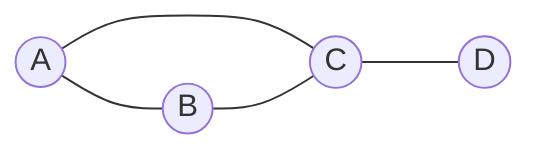
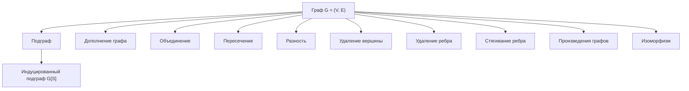

# Билет 1. Графы: определения и основные операции над графами

## 1. Краткая идея

Графовая модель описывает систему как набор объектов и связей между ними. Объекты называются вершинами, связи - ребрами или дугами. Графы удобны там, где важна не внутренняя природа объектов, а структура отношений: дороги между городами, зависимости задач, социальные связи, компьютерные сети, схемы переходов состояний, отношения наследования и т.д.

Главная идея графов: сложную систему можно изучать через свойства ее связности, маршрутов, циклов, степеней вершин, подструктур и преобразований. Для анализа графа важно уметь:

- корректно задать граф;
- понимать, к какому виду он относится;
- выполнять основные операции над графами;
- выбирать подходящее представление: множественное, матричное, списковое;
- распознавать инварианты, которые сохраняются при изоморфизме или преобразованиях.

## 2. Основные определения

### 2.1. Неориентированный граф

Неориентированный граф обычно задается парой:

\[
G = (V, E),
\]

где:

- \(V\) - множество вершин;
- \(E\) - множество ребер;
- каждое ребро в простом неориентированном графе является неупорядоченной парой различных вершин: \(\{u, v\}\), где \(u, v \in V\), \(u \ne v\).

Если \(e = \{u, v\}\), то говорят:

- ребро \(e\) соединяет вершины \(u\) и \(v\);
- вершины \(u\) и \(v\) смежны;
- ребро \(e\) инцидентно вершинам \(u\) и \(v\).

### 2.2. Ориентированный граф

Ориентированный граф, или орграф, задается парой:

\[
D = (V, A),
\]

где:

- \(V\) - множество вершин;
- \(A\) - множество дуг;
- каждая дуга является упорядоченной парой \((u, v)\), где \(u, v \in V\).

Для дуги \((u, v)\):

- \(u\) - начало дуги;
- \(v\) - конец дуги;
- дуга направлена из \(u\) в \(v\).

В орграфе наличие дуги \((u, v)\) не означает наличие дуги \((v, u)\).

### 2.3. Петли и кратные ребра

Петля - ребро или дуга, соединяющая вершину с самой собой:

- в неориентированном графе: \(\{v, v\}\);
- в орграфе: \((v, v)\).

Кратные, или параллельные, ребра - несколько ребер, соединяющих одну и ту же пару вершин. Для орграфа кратные дуги имеют одинаковое начало и одинаковый конец.

Если граф допускает петли и кратные ребра, его часто называют мультиграфом. Если допускаются только кратные ребра без петель, терминология может зависеть от учебника, но на экзамене важно явно проговорить соглашение.

### 2.4. Смежность, инцидентность, степень

Вершины \(u\) и \(v\) смежны, если между ними есть ребро.

Ребро и вершина инцидентны, если эта вершина является одним из концов ребра.

Степень вершины \(v\) в неориентированном графе обозначается \(\deg(v)\) и равна числу ребер, инцидентных вершине \(v\). Петля обычно дает вклад 2 в степень вершины, потому что оба конца петли совпадают с этой вершиной.

Для орграфа различают:

- полустепень исхода \(\deg^+(v)\) - количество дуг, выходящих из \(v\);
- полустепень захода \(\deg^-(v)\) - количество дуг, входящих в \(v\);
- полную степень: \(\deg(v) = \deg^+(v) + \deg^-(v)\).

### 2.5. Маршрут, цепь, путь, цикл

Маршрут в неориентированном графе - последовательность вершин и ребер:

\[
v_0, e_1, v_1, e_2, \ldots, e_k, v_k,
\]

где каждое ребро \(e_i\) соединяет \(v_{i-1}\) и \(v_i\).

В орграфе аналогично говорят о направленном маршруте, если каждая дуга идет в нужном направлении: \((v_{i-1}, v_i)\).

Часто различают:

- маршрут - вершины и ребра могут повторяться;
- цепь - ребра не повторяются;
- простая цепь, или путь, - вершины не повторяются;
- замкнутый маршрут - начальная и конечная вершины совпадают;
- цикл - замкнутый путь, в котором все вершины, кроме первой и последней, различны.

Некоторые авторы используют слова "цепь" и "путь" иначе, поэтому на экзамене полезно сначала дать свое соглашение.

### 2.6. Связность

Неориентированный граф называется связным, если для любых двух его вершин существует путь между ними.

Компонента связности - максимальный по включению связный подграф. Если граф несвязный, он распадается на несколько компонент связности.

Для орграфов различают:

- сильную связность: для любых \(u\) и \(v\) существует направленный путь из \(u\) в \(v\) и из \(v\) в \(u\);
- слабую связность: если отбросить направления дуг, полученный неориентированный граф связен;
- одностороннюю связность: для любых двух вершин хотя бы одна достижима из другой.

### 2.7. Подграф

Граф \(H = (V_H, E_H)\) называется подграфом графа \(G = (V, E)\), если:

\[
V_H \subseteq V,\quad E_H \subseteq E,
\]

и каждое ребро из \(E_H\) соединяет вершины из \(V_H\).

Важные частные случаи:

- остовный подграф - подграф, содержащий все вершины исходного графа;
- индуцированный подграф \(G[S]\) по множеству вершин \(S \subseteq V\) - подграф, содержащий все ребра исходного графа, оба конца которых лежат в \(S\);
- реберно-индуцированный подграф - подграф, заданный выбранным множеством ребер и всеми их концами.

## 3. Виды графов

### 3.1. Простой граф

Простой граф - неориентированный граф без петель и кратных ребер. В простом графе между двумя различными вершинами может быть не более одного ребра.

Пример простого графа:



Для этого графа:

- \(V = \{A, B, C, D\}\);
- \(E = \{\{A,B\}, \{A,C\}, \{B,C\}, \{C,D\}\}\);
- \(\deg(A)=2\), \(\deg(B)=2\), \(\deg(C)=3\), \(\deg(D)=1\).

### 3.2. Полный граф

Полный граф \(K_n\) - простой граф на \(n\) вершинах, в котором каждая пара различных вершин соединена ребром.

Число ребер в полном графе:

\[
|E(K_n)| = \frac{n(n-1)}{2}.
\]

### 3.3. Пустой и нулевой граф

Пустой граф часто означает граф без ребер: \(E = \varnothing\). При этом вершины могут быть.

Нулевой граф иногда означает граф без вершин: \(V = \varnothing\). Терминология не всегда едина, поэтому лучше уточнять определение.

### 3.4. Регулярный граф

Граф называется \(r\)-регулярным, если степень каждой его вершины равна \(r\):

\[
\forall v \in V: \deg(v)=r.
\]

Например, цикл \(C_n\) при \(n \ge 3\) является 2-регулярным графом.

### 3.5. Двудольный граф

Граф называется двудольным, если множество его вершин можно разбить на две доли \(X\) и \(Y\) так, что каждое ребро соединяет вершину из \(X\) с вершиной из \(Y\), а внутри одной доли ребер нет.

\[
V = X \cup Y,\quad X \cap Y = \varnothing.
\]

Критерий: граф двудолен тогда и только тогда, когда в нем нет циклов нечетной длины.

Полный двудольный граф \(K_{m,n}\) содержит все возможные ребра между долями размеров \(m\) и \(n\), поэтому имеет \(mn\) ребер.

### 3.6. Взвешенный граф

Взвешенный граф - граф, в котором ребрам или дугам сопоставлены веса:

\[
w: E \to \mathbb{R}
\]

или для орграфа:

\[
w: A \to \mathbb{R}.
\]

Вес может означать расстояние, стоимость, пропускную способность, время, вероятность, штраф и т.д.

### 3.7. Планарный граф

Планарный граф - граф, который можно изобразить на плоскости так, чтобы его ребра пересекались только в общих вершинах.

Для связного планарного графа справедлива формула Эйлера:

\[
|V| - |E| + |F| = 2,
\]

где \(F\) - множество граней плоского изображения графа.

### 3.8. Дерево и лес

Дерево - связный ациклический неориентированный граф.

Эквивалентные свойства дерева на \(n\) вершинах:

- граф связен и не содержит циклов;
- между любыми двумя вершинами существует ровно один простой путь;
- граф связен и имеет \(n-1\) ребро;
- граф ацикличен и имеет \(n-1\) ребро.

Лес - неориентированный граф без циклов. Каждая компонента связности леса является деревом.

## 4. Операции над графами

Операции над графами позволяют строить новые графы из существующих, упрощать модель, выделять важные части или сравнивать структуры.



### 4.1. Объединение графов

Пусть:

\[
G_1=(V_1,E_1),\quad G_2=(V_2,E_2).
\]

Объединением графов называется граф:

\[
G_1 \cup G_2 = (V_1 \cup V_2,\ E_1 \cup E_2).
\]

Если множества вершин пересекаются, общие вершины отождествляются. Если графы простые, результат остается простым при обычном множественном объединении ребер.

### 4.2. Пересечение графов

Пересечение графов:

\[
G_1 \cap G_2 = (V_1 \cap V_2,\ E_1 \cap E_2),
\]

при условии, что ребра из \(E_1 \cap E_2\) имеют оба конца в \(V_1 \cap V_2\). На практике иногда сначала пересекают множества вершин, а затем берут только те общие ребра, которые допустимы в новом графе.

### 4.3. Разность графов

Разность по ребрам:

\[
G_1 - E_2 = (V_1,\ E_1 \setminus E_2).
\]

Разность по вершинам:

\[
G - S
\]

означает удаление всех вершин из \(S \subseteq V\) и всех инцидентных им ребер.

Важно не путать удаление ребра и удаление вершины:

- при удалении ребра вершины остаются;
- при удалении вершины исчезают все инцидентные ей ребра.

### 4.4. Дополнение графа

Для простого графа \(G=(V,E)\) дополнение \(\overline{G}\) имеет то же множество вершин, а его ребра соединяют те пары различных вершин, которые не были соединены в \(G\):

\[
\overline{G} = (V,\ \{\{u,v\}: u,v \in V,\ u \ne v,\ \{u,v\}\notin E\}).
\]

Иными словами:

\[
E(\overline{G}) = E(K_{|V|}) \setminus E(G).
\]

Для дополнения простого графа:

\[
\deg_{\overline{G}}(v) = |V|-1-\deg_G(v).
\]

### 4.5. Удаление вершины и ребра

Удаление вершины \(v\):

\[
G - v = (V \setminus \{v\},\ E'),
\]

где \(E'\) содержит все ребра из \(E\), не инцидентные вершине \(v\).

Удаление ребра \(e\):

\[
G - e = (V,\ E \setminus \{e\}).
\]

Эти операции часто применяются при доказательствах по индукции, анализе связности, поиске мостов и точек сочленения.

### 4.6. Добавление вершины и ребра

Добавление изолированной вершины:

\[
G' = (V \cup \{x\}, E).
\]

Добавление ребра между существующими вершинами:

\[
G' = (V,\ E \cup \{\{u,v\}\}).
\]

В простом графе ребро можно добавить только если \(u \ne v\) и такого ребра еще нет.

### 4.7. Стягивание ребра

Стягивание ребра \(e=\{u,v\}\) - операция, при которой вершины \(u\) и \(v\) объединяются в одну новую вершину, а ребро \(e\) исчезает. Все ребра, ранее инцидентные \(u\) или \(v\), становятся инцидентными новой вершине.

После стягивания в общем случае могут появиться петли или кратные ребра. Если результат должен быть простым графом, петли удаляют, а кратные ребра заменяют одним ребром.

Стягивание важно в теории миноров графов и в алгоритмах на графах.

### 4.8. Разбиение ребра

Разбиение ребра \(\{u,v\}\) - обратная по смыслу операция к стягиванию: ребро удаляется, добавляется новая вершина \(x\), а вместо исходного ребра появляются два ребра:

\[
\{u,x\},\quad \{x,v\}.
\]

Эта операция сохраняет связность, но увеличивает число вершин и ребер на 1.

### 4.9. Слияние и отождествление вершин

Отождествление вершин - операция, при которой несколько вершин заменяются одной. Она похожа на стягивание, но не обязательно применяется только к концам одного ребра.

При отождествлении также могут возникать петли и кратные ребра.

### 4.10. Произведения графов

Существует несколько стандартных произведений графов. На экзамене обычно достаточно знать, что это операции, строящие граф на декартовом произведении множеств вершин.

Для графов \(G=(V_G,E_G)\) и \(H=(V_H,E_H)\) множество вершин произведения часто имеет вид:

\[
V(G \square H) = V_G \times V_H.
\]

Для декартова произведения \(G \square H\) вершины \((g,h)\) и \((g',h')\) смежны, если:

- \(g=g'\) и \(\{h,h'\}\in E_H\);
- или \(h=h'\) и \(\{g,g'\}\in E_G\).

Например, прямоугольные решетки можно рассматривать как декартовы произведения путей.

### 4.11. Транспонирование орграфа

Для орграфа \(D=(V,A)\) транспонированный, или обратный, орграф \(D^T\) получается заменой направления каждой дуги:

\[
A(D^T)=\{(v,u):(u,v)\in A(D)\}.
\]

Эта операция используется, например, в алгоритмах поиска сильных компонент связности.

### 4.12. Замыкание отношения достижимости

Если орграф рассматривать как бинарное отношение на множестве вершин, то можно строить транзитивное замыкание. В нем дуга \((u,v)\) присутствует тогда и только тогда, когда в исходном орграфе существует направленный путь из \(u\) в \(v\).

Транзитивное замыкание помогает отвечать на вопросы достижимости.

## 5. Матричные и множественные представления

### 5.1. Множественное представление

Самое строгое математическое задание графа:

\[
G=(V,E).
\]

Пример:

\[
V=\{1,2,3,4\},
\]

\[
E=\{\{1,2\}, \{1,3\}, \{2,3\}, \{3,4\}\}.
\]

Такое представление удобно для определений, доказательств и операций над множествами.

### 5.2. Матрица смежности

Для простого неориентированного графа с вершинами \(v_1,\ldots,v_n\) матрица смежности \(A=(a_{ij})\) задается так:

\[
a_{ij} =
\begin{cases}
1, & \text{если } \{v_i,v_j\}\in E,\\
0, & \text{иначе.}
\end{cases}
\]

Свойства матрицы смежности простого неориентированного графа:

- матрица симметрична: \(a_{ij}=a_{ji}\);
- на главной диагонали стоят нули, если нет петель;
- сумма элементов \(i\)-й строки равна степени вершины \(v_i\);
- сумма всех элементов матрицы равна \(2|E|\).

Для примера из раздела 3.1 при порядке вершин \(A,B,C,D\):

\[
\begin{pmatrix}
0 & 1 & 1 & 0\\
1 & 0 & 1 & 0\\
1 & 1 & 0 & 1\\
0 & 0 & 1 & 0
\end{pmatrix}
\]

Для орграфа матрица смежности обычно задается так:

\[
a_{ij}=1 \Leftrightarrow (v_i,v_j)\in A.
\]

Она не обязана быть симметричной. Сумма строки дает полустепень исхода, сумма столбца - полустепень захода.

### 5.3. Матрица инцидентности

Пусть граф имеет вершины \(v_1,\ldots,v_n\) и ребра \(e_1,\ldots,e_m\). Матрица инцидентности \(B\) имеет размер \(n \times m\).

Для неориентированного графа:

\[
b_{ij}=1,
\]

если вершина \(v_i\) инцидентна ребру \(e_j\), иначе \(b_{ij}=0\). Для петли иногда ставят 2, потому что петля дважды инцидентна одной вершине.

Для ориентированного графа часто используют знаковую матрицу инцидентности:

\[
b_{ij} =
\begin{cases}
-1, & \text{если дуга } e_j \text{ выходит из } v_i,\\
1, & \text{если дуга } e_j \text{ входит в } v_i,\\
0, & \text{иначе.}
\end{cases}
\]

Иногда знаки выбирают наоборот. Главное - явно указать соглашение.

### 5.4. Список смежности

Список смежности хранит для каждой вершины список ее соседей.

Для графа из примера:

```text
A: B, C
B: A, C
C: A, B, D
D: C
```

Такое представление удобно для алгоритмов обхода, особенно если граф разреженный, то есть \(|E|\) существенно меньше \(|V|^2\).

### 5.5. Список ребер

Список ребер - перечисление всех ребер:

```text
(A, B)
(A, C)
(B, C)
(C, D)
```

Он прост, компактен и удобен для алгоритмов, которые сортируют или просматривают ребра, например для алгоритма Краскала.

## 6. Свойства и инварианты

### 6.1. Лемма о рукопожатиях

Для любого конечного неориентированного графа:

\[
\sum_{v\in V}\deg(v)=2|E|.
\]

Каждое ребро дает вклад 2 в сумму степеней: по одному на каждый конец, а петля также считается дважды.

Следствие: число вершин нечетной степени в любом неориентированном графе четно.

Для орграфа:

\[
\sum_{v\in V}\deg^+(v)=|A|,
\]

\[
\sum_{v\in V}\deg^-(v)=|A|,
\]

поэтому:

\[
\sum_{v\in V}\deg^+(v)=\sum_{v\in V}\deg^-(v).
\]

### 6.2. Изоморфизм графов

Графы \(G_1=(V_1,E_1)\) и \(G_2=(V_2,E_2)\) изоморфны, если существует биекция:

\[
f: V_1 \to V_2
\]

такая, что:

\[
\{u,v\}\in E_1 \Leftrightarrow \{f(u),f(v)\}\in E_2.
\]

Изоморфные графы имеют одинаковую структуру, хотя вершины могут называться по-разному.

Инварианты изоморфизма - свойства, сохраняющиеся при переименовании вершин:

- число вершин;
- число ребер;
- последовательность степеней;
- число компонент связности;
- наличие циклов заданной длины;
- связность;
- двудольность;
- планарность;
- диаметр и радиус, если граф связный.

Важно: совпадение некоторых инвариантов еще не гарантирует изоморфизм, но различие хотя бы одного инварианта доказывает, что графы не изоморфны.

### 6.3. Последовательность степеней

Последовательность степеней - список степеней всех вершин, обычно упорядоченный по невозрастанию.

Например, для графа из раздела 3.1:

\[
(3,2,2,1).
\]

Она часто используется как быстрый тест на неизоморфность.

### 6.4. Расстояние, эксцентриситет, радиус и диаметр

Расстояние \(d(u,v)\) между вершинами \(u\) и \(v\) - длина кратчайшего пути между ними. Если пути нет, расстояние может считаться бесконечным или неопределенным в рамках компоненты.

Эксцентриситет вершины:

\[
e(v)=\max_{u\in V} d(v,u)
\]

для связного графа.

Радиус графа:

\[
r(G)=\min_{v\in V} e(v).
\]

Диаметр графа:

\[
d(G)=\max_{v\in V} e(v).
\]

Центр графа - множество вершин с минимальным эксцентриситетом.

### 6.5. Мосты и точки сочленения

Мост - ребро, удаление которого увеличивает число компонент связности.

Точка сочленения - вершина, удаление которой вместе с инцидентными ребрами увеличивает число компонент связности.

Эти понятия показывают уязвимые элементы сети.

### 6.6. Независимость и клики

Независимое множество вершин - множество вершин, никакие две из которых не смежны.

Клика - множество вершин, любые две из которых смежны. Иначе говоря, клика - полный подграф.

В дополнении графа независимые множества переходят в клики, а клики - в независимые множества.

## 7. Примеры

### 7.1. Пример задания графа и его дополнения

Пусть:

\[
V=\{1,2,3,4\},
\]

\[
E=\{\{1,2\}, \{2,3\}\}.
\]

Тогда полный граф на этих вершинах имеет ребра:

\[
\{\{1,2\}, \{1,3\}, \{1,4\}, \{2,3\}, \{2,4\}, \{3,4\}\}.
\]

Дополнение графа:

\[
E(\overline{G})=\{\{1,3\}, \{1,4\}, \{2,4\}, \{3,4\}\}.
\]

### 7.2. Пример операции удаления вершины

Если в графе:

\[
E=\{\{A,B\}, \{A,C\}, \{B,C\}, \{C,D\}\}
\]

удалить вершину \(C\), то исчезнут все ребра, инцидентные \(C\):

\[
\{A,C\}, \{B,C\}, \{C,D\}.
\]

Останется:

\[
V'=\{A,B,D\},\quad E'=\{\{A,B\}\}.
\]

Вершина \(D\) станет изолированной.

### 7.3. Пример матрицы смежности для орграфа

Пусть:

\[
V=\{1,2,3\},
\]

\[
A=\{(1,2),(2,3),(3,1),(1,3)\}.
\]

При порядке вершин \(1,2,3\):

\[
\begin{pmatrix}
0 & 1 & 1\\
0 & 0 & 1\\
1 & 0 & 0
\end{pmatrix}
\]

Суммы строк:

- для вершины 1: \(\deg^+(1)=2\);
- для вершины 2: \(\deg^+(2)=1\);
- для вершины 3: \(\deg^+(3)=1\).

Суммы столбцов:

- для вершины 1: \(\deg^-(1)=1\);
- для вершины 2: \(\deg^-(2)=1\);
- для вершины 3: \(\deg^-(3)=2\).

## 8. Типичные ошибки

1. Путать ребро и дугу. В неориентированном графе \(\{u,v\}=\{v,u\}\), а в орграфе \((u,v)\) и \((v,u)\) - разные дуги.

2. Считать, что граф обязательно должен быть связным. По общему определению граф может быть несвязным.

3. Забывать удалять инцидентные ребра при удалении вершины.

4. Путать подграф и индуцированный подграф. В индуцированном подграфе по выбранным вершинам должны быть все ребра исходного графа между этими вершинами.

5. Неверно считать степень петли. В неориентированном графе петля обычно дает вклад 2 в степень вершины.

6. Считать, что совпадение числа вершин, числа ребер и последовательности степеней доказывает изоморфизм. Это только необходимые признаки, но не достаточные в общем случае.

7. Строить дополнение для графа с петлями и кратными ребрами без уточнения соглашений. Классическое дополнение определяется для простого графа.

8. Путать матрицу смежности и матрицу инцидентности. Матрица смежности имеет размер \(|V|\times|V|\), а матрица инцидентности - \(|V|\times|E|\).

9. Для орграфа ошибочно считать матрицу смежности симметричной. Симметричность характерна для неориентированных графов.

10. Называть любой замкнутый маршрут циклом. В цикле, по стандартному определению, вершины не должны повторяться, кроме совпадения первой и последней.

## 9. Что сказать на экзамене

Хороший ответ можно построить так:

1. Начать с общей идеи: граф - модель объектов и связей.

2. Дать формальное определение неориентированного графа \(G=(V,E)\), затем орграфа \(D=(V,A)\).

3. Объяснить различие между вершинами, ребрами, дугами, петлями и кратными ребрами.

4. Ввести базовые отношения: смежность вершин, инцидентность ребра и вершины, степень вершины, входящая и исходящая степени в орграфе.

5. Рассказать про маршруты, пути, циклы, связность и компоненты связности.

6. Перечислить основные виды графов: простой, мультиграф, ориентированный, взвешенный, полный, пустой, двудольный, регулярный, планарный, дерево.

7. Перейти к операциям: объединение, пересечение, разность, дополнение, удаление и добавление вершин и ребер, стягивание ребра, разбиение ребра, транспонирование орграфа.

8. Показать способы представления: множества \(V,E\), матрица смежности, матрица инцидентности, список смежности, список ребер.

9. Завершить свойствами и инвариантами: лемма о рукопожатиях, последовательность степеней, связность, компоненты, изоморфизм, мосты, точки сочленения.

Ключевая формулировка: графовая модель фиксирует структуру отношений, а операции над графами позволяют выделять подструктуры, объединять модели, удалять элементы, строить дополнения и преобразовывать граф без потери контроля над его свойствами.
