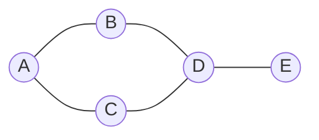
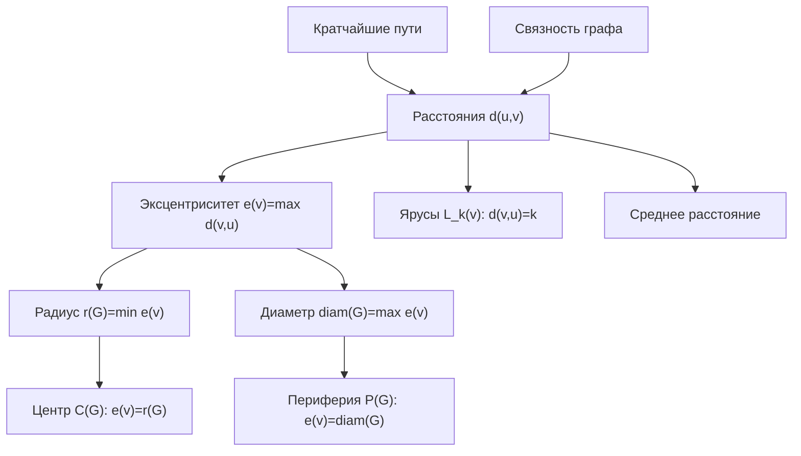

# Билет 2. Формы задания графов; метрические характеристики графа

## 1. Формы задания графов

Граф задается множеством вершин и множеством связей между ними. В общем виде граф обозначают

\[
G=(V,E),
\]

где \(V\) — множество вершин, а \(E\) — множество ребер. Если ребра имеют направление, граф называется ориентированным, или орграфом. Если направление не задано, граф называется неориентированным. Если каждому ребру сопоставлено число, например длина, стоимость, пропускная способность или время перехода, граф называется взвешенным.

Один и тот же граф можно задать разными способами. Выбор формы зависит от того, какие операции нужно выполнять: быстро проверять наличие ребра, перечислять соседей вершины, запускать алгоритмы кратчайших путей, хранить разреженный или плотный граф.

### 1.1. Список ребер

Список ребер — это перечисление всех ребер графа.

Для неориентированного графа ребро записывают как неупорядоченную пару:

\[
\{u,v\}.
\]

Для ориентированного графа дуга записывается как упорядоченная пара:

\[
(u,v),
\]

где \(u\) — начало дуги, \(v\) — конец дуги.

Для взвешенного графа удобно хранить тройки:

\[
(u,v,w),
\]

где \(w\) — вес ребра или дуги.

**Пример.** Пусть

\[
V=\{A,B,C,D,E\},
\]

а множество ребер неориентированного графа:

\[
E=\{AB,AC,BD,CD,DE\}.
\]

Тогда список ребер можно записать так:

| Ребро | Концы ребра |
|---|---|
| 1 | \(A,B\) |
| 2 | \(A,C\) |
| 3 | \(B,D\) |
| 4 | \(C,D\) |
| 5 | \(D,E\) |

**Достоинства:**

- простая и компактная форма для разреженных графов;
- удобно добавлять новые ребра;
- естественно хранить веса ребер;
- хорошо подходит для алгоритмов, которые обрабатывают все ребра, например алгоритма Краскала.

**Недостатки:**

- проверка наличия конкретного ребра \((u,v)\) обычно требует просмотра списка;
- неудобно быстро получать всех соседей вершины без дополнительной структуры;
- для частых запросов смежности может быть медленнее матрицы смежности.

Память: \(O(m)\), где \(m=|E|\).

### 1.2. Список смежности

Список смежности для каждой вершины хранит список вершин, смежных с ней.

Для неориентированного графа каждое ребро \(uv\) обычно записывается дважды: \(v\) в списке соседей \(u\) и \(u\) в списке соседей \(v\). Для ориентированного графа в списке вершины \(u\) хранят вершины, в которые выходят дуги из \(u\).

Для графа из примера:

| Вершина | Соседи |
|---|---|
| \(A\) | \(B,C\) |
| \(B\) | \(A,D\) |
| \(C\) | \(A,D\) |
| \(D\) | \(B,C,E\) |
| \(E\) | \(D\) |

Если граф взвешенный, рядом с соседом указывают вес:

| Вершина | Соседи с весами |
|---|---|
| \(A\) | \((B,2),(C,5)\) |
| \(B\) | \((A,2),(D,1)\) |

**Достоинства:**

- экономно хранит разреженные графы;
- удобно перечислять соседей вершины;
- хорошо подходит для обходов в ширину и глубину, алгоритма Дейкстры на разреженных графах, поиска компонент связности.

**Недостатки:**

- проверка наличия ребра \(uv\) требует поиска \(v\) в списке соседей \(u\);
- в неориентированном графе ребро хранится дважды;
- для плотных графов преимущество по памяти уменьшается.

Память: \(O(n+m)\), где \(n=|V|\), \(m=|E|\).

### 1.3. Список инцидентности

Список инцидентности для каждой вершины хранит ребра, которым эта вершина инцидентна, то есть ребра, для которых она является одним из концов.

Для примера с ребрами

\[
e_1=AB,\ e_2=AC,\ e_3=BD,\ e_4=CD,\ e_5=DE
\]

получим:

| Вершина | Инцидентные ребра |
|---|---|
| \(A\) | \(e_1,e_2\) |
| \(B\) | \(e_1,e_3\) |
| \(C\) | \(e_2,e_4\) |
| \(D\) | \(e_3,e_4,e_5\) |
| \(E\) | \(e_5\) |

**Достоинства:**

- удобно работать с ребрами как с самостоятельными объектами;
- полезно, когда у ребер много атрибутов: вес, цвет, пропускная способность, номер, состояние;
- удобно для задач, где важно отношение "вершина — ребро", например в сетевых моделях.

**Недостатки:**

- менее удобно напрямую получать соседние вершины;
- проверка смежности двух вершин требует анализа инцидентных ребер;
- часто используется как вспомогательная, а не основная форма хранения.

Память: \(O(n+m)\), при этом каждое неориентированное ребро встречается в двух списках инцидентности.

### 1.4. Матрица смежности

Матрица смежности — это квадратная матрица \(A\) размера \(n \times n\), где строки и столбцы соответствуют вершинам графа.

Для невзвешенного графа:

\[
a_{ij}=
\begin{cases}
1, & \text{если вершины } v_i \text{ и } v_j \text{ смежны},\\
0, & \text{иначе}.
\end{cases}
\]

Для ориентированного графа \(a_{ij}=1\), если есть дуга из \(v_i\) в \(v_j\). Для неориентированного графа матрица смежности симметрична относительно главной диагонали.

Для графа из примера в порядке вершин \(A,B,C,D,E\):

|   | A | B | C | D | E |
|---|---:|---:|---:|---:|---:|
| A | 0 | 1 | 1 | 0 | 0 |
| B | 1 | 0 | 0 | 1 | 0 |
| C | 1 | 0 | 0 | 1 | 0 |
| D | 0 | 1 | 1 | 0 | 1 |
| E | 0 | 0 | 0 | 1 | 0 |

**Достоинства:**

- проверка наличия ребра выполняется за \(O(1)\);
- удобно применять матричные методы;
- хорошо подходит для плотных графов;
- в ориентированном графе легко отличать входящие и исходящие дуги по столбцам и строкам.

**Недостатки:**

- требует \(O(n^2)\) памяти даже для разреженного графа;
- перечисление соседей вершины требует просмотра всей строки, то есть \(O(n)\);
- при большом количестве вершин и малом числе ребер хранится много нулей.

Память: \(O(n^2)\).

### 1.5. Матрица инцидентности

Матрица инцидентности описывает связь вершин и ребер. Ее строки соответствуют вершинам, а столбцы — ребрам.

Для неориентированного графа:

\[
b_{ij}=
\begin{cases}
1, & \text{если вершина } v_i \text{ инцидентна ребру } e_j,\\
0, & \text{иначе}.
\end{cases}
\]

Для ориентированного графа часто используют знаковую матрицу инцидентности:

\[
b_{ij}=
\begin{cases}
-1, & \text{если дуга } e_j \text{ выходит из } v_i,\\
1, & \text{если дуга } e_j \text{ входит в } v_i,\\
0, & \text{если вершина } v_i \text{ не инцидентна дуге } e_j.
\end{cases}
\]

Для неориентированного графа с ребрами \(e_1=AB\), \(e_2=AC\), \(e_3=BD\), \(e_4=CD\), \(e_5=DE\):

|   | \(e_1\) | \(e_2\) | \(e_3\) | \(e_4\) | \(e_5\) |
|---|---:|---:|---:|---:|---:|
| A | 1 | 1 | 0 | 0 | 0 |
| B | 1 | 0 | 1 | 0 | 0 |
| C | 0 | 1 | 0 | 1 | 0 |
| D | 0 | 0 | 1 | 1 | 1 |
| E | 0 | 0 | 0 | 0 | 1 |

**Достоинства:**

- хорошо показывает отношение вершин и ребер;
- удобна для алгебраических методов теории графов;
- полезна в задачах потоков, электрических цепей, сетевых моделей.

**Недостатки:**

- память \(O(nm)\), что может быть много;
- проверка смежности вершин не так удобна, как в матрице смежности;
- для простого хранения больших разреженных графов обычно менее практична, чем список смежности.

Память: \(O(nm)\).

### 1.6. Матрица весов и матрица расстояний

Матрица весов используется для взвешенных графов. В ячейке \(w_{ij}\) хранится вес ребра между \(v_i\) и \(v_j\). Если ребра нет, часто записывают \(\infty\), пустое значение или специальную константу. На главной диагонали обычно стоит 0, так как расстояние от вершины до самой себя равно 0.

Для взвешенного графа:

|   | A | B | C | D |
|---|---:|---:|---:|---:|
| A | 0 | 2 | 5 | \(\infty\) |
| B | 2 | 0 | \(\infty\) | 1 |
| C | 5 | \(\infty\) | 0 | 3 |
| D | \(\infty\) | 1 | 3 | 0 |

Матрица расстояний отличается от матрицы весов тем, что в ней хранится не вес непосредственного ребра, а длина кратчайшего пути между каждой парой вершин:

\[
d_{ij}=d(v_i,v_j).
\]

Для невзвешенного графа длина пути обычно измеряется числом ребер. Для взвешенного графа длина пути равна сумме весов входящих в него ребер.

**Достоинства матрицы расстояний:**

- сразу дает расстояние между любой парой вершин;
- удобна для вычисления эксцентриситета, радиуса, диаметра и центра;
- является результатом алгоритмов поиска всех кратчайших путей, например алгоритма Флойда — Уоршелла.

**Недостатки:**

- требует \(O(n^2)\) памяти;
- построение может быть дорогим для больших графов;
- при изменении ребер может потребоваться пересчет расстояний.

### 1.7. Визуальное задание графа

Граф можно задать рисунком: вершины изображаются точками или кругами, а ребра — линиями или стрелками. Такой способ удобен для понимания структуры небольших графов, но не является строгим для машинной обработки, если рисунок не сопровождается формальным описанием.

Пример рассматриваемого графа:

**Достоинства:**

- наглядность;
- удобно видеть мосты, циклы, центральные и периферийные вершины;
- хорошо подходит для объяснения и проверки небольших примеров.

**Недостатки:**

- для больших графов рисунок становится перегруженным;
- расположение вершин может вводить в заблуждение: геометрическая близость на рисунке не всегда означает малое графовое расстояние;
- неудобно непосредственно выполнять алгоритмы без перевода в формальную структуру.

### 1.8. Сравнение форм задания графов

Пусть \(n\) — число вершин, \(m\) — число ребер.

| Форма задания | Память | Быстрая проверка ребра | Быстрое перечисление соседей | Когда удобна |
|---|---:|---:|---:|---|
| Список ребер | \(O(m)\) | Нет, обычно \(O(m)\) | Нет | Разреженные графы, обработка всех ребер |
| Список смежности | \(O(n+m)\) | Зависит от структуры списка | Да, \(O(\deg v)\) | Обходы, компоненты связности, кратчайшие пути в разреженных графах |
| Список инцидентности | \(O(n+m)\) | Не напрямую | Через инцидентные ребра | Задачи, где ребра имеют самостоятельное значение |
| Матрица смежности | \(O(n^2)\) | Да, \(O(1)\) | Нужно просмотреть строку: \(O(n)\) | Плотные графы, матричные методы |
| Матрица инцидентности | \(O(nm)\) | Не напрямую | Не напрямую | Алгебраические методы, сетевые модели |
| Матрица весов | \(O(n^2)\) | Да, если хранит прямые ребра | Нужно просмотреть строку | Взвешенные плотные графы |
| Матрица расстояний | \(O(n^2)\) | Не про наличие ребра, а про кратчайшее расстояние | Не перечисляет соседей | Анализ метрических характеристик |
| Визуальное задание | Зависит от рисунка | Нет | Наглядно для малых графов | Объяснение структуры, иллюстрация |

Главное практическое правило: для разреженных графов чаще используют списки смежности, а для плотных графов и частых запросов "есть ли ребро между \(u\) и \(v\)" — матрицу смежности.

## 2. Метрические характеристики графа

Метрические характеристики описывают расстояния между вершинами и положение вершин внутри графа. Обычно они рассматриваются для связных неориентированных графов. В ориентированных графах расстояния зависят от направления дуг, поэтому путь из \(u\) в \(v\) может существовать, а из \(v\) в \(u\) — нет.

### 2.1. Маршрут, цепь, путь и кратчайший путь

**Маршрут** — последовательность вершин и ребер, в которой каждое ребро соединяет соседние вершины последовательности. В маршруте вершины и ребра могут повторяться.

**Цепь** — маршрут, в котором ребра не повторяются.

**Простая цепь**, или простой путь в распространенной терминологии, — маршрут, в котором вершины не повторяются.

**Длина пути** в невзвешенном графе равна числу ребер в пути. Во взвешенном графе длина пути равна сумме весов его ребер.

**Кратчайший путь** между вершинами \(u\) и \(v\) — путь минимальной длины среди всех путей из \(u\) в \(v\).

### 2.2. Расстояние

Расстояние между вершинами \(u\) и \(v\), обозначаемое \(d(u,v)\), — это длина кратчайшего пути между ними.

Для невзвешенного графа:

\[
d(u,v)=\min \{\text{число ребер в пути из }u\text{ в }v\}.
\]

Если \(u=v\), то

\[
d(u,u)=0.
\]

Если пути между вершинами нет, расстояние считают бесконечным:

\[
d(u,v)=\infty.
\]

В связном неориентированном графе между любой парой вершин существует путь, поэтому все расстояния конечны. Связность является важным условием корректного вычисления радиуса, диаметра, центра и среднего расстояния в обычном конечном виде. Если граф несвязный, эти характеристики либо определяют отдельно для компонент связности, либо используют специальные соглашения.

Для неориентированного графа расстояние обладает свойствами метрики:

1. \(d(u,v)\ge 0\);
2. \(d(u,v)=0\) тогда и только тогда, когда \(u=v\);
3. \(d(u,v)=d(v,u)\);
4. \(d(u,w)\le d(u,v)+d(v,w)\) — неравенство треугольника.

### 2.3. Эксцентриситет вершины

Эксцентриситет вершины \(v\), обозначаемый \(e(v)\), — это максимальное расстояние от \(v\) до всех остальных вершин графа:

\[
e(v)=\max_{u\in V} d(v,u).
\]

Иными словами, эксцентриситет показывает, насколько далеко от вершины \(v\) находится самая удаленная от нее вершина.

### 2.4. Радиус графа

Радиус графа \(r(G)\) — минимальный эксцентриситет среди всех вершин:

\[
r(G)=\min_{v\in V} e(v).
\]

Радиус показывает, насколько близко можно выбрать "центральную" вершину так, чтобы самая дальняя вершина была как можно ближе.

### 2.5. Диаметр графа

Диаметр графа \(d(G)\), или \(\operatorname{diam}(G)\), — максимальный эксцентриситет среди всех вершин:

\[
\operatorname{diam}(G)=\max_{v\in V} e(v).
\]

Эквивалентно диаметр — это наибольшее расстояние между двумя вершинами графа:

\[
\operatorname{diam}(G)=\max_{u,v\in V} d(u,v).
\]

Диаметр показывает "размер" графа в метрическом смысле.

### 2.6. Центр графа

Центр графа \(C(G)\) — множество вершин, эксцентриситет которых равен радиусу:

\[
C(G)=\{v\in V: e(v)=r(G)\}.
\]

Центральные вершины наиболее выгодны с точки зрения максимального расстояния до остальных вершин. Например, при размещении склада, сервера или диспетчерского пункта центр графа минимизирует худший случай удаленности.

### 2.7. Периферия графа

Периферия графа \(P(G)\) — множество вершин, эксцентриситет которых равен диаметру:

\[
P(G)=\{v\in V: e(v)=\operatorname{diam}(G)\}.
\]

Периферийные вершины находятся "на краях" графа: от них до некоторых других вершин расстояние максимально.

### 2.8. Ярус, слой, сфера и шар

Для фиксированной вершины \(v\) можно разбить остальные вершины по расстояниям от нее.

**Ярус** или **слой** номер \(k\) относительно вершины \(v\) — множество вершин, находящихся от \(v\) на расстоянии \(k\):

\[
L_k(v)=\{u\in V: d(v,u)=k\}.
\]

Например:

- \(L_0(v)=\{v\}\);
- \(L_1(v)\) — все соседи вершины \(v\);
- \(L_2(v)\) — вершины, достижимые из \(v\) кратчайшим путем длины 2.

В некоторых курсах множество \(L_k(v)\) называют сферой радиуса \(k\) с центром \(v\). Шар радиуса \(k\) — это множество вершин, расстояние до которых не превосходит \(k\):

\[
B_k(v)=\{u\in V: d(v,u)\le k\}.
\]

Ярусы естественно возникают при обходе графа в ширину: первая волна обхода дает слой 1, вторая — слой 2 и так далее.

### 2.9. Среднее расстояние

Среднее расстояние в связном неориентированном графе — это среднее значение расстояния между всеми различными парами вершин:

\[
\overline{d}(G)=\frac{2}{n(n-1)}\sum_{\{u,v\}\subseteq V} d(u,v).
\]

Можно также записать через упорядоченные пары:

\[
\overline{d}(G)=\frac{1}{n(n-1)}\sum_{u\ne v} d(u,v).
\]

Среднее расстояние показывает типичную удаленность вершин друг от друга. В сетевых задачах оно связано со средней длиной маршрута передачи, средним числом пересадок или средним числом промежуточных переходов.

### 2.10. Схема связей метрических характеристик

## 3. Мини-расчет характеристик на примере

Рассмотрим неориентированный невзвешенный граф:

Множество вершин:

\[
V=\{A,B,C,D,E\}.
\]

Множество ребер:

\[
E=\{AB,AC,BD,CD,DE\}.
\]

Граф связный: из любой вершины можно попасть в любую другую. Значит, все расстояния конечны.

### 3.1. Матрица расстояний

Найдем кратчайшие расстояния между всеми парами вершин.

- Из \(A\): \(d(A,A)=0\), \(d(A,B)=1\), \(d(A,C)=1\), \(d(A,D)=2\), \(d(A,E)=3\).
- Из \(B\): \(d(B,A)=1\), \(d(B,B)=0\), \(d(B,C)=2\), \(d(B,D)=1\), \(d(B,E)=2\).
- Из \(C\): \(d(C,A)=1\), \(d(C,B)=2\), \(d(C,C)=0\), \(d(C,D)=1\), \(d(C,E)=2\).
- Из \(D\): \(d(D,A)=2\), \(d(D,B)=1\), \(d(D,C)=1\), \(d(D,D)=0\), \(d(D,E)=1\).
- Из \(E\): \(d(E,A)=3\), \(d(E,B)=2\), \(d(E,C)=2\), \(d(E,D)=1\), \(d(E,E)=0\).

Матрица расстояний:

|   | A | B | C | D | E |
|---|---:|---:|---:|---:|---:|
| A | 0 | 1 | 1 | 2 | 3 |
| B | 1 | 0 | 2 | 1 | 2 |
| C | 1 | 2 | 0 | 1 | 2 |
| D | 2 | 1 | 1 | 0 | 1 |
| E | 3 | 2 | 2 | 1 | 0 |

### 3.2. Кратчайшие пути

Примеры кратчайших путей:

- между \(A\) и \(D\): \(A-B-D\) или \(A-C-D\), длина 2;
- между \(A\) и \(E\): \(A-B-D-E\) или \(A-C-D-E\), длина 3;
- между \(B\) и \(C\): \(B-A-C\) или \(B-D-C\), длина 2;
- между \(D\) и \(E\): \(D-E\), длина 1.

Важно, что кратчайший путь может быть не единственным.

### 3.3. Эксцентриситеты

Эксцентриситет вершины — максимум в соответствующей строке матрицы расстояний:

| Вершина | Расстояния до остальных вершин | Эксцентриситет |
|---|---|---:|
| \(A\) | \(0,1,1,2,3\) | 3 |
| \(B\) | \(1,0,2,1,2\) | 2 |
| \(C\) | \(1,2,0,1,2\) | 2 |
| \(D\) | \(2,1,1,0,1\) | 2 |
| \(E\) | \(3,2,2,1,0\) | 3 |

Значит:

\[
e(A)=3,\quad e(B)=2,\quad e(C)=2,\quad e(D)=2,\quad e(E)=3.
\]

### 3.4. Радиус, диаметр, центр и периферия

Радиус равен минимальному эксцентриситету:

\[
r(G)=\min\{3,2,2,2,3\}=2.
\]

Диаметр равен максимальному эксцентриситету:

\[
\operatorname{diam}(G)=\max\{3,2,2,2,3\}=3.
\]

Центр графа — вершины с эксцентриситетом 2:

\[
C(G)=\{B,C,D\}.
\]

Периферия графа — вершины с эксцентриситетом 3:

\[
P(G)=\{A,E\}.
\]

Интерпретация: вершины \(B,C,D\) являются наиболее центральными, потому что самая удаленная от каждой из них вершина находится не дальше чем на 2 ребра. Вершины \(A\) и \(E\) периферийные, так как расстояние между ними равно диаметру графа:

\[
d(A,E)=3.
\]

### 3.5. Ярусы относительно вершины \(D\)

Разобьем вершины на слои по расстоянию от \(D\):

\[
L_0(D)=\{D\},
\]

\[
L_1(D)=\{B,C,E\},
\]

\[
L_2(D)=\{A\}.
\]

Более дальних слоев нет, потому что \(e(D)=2\). Следовательно, все вершины графа находятся от \(D\) на расстоянии не более 2.

Для вершины \(A\) слои будут другими:

\[
L_0(A)=\{A\},\quad L_1(A)=\{B,C\},\quad L_2(A)=\{D\},\quad L_3(A)=\{E\}.
\]

Это согласуется с \(e(A)=3\).

### 3.6. Среднее расстояние

В графе \(n=5\) вершин, поэтому число неупорядоченных пар вершин:

\[
\frac{n(n-1)}{2}=\frac{5\cdot 4}{2}=10.
\]

Сложим расстояния между всеми различными неупорядоченными парами:

| Пара | Расстояние |
|---|---:|
| \(A,B\) | 1 |
| \(A,C\) | 1 |
| \(A,D\) | 2 |
| \(A,E\) | 3 |
| \(B,C\) | 2 |
| \(B,D\) | 1 |
| \(B,E\) | 2 |
| \(C,D\) | 1 |
| \(C,E\) | 2 |
| \(D,E\) | 1 |

Сумма:

\[
1+1+2+3+2+1+2+1+2+1=16.
\]

Среднее расстояние:

\[
\overline{d}(G)=\frac{16}{10}=1{,}6.
\]

То есть в среднем две вершины данного графа находятся друг от друга на расстоянии 1,6 ребра.

## 4. Связность и конечность расстояний

Для метрических характеристик принципиально важно, является ли граф связным.

Если граф связный, то:

- между любыми двумя вершинами существует путь;
- все расстояния \(d(u,v)\) конечны;
- эксцентриситет каждой вершины конечен;
- радиус, диаметр, центр, периферия и среднее расстояние определяются обычным образом.

Если граф несвязный, то:

- между вершинами из разных компонент связности пути нет;
- расстояние между такими вершинами равно \(\infty\) или не определено;
- эксцентриситеты могут стать бесконечными;
- радиус и диаметр всего графа в стандартном смысле также могут быть бесконечными;
- на практике метрики часто считают отдельно для каждой компоненты связности.

Например, если к рассмотренному графу добавить изолированную вершину \(F\), то расстояние \(d(A,F)\) не будет конечным, потому что пути из \(A\) в \(F\) нет. Поэтому перед вычислением метрических характеристик обычно сначала проверяют связность графа.

## 5. Краткий итог

Формы задания графов делятся на списковые, матричные и визуальные. Списки ребер, смежности и инцидентности экономны для разреженных графов и удобны для алгоритмической обработки. Матрица смежности требует больше памяти, но позволяет мгновенно проверять наличие ребра. Матрица инцидентности отражает связь вершин и ребер. Матрицы весов и расстояний применяются для взвешенных графов и метрического анализа.

Метрические характеристики строятся на понятии кратчайшего пути. Расстояния между вершинами позволяют определить эксцентриситеты, радиус, диаметр, центр, периферию, ярусы и среднее расстояние. Для связного графа все эти величины конечны и хорошо определены; для несвязного графа их обычно рассматривают по компонентам связности или вводят специальные соглашения о бесконечных расстояниях.
