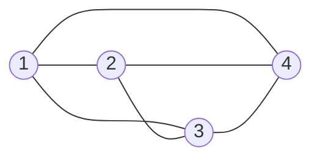
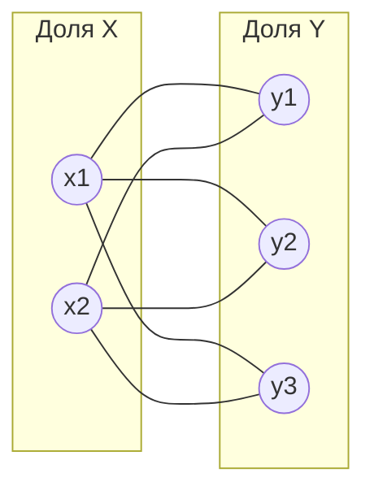
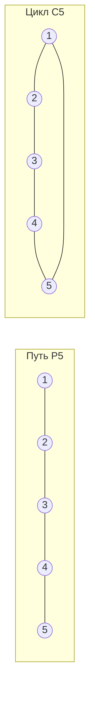
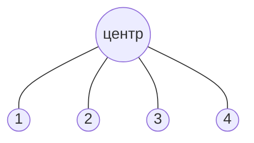
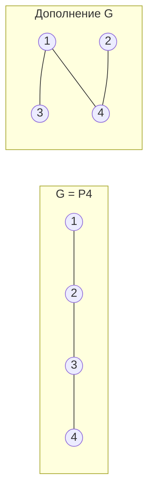
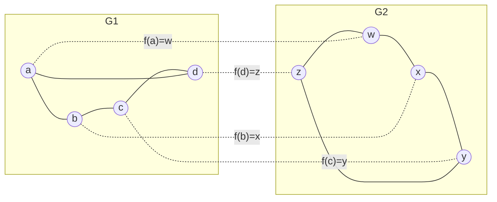
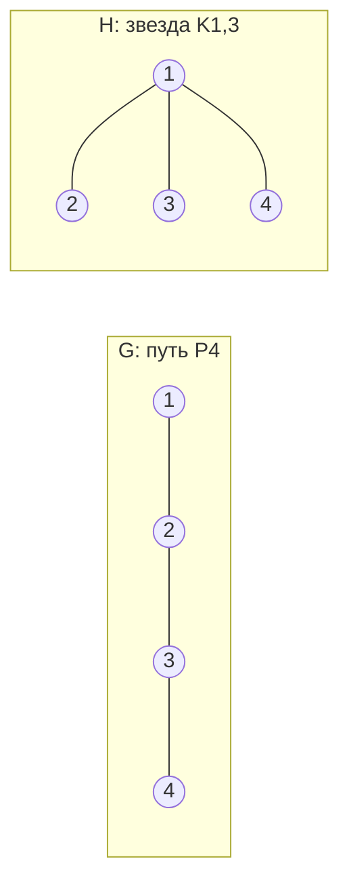
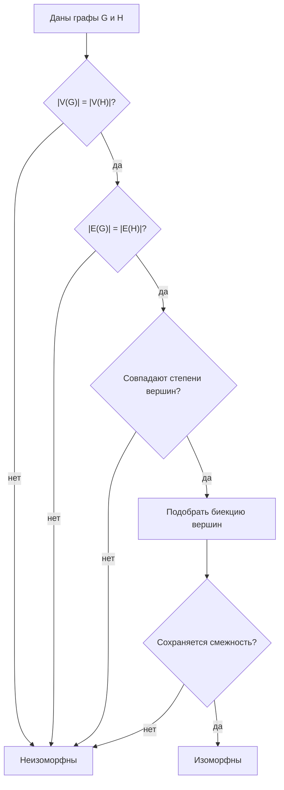

# Билет 3. Специальные графы: полносвязные, однородные, двудольные, кубические графы, цепи и деревья; дополнения, изоморфизм графов

## 1. Базовые обозначения

Граф обычно обозначают как

$$
G = (V, E),
$$

где \(V\) — множество вершин, \(E\) — множество ребер. В простом неориентированном графе ребро — это неупорядоченная пара различных вершин \(\{u, v\}\), петли и кратные ребра отсутствуют.

Основные величины:

- \(|V| = n\) — число вершин графа;
- \(|E| = m\) — число ребер графа;
- \(\deg(v)\) — степень вершины \(v\), то есть число ребер, инцидентных вершине \(v\);
- для простого неориентированного графа выполняется лемма о рукопожатиях:

$$
\sum_{v \in V} \deg(v) = 2|E|.
$$

Каждое ребро дает вклад 1 в степень каждого из двух своих концов, поэтому сумма степеней всегда в два раза больше числа ребер.

## 2. Полный, или полносвязный, граф \(K_n\)

Полный граф \(K_n\) — это простой граф на \(n\) вершинах, в котором каждая пара различных вершин соединена ребром.

Иначе:

$$
E(K_n) = \{\{u, v\}: u, v \in V,\ u \ne v\}.
$$

Свойства полного графа:

- каждая вершина смежна со всеми остальными \(n - 1\) вершинами;
- степень каждой вершины равна

$$
\deg(v) = n - 1;
$$

- число ребер равно числу неупорядоченных пар вершин:

$$
|E(K_n)| = C_n^2 = \frac{n(n - 1)}{2};
$$

- \(K_n\) является \((n - 1)\)-регулярным графом;
- \(K_1\) имеет 0 ребер, \(K_2\) имеет 1 ребро, \(K_3\) — треугольник, \(K_4\) — полный граф на четырех вершинах.

Пример полного графа \(K_4\):

Экзаменационное замечание: если в графе на \(n\) вершинах число ребер равно \(\frac{n(n - 1)}{2}\), то это максимальное возможное число ребер для простого графа. Такой граф обязательно полный.

## 3. Регулярные, или однородные, графы

Граф называется регулярным, или однородным, степени \(r\), если степени всех его вершин одинаковы и равны \(r\):

$$
\forall v \in V:\ \deg(v) = r.
$$

Такой граф также называют \(r\)-регулярным.

Если граф \(G\) является \(r\)-регулярным и имеет \(n\) вершин, то по лемме о рукопожатиях:

$$
nr = 2|E|,
$$

откуда

$$
|E| = \frac{nr}{2}.
$$

Следствия:

- произведение \(nr\) должно быть четным;
- не существует простого \(r\)-регулярного графа на \(n\) вершинах, если \(nr\) нечетно;
- для простого графа обязательно \(0 \le r \le n - 1\);
- полный граф \(K_n\) является \((n - 1)\)-регулярным;
- цикл \(C_n\) при \(n \ge 3\) является 2-регулярным графом;
- кубический граф — частный случай регулярного графа при \(r = 3\).

Примеры:

- \(K_5\) — 4-регулярный граф;
- квадрат \(C_4\) — 2-регулярный граф;
- граф без ребер на \(n\) вершинах — 0-регулярный граф.

## 4. Двудольные графы

Граф называется двудольным, если множество его вершин можно разбить на два непересекающихся подмножества \(X\) и \(Y\) так, что каждое ребро соединяет вершину из \(X\) с вершиной из \(Y\). Ребер внутри одной доли быть не должно.

Формально:

$$
V = X \cup Y,\quad X \cap Y = \varnothing,
$$

и для любого ребра \(\{u, v\} \in E\) выполнено:

$$
u \in X,\ v \in Y
$$

или наоборот.

Важный критерий:

> Граф является двудольным тогда и только тогда, когда он не содержит циклов нечетной длины.

Например:

- путь \(P_n\) всегда двудолен;
- четный цикл \(C_{2k}\) двудолен;
- нечетный цикл \(C_{2k+1}\), например треугольник \(C_3\), не является двудольным.

### Полный двудольный граф \(K_{m,n}\)

Полный двудольный граф \(K_{m,n}\) — это двудольный граф с долями размеров \(m\) и \(n\), в котором каждая вершина первой доли соединена с каждой вершиной второй доли.

Свойства \(K_{m,n}\):

- число вершин:

$$
|V| = m + n;
$$

- число ребер:

$$
|E(K_{m,n})| = mn;
$$

- каждая вершина из доли размера \(m\) имеет степень \(n\);
- каждая вершина из доли размера \(n\) имеет степень \(m\);
- \(K_{m,n}\) является регулярным тогда и только тогда, когда \(m = n\);
- \(K_{1,n}\) — звезда: одна центральная вершина соединена с \(n\) листьями.

Пример полного двудольного графа \(K_{2,3}\):

Экзаменационное замечание: двудольность часто проверяют попыткой раскрасить вершины в два цвета так, чтобы концы каждого ребра имели разные цвета. Если возникает противоречие, значит в графе есть нечетный цикл.

## 5. Кубические графы

Кубический граф — это 3-регулярный граф, то есть граф, в котором степень каждой вершины равна 3:

$$
\forall v \in V:\ \deg(v) = 3.
$$

Если кубический граф имеет \(n\) вершин, то:

$$
\sum_{v \in V} \deg(v) = 3n = 2|E|,
$$

следовательно:

$$
|E| = \frac{3n}{2}.
$$

Отсюда следует, что число вершин кубического графа должно быть четным.

Примеры кубических графов:

- \(K_4\): каждая из 4 вершин имеет степень 3;
- граф куба: 8 вершин, 12 ребер, степень каждой вершины равна 3;
- полный двудольный граф \(K_{3,3}\): 6 вершин, 9 ребер, каждая вершина имеет степень 3.

Экзаменационное замечание: если в задаче сказано, что граф кубический, сразу можно записать \(|E| = \frac{3n}{2}\) и сделать вывод, что \(n\) четно.

## 6. Цепи, пути и циклы

В разных учебниках термины "цепь" и "путь" могут использоваться немного по-разному, поэтому на экзамене важно уточнять принятую терминологию.

Обычно используют такие определения:

- маршрут — последовательность вершин и ребер, где каждое ребро соединяет соседние вершины последовательности;
- цепь — маршрут, в котором ребра не повторяются;
- простая цепь, или путь, — маршрут, в котором вершины не повторяются;
- замкнутая цепь — цепь, у которой начальная и конечная вершины совпадают;
- цикл — замкнутая цепь, в которой все вершины, кроме первой и последней, различны.

Путь на \(n\) вершинах обозначают \(P_n\). Он имеет:

$$
|V(P_n)| = n,\quad |E(P_n)| = n - 1.
$$

Степени вершин в \(P_n\) при \(n \ge 2\):

- две концевые вершины имеют степень 1;
- остальные \(n - 2\) вершин имеют степень 2.

Цикл на \(n\) вершинах обозначают \(C_n\), где \(n \ge 3\). Он имеет:

$$
|V(C_n)| = n,\quad |E(C_n)| = n.
$$

Каждая вершина цикла имеет степень 2, поэтому \(C_n\) является 2-регулярным графом.

Пример пути \(P_5\) и цикла \(C_5\):

## 7. Деревья

Дерево — это связный граф без циклов.

Эквивалентные определения дерева для конечного простого графа:

1. \(G\) связен и не содержит циклов.
2. \(G\) связен и имеет \(|E| = |V| - 1\).
3. \(G\) не содержит циклов и имеет \(|E| = |V| - 1\).
4. Между любыми двумя вершинами существует единственный простой путь.
5. Граф минимально связен: удаление любого ребра нарушает связность.
6. Граф максимально ацикличен: добавление любого нового ребра создает цикл.

Если дерево имеет \(n\) вершин, то:

$$
|E| = n - 1.
$$

Лист дерева — вершина степени 1. В любом дереве с \(n \ge 2\) есть хотя бы два листа.

Примеры деревьев:

- путь \(P_n\) является деревом;
- звезда \(K_{1,n}\) является деревом;
- любое дерево двудольно, потому что в нем нет циклов, а значит нет нечетных циклов.

Пример дерева-звезды \(K_{1,4}\):

Экзаменационное замечание: если граф связный и в нем \(n - 1\) ребро, то для конечного простого графа этого достаточно, чтобы заключить, что он дерево. Если граф несвязный, равенство \(|E| = n - 1\) само по себе не гарантирует, что граф является деревом.

## 8. Дополнение графа

Дополнение графа \(G\) обозначают \(\overline{G}\). Это граф на том же множестве вершин, в котором две различные вершины соединены ребром тогда и только тогда, когда они не соединены ребром в исходном графе.

Формально, если \(G = (V, E)\), то:

$$
\overline{G} = (V, \overline{E}),
$$

где

$$
\overline{E} = \{\{u, v\}: u, v \in V,\ u \ne v,\ \{u, v\} \notin E\}.
$$

То есть для каждой пары различных вершин ровно одно из двух утверждений истинно:

- либо \(\{u, v\}\) является ребром \(G\);
- либо \(\{u, v\}\) является ребром \(\overline{G}\).

Свойства дополнения:

- \(G\) и \(\overline{G}\) имеют одно и то же множество вершин;
- объединение ребер \(G\) и \(\overline{G}\) дает полный граф \(K_n\);
- множества ребер \(E(G)\) и \(E(\overline{G})\) не пересекаются;
- если \(|V| = n\), то

$$
|E(G)| + |E(\overline{G})| = \frac{n(n - 1)}{2};
$$

- степень вершины в дополнении:

$$
\deg_{\overline{G}}(v) = n - 1 - \deg_G(v);
$$

- дополнение полного графа \(K_n\) — пустой граф на \(n\) вершинах;
- дополнение пустого графа на \(n\) вершинах — полный граф \(K_n\).

Пример: дополнение пути \(P_4\). В \(P_4\) есть ребра \(12\), \(23\), \(34\). В дополнении на тех же вершинах остаются ребра \(13\), \(14\), \(24\).

Экзаменационное замечание: при построении дополнения нельзя добавлять петли. Вершина не соединяется сама с собой ни в простом графе, ни в его дополнении.

## 9. Изоморфизм графов

Два графа \(G_1 = (V_1, E_1)\) и \(G_2 = (V_2, E_2)\) называются изоморфными, если существует биекция

$$
f: V_1 \to V_2
$$

такая, что для любых вершин \(u, v \in V_1\):

$$
\{u, v\} \in E_1 \iff \{f(u), f(v)\} \in E_2.
$$

То есть изоморфизм — это переименование вершин, при котором полностью сохраняется структура смежности.

Важно:

- биекция означает взаимно однозначное соответствие вершин;
- смежные вершины должны переходить в смежные;
- несмежные вершины должны переходить в несмежные;
- изоморфные графы имеют одинаковую структуру, хотя могут быть нарисованы по-разному и вершины могут иметь разные имена.

Пример изоморфных графов: оба графа являются циклом длины 4.

Здесь можно задать биекцию:

$$
f(a)=w,\quad f(b)=x,\quad f(c)=y,\quad f(d)=z.
$$

Она сохраняет все ребра: \(ab \mapsto wx\), \(bc \mapsto xy\), \(cd \mapsto yz\), \(da \mapsto zw\).

## 10. Инварианты изоморфизма

Инвариант графа — характеристика, которая не меняется при изоморфизме.

Если графы изоморфны, то у них обязательно совпадают:

- число вершин;
- число ребер;
- набор степеней вершин, то есть степенная последовательность;
- число компонент связности;
- связность или несвязность;
- наличие циклов;
- число циклов заданной длины, например число треугольников;
- двудольность;
- регулярность и степень регулярности;
- число листьев;
- диаметр, радиус, расстояния между вершинами с учетом структуры;
- размеры максимальных клик и независимых множеств.

Степенная последовательность — это степени всех вершин, обычно записанные в невозрастающем порядке. Например, если степени вершин равны \(3, 1, 2, 2\), то степенная последовательность:

$$
(3, 2, 2, 1).
$$

Важно: совпадение инвариантов не всегда доказывает изоморфизм, но несовпадение хотя бы одного инварианта сразу доказывает неизоморфность.

Пример неизоморфных графов с одинаковым числом вершин и ребер:

Оба графа имеют 4 вершины и 3 ребра, но они не изоморфны:

- у \(P_4\) степенная последовательность \((2, 2, 1, 1)\);
- у \(K_{1,3}\) степенная последовательность \((3, 1, 1, 1)\).

Так как степенные последовательности различаются, изоморфизма быть не может.

## 11. Как доказывать изоморфизм

Чтобы доказать, что два графа изоморфны, нужно явно построить биекцию между их вершинами и проверить сохранение смежности.

Алгоритм рассуждения:

1. Проверить, что числа вершин и ребер совпадают.
2. Сравнить степенные последовательности.
3. Подобрать соответствие вершин одинаковых степеней.
4. Проверить, что каждое ребро первого графа переходит в ребро второго.
5. Проверить, что несмежность также сохраняется, либо сослаться на то, что биекция сохраняет все ребра и число ребер совпадает.

Схема проверки:

Пример доказательства:

Пусть \(G\) — квадрат с вершинами \(1,2,3,4\), а \(H\) — квадрат с вершинами \(a,b,c,d\). Если ребра:

$$
E(G)=\{12,23,34,41\},
$$

$$
E(H)=\{ab,bc,cd,da\},
$$

то отображение

$$
f(1)=a,\quad f(2)=b,\quad f(3)=c,\quad f(4)=d
$$

является изоморфизмом, потому что каждое ребро \(G\) переходит в соответствующее ребро \(H\).

## 12. Как опровергать изоморфизм

Чтобы доказать, что графы не изоморфны, достаточно найти хотя бы один инвариант, который у них различается.

Чаще всего проверяют:

1. число вершин;
2. число ребер;
3. степенную последовательность;
4. число компонент связности;
5. наличие мостов или точек сочленения;
6. число треугольников или циклов заданной длины;
7. двудольность;
8. число вершин определенной степени, например число листьев.

Пример:

- граф \(C_4\) имеет 4 вершины, 4 ребра и является 2-регулярным;
- граф, состоящий из треугольника и одной изолированной вершины, тоже имеет 4 вершины, но только 3 ребра.

Так как число ребер различается, эти графы не изоморфны.

Более тонкий пример: два графа могут иметь одинаковые числа вершин, ребер и одинаковую степенную последовательность, но все равно быть неизоморфными. Тогда нужно смотреть более сильные инварианты: связность, циклы, расстояния, расположение вершин одинаковых степеней, число треугольников, структуру окрестностей.

## 13. Связь специальных графов между собой

Краткая сводка:

| Граф | Основная характеристика | Число ребер |
|---|---|---|
| \(K_n\) | каждая пара вершин соединена | \(\frac{n(n-1)}{2}\) |
| \(r\)-регулярный | все степени равны \(r\) | \(\frac{nr}{2}\) |
| \(K_{m,n}\) | полный двудольный граф | \(mn\) |
| кубический граф | все степени равны 3 | \(\frac{3n}{2}\) |
| путь \(P_n\) | простая цепь из \(n\) вершин | \(n-1\) |
| цикл \(C_n\) | замкнутый путь из \(n\) вершин | \(n\) |
| дерево | связный ациклический граф | \(n-1\) |

Полезные связи:

- \(K_n\) является \((n - 1)\)-регулярным;
- \(C_n\) является 2-регулярным;
- \(K_{n,n}\) является \(n\)-регулярным;
- \(K_{3,3}\) является кубическим;
- \(K_4\) является кубическим;
- любое дерево двудольно;
- любой путь является деревом;
- любой цикл не является деревом, потому что содержит цикл;
- дополнение полного графа пусто;
- изоморфизм сохраняет все перечисленные свойства.

## 14. Типовые экзаменационные вопросы и ответы

**Почему в полном графе \(K_n\) ровно \(\frac{n(n-1)}{2}\) ребер?**

Потому что каждое ребро соответствует паре различных вершин. Число таких пар равно \(C_n^2 = \frac{n(n-1)}{2}\).

**Может ли существовать 3-регулярный граф на 5 вершинах?**

Нет. Для кубического графа \(3n = 2|E|\). При \(n=5\) получаем \(15 = 2|E|\), что невозможно, так как левая часть нечетна, а правая четна.

**Почему нечетный цикл не двудолен?**

Если раскрашивать вершины нечетного цикла в два цвета по очереди, то последняя вершина окажется того же цвета, что и первая, хотя они смежны. Это противоречит определению двудольного графа.

**Почему дерево с \(n\) вершинами имеет \(n-1\) ребро?**

Интуитивно дерево строится добавлением вершин по одной: каждая новая вершина должна быть соединена ровно одним ребром с уже построенной частью, иначе либо граф останется несвязным, либо появится цикл. Формально это доказывается индукцией по числу вершин.

**Достаточно ли совпадения степенных последовательностей для изоморфизма?**

Нет. Совпадение степенных последовательностей является необходимым условием, но не достаточным. Для доказательства изоморфизма нужно построить биекцию вершин и проверить сохранение смежности.

**Как быстро доказать, что графы неизоморфны?**

Нужно найти различающийся инвариант: число вершин, число ребер, степени, число компонент, наличие треугольников, двудольность, число листьев и т.д.

## 15. Короткий план ответа на экзамене

1. Дать определение простого графа, степени вершины и лемму о рукопожатиях.
2. Определить \(K_n\), записать \(\deg(v)=n-1\) и \(|E|=\frac{n(n-1)}{2}\).
3. Определить регулярный граф и формулу \(|E|=\frac{nr}{2}\).
4. Определить двудольный граф и \(K_{m,n}\), записать \(|E|=mn\), упомянуть критерий отсутствия нечетных циклов.
5. Определить кубический граф и вывести \(|E|=\frac{3n}{2}\).
6. Объяснить цепь, путь, цикл, дерево и формулу для дерева \(|E|=n-1\).
7. Дать определение дополнения графа и формулы для числа ребер и степеней в дополнении.
8. Дать определение изоморфизма через биекцию вершин и сохранение смежности.
9. Перечислить инварианты и объяснить, как доказывать и опровергать изоморфизм.
