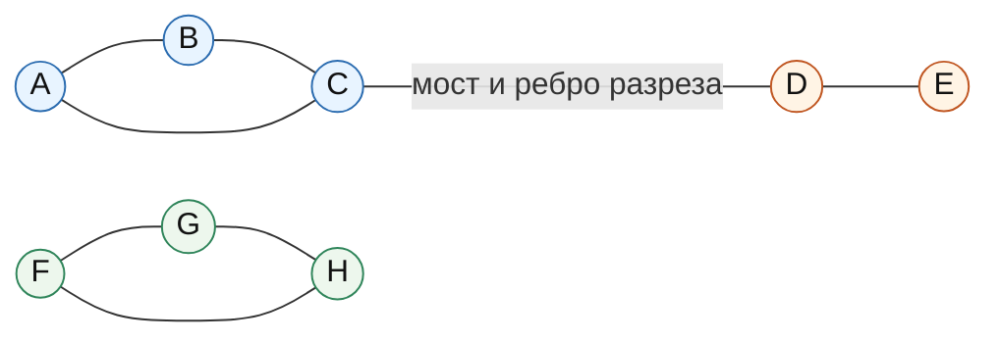
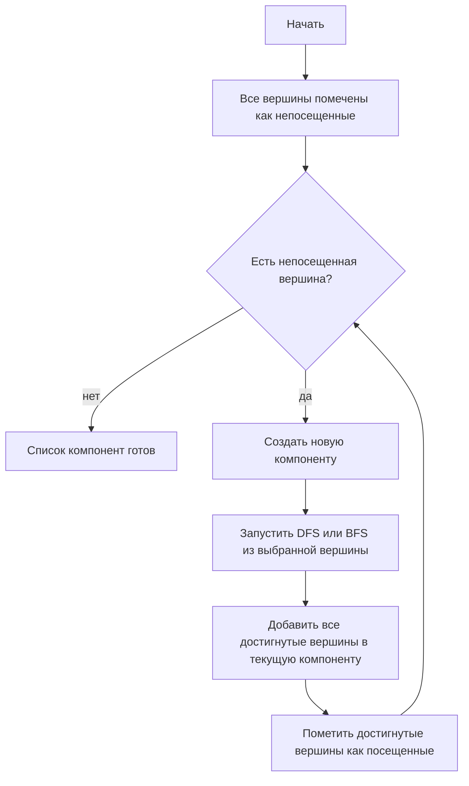
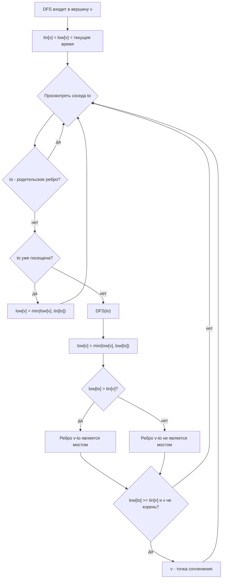

# Билет 4. Связность графов; понятие разреза, параметры вершинной и реберной связности; алгоритмы нахождения компонент связности

## 1. Связность графов

Связность описывает, можно ли переходить между вершинами графа по его ребрам или дугам.

Пусть дан неориентированный граф `G = (V, E)`, где `V` - множество вершин, `E` - множество ребер. Путь между вершинами `u` и `v` - последовательность вершин

```text
u = v0, v1, ..., vk = v,
```

такая, что каждая соседняя пара `vi, vi+1` соединена ребром.

Неориентированный граф называется связным, если для любых двух вершин `u, v in V` существует путь из `u` в `v`.

Если такой путь существует не для всех пар вершин, граф несвязен. Тогда он распадается на несколько максимальных связных частей - компонент связности.

### Примеры

- Цепь `1 - 2 - 3 - 4` связна.
- Граф с ребрами `{(1,2), (2,3), (4,5)}` несвязен: вершины `{1,2,3}` образуют одну компоненту, а `{4,5}` - другую.
- Изолированная вершина тоже является компонентой связности из одной вершины.

## 2. Связность в ориентированных графах

Пусть дан ориентированный граф `D = (V, A)`, где `A` - множество дуг. В ориентированном графе важно направление дуг.

### Сильная связность

Ориентированный граф называется сильно связным, если для любых двух вершин `u` и `v`:

- существует ориентированный путь из `u` в `v`;
- существует ориентированный путь из `v` в `u`.

Иначе говоря, из каждой вершины можно добраться в каждую другую с учетом направлений дуг.

Максимальное по включению множество вершин, внутри которого любые две вершины взаимно достижимы, называется сильно связной компонентой, или SCC, от английского `strongly connected component`.

Пример сильно связной компоненты: цикл `1 -> 2 -> 3 -> 1`.

### Слабая связность

Ориентированный граф называется слабо связным, если после замены всех дуг неориентированными ребрами получается связный неориентированный граф.

То есть для слабой связности направления дуг временно игнорируются.

Пример:

```text
1 -> 2 <- 3
```

Этот ориентированный граф не является сильно связным: например, из `2` нельзя добраться в `1` или `3`. Но он слабо связен, потому что если забыть направления, получится связная цепь `1 - 2 - 3`.

## 3. Компоненты связности

Компонента связности неориентированного графа - это максимальный по включению связный подграф.

Иными словами, множество вершин `C subseteq V` является компонентой связности, если:

1. любые две вершины из `C` соединены путем;
2. нельзя добавить в `C` никакую другую вершину графа, сохранив свойство связности.

Компоненты связности попарно не пересекаются и вместе покрывают все множество вершин `V`.

Если граф имеет ровно одну компоненту связности, он связен. Если компонент больше одной, он несвязен.

## 4. Разрезы

Разрез - это способ разделить граф на части удалением некоторых вершин или ребер.

### Реберный разрез

Реберным разрезом называется множество ребер, удаление которых нарушает связность графа, то есть увеличивает число компонент связности.

Часто разрез задают через разбиение множества вершин на две непустые части:

```text
V = S union (V \ S), где S != empty и V \ S != empty.
```

Тогда реберный разрез `delta(S)` - это множество всех ребер, имеющих один конец в `S`, а другой в `V \ S`.

Взвешенный вариант: если ребрам заданы пропускные способности или веса, то вес разреза равен сумме весов ребер, пересекающих это разбиение.

### Вершинный разрез

Вершинным разрезом называется множество вершин, удаление которых вместе с инцидентными им ребрами делает граф несвязным.

Обычно при определении вершинной связности не рассматривают удаление всех вершин сразу и отдельно оговаривают случаи малых графов.

Пример: если граф состоит из двух циклов, соединенных одной общей вершиной `x`, то удаление `x` разделит граф на две части. Значит, `{x}` - вершинный разрез.

### Связь с разделением пар вершин

Разрез часто рассматривают не только как глобальное разрушение связности графа, но и как разделение двух заданных вершин `s` и `t`.

- `s-t` реберный разрез - множество ребер, после удаления которых нет пути из `s` в `t`.
- `s-t` вершинный разрез - множество вершин, после удаления которых нет пути из `s` в `t`.

Такие разрезы особенно важны в задачах потоков и надежности сетей.

## 5. Мосты и точки сочленения

### Мост

Мостом в неориентированном графе называется ребро, удаление которого увеличивает число компонент связности.

Иначе говоря, мост - это ребро, через которое проходит вся связь между некоторыми двумя частями графа.

Свойство:

- ребро является мостом тогда и только тогда, когда оно не принадлежит ни одному циклу.

Если ребро лежит на цикле, то после его удаления связь между его концами сохраняется по оставшейся части цикла.

### Точка сочленения

Точкой сочленения, или артикуляционной вершиной, называется вершина, удаление которой увеличивает число компонент связности графа.

Пример: в цепи `1 - 2 - 3` вершина `2` является точкой сочленения, потому что после ее удаления вершины `1` и `3` окажутся в разных компонентах.

В цикле точек сочленения нет: удаление одной вершины не разрушает связность оставшихся вершин.

## 6. Вершинная и реберная связность

### Вершинная связность `kappa(G)`

Вершинная связность графа `kappa(G)` - это минимальное число вершин, удаление которых делает граф несвязным.

Для связного графа:

```text
kappa(G) = min размер вершинного разреза.
```

Если граф уже несвязен, обычно считают `kappa(G) = 0`.

Интуитивный смысл: `kappa(G)` показывает, сколько вершин нужно вывести из строя, чтобы разрушить связность сети.

Примеры:

- Для цепи длины хотя бы 2: `kappa(G) = 1`.
- Для цикла `C_n`, `n >= 3`: `kappa(G) = 2`.
- Для полного графа `K_n`: `kappa(K_n) = n - 1`, потому что надо удалить `n - 1` вершин, чтобы оставшаяся часть перестала быть связной в нетривиальном смысле.

### Реберная связность `lambda(G)`

Реберная связность графа `lambda(G)` - это минимальное число ребер, удаление которых делает граф несвязным.

Для связного графа:

```text
lambda(G) = min размер реберного разреза.
```

Если граф уже несвязен, обычно считают `lambda(G) = 0`.

Интуитивный смысл: `lambda(G)` показывает, сколько каналов связи нужно удалить, чтобы сеть распалась.

Примеры:

- Если в графе есть мост, то `lambda(G) = 1`.
- Для цикла `C_n`, `n >= 3`: `lambda(G) = 2`.
- Для полного графа `K_n`: `lambda(K_n) = n - 1`.

### Минимальная степень `delta(G)`

`delta(G)` - минимальная степень вершины графа:

```text
delta(G) = min deg(v), v in V.
```

Если взять вершину минимальной степени и удалить все инцидентные ей ребра, эта вершина станет изолированной. Поэтому связность графа нельзя быть больше `delta(G)` в реберном смысле.

### Неравенство между параметрами

Для любого связного неориентированного графа справедливо:

```text
kappa(G) <= lambda(G) <= delta(G).
```

Смысл неравенства:

- `lambda(G) <= delta(G)`: достаточно удалить все ребра, инцидентные вершине минимальной степени, чтобы изолировать ее.
- `kappa(G) <= lambda(G)`: вершинное разрушение не сложнее реберного в минимальном смысле; из минимального реберного разреза можно получить ограничение на число вершин, через которые этот разрез соединяет части графа.

Важно: равенство выполняется не всегда.

Пример строгого различия:

- В графе с мостом: `lambda(G) = 1`, а `delta(G)` может быть больше `1` в некоторых частях графа, но если есть висячая вершина, то `delta(G) = 1`.
- В графах с узкой вершинной перемычкой может быть `kappa(G) = 1`, но `lambda(G) > 1`.

## 7. Диаграмма: компоненты, мост и разрез

На схеме вершины `A, B, C, D, E` образуют одну компоненту, вершины `F, G, H` - вторую. Ребро `C-D` является мостом внутри первой компоненты: если удалить его, часть `{D,E}` отделится от `{A,B,C}`. Ребра между множествами `S` и `T` образуют реберный разрез.



## 8. Алгоритм нахождения компонент связности в неориентированном графе

Компоненты связности можно найти с помощью обхода в глубину `DFS` или обхода в ширину `BFS`.

Идея:

1. Все вершины сначала непосещенные.
2. Перебираем вершины графа.
3. Если вершина еще не посещена, запускаем из нее `DFS` или `BFS`.
4. Все вершины, достигнутые этим запуском, образуют одну компоненту связности.
5. Повторяем, пока все вершины не будут посещены.

### Псевдокод DFS

```text
components = []
visited[v] = false для всех v

for v in V:
    if not visited[v]:
        current_component = []
        dfs(v)
        components.append(current_component)

dfs(v):
    visited[v] = true
    current_component.append(v)
    for to in adj[v]:
        if not visited[to]:
            dfs(to)
```

### Псевдокод BFS

```text
components = []
visited[v] = false для всех v

for v in V:
    if not visited[v]:
        current_component = []
        queue = [v]
        visited[v] = true

        while queue not empty:
            x = queue.pop_front()
            current_component.append(x)

            for to in adj[x]:
                if not visited[to]:
                    visited[to] = true
                    queue.push_back(to)

        components.append(current_component)
```

### Сложность

При хранении графа списками смежности:

```text
O(|V| + |E|)
```

Каждая вершина посещается один раз, каждое ребро просматривается не более двух раз в неориентированном графе.

При матрице смежности сложность обхода обычно:

```text
O(|V|^2)
```

потому что для каждой вершины приходится просматривать всю строку матрицы.

## 9. Диаграмма: схема DFS/BFS для компонент связности



## 10. Сильно связные компоненты в ориентированном графе

Для ориентированных графов обычные компоненты связности не отражают направления дуг. Поэтому часто ищут сильно связные компоненты.

### Алгоритм Косарайю

Алгоритм Косарайю находит все SCC за два обхода DFS.

Идея:

1. Выполнить DFS в исходном графе и записать вершины в порядке завершения обработки.
2. Построить транспонированный граф `G^T`, в котором все дуги обращены.
3. Перебирать вершины в порядке убывания времени завершения из первого DFS.
4. Запускать DFS в транспонированном графе из еще не посещенных вершин.
5. Каждая такая область достижимости в `G^T` является одной SCC.

Сложность:

```text
O(|V| + |E|)
```

если граф хранится списками смежности и транспонированный граф строится за линейное время.

Память:

```text
O(|V| + |E|)
```

если явно хранить транспонированный граф.

### Алгоритм Тарьяна для SCC

Алгоритм Тарьяна находит SCC за один DFS, используя:

- `tin[v]` или `disc[v]` - время входа в вершину;
- `low[v]` - минимальное время входа вершины, достижимой из `v` по дереву DFS и обратным/внутренним дугам;
- стек активных вершин текущего DFS.

Идея:

1. Запускаем DFS.
2. При входе в вершину кладем ее в стек.
3. Пересчитываем `low[v]` по дугам из `v`.
4. Если `low[v] == tin[v]`, то `v` является корнем SCC.
5. Снимаем вершины со стека до `v`; снятое множество образует одну SCC.

Сложность:

```text
O(|V| + |E|)
```

Память:

```text
O(|V|)
```

без учета хранения самого графа.

## 11. Поиск мостов через `tin` и `low`

Мосты в неориентированном графе можно найти одним DFS.

Для каждой вершины `v` храним:

- `tin[v]` - время входа в вершину при DFS;
- `low[v]` - минимальное `tin`, достижимое из `v` или из потомков `v` по дереву DFS, если разрешить пройти не более одного обратного ребра.

При обходе ребра дерева DFS `v - to`, где `to` - потомок `v`, после обработки `to` проверяем:

```text
если low[to] > tin[v], то ребро (v, to) - мост.
```

Почему это верно:

- `low[to] > tin[v]` означает, что из поддерева `to` нельзя попасть в `v` или в предков `v` по обратному ребру;
- значит, единственная связь поддерева `to` с остальным графом идет через ребро `(v, to)`;
- удаление этого ребра отделит поддерево, поэтому ребро является мостом.

### Псевдокод

```text
timer = 0
visited[v] = false для всех v

dfs(v, parent):
    visited[v] = true
    tin[v] = low[v] = timer
    timer += 1

    for to in adj[v]:
        if to == parent:
            continue

        if visited[to]:
            low[v] = min(low[v], tin[to])
        else:
            dfs(to, v)
            low[v] = min(low[v], low[to])

            if low[to] > tin[v]:
                (v, to) является мостом
```

Сложность:

```text
O(|V| + |E|)
```

Память:

```text
O(|V|)
```

без учета хранения графа.

Замечание: если в графе есть кратные ребра, условие `to == parent` нужно обрабатывать аккуратнее, например хранить идентификаторы ребер, иначе можно ошибочно принять одно из параллельных ребер за мост.

## 12. Поиск точек сочленения через `tin` и `low`

Точки сочленения также находятся одним DFS.

Для вершины `v`, не являющейся корнем DFS-дерева, условие точки сочленения:

```text
существует потомок to такой, что low[to] >= tin[v].
```

Это означает, что поддерево `to` не имеет обратного ребра в строгого предка `v`. Если удалить `v`, это поддерево отделится.

Для корня DFS-дерева правило особое:

```text
корень является точкой сочленения тогда и только тогда,
когда у него есть хотя бы два ребенка в DFS-дереве.
```

Почему для корня отдельное условие:

- у корня нет предков;
- если из корня выросли два независимых DFS-поддерева, то между ними нет ребер, иначе DFS присоединил бы их в одно поддерево;
- удаление корня разделит эти поддеревья.

### Псевдокод

```text
timer = 0
visited[v] = false для всех v

dfs(v, parent):
    visited[v] = true
    tin[v] = low[v] = timer
    timer += 1
    children = 0

    for to in adj[v]:
        if to == parent:
            continue

        if visited[to]:
            low[v] = min(low[v], tin[to])
        else:
            dfs(to, v)
            low[v] = min(low[v], low[to])

            if low[to] >= tin[v] and parent != none:
                v является точкой сочленения

            children += 1

    if parent == none and children > 1:
        v является точкой сочленения
```

Сложность:

```text
O(|V| + |E|)
```

Память:

```text
O(|V|)
```

без учета хранения графа.

## 13. Диаграмма: логика `tin/low` для мостов и точек сочленения



## 14. Связь разрезов с max-flow/min-cut

В ориентированных и неориентированных сетях с пропускными способностями разрезы тесно связаны с потоками.

Пусть есть сеть с источником `s`, стоком `t` и пропускными способностями ребер. `s-t` разрезом называется разбиение вершин на две части:

```text
S и T = V \ S,
где s in S, t in T.
```

Пропускная способность разреза - сумма пропускных способностей всех дуг из `S` в `T`.

Теорема Форда-Фалкерсона о максимальном потоке и минимальном разрезе:

```text
величина максимального s-t потока равна пропускной способности минимального s-t разреза.
```

Практический смысл:

- если нужно найти минимальный набор ребер, отделяющий `s` от `t`, можно построить потоковую сеть;
- после нахождения максимального потока остаточная сеть показывает минимальный разрез;
- вершины, достижимые из `s` в остаточной сети, образуют сторону `S`, остальные вершины - сторону `T`;
- ребра исходной сети из `S` в `T` дают минимальный разрез.

### Использование для реберных разрезов

Если все ребра имеют единичную пропускную способность, минимальный `s-t` разрез равен минимальному числу ребер, которые надо удалить, чтобы отделить `s` от `t`.

Для поиска глобальной реберной связности можно рассматривать минимальные разрезы между различными парами вершин или использовать специализированные алгоритмы, например алгоритм Стоера-Вагнера для неориентированного глобального минимального разреза.

### Использование для вершинных разрезов

Вершинный разрез можно свести к реберному разрезу через расщепление вершин:

1. Каждую вершину `v` заменяют двумя вершинами `v_in` и `v_out`.
2. Добавляют ребро `v_in -> v_out` с пропускной способностью, равной цене удаления вершины. Для обычного случая цена равна `1`.
3. Каждое исходное ребро или дугу перенаправляют через соответствующие `out` и `in` вершины.
4. Минимальный разрез в новой сети соответствует минимальному набору удаляемых вершин.

Такой прием позволяет искать минимальные вершинные `s-t` разрезы с помощью алгоритмов максимального потока.

### Сложность потокового подхода

Сложность зависит от выбранного алгоритма максимального потока:

- Форд-Фалкерсон: `O(E * F)` для целочисленных пропускных способностей, где `F` - величина максимального потока; при иррациональных пропускных способностях возможны проблемы с завершением.
- Эдмондс-Карп: `O(V * E^2)`.
- Диниц: обычно указывается `O(V^2 * E)` в общем случае; для некоторых классов сетей есть более сильные оценки.

## 15. Краткая таблица алгоритмов

| Задача | Граф | Основная идея | Сложность |
|---|---|---|---|
| Компоненты связности | Неориентированный | Запуски DFS/BFS из непосещенных вершин | `O(V + E)` |
| Слабые компоненты | Ориентированный | Игнорировать направления дуг и запустить DFS/BFS | `O(V + E)` |
| SCC, Косарайю | Ориентированный | DFS, транспонированный граф, второй DFS по порядку завершения | `O(V + E)` |
| SCC, Тарьян | Ориентированный | Один DFS, стек, значения `tin/low` | `O(V + E)` |
| Мосты | Неориентированный | DFS и условие `low[to] > tin[v]` | `O(V + E)` |
| Точки сочленения | Неориентированный | DFS и условие `low[to] >= tin[v]` | `O(V + E)` |
| Минимальный `s-t` реберный разрез | Сеть | Max-flow/min-cut | зависит от max-flow |
| Минимальный `s-t` вершинный разрез | Сеть | Расщепление вершин + max-flow/min-cut | зависит от max-flow |

Здесь `V = |V|`, `E = |E|`.

## 16. Главное для ответа на экзамене

Связность в неориентированном графе означает существование пути между любой парой вершин. Если граф несвязен, он распадается на компоненты связности, которые находятся линейным DFS или BFS.

В ориентированном графе различают сильную связность, где достижимость должна быть взаимной с учетом направлений дуг, и слабую связность, где направления игнорируются. Сильно связные компоненты находят алгоритмами Косарайю или Тарьяна за `O(V + E)`.

Разрез - это множество ребер или вершин, удаление которого разделяет граф. Минимальный размер вершинного разреза задает вершинную связность `kappa(G)`, а минимальный размер реберного разреза - реберную связность `lambda(G)`. Для связного графа выполняется фундаментальное неравенство:

```text
kappa(G) <= lambda(G) <= delta(G).
```

Мост - ребро, удаление которого увеличивает число компонент. Точка сочленения - вершина с тем же свойством. И мосты, и точки сочленения эффективно находятся одним DFS с временами входа `tin` и значениями `low`.

Разрезы также связаны с потоками: по теореме max-flow/min-cut величина максимального потока из `s` в `t` равна емкости минимального `s-t` разреза. Поэтому задачи о минимальных реберных и вершинных разрезах можно решать через алгоритмы максимального потока, а вершинный разрез сводить к реберному с помощью расщепления вершин.
