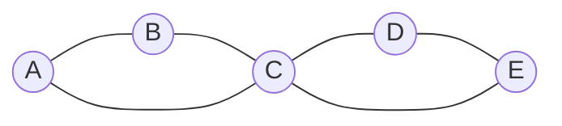
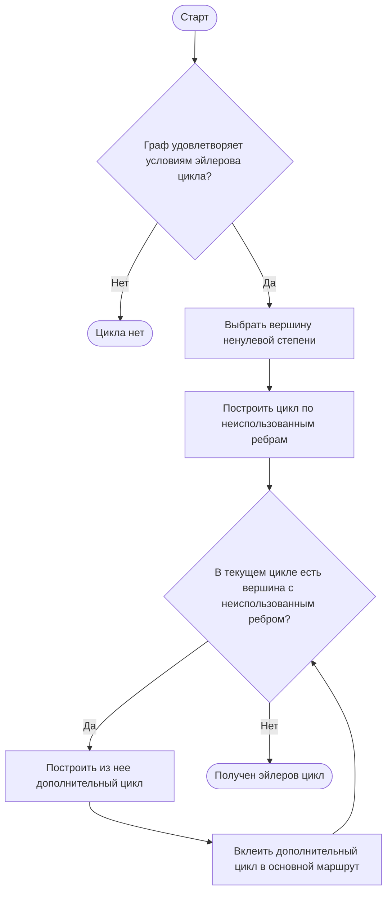
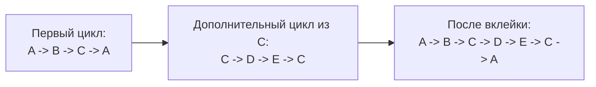

# Билет 5. Эйлеровы графы

## 1. Основные определения

Пусть дан граф \(G = (V, E)\). В этом билете важны не вершины, а ребра: эйлеровость описывает возможность пройти по всем ребрам графа ровно один раз.

**Маршрут** - последовательность вершин и ребер
\[
v_0, e_1, v_1, e_2, \ldots, e_k, v_k,
\]
где каждое ребро \(e_i\) соединяет соседние вершины \(v_{i-1}\) и \(v_i\). В ориентированном графе направление каждого ребра должно совпадать с направлением движения.

**Цепь** - маршрут, в котором ребра не повторяются. Вершины при этом могут повторяться.

**Эйлерова цепь** или **эйлеров путь** - цепь, проходящая по каждому ребру графа ровно один раз. В разных курсах термины "путь" и "цепь" могут различаться строже, но в теме эйлеровых графов обычно имеется в виду именно отсутствие повторения ребер.

**Эйлеров цикл** - замкнутая эйлерова цепь, то есть цепь, которая проходит по каждому ребру ровно один раз и заканчивается в той же вершине, где началась.

**Эйлеров граф** - граф, в котором существует эйлеров цикл.

**Полуэйлеров граф** - граф, в котором существует эйлерова цепь, но не обязательно эйлеров цикл. Для неориентированного графа это обычно случай ровно двух вершин нечетной степени.

## 2. Отличие от гамильтонова графа

Эйлеровы и гамильтоновы задачи похожи формулировкой, но принципиально различаются объектом обхода.

| Понятие | Что должно быть пройдено ровно один раз | Что может повторяться | Типичная сложность проверки |
|---|---|---|---|
| Эйлеров путь/цикл | Все ребра | Вершины могут повторяться | Проверяется простыми условиями на степени и связность |
| Гамильтонов путь/цикл | Все вершины | Ребра выбираются не все, вершины не повторяются | В общем случае задача NP-полная |

Пример: граф может быть эйлеровым, но не гамильтоновым, и наоборот. Эйлеровость определяется локальными степенями вершин и связностью нужной части графа. Для гамильтоновости такого простого полного критерия в общем случае нет.

## 3. Условия существования в неориентированном графе

Рассмотрим неориентированный граф \(G\). Вершины степени 0, то есть изолированные вершины, не мешают эйлерову обходу, потому что в них нет ребер, которые надо проходить.

Поэтому связность проверяется не для всего множества вершин, а для части графа, содержащей ребра.

### 3.1. Связность по ребрам

Граф должен быть связен по ребрам: все вершины ненулевой степени должны лежать в одной компоненте связности.

Иными словами, если удалить все изолированные вершины, оставшийся граф должен быть связным.

Если это условие нарушено, пройти все ребра одним непрерывным маршрутом невозможно: после обхода ребер одной компоненты нельзя перейти в другую.

### 3.2. Эйлеров цикл

Неориентированный граф имеет эйлеров цикл тогда и только тогда, когда:

1. Все вершины ненулевой степени лежат в одной компоненте связности.
2. Степень каждой вершины четна.

Почему нужны четные степени: если вершина не является начальной и конечной отдельно, то каждый вход в нее должен быть "скомпенсирован" выходом из нее. В цикле начальная вершина тоже одновременно является конечной, поэтому и для нее ребра разбиваются на пары "вошли - вышли". Значит, каждая степень четна.

### 3.3. Эйлерова цепь без замыкания

Неориентированный граф имеет эйлерову цепь тогда и только тогда, когда:

1. Все вершины ненулевой степени лежат в одной компоненте связности.
2. Количество вершин нечетной степени равно 0 или 2.

Возможны два случая:

- **0 нечетных вершин**: существует эйлеров цикл; эйлерову цепь можно начать в любой вершине ненулевой степени.
- **2 нечетные вершины**: существует незамкнутая эйлерова цепь; она должна начинаться в одной нечетной вершине и заканчиваться в другой.

Если нечетных вершин больше двух, эйлеровой цепи нет.

## 4. Условия существования в ориентированном графе

Для ориентированного графа вместо обычной степени рассматривают:

- \(\deg^+(v)\) - исходящая степень вершины \(v\), количество дуг, выходящих из \(v\);
- \(\deg^-(v)\) - входящая степень вершины \(v\), количество дуг, входящих в \(v\).

Вершины с \(\deg^+(v) + \deg^-(v) = 0\) можно игнорировать при проверке связности.

### 4.1. Ориентированный эйлеров цикл

Ориентированный граф имеет эйлеров цикл тогда и только тогда, когда:

1. Для каждой вершины выполнен баланс:
   \[
   \deg^+(v) = \deg^-(v).
   \]
2. Все вершины с ненулевой суммарной степенью принадлежат одной сильно связной части графа.

Сильная связность нужной части означает, что между любыми двумя вершинами, которые участвуют в ребрах, есть ориентированный путь в обе стороны. Изолированные вершины не учитываются.

Иногда критерий формулируют так: после удаления изолированных вершин граф должен быть сильно связным, а входящие и исходящие степени всех вершин должны совпадать.

### 4.2. Ориентированная эйлерова цепь без замыкания

Ориентированный граф имеет эйлерову цепь из \(s\) в \(t\), где \(s \ne t\), тогда и только тогда, когда:

1. Для начальной вершины \(s\):
   \[
   \deg^+(s) = \deg^-(s) + 1.
   \]
2. Для конечной вершины \(t\):
   \[
   \deg^-(t) = \deg^+(t) + 1.
   \]
3. Для всех остальных вершин:
   \[
   \deg^+(v) = \deg^-(v).
   \]
4. Вершины, участвующие в ребрах, лежат в одной связной части с учетом направлений. Удобная строгая проверка: если добавить искусственную дугу \(t \to s\), то в полученном графе все вершины ненулевой степени должны лежать в одной сильно связной компоненте.

Если все вершины сбалансированы, то это случай эйлерова цикла. Если есть ровно одна вершина с избытком исходящей степени на 1 и ровно одна вершина с избытком входящей степени на 1, то возможна незамкнутая цепь.

## 5. Пример эйлерова графа

Рассмотрим неориентированный граф с ребрами:
\[
AB,\ BC,\ CA,\ CD,\ DE,\ EC.
\]

Это две треугольные части, склеенные по вершине \(C\). Степени вершин:

| Вершина | Степень |
|---|---:|
| A | 2 |
| B | 2 |
| C | 4 |
| D | 2 |
| E | 2 |

Все степени четные, а все вершины ненулевой степени лежат в одной компоненте связности. Значит, граф эйлеров.

Один из эйлеровых циклов:
\[
A \to B \to C \to D \to E \to C \to A.
\]



Если из этого графа удалить ребро \(CA\), то степени \(A\) и \(C\) станут нечетными. Тогда эйлерова цепь еще существует, но уже не цикл: она должна начинаться в одной из нечетных вершин и заканчиваться в другой.

## 6. Алгоритм Хиерхольцера

Алгоритм Хиерхольцера - основной эффективный алгоритм построения эйлерова цикла. Он работает за линейное время по числу ребер при правильном хранении графа.

Идея:

1. Начать из любой вершины с ненулевой степенью.
2. Идти по еще не использованным ребрам, пока не вернемся в начальную вершину. Получится первый цикл.
3. Если в построенном цикле есть вершина, из которой выходит неиспользованное ребро, начать из нее новый цикл по неиспользованным ребрам.
4. Вклеить новый цикл в уже построенный маршрут в той вершине, где он начался.
5. Повторять, пока все ребра не будут использованы.

Алгоритм корректен, потому что в эйлеровом графе степени четные. Если мы вошли в некоторую вершину по неиспользованному ребру, то при локальном обходе из нее, кроме момента возврата в стартовую вершину текущего цикла, должно найтись ребро для выхода. Поэтому обход по неиспользованным ребрам не "застревает" в чужой вершине, а замыкается в цикл.

### 6.1. Блок-схема алгоритма



### 6.2. Псевдокод для неориентированного графа

Ниже приведен вариант через стек. Он строит цикл без явной операции "вклейки": стек хранит текущий незавершенный обход, а ответ формируется при откате.

```text
Hierholzer(G):
    проверить условия существования эйлерова цикла
    если условия не выполнены:
        вернуть "цикла нет"

    start = любая вершина с deg(start) > 0
    stack = [start]
    answer = []

    пока stack не пуст:
        v = stack.last()

        если у v есть неиспользованное ребро (v, u):
            пометить ребро (v, u) как использованное
            удалить его из списков доступных ребер v и u
            stack.push(u)
        иначе:
            answer.push(v)
            stack.pop()

    развернуть answer
    вернуть answer
```

Результат `answer` - последовательность вершин эйлерова цикла. Соседние вершины в этой последовательности соединены ребрами исходного графа, и каждое ребро используется ровно один раз.

Для ориентированного графа псевдокод почти такой же, но берется только исходящая неиспользованная дуга \((v, u)\), и удалять ее нужно только из списка исходящих дуг вершины \(v\).

### 6.3. Сложность

При хранении графа списками смежности и удалении/пропуске уже использованных ребер за \(O(1)\) амортизированно:

- проверка степеней занимает \(O(|V| + |E|)\);
- проверка связности или сильной связности занимает \(O(|V| + |E|)\);
- сам алгоритм Хиерхольцера проходит каждое ребро один раз, поэтому занимает \(O(|E|)\);
- итоговая сложность: \(O(|V| + |E|)\);
- память: \(O(|V| + |E|)\).

## 7. Пример работы Хиерхольцера по шагам

Возьмем тот же граф:
\[
AB,\ BC,\ CA,\ CD,\ DE,\ EC.
\]

Алгоритм может построить цикл так:

1. Начинаем в вершине \(A\).
2. Идем по ребрам \(A \to B \to C \to A\). Получили первый цикл:
   \[
   A \to B \to C \to A.
   \]
3. В текущем цикле есть вершина \(C\), из которой остались неиспользованные ребра \(CD\) и \(CE\).
4. Из \(C\) строим дополнительный цикл:
   \[
   C \to D \to E \to C.
   \]
5. Вклеиваем дополнительный цикл в первый в вершине \(C\):
   \[
   A \to B \to C \to D \to E \to C \to A.
   \]
6. Неиспользованных ребер больше нет. Полученная последовательность является эйлеровым циклом.



Пошаговая идея вклейки важна: Хиерхольцер не пытается сразу угадать весь маршрут. Он находит локальные циклы и объединяет их в один общий цикл, пока не будут исчерпаны все ребра.

## 8. Алгоритм Флёри

Алгоритм Флёри исторически более ранний и интуитивный способ построения эйлеровой цепи или цикла.

Идея:

1. Если строится цикл, начать в любой вершине ненулевой степени.
2. Если строится незамкнутая эйлерова цепь в неориентированном графе, начать в одной из двух вершин нечетной степени.
3. На каждом шаге выбирать ребро, которое не является мостом в оставшемся графе, если есть альтернатива.
4. Пройти по выбранному ребру и удалить его из графа.
5. Повторять, пока все ребра не будут удалены.

Мост - ребро, удаление которого увеличивает число компонент связности. Если преждевременно пройти по мосту, можно отрезать часть еще не использованных ребер и потерять возможность закончить обход.

Недостаток алгоритма Флёри: на каждом шаге надо проверять, является ли ребро мостом в текущем остаточном графе. Наивная реализация может работать за \(O(|E| \cdot (|V| + |E|))\), что значительно хуже Хиерхольцера.

Поэтому на практике для построения эйлеровых циклов и цепей обычно используют алгоритм Хиерхольцера.

## 9. Краткий конспект условий

### Неориентированный граф

| Требуемый объект | Условие на связность | Условие на степени |
|---|---|---|
| Эйлеров цикл | Все вершины ненулевой степени в одной компоненте | Все степени четные |
| Эйлерова цепь | Все вершины ненулевой степени в одной компоненте | Нечетных вершин 0 или 2 |

### Ориентированный граф

| Требуемый объект | Условие на связность | Условие на входящие/исходящие степени |
|---|---|---|
| Эйлеров цикл | Все вершины ненулевой степени в одной сильно связной части | Для всех \(v\): \(\deg^+(v) = \deg^-(v)\) |
| Эйлерова цепь из \(s\) в \(t\) | После добавления дуги \(t \to s\) нужная часть сильно связна | У \(s\): исходящих на 1 больше; у \(t\): входящих на 1 больше; остальные сбалансированы |

## 10. Типичные ошибки

1. Проверять связность всего графа вместе с изолированными вершинами. Изолированные вершины не мешают эйлерову циклу, потому что не содержат ребер.
2. Путать эйлеров цикл с гамильтоновым. Эйлеров цикл проходит все ребра, гамильтонов - все вершины.
3. Для ориентированного графа проверять только равенство входящих и исходящих степеней, забывая про сильную связность нужной части.
4. Для неориентированного графа считать, что наличие двух нечетных вершин дает цикл. Оно дает только незамкнутую эйлерову цепь.
5. В алгоритме Флёри выбирать мост при наличии других ребер. Это может разрушить возможность завершить обход.

## 11. Итог

Эйлерова теория графов отвечает на вопрос, можно ли пройти каждое ребро ровно один раз. Для неориентированных графов ключевые условия - связность всех вершин ненулевой степени и количество нечетных вершин: 0 для цикла, 0 или 2 для цепи. Для ориентированных графов нужны баланс входящих и исходящих степеней и сильная связность части графа, где есть дуги.

Основной алгоритм построения эйлерова цикла - алгоритм Хиерхольцера. Он последовательно строит циклы по неиспользованным ребрам и вклеивает их в общий маршрут. При списках смежности он работает за \(O(|V| + |E|)\), поэтому является стандартным практическим способом нахождения эйлеровых циклов.
