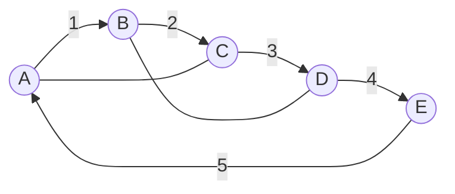
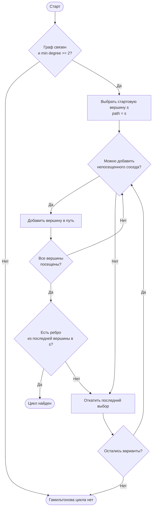
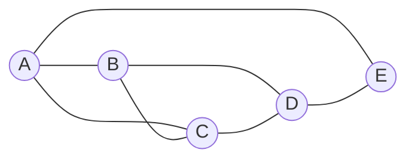
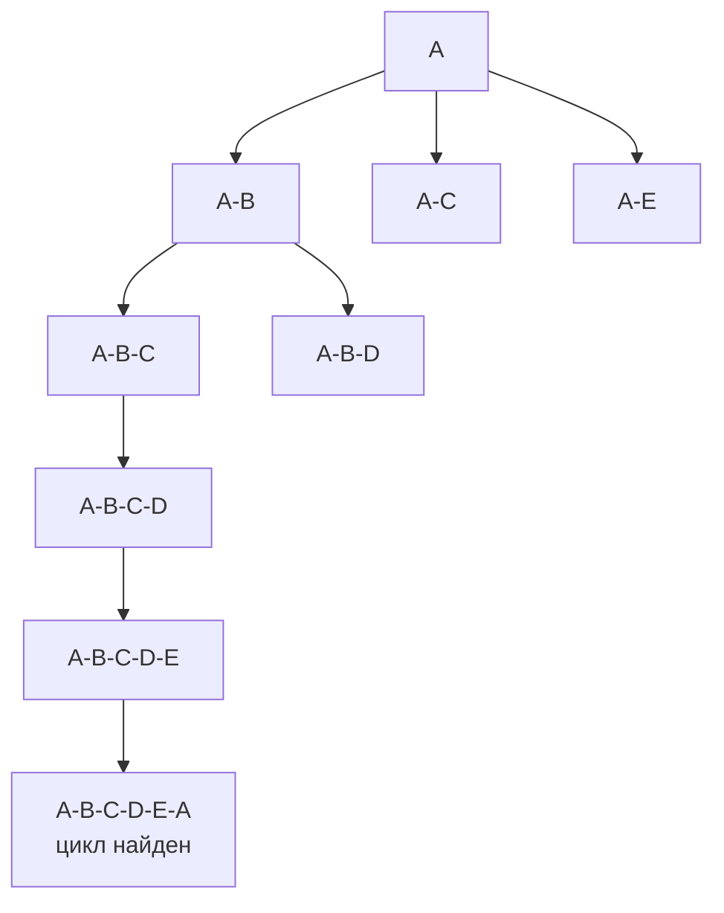

# Билет 6. Гамильтоновы графы

## 1. Основные определения

Пусть дан граф \(G = (V, E)\), где \(V\) — множество вершин, \(E\) — множество ребер.

**Гамильтонов путь** — простой путь, проходящий через каждую вершину графа ровно один раз.

Иными словами, если в графе \(n\) вершин, то гамильтонов путь имеет вид

\[
v_1, v_2, \ldots, v_n,
\]

где все вершины \(v_i\) различны, и для каждого \(i = 1, \ldots, n - 1\) существует ребро \((v_i, v_{i+1})\).

**Гамильтонов цикл** — простой цикл, проходящий через каждую вершину графа ровно один раз и возвращающийся в начальную вершину:

\[
v_1, v_2, \ldots, v_n, v_1.
\]

Здесь все вершины \(v_1, \ldots, v_n\) различны, для всех соседних вершин в последовательности есть ребра, и дополнительно существует ребро \((v_n, v_1)\).

**Гамильтонов граф** — граф, содержащий хотя бы один гамильтонов цикл.

Если граф содержит гамильтонов путь, но не содержит гамильтонова цикла, его обычно не называют гамильтоновым, хотя иногда говорят, что граф обладает гамильтоновым путем.

## 2. Отличие гамильтонова графа от эйлерова

Гамильтоновость и эйлеровость — разные свойства графа.

| Свойство | Гамильтонов путь/цикл | Эйлеров путь/цикл |
|---|---|---|
| Что нужно пройти | Все вершины | Все ребра |
| Сколько раз можно посещать | Каждую вершину ровно один раз, кроме возврата в начало для цикла | Ребро ровно один раз, вершины могут повторяться |
| Объект изучения | Порядок обхода вершин | Порядок обхода ребер |
| Критерий | Простого полного критерия для общего графа нет | Есть простой критерий через степени вершин и связность |

Например, квадрат с одной диагональю может иметь гамильтонов цикл, потому что можно обойти все вершины по периметру. Но эйлеров цикл в нем отсутствует, если степени вершин не все четные.

Для эйлерова цикла в неориентированном графе известен точный критерий: граф должен быть связным по ребрам, а степени всех вершин должны быть четными. Для гамильтонова цикла аналогичного простого критерия для произвольного графа не существует.

## 3. Необходимые условия существования гамильтонова цикла

Если граф гамильтонов, то он обязан удовлетворять некоторым простым необходимым условиям.

1. **Связность.**  
   Граф с гамильтоновым циклом обязательно связен: цикл проходит через все вершины, значит из любой вершины можно добраться до любой другой вдоль этого цикла.

2. **Минимальная степень не меньше 2.**  
   В гамильтоновом цикле каждая вершина имеет двух соседей в этом цикле: предыдущую и следующую. Поэтому в исходном графе у каждой вершины должна быть степень хотя бы 2.

3. **Отсутствие мостов.**  
   Если ребро является мостом, то его удаление разделяет граф на компоненты. Гамильтонов цикл не может содержать мост: из одной части графа пришлось бы перейти по мосту и затем вернуться, используя то же ребро второй раз, что невозможно для простого цикла.

Эти условия являются необходимыми, но не достаточными. То есть если граф связен, все степени хотя бы 2 и мостов нет, из этого еще не следует, что он гамильтонов.

## 4. Почему нет простого критерия

Для произвольного графа задача проверки существования гамильтонова цикла является NP-полной. Это означает, что:

- известны алгоритмы, которые проверяют наличие гамильтонова цикла полным перебором или динамическим программированием;
- в худшем случае время их работы растет экспоненциально;
- не известен полиномиальный алгоритм для всех графов;
- не существует простого критерия наподобие эйлерова критерия через степени вершин.

Поэтому в теории графов часто используют:

- **достаточные условия**, которые гарантируют гамильтоновость, но не являются необходимыми;
- **алгоритмы поиска**, которые либо находят цикл, либо доказывают его отсутствие перебором вариантов;
- **эвристики**, которые часто быстро находят хороший цикл, но не всегда дают доказательство существования или отсутствия.

## 5. Достаточные условия гамильтоновости

### 5.1. Теорема Дирака

Пусть \(G\) — простой неориентированный граф с \(n \ge 3\) вершинами.

Если степень каждой вершины не меньше половины числа вершин:

\[
\delta(G) \ge \frac{n}{2},
\]

то граф \(G\) является гамильтоновым.

Здесь \(\delta(G)\) — минимальная степень вершины графа.

Важно: условие Дирака является достаточным, но не необходимым. Существуют гамильтоновы графы, у которых минимальная степень меньше \(n/2\).

Пример: простой цикл \(C_5\) гамильтонов, но каждая вершина имеет степень 2, а \(n/2 = 2.5\). Условие Дирака не выполнено, но гамильтонов цикл есть.

### 5.2. Теорема Оре

Пусть \(G\) — простой неориентированный граф с \(n \ge 3\) вершинами.

Если для любых двух несмежных вершин \(u\) и \(v\) выполнено:

\[
\deg(u) + \deg(v) \ge n,
\]

то граф \(G\) является гамильтоновым.

Условие Оре также является достаточным, но не необходимым.

Теорема Оре сильнее теоремы Дирака в том смысле, что из условия Дирака следует условие Оре: если каждая вершина имеет степень хотя бы \(n/2\), то для любых двух вершин сумма степеней не меньше \(n\). Но условие Оре может выполняться и тогда, когда не все степени по отдельности достигают \(n/2\).

### 5.3. Примеры неусловий

Следующие утверждения не являются достаточными условиями гамильтоновости:

1. **Граф связен.**  
   Этого недостаточно. Например, дерево с числом вершин больше 2 связно, но не имеет циклов вообще, значит не может быть гамильтоновым.

2. **Все степени положительны.**  
   Это означает только отсутствие изолированных вершин. Граф может быть связным или несвязным, но гамильтонов цикл из этого не следует.

3. **Минимальная степень равна 2.**  
   Даже если у каждой вершины степень не меньше 2, граф может не иметь гамильтонова цикла. Например, две треугольные части, соединенные через одну общую вершину, имеют циклы, но общий гамильтонов цикл невозможен: через разделяющую вершину пришлось бы проходить более одного раза.

4. **Граф имеет много ребер.**  
   Большое количество ребер помогает, но само по себе без точного условия не гарантирует гамильтоновость.

## 6. Пример гамильтонова цикла

Рассмотрим граф с вершинами \(A, B, C, D, E\). В нем есть гамильтонов цикл:

\[
A \to B \to C \to D \to E \to A.
\]



В этом графе ребра \(A-B\), \(B-C\), \(C-D\), \(D-E\), \(E-A\) образуют гамильтонов цикл. Дополнительные ребра \(A-C\) и \(B-D\) не мешают существованию цикла.

## 7. Алгоритм поиска гамильтонова цикла перебором с возвратом

Самый естественный точный алгоритм — backtracking, или поиск с возвратом. Он строит путь по одной вершине и отбрасывает ветви, которые уже не могут привести к гамильтонову циклу.

### 7.1. Идея алгоритма

1. Выбрать стартовую вершину \(s\).
2. Начать путь с вершины \(s\).
3. На каждом шаге пытаться добавить к текущему пути новую вершину, смежную с последней вершиной пути.
4. Запрещать повторное добавление уже посещенных вершин.
5. Если путь содержит все вершины, проверить, есть ли ребро из последней вершины обратно в \(s\).
6. Если такое ребро есть, найден гамильтонов цикл.
7. Если продолжить путь нельзя, вернуться назад и попробовать другой вариант.

### 7.2. Псевдокод

```text
HamiltonianCycle(G):
    s = любая вершина графа
    path = [s]
    used = {s}
    return DFS(path, used)

DFS(path, used):
    if length(path) == |V|:
        if edge(path[-1], path[0]) exists:
            return path + [path[0]]
        else:
            return null

    last = path[-1]

    for each vertex v adjacent to last:
        if v not in used:
            add v to path and used

            if DFS(path, used) found cycle:
                return cycle

            remove v from path and used

    return null
```

### 7.3. Отсечения

Чтобы уменьшить перебор, используют отсечения:

- если граф несвязен, гамильтонова цикла нет;
- если есть вершина степени меньше 2, гамильтонова цикла нет;
- если в процессе поиска у непосещенной вершины не остается потенциальных соседей для включения в цикл, ветвь можно отбросить;
- можно начинать всегда с одной фиксированной вершины, потому что гамильтонов цикл можно записать с любой вершины;
- для неориентированного графа можно зафиксировать второго соседа стартовой вершины, чтобы не проверять зеркальные копии одного и того же цикла;
- вершины можно перебирать в порядке эвристики: сначала вершины с меньшей степенью, потому что для них меньше вариантов.

### 7.4. Сложность

В худшем случае backtracking имеет факториальную сложность:

\[
O(n!)
\]

или близкую к ней, потому что алгоритм фактически перебирает перестановки вершин. На практике отсечения сильно сокращают перебор, но экспоненциальная природа задачи остается.

## 8. Динамическое программирование Хелда-Карпа по подмножествам

Для точного решения можно использовать динамическое программирование по подмножествам вершин. Этот подход похож на алгоритм Хелда-Карпа для задачи коммивояжера.

### 8.1. Состояние

Зафиксируем стартовую вершину \(s\).

Определим:

\[
dp[S][v] = true,
\]

если существует простой путь, который:

- начинается в \(s\);
- проходит ровно по вершинам множества \(S\);
- заканчивается в вершине \(v\).

Здесь \(S\) — подмножество вершин, содержащее \(s\), а \(v \in S\).

### 8.2. Переход

Состояние \(dp[S][v]\) истинно, если существует вершина \(u \in S\), \(u \ne v\), такая что:

\[
dp[S \setminus \{v\}][u] = true
\]

и в графе есть ребро \((u, v)\).

То есть вершину \(v\) можно добавить в конец уже построенного пути.

### 8.3. Проверка цикла

После заполнения таблицы нужно проверить, существует ли вершина \(v \ne s\), для которой:

\[
dp[V][v] = true
\]

и есть ребро \((v, s)\).

Если да, то существует гамильтонов цикл.

### 8.4. Сложность

Количество подмножеств вершин равно \(2^n\). Для каждого подмножества рассматриваются возможные последние вершины и переходы.

Обычно сложность оценивается как:

\[
O(n^2 2^n)
\]

по времени и

\[
O(n 2^n)
\]

по памяти.

Такой алгоритм лучше факториального перебора по асимптотике, но все равно экспоненциальный. Он подходит для графов умеренного размера, но быстро становится непрактичным при больших \(n\).

## 9. Эвристические методы

Эвристики не гарантируют правильный ответ во всех случаях, но часто помогают быстро найти гамильтонов цикл в больших графах.

Примеры эвристик:

1. **Жадное построение пути.**  
   На каждом шаге выбирается подходящая непосещенная соседняя вершина, например вершина с наименьшей степенью или с наименьшим числом дальнейших вариантов.

2. **Случайный поиск с перезапусками.**  
   Алгоритм много раз строит случайные пути. Если путь зашел в тупик, поиск начинается заново.

3. **Локальные улучшения.**  
   Используются перестановки фрагментов пути, похожие на приемы 2-opt и 3-opt из задачи коммивояжера.

4. **Генетические алгоритмы и муравьиные алгоритмы.**  
   Представляют возможные обходы как кандидатов и улучшают их с помощью вероятностных правил.

5. **SAT/ILP-сведение.**  
   Задача кодируется как формула выполнимости или задача целочисленного линейного программирования. Затем используется готовый решатель.

Эвристики полезны, когда нужно быстро найти цикл, но если цикл не найден, это обычно не доказывает, что его не существует.

## 10. Блок-схема backtracking-алгоритма



## 11. Пошаговый пример поиска гамильтонова цикла

Рассмотрим граф:

\[
V = \{A, B, C, D, E\}
\]

\[
E = \{AB, AC, AE, BC, BD, CD, DE\}.
\]

Его можно представить так:



Попробуем найти гамильтонов цикл backtracking-алгоритмом. Стартуем из вершины \(A\).

### Шаг 1

Текущий путь:

\[
A
\]

Соседи вершины \(A\): \(B, C, E\). Выберем \(B\).

Путь:

\[
A \to B
\]

### Шаг 2

Из вершины \(B\) можно перейти в \(C\) или \(D\), потому что \(A\) уже посещена. Сначала пробуем \(C\).

Путь:

\[
A \to B \to C
\]

### Шаг 3

Из вершины \(C\) непосещенный сосед — \(D\). Добавляем \(D\).

Путь:

\[
A \to B \to C \to D
\]

### Шаг 4

Из вершины \(D\) непосещенный сосед — \(E\). Добавляем \(E\).

Путь:

\[
A \to B \to C \to D \to E
\]

Теперь посещены все вершины. Проверяем, есть ли ребро из \(E\) обратно в \(A\). Такое ребро есть: \(EA \in E\).

Значит найден гамильтонов цикл:

\[
A \to B \to C \to D \to E \to A.
\]

Дерево поиска для этого удачного случая:



Если бы на каком-то шаге выбранная ветвь не позволила посетить все вершины или не дала ребра возврата в \(A\), алгоритм откатился бы назад и попробовал следующую ветвь.

## 12. Итог

Гамильтонов цикл — это цикл, проходящий через все вершины графа ровно один раз. Граф называется гамильтоновым, если содержит такой цикл. В отличие от эйлерова цикла, где важны все ребра и есть простой критерий через степени вершин, для гамильтонова цикла простого полного критерия в общем случае нет.

Связность, отсутствие вершин степени меньше 2 и отсутствие мостов являются необходимыми условиями, но не гарантируют гамильтоновость. Достаточные условия дают теоремы Дирака и Оре: они позволяют сразу утверждать, что граф гамильтонов, если граф достаточно плотный. Для поиска цикла применяют backtracking с отсечениями, динамическое программирование Хелда-Карпа по подмножествам и различные эвристические методы.
