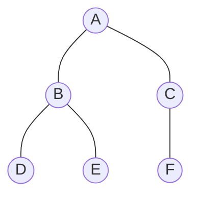
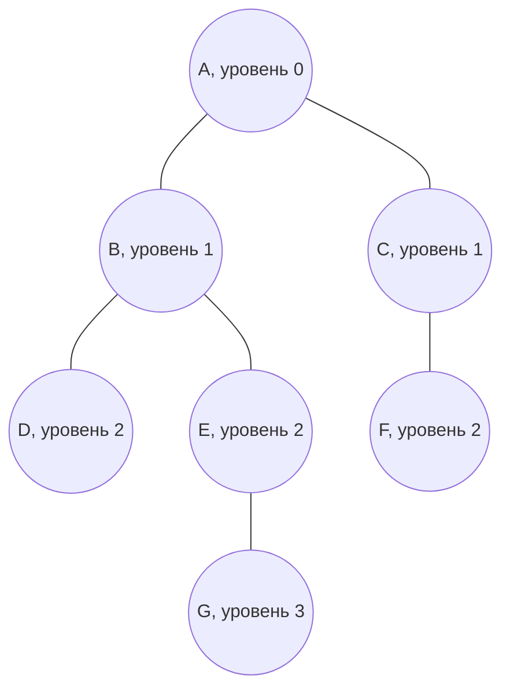
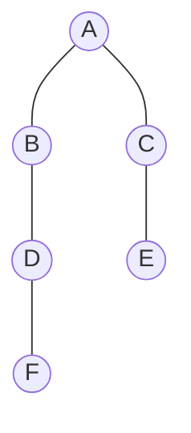
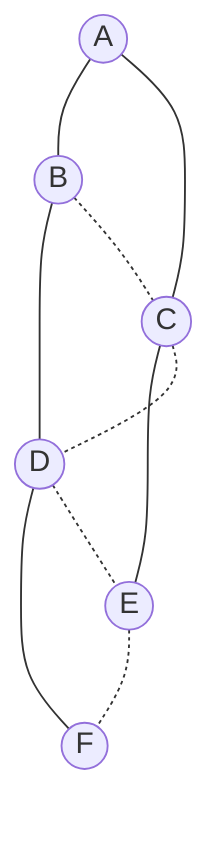
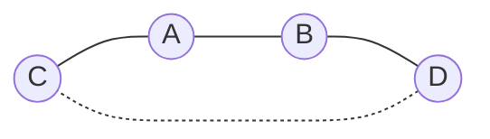

# Билет 7. Графы типа "дерево": определения; остовное дерево, фундаментальное множество циклов

## 1. Графы типа "дерево"

В этом билете рассматриваются конечные неориентированные графы. Если специально не оговорено иное, под графом понимается простой граф:
\[
G = (V, E),
\]
где \(V\) - множество вершин, \(E\) - множество ребер, каждое ребро соединяет две различные вершины.

**Дерево** - один из важнейших классов графов. Интуитивно дерево - это связный граф без "замкнутых обходов": из любой вершины в любую другую можно пройти, но при этом нет циклов.

Формально:

**Дерево** - это связный неориентированный граф, не содержащий циклов.

Например, граф

является деревом: он связен, и в нем нельзя начать движение из вершины, пройти по различным ребрам и вернуться в исходную вершину.

## 2. Эквивалентные определения дерева

Для конечного неориентированного графа \(T = (V, E)\) с \(n = |V|\) вершинами следующие утверждения эквивалентны. Каждое из них можно использовать как определение дерева.

1. **\(T\) связен и не содержит циклов.**

   Это основное определение: дерево - связный ациклический граф.

2. **\(T\) не содержит циклов и имеет \(n - 1\) ребро.**

   Ациклический граф с \(n - 1\) ребром не может распадаться на несколько компонент: если бы компонент было больше одной, ребер было бы меньше. Поэтому он связен и является деревом.

3. **\(T\) связен и имеет \(n - 1\) ребро.**

   Связный граф с \(n\) вершинами должен иметь не меньше \(n - 1\) ребра. Если ребер ровно \(n - 1\), то "лишних" ребер нет, значит циклов быть не может.

4. **Между любыми двумя различными вершинами существует ровно одна простая цепь.**

   Связность дает существование цепи. Отсутствие циклов дает единственность: если бы между двумя вершинами было две разные простые цепи, их объединение содержало бы цикл.

5. **\(T\) является минимально связным графом.**

   Это значит, что \(T\) связен, но удаление любого ребра нарушает связность. В дереве каждое ребро является мостом.

6. **\(T\) является максимально ациклическим графом.**

   Это значит, что \(T\) не содержит циклов, но добавление любого нового ребра между двумя несмежными вершинами создает цикл.

Эти формулировки полезны в разных задачах. Например, при доказательствах часто удобно использовать свойство единственности пути, а при подсчете - свойство \(|E| = n - 1\).

## 3. Лес, компоненты леса и листья

**Лес** - неориентированный граф без циклов.

Иными словами, лес - это граф, каждая компонента связности которого является деревом.

Если лес имеет:

- \(n\) вершин;
- \(m\) ребер;
- \(k\) компонент связности,

то
\[
m = n - k.
\]

Действительно, каждая компонента леса является деревом. Если в \(i\)-й компоненте \(n_i\) вершин, то в ней \(n_i - 1\) ребро. Поэтому
\[
m = \sum_{i=1}^{k}(n_i - 1)
= \sum_{i=1}^{k} n_i - k
= n - k.
\]

**Лист** дерева - вершина степени 1.

Степень вершины - количество инцидентных ей ребер. В дереве лист - это "концевая" вершина, из которой выходит ровно одно ребро.

В дереве с числом вершин \(n \ge 2\) всегда есть хотя бы два листа.

Краткое объяснение: возьмем в дереве самый длинный простой путь. Его концы не могут иметь соседей вне этого пути, иначе путь можно было бы продолжить. Также у концов не может быть дополнительных соседей внутри пути, иначе возник бы цикл. Значит, оба конца этого пути имеют степень 1, то есть являются листьями.

## 4. Корневое дерево: корень, уровни, предки и потомки

Обычное дерево не имеет выделенного направления. Но часто удобно выбрать одну вершину особой.

**Корневое дерево** - дерево, в котором выделена одна вершина, называемая **корнем**.

Пусть корень обозначен \(r\). Тогда для любой вершины \(v\) существует единственный простой путь из \(r\) в \(v\). Это позволяет ввести иерархические понятия.

**Уровень вершины** - расстояние от корня до этой вершины, то есть длина единственного пути от корня до нее.

- корень имеет уровень 0;
- соседи корня имеют уровень 1;
- вершины на расстоянии 2 от корня имеют уровень 2;
- и так далее.

**Родитель вершины** \(v \ne r\) - предыдущая вершина на единственном пути от корня \(r\) к \(v\).

**Сын** или **дочерняя вершина** вершины \(u\) - вершина \(v\), для которой \(u\) является родителем.

**Предок** вершины \(v\) - любая вершина, лежащая на пути от корня к \(v\). Обычно вершину \(v\) также могут считать своим собственным предком, если это явно оговорено; в строгом смысле предками часто называют только вершины выше \(v\).

**Потомок** вершины \(u\) - вершина \(v\), для которой \(u\) лежит на пути от корня к \(v\).

Пример корневого дерева с корнем \(A\):

Здесь:

- \(A\) - корень;
- \(B\) и \(C\) - потомки \(A\);
- \(A\) - предок всех остальных вершин;
- \(B\) - родитель вершин \(D\) и \(E\);
- \(D\), \(F\), \(G\) - листья;
- уровень \(G\) равен 3.

## 5. Основные свойства дерева на \(n\) вершинах

Пусть \(T\) - дерево с \(n\) вершинами.

### 5.1. Число ребер

Если \(n \ge 1\), то дерево имеет ровно
\[
n - 1
\]
ребро.

Это одно из главных свойств дерева.

Доказательство по индукции:

- при \(n = 1\) дерево состоит из одной вершины и не имеет ребер, то есть \(0 = 1 - 1\);
- пусть утверждение верно для деревьев с \(n - 1\) вершинами;
- в дереве с \(n \ge 2\) есть лист;
- удалим лист и инцидентное ему ребро;
- останется дерево с \(n - 1\) вершинами, в нем \(n - 2\) ребра;
- возвращая удаленный лист, получаем \(n - 1\) ребро.

### 5.2. Единственность пути

Между любыми двумя вершинами дерева существует ровно один простой путь.

Если бы путей было два, то их объединение содержало бы цикл. Это противоречит определению дерева.

### 5.3. Каждое ребро дерева является мостом

**Мост** - ребро, удаление которого увеличивает число компонент связности графа.

В дереве удаление любого ребра разрывает единственный путь между некоторыми вершинами, поэтому дерево становится несвязным. Значит, каждое ребро дерева - мост.

### 5.4. Добавление любого нового ребра создает ровно один цикл

Пусть в дереве \(T\) добавили ребро \(uv\), которого раньше не было. В дереве уже существовал единственный путь из \(u\) в \(v\). Новое ребро \(uv\) вместе с этим путем образует цикл.

Цикл ровно один, потому что путь между \(u\) и \(v\) в дереве был единственным.

### 5.5. Связный граф содержит остовное дерево

Если граф \(G\) связен, то из него можно удалить ребра, принадлежащие циклам, пока циклов не останется. Связность при этом сохраняется, потому что удаление ребра из цикла не разрывает граф: между его концами остается путь по остальной части цикла. В результате получится связный ациклический подграф, то есть дерево, содержащее все вершины \(G\). Это и есть остовное дерево.

## 6. Остовное дерево связного графа

Пусть \(G = (V, E)\) - связный неориентированный граф.

**Остовный подграф** графа \(G\) - подграф, содержащий все вершины \(G\). То есть у него то же множество вершин \(V\), но, возможно, меньше ребер.

**Остовное дерево** графа \(G\) - остовный подграф, который является деревом.

Обозначим остовное дерево через \(T = (V, E_T)\), где
\[
E_T \subseteq E.
\]

Так как \(T\) является деревом на \(n = |V|\) вершинах, то
\[
|E_T| = n - 1.
\]

Остовное дерево:

- содержит все вершины исходного графа;
- содержит только часть ребер исходного графа;
- является связным;
- не содержит циклов;
- показывает минимальный набор ребер, достаточный для сохранения связности.

Если связный граф \(G\) имеет \(n\) вершин и \(m\) ребер, то любое его остовное дерево содержит \(n - 1\) ребро. Все остальные ребра исходного графа не входят в выбранное остовное дерево.

## 7. Хорды относительно остовного дерева

Пусть \(T\) - выбранное остовное дерево связного графа \(G\).

**Хорда относительно остовного дерева** - ребро графа \(G\), которое не принадлежит остовному дереву \(T\).

Иначе говоря, если
\[
E_T
\]
- множество ребер остова, то множество хорд:
\[
E \setminus E_T.
\]

Число хорд равно
\[
|E \setminus E_T| = m - (n - 1) = m - n + 1.
\]

Это число называется **цикломатическим числом** связного графа:
\[
\mu(G) = m - n + 1.
\]

Цикломатическое число показывает, сколько независимых циклов есть в связном графе. В частности:

- если \(\mu(G) = 0\), то \(m = n - 1\), граф является деревом;
- если \(\mu(G) > 0\), то в графе есть циклы;
- каждая хорда относительно фиксированного остова порождает один фундаментальный цикл.

Для несвязного графа с \(k\) компонентами связности аналогичная формула имеет вид
\[
\mu(G) = m - n + k.
\]
Но в данном билете главным образом рассматривается связный граф, поэтому используется формула \(m - n + 1\).

## 8. Фундаментальные циклы, связанные с деревом

Пусть \(G\) - связный граф, \(T\) - его остовное дерево.

Возьмем хорду \(e = uv\), то есть ребро \(uv \in E \setminus E_T\).

В дереве \(T\) между вершинами \(u\) и \(v\) существует единственный простой путь. Обозначим его через
\[
P_T(u, v).
\]

Тогда ребро \(uv\) вместе с путем \(P_T(u, v)\) образует цикл:
\[
C_e = P_T(u, v) \cup \{uv\}.
\]

Этот цикл называется **фундаментальным циклом**, соответствующим хорде \(e\) относительно остовного дерева \(T\).

Важно:

- один фундаментальный цикл соответствует ровно одной хорде;
- каждый фундаментальный цикл содержит свою хорду;
- остальные ребра цикла лежат в остовном дереве;
- число фундаментальных циклов равно числу хорд, то есть \(m - n + 1\);
- фундаментальные циклы зависят от выбора остовного дерева.

**Фундаментальное множество циклов** относительно остовного дерева \(T\) - это множество всех фундаментальных циклов, полученных добавлением к \(T\) каждой хорды графа \(G\).

Если хорды обозначены \(e_1, e_2, \ldots, e_{\mu}\), где
\[
\mu = m - n + 1,
\]
то фундаментальное множество циклов имеет вид
\[
\{C_{e_1}, C_{e_2}, \ldots, C_{e_{\mu}}\}.
\]

Это множество важно потому, что оно образует базис циклов графа над полем \(\mathbb{F}_2\): любой цикл графа можно представить как симметрическую разность некоторых фундаментальных циклов. Для экзамена достаточно понимать содержательный смысл: фундаментальные циклы дают независимое описание всех циклов графа через выбранное остовное дерево и оставшиеся ребра-хорды.

## 9. Пример: связный граф, остов и фундаментальные циклы

Рассмотрим связный граф \(G\) с вершинами
\[
V = \{A, B, C, D, E, F\}
\]
и ребрами
\[
E =
\{AB, AC, BC, BD, CD, CE, DE, DF, EF\}.
\]

Здесь:

- \(n = 6\);
- \(m = 9\);
- цикломатическое число
  \[
  \mu(G) = m - n + 1 = 9 - 6 + 1 = 4.
  \]

Значит, относительно любого остовного дерева у графа будет 4 хорды и 4 фундаментальных цикла.

Выберем остовное дерево \(T\) с ребрами
\[
E_T = \{AB, AC, BD, CE, DF\}.
\]

Проверим:

- оно содержит все 6 вершин;
- в нем 5 ребер, то есть \(n - 1 = 5\);
- оно связно;
- значит, это остовное дерево.

Остов \(T\):

Оставшиеся ребра графа \(G\) являются хордами:
\[
E \setminus E_T = \{BC, CD, DE, EF\}.
\]

Каждая хорда дает фундаментальный цикл.

### 9.1. Хорда \(BC\)

В остове путь между \(B\) и \(C\):
\[
B - A - C.
\]

Добавляем хорду \(BC\). Получаем фундаментальный цикл:
\[
C_{BC}: B - A - C - B.
\]

### 9.2. Хорда \(CD\)

В остове путь между \(C\) и \(D\):
\[
C - A - B - D.
\]

Добавляем хорду \(CD\). Получаем:
\[
C_{CD}: C - A - B - D - C.
\]

### 9.3. Хорда \(DE\)

В остове путь между \(D\) и \(E\):
\[
D - B - A - C - E.
\]

Добавляем хорду \(DE\). Получаем:
\[
C_{DE}: D - B - A - C - E - D.
\]

### 9.4. Хорда \(EF\)

В остове путь между \(E\) и \(F\):
\[
E - C - A - B - D - F.
\]

Добавляем хорду \(EF\). Получаем:
\[
C_{EF}: E - C - A - B - D - F - E.
\]

Та же ситуация на диаграмме: сплошные ребра образуют остов, пунктирные ребра - хорды. Каждая пунктирная хорда вместе с единственным путем по остову образует свой фундаментальный цикл.

Можно также выделить один фундаментальный цикл отдельно. Например, для хорды \(CD\) цикл состоит из пути \(C - A - B - D\) по остову и хорды \(CD\):

## 10. Почему фундаментальных циклов ровно \(m - n + 1\)

Пусть \(G\) - связный граф с \(n\) вершинами и \(m\) ребрами, а \(T\) - его остовное дерево.

Так как \(T\) - дерево на всех \(n\) вершинах, в нем ровно \(n - 1\) ребро.

Все ребра графа \(G\), не попавшие в \(T\), являются хордами. Поэтому число хорд:
\[
m - (n - 1) = m - n + 1.
\]

Каждая хорда создает ровно один фундаментальный цикл, потому что в дереве между концами хорды существует ровно один путь. Следовательно, число фундаментальных циклов тоже равно
\[
m - n + 1.
\]

Это число не зависит от того, какое именно остовное дерево выбрано. Однако сами фундаментальные циклы могут измениться при выборе другого остова.

## 11. Краткая схема ответа на экзамене

Если нужно ответить компактно, можно держать следующую структуру:

1. Дерево - связный ациклический граф.
2. Эквивалентно: связный граф с \(n - 1\) ребром; ациклический граф с \(n - 1\) ребром; между любыми двумя вершинами есть единственный простой путь; минимально связный граф; максимально ациклический граф.
3. Лес - граф без циклов, его компоненты являются деревьями.
4. Лист - вершина степени 1; в любом дереве с \(n \ge 2\) есть минимум два листа.
5. Корневое дерево - дерево с выделенным корнем; уровень вершины - расстояние от корня; предки и потомки определяются единственным путем от корня.
6. В дереве на \(n\) вершинах ровно \(n - 1\) ребро; каждое ребро является мостом; добавление любого нового ребра создает ровно один цикл.
7. Остовное дерево связного графа - дерево, содержащее все вершины графа и часть его ребер.
8. Ребра, не вошедшие в остов, называются хордами относительно остова.
9. Каждая хорда \(uv\) вместе с единственным путем между \(u\) и \(v\) в остове образует фундаментальный цикл.
10. Число хорд и фундаментальных циклов равно цикломатическому числу связного графа:
    \[
    \mu(G) = m - n + 1.
    \]
