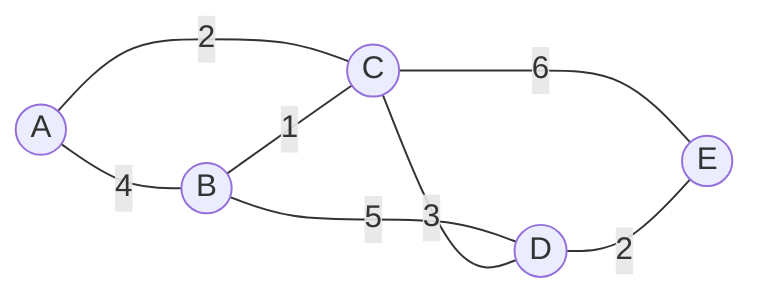
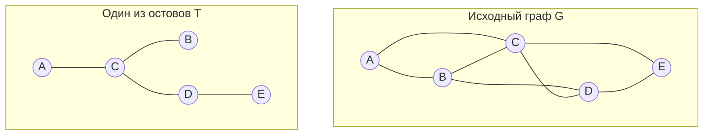
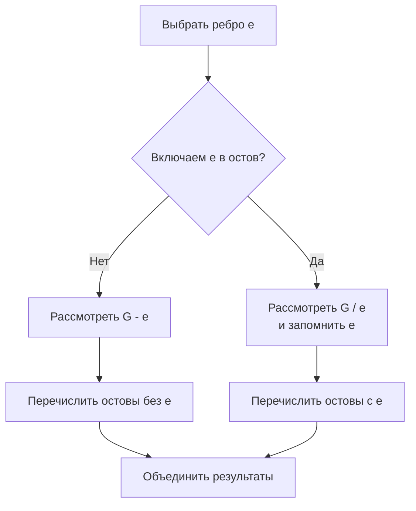
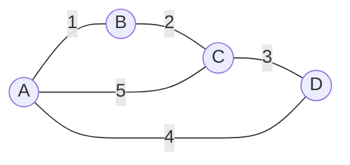
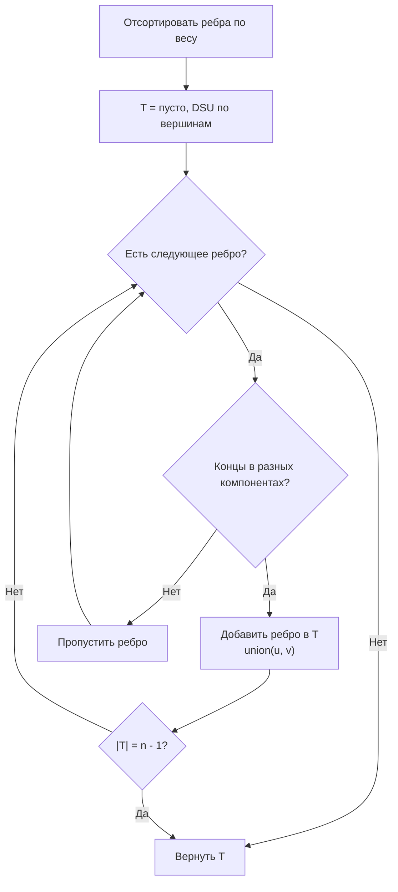
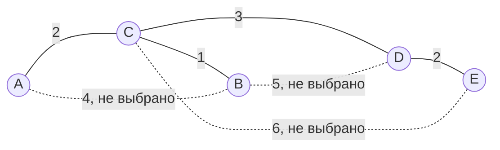
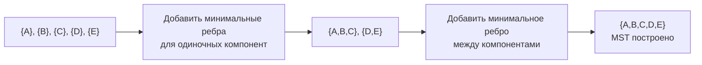

# Билет 8. Остовные деревья графа, задача перечисления деревьев, алгоритмы поиска минимальных остовных деревьев

## 1. Краткая идея

Остовное дерево связного графа - это способ оставить в графе ровно столько ребер, чтобы все вершины остались достижимыми, но циклов уже не было. Для связного графа с `n` вершинами любой остов содержит `n - 1` ребро. Если ребрам заданы веса, возникает задача минимального остовного дерева: среди всех остовов выбрать остов с минимальной суммой весов.

На экзамене удобно сразу разделить три близкие задачи:

1. **Построить какой-нибудь остов**: достаточно DFS или BFS.
2. **Перечислить все остовные деревья**: комбинаторная задача, используют рекурсию по ребру, удаление/стягивание, матричную теорему Кирхгофа для подсчета.
3. **Найти минимальный остов**: используют алгоритмы Краскала, Прима, Борувки.

## 2. Основные определения

Пусть `G = (V, E)` - конечный неориентированный граф.

**Остовный подграф** графа `G` - подграф `H = (V, E_H)`, который содержит все вершины исходного графа и некоторое подмножество ребер `E_H ⊆ E`.

**Остовное дерево** графа `G` - остовный подграф, который является деревом, то есть связен и не содержит циклов.

**Остовный лес** - аналог для несвязного графа: в каждой компоненте связности строится свое дерево. Если в графе `c` компонент и `n` вершин, остовный лес содержит `n - c` ребер.

**Вес графа** - функция `w: E -> R`, которая каждому ребру сопоставляет число. Вес остова:

```text
w(T) = sum_{e in E(T)} w(e)
```

**Минимальное остовное дерево** (minimum spanning tree, MST) - остовное дерево `T`, для которого сумма весов минимальна среди всех остовных деревьев графа.

Если граф несвязен, минимального остовного дерева для всего графа нет, но можно искать **минимальный остовный лес**.



В этом графе остов должен включить все пять вершин и ровно `5 - 1 = 4` ребра.

## 3. Свойства остовных деревьев

Для связного графа `G = (V, E)` с `|V| = n`:

- остовное дерево существует тогда и только тогда, когда граф связен;
- любое остовное дерево содержит все вершины графа;
- любое остовное дерево содержит ровно `n - 1` ребро;
- добавление к остову любого ребра из `E \ E(T)` создает ровно один цикл;
- удаление из дерева любого ребра разбивает его на две компоненты;
- если граф сам является деревом, его единственное остовное дерево - он сам.

Остовные деревья важны потому, что они сохраняют достижимость, но удаляют избыточность циклов. В сетевых задачах это означает минимальную связную инфраструктуру: все узлы соединены, но нет лишних каналов.



## 4. Задача перечисления остовных деревьев

Задача перечисления состоит в том, чтобы получить все различные остовные деревья графа `G`. Это сложнее, чем просто найти один остов, потому что число остовов может быть очень большим.

Например, в полном графе `K_n` число остовных деревьев равно:

```text
n^(n-2)
```

Это формула Кэли. Уже для `K_6` получается `6^4 = 1296` остовов.

### 4.1. Рекурсия по ребру: удаление и стягивание

Для выбранного ребра `e` все остовные деревья графа делятся на два класса:

- остовы, которые **содержат** ребро `e`;
- остовы, которые **не содержат** ребро `e`.

Если остов не содержит `e`, можно удалить `e` из графа.

Если остов содержит `e`, можно стянуть `e`, то есть объединить его концы в одну вершину. После стягивания остовы меньшего графа соответствуют остовам исходного графа, в которые входит `e`.

Обозначим через `τ(G)` число остовных деревьев графа `G`. Тогда для обычного ребра, не являющегося петлей, выполняется рекуррентная идея:

```text
τ(G) = τ(G - e) + τ(G / e)
```

где `G - e` - граф с удаленным ребром, а `G / e` - граф со стянутым ребром.



Для практического перечисления дополнительно нужны отсечения:

- если граф стал несвязным, ветка не дает остовов;
- если выбранных ребер уже больше `n - 1`, ветка невозможна;
- если выбранные ребра образуют цикл, их нельзя все включить в дерево;
- если осталось недостаточно ребер для связности, ветка отбрасывается.

### 4.2. Матричная теорема Кирхгофа

Теорема Кирхгофа, или матричная теорема о деревьях, дает способ **посчитать** число остовных деревьев без явного перечисления.

Пусть `A` - матрица смежности графа, `D` - диагональная матрица степеней вершин. Тогда

```text
L = D - A
```

называется матрицей Лапласа графа.

Чтобы найти число остовных деревьев `τ(G)`, нужно:

1. построить матрицу Лапласа `L`;
2. удалить из нее любую одну строку и соответствующий столбец;
3. вычислить определитель полученной матрицы.

Этот определитель равен числу остовных деревьев графа.

Важно: теорема Кирхгофа считает количество остовов, но сама по себе не перечисляет их явно.

## 5. Минимальное остовное дерево

Задача MST формулируется так:

```text
Дан связный неориентированный взвешенный граф G = (V, E, w).
Найти остовное дерево T, минимизирующее sum w(e) по e in T.
```

Обычно предполагают, что граф неориентированный. В ориентированных графах аналогичная задача называется задачей минимального ветвления или арборесценции и решается другими алгоритмами, например алгоритмом Эдмондса.

В MST веса могут быть отрицательными, нулевыми или положительными. Алгоритмы Краскала, Прима и Борувки работают и с отрицательными весами, потому что им важно только сравнение ребер.

Если все веса различны, минимальное остовное дерево единственно. Если есть равные веса, MST может быть несколько.

## 6. Свойства разреза и цикла

Корректность основных алгоритмов MST обычно доказывают через два свойства.

### 6.1. Свойство разреза

Разрезом называется разбиение множества вершин на две непустые части `S` и `V \ S`. Ребро пересекает разрез, если один его конец лежит в `S`, а другой - в `V \ S`.

**Свойство разреза:** если взять разрез, который не пересекает уже выбранные безопасные ребра, то минимальное по весу ребро, пересекающее этот разрез, можно безопасно добавить в некоторое MST.

Именно это свойство объясняет алгоритмы Прима, Краскала и Борувки: они каждый раз добавляют ребро, которое является минимальным для некоторого разреза.

### 6.2. Свойство цикла

**Свойство цикла:** если в цикле есть ребро, вес которого строго больше весов всех остальных ребер цикла, то это ребро не входит ни в одно MST.

Интуиция: в цикле можно удалить самое тяжелое ребро, и связность не нарушится, а суммарный вес уменьшится.



В цикле `A-B-C-A` ребро `A-C` веса `5` хуже альтернативного обхода через `A-B-C`, поэтому при строгом максимуме оно не нужно для MST.

## 7. Алгоритм Краскала

Алгоритм Краскала строит MST, добавляя ребра в порядке возрастания веса и не допуская циклов.

### Шаги алгоритма

1. Отсортировать все ребра по неубыванию веса.
2. Изначально каждую вершину считать отдельной компонентой.
3. Перебирать ребра от меньшего веса к большему.
4. Если концы ребра лежат в разных компонентах, добавить ребро в остов и объединить компоненты.
5. Если концы ребра уже в одной компоненте, пропустить ребро, иначе появится цикл.
6. Остановиться, когда выбрано `n - 1` ребро.

Для быстрой проверки компонент используют структуру **DSU** (disjoint set union, система непересекающихся множеств).

### Псевдокод

```text
Kruskal(G):
    T = empty set
    sort E by weight
    make_set(v) for every v in V

    for each edge (u, v) in sorted E:
        if find(u) != find(v):
            T.add((u, v))
            union(u, v)
        if |T| == |V| - 1:
            break

    return T
```

### Сложность

Сортировка ребер занимает `O(m log m)`. Операции DSU почти линейны: `O(m α(n))`, где `α` - обратная функция Аккермана, практически константа. Поэтому общая сложность:

```text
O(m log m)
```

Краскал особенно удобен для разреженных графов и когда ребра уже легко отсортировать.



## 8. Алгоритм Прима

Алгоритм Прима растит одно дерево. На каждом шаге он выбирает самое легкое ребро, которое соединяет уже построенную часть с новой вершиной.

### Шаги алгоритма

1. Выбрать стартовую вершину `s`.
2. Считать ее начальным деревом.
3. Среди всех ребер, выходящих из построенного дерева наружу, выбрать ребро минимального веса.
4. Добавить это ребро и новую вершину.
5. Повторять, пока не будут добавлены все вершины.

Это прямое применение свойства разреза: текущие вершины дерева образуют одну часть разреза, остальные вершины - другую.

### Псевдокод

```text
Prim(G, s):
    for v in V:
        key[v] = infinity
        parent[v] = null
    key[s] = 0
    Q = all vertices

    while Q is not empty:
        u = vertex from Q with minimum key[u]
        remove u from Q
        for each edge (u, v) with v in Q:
            if w(u, v) < key[v]:
                key[v] = w(u, v)
                parent[v] = u

    return edges (parent[v], v)
```

### Сложность

Зависит от реализации:

- матрица смежности и простой поиск минимума: `O(n^2)`;
- списки смежности и бинарная куча: `O(m log n)`;
- фибоначчиева куча теоретически: `O(m + n log n)`.

Прим часто удобен для плотных графов, особенно в реализации `O(n^2)`.



Для исходного графа из первого примера одно MST состоит из ребер `BC(1)`, `AC(2)`, `DE(2)`, `CD(3)`. Его вес равен `1 + 2 + 2 + 3 = 8`.

## 9. Алгоритм Борувки

Алгоритм Борувки одновременно расширяет все компоненты. На каждой итерации для каждой текущей компоненты выбирается минимальное ребро, выходящее из нее наружу. Все такие ребра добавляются, после чего компоненты объединяются.

### Шаги алгоритма

1. Изначально каждая вершина - отдельная компонента.
2. Для каждой компоненты найти минимальное внешнее ребро.
3. Добавить все найденные ребра, не создавая противоречий.
4. Объединить компоненты.
5. Повторять, пока не останется одна компонента.

На каждой фазе число компонент обычно уменьшается как минимум вдвое, поэтому фаз `O(log n)`.

Сложность простой реализации:

```text
O(m log n)
```

Алгоритм хорошо параллелится, потому что минимальные исходящие ребра разных компонент можно искать независимо.



## 10. Пошаговый пример MST

Рассмотрим граф:


Отсортируем ребра:

| Ребро | Вес |
|---|---:|
| `B-C` | 1 |
| `A-C` | 2 |
| `D-E` | 2 |
| `C-D` | 3 |
| `A-B` | 4 |
| `B-D` | 5 |
| `C-E` | 6 |

Алгоритм Краскала:

1. Берем `B-C` веса `1`. Цикла нет.
2. Берем `A-C` веса `2`. Компонента `{A,B,C}`.
3. Берем `D-E` веса `2`. Компонента `{D,E}`.
4. Берем `C-D` веса `3`. Соединяем две компоненты.
5. Уже выбрано `n - 1 = 4` ребра, остов готов.

Итог:

```text
T = {B-C, A-C, D-E, C-D}
w(T) = 1 + 2 + 2 + 3 = 8
```

Ребро `A-B` веса `4` не берется, потому что после выбора `B-C` и `A-C` оно создало бы цикл `A-B-C-A`.

## 11. Сравнение алгоритмов MST

| Алгоритм | Идея | Типичная структура данных | Сложность | Когда удобен |
|---|---|---|---:|---|
| Краскал | брать легчайшие ребра без циклов | сортировка + DSU | `O(m log m)` | разреженные графы, реберное представление |
| Прим | растить одно дерево от вершины | куча или матрица | `O(m log n)` или `O(n^2)` | плотные графы, списки/матрица смежности |
| Борувка | каждая компонента берет минимальное внешнее ребро | DSU, сканирование ребер | `O(m log n)` | параллельные вычисления, теоретические гибриды |

Все три алгоритма используют один и тот же принцип: добавлять только безопасные ребра, которые могут входить в некоторое минимальное остовное дерево.

## 12. Типичные ошибки

- **Искать MST в несвязном графе.** В несвязном графе нет остовного дерева всего графа, есть только остовный лес.
- **Путать кратчайшие пути и MST.** Минимальный остов не обязан давать кратчайший путь между каждой парой вершин.
- **Считать, что отрицательные веса запрещены.** Для MST отрицательные веса допустимы; запрет важен, например, для алгоритма Дейкстры, но не для Краскала или Прима.
- **Добавлять ребро в Краскале без проверки цикла.** Главное правило: ребро добавляется только если соединяет разные компоненты.
- **Думать, что MST всегда единственно.** При равных весах может быть несколько минимальных остовов.
- **Путать перечисление и подсчет.** Теорема Кирхгофа считает число остовов, но не выдает список всех деревьев.

## 13. Что сказать на экзамене

Короткий сильный ответ можно построить так:

1. Остовное дерево связного графа - это связный ациклический остовный подграф; оно содержит все `n` вершин и ровно `n - 1` ребро.
2. Остов существует тогда и только тогда, когда граф связен; в несвязном графе строят остовный лес.
3. Перечислять остовы можно рекурсией по ребру: ветка с удалением ребра и ветка со стягиванием ребра; число остовов можно найти по матричной теореме Кирхгофа через определитель алгебраического дополнения матрицы Лапласа.
4. Минимальное остовное дерево ищут во взвешенном неориентированном графе. Классические алгоритмы: Краскал, Прим, Борувка.
5. Корректность MST-алгоритмов основана на свойствах разреза и цикла: минимальное ребро подходящего разреза безопасно, а строго самое тяжелое ребро цикла не нужно.
6. Краскал сортирует ребра и использует DSU, Прим растит дерево через минимальное внешнее ребро, Борувка параллельно объединяет компоненты минимальными исходящими ребрами.

