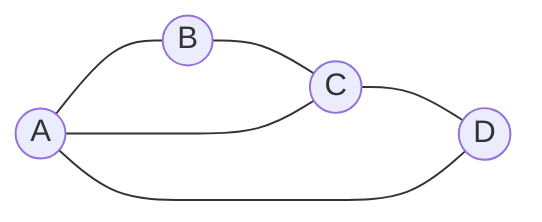
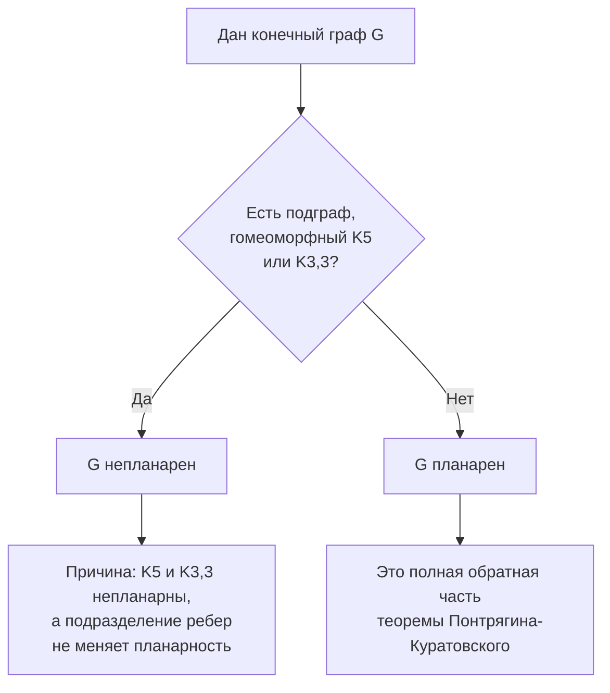
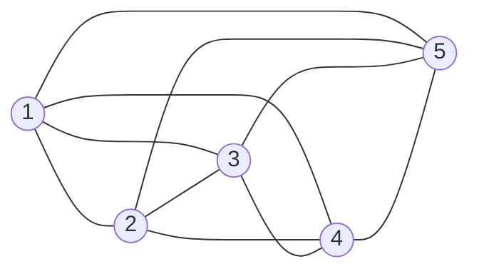
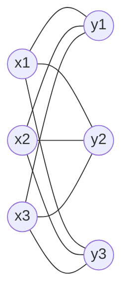
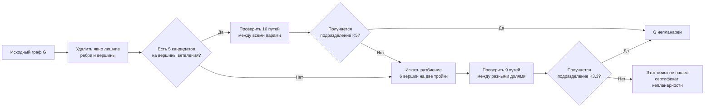

# Билет 9. Планарность графа: основные понятия, теорема Понтрягина-Куратовского

## 1. Краткая идея

**Планарность графа** описывает возможность нарисовать граф на плоскости так, чтобы его ребра не пересекались во внутренних точках. Вершины можно располагать где угодно, ребра можно проводить не только прямыми отрезками, но и произвольными непрерывными кривыми. Важно только, чтобы разные ребра встречались лишь в общих концах.

Например, цикл, дерево, квадрат с диагональю и многие сеточные графы планарны. А два классических графа не планарны:

- \(K_5\) - полный граф на пяти вершинах;
- \(K_{3,3}\) - полный двудольный граф с долями по три вершины.

Теорема Понтрягина-Куратовского дает полный критерий непланарности:

> Граф непланарен тогда и только тогда, когда он содержит подграф, гомеоморфный \(K_5\) или \(K_{3,3}\).

Иными словами, всякая непланарность в конечном графе сводится к наличию внутри него одной из двух запрещенных конфигураций: либо "скрытого" \(K_5\), либо "скрытого" \(K_{3,3}\), возможно с ребрами, замененными путями.

## 2. Основные определения

### 2.1. Рисунок графа на плоскости

Пусть дан неориентированный граф
\[
G = (V, E).
\]

**Рисунок графа на плоскости** - это изображение графа, при котором:

- каждой вершине \(v \in V\) сопоставлена точка плоскости;
- каждому ребру \(\{u,v\} \in E\) сопоставлена простая кривая, соединяющая точки \(u\) и \(v\);
- кривая ребра не проходит через вершины, кроме своих концов.

Рисунок может иметь пересечения ребер. Если два ребра пересекаются в точке, которая не является их общей вершиной, такое пересечение называется **недопустимым пересечением** для планарной укладки.

Важно: пересечение ребер на одном конкретном рисунке еще не доказывает непланарность. Возможно, граф можно перерисовать иначе.

### 2.2. Планарный граф

**Планарный граф** - граф, который можно изобразить на плоскости без пересечений ребер во внутренних точках.

Формально граф \(G\) называется планарным, если существует такой его рисунок на плоскости, что любые два ребра имеют общие точки только в следующих случаях:

- они имеют общую вершину, и тогда пересекаются в этой вершине;
- они вообще не имеют общих точек.

Если у ребер нет общей вершины, они не должны пересекаться. Если у ребер есть общая вершина, они могут встречаться только в ней.

### 2.3. Плоский граф и плоская укладка

Нужно различать два близких понятия.

**Планарный граф** - это абстрактный граф, для которого существует изображение без пересечений.

**Плоский граф** или **плоская укладка** - это уже выбранное конкретное изображение планарного графа на плоскости без пересечений.

Один и тот же планарный граф может иметь разные плоские укладки. Укладки могут отличаться порядком ребер вокруг вершин и набором граней.

Пример планарной укладки:

Этот граф можно понимать как квадрат \(A B C D\) с диагональю \(A C\). Если нарисовать его как квадрат и провести диагональ, пересечений ребер нет. Плоскость разбивается на две внутренние треугольные области и одну внешнюю область.

### 2.4. Грани

Пусть граф уже уложен на плоскости без пересечений. Тогда его ребра и вершины делят плоскость на связные области. Эти области называются **гранями** плоской укладки.

**Грань** - максимальная связная область плоскости, не содержащая точек графа.

Грани бывают:

- **внутренние** - ограниченные области внутри рисунка;
- **внешняя грань** - неограниченная область снаружи рисунка.

Внешняя грань всегда ровно одна. Она тоже считается гранью, хотя не ограничена конечной областью.

Для связного плоского графа с числом вершин \(v\), числом ребер \(e\) и числом граней \(f\) выполняется формула Эйлера:
\[
v - e + f = 2.
\]

Если граф имеет \(c\) компонент связности, то более общая формула:
\[
v - e + f = 1 + c.
\]

### 2.5. Граница грани

**Граница грани** - это замкнутый обход по ребрам и вершинам, отделяющий данную грань от остальных частей плоскости.

В простых 2-связных плоских графах границы граней выглядят как циклы. В более общем случае граница грани может проходить по одной и той же вершине или ребру несколько раз. Например, если граф является деревом, у него нет циклов, но есть одна грань - внешняя, и каждое ребро лежит на ее границе с двух сторон.

### 2.6. Пересечения ребер

При проверке планарности нужно различать допустимые и недопустимые встречи ребер.

**Допустимо:**

- ребра \(\{a,b\}\) и \(\{a,c\}\) встречаются в общей вершине \(a\);
- несколько ребер инцидентны одной вершине;
- ребро касается другого ребра только в общей конечной вершине.

**Недопустимо для плоской укладки:**

- два ребра без общей вершины пересекаются;
- ребро проходит через чужую вершину;
- два ребра с общей вершиной дополнительно пересекаются где-то еще.

Если на рисунке есть недопустимое пересечение, это означает только то, что данный рисунок не является плоской укладкой. Сам граф может быть планарным, если существует другой рисунок без таких пересечений.

## 3. Подразделение ребер и гомеоморфизм графов

### 3.1. Подразделение ребра

**Подразделить ребро** \(\{u,v\}\) - значит заменить его путем
\[
u - x_1 - x_2 - \ldots - x_k - v,
\]
где \(x_1,\ldots,x_k\) - новые вершины степени 2.

Например, ребро \(uv\) можно заменить на путь \(u-x-v\). Новая вершина \(x\) имеет степень 2 и служит только "точкой на ребре".

Подразделение ребер не меняет планарности:

- если исходный граф планарен, то после вставки вершин на ребра он остается планарным;
- если подразделенный граф планарен, то после стягивания цепочек вершин степени 2 обратно в ребра исходный граф тоже планарен.

### 3.2. Гомеоморфные графы

Два графа называются **гомеоморфными**, если они могут быть получены из одного и того же графа последовательным подразделением ребер.

Эквивалентная формулировка: граф \(H\) гомеоморфен графу \(F\), если \(H\) получается из \(F\) заменой каждого ребра на путь, причем внутренние вершины этих путей имеют степень 2 и разные пути не имеют общих внутренних вершин.

В контексте теоремы Понтрягина-Куратовского особенно важна такая ситуация:

- в большом графе \(G\) есть подграф \(H\);
- после удаления вершин степени 2 на цепочках этот подграф превращается в \(K_5\) или \(K_{3,3}\);
- значит, \(H\) является подразделением \(K_5\) или \(K_{3,3}\).

Такой подграф часто называют **топологическим \(K_5\)** или **топологическим \(K_{3,3}\)**.

### 3.3. Вершины ветвления

При поиске подграфа, гомеоморфного \(K_5\) или \(K_{3,3}\), удобно выделять **вершины ветвления**.

**Вершины ветвления** - это вершины, соответствующие исходным вершинам \(K_5\) или \(K_{3,3}\). Они соединяются между собой путями, которые изображают ребра исходного запрещенного графа.

Для топологического \(K_5\):

- нужно найти 5 вершин ветвления;
- каждая пара этих вершин должна быть соединена отдельным путем;
- всего нужно 10 путей;
- внутренние вершины этих путей не должны пересекаться между разными путями.

Для топологического \(K_{3,3}\):

- нужно найти 6 вершин ветвления, разбитых на две тройки;
- каждая вершина первой тройки должна соединяться путем с каждой вершиной второй тройки;
- всего нужно 9 путей;
- путей между вершинами внутри одной тройки не требуется.

## 4. Миноры: обзорно

**Минор графа** получается из графа с помощью трех операций:

1. удаление вершины;
2. удаление ребра;
3. стягивание ребра, то есть отождествление его концов.

Если граф \(H\) можно получить из \(G\) такими операциями, то \(H\) называется **минором** графа \(G\).

Связь с планарностью:

- удаление вершин и ребер у планарного графа сохраняет планарность;
- стягивание ребра в планарной укладке тоже сохраняет планарность;
- поэтому если планарный граф имеет минор \(H\), то \(H\) тоже планарен;
- следовательно, если граф имеет непланарный минор, он сам непланарен.

Миноры важны для теоремы Вагнера:

> Граф планарен тогда и только тогда, когда он не содержит \(K_5\) и \(K_{3,3}\) в качестве миноров.

Это похоже на теорему Понтрягина-Куратовского, но не то же самое. У Куратовского запрещенная конфигурация должна сидеть как подграф с подразделенными ребрами. У Вагнера разрешены еще и стягивания ребер, то есть критерий формулируется через миноры.

## 5. Теорема Понтрягина-Куратовского

### 5.1. Формулировка

**Теорема Понтрягина-Куратовского.** Конечный граф \(G\) непланарен тогда и только тогда, когда \(G\) содержит подграф, гомеоморфный одному из графов \(K_5\) или \(K_{3,3}\).

То есть:
\[
G \text{ непланарен}
\iff
G \text{ содержит подразделение } K_5 \text{ или } K_{3,3}.
\]

Развернуто:

- если в графе \(G\) есть подграф, который получается из \(K_5\) или \(K_{3,3}\) заменой ребер на пути, то \(G\) непланарен;
- если граф \(G\) непланарен, то внутри него обязательно найдется такой подграф.

Это не просто достаточное условие, а полный критерий.

### 5.2. Почему наличие такого подграфа доказывает непланарность

Пусть граф \(G\) содержит подграф \(H\), гомеоморфный \(K_5\) или \(K_{3,3}\).

Если бы \(G\) был планарным, то любой его подграф тоже был бы планарным: из плоской укладки \(G\) можно просто удалить лишние ребра и вершины.

Значит, \(H\) был бы планарным. Но \(H\) получается из \(K_5\) или \(K_{3,3}\) подразделением ребер. Подразделение ребер не меняет планарности. Поэтому из планарности \(H\) следовала бы планарность \(K_5\) или \(K_{3,3}\).

А \(K_5\) и \(K_{3,3}\) непланарны. Получаем противоречие. Следовательно, \(G\) непланарен.

### 5.3. Почему это также необходимо

Обратная часть глубже:

> если граф непланарен, то его непланарность обязательно вызвана скрытым \(K_5\) или скрытым \(K_{3,3}\).

Интуитивно доказательство опирается на идею минимального непланарного графа. Если из непланарного графа удалить все лишнее, получим минимальный по включению непланарный подграф: удаление любого его ребра делает граф планарным. Теорема утверждает, что такой минимальный непланарный фрагмент неизбежно имеет структуру подразделения \(K_5\) или \(K_{3,3}\).

Полное доказательство обычно требует аккуратного анализа того, как можно добавить последнее ребро к планарной укладке почти планарного графа и почему невозможность провести это ребро без пересечений порождает одну из двух запрещенных топологических конфигураций.

### 5.4. Схема критерия

## 6. Граф \(K_5\)

### 6.1. Определение

\(K_5\) - полный граф на пяти вершинах. Это означает, что каждая пара различных вершин соединена ребром.

У него:

- \(v = 5\) вершин;
- \(e = \binom{5}{2} = 10\) ребер;
- степень каждой вершины равна 4.

Схематически:

Диаграмма показывает все попарные соединения пяти вершин. В конкретном рисунке ребра могут пересекаться, но непланарность \(K_5\) утверждает большее: как бы мы ни переставляли вершины и ни изгибали ребра, полностью избавиться от пересечений невозможно.

### 6.2. Почему \(K_5\) непланарен

Используем следствие из формулы Эйлера.

Для простого связного планарного графа с \(v \ge 3\) выполняется неравенство:
\[
e \le 3v - 6.
\]

Почему оно верно:

- в простой планарной укладке каждая грань ограничена как минимум тремя ребрами;
- каждое ребро лежит на границе двух граней;
- поэтому \(3f \le 2e\);
- по формуле Эйлера \(v - e + f = 2\);
- отсюда \(e \le 3v - 6\).

Для \(K_5\):
\[
v = 5,\quad e = 10.
\]

Планарность потребовала бы:
\[
10 \le 3 \cdot 5 - 6 = 9.
\]

Это невозможно. Значит, \(K_5\) непланарен.

## 7. Граф \(K_{3,3}\)

### 7.1. Определение

\(K_{3,3}\) - полный двудольный граф с двумя долями по три вершины.

Пусть доли:
\[
X = \{x_1,x_2,x_3\}, \quad Y = \{y_1,y_2,y_3\}.
\]

В \(K_{3,3}\):

- ребра есть между каждой вершиной из \(X\) и каждой вершиной из \(Y\);
- ребер внутри \(X\) нет;
- ребер внутри \(Y\) нет;
- всего \(v = 6\) вершин и \(e = 3 \cdot 3 = 9\) ребер.

Этот граф часто называют задачей о трех домах и трех колодцах: каждый дом нужно соединить с каждым колодцем непересекающимися дорогами. Теорема о непланарности \(K_{3,3}\) говорит, что на плоскости это невозможно.

### 7.2. Почему \(K_{3,3}\) непланарен

Обычное неравенство \(e \le 3v - 6\) здесь не помогает:
\[
9 \le 3 \cdot 6 - 6 = 12.
\]

Нужно использовать более сильное неравенство для двудольных планарных графов.

Если простой связный планарный граф двудолен и \(v \ge 3\), то в нем нет циклов длины 3, потому что любой цикл в двудольном графе имеет четную длину. Значит, каждая грань ограничена как минимум четырьмя ребрами.

Тогда:
\[
4f \le 2e,
\]
то есть
\[
2f \le e.
\]

Из формулы Эйлера:
\[
v - e + f = 2.
\]

Так как \(f \le e/2\), получаем:
\[
v - e + \frac{e}{2} \ge 2,
\]
\[
v - \frac{e}{2} \ge 2,
\]
\[
e \le 2v - 4.
\]

Для \(K_{3,3}\):
\[
v = 6,\quad e = 9.
\]

Планарность потребовала бы:
\[
9 \le 2 \cdot 6 - 4 = 8.
\]

Это невозможно. Значит, \(K_{3,3}\) непланарен.

## 8. Как искать запрещенную конфигурацию

Теорема Понтрягина-Куратовского полезна не только как теоретический критерий, но и как способ объяснить, почему конкретный граф непланарен.

### 8.1. Общая стратегия

Чтобы показать непланарность графа \(G\), можно искать внутри него подразделение \(K_5\) или \(K_{3,3}\).

Практический порядок:

1. Найти вершины больших степеней.
2. Выбрать кандидатов на вершины ветвления.
3. Проверить, можно ли соединить их нужным набором путей.
4. Убедиться, что внутренние вершины этих путей не используются в других путях.
5. Сжать мысленно каждую цепочку вершин степени 2 в одно ребро.
6. Проверить, получается ли \(K_5\) или \(K_{3,3}\).

### 8.2. Поиск топологического \(K_5\)

Ищем 5 вершин ветвления \(a,b,c,d,e\), между которыми должны быть пути для всех пар:
\[
ab, ac, ad, ae, bc, bd, be, cd, ce, de.
\]

Признаки:

- есть как минимум пять "важных" вершин, каждая из которых имеет много независимых связей;
- между выбранными вершинами видны почти все попарные соединения;
- некоторые ребра могут быть заменены длинными цепочками через вершины степени 2;
- после удаления промежуточных вершин степени 2 остается полный граф на пяти вершинах.

### 8.3. Поиск топологического \(K_{3,3}\)

Ищем две тройки вершин:
\[
X = \{x_1,x_2,x_3\}, \quad Y = \{y_1,y_2,y_3\}.
\]

Нужны пути:
\[
x_i \leadsto y_j
\quad \text{для всех } i,j \in \{1,2,3\}.
\]

Признаки:

- граф похож на систему связей "каждый из трех объектов слева связан с каждым из трех объектов справа";
- внутри каждой тройки прямые соединения не важны;
- главное - наличие девяти попарно внутренне непересекающихся путей между долями;
- если эти пути заменить ребрами, получится \(K_{3,3}\).

### 8.4. Что можно удалять при поиске

При поиске запрещенного подграфа разрешено игнорировать лишние элементы:

- лишние вершины;
- лишние ребра;
- хорды;
- дополнительные связи между вершинами.

Теорема требует, чтобы запрещенная конфигурация была **подграфом**. Поэтому если внутри графа есть нужные пути, дополнительные ребра не мешают: их можно просто не брать в рассматриваемый подграф.

### 8.5. Схема поиска

## 9. Теорема Куратовского и теорема Вагнера

Обе теоремы описывают планарность через два запрещенных графа \(K_5\) и \(K_{3,3}\), но используют разные отношения между графами.

| Критерий | Что запрещено | Какие операции фактически разрешены | Формулировка |
|---|---|---|---|
| Теорема Понтрягина-Куратовского | Подграф, гомеоморфный \(K_5\) или \(K_{3,3}\) | Удаление лишних частей графа; сжатие только цепочек вершин степени 2 в ребра как обратная операция к подразделению | \(G\) непланарен тогда и только тогда, когда содержит подразделение \(K_5\) или \(K_{3,3}\) |
| Теорема Вагнера | Минор \(K_5\) или \(K_{3,3}\) | Удаление вершин, удаление ребер, стягивание ребер | \(G\) планарен тогда и только тогда, когда не содержит \(K_5\) и \(K_{3,3}\) как миноры |

Главное различие:

- у Куратовского запрещенный объект должен быть виден как подграф с ребрами, замененными путями;
- у Вагнера запрещенный объект может проявиться после стягивания ребер, то есть более гибко.

Любое подразделение \(K_5\) или \(K_{3,3}\) содержит соответствующий граф как минор: достаточно стянуть subdivided-пути обратно в ребра. Поэтому критерий Куратовского естественно связан с минорным критерием Вагнера.

Но формулировки не идентичны:

- "содержит подграф, гомеоморфный \(K_5\)" - топологическая формулировка;
- "содержит \(K_5\) как минор" - минорная формулировка.

## 10. Полезные следствия и проверки

### 10.1. Неравенство для простых планарных графов

Если \(G\) - простой связный планарный граф и \(v \ge 3\), то:
\[
e \le 3v - 6.
\]

Если это неравенство нарушено, граф точно непланарен.

Но если неравенство выполнено, граф не обязательно планарен. Например, для \(K_{3,3}\):
\[
9 \le 12,
\]
но граф все равно непланарен.

### 10.2. Неравенство для двудольных планарных графов

Если \(G\) - простой связный двудольный планарный граф и \(v \ge 3\), то:
\[
e \le 2v - 4.
\]

Это неравенство доказывает непланарность \(K_{3,3}\), потому что у него \(v=6\), \(e=9\), а должно быть \(e \le 8\).

### 10.3. Подграфы планарного графа

Любой подграф планарного графа планарен.

Отсюда важный прием:

> Если в графе найден непланарный подграф, то весь граф непланарен.

Теорема Понтрягина-Куратовского уточняет, какие именно непланарные подграфы достаточно искать: подразделения \(K_5\) и \(K_{3,3}\).

### 10.4. Подразделение не влияет на планарность

Если заменить ребро путем через новые вершины степени 2, планарность не меняется.

Поэтому графы вида:
\[
K_5 \text{ с подразделенными ребрами}
\]
и
\[
K_{3,3} \text{ с подразделенными ребрами}
\]
остаются непланарными.

## 11. Типичные ошибки

### 11.1. Считать пересечение на рисунке доказательством непланарности

Если ребра пересеклись на рисунке, это не значит, что граф непланарен. Возможно, его можно перерисовать без пересечений.

Для доказательства непланарности нужны:

- нарушение необходимого планарного неравенства;
- или нахождение подразделения \(K_5\) или \(K_{3,3}\);
- или другой строгий аргумент.

### 11.2. Путать планарный и плоский граф

Планарный граф - это граф, который можно уложить на плоскости.

Плоский граф - это уже конкретная укладка без пересечений.

Грани определены именно для плоской укладки, а не просто для абстрактного графа без выбранного рисунка.

### 11.3. Путать гомеоморфизм и изоморфизм

Изоморфизм требует совпадения структуры вершин и ребер.

Гомеоморфизм допускает подразделение ребер. Поэтому путь длины 3 может играть роль одного ребра исходного \(K_5\) или \(K_{3,3}\), если его внутренние вершины имеют степень 2 в выбранном подграфе.

### 11.4. Путать теоремы Куратовского и Вагнера

Куратовский:

- запрещены подграфы, гомеоморфные \(K_5\) и \(K_{3,3}\);
- речь идет о подразделениях.

Вагнер:

- запрещены миноры \(K_5\) и \(K_{3,3}\);
- разрешено стягивать ребра.

## 12. Короткий ответ для устного экзамена

Граф называется планарным, если его можно изобразить на плоскости так, чтобы ребра пересекались только в общих вершинах. Конкретное изображение без пересечений называется плоской укладкой или плоским графом. Такая укладка разбивает плоскость на грани; одна из них является внешней, то есть неограниченной. Для связного плоского графа выполняется формула Эйлера \(v-e+f=2\).

Подразделение ребра - это замена ребра путем через новые вершины степени 2. Графы называются гомеоморфными, если получаются из одного графа подразделением ребер. Подразделение не меняет планарности.

Теорема Понтрягина-Куратовского утверждает: конечный граф непланарен тогда и только тогда, когда он содержит подграф, гомеоморфный \(K_5\) или \(K_{3,3}\). То есть всякая непланарность содержит внутри себя топологический \(K_5\) или топологический \(K_{3,3}\). Граф \(K_5\) непланарен, потому что для него \(v=5\), \(e=10\), а для простого планарного графа должно быть \(e \le 3v-6=9\). Граф \(K_{3,3}\) непланарен, потому что он двудолен, \(v=6\), \(e=9\), а для двудольного планарного графа должно быть \(e \le 2v-4=8\).

Теорема Вагнера близка, но формулируется через миноры: граф планарен тогда и только тогда, когда он не содержит \(K_5\) и \(K_{3,3}\) как миноры. В отличие от гомеоморфного подграфа, минор можно получать не только удалением лишних частей, но и стягиванием ребер.
