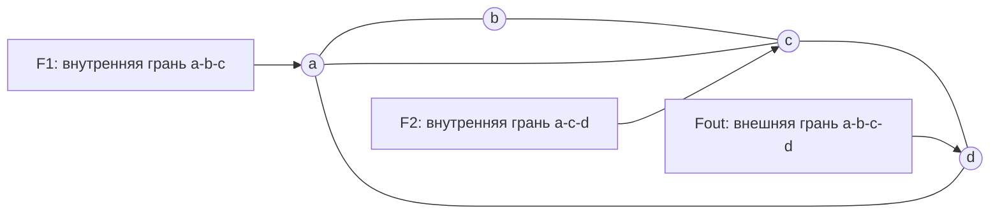
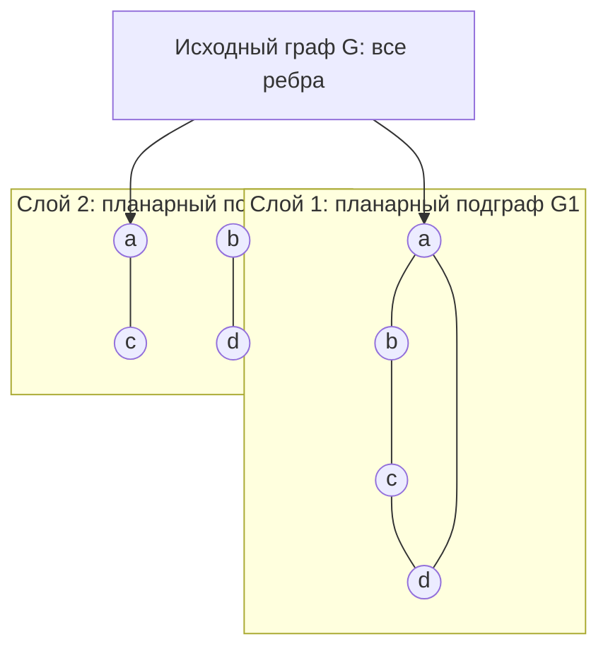
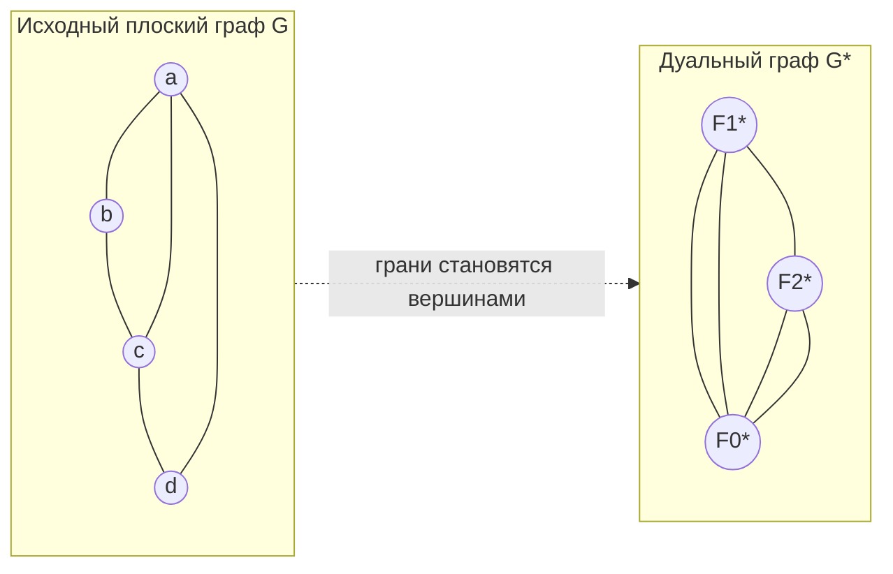
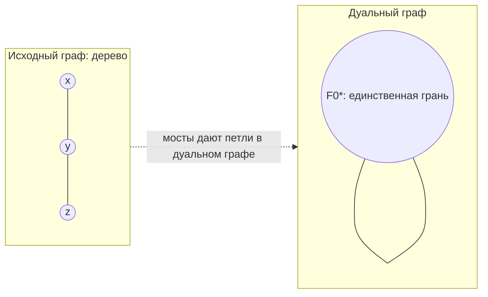
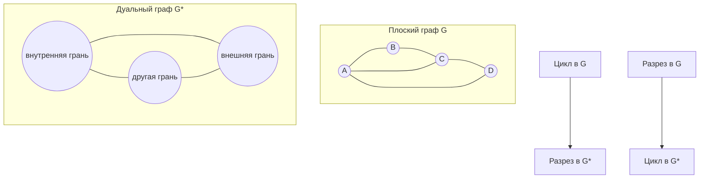

# Билет 10. Планарность графа: теорема Эйлера и оценка толщины графа, использование дуальных графов

## 1. Краткая идея

**Планарный граф** - это граф, который можно нарисовать на плоскости так, чтобы его ребра пересекались только в общих концах. Такой рисунок называется **плоской укладкой** или **плоским графом**.

Главная особенность плоского графа состоит в том, что его ребра разбивают плоскость на области - **грани**. Одна грань всегда неограниченная, она называется **внешней гранью**. Для связного плоского графа числа вершин \(n\), ребер \(m\) и граней \(f\) связаны формулой Эйлера:

\[
n - m + f = 2.
\]

Из этой формулы выводятся важные ограничения на число ребер. Они дают быстрые необходимые условия планарности: если граф слишком плотный, он не может быть планарным.

В билете также важны две связанные темы:

- **толщина графа**: сколько планарных подграфов нужно, чтобы покрыть все ребра исходного графа;
- **дуальный граф**: граф, построенный по граням плоской укладки, где грани исходного графа становятся вершинами.

## 2. Планарные и плоские графы

### 2.1. Планарность

Граф \(G\) называется **планарным**, если существует его изображение на плоскости без пересечений ребер.

Важно различать:

- **планарный граф** - абстрактный граф, для которого существует хотя бы одна плоская укладка;
- **плоский граф** - уже выбранная конкретная укладка графа на плоскости.

Один и тот же планарный граф может иметь разные плоские укладки, и у них может по-разному выглядеть система граней. При этом для связного графа число граней всегда одно и то же, потому что оно определяется формулой Эйлера:

\[
f = 2 - n + m.
\]

### 2.2. Грани

Если граф нарисован на плоскости без пересечений, его ребра делят плоскость на связные области. Эти области называются **гранями**.

Грань может быть:

- **внутренней** - ограниченной областью;
- **внешней** - неограниченной областью вокруг всего рисунка.

Длина грани - это число ребер на ее границе, причем если ребро встречается на границе грани дважды, оно считается два раза. Такое происходит, например, с мостами.

Пример плоского графа: квадрат с одной диагональю. У него \(n = 4\), \(m = 5\), \(f = 3\): две внутренние треугольные грани и одна внешняя грань.

Диаграмма показывает не строгую геометрическую укладку, а состав граней: диагональ \(ac\) делит квадрат на две внутренние треугольные грани.

## 3. Теорема Эйлера для связного плоского графа

### 3.1. Формулировка

Пусть \(G\) - связный плоский граф, у которого:

- \(n = |V|\) - число вершин;
- \(m = |E|\) - число ребер;
- \(f\) - число граней, включая внешнюю.

Тогда:

\[
n - m + f = 2.
\]

Эквивалентные формы:

\[
f = m - n + 2,
\]

\[
m = n + f - 2,
\]

\[
n = m - f + 2.
\]

### 3.2. Идея доказательства

Одна из стандартных идей доказательства - удалять ребра, лежащие на циклах.

1. Если связный плоский граф не является деревом, в нем есть цикл.
2. Удалим ребро из цикла. Граф останется связным, а две грани, разделенные этим ребром, сольются в одну.
3. Поэтому \(m\) уменьшится на 1 и \(f\) уменьшится на 1, а значение \(n - m + f\) не изменится.
4. Повторяем, пока не получим дерево.

Для дерева с \(n\) вершинами:

\[
m = n - 1,
\]

а грань только одна - внешняя:

\[
f = 1.
\]

Тогда:

\[
n - (n - 1) + 1 = 2.
\]

Так как при удалении ребер из циклов величина \(n - m + f\) не менялась, для исходного связного плоского графа тоже верно:

\[
n - m + f = 2.
\]

## 4. Обобщение формулы Эйлера для несвязного графа

Пусть плоский граф имеет \(c\) компонент связности. Тогда:

\[
n - m + f = 1 + c.
\]

Эквивалентно:

\[
f = m - n + 1 + c.
\]

Проверка на частных случаях:

- если \(c = 1\), получаем формулу связного случая:

\[
n - m + f = 2;
\]

- если граф состоит из \(n\) изолированных вершин, то \(m = 0\), \(c = n\), \(f = 1\), и

\[
n - 0 + 1 = n + 1 = 1 + c.
\]

Интуитивно каждая новая компонента, добавленная в уже нарисованный плоский граф, увеличивает число компонент связности, но не обязательно создает новую внешнюю область: все компоненты могут лежать в одной внешней грани. Поэтому справа появляется \(1 + c\), а не \(2c\).

## 5. Сумма длин граней

Для плоского графа важна формула:

\[
\sum_{F} \ell(F) = 2m,
\]

где сумма берется по всем граням, а \(\ell(F)\) - длина границы грани \(F\).

Причина простая: каждое ребро имеет две стороны. В плоской укладке каждая сторона ребра прилегает к некоторой грани. Поэтому при суммировании длин всех граней каждое ребро учитывается ровно дважды.

Если ребро является мостом, то одна и та же грань может подходить к нему с обеих сторон. Тогда это ребро дважды входит в границу одной и той же грани, и формула все равно остается верной.

### Пример

Для квадрата с диагональю:

- ребер \(m = 5\);
- грани имеют длины \(3\), \(3\), \(4\).

Тогда:

\[
3 + 3 + 4 = 10 = 2m.
\]

## 6. Следствие: оценка \(m \le 3n - 6\)

### 6.1. Формулировка

Если \(G\) - простой связный планарный граф и \(n \ge 3\), то:

\[
m \le 3n - 6.
\]

Эта оценка верна и для простого планарного графа в целом, если рассматривать каждую компоненту аккуратно, но чаще ее формулируют для связного случая.

### 6.2. Доказательство

В простом планарном графе при \(n \ge 3\) каждая грань имеет длину не меньше 3. Значит:

\[
\sum_F \ell(F) \ge 3f.
\]

Но сумма длин граней равна \(2m\), поэтому:

\[
2m \ge 3f.
\]

Отсюда:

\[
f \le \frac{2m}{3}.
\]

Подставим это в формулу Эйлера:

\[
n - m + f = 2.
\]

Так как \(f = 2 - n + m\), получаем:

\[
3f \le 2m,
\]

\[
3(2 - n + m) \le 2m,
\]

\[
6 - 3n + 3m \le 2m,
\]

\[
m \le 3n - 6.
\]

### 6.3. Как использовать оценку

Оценка дает необходимое условие планарности. Если для простого графа с \(n \ge 3\)

\[
m > 3n - 6,
\]

то граф точно не планарен.

Обратное неверно: если \(m \le 3n - 6\), граф не обязательно планарен. Например, \(K_{3,3}\) имеет \(n = 6\), \(m = 9\), и

\[
9 \le 3 \cdot 6 - 6 = 12,
\]

но \(K_{3,3}\) не планарен. Для него нужна более сильная двудольная оценка.

## 7. Следствие для двудольных графов: \(m \le 2n - 4\)

### 7.1. Формулировка

Если \(G\) - простой связный планарный двудольный граф и \(n \ge 3\), то:

\[
m \le 2n - 4.
\]

### 7.2. Почему оценка сильнее

В двудольном графе нет циклов нечетной длины, в частности нет треугольников. Поэтому в простой плоской укладке каждая грань имеет длину не меньше 4.

Тогда:

\[
\sum_F \ell(F) \ge 4f.
\]

Так как:

\[
\sum_F \ell(F) = 2m,
\]

получаем:

\[
2m \ge 4f,
\]

\[
f \le \frac{m}{2}.
\]

Из формулы Эйлера:

\[
f = 2 - n + m.
\]

Значит:

\[
4(2 - n + m) \le 2m,
\]

\[
8 - 4n + 4m \le 2m,
\]

\[
2m \le 4n - 8,
\]

\[
m \le 2n - 4.
\]

### 7.3. Применение к \(K_{3,3}\)

У полного двудольного графа \(K_{3,3}\):

\[
n = 6,\qquad m = 3 \cdot 3 = 9.
\]

Если бы он был планарным, должно было бы выполняться:

\[
m \le 2n - 4 = 2 \cdot 6 - 4 = 8.
\]

Но:

\[
9 > 8.
\]

Следовательно, \(K_{3,3}\) не планарен.

## 8. Примеры расчетов по формуле Эйлера

### 8.1. Дерево

Пусть \(T\) - дерево с \(n = 7\) вершинами.

Для дерева:

\[
m = n - 1 = 6.
\]

Поскольку дерево не содержит циклов, оно не разбивает плоскость на внутренние области, поэтому:

\[
f = 1.
\]

Проверяем:

\[
n - m + f = 7 - 6 + 1 = 2.
\]

### 8.2. Цикл \(C_5\)

У цикла \(C_5\):

\[
n = 5,\qquad m = 5.
\]

Цикл делит плоскость на две грани: внутреннюю и внешнюю, значит:

\[
f = 2.
\]

Проверка:

\[
5 - 5 + 2 = 2.
\]

Сумма длин граней:

\[
5 + 5 = 10 = 2m.
\]

### 8.3. Полный граф \(K_4\)

Граф \(K_4\) планарен. У него:

\[
n = 4,\qquad m = \binom{4}{2} = 6.
\]

По формуле Эйлера:

\[
f = 2 - n + m = 2 - 4 + 6 = 4.
\]

Каждая грань в плоской укладке \(K_4\) является треугольником, поэтому сумма длин граней:

\[
3 + 3 + 3 + 3 = 12 = 2m.
\]

Оценка \(m \le 3n - 6\) достигается с равенством:

\[
6 = 3 \cdot 4 - 6.
\]

### 8.4. Полный граф \(K_5\)

У \(K_5\):

\[
n = 5,\qquad m = \binom{5}{2} = 10.
\]

Для простого планарного графа с \(n = 5\) должно быть:

\[
m \le 3n - 6 = 3 \cdot 5 - 6 = 9.
\]

Но:

\[
10 > 9.
\]

Следовательно, \(K_5\) не планарен.

## 9. Толщина графа

### 9.1. Определение

**Толщина графа** \(\theta(G)\) - это минимальное число планарных подграфов, на которые можно разложить множество ребер графа.

Иначе говоря, нужно представить граф \(G = (V, E)\) как объединение планарных графов:

\[
G_1, G_2, \ldots, G_t,
\]

где:

- каждый \(G_i = (V, E_i)\) планарен;
- множества ребер покрывают все ребра исходного графа:

\[
E = E_1 \cup E_2 \cup \ldots \cup E_t;
\]

- обычно можно считать, что \(E_i\) попарно не пересекаются, потому что повторять ребро в разных слоях нет смысла;
- число \(t\) минимально.

Тогда:

\[
\theta(G) = t.
\]

Если граф планарен, то:

\[
\theta(G) = 1.
\]

Если граф непланарен, но его ребра можно разбить на два планарных слоя, то:

\[
\theta(G) = 2.
\]

Эта схема иллюстрирует идею толщины: ребра исходного графа распределяются по нескольким слоям, и каждый слой должен быть планарным.

### 9.2. Нижняя оценка через число ребер

Пусть \(G\) - простой граф с \(n \ge 3\) вершинами и \(m\) ребрами. В одном планарном слое может быть не больше \(3n - 6\) ребер. Если граф разложен на \(t\) планарных слоев, то:

\[
m \le t(3n - 6).
\]

Отсюда нижняя оценка:

\[
\theta(G) \ge \left\lceil \frac{m}{3n - 6} \right\rceil.
\]

Если граф двудольный, то каждый планарный двудольный слой содержит не больше \(2n - 4\) ребер. Поэтому для двудольного графа:

\[
\theta(G) \ge \left\lceil \frac{m}{2n - 4} \right\rceil.
\]

Эти оценки являются только нижними. Они показывают, что меньше некоторого числа слоев быть не может, но не гарантируют, что такого числа слоев достаточно.

### 9.3. Пример: толщина \(K_5\)

Для \(K_5\):

\[
n = 5,\qquad m = 10.
\]

Нижняя оценка:

\[
\theta(K_5) \ge \left\lceil \frac{10}{3 \cdot 5 - 6} \right\rceil
= \left\lceil \frac{10}{9} \right\rceil
= 2.
\]

При этом \(K_5\) действительно можно разложить на два планарных подграфа: например, взять в первом слое цикл \(C_5\), а во втором слое оставшиеся пять диагоналей. Оставшиеся диагонали образуют тоже цикл \(C_5\) на тех же пяти вершинах, только в другом порядке. Каждый цикл планарен.

Значит:

\[
\theta(K_5) = 2.
\]

### 9.4. Пример: нижняя оценка для \(K_7\)

У \(K_7\):

\[
n = 7,\qquad m = \binom{7}{2} = 21.
\]

В одном планарном слое на 7 вершинах может быть не больше:

\[
3n - 6 = 3 \cdot 7 - 6 = 15
\]

ребер. Поэтому:

\[
\theta(K_7) \ge \left\lceil \frac{21}{15} \right\rceil = 2.
\]

Эта оценка говорит, что одного слоя точно недостаточно. Чтобы доказать точное значение толщины, нужно еще построить разложение на соответствующее число планарных слоев или сослаться на известную теорему.

### 9.5. Идея для полных графов \(K_n\)

Для полного графа:

\[
m = \binom{n}{2} = \frac{n(n - 1)}{2}.
\]

По реберной оценке:

\[
\theta(K_n) \ge
\left\lceil
\frac{\binom{n}{2}}{3n - 6}
\right\rceil
=
\left\lceil
\frac{n(n - 1)}{6n - 12}
\right\rceil.
\]

Асимптотически это примерно:

\[
\frac{n}{6}.
\]

То есть для больших полных графов число необходимых планарных слоев растет линейно по \(n\). Содержательно это означает: полный граф очень плотный, а каждый планарный слой может содержать только порядка \(3n\) ребер, тогда как в \(K_n\) порядка \(n^2/2\) ребер.

Для некоторых малых графов:

| Граф | \(n\) | \(m\) | Нижняя оценка | Комментарий |
|---|---:|---:|---:|---|
| \(K_4\) | 4 | 6 | 1 | Планарен, \(\theta(K_4)=1\) |
| \(K_5\) | 5 | 10 | 2 | Непланарен, но раскладывается на два цикла |
| \(K_6\) | 6 | 15 | 2 | Один слой невозможен, два слоя достаточны |
| \(K_7\) | 7 | 21 | 2 | Нижняя оценка дает минимум два слоя |

Для общего \(K_n\) существуют классические точные результаты о толщине полных графов, но в базовом экзаменационном ответе обычно достаточно понимать нижнюю оценку, рост порядка \(n/6\) и идею разложения ребер на несколько планарных слоев.

### 9.6. Идея для полных двудольных графов \(K_{p,q}\)

Для полного двудольного графа \(K_{p,q}\):

\[
n = p + q,\qquad m = pq.
\]

Так как граф двудольный, для одного планарного слоя применима оценка \(2n - 4\):

\[
\theta(K_{p,q}) \ge
\left\lceil
\frac{pq}{2(p + q) - 4}
\right\rceil.
\]

Например, для \(K_{3,3}\):

\[
n = 6,\qquad m = 9,
\]

\[
\theta(K_{3,3}) \ge
\left\lceil
\frac{9}{2 \cdot 6 - 4}
\right\rceil
=
\left\lceil
\frac{9}{8}
\right\rceil
= 2.
\]

Граф \(K_{3,3}\) непланарен, значит одного слоя недостаточно. При этом его можно получить как объединение двух планарных подграфов, поэтому:

\[
\theta(K_{3,3}) = 2.
\]

Общая идея для \(K_{p,q}\) такая же: ребер \(pq\), а один планарный двудольный слой может вместить не более \(2(p+q)-4\) ребер. Поэтому при росте \(p\) и \(q\) требуется все больше слоев.

## 10. Дуальный граф

### 10.1. Определение

Пусть \(G\) - связный плоский граф, то есть фиксирована конкретная плоская укладка. **Дуальный граф** \(G^*\) строится так:

1. Каждой грани \(F\) графа \(G\) ставится в соответствие вершина \(F^*\) графа \(G^*\).
2. Для каждого ребра \(e\) графа \(G\), разделяющего две грани \(F_1\) и \(F_2\), в дуальном графе проводится ребро \(e^*\) между вершинами \(F_1^*\) и \(F_2^*\).
3. Ребро \(e^*\) обычно рисуют так, чтобы оно пересекало исходное ребро \(e\) ровно один раз и не пересекало другие ребра.

Если исходный граф имеет \(f\) граней и \(m\) ребер, то у дуального графа:

\[
|V(G^*)| = f,
\]

\[
|E(G^*)| = m.
\]

Для связного плоского графа обычно также верно, что грани дуального графа соответствуют вершинам исходного графа:

\[
|F(G^*)| = n.
\]

### 10.2. Пример дуального графа

Рассмотрим квадрат с диагональю \(ac\). У исходного графа три грани:

- \(F_1\): треугольник \(abc\);
- \(F_2\): треугольник \(acd\);
- \(F_0\): внешняя грань.

Значит, в дуальном графе будет три вершины: \(F_1^*\), \(F_2^*\), \(F_0^*\).

Почему в дуальном графе появляются кратные ребра:

- ребро \(ac\) разделяет грани \(F_1\) и \(F_2\), поэтому дает ребро \(F_1^*F_2^*\);
- ребра \(ab\) и \(bc\) разделяют \(F_1\) и внешнюю грань \(F_0\), поэтому дают два параллельных ребра между \(F_1^*\) и \(F_0^*\);
- ребра \(ad\) и \(cd\) разделяют \(F_2\) и внешнюю грань \(F_0\), поэтому дают два параллельных ребра между \(F_2^*\) и \(F_0^*\).

### 10.3. Петли и кратные ребра в дуальном графе

Даже если исходный граф простой, его дуальный граф может быть мультиграфом: в нем могут появляться петли и кратные ребра.

**Кратные ребра** появляются, когда две грани исходного графа имеют на границе несколько общих ребер. Пример выше с квадратом и диагональю как раз дает кратные ребра в дуальном графе.

**Петля** в дуальном графе появляется, если некоторое ребро исходного графа с обеих сторон граничит с одной и той же гранью. В связном графе это происходит для моста.

Пример: если исходный граф является деревом, у него только одна грань - внешняя. Каждое ребро дерева с обеих сторон прилегает к этой же внешней грани. Поэтому дуальный граф дерева имеет одну вершину и петли, соответствующие ребрам дерева.

### 10.4. Зависимость от укладки

Дуальный граф строится не просто по абстрактному планарному графу, а по его конкретной плоской укладке.

Для 3-связных планарных графов укладка на сфере по существу единственна, поэтому дуальный граф определен почти однозначно. Но в общем случае разные плоские укладки одного и того же графа могут давать разные дуальные графы.

Поэтому корректнее говорить:

\[
G^* \text{ - дуальный граф к данной плоской укладке } G.
\]

## 11. Связь циклов и разрезов в дуальных графах

Одна из главных причин полезности дуального графа: в планарных графах циклы и разрезы переходят друг в друга.

### 11.1. Цикл в исходном графе дает разрез в дуальном

Пусть в плоском графе \(G\) есть цикл \(C\). Этот цикл отделяет некоторую внутреннюю область от внешней части плоскости.

Рассмотрим множество дуальных ребер, соответствующих ребрам цикла \(C\):

\[
C^* = \{e^* : e \in C\}.
\]

В дуальном графе эти ребра отделяют вершины, соответствующие граням внутри цикла, от вершин, соответствующих граням снаружи. Поэтому цикл исходного графа соответствует разрезу в дуальном графе.

### 11.2. Разрез в исходном графе дает цикл в дуальном

Наоборот, если в исходном графе взять минимальный разрез, то соответствующие ему дуальные ребра образуют цикл в дуальном графе.

Интуитивно:

- разрез в \(G\) отделяет одну часть вершин от другой;
- в плоской картине граница между этими частями идет по некоторой замкнутой линии;
- в дуальном графе эта замкнутая линия превращается в цикл.

Эта связь особенно важна в алгоритмах: некоторые задачи о разрезах в планарном графе можно перевести в задачи о циклах в дуальном графе, и наоборот.

## 12. Применения дуальных графов

### 12.1. Раскраска карт и граней

Если плоский граф задает карту, то грани можно считать странами или областями. Дуальный граф превращает задачу раскраски граней в обычную задачу раскраски вершин:

- грани исходного графа становятся вершинами дуального;
- соседние грани дают ребра в дуальном;
- правильная раскраска граней исходного графа равносильна правильной раскраске вершин дуального графа.

Так формулируется классическая связь с задачами раскраски карт.

### 12.2. Минимальные разрезы и кратчайшие циклы

В планарных графах разрезы и циклы дуальны. Поэтому:

- минимальный разрез в исходном графе часто можно искать как кратчайший цикл в дуальном графе;
- кратчайший разделяющий цикл можно интерпретировать как разрез в дуальной структуре;
- задачи о потоках и разрезах на плоских сетях иногда упрощаются через переход к дуальному графу.

Например, в дорожной сети, нарисованной планарно, можно изучать, какие дороги нужно удалить, чтобы отделить район от остальной сети. В дуальном графе это может соответствовать поиску замкнутого контура вокруг района.

### 12.3. Проверка рассуждений о гранях

Дуальный граф удобен, когда нужно рассуждать не о вершинах и ребрах исходной сети, а об областях между ними.

Примеры:

- анализ соседства граней;
- переход от раскраски областей к раскраске вершин;
- изучение мостов: мост в исходном графе превращается в петлю в дуальном;
- изучение кратных соседств граней: несколько общих ребер между двумя гранями превращаются в кратные ребра в дуальном графе.

## 13. Типовые экзаменационные выводы

### 13.1. Как доказать непланарность через \(m \le 3n - 6\)

1. Проверить, что граф простой и \(n \ge 3\).
2. Посчитать \(n\) и \(m\).
3. Сравнить \(m\) с \(3n - 6\).
4. Если \(m > 3n - 6\), сделать вывод: граф непланарен.

Пример:

\[
K_5:\quad n = 5,\quad m = 10,\quad 3n - 6 = 9.
\]

Так как \(10 > 9\), граф \(K_5\) непланарен.

### 13.2. Как доказать непланарность двудольного графа

1. Проверить, что граф простой, двудольный и \(n \ge 3\).
2. Посчитать \(n\) и \(m\).
3. Использовать более сильную оценку:

\[
m \le 2n - 4.
\]

Пример:

\[
K_{3,3}:\quad n = 6,\quad m = 9,\quad 2n - 4 = 8.
\]

Так как \(9 > 8\), граф \(K_{3,3}\) непланарен.

### 13.3. Как оценить толщину

1. Посчитать число вершин \(n\) и ребер \(m\).
2. Для произвольного простого графа использовать:

\[
\theta(G) \ge \left\lceil \frac{m}{3n - 6} \right\rceil.
\]

3. Для двудольного графа использовать:

\[
\theta(G) \ge \left\lceil \frac{m}{2n - 4} \right\rceil.
\]

4. Помнить, что это только нижняя оценка. Для точного значения нужно либо построить разложение на такое число планарных слоев, либо доказать, что меньше невозможно более сильными методами.

### 13.4. Как построить дуальный граф

1. Зафиксировать плоскую укладку исходного графа.
2. В каждой грани поставить вершину дуального графа.
3. Для каждого исходного ребра провести дуальное ребро между вершинами граней, лежащих по разные стороны этого ребра.
4. Если по обе стороны ребра одна и та же грань, получится петля.
5. Если две грани имеют несколько общих ребер, получатся кратные ребра.

## 14. Краткая сводка формул

| Ситуация | Формула или оценка |
|---|---|
| Связный плоский граф | \(n - m + f = 2\) |
| Плоский граф с \(c\) компонентами | \(n - m + f = 1 + c\) |
| Сумма длин граней | \(\sum_F \ell(F) = 2m\) |
| Простой планарный граф, \(n \ge 3\) | \(m \le 3n - 6\) |
| Простой планарный двудольный граф, \(n \ge 3\) | \(m \le 2n - 4\) |
| Нижняя оценка толщины простого графа | \(\theta(G) \ge \left\lceil \frac{m}{3n - 6} \right\rceil\) |
| Нижняя оценка толщины двудольного графа | \(\theta(G) \ge \left\lceil \frac{m}{2n - 4} \right\rceil\) |
| Дуальный граф | вершины \(G^*\) соответствуют граням \(G\), ребра \(G^*\) соответствуют ребрам \(G\) |

## 15. Главное, что нужно сказать на экзамене

Планарность графа означает возможность нарисовать граф на плоскости без пересечений ребер. Для связного плоского графа выполняется формула Эйлера:

\[
n - m + f = 2.
\]

Для графа с \(c\) компонентами она принимает вид:

\[
n - m + f = 1 + c.
\]

Так как сумма длин всех граней равна \(2m\), а в простом планарном графе каждая грань имеет длину хотя бы 3, получается оценка:

\[
m \le 3n - 6.
\]

Если граф двудольный, треугольных граней нет, каждая грань имеет длину хотя бы 4, поэтому:

\[
m \le 2n - 4.
\]

Толщина графа \(\theta(G)\) - минимальное число планарных слоев, на которые можно разбить ребра графа. Из ограничений на число ребер в одном планарном слое получаются нижние оценки:

\[
\theta(G) \ge \left\lceil \frac{m}{3n - 6} \right\rceil
\]

и для двудольного случая:

\[
\theta(G) \ge \left\lceil \frac{m}{2n - 4} \right\rceil.
\]

Дуальный граф строится по плоской укладке: грани исходного графа становятся вершинами дуального, а каждое ребро исходного графа дает ребро между вершинами соседних граней. В дуальном графе могут возникать петли и кратные ребра. Важное свойство дуальности: циклы исходного планарного графа соответствуют разрезам дуального графа, а разрезы исходного графа соответствуют циклам дуального. Это используется в задачах о раскраске карт, разрезах, циклах, потоках и анализе областей плоской сети.
