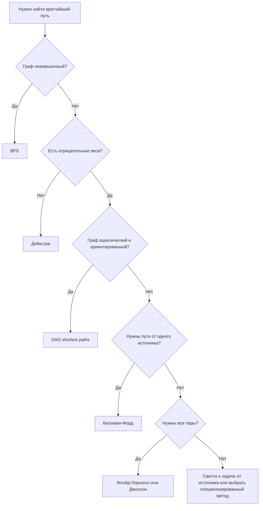
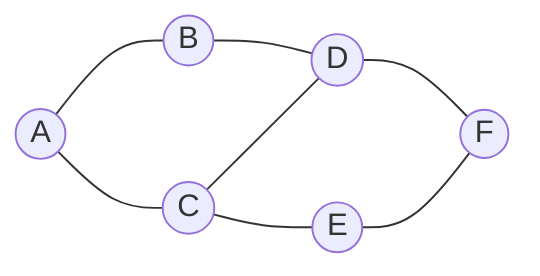
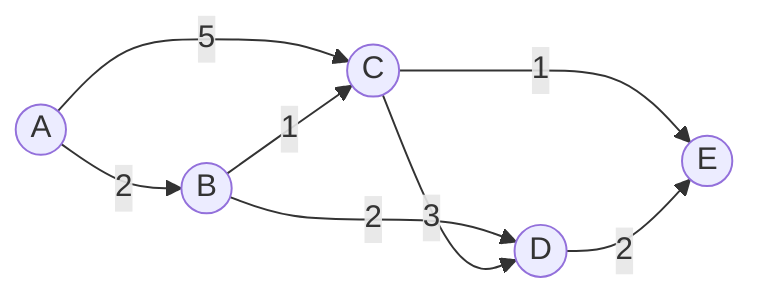

# Билет 11. Алгоритмы поиска кратчайшего пути в графе

## 1. Постановка задачи

Пусть дан граф

\[
G = (V, E),
\]

где \(V\) - множество вершин, \(E\) - множество ребер или дуг. Если граф взвешенный, каждому ребру \((u, v)\) сопоставлен вес \(w(u, v)\), например длина дороги, время, цена перехода или штраф.

**Задача поиска кратчайшего пути** состоит в том, чтобы найти путь с минимальной суммарной стоимостью между вершинами. В невзвешенном графе стоимостью пути обычно считают число ребер, то есть каждое ребро имеет вес 1. Во взвешенном графе стоимость пути равна сумме весов его ребер:

\[
\operatorname{len}(P) = \sum_{(u,v) \in P} w(u,v).
\]

Основные варианты задачи:

- **от одной вершины до одной вершины**: найти кратчайший путь из \(s\) в \(t\);
- **от одной вершины до всех остальных**: найти расстояния \(d[v]\) от источника \(s\) до всех \(v \in V\);
- **между всеми парами вершин**: найти кратчайшие расстояния для всех пар \((u, v)\).

Важно различать:

- невзвешенные и взвешенные графы;
- ориентированные и неориентированные графы;
- графы с неотрицательными весами и графы с отрицательными весами;
- графы с циклами и ациклические ориентированные графы.

Если в графе существует отрицательный цикл, достижимый из источника, то корректного конечного кратчайшего пути до некоторых вершин может не быть: можно проходить по этому циклу снова и снова и уменьшать длину пути без ограничения.

## 2. Основные алгоритмы

| Алгоритм | Для каких графов подходит | Условия на веса | Что находит | Сложность |
|---|---|---|---|---|
| **BFS** | Ориентированные и неориентированные невзвешенные графы | Все ребра имеют одинаковый вес, обычно 1 | Кратчайшие пути по числу ребер от одного источника | \(O(|V| + |E|)\) |
| **Дейкстра** | Ориентированные и неориентированные взвешенные графы | Все веса неотрицательны: \(w(e) \ge 0\) | Кратчайшие пути от одного источника | \(O((|V|+|E|)\log |V|)\) с очередью с приоритетом |
| **Беллман-Форд** | Ориентированные и неориентированные взвешенные графы | Допустимы отрицательные веса, но не должно быть достижимых отрицательных циклов | Кратчайшие пути от одного источника, обнаружение отрицательного цикла | \(O(|V||E|)\) |
| **Флойд-Уоршелл** | Ориентированные и неориентированные взвешенные графы | Допустимы отрицательные веса, но не должно быть отрицательных циклов | Кратчайшие пути между всеми парами вершин | \(O(|V|^3)\), память \(O(|V|^2)\) |
| **DAG shortest paths** | Ориентированные ациклические графы | Допустимы отрицательные веса, циклов нет | Кратчайшие пути от одного источника | \(O(|V| + |E|)\) после топологической сортировки |
| **A\*** | Обычно графы поиска состояний, карты, маршрутизация | Обычно неотрицательные веса; нужна эвристика \(h(v)\) | Кратчайший путь от \(s\) к \(t\), если эвристика допустима | Зависит от эвристики; в худшем случае близок к Дейкстре |
| **Джонсон** | Разреженные графы, задача всех пар | Допустимы отрицательные веса, но нет отрицательных циклов | Кратчайшие пути между всеми парами | \(O(|V||E|\log |V|)\) при использовании Дейкстры |

Для неориентированного графа каждое ребро \(\{u, v\}\) можно рассматривать как две дуги \((u, v)\) и \((v, u)\) с одинаковым весом. Но если в неориентированном графе есть отрицательное ребро, то оно фактически образует отрицательный цикл длины 2: \(u \to v \to u\). Поэтому в обычной постановке кратчайшие пути в неориентированном графе с отрицательными ребрами требуют осторожности: кратчайший путь может быть не определен.

## 3. Схема выбора алгоритма



Короткое правило:

- невзвешенный граф - BFS;
- взвешенный граф без отрицательных весов - Дейкстра;
- есть отрицательные веса - Беллман-Форд или алгоритм для DAG;
- нужны все пары и граф небольшой - Флойд-Уоршелл;
- нужны все пары в большом разреженном графе - Джонсон;
- есть хорошая геометрическая эвристика и нужен путь до одной цели - A\*.

## 4. Восстановление пути через предков

Почти все алгоритмы кратчайших путей можно дополнить массивом предков:

\[
parent[v] = \text{вершина, из которой мы пришли в } v \text{ по лучшему известному пути}.
\]

Инициализация:

- \(d[s] = 0\), где \(s\) - стартовая вершина;
- \(d[v] = +\infty\) для всех \(v \ne s\);
- \(parent[v] = null\) для всех вершин.

Если алгоритм улучшает расстояние до вершины \(v\) через вершину \(u\), то выполняется:

\[
d[v] = d[u] + w(u,v),
\]

\[
parent[v] = u.
\]

Чтобы восстановить путь из \(s\) в \(t\), нужно идти от \(t\) назад по `parent`:

\[
t,\ parent[t],\ parent[parent[t]],\ldots,s.
\]

Затем полученную последовательность разворачивают. Если \(parent[t] = null\) и \(t \ne s\), то путь из \(s\) в \(t\) не существует.

## 5. BFS для невзвешенных графов

### 5.1. Идея

**BFS** - поиск в ширину. Он обходит граф слоями:

- сначала стартовую вершину \(s\);
- затем все вершины на расстоянии 1 ребро от \(s\);
- затем все вершины на расстоянии 2 ребра;
- затем на расстоянии 3 ребра и так далее.

Именно поэтому BFS находит кратчайшие пути в невзвешенном графе: когда вершина впервые попадает в очередь, найден путь с минимальным числом ребер.

Алгоритм подходит:

- для неориентированных невзвешенных графов;
- для ориентированных невзвешенных графов;
- для графов, где все ребра имеют одинаковый положительный вес.

Если ребра имеют разные веса, обычный BFS использовать нельзя: путь с меньшим числом ребер может иметь большую суммарную стоимость.

### 5.2. Невзвешенный граф для примера BFS



Найдем кратчайшие пути от вершины \(A\).

Ребра:

\[
\{A,B\}, \{A,C\}, \{B,D\}, \{C,D\}, \{C,E\}, \{D,F\}, \{E,F\}.
\]

### 5.3. Псевдокод BFS

```text
BFS(G, s):
    for v in V:
        d[v] = infinity
        parent[v] = null

    d[s] = 0
    queue = empty queue
    push(queue, s)

    while queue is not empty:
        u = pop_front(queue)
        for each neighbor v of u:
            if d[v] == infinity:
                d[v] = d[u] + 1
                parent[v] = u
                push(queue, v)
```

### 5.4. Пошаговый пример BFS

Старт: \(A\).

Инициализация:

| Вершина | \(d\) | \(parent\) |
|---|---:|---|
| A | 0 | null |
| B | \(\infty\) | null |
| C | \(\infty\) | null |
| D | \(\infty\) | null |
| E | \(\infty\) | null |
| F | \(\infty\) | null |

Очередь: `[A]`.

Шаг 1. Извлекаем `A`.

- соседи: `B`, `C`;
- \(d[B] = 1\), \(parent[B] = A\);
- \(d[C] = 1\), \(parent[C] = A\).

Очередь: `[B, C]`.

Шаг 2. Извлекаем `B`.

- соседи: `A`, `D`;
- `A` уже посещена;
- \(d[D] = 2\), \(parent[D] = B\).

Очередь: `[C, D]`.

Шаг 3. Извлекаем `C`.

- соседи: `A`, `D`, `E`;
- `A` уже посещена;
- `D` уже имеет расстояние 2, улучшения нет;
- \(d[E] = 2\), \(parent[E] = C\).

Очередь: `[D, E]`.

Шаг 4. Извлекаем `D`.

- соседи: `B`, `C`, `F`;
- `B` и `C` уже посещены;
- \(d[F] = 3\), \(parent[F] = D\).

Очередь: `[E, F]`.

Шаг 5. Извлекаем `E`.

- соседи: `C`, `F`;
- обе вершины уже имеют расстояния;
- путь \(A \to C \to E \to F\) тоже имеет длину 3, но он не короче уже найденного.

Очередь: `[F]`.

Шаг 6. Извлекаем `F`. Новых вершин нет.

Итог:

| Вершина | Кратчайшее расстояние от A | Предок |
|---|---:|---|
| A | 0 | null |
| B | 1 | A |
| C | 1 | A |
| D | 2 | B |
| E | 2 | C |
| F | 3 | D |

Кратчайший путь из \(A\) в \(F\):

1. Идем назад по предкам: \(F \leftarrow D \leftarrow B \leftarrow A\).
2. Разворачиваем последовательность.
3. Получаем \(A \to B \to D \to F\).

Длина пути равна 3 ребрам. Также существует другой кратчайший путь той же длины: \(A \to C \to E \to F\). BFS обычно возвращает один из возможных кратчайших путей, зависящий от порядка просмотра соседей.

### 5.5. Корректность BFS

BFS поддерживает инвариант: очередь содержит вершины текущего и следующего слоя. Все вершины с расстоянием \(k\) обрабатываются раньше, чем вершины с расстоянием \(k+1\). Поэтому если вершина \(v\) впервые обнаружена из вершины \(u\), то путь до \(v\) имеет длину \(d[u] + 1\), и более короткого пути быть не может: все вершины предыдущих слоев уже были рассмотрены.

### 5.6. Сложность BFS

При хранении графа списками смежности:

\[
T = O(|V| + |E|),
\]

потому что каждая вершина помещается в очередь не более одного раза, а каждое ребро просматривается ограниченное число раз.

Память:

\[
O(|V|)
\]

на массивы расстояний, предков и очередь, плюс память на хранение самого графа.

## 6. Алгоритм Дейкстры для взвешенных графов с неотрицательными весами

### 6.1. Идея

Алгоритм Дейкстры решает задачу кратчайших путей от одной стартовой вершины \(s\) во взвешенном графе, если все веса ребер неотрицательны.

Главная идея:

- для каждой вершины хранится лучшее известное расстояние \(d[v]\);
- на каждом шаге выбирается еще не окончательно обработанная вершина с минимальным \(d[v]\);
- после выбора ее расстояние считается окончательным;
- затем алгоритм пытается улучшить расстояния до ее соседей.

Операция улучшения называется **релаксацией ребра**:

\[
\text{если } d[u] + w(u,v) < d[v],
\]

то

\[
d[v] = d[u] + w(u,v), \quad parent[v] = u.
\]

Алгоритм подходит:

- для ориентированных графов с неотрицательными весами;
- для неориентированных графов с неотрицательными весами;
- для поиска путей от одного источника до всех вершин;
- для поиска пути до одной цели, если остановиться после окончательной обработки целевой вершины.

Алгоритм не подходит при отрицательных весах: вершина может быть признана окончательной слишком рано, а затем найден более дешевый путь через отрицательное ребро.

### 6.2. Взвешенный граф для примера Дейкстры



Найдем кратчайшие пути от \(A\) в ориентированном взвешенном графе.

Дуги:

\[
(A,B,2), (A,C,5), (B,C,1), (B,D,2), (C,D,3), (C,E,1), (D,E,2).
\]

Все веса неотрицательны, поэтому алгоритм Дейкстры применим.

### 6.3. Псевдокод Дейкстры

```text
Dijkstra(G, s):
    for v in V:
        d[v] = infinity
        parent[v] = null

    d[s] = 0
    pq = priority queue ordered by distance
    push(pq, (0, s))

    while pq is not empty:
        (dist, u) = extract_min(pq)

        if dist != d[u]:
            continue

        for each edge (u, v) with weight w:
            if d[u] + w < d[v]:
                d[v] = d[u] + w
                parent[v] = u
                push(pq, (d[v], v))
```

Вариант с `dist != d[u]` позволяет не удалять старые записи из очереди. Если вершина попала в очередь несколько раз, актуальной считается только запись с текущим минимальным расстоянием.

### 6.4. Пошаговый пример Дейкстры

Инициализация:

| Вершина | \(d\) | \(parent\) |
|---|---:|---|
| A | 0 | null |
| B | \(\infty\) | null |
| C | \(\infty\) | null |
| D | \(\infty\) | null |
| E | \(\infty\) | null |

Очередь с приоритетом: `(0, A)`.

Шаг 1. Извлекаем `A`, потому что \(d[A] = 0\).

Релаксации:

- \(A \to B\), вес 2: \(0 + 2 < \infty\), значит \(d[B] = 2\), \(parent[B] = A\);
- \(A \to C\), вес 5: \(0 + 5 < \infty\), значит \(d[C] = 5\), \(parent[C] = A\).

Текущие расстояния:

| Вершина | A | B | C | D | E |
|---|---:|---:|---:|---:|---:|
| \(d\) | 0 | 2 | 5 | \(\infty\) | \(\infty\) |

Шаг 2. Извлекаем `B`, потому что \(d[B] = 2\).

Релаксации:

- \(B \to C\), вес 1: \(2 + 1 = 3 < 5\), значит \(d[C] = 3\), \(parent[C] = B\);
- \(B \to D\), вес 2: \(2 + 2 = 4 < \infty\), значит \(d[D] = 4\), \(parent[D] = B\).

Текущие расстояния:

| Вершина | A | B | C | D | E |
|---|---:|---:|---:|---:|---:|
| \(d\) | 0 | 2 | 3 | 4 | \(\infty\) |

Шаг 3. Извлекаем `C`, потому что \(d[C] = 3\).

Релаксации:

- \(C \to D\), вес 3: \(3 + 3 = 6\), это не меньше \(d[D] = 4\), улучшения нет;
- \(C \to E\), вес 1: \(3 + 1 = 4 < \infty\), значит \(d[E] = 4\), \(parent[E] = C\).

Текущие расстояния:

| Вершина | A | B | C | D | E |
|---|---:|---:|---:|---:|---:|
| \(d\) | 0 | 2 | 3 | 4 | 4 |

Шаг 4. Извлекаем одну из вершин с расстоянием 4, например `D`.

Релаксация:

- \(D \to E\), вес 2: \(4 + 2 = 6\), это не меньше \(d[E] = 4\), улучшения нет.

Шаг 5. Извлекаем `E`. Исходящих дуг нет.

Итог:

| Вершина | Кратчайшее расстояние от A | Предок |
|---|---:|---|
| A | 0 | null |
| B | 2 | A |
| C | 3 | B |
| D | 4 | B |
| E | 4 | C |

Кратчайший путь из \(A\) в \(E\):

1. Идем назад: \(E \leftarrow C \leftarrow B \leftarrow A\).
2. Разворачиваем.
3. Получаем \(A \to B \to C \to E\).

Длина:

\[
2 + 1 + 1 = 4.
\]

### 6.5. Почему нужны неотрицательные веса

Ключевое свойство Дейкстры: когда извлечена вершина с минимальной временной меткой \(d[u]\), это расстояние уже нельзя улучшить. Это верно только при неотрицательных весах: любой дальнейший путь через еще не обработанные вершины добавит неотрицательную стоимость и не сможет неожиданно уменьшить путь к \(u\).

Если есть отрицательное ребро, это рассуждение ломается. Например, вершина \(x\) может быть обработана с расстоянием 10, а позже найдется путь через другую вершину и отрицательное ребро со стоимостью 3. Поэтому для отрицательных весов используют Беллмана-Форда или специальные методы.

### 6.6. Сложность Дейкстры

Если выбирать минимум простым просмотром массива:

\[
O(|V|^2).
\]

Такой вариант удобен для плотных графов или учебной реализации.

Если использовать списки смежности и очередь с приоритетом:

\[
O((|V| + |E|)\log |V|).
\]

Память:

\[
O(|V| + |E|)
\]

на граф, расстояния, предков и очередь.

## 7. Алгоритм Беллмана-Форда для отрицательных весов

### 7.1. Идея

Алгоритм Беллмана-Форда решает задачу кратчайших путей от одной вершины и допускает отрицательные веса. Он основан на последовательной релаксации всех ребер.

Если кратчайший путь не содержит циклов, то в нем не более \(|V|-1\) ребер. Поэтому после \(|V|-1\) полных проходов по всем ребрам все кратчайшие расстояния должны быть найдены, если отрицательного цикла нет.

Алгоритм подходит:

- для ориентированных графов с отрицательными весами;
- для графов с неотрицательными весами, хотя Дейкстра обычно быстрее;
- для обнаружения отрицательного цикла, достижимого из источника.

В неориентированных графах отрицательное ребро обычно означает проблему, потому что его можно пройти туда и обратно, получив отрицательный цикл. Поэтому Беллман-Форд особенно естественен для ориентированных графов.

### 7.2. Псевдокод Беллмана-Форда

```text
BellmanFord(G, s):
    for v in V:
        d[v] = infinity
        parent[v] = null

    d[s] = 0

    repeat |V| - 1 times:
        changed = false
        for each edge (u, v) with weight w:
            if d[u] != infinity and d[u] + w < d[v]:
                d[v] = d[u] + w
                parent[v] = u
                changed = true
        if not changed:
            break

    for each edge (u, v) with weight w:
        if d[u] != infinity and d[u] + w < d[v]:
            report negative cycle reachable from s
```

Последний проход нужен не для поиска расстояний, а для проверки. Если после \(|V|-1\) итераций еще можно улучшить какое-то расстояние, значит существует достижимый отрицательный цикл.

### 7.3. Пошаговый пример Беллмана-Форда

Рассмотрим ориентированный граф:

\[
(S,A,4), (S,B,5), (A,B,-2), (A,C,6), (B,C,3), (C,D,2), (B,D,7).
\]

Здесь есть отрицательное ребро \(A \to B\) веса \(-2\), но отрицательных циклов нет.

Инициализация:

| Вершина | \(d\) | \(parent\) |
|---|---:|---|
| S | 0 | null |
| A | \(\infty\) | null |
| B | \(\infty\) | null |
| C | \(\infty\) | null |
| D | \(\infty\) | null |

Полный проход 1 по ребрам:

- \(S \to A\): \(d[A] = 4\), \(parent[A] = S\);
- \(S \to B\): \(d[B] = 5\), \(parent[B] = S\);
- \(A \to B\): \(4 + (-2) = 2 < 5\), значит \(d[B] = 2\), \(parent[B] = A\);
- \(A \to C\): \(4 + 6 = 10\), значит \(d[C] = 10\), \(parent[C] = A\);
- \(B \to C\): \(2 + 3 = 5 < 10\), значит \(d[C] = 5\), \(parent[C] = B\);
- \(C \to D\): \(5 + 2 = 7\), значит \(d[D] = 7\), \(parent[D] = C\);
- \(B \to D\): \(2 + 7 = 9\), это не меньше \(d[D] = 7\).

После прохода 1:

| Вершина | S | A | B | C | D |
|---|---:|---:|---:|---:|---:|
| \(d\) | 0 | 4 | 2 | 5 | 7 |

Полный проход 2:

- ни одно ребро не дает улучшения;
- можно остановиться досрочно.

Итог:

| Вершина | Кратчайшее расстояние от S | Предок |
|---|---:|---|
| S | 0 | null |
| A | 4 | S |
| B | 2 | A |
| C | 5 | B |
| D | 7 | C |

Кратчайший путь из \(S\) в \(D\):

\[
D \leftarrow C \leftarrow B \leftarrow A \leftarrow S.
\]

После разворота:

\[
S \to A \to B \to C \to D.
\]

Длина:

\[
4 + (-2) + 3 + 2 = 7.
\]

Если бы после \(|V|-1 = 4\) проходов еще нашлось ребро, которое уменьшает расстояние, Беллман-Форд сообщил бы о достижимом отрицательном цикле.

### 7.4. Сложность Беллмана-Форда

В худшем случае выполняется \(|V|-1\) проходов по всем ребрам:

\[
O(|V||E|).
\]

Память:

\[
O(|V|)
\]

на массивы расстояний и предков, если список ребер уже хранится отдельно.

## 8. Флойд-Уоршелл

Алгоритм Флойда-Уоршелла решает задачу кратчайших путей между всеми парами вершин. Он использует динамическое программирование.

Идея: постепенно разрешать использовать в качестве промежуточных вершин только первые \(k\) вершин. Пусть

\[
dist[i][j]
\]

- длина лучшего известного пути из \(i\) в \(j\). Тогда переход:

\[
dist[i][j] = \min(dist[i][j],\ dist[i][k] + dist[k][j]).
\]

Применимость:

- ориентированные и неориентированные графы;
- допускает отрицательные веса;
- не допускает отрицательные циклы;
- удобен для плотных графов и небольшого числа вершин.

Сложность:

\[
O(|V|^3)
\]

по времени и

\[
O(|V|^2)
\]

по памяти.

Восстановление пути возможно через матрицу `next[i][j]` или `parent[i][j]`, где хранится следующая вершина на кратчайшем пути из \(i\) в \(j\).

## 9. Кратчайшие пути в DAG

**DAG** - ориентированный ациклический граф. В таком графе можно найти кратчайшие пути за линейное время, даже если веса отрицательные.

Алгоритм:

1. Выполнить топологическую сортировку вершин.
2. Инициализировать \(d[s] = 0\), остальные расстояния равными \(\infty\).
3. Просматривать вершины в топологическом порядке.
4. Для каждой исходящей дуги выполнять релаксацию.

Почему это работает: в DAG все пути идут в направлении топологического порядка. Когда алгоритм обрабатывает вершину \(u\), все возможные способы прийти в \(u\) уже были рассмотрены.

Применимость:

- только ориентированные ациклические графы;
- веса могут быть положительными, нулевыми или отрицательными;
- отрицательных циклов быть не может, потому что циклов вообще нет.

Сложность:

\[
O(|V| + |E|).
\]

## 10. A\* обзорно

Алгоритм **A\*** похож на Дейкстру, но использует эвристику для более направленного поиска к цели. Для вершины \(v\) он оценивает:

\[
f(v) = g(v) + h(v),
\]

где:

- \(g(v)\) - уже известная стоимость пути от старта до \(v\);
- \(h(v)\) - эвристическая оценка расстояния от \(v\) до цели.

Если \(h(v)\) никогда не переоценивает реальное расстояние до цели, эвристика называется **допустимой**. В этом случае A\* находит оптимальный путь.

Примеры эвристик:

- евклидово расстояние на плоскости;
- манхэттенское расстояние на клеточной карте;
- географическое расстояние по прямой для дорожных графов.

A\* применяют, когда нужна не вся таблица расстояний, а путь от конкретного старта к конкретной цели. При \(h(v) = 0\) алгоритм превращается в Дейкстру.

## 11. Алгоритм Джонсона обзорно

Алгоритм Джонсона решает задачу кратчайших путей между всеми парами вершин в разреженном графе. Он полезен, когда Флойд-Уоршелл с его \(O(|V|^3)\) слишком дорог.

Идея:

1. Добавить новую вершину \(q\) и дуги нулевого веса из \(q\) во все вершины.
2. Запустить Беллмана-Форда из \(q\), чтобы найти потенциалы \(h[v]\).
3. Если найден отрицательный цикл, задача не имеет корректного решения.
4. Перевзвесить ребра так:

\[
w'(u,v) = w(u,v) + h[u] - h[v].
\]

5. После такого преобразования все новые веса \(w'(u,v)\) становятся неотрицательными.
6. Запустить Дейкстру из каждой вершины.
7. Вернуть настоящие расстояния обратным преобразованием:

\[
d(u,v) = d'(u,v) - h[u] + h[v].
\]

Алгоритм допускает отрицательные веса, но не допускает отрицательные циклы.

Сложность при использовании очереди с приоритетом:

\[
O(|V||E|\log |V|)
\]

для разреженных графов.

## 12. Сравнение применимости к типам графов

| Тип графа | Подходящий алгоритм | Комментарий |
|---|---|---|
| Невзвешенный неориентированный | BFS | Находит минимальное число ребер |
| Невзвешенный ориентированный | BFS | Учитывает направление дуг |
| Взвешенный неориентированный, веса \(\ge 0\) | Дейкстра | Неориентированное ребро рассматривается как два направления |
| Взвешенный ориентированный, веса \(\ge 0\) | Дейкстра | Классический случай |
| Ориентированный граф с отрицательными весами | Беллман-Форд | Также проверяет отрицательные циклы |
| Ориентированный ациклический граф | DAG shortest paths | Работает даже с отрицательными весами |
| Все пары, небольшой граф | Флойд-Уоршелл | Простая реализация, \(O(|V|^3)\) |
| Все пары, большой разреженный граф | Джонсон | Комбинация Беллмана-Форда и Дейкстры |
| Поиск на карте от точки к точке | A\* | Эффективен при хорошей эвристике |

## 13. Типичные ошибки

1. **Запускать Дейкстру на графе с отрицательными весами.**  
   Это может дать неверный результат, потому что свойство окончательности расстояния больше не выполняется.

2. **Использовать BFS во взвешенном графе.**  
   BFS минимизирует число ребер, а не сумму весов.

3. **Забывать про ориентацию дуг.**  
   В ориентированном графе наличие дуги \(u \to v\) не означает наличие дуги \(v \to u\).

4. **Не проверять достижимость.**  
   Если \(d[v] = \infty\), пути из источника в \(v\) нет.

5. **Не хранить предков.**  
   Без массива `parent` можно знать длину кратчайшего пути, но нельзя восстановить сам путь.

6. **Игнорировать отрицательные циклы.**  
   Если отрицательный цикл достижим из источника, понятие конечного кратчайшего пути до некоторых вершин теряет смысл.

## 14. Краткий итог

Для поиска кратчайшего пути выбор алгоритма зависит прежде всего от весов и структуры графа. В невзвешенных графах оптимален BFS: он работает за \(O(|V|+|E|)\) и находит минимальное число ребер. Во взвешенных графах с неотрицательными весами используют алгоритм Дейкстры: он постепенно фиксирует вершины с минимальным расстоянием и эффективно работает с очередью с приоритетом. Если встречаются отрицательные веса, нужен Беллман-Форд или специальный алгоритм для DAG; Беллман-Форд также умеет обнаруживать отрицательные циклы.

Для задачи всех пар применяют Флойда-Уоршелла на небольших или плотных графах и Джонсона на больших разреженных графах. Для поиска пути к одной цели в пространственных задачах часто используют A\*, который ускоряет поиск за счет эвристики.

Во всех этих алгоритмах путь восстанавливается одинаково: при каждом улучшении расстояния сохраняется предок вершины, а затем путь строится обратным проходом от целевой вершины к источнику.
