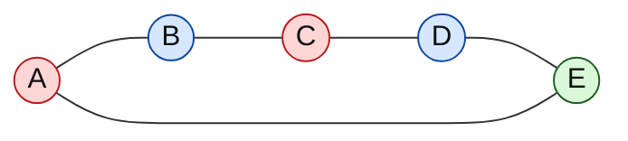
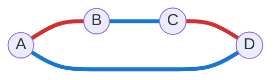
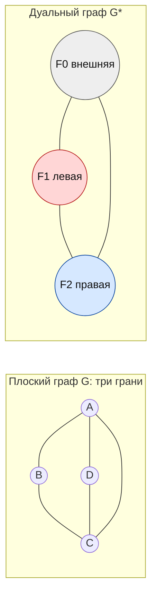
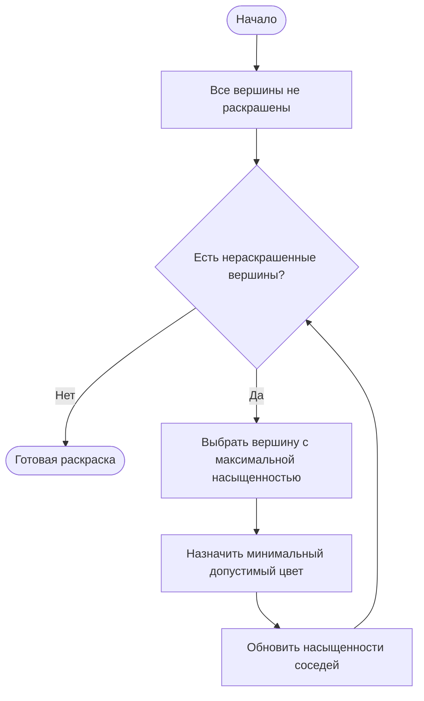

# Билет 12. Раскраска ребер, вершин и граней графов, хроматический индекс графа; базовые алгоритмы раскраски графа

## 1. Общая идея раскраски графов

**Раскраска графа** - это назначение цветов некоторым объектам графа так, чтобы соседние или конфликтующие объекты получали разные цвета.

В зависимости от того, что именно раскрашивается, различают:

- **вершинную раскраску**: цвета назначаются вершинам;
- **реберную раскраску**: цвета назначаются ребрам;
- **раскраску граней** плоского графа: цвета назначаются областям плоскости, на которые граф ее разбивает.

Во всех трех случаях основная задача похожа: найти раскраску с минимальным числом цветов. Это число становится важным инвариантом графа.

Интуитивные прикладные интерпретации:

- вершины - события, экзамены, процессы, частоты; ребро означает конфликт, значит конфликтующие объекты нельзя назначить в один цвет/слот;
- ребра - каналы связи, матчи, передачи данных; смежные ребра нельзя выполнить одновременно одним ресурсом;
- грани - регионы на карте; соседние регионы должны иметь разные цвета.

Обычно в теории раскрасок рассматривают **простые неориентированные графы**: без петель и кратных ребер. Петля сразу делает правильную вершинную раскраску невозможной, потому что вершина была бы смежна сама с собой.

## 2. Вершинная раскраска и хроматическое число

### 2.1. Определение

Пусть дан граф
\[
G = (V, E).
\]

**Правильная вершинная раскраска** графа \(G\) в \(k\) цветов - это отображение
\[
c: V \to \{1, 2, \ldots, k\},
\]
такое что для любого ребра \(uv \in E\)
\[
c(u) \ne c(v).
\]

То есть любые две смежные вершины должны иметь разные цвета.

**Хроматическое число** графа \(G\), обозначается \(\chi(G)\), - это минимальное число цветов, достаточное для правильной вершинной раскраски графа:
\[
\chi(G) = \min\{k \mid G \text{ имеет правильную вершинную раскраску в } k \text{ цветов}\}.
\]

Если \(\chi(G) \le k\), граф называют **\(k\)-раскрашиваемым**.

### 2.2. Пример вершинной раскраски

Цикл \(C_5\) нечетной длины требует 3 цвета. Попробовать раскрасить его в 2 цвета нельзя: при чередовании цветов по циклу последняя вершина окажется смежной с первой и получит тот же цвет.



Здесь:

- \(c(A)=c(C)=1\);
- \(c(B)=c(D)=2\);
- \(c(E)=3\).

Каждое ребро соединяет вершины разных цветов, поэтому раскраска правильная. Так как \(C_5\) - нечетный цикл, двух цветов недостаточно, значит \(\chi(C_5)=3\).

### 2.3. Простые значения хроматического числа

Для некоторых графов \(\chi(G)\) известно сразу:

| Граф | Хроматическое число |
|---|---:|
| Пустой граф без ребер | \(1\), если есть хотя бы одна вершина |
| Полный граф \(K_n\) | \(n\) |
| Дерево с хотя бы одним ребром | \(2\) |
| Четный цикл \(C_{2m}\) | \(2\) |
| Нечетный цикл \(C_{2m+1}\) | \(3\) |
| Двудольный непустой граф | \(2\), если есть хотя бы одно ребро |

Для полного графа \(K_n\) каждая вершина смежна с каждой, поэтому никакие две вершины не могут иметь один цвет. Значит, нужно ровно \(n\) цветов.

Для дерева достаточно 2 цветов, потому что дерево двудольно: можно раскрасить вершины по четности расстояния от выбранного корня.

### 2.4. Нижние оценки для \(\chi(G)\)

Нижняя оценка говорит, меньше какого числа цветов точно не хватит.

1. **По кликовому числу.**

   Пусть \(\omega(G)\) - размер наибольшей клики, то есть наибольшего полного подграфа. Тогда
   \[
   \chi(G) \ge \omega(G).
   \]

   Причина: в клике все вершины попарно смежны, значит все должны иметь разные цвета.

2. **По нечетному циклу.**

   Если граф содержит нечетный цикл, то
   \[
   \chi(G) \ge 3.
   \]

3. **По числу независимости.**

   Пусть \(\alpha(G)\) - размер наибольшего независимого множества вершин. Один цвет может покрыть только независимое множество, поэтому
   \[
   \chi(G) \ge \left\lceil \frac{|V|}{\alpha(G)} \right\rceil.
   \]

### 2.5. Верхние оценки для \(\chi(G)\)

Верхняя оценка дает гарантированное число цветов, которого достаточно.

1. **Тривиальная оценка.**

   \[
   \chi(G) \le |V|.
   \]

   Можно дать каждой вершине свой цвет.

2. **Оценка через максимальную степень.**

   Пусть
   \[
   \Delta(G)=\max_{v\in V}\deg(v).
   \]
   Тогда
   \[
   \chi(G) \le \Delta(G)+1.
   \]

   Доказательная идея: раскрашиваем вершины жадно в произвольном порядке. У вершины не больше \(\Delta\) уже раскрашенных соседей, значит среди \(\Delta+1\) цветов всегда найдется свободный.

3. **Для двудольных графов.**

   Если граф двудольный, то
   \[
   \chi(G) \le 2.
   \]

   Если в нем есть хотя бы одно ребро, то \(\chi(G)=2\). Если ребер нет, то достаточно одного цвета.

4. **Для планарных графов.**

   По теореме о четырех красках любой простой планарный граф можно правильно раскрасить в 4 цвета:
   \[
   \chi(G) \le 4.
   \]

   Это глубокий факт теории графов. На экзамене обычно достаточно знать формулировку: всякий планарный граф имеет правильную вершинную раскраску не более чем в четыре цвета.

## 3. Двудольные графы и 2-раскраска

Граф называется **двудольным**, если множество его вершин можно разбить на две доли
\[
V = X \cup Y,\quad X \cap Y = \varnothing,
\]
так что каждое ребро соединяет вершину из \(X\) с вершиной из \(Y\).

Эквивалентные утверждения:

- граф двудолен;
- граф имеет правильную вершинную раскраску в 2 цвета;
- граф не содержит циклов нечетной длины.

Алгоритмически двудольность проверяется обходом BFS или DFS:

1. выбираем нераскрашенную вершину и красим ее в цвет 1;
2. всех ее соседей красим в цвет 2;
3. соседей соседей - снова в цвет 1;
4. если когда-либо обнаружено ребро между вершинами одного цвета, граф не двудолен.

Такой алгоритм работает за
\[
O(|V|+|E|).
\]

## 4. Реберная раскраска и хроматический индекс

### 4.1. Определение

**Правильная реберная раскраска** графа \(G=(V,E)\) в \(k\) цветов - это отображение
\[
\varphi: E \to \{1,2,\ldots,k\},
\]
такое что любые два смежных ребра имеют разные цвета.

Два ребра называются **смежными**, если они имеют общую вершину.

**Хроматический индекс** графа \(G\), обозначается \(\chi'(G)\), - это минимальное число цветов, достаточное для правильной реберной раскраски:
\[
\chi'(G)=\min\{k \mid E(G) \text{ можно правильно раскрасить в } k \text{ цветов}\}.
\]

Реберная раскраска разбивает множество ребер на классы цвета. Каждый класс цвета является **паросочетанием**, потому что никакие два ребра одного цвета не имеют общей вершины.

### 4.2. Пример реберной раскраски

Рассмотрим цикл \(C_4\). Его ребра можно раскрасить в 2 цвета, чередуя цвета по циклу. При этом максимальная степень \(\Delta(C_4)=2\), значит меньше 2 цветов быть не может.



Получаем:
\[
\chi'(C_4)=2.
\]

Для нечетного цикла \(C_{2m+1}\) нужно 3 цвета: двумя цветами ребра не получится чередовать по кругу без конфликта на последнем ребре.

### 4.3. Нижние оценки для \(\chi'(G)\)

1. **По максимальной степени.**

   \[
   \chi'(G) \ge \Delta(G).
   \]

   Если вершина имеет степень \(\Delta\), то все \(\Delta\) инцидентных ей ребер попарно смежны и должны иметь разные цвета.

2. **По мощности ребер и размеру паросочетания.**

   Один цвет образует паросочетание. Если максимальное паросочетание имеет размер \(\nu(G)\), то
   \[
   \chi'(G) \ge \left\lceil \frac{|E|}{\nu(G)} \right\rceil.
   \]

3. **Для полного графа нечетного порядка.**

   У графа \(K_{2m+1}\) максимальная степень равна \(2m\), но \(\chi'(K_{2m+1})=2m+1\).

   Причина: в одном цвете может быть не больше \(m\) ребер, а всего ребер \(m(2m+1)\), поэтому нужно как минимум \(2m+1\) цветов.

### 4.4. Верхние оценки и теорема Визинга

Для простых графов ключевой результат - **теорема Визинга**:
\[
\Delta(G) \le \chi'(G) \le \Delta(G)+1.
\]

То есть любой простой граф относится к одному из двух классов:

- **класс 1**: \(\chi'(G)=\Delta(G)\);
- **класс 2**: \(\chi'(G)=\Delta(G)+1\).

Примеры:

- двудольные графы относятся к классу 1;
- четные циклы \(C_{2m}\) имеют \(\chi'=2=\Delta\);
- нечетные циклы \(C_{2m+1}\) имеют \(\chi'=3=\Delta+1\);
- полный граф \(K_{2m}\) имеет \(\chi'=2m-1=\Delta\);
- полный граф \(K_{2m+1}\) имеет \(\chi'=2m+1=\Delta+1\).

Для мультиграфов простая формула Визинга в таком виде уже не применяется; существуют другие оценки, например теорема Шеннона \(\chi'(G)\le \frac{3}{2}\Delta(G)\) для мультиграфов без петель.

### 4.5. Реберная раскраска двудольных графов

Для двудольного графа верна теорема Кенига о реберной раскраске:
\[
\chi'(G)=\Delta(G).
\]

Это сильнее общей верхней оценки Визинга. Смысл: если граф двудольный, то ребра всегда можно разбить на \(\Delta\) паросочетаний.

Пример: полный двудольный граф \(K_{m,n}\) имеет
\[
\Delta(K_{m,n})=\max(m,n),
\]
и
\[
\chi'(K_{m,n})=\max(m,n).
\]

## 5. Раскраска граней плоского графа и дуальный граф

### 5.1. Плоский граф и грани

**Планарный граф** - граф, который можно изобразить на плоскости без пересечений ребер, кроме общих концов.

**Плоский граф** - уже выбранное конкретное изображение планарного графа на плоскости без пересечений.

Такое изображение разбивает плоскость на области, которые называются **гранями**. Одна из граней неограниченная, ее называют **внешней гранью**.

**Правильная раскраска граней** - это назначение цветов граням так, чтобы любые две грани, имеющие общее ребро границы, получили разные цвета.

Если две грани соприкасаются только в вершине, но не имеют общего ребра, они не считаются соседними для раскраски граней.

### 5.2. Дуальный граф

Для связного плоского графа \(G\) можно построить **дуальный граф** \(G^*\):

- каждой грани графа \(G\) соответствует вершина графа \(G^*\);
- если две грани графа \(G\) имеют общее ребро, то соответствующие вершины в \(G^*\) соединяются ребром;
- ребро дуального графа пересекает соответствующее ребро исходного графа.

Тогда раскраска граней графа \(G\) превращается в обычную вершинную раскраску дуального графа \(G^*\):
\[
\text{раскраска граней }G \quad \Longleftrightarrow \quad \text{раскраска вершин }G^*.
\]

Поэтому минимальное число цветов для раскраски граней равно хроматическому числу дуального графа:
\[
\chi_{\text{faces}}(G)=\chi(G^*).
\]



В примере у плоского графа три грани: две внутренние и внешняя. В дуальном графе им соответствуют три вершины. Так как каждая грань соседствует с двумя другими, дуальный граф здесь является треугольником \(K_3\), значит для граней нужно 3 цвета.

### 5.3. Связь с теоремой о четырех красках

Классическая формулировка теоремы о четырех красках говорит, что любую карту на плоскости можно раскрасить в 4 цвета так, чтобы соседние области имели разные цвета.

В терминах графов это можно понимать так:

- карту можно представить плоским графом, где грани - области карты;
- раскраска областей карты - это раскраска граней плоского графа;
- раскраска граней плоского графа эквивалентна вершинной раскраске дуального графа;
- так как дуальный граф планарен, для него достаточно 4 цветов.

Итак, для плоского графа без патологических особенностей граневой карты:
\[
\chi_{\text{faces}}(G)\le 4.
\]

## 6. Связь реберной раскраски с линейным графом

**Линейный граф** \(L(G)\) строится по графу \(G\) так:

- вершины \(L(G)\) соответствуют ребрам \(G\);
- две вершины \(L(G)\) смежны тогда и только тогда, когда соответствующие ребра в \(G\) имеют общую вершину.

Тогда реберная раскраска \(G\) - это то же самое, что вершинная раскраска \(L(G)\):
\[
\chi'(G)=\chi(L(G)).
\]

Это полезно алгоритмически: можно свести задачу реберной раскраски к уже известным алгоритмам вершинной раскраски.

Пример: если \(G=C_4\), то \(L(G)\) тоже является циклом \(C_4\). Поэтому
\[
\chi'(C_4)=\chi(L(C_4))=\chi(C_4)=2.
\]

Но у такого подхода есть недостаток: линейный граф может быть плотным. Если в исходном графе есть вершина большой степени \(d\), то все \(d\) инцидентных ей ребер превращаются в клику размера \(d\) в \(L(G)\).

## 7. Базовые алгоритмы раскраски графа

Задача нахождения \(\chi(G)\) в общем случае вычислительно сложна: проверка, можно ли раскрасить граф в \(k\) цветов, NP-полна при \(k\ge 3\). Поэтому на практике используют как точные переборные методы, так и быстрые эвристики.

### 7.1. Жадный алгоритм

**Идея:** вершины рассматриваются в некотором порядке, каждой вершине назначается минимальный допустимый цвет, который еще не использован ее уже раскрашенными соседями.

Псевдокод:

```text
GreedyColoring(G, order):
    для каждой вершины v из order:
        forbidden = цвета уже раскрашенных соседей v
        c[v] = минимальный цвет, которого нет в forbidden
    вернуть c
```

Сложность при списках смежности обычно
\[
O(|V|+|E|)
\]
при аккуратной реализации проверки запрещенных цветов.

Плюсы:

- очень простой;
- быстрый;
- всегда строит корректную раскраску;
- гарантирует не больше \(\Delta(G)+1\) цветов.

Минусы:

- результат сильно зависит от порядка вершин;
- может использовать существенно больше цветов, чем оптимум.

Пример: для пути \(P_4\) оптимально нужно 2 цвета, но неудачный порядок в некоторых графах может заставить жадный алгоритм использовать больше цветов, чем \(\chi(G)\).

### 7.2. Welsh-Powell: упорядоченная жадная раскраска

Алгоритм **Welsh-Powell** - это жадный алгоритм с заранее выбранным хорошим порядком:

1. отсортировать вершины по невозрастанию степеней;
2. обрабатывать вершины в этом порядке;
3. каждой вершине назначать минимальный доступный цвет.

Идея: вершины большой степени создают больше ограничений, поэтому их выгодно раскрасить раньше.

Псевдокод:

```text
WelshPowell(G):
    order = вершины G, отсортированные по убыванию deg(v)
    вернуть GreedyColoring(G, order)
```

Алгоритм не гарантирует оптимальную раскраску, но часто дает хороший результат на практике.

Оценка числа цветов остается:
\[
\text{число использованных цветов} \le \Delta(G)+1.
\]

### 7.3. Backtracking: точный перебор с возвратом

**Backtracking** используется, когда нужно точно проверить, раскрашивается ли граф в \(k\) цветов, или найти \(\chi(G)\).

Идея:

1. фиксируем число цветов \(k\);
2. выбираем очередную вершину;
3. пробуем назначить ей один из допустимых цветов;
4. если возникает конфликт, откатываемся и пробуем другой цвет;
5. если все вершины раскрашены, раскраска найдена.

Псевдокод:

```text
CanColor(v_index):
    если все вершины раскрашены:
        вернуть true

    v = следующая вершина
    для color от 1 до k:
        если color допустим для v:
            c[v] = color
            если CanColor(v_index + 1):
                вернуть true
            c[v] = uncolored

    вернуть false
```

Чтобы найти \(\chi(G)\), можно запускать проверку для
\[
k=1,2,\ldots,|V|
\]
и остановиться на первом успешном \(k\).

Сложность в худшем случае экспоненциальная:
\[
O(k^{|V|})
\]
без учета отсечений. На практике backtracking улучшают:

- выбирают сначала вершины с большой степенью;
- используют текущую лучшую верхнюю оценку;
- отсекают ветви, которые уже не могут дать лучший ответ;
- применяют проверку связности, кликовые нижние оценки и другие ограничения.

### 7.4. DSATUR

**DSATUR** - эвристический и одновременно удобный для точного поиска алгоритм, основанный на степени насыщенности.

**Степень насыщенности** вершины - число различных цветов, уже встречающихся среди ее раскрашенных соседей.

На каждом шаге DSATUR выбирает нераскрашенную вершину:

1. с максимальной степенью насыщенности;
2. при равенстве - с большей обычной степенью;
3. при дальнейшем равенстве - по фиксированному правилу.

Затем вершине назначается минимальный допустимый цвет.



DSATUR часто лучше обычного greedy, потому что выбирает не просто вершины большой степени, а вершины, для которых уже возникло больше всего цветовых ограничений.

В точной версии DSATUR используют backtracking: алгоритм выбирает следующую вершину по правилу насыщенности, пробует допустимые цвета и выполняет отсечения. Это один из классических подходов к точному решению задачи раскраски для графов умеренного размера.

### 7.5. Алгоритмы реберной раскраски через линейный граф

Базовый универсальный способ:

1. построить линейный граф \(L(G)\);
2. применить к \(L(G)\) алгоритм вершинной раскраски: greedy, Welsh-Powell, DSATUR или backtracking;
3. перенести цвет каждой вершины \(L(G)\) обратно на соответствующее ребро \(G\).

Псевдокод:

```text
EdgeColoringViaLineGraph(G):
    построить L(G)
    color_vertices = VertexColoring(L(G))
    для каждого ребра e in E(G):
        edge_color[e] = color_vertices[vertex corresponding to e]
    вернуть edge_color
```

Преимущества:

- не нужно разрабатывать отдельный алгоритм для ребер;
- сразу используются известные методы вершинной раскраски.

Недостатки:

- \(L(G)\) может иметь много ребер;
- для больших графов подход может быть дорогим по памяти;
- специальные алгоритмы для двудольных графов и графов класса 1 могут быть эффективнее.

## 8. Подробные примеры

### 8.1. Полный граф \(K_4\)

Вершинная раскраска:

- в \(K_4\) каждая вершина смежна с каждой;
- значит все 4 вершины должны иметь разные цвета;
- поэтому
  \[
  \chi(K_4)=4.
  \]

Реберная раскраска:

- \(\Delta(K_4)=3\);
- \(K_4\) имеет четное число вершин;
- полный граф \(K_{2m}\) имеет хроматический индекс \(2m-1\);
- поэтому
  \[
  \chi'(K_4)=3.
  \]

### 8.2. Полный граф \(K_3\)

Для треугольника:
\[
\chi(K_3)=3.
\]

Каждая вершина смежна с двумя другими, поэтому нужны три разные краски.

Для ребер:
\[
\Delta(K_3)=2,
\]
но ребер тоже три, и любые два ребра смежны. Значит, все три ребра должны иметь разные цвета:
\[
\chi'(K_3)=3.
\]

Это пример класса 2:
\[
\chi'(K_3)=\Delta(K_3)+1.
\]

### 8.3. Дерево

Пусть \(T\) - дерево с хотя бы одним ребром.

Вершинная раскраска:

- дерево не содержит циклов, тем более не содержит нечетных циклов;
- значит дерево двудольно;
- поэтому
  \[
  \chi(T)=2.
  \]

Реберная раскраска:

- дерево является двудольным графом;
- по теореме Кенига
  \[
  \chi'(T)=\Delta(T).
  \]

Например, для звезды \(K_{1,4}\):

- центральная вершина имеет степень 4;
- все 4 ребра попарно смежны в центре;
- нужно 4 цвета;
- значит \(\chi'(K_{1,4})=4\), но \(\chi(K_{1,4})=2\).

### 8.4. Циклы

Для цикла \(C_n\):

Вершинная раскраска:
\[
\chi(C_n)=
\begin{cases}
2, & n \text{ четно},\\
3, & n \text{ нечетно}.
\end{cases}
\]

Реберная раскраска:
\[
\chi'(C_n)=
\begin{cases}
2, & n \text{ четно},\\
3, & n \text{ нечетно}.
\end{cases}
\]

Объяснение одинаково по идее: в четном цикле цвета можно чередовать, в нечетном чередование ломается при возвращении к началу.

## 9. Сравнение трех видов раскраски

| Вид раскраски | Что раскрашиваем | Что считается конфликтом | Минимальное число цветов |
|---|---|---|---|
| Вершинная | Вершины | Смежные вершины | \(\chi(G)\) |
| Реберная | Ребра | Ребра с общей вершиной | \(\chi'(G)\) |
| Граневая | Грани плоского графа | Грани с общим ребром границы | \(\chi_{\text{faces}}(G)=\chi(G^*)\) |

Связи между задачами:

- реберная раскраска \(G\) равносильна вершинной раскраске линейного графа \(L(G)\);
- граневая раскраска плоского \(G\) равносильна вершинной раскраске дуального графа \(G^*\);
- все эти задачи используют одну общую идею: объекты, находящиеся в отношении конфликта, должны иметь разные цвета.

## 10. Ключевые факты для экзамена

1. Вершинная раскраска - это назначение цветов вершинам так, чтобы концы каждого ребра имели разные цвета.

2. Хроматическое число \(\chi(G)\) - минимальное число цветов в правильной вершинной раскраске.

3. Для любого графа:
   \[
   \omega(G)\le \chi(G)\le \Delta(G)+1.
   \]

4. Граф двудолен тогда и только тогда, когда он 2-раскрашиваем, то есть не содержит нечетных циклов.

5. Для планарного графа по теореме о четырех красках:
   \[
   \chi(G)\le 4.
   \]

6. Реберная раскраска - это назначение цветов ребрам так, чтобы смежные ребра имели разные цвета.

7. Хроматический индекс \(\chi'(G)\) - минимальное число цветов в правильной реберной раскраске.

8. Всегда:
   \[
   \chi'(G)\ge \Delta(G).
   \]

9. По теореме Визинга для простого графа:
   \[
   \Delta(G)\le \chi'(G)\le \Delta(G)+1.
   \]

10. Для двудольных графов:
    \[
    \chi'(G)=\Delta(G).
    \]

11. Раскраска граней плоского графа сводится к вершинной раскраске дуального графа:
    \[
    \chi_{\text{faces}}(G)=\chi(G^*).
    \]

12. Базовые алгоритмы:
    - greedy - быстро красит вершины в заданном порядке;
    - Welsh-Powell - greedy после сортировки вершин по убыванию степеней;
    - backtracking - точный перебор с возвратом;
    - DSATUR - выбирает вершину с максимальной насыщенностью;
    - реберную раскраску можно делать через вершинную раскраску линейного графа.

## 11. Короткий план устного ответа

1. Дать определение правильной вершинной раскраски и \(\chi(G)\).
2. Привести примеры: \(K_n\), деревья, четные и нечетные циклы, двудольные графы.
3. Назвать оценки:
   \[
   \omega(G)\le \chi(G)\le \Delta(G)+1.
   \]
4. Упомянуть планарные графы и теорему о четырех красках.
5. Перейти к реберной раскраске и определить \(\chi'(G)\).
6. Объяснить нижнюю оценку \(\chi'(G)\ge\Delta(G)\).
7. Сформулировать теорему Визинга:
   \[
   \chi'(G)\in\{\Delta(G),\Delta(G)+1\}.
   \]
8. Сказать, что для двудольных графов \(\chi'(G)=\Delta(G)\).
9. Объяснить раскраску граней через дуальный граф.
10. Перечислить алгоритмы: greedy, Welsh-Powell, backtracking, DSATUR, реберная раскраска через \(L(G)\).
