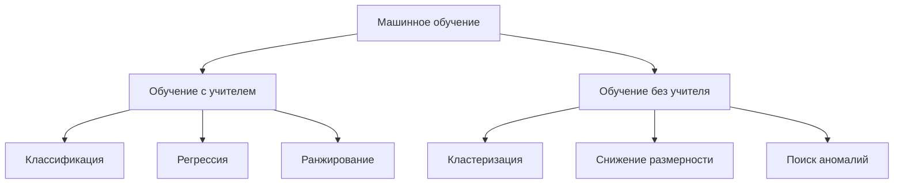
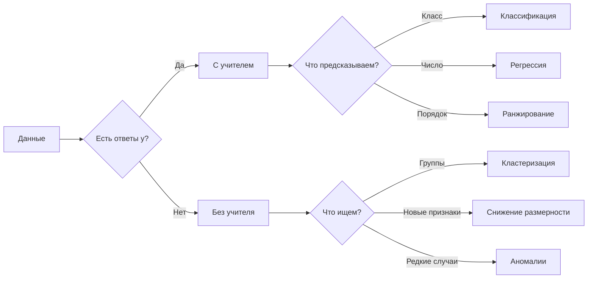

# Постановка задачи машинного обучения. Типы задач и их различия. Обучение с учителем и без учителя

## Основные понятия и определения

Машинное обучение - это область искусственного интеллекта, в которой алгоритм строит правило решения задачи по данным. В отличие от обычной программы, где разработчик вручную задает все правила, модель машинного обучения настраивает параметры на примерах и затем применяет найденную закономерность к новым объектам.

Базовая единица данных называется объектом. Объектом может быть письмо, клиент банка, фотография, медицинская запись, транзакция или строка в таблице. Каждый объект описывается признаками: числовыми, категориальными, текстовыми, графическими или другими измеримыми характеристиками. Признаковое описание объекта обычно обозначают \(x\), а множество всех возможных описаний - \(X\).

Если для объекта известен правильный ответ, его обозначают \(y\), а множество возможных ответов - \(Y\). Обучающая выборка в задаче с учителем записывается так:

\[
D = \{(x_i, y_i)\}_{i=1}^{n},
\]

где \(n\) - число размеченных примеров. Цель состоит в построении алгоритма \(a: X \to Y\), который хорошо предсказывает ответы не только на обучающих объектах, но и на новых данных. Это свойство называют обобщающей способностью.

Следует различать модель, алгоритм обучения и обученный алгоритм. Модель задает семейство возможных функций, например линейные модели, деревья решений или нейронные сети. Алгоритм обучения выбирает конкретные параметры модели по данным. Обученный алгоритм - это уже готовое правило, применяемое на практике.

Главное деление задач машинного обучения связано с наличием правильных ответов. В обучении с учителем каждому обучающему объекту соответствует метка или числовое значение. В обучении без учителя меток нет: алгоритм должен найти структуру в самих данных. Также существуют промежуточные постановки, например полуобучение и обучение с подкреплением, но базовое различие проходит именно между размеченными и неразмеченными данными.

## Теория, формулы и интуиция

Формальная постановка задачи включает пространство объектов \(X\), пространство ответов \(Y\), обучающую выборку, семейство моделей и критерий качества. В реальности существует неизвестная зависимость между объектами и ответами. Модель пытается приблизить эту зависимость по ограниченному набору примеров.

Качество модели в обучении с учителем задают через функцию потерь \(L(a(x), y)\). Она показывает, насколько предсказание отличается от правильного ответа. Идеальная цель - минимизировать ожидаемый риск:

\[
R(a) = \mathbb{E}_{(x,y)\sim P} L(a(x), y),
\]

где \(P\) - неизвестное распределение данных. Так как распределение неизвестно, на практике минимизируют эмпирический риск на обучающей выборке:

\[
\hat{R}(a) = \frac{1}{n}\sum_{i=1}^{n} L(a(x_i), y_i).
\]

Интуитивно это означает: выбирается такая модель, которая меньше ошибается на известных примерах. Но минимальная ошибка на обучении не гарантирует хорошую работу в будущем. Если модель слишком сложная, она может запомнить шум и случайные особенности выборки. Это переобучение. Если модель слишком простая и не улавливает закономерность, возникает недообучение. Поэтому важна проверка на отложенных данных и контроль сложности модели.

Часто к функции потерь добавляют регуляризацию:

\[
\frac{1}{n}\sum_{i=1}^{n} L(a(x_i), y_i) + \lambda \Omega(a),
\]

где \(\Omega(a)\) - штраф за сложность, а \(\lambda\) - параметр силы штрафа. Регуляризация помогает модели не подстраиваться чрезмерно под отдельные примеры.

В классификации ответ принадлежит конечному числу классов. Например, письмо является спамом или не спамом, пациент относится к группе риска или не относится, изображение содержит один из нескольких объектов. Если классов два, задача бинарная; если больше двух - многоклассовая. Метриками могут быть accuracy, precision, recall, F1-мера, ROC-AUC и log loss. Выбор метрики зависит от цены ошибок: в медицинской диагностике пропустить болезнь и ошибочно направить здорового человека на проверку - разные ситуации.

В регрессии ответ является числом. Примеры: цена квартиры, спрос на товар, температура, время доставки. Типичные метрики:

\[
MSE = \frac{1}{n}\sum_{i=1}^{n}(y_i-\hat{y}_i)^2,
\qquad
MAE = \frac{1}{n}\sum_{i=1}^{n}|y_i-\hat{y}_i|.
\]

MSE сильнее штрафует большие ошибки, потому что отклонение возводится в квадрат. MAE устойчивее к выбросам, так как ошибка растет линейно.

В ранжировании важно упорядочить объекты. Поисковая система должна поставить более релевантные документы выше, а рекомендательная система - расположить товары или фильмы в полезном для пользователя порядке. Здесь оценивают не только правильность ответа, но и позицию объекта в списке, используя, например, NDCG, MAP или MRR.

В обучении без учителя выборка имеет вид

\[
D = \{x_i\}_{i=1}^{n}.
\]

Правильных ответов нет, поэтому нельзя напрямую посчитать ошибку предсказания. Задача состоит в обнаружении структуры: групп похожих объектов, скрытых факторов, компактного представления или необычных наблюдений. Поэтому оценка результата часто зависит от предметного смысла и дальнейшего применения.

## Методы, алгоритмы или этапы решения

Работа над задачей начинается с постановки цели. Нужно определить, какое решение будет приниматься по результату модели, какие данные доступны, что считается ошибкой и как измеряется успех. Формулировка "улучшить продажи" слишком общая; корректнее поставить задачу как прогноз вероятности покупки, выбор набора рекомендаций или сегментацию клиентов.

Затем собирают и готовят данные. Пропуски, дубликаты, ошибки ввода и разные единицы измерения могут испортить обучение. Категориальные признаки кодируют, числовые признаки иногда масштабируют, тексты переводят в векторное представление, изображения - в массивы пикселей или признаки нейронной сети. Важное требование - не допустить утечки данных, когда в признаки попадает информация, недоступная в момент реального предсказания.

В обучении с учителем данные обычно делят на обучающую, валидационную и тестовую части. На обучающей выборке модель настраивает параметры. На валидационной выбирают гиперпараметры и сравнивают варианты. Тестовая выборка нужна для финальной оценки. Если данных мало, применяют кросс-валидацию.

К основным алгоритмам классификации и регрессии относятся линейные модели, метод ближайших соседей, деревья решений, случайный лес, градиентный бустинг, метод опорных векторов и нейронные сети. Линейная регрессия использует зависимость

\[
\hat{y} = w_0 + w_1x_1 + \dots + w_mx_m.
\]

Логистическая регрессия применяется в классификации и оценивает вероятность класса:

\[
P(y=1|x) = \frac{1}{1 + e^{-w^Tx}}.
\]

Деревья решений строят цепочки правил по признакам. Они понятны и интерпретируемы, но отдельное дерево легко переобучается. Случайный лес усредняет много деревьев и уменьшает нестабильность. Градиентный бустинг строит ансамбль последовательно: каждая новая модель исправляет ошибки предыдущих. На табличных данных это один из самых сильных подходов.

Метод ближайших соседей использует идею, что похожие объекты имеют похожие ответы. Для нового объекта ищут \(k\) ближайших обучающих примеров и агрегируют их ответы. Метод прост, но зависит от выбора метрики расстояния и масштаба признаков.

Для задач без учителя применяют другие алгоритмы. K-средних разбивает объекты на \(k\) кластеров, поочередно назначая объекты ближайшему центру и пересчитывая центры. Иерархическая кластеризация строит дерево вложенных групп. DBSCAN выделяет области высокой плотности и может находить шумовые объекты.

Снижение размерности часто выполняют методом главных компонент, PCA. Он ищет новые оси, вдоль которых разброс данных максимален, и проецирует объекты на меньшее число признаков. PCA полезен для визуализации, сжатия и удаления шума. Для нелинейной визуализации используют t-SNE и UMAP, но их двумерные картинки требуют осторожной интерпретации.

После обучения модель оценивают, интерпретируют и внедряют. На практике работа не заканчивается внедрением: распределение данных может измениться. Поведение пользователей, рыночные цены, мошеннические схемы и язык текстов со временем сдвигаются, поэтому качество модели нужно мониторить и периодически обновлять.

## Практические примеры

Фильтрация спама - пример классификации. Объектом является письмо, признаками служат слова, отправитель, ссылки, вложения и технические заголовки. Ответ имеет два класса: спам или не спам. Здесь важно учитывать разные цены ошибок: пропущенный спам неприятен, но ошибочно скрытое важное письмо может быть серьезнее.

Прогноз цены квартиры - пример регрессии. Признаками являются площадь, район, этаж, год постройки, расстояние до метро и состояние дома. Ответ - цена. Простая линейная модель дает понятную зависимость, а градиентный бустинг лучше учитывает сложные нелинейные эффекты.

Поисковая выдача - пример ранжирования. Для пары "запрос - документ" модель оценивает релевантность, но главная цель - поставить лучшие документы выше. Ошибка на первой позиции обычно важнее ошибки внизу списка.

Сегментация клиентов интернет-магазина - пример кластеризации. У клиентов есть частота покупок, средний чек, любимые категории и реакция на скидки, но заранее неизвестно, какие группы существуют. Алгоритм может выделить постоянных клиентов, редких покупателей, любителей акций и покупателей дорогих товаров. Ценность результата определяется тем, можно ли использовать эти группы в маркетинге.

Поиск подозрительных банковских операций - пример обнаружения аномалий. Большинство транзакций похожи на обычное поведение клиента, но некоторые выделяются суммой, географией, временем или устройством. Так как размеченных мошеннических случаев мало, методы без учителя помогают найти необычные операции для последующей проверки.

Итак, постановка задачи машинного обучения требует определить объекты, признаки, ответы, метрику качества, ограничения и способ применения результата. Обучение с учителем решает задачи предсказания по размеченным примерам. Обучение без учителя применяется, когда правильных ответов нет и нужно обнаружить структуру данных. От этой разницы зависят выбор алгоритмов, метрик, процедура проверки и интерпретация результата.
