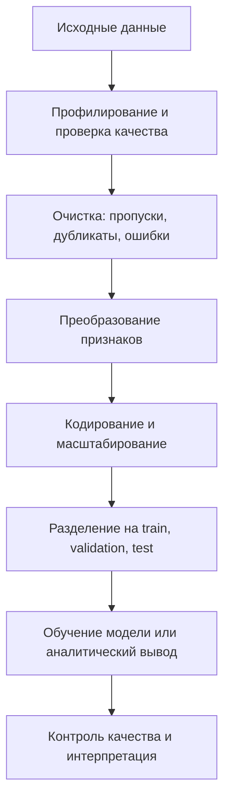

# Предварительная обработка данных. Методы обработки. Примеры

## Основные понятия и определения

Предварительная обработка данных — это совокупность действий, которые переводят исходные данные в форму, пригодную для анализа, построения моделей машинного обучения, визуализации или принятия решений. В реальных задачах данные редко бывают сразу готовы к использованию: в них встречаются пропуски, дубликаты, выбросы, разные форматы записи, ошибки ввода, несогласованные единицы измерения, несбалансированные классы и признаки с разными масштабами. Поэтому качество модели часто определяется не только выбранным алгоритмом, но и подготовкой данных.

Исходные данные — это данные в том виде, в котором они получены из базы данных, файла, API, датчиков, анкет, журналов событий или другой системы. Такие данные могут содержать как полезный сигнал, так и шум. Шумом называют случайные или систематические искажения, которые затрудняют выделение закономерностей: например, опечатки в категориях, некорректные значения возраста, резкие скачки показаний датчика.

Пропущенное значение — это отсутствие значения признака у объекта. Пропуск может возникать случайно, например из-за технического сбоя, или неслучайно, например когда клиент не указывает доход именно в определенной группе заявок. Важно понимать причину пропуска: иногда его можно восстановить, иногда нужно удалить объект, а иногда сам факт отсутствия значения является информативным признаком.

Выброс — это наблюдение, заметно отличающееся от основной массы данных. Выбросы бывают ошибочными, например цена товара `999999` из-за сбоя ввода, и реальными, например очень крупная транзакция в банковских данных. Удалять выбросы автоматически нельзя: сначала нужно понять предметную область и последствия такого решения.

Признак — измеряемое свойство объекта: возраст пользователя, сумма покупки, температура, категория товара, текст отзыва. Целевая переменная — величина, которую нужно предсказать или объяснить: класс письма, цена квартиры, вероятность отказа клиента. Матрица признаков обычно обозначается `X`, а вектор ответов — `y`.

Кодирование признаков — преобразование категориальных или текстовых значений в числовой вид. Масштабирование — изменение числовых признаков так, чтобы они были сопоставимы по диапазону или распределению. Нормализация и стандартизация являются частными способами масштабирования.

Утечка данных — ситуация, когда при подготовке данных в обучающую выборку попадает информация, которая в реальном применении модели была бы неизвестна. Например, если среднее значение для заполнения пропусков посчитать по всей таблице до разделения на обучение и тест, то тестовая часть косвенно повлияет на обучение. Это приводит к завышенной оценке качества модели.

## Теория, формулы и интуиция

Главная идея предварительной обработки состоит в том, чтобы сделать данные согласованными, численно устойчивыми и содержательно корректными. Алгоритмы анализа данных работают не с «смыслом» таблицы напрямую, а с ее числовым представлением. Если это представление искажено, модель будет находить закономерности в ошибках, технических особенностях сбора или случайном шуме.

Одно из базовых преобразований — стандартизация числового признака. Для значения `x` она задается формулой:

$$
z = \frac{x - \mu}{\sigma},
$$

где `mu` — среднее значение признака, а `sigma` — стандартное отклонение. После стандартизации признак имеет среднее около нуля и стандартное отклонение около единицы. Это важно для методов, чувствительных к масштабу: линейной и логистической регрессии с регуляризацией, метода ближайших соседей, метода опорных векторов, нейронных сетей, кластеризации на основе расстояний.

Другой распространенный способ — min-max нормализация:

$$
x' = \frac{x - x_{min}}{x_{max} - x_{min}}.
$$

Она переводит значения в диапазон от 0 до 1. Такой подход удобен, когда нужно сохранить форму распределения, но привести признаки к единому диапазону. Недостаток состоит в чувствительности к выбросам: одно экстремальное значение может сильно сжать остальные наблюдения.

Для обнаружения выбросов часто используют межквартильный размах:

$$
IQR = Q_3 - Q_1.
$$

Значения ниже `Q1 - 1.5 * IQR` или выше `Q3 + 1.5 * IQR` считают потенциальными выбросами. Этот критерий устойчивее среднего и стандартного отклонения, потому что основан на квартилях и меньше зависит от экстремальных значений.

Заполнение пропусков можно рассматривать как оценивание неизвестных значений. Самый простой вариант — заменить пропуски средним, медианой или модой. Для числовых признаков медиана часто надежнее среднего, если распределение асимметрично или содержит выбросы. Для категориальных признаков используют наиболее частую категорию или отдельную категорию «неизвестно». Более сложные методы восстанавливают пропуски по соседним объектам, регрессионным моделям или итеративным алгоритмам.

Интуитивно предварительная обработка похожа на настройку измерительного прибора перед экспериментом. Если шкалы несогласованы, часть показаний пропала, а часть записана в разных единицах, то даже хороший метод анализа даст сомнительный результат. Обработка не должна искусственно подгонять данные под желаемый ответ. Ее задача — убрать технические и методические помехи, сохранив реальную структуру явления.

Важное теоретическое требование — разделять операции, которые можно обучать на данных, и операции, которые применяются к данным. Например, параметры стандартизации, словарь категорий, медианы для заполнения пропусков и границы выбросов нужно вычислять только на обучающей выборке. Затем эти же параметры применяются к валидационной, тестовой и будущей рабочей выборке. Такой подход сохраняет честность оценки качества.

## Методы, алгоритмы и этапы решения

Первый этап — сбор и первичный осмотр данных. На этом шаге выясняют размер таблицы, типы признаков, диапазоны значений, долю пропусков, количество уникальных категорий, наличие дубликатов и очевидных ошибок. Для табличных данных полезны описательные статистики: среднее, медиана, минимум, максимум, стандартное отклонение, квантили. Для категориальных признаков смотрят частоты категорий. Для временных рядов проверяют равномерность временного шага и наличие пропущенных периодов.

Второй этап — очистка данных. Сюда относится удаление полных дубликатов, исправление некорректных форматов, приведение регистра строк, унификация названий категорий и единиц измерения. Например, значения `Moscow`, `Москва` и `moscow` могут обозначать один город, но для алгоритма это разные категории. Очистка особенно важна при объединении нескольких источников.

Третий этап — обработка пропусков. Возможны несколько стратегий. Если пропусков мало и они случайны, строки или столбцы иногда удаляют. Если признак важен, пропуски заполняют статистикой: средним, медианой, модой, константой или отдельной категорией. В задачах с временными рядами используют прямое заполнение предыдущим значением, интерполяцию или сглаживание. В машинном обучении также добавляют бинарный индикатор пропуска: он показывает, было ли исходное значение известно.

Четвертый этап — работа с выбросами. Сначала выбросы обнаруживают: с помощью диаграмм размаха, правил на основе квартилей, z-оценки, предметных ограничений или алгоритмов аномалий. Затем выбирают действие: исправить очевидную ошибку, удалить наблюдение, ограничить значение сверху или снизу, заменить на квантиль, логарифмировать признак или оставить как есть. Решение зависит от смысла признака. Например, отрицательная цена товара почти наверняка ошибка, а высокая сумма заказа может быть важным бизнес-сигналом.

Пятый этап — преобразование признаков. Числовые признаки масштабируют, логарифмируют, дискретизируют или строят на их основе новые признаки. Логарифмирование полезно для положительных величин с длинным правым хвостом: доход, цена, число просмотров. Дискретизация переводит непрерывную величину в интервалы, например возраст в группы. Генерация признаков может включать отношения величин, разности дат, агрегаты по пользователю, скользящие средние, частоты событий.

Шестой этап — кодирование категориальных признаков. При one-hot encoding для каждой категории создается отдельный бинарный столбец. Такой метод прост и хорошо работает при небольшом числе категорий. Для порядковых категорий применяют ordinal encoding, если порядок действительно имеет смысл: например `низкий`, `средний`, `высокий`. Для признаков с большим числом категорий используют частотное кодирование, target encoding или специальные методы, но target encoding требует особенно аккуратной валидации, чтобы не допустить утечки целевой переменной.

Седьмой этап — обработка текстов, изображений или временных данных, если они присутствуют. Для текста применяют токенизацию, приведение к нижнему регистру, удаление лишних символов, лемматизацию, стемминг, удаление стоп-слов, построение TF-IDF или эмбеддингов. Для изображений используют изменение размера, нормализацию пикселей, выравнивание каналов, аугментации. Для временных рядов строят лаговые признаки, сезонные признаки, скользящие средние и признаки календаря.

Восьмой этап — балансировка выборки. В классификации классы часто представлены неравномерно: например мошеннических транзакций намного меньше обычных. Если обучать модель напрямую, она может почти всегда выбирать большинство. Методы решения включают взвешивание классов, undersampling большинства, oversampling меньшинства и синтетическое порождение объектов, например SMOTE. При этом качество нужно оценивать подходящими метриками: precision, recall, F1, ROC-AUC или PR-AUC, а не только accuracy.

Девятый этап — разделение данных и построение конвейера обработки. Хорошая практика — описывать все преобразования как pipeline: сначала обучение параметров обработки на `train`, затем применение тех же шагов к `validation`, `test` и новым данным. Это делает эксперимент воспроизводимым и снижает риск случайной утечки. Для временных рядов нельзя случайно перемешивать прошлое и будущее: обучение должно происходить на более ранних периодах, а проверка — на более поздних.

## Практические примеры

Рассмотрим задачу прогнозирования цены квартиры. В исходной таблице есть площадь, число комнат, этаж, район, год постройки и цена. На первом этапе проверяют, нет ли квартир с нулевой или отрицательной площадью, слишком большим числом комнат, пропусками в районе. Дубликаты объявлений удаляют, потому что они могут завысить влияние повторяющихся объектов. Пропуски в годе постройки можно заполнить медианой по району или добавить категорию «год неизвестен», если отсутствие информации само по себе влияет на цену.

Числовые признаки цены и площади часто имеют асимметричные распределения, поэтому для них применяют логарифмирование. Район кодируют one-hot encoding, потому что это категориальный признак без естественного порядка. Этаж можно преобразовать в несколько признаков: первый этаж, последний этаж, относительный этаж в доме. После этого признаки стандартизируют, если используется линейная регрессия, метод ближайших соседей или нейронная сеть. Все параметры преобразований считают только на обучающей части данных.

Другой пример — классификация писем на спам и не спам. Исходные письма содержат HTML-разметку, разные кодировки, ссылки, повторяющиеся пробелы и служебные заголовки. Предобработка включает удаление или разбор HTML, приведение текста к единому регистру, токенизацию, нормализацию слов и построение признаков. Простая модель может использовать TF-IDF: каждому слову или n-грамме назначается вес, который растет при частом появлении в конкретном письме и уменьшается при частом появлении во всей коллекции. Если классы несбалансированы, например спама меньше, применяют веса классов или меняют порог принятия решения.

Третий пример — анализ данных интернет-магазина. В таблице заказов могут быть отрицательные количества, отмененные заказы, разные валюты, пропуски в идентификаторе клиента и товары с разными вариантами написания. Сначала приводят валюты к единой базе, отделяют отмены от успешных покупок, нормализуют названия товаров и проверяют даты. Затем строят агрегаты: число заказов на клиента, средний чек, давность последней покупки, частота покупок, доля возвратов. Эти признаки уже лучше отражают поведение клиента, чем отдельные строки заказов.

Для временного ряда продаж предобработка имеет свои особенности. Нельзя просто случайно удалить строки или перемешать данные. Нужно восстановить календарную сетку: если магазин работает ежедневно, каждый день должен присутствовать в ряду, даже если продаж не было. Пропущенные дни можно заполнить нулями или интерполировать, в зависимости от смысла отсутствия записи. Затем добавляют признаки дня недели, месяца, праздников, лаги продаж за предыдущие дни и скользящие средние. Проверка модели выполняется на будущих периодах, а не на случайной части данных.

В медицинских данных предварительная обработка требует особенно осторожной интерпретации. Например, пропуск анализа может означать не техническую ошибку, а то, что врач не назначил исследование из-за отсутствия симптомов. Удаление таких пропусков может исказить выборку. Поэтому часто добавляют индикаторы факта измерения и консультируются с предметными специалистами. Также важно сохранять воспроизводимость: фиксировать правила фильтрации, версии данных, параметры заполнения и причины исключения наблюдений.

Итог предварительной обработки — не просто «чистая таблица», а воспроизводимый процесс перехода от сырых данных к аналитическому набору признаков. Хорошая обработка делает модель устойчивее, метрики честнее, а выводы понятнее. Она не заменяет понимание предметной области, но помогает методам машинного обучения работать с реальной структурой данных, а не с ошибками их записи.
