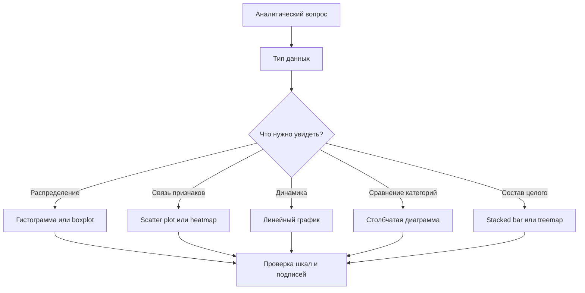

# Визуализация данных. Примеры графиков. Библиотеки в Python

## Основные понятия и определения

Визуализация данных — это представление числовой, категориальной, временной или пространственной информации в графической форме. Ее цель не просто «сделать красиво», а помочь увидеть структуру данных: распределения, зависимости, выбросы, тренды, группы, аномалии и сравнения. Хороший график сокращает время понимания данных и делает выводы проверяемыми: зритель может сопоставить подписи, шкалы, легенду и форму графика с исходным смыслом признаков.

Данные обычно состоят из наблюдений и признаков. Наблюдение — отдельная строка таблицы, например студент, сделка, измерение температуры за час. Признак — переменная, описывающая наблюдение: возраст, цена, дата, категория товара, координаты. Признаки бывают количественными, категориальными, порядковыми, временными и географическими. От типа признака зависит выбор графика: для количественного распределения подходит гистограмма, для сравнения категорий — столбчатая диаграмма, для динамики во времени — линейный график.

График строится из нескольких элементов. Оси задают шкалы и единицы измерения. Геометрические элементы отображают данные: точки, линии, столбцы, области, прямоугольники, цветовые ячейки. Визуальные каналы — это свойства, которыми кодируются значения: положение, длина, площадь, цвет, оттенок, форма, размер, прозрачность. Подписи, заголовок, легенда и сетка помогают читать изображение, но не должны перегружать его. Важный принцип: один график должен отвечать на понятный аналитический вопрос.

Различают разведочную и объясняющую визуализацию. Разведочная визуализация используется исследователем при анализе: строится много графиков, проверяются гипотезы, ищутся неожиданные зависимости. Объясняющая визуализация предназначена для передачи уже найденного вывода аудитории: она должна быть особенно аккуратной, с ясным акцентом, минимальным шумом и корректным контекстом. Например, при разведке можно построить десятки диаграмм рассеяния между признаками, а в отчете оставить одну, где явно видно влияние площади квартиры на цену.

## Теория, формулы и интуиция

Основа визуализации — отображение данных в визуальные координаты. Если есть числовой признак `x`, то график переводит его значение в положение на оси. Обычно используется линейная шкала:

```text
x_screen = a * x + b
```

Коэффициенты `a` и `b` подбираются так, чтобы минимальное и максимальное значения данных попали в границы области построения. Если данные сильно различаются по порядку величины, применяют логарифмическую шкалу:

```text
x_screen = a * log(x) + b
```

Логарифмическая шкала полезна, когда важны относительные изменения: рост с 10 до 100 воспринимается так же, как рост со 100 до 1000, потому что оба изменения равны увеличению в 10 раз. Но такую шкалу нужно явно подписывать, иначе график может ввести в заблуждение.

Для гистограммы важна группировка числовой переменной по интервалам. Пусть диапазон значений разбит на `k` корзин ширины `h`. Тогда высота столбца показывает число наблюдений в интервале или плотность. При подсчете частот:

```text
count_j = число x_i, попавших в интервал j
```

Если нужна плотность вероятности, высоты нормируют так, чтобы суммарная площадь столбцов была равна единице:

```text
density_j = count_j / (n * h)
```

Интуитивно гистограмма показывает форму распределения: симметричность, скошенность, несколько пиков, редкие экстремальные значения. Однако вид гистограммы зависит от числа корзин. Слишком мало корзин скрывает детали, слишком много создает шум.

Диаграмма рассеяния показывает связь двух числовых признаков. Каждая точка имеет координаты `(x_i, y_i)`. Если точки вытянуты вдоль возрастающей прямой, связь положительная; если вдоль убывающей — отрицательная. Формально линейная связь часто оценивается коэффициентом корреляции Пирсона:

```text
r = cov(X, Y) / (std(X) * std(Y))
```

Значение `r` близкое к 1 означает сильную положительную линейную связь, близкое к -1 — сильную отрицательную, около 0 — отсутствие именно линейной связи. Но график часто важнее одного числа: зависимость может быть нелинейной, содержать кластеры или выбросы, которые корреляция скрывает.

Временной ряд обычно отображается линией, потому что соседние точки упорядочены по времени и между ними есть естественная последовательность. Линия помогает увидеть тренд, сезонность и резкие изменения. При этом не следует соединять линией несвязанные категории: линия визуально обещает непрерывный переход, которого в данных может не быть.

Цвет в визуализации требует осторожности. Для категорий используют качественные палитры с различимыми цветами. Для числовых величин — последовательные палитры от светлого к темному или расходящиеся палитры, если есть важный ноль или среднее значение. Нельзя кодировать слишком много категорий цветом: легенда станет трудной, а график потеряет читаемость. Также важно учитывать дальтонизм и не полагаться только на различие красного и зеленого.



## Методы, алгоритмы и этапы решения

Процесс построения визуализации начинается не с выбора библиотеки, а с постановки вопроса. Например: «Какие товары дают основную выручку?», «Есть ли зависимость между опытом и зарплатой?», «Когда происходят пики нагрузки?». Без вопроса легко получить набор декоративных картинок, которые не дают вывода.

Второй этап — подготовка данных. Нужно проверить типы столбцов, пропуски, дубликаты, выбросы, единицы измерения и формат дат. Часто данные агрегируют: считают сумму продаж по месяцам, средний чек по сегментам, количество обращений по дням. Для категорий с большим числом значений выбирают топ-группы, а остальные объединяют в «прочие», иначе график становится нечитаемым.

Третий этап — выбор типа графика. Для распределения одной числовой переменной используют гистограмму, график плотности, boxplot или violin plot. Boxplot показывает медиану, квартили и выбросы. Он компактен и удобен для сравнения распределений по группам. Для связи двух числовых признаков используют диаграмму рассеяния; если точек слишком много, применяют прозрачность, hexbin-график или двумерную тепловую карту. Для матрицы корреляций подходит heatmap. Для категориальных сравнений чаще всего лучше столбчатая диаграмма, причем категории полезно сортировать по значению.

Четвертый этап — настройка визуального кодирования. Наиболее точный канал восприятия — положение на общей шкале, поэтому линейные и точечные графики обычно читаются лучше, чем круговые диаграммы. Длина воспринимается достаточно хорошо, площадь и объем — хуже. Поэтому пузырьковые диаграммы требуют осторожности: зритель может неверно оценить различия по площади. Если нужно показать доли, часто лучше использовать нормированную столбчатую диаграмму, чем круговую, особенно при большом числе категорий.

Пятый этап — оформление. У графика должны быть понятный заголовок, подписи осей с единицами измерения, читаемые деления шкал и легенда, если используется цвет или форма. Нулевую линию следует показывать там, где она важна для интерпретации. Для столбчатых диаграмм ось значений обычно должна начинаться с нуля, иначе разница высот будет визуально преувеличена. Для линейных графиков допустимо сужать диапазон оси, если это явно оправдано и не скрывает контекст.

Шестой этап — проверка вывода. Нужно спросить: «Можно ли по этому графику сделать тот вывод, ради которого он построен? Не искажает ли масштаб смысл? Не скрыты ли важные группы?». Хорошая практика — строить несколько альтернативных графиков для одной задачи и выбирать наиболее честный и простой. В аналитической работе визуализация часто идет вместе со статистическими расчетами: график показывает структуру, а числа подтверждают силу эффекта.

В Python типичный конвейер выглядит так: загрузить данные в `pandas`, очистить и агрегировать таблицу, построить график средствами `matplotlib`, `seaborn`, `plotly` или другой библиотеки, затем сохранить изображение или встроить его в отчет. Для воспроизводимости код построения графиков хранят вместе с анализом, например в Jupyter Notebook или Python-скрипте.

## Практические примеры

Базовая библиотека визуализации в Python — `matplotlib`. Она низкоуровневая, гибкая и лежит в основе многих других инструментов. С ее помощью можно управлять почти всеми элементами фигуры: осями, шрифтами, сеткой, подписями, цветами, несколькими областями построения. Пример линейного графика:

```python
import matplotlib.pyplot as plt

months = ["Jan", "Feb", "Mar", "Apr", "May"]
revenue = [120, 135, 128, 160, 190]

plt.figure(figsize=(7, 4))
plt.plot(months, revenue, marker="o")
plt.title("Выручка по месяцам")
plt.xlabel("Месяц")
plt.ylabel("Выручка, тыс. руб.")
plt.grid(True, alpha=0.3)
plt.show()
```

Такой график подходит для временной динамики: видно, что после небольшого снижения в марте показатель вырос в апреле и мае. Маркеры полезны, если точек немного; при длинном временном ряде их часто убирают.

`seaborn` — библиотека более высокого уровня, удобная для статистической визуализации. Она хорошо работает с таблицами `pandas` и позволяет быстро строить графики распределений, категориальные сравнения и связи между переменными. Например, диаграмма рассеяния с цветом по категории:

```python
import seaborn as sns
import matplotlib.pyplot as plt

tips = sns.load_dataset("tips")

sns.scatterplot(
    data=tips,
    x="total_bill",
    y="tip",
    hue="time",
    style="time"
)
plt.title("Связь суммы счета и чаевых")
plt.xlabel("Счет")
plt.ylabel("Чаевые")
plt.show()
```

Здесь каждая точка — один заказ, координаты показывают сумму счета и размер чаевых, а цвет разделяет обед и ужин. По такому графику можно увидеть общую положительную связь: большие счета часто сопровождаются большими чаевыми, но разброс остается значительным.

Для интерактивной визуализации часто применяют `plotly`. Графики Plotly можно увеличивать, наводить курсор для просмотра значений, фильтровать элементы легенды и встраивать в веб-страницы. Это удобно для дашбордов и исследовательских отчетов:

```python
import plotly.express as px

df = px.data.gapminder().query("year == 2007")

fig = px.scatter(
    df,
    x="gdpPercap",
    y="lifeExp",
    size="pop",
    color="continent",
    hover_name="country",
    log_x=True,
    title="ВВП на душу населения и продолжительность жизни"
)
fig.show()
```

В этом примере логарифмическая ось `x` нужна из-за сильного разброса ВВП между странами. Размер точки кодирует население, цвет — континент, а всплывающая подсказка показывает страну. Такой график уже передает несколько измерений данных, но важно не перегрузить его дополнительными кодировками.

`pandas` имеет встроенные методы `.plot()`, которые удобны для быстрых проверок. Например, если есть таблица продаж по датам, можно написать `df.groupby("date")["sales"].sum().plot()`. Это не всегда лучший вариант для финального отчета, но очень полезный инструмент разведочного анализа.

Для специализированных задач существуют и другие библиотеки. `bokeh` применяется для интерактивных веб-графиков, `altair` строит декларативные визуализации на основе грамматики Vega-Lite, `geopandas` и `folium` используются для карт, `missingno` помогает визуально анализировать пропуски, `yellowbrick` строит диагностические графики для моделей машинного обучения. В научных расчетах часто встречаются `matplotlib` и `seaborn`, в продуктовой аналитике и BI-отчетах — `plotly`, Dash или Streamlit.

Пример выбора графика по задаче: если нужно сравнить среднюю оценку студентов по факультетам, подойдет отсортированная столбчатая диаграмма с доверительными интервалами. Если нужно понять, различается ли распределение оценок между факультетами, лучше использовать boxplot или violin plot. Если нужно изучить связь времени подготовки и результата экзамена, разумен scatter plot с линией регрессии. Если нужно показать изменение среднего балла по годам, подойдет линейный график.

Главное качество визуализации — соответствие данным и вопросу. Сильная визуализация не маскирует неопределенность, не преувеличивает эффект и не заставляет зрителя угадывать смысл кодировок. В Python есть широкий набор библиотек: от универсального `matplotlib` до интерактивного `plotly`, но выбор инструмента вторичен. Сначала нужно понять тип данных, аналитическую цель и аудиторию, а затем выбрать самый простой график, который честно показывает нужную закономерность.
