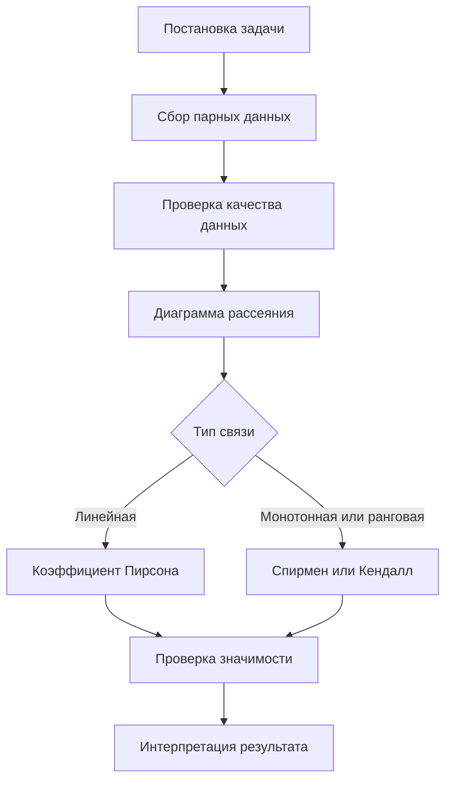

# Корреляционный анализ. Коэффициент корреляции

## Основные понятия и определения

Корреляционный анализ - это совокупность статистических методов, с помощью которых изучают наличие, направление и тесноту связи между признаками. Он применяется тогда, когда исследователю важно понять, изменяются ли две величины согласованно: например, связаны ли время подготовки и результат экзамена, цена и спрос, возраст оборудования и число отказов, доход и расходы.

Корреляционная связь отличается от функциональной. При функциональной зависимости каждому значению `x` соответствует строго определенное значение `y`. При корреляционной зависимости такой жесткости нет: одному и тому же значению `x` могут соответствовать разные значения `y`, но в среднем наблюдается некоторая тенденция. Именно поэтому корреляционный анализ работает не с отдельным наблюдением, а с совокупностью парных данных.

Главная характеристика линейной связи двух количественных признаков - коэффициент корреляции. Чаще всего под ним понимают коэффициент корреляции Пирсона. Он показывает, насколько точки на диаграмме рассеяния близки к прямой линии, а также задает направление связи. Значение коэффициента лежит в интервале от `-1` до `1`.

Если коэффициент положителен, связь называется прямой: при увеличении одного признака другой в среднем также увеличивается. Если коэффициент отрицателен, связь обратная: рост одного признака сопровождается средним уменьшением другого. Если коэффициент близок к нулю, линейная связь отсутствует или выражена слабо. Однако это не означает полного отсутствия зависимости: связь может быть нелинейной, например параболической.

Различают генеральный и выборочный коэффициенты корреляции. Генеральный коэффициент, обычно обозначаемый `rho`, относится ко всей изучаемой совокупности. Выборочный коэффициент `r` вычисляется по имеющейся выборке и является оценкой `rho`. Так как выборка случайна, значение `r` может отличаться от истинной корреляции в генеральной совокупности.

Важное ограничение: корреляция не доказывает причинность. Если два признака связаны, это еще не значит, что один является причиной другого. Возможна связь через третий фактор, влияние времени, сезонность, особенности отбора объектов или случайное совпадение. Поэтому корреляционный анализ измеряет статистическую согласованность признаков, но причинное объяснение требует дополнительной содержательной проверки.

## Теория, формулы и интуиция

Пусть есть `n` пар наблюдений:

```text
(x_1, y_1), (x_2, y_2), ..., (x_n, y_n)
```

Сначала вычисляют выборочные средние:

```text
x_bar = (1/n) * sum(x_i)
y_bar = (1/n) * sum(y_i)
```

Затем анализируют отклонения от средних: `x_i - x_bar` и `y_i - y_bar`. Если большие значения `x` часто соответствуют большим значениям `y`, произведения отклонений в основном положительны. Если большие значения `x` соответствуют малым значениям `y`, произведения отклонений в основном отрицательны. Если устойчивой согласованности нет, положительные и отрицательные произведения взаимно компенсируются.

Выборочная ковариация определяется так:

```text
s_xy = (1/(n - 1)) * sum((x_i - x_bar)(y_i - y_bar))
```

Ковариация показывает совместную изменчивость признаков, но зависит от единиц измерения. Если рост измерять не в сантиметрах, а в метрах, численное значение ковариации изменится. Поэтому ее нормируют на стандартные отклонения признаков. Так получается коэффициент корреляции Пирсона:

```text
r = sum((x_i - x_bar)(y_i - y_bar)) /
    sqrt(sum((x_i - x_bar)^2) * sum((y_i - y_bar)^2))
```

или короче:

```text
r = s_xy / (s_x * s_y)
```

где `s_x` и `s_y` - выборочные стандартные отклонения. Нормировка делает коэффициент безразмерным и ограничивает его пределами `[-1; 1]`. При `r = 1` все точки лежат на возрастающей прямой, при `r = -1` - на убывающей прямой. При `r = 0` линейная согласованность отклонений отсутствует.

Интуитивно корреляцию можно понимать как среднее согласование стандартизированных отклонений. Если оба признака одновременно выше своих средних или одновременно ниже своих средних, вклад в корреляцию положителен. Если один признак выше среднего, а другой ниже, вклад отрицателен. Чем стабильнее такие совпадения по всем наблюдениям, тем ближе коэффициент к `1` или `-1`.

Для приближенной интерпретации часто используют ориентиры: `|r| < 0,3` - слабая связь, `0,3 <= |r| < 0,7` - умеренная, `|r| >= 0,7` - сильная. Эти границы условны. В разных областях одна и та же величина корреляции может иметь разную практическую значимость.

Для проверки статистической значимости часто проверяют гипотезу `H0: rho = 0`. При нормальности данных и независимости наблюдений используют статистику:

```text
t = r * sqrt((n - 2) / (1 - r^2))
```

Она имеет распределение Стьюдента с `n - 2` степенями свободы при верной нулевой гипотезе. Если `p`-значение мало, гипотезу об отсутствии линейной корреляции отвергают. Но статистическая значимость не равна практической важности: на большой выборке даже очень слабая связь может стать формально значимой.

Коэффициент Пирсона хорошо описывает линейные связи, но чувствителен к выбросам. Если связь монотонная, но нелинейная, или данные представлены рангами, применяют ранговую корреляцию Спирмена. Она вычисляется как корреляция Пирсона между рангами значений. Для порядковых данных и небольших выборок также используют коэффициент Кендалла, основанный на сравнении согласованных и несогласованных пар.

## Методы, алгоритмы и этапы решения

Корреляционный анализ обычно выполняют по последовательному плану. Сначала формулируют задачу: какие признаки сравниваются, почему между ними ожидается связь и для чего нужен результат. Затем собирают парные наблюдения, то есть для каждого объекта должны быть известны оба признака.

Следующий этап - проверка качества данных. Нужно обнаружить пропуски, ошибки ввода, дубли, невозможные значения и выбросы. Пропуски можно удалить или заменить расчетными значениями, но выбранный способ должен быть обоснован. Выбросы также нельзя механически исключать: они могут быть ошибками измерения, но могут отражать важные реальные случаи.

После подготовки данных строят диаграмму рассеяния. Это обязательный шаг, потому что сам коэффициент не показывает форму зависимости. На графике можно увидеть линейную тенденцию, криволинейность, отдельные группы объектов, резкие выбросы или отсутствие видимой структуры.

Затем выбирают коэффициент. Для количественных данных и примерно линейной связи используют Пирсона. Для монотонной зависимости, ранговых шкал или данных с сильными выбросами выбирают Спирмена или Кендалла. После этого вычисляют коэффициент, проверяют значимость, при необходимости строят доверительный интервал и дают содержательную интерпретацию.



При ручном расчете удобно составить таблицу. В ней для каждой пары наблюдений находят отклонения `x_i - x_bar` и `y_i - y_bar`, затем считают три столбца: квадрат первого отклонения, квадрат второго отклонения и произведение отклонений. Суммы этих столбцов подставляют в формулу Пирсона. Если признаков много, рассчитывают корреляционную матрицу, где каждая ячейка содержит коэффициент корреляции между двумя переменными.

## Практические примеры

Первый пример - связь между подготовкой и результатом экзамена. Пусть по пяти студентам известны часы подготовки и баллы:

| Студент | Часы `x` | Балл `y` |
|---|---:|---:|
| 1 | 1 | 55 |
| 2 | 2 | 60 |
| 3 | 3 | 68 |
| 4 | 4 | 74 |
| 5 | 5 | 82 |

Здесь при росте числа часов балл также растет. Диаграмма рассеяния будет похожа на возрастающую прямую, а коэффициент Пирсона окажется близким к `1`. Это означает сильную положительную линейную связь в данной выборке. Корректный вывод: большее время подготовки связано с более высоким баллом. Некорректный вывод: время подготовки является единственной причиной результата. На оценку также могут влиять способности, качество подготовки, сложность билета и состояние студента.

Второй пример - цена и спрос. Если магазин анализирует цену товара и число проданных единиц, часто наблюдается отрицательная корреляция: при росте цены спрос уменьшается. Значение `r = -0,75` можно интерпретировать как сильную обратную линейную связь. Но для управленческого решения этого мало: нужно учесть сезон, рекламу, акции конкурентов, доход покупателей и наличие заменителей.

Третий пример показывает ограничение Пирсона. Пусть урожайность сначала растет при увеличении дозы удобрения, затем достигает максимума и начинает снижаться из-за избытка удобрения. Такая зависимость может быть сильной, но нелинейной. Коэффициент Пирсона при этом способен оказаться близким к нулю, потому что возрастающая и убывающая части компенсируют друг друга. Поэтому перед интерпретацией корреляции важно смотреть график.

На практике корреляционный анализ используют как предварительный этап перед регрессией, прогнозированием и построением моделей. Он помогает найти связанные признаки, выявить избыточные переменные и сформулировать гипотезы. Надежный вывод строится не только по числу `r`, а по сочетанию графика, формулы, проверки значимости и понимания предметной области.
