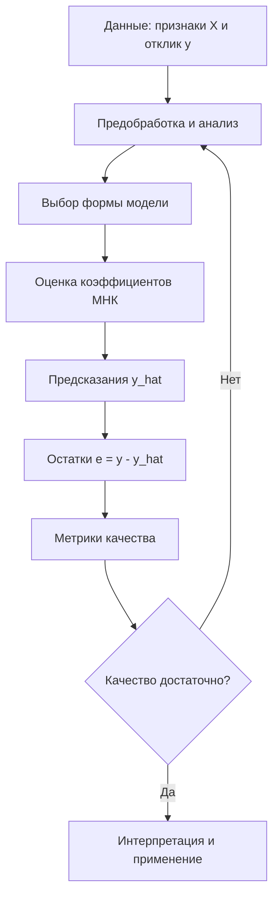

# Регрессионный анализ. Метод наименьших квадратов. Метрики качества регрессии

## Основные понятия и определения

Регрессионный анализ - это раздел статистики и машинного обучения, изучающий зависимость числовой целевой переменной от одного или нескольких факторов. В задачах регрессии требуется не отнести объект к классу, а предсказать количественное значение: цену квартиры, спрос на товар, время выполнения операции, урожайность, температуру, прибыль предприятия. Формально имеется выборка наблюдений: для каждого объекта известен вектор признаков \(x_i = (x_{i1}, x_{i2}, \ldots, x_{ip})\) и числовой отклик \(y_i\). Нужно построить функцию \(\hat y = f(x)\), которая по новым признакам дает разумное приближение истинного значения.

Целевая переменная, или зависимая переменная, обозначается \(y\). Признаки, или независимые переменные, обозначаются \(x_1, x_2, \ldots, x_p\). Слово "независимые" здесь не всегда означает статистическую независимость, а лишь указывает, что эти переменные используются как объясняющие факторы. Предсказанное моделью значение обозначается \(\hat y\). Разность между реальным и предсказанным значением называется ошибкой или остатком: \(e_i = y_i - \hat y_i\).

Самый важный частный случай - линейная регрессия. В ней предполагается, что условное среднее отклика можно описать линейной комбинацией признаков:

\[
\hat y_i = \beta_0 + \beta_1 x_{i1} + \beta_2 x_{i2} + \ldots + \beta_p x_{ip}.
\]

Коэффициент \(\beta_0\) называется свободным членом или интерсептом. Коэффициент \(\beta_j\) показывает, как в среднем меняется предсказание при увеличении признака \(x_j\) на единицу при фиксированных остальных признаках. Если модель описывает цену квартиры, коэффициент при площади может интерпретироваться как средняя прибавка к цене при увеличении площади на один квадратный метр, если район, этаж и другие признаки не меняются.

Регрессия бывает парной и множественной. В парной регрессии используется один фактор, например зависимость зарплаты от стажа. Во множественной регрессии факторов несколько: зарплата может зависеть от стажа, образования, региона, отрасли и должности. Также различают линейные и нелинейные модели. Важно, что линейная регрессия линейна по параметрам, а не обязательно по исходным признакам. Например, модель

\[
\hat y = \beta_0 + \beta_1 x + \beta_2 x^2
\]

является линейной по коэффициентам \(\beta\), хотя зависимость от \(x\) имеет параболический вид.

## Теория, формулы и интуиция

Классическая статистическая запись линейной регрессии выглядит так:

\[
y_i = \beta_0 + \beta_1 x_{i1} + \ldots + \beta_p x_{ip} + \varepsilon_i,
\]

где \(\varepsilon_i\) - случайная ошибка, отражающая влияние неучтенных факторов, шум измерений и естественную изменчивость процесса. В матричной форме для всех наблюдений:

\[
y = X\beta + \varepsilon.
\]

Здесь \(y\) - вектор ответов размера \(n\), \(X\) - матрица признаков размера \(n \times (p+1)\), первый столбец которой обычно состоит из единиц для учета свободного члена, \(\beta\) - вектор коэффициентов, \(\varepsilon\) - вектор ошибок.

Метод наименьших квадратов (МНК) выбирает коэффициенты так, чтобы сумма квадратов остатков была минимальной:

\[
RSS(\beta) = \sum_{i=1}^{n} (y_i - \hat y_i)^2
= \sum_{i=1}^{n} (y_i - x_i^T\beta)^2.
\]

В матричной форме целевая функция записывается компактно:

\[
RSS(\beta) = \|y - X\beta\|^2 = (y - X\beta)^T(y - X\beta).
\]

Если матрица \(X^T X\) обратима, решение МНК имеет аналитический вид:

\[
\hat\beta = (X^T X)^{-1}X^T y.
\]

Интуитивно МНК подбирает такую гиперплоскость в пространстве признаков, которая проходит "как можно ближе" к точкам выборки. Квадрат ошибки используется по нескольким причинам. Во-первых, положительные и отрицательные ошибки не компенсируют друг друга. Во-вторых, большие промахи штрафуются сильнее малых, что полезно, если крупные ошибки действительно нежелательны. В-третьих, квадратичная функция удобна математически: она дифференцируема и приводит к явному решению при стандартных условиях.

Для парной линейной регрессии можно представить задачу геометрически: на плоскости есть облако точек, и нужно провести прямую, минимизирующую сумму квадратов вертикальных расстояний от точек до прямой. Эти вертикальные расстояния и есть остатки. МНК не минимизирует расстояния до прямой по перпендикуляру; он минимизирует именно ошибки по оси отклика \(y\), потому что задача состоит в предсказании \(y\) по \(x\).

У классической линейной регрессии есть предпосылки, важные для статистической интерпретации коэффициентов и доверительных интервалов. Обычно предполагают линейность связи по параметрам, отсутствие точной мультиколлинеарности, нулевое условное математическое ожидание ошибки \(E(\varepsilon|X)=0\), постоянную дисперсию ошибок (гомоскедастичность), независимость наблюдений и, для точных маловыборочных выводов, нормальность ошибок. Для построения предсказательной модели часть предпосылок может быть смягчена, но их нарушение влияет на надежность выводов. Например, сильная мультиколлинеарность делает коэффициенты нестабильными: качество предсказаний может оставаться приемлемым, но интерпретировать отдельные коэффициенты становится трудно.

Схематично процесс регрессионного анализа можно представить так:

## Методы, алгоритмы и этапы решения

Типовой алгоритм применения регрессионного анализа начинается с постановки задачи. Нужно определить, какая переменная является откликом, какие факторы доступны до момента предсказания и как будет измеряться качество. Например, если прогнозируется стоимость объекта недвижимости, нельзя использовать признак "финальная сумма сделки", если он становится известен только после продажи.

Затем выполняют первичный анализ данных. Проверяют пропуски, выбросы, шкалы признаков, распределение целевой переменной, связи между признаками и откликом. Для линейной регрессии особенно полезны диаграммы рассеяния, корреляционная матрица и анализ выбросов. Категориальные признаки обычно кодируют численно, например one-hot-кодированием. Числовые признаки при обычном МНК не обязаны масштабироваться для корректности формул, но масштабирование полезно при регуляризации, градиентных методах и сравнении влияния признаков.

Далее данные часто делят на обучающую и тестовую выборки. На обучающей выборке оцениваются коэффициенты, на тестовой проверяется способность модели работать на новых данных. Если данных мало или требуется более надежная оценка качества, используют кросс-валидацию: выборку несколько раз делят на обучающие и проверочные части, после чего усредняют метрики.

После подготовки строится матрица признаков \(X\), добавляется столбец единиц для свободного члена, и коэффициенты оцениваются методом наименьших квадратов. На практике аналитическая формула через явное обращение матрицы не всегда является лучшим вычислительным способом, потому что обращение матрицы может быть численно неустойчивым. В программных библиотеках часто используют QR-разложение, сингулярное разложение или специализированные численные методы. Если признаков очень много, а данных тоже много, могут применяться итерационные методы оптимизации, например градиентный спуск.

После обучения анализируют остатки. Если остатки имеют выраженную структуру, например растут вместе с предсказанием или зависят от времени, модель не уловила важную закономерность. При гетероскедастичности стандартные ошибки коэффициентов могут быть некорректными; при автокорреляции в временных рядах нарушается независимость ошибок; при нелинейной зависимости нужна другая форма признаков или модель.

Для борьбы с переобучением и нестабильностью часто используют регуляризованные варианты линейной регрессии. Ridge-регрессия добавляет штраф за сумму квадратов коэффициентов:

\[
\sum_{i=1}^{n}(y_i - x_i^T\beta)^2 + \lambda \sum_{j=1}^{p}\beta_j^2.
\]

Она уменьшает разброс оценок и особенно полезна при мультиколлинеарности. Lasso-регрессия добавляет штраф за сумму модулей коэффициентов:

\[
\sum_{i=1}^{n}(y_i - x_i^T\beta)^2 + \lambda \sum_{j=1}^{p}|\beta_j|.
\]

Lasso может занулять часть коэффициентов и тем самым выполнять отбор признаков. Параметр \(\lambda\) обычно выбирают по кросс-валидации.

Качество регрессии оценивают с помощью нескольких метрик, потому что каждая показывает свой аспект ошибки. Средняя абсолютная ошибка:

\[
MAE = \frac{1}{n}\sum_{i=1}^{n}|y_i - \hat y_i|.
\]

MAE измеряется в тех же единицах, что и целевая переменная, и хорошо интерпретируется: если MAE цены равна 50000 рублей, то средний модуль ошибки составляет 50000 рублей. Она менее чувствительна к выбросам, чем квадратичные метрики.

Среднеквадратичная ошибка:

\[
MSE = \frac{1}{n}\sum_{i=1}^{n}(y_i - \hat y_i)^2.
\]

MSE сильнее штрафует крупные ошибки, но измеряется в квадратных единицах, что неудобно для объяснения. Поэтому часто используют корень из MSE:

\[
RMSE = \sqrt{\frac{1}{n}\sum_{i=1}^{n}(y_i - \hat y_i)^2}.
\]

RMSE находится в исходных единицах отклика и особенно полезна, когда большие промахи нужно считать существенно хуже нескольких малых ошибок.

Коэффициент детерминации показывает, какую долю разброса целевой переменной модель объясняет по сравнению с простым прогнозом средним значением:

\[
R^2 = 1 - \frac{\sum_{i=1}^{n}(y_i - \hat y_i)^2}{\sum_{i=1}^{n}(y_i - \bar y)^2}.
\]

Если \(R^2 = 0.8\), это означает, что модель объясняет около 80% вариации отклика относительно среднего. Значение \(R^2\) может быть отрицательным на тестовой выборке, если модель хуже, чем прогноз константой \(\bar y\). Для сравнения моделей с разным числом признаков используют скорректированный коэффициент детерминации:

\[
R^2_{adj} = 1 - (1 - R^2)\frac{n-1}{n-p-1}.
\]

Он штрафует добавление лишних признаков и поэтому лучше подходит для интерпретации в классической статистической регрессии.

Иногда используют MAPE:

\[
MAPE = \frac{100\%}{n}\sum_{i=1}^{n}\left|\frac{y_i - \hat y_i}{y_i}\right|.
\]

Эта метрика выражает ошибку в процентах, но плохо работает, если истинные значения близки к нулю или равны нулю. Поэтому выбор метрики должен соответствовать предметной области. Для прогноза выручки процентная ошибка может быть удобна, а для температуры или остатков на складе она может вести себя неадекватно.

## Практические примеры

Рассмотрим задачу прогнозирования цены квартиры. Пусть признаки: площадь, расстояние до метро, этаж, возраст дома и район. Линейная модель может иметь вид:

\[
\widehat{price} = \beta_0 + \beta_1 area + \beta_2 metro + \beta_3 floor + \beta_4 age + \beta_5 district.
\]

Если после обучения коэффициент при площади равен 180000, то при прочих равных дополнительный квадратный метр увеличивает прогноз цены примерно на 180000 рублей. Если коэффициент при расстоянии до метро отрицателен, это означает снижение цены при удалении от метро. Однако такая интерпретация корректна только при разумном наборе признаков и отсутствии сильной зависимости между ними. Например, площадь, число комнат и тип квартиры могут быть тесно связаны, из-за чего отдельные коэффициенты становятся менее устойчивыми.

Другой пример - прогнозирование продаж магазина. В качестве факторов можно использовать цену, день недели, наличие акции, расходы на рекламу, сезон, остаток товара и данные о прошлых продажах. Если модель строится для планирования закупок, важно оценивать не только среднюю ошибку, но и цену ошибки. Недопрогноз может привести к дефициту товара, а перепрогноз - к излишкам на складе. Поэтому иногда выбирают не симметричную MSE, а бизнес-метрику или взвешенную ошибку, где разные направления ошибки имеют разную стоимость.

В учебном числовом примере пусть фактические значения спроса равны \(y = [100, 120, 130]\), а прогнозы модели \(\hat y = [90, 125, 135]\). Остатки равны \([10, -5, -5]\). Тогда

\[
MAE = \frac{|10| + |-5| + |-5|}{3} \approx 6.67,
\]

\[
MSE = \frac{10^2 + (-5)^2 + (-5)^2}{3} = 50,
\]

\[
RMSE = \sqrt{50} \approx 7.07.
\]

Эти значения показывают, что средняя ошибка прогноза составляет примерно 6-7 единиц спроса. Если в другом варианте модели MAE чуть ниже, но RMSE заметно выше, это значит, что вторая модель иногда допускает крупные ошибки. Выбор между ними зависит от того, насколько опасны редкие большие промахи.

На практике регрессионный анализ полезен не только как инструмент прогноза, но и как инструмент объяснения. В экономике с его помощью оценивают влияние цены на спрос, рекламы на продажи, образования на доход. В инженерии строят зависимости ресурса детали от нагрузок и температуры. В медицине анализируют связь показателей пациента с количественным исходом, например уровнем давления или временем восстановления. При этом всегда нужно помнить: регрессия обнаруживает статистическую связь, но сама по себе не доказывает причинность. Для причинных выводов требуются дизайн исследования, контроль смешивающих факторов, эксперименты или специальные квазиэкспериментальные методы.

Итак, регрессионный анализ решает задачу предсказания и объяснения числовой переменной по набору факторов. Метод наименьших квадратов является базовым способом оценки параметров линейной модели: он минимизирует сумму квадратов остатков и при стандартных условиях имеет явное матричное решение. Качество модели оценивают через MAE, MSE, RMSE, \(R^2\), скорректированный \(R^2\), MAPE и другие метрики, выбирая их с учетом смысла ошибки в конкретной прикладной задаче.
