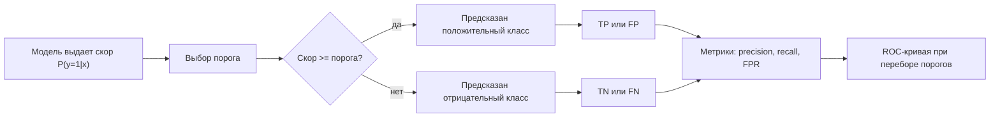

# Постановка задачи классификации. Примеры. Метрики качества классификации. ROC-кривая

## Основные понятия и определения

Классификация в машинном обучении — это задача обучения с учителем, в которой по описанию объекта требуется предсказать дискретную метку класса. Объект обычно задается вектором признаков \(x = (x_1, x_2, \ldots, x_d)\), а правильный ответ — меткой \(y\) из конечного множества классов \(Y\). Обучающая выборка имеет вид \(\{(x_i, y_i)\}_{i=1}^{n}\), где для каждого объекта известен правильный класс. Цель состоит в том, чтобы построить алгоритм \(a(x)\), который хорошо предсказывает класс новых, ранее не виденных объектов.

Если классов два, говорят о бинарной классификации. Обычно один класс называют положительным, например «болен», «спам», «мошенническая операция», а другой — отрицательным. Если классов больше двух, задача называется многоклассовой: например, распознавание цифр от 0 до 9, определение темы текста или классификация изображения как «кошка», «собака», «автомобиль». Есть также многометочная классификация, когда объект может относиться сразу к нескольким классам, например текст может одновременно иметь темы «экономика» и «политика».

Важное отличие классификации от регрессии состоит в типе целевой переменной. В регрессии предсказывается число, например цена квартиры или температура, а в классификации — категория. При этом многие классификаторы внутри себя могут оценивать не только сам класс, но и вероятность или скор принадлежности к классу. Например, модель может выдать \(P(y=1|x)=0.83\), а затем по выбранному порогу решить, относить объект к положительному классу или нет.

Качество классификации нельзя оценивать только по факту совпадения ответов, если классы несбалансированы или ошибки имеют разную цену. Например, в медицинской диагностике пропустить болезнь обычно хуже, чем направить здорового пациента на дополнительное обследование. Поэтому используются разные метрики качества: accuracy, precision, recall, F1-мера, ROC-кривая, AUC и другие.

## Теория, формулы и интуиция

Для бинарной классификации удобно описывать результаты модели через матрицу ошибок. Она сравнивает истинный класс и предсказание алгоритма. Возможны четыре исхода:

- \(TP\), true positive: объект положительный и модель предсказала положительный класс;
- \(TN\), true negative: объект отрицательный и модель предсказала отрицательный класс;
- \(FP\), false positive: объект отрицательный, но модель ошибочно предсказала положительный класс;
- \(FN\), false negative: объект положительный, но модель ошибочно предсказала отрицательный класс.

На основе этих величин строятся основные метрики. Доля правильных ответов, или accuracy, равна

\[
Accuracy = \frac{TP + TN}{TP + TN + FP + FN}.
\]

Эта метрика понятна, но может быть обманчивой при дисбалансе классов. Если в выборке 99% писем не являются спамом, классификатор, всегда отвечающий «не спам», получит accuracy 99%, хотя он совершенно бесполезен для поиска спама.

Точность положительных предсказаний, или precision, показывает, какая доля объектов, предсказанных как положительные, действительно положительна:

\[
Precision = \frac{TP}{TP + FP}.
\]

Эта метрика важна, когда ложные срабатывания дороги. Например, если система блокирует банковскую карту при подозрении на мошенничество, высокий precision означает, что блокировки чаще обоснованы.

Полнота, или recall, показывает, какую долю настоящих положительных объектов модель нашла:

\[
Recall = \frac{TP}{TP + FN}.
\]

Recall важен, когда опасно пропускать положительные случаи. В диагностике тяжелой болезни высокий recall означает, что модель находит большую часть больных пациентов.

Precision и recall часто конфликтуют. Если понизить порог классификации и чаще относить объекты к положительному классу, recall обычно растет, потому что модель пропускает меньше положительных объектов. Но precision может падать, потому что вместе с ними растет число ложных срабатываний. Для компромиссной оценки используют F1-меру:

\[
F_1 = 2 \cdot \frac{Precision \cdot Recall}{Precision + Recall}.
\]

Это гармоническое среднее precision и recall. Оно мало, если хотя бы одна из двух метрик мала, поэтому F1 полезна, когда важны обе стороны качества.

Для многоклассовой классификации метрики часто обобщают через усреднение. При macro-averaging метрика считается отдельно для каждого класса, а затем усредняется с одинаковым весом для всех классов. Это хорошо показывает качество на редких классах. При micro-averaging сначала суммируются \(TP\), \(FP\), \(FN\) по всем классам, а затем считается метрика; такой подход сильнее учитывает частые классы. Weighted-averaging усредняет метрики по классам с весами, пропорциональными числу объектов каждого класса.

ROC-кривая используется для анализа бинарного классификатора, который выдает скор или вероятность положительного класса. Для разных порогов решения вычисляются две величины: true positive rate и false positive rate.

\[
TPR = Recall = \frac{TP}{TP + FN},
\]

\[
FPR = \frac{FP}{FP + TN}.
\]

ROC-кривая строится в координатах \((FPR, TPR)\). Каждая точка соответствует некоторому порогу. Если порог очень высокий, модель почти никого не относит к положительному классу: и \(TPR\), и \(FPR\) малы. Если порог очень низкий, почти все объекты становятся положительными: \(TPR\) стремится к 1, но \(FPR\) тоже растет. Хорошая модель поднимает ROC-кривую ближе к левому верхнему углу: высокий \(TPR\) при низком \(FPR\).

Площадь под ROC-кривой называется AUC ROC. Значение AUC равно 1 для идеального ранжирования и примерно 0.5 для случайного классификатора. Интуитивно AUC можно понимать как вероятность того, что случайно выбранный положительный объект получит скор выше, чем случайно выбранный отрицательный объект. Поэтому AUC оценивает качество ранжирования, а не качество при одном конкретном пороге.

Важно понимать, что ROC-кривая не выбирает порог автоматически. Она показывает, как меняется поведение модели при разных порогах. Финальный порог выбирают с учетом прикладной цены ошибок. В одних задачах лучше терпеть больше ложных срабатываний ради высокого recall, в других — наоборот.

## Методы, алгоритмы и этапы решения

Решение задачи классификации начинается с формализации классов и сбора размеченных данных. Нужно определить, что именно считается объектом, какие классы допустимы и как присваивается правильная метка. Например, в задаче антиспама объектом является письмо, признаки могут включать слова, адрес отправителя, наличие ссылок и вложений, а метка показывает, является ли письмо спамом.

Следующий этап — подготовка признаков. Числовые признаки часто масштабируют, категориальные кодируют, тексты превращают в векторы с помощью мешка слов, TF-IDF или эмбеддингов, изображения подают в сверточные нейронные сети либо описывают заранее извлеченными признаками. Качество признаков существенно влияет на результат: даже сильный алгоритм плохо работает, если данные не отражают различия между классами.

После этого выборку делят на обучающую, валидационную и тестовую части. На обучающей части модель настраивает параметры, на валидационной подбираются гиперпараметры и порог классификации, на тестовой оценивается итоговое качество. Такое разделение нужно, чтобы не переоценить качество модели из-за подгонки под уже известные данные.

Для классификации применяются разные алгоритмы. Логистическая регрессия строит линейную границу решения и оценивает вероятность положительного класса через сигмоиду. Она интерпретируема, быстро обучается и часто служит сильной базовой моделью. Метод \(k\) ближайших соседей относит объект к классу, наиболее часто встречающемуся среди ближайших объектов обучающей выборки. Деревья решений последовательно разбивают пространство признаков по условиям вида \(x_j < t\); они понятны, но склонны к переобучению. Случайный лес и градиентный бустинг строят ансамбли деревьев и обычно дают высокое качество на табличных данных. Метод опорных векторов ищет разделяющую поверхность с максимальным зазором между классами. Нейронные сети особенно эффективны для изображений, речи, текстов и других сложных структурированных сигналов.

Отдельный этап — выбор функции потерь. Для бинарной классификации часто используется логистическая потеря, или binary cross-entropy:

\[
L = - \frac{1}{n}\sum_{i=1}^{n} \left(y_i \log p_i + (1-y_i)\log(1-p_i)\right),
\]

где \(p_i\) — предсказанная вероятность положительного класса. Для многоклассовой классификации применяют categorical cross-entropy с softmax-выходом. Функция потерь оптимизируется при обучении, а метрики качества используются для оценки результата с точки зрения задачи.

После обучения важно проанализировать матрицу ошибок и метрики. Если классы сбалансированы и ошибки примерно одинаково важны, accuracy может быть достаточной. Если положительный класс редкий, полезнее смотреть precision, recall, F1, PR-кривую и ROC AUC. Если модель используется для ранжирования заявок, AUC может быть особенно информативной. Если модель принимает автоматические решения, необходимо выбрать рабочий порог и проверить качество именно при нем.

На практике также используют кросс-валидацию, регуляризацию, балансировку классов и настройку порога. Дисбаланс можно частично учитывать через веса классов, oversampling редкого класса, undersampling частого класса или специальные методы вроде SMOTE. Однако балансировку нужно делать только на обучающей части, иначе возникает утечка информации из теста.

## Практические примеры

Первый пример — медицинский скрининг. Пусть модель должна определить, есть ли у пациента заболевание. Положительный класс — «болен». Если модель ошибочно относит больного пациента к здоровым, возникает \(FN\), и болезнь может остаться без лечения. Поэтому в такой задаче часто стремятся к высокому recall. Это может привести к увеличению \(FP\): часть здоровых пациентов получит подозрение на болезнь и пройдет дополнительные обследования. Такой компромисс может быть приемлемым, если цена пропуска болезни выше цены лишней проверки.

Второй пример — фильтрация спама. Положительный класс — «спам». Если обычное письмо попало в спам, это \(FP\), и пользователь может пропустить важное сообщение. Если спам прошел во входящие, это \(FN\). В корпоративной почте может быть важно снижать \(FP\), чтобы не блокировать рабочие письма, то есть повышать precision. В личной почте пользователь может предпочесть более агрессивную фильтрацию, если спам сильно мешает.

Третий пример — кредитный скоринг. Банк оценивает вероятность дефолта заемщика. Модель может выдавать скор риска, а решение принимается по порогу: если риск выше порога, заявка отклоняется или отправляется на ручную проверку. ROC-кривая помогает понять, насколько хорошо модель отделяет надежных клиентов от рискованных при разных порогах. Но сам порог должен выбираться с учетом прибыли, потерь, требований регуляторов и бизнес-стратегии.

Четвертый пример — распознавание рукописных цифр. Это многоклассовая классификация: каждый объект относится к одному из десяти классов. Здесь можно считать accuracy, но полезно также смотреть confusion matrix: например, модель может часто путать 4 и 9 или 3 и 8. Такая диагностика показывает, какие классы требуют дополнительных данных, улучшения признаков или изменения архитектуры.

Пятый пример — модерация комментариев. Комментарий может быть «нормальным», «оскорбительным», «спамом», «угрозой» или одновременно иметь несколько нежелательных признаков. Если система автоматически скрывает сообщения, ложные срабатывания могут ухудшить пользовательский опыт. Если система ничего не скрывает, вредный контент останется видимым. Поэтому часто используют не один порог, а несколько режимов: уверенно вредный контент удаляется автоматически, сомнительный отправляется модератору, безопасный пропускается.

Таким образом, задача классификации состоит не только в построении модели, которая предсказывает метки классов. Важны корректная постановка классов, качественная разметка, выбор признаков, адекватная схема проверки, подбор метрик и интерпретация ошибок. ROC-кривая и AUC полезны для оценки способности модели ранжировать объекты по вероятности положительного класса, а precision, recall и F1 помогают понять практические последствия выбранного порога. Хороший ответ на задачу классификации всегда связывает математические метрики с реальной ценой ошибок в конкретной предметной области.
