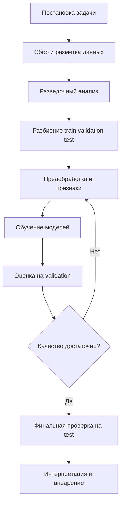

# Обучающая и валидационная выборки. Этапы решения задачи классификации

## Основные понятия и определения

В задаче классификации требуется по описанию объекта предсказать его класс: например, определить, является ли письмо спамом, болен ли пациент, относится ли изображение к классу "кошка" или "собака". Формально объект описывается вектором признаков \(x = (x_1, x_2, \ldots, x_d)\), а правильный ответ задается меткой класса \(y\). В бинарной классификации \(y\) принимает одно из двух значений, например \(0\) и \(1\). В многоклассовой классификации классов больше двух, например цифры от 0 до 9.

Данные в машинном обучении обычно представлены выборкой:

\[
D = \{(x_i, y_i)\}_{i=1}^{n},
\]

где \(x_i\) - признаки \(i\)-го объекта, \(y_i\) - его истинная метка, \(n\) - число объектов. Главная цель обучения состоит не в том, чтобы идеально запомнить ответы на уже известных объектах, а в том, чтобы построить алгоритм \(a(x)\), который хорошо работает на новых данных из той же прикладной области.

Обучающая выборка, или train set, - это часть данных, на которой модель подбиравает свои параметры. Например, в логистической регрессии на обучающей выборке подбираются веса признаков, в дереве решений выбираются условия разбиения, в нейронной сети настраиваются веса связей. Именно обучающая выборка "видна" алгоритму во время обучения.

Валидационная выборка, или validation set, - это отдельная часть данных, которую используют для промежуточной оценки качества модели и выбора настроек. На ней обычно подбирают гиперпараметры: глубину дерева, коэффициент регуляризации, число соседей в kNN, порог классификации, архитектуру модели, способ обработки признаков. Валидационная выборка не должна участвовать в прямом обучении параметров модели, иначе оценка качества станет слишком оптимистичной.

Тестовая выборка, или test set, - это независимая часть данных для финальной проверки уже выбранной модели. Ее смысл в том, чтобы имитировать будущие реальные данные. Если много раз подбирать модель по тестовой выборке, она фактически превращается в валидационную, и финальная оценка перестает быть честной.

Разбиение данных на train, validation и test нужно для контроля обобщающей способности. Обобщающая способность - это способность модели делать правильные предсказания не только на известных примерах, но и на ранее не встречавшихся объектах. Если модель хорошо работает на train, но плохо на validation, говорят о переобучении. Если она плохо работает и на train, и на validation, возможно недообучение: модель слишком простая, признаки слабые или обучение настроено неудачно.

## Теория, формулы и интуиция

При обучении классификатора обычно минимизируется эмпирический риск, то есть средняя ошибка на обучающей выборке:

\[
Q_{train}(a) = \frac{1}{n_{train}}\sum_{i=1}^{n_{train}} L(a(x_i), y_i),
\]

где \(L\) - функция потерь. Для простой классификации можно использовать индикатор ошибки:

\[
L(a(x_i), y_i) = [a(x_i) \ne y_i],
\]

который равен 1 при ошибке и 0 при правильном ответе. На практике часто используют гладкие функции потерь, например логистическую потерю для бинарной классификации:

\[
L(p_i, y_i) = -y_i \log p_i - (1-y_i)\log(1-p_i),
\]

где \(p_i = P(y=1|x_i)\) - оцененная моделью вероятность положительного класса.

Однако минимальная ошибка на обучающей выборке не гарантирует хорошего качества на новых данных. Слишком сложная модель может выучить случайные особенности конкретной выборки: шум в метках, редкие совпадения, выбросы, технические артефакты сбора данных. Поэтому качество оценивают отдельно:

\[
Q_{val}(a) = \frac{1}{n_{val}}\sum_{i=1}^{n_{val}} L(a(x_i), y_i).
\]

Если \(Q_{train}\) низкий, а \(Q_{val}\) заметно выше, модель, скорее всего, переобучилась. Если обе ошибки велики, модель недостаточно выразительна или данные плохо подготовлены. Интуитивно обучающая выборка нужна для "настройки", а валидационная - для проверки, не стала ли настройка слишком узкой и случайной.

В классификации качество часто описывают не только функцией потерь, но и метриками. Accuracy показывает долю правильных ответов:

\[
Accuracy = \frac{TP + TN}{TP + TN + FP + FN}.
\]

Для несбалансированных классов важнее могут быть precision, recall и F1-мера:

\[
Precision = \frac{TP}{TP + FP}, \quad Recall = \frac{TP}{TP + FN},
\]

\[
F_1 = 2 \cdot \frac{Precision \cdot Recall}{Precision + Recall}.
\]

Выбор метрики должен соответствовать смыслу задачи. В медицинском скрининге часто важна полнота, потому что опасно пропустить больного пациента. В антиспам-фильтре может быть важна точность, потому что плохо ошибочно отправлять важные письма в спам. На валидационной выборке можно подобрать не только модель, но и порог принятия решения. Например, если классификатор выдает вероятность \(P(y=1|x)\), стандартный порог 0.5 не всегда оптимален. Его можно изменить так, чтобы достичь нужного баланса между precision и recall.

При разбиении данных важно соблюдать независимость выборок. Все операции, которые "учатся" по данным, нужно настраивать только на train. Например, среднее и стандартное отклонение для стандартизации признаков вычисляют на обучающей выборке, а затем применяют к validation и test. То же относится к отбору признаков, заполнению пропусков, кодированию категорий, балансировке классов. Если использовать информацию из validation или test при подготовке признаков, возникает утечка данных: модель получает косвенное знание о будущих объектах, и оценка качества становится завышенной.

Обычное случайное разбиение может быть неудачным при дисбалансе классов. Если положительный класс редкий, он может случайно почти исчезнуть из validation. Тогда метрики будут нестабильными. Поэтому для классификации часто используют стратифицированное разбиение: доли классов сохраняются примерно одинаковыми во всех частях данных. Например, если мошеннических операций 3%, то и в train, и в validation, и в test желательно иметь примерно ту же долю.

Если данных мало, вместо одного разбиения применяют кросс-валидацию. При \(k\)-fold cross-validation данные делят на \(k\) частей. Модель обучается \(k\) раз: каждый раз одна часть используется как validation, остальные - как train. Итоговое качество усредняется. Это дает более устойчивую оценку, хотя требует больше вычислений. Для классификации также желательно использовать stratified k-fold, чтобы в каждом fold сохранялось распределение классов.

## Методы, алгоритмы и этапы решения

Решение задачи классификации удобно рассматривать как последовательный pipeline. Он начинается с постановки задачи: нужно понять, что является объектом, какая целевая переменная предсказывается, какие ошибки особенно нежелательны и по какой метрике будет оцениваться результат.

Первый этап - постановка задачи. Нужно определить классы, единицу наблюдения и целевую метку. Например, в задаче кредитного скоринга объектом является заявка клиента, признаки включают доход, возраст, кредитную историю, а метка показывает, был ли дефолт. Также важно определить цену ошибок: отказ хорошему клиенту и одобрение рискованного кредита имеют разную стоимость.

Второй этап - сбор и разметка данных. Качество классификатора ограничено качеством данных. Если метки противоречивы, признаки собраны после наступления события или данные не отражают будущую эксплуатацию модели, алгоритм может показать хорошую валидационную метрику, но провалиться в реальности.

Третий этап - разведочный анализ данных. На нем смотрят распределение классов, пропуски, выбросы, типы признаков, корреляции, возможные источники утечки. Для классификации особенно важно проверить баланс классов. Если один класс встречается намного чаще другого, accuracy может быть бесполезной: модель, всегда предсказывающая частый класс, получит высокую долю правильных ответов, но не решит задачу.

Четвертый этап - разбиение данных. Часто используют пропорции 60/20/20, 70/15/15 или 80/10/10 для train, validation и test. Конкретное соотношение зависит от объема данных. При большом датасете можно выделить достаточно большую тестовую часть без ущерба для обучения. При малом датасете лучше использовать кросс-валидацию и аккуратно оставить небольшой финальный test. Если данные имеют временную природу, например заявки идут по датам, случайное перемешивание может быть неправильным. Тогда обучают на более раннем периоде, валидируют и тестируют на более поздних периодах.

Пятый этап - предобработка и построение признаков. Числовые признаки могут масштабироваться, категориальные - кодироваться, текстовые - преобразовываться в векторы, пропуски - заполняться. Важно, чтобы весь preprocessing был частью единого pipeline: сначала он настраивается на train, затем без перенастройки применяется к validation и test. Это обеспечивает честную проверку.

Шестой этап - обучение базовой модели. Обычно начинают с простого и интерпретируемого алгоритма: логистической регрессии, дерева решений, k ближайших соседей, наивного байесовского классификатора. Базовая модель дает ориентир. Затем можно пробовать более сильные методы: случайный лес, градиентный бустинг, SVM, нейронные сети. Сравнение моделей проводится по одинаковому разбиению и одной заранее выбранной метрике.

Седьмой этап - настройка гиперпараметров. Для этого используют validation или кросс-валидацию. Примеры гиперпараметров: максимальная глубина дерева, число деревьев в ансамбле, коэффициент регуляризации, скорость обучения, число соседей в kNN. Простой перебор называется grid search, случайный перебор - random search. При большом числе параметров применяют более продвинутые методы оптимизации, но принцип остается тем же: параметры модели обучаются на train, а настройки выбираются по validation.

Восьмой этап - анализ метрик и ошибок. Недостаточно увидеть одно число. Нужно посмотреть матрицу ошибок, precision, recall, F1, ROC-AUC или PR-AUC, качество по отдельным группам объектов. Если модель часто ошибается на важной подгруппе, это может быть критично даже при хорошем среднем качестве. На этом этапе можно принять решение изменить признаки, собрать больше данных, сбалансировать классы, поменять метрику или выбрать другой порог.

Девятый этап - финальное обучение и тестирование. После выбора подхода модель часто переобучают на объединении train и validation, чтобы использовать больше данных, а затем один раз оценивают на test. Результат на test считается финальной независимой оценкой. После этого модель можно готовить к внедрению: сохранять preprocessing, фиксировать версии данных и кода, описывать метрики и ограничения.

## Практические примеры

Рассмотрим задачу фильтрации спама. Есть письма с признаками: частоты слов, наличие ссылок, домен отправителя, длина письма, число вложений. Метка \(y=1\) означает спам, \(y=0\) - нормальное письмо. Данные делят стратифицированно, чтобы доля спама была одинаковой в train, validation и test. На train обучают логистическую регрессию или наивный байесовский классификатор. На validation подбирают порог: если слишком много важных писем попадает в спам, повышают precision; если спам часто проходит во входящие, повышают recall. На test проверяют итоговое качество выбранного решения.

Другой пример - медицинская диагностика. Объектом является пациент, признаки включают результаты анализов и анкетные данные, метка показывает наличие болезни. Здесь опасна ошибка \(FN\), когда больной пациент признан здоровым. Поэтому на validation выбирают модель и порог с высоким recall. При этом precision тоже нельзя игнорировать: слишком много ложных тревог перегрузит врачей и приведет к лишним обследованиям. В такой задаче полезно смотреть не только accuracy, но и матрицу ошибок, recall, precision, ROC-AUC и калибровку вероятностей.

В задаче кредитного скоринга объектом является заявка на кредит. Модель выдает вероятность дефолта. Обучающая выборка содержит прошлые заявки, валидационная используется для выбора алгоритма и порога риска, тестовая - для финальной проверки. Здесь особенно важна временная валидация: если обучаться и проверяться на случайно перемешанных старых и новых заявках, можно получить завышенную оценку. Более честно обучаться на старых данных, а проверять качество на более позднем периоде, потому что именно так модель будет работать после внедрения.

Наконец, рассмотрим классификацию изображений рукописных цифр. Объекты - изображения, классы - цифры от 0 до 9. Обучающая выборка нужна для настройки модели, validation - для выбора архитектуры, числа эпох и регуляризации, test - для финального сравнения. Для многоклассовой задачи важно смотреть качество по каждому классу: модель может хорошо распознавать цифру 1, но путать 3 и 8. Поэтому полезны матрица ошибок и macro-усредненные метрики.

Во всех примерах роль обучающей и валидационной выборок различна. Train отвечает на вопрос "как настроить модель", validation - "какая модель и какие настройки лучше", test - "какого качества ожидать на новых данных". Если эти роли смешиваются, результат становится ненадежным. Поэтому грамотный pipeline классификации строится вокруг честного разделения данных, выбора подходящей метрики, аккуратной предобработки и проверки модели на независимых объектах.
