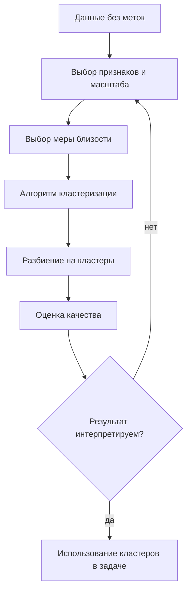

# Постановка задачи кластеризации. Примеры. Метрики качества кластеризации

## Основные понятия и определения

Кластеризация - это задача машинного обучения без учителя, в которой требуется разбить множество объектов на группы, называемые кластерами, так, чтобы объекты внутри одного кластера были похожи друг на друга, а объекты из разных кластеров существенно различались. В отличие от классификации, в кластеризации заранее не заданы правильные метки классов: алгоритм сам выявляет структуру данных по признакам объектов.

Формально имеется выборка объектов \(X = \{x_1, x_2, \ldots, x_n\}\), где каждый объект \(x_i\) описан набором признаков. Если признаки числовые, объект можно рассматривать как точку в пространстве \(\mathbb{R}^d\). Требуется построить отображение

\[
a: X \rightarrow \{1, 2, \ldots, K\},
\]

где \(a(x_i)\) - номер кластера, к которому отнесен объект, а \(K\) - число кластеров. Иногда \(K\) известно заранее, но часто его нужно выбирать по данным или по смыслу прикладной задачи.

Ключевое понятие в кластеризации - мера близости или расстояния между объектами. Для числовых признаков часто используют евклидово расстояние:

\[
\rho(x_i, x_j) = \sqrt{\sum_{m=1}^{d}(x_{im} - x_{jm})^2}.
\]

Также применяются манхэттенское расстояние, косинусная близость, расстояние Жаккара для множеств, расстояние Хэмминга для бинарных векторов, специальные метрики для временных рядов и графов. Выбор расстояния влияет на результат не меньше, чем выбор алгоритма: два объекта могут быть близкими в одном смысле и далекими в другом.

Кластер - это не обязательно шарообразная группа точек. В зависимости от алгоритма кластеры могут пониматься как плотные области пространства, ветви иерархического дерева, компоненты графа близости или группы объектов, хорошо описываемые одним прототипом. Поэтому постановка задачи всегда включает не только данные, но и предположение о том, что считать естественной группировкой.

## Теория, формулы и интуиция

Интуитивно хорошая кластеризация должна обладать двумя свойствами: компактностью и разделимостью. Компактность означает, что объекты внутри кластера расположены близко друг к другу. Разделимость означает, что разные кластеры находятся достаточно далеко или имеют разные области плотности. Эти свойства могут конфликтовать: если взять слишком много кластеров, компактность улучшится, но смысловая интерпретация ухудшится; если взять слишком мало, разные группы будут искусственно объединены.

Одна из классических формализаций используется в методе \(k\)-средних. Пусть задано число кластеров \(K\), а у каждого кластера есть центр \(\mu_k\). Нужно минимизировать сумму квадратов расстояний от объектов до центров своих кластеров:

\[
J = \sum_{k=1}^{K}\sum_{x_i \in C_k} \|x_i - \mu_k\|^2.
\]

Здесь \(C_k\) - множество объектов \(k\)-го кластера. Чем меньше значение \(J\), тем компактнее кластеры в евклидовом смысле. Однако эта функция не оценивает смысловую правильность разбиения и склонна предпочитать сферические кластеры примерно одинакового размера.

Для иерархической кластеризации важна идея расстояния между кластерами. Если \(A\) и \(B\) - два кластера, то можно определить:

\[
d_{\min}(A,B)=\min_{x\in A, y\in B}\rho(x,y),
\]

\[
d_{\max}(A,B)=\max_{x\in A, y\in B}\rho(x,y),
\]

\[
d_{\text{avg}}(A,B)=\frac{1}{|A||B|}\sum_{x\in A}\sum_{y\in B}\rho(x,y).
\]

Эти варианты называются single linkage, complete linkage и average linkage. Они дают разные деревья кластеров: первый хорошо находит вытянутые цепочки, но чувствителен к мостам из точек; второй строит более компактные группы; третий является компромиссом.

Качество кластеризации оценивают внутренними, внешними и относительными метриками. Внутренние метрики используют только признаки и результат кластеризации. Они полезны, когда истинных меток нет. Внешние метрики сравнивают кластеры с известной разметкой, если она есть, например в эксперименте или на контрольном наборе данных. Относительные метрики помогают сравнивать разные числа кластеров или разные алгоритмы.

Коэффициент силуэта показывает, насколько объект похож на свой кластер по сравнению с ближайшим чужим кластером. Для объекта \(i\) обозначим \(a(i)\) как среднее расстояние до объектов своего кластера, а \(b(i)\) как минимальное среднее расстояние до объектов другого кластера. Тогда

\[
s(i)=\frac{b(i)-a(i)}{\max(a(i),b(i))}.
\]

Значение \(s(i)\) лежит примерно от \(-1\) до \(1\). Чем ближе к \(1\), тем лучше объект вписывается в свой кластер. Значение около \(0\) означает, что объект находится на границе кластеров. Отрицательное значение указывает, что объект, возможно, отнесен не туда.

Индекс Дэвиса-Болдина измеряет среднюю похожесть каждого кластера на наиболее близкий к нему другой кластер:

\[
DB = \frac{1}{K}\sum_{i=1}^{K}\max_{j\ne i}\frac{S_i+S_j}{M_{ij}},
\]

где \(S_i\) - среднее расстояние объектов кластера \(i\) до его центра, а \(M_{ij}\) - расстояние между центрами кластеров \(i\) и \(j\). Чем меньше DB, тем лучше: внутри кластеров должно быть мало разброса, а между центрами - большое расстояние.

Индекс Калински-Харабаша основан на отношении межкластерной и внутрикластерной дисперсии:

\[
CH = \frac{B/(K-1)}{W/(n-K)}.
\]

Здесь \(B\) - межкластерная дисперсия, \(W\) - внутрикластерная дисперсия, \(n\) - число объектов. Большое значение индекса обычно говорит о более выраженной кластерной структуре.

Если известны истинные классы, применяют внешние метрики. Adjusted Rand Index сравнивает пары объектов: оказались ли они вместе или раздельно в истинной и найденной разметке. Коррекция делает значение устойчивым к случайным совпадениям. Normalized Mutual Information измеряет, сколько информации найденные кластеры дают об истинных классах. Эти метрики важны в научных экспериментах, но в реальных задачах настоящая разметка часто отсутствует.

## Методы, алгоритмы и этапы решения

Обычно решение задачи кластеризации начинается с подготовки данных. Числовые признаки масштабируют, потому что признаки с большими значениями могут доминировать в расстоянии. Например, если один признак измеряется в рублях, а другой в процентах, евклидово расстояние без нормировки будет почти полностью определяться рублевым признаком. Часто применяют стандартизацию, min-max нормировку, обработку выбросов, заполнение пропусков и отбор информативных признаков.

Затем выбирают меру близости. Для обычных табличных числовых данных часто подходит евклидово расстояние. Для текстов после векторизации удобно использовать косинусную близость, потому что важнее направление вектора частот или эмбеддинга, а не его длина. Для категориальных признаков нужны другие подходы: кодирование, расстояние Гауэра или алгоритмы, специально рассчитанные на смешанные данные.

Метод \(k\)-средних относится к прототипным методам. Он работает итеративно: сначала выбираются \(K\) центров, затем каждый объект относится к ближайшему центру, после чего центры пересчитываются как средние значения объектов в кластерах. Процесс повторяется до стабилизации. Метод прост, быстр и хорошо работает на больших данных, но требует заранее выбрать \(K\), чувствителен к выбросам и предполагает кластеры примерно выпуклой формы.

Метод \(k\)-медоидов похож на \(k\)-средних, но центром кластера является реальный объект, а не среднее значение. Это делает алгоритм более устойчивым к выбросам и позволяет использовать произвольные матрицы расстояний. Недостаток - большая вычислительная сложность.

Иерархическая кластеризация строит дерево вложенных кластеров - дендрограмму. В агломеративном варианте каждый объект сначала является отдельным кластером, затем ближайшие кластеры последовательно объединяются. Пользователь может выбрать уровень разреза дерева и получить нужное число групп. Такой подход хорошо интерпретируется и не требует сразу фиксировать число кластеров, но плохо масштабируется на очень большие выборки.

DBSCAN относится к плотностным методам. Он формирует кластеры как области высокой плотности, разделенные областями низкой плотности. У алгоритма есть параметры \(\varepsilon\), задающий радиус окрестности, и `min_samples`, задающий минимальное число соседей для плотной точки. DBSCAN умеет находить кластеры произвольной формы и выделять шум, но плохо работает при сильно различающихся плотностях кластеров.

Gaussian Mixture Model рассматривает данные как смесь нескольких нормальных распределений. Каждый объект получает не только номер кластера, но и вероятности принадлежности к компонентам. Это полезно, когда границы между группами размыты. Модель обучается обычно EM-алгоритмом: на E-шаге оцениваются вероятности принадлежности, на M-шаге обновляются параметры распределений.

Спектральная кластеризация строит граф близости объектов и использует собственные векторы матрицы графа для перехода в новое пространство, где структура кластеров становится проще. Она может хорошо работать для сложных нелинейных форм, но требует аккуратного выбора графа и может быть дорогой по памяти.

Выбор числа кластеров - отдельная задача. Для \(k\)-средних часто используют метод локтя: строят граф зависимости внутрикластерной суммы квадратов от \(K\) и ищут точку, после которой улучшение становится слабым. Также применяют силуэт, индекс Калински-Харабаша, информационные критерии AIC и BIC для вероятностных моделей. Но окончательный выбор должен учитывать смысл задачи: математически удобное число кластеров не всегда является полезным для принятия решений.

## Практические примеры

В маркетинге кластеризация используется для сегментации клиентов. Объекты - клиенты, признаки - частота покупок, средний чек, давность последней покупки, категории товаров, реакция на акции. После кластеризации могут обнаружиться группы: постоянные покупатели с высоким чеком, редкие покупатели, чувствительные к скидкам, новые клиенты без устойчивого поведения. Для такой задачи важно не только получить высокий силуэт, но и дать каждому сегменту понятную бизнес-интерпретацию.

В обработке текстов кластеризация помогает группировать документы по темам. Документы переводят в векторы с помощью TF-IDF или эмбеддингов, затем применяют \(k\)-средних, иерархическую кластеризацию или HDBSCAN. Например, новости могут автоматически разделиться на экономику, спорт, политику и технологии. Для текстов часто используется косинусная близость, поскольку абсолютная длина документа не должна быть главным фактором.

В медицине кластеризация может применяться для поиска подтипов заболеваний. Пациенты описываются лабораторными показателями, симптомами, возрастом, историей лечения. Найденные кластеры могут помочь сформулировать гипотезы о разных механизмах болезни. Однако такая интерпретация требует особой осторожности: кластер - это статистическая группа, а не автоматически доказанная клиническая категория.

В анализе изображений кластеризация используется для сегментации. Например, пиксели изображения можно кластеризовать по цвету и координатам, чтобы выделить области: фон, объект, тень, текстуру. Метод \(k\)-средних часто применяют для сжатия цветовой палитры: все цвета изображения заменяются ближайшими центрами кластеров, и изображение сохраняет общий вид при меньшем числе цветов.

В информационной безопасности кластеризация помогает искать аномалии. Нормальные сетевые соединения образуют плотные группы по длительности, объему трафика, числу пакетов, портам и протоколам. Точки, не попадающие ни в один плотный кластер, могут быть подозрительными. Здесь особенно полезны плотностные методы, потому что они явно выделяют шум и не требуют относить каждый объект к какой-либо группе.

На практике качество кластеризации проверяют не одной метрикой, а сочетанием критериев. Например, можно сравнить несколько алгоритмов по silhouette score, Davies-Bouldin и Calinski-Harabasz, затем визуализировать данные через PCA, t-SNE или UMAP, после чего проверить, имеют ли кластеры прикладной смысл. Хороший результат - это не просто красивые численные значения, а устойчивое, интерпретируемое и полезное разбиение данных.
