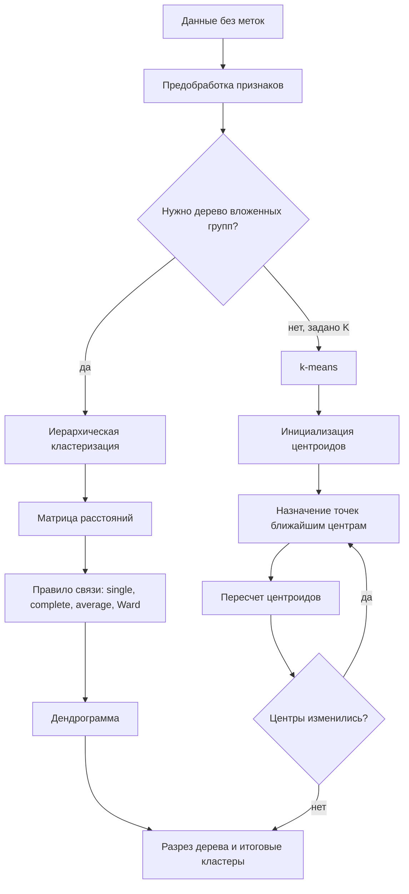

# Методы решения задачи кластеризации. Иерархические методы. Алгоритм k-means

## Основные понятия и определения

Кластеризация - это задача обучения без учителя, в которой требуется разбить множество объектов на группы, называемые кластерами, так, чтобы объекты внутри одной группы были похожи друг на друга, а объекты из разных групп заметно различались. В отличие от классификации, здесь заранее нет правильных меток классов: алгоритм сам ищет скрытую структуру данных по признаковому описанию объектов.

Пусть задана выборка \(X = \{x_1, x_2, \ldots, x_n\}\), где каждый объект \(x_i\) описан вектором признаков из пространства \(\mathbb{R}^d\). Результатом кластеризации является разбиение выборки на \(K\) непересекающихся подмножеств \(C_1, C_2, \ldots, C_K\), таких что каждый объект относится хотя бы к одному кластеру. В классической жесткой кластеризации объект принадлежит ровно одному кластеру. В мягкой кластеризации, например в вероятностных моделях смесей, объект может иметь степени принадлежности к нескольким кластерам.

Понятие похожести обычно задается через меру расстояния или сходства. Для числовых признаков часто используют евклидово расстояние:

\[
\rho(x_i, x_j) = \sqrt{\sum_{m=1}^{d}(x_{im} - x_{jm})^2}.
\]

Также применяются манхэттенское расстояние, косинусная мера, расстояние Чебышева, расстояния для категориальных признаков и специальные доменные метрики. Выбор метрики принципиален: алгоритм кластеризации не знает смысл данных, он видит только геометрию, заданную признаками и расстояниями. Поэтому перед кластеризацией обычно проводят нормализацию или стандартизацию признаков, иначе признаки с большими числовыми масштабами начинают доминировать.

Кластер можно понимать по-разному. В центроидных методах кластер - это группа объектов вокруг некоторого центра. В иерархических методах кластер - это узел дерева объединений или разбиений. В плотностных методах кластер - это область повышенной плотности точек. В графовых подходах кластер соответствует плотно связанной компоненте графа похожести. Поэтому не существует универсального алгоритма, который одинаково хорошо решает все задачи: форма кластеров, наличие шума, размерность данных и требование интерпретируемости влияют на выбор метода.

## Теория, формулы и интуиция

Общая идея кластеризации состоит в оптимизации некоторого критерия качества. Такой критерий может явно задаваться, как в k-means, или быть неявным, как в агломеративной иерархической кластеризации, где на каждом шаге выбирается пара наиболее близких кластеров. Хорошая кластеризация обычно имеет малую внутрикластерную вариативность и большую межкластерную отделимость.

Для кластера \(C_k\) можно определить центроид:

\[
\mu_k = \frac{1}{|C_k|}\sum_{x_i \in C_k} x_i.
\]

Центроид - это средний вектор объектов кластера. Внутрикластерная сумма квадратов расстояний до центроидов записывается так:

\[
WCSS = \sum_{k=1}^{K}\sum_{x_i \in C_k} \|x_i - \mu_k\|^2.
\]

Именно эту величину минимизирует алгоритм k-means. Интуитивно он ищет такие центры кластеров, чтобы каждая точка была как можно ближе к центру своего кластера. Чем меньше \(WCSS\), тем компактнее кластеры. Однако само по себе уменьшение \(WCSS\) не означает, что найдено содержательно правильное разбиение: при увеличении \(K\) значение критерия почти всегда уменьшается, потому что большее число центров лучше подгоняет данные.

Для выбора числа кластеров часто используют метод локтя. Строят график зависимости \(WCSS(K)\) от числа кластеров \(K\). Сначала при росте \(K\) ошибка резко падает, затем улучшение становится слабым. Точка перегиба воспринимается как разумный компромисс между простотой модели и качеством описания данных. Другой подход - силуэт:

\[
s(i) = \frac{b(i) - a(i)}{\max(a(i), b(i))},
\]

где \(a(i)\) - среднее расстояние от объекта \(i\) до объектов своего кластера, а \(b(i)\) - минимальное среднее расстояние от объекта \(i\) до объектов другого ближайшего кластера. Значение силуэта близко к 1 означает удачное размещение объекта, около 0 - объект находится на границе кластеров, отрицательное значение - объект, вероятно, попал не в свой кластер.

Иерархическая кластеризация строит не одно разбиение, а целую вложенную систему кластеров. Ее результат удобно изображать дендрограммой - деревом, где листья соответствуют отдельным объектам, а внутренние узлы показывают объединение кластеров. Высота объединения отражает расстояние или меру неоднородности между объединяемыми кластерами. Чтобы получить конкретное число кластеров, дендрограмму "разрезают" на выбранной высоте.

Главный теоретический вопрос в агломеративной иерархической кластеризации - как определить расстояние между кластерами \(A\) и \(B\), если каждый из них содержит много точек. Используются разные правила связи:

- single linkage: \(D(A,B)=\min_{x \in A, y \in B}\rho(x,y)\), расстояние между ближайшими точками кластеров;
- complete linkage: \(D(A,B)=\max_{x \in A, y \in B}\rho(x,y)\), расстояние между самыми удаленными точками;
- average linkage: среднее расстояние между всеми парами точек из разных кластеров;
- centroid linkage: расстояние между центроидами кластеров;
- метод Уорда: объединяются кластеры, дающие минимальный прирост внутрикластерной суммы квадратов.

Single linkage хорошо находит вытянутые цепочечные структуры, но чувствителен к "мостикам" из близких точек и может объединять разные группы через шум. Complete linkage стремится строить компактные кластеры, но может дробить вытянутые формы. Average linkage является более сбалансированным вариантом. Метод Уорда часто хорошо работает с евклидовыми числовыми данными и дает кластеры, похожие по духу на результат k-means, но при этом сохраняет иерархическую структуру.

## Методы, алгоритмы и этапы решения

Методы кластеризации можно разделить на несколько больших групп. Центроидные методы представляют кластеры через центры; главный пример - k-means. Иерархические методы строят дерево объединений или разбиений. Плотностные методы, например DBSCAN, ищут области высокой плотности и позволяют выделять шум. Модельные методы предполагают, что данные порождены вероятностной моделью, например смесью гауссовских распределений. Спектральные методы используют собственные векторы матриц графа похожести и полезны для сложной нелинейной структуры данных.

Иерархические методы бывают агломеративными и дивизивными. Агломеративный подход работает снизу вверх: сначала каждый объект считается отдельным кластером, затем на каждом шаге объединяются два наиболее близких кластера. Процесс продолжается, пока не останется один общий кластер или пока не будет достигнуто заданное число групп. Дивизивный подход работает сверху вниз: сначала все объекты находятся в одном кластере, затем он последовательно разбивается на части. На практике агломеративные методы используются чаще, потому что они проще и имеют более стандартную реализацию.

Алгоритм агломеративной иерархической кластеризации можно описать так:

1. Выбрать признаки, метрику расстояния и способ связи между кластерами.
2. Поместить каждый объект в отдельный кластер.
3. Вычислить расстояния между всеми парами кластеров.
4. Найти пару кластеров с минимальным расстоянием и объединить ее.
5. Обновить расстояния от нового кластера до остальных кластеров.
6. Повторять объединения до получения полной дендрограммы.
7. Выбрать уровень разреза дендрограммы и получить итоговое разбиение.

Сильная сторона иерархических методов - интерпретируемость. Исследователь видит не только итоговые группы, но и то, как они появляются при разных уровнях детализации. Это полезно, когда заранее неизвестно число кластеров или нужно объяснить структуру данных. Недостатки тоже существенны: вычисление матрицы расстояний требует порядка \(O(n^2)\) памяти, а полный алгоритм плохо масштабируется на очень большие выборки. Кроме того, ранние ошибочные объединения обычно нельзя исправить на следующих шагах.

Алгоритм k-means решает другую задачу: он сразу ищет \(K\) компактных групп вокруг центроидов. Число кластеров \(K\) задается заранее. Классическая версия работает с евклидовым расстоянием и числовыми признаками. Этапы алгоритма следующие:

1. Задать число кластеров \(K\).
2. Инициализировать \(K\) центроидов, случайно или методом k-means++.
3. Для каждой точки найти ближайший центроид и назначить точку соответствующему кластеру.
4. Для каждого кластера пересчитать центроид как среднее всех его точек.
5. Повторять шаги назначения и пересчета, пока центроиды или назначения почти не перестанут изменяться.

Формально на шаге назначения для каждого объекта выбирается номер кластера:

\[
c_i = \arg\min_{k \in \{1,\ldots,K\}} \|x_i - \mu_k\|^2.
\]

Затем центры обновляются по формуле среднего:

\[
\mu_k = \frac{1}{|C_k|}\sum_{x_i \in C_k} x_i.
\]

Каждая итерация k-means не увеличивает \(WCSS\), поэтому алгоритм сходится за конечное число шагов к локальному минимуму. Но локальный минимум может зависеть от начальной инициализации. Поэтому на практике алгоритм запускают несколько раз с разными начальными центрами и выбирают решение с минимальным \(WCSS\). Инициализация k-means++ уменьшает риск плохого старта: первый центр выбирается случайно, а следующие выбираются с большей вероятностью среди точек, удаленных от уже выбранных центров.

Преимущества k-means - простота, скорость и хорошая масштабируемость. При фиксированном \(K\), числе итераций \(T\), числе объектов \(n\) и размерности \(d\) сложность примерно равна \(O(nKdT)\), что позволяет применять метод к большим данным. Но у него есть ограничения. Он предполагает компактные примерно сферические кластеры сходного размера, чувствителен к выбросам, требует заранее выбрать \(K\), плохо работает с категориальными признаками без специального кодирования и может давать неустойчивый результат при сильной корреляции или разном масштабе признаков.

Перед применением обоих подходов важно подготовить данные. Обычно удаляют или обрабатывают пропуски, кодируют категориальные признаки, стандартизуют числовые признаки, анализируют выбросы и при необходимости уменьшают размерность методом PCA или другими техниками. После получения кластеров результат интерпретируют: сравнивают распределения признаков по группам, строят профили кластеров, проверяют устойчивость при изменении параметров и оценивают качество через силуэт, индекс Калински-Харабаса, индекс Дэвиса-Болдина или внешние метрики, если есть экспертные метки.

## Практические примеры

Первый пример - сегментация клиентов интернет-магазина. Для каждого клиента можно взять признаки: частота покупок, средний чек, давность последней покупки, доля возвратов, интерес к категориям товаров. Если бизнес заранее хочет получить, например, пять рабочих сегментов для маркетинговых кампаний, подойдет k-means. После стандартизации признаков алгоритм может выделить группы "частые покупатели с высоким чеком", "редкие покупатели", "новые клиенты", "клиенты с риском ухода" и "охотники за скидками". Названия кластеров задает не алгоритм, а аналитик после изучения средних значений признаков в каждой группе.

Второй пример - анализ учебных результатов студентов. Если неизвестно, сколько типов траекторий существует, полезна иерархическая кластеризация. Объекты описываются баллами по темам, посещаемостью, активностью в системе и сроками сдачи работ. Дендрограмма может показать, что на верхнем уровне студенты делятся на сильную и проблемную группы, а на более низком уровне внутри проблемной группы есть разные причины: слабая база, нерегулярная работа или трудности только с отдельной темой. Такой результат удобен для преподавателя, потому что дерево дает несколько уровней детализации.

Третий пример - группировка документов. Тексты переводят в векторы признаков, например через TF-IDF или эмбеддинги. Для коротких новостей k-means может быстро сгруппировать документы по темам, если заранее задано число рубрик. Но если нужно исследовать коллекцию без заранее известной структуры, иерархический метод с косинусным расстоянием позволит увидеть близкие подтемы: экономика может делиться на банки, рынки и налоги, а политика - на выборы, международные отношения и законодательство.

Четвертый пример - обработка изображений. В задаче сжатия цвета k-means можно применить к пикселям, где каждый пиксель описан тройкой RGB. Если выбрать \(K=16\), алгоритм найдет 16 типичных цветов изображения, а каждый пиксель заменяется ближайшим центроидом. Так изображение хранится с меньшим числом цветов. Это показывает, что кластеризация полезна не только для аналитики таблиц, но и как технический инструмент преобразования данных.

Иерархические методы и k-means часто дополняют друг друга. Иерархическую кластеризацию можно использовать на подвыборке, чтобы понять примерное число групп и выбрать \(K\), а затем применить k-means ко всей большой выборке. Обратная стратегия тоже возможна: сначала быстро получить много мелких кластеров с помощью k-means, а затем кластеризовать их центроиды иерархическим методом. В реальных задачах качество решения определяется не только алгоритмом, но и тем, насколько осмысленно выбраны признаки, метрика расстояния, масштабирование и способ интерпретации результата.
