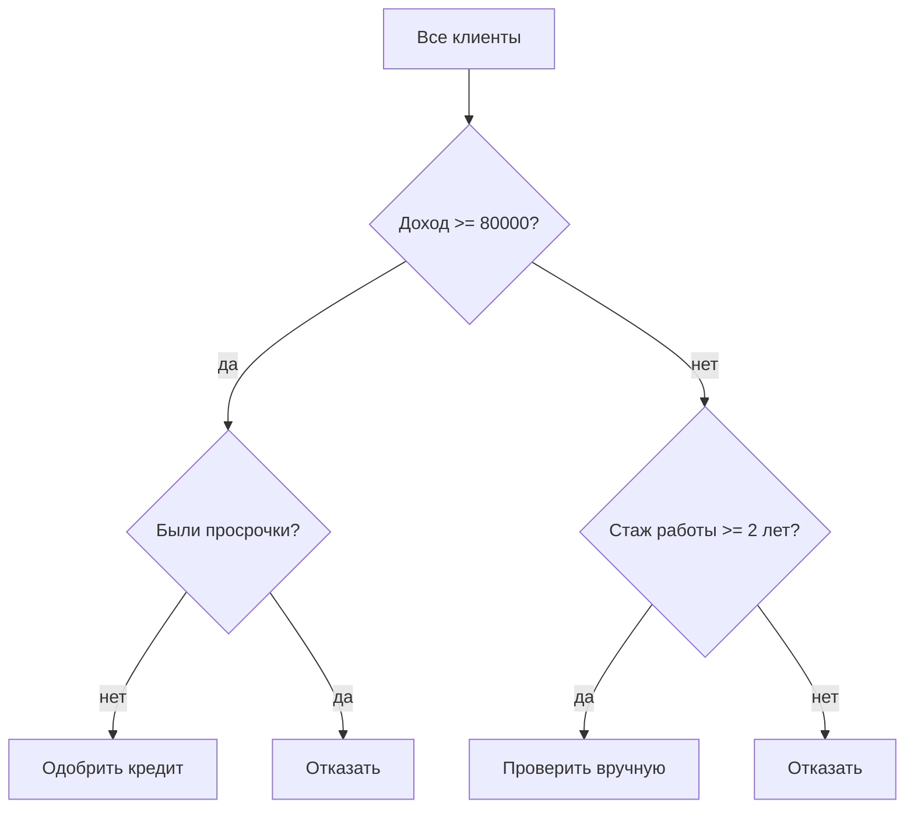

# Деревья решений. Обучение дерева решений

## Основные понятия и определения

Дерево решений — это модель машинного обучения, которая делает прогноз как последовательность простых проверок над признаками объекта. Внутренние вершины дерева содержат условия вида \(x_j \le t\), \(x_j \in A\) или «значение признака равно категории», ребра соответствуют исходам проверки, а листья содержат итоговый ответ модели. В задаче классификации лист обычно хранит класс или распределение вероятностей по классам, в задаче регрессии — численное значение, например среднее целевой переменной среди объектов, попавших в этот лист.

Главная идея дерева решений состоит в разбиении пространства признаков на области, внутри которых ответ можно считать достаточно однородным. Если модель решает задачу выдачи кредита, дерево может сначала проверить доход клиента, затем возраст, затем наличие просрочек. Если объект проходит по некоторому пути от корня к листу, лист определяет прогноз: «одобрить» или «отказать». Поэтому дерево удобно интерпретировать как набор правил вида «если выполнены такие-то условия, то ответ такой-то».

Обучающая выборка задается набором объектов и ответов:

\[
D = \{(x_i, y_i)\}_{i=1}^{n},
\]

где \(x_i = (x_{i1}, \ldots, x_{id})\) — вектор признаков, \(y_i\) — целевая переменная. Для классификации \(y_i\) принимает значения из конечного множества классов, для регрессии является числом. Дерево строится по обучающим данным так, чтобы в листьях оказывались группы объектов с как можно более похожими ответами.

Важные элементы дерева:

- корень — начальная вершина, куда попадают все объекты;
- внутренний узел — вершина с условием разбиения;
- лист — конечная вершина, в которой выдается прогноз;
- глубина дерева — максимальное число проверок на пути от корня до листа;
- разбиение, или split, — выбор признака и условия, по которому множество объектов делится на подмножества;
- критерий качества разбиения — мера того, насколько после разделения данные стали более однородными.

Деревья относятся к непараметрическим моделям: они не задают заранее фиксированную формулу зависимости \(y\) от \(x\), а адаптируют форму решения к данным. Это делает их гибкими: они умеют находить нелинейные зависимости, учитывать взаимодействия признаков и работать как с числовыми, так и с категориальными признаками. При этом у дерева есть важный недостаток: если не ограничивать рост, оно легко переобучается, то есть хорошо запоминает обучающую выборку, но хуже работает на новых объектах.

## Теория/формулы/интуиция

Обучение дерева основано на жадном рекурсивном выборе разбиений. На каждом шаге алгоритм рассматривает текущую группу объектов и пытается найти такой вопрос к данным, который лучше всего уменьшит неоднородность целевой переменной. Для классификации неоднородность означает смешение классов в узле: если в узле есть объекты разных классов, прогноз менее уверен; если почти все объекты одного класса, узел чистый. Для регрессии неоднородность обычно означает большой разброс числовых ответов.

Пусть в узел \(S\) попало \(m\) объектов. Для классификации доля класса \(k\) в этом узле равна

\[
p_k = \frac{1}{m}\sum_{(x_i,y_i)\in S} [y_i = k].
\]

Один из популярных критериев неоднородности — энтропия:

\[
H(S) = -\sum_{k=1}^{K} p_k \log_2 p_k.
\]

Если все объекты в узле принадлежат одному классу, энтропия равна нулю. Если классы представлены примерно одинаково, энтропия максимальна. Интуитивно энтропия показывает неопределенность ответа в узле.

Другой распространенный критерий — индекс Джини:

\[
Gini(S) = 1 - \sum_{k=1}^{K} p_k^2.
\]

Он также равен нулю для полностью чистого узла и растет, когда классы перемешаны. Индекс Джини часто используется в алгоритме CART, потому что он прост в вычислении и хорошо работает на практике.

Чтобы оценить конкретное разбиение узла \(S\) на подмножества \(S_L\) и \(S_R\), сравнивают неоднородность до и после split. Например, информационный выигрыш через энтропию:

\[
IG(S, split) = H(S) - \frac{|S_L|}{|S|}H(S_L) - \frac{|S_R|}{|S|}H(S_R).
\]

Чем больше \(IG\), тем лучше разбиение: оно сильнее уменьшает неопределенность. Для критерия Джини аналогично минимизируют взвешенную сумму неоднородностей дочерних узлов:

\[
Q(split) = \frac{|S_L|}{|S|}Gini(S_L) + \frac{|S_R|}{|S|}Gini(S_R).
\]

Лучшим считается разбиение с минимальным \(Q\) или максимальным уменьшением Джини.

Для регрессии вместо энтропии и Джини используют меры разброса. Чаще всего в листе предсказывается среднее значение:

\[
\hat{y}_S = \frac{1}{|S|}\sum_{(x_i,y_i)\in S} y_i,
\]

а качество узла измеряется суммой квадратов отклонений:

\[
MSE(S) = \frac{1}{|S|}\sum_{(x_i,y_i)\in S}(y_i - \hat{y}_S)^2.
\]

Разбиение выбирают так, чтобы уменьшить среднеквадратичную ошибку в дочерних узлах. Интуитивно дерево регрессии пытается разделить данные на области, где целевая переменная почти постоянна.

Пример структуры дерева можно представить так:

В этой схеме каждый путь от корня к листу соответствует правилу. Например: если доход не меньше 80000 и просрочек нет, дерево выдает «одобрить кредит». Такие правила легко объяснить человеку, что отличает деревья от многих менее интерпретируемых моделей.

Однако высокая интерпретируемость сохраняется только у небольших деревьев. Глубокое дерево может содержать сотни условий, и тогда оно становится сложным для анализа. Кроме того, глубокие деревья имеют высокую дисперсию: малое изменение обучающей выборки может заметно изменить структуру дерева. Поэтому на практике важны ограничения роста и методы обрезки.

## Методы/алгоритмы или этапы решения

Классическое обучение дерева решений выполняется рекурсивно. В корневой узел помещают всю обучающую выборку. Затем алгоритм перебирает возможные разбиения и выбирает лучшее по выбранному критерию. После этого он повторяет процедуру отдельно для каждого дочернего узла. Процесс продолжается до выполнения критерия остановки.

Общий алгоритм построения бинарного дерева можно описать так:

1. Поместить текущую выборку \(S\) в узел.
2. Проверить условия остановки: узел уже достаточно чистый, достигнута максимальная глубина, объектов слишком мало или улучшение качества слишком мало.
3. Если остановка выполнена, сделать узел листом и записать в него прогноз.
4. Иначе перебрать кандидаты на разбиение: признаки и пороги для числовых признаков, варианты разделения категорий для категориальных.
5. Для каждого кандидата вычислить качество разбиения.
6. Выбрать лучший split и разделить \(S\) на дочерние подмножества.
7. Рекурсивно повторить процедуру для дочерних узлов.

Для числового признака \(x_j\) обычно рассматриваются пороги между соседними отсортированными уникальными значениями. Условие имеет вид \(x_j \le t\). Например, если признак «возраст» принимает значения 20, 25, 30 и 40, возможные пороги могут быть 22.5, 27.5 и 35. Для категориального признака можно проверять принадлежность некоторому множеству категорий, но полный перебор всех множеств дорогой, поэтому реализации часто используют упрощения или предварительное кодирование категорий.

Существуют разные исторические алгоритмы деревьев решений. ID3 использует информационный выигрыш на основе энтропии и ориентирован прежде всего на категориальные признаки. C4.5 развивает ID3: поддерживает числовые признаки, пропущенные значения и использует gain ratio, который уменьшает склонность выбирать признаки с большим числом уникальных значений. CART строит бинарные деревья и применим как к классификации, так и к регрессии; для классификации часто использует индекс Джини, для регрессии — MSE.

Критерии остановки нужны, чтобы дерево не запоминало шум. Типичные параметры:

- `max_depth` — максимальная глубина дерева;
- `min_samples_split` — минимальное число объектов, при котором узел можно делить;
- `min_samples_leaf` — минимальное число объектов в листе;
- `min_impurity_decrease` — минимальное уменьшение неоднородности для выполнения split;
- `max_leaf_nodes` — максимальное число листьев.

Еще один важный подход — обрезка дерева, или pruning. Предварительная обрезка ограничивает рост дерева во время построения с помощью перечисленных параметров. Пост-обрезка сначала строит большое дерево, а затем удаляет части, которые плохо улучшают качество на валидации или слишком сильно усложняют модель. В CART используется cost-complexity pruning: минимизируется функционал, где ошибка дерева дополняется штрафом за число листьев:

\[
R_{\alpha}(T) = R(T) + \alpha |T|,
\]

где \(R(T)\) — ошибка дерева, \(|T|\) — число листьев, \(\alpha\) — коэффициент сложности. Чем больше \(\alpha\), тем сильнее штраф за размер дерева и тем проще итоговая модель.

При работе с деревьями важно корректно оценивать качество. Данные делят на обучающую, валидационную и тестовую части или используют кросс-валидацию. Гиперпараметры дерева подбирают по валидационной выборке, а итоговую оценку получают на тестовой, которую не использовали при настройке. Для классификации применяют accuracy, precision, recall, F1, ROC-AUC; для регрессии — MAE, MSE, RMSE, \(R^2\).

Деревья умеют оценивать важность признаков. В простом варианте важность признака измеряют суммарным уменьшением неоднородности во всех узлах, где этот признак использовался. Если разбиения по признаку часто дают большое улучшение, признак считается важным. Но такую важность нужно трактовать осторожно: признаки с большим числом возможных разбиений могут получать завышенную оценку, а коррелирующие признаки делят важность между собой.

## Практические примеры

Рассмотрим задачу классификации заявок на кредит. Есть признаки: доход, возраст, стаж работы, наличие прошлых просрочек, размер кредита. Целевая переменная — «кредит возвращен» или «кредит не возвращен». Дерево может сначала выбрать признак «были просрочки», потому что он сильно разделяет клиентов по риску. Затем для клиентов без просрочек оно может проверить отношение суммы кредита к доходу, а для клиентов с просрочками — стаж работы. В итоге получаются понятные правила: «если просрочек нет и долговая нагрузка мала, заявка надежна».

Для небольшой иллюстрации пусть в узле 10 клиентов: 6 надежных и 4 рискованных. Доли классов равны \(p_1=0.6\) и \(p_2=0.4\). Индекс Джини:

\[
Gini = 1 - 0.6^2 - 0.4^2 = 0.48.
\]

Если разбиение по признаку «просрочки» дает левый узел из 5 надежных и 1 рискованного клиента, а правый узел из 1 надежного и 3 рискованных, то неоднородность заметно уменьшается. Для левого узла

\[
Gini_L = 1 - (5/6)^2 - (1/6)^2 \approx 0.278,
\]

для правого:

\[
Gini_R = 1 - (1/4)^2 - (3/4)^2 = 0.375.
\]

Взвешенная неоднородность после разбиения:

\[
Q = \frac{6}{10}\cdot 0.278 + \frac{4}{10}\cdot 0.375 \approx 0.317.
\]

Так как \(0.317 < 0.48\), разбиение улучшает чистоту узлов. Алгоритм сравнит это улучшение с другими возможными разбиениями и выберет лучшее.

В задаче регрессии дерево можно использовать для прогнозирования цены квартиры. Признаки: площадь, район, этаж, год постройки, расстояние до метро. Первый split может быть по площади, например «площадь \(\le 45\)». Затем внутри малых квартир дерево может разделить объекты по району, а внутри больших — по расстоянию до метро. В каждом листе прогнозом будет средняя цена квартир, попавших в этот лист. Такое дерево фактически строит кусочно-постоянную аппроксимацию: для каждой области признакового пространства назначается своя средняя цена.

На практике дерево решений часто используют как базовую интерпретируемую модель. Его удобно применять, когда нужно объяснить прогноз в терминах простых условий. Например, в медицине дерево может показать, какие признаки пациента привели к предварительному решению о риске заболевания. В бизнес-аналитике дерево помогает сегментировать клиентов: одни листья соответствуют клиентам с высокой вероятностью оттока, другие — с низкой.

При этом одиночное дерево редко является самой точной моделью на сложных данных. Из-за склонности к переобучению его часто заменяют ансамблями деревьев: случайным лесом, градиентным бустингом, XGBoost, LightGBM или CatBoost. Эти методы используют деревья как строительные блоки и обычно дают более высокое качество, но теряют часть простой интерпретируемости. Поэтому выбор зависит от задачи: если важна прозрачность, подходит небольшое ограниченное дерево; если важнее максимальная точность, чаще выбирают ансамбли.

Итоговый рабочий процесс обычно выглядит так: подготовить данные, обработать пропуски и категориальные признаки, разделить выборку, обучить дерево с разумными ограничениями глубины, подобрать гиперпараметры по валидации, оценить качество на тесте и проанализировать получившиеся правила. Такой подход позволяет использовать сильные стороны деревьев — наглядность, гибкость и способность находить нелинейные зависимости — и одновременно контролировать их главный риск, то есть переобучение.
