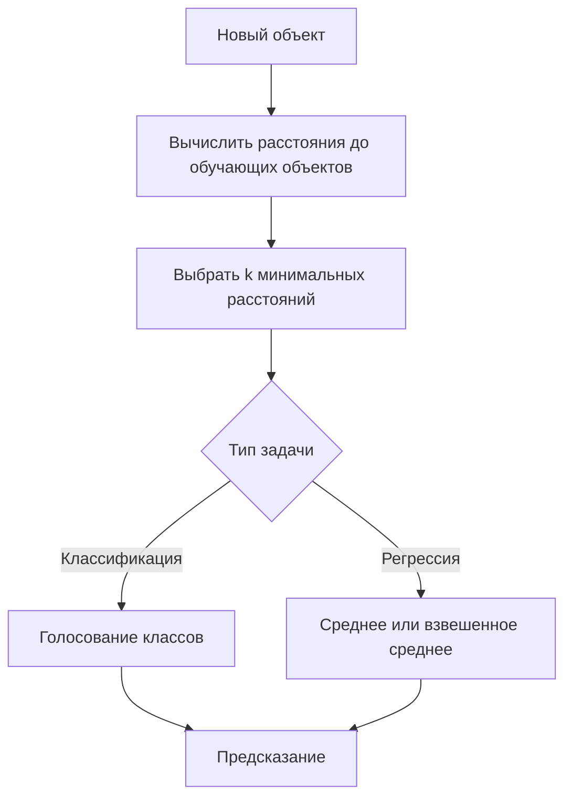

# Алгоритм k-ближайших соседей

## Основные понятия и определения

Алгоритм k-ближайших соседей, или k-Nearest Neighbors (kNN), - это метод машинного обучения с учителем, применяемый для классификации и регрессии. Его основная идея проста: похожие объекты обычно имеют похожие ответы. Если новый объект находится рядом с объектами одного класса, то его разумно отнести к этому классу. Если нужно предсказать числовое значение, то его можно оценить по значениям у ближайших похожих объектов.

kNN называют ленивым алгоритмом обучения. На этапе обучения он не строит явную модель, не подбирает коэффициенты и не оценивает параметры распределения. Он фактически запоминает обучающую выборку. Основная работа выполняется во время предсказания: для каждого нового объекта алгоритм ищет ближайшие объекты из обучающего набора и агрегирует их ответы.

Пусть дана обучающая выборка:

$$
X = \{(x_i, y_i)\}_{i=1}^{n},
$$

где \(x_i\) - вектор признаков i-го объекта, \(y_i\) - известный ответ, \(n\) - число объектов. В задаче классификации ответ принадлежит конечному набору классов, например "спам" или "не спам". В задаче регрессии ответ является числом: ценой, температурой, рейтингом, вероятной выручкой.

Параметр \(k\) задает количество соседей, участвующих в принятии решения. При \(k = 1\) новый объект получает ответ самого близкого объекта. При большем \(k\) решение становится устойчивее к отдельным ошибочным меткам и выбросам, но слишком большое значение может сгладить локальную структуру данных. Поэтому \(k\) обычно подбирают по валидационной выборке или с помощью кросс-валидации.

Важнейшая часть kNN - метрика расстояния. Она определяет, какие объекты считать похожими. Для числовых признаков часто используют евклидово расстояние. Для признаков, где важна сумма абсолютных отличий, применяют манхэттенское расстояние. Для текстовых векторов и эмбеддингов часто используют косинусную близость. Если метрика не соответствует смыслу задачи, алгоритм будет находить формально близкие, но практически непохожие объекты.

## Теория, формулы и интуиция

Каждый объект можно представить точкой в пространстве признаков. Например, студент может описываться двумя признаками: количеством часов подготовки и баллом за пробный тест. Тогда похожие студенты окажутся рядом на плоскости. В реальных задачах признаков может быть десятки или тысячи, но логика сохраняется: ответ для нового объекта оценивается по его локальному окружению.

Евклидово расстояние между объектами \(x\) и \(z\) задается формулой:

$$
\rho(x, z) = \sqrt{\sum_{j=1}^{m}(x_j - z_j)^2},
$$

где \(m\) - число признаков. Манхэттенское расстояние имеет вид:

$$
\rho(x, z) = \sum_{j=1}^{m}|x_j - z_j|.
$$

Обобщением является расстояние Минковского:

$$
\rho_p(x, z) = \left(\sum_{j=1}^{m}|x_j - z_j|^p\right)^{1/p}.
$$

При \(p = 1\) получается манхэттенская метрика, при \(p = 2\) - евклидова.

Для классификации после поиска k ближайших соседей используется голосование. Пусть \(N_k(x)\) - множество индексов k ближайших объектов к новому объекту \(x\). Тогда:

$$
\hat{y}(x) = \arg\max_{c} \sum_{i \in N_k(x)} I(y_i = c),
$$

где \(I(y_i = c)\) равно 1, если сосед принадлежит классу \(c\), и 0 иначе. Предсказывается класс, который чаще всего встречается среди соседей.

Часто применяют взвешенное голосование: более близкий сосед влияет сильнее, чем более дальний. Например:

$$
w_i = \frac{1}{\rho(x, x_i) + \varepsilon},
$$

где \(\varepsilon\) - малое положительное число, защищающее от деления на ноль. Тогда класс выбирается по максимальной сумме весов соседей этого класса:

$$
\hat{y}(x) = \arg\max_{c} \sum_{i \in N_k(x)} w_i I(y_i = c).
$$

Для регрессии базовое предсказание равно среднему значению целевой переменной среди соседей:

$$
\hat{y}(x) = \frac{1}{k}\sum_{i \in N_k(x)} y_i.
$$

Во взвешенном варианте:

$$
\hat{y}(x) = \frac{\sum_{i \in N_k(x)} w_i y_i}{\sum_{i \in N_k(x)} w_i}.
$$

Интуитивно kNN строит локальное приближение зависимости. Он не ищет одну глобальную формулу для всех данных, как линейная регрессия, а предполагает, что в небольшой окрестности объекта ответы меняются относительно плавно. Поэтому метод может хорошо работать при сложных границах классов: граница решения возникает из расположения обучающих объектов.

При этом kNN чувствителен к масштабу признаков. Если один признак измеряется в тысячах, а другой в долях единицы, первый почти полностью определит расстояние. Поэтому перед применением алгоритма признаки обычно стандартизируют:

$$
x' = \frac{x - \mu}{\sigma},
$$

или нормализуют в диапазон от 0 до 1:

$$
x' = \frac{x - x_{\min}}{x_{\max} - x_{\min}}.
$$

Еще одна проблема - проклятие размерности. В пространствах большой размерности расстояния становятся менее информативными: многие объекты оказываются примерно одинаково далекими. Для борьбы с этим используют отбор признаков, снижение размерности, например PCA, или более подходящие метрики.

Сильная сторона kNN состоит в том, что результат можно объяснить через конкретные наблюдения: модель не просто выдает класс или число, а показывает, какие объекты оказались ближайшими. Это удобно в учебных, аналитических и прикладных задачах, где важно не только получить прогноз, но и понять его основание. В то же время качество такого объяснения зависит от качества данных: если в выборке много дублей, ошибок, нерелевантных признаков или устаревших наблюдений, ближайшие соседи будут вводить в заблуждение.

## Методы, алгоритмы или этапы решения

Практическое применение kNN обычно состоит из следующих этапов.

1. Подготовить данные. Нужно выбрать признаки, обработать пропуски, удалить явные ошибки, закодировать категориальные переменные. Например, категориальный признак "район" можно представить с помощью one-hot encoding.

2. Масштабировать признаки. Для метрического алгоритма это почти всегда обязательный шаг. Без масштабирования расстояние будет отражать не реальную похожесть объектов, а единицы измерения признаков.

3. Выбрать метрику. Евклидова метрика подходит как базовый вариант для числовых признаков. Манхэттенская может быть устойчивее, если признаки имеют разные направления изменения. Косинусная мера полезна для текстов и векторных представлений, где важен угол между векторами.

4. Подобрать \(k\). Малое \(k\) делает модель гибкой, но чувствительной к шуму. Большое \(k\) уменьшает влияние случайностей, но может привести к чрезмерному усреднению. На практике проверяют несколько значений, например 1, 3, 5, 7, 11, 15, и выбирают лучшее по валидационной метрике.

5. Для нового объекта вычислить расстояния до всех объектов обучающей выборки. В наивной реализации это полный перебор.

6. Отсортировать объекты по расстоянию и выбрать k ближайших.

7. Получить ответ: для классификации выполнить голосование, для регрессии посчитать среднее или взвешенное среднее.

8. Оценить качество на тестовой выборке. Для классификации применяют accuracy, precision, recall, F1-score, ROC-AUC; для регрессии - MAE, MSE, RMSE, \(R^2\).

Наивный поиск соседей для одного нового объекта требует порядка \(O(nm)\) операций, где \(n\) - число обучающих объектов, \(m\) - число признаков. Если данных много, предсказание становится дорогим. Для ускорения используют KD-деревья, ball tree и методы приближенного поиска ближайших соседей. Такие структуры особенно полезны при умеренной размерности пространства.

Выбор \(k\) связан с компромиссом между смещением и разбросом. При \(k = 1\) модель почти идеально следует обучающим данным, но легко переобучается. При большом \(k\) модель устойчивее, но может игнорировать локальные закономерности. Хорошее значение обычно находится между этими крайностями.

Также нужно учитывать дисбаланс классов. Если один класс встречается намного чаще, обычное голосование может систематически выбирать его. В этом случае помогают взвешивание соседей, балансировка данных или выбор метрик качества, учитывающих редкий класс.

## Практические примеры

Первый пример - классификация клиентов банка. Пусть для каждого клиента известны возраст, доход, сумма кредита и факт просрочки. Нужно определить, склонен ли новый клиент к просрочке. После масштабирования признаков алгоритм ищет, например, \(k = 5\) наиболее похожих клиентов. Если среди них четыре клиента имели просрочку, а один не имел, kNN предскажет класс "просрочка". Если используется взвешенное голосование, то самый похожий клиент будет иметь больший вес, чем сосед, расположенный дальше.

Второй пример - оценка стоимости квартиры. Признаками могут быть площадь, этаж, расстояние до метро, район и год постройки. Для новой квартиры алгоритм находит похожие проданные квартиры и усредняет их цены. Если ближайшие объекты действительно похожи, результат легко объяснить: прогноз основан на конкретных аналогах. Это делает kNN интерпретируемым методом.

Рассмотрим короткий числовой пример классификации. Новый объект имеет координаты \(x = (4, 4)\). В обучающей выборке есть объекты \(A=(3,4)\) класса 0, \(B=(5,4)\) класса 0, \(C=(4,6)\) класса 1 и \(D=(8,8)\) класса 1. Евклидовы расстояния до \(A\) и \(B\) равны 1, до \(C\) равно 2, до \(D\) равно \(\sqrt{32}\). При \(k = 3\) ближайшие соседи - \(A\), \(B\), \(C\). Два соседа имеют класс 0, один - класс 1, значит предсказание: класс 0.

Для регрессии пример аналогичен. Пусть нужно предсказать цену товара по весу и рейтингу. Три ближайших товара стоят 900, 1000 и 1100 рублей. При \(k = 3\) прогноз равен:

$$
\hat{y} = \frac{900 + 1000 + 1100}{3} = 1000.
$$

Если первый товар расположен значительно ближе остальных, лучше использовать взвешенное среднее, чтобы его цена сильнее повлияла на результат.

kNN полезен как базовая модель и как понятный пример метрического подхода. Он хорошо подходит для задач, где похожесть объектов действительно связана с целевым ответом, данных не слишком много, а интерпретируемость важна. Однако для больших выборок, шумных данных и пространств высокой размерности часто нужны ускорение поиска, тщательная предобработка или другие модели.
