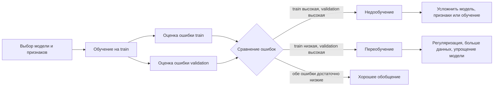

# Переобучение и недообучение. Способы обнаружения и предотвращения

## Основные понятия и определения

В машинном обучении модель строится не ради хорошего запоминания обучающей выборки, а ради способности правильно работать на новых объектах. Это свойство называют обобщающей способностью. Если алгоритм показывает низкую ошибку на обучающих данных, но заметно ошибается на отложенной выборке или в реальном применении, говорят о переобучении. Если же он плохо работает даже на обучающей выборке, говорят о недообучении. Оба состояния связаны с несоответствием сложности модели, объема данных, качества признаков и истинной сложности зависимости между признаками и целевой переменной.

Пусть есть обучающая выборка \(\{(x_i, y_i)\}_{i=1}^{n}\), где \(x_i\) - вектор признаков объекта, а \(y_i\) - правильный ответ. Модель \(a(x)\) подбирается так, чтобы минимизировать некоторую функцию потерь \(L(y, a(x))\), например квадрат ошибки в регрессии или логистическую потерю в классификации. Эмпирический риск, то есть средняя ошибка на обучающей выборке, равен

\[
R_{train}(a) = \frac{1}{n}\sum_{i=1}^{n} L(y_i, a(x_i)).
\]

Однако на практике важнее не \(R_{train}\), а ожидаемый риск на новых данных:

\[
R(a) = \mathbb{E}_{(x,y)} L(y, a(x)).
\]

Так как истинное распределение данных неизвестно, ожидаемый риск оценивают на валидационной или тестовой выборке. Именно разрыв между обучающей и проверочной ошибкой чаще всего показывает, насколько модель обобщает закономерность, а не просто воспроизводит частные особенности обучающего набора.

Переобучение возникает, когда модель слишком сложна относительно данных. Она улавливает не только полезный сигнал, но и шум: случайные выбросы, ошибки разметки, неустойчивые корреляции, особенности конкретной выборки. Типичные признаки: очень высокая точность на train, существенно худшее качество на validation/test, большая чувствительность к небольшим изменениям данных, нестабильные коэффициенты или слишком сложные правила. Например, глубокое дерево решений без ограничений может построить отдельные ветви под единичные наблюдения и идеально классифицировать train, но плохо работать на новых объектах.

Недообучение возникает, когда модель слишком проста или плохо обучена. Она не способна уловить даже основные закономерности. Типичные признаки: высокая ошибка на train и примерно такая же высокая ошибка на validation/test. Например, попытка описать явно нелинейную зависимость простой линейной регрессией без новых признаков может дать систематические ошибки и на обучающих, и на новых данных.

Важное различие состоит в источнике проблемы. При переобучении модель имеет слишком низкое смещение относительно обучающей выборки, но высокую вариативность: она слишком сильно зависит от конкретного набора данных. При недообучении модель имеет высокое смещение: выбранный класс моделей не содержит достаточно хорошего приближения истинной зависимости или обучение остановлено слишком рано.

## Теория, формулы и интуиция

Интуитивно процесс обучения можно представить как поиск баланса между простотой и гибкостью. Слишком простая модель сглаживает данные чрезмерно грубо. Слишком сложная модель изгибается под каждую точку. На графике зависимости ошибки от сложности модели обычно видны три области: сначала и обучающая, и проверочная ошибки велики; затем проверочная ошибка уменьшается; после некоторой точки обучающая ошибка продолжает падать, а проверочная начинает расти. Эта последняя область соответствует переобучению.

Классическая теория описывает ошибку через компромисс смещения и разброса. Для регрессии с квадратичной потерей математическое ожидание ошибки в точке \(x\) можно разложить так:

\[
\mathbb{E}\big[(y - \hat f(x))^2\big]
= Bias^2(\hat f(x)) + Var(\hat f(x)) + \sigma^2.
\]

Здесь \(Bias^2\) показывает систематическую ошибку модели: насколько среднее предсказание отличается от истинной зависимости. \(Var\) показывает изменчивость модели при обучении на разных выборках из того же распределения. \(\sigma^2\) - неустранимый шум данных: случайность, которую нельзя предсказать по имеющимся признакам. Недообучение обычно связано с большим \(Bias^2\), а переобучение - с большим \(Var\).

Пример с полиномиальной регрессией хорошо иллюстрирует эту идею. Полином первой степени может не описать кривую зависимость и будет недообучен. Полином средней степени может приблизить общий тренд. Полином очень высокой степени может пройти почти через все обучающие точки, но между ними вести себя неустойчиво. Формально все три модели минимизируют похожую функцию потерь, но отличаются размером пространства гипотез: чем больше степень полинома, тем больше вариантов формы доступно модели.

Еще один важный инструмент - разделение данных. Обычно выделяют train для подбора параметров модели, validation для выбора гиперпараметров и test для финальной честной оценки. Если тестовую выборку использовать много раз при подборе модели, она фактически превращается в валидационную, и итоговая оценка становится завышенной. Это особая форма переобучения к процедуре оценки.

Для диагностики полезны кривые обучения. На них по оси \(x\) откладывают размер обучающей выборки, а по оси \(y\) - ошибку или качество на train и validation. Если при увеличении данных train-ошибка низкая, а validation-ошибка остается высокой, модель склонна к переобучению и дополнительные данные могут помочь. Если обе ошибки высоки и близки, модель недообучена: простое добавление данных часто не решит проблему, нужна более выразительная модель, лучшие признаки или более длительное обучение.

Также применяют кривые валидации: фиксируют все настройки, кроме одного гиперпараметра, и смотрят, как меняются train- и validation-метрики. Например, у дерева решений можно менять максимальную глубину. При малой глубине обе ошибки высоки. При умеренной глубине качество на validation улучшается. При слишком большой глубине train-ошибка падает, но validation-ошибка растет. Это помогает выбрать значение гиперпараметра, соответствующее лучшему обобщению.

## Методы, алгоритмы или этапы решения

Обнаружение переобучения и недообучения обычно начинают с корректной схемы оценки. Первый этап - разделить данные на обучающую, валидационную и тестовую части или использовать кросс-валидацию. При временных рядах нельзя перемешивать наблюдения случайно: нужно сохранять временной порядок, чтобы не допустить утечки будущей информации. При дисбалансе классов полезна стратификация, чтобы доли классов в разбиениях были близки.

Второй этап - выбрать метрику, соответствующую задаче. В регрессии это может быть MAE, RMSE или \(R^2\), в классификации - accuracy, precision, recall, F1, ROC AUC, PR AUC. Неверная метрика способна скрыть проблему: например, при редком положительном классе высокая accuracy может сочетаться с полной неспособностью находить этот класс. После выбора метрики сравнивают качество на train и validation. Низкое качество на обеих выборках указывает на недообучение. Высокое качество на train и низкое на validation указывает на переобучение.

Третий этап - построить диагностические зависимости: кривые обучения, кривые валидации, графики остатков в регрессии, матрицу ошибок в классификации. Важно смотреть не только одно число, но и характер ошибок. Если модель хорошо описывает центральную часть данных, но систематически ошибается на отдельных диапазонах признаков, возможно, ей не хватает признаков или нелинейности. Если ошибки на validation хаотичны, а train почти идеален, вероятно, модель выучила шум.

Для предотвращения недообучения применяют усложнение модели или улучшение представления данных. Можно добавить информативные признаки, преобразования признаков, взаимодействия между признаками, полиномиальные члены, нелинейные модели вместо линейных. В деревьях решений можно увеличить максимальную глубину, уменьшить минимальное число объектов в листе, разрешить больше разбиений. В нейронных сетях можно увеличить число слоев или нейронов, обучать больше эпох, подобрать скорость обучения, улучшить архитектуру. Иногда проблема не в модели, а в данных: признаки плохо измеряют целевое явление, разметка ошибочна или важные факторы отсутствуют.

Для предотвращения переобучения используют методы ограничения сложности. Самый общий подход - регуляризация, то есть добавление штрафа за сложность модели к функции потерь:

\[
Q(w) = \frac{1}{n}\sum_{i=1}^{n} L(y_i, a(x_i; w)) + \lambda \Omega(w).
\]

Параметр \(\lambda\) управляет силой штрафа. При L2-регуляризации \(\Omega(w)=\|w\|_2^2\), поэтому большие веса становятся невыгодными, а модель получается более гладкой. При L1-регуляризации \(\Omega(w)=\|w\|_1\), часть коэффициентов может стать нулевой, что одновременно упрощает модель и выполняет отбор признаков. В линейных моделях эти варианты известны как ridge-регрессия и lasso-регрессия.

В деревьях решений переобучение предотвращают ограничением глубины, минимального числа объектов в листе, минимального выигрыша от разбиения, а также обрезкой дерева. В ансамблях используют усреднение и случайность. Random Forest снижает разброс за счет обучения многих деревьев на бутстрэп-выборках и случайных подмножествах признаков. Градиентный бустинг контролируют числом деревьев, глубиной базовых деревьев, скоростью обучения, subsampling и регуляризацией листьев.

В нейронных сетях распространены early stopping, dropout, weight decay, batch normalization, аугментация данных и уменьшение архитектуры. Early stopping останавливает обучение, когда validation-ошибка перестает улучшаться, даже если train-ошибка продолжает падать. Dropout случайно отключает часть нейронов во время обучения, вынуждая сеть не полагаться на отдельные активации. Аугментация создает дополнительные варианты объектов: повороты и сдвиги изображений, шум, замены слов в текстах, небольшие искажения сигналов. Это расширяет обучающую выборку и делает модель устойчивее.

Отдельно нужно контролировать утечки данных. Утечка возникает, когда в признаки попадает информация, недоступная в момент реального предсказания, или когда нормализация, отбор признаков, кодирование категорий выполняются на всей выборке до разбиения. Тогда validation/test качество выглядит высоким, но в эксплуатации падает. Правильный способ - все преобразования обучать только на train и затем применять к validation/test через единый pipeline.

## Практические примеры

В задаче предсказания цены квартиры линейная регрессия только по площади может недообучиться: цена зависит также от района, этажа, состояния дома, расстояния до метро, года постройки. На train и validation RMSE будет высоким, остатки покажут систематические ошибки: дорогие районы недооцениваются, старые дома переоцениваются. Решение - добавить признаки, учесть категориальные переменные, попробовать регуляризованную линейную модель, дерево решений или градиентный бустинг. Если же взять очень сложную модель с большим числом признаков и без регуляризации, она может запомнить редкие сочетания адресов и случайные выбросы цен. Тогда train-ошибка будет малой, а validation-ошибка высокой. Здесь помогут кросс-валидация, регуляризация, ограничение глубины деревьев, удаление явных выбросов только по обоснованным правилам и проверка качества на отложенном районе или периоде.

В классификации писем на спам простая модель, использующая только длину письма и число ссылок, может недообучиться: она не учитывает слова, домены отправителей, шаблоны заголовков и другие признаки. Качество будет низким на всех выборках. Добавление текстовых признаков, TF-IDF, n-грамм и признаков отправителя повысит выразительность. Но если использовать слишком редкие токены без ограничения словаря, модель может выучить конкретные адреса и фразы из train. На новых письмах такие совпадения исчезнут, и качество упадет. Для борьбы применяют ограничение словаря, регуляризацию логистической регрессии, кросс-валидацию и оценку на письмах из более позднего временного периода.

В медицинской диагностике переобучение особенно опасно, потому что выборки часто малы, а число признаков велико. Модель может найти случайные корреляции между лабораторными показателями и диагнозом, которые возникли только в конкретной больнице или партии измерений. Поэтому важно иметь внешнюю тестовую выборку, проверять стабильность признаков, использовать регуляризацию и не подбирать гиперпараметры по финальному тесту. Недообучение здесь тоже вредно: слишком грубая модель может пропускать важные случаи болезни. Баланс достигается не максимальной сложностью, а проверенной обобщающей способностью.

В задачах с нейронными сетями типичная картина переобучения выглядит так: loss на train монотонно падает, а loss на validation сначала падает, затем начинает расти. В этот момент модель продолжает лучше запоминать обучающие примеры, но хуже обобщает. Практическое решение - сохранить веса с лучшим validation-качеством, включить early stopping, добавить аугментацию и weight decay, уменьшить сеть или собрать больше данных. Если же и train loss долго остается высоким, нужно проверить скорость обучения, архитектуру, масштабирование признаков, корректность разметки и достаточность числа эпох.
