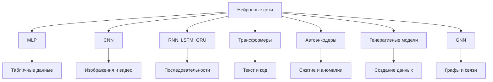

# Сферы применения нейронных сетей. Примеры. Виды нейронных сетей

## Основные понятия и определения

Нейронная сеть - это модель машинного обучения, состоящая из связанных искусственных нейронов. Она получает входные данные, преобразует их в слоях и выдает ответ: класс, число, текст, изображение, рекомендацию или управляющее действие. В отличие от алгоритма с явно заданными правилами, нейронная сеть подбирает правила поведения по примерам.

Искусственный нейрон имеет обучаемые параметры: веса и смещение. Слои между входом и выходом называют скрытыми. Если скрытых слоев много, сеть называют глубокой, а соответствующий подход - глубоким обучением. Обучение сети означает настройку параметров так, чтобы предсказания были ближе к правильным ответам.

Данные делят на обучающую, валидационную и тестовую выборки. Обучающая часть нужна для изменения весов, валидационная - для подбора настроек и контроля переобучения, тестовая - для итоговой проверки. Переобучение возникает, когда модель запоминает обучающие примеры, но плохо работает на новых данных. Регуляризация - набор методов, уменьшающих этот риск.

Нейронные сети применяют там, где зависимость между входом и ответом сложна для ручного описания, но есть данные: в компьютерном зрении, обработке речи и текста, медицине, финансах, промышленности, рекомендациях, робототехнике и генерации контента.

## Теория, формулы и интуиция

Один нейрон вычисляется по формуле:

$$
z=\sum_{i=1}^{n}w_i x_i+b,\qquad y=\varphi(z),
$$

где \(x_i\) - признаки, \(w_i\) - веса, \(b\) - смещение, \(\varphi\) - функция активации. Активация нужна для нелинейности: без нее вся многослойная сеть была бы эквивалентна одному линейному преобразованию. Часто используют ReLU, sigmoid, tanh, GELU и softmax.

Многослойная сеть является композицией функций:

$$
\hat{y}=f(x;\theta)=f_L(f_{L-1}(\ldots f_1(x))),
$$

где \(\theta\) - все параметры. Интуитивно каждый слой строит более удобное представление данных. В изображениях ранние слои находят края и текстуры, поздние - части объектов и целые объекты. В текстах первые представления связаны с токенами, а глубокие слои учитывают контекст.

Для обучения задают функцию потерь. В регрессии часто используют среднеквадратичную ошибку:

$$
L=\frac{1}{m}\sum_{j=1}^{m}(\hat{y}_j-y_j)^2.
$$

В классификации применяют кросс-энтропию:

$$
L=-\sum_{k=1}^{K}y_k\log \hat{p}_k.
$$

Параметры обновляются градиентным спуском или его вариантами:

$$
\theta_{t+1}=\theta_t-\eta\nabla_\theta L(\theta_t),
$$

где \(\eta\) - скорость обучения. Градиенты вычисляются обратным распространением ошибки: сначала сеть делает прямой проход, затем ошибка проходит назад по слоям, и для каждого веса определяется полезное направление изменения.

Основные виды нейронных сетей:

- MLP, или полносвязные сети, применяются для табличных данных, регрессии и простой классификации.
- CNN, или сверточные сети, подходят для изображений, видео и медицинских снимков.
- RNN, LSTM и GRU обрабатывают последовательности и временные ряды.
- Трансформеры используют механизм внимания и применяются для текста, кода, перевода, поиска и мультимодальных задач.
- Автоэнкодеры сжимают и восстанавливают данные, поэтому полезны для снижения размерности, шумоподавления и поиска аномалий.
- Генеративные модели, включая GAN и диффузионные модели, создают новые изображения, тексты, звуки или синтетические данные.
- GNN, или графовые нейронные сети, анализируют вершины и ребра: социальные связи, молекулы, маршруты, рекомендации.

Также нейронные сети различают по режиму обучения. В обучении с учителем каждому объекту соответствует правильный ответ, например метка класса или численное значение. В обучении без учителя модель ищет структуру данных сама: группы похожих объектов, скрытые признаки, аномалии. В обучении с подкреплением агент выбирает действия в среде и получает награду или штраф; такой подход применяют в играх, робототехнике и управлении.

## Методы, алгоритмы и этапы решения

Сначала формулируют задачу: какие данные подаются на вход, какой ответ нужен и какой метрикой измеряется качество. Для классификации используют accuracy, precision, recall, F1-меру, ROC-AUC; для регрессии - MAE, MSE, RMSE. Метрика выбирается по смыслу задачи: в диагностике важна полнота, а в рекомендациях - релевантность выдачи.

Затем готовят данные. Числовые признаки нормализуют, категориальные кодируют, пропуски обрабатывают. Изображения приводят к одному размеру, нормализуют и иногда дополняют аугментациями: поворотами, отражениями, обрезками. Тексты токенизируют. Для временных рядов формируют окна наблюдений и не допускают попадания будущей информации в признаки.

После этого выбирают архитектуру. Для таблиц используют MLP или классические модели. Для изображений - CNN или vision transformer. Для текста и кода - трансформеры. Для временных рядов - RNN, LSTM, GRU, temporal convolution или трансформеры рядов. Для объектов со связями - GNN.

Далее задают функцию потерь, оптимизатор и режим обучения. В бинарной классификации типична связка sigmoid и binary cross-entropy, в многоклассовой - softmax и кросс-энтропия, в регрессии - линейный выход и MSE или MAE. Обучение идет по батчам несколько эпох, качество проверяется на валидационной выборке.

Если сеть переобучается, используют dropout, L2-регуляризацию, early stopping, аугментацию данных, batch normalization или layer normalization. Часто применяют перенос обучения: берут заранее обученную модель и дообучают ее на своей задаче. После обучения модель тестируют, анализируют ошибки и внедряют. В эксплуатации важны скорость ответа, стоимость вычислений, интерпретируемость, защита данных и мониторинг качества.

Перед внедрением также проверяют устойчивость модели к шуму, редким случаям и изменению распределения данных. Это важно, потому что хорошая оценка на тестовой выборке не всегда гарантирует надежную работу в реальной среде.

Отдельно оценивают ошибки модели. Важно смотреть не только среднюю метрику, но и примеры неправильных ответов: какие классы путаются, какие входы слишком шумные, где не хватает данных. Такой анализ помогает улучшить разметку, добавить признаки, изменить архитектуру или собрать новые примеры.

## Практические примеры

В компьютерном зрении CNN и трансформеры распознают объекты, лица, дефекты и области на изображении. На производстве модель может находить трещины, сколы и царапины деталей. В медицине нейронные сети анализируют рентген, КТ, МРТ и снимки глазного дна, помогая врачу быстрее заметить подозрительные зоны.

В обработке естественного языка трансформеры применяются для перевода, суммаризации, поиска по смыслу, классификации обращений и генерации текста. Например, служба поддержки может определить тему заявки: оплата, доставка, возврат или техническая ошибка, а затем предложить оператору подходящую статью из базы знаний.

В распознавании речи сеть преобразует аудио в текст. Это используется в голосовых ассистентах, субтитрах, диктовке и расшифровке звонков. В синтезе речи модель решает обратную задачу: строит звучание по тексту с учетом пауз, ударений и интонации.

В рекомендательных системах сети прогнозируют, какие товары, фильмы, статьи или треки будут интересны пользователю. Они учитывают историю действий, свойства объектов, похожесть пользователей и контекст. Графовые сети дополнительно используют связи между пользователями, товарами и событиями.

В финансах модели оценивают кредитный риск, выявляют мошенничество и анализируют поведение клиентов. Подозрительная транзакция может быть найдена по необычному сочетанию суммы, места, времени и прошлых операций. В промышленности нейронные сети прогнозируют отказ оборудования по данным датчиков температуры, вибрации, давления и тока.

В транспорте и робототехнике нейронные сети помогают распознавать дорожные знаки, пешеходов, препятствия, положение объектов и команды оператора. В беспилотных системах они обрабатывают данные камер, радаров и лидаров, а в складской робототехнике помогают выбрать объект и спланировать захват.

В генеративных задачах модели создают изображения, музыку, тексты, программный код и синтетические данные. Диффузионные модели превращают шум в изображение по описанию, а языковые модели помогают работать с документами и программами. Такие системы полезны в дизайне, образовании, аналитике и разработке, но требуют проверки фактов, качества, авторских прав и безопасности результата.

Итак, нейронные сети особенно полезны там, где есть данные и трудно вручную описать правила. Вид сети выбирают по типу входа: изображения требуют пространственной обработки, текст и речь - учета контекста, временные ряды - анализа динамики, графы - работы со связями, а генеративные задачи - моделирования распределения данных.
