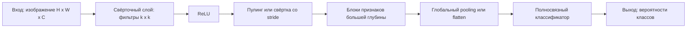

# Свёрточные нейронные сети

## Основные понятия и определения

Свёрточная нейронная сеть (Convolutional Neural Network, CNN) - это класс нейронных сетей, особенно хорошо подходящий для данных с пространственной или временной структурой: изображений, видеопотоков, спектрограмм, медицинских снимков, временных рядов. Главная идея CNN состоит в том, что признаки в таких данных имеют локальный характер. Например, на изображении сначала полезно находить простые элементы: границы, углы, перепады яркости, цветовые пятна. Затем из них можно собирать более сложные признаки: текстуры, части объектов, целые объекты.

Обычная полносвязная сеть рассматривает вход как длинный вектор и связывает каждый входной признак с каждым нейроном следующего слоя. Для изображения это неэффективно: теряется явная геометрия пикселей, а число параметров быстро становится огромным. CNN использует свёрточные слои, которые применяют небольшие обучаемые фильтры к локальным областям входа. Один и тот же фильтр проходит по всему изображению, поэтому сеть может распознавать один и тот же признак в разных местах.

Основные элементы CNN:

- Входной тензор - обычно изображение размера \(H \times W \times C\), где \(H\) - высота, \(W\) - ширина, \(C\) - число каналов. Для RGB-изображения \(C = 3\).
- Ядро, или фильтр, - небольшая матрица весов, например \(3 \times 3\) или \(5 \times 5\), которая скользит по входу и вычисляет локальные отклики.
- Карта признаков - результат применения одного фильтра ко всем допустимым позициям входа. Если фильтров много, получается несколько карт признаков.
- Шаг (stride) - величина сдвига фильтра при движении по изображению. Шаг 1 сохраняет больше пространственной детализации, шаг 2 уменьшает размер выходной карты.
- Дополнение (padding) - добавление рамки, часто из нулей, вокруг входа. Оно позволяет контролировать размер выхода и учитывать пиксели на границах.
- Пулинг (pooling) - операция уменьшения пространственного размера карты признаков, например max pooling или average pooling.
- Функция активации - нелинейное преобразование, чаще всего ReLU: \(\mathrm{ReLU}(x) = \max(0, x)\).
- Полносвязная часть - завершающие слои, которые используют извлечённые признаки для классификации, регрессии или другой целевой задачи.

CNN можно рассматривать как систему автоматического извлечения признаков. В классическом компьютерном зрении признаки часто проектировались вручную: контуры, дескрипторы углов, гистограммы градиентов. В CNN фильтры обучаются по данным вместе с остальными параметрами модели.

## Теория/формулы/интуиция

Дискретная двумерная свёртка для одного канала может быть записана так:

$$
Y_{i,j} = \sum_{u=0}^{k_h-1}\sum_{v=0}^{k_w-1} X_{i+u,j+v}K_{u,v} + b,
$$

где \(X\) - входная матрица, \(K\) - ядро размера \(k_h \times k_w\), \(b\) - смещение, \(Y_{i,j}\) - значение выходной карты признаков в позиции \((i,j)\). На практике в библиотеках глубокого обучения часто используется не математическая свёртка с переворотом ядра, а кросс-корреляция, но в контексте CNN её обычно тоже называют свёрткой.

Для изображения с несколькими каналами фильтр имеет размер \(k_h \times k_w \times C\). Тогда отклик вычисляется суммированием по высоте, ширине и каналам:

$$
Y_{i,j,m} =
\sum_{c=1}^{C}\sum_{u=0}^{k_h-1}\sum_{v=0}^{k_w-1}
X_{i+u,j+v,c}K_{u,v,c,m} + b_m,
$$

где \(m\) - номер фильтра. Если в слое \(M\) фильтров, то выход будет иметь \(M\) каналов.

Размер выходной карты признаков по одной пространственной координате вычисляется формулой:

$$
O = \left\lfloor \frac{I + 2P - K}{S} \right\rfloor + 1,
$$

где \(I\) - размер входа, \(K\) - размер ядра, \(P\) - padding, \(S\) - stride. Например, при входе \(32 \times 32\), ядре \(3 \times 3\), padding 1 и stride 1 выход остаётся \(32 \times 32\). Это удобно, когда нужно сохранить пространственное разрешение.

Ключевые свойства CNN:

- Локальная связность. Нейрон свёрточного слоя смотрит не на весь вход, а на небольшое рецептивное поле. Это соответствует природе изображений: соседние пиксели обычно связаны сильнее, чем далёкие.
- Разделение весов. Один фильтр используется во всех позициях изображения. Благодаря этому число параметров резко уменьшается, а сеть получает свойство эквивариантности к сдвигу: если объект немного сдвинулся, карта признаков тоже сдвинется.
- Иерархия признаков. Ранние слои находят простые паттерны, средние слои комбинируют их в части объектов, глубокие слои кодируют более абстрактные признаки.

Интуитивно фильтр можно понимать как маленький шаблон. Если участок изображения похож на шаблон, отклик фильтра будет большим. Например, один фильтр может реагировать на вертикальные границы, другой - на горизонтальные, третий - на цветовой переход. В процессе обучения сеть сама подбирает такие фильтры, чтобы минимизировать функцию потерь.

После свёртки обычно применяют нелинейность. Без нелинейных функций несколько свёрточных слоёв свелись бы к одному линейному преобразованию, и сеть не смогла бы описывать сложные зависимости. ReLU проста, вычислительно дешева и помогает уменьшать проблему затухающих градиентов.

Пулинг уменьшает размер карт признаков и делает представление менее чувствительным к малым сдвигам. Max pooling выбирает максимум в локальном окне, например \(2 \times 2\), и тем самым сохраняет наиболее сильный отклик признака. Average pooling берёт среднее значение и работает более сглаживающе. В современных архитектурах иногда вместо пулинга используют свёртки со stride больше 1, потому что они тоже уменьшают разрешение, но остаются обучаемыми.

Обучение CNN выполняется методом обратного распространения ошибки. Сначала выполняется прямой проход: вход проходит через свёртки, активации, нормализацию, пулинг и классификатор. Затем считается функция потерь, например кросс-энтропия для классификации:

$$
L = -\sum_{r=1}^{R} y_r \log \hat{y}_r,
$$

где \(R\) - число классов, \(y_r\) - истинная метка в one-hot представлении, \(\hat{y}_r\) - предсказанная вероятность класса. После этого градиенты по весам фильтров вычисляются автоматически и параметры обновляются оптимизатором, например SGD, Adam или AdamW.

## Методы/алгоритмы или этапы решения

Типовая работа с CNN начинается с постановки задачи. Нужно определить входные данные, целевую переменную и метрику качества. Для классификации изображений это могут быть accuracy, precision, recall, F1-мера или ROC-AUC. Для сегментации используют IoU и Dice coefficient. Для детекции объектов важна mAP.

Следующий этап - подготовка данных. Изображения приводят к единому размеру, нормализуют значения пикселей, разбивают выборку на обучающую, валидационную и тестовую части. Часто применяют аугментации: случайные повороты, отражения, обрезки, изменение яркости и контраста. Аугментации расширяют эффективное разнообразие обучающих данных и помогают модели не переобучаться на конкретные положения и условия съёмки.

Затем выбирают архитектуру. Для простой задачи может хватить небольшой сети вида:

1. Свёртка \(3 \times 3\), ReLU.
2. Свёртка \(3 \times 3\), ReLU.
3. Max pooling.
4. Несколько аналогичных блоков с увеличением числа каналов.
5. Global average pooling или flatten.
6. Полносвязный слой и softmax.

Для более сложных задач часто используют готовые архитектуры: LeNet, AlexNet, VGG, Inception, ResNet, DenseNet, EfficientNet. Важная идея ResNet - остаточные связи. Вместо того чтобы обучать преобразование \(H(x)\), блок обучает добавку \(F(x)\), а выход имеет вид:

$$
y = F(x) + x.
$$

Такие связи облегчают обучение глубоких сетей, потому что градиент может проходить через короткие пути. Это снижает риск деградации качества при увеличении глубины.

После выбора архитектуры задают функцию потерь, оптимизатор, learning rate, batch size и число эпох. На каждой эпохе модель получает мини-батчи изображений, делает предсказания, считает ошибку, распространяет градиенты назад и обновляет веса. Валидационная выборка используется для контроля качества на данных, не участвующих в обновлении параметров.

Для борьбы с переобучением применяют регуляризацию. Распространённые методы: увеличение данных через аугментации, dropout в полносвязной части, weight decay, batch normalization, ранняя остановка по валидационной метрике. Batch normalization нормализует распределение активаций внутри мини-батча и обычно ускоряет обучение, делая его стабильнее.

Отдельный практический метод - transfer learning. Если данных мало, не всегда разумно обучать CNN с нуля. Можно взять модель, предварительно обученную на большом наборе изображений, например ImageNet, заменить последнюю классификационную голову под свои классы и дообучить модель. Часто сначала замораживают ранние слои, потому что они кодируют универсальные признаки вроде границ и текстур, а затем при необходимости размораживают часть сети для тонкой настройки.

При анализе обученной CNN полезно смотреть не только на итоговую метрику, но и на ошибки. Матрица ошибок показывает, какие классы сеть путает. Визуализации активаций и методы вроде Grad-CAM помогают понять, на какие области изображения модель опирается при решении. Это особенно важно в медицине, промышленной диагностике и других областях, где требуется интерпретируемость.

## Практические примеры

Классический пример - распознавание рукописных цифр MNIST. Входом является серое изображение \(28 \times 28 \times 1\), а выходом - один из десяти классов. Даже небольшая CNN с двумя свёрточными слоями обычно показывает высокое качество, потому что форма цифр хорошо описывается локальными признаками: дугами, пересечениями, наклонами и замкнутыми контурами.

В задаче классификации фотографий товаров интернет-магазина CNN может определять категорию: обувь, сумка, куртка, часы. Ранние слои находят края и текстуры, средние - элементы вроде подошвы, ремешка или рукава, глубокие - общий образ товара. На практике здесь полезны аугментации, потому что товар может быть снят под разными углами и при разном освещении.

В медицине CNN применяют для анализа рентгеновских снимков, МРТ и КТ. Например, сеть может классифицировать снимок как нормальный или содержащий патологию, а в задаче сегментации - выделять область опухоли или повреждения. В таких задачах важно тщательно валидировать модель, контролировать смещение данных и проверять, не учится ли сеть на посторонних признаках, например на метках оборудования или особенностях конкретной клиники.

В промышленности CNN используют для визуального контроля качества. Камера снимает детали на конвейере, а модель определяет наличие трещин, царапин, деформаций или неправильной сборки. Преимущество CNN здесь в том, что дефекты часто локальны и могут иметь разные положения на изображении. Свёрточные фильтры позволяют искать один и тот же визуальный паттерн по всей поверхности детали.

CNN применяются не только к изображениям. В обработке речи спектрограмму можно рассматривать как двумерное изображение, где одна ось соответствует времени, другая - частоте. Свёрточная сеть выделяет локальные паттерны в частотно-временной области. В анализе временных рядов одномерные свёртки помогают находить короткие характерные фрагменты сигнала, например всплески нагрузки, аномалии датчиков или повторяющиеся паттерны поведения пользователя.

Итак, свёрточные нейронные сети эффективны там, где данные имеют локальную структуру и полезно искать одинаковые признаки в разных позициях. Их сила основана на локальных рецептивных полях, разделении весов, иерархическом извлечении признаков и обучении фильтров напрямую по целевой задаче. На практике качество CNN определяется не только архитектурой, но и подготовкой данных, регуляризацией, корректной валидацией и анализом ошибок.
