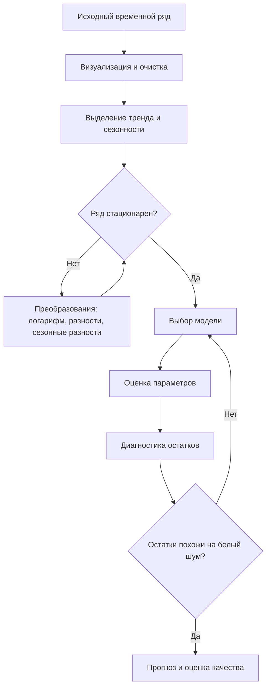

# 17. Постановка задачи анализа временных рядов. Основные методы решения

## Основные понятия и определения

Временной ряд -- это последовательность наблюдений некоторой величины, упорядоченная по времени: значения температуры по дням, курс валюты по минутам, объем продаж по месяцам, нагрузка на сервер по секундам. Обычно временной ряд записывают как набор значений \(y_1, y_2, \ldots, y_T\), где индекс \(t\) соответствует моменту времени. Главное отличие временного ряда от обычной выборки состоит в том, что наблюдения часто зависимы: значение сегодня связано со значениями вчера, неделю назад или год назад.

Задача анализа временных рядов состоит в том, чтобы описать структуру этих зависимостей, выделить закономерности, объяснить поведение процесса и, если нужно, построить прогноз будущих значений. В зависимости от цели анализ может быть описательным, прогностическим, диагностическим или управляющим. Например, экономисту важно понять тренд инфляции, инженеру -- обнаружить аномалию в датчике, менеджеру -- спрогнозировать спрос, а системе автоматического управления -- принять решение на основе текущего состояния процесса.

Ключевыми компонентами временного ряда считаются тренд, сезонность, цикличность и случайная составляющая. Тренд отражает долгосрочное направление изменения уровня ряда: рост, спад или плавную стабилизацию. Сезонность описывает регулярные повторения с известным периодом, например недельные колебания посещаемости сайта или годовую сезонность продаж. Цикличность похожа на сезонность, но ее период обычно менее строгий и может зависеть от экономических, социальных или технологических факторов. Остаток, или шум, содержит нерегулярные колебания, которые не объяснены выбранной моделью.

Важное понятие -- стационарность. Ряд называют стационарным в широком смысле, если его математическое ожидание постоянно, дисперсия конечна и постоянна, а ковариация между \(y_t\) и \(y_{t-k}\) зависит только от лага \(k\), но не от самого времени \(t\). Многие классические методы, особенно ARMA/ARIMA-подходы, удобнее применять к стационарным рядам. Если ряд нестационарен из-за тренда или меняющейся дисперсии, его часто преобразуют: берут разности, логарифмы, сезонные разности или удаляют тренд.

Еще одно базовое понятие -- лаг. Лаг \(k\) означает сдвиг ряда на \(k\) моментов назад. Автокорреляция показывает, насколько текущее значение связано с прошлыми значениями. Частная автокорреляция измеряет связь между \(y_t\) и \(y_{t-k}\) после учета промежуточных лагов. Эти характеристики помогают понять память процесса и выбрать порядок модели.

## Теория, формулы и интуиция

Один из простейших способов описания временного ряда -- разложение на компоненты. В аддитивной модели предполагается

\[
y_t = T_t + S_t + E_t,
\]

где \(T_t\) -- тренд, \(S_t\) -- сезонная компонента, \(E_t\) -- случайная ошибка. Такая запись удобна, когда амплитуда сезонных колебаний примерно постоянна. Если сезонные колебания растут вместе с уровнем ряда, используют мультипликативную модель

\[
y_t = T_t \cdot S_t \cdot E_t.
\]

После логарифмирования мультипликативная модель часто превращается в аддитивную, потому что произведение становится суммой.

Интуитивно анализ временного ряда можно представить как попытку отделить закономерность от случайности. Если ряд растет, нужно понять, является ли рост устойчивым трендом или случайным всплеском. Если значения повторяются каждую неделю, нужно учесть сезонный эффект, иначе прогноз будет систематически ошибаться. Если остатки после модели все еще автокоррелированы, значит модель не извлекла всю временную структуру.

В классической вероятностной постановке временной ряд рассматривается как реализация случайного процесса. Для модели авторегрессии порядка \(p\), обозначаемой AR(\(p\)), текущее значение зависит от \(p\) предыдущих значений:

\[
y_t = c + \varphi_1 y_{t-1} + \varphi_2 y_{t-2} + \ldots + \varphi_p y_{t-p} + \varepsilon_t.
\]

Здесь \(c\) -- константа, \(\varphi_i\) -- параметры, \(\varepsilon_t\) -- белый шум, то есть случайная ошибка с нулевым средним, постоянной дисперсией и отсутствием автокорреляции.

В модели скользящего среднего MA(\(q\)) текущее значение зависит не от прошлых значений самого ряда, а от прошлых ошибок:

\[
y_t = \mu + \varepsilon_t + \theta_1 \varepsilon_{t-1} + \ldots + \theta_q \varepsilon_{t-q}.
\]

Комбинация этих идей дает ARMA(\(p,q\)). Если исходный ряд нестационарен, но становится стационарным после взятия \(d\) разностей, используют ARIMA(\(p,d,q\)). Разность первого порядка задается формулой

\[
\Delta y_t = y_t - y_{t-1}.
\]

Для сезонных рядов применяют SARIMA, где добавляются сезонные авторегрессионные, разностные и скользящие компоненты.

Качество прогноза обычно оценивают на отложенном временном участке, потому что перемешивать наблюдения при проверке временных рядов нельзя: модель должна обучаться на прошлом и проверяться на будущем. Часто используют метрики MAE, MSE, RMSE и MAPE:

\[
MAE = \frac{1}{n}\sum_{t=1}^{n}|y_t - \hat{y}_t|,
\quad
RMSE = \sqrt{\frac{1}{n}\sum_{t=1}^{n}(y_t - \hat{y}_t)^2}.
\]

MAE легче интерпретировать в исходных единицах, RMSE сильнее штрафует крупные ошибки, а MAPE показывает относительную ошибку в процентах, но плохо работает при нулевых или очень малых фактических значениях.

Общая логика анализа временных рядов может быть представлена так:

## Методы, алгоритмы и этапы решения

Первый этап анализа -- постановка задачи. Нужно определить, что именно требуется: прогноз на несколько шагов вперед, обнаружение аномалий, классификация рядов, оценка влияния внешних факторов или сглаживание шума. Важно уточнить горизонт прогноза, допустимую ошибку, частоту наблюдений, наличие пропусков и возможность использовать дополнительные признаки. Например, прогноз продаж на один день и прогноз на год требуют разных моделей и разных допущений.

Второй этап -- предварительный анализ данных. Строят график ряда, проверяют пропуски, выбросы, смену режима, резкие разрывы, изменение частоты наблюдений. Пропуски можно заполнять интерполяцией, средними значениями по сезону, модельными прогнозами или оставить специальными признаками, если выбранный алгоритм умеет с ними работать. Выбросы не всегда являются ошибками: для финансового рынка скачок цены может быть важным событием, а для датчика температуры одиночное невозможное значение может быть техническим сбоем.

Третий этап -- анализ структуры. Здесь оценивают тренд, сезонность, автокорреляционную функцию ACF и частную автокорреляционную функцию PACF. Для проверки стационарности применяют тесты, например Дики-Фуллера или KPSS. Если ряд нестационарен, используют преобразования. Логарифм стабилизирует относительные колебания, разности удаляют тренд, сезонные разности помогают убрать регулярный сезонный уровень.

К простым базовым методам относятся наивный прогноз, среднее, скользящее среднее и экспоненциальное сглаживание. Наивный прогноз полагает, что будущее значение равно последнему наблюдению: \(\hat{y}_{t+1}=y_t\). Несмотря на простоту, это сильная базовая линия для многих финансовых и слабо предсказуемых рядов. Скользящее среднее сглаживает локальные колебания, но запаздывает при резкой смене тренда. Экспоненциальное сглаживание присваивает недавним наблюдениям больший вес. В простой форме оно задается как

\[
\hat{y}_{t+1} = \alpha y_t + (1-\alpha)\hat{y}_t,
\]

где \(0<\alpha<1\). Чем больше \(\alpha\), тем быстрее модель реагирует на новые данные. Метод Хольта добавляет тренд, а метод Хольта-Уинтерса учитывает и тренд, и сезонность.

Классические статистические методы включают AR, MA, ARMA, ARIMA и SARIMA. Их преимущество -- интерпретируемость и строгая теория. Они хорошо работают на сравнительно коротких рядах с понятной автокорреляционной структурой. Подбор параметров можно выполнять по графикам ACF/PACF, информационным критериям AIC/BIC или перебором на валидационном участке. После обучения обязательно проверяют остатки: если в них сохраняется автокорреляция, модель недоописала структуру ряда.

Если на ряд влияют внешние переменные, используют регрессионные модели с временными признаками или ARIMAX/SARIMAX. Например, спрос на товар может зависеть не только от прошлых продаж, но и от цены, праздников, рекламных кампаний, погоды и дня недели. В машинном обучении временной ряд часто превращают в табличную задачу: создают лаговые признаки \(y_{t-1}, y_{t-2}\), агрегаты по окнам, календарные признаки, индикаторы праздников и затем обучают линейную регрессию, деревья решений, случайный лес, градиентный бустинг или нейронную сеть. Важно соблюдать временную схему проверки, иначе возникает утечка информации из будущего.

Для сложных и длинных рядов применяют нейросетевые методы: рекуррентные сети, LSTM, GRU, Temporal Convolutional Networks и трансформеры для временных рядов. Они способны учитывать нелинейные зависимости и множество входных признаков, но требуют больше данных, аккуратной регуляризации и серьезной настройки. В практических задачах они не всегда превосходят хорошо построенные статистические модели или градиентный бустинг с качественными признаками.

Отдельная группа методов связана с обнаружением аномалий. Подходы бывают статистическими, например контрольные карты и анализ остатков, и алгоритмическими, например Isolation Forest, One-Class SVM или автоэнкодеры. Часто аномалией считают не само большое значение, а большое отклонение от ожидаемого поведения с учетом тренда и сезонности. Так, высокий объем заказов в декабре может быть нормой, а тот же объем в обычный день -- сигналом необычного события.

Итоговый алгоритм решения обычно выглядит так: сформулировать цель, собрать и упорядочить данные, очистить ряд, построить графики, выделить сезонность и тренд, выбрать базовую модель, затем более сложные модели, проверить качество на будущем интервале, проанализировать остатки, выбрать модель по метрикам и устойчивости, после чего внедрить прогноз или выводы в прикладной процесс. Для реальной эксплуатации также нужны мониторинг качества и регулярное переобучение, потому что структура временного ряда может меняться.

## Практические примеры

Первый пример -- прогноз месячных продаж магазина. Значение \(y_t\) -- выручка за месяц. На графике видно, что продажи растут и резко увеличиваются в декабре. Здесь есть тренд и годовая сезонность, поэтому простое среднее будет давать плохой прогноз. Подходящими базовыми методами будут Хольт-Уинтерс или SARIMA с сезонным периодом 12. Если известны скидки, рекламные акции и праздники, можно добавить внешние признаки и использовать SARIMAX или градиентный бустинг. Проверять модель нужно на последних месяцах, например обучиться на данных за несколько лет и оценить прогноз на последнем году.

Второй пример -- мониторинг нагрузки на сервер. Данные приходят каждую минуту: число запросов, время ответа, загрузка процессора. Здесь часто есть суточная и недельная сезонность: днем нагрузка выше, ночью ниже, в рабочие дни поведение отличается от выходных. Для прогноза можно использовать сезонное сглаживание или модель с календарными признаками. Для аномалий удобно строить ожидаемый диапазон значений: если фактическая нагрузка сильно выше прогноза и остаток выходит за допустимые границы, система подает сигнал.

Третий пример -- анализ курса валюты. Такой ряд часто не имеет устойчивого прогнозируемого тренда на коротком горизонте, а его изменения ближе к случайному процессу. Наивная модель, где завтрашний курс равен сегодняшнему, может оказаться сильной базовой линией. Вместо прогнозирования самого курса иногда анализируют доходности \(r_t = \log(y_t/y_{t-1})\), потому что они ближе к стационарным. Для оценки риска используют модели волатильности, например ARCH/GARCH, которые описывают не среднее значение ряда, а изменчивость.

Четвертый пример -- временной ряд температуры воздуха. В нем выражена годовая сезонность, но также есть шум и локальные погодные колебания. Если нужно восстановить пропущенные значения, можно использовать интерполяцию и сезонные средние. Если нужно прогнозировать температуру на несколько дней, одного исторического ряда мало: потребуются метеорологические признаки. Этот пример показывает, что временной ряд не всегда сам по себе содержит всю информацию, необходимую для качественного прогноза.

Таким образом, анализ временных рядов объединяет статистическое описание, вероятностное моделирование, машинное обучение и предметную интерпретацию. Главная идея состоит в том, чтобы учитывать порядок наблюдений во времени, отделять регулярные компоненты от случайных колебаний и проверять модель так, как она будет использоваться на практике: прошлое объясняет будущее, а не наоборот.
