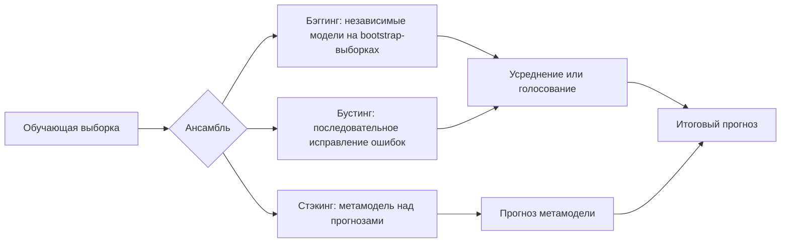

# Ансамбли моделей. Основные понятия: бэггинг, бустинг, стэкинг. Примеры алгоритмов

## Основные понятия и определения

Ансамбль моделей в машинном обучении - это метод построения прогноза, при котором итоговое решение получается не одной моделью, а комбинацией нескольких базовых моделей. Идея ансамблирования основана на том, что разные модели могут ошибаться по-разному: одна модель хорошо описывает одни области пространства признаков, другая - другие, третья может быть устойчива к шуму. Если правильно объединить их ответы, можно получить более точный и устойчивый алгоритм, чем любой отдельный участник ансамбля.

Базовую модель ансамбля часто называют слабым или базовым учеником. Слово "слабый" не всегда означает плохую модель: в бустинге слабым учеником обычно называют алгоритм, который лишь немного лучше случайного угадывания, например неглубокое дерево решений. В бэггинге и стэкинге базовые модели могут быть достаточно сильными: деревья, линейные модели, нейронные сети, SVM, kNN и другие методы.

Главные способы объединения прогнозов - усреднение, голосование и обучение метамодели. Для задачи регрессии часто используют среднее:

$$
\hat{y}(x)=\frac{1}{M}\sum_{m=1}^{M} f_m(x),
$$

где \(M\) - число моделей в ансамбле, \(f_m(x)\) - прогноз \(m\)-й модели. Для классификации применяется голосование по классам:

$$
\hat{y}(x)=\arg\max_k \sum_{m=1}^{M} I(f_m(x)=k),
$$

или усреднение вероятностей классов:

$$
\hat{p}(y=k \mid x)=\frac{1}{M}\sum_{m=1}^{M} p_m(y=k \mid x).
$$

Три классические группы ансамблевых методов - бэггинг, бустинг и стэкинг. Бэггинг обучает базовые модели независимо на разных выборках и затем усредняет их ответы. Бустинг строит модели последовательно: каждая следующая модель уделяет больше внимания ошибкам предыдущих. Стэкинг обучает несколько моделей первого уровня, а затем отдельную модель второго уровня, которая учится объединять их прогнозы.

## Теория, формулы и интуиция

Качество модели удобно рассматривать через разложение ошибки на смещение, разброс и шум. В регрессии для квадратичной функции потерь математически это записывают как:

$$
E[(y-\hat{f}(x))^2] = Bias^2[\hat{f}(x)] + Var[\hat{f}(x)] + \sigma^2,
$$

где смещение показывает, насколько в среднем модель далека от истинной зависимости, разброс показывает чувствительность модели к обучающей выборке, а \(\sigma^2\) - неустранимый шум данных. Ансамбли полезны потому, что позволяют управлять смещением и разбросом.

Бэггинг прежде всего снижает разброс. Если обучить несколько нестабильных моделей, например глубоких деревьев решений, на немного разных выборках и усреднить их ответы, случайные колебания отдельных деревьев частично компенсируются. Для независимых моделей с одинаковой дисперсией \(\sigma^2\) дисперсия среднего равна \(\sigma^2/M\). На практике модели не независимы, поэтому более точная формула учитывает корреляцию \(\rho\):

$$
Var\left(\frac{1}{M}\sum_{m=1}^{M} f_m(x)\right)
= \rho\sigma^2 + \frac{1-\rho}{M}\sigma^2.
$$

Из этой формулы видно, что простое увеличение числа моделей не решает проблему полностью, если они слишком похожи. Поэтому в случайном лесе используют не только bootstrap-выборки объектов, но и случайный выбор признаков при построении разбиений в деревьях: это уменьшает корреляцию между деревьями.

Бустинг работает иначе. Его цель - постепенно построить сильную модель как сумму более простых моделей:

$$
F_M(x)=\sum_{m=1}^{M} \alpha_m h_m(x),
$$

где \(h_m(x)\) - базовый алгоритм, а \(\alpha_m\) - вес его вклада. Интуитивно бустинг похож на последовательное уточнение ответа: первая модель строит грубое приближение, вторая исправляет ее ошибки, третья исправляет ошибки уже составной модели и так далее. В градиентном бустинге это формализуется как оптимизация функции потерь. На шаге \(m\) новая модель обучается приближать антиградиент функции потерь по текущим предсказаниям:

$$
r_i^{(m)} = - \left[\frac{\partial L(y_i, F(x_i))}{\partial F(x_i)}\right]_{F=F_{m-1}}.
$$

После этого добавляется новая компонента:

$$
F_m(x)=F_{m-1}(x)+\eta \gamma_m h_m(x),
$$

где \(\eta\) - скорость обучения, а \(\gamma_m\) - коэффициент, найденный минимизацией потерь. Малое значение \(\eta\) делает обучение более осторожным: обычно нужно больше деревьев, но модель лучше обобщает.

Стэкинг не ограничивается усреднением или последовательным исправлением. Он строит новую обучающую выборку, где признаками являются прогнозы базовых моделей. Например, если есть логистическая регрессия, дерево решений и градиентный бустинг, то для каждого объекта можно получить три прогноза или три набора вероятностей классов. Метамодель, например линейная регрессия или логистическая регрессия, учится определять, каким базовым прогнозам больше доверять в разных ситуациях. Важное условие стэкинга - метамодель должна обучаться на прогнозах, полученных без утечки целевой переменной. Поэтому обычно используют out-of-fold прогнозы: базовые модели обучаются на части фолдов, а предсказывают на отложенном фолде.

Сильная сторона ансамблей связана с разнообразием ошибок. Если все модели делают одинаковые ошибки, их объединение почти ничего не дает. Поэтому полезны разные источники разнообразия: разные подвыборки объектов, разные подмножества признаков, разные гиперпараметры, разные семейства моделей, разные функции потерь. Однако ансамбль не является гарантией качества. Он может переобучиться, стать слишком сложным, потерять интерпретируемость и потребовать значительно больше вычислительных ресурсов.

## Методы, алгоритмы и этапы решения

Бэггинг, или bootstrap aggregating, строится по простой схеме. Сначала из исходной обучающей выборки много раз формируют bootstrap-выборки: каждая такая выборка имеет тот же размер, что и исходная, но объекты берутся с возвращением. Поэтому одни объекты могут попасть несколько раз, а другие не попасть вовсе. Затем на каждой bootstrap-выборке независимо обучается базовая модель. На этапе предсказания ответы моделей объединяются голосованием или усреднением.

Классический пример бэггинга - BaggingClassifier или BaggingRegressor с деревьями решений. Более известный частный случай - случайный лес. В случайном лесе каждое дерево обучается на bootstrap-выборке, а при поиске лучшего разбиения в узле рассматривает не все признаки, а случайное подмножество. Это делает деревья менее похожими и повышает качество усреднения. Случайный лес хорошо работает на табличных данных, устойчив к выбросам и нелинейностям, сравнительно мало требует масштабирования признаков, но может быть тяжелым по памяти и хуже экстраполировать в регрессии.

Для оценки качества в бэггинге можно использовать out-of-bag оценку. Так как примерно треть объектов не попадает в конкретную bootstrap-выборку, для каждого объекта находятся модели, которые не видели его при обучении. Их прогнозы можно использовать как внутреннюю валидацию без отдельного отложенного набора. Это особенно удобно для случайного леса.

Бустинг имеет несколько важных разновидностей. AdaBoost - один из ранних алгоритмов бустинга. В классификации он обучает слабые классификаторы последовательно и изменяет веса объектов: неверно классифицированные объекты получают больший вес, поэтому следующая модель фокусируется на них. Вес самой модели зависит от ее ошибки:

$$
\alpha_m = \frac{1}{2}\ln\frac{1-\varepsilon_m}{\varepsilon_m},
$$

где \(\varepsilon_m\) - взвешенная ошибка слабого классификатора. Итоговый ответ получается взвешенным голосованием.

Градиентный бустинг обобщает идею AdaBoost на разные функции потерь. Вместо прямого изменения весов он обучает новую модель на остатках или псевдоостатках. Для квадратичной ошибки в регрессии псевдоостатки совпадают с обычными остатками:

$$
r_i = y_i - F_{m-1}(x_i).
$$

Популярные реализации градиентного бустинга - Gradient Boosting Machines, XGBoost, LightGBM и CatBoost. XGBoost известен регуляризацией, эффективной работой с разреженными признаками и контролем сложности деревьев. LightGBM использует эффективное построение деревьев и часто очень быстр на больших табличных данных. CatBoost хорошо работает с категориальными признаками, потому что имеет специальные методы кодирования категорий, уменьшающие утечку и переобучение.

Основные гиперпараметры бустинга - число деревьев, глубина деревьев, скорость обучения, минимальное число объектов в листьях, доля объектов и признаков для стохастического обучения, параметры регуляризации. Бустинг часто дает высокое качество, но более чувствителен к настройкам, шуму в данных и утечкам. При слишком большом числе деревьев и слабой регуляризации он может переобучиться, поэтому важны валидационная выборка и early stopping.

Стэкинг обычно строится в несколько этапов. Сначала выбирают несколько достаточно разных моделей первого уровня. Затем обучают их по кросс-валидационной схеме и получают out-of-fold прогнозы для обучающей выборки. Эти прогнозы становятся признаками для метамодели. После обучения метамодели базовые алгоритмы переобучают на всей обучающей выборке. Для нового объекта сначала получают прогнозы базовых моделей, затем передают их метамодели, которая выдает окончательный ответ.

Для классификации в качестве входа метамодели часто используют вероятности классов, а не жесткие метки. Это сохраняет больше информации: прогноз "класс 1 с вероятностью 0.51" и "класс 1 с вероятностью 0.99" имеют разную уверенность, хотя метка одна и та же. Для регрессии метамодель получает численные прогнозы базовых регрессоров. Часто хорошей метамоделью является простая линейная или логистическая регрессия: она снижает риск переобучения и интерпретируемо взвешивает базовые прогнозы.

Отдельно можно упомянуть blending - упрощенный вариант стэкинга. В нем часть обучающей выборки выделяется как holdout-набор. Базовые модели обучаются на основной части, предсказывают на holdout, а метамодель обучается на этих предсказаниях. Blending проще, но менее эффективно использует данные, чем кросс-валидационный стэкинг.

## Практические примеры

В задаче кредитного скоринга есть табличные данные: возраст клиента, доход, история платежей, наличие просрочек, тип занятости. Одиночное дерево решений может легко переобучиться: оно построит слишком специфические правила для отдельных групп клиентов. Случайный лес уменьшит этот риск, потому что много деревьев будут обучены на разных подвыборках и разных признаках. Итоговое голосование даст более стабильную оценку вероятности дефолта. Такой подход полезен, когда важны надежность и устойчивость к шуму.

В задаче предсказания цены квартиры градиентный бустинг часто оказывается сильнее случайного леса. Цена зависит от нелинейного сочетания площади, района, этажа, года постройки, расстояния до метро, состояния дома и рыночных факторов. Бустинг последовательно исправляет ошибки: первые деревья могут уловить общий вклад площади и района, следующие - поправки для этажности, типа дома и редких комбинаций признаков. CatBoost особенно удобен, если много категориальных признаков: район, серия дома, тип ремонта, застройщик.

В задаче классификации текстов можно применить стэкинг. Пусть первая модель - логистическая регрессия на TF-IDF признаках, вторая - градиентный бустинг на статистических признаках текста, третья - нейронная модель на эмбеддингах. Логистическая регрессия хорошо ловит ключевые слова, бустинг использует длину текста, частоты символов и другие агрегаты, нейронная модель учитывает семантическое сходство. Метамодель на вероятностях этих трех моделей может научиться, что для коротких текстов надежнее TF-IDF, а для перефразированных сообщений - эмбеддинги.

В медицинской диагностике ансамбли применяют осторожно, потому что важны интерпретируемость и контроль ошибок. Например, случайный лес может помочь при предварительной оценке риска заболевания по анализам и анамнезу, но врачам нужны объяснения: важность признаков, калибровка вероятностей, проверка на независимой выборке. Бустинг может дать высокую точность, но при плохой валидации легко выучит особенности конкретной клиники или прибора. Поэтому практическое применение ансамблей всегда требует строгого разделения train/test, анализа утечек и проверки стабильности.

В соревнованиях по машинному обучению ансамбли часто используются как финальный способ повысить качество. Участники обучают несколько сильных моделей с разными признаками, seed-значениями и архитектурами, затем усредняют вероятности или применяют стэкинг. Такой ансамбль может улучшить метрику на несколько десятых или сотых процента, что важно в соревновании. Но в промышленной системе цена усложнения может оказаться выше выигрыша: ансамбль труднее поддерживать, дольше обучать, сложнее обновлять и объяснять пользователям.

Практический выбор метода зависит от данных и требований. Если нужна устойчивая модель с минимальной настройкой, часто начинают со случайного леса или простого бэггинга. Если нужен максимум качества на табличных данных и есть возможность тщательно валидировать модель, обычно пробуют градиентный бустинг: XGBoost, LightGBM или CatBoost. Если уже есть несколько сильных и разнообразных моделей, имеет смысл применить стэкинг, но обязательно строить метапризнаки без утечки через кросс-валидацию. Общая идея остается одной: ансамбль выигрывает тогда, когда отдельные модели достаточно точны и при этом достаточно различны в своих ошибках.
