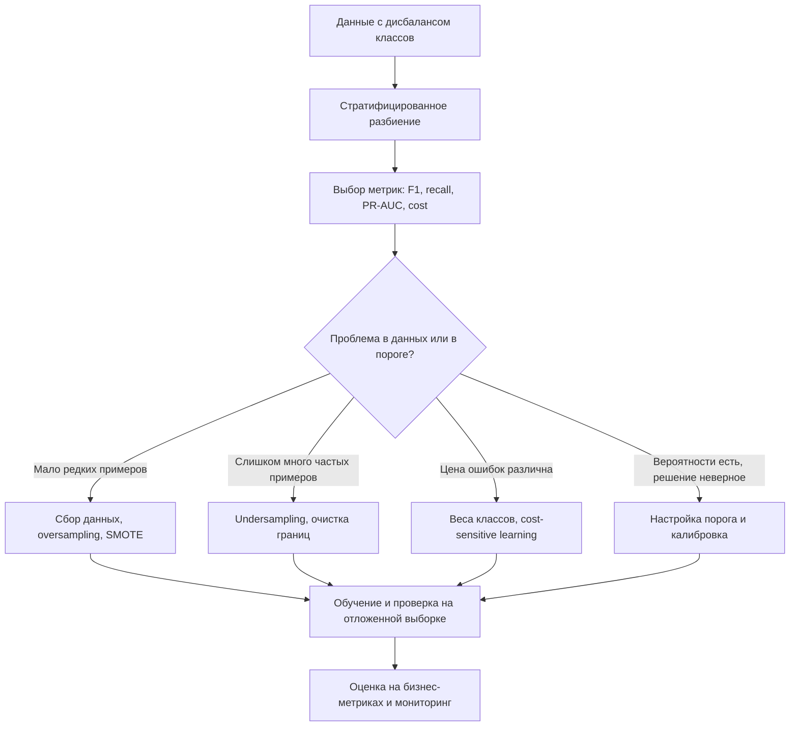

# Дисбаланс классов в задачах классификации. Причины возникновения проблем. Методы борьбы с дисбалансом

## Основные понятия и определения

Дисбаланс классов в задаче классификации - это ситуация, при которой объекты разных классов представлены в обучающей выборке существенно неравномерно. Например, в задаче выявления мошеннических транзакций нормальных операций может быть 99,9%, а мошеннических - 0,1%; в медицинской диагностике здоровых пациентов может быть намного больше, чем пациентов с редким заболеванием. Класс, объектов которого много, называют мажоритарным, а класс с малым числом объектов - миноритарным.

Важно отличать дисбаланс классов от простой малой выборки. Если оба класса представлены примерно одинаково, но данных мало, проблема в основном связана с высокой дисперсией оценки и переобучением. При дисбалансе же модель может получить много информации о типичном поведении мажоритарного класса и слишком мало - о границе, признаках и разнообразии миноритарного класса. В результате алгоритм может формально показывать высокую точность, но плохо решать прикладную задачу.

Дисбаланс бывает бинарным и многоклассовым. В бинарном случае положительный класс часто соответствует редкому, но важному событию: болезни, отказу оборудования или атаке. В многоклассовой классификации распределение может иметь длинный хвост: несколько популярных классов содержат большую долю данных, а многие классы представлены десятками или единицами примеров.

Степень дисбаланса часто описывают отношением размеров классов:

$$
IR = \frac{N_{majority}}{N_{minority}},
$$

где `IR` - imbalance ratio, `N_{majority}` - число объектов мажоритарного класса, `N_{minority}` - число объектов миноритарного класса. Если `IR = 10`, это умеренный дисбаланс; если `IR = 1000`, проблема обычно требует специальной обработки. Однако важна не только пропорция, но и цена ошибок. Иногда соотношение 1:20 критично, если пропуск редкого события очень дорог, а иногда 1:100 приемлемо, если редкий класс хорошо отделим признаками.

## Теория, формулы и интуиция

Главная причина, почему дисбаланс создает трудности, связана с функцией потерь и критерием качества. Многие стандартные алгоритмы минимизируют среднюю ошибку по всем объектам. Если редкий класс занимает 1% выборки, то ошибки на нем дают малый вклад в общую среднюю потерю. Модель может снизить глобальную ошибку, почти всегда предсказывая мажоритарный класс.

Простейший пример: в выборке 990 объектов класса 0 и 10 объектов класса 1. Классификатор, который всегда предсказывает 0, имеет accuracy:

$$
Accuracy = \frac{TP + TN}{TP + TN + FP + FN} = \frac{990}{1000} = 0{,}99.
$$

На первый взгляд качество 99% выглядит отличным, но модель не находит ни одного объекта редкого класса. Поэтому accuracy при дисбалансе часто является вводящей в заблуждение метрикой. В таких задачах нужно смотреть на матрицу ошибок:

|                      | Предсказан положительный класс | Предсказан отрицательный класс |
|----------------------|--------------------------------|--------------------------------|
| Истинно положительный | TP                             | FN                             |
| Истинно отрицательный | FP                             | TN                             |

Для миноритарного положительного класса особенно важны precision и recall:

$$
Precision = \frac{TP}{TP + FP},
$$

$$
Recall = \frac{TP}{TP + FN}.
$$

Precision показывает, какая доля объектов, помеченных моделью как положительные, действительно положительна. Recall показывает, какую долю настоящих положительных объектов модель смогла найти. Их гармоническое среднее называется F1-мерой:

$$
F1 = 2 \cdot \frac{Precision \cdot Recall}{Precision + Recall}.
$$

Если важнее не пропустить редкий класс, обычно оптимизируют recall или используют F-beta:

$$
F_\beta = (1 + \beta^2) \cdot \frac{Precision \cdot Recall}{\beta^2 \cdot Precision + Recall},
$$

где при `beta > 1` больше весит полнота, а при `beta < 1` - точность.

Также применяют ROC-AUC и PR-AUC. ROC-кривая строится по true positive rate и false positive rate:

$$
TPR = \frac{TP}{TP + FN}, \quad FPR = \frac{FP}{FP + TN}.
$$

ROC-AUC полезна, но при сильном дисбалансе может быть чрезмерно оптимистичной, потому что `FPR` нормируется на большое число отрицательных объектов. PR-AUC, то есть площадь под precision-recall кривой, часто информативнее для редкого положительного класса, поскольку напрямую показывает компромисс между точностью обнаружений и полнотой.

Еще одна важная идея - априорные вероятности классов. Байесовский классификатор выбирает класс с максимальной апостериорной вероятностью:

$$
\hat{y} = \arg\max_k P(y=k \mid x).
$$

Если один класс встречается намного чаще, его априорная вероятность `P(y=k)` велика. При слабых или шумных признаках модель естественно склоняется к более частому классу. Это не обязательно ошибка алгоритма: проблема возникает, когда целевая функция не соответствует реальной цене решений.

У дисбаланса есть и геометрическая сторона. Миноритарный класс может занимать небольшие, разрозненные области пространства признаков. Если объектов мало, трудно надежно оценить границу между классами. При этом мажоритарные объекты могут окружать миноритарные, образуя перекрытие классов. Тогда простое увеличение веса редкого класса не всегда помогает: модель начинает ловить шум и растет число ложных срабатываний.

## Методы, алгоритмы и этапы решения

Первый этап работы с дисбалансом - корректная постановка задачи. Нужно определить, какой класс является редким, какие ошибки дороже и какую метрику следует оптимизировать. Например, в антифроде ложноположительное срабатывание может раздражать клиента, но ложноотрицательное может привести к финансовым потерям. В медицине цена пропуска болезни часто выше цены дополнительного обследования. Без этого выбора невозможно понять, что значит "хорошая модель".

Второй этап - правильная валидация. Разбиение на train, validation и test должно быть стратифицированным, то есть сохранять доли классов. Иначе в тестовой выборке может случайно оказаться слишком мало редких объектов, и оценка качества станет нестабильной. При малом числе миноритарных объектов полезна стратифицированная кросс-валидация. Все операции ресемплинга нужно выполнять только на обучающей части внутри каждого фолда, чтобы не допустить утечки данных.

Один из базовых подходов - изменение весов классов. Взвешенная функция потерь штрафует ошибки на редком классе сильнее:

$$
L = \sum_{i=1}^{n} w_{y_i} \cdot \ell(f(x_i), y_i),
$$

где `w_{y_i}` - вес класса объекта `i`. Часто веса выбирают обратно пропорционально частотам классов:

$$
w_k = \frac{n}{K \cdot n_k},
$$

где `n` - общее число объектов, `K` - число классов, `n_k` - число объектов класса `k`. Такой подход есть во многих алгоритмах: логистической регрессии, SVM, деревьях, случайном лесе, градиентном бустинге. Преимущество метода в том, что он не меняет сами данные. Недостаток - при очень шумном редком классе модель может переобучаться на ошибочные или нетипичные примеры.

Второй класс методов - oversampling, то есть увеличение числа объектов миноритарного класса. Простое дублирование редких объектов может помочь алгоритму "увидеть" этот класс, но не добавляет новой информации и повышает риск переобучения. Более развитый метод - SMOTE. Он создает синтетические объекты как интерполяции между близкими миноритарными примерами:

$$
x_{new} = x_i + \lambda (x_{nn} - x_i), \quad \lambda \in [0, 1],
$$

где `x_i` - редкий объект, `x_{nn}` - один из его ближайших соседей того же класса. Идея SMOTE состоит в расширении области миноритарного класса, а не в копировании точек. Есть модификации вроде Borderline-SMOTE и ADASYN, которые уделяют больше внимания объектам около границы. Однако синтетические примеры могут быть вредны, если классы сильно перекрываются или признаки категориальные без корректной обработки.

Третий класс методов - undersampling, то есть уменьшение числа объектов мажоритарного класса. Случайное удаление частых объектов ускоряет обучение, но может выбросить полезную информацию. Более аккуратные методы очищают область границы: Tomek links удаляют пограничные пары ближайших соседей разных классов, а Edited Nearest Neighbors удаляет объекты, чьи метки не согласуются с соседями. Undersampling особенно уместен, когда мажоритарных объектов очень много и они избыточны.

Четвертый подход - настройка порога классификации. Многие модели возвращают вероятность или score, а итоговое решение принимается по порогу:

$$
\hat{y} =
\begin{cases}
1, & p(y=1 \mid x) \ge t, \\
0, & p(y=1 \mid x) < t.
\end{cases}
$$

Стандартный порог `t = 0{,}5` не обязан быть оптимальным. При дисбалансе и разной цене ошибок порог часто сдвигают: чтобы повысить recall редкого класса, его уменьшают; чтобы снизить число ложных тревог, увеличивают. Порог выбирают на validation-выборке по целевой метрике, например максимальному F1, требуемому recall при ограничении на precision или минимальной ожидаемой стоимости ошибок:

$$
Cost = C_{FP} \cdot FP + C_{FN} \cdot FN.
$$

Пятый подход - cost-sensitive learning, обучение с учетом стоимости ошибок. В отличие от простого балансирования классов, здесь веса задаются не только частотами, но и прикладными потерями. Например, если пропуск дефекта стоит в 100 раз дороже ложной проверки, модель должна учитывать это в функции потерь или в выборе порога. Такой подход особенно важен, когда реальное распределение классов менять нельзя, но решение должно быть экономически обоснованным.

Шестой подход - ансамбли и специальные алгоритмы. Balanced Random Forest обучает деревья на сбалансированных подвыборках. EasyEnsemble строит несколько моделей на разных undersampling-выборках мажоритарного класса и объединяет их. Для нейронных сетей применяют focal loss:

$$
FL(p_t) = -\alpha_t (1 - p_t)^\gamma \log(p_t),
$$

которая уменьшает вклад легких примеров и усиливает вклад трудных. Это полезно, когда огромное число простых объектов мажоритарного класса доминирует в обучении.

Седьмой путь - сбор и улучшение данных. Иногда никакой алгоритмический прием не заменяет дополнительные размеченные примеры редкого класса. Полезны активное обучение, целевой сбор редких случаев, уточнение разметки или переход к anomaly detection, если положительных примеров почти нет. При аномалиях модель часто обучают на нормальном классе и ищут отклонения.

## Практические примеры

Рассмотрим задачу выявления мошеннических транзакций. Пусть мошенничество составляет 0,2% операций. Если обучить модель и оценивать ее по accuracy, почти бесполезный классификатор может получить качество выше 99%. Поэтому сначала выбирают метрики: например, recall мошенничества не ниже 80% при precision не ниже 10%, потому что каждое срабатывание проверяет антифрод-команда. Далее данные разбивают стратифицированно, обучают модель с весами классов или градиентный бустинг, затем подбирают порог по PR-кривой. Если ложных тревог слишком много, повышают порог или добавляют признаки: историю клиента, географию, частоту операций, поведение устройства.

Другой пример - медицинская диагностика редкого заболевания. Здесь пропуск больного пациента может быть критичен, поэтому целевой метрикой может быть высокая полнота. Но нельзя просто заставить модель предсказывать болезнь всем пациентам: precision станет низкой, система перегрузит врачей и вызовет ненужные обследования. На практике используют взвешенное обучение, калибруют вероятности, выбирают несколько порогов риска и разделяют решения: низкий риск - обычное наблюдение, средний - дополнительный анализ, высокий - срочное обследование. Так классификатор становится частью процесса принятия решений, а не единственным источником диагноза.

В промышленном контроле качества брак может встречаться редко, но данные часто имеют визуальную или сенсорную природу. Если дефектов мало, применяют аугментации изображений, oversampling дефектных примеров, focal loss или методы обнаружения аномалий. При этом важно проверять модель на реальных новых партиях продукции: синтетическое увеличение данных может улучшить валидацию, но не покрыть новые типы дефектов. После внедрения нужен мониторинг долей классов, качества разметки, числа ложных тревог и изменений в производстве.

Итак, дисбаланс классов - не просто статистическая неприятность, а несоответствие между распределением данных, функцией потерь и реальной целью задачи. Борьба с ним требует не одного универсального приема, а последовательного процесса: понять цену ошибок, выбрать корректные метрики, обеспечить честную валидацию, применить веса или ресемплинг, настроить порог и проверить результат на независимых данных. Лучшие решения обычно сочетают алгоритмические методы с улучшением данных и ясной прикладной постановкой.
