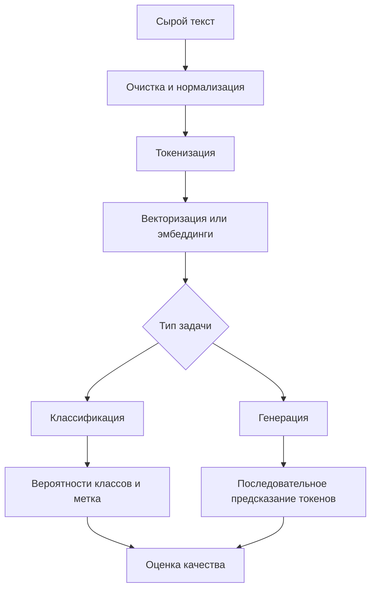

# Обработка естественного языка (NLP). Основные задачи: классификация текстов и генерация

## Основные понятия и определения

Обработка естественного языка, или NLP (Natural Language Processing), — область машинного обучения и искусственного интеллекта, которая занимается автоматическим анализом, представлением, пониманием и порождением текстов на человеческом языке. В отличие от табличных данных или изображений, язык дискретен, неоднозначен и сильно зависит от контекста: одно и то же слово может иметь разные значения, смысл фразы может меняться из-за порядка слов, отрицаний, стиля, жанра и фоновых знаний.

Основная единица текстовой обработки — токен. Токеном может быть слово, часть слова, знак препинания или специальный символ. Современные модели часто используют subword-токенизацию: редкие слова разбиваются на более частые фрагменты, поэтому модель может работать с новыми словами, опечатками и морфологически богатыми языками. Например, слово может быть представлено не целиком, а как набор подсловных единиц.

Корпус — набор текстов, на котором обучается или оценивается модель. Корпус может быть размеченным, когда каждому примеру сопоставлена целевая метка, или неразмеченным, когда модель учится извлекать закономерности из самого текста. Разметка зависит от задачи: для классификации это класс документа, для анализа тональности — положительная или отрицательная оценка, для извлечения сущностей — границы и типы именованных объектов, для машинного перевода — пары предложений на разных языках.

Векторное представление текста — способ заменить слова, предложения или документы числовыми векторами. Машинная модель не работает с буквами и словами напрямую, поэтому текст нужно перевести в признаки. Ранние подходы использовали мешок слов и TF-IDF, где документ описывается частотами терминов. Более современные подходы используют эмбеддинги: плотные векторы, в которых похожие по смыслу слова или тексты оказываются близко друг к другу в векторном пространстве.

Классификация текстов — задача присвоить тексту одну или несколько категорий. Примеры: определение темы новости, фильтрация спама, анализ тональности отзыва, маршрутизация обращений в поддержку, определение токсичности комментария. Классификация может быть бинарной, многоклассовой или многометочной. В бинарной классификации выбирают один из двух классов, например «спам» или «не спам». В многоклассовой задаче выбирают один класс из нескольких. В многометочной классификации один текст может иметь несколько меток одновременно.

Генерация текста — задача построить новую последовательность токенов по некоторому условию или без него. Условием может быть начало фразы, вопрос пользователя, инструкция, набор фактов, исходный текст для пересказа или документ для перевода. К генеративным задачам относятся автодополнение, диалоговые системы, суммаризация, перевод, перефразирование, генерация ответов на вопросы и написание структурированных документов.

## Теория, формулы и интуиция

С точки зрения вероятностного моделирования язык можно рассматривать как последовательность токенов. Пусть текст задан последовательностью \(x_1, x_2, \ldots, x_n\). Языковая модель оценивает вероятность всей последовательности:

\[
P(x_1, x_2, \ldots, x_n) = \prod_{t=1}^{n} P(x_t \mid x_1, \ldots, x_{t-1}).
\]

Эта формула выражает простую идею: вероятность текста можно разложить на произведение вероятностей каждого следующего токена при условии всех предыдущих. Генерация работает именно так: модель получает контекст, оценивает распределение вероятностей по словарю и выбирает следующий токен. Затем выбранный токен добавляется к контексту, и процесс повторяется.

Для классификации текст обычно преобразуется в вектор признаков \(h\), после чего классификатор вычисляет вероятности классов. В многоклассовом случае часто используется softmax:

\[
P(y=k \mid x) = \frac{\exp(z_k)}{\sum_{j=1}^{K}\exp(z_j)},
\]

где \(z_k\) — логит класса \(k\), а \(K\) — число классов. Модель выбирает класс с максимальной вероятностью или использует порог, если задача многометочная. Обучение обычно сводится к минимизации функции потерь, например кросс-энтропии:

\[
L = - \sum_{k=1}^{K} y_k \log \hat{y}_k,
\]

где \(y_k\) — истинная метка в one-hot-представлении, а \(\hat{y}_k\) — предсказанная вероятность.

Ключевая интуиция NLP состоит в том, что значение слова определяется контекстом. В простых частотных моделях слово имеет почти фиксированный смысл: «банк» будет одним признаком и в тексте про финансы, и в тексте про берег реки. Контекстные модели, такие как BERT или GPT-подобные трансформеры, строят представление токена с учетом соседних слов и всей доступной последовательности. Поэтому один и тот же токен может получать разные векторы в разных предложениях.

В основе современных NLP-моделей лежит механизм внимания. Он позволяет каждому токену учитывать другие токены последовательности с разными весами. Упрощенно, для матриц запросов \(Q\), ключей \(K\) и значений \(V\) self-attention вычисляется так:

\[
\text{Attention}(Q,K,V) = \text{softmax}\left(\frac{QK^T}{\sqrt{d_k}}\right)V.
\]

Матрица \(QK^T\) показывает, насколько токены «смотрят» друг на друга, деление на \(\sqrt{d_k}\) стабилизирует масштаб, softmax превращает оценки в веса, а умножение на \(V\) дает новое контекстное представление. Благодаря этому модель может связывать удаленные части предложения: подлежащее и сказуемое, местоимение и объект, начало инструкции и требуемый формат ответа.

Для генерации важны не только вероятности, но и стратегия выбора следующего токена. Жадный декодинг всегда берет самый вероятный токен, что может давать однообразные тексты. Beam search хранит несколько наиболее вероятных гипотез и часто используется в переводе или суммаризации. Sampling выбирает токен случайно с учетом распределения вероятностей, поэтому результат становится разнообразнее. Параметры temperature, top-k и top-p управляют степенью случайности: низкая температура делает текст более предсказуемым, высокая — более вариативным, но иногда менее точным.

## Методы, алгоритмы и этапы решения

Классический конвейер NLP начинается с предобработки. В зависимости от задачи выполняют приведение к нижнему регистру, удаление лишних символов, нормализацию пробелов, лемматизацию, стемминг, обработку чисел и ссылок. Однако степень предобработки зависит от модели. Для TF-IDF и линейных классификаторов нормализация часто полезна. Для трансформеров агрессивная очистка может навредить, потому что пунктуация, регистр, эмодзи и специальные символы тоже несут смысл.

Следующий этап — токенизация. В русскоязычных задачах важно учитывать морфологию: окончания, приставки и формы слов. Поэтому subword-подходы удобны: они уменьшают проблему неизвестных слов и позволяют модели обрабатывать формы, которых не было в обучающей выборке. После токенизации текст переводится в числовые идентификаторы, дополняется служебными токенами и масками внимания, а затем подается в модель.

Для классификации один из простых и сильных базовых методов — TF-IDF плюс логистическая регрессия, линейный SVM или наивный байесовский классификатор. TF-IDF повышает вес слов, которые часто встречаются в конкретном документе, но редко встречаются во всем корпусе:

\[
\text{tf-idf}(t,d) = \text{tf}(t,d) \cdot \log \frac{N}{\text{df}(t)}.
\]

Здесь \(\text{tf}(t,d)\) — частота термина \(t\) в документе \(d\), \(N\) — число документов, \(\text{df}(t)\) — число документов, где встречается термин. Такой подход хорошо работает для тематической классификации, спама и задач, где важны ключевые слова. Его преимущества — скорость, интерпретируемость и небольшие требования к данным. Недостатки — слабое понимание порядка слов, контекста и сложной семантики.

Более мощный подход — использовать нейронные эмбеддинги. Сначала применялись word2vec, GloVe и fastText, где каждому слову или подсловной единице сопоставлялся плотный вектор. Затем поверх этих векторов строились CNN, RNN, LSTM или GRU. Рекуррентные сети обрабатывали текст последовательно и могли учитывать порядок слов, но плохо масштабировались на длинные контексты и хуже распараллеливались.

Современный стандарт — трансформеры. Для классификации часто используют encoder-модели, например BERT-подобную архитектуру. Вся последовательность обрабатывается сразу, а специальный агрегирующий вектор или усреднение токенов передается в классификационную голову. Такая модель дообучается на размеченных примерах: общие языковые знания берутся из предварительного обучения на больших корпусах, а конкретная граница классов уточняется на задаче пользователя.

Этапы решения задачи классификации обычно выглядят так: собрать и очистить датасет, определить схему меток, разделить данные на train, validation и test, выбрать baseline, обучить модель, подобрать гиперпараметры, оценить качество, проанализировать ошибки и внедрить модель. Для оценки используют accuracy, precision, recall, F1-score, ROC-AUC, confusion matrix. Если классы несбалансированы, accuracy может вводить в заблуждение: модель, которая всегда выбирает частый класс, покажет высокую точность, но будет бесполезна для редких важных случаев. Поэтому в задачах токсичности, мошенничества или критических обращений часто особенно важны recall и F1.

Для генерации применяются decoder-модели или encoder-decoder-модели. Decoder-модель предсказывает следующий токен по предыдущим и хорошо подходит для диалога, автодополнения и ответов по инструкции. Encoder-decoder архитектура удобна, когда есть входная последовательность и нужно получить выходную: перевод, суммаризация, исправление ошибок, переформулирование. Encoder строит представление исходного текста, а decoder по нему порождает целевой текст.

Практический конвейер генерации включает подготовку промпта или входных данных, токенизацию, получение распределения следующего токена, декодирование, остановку по специальному токену или лимиту длины и постобработку результата. Для прикладных систем важны ограничения: модель может генерировать правдоподобный, но фактически неверный текст; может повторяться; может нарушать формат; может быть чувствительной к формулировке запроса. Поэтому генерацию часто дополняют retrieval-augmented generation, проверкой фактов, шаблонами вывода, правилами валидации и человеческой модерацией.

Отдельно важна настройка моделей под задачу. Fine-tuning изменяет веса модели на специализированном датасете. Prompt engineering управляет поведением через инструкцию и примеры без изменения весов. Retrieval-подход сначала ищет релевантные документы во внешней базе знаний, затем передает их модели как контекст. Это полезно, когда нужно отвечать по актуальным или внутренним данным.

## Практические примеры

Пример классификации — фильтр обращений в техническую поддержку. На вход поступает текст: «После обновления приложение не запускается, появляется ошибка авторизации». Система должна отнести обращение к категориям «ошибка входа», «проблема после обновления» и, возможно, «высокий приоритет». Если используется TF-IDF, важными признаками станут слова «обновления», «не запускается», «ошибка», «авторизации». Если используется трансформер, модель дополнительно учтет общий смысл: проблема возникла после обновления и связана со входом в систему. Результат можно использовать для автоматической маршрутизации заявки нужной команде.

Другой пример — анализ тональности отзывов. Отзыв «Доставка быстрая, но товар пришел с дефектом» нельзя надежно классифицировать только по отдельным положительным и отрицательным словам. В нем есть смешанная оценка: положительная характеристика доставки и отрицательная характеристика товара. Для бизнеса может быть полезна не только общая тональность, но и aspect-based sentiment analysis, где модель отдельно оценивает аспекты: доставка, качество товара, цена, поддержка.

Пример генерации — автоматическая суммаризация длинной новости. На вход подается статья, а модель должна выдать краткое содержание из нескольких предложений. Экстрактивная суммаризация выбирает важные фрагменты из исходного текста. Абстрактивная суммаризация формулирует новый текст своими словами. Абстрактивный подход гибче, но требует контроля фактической точности: модель может добавить деталь, которой не было в источнике.

Еще один пример — генерация ответа в чат-боте поддержки. Пользователь пишет: «Как восстановить доступ, если я потерял телефон с двухфакторной аутентификацией?» Система может найти в базе знаний инструкцию, передать ее генеративной модели и получить связный ответ. Хорошая архитектура не должна полагаться только на память модели: она должна извлечь актуальную инструкцию, процитировать или пересказать ее, проверить наличие обязательных шагов и не придумывать несуществующие способы восстановления.

В образовательных системах NLP применяют для проверки открытых ответов. Классификационная часть может определить, раскрыта ли тема, а генеративная — сформировать пояснение: какие элементы ответа присутствуют и чего не хватает. При этом оценивание должно быть осторожным: для экзаменационных или юридически значимых решений нужны прозрачные критерии, тестирование на реальных данных и участие эксперта.

Таким образом, классификация и генерация — две центральные группы задач NLP. Классификация превращает текст в решение: метку, вероятность, приоритет или категорию. Генерация превращает условие в новый текст: ответ, перевод, резюме, объяснение или продолжение. Обе группы задач опираются на общую идею: язык нужно представить в числовой форме так, чтобы модель могла учитывать частоты, порядок, контекст и смысловые связи. Разница в том, что классификатор сжимает текст до решения, а генеративная модель разворачивает внутреннее представление обратно в последовательность токенов.
