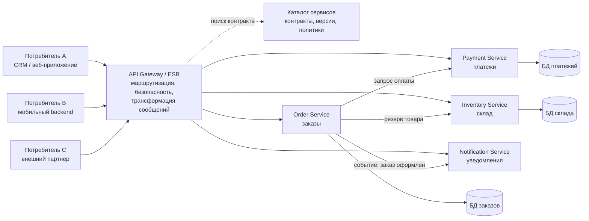

# 1. Модель SOA для организации машинно-машинного взаимодействия

## Краткое определение

**SOA (Service-Oriented Architecture, сервис-ориентированная архитектура)** -- это архитектурный подход, при котором функциональность информационных систем оформляется в виде независимых, слабо связанных сервисов с явно описанными контрактами. Сервисы предоставляют бизнес-возможности другим программам по сети, поэтому SOA прежде всего используется для **машинно-машинного взаимодействия**: одна система вызывает операции другой системы без участия человека.

В терминах OASIS SOA рассматривается как способ организовать и использовать распределенные возможности, которые могут принадлежать разным организационным или техническим доменам. На практике это означает: система-потребитель не обязана знать внутреннюю реализацию сервиса, ей достаточно знать контракт, адрес, формат сообщений и правила безопасности.

## Зачем нужна SOA

SOA появилась как ответ на типичные проблемы крупных корпоративных систем:

- разные приложения написаны на разных языках и работают на разных платформах;
- данные и бизнес-функции дублируются в нескольких системах;
- интеграции "точка-точка" становятся хрупкими и дорогими в сопровождении;
- бизнес-процессы требуют координации нескольких систем: ERP, CRM, биллинга, склада, платежного шлюза, документооборота;
- нужно дать внешним организациям контролируемый доступ к части функций.

SOA решает эти задачи через выделение сервисов с устойчивыми интерфейсами: например, `CustomerService`, `PaymentService`, `OrderService`, `InventoryService`, `NotificationService`.

## Основные элементы модели SOA

| Элемент | Назначение | Пример |
|---|---|---|
| **Поставщик сервиса** | Реализует бизнес-возможность и публикует интерфейс | Банковская система предоставляет сервис проверки платежа |
| **Потребитель сервиса** | Вызывает сервис для выполнения операции | Интернет-магазин вызывает сервис оплаты |
| **Контракт сервиса** | Описывает операции, входные/выходные данные, ошибки, ограничения | WSDL для SOAP-сервиса, OpenAPI для REST API |
| **Сообщение** | Единица обмена между системами | XML/SOAP-сообщение, JSON-запрос, событие в очереди |
| **Реестр/каталог сервисов** | Позволяет находить сервисы и их описания | UDDI, внутренний API catalog, developer portal |
| **ESB или интеграционная шина** | Маршрутизирует, трансформирует и контролирует сообщения | Mule ESB, Apache ServiceMix, WSO2, IBM Integration Bus |
| **Политики и безопасность** | Задают авторизацию, шифрование, SLA, аудит | OAuth 2.0, mTLS, WS-Security, rate limiting |
| **Оркестрация** | Управляет составным бизнес-процессом из нескольких сервисов | BPMN-процесс обработки заказа |

## Схема SOA



На схеме потребители не обращаются напрямую к внутренним базам данных. Они используют сервисы, а сервисы скрывают реализацию. Каталог помогает найти описание сервиса и его правила, а API Gateway или ESB выполняет общие интеграционные задачи: маршрутизацию, проверку доступа, логирование, преобразование форматов.

## Принципы SOA

### 1. Слабая связанность

Потребитель зависит от контракта, а не от внутреннего кода сервиса. Если сервис оплаты меняет базу данных или язык программирования, потребитель не должен изменяться, пока сохраняется контракт.

### 2. Стандартизированный контракт

Сервис должен иметь формальное описание:

- какие операции доступны;
- какие параметры принимает операция;
- какие данные возвращает;
- какие ошибки возможны;
- какие требования к авторизации и формату сообщений.

Для классических Web Services таким контрактом часто является **WSDL**, для современных HTTP API -- **OpenAPI**, для событийных интеграций -- схемы сообщений, например JSON Schema, Avro или AsyncAPI.

### 3. Автономность сервиса

Сервис должен самостоятельно управлять своей логикой и данными в пределах своей ответственности. Например, `PaymentService` отвечает за платежи, а `InventoryService` -- за остатки на складе.

### 4. Повторное использование

Один сервис может использоваться разными приложениями. Например, сервис проверки клиента может вызываться CRM, системой кредитования и личным кабинетом.

### 5. Композиция сервисов

Сложные бизнес-процессы собираются из нескольких сервисов. Оформление заказа может включать проверку клиента, резервирование товара, оплату, создание доставки и отправку уведомления.

### 6. Независимость от платформы

SOA хорошо подходит для неоднородной среды: один сервис может быть написан на Java, другой на C#, третий на Python, но они взаимодействуют через общие сетевые протоколы и форматы сообщений.

## Механизм машинно-машинного взаимодействия

Типовой сценарий взаимодействия выглядит так:

1. Поставщик сервиса публикует контракт: например, WSDL-документ или OpenAPI-спецификацию.
2. Потребитель получает контракт из каталога или документации.
3. Потребитель формирует сообщение согласно контракту.
4. Сообщение передается по сети: HTTP, HTTPS, AMQP, JMS, gRPC или другому протоколу.
5. Интеграционный слой проверяет безопасность, маршрутизирует запрос и при необходимости преобразует формат.
6. Сервис выполняет операцию и возвращает ответ либо публикует событие.
7. Потребитель обрабатывает ответ или подписывается на результат асинхронно.

## Синхронное и асинхронное взаимодействие

| Подход | Как работает | Когда уместен | Недостатки |
|---|---|---|---|
| **Синхронный вызов** | Потребитель отправляет запрос и ждет ответ | Проверка статуса, расчет цены, авторизация платежа | Зависимость от доступности сервиса, задержки |
| **Асинхронное сообщение** | Потребитель отправляет сообщение в очередь или публикует событие | Уведомления, обработка заказов, интеграция с внешними системами | Сложнее отслеживать результат, нужна идемпотентность |
| **Оркестрация** | Центральный процесс управляет последовательностью вызовов | Длинные бизнес-процессы: кредит, доставка, согласование | Риск появления "центрального монолита процесса" |
| **Хореография** | Сервисы реагируют на события друг друга | Событийные корпоративные процессы | Труднее понять общий поток без трассировки |

## Технологии и стандарты

### Классическая SOA на SOAP/Web Services

Классическая корпоративная SOA часто строилась на стеке Web Services:

- **SOAP** -- XML-протокол обмена сообщениями;
- **WSDL** -- описание интерфейса сервиса;
- **UDDI** -- реестр сервисов;
- **WS-Security** -- безопасность SOAP-сообщений;
- **BPEL/BPMN** -- описание и исполнение бизнес-процессов;
- **ESB** -- интеграционная шина для маршрутизации и трансформаций.

Такой стек был распространен в банках, страховых компаниях, государственных информационных системах и крупных корпоративных интеграциях.

### Современная SOA на HTTP API и событиях

В современных системах SOA-идеи часто реализуются через:

- REST API поверх HTTP/HTTPS;
- OpenAPI-спецификации;
- API Gateway;
- очереди сообщений и брокеры событий: RabbitMQ, Apache Kafka, ActiveMQ;
- gRPC для высокопроизводительных внутренних вызовов;
- контейнеризацию и сервисную инфраструктуру;
- централизованный мониторинг, трассировку и управление версиями API.

Важно: SOA не равна SOAP. SOAP -- один из возможных технических способов реализации SOA.

## SOAP/Web Services, REST и события

| Критерий | SOAP/Web Services | REST/HTTP API | Событийная интеграция |
|---|---|---|---|
| Формат | Обычно XML | Чаще JSON, иногда XML | JSON, Avro, Protobuf и др. |
| Контракт | WSDL | OpenAPI | AsyncAPI, схемы сообщений |
| Стиль | Операции: `CreateOrder`, `PayInvoice` | Ресурсы: `/orders`, `/payments` | События: `OrderCreated`, `PaymentCompleted` |
| Связность по времени | Обычно синхронная | Обычно синхронная | Асинхронная |
| Сильные стороны | Формальные стандарты, надежность, безопасность сообщений | Простота, широкая поддержка, удобство веб-интеграций | Устойчивость к пиковым нагрузкам, слабая временная связанность |
| Типичные области | Банки, B2B, legacy-интеграции | Веб-сервисы, мобильные backend, публичные API | Очереди задач, уведомления, потоковая обработка |

## SOA, монолит и микросервисы

| Критерий | Монолит | SOA | Микросервисы |
|---|---|---|---|
| Основная идея | Вся система как единое приложение | Бизнес-возможности доступны как сервисы | Небольшие автономные сервисы с независимой поставкой |
| Гранулярность | Крупная | Средняя или крупная | Обычно мелкая |
| Интеграция | Внутренние вызовы в коде | Контракты, ESB/API Gateway, сообщения | API, события, service mesh |
| Владение данными | Часто общая БД | Может быть общая или разделенная | Обычно база данных на сервис |
| Управление | Часто централизованное | Сильное значение governance | Децентрализованное владение командами |
| Риск | Сложность изменений в большом приложении | Перегруженная интеграционная шина | Сложность эксплуатации распределенной системы |

Микросервисы можно считать более мелкозернистым и организационно децентрализованным развитием сервисного подхода, но SOA обычно шире: она описывает интеграцию бизнес-возможностей в масштабе предприятия, включая старые системы, внешних партнеров и сложные бизнес-процессы.

## Примеры реализации

### Пример 1. Интернет-магазин

Интернет-магазин использует несколько сервисов:

- `CatalogService` возвращает товары и цены;
- `InventoryService` проверяет остатки и резервирует товар;
- `OrderService` создает заказ;
- `PaymentService` проводит оплату;
- `DeliveryService` рассчитывает доставку;
- `NotificationService` отправляет письмо или SMS.

Пользователь нажимает "Оформить заказ", но внутри происходит машинно-машинное взаимодействие: frontend или backend магазина вызывает `OrderService`, тот обращается к сервисам склада, оплаты и доставки. Если платеж прошел успешно, публикуется событие `OrderPaid`, на которое реагируют доставка и уведомления.

### Пример 2. Банк и платежный шлюз

Корпоративная система банка может предоставлять SOAP-сервис `PaymentAuthorizationService`. Внешний платежный шлюз отправляет XML/SOAP-запрос с реквизитами операции. Сервис проверяет подпись, лимиты, статус счета и возвращает результат авторизации. Контракт описан в WSDL, безопасность обеспечивается сертификатами и WS-Security.

Такой пример характерен для B2B-интеграций, где важны строгие контракты, аудит, юридическая значимость сообщений и совместимость между организациями.

### Пример 3. Межведомственное взаимодействие

Государственная информационная система может запрашивать данные из другой системы через сервис: например, система выдачи услуги проверяет сведения о гражданине, статус документа или наличие задолженности. Потребитель не получает прямой доступ к базе другого ведомства, а вызывает утвержденный сервис с регламентированным контрактом и журналированием обращений.

### Пример 4. Интеграция ERP и CRM

CRM создает заявку клиента, а ERP должна выставить счет и проверить наличие товара. Вместо прямой связи баз данных используются сервисы:

- CRM вызывает `CustomerService` для проверки клиента;
- ERP вызывает `OrderService` для получения заказов;
- склад публикует событие `StockChanged`;
- сервис отчетности собирает данные через утвержденные API.

Это уменьшает зависимость систем друг от друга и позволяет развивать их независимо.

## Преимущества SOA

- **Интероперабельность**: разные платформы могут взаимодействовать через открытые протоколы.
- **Повторное использование**: один сервис используется несколькими приложениями.
- **Гибкость бизнес-процессов**: процесс можно собрать из существующих сервисов.
- **Снижение дублирования**: общая бизнес-функция реализуется один раз.
- **Контролируемый доступ**: внешним системам можно дать только нужные операции.
- **Масштабируемость интеграции**: проще подключать новые системы через стандартизированные контракты.

## Недостатки и ограничения

- **Сложность проектирования контрактов**: плохой контракт трудно менять без нарушения потребителей.
- **Сетевые задержки**: удаленные вызовы медленнее локальных.
- **Распределенные ошибки**: сервис может быть недоступен, сеть может отказать, ответ может задержаться.
- **Сложность версионирования**: разные потребители могут использовать разные версии API.
- **Риск чрезмерной централизации**: ESB может превратиться в узкое место и хранить слишком много бизнес-логики.
- **Дорогое сопровождение governance**: нужны каталог сервисов, политики, мониторинг, аудит, управление SLA.

## Типичные ошибки и важные замечания

1. **Путать SOA с набором случайных API.** SOA требует осмысленных бизнес-сервисов, контрактов, политик и управления жизненным циклом.
2. **Делать сервисы слишком мелкими или слишком крупными.** Слишком мелкие сервисы создают много сетевых вызовов, слишком крупные превращаются в распределенный монолит.
3. **Открывать прямой доступ к базам данных.** В SOA потребитель должен работать через контракт сервиса, а не через чужую БД.
4. **Закладывать бизнес-логику в ESB.** Шина должна помогать интеграции, но не становиться главным местом реализации предметной области.
5. **Игнорировать версионирование контрактов.** Изменение структуры запроса или ответа может сломать старых потребителей.
6. **Не проектировать отказоустойчивость.** Нужны таймауты, повторные попытки, circuit breaker, очереди, идемпотентные операции.
7. **Считать SOAP обязательным.** SOA может быть реализована через SOAP, REST, gRPC, очереди сообщений и событийные протоколы.
8. **Не вести наблюдаемость.** Для распределенной системы нужны логи, метрики, трассировка и корреляционные идентификаторы запросов.
9. **Подменять слабую связанность общей моделью данных.** Если все сервисы зависят от одной огромной схемы, изменение данных становится общесистемной проблемой.
10. **Не связывать сервисы с бизнес-возможностями.** Хороший сервис отражает устойчивую бизнес-функцию, а не случайный технический слой.

## Мини-пример контракта REST-сервиса

```http
POST /api/orders
Content-Type: application/json
Authorization: Bearer <token>

{
  "customerId": "C-1024",
  "items": [
    { "sku": "BOOK-1", "quantity": 2 }
  ],
  "paymentMethod": "card"
}
```

Ответ:

```json
{
  "orderId": "O-9001",
  "status": "CREATED",
  "paymentStatus": "PENDING"
}
```

Даже в таком простом примере важны признаки SOA: потребитель вызывает сервис по контракту, передает сообщение в согласованном формате, не знает внутреннюю структуру БД заказов и получает результат через формальный интерфейс.

## Краткий вывод

SOA -- это модель организации распределенных систем, в которой приложения взаимодействуют через сервисы с четкими контрактами. Для машинно-машинного взаимодействия SOA дает стандартизированный способ связывать разнородные системы: через сообщения, API, реестры, интеграционные шины, политики безопасности и управление версиями. Главная ценность SOA не в конкретной технологии вроде SOAP или REST, а в архитектурном принципе: бизнес-возможности должны быть доступны как управляемые, автономные и переиспользуемые сервисы.

## Источники

1. OASIS Open. **Reference Model for Service Oriented Architecture (SOA-RM) v1.0**. URL: <https://docs.oasis-open.org/soa-rm/v1.0/soa-rm.html>
2. OASIS Open. **Reference Architecture Foundation for Service Oriented Architecture Version 1.0**. URL: <https://docs.oasis-open.org/soa-rm/soa-ra/v1.0/csprd02/soa-ra-v1.0-csprd02.html>
3. W3C. **Web Services Architecture**. URL: <https://www.w3.org/TR/ws-arch/>
4. Microsoft Learn. **Service-oriented architecture**. URL: <https://learn.microsoft.com/en-us/dotnet/architecture/microservices/architect-microservice-container-applications/service-oriented-architecture>
5. Martin Fowler, James Lewis. **Microservices**. URL: <https://martinfowler.com/articles/microservices.html>
