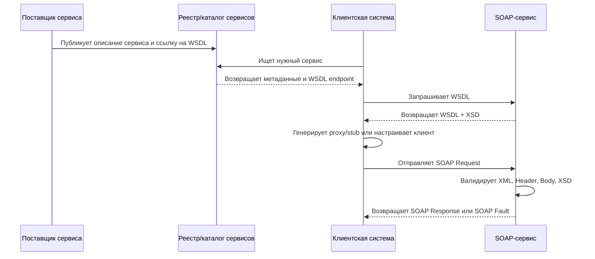

# 2. Интеграция на основе SOAP-протокола. Схемы

## Определение

**SOAP** (Simple Object Access Protocol, в современных спецификациях название используется как самостоятельное) - это XML-ориентированный протокол обмена структурированными сообщениями между распределенными системами. SOAP применяется в сервис-ориентированной архитектуре, особенно там, где важны строгие контракты, формальная типизация, расширяемость, безопасность, транзакционность и надежная интеграция между корпоративными системами.

SOAP-сервис обычно описывается через **WSDL** (Web Services Description Language), а структура данных - через **XML Schema** (XSD). Клиент не обязан знать внутреннюю реализацию сервиса: он работает с опубликованным контрактом, формирует SOAP-сообщение, отправляет его по транспортному протоколу, чаще всего HTTP/HTTPS, и получает SOAP-ответ.

Ключевая идея SOAP-интеграции: взаимодействие строится не вокруг произвольного HTTP-ресурса, а вокруг формального сообщения и операции, описанной в контракте.

## Структура SOAP, WSDL и UDDI

### SOAP-сообщение

SOAP-сообщение является XML-документом с фиксированной общей структурой:

```xml
<?xml version="1.0" encoding="UTF-8"?>
<soap:Envelope xmlns:soap="http://www.w3.org/2003/05/soap-envelope">
  <soap:Header>
    <!-- Необязательные служебные данные:
         безопасность, маршрутизация, корреляция, транзакции -->
  </soap:Header>
  <soap:Body>
    <!-- Основная бизнес-операция или ошибка -->
  </soap:Body>
</soap:Envelope>
```

Основные элементы:

- **Envelope** - корневой элемент SOAP-сообщения. Определяет, что XML-документ является SOAP-сообщением.
- **Header** - необязательный блок метаданных. В нем могут передаваться токены безопасности, идентификаторы корреляции, сведения о транзакциях, маршрутизации и политике обработки.
- **Body** - обязательный блок с полезной нагрузкой: запросом, ответом или ошибкой.
- **Fault** - специальный элемент внутри `Body`, используемый для передачи ошибки в стандартизованном виде.

Пример SOAP-запроса:

```xml
<soap:Envelope xmlns:soap="http://schemas.xmlsoap.org/soap/envelope/"
               xmlns:ord="http://example.com/orders">
  <soap:Header>
    <ord:CorrelationId>7f42-101</ord:CorrelationId>
  </soap:Header>
  <soap:Body>
    <ord:GetOrderRequest>
      <ord:orderId>125</ord:orderId>
    </ord:GetOrderRequest>
  </soap:Body>
</soap:Envelope>
```

Пример SOAP-ответа:

```xml
<soap:Envelope xmlns:soap="http://schemas.xmlsoap.org/soap/envelope/"
               xmlns:ord="http://example.com/orders">
  <soap:Body>
    <ord:GetOrderResponse>
      <ord:orderId>125</ord:orderId>
      <ord:status>PAID</ord:status>
      <ord:amount>1490.00</ord:amount>
    </ord:GetOrderResponse>
  </soap:Body>
</soap:Envelope>
```

Пример SOAP Fault:

```xml
<soap:Envelope xmlns:soap="http://schemas.xmlsoap.org/soap/envelope/">
  <soap:Body>
    <soap:Fault>
      <faultcode>soap:Client</faultcode>
      <faultstring>Invalid order id</faultstring>
      <detail>
        <errorCode>ORDER_ID_INVALID</errorCode>
      </detail>
    </soap:Fault>
  </soap:Body>
</soap:Envelope>
```

### WSDL

**WSDL** - это XML-документ, описывающий контракт веб-сервиса: какие операции доступны, какие сообщения они принимают и возвращают, какие типы данных используются и по какому адресу вызывается сервис.

Классическая структура WSDL 1.1:

- **types** - описание типов данных, обычно через XSD.
- **message** - описание входных и выходных сообщений.
- **portType** - абстрактный интерфейс сервиса, то есть набор операций.
- **binding** - привязка абстрактных операций к конкретному протоколу и формату, например SOAP over HTTP.
- **service** - конкретная точка доступа, где указан адрес сервиса.

Упрощенный пример WSDL:

```xml
<definitions name="OrderService"
             targetNamespace="http://example.com/orders"
             xmlns="http://schemas.xmlsoap.org/wsdl/"
             xmlns:tns="http://example.com/orders"
             xmlns:soap="http://schemas.xmlsoap.org/wsdl/soap/">

  <types>
    <!-- XSD-схемы бизнес-данных -->
  </types>

  <message name="GetOrderRequestMessage">
    <part name="parameters" element="tns:GetOrderRequest"/>
  </message>

  <message name="GetOrderResponseMessage">
    <part name="parameters" element="tns:GetOrderResponse"/>
  </message>

  <portType name="OrderPortType">
    <operation name="GetOrder">
      <input message="tns:GetOrderRequestMessage"/>
      <output message="tns:GetOrderResponseMessage"/>
    </operation>
  </portType>

  <binding name="OrderSoapBinding" type="tns:OrderPortType">
    <soap:binding style="document"
                  transport="http://schemas.xmlsoap.org/soap/http"/>
  </binding>

  <service name="OrderService">
    <port name="OrderPort" binding="tns:OrderSoapBinding">
      <soap:address location="https://example.com/soap/orders"/>
    </port>
  </service>
</definitions>
```

### UDDI

**UDDI** (Universal Description, Discovery and Integration) - это реестр веб-сервисов, предназначенный для публикации, поиска и описания сервисов. В классической модели SOA UDDI выполняет роль каталога, где поставщик регистрирует сервис, а потребитель находит его описание и получает ссылку на WSDL.

Роли UDDI:

- **публикация сервиса** - поставщик размещает сведения о сервисе;
- **поиск сервиса** - потребитель находит сервис по имени, категории, поставщику или технической модели;
- **получение контракта** - потребитель получает ссылку на WSDL и формирует клиентскую интеграцию.

На практике публичные UDDI-реестры применяются редко, но сама идея реестра сервисов сохранилась в корпоративных каталогах API, ESB, service registry и discovery-платформах.

## Общая схема SOAP-интеграции



## Жизненный цикл SOAP-вызова

1. **Публикация контракта**

   Поставщик сервиса описывает операции, сообщения, типы данных, binding и endpoint в WSDL. Если используется реестр, сервис регистрируется в UDDI или корпоративном каталоге.

2. **Получение описания сервиса**

   Клиент получает WSDL по URL или из каталога. На этом этапе клиент узнает, какие операции доступны, какие XML-структуры нужно отправлять и какие ответы ожидать.

3. **Генерация клиентского кода**

   По WSDL часто генерируется клиентский proxy/stub. Например, в Java это может быть JAX-WS-клиент, в .NET - WCF-клиент, в Python - клиент на базе Zeep. Генерация снижает риск ручных ошибок в XML.

4. **Формирование SOAP-запроса**

   Клиент формирует XML-документ с `Envelope`, при необходимости добавляет `Header`, помещает бизнес-запрос в `Body`, сериализует параметры согласно XSD.

5. **Передача сообщения**

   SOAP может передаваться по разным транспортам, но чаще всего используется HTTP или HTTPS. Для SOAP 1.1 часто применяется HTTP-заголовок `SOAPAction`, в SOAP 1.2 действие обычно указывается через параметры `Content-Type`.

6. **Обработка на стороне сервиса**

   Сервер разбирает XML, проверяет namespace, валидирует сообщение по XSD, обрабатывает заголовки, выполняет бизнес-операцию и формирует ответ.

7. **Возврат результата**

   При успешном выполнении сервис возвращает SOAP-ответ. При ошибке возвращается SOAP Fault, где указывается тип ошибки и дополнительные детали.

8. **Десериализация ответа**

   Клиент преобразует XML-ответ в объекты прикладного языка, обрабатывает результат или исключение.

## Схемы и контракты данных

В SOAP-интеграции важную роль играет **XML Schema Definition** (XSD). XSD задает структуру XML-документов, типы полей, обязательность элементов, ограничения значений и пространство имен.

Пример XSD для операции получения заказа:

```xml
<xs:schema xmlns:xs="http://www.w3.org/2001/XMLSchema"
           targetNamespace="http://example.com/orders"
           xmlns:tns="http://example.com/orders"
           elementFormDefault="qualified">

  <xs:element name="GetOrderRequest">
    <xs:complexType>
      <xs:sequence>
        <xs:element name="orderId" type="xs:int"/>
      </xs:sequence>
    </xs:complexType>
  </xs:element>

  <xs:element name="GetOrderResponse">
    <xs:complexType>
      <xs:sequence>
        <xs:element name="orderId" type="xs:int"/>
        <xs:element name="status" type="tns:OrderStatus"/>
        <xs:element name="amount" type="xs:decimal"/>
      </xs:sequence>
    </xs:complexType>
  </xs:element>

  <xs:simpleType name="OrderStatus">
    <xs:restriction base="xs:string">
      <xs:enumeration value="CREATED"/>
      <xs:enumeration value="PAID"/>
      <xs:enumeration value="CANCELLED"/>
    </xs:restriction>
  </xs:simpleType>
</xs:schema>
```

Что задает XSD:

- **структуру сообщения** - какие элементы входят в запрос и ответ;
- **типы данных** - строки, числа, даты, перечисления, сложные типы;
- **обязательность** - через `minOccurs`, `maxOccurs`, `nillable`;
- **ограничения** - длина строки, диапазон чисел, шаблон регулярного выражения, допустимые значения;
- **namespace** - пространство имен, позволяющее различать элементы из разных предметных областей.

Важные понятия схем:

- **qualified elements** - элементы должны быть явно связаны с namespace;
- **complexType** - сложный тип, содержащий набор полей;
- **simpleType** - простой тип с ограничениями;
- **sequence** - строгий порядок элементов;
- **choice** - выбор одного из нескольких элементов;
- **import/include** - подключение внешних схем.

## Стили SOAP-сообщений

В WSDL и SOAP-интеграциях часто различают стили:

- **RPC style** - сообщение похоже на удаленный вызов процедуры: операция и параметры явно представлены как вызов метода.
- **Document style** - сообщение рассматривается как XML-документ определенного типа.
- **Encoded use** - данные кодируются по правилам SOAP Encoding.
- **Literal use** - XML точно соответствует XSD-схеме.

В современных интеграциях обычно предпочтителен стиль **document/literal**, потому что он лучше согласуется с XSD, WS-I Basic Profile и формальной валидацией сообщений.

## Примеры реализации

### Java, JAX-WS

Пример серверного интерфейса:

```java
import jakarta.jws.WebMethod;
import jakarta.jws.WebService;

@WebService
public interface OrderService {
    @WebMethod
    OrderDto getOrder(int orderId);
}
```

Пример реализации:

```java
import jakarta.jws.WebService;

@WebService(endpointInterface = "com.example.OrderService")
public class OrderServiceImpl implements OrderService {
    @Override
    public OrderDto getOrder(int orderId) {
        return new OrderDto(orderId, "PAID", "1490.00");
    }
}
```

Публикация endpoint:

```java
import jakarta.xml.ws.Endpoint;

public class Application {
    public static void main(String[] args) {
        Endpoint.publish(
            "http://localhost:8080/soap/orders",
            new OrderServiceImpl()
        );
    }
}
```

### C#, WCF-подход

Контракт сервиса:

```csharp
using System.ServiceModel;

[ServiceContract]
public interface IOrderService
{
    [OperationContract]
    OrderDto GetOrder(int orderId);
}
```

Реализация:

```csharp
public class OrderService : IOrderService
{
    public OrderDto GetOrder(int orderId)
    {
        return new OrderDto
        {
            OrderId = orderId,
            Status = "PAID",
            Amount = 1490.00m
        };
    }
}
```

### Python, клиент Zeep

```python
from zeep import Client

client = Client("https://example.com/soap/orders?wsdl")
response = client.service.GetOrder(orderId=125)

print(response.status)
print(response.amount)
```

Во всех примерах главная особенность одна: клиент и сервер ориентируются на контракт WSDL/XSD, а не на произвольный формат данных.

## Плюсы SOAP-интеграции

- **Строгий контракт**. WSDL и XSD формально описывают операции, сообщения и типы данных.
- **Хорошая поддержка enterprise-сценариев**. SOAP исторически широко используется в банковских, государственных, страховых и интеграционных системах.
- **Расширяемость через Header**. Можно добавлять безопасность, корреляцию, маршрутизацию и транзакционные метаданные без изменения бизнес-тела сообщения.
- **Стандарты WS-\***. Существуют спецификации для безопасности, надежной доставки, адресации, политик и транзакций: WS-Security, WS-ReliableMessaging, WS-Addressing, WS-Policy.
- **Языковая независимость**. XML, WSDL и XSD позволяют интегрировать системы на Java, .NET, Python, PHP и других платформах.
- **Формальная валидация**. Сообщения можно проверять по XSD до выполнения бизнес-логики.
- **Поддержка синхронных и асинхронных сценариев**. SOAP может использоваться не только поверх HTTP, но и в интеграционных шинах, очередях и корпоративных middleware.

## Минусы SOAP-интеграции

- **Большой объем сообщений**. XML и служебная обертка делают SOAP тяжелее по сравнению с JSON/REST.
- **Сложность контракта**. WSDL, XSD, namespace, binding и WS-\* требуют аккуратной настройки.
- **Менее удобная ручная отладка**. SOAP-запрос труднее написать вручную, чем простой REST-запрос.
- **Чувствительность к namespace и порядку элементов**. Небольшие отклонения от XSD могут приводить к ошибкам десериализации.
- **Сложность версионирования**. Изменение схемы может ломать сгенерированные клиенты.
- **Зависимость от инструментов**. На практике комфортная работа часто требует генераторов кода, SOAP UI, wsimport, svcutil или аналогичных средств.
- **Избыточность для простых API**. Для CRUD-интерфейсов и публичных веб-API REST/JSON часто проще и дешевле в сопровождении.

## Типичные ошибки при SOAP-интеграции

1. **Неправильный namespace**

   XML-элемент с правильным именем, но неправильным namespace может не распознаться сервисом. В SOAP это одна из самых частых причин ошибок.

2. **Несоответствие XSD**

   Ошибки возникают, если нарушен тип поля, отсутствует обязательный элемент, превышена длина строки или нарушен порядок элементов в `sequence`.

3. **Путаница SOAP 1.1 и SOAP 1.2**

   У версий отличаются namespace envelope, формат `Fault`, использование `SOAPAction` и `Content-Type`.

4. **Игнорирование SOAP Fault**

   Ошибку нельзя обрабатывать как обычный HTTP-текст. Нужно разбирать `Fault`, его код, причину и блок `detail`.

5. **Нестабильное изменение WSDL**

   Если поставщик меняет WSDL без версионирования, клиенты могут перестать генерироваться или начнут отправлять несовместимые сообщения.

6. **Ручная сборка XML строками**

   При ручной конкатенации легко ошибиться в экранировании, namespace, порядке элементов и кодировке. Лучше использовать XML-библиотеки или сгенерированный клиент.

7. **Недостаточная настройка безопасности**

   Для корпоративных сценариев часто требуется HTTPS, подпись сообщений, шифрование, timestamp, nonce, сертификаты и WS-Security. Простого логина в теле запроса обычно недостаточно.

8. **Неверная обработка дат и чисел**

   Форматы `dateTime`, часовые пояса, decimal-разделители и локали должны соответствовать XML Schema, а не региональным настройкам приложения.

9. **Отсутствие таймаутов и повторов**

   SOAP-интеграция часто используется между критичными системами. Без timeout, retry policy, idempotency key и correlation id легко получить зависшие процессы или дубли операций.

10. **Смешение бизнес-ошибок и транспортных ошибок**

    HTTP 500, сетевой сбой и SOAP Fault с бизнес-кодом - разные ситуации. Их нужно обрабатывать отдельно.

## Практические рекомендации

- Использовать **document/literal** как основной стиль сообщений.
- Хранить WSDL и XSD в системе контроля версий.
- Вводить версионирование namespace, например `http://example.com/orders/v1`.
- Генерировать клиентский код из WSDL, а не писать XML вручную.
- Проверять SOAP-запросы через SoapUI, Postman, curl или специализированные тесты.
- Валидировать входящие сообщения по XSD до выполнения бизнес-операции.
- Настраивать HTTPS и WS-Security для защищенных интеграций.
- Логировать correlation id, operation name, endpoint, время выполнения и результат, но не писать в лог чувствительные данные.
- Разделять технические ошибки, ошибки контракта и бизнес-ошибки.
- Документировать правила обратной совместимости при изменении схем.

## Сравнение SOAP и REST

| Критерий | SOAP | REST |
|---|---|---|
| Основная единица | Сообщение/операция | Ресурс |
| Формат | Обычно XML | Обычно JSON, но возможны разные форматы |
| Контракт | WSDL + XSD | OpenAPI/Swagger, документация |
| Строгость типизации | Высокая | Зависит от описания API |
| Безопасность | HTTPS, WS-Security | HTTPS, OAuth2, JWT, mTLS и др. |
| Enterprise-стандарты | Развитая линейка WS-\* | Обычно проще и легче |
| Простота ручного вызова | Ниже | Выше |
| Типичные области | Банки, госуслуги, ERP, B2B | Web API, мобильные приложения, микросервисы |

SOAP не является "устаревшим REST". Это другой подход к интеграции: SOAP делает акцент на формальном контракте сообщения, а REST - на ресурсной модели и использовании HTTP-семантики.

## Вывод

SOAP-интеграция - это способ построения распределенного взаимодействия на основе XML-сообщений, строгих контрактов WSDL и схем XSD. Она особенно подходит для корпоративных систем, где важны формальная спецификация интерфейса, надежность, безопасность, трассируемость и совместимость между разными платформами.

Главное преимущество SOAP - предсказуемость и строгость контракта. Главные недостатки - сложность, объемность XML и высокая зависимость от корректной настройки WSDL, XSD и WS-\* стандартов. Поэтому SOAP рационально использовать в сложных B2B, государственных, банковских и legacy-интеграциях, а для простых публичных API чаще выбирают REST/JSON.

## Источники

1. W3C. **SOAP Version 1.2 Part 1: Messaging Framework**. https://www.w3.org/TR/soap12-part1/
2. W3C. **SOAP Version 1.2 Part 2: Adjuncts**. https://www.w3.org/TR/soap12-part2/
3. W3C. **Web Services Description Language (WSDL) 1.1**. https://www.w3.org/TR/wsdl/
4. W3C. **XML Schema Definition Language (XSD) 1.1 Part 1: Structures**. https://www.w3.org/TR/xmlschema11-1/
5. OASIS. **UDDI Version 3.0.2 Specification**. https://www.oasis-open.org/committees/uddi-spec/doc/tcspecs.htm
6. WS-I. **Basic Profile**. https://www.ws-i.org/Profiles/BasicProfile-1.2.html
7. OASIS. **Web Services Security: SOAP Message Security**. https://www.oasis-open.org/standard/wssv1-1/
