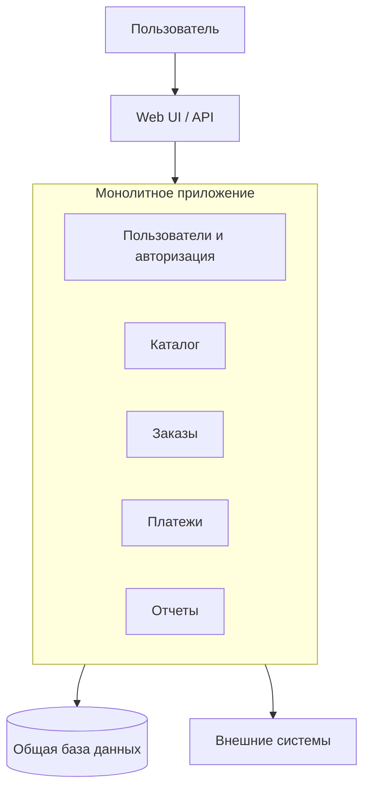
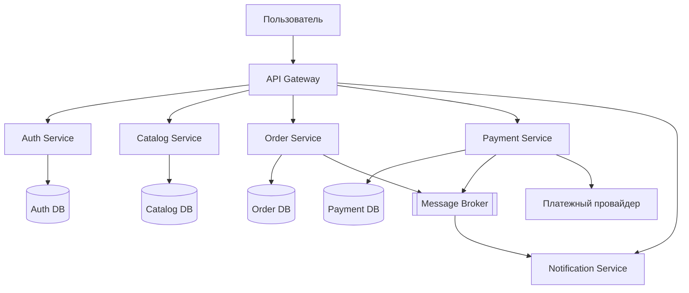

# 3. Монолитная и микросервисная архитектура. Схема

## Краткий ответ

**Монолитная архитектура** - это подход, при котором приложение строится как единая программная система: пользовательский интерфейс, бизнес-логика, доступ к данным и интеграции обычно разрабатываются, собираются и разворачиваются как один артефакт.

**Микросервисная архитектура** - это подход, при котором приложение представляется набором небольших автономных сервисов, каждый из которых отвечает за отдельную бизнес-возможность, имеет собственный жизненный цикл разработки и развертывания и взаимодействует с другими сервисами через сеть.

Главное различие: в монолите система масштабируется и изменяется как единое целое, а в микросервисах - по частям. Поэтому монолит проще на старте, но сложнее развивать при росте масштаба, а микросервисы дают гибкость и независимость команд, но требуют зрелой инфраструктуры, DevOps, наблюдаемости и дисциплины проектирования.

## Монолитная архитектура

Монолитное приложение состоит из нескольких логических слоев, но физически чаще всего является одной системой. Например, интернет-магазин может содержать модули каталога, корзины, заказов, оплаты, склада и пользователей, но все они находятся в одном приложении и используют одну общую базу данных.

Типичная структура монолита:

- пользовательский интерфейс или API;
- слой контроллеров;
- бизнес-логика;
- слой доступа к данным;
- общая база данных;
- единый процесс сборки и развертывания.

Монолит не обязательно означает "плохой код". Хороший монолит может быть модульным: внутренние части разделены по пакетам, слоям или bounded context, зависимости контролируются, а бизнес-логика не перемешана с инфраструктурой. Проблема возникает, когда монолит становится "большим комком грязи": любое изменение затрагивает множество частей системы, а границы модулей существуют только на словах.

### Схема монолита

В этой схеме модули логически различаются, но живут внутри одного приложения. Обычно они разворачиваются одновременно и используют общую схему данных.

## Микросервисная архитектура

В микросервисной архитектуре система делится на независимые сервисы. Каждый сервис реализует конкретную бизнес-функцию: например, управление пользователями, каталог, заказы, платежи, уведомления. Сервис должен быть достаточно автономным, чтобы команда могла менять и разворачивать его без обязательного изменения всей системы.

Ключевые признаки микросервисов:

- сервис отвечает за ограниченную бизнес-область;
- сервис можно разрабатывать, тестировать и разворачивать независимо;
- сервисы взаимодействуют через API, сообщения или события;
- каждый сервис желательно имеет собственную модель данных;
- отказ одного сервиса не должен автоматически останавливать всю систему;
- инфраструктура включает балансировку, мониторинг, трассировку, логирование, управление конфигурацией и автоматическое развертывание.

Микросервисы часто связывают с Domain-Driven Design: границы сервисов удобно проводить по bounded context, то есть по устойчивым бизнес-границам. Например, "Заказ" в контексте оформления покупки и "Заказ" в контексте бухгалтерии могут иметь разные модели и разные правила.

### Схема микросервисов

В этой схеме сервисы отделены друг от друга. У каждого сервиса своя зона ответственности, свой код и, в идеале, собственное хранилище. Взаимодействие может быть синхронным через HTTP/gRPC или асинхронным через брокер сообщений.

## Архитектурные особенности

### Особенности монолита

- **Единое развертывание.** Даже если изменилась одна функция, часто требуется пересобрать и развернуть все приложение.
- **Общая кодовая база.** Команде проще понимать систему на раннем этапе, но при росте проекта возрастает связанность.
- **Общая база данных.** Упрощает транзакции и согласованность данных, но усиливает зависимость модулей друг от друга.
- **Простая инфраструктура.** Обычно достаточно одного приложения, одной базы данных и стандартного CI/CD.
- **Высокая локальная производительность.** Вызовы между модулями происходят внутри процесса, без сетевой задержки.
- **Сложность масштабирования отдельных функций.** Если нагрузка растет только на каталог, масштабировать приходится все приложение.

### Особенности микросервисов

- **Независимое развертывание.** Изменение сервиса заказов не требует обязательного релиза сервиса каталога.
- **Изоляция данных.** Сервисы не должны напрямую ходить в чужие таблицы; доступ выполняется через API или события.
- **Сетевое взаимодействие.** Появляются задержки, таймауты, ретраи, проблемы совместимости API.
- **Распределенные отказы.** Один сервис может быть доступен, другой недоступен, третий работает медленно.
- **Наблюдаемость как обязательное требование.** Нужны метрики, централизованные логи, трассировка запросов, корреляционные идентификаторы.
- **Сложность транзакций.** Вместо простых ACID-транзакций часто применяются eventual consistency, Saga, outbox pattern.
- **Командная автономность.** Разные команды могут владеть разными сервисами и выбирать подходящие технологии, если это не разрушает общую поддержку системы.

## Сравнение монолита и микросервисов

| Критерий | Монолит | Микросервисы |
|---|---|---|
| Развертывание | Одно приложение разворачивается целиком | Каждый сервис может разворачиваться отдельно |
| Сложность старта | Ниже | Выше |
| Инфраструктура | Простая | Требуются CI/CD, контейнеризация, оркестрация, мониторинг |
| Масштабирование | Обычно масштабируется все приложение | Можно масштабировать отдельные сервисы |
| Производительность вызовов | Быстрые внутрипроцессные вызовы | Сетевые вызовы медленнее и менее надежны |
| Согласованность данных | Проще обеспечить общей транзакцией | Часто нужна eventual consistency |
| Изоляция отказов | Ошибка может повлиять на весь процесс | Отказы можно изолировать, но это требует проектирования |
| Командная работа | Удобна для небольшой команды | Удобна для нескольких автономных команд |
| Изменение технологий | Сложно менять стек частями | Можно менять стек отдельных сервисов |
| Тестирование | Проще интеграционное тестирование всего приложения | Сложнее контрактное и сквозное тестирование |
| Типичный риск | Сильная связанность и рост сложности | Распределенная сложность и операционные расходы |

## Примеры применения

### Когда подходит монолит

Монолит часто является правильным выбором, если:

- продукт находится на ранней стадии и бизнес-требования часто меняются;
- команда небольшая;
- нагрузка умеренная;
- нет необходимости независимо масштабировать разные части системы;
- важна скорость разработки первой версии;
- доменная модель еще плохо понятна;
- система имеет простые транзакции и сильную связность данных.

Примеры:

- MVP интернет-магазина;
- внутренняя CRM для небольшой компании;
- учебная платформа на ранней стадии;
- административная система с ограниченным числом пользователей;
- корпоративное приложение, где надежность важнее технологической гибкости.

### Когда подходят микросервисы

Микросервисы оправданы, если:

- система большая и развивается несколькими командами;
- разные части системы имеют разную нагрузку;
- требуется независимое развертывание компонентов;
- есть зрелая DevOps-практика;
- доменные границы хорошо понятны;
- бизнес требует высокой скорости независимых изменений;
- есть требования к отказоустойчивости и масштабированию отдельных функций.

Примеры:

- крупный маркетплейс;
- банковская экосистема с множеством продуктов;
- стриминговая платформа;
- сервис доставки с отдельными доменами заказов, логистики, платежей и уведомлений;
- SaaS-платформа с большим числом команд и клиентов.

## Преимущества и недостатки монолита

### Преимущества

- Простая разработка, особенно в начале проекта.
- Простое локальное окружение.
- Единая сборка и развертывание.
- Проще обеспечить транзакционную целостность.
- Меньше сетевых взаимодействий.
- Проще отлаживать поток выполнения в одном процессе.
- Ниже требования к инфраструктуре и квалификации эксплуатации.

### Недостатки

- Сложно масштабировать отдельные части.
- Рост кодовой базы приводит к увеличению связанности.
- Ошибка в одном модуле может повлиять на все приложение.
- Релизы становятся тяжелыми и рискованными.
- Сложнее внедрять новые технологии частично.
- Большой монолит трудно понимать новым разработчикам.
- При плохой модульности изменения в одной области вызывают непредсказуемые последствия в другой.

## Преимущества и недостатки микросервисов

### Преимущества

- Независимая разработка и развертывание сервисов.
- Масштабирование конкретных компонентов под их нагрузку.
- Более четкое владение кодом и ответственностью команд.
- Возможность использовать разные технологии для разных задач.
- Лучшая изоляция отказов при правильном проектировании.
- Удобство постепенной модернизации больших систем.
- Хорошая совместимость с контейнерами, облаками и CI/CD.

### Недостатки

- Высокая инфраструктурная сложность.
- Сложнее тестирование и отладка распределенных сценариев.
- Сетевые задержки и нестабильность становятся частью архитектуры.
- Труднее обеспечивать согласованность данных.
- Нужны API-контракты и управление версиями.
- Нужны мониторинг, трассировка, централизованные логи.
- Возможен "распределенный монолит", когда сервисы формально разделены, но фактически зависят друг от друга так сильно, что не могут изменяться независимо.

## Типичные ошибки

### Ошибки при проектировании монолита

1. **Отсутствие модульности.** Все модули напрямую используют классы и таблицы друг друга.
2. **Смешивание слоев.** Бизнес-логика оказывается в контроллерах, SQL-запросах или UI.
3. **Общая модель на все случаи.** Один объект используется для API, базы данных, бизнес-логики и отображения.
4. **Игнорирование границ предметной области.** Каталог, заказы, платежи и пользователи становятся техническими папками, а не бизнес-модулями.
5. **Отсутствие автоматических тестов.** При росте монолита регрессии становятся частыми.

### Ошибки при проектировании микросервисов

1. **Переход к микросервисам слишком рано.** Если команда мала, домен неясен, а DevOps незрелый, микросервисы замедлят разработку.
2. **Деление по техническим слоям.** Например, отдельный сервис для контроллеров, отдельный для бизнес-логики и отдельный для данных. Это не микросервисная архитектура, а распределение слоев по сети.
3. **Общая база данных для всех сервисов.** Если все сервисы напрямую работают с одной схемой, они остаются сильно связанными.
4. **Синхронные цепочки вызовов.** Запрос пользователя проходит через 8-10 сервисов подряд, и отказ любого сервиса ломает весь сценарий.
5. **Отсутствие контрактов API.** Сервис меняет формат ответа, и потребители ломаются.
6. **Нет наблюдаемости.** Без логов, метрик и трассировки невозможно понять, где возникла проблема.
7. **Неверный размер сервисов.** Слишком крупный сервис становится мини-монолитом, слишком мелкий создает лишнюю сетевую сложность.
8. **Игнорирование данных.** Разработчики делят код, но не продумывают владение данными, транзакции и согласованность.

## Подход к выбору архитектуры

Выбор архитектуры должен зависеть не от моды, а от контекста:

1. Если система небольшая, команда одна, нагрузка умеренная и бизнес еще ищет продуктовую модель, лучше начать с модульного монолита.
2. Если система уже большая, доменные границы понятны, команды независимы, а отдельные части требуют разного масштабирования, можно переходить к микросервисам.
3. Часто практичный путь - сначала построить хорошо структурированный монолит, затем постепенно выделять сервисы там, где это дает реальную пользу.

Важный принцип: микросервисы не исправляют плохую архитектуру автоматически. Если в монолите нет ясных границ ответственности, после механического разделения получится та же связанность, но уже с сетевыми вызовами, задержками и сложной эксплуатацией.

## Переход от монолита к микросервисам

Переход обычно выполняют постепенно, а не полной перепиской системы. Один из распространенных подходов - strangler pattern: вокруг старого монолита строятся новые сервисы, которые постепенно забирают на себя отдельные функции.

Упрощенный порядок миграции:

1. Проанализировать предметную область и найти устойчивые границы.
2. Выделить модуль внутри монолита и снизить его зависимости.
3. Зафиксировать контракт API или событий.
4. Перенести данные или определить правила владения ими.
5. Вынести модуль в отдельный сервис.
6. Настроить мониторинг, логирование, трассировку и CI/CD.
7. Постепенно повторить процесс для следующих областей.

## Экзаменационный пример

Рассмотрим интернет-магазин.

В монолитной архитектуре каталог, корзина, заказы, платежи и уведомления находятся в одном приложении. Пользователь оформляет заказ, приложение в одной транзакции сохраняет заказ, меняет остатки товара и создает запись об оплате. Это просто и удобно, пока нагрузка невелика и команда одна.

В микросервисной архитектуре каталог, заказы, платежи и уведомления могут быть отдельными сервисами. Сервис заказов создает заказ, публикует событие `OrderCreated`, сервис платежей обрабатывает оплату, сервис уведомлений отправляет письмо или сообщение. Система становится гибче: сервис каталога можно масштабировать отдельно во время распродажи, а платежный сервис можно обновлять независимо. Но появляется сложность: нужно обрабатывать частичные отказы, повторную доставку сообщений, таймауты, идемпотентность и рассинхронизацию данных.

## Краткий вывод

Монолитная архитектура подходит для небольших и средних систем, быстрого старта, понятных транзакций и небольших команд. Ее главный плюс - простота, главный риск - рост связанности.

Микросервисная архитектура подходит для больших систем с несколькими командами, высокой нагрузкой и потребностью в независимом развитии компонентов. Ее главный плюс - гибкость и масштабируемость, главный риск - распределенная сложность.

На практике разумный выбор часто выглядит так: начинать с модульного монолита, не нарушать границы предметной области, а микросервисы выделять только тогда, когда независимое масштабирование, независимые релизы или автономность команд дают измеримую пользу.

## Источники

1. Martin Fowler, James Lewis. *Microservices: a definition of this new architectural term*. URL: <https://martinfowler.com/articles/microservices.html>
2. Microsoft Learn. *Microservices architecture style*. URL: <https://learn.microsoft.com/en-us/azure/architecture/microservices/>
3. Microsoft Learn. *.NET Microservices: Architecture for Containerized .NET Applications*. URL: <https://learn.microsoft.com/en-us/dotnet/architecture/microservices/>
4. AWS. *What are Microservices?* URL: <https://aws.amazon.com/microservices/>
5. Chris Richardson. *Microservices Patterns*. Manning, 2018.
6. Sam Newman. *Building Microservices*. O'Reilly, 2015.
