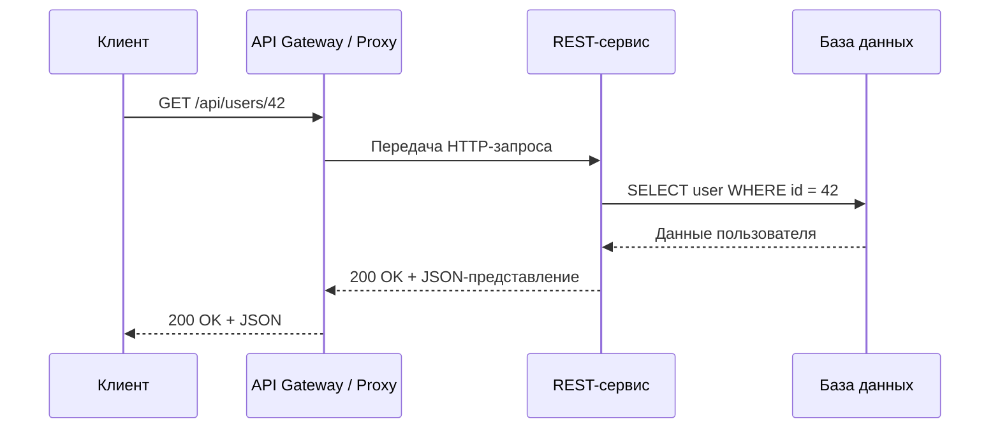
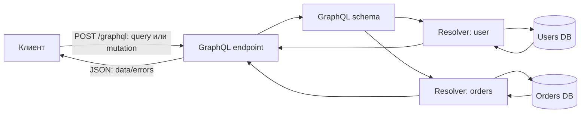
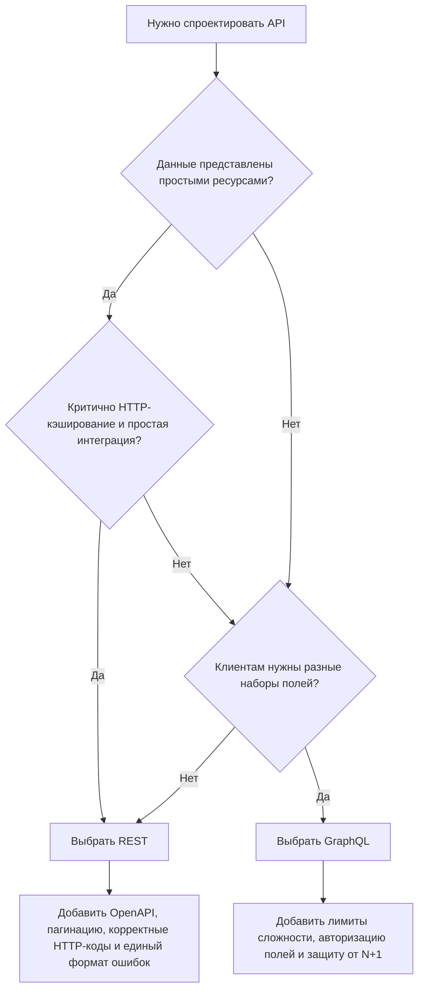

# 4. Интеграция на основе архитектурного стиля REST и GraphQL

## Краткое содержание

REST и GraphQL - два распространенных подхода к интеграции клиентских и серверных систем через API.

**REST** рассматривает предметную область как набор ресурсов, доступных по URI. Клиент выполняет операции над ресурсами с помощью стандартных HTTP-методов: `GET`, `POST`, `PUT`, `PATCH`, `DELETE`. REST хорошо подходит для простых, стабильных и кэшируемых API, где структура ресурсов понятна заранее.

**GraphQL** рассматривает API как единую типизированную схему. Клиент отправляет запрос к одному endpoint и сам указывает, какие поля ему нужны. GraphQL удобен, когда клиентам нужны разные представления одних и тех же данных, когда важно уменьшить избыточную передачу данных и когда система состоит из множества связанных сущностей.

Оба подхода не являются прямыми заменами друг друга. REST - архитектурный стиль, основанный на ресурсах и ограничениях взаимодействия. GraphQL - спецификация языка запросов, схемы и протокола взаимодействия между клиентом и сервером.

## REST: идея и основные принципы

REST, Representational State Transfer, был описан Роем Филдингом как архитектурный стиль для распределенных гипермедийных систем. В прикладной разработке REST чаще всего реализуется поверх HTTP.

Ключевая идея REST: сервер предоставляет клиенту не внутренние процедуры, а **ресурсы**. Каждый ресурс имеет идентификатор, обычно URI, а клиент получает или изменяет его состояние через представления: JSON, XML, HTML и т.д.

Пример ресурсов:

```text
/users
/users/42
/users/42/orders
/orders/1001
/products?category=books
```

Основные ограничения REST:

| Ограничение | Смысл |
|---|---|
| Client-Server | Клиент и сервер разделены: клиент отвечает за интерфейс, сервер - за данные и бизнес-логику. |
| Stateless | Каждый запрос содержит всю информацию, нужную серверу для обработки. Сервер не обязан хранить состояние клиентской сессии между запросами. |
| Cacheable | Ответы могут явно помечаться как кэшируемые или некэшируемые. |
| Uniform Interface | Единый интерфейс взаимодействия: ресурсы, URI, методы, представления, коды статуса. |
| Layered System | Между клиентом и сервером могут быть прокси, балансировщики, API gateway, CDN. |
| Code on Demand | Необязательное ограничение: сервер может передавать клиенту исполняемый код, например JavaScript. |

## REST: ресурсы и HTTP-методы

В REST важно различать **ресурс** и **операцию**. Ресурс обычно задается существительным, а операция выражается HTTP-методом.

| HTTP-метод | Назначение | Пример |
|---|---|---|
| `GET` | Получить ресурс или список ресурсов | `GET /users/42` |
| `POST` | Создать подчиненный ресурс или выполнить операцию, не выражаемую идемпотентным методом | `POST /users` |
| `PUT` | Полностью заменить ресурс известного URI | `PUT /users/42` |
| `PATCH` | Частично изменить ресурс | `PATCH /users/42` |
| `DELETE` | Удалить ресурс | `DELETE /users/42` |

Пример корректного REST-проектирования:

```http
GET /api/users/42 HTTP/1.1
Host: example.com
Accept: application/json
```

Ответ:

```json
{
  "id": 42,
  "name": "Ivan Petrov",
  "email": "ivan@example.com",
  "role": "customer"
}
```

Создание пользователя:

```http
POST /api/users HTTP/1.1
Host: example.com
Content-Type: application/json

{
  "name": "Ivan Petrov",
  "email": "ivan@example.com",
  "role": "customer"
}
```

Ответ:

```http
HTTP/1.1 201 Created
Location: /api/users/42
Content-Type: application/json
```

```json
{
  "id": 42,
  "name": "Ivan Petrov",
  "email": "ivan@example.com",
  "role": "customer"
}
```

## REST: схема взаимодействия



В REST каждый endpoint обычно соответствует ресурсу или коллекции ресурсов. Если клиенту нужны связанные данные, он часто делает несколько запросов:

```text
GET /api/users/42
GET /api/users/42/orders
GET /api/orders/1001/items
```

Это делает API простым и кэшируемым, но может приводить к проблеме большого числа запросов.

## GraphQL: идея и основные элементы

GraphQL - это спецификация языка запросов и исполнения API. В отличие от REST, клиент обращается не к множеству ресурсных endpoint, а обычно к одному endpoint, например:

```text
POST /graphql
```

Клиент отправляет запрос, в котором явно перечисляет нужные поля. Сервер обрабатывает запрос на основе схемы и возвращает данные в форме, похожей на форму запроса.

Главные элементы GraphQL:

| Элемент | Смысл |
|---|---|
| Schema | Контракт API: типы, поля, связи, операции. |
| Type | Описание структуры данных, например `User`, `Order`, `Product`. |
| Query | Операция чтения данных. |
| Mutation | Операция изменения данных. |
| Subscription | Подписка на события в реальном времени. |
| Resolver | Функция серверной логики, которая получает значение конкретного поля или операции. |

## GraphQL: пример схемы

```graphql
type User {
  id: ID!
  name: String!
  email: String!
  orders: [Order!]!
}

type Order {
  id: ID!
  total: Float!
  status: String!
  items: [OrderItem!]!
}

type OrderItem {
  productId: ID!
  name: String!
  quantity: Int!
  price: Float!
}

type Query {
  user(id: ID!): User
  orders(userId: ID!): [Order!]!
}

type Mutation {
  createUser(input: CreateUserInput!): User!
}

input CreateUserInput {
  name: String!
  email: String!
}
```

Здесь `Query` описывает операции чтения, `Mutation` - операции изменения данных, а типы `User`, `Order`, `OrderItem` задают структуру возвращаемых объектов.

## GraphQL: пример запроса

Клиенту нужны имя пользователя и номера его заказов. В REST для этого часто потребовались бы два endpoint. В GraphQL это можно запросить одним вызовом:

```graphql
query GetUserWithOrders($id: ID!) {
  user(id: $id) {
    id
    name
    orders {
      id
      total
      status
    }
  }
}
```

Переменные:

```json
{
  "id": "42"
}
```

Ответ:

```json
{
  "data": {
    "user": {
      "id": "42",
      "name": "Ivan Petrov",
      "orders": [
        {
          "id": "1001",
          "total": 2500.0,
          "status": "PAID"
        },
        {
          "id": "1002",
          "total": 1200.0,
          "status": "CREATED"
        }
      ]
    }
  }
}
```

## GraphQL: mutation

Пример создания пользователя:

```graphql
mutation CreateUser($input: CreateUserInput!) {
  createUser(input: $input) {
    id
    name
    email
  }
}
```

Переменные:

```json
{
  "input": {
    "name": "Ivan Petrov",
    "email": "ivan@example.com"
  }
}
```

Ответ:

```json
{
  "data": {
    "createUser": {
      "id": "42",
      "name": "Ivan Petrov",
      "email": "ivan@example.com"
    }
  }
}
```

## GraphQL: схема взаимодействия



GraphQL-сервер принимает запрос, проверяет его по схеме, вызывает нужные resolver-функции и собирает единый JSON-ответ.

## Сравнение REST и GraphQL

| Критерий | REST | GraphQL |
|---|---|---|
| Основная модель | Ресурсы и HTTP-методы | Типизированная схема и запросы |
| Endpoint | Обычно много endpoint: `/users`, `/orders` | Обычно один endpoint: `/graphql` |
| Контракт | Часто OpenAPI/Swagger или документация | Схема GraphQL является частью контракта |
| Выбор полей | Обычно определяется сервером | Клиент сам выбирает нужные поля |
| Кэширование | Хорошо поддерживается HTTP-кэшированием | Сложнее, часто требуется клиентский или специализированный кэш |
| Ошибки | HTTP-коды статуса: `400`, `401`, `404`, `500` | Часто `200 OK` с полем `errors`, хотя транспортные ошибки тоже возможны |
| Версионирование | Часто через `/v1`, `/v2` или заголовки | Чаще через эволюцию схемы и deprecation полей |
| Производительность | Простые запросы эффективны и кэшируемы | Удобно получать связанные данные одним запросом |
| Риск | Overfetching/underfetching, много запросов | Сложные запросы, N+1, труднее ограничивать стоимость |
| Лучшие сценарии | Публичные API, CRUD, кэшируемые ресурсы | Сложные клиентские приложения, разные представления данных, агрегирование сервисов |

## Overfetching и underfetching

В REST клиент часто получает больше данных, чем нужно, или вынужден делать несколько запросов.

**Overfetching**: клиенту нужно только имя пользователя, но endpoint возвращает полный объект:

```http
GET /api/users/42
```

```json
{
  "id": 42,
  "name": "Ivan Petrov",
  "email": "ivan@example.com",
  "address": "Moscow",
  "createdAt": "2026-01-10T12:00:00Z",
  "internalStatus": "ACTIVE"
}
```

**Underfetching**: клиент получает пользователя, но затем отдельно запрашивает заказы:

```text
GET /api/users/42
GET /api/users/42/orders
```

GraphQL снижает эти проблемы, потому что клиент указывает точный набор полей:

```graphql
query {
  user(id: "42") {
    name
  }
}
```

Но это не означает, что GraphQL всегда быстрее. Если запрос слишком сложный или resolver-функции написаны неэффективно, GraphQL может создать большую нагрузку на сервер.

## Ошибки и обработка отказов

### REST

REST обычно использует стандартные HTTP-коды:

| Код | Значение |
|---|---|
| `200 OK` | Успешное получение или изменение ресурса. |
| `201 Created` | Ресурс создан. |
| `204 No Content` | Операция выполнена, тело ответа отсутствует. |
| `400 Bad Request` | Некорректный запрос. |
| `401 Unauthorized` | Не пройдена аутентификация. |
| `403 Forbidden` | Недостаточно прав. |
| `404 Not Found` | Ресурс не найден. |
| `409 Conflict` | Конфликт состояния, например дублирование уникального поля. |
| `500 Internal Server Error` | Ошибка сервера. |

Пример ошибки:

```http
HTTP/1.1 404 Not Found
Content-Type: application/json
```

```json
{
  "error": "USER_NOT_FOUND",
  "message": "User with id 42 was not found"
}
```

### GraphQL

GraphQL-ответ обычно содержит поле `data`, поле `errors` или оба поля одновременно. Это важно: часть данных может быть успешно возвращена, а часть - завершиться ошибкой.

```json
{
  "data": {
    "user": null
  },
  "errors": [
    {
      "message": "User not found",
      "path": ["user"],
      "extensions": {
        "code": "USER_NOT_FOUND"
      }
    }
  ]
}
```

HTTP-код при этом может быть `200 OK`, если сам GraphQL-запрос был синтаксически корректен и обработан сервером. Для транспортных проблем, ошибок авторизации на уровне endpoint или некорректного JSON могут использоваться обычные HTTP-коды.

## Пример реализации REST API

Условный пример на JavaScript/Node.js с Express:

```javascript
import express from "express";

const app = express();
app.use(express.json());

const users = new Map();

app.get("/api/users/:id", (req, res) => {
  const user = users.get(req.params.id);

  if (!user) {
    return res.status(404).json({
      error: "USER_NOT_FOUND",
      message: "User was not found"
    });
  }

  return res.json(user);
});

app.post("/api/users", (req, res) => {
  const id = String(users.size + 1);
  const user = {
    id,
    name: req.body.name,
    email: req.body.email
  };

  users.set(id, user);
  return res.status(201).location(`/api/users/${id}`).json(user);
});

app.listen(3000);
```

Особенности примера:

- ресурс пользователя доступен по `/api/users/:id`;
- создание выполняется через `POST /api/users`;
- при создании возвращается `201 Created`;
- при отсутствии пользователя возвращается `404 Not Found`.

## Пример реализации GraphQL API

Условный пример схемы и resolver-логики:

```javascript
const typeDefs = `
  type User {
    id: ID!
    name: String!
    email: String!
  }

  input CreateUserInput {
    name: String!
    email: String!
  }

  type Query {
    user(id: ID!): User
  }

  type Mutation {
    createUser(input: CreateUserInput!): User!
  }
`;

const users = new Map();

const resolvers = {
  Query: {
    user: (_, { id }) => {
      return users.get(id) ?? null;
    }
  },
  Mutation: {
    createUser: (_, { input }) => {
      const id = String(users.size + 1);
      const user = { id, ...input };
      users.set(id, user);
      return user;
    }
  }
};
```

Особенности примера:

- контракт API описан в GraphQL-схеме;
- клиент сам выбирает поля, которые хочет получить;
- чтение выполняется через `Query`;
- изменение выполняется через `Mutation`;
- resolver-функции связывают схему с реальными данными.

## Когда выбирать REST

REST обычно лучше выбирать, если:

- API ориентирован на простые CRUD-операции;
- ресурсы хорошо выделяются и имеют понятные URI;
- важно использовать стандартное HTTP-кэширование, CDN и proxy-cache;
- API должен быть простым для внешних интеграторов;
- требуется легкая отладка через браузер, `curl`, Postman;
- нужно хорошо ложиться на существующую инфраструктуру HTTP;
- клиенты примерно одинаково используют данные.

Примеры:

- публичное API интернет-магазина для получения каталога товаров;
- API платежного провайдера;
- CRUD-сервис управления пользователями;
- загрузка файлов;
- API, где важны коды статуса HTTP и стандартная семантика методов.

## Когда выбирать GraphQL

GraphQL обычно лучше выбирать, если:

- у системы много разных клиентов: web, mobile, admin-panel, partner portal;
- клиентам нужны разные наборы полей из одних и тех же сущностей;
- предметная область содержит много связей между сущностями;
- нужно агрегировать данные из нескольких backend-сервисов;
- важно быстро развивать клиентские интерфейсы без постоянного добавления новых REST endpoint;
- нужно строго типизированное описание API;
- frontend-команды часто страдают от overfetching и underfetching.

Примеры:

- мобильное приложение, где важно не передавать лишние поля;
- сложный личный кабинет с пользователем, заказами, платежами и уведомлениями;
- единый API-шлюз поверх микросервисов;
- интерфейс аналитики, где разные экраны запрашивают разные срезы данных.

## Типичные ошибки проектирования

### Ошибки в REST

1. Использование глаголов вместо ресурсов:

   ```text
   Плохо:  /getUser?id=42
   Лучше:  GET /users/42
   ```

2. Игнорирование HTTP-методов:

   ```text
   Плохо:  POST /users/42/delete
   Лучше:  DELETE /users/42
   ```

3. Неверные коды статуса:

   ```text
   Плохо:  200 OK при фактической ошибке
   Лучше:  404 Not Found, 409 Conflict, 400 Bad Request
   ```

4. Отсутствие пагинации для списков:

   ```text
   GET /users?page=1&pageSize=50
   ```

5. Нестабильный формат ошибок, из-за которого клиентам трудно обрабатывать ответы.

### Ошибки в GraphQL

1. Отсутствие ограничений сложности запроса. Клиент может запросить слишком глубокий граф данных.

2. Проблема N+1, когда resolver для каждого объекта делает отдельный запрос к базе:

   ```text
   1 запрос пользователей + N запросов заказов для каждого пользователя
   ```

   Обычно решается batching/caching-подходом, например DataLoader.

3. Использование GraphQL только как обертки над REST без продуманной схемы.

4. Отсутствие политики deprecation. Старые поля лучше помечать как deprecated, а не удалять резко.

5. Недостаточная авторизация на уровне полей. В GraphQL важно проверять не только доступ к endpoint, но и доступ к конкретным данным.

## Безопасность

Для REST и GraphQL общими остаются базовые меры:

- аутентификация: session, token, OAuth 2.0, OpenID Connect;
- авторизация на уровне ресурсов, операций и полей;
- валидация входных данных;
- rate limiting;
- журналирование действий;
- защита от инъекций;
- контроль CORS;
- использование HTTPS.

Для GraphQL дополнительно важны:

- лимит глубины запроса;
- лимит сложности запроса;
- ограничение размера тела запроса;
- отключение introspection в публичном production API, если она раскрывает лишнюю информацию;
- persisted queries для контроля допустимых запросов;
- защита resolver-функций от N+1 и неограниченных выборок.

## Версионирование

В REST распространены такие подходы:

```text
/api/v1/users
/api/v2/users
```

или версия через заголовок:

```http
Accept: application/vnd.example.v2+json
```

В GraphQL чаще стараются не выпускать отдельную версию всей схемы, а развивать ее эволюционно:

```graphql
type User {
  id: ID!
  fullName: String!
  name: String! @deprecated(reason: "Use fullName instead")
}
```

Такой подход позволяет старым клиентам временно продолжать работу, а новым - переходить на новые поля.

## Итоговое сравнение выбора



## Вывод

REST и GraphQL решают одну общую задачу - интеграцию систем через API, но делают это по-разному.

REST лучше подходит для API, где предметная область естественно разбивается на ресурсы, важны стандартные HTTP-методы, кэширование, простота и совместимость с инфраструктурой. REST особенно удобен для публичных API, CRUD-сервисов и интеграций, где клиентам достаточно фиксированных представлений ресурсов.

GraphQL лучше подходит для сложных клиентских приложений и систем с богатыми связями между сущностями. Он позволяет клиенту получать ровно нужные поля и объединять связанные данные в одном запросе. При этом GraphQL требует более строгого контроля сложности запросов, продуманной авторизации, качественной схемы и защиты от неэффективных resolver-функций.

На практике возможна комбинированная архитектура: REST используется для простых ресурсных операций, загрузки файлов, webhook и публичных endpoint, а GraphQL - для сложных клиентских экранов и агрегации данных из нескольких сервисов.

## Источники

1. Fielding R. T. Architectural Styles and the Design of Network-based Software Architectures. Doctoral dissertation, University of California, Irvine, 2000.
2. RFC 9110. HTTP Semantics. IETF, 2022.
3. GraphQL Specification. GraphQL Foundation.
4. Документация и материалы по REST API: ресурсы, HTTP-методы, коды состояния, OpenAPI/Swagger.
5. Документация и материалы по GraphQL: schema, query, mutation, subscription, resolver.
6. Richardson L., Ruby S. RESTful Web Services. O'Reilly Media.
7. Материалы курса по программной инженерии и интеграции информационных систем: архитектурный стиль REST, GraphQL, схемы и примеры реализации.
