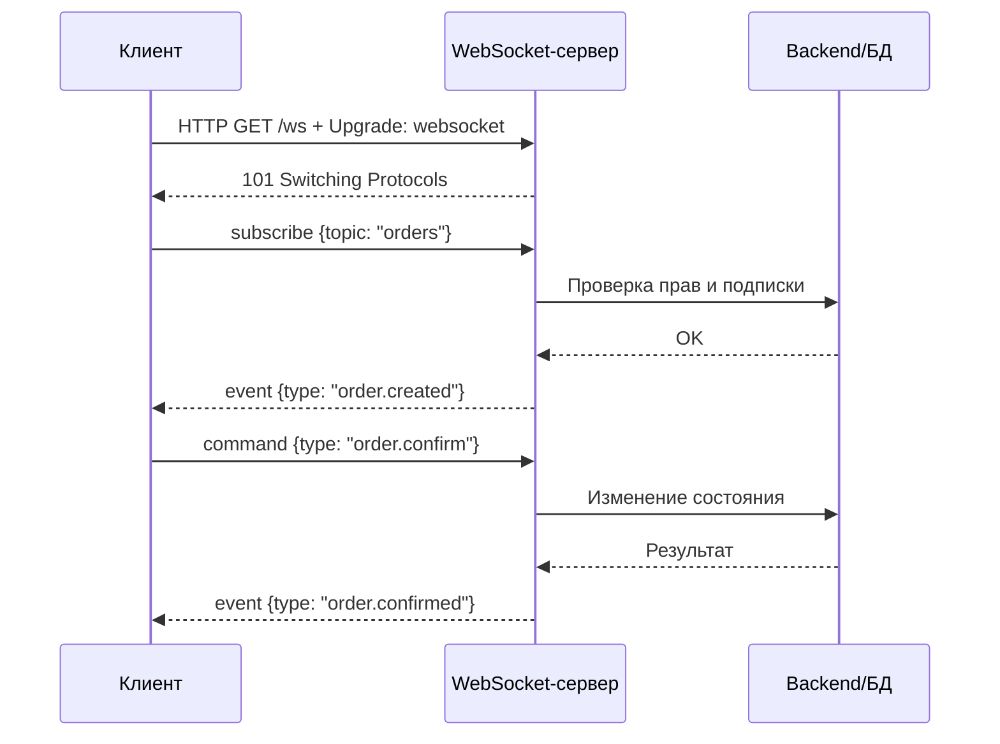
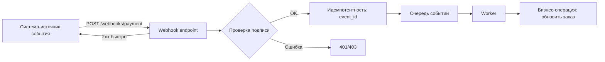
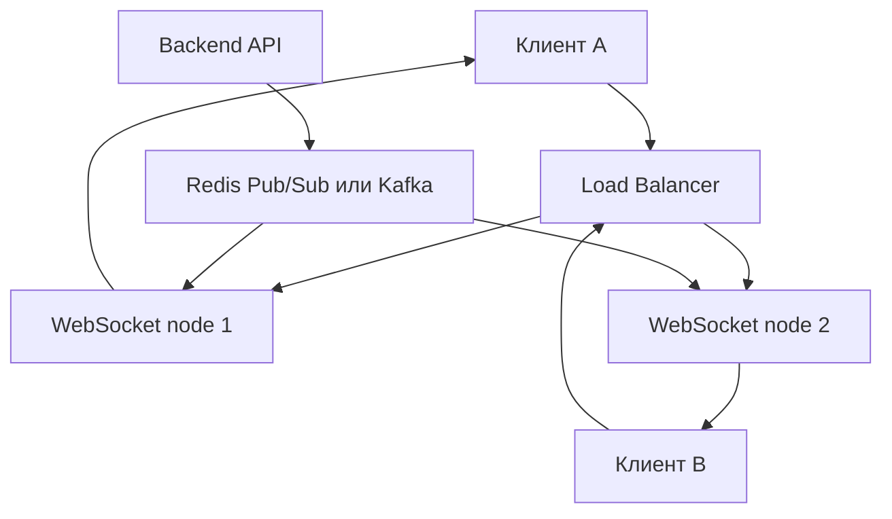
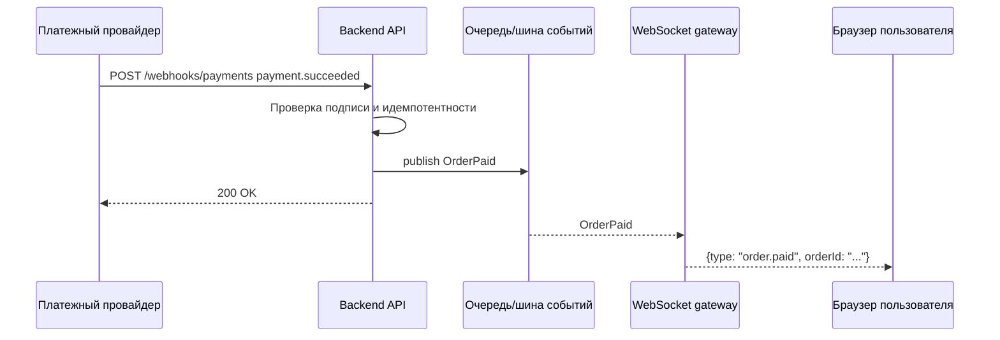

# 5. Интеграция на основе архитектурного стиля WebSocket и WebHook

## Краткое определение

**WebSocket** - сетевой протокол и архитектурный стиль взаимодействия, при котором клиент и сервер после начального HTTP-запроса устанавливают долговременное двунаправленное соединение. После открытия канала обе стороны могут отправлять сообщения в любой момент без создания нового HTTP-запроса на каждое сообщение. Такой подход используют для real-time интерфейсов: чатов, торговых терминалов, совместного редактирования, онлайн-игр, live-уведомлений.

**WebHook** - способ интеграции, при котором одна система вызывает заранее зарегистрированный HTTP endpoint другой системы при наступлении события. Обычно это callback по HTTP(S): источник события отправляет `POST` с JSON-полезной нагрузкой, а принимающая сторона быстро подтверждает получение кодом `2xx` и обрабатывает событие синхронно или через очередь. WebHook используют для событий платежей, репозиториев, CRM, CI/CD, доставки уведомлений между backend-системами.

Главное различие: **WebSocket поддерживает постоянный real-time канал**, а **WebHook является событийным HTTP-callback без постоянного соединения**.

## Место в интеграционной архитектуре

Оба подхода относятся к event-driven интеграции, но решают разные задачи.

WebSocket ближе к интерактивной связи "клиент - сервер" или "сервис - сервис", где важны малые задержки, двусторонний обмен и сохранение контекста соединения. Соединение живет минуты, часы или дольше, а сообщения идут по одному каналу.

WebHook ближе к асинхронной интеграции "поставщик события - подписчик", где важны простота, независимость систем и доставка события при изменении состояния. Постоянного канала нет: каждое событие доставляется отдельным HTTP-запросом.

## WebSocket: схема работы

1. Клиент отправляет HTTP-запрос с заголовком `Upgrade: websocket`.
2. Сервер подтверждает переключение протокола ответом `101 Switching Protocols`.
3. Поверх TCP-соединения начинается WebSocket-обмен кадрами.
4. Клиент и сервер обмениваются сообщениями независимо друг от друга.
5. Для контроля жизнеспособности соединения используют `ping/pong`, heartbeat, таймауты и переподключение.



## WebHook: схема работы

1. Получатель регистрирует URL endpoint у поставщика событий.
2. Поставщик сохраняет URL, секрет подписи, набор интересующих событий.
3. При наступлении события поставщик отправляет `POST` на endpoint получателя.
4. Получатель проверяет подпись, тип события, идентификатор события и время.
5. Получатель быстро возвращает `2xx`, чтобы подтвердить прием.
6. Основная бизнес-обработка обычно выполняется через очередь или фоновую задачу.
7. При ошибках поставщик может повторять доставку.



## Push, real-time и callbacks

Термин **push** означает, что инициатором передачи является не потребитель данных, а система, у которой появилось событие или новое состояние. В этом смысле и WebSocket, и WebHook поддерживают push-модель.

Но push бывает разным:

- **Real-time push**: данные доставляются почти мгновенно по открытому каналу. Это WebSocket, Server-Sent Events, иногда MQTT. Получатель уже подключен и ждет сообщения.
- **Callback push**: источник вызывает URL получателя при событии. Это WebHook. Получатель не держит постоянное соединение с источником, но должен быть доступен по сети.
- **Polling**: потребитель сам периодически спрашивает источник: "есть ли изменения?". Это не push, а pull-модель.

WebSocket уместен, когда пользователь или система должны видеть изменение сразу и поддерживать интерактивный диалог. WebHook уместен, когда одна backend-система должна уведомить другую о факте события.

## Пример реализации WebSocket

Ниже пример на Node.js с библиотекой `ws`. Сервер принимает соединения, хранит клиентов и рассылает событие всем подключенным пользователям.

```js
// server.js
const http = require("http");
const WebSocket = require("ws");

const server = http.createServer();
const wss = new WebSocket.Server({ server, path: "/ws" });

const clients = new Set();

wss.on("connection", (socket, request) => {
  clients.add(socket);

  socket.send(JSON.stringify({
    type: "connected",
    message: "WebSocket connection established"
  }));

  socket.on("message", (raw) => {
    let message;
    try {
      message = JSON.parse(raw);
    } catch {
      socket.send(JSON.stringify({ type: "error", message: "Invalid JSON" }));
      return;
    }

    if (message.type === "chat.message") {
      const event = JSON.stringify({
        type: "chat.message",
        text: message.text,
        createdAt: new Date().toISOString()
      });

      for (const client of clients) {
        if (client.readyState === WebSocket.OPEN) {
          client.send(event);
        }
      }
    }
  });

  socket.on("close", () => {
    clients.delete(socket);
  });
});

server.listen(8080, () => {
  console.log("WebSocket server listens on http://localhost:8080/ws");
});
```

Клиентская часть:

```html
<script>
  const socket = new WebSocket("ws://localhost:8080/ws");

  socket.addEventListener("open", () => {
    socket.send(JSON.stringify({
      type: "chat.message",
      text: "Привет"
    }));
  });

  socket.addEventListener("message", (event) => {
    const data = JSON.parse(event.data);
    console.log("event from server:", data);
  });
</script>
```

В реальном проекте к этому добавляют аутентификацию, проверку прав на подписку, ограничение размера сообщений, heartbeat, обработку переподключения, логирование и масштабирование через брокер сообщений.

## Пример реализации WebHook

Пример endpoint на Express. Он принимает событие, проверяет подпись HMAC, защищается от повторной обработки и кладет событие в очередь.

```js
// webhook.js
const crypto = require("crypto");
const express = require("express");

const app = express();
const secret = process.env.WEBHOOK_SECRET;
const processedEvents = new Set();

app.use("/webhooks/orders", express.raw({ type: "application/json" }));

function verifySignature(rawBody, signature, secretValue) {
  const expected = crypto
    .createHmac("sha256", secretValue)
    .update(rawBody)
    .digest("hex");

  return crypto.timingSafeEqual(
    Buffer.from(signature, "hex"),
    Buffer.from(expected, "hex")
  );
}

app.post("/webhooks/orders", async (req, res) => {
  const signature = req.header("X-Signature");

  if (!signature || !verifySignature(req.body, signature, secret)) {
    return res.status(401).send("Invalid signature");
  }

  const event = JSON.parse(req.body.toString("utf8"));

  if (processedEvents.has(event.id)) {
    return res.status(200).send("Already processed");
  }

  processedEvents.add(event.id);

  // В production здесь лучше отправить событие в очередь:
  // await queue.publish("orders.webhook.received", event);
  console.log("received event:", event.type);

  res.status(200).send("OK");
});

app.listen(3000);
```

Пример события:

```json
{
  "id": "evt_10001",
  "type": "order.paid",
  "created_at": "2026-06-03T10:00:00Z",
  "data": {
    "order_id": "ord_42",
    "amount": 1990,
    "currency": "RUB"
  }
}
```

Важная деталь: подпись обычно считают по "сырому" телу запроса, а не по уже распарсенному JSON. Если middleware изменит пробелы, порядок полей или кодировку, проверка подписи может сломаться.

## Масштабирование WebSocket

Проблема WebSocket состоит в том, что соединение является состоянием. Если пользователь подключился к конкретному экземпляру сервера, этот экземпляр знает его socket. При горизонтальном масштабировании появляются вопросы:

- как маршрутизировать клиента к тому же экземпляру;
- как доставить событие пользователю, если событие появилось на другом экземпляре;
- как хранить подписки;
- как очищать отключенные соединения;
- как выдерживать большое количество открытых TCP-соединений.

Типовая схема:



Load balancer должен поддерживать WebSocket upgrade и длительные соединения. Для доставки событий между экземплярами применяют Redis Pub/Sub, Kafka, RabbitMQ, NATS или другой брокер. Если используется sticky session, она упрощает маршрутизацию, но не отменяет потребность в общей системе публикации событий.

## Масштабирование WebHook

Webhook endpoint обычно проще масштабировать, потому что каждый вызов является обычным HTTP-запросом. Основной риск не в постоянных соединениях, а в надежной обработке событий.

Хорошая схема обработки:

1. Принять запрос.
2. Проверить подпись и формат.
3. Проверить `event_id` на повтор.
4. Сохранить событие или поставить его в очередь.
5. Быстро вернуть `2xx`.
6. Обработать событие асинхронно.

Такой подход защищает систему от таймаутов поставщика и позволяет повторять обработку внутри своей инфраструктуры.

## Безопасность WebSocket

Основные меры:

- использовать `wss://`, то есть WebSocket поверх TLS;
- аутентифицировать клиента при подключении: cookie-сессия, JWT, OAuth access token, одноразовый ticket;
- проверять `Origin`, потому что браузер может открыть WebSocket с другого сайта;
- проверять права на каждую подписку и каждую команду, а не только факт подключения;
- ограничивать размер сообщения и частоту сообщений;
- валидировать JSON-схему входящих команд;
- не доверять идентификаторам пользователя из сообщения, брать пользователя из аутентифицированного контекста;
- закрывать неактивные соединения;
- реализовать heartbeat и таймауты;
- логировать важные события без утечки токенов и персональных данных.

Типичная ошибка безопасности - передавать долгоживущий токен в query string: `wss://example.com/ws?token=...`. Такой URL может попасть в логи proxy, браузера или мониторинга. Лучше использовать защищенные cookie, короткоживущий ticket или заголовки там, где это возможно.

## Безопасность WebHook

Основные меры:

- принимать webhook только по HTTPS;
- проверять подпись сообщения, например HMAC-SHA256;
- использовать отдельный секрет для каждого поставщика или endpoint;
- проверять временную метку, чтобы снизить риск replay-атаки;
- проверять `event_id` и делать обработку идемпотентной;
- быстро отвечать `2xx`, а тяжелую работу переносить в очередь;
- ограничивать входящий трафик rate limit;
- хранить аудит доставок и ошибок;
- не считать IP allowlist единственной защитой, потому что IP-диапазоны могут меняться;
- не выполнять опасные действия только на основании поля `type`, всегда проверять бизнес-состояние через свою БД или API поставщика при необходимости.

Для WebHook особенно важна идемпотентность: одно и то же событие может прийти повторно из-за retry-механизма, сетевого сбоя или ручной повторной отправки.

## Сравнение WebSocket и WebHook

| Критерий | WebSocket | WebHook |
|---|---|---|
| Тип связи | Долговременное двустороннее соединение | Одноразовый HTTP-callback на событие |
| Инициатор | Любая сторона после открытия канала | Источник события |
| Направление | Full-duplex | Обычно source -> receiver |
| Задержка | Очень низкая, подходит для real-time | Низкая или средняя, зависит от доставки HTTP |
| Состояние | Stateful: нужно хранить соединения | Mostly stateless: каждый запрос независим |
| Масштабирование | Сложнее из-за открытых соединений | Проще, как обычный HTTP endpoint |
| Надежность доставки | Нужно проектировать отдельно | Часто есть retry у поставщика |
| Типовые сценарии | Чат, live dashboard, игры, совместная работа | Платежи, GitHub events, CRM events, CI/CD |
| Безопасность | `wss`, Origin, auth, rate limit | HTTPS, подпись, timestamp, idempotency |
| Когда не подходит | Если события редкие и backend-backend | Если нужен постоянный диалог с малой задержкой |

## Когда выбирать WebSocket

WebSocket выбирают, если:

- нужен двусторонний обмен;
- важны задержки в миллисекундах;
- клиент должен мгновенно получать изменения;
- сообщения идут часто;
- пользователь находится в активной сессии;
- протокол взаимодействия похож на поток команд и событий.

Примеры:

- чат между пользователями;
- уведомления о статусе заказа в интерфейсе;
- live-таблица котировок;
- онлайн-игра;
- совместное редактирование документа;
- мониторинг инфраструктуры в реальном времени.

## Когда выбирать WebHook

WebHook выбирают, если:

- одна система должна уведомить другую о событии;
- постоянное соединение не нужно;
- события могут обрабатываться асинхронно;
- интеграция идет между backend-системами;
- достаточно HTTP endpoint и retry-политики;
- важно отделить поставщика события от получателя.

Примеры:

- платежная система сообщает, что платеж прошел;
- GitHub сообщает о push или pull request;
- CRM сообщает о создании лида;
- сервис рассылок сообщает о доставке письма;
- CI-система сообщает о завершении сборки.

## Совместное использование

На практике WebSocket и WebHook часто используют вместе.

Пример: платежный сервис отправляет backend-приложению webhook `payment.succeeded`. Backend проверяет подпись, обновляет заказ и публикует внутреннее событие. WebSocket-сервер получает внутреннее событие и мгновенно отправляет пользователю обновление в браузер.



Такой вариант показывает различие ролей: WebHook принимает внешнее backend-событие, а WebSocket доставляет результат пользователю в real-time интерфейс.

## Типичные ошибки

### Ошибки при WebSocket

- Отсутствие повторного подключения на клиенте.
- Нет heartbeat, поэтому "мертвые" соединения остаются в памяти.
- Аутентификация проверяется только при подключении, но не проверяются права на конкретные действия.
- Один сервер хранит все соединения, но при масштабировании нет брокера сообщений.
- Нет лимитов на размер и частоту сообщений.
- Неправильная работа за reverse proxy: не поддержан `Upgrade`, слишком короткие таймауты.
- Бизнес-логика зависит от того, что клиент всегда подключен.
- Нет версионирования типов сообщений.
- Секреты или токены передаются в URL и попадают в логи.

### Ошибки при WebHook

- Нет проверки подписи.
- Подпись считается по измененному JSON, а не по raw body.
- Endpoint долго обрабатывает событие и получает таймаут.
- Нет идемпотентности, поэтому повторная доставка создает дубли.
- Система считает порядок доставки гарантированным, хотя события могут прийти не по порядку.
- Нет журнала входящих событий и статусов обработки.
- Секрет один на все интеграции и не ротируется.
- Любой `2xx` считается успешной бизнес-обработкой, хотя событие могло только попасть в очередь.
- Ошибки webhook обрабатываются вручную, без retry и dead-letter queue.

## Надежность и проектирование сообщений

Для обоих подходов важно проектировать сообщения как контракт:

- у каждого сообщения должен быть `type`;
- желательно иметь `id`, `created_at`, `version`;
- полезная нагрузка должна быть валидируемой;
- изменения схемы нужно делать обратно совместимыми;
- ошибки нужно возвращать или публиковать в предсказуемом формате;
- критичные операции должны быть идемпотентными.

Пример универсального event envelope:

```json
{
  "id": "evt_20260603_001",
  "type": "order.status_changed",
  "version": 1,
  "created_at": "2026-06-03T10:00:00Z",
  "data": {
    "order_id": "ord_42",
    "status": "paid"
  }
}
```

Такой envelope можно использовать и для webhook, и для WebSocket-событий. Различаться будет транспорт и политика доставки.

## Вывод

WebSocket и WebHook - два важных подхода к событийной интеграции, но они не являются взаимозаменяемыми. WebSocket нужен для постоянного двустороннего real-time обмена, когда клиент или сервис должен получать события мгновенно и может поддерживать открытое соединение. WebHook нужен для backend-callback интеграции, когда одна система сообщает другой о событии обычным HTTP-запросом.

В экзаменационном ответе важно подчеркнуть: WebSocket - это постоянный канал и full-duplex коммуникация; WebHook - это событийный HTTP callback. WebSocket сложнее масштабировать из-за состояния соединений, а WebHook требует строгой проверки подписи, идемпотентности и обработки повторных доставок. В зрелой архитектуре они часто дополняют друг друга: WebHook принимает внешнее событие, backend фиксирует состояние, а WebSocket доставляет обновление пользователю в реальном времени.

## Источники

- RFC 6455, The WebSocket Protocol: https://www.rfc-editor.org/rfc/rfc6455
- MDN Web Docs, WebSocket API: https://developer.mozilla.org/en-US/docs/Web/API/WebSocket
- GitHub Docs, Using webhooks: https://docs.github.com/en/webhooks/using-webhooks
- GitHub Docs, Validating webhook deliveries: https://docs.github.com/en/webhooks/using-webhooks/validating-webhook-deliveries
- Stripe Documentation, Receive Stripe events in your webhook endpoint: https://docs.stripe.com/webhooks
- Stripe Documentation, Resolve webhook signature verification errors: https://docs.stripe.com/webhooks/signature
