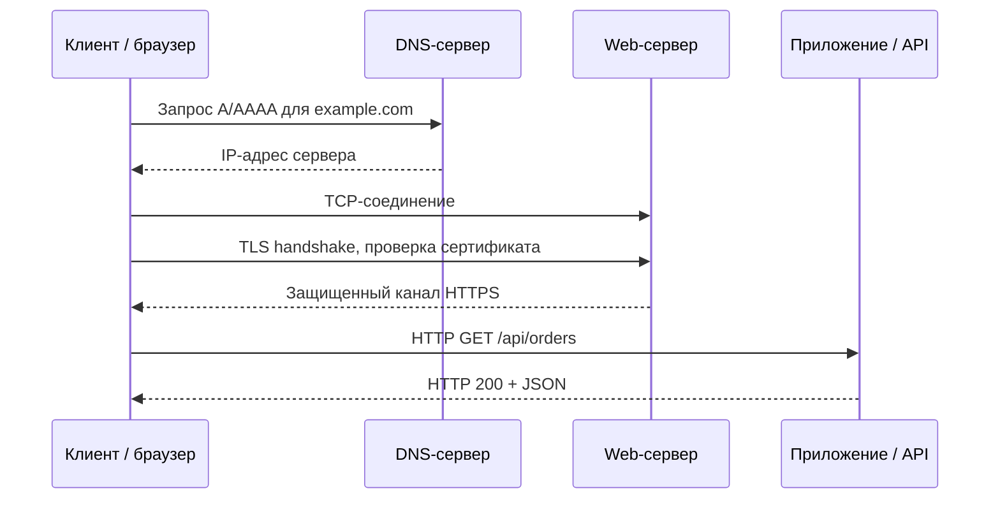
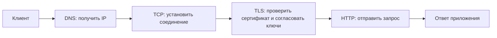
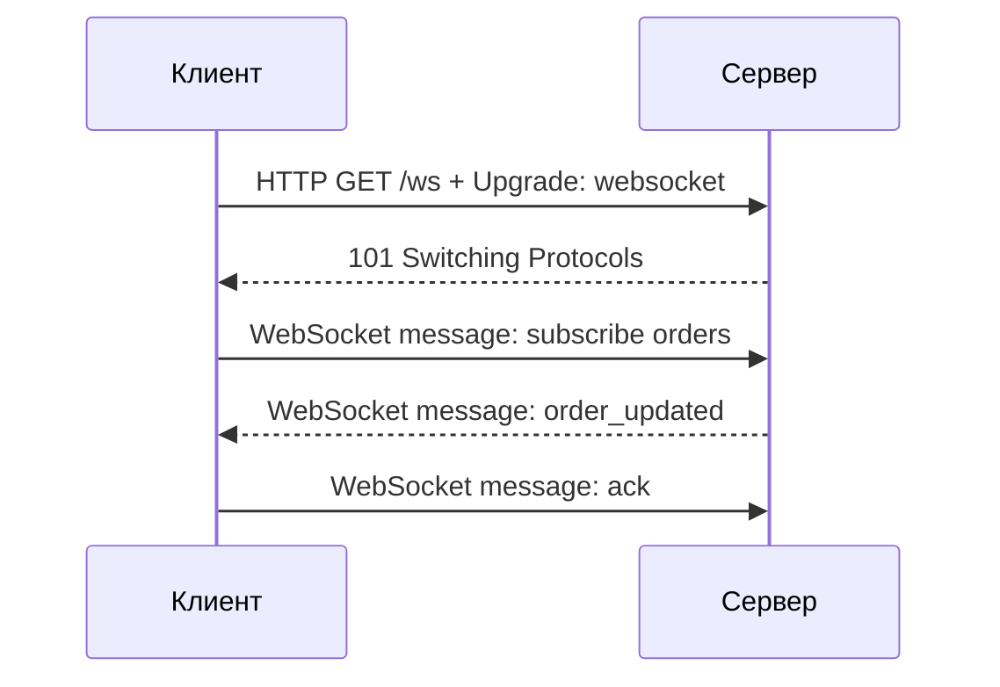
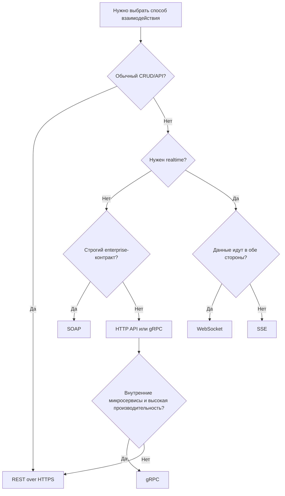

# 6. Протоколы взаимодействия между web-приложениями по сети Интернет

## Краткое определение

**Протокол взаимодействия web-приложений** - это набор правил, по которым клиент, сервер и промежуточные узлы обмениваются данными по сети: как найти адрес сервера, как установить защищенное соединение, как оформить запрос и ответ, как передать ошибку, как поддерживать поток сообщений и как закрыть соединение.

В типичном web-приложении одновременно участвуют несколько уровней:

- **DNS** преобразует доменное имя в IP-адрес.
- **TCP** или **QUIC/UDP** доставляет байтовый поток или пакеты между узлами.
- **TLS** защищает соединение: шифрование, целостность, проверка сертификата сервера.
- **HTTP/HTTPS** задает базовый формат web-запросов и ответов.
- **REST, SOAP, gRPC, WebSocket, SSE** задают более специализированные модели взаимодействия приложений.



## Сетевой контекст: DNS, TCP, TLS и HTTPS

Перед прикладным обменом web-клиент должен понять, куда подключаться и как защитить соединение.

### DNS

**DNS** (Domain Name System) сопоставляет доменные имена с адресами и служебными записями. Например, `api.example.com` может быть преобразован в IPv4-адрес через запись `A` или в IPv6-адрес через `AAAA`.

Пример:

```text
api.example.com -> 203.0.113.10
```

Для web-приложений DNS важен, потому что через него реализуются:

- человекочитаемые имена вместо IP-адресов;
- балансировка через несколько записей;
- CDN и географически близкие узлы;
- смена инфраструктуры без смены URL;
- служебные записи для почты, верификации домена и некоторых API-сценариев.

### TCP

**TCP** обеспечивает надежную доставку байтов: устанавливает соединение, нумерует сегменты, повторяет потерянные данные, управляет потоком и перегрузкой. HTTP/1.1, HTTP/2, WebSocket, SOAP over HTTP и классический gRPC используют TCP как транспорт.

Недостаток TCP для web-сценариев - задержка на установку соединения и проблема head-of-line blocking на уровне TCP: потеря одного пакета может задержать последующие данные в том же соединении.

### TLS

**TLS** добавляет к транспортному соединению:

- шифрование данных;
- контроль целостности;
- аутентификацию сервера по сертификату;
- согласование криптографических параметров;
- защиту от прослушивания и подмены.

**HTTPS** - это HTTP поверх TLS. Для пользователя и приложения это означает, что URL начинается с `https://`, а данные HTTP-запроса и HTTP-ответа передаются внутри защищенного канала.

Упрощенная схема HTTPS:



## HTTP и HTTPS

**HTTP** (Hypertext Transfer Protocol) - основной протокол прикладного уровня для web. Он описывает семантику запросов и ответов: методы, заголовки, статусы, тело сообщения, кэширование, перенаправления, согласование форматов и т.д.

HTTP является протоколом типа **request-response**:

1. Клиент отправляет запрос.
2. Сервер обрабатывает его.
3. Сервер возвращает ответ.

Пример HTTP-запроса:

```http
GET /api/users/42 HTTP/1.1
Host: example.com
Accept: application/json
Authorization: Bearer eyJhbGciOi...
```

Пример HTTP-ответа:

```http
HTTP/1.1 200 OK
Content-Type: application/json
Cache-Control: no-store

{
  "id": 42,
  "name": "Ivan Petrov"
}
```

### Основные методы HTTP

| Метод | Назначение | Идемпотентность |
|---|---|---|
| `GET` | Получить ресурс | Да |
| `POST` | Создать ресурс или выполнить операцию | Обычно нет |
| `PUT` | Полностью заменить ресурс | Да |
| `PATCH` | Частично изменить ресурс | Не всегда |
| `DELETE` | Удалить ресурс | Да |
| `HEAD` | Получить заголовки без тела | Да |
| `OPTIONS` | Узнать поддерживаемые возможности | Да |

**Идемпотентность** означает, что повтор одного и того же запроса дает тот же эффект на состояние системы. Например, повторный `DELETE /users/42` не должен удалять дополнительные сущности.

### Коды состояния HTTP

HTTP-статусы группируются по первой цифре:

| Группа | Значение | Примеры |
|---|---|---|
| `1xx` | Информационные ответы | `100 Continue` |
| `2xx` | Успешная обработка | `200 OK`, `201 Created`, `204 No Content` |
| `3xx` | Перенаправления | `301 Moved Permanently`, `302 Found`, `304 Not Modified` |
| `4xx` | Ошибка клиента | `400 Bad Request`, `401 Unauthorized`, `403 Forbidden`, `404 Not Found`, `409 Conflict` |
| `5xx` | Ошибка сервера | `500 Internal Server Error`, `502 Bad Gateway`, `503 Service Unavailable`, `504 Gateway Timeout` |

### Версии HTTP

| Версия | Ключевые свойства |
|---|---|
| **HTTP/1.1** | Текстовый протокол, keep-alive, один активный ответ на соединение в обычном режиме |
| **HTTP/2** | Бинарное фреймирование, мультиплексирование потоков, HPACK-сжатие заголовков |
| **HTTP/3** | Работает поверх QUIC/UDP, уменьшает влияние потерь пакетов на независимые потоки |

Для web-приложений важно, что семантика методов и статусов в целом сохраняется, а версия HTTP меняет в основном способ передачи сообщений по сети.

## REST

**REST** (Representational State Transfer) - архитектурный стиль для распределенных систем. В web-разработке REST обычно реализуется поверх HTTP: ресурсы доступны по URI, а операции над ними выражаются HTTP-методами.

REST - это не отдельный сетевой протокол, а набор архитектурных ограничений.

Основные идеи REST:

- **ресурсы** имеют устойчивые URI: `/users/42`, `/orders/1001`;
- клиент и сервер обмениваются **представлениями ресурсов**: JSON, XML, HTML;
- используется единый интерфейс: HTTP-методы и статусы;
- взаимодействие обычно **stateless**: каждый запрос содержит все данные для обработки;
- возможно кэширование;
- клиент отделен от сервера.

Пример REST API:

```http
POST /api/orders HTTP/1.1
Host: shop.example.com
Content-Type: application/json

{
  "userId": 42,
  "items": [
    { "sku": "BOOK-1", "count": 2 }
  ]
}
```

Ответ:

```http
HTTP/1.1 201 Created
Content-Type: application/json
Location: /api/orders/1001

{
  "id": 1001,
  "status": "created"
}
```

### Типичные REST-ошибки

- Использовать `GET` для операций, меняющих состояние: например, `GET /deleteUser?id=42`.
- Возвращать `200 OK` для всех ошибок вместо корректных `4xx` и `5xx`.
- Делать URL глаголами вместо ресурсов: `/createOrder` вместо `POST /orders`.
- Хранить состояние сессии так, что запрос нельзя обработать независимо.
- Не документировать формат ошибок.

Хороший формат ошибки обычно содержит машинно-читаемый код, текст и детали:

```json
{
  "error": "validation_error",
  "message": "Field email is invalid",
  "details": {
    "field": "email"
  }
}
```

## SOAP

**SOAP** (Simple Object Access Protocol) - протокол обмена структурированными сообщениями, обычно в XML. Он часто используется в корпоративных интеграциях, банковских системах, государственных сервисах и старых enterprise-системах.

SOAP может работать поверх HTTP, SMTP и других транспортов, но на практике часто встречается **SOAP over HTTP/HTTPS**.

Основные свойства SOAP:

- строгий XML-формат сообщения;
- envelope-структура: `Envelope`, `Header`, `Body`;
- формальное описание сервиса через WSDL;
- расширения WS-* для безопасности, транзакций, надежной доставки;
- высокая совместимость с enterprise-инструментами.

Пример SOAP-запроса:

```xml
POST /PaymentService HTTP/1.1
Host: bank.example.com
Content-Type: application/soap+xml

<?xml version="1.0"?>
<env:Envelope xmlns:env="http://www.w3.org/2003/05/soap-envelope">
  <env:Header>
    <auth:Token xmlns:auth="https://bank.example.com/auth">abc123</auth:Token>
  </env:Header>
  <env:Body>
    <pay:GetPaymentStatus xmlns:pay="https://bank.example.com/payments">
      <pay:PaymentId>1001</pay:PaymentId>
    </pay:GetPaymentStatus>
  </env:Body>
</env:Envelope>
```

Пример SOAP Fault:

```xml
<env:Envelope xmlns:env="http://www.w3.org/2003/05/soap-envelope">
  <env:Body>
    <env:Fault>
      <env:Code>
        <env:Value>env:Sender</env:Value>
      </env:Code>
      <env:Reason>
        <env:Text xml:lang="ru">Некорректный идентификатор платежа</env:Text>
      </env:Reason>
    </env:Fault>
  </env:Body>
</env:Envelope>
```

Плюсы SOAP:

- строгий контракт;
- развитые стандарты безопасности и надежности;
- удобен для формальных интеграций между организациями.

Минусы SOAP:

- большой объем XML;
- сложность настройки;
- менее удобен для browser/mobile-first API;
- выше порог входа по сравнению с REST/JSON.

## WebSocket

**WebSocket** - протокол для постоянного двустороннего обмена сообщениями между клиентом и сервером. Он начинается с HTTP-запроса на upgrade, после чего соединение переходит в WebSocket-режим.

WebSocket нужен там, где сервер и клиент должны обмениваться данными почти в реальном времени:

- чаты;
- биржевые котировки;
- онлайн-игры;
- совместное редактирование документов;
- уведомления с возможностью ответа клиента;
- панели мониторинга.

Схема установки WebSocket:

```http
GET /chat HTTP/1.1
Host: example.com
Connection: Upgrade
Upgrade: websocket
Sec-WebSocket-Key: dGhlIHNhbXBsZSBub25jZQ==
Sec-WebSocket-Version: 13
```

После успешного upgrade сервер отвечает статусом `101 Switching Protocols`, и стороны начинают обмениваться WebSocket-фреймами.



Особенности WebSocket:

- одно постоянное соединение;
- обмен в обе стороны без нового HTTP-запроса на каждое сообщение;
- меньшие накладные расходы после установления соединения;
- нужно самостоятельно проектировать формат сообщений и авторизацию;
- сложнее масштабировать, потому что сервер держит активные соединения.

Типичные ошибки:

- не проверять origin и токен авторизации при подключении;
- не реализовывать heartbeat/ping-pong и обнаружение мертвых соединений;
- отправлять слишком крупные сообщения без лимитов;
- не учитывать горизонтальное масштабирование и sticky sessions;
- смешивать бизнес-события без версионирования формата сообщений.

## SSE

**SSE** (Server-Sent Events) - механизм, при котором сервер отправляет поток событий клиенту по обычному HTTP-соединению. В браузере для этого используется `EventSource`.

SSE подходит для сценариев, где нужен поток данных **от сервера к клиенту**, но не требуется полноценный двусторонний канал:

- уведомления;
- лента событий;
- прогресс длительной операции;
- обновления мониторинга;
- серверная трансляция статусов.

Пример клиента:

```javascript
const events = new EventSource("/api/events");

events.onmessage = (event) => {
  console.log("event:", event.data);
};
```

Пример ответа сервера:

```http
HTTP/1.1 200 OK
Content-Type: text/event-stream
Cache-Control: no-cache

event: order_updated
data: {"id":1001,"status":"paid"}

event: order_updated
data: {"id":1002,"status":"cancelled"}
```

Плюсы SSE:

- проще WebSocket;
- работает поверх HTTP;
- есть автоматическое переподключение в браузере;
- удобно для однонаправленных событий.

Минусы SSE:

- клиент не отправляет сообщения по этому же каналу;
- ограничения браузеров на число соединений могут мешать;
- не все прокси одинаково хорошо работают с долгими streaming-ответами;
- для бинарных данных неудобен.

## gRPC

**gRPC** - RPC-фреймворк, в котором клиент вызывает методы удаленного сервиса почти как локальные функции. Обычно gRPC использует HTTP/2 как транспорт и Protocol Buffers как язык описания интерфейса и формат сериализации.

Пример `.proto`-контракта:

```proto
syntax = "proto3";

service OrderService {
  rpc GetOrder(GetOrderRequest) returns (Order);
  rpc WatchOrders(WatchOrdersRequest) returns (stream OrderEvent);
}

message GetOrderRequest {
  int64 id = 1;
}

message Order {
  int64 id = 1;
  string status = 2;
}

message WatchOrdersRequest {
  int64 user_id = 1;
}

message OrderEvent {
  int64 order_id = 1;
  string type = 2;
}
```

Возможные типы gRPC-вызовов:

| Тип | Описание |
|---|---|
| Unary RPC | Один запрос - один ответ |
| Server streaming | Один запрос - поток ответов |
| Client streaming | Поток запросов - один ответ |
| Bidirectional streaming | Поток запросов и поток ответов одновременно |

Плюсы gRPC:

- строгий контракт;
- компактная бинарная сериализация;
- высокая производительность;
- поддержка потоков;
- генерация клиентского и серверного кода.

Минусы gRPC:

- хуже читается и отлаживается вручную, чем JSON over HTTP;
- браузерная поддержка требует gRPC-Web или прокси;
- сложнее интегрировать с публичными API для широкого круга клиентов;
- нужен процесс генерации кода из `.proto`.

gRPC особенно полезен для внутренних микросервисных взаимодействий, где важны контракт, производительность и потоковая передача.

## Сравнение протоколов и подходов

| Подход | Модель | Формат | Транспорт | Лучшие сценарии | Ограничения |
|---|---|---|---|---|---|
| HTTP/HTTPS | Запрос-ответ | Любой: HTML, JSON, XML, файлы | TCP/TLS или QUIC/TLS | Web-страницы, API, загрузка ресурсов | Сам по себе не задает стиль API |
| REST | Ресурсы и HTTP-методы | Обычно JSON | HTTP/HTTPS | Публичные API, CRUD, web/mobile | Нужна дисциплина проектирования |
| SOAP | Формальные XML-сообщения | XML | Часто HTTP/HTTPS | Enterprise, банки, госинтеграции | Сложность и тяжеловесность |
| WebSocket | Постоянный двусторонний канал | Текст/бинарные фреймы | TCP/TLS после HTTP upgrade | Чаты, игры, realtime | Сложнее масштабирование и контроль соединений |
| SSE | Поток сервер-клиент | `text/event-stream` | HTTP/HTTPS | Уведомления, прогресс, live feed | Только server-to-client |
| gRPC | Удаленные вызовы методов | Protobuf | HTTP/2 | Микросервисы, streaming, внутренние API | Не так удобен для обычного браузера |

## Как выбрать протокол

Для большинства публичных web API разумный выбор по умолчанию - **REST over HTTPS** с JSON: он прост, хорошо поддерживается браузерами, мобильными клиентами, gateway, логированием и инструментами тестирования.

Если нужен постоянный двусторонний realtime-канал, лучше подходит **WebSocket**. Если поток нужен только от сервера к браузеру, проще использовать **SSE**. Если система состоит из внутренних сервисов с жесткими контрактами и высокими требованиями к производительности, стоит рассмотреть **gRPC**. Для формальных интеграций с legacy/enterprise-системами остается актуальным **SOAP**.



## Ошибки и проблемы при сетевом взаимодействии

### Ошибки DNS

- домен не существует;
- неверная DNS-запись;
- устаревший кэш;
- слишком большой TTL при миграции;
- неправильная настройка CDN или балансировщика.

### Ошибки TCP/TLS

- сервер недоступен по IP и порту;
- истекло время соединения;
- сертификат TLS просрочен или выпущен не на тот домен;
- клиент и сервер не согласовали версию TLS или набор шифров;
- корпоративный proxy вмешивается в TLS-соединение.

### Ошибки HTTP/API

- некорректный метод или URL;
- неверный формат тела запроса;
- отсутствует `Content-Type`;
- неверные учетные данные;
- CORS-блокировка в браузере;
- превышение лимитов rate limiting;
- таймаут upstream-сервиса;
- несовместимые версии API.

### Ошибки realtime-протоколов

- обрыв долгого соединения;
- потеря подписки после reconnect;
- дублирование событий;
- отсутствие backpressure;
- неограниченный рост очереди сообщений;
- неконсистентность при масштабировании между несколькими экземплярами сервера.

## Безопасность

Для web-приложений практически всегда следует использовать **HTTPS**, а не открытый HTTP. Кроме TLS, нужны прикладные меры:

- аутентификация: cookie-сессии, OAuth 2.0, JWT, mutual TLS;
- авторизация на уровне ресурса и действия;
- проверка входных данных;
- защита от CSRF для cookie-based запросов;
- настройка CORS для браузерных клиентов;
- rate limiting и защита от brute force;
- безопасное хранение секретов;
- аудит и логирование без утечки токенов.

Для WebSocket важно проверять не только токен, но и источник подключения (`Origin`), потому что браузер может устанавливать WebSocket-соединение с другого сайта.

## Вывод

Взаимодействие web-приложений в Интернете строится как стек протоколов. DNS помогает найти сервер, TCP или QUIC доставляет данные, TLS защищает канал, а HTTP/HTTPS задает базовую модель web-обмена. Поверх этой базы используются разные подходы: REST для ресурсных API, SOAP для строгих XML-интеграций, WebSocket для двустороннего realtime, SSE для событий от сервера к клиенту и gRPC для производительного RPC между сервисами.

Главная инженерная задача - выбрать протокол по характеру обмена: запрос-ответ, поток сервер-клиент, двусторонний поток, формальный enterprise-контракт или высокопроизводительный внутренний RPC. Неправильный выбор усложняет масштабирование, безопасность, отладку и поддержку API.

## Источники

1. RFC 9110: HTTP Semantics - https://www.rfc-editor.org/rfc/rfc9110.html
2. RFC 8446: The Transport Layer Security (TLS) Protocol Version 1.3 - https://www.rfc-editor.org/rfc/rfc8446
3. RFC 6455: The WebSocket Protocol - https://www.rfc-editor.org/rfc/rfc6455
4. RFC 1035: Domain Names - Implementation and Specification - https://www.rfc-editor.org/rfc/rfc1035
5. Roy Fielding, Architectural Styles and the Design of Network-based Software Architectures - https://ics.uci.edu/~fielding/pubs/dissertation/top.htm
6. W3C SOAP Version 1.2 Part 1: Messaging Framework - https://www.w3.org/TR/soap12/
7. WHATWG HTML Living Standard, Server-sent events - https://html.spec.whatwg.org/multipage/server-sent-events.html
8. gRPC Core Concepts - https://grpc.io/docs/what-is-grpc/core-concepts/
