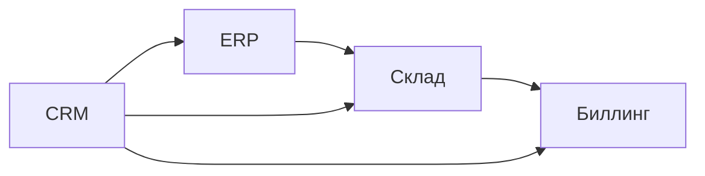
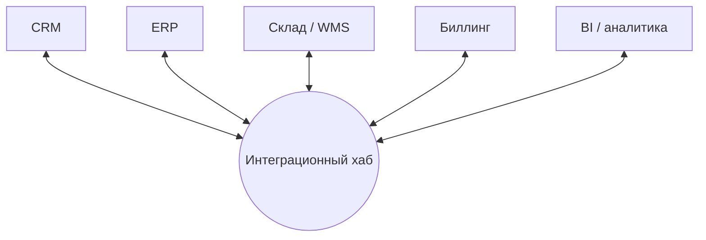
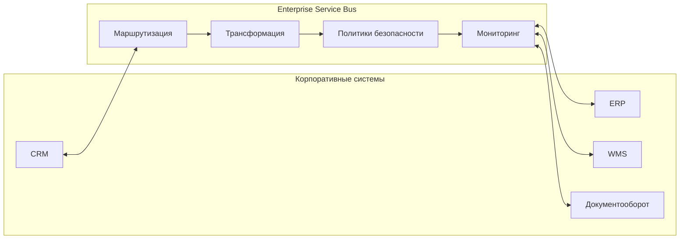
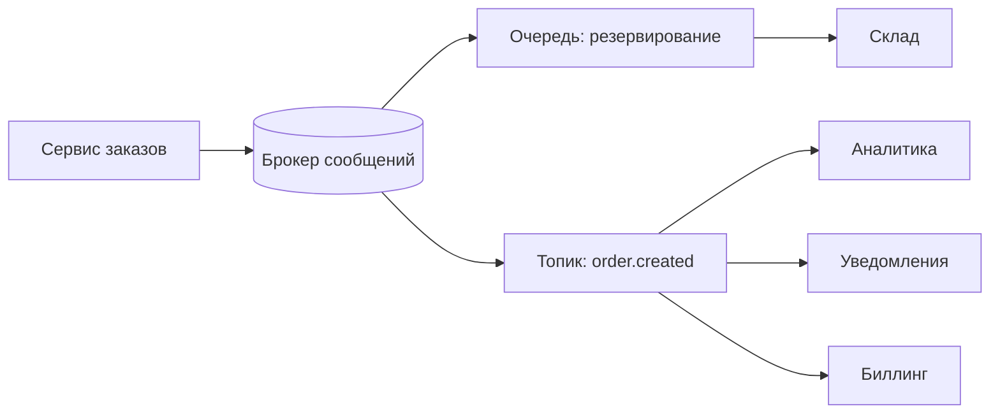
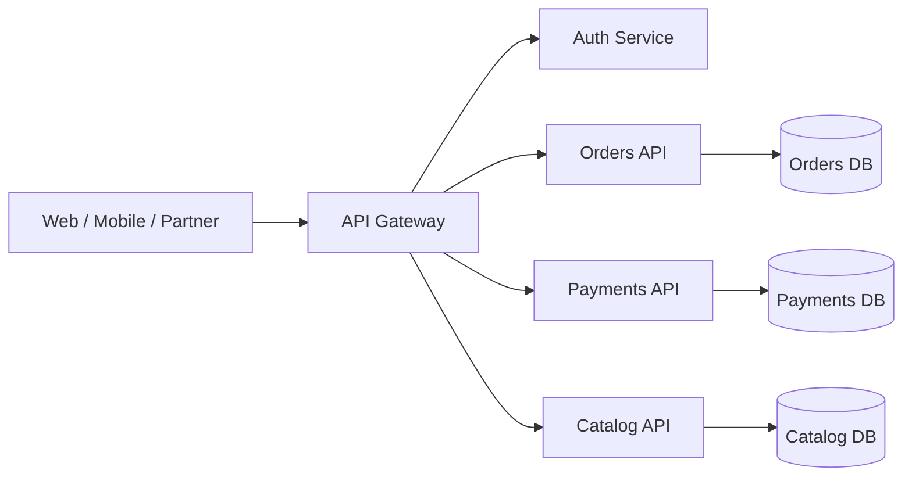
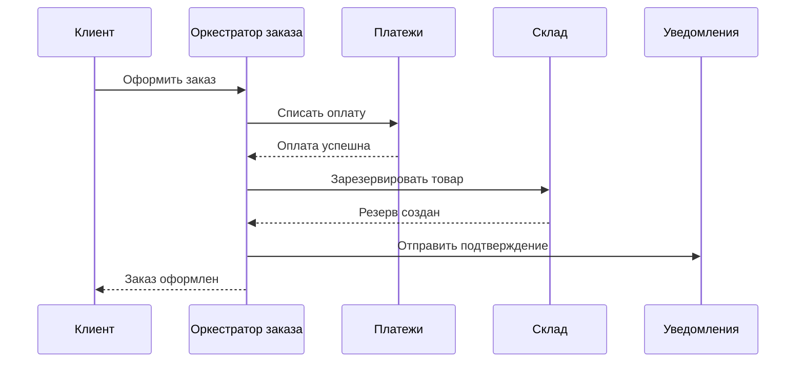
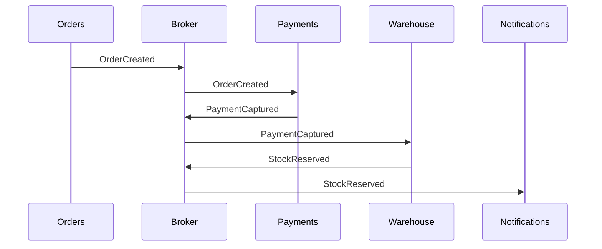
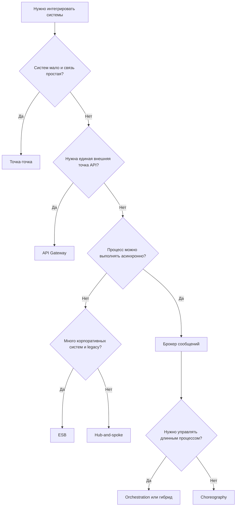

# 7. Шаблоны интеграций информационных систем по структуре взаимодействия

## Краткий ответ

Интеграционный шаблон по структуре взаимодействия описывает, **как именно информационные системы связаны между собой**: напрямую, через центральный узел, через шину, через брокер сообщений, через API-шлюз или через координацию бизнес-процесса. Такие шаблоны нужны, чтобы управлять связностью систем, масштабируемостью, надежностью, стоимостью сопровождения и контролем над бизнес-процессами.

Основные структурные шаблоны:

1. **Точка-точка (point-to-point)** - системы соединяются напрямую.
2. **Хаб-и-спицы (hub-and-spoke)** - все взаимодействия идут через центральный интеграционный узел.
3. **Шина ESB (Enterprise Service Bus)** - общий интеграционный слой с маршрутизацией, трансформацией и политиками взаимодействия.
4. **Брокер сообщений (message broker)** - асинхронный обмен через очереди и топики.
5. **API Gateway** - единая входная точка для клиентов и внешних систем к набору сервисов.
6. **Choreography / orchestration** - два способа организовать распределенный бизнес-процесс: через самостоятельную реакцию участников на события или через центральный управляющий процесс.

## 1. Зачем нужны интеграционные шаблоны

В реальной организации редко существует одна монолитная система. Обычно есть ERP, CRM, сайт, мобильное приложение, складская система, биллинг, платежный сервис, BI, документооборот и внешние государственные или партнерские системы. Интеграция нужна, чтобы эти системы обменивались данными и совместно поддерживали бизнес-процессы.

Без выбранного шаблона интеграция быстро становится хаотичной:

- каждую систему приходится связывать с каждой;
- меняется формат данных в одной системе - ломаются многие связи;
- сложно отследить, где потерялось сообщение;
- нет единой политики безопасности;
- возникает дублирование бизнес-логики;
- трудно масштабировать отдельные части процесса.

Структурный шаблон интеграции задает архитектурную форму взаимодействия: кто с кем говорит, кто маршрутизирует запросы, где выполняется преобразование данных, кто отвечает за надежность доставки и где находится управление процессом.

## 2. Точка-точка (Point-to-Point)

### Сущность

**Точка-точка** - это прямое соединение двух систем. Одна система вызывает другую напрямую: по REST API, SOAP, RPC, через прямой обмен файлами, прямое подключение к базе данных или другой выделенный канал.

Простейшая схема:

### Пример

CRM при создании заказа напрямую вызывает API ERP, чтобы создать заказ в учетной системе. Затем ERP напрямую вызывает складскую систему для резервирования товара.

### Плюсы

- простая реализация для малого числа систем;
- минимальная инфраструктура;
- низкая начальная стоимость;
- легко понять отдельную интеграционную связь;
- хорошо подходит для единичных интеграций между двумя системами.

### Минусы

- при росте числа систем количество связей быстро увеличивается;
- высокая связность: изменение API одной системы требует изменений у всех потребителей;
- сложнее централизованно контролировать безопасность, логирование и мониторинг;
- часто появляются разные форматы данных для похожих сущностей;
- трудно переиспользовать интеграционную логику.

Если систем `n`, потенциальное количество прямых связей может приближаться к `n * (n - 1) / 2`. Например, для 6 систем это уже до 15 связей, для 10 - до 45.

### Когда применять

Точка-точка уместна, если:

- систем мало;
- связь действительно уникальна;
- интеграция простая и стабильная;
- нет потребности в сложной маршрутизации;
- важна скорость реализации.

### Типичная ошибка

Самая частая ошибка - начать с точки-точки как с временного решения, а затем не пересмотреть архитектуру при росте числа интеграций. В результате возникает "интеграционная паутина", где изменение одной системы затрагивает множество других.

## 3. Хаб-и-спицы (Hub-and-Spoke)

### Сущность

**Hub-and-spoke** - шаблон, в котором системы не взаимодействуют напрямую, а подключаются к центральному узлу - хабу. Хаб принимает сообщения, маршрутизирует их, преобразует форматы и передает нужным получателям.

### Пример

CRM отправляет в хаб событие "создан заказ". Хаб преобразует данные заказа в формат ERP, отправляет заказ в ERP, затем отправляет укрупненные данные в BI и уведомление в складскую систему.

### Плюсы

- системы меньше зависят друг от друга напрямую;
- проще добавлять новых участников: они подключаются к хабу, а не ко всем системам;
- единое место для маршрутизации и преобразования форматов;
- легче централизовать мониторинг и аудит;
- меньше дублирования интеграционной логики.

### Минусы

- хаб становится критически важной точкой отказа;
- хаб может превратиться в узкое место производительности;
- при плохом проектировании в хабе накапливается слишком много бизнес-логики;
- команда сопровождения хаба может стать организационным bottleneck;
- нужна отдельная инфраструктура и правила эксплуатации.

### Когда применять

Hub-and-spoke подходит, когда:

- систем уже несколько и прямые связи становятся неудобными;
- нужно централизованное преобразование форматов;
- требуется единый контроль обмена;
- интеграционные сценарии относительно управляемы и не требуют сложной распределенной событийной модели.

### Типичная ошибка

Ошибка - сделать хаб не интеграционным посредником, а "суперсистемой", где находится вся бизнес-логика. Тогда доменные системы теряют автономность, а любые изменения проходят через один перегруженный центр.

## 4. Шина ESB (Enterprise Service Bus)

### Сущность

**ESB** - это корпоративная сервисная шина, то есть интеграционный слой, через который сервисы и приложения взаимодействуют по единым правилам. По сравнению с простым хабом ESB обычно предоставляет более богатый набор функций:

- маршрутизация сообщений;
- трансформация форматов;
- адаптеры к различным протоколам;
- оркестрация или координация сервисных вызовов;
- политики безопасности;
- мониторинг;
- управление ошибками;
- нормализация сообщений;
- поддержка синхронного и асинхронного обмена.

### Пример

Банк использует ESB для интеграции фронт-офисной системы, процессинга карт, антифрод-системы, CRM и хранилища данных. Когда клиент совершает операцию, ESB маршрутизирует запрос, применяет правила безопасности, преобразует формат сообщения и отправляет данные нужным системам.

### Плюсы

- стандартизация интеграций в крупной организации;
- поддержка разных протоколов и форматов;
- централизованное управление политиками;
- удобно подключать legacy-системы;
- возможность переиспользования сервисов;
- единая наблюдаемость интеграционных потоков.

### Минусы

- высокая сложность внедрения и сопровождения;
- риск чрезмерной централизации;
- ESB может стать узким местом и единой точкой отказа;
- сильная зависимость команд от интеграционной платформы;
- не всегда хорошо сочетается с микросервисной автономностью, если вся логика маршрутизации и бизнес-процессов сосредоточена в шине.

### Когда применять

ESB оправдана, когда:

- организация крупная;
- много legacy-систем;
- требуется поддержка разных протоколов;
- есть строгие требования к безопасности, аудиту и управлению;
- нужны централизованные интеграционные политики.

### Отличие ESB от простого хаба

Hub-and-spoke - это прежде всего топология: есть центральный узел и подключенные системы. ESB - это более функциональная интеграционная платформа, которая может использовать похожую топологию, но добавляет сервисные контракты, политики, адаптеры, трансформации, мониторинг и управление жизненным циклом интеграций.

## 5. Брокер сообщений

### Сущность

**Брокер сообщений** - это посредник для асинхронного обмена. Отправитель публикует сообщение в очередь или топик, а получатель забирает его позже. Отправитель и получатель не обязаны быть доступны одновременно.

Распространенные технологии: RabbitMQ, Apache Kafka, ActiveMQ, NATS, Redis Streams, IBM MQ, Azure Service Bus, Amazon SQS/SNS.

### Очередь и топик

**Очередь** обычно используется для распределения задач между обработчиками. Сообщение из очереди обрабатывается одним потребителем или одной группой потребителей.

**Топик** используется для публикации событий нескольким подписчикам. Одно событие "заказ создан" может получить аналитика, биллинг, сервис уведомлений и склад.

### Пример

Интернет-магазин после оформления заказа публикует событие `OrderCreated`. Складская система резервирует товар, сервис уведомлений отправляет письмо, биллинг готовит счет, аналитика обновляет отчеты. Все они реагируют независимо.

### Плюсы

- слабая связность отправителей и получателей;
- устойчивость к временной недоступности получателей;
- хорошая масштабируемость обработчиков;
- поддержка событийной архитектуры;
- возможность повторной обработки сообщений;
- естественная интеграция с асинхронными бизнес-процессами.

### Минусы

- сложнее отлаживать распределенный процесс;
- появляется eventual consistency: данные в разных системах могут сходиться не мгновенно;
- нужны правила идемпотентности, повторов и обработки дублей;
- возможны проблемы порядка сообщений;
- сложнее обеспечить транзакционную целостность между несколькими системами;
- требуется мониторинг очередей, лагов и неуспешных обработок.

### Когда применять

Брокер сообщений подходит, когда:

- процесс можно выполнять асинхронно;
- отправитель не должен ждать получателя;
- нужно масштабировать обработчиков;
- важно снизить связность;
- одна операция порождает несколько независимых реакций;
- допустима eventual consistency.

### Типичная ошибка

Ошибка - воспринимать брокер как магическое средство надежности. Брокер доставляет сообщения по своим правилам, но архитектура все равно должна учитывать повторы, дубли, outbox/inbox, dead-letter queues, таймауты, компенсации и идемпотентные обработчики.

## 6. API Gateway

### Сущность

**API Gateway** - единая входная точка для клиентов к набору внутренних сервисов. Обычно он находится на границе системы и решает задачи север-юг трафика: клиентские запросы извне направляются во внутренние сервисы.

Функции API Gateway:

- маршрутизация HTTP/gRPC-запросов;
- аутентификация и авторизация;
- rate limiting;
- TLS termination;
- агрегация ответов;
- преобразование протоколов;
- версионирование API;
- логирование и трассировка;
- защита внутренних сервисов от прямого доступа.

### Пример

Мобильное приложение вызывает один endpoint `/checkout`. API Gateway проверяет токен, ограничивает частоту запросов, направляет часть запроса в сервис заказов, часть - в платежный сервис, а затем возвращает клиенту единый ответ.

### Плюсы

- скрывает внутреннюю структуру сервисов от клиента;
- централизует безопасность на внешней границе;
- упрощает клиентам доступ к микросервисам;
- помогает управлять версиями API;
- позволяет применять лимиты, кэширование и наблюдаемость.

### Минусы

- может стать узким местом;
- при избыточной логике превращается в мини-ESB;
- добавляет дополнительный сетевой переход;
- требует высокой доступности;
- ошибки в gateway влияют на всех клиентов.

### Когда применять

API Gateway нужен, когда:

- есть много внутренних сервисов;
- есть внешние клиенты или партнерские интеграции;
- нужно скрыть внутреннюю топологию;
- требуется единая политика безопасности и лимитов;
- нужно адаптировать API под разные типы клиентов.

### Отличие API Gateway от ESB

API Gateway в первую очередь управляет внешним доступом к API и клиентским трафиком. ESB решает более широкую задачу внутренней корпоративной интеграции: маршрутизация, трансформация, адаптеры, интеграция legacy-систем, обмен сообщениями и сервисные политики. Gateway не должен становиться местом сложной бизнес-оркестрации.

## 7. Choreography и orchestration

### Сущность

В распределенной системе бизнес-процесс часто включает несколько участников. Например, оформление заказа требует создать заказ, списать оплату, зарезервировать товар и отправить уведомление. Такой процесс можно организовать двумя основными способами: **оркестрацией** или **хореографией**.

### Orchestration

**Orchestration** - есть центральный управляющий компонент, который знает сценарий процесса и вызывает участников в нужном порядке.

Плюсы orchestration:

- процесс явно описан в одном месте;
- проще понять последовательность шагов;
- проще реализовать компенсации и контроль состояния;
- удобнее для сложных бизнес-процессов с условиями, таймерами и откатами.

Минусы orchestration:

- оркестратор может стать центральной точкой зависимости;
- сервисы могут стать менее автономными;
- есть риск переноса бизнес-логики из доменных сервисов в оркестратор;
- требуется надежное хранение состояния процесса.

### Choreography

**Choreography** - нет центрального управляющего процесса. Каждый участник подписывается на события и сам решает, что делать.

Плюсы choreography:

- слабая связность участников;
- сервисы автономны;
- легко добавлять новых подписчиков на событие;
- хорошо подходит для событийной архитектуры.

Минусы choreography:

- процесс сложнее увидеть целиком;
- труднее отлаживать и сопровождать цепочки событий;
- возможны скрытые зависимости между событиями;
- сложнее управлять компенсациями;
- нужен хороший мониторинг и трассировка.

### Когда выбирать

Orchestration лучше подходит, когда процесс сложный, требует строгого порядка шагов, компенсаций, SLA, аудита и явного состояния.

Choreography лучше подходит, когда реакции на событие независимы, участники автономны, а добавление новых подписчиков не должно менять инициатора процесса.

На практике часто используется гибрид: крупный процесс управляется оркестратором, а отдельные события внутри него распространяются через брокер сообщений.

## 8. Сравнение шаблонов

| Шаблон | Структура | Связность | Синхронность | Сильные стороны | Основные риски |
|---|---|---:|---|---|---|
| Точка-точка | Прямые связи между системами | Высокая | Обычно синхронная, но может быть файловой или асинхронной | Простота, низкая начальная стоимость | Интеграционная паутина, сложное сопровождение |
| Hub-and-spoke | Центральный хаб и подключенные системы | Средняя | Синхронная или асинхронная | Централизованная маршрутизация и трансформация | Хаб как узкое место и точка отказа |
| ESB | Корпоративная сервисная шина | Средняя | Синхронная и асинхронная | Стандарты, политики, legacy-интеграция | Сложность, чрезмерная централизация |
| Брокер сообщений | Очереди и топики | Низкая | Асинхронная | Масштабируемость, слабая связность, устойчивость | Дубли, порядок сообщений, eventual consistency |
| API Gateway | Единая внешняя точка входа | Средняя | Обычно синхронная | Безопасность, маршрутизация API, удобство клиентов | Gateway как bottleneck или мини-ESB |
| Orchestration | Центральный управляющий процесс | Средняя | Обычно смешанная | Явный контроль процесса, компенсации | Зависимость от оркестратора |
| Choreography | Участники реагируют на события | Низкая | Асинхронная | Автономность, расширяемость | Сложная наблюдаемость процесса |

## 9. Обобщенная схема выбора

## 10. Примеры применения

### Пример 1. Небольшая интеграция CRM и сайта

Сайт передает заявки в CRM через REST API. Участников два, формат стабилен, SLA умеренный. Подходит точка-точка.

Если позже добавятся ERP, колл-центр, аналитика и рассылки, прямое соединение сайта со всеми системами станет неудобным. Тогда лучше перейти к брокеру сообщений или хабу.

### Пример 2. Корпоративная интеграция банка

Есть АБС, CRM, процессинг карт, антифрод, документооборот, хранилище данных, внешние сервисы. Много протоколов, строгий аудит, legacy-системы. Подходит ESB или развитый интеграционный слой с брокерами и адаптерами.

### Пример 3. Микросервисный интернет-магазин

Клиентские приложения обращаются к API Gateway. Внутри доменные сервисы обмениваются событиями через брокер: `OrderCreated`, `PaymentCaptured`, `StockReserved`, `ShipmentCreated`. Оформление заказа может управляться оркестратором, если нужны явные компенсации: вернуть оплату, снять резерв, отменить доставку.

### Пример 4. Аналитическая подписка на события

BI-система должна получать сведения о заказах, но не должна влиять на оформление заказа. Лучше использовать топик брокера сообщений: сервис заказов публикует событие, аналитика подписывается и обрабатывает его независимо.

## 11. Типовые архитектурные ошибки

1. **Слишком много прямых связей.** На раннем этапе точка-точка выглядит дешево, но при росте систем стоимость изменений резко возрастает.

2. **Бизнес-логика в интеграционном слое.** Хаб, ESB или gateway начинают принимать доменные решения вместо прикладных систем. Это усложняет сопровождение и размывает ответственность.

3. **API Gateway как универсальная шина.** Gateway предназначен для внешнего доступа и пограничных политик. Если в нем появляются сложные маршруты бизнес-процесса, трансформации и состояние, он превращается в плохо управляемую ESB.

4. **Игнорирование асинхронной природы брокера.** Если после публикации события система ожидает мгновенной согласованности во всех сервисах, возникает конфликт с моделью eventual consistency.

5. **Нет идемпотентности.** Повторная доставка сообщения не должна приводить к двойному списанию денег, повторному созданию заказа или двойной отправке критичного действия.

6. **Нет dead-letter queue и политики повторов.** Ошибочные сообщения должны попадать в контролируемую зону разбора, а не бесконечно ломать обработчики.

7. **Отсутствие трассировки.** В распределенной интеграции нужен correlation ID, чтобы отследить путь запроса или события через несколько систем.

8. **Смешение choreography и orchestration без правил.** Если часть процесса управляется оркестратором, а часть неявно продолжается событиями, нужно явно документировать границы ответственности.

9. **Синхронные цепочки через много сервисов.** Длинная цепочка REST-вызовов увеличивает задержку и вероятность отказа всего процесса.

10. **Выбор технологии вместо выбора структуры.** Kafka, RabbitMQ, ESB или API Gateway сами по себе не решают архитектурную задачу. Сначала нужно определить форму взаимодействия, требования к согласованности, задержке, надежности и управлению.

## 12. Связь с качественными характеристиками

Выбор интеграционного шаблона влияет на нефункциональные требования:

- **Масштабируемость.** Брокер сообщений и choreography обычно масштабируются лучше прямых синхронных цепочек.
- **Надежность.** Асинхронная доставка помогает переживать временную недоступность получателей, но требует повторов и идемпотентности.
- **Сопровождаемость.** Hub, ESB и gateway централизуют контроль, но могут стать перегруженными.
- **Безопасность.** API Gateway и ESB позволяют централизовать политики доступа, но внутренние сервисы все равно должны проверять доверительные границы.
- **Наблюдаемость.** Чем более распределенный процесс, тем важнее трассировка, метрики, логи и correlation ID.
- **Согласованность данных.** Синхронные схемы проще воспринимаются, но хуже масштабируются; асинхронные схемы требуют принятия eventual consistency.

## 13. Итоговый вывод

Шаблоны интеграций по структуре взаимодействия помогают выбрать правильную форму связи между информационными системами.

**Точка-точка** подходит для простых и малых интеграций, но плохо масштабируется организационно. **Hub-and-spoke** снижает хаос прямых связей за счет центрального узла. **ESB** развивает эту идею до корпоративной интеграционной платформы с маршрутами, адаптерами, политиками и трансформациями. **Брокер сообщений** делает взаимодействие асинхронным и слабосвязанным, что важно для событийных и масштабируемых систем. **API Gateway** решает задачу единой внешней точки доступа к API. **Orchestration** дает явное управление сложным процессом, а **choreography** позволяет участникам автономно реагировать на события.

Главный критерий выбора - не модность технологии, а требования конкретной системы: количество участников, синхронность, задержка, надежность, согласованность данных, сложность процесса, аудит, безопасность и стоимость сопровождения.

## Источники

1. Gregor Hohpe, Bobby Woolf. *Enterprise Integration Patterns*: описание базовых интеграционных паттернов, включая message channel, point-to-point channel, message broker, message router. URL: https://www.enterpriseintegrationpatterns.com/
2. Microsoft Learn. *API gateway pattern*: назначение API Gateway в микросервисной архитектуре. URL: https://learn.microsoft.com/en-us/azure/architecture/microservices/design/gateway
3. Microsoft Learn. *Asynchronous messaging options*: общие подходы к очередям и публикации-событийной модели в интеграциях. URL: https://learn.microsoft.com/en-us/azure/architecture/guide/technology-choices/messaging
4. IBM. *Enterprise Service Bus*: назначение ESB как интеграционного слоя для сервисов и приложений. URL: https://www.ibm.com/topics/esb
5. Chris Richardson. *Saga pattern: orchestration and choreography*: сравнение orchestration и choreography в распределенных транзакциях. URL: https://microservices.io/patterns/data/saga.html
