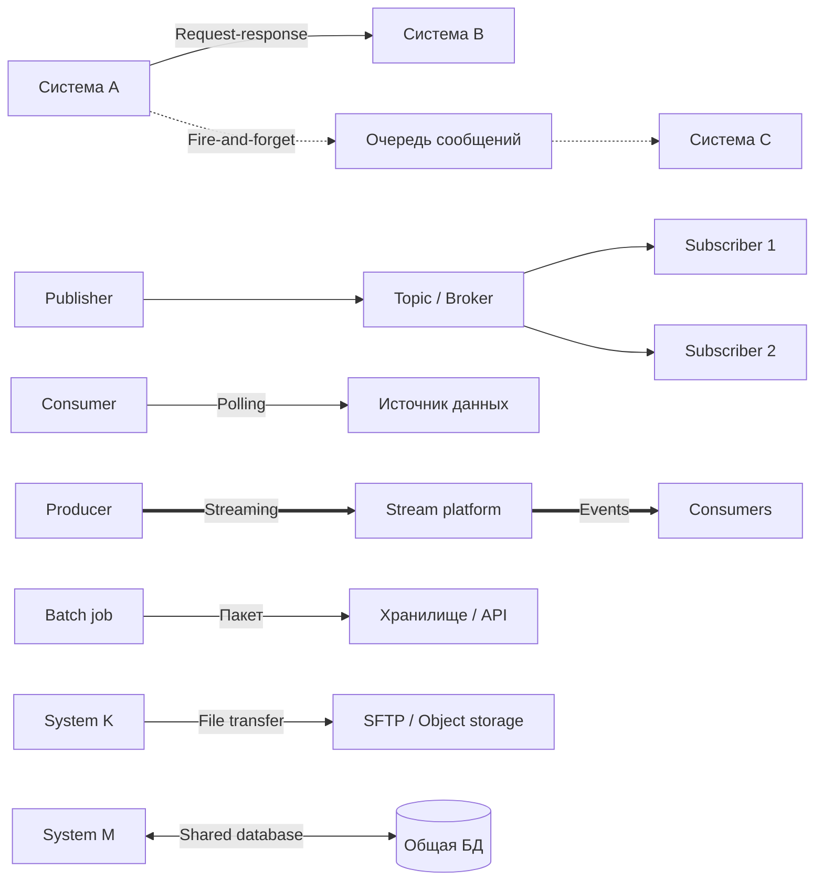
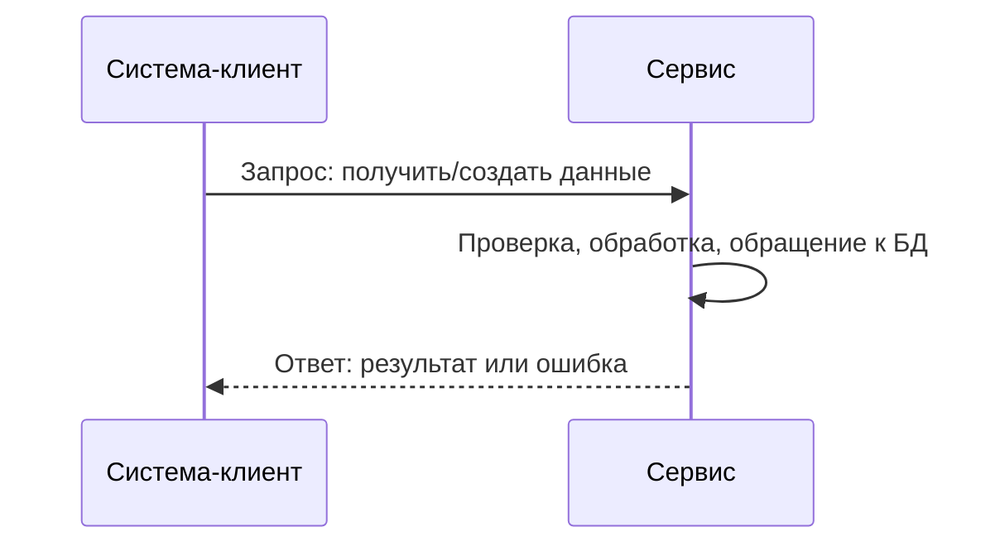
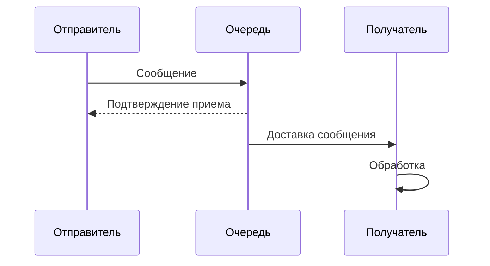
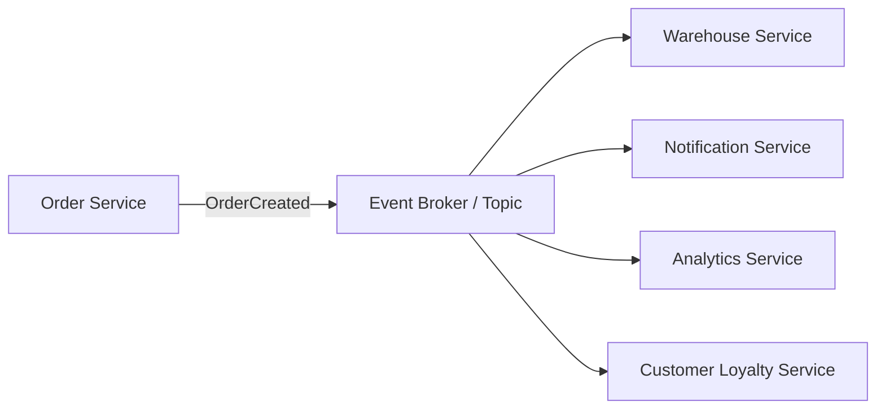
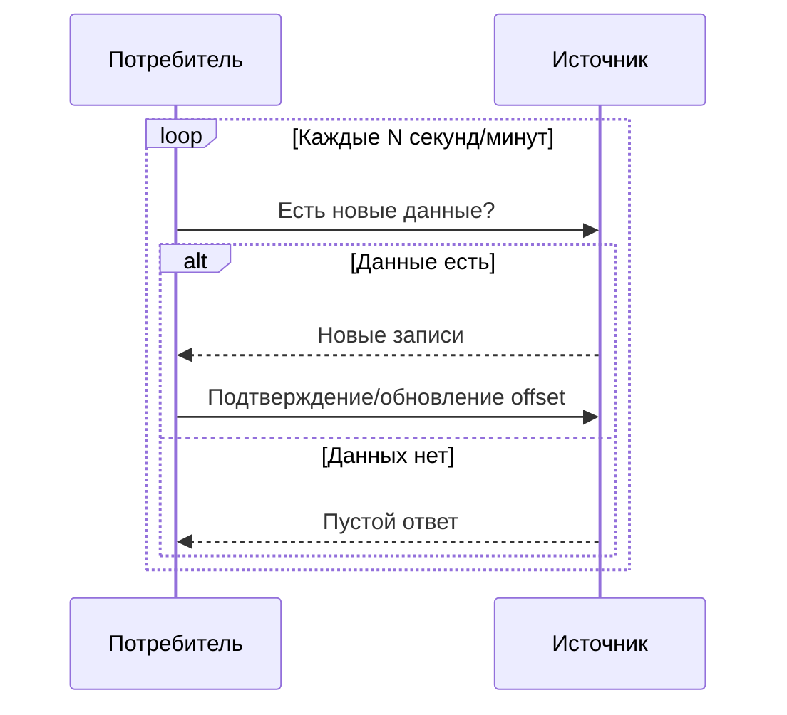
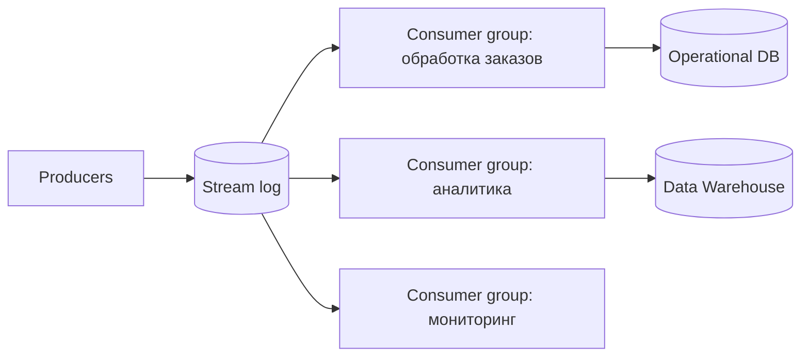
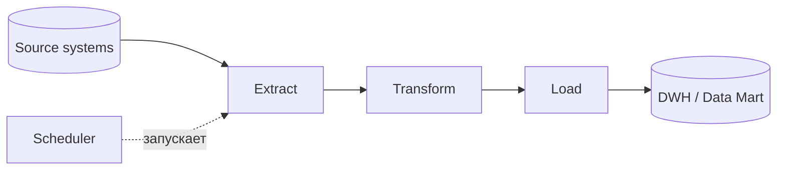
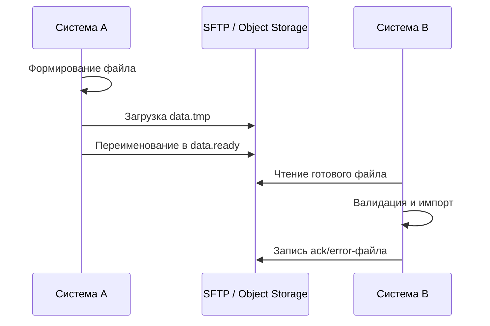
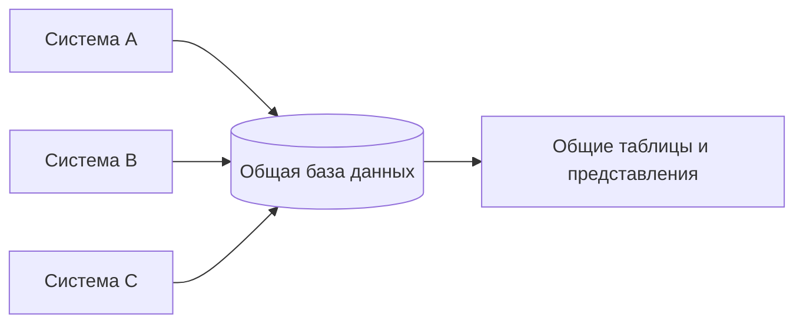

# 8. Шаблоны интеграций информационных систем по типу обмена данных

Интеграция информационных систем - это организация обмена данными и событиями между приложениями, сервисами, базами данных и внешними платформами. По типу обмена данные могут передаваться синхронно или асинхронно, отдельными сообщениями или потоками, часто или пакетно, через API, очередь, файл, общую БД или брокер событий.

Выбор шаблона интеграции зависит от требований к задержке, надежности, согласованности данных, объему трафика, стоимости сопровождения и допустимой связанности систем.

## Основные критерии выбора

- **Синхронность:** вызывающая система ждет ответ или продолжает работу без ожидания.
- **Направление обмена:** один к одному, один ко многим, многие ко многим.
- **Время доставки:** немедленно, по расписанию, по запросу, непрерывным потоком.
- **Связанность:** системы знают друг о друге напрямую или взаимодействуют через посредника.
- **Надежность:** нужна ли гарантированная доставка, повторные попытки, журналирование, идемпотентность.
- **Согласованность:** требуется ли немедленное подтверждение результата или допустима eventual consistency.
- **Объем данных:** отдельные сообщения, большие файлы, массовые выгрузки, телеметрия.

## Общая схема вариантов обмена

## Request-response

**Request-response** - синхронный шаблон, при котором одна система отправляет запрос другой системе и ожидает ответ. Обычно реализуется через HTTP REST, SOAP, gRPC или внутренний RPC.

### Схема

### Примеры

- интернет-магазин запрашивает у платежного шлюза статус оплаты;
- CRM получает карточку клиента из MDM-системы;
- мобильное приложение отправляет запрос на авторизацию;
- сервис доставки рассчитывает стоимость по API логистического провайдера.

### Преимущества

- простая модель взаимодействия;
- быстрый ответ и понятная семантика ошибки;
- удобно для пользовательских операций;
- легко трассировать один запрос.

### Недостатки

- вызывающая система зависит от доступности вызываемого сервиса;
- задержка ответа влияет на пользователя или бизнес-процесс;
- при каскаде синхронных вызовов растет риск отказа всей цепочки;
- нужны таймауты, ретраи и circuit breaker.

### Типичные ошибки

- отсутствие таймаута на внешний вызов;
- бесконечные повторные запросы без backoff;
- использование request-response для долгих фоновых процессов;
- возврат технических ошибок без бизнес-смысла;
- сильная зависимость клиента от внутренней структуры ответа.

## Fire-and-forget

**Fire-and-forget** - асинхронный шаблон: отправитель передает сообщение и не ждет немедленного результата обработки. Получатель может обработать сообщение позже.

Обычно используется очередь сообщений: RabbitMQ, ActiveMQ, Azure Service Bus, Amazon SQS, Kafka с семантикой очереди.

### Схема

### Примеры

- после оформления заказа система отправляет задачу на отправку email;
- сервис документов ставит задачу на генерацию PDF;
- веб-приложение отправляет событие аудита;
- сервис регистрации публикует задачу на создание профиля в CRM.

### Преимущества

- отправитель не блокируется на долгой операции;
- можно сглаживать пики нагрузки;
- повышается устойчивость при временной недоступности получателя;
- удобно для фоновых задач.

### Недостатки

- результат обработки не доступен сразу;
- сложнее отслеживать end-to-end статус;
- требуется обработка повторной доставки;
- возможна eventual consistency.

### Типичные ошибки

- считать, что сообщение обработано сразу после отправки;
- не делать обработчики идемпотентными;
- не настраивать dead-letter queue;
- не хранить correlation id для трассировки;
- игнорировать порядок доставки, если он важен.

## Publish-subscribe

**Publish-subscribe** - шаблон, при котором издатель публикует событие в topic или event bus, а несколько подписчиков независимо получают копии события. Издатель обычно не знает, кто именно подписан.

### Схема

### Примеры

- событие `OrderCreated` получают склад, аналитика, уведомления и программа лояльности;
- изменение профиля клиента распространяется в CRM, биллинг и сервис рассылок;
- событие `PaymentCaptured` запускает выдачу товара и формирование чека;
- мониторинговая система рассылает алерты нескольким обработчикам.

### Преимущества

- слабая связанность между издателями и подписчиками;
- легко добавлять новых потребителей без изменения издателя;
- подходит для событийной архитектуры;
- масштабируется по подписчикам.

### Недостатки

- сложнее контролировать глобальный порядок событий;
- нужна схема событий и управление версиями;
- источник не знает, успешно ли все подписчики обработали событие;
- отладка распределенного процесса сложнее, чем в синхронном API.

### Типичные ошибки

- публиковать слишком крупные события с лишними персональными или внутренними данными;
- менять схему события без обратной совместимости;
- смешивать domain event и command;
- не фиксировать, что означает событие: факт прошлого, а не просьба выполнить действие;
- не проектировать стратегию повторной доставки.

## Polling

**Polling** - шаблон, при котором потребитель периодически опрашивает источник данных: API, таблицу, очередь, каталог файлов или endpoint статуса.

### Схема

### Примеры

- сервис периодически проверяет статус платежа;
- интеграционный модуль раз в минуту забирает новые заявки из API;
- ETL-процесс ищет новые файлы в SFTP-каталоге;
- система мониторинга опрашивает endpoint состояния.

### Преимущества

- простая реализация;
- подходит, когда источник не умеет отправлять уведомления;
- потребитель сам контролирует частоту нагрузки;
- удобно для внешних API с ограниченной функциональностью.

### Недостатки

- задержка зависит от интервала опроса;
- лишние пустые запросы создают нагрузку;
- трудно подобрать частоту для разных режимов нагрузки;
- риск пропуска данных при неправильном хранении offset или watermark.

### Типичные ошибки

- слишком частый polling без учета rate limit;
- отсутствие курсора, timestamp или offset;
- сравнение только по времени без учета одинаковых timestamp;
- повторная обработка записей без идемпотентности;
- отсутствие backoff при ошибках источника.

## Streaming

**Streaming** - непрерывная передача потока событий или данных в реальном времени или близко к реальному времени. Данные обрабатываются по мере поступления.

Типичные технологии: Apache Kafka, Apache Flink, Spark Structured Streaming, Pulsar, WebSocket, Server-Sent Events, gRPC streaming.

### Схема

### Примеры

- обработка телеметрии устройств IoT;
- онлайн-аналитика кликов и пользовательских событий;
- антифрод-оценка платежей в реальном времени;
- поток котировок, логов, метрик и событий мониторинга.

### Преимущества

- минимальная задержка между событием и реакцией;
- высокая пропускная способность;
- возможность replay при хранении журнала событий;
- хорошо подходит для аналитики и событийных платформ.

### Недостатки

- сложнее эксплуатация и мониторинг;
- требуется управление offset, partition, consumer group;
- порядок обычно гарантируется только внутри partition;
- ошибки схемы или ключа партиционирования трудно исправлять после запуска.

### Типичные ошибки

- выбирать streaming там, где достаточно batch;
- не задавать ключ события и получать хаотичное распределение порядка;
- не контролировать lag потребителей;
- не версионировать схемы сообщений;
- не продумывать retention и replay.

## Batch

**Batch** - пакетный обмен: данные собираются и передаются большими порциями по расписанию или по событию завершения периода. Часто используется в ETL/ELT, отчетности, синхронизации справочников и финансовых выгрузках.

### Схема

### Примеры

- ночная загрузка продаж в хранилище данных;
- ежедневная сверка платежей с банком;
- ежемесячная выгрузка кадровых данных;
- пересчет витрин аналитики после закрытия периода.

### Преимущества

- эффективно для больших объемов;
- удобно контролировать окна обработки;
- проще восстанавливать процесс после сбоя;
- хорошо подходит для отчетности и регламентных операций.

### Недостатки

- данные устаревают между запусками;
- сбой пакета может задержать весь процесс;
- нужны правила дедупликации и повторной загрузки;
- большие batch jobs могут создавать пиковую нагрузку.

### Типичные ошибки

- не делать пакет перезапускаемым;
- не хранить контрольные суммы и количество записей;
- смешивать инкрементальную и полную загрузку без явных правил;
- не разделять технический статус загрузки и бизнес-статус данных;
- запускать тяжелый batch в рабочее окно основной системы.

## File transfer

**File transfer** - обмен данными через файлы: CSV, XML, JSON, XLSX, архивы, EDI-документы. Передача выполняется через SFTP, FTPS, SMB, object storage, email-шлюз или интеграционную платформу.

### Схема

### Примеры

- обмен EDI-документами с поставщиками;
- выгрузка реестра платежей в банк;
- загрузка прайс-листов от партнеров;
- передача больших архивов документов между организациями.

### Преимущества

- подходит для больших объемов и старых систем;
- простая договорная модель формата файла;
- можно использовать существующую инфраструктуру SFTP/object storage;
- удобно для межорганизационного обмена.

### Недостатки

- высокая задержка по сравнению с API и событиями;
- сложнее контролировать частично загруженные файлы;
- нужны соглашения об именовании, кодировке, формате, ack/error-файлах;
- нет естественной транзакционности между загрузкой файла и обработкой.

### Типичные ошибки

- читать файл до завершения загрузки;
- не проверять контрольную сумму и размер;
- не фиксировать версию формата;
- не иметь схемы ошибок импорта;
- использовать email как основной канал критической интеграции без контроля доставки.

## Shared database

**Shared database** - несколько систем напрямую используют одну и ту же базу данных или набор таблиц. Это может быть осознанным решением для тесно связанных компонентов, но часто становится архитектурным антишаблоном.

### Схема

### Примеры

- несколько модулей монолитной системы работают с общей БД;
- отчетная система читает реплики операционной БД;
- интеграционный модуль забирает данные из специально подготовленных views;
- legacy-системы обмениваются состоянием через общие таблицы.

### Преимущества

- быстрый доступ к данным без сетевого API;
- не нужен отдельный транспорт сообщений;
- удобно для отчетного чтения через views или read replica;
- может быть приемлемо внутри одного приложения или bounded context.

### Недостатки

- сильная связанность систем по схеме БД;
- изменение таблиц ломает внешних потребителей;
- сложно разграничивать ответственность за данные;
- риск нарушения бизнес-инвариантов при прямой записи;
- тяжелее масштабировать и сопровождать.

### Типичные ошибки

- позволять нескольким системам писать в одни и те же таблицы без единого владельца;
- использовать внутренние таблицы вместо стабильных представлений или API;
- не документировать контракт схемы;
- не разделять operational DB и reporting DB;
- строить распределенную бизнес-логику вокруг прямых SQL-записей.

## Сравнение шаблонов

| Шаблон | Тип обмена | Задержка | Связанность | Где применять | Главный риск |
|---|---|---:|---|---|---|
| Request-response | Синхронный запрос и ответ | Низкая | Средняя/высокая | UI-операции, проверки, команды с быстрым результатом | Недоступность вызываемого сервиса блокирует клиента |
| Fire-and-forget | Асинхронная отправка сообщения | Низкая для отправителя, переменная для обработки | Средняя | Фоновые задачи, уведомления, аудит | Неочевидный статус обработки |
| Publish-subscribe | Асинхронные события многим подписчикам | Низкая/средняя | Низкая | Событийная архитектура, доменные события | Сложность версионирования и трассировки |
| Polling | Периодический опрос | Зависит от интервала | Средняя | Внешние API без push-механизма, статусные проверки | Лишняя нагрузка и задержка |
| Streaming | Непрерывный поток событий | Очень низкая | Низкая/средняя | Телеметрия, аналитика, антифрод, логи | Операционная сложность |
| Batch | Пакетная обработка | Высокая | Средняя | DWH, отчетность, регламентные обмены | Устаревание данных и тяжелые перезапуски |
| File transfer | Файловый обмен | Средняя/высокая | Средняя | B2B, банки, legacy, EDI | Частичные файлы, ошибки формата |
| Shared database | Общая БД | Низкая | Очень высокая | Legacy, отчетные views, tightly coupled modules | Ломкость схемы и размытая ответственность |

## Практические рекомендации

- Для пользовательских операций, где нужен немедленный ответ, обычно выбирают **request-response**.
- Для фоновых действий без срочного ответа подходит **fire-and-forget**.
- Для распространения факта изменения многим потребителям лучше использовать **publish-subscribe**.
- Если источник не умеет push-уведомления, применяют **polling**, но с backoff, лимитами и курсором.
- Для больших непрерывных потоков событий используют **streaming**.
- Для отчетности, DWH и регламентных загрузок часто достаточно **batch**.
- Для межорганизационного обмена и legacy-интеграций часто применяют **file transfer**.
- **Shared database** стоит использовать осторожно: предпочтительнее read-only views, реплики или API, чем прямой доступ к внутренним таблицам.

## Общие ошибки интеграций

1. **Нет идемпотентности.** При повторной доставке сообщение или файл обрабатывается дважды и создает дубликаты.
2. **Не определены контракты.** Формат сообщения, API или файла меняется без версии и ломает потребителей.
3. **Нет корреляции.** Без `correlationId` трудно связать запрос, событие, задачу и лог.
4. **Игнорируются таймауты.** Синхронные вызовы зависают и блокируют ресурсы.
5. **Нет DLQ или обработки ошибок.** Невалидные сообщения бесконечно возвращаются в обработку.
6. **Не учтена обратная нагрузка.** Быстрый producer перегружает медленного consumer.
7. **Смешаны команды и события.** Команда требует действия, событие сообщает о факте; путаница ухудшает ответственность.
8. **Нет наблюдаемости.** Без метрик, логов, трассировки и алертов интеграцию трудно сопровождать.
9. **Не продумана безопасность.** Нужно контролировать аутентификацию, авторизацию, шифрование, персональные данные и аудит доступа.
10. **Общая БД используется как универсальная интеграционная шина.** Это быстро приводит к сильной связанности и сложным миграциям.

## Вывод

Шаблоны интеграции отличаются не только транспортом, но и моделью ответственности. **Request-response** удобен для быстрых операций с немедленным ответом. **Fire-and-forget** и **publish-subscribe** уменьшают связанность и повышают устойчивость, но требуют идемпотентности, трассировки и обработки повторов. **Polling** полезен как компромисс, когда источник не поддерживает события. **Streaming** нужен для непрерывных данных и низкой задержки. **Batch** и **file transfer** остаются практичными для больших объемов, отчетности и B2B-интеграций. **Shared database** следует применять ограниченно, так как она делает системы зависимыми от внутренней схемы данных.

Рациональная архитектура часто комбинирует несколько шаблонов: например, пользовательский запрос оформляет заказ через request-response, событие заказа распространяется через publish-subscribe, email отправляется через fire-and-forget, аналитика получает поток событий, а финансовая сверка выполняется ночным batch-процессом.

## Источники

1. Hohpe G., Woolf B. *Enterprise Integration Patterns: Designing, Building, and Deploying Messaging Solutions*. Addison-Wesley, 2003.
2. Fowler M. *Patterns of Enterprise Application Architecture*. Addison-Wesley, 2002.
3. Microsoft Azure Architecture Center. *Asynchronous Request-Reply pattern*, *Publisher-Subscriber pattern*, *Competing Consumers pattern*, *Queue-Based Load Leveling pattern*.
4. Apache Kafka Documentation. *Kafka Design*, *Consumer Groups*, *Streams Concepts*.
5. AWS Prescriptive Guidance. *Integration patterns for microservices*, *Event-driven architecture*, *Batch processing and file transfer patterns*.
6. Richardson C. *Microservices Patterns*. Manning, 2018.
