# 9. Модели разработки ПО: итеративная, инкрементная, водопадная, спиральная

## Краткое определение

**Модель жизненного цикла разработки ПО** - это способ организации работ по созданию программной системы: как проходят анализ требований, проектирование, реализация, тестирование, внедрение и сопровождение. Модель задает порядок этапов, правила возврата к предыдущим работам, способ управления рисками и момент, когда заказчик получает работающий результат.

В классических курсах по программной инженерии обычно выделяют несколько базовых моделей: **водопадную**, **итеративную**, **инкрементную** и **спиральную**. На практике они часто комбинируются: например, продукт может выпускаться инкрементами, а каждый инкремент разрабатываться итеративно.

---

## 1. Водопадная модель

**Водопадная модель** - это последовательная модель разработки, в которой этапы выполняются один за другим: требования, проектирование, реализация, тестирование, внедрение и сопровождение. Переход к следующему этапу предполагает, что предыдущий этап в основном завершен и зафиксирован в документации.

### Схема жизненного цикла

```text
Требования
    ↓
Проектирование
    ↓
Реализация
    ↓
Тестирование
    ↓
Внедрение
    ↓
Сопровождение
```

### Особенности

- Требования фиксируются в начале проекта.
- Основной результат ранних этапов - документы: спецификации, архитектура, проектные решения.
- Изменения на поздних стадиях дороги, потому что они затрагивают уже завершенные этапы.
- Модель удобна для контроля сроков, бюджета и ответственности по этапам.

### Примеры использования

Водопадная модель подходит, когда требования хорошо понятны и редко меняются:

- разработка ПО по государственному или промышленному контракту с жестким техническим заданием;
- системы, где важна сертификация и формальная приемка;
- небольшие проекты с понятным результатом, например автоматизация уже описанного регламентного процесса;
- встраиваемое ПО, если требования к устройству заранее стабильны.

### Основные риски

- Позднее обнаружение ошибок в требованиях.
- Пользователь видит работающую систему только ближе к концу проекта.
- Сложно реагировать на изменение бизнес-потребностей.
- Есть риск создать корректно реализованную, но уже неактуальную систему.

---

## 2. Итеративная модель

**Итеративная модель** - это модель, при которой система создается через повторяющиеся циклы разработки. На каждой итерации команда уточняет требования, улучшает архитектуру, реализует часть функциональности, тестирует результат и получает обратную связь.

Главная идея итеративной модели: не пытаться сразу идеально определить и построить всю систему, а постепенно уточнять решение через повторение цикла.

### Схема жизненного цикла

```text
Итерация 1: анализ → проектирование → реализация → тестирование → оценка
Итерация 2: анализ → проектирование → реализация → тестирование → оценка
Итерация 3: анализ → проектирование → реализация → тестирование → оценка
...
```

### Особенности

- Требования могут уточняться по мере разработки.
- После каждой итерации появляется улучшенная версия системы или ее прототип.
- Ошибки в понимании задачи выявляются раньше, чем в водопадной модели.
- Команда может пересматривать архитектурные и функциональные решения.

### Примеры использования

Итеративная модель подходит, когда задача сложная или требования нельзя полностью определить заранее:

- разработка пользовательского интерфейса, где важна обратная связь пользователей;
- исследовательские и инновационные проекты;
- создание прототипа новой информационной системы;
- разработка продукта, где заказчик понимает цель, но не может сразу описать все детали.

### Основные риски

- Возможен рост сроков из-за постоянного уточнения требований.
- Без дисциплины итерации превращаются в бесконечные переделки.
- Требуется регулярное участие заказчика или представителей пользователей.
- Нужен контроль архитектуры, иначе накопятся технические долги.

---

## 3. Инкрементная модель

**Инкрементная модель** - это модель, при которой система поставляется частями, то есть инкрементами. Каждый инкремент добавляет завершенный набор функций и увеличивает возможности продукта.

Отличие от итеративной модели: итерация делает систему лучше или точнее, а инкремент добавляет новый законченный фрагмент функциональности. В реальных проектах эти подходы часто применяются вместе: каждый инкремент может разрабатываться за одну или несколько итераций.

### Схема жизненного цикла

```text
Базовая версия
    ↓
Инкремент 1: критически важные функции
    ↓
Инкремент 2: дополнительные функции
    ↓
Инкремент 3: расширения и интеграции
    ↓
Полная система
```

### Особенности

- Система начинает приносить пользу до полной реализации всех требований.
- На ранних релизах реализуются наиболее важные функции.
- Заказчик может оценивать продукт постепенно.
- Упрощается приоритизация: сначала делается то, что дает наибольший эффект.

### Примеры использования

Инкрементная модель подходит, когда продукт можно осмысленно выпускать частями:

- веб-сервис: сначала регистрация и личный кабинет, затем платежи, затем аналитика;
- корпоративная CRM: сначала база клиентов, затем сделки, затем отчеты и интеграции;
- мобильное приложение: сначала основной сценарий пользователя, затем уведомления, поиск и дополнительные настройки;
- образовательная платформа: сначала курсы и уроки, затем тестирование, затем кабинет преподавателя.

### Основные риски

- Если архитектура плохо спроектирована, новые инкременты будет трудно добавлять.
- Пользователи могут воспринимать ранние версии как неполные.
- Требуется грамотный выбор порядка поставки функций.
- Интеграция поздних инкрементов может оказаться сложнее, чем ожидалось.

---

## 4. Спиральная модель

**Спиральная модель** - это модель разработки, в которой каждый цикл связан с анализом рисков. Она сочетает идеи итеративной разработки, прототипирования и системного управления рисками.

Каждый виток спирали обычно включает четыре группы работ:

1. Определение целей, ограничений и альтернатив.
2. Анализ и снижение рисков.
3. Разработка и проверка очередной версии.
4. Планирование следующего витка.

### Схема жизненного цикла

```text
Цели и ограничения
    ↓
Анализ рисков
    ↓
Разработка / прототипирование
    ↓
Оценка результата
    ↓
Планирование следующего витка
    ↺
```

### Особенности

- Основной акцент делается на рисках: технических, организационных, финансовых, пользовательских.
- На ранних витках могут создаваться прототипы.
- Подходит для крупных и неопределенных проектов.
- Позволяет прекращать или менять проект, если риски становятся неприемлемыми.

### Примеры использования

Спиральная модель подходит для сложных проектов с высокой неопределенностью:

- разработка крупной банковской или страховой системы;
- системы с высокими требованиями к надежности и безопасности;
- проекты, где нужно проверить новую технологию;
- оборонные, авиационные, медицинские и другие критические системы;
- масштабные платформы с множеством интеграций.

### Основные риски

- Модель сложна в управлении и требует квалифицированных менеджеров и архитекторов.
- Анализ рисков занимает время и ресурсы.
- Для небольших проектов модель может быть чрезмерно тяжелой.
- Ошибочная оценка рисков снижает преимущества подхода.

---

## Mermaid-схема сравнения моделей

```mermaid
flowchart TB
    subgraph W["Водопадная модель"]
        W1["Требования"] --> W2["Проектирование"] --> W3["Реализация"] --> W4["Тестирование"] --> W5["Внедрение"]
    end

    subgraph I["Итеративная модель"]
        I1["Анализ"] --> I2["Проектирование"] --> I3["Разработка"] --> I4["Тестирование"] --> I5["Оценка"]
        I5 --> I1
    end

    subgraph N["Инкрементная модель"]
        N1["Инкремент 1: базовые функции"] --> N2["Инкремент 2: расширение"] --> N3["Инкремент 3: интеграции"] --> N4["Готовая система"]
    end

    subgraph S["Спиральная модель"]
        S1["Цели"] --> S2["Анализ рисков"] --> S3["Прототип / разработка"] --> S4["Оценка"] --> S5["План следующего витка"]
        S5 --> S1
    end
```



---

## Сравнение моделей

| Критерий | Водопадная | Итеративная | Инкрементная | Спиральная |
|---|---|---|---|---|
| Основная идея | Последовательное прохождение этапов | Повторение циклов уточнения и разработки | Поставка системы частями | Разработка через циклы с анализом рисков |
| Требования | Должны быть стабильны заранее | Могут уточняться | Делятся по приоритетам | Уточняются с учетом рисков |
| Когда появляется результат | Обычно в конце проекта | После каждой итерации может быть версия или прототип | После каждого инкремента есть полезная часть продукта | После каждого витка появляется уточненное решение или версия |
| Гибкость к изменениям | Низкая | Высокая | Средняя или высокая | Высокая, но управляемая через риски |
| Управление рисками | Ограниченное, часто позднее | Через раннюю обратную связь | Через поэтапную поставку | Центральный элемент модели |
| Стоимость управления | Низкая или средняя | Средняя | Средняя | Высокая |
| Подходящие проекты | Стабильные и хорошо описанные | Неопределенные, требующие уточнения | Продукты, которые можно выпускать частями | Крупные, дорогие и рискованные |
| Главный риск | Ошибка в требованиях выявится поздно | Бесконечные доработки | Сложность интеграции инкрементов | Сложность и дороговизна управления |

---

## Взаимосвязь итеративной и инкрементной разработки

Итеративная и инкрементная модели часто смешиваются, но между ними есть принципиальное различие:

- **итеративность** отвечает на вопрос: "Как мы уточняем и улучшаем решение?";
- **инкрементность** отвечает на вопрос: "Как мы поставляем функциональность по частям?".

Пример: команда разрабатывает интернет-магазин.

```text
Инкремент 1: каталог товаров
    Итерация 1: простой список товаров
    Итерация 2: фильтры и карточка товара
    Итерация 3: улучшение интерфейса по обратной связи

Инкремент 2: корзина и оформление заказа
    Итерация 1: базовая корзина
    Итерация 2: промокоды и доставка
    Итерация 3: исправление ошибок и улучшение сценария покупки
```

То есть продукт может расти инкрементами, а качество каждого инкремента повышаться итерациями.

---

## Риски выбора неподходящей модели

Неправильный выбор модели жизненного цикла может привести к следующим проблемам:

- **Потеря актуальности требований**: характерно для долгого водопадного проекта в изменчивой предметной области.
- **Размывание границ проекта**: характерно для итеративной разработки без контроля объема работ.
- **Проблемы интеграции**: характерны для инкрементной модели, если общая архитектура не была продумана заранее.
- **Избыточная стоимость управления**: возможна при применении спиральной модели в малом и простом проекте.
- **Недостаточная обратная связь**: возникает, если заказчик подключается только на этапе приемки.
- **Технический долг**: появляется, когда быстрые итерации или инкременты не сопровождаются рефакторингом, тестированием и архитектурным контролем.

---

## Как выбрать модель

Выбор модели зависит от стабильности требований, масштаба проекта, критичности системы и уровня рисков.

| Условие проекта | Наиболее подходящая модель |
|---|---|
| Требования стабильны, нужна формальная приемка | Водопадная |
| Требования неясны, нужен быстрый feedback | Итеративная |
| Продукт можно выпускать полезными частями | Инкрементная |
| Проект крупный, дорогой, технически рискованный | Спиральная |
| Нужно быстро вывести MVP и затем развивать | Инкрементная + итеративная |
| Высокие требования к безопасности и надежности | Спиральная или строгая водопадная с дополнительным контролем |

---

## Вывод

Водопадная модель удобна для проектов со стабильными требованиями и формальным контролем этапов, но плохо переносит поздние изменения. Итеративная модель позволяет постепенно уточнять решение и раньше получать обратную связь. Инкрементная модель делает возможной поэтапную поставку полезной функциональности. Спиральная модель наиболее ориентирована на управление рисками и подходит для крупных, сложных и критичных проектов.

На практике выбор модели редко бывает полностью "чистым": современные процессы часто объединяют инкрементную поставку, итеративное уточнение и элементы риск-ориентированного планирования.

---

## Источники

1. [3] Материалы курса по программной инженерии: раздел о моделях жизненного цикла разработки ПО.
2. [5, с. 10] Учебные материалы по программной инженерии: классификация моделей разработки ПО и схемы жизненного цикла.
3. Royce W. W. *Managing the Development of Large Software Systems*. Proceedings of IEEE WESCON, 1970.
4. Boehm B. W. *A Spiral Model of Software Development and Enhancement*. Computer, 1988.
5. Sommerville I. *Software Engineering*. Разделы о процессах разработки ПО и моделях жизненного цикла.
