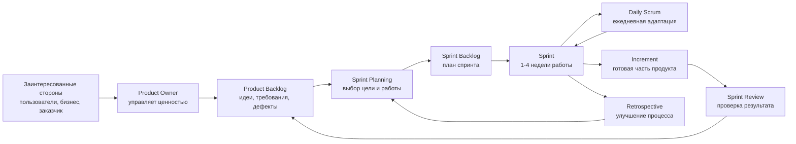
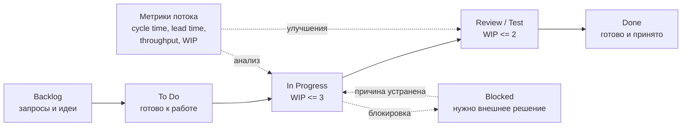

# 10. Наборы практик Scrum и Kanban

## Краткое определение

**Scrum** и **Kanban** - это наборы agile-практик для организации работы команды, управления потоком задач и регулярной поставки ценности пользователю. Они не являются "языками программирования" или конкретными инструментами. Это способы выстроить процесс: кто принимает решения, как появляется работа, как она проходит через команду, как команда видит прогресс и как улучшает свой способ работы.

**Scrum** задает более формальный каркас: роли, события, артефакты, спринты и правила инспекции результата. Он хорошо подходит, когда нужно регулярно поставлять инкременты продукта, синхронизировать команду вокруг цели и работать с меняющимися требованиями.

**Kanban** задает более потоковый подход: визуализировать работу, ограничивать незавершенную работу, управлять потоком и улучшать процесс постепенно. Он хорошо подходит для поддержки, эксплуатации, сопровождения, аналитики, DevOps и любых процессов, где задачи приходят непрерывно и их трудно жестко упаковать в спринты.

Вопрос формулируется как "Scram и Kanban", но корректное название фреймворка - **Scrum**.

## Scrum: основные элементы

Scrum строится вокруг коротких итераций, которые называются **спринтами**. В течение спринта команда выбирает ограниченный объем работы, выполняет его и получает проверяемый результат - **инкремент продукта**. После этого команда анализирует продукт и собственный процесс, чтобы улучшить следующую итерацию.

Главная идея Scrum: сложный продукт невозможно полностью спланировать заранее, поэтому команда должна часто поставлять работающий результат, получать обратную связь и адаптировать план.

### Роли в Scrum

В Scrum используется единая **Scrum-команда**, внутри которой выделяются три ответственности.

| Ответственность | Назначение | Пример |
|---|---|---|
| **Product Owner** | Отвечает за ценность продукта, приоритизацию Product Backlog и ясность того, что нужно делать | Решает, что важнее: новая оплата картой или улучшение поиска |
| **Scrum Master** | Помогает команде правильно применять Scrum, убирает препятствия, развивает самоорганизацию | Помогает устранить задержки согласования с безопасностью |
| **Developers** | Создают инкремент продукта внутри спринта | Разработчики, тестировщики, аналитики, DevOps-инженеры, если они участвуют в поставке результата |

Важно: в Scrum слово **Developers** означает не только программистов, а всех специалистов, которые непосредственно создают готовый инкремент.

### Артефакты Scrum

Артефакты Scrum нужны для прозрачности. Они помогают видеть, что команда собирается сделать, что делает сейчас и какой результат уже получила.

| Артефакт | Что содержит | Связанное обязательство |
|---|---|---|
| **Product Backlog** | Все известные элементы продукта: функции, улучшения, исправления, технические задачи | **Product Goal** - цель продукта |
| **Sprint Backlog** | Выбранные на спринт задачи и план их выполнения | **Sprint Goal** - цель спринта |
| **Increment** | Готовая часть продукта, соответствующая Definition of Done | **Definition of Done** - критерии готовности |

**Product Backlog** постоянно уточняется. В нем могут быть пользовательские истории, задачи, дефекты, гипотезы, технический долг. Product Owner отвечает за то, чтобы порядок элементов отражал ожидаемую ценность.

**Sprint Backlog** формируется на Sprint Planning. Это не просто список задач, а рабочий план команды на спринт. Он может уточняться внутри спринта, если это помогает достичь Sprint Goal.

**Increment** - это не отчет и не макет, а потенциально поставляемый результат. Если команда сделала код, но он не протестирован и не соответствует Definition of Done, это еще не полноценный инкремент.

### События Scrum

Scrum использует регулярные события, чтобы команда не управляла процессом хаотично.

| Событие | Цель | Типичный результат |
|---|---|---|
| **Sprint** | Контейнер для работы, обычно до одного месяца | Готовый инкремент продукта |
| **Sprint Planning** | Определить цель спринта и выбрать работу | Sprint Goal и Sprint Backlog |
| **Daily Scrum** | Синхронизировать команду и адаптировать план на ближайший день | Понимание препятствий и текущего фокуса |
| **Sprint Review** | Проверить инкремент с заинтересованными сторонами | Обратная связь и обновление Product Backlog |
| **Sprint Retrospective** | Улучшить способ работы команды | Конкретные действия по улучшению процесса |

### Схема Scrum



Схема показывает итерационный цикл: работа берется из Product Backlog, превращается в Sprint Backlog, выполняется в спринте, дает инкремент, после чего результат и процесс анализируются.

## Kanban: основные элементы

**Kanban** - это метод управления потоком работы. В центре Kanban находится не спринт, а **поток задач** от появления запроса до завершения. Команда делает процесс видимым, ограничивает количество одновременно выполняемых задач и постоянно улучшает прохождение работы через систему.

Kanban особенно полезен там, где работа приходит неравномерно: обращения пользователей, баги, инциденты, заявки на доступ, небольшие доработки, задачи эксплуатации.

### Принципы Kanban

Классический Kanban для разработки и управления знаниями обычно описывают через принципы эволюционного изменения и практики управления потоком.

Основные принципы:

1. **Начинать с текущего процесса**. Kanban не требует сразу перестраивать организацию. Сначала команда визуализирует то, как работа уже выполняется.
2. **Развиваться постепенно**. Улучшения внедряются малыми шагами, чтобы не разрушить работающую систему.
3. **Уважать существующие роли и ответственность**. Kanban не требует переименовывать должности или вводить отдельные роли.
4. **Поощрять лидерство на всех уровнях**. Улучшения могут предлагать не только руководители, но и исполнители, которые видят реальные проблемы потока.

Ключевые практики:

| Практика | Смысл | Пример |
|---|---|---|
| **Визуализировать работу** | Сделать стадии процесса и задачи видимыми | Доска `To Do -> In Progress -> Review -> Done` |
| **Ограничить WIP** | Не брать слишком много задач одновременно | Не более 3 задач в разработке |
| **Управлять потоком** | Следить за скоростью, очередями и блокировками | Если Review переполнен, команда помогает ревью |
| **Делать политики явными** | Описать правила переходов между колонками | В `Done` попадает только протестированная задача |
| **Использовать обратную связь** | Регулярно обсуждать метрики и проблемы | Еженедельный разбор заблокированных задач |
| **Улучшать совместно** | Принимать изменения на основе наблюдений и данных | Уменьшить размер задач, если cycle time слишком велик |

### Kanban-доска

Kanban-доска отображает рабочий процесс. Колонки соответствуют состояниям работы, а карточки - отдельным задачам. Важный элемент доски - **WIP-лимиты**.

**WIP** (Work In Progress) - количество задач, которые уже начаты, но еще не завершены. Если WIP не ограничивать, команда может начать много задач одновременно, но мало что доводить до конца. В результате растет время ожидания, появляются очереди, а готовая ценность до пользователя доходит медленно.

Пример простой Kanban-доски:

| Backlog | To Do | In Progress WIP=3 | Review WIP=2 | Done |
|---|---|---|---|---|
| Улучшить поиск | Настроить алерты | Исправить баг оплаты | Проверить экспорт CSV | Новый экран профиля |
| Добавить фильтр |  | Обновить API клиента | Проверить текст письма |  |
|  |  | Подготовить миграцию |  |  |

Если в колонке `In Progress` уже 3 задачи, новую задачу туда брать нельзя. Сначала нужно завершить или продвинуть одну из начатых задач. Это заставляет команду фокусироваться на завершении работы, а не на постоянном старте новых задач.

### Схема Kanban-потока



На схеме видно, что Kanban управляет не календарной итерацией, а прохождением задач через состояния. Метрики помогают находить узкие места: например, если задачи часто накапливаются в `Review`, значит команде не хватает ревьюеров или правила ревью слишком тяжелые.

## Сравнение Scrum и Kanban

| Критерий | Scrum | Kanban |
|---|---|---|
| Базовая модель | Итерации, спринты | Непрерывный поток |
| Планирование | На спринт, через Sprint Planning | По мере освобождения пропускной способности |
| Роли | Product Owner, Scrum Master, Developers | Специальные роли не обязательны |
| Основной визуальный инструмент | Sprint Backlog, burndown/burnup, доска спринта | Kanban-доска с WIP-лимитами |
| Ограничение работы | Объем спринта и Sprint Goal | WIP-лимиты по колонкам или стадиям |
| Поставка результата | Обычно в конце или внутри спринта | По мере готовности задач |
| Обратная связь | Sprint Review и Retrospective | Регулярные review потока, анализ метрик, ретроспективы |
| Лучше подходит | Продуктовая разработка с целями и инкрементами | Поддержка, эксплуатация, поток заявок, смешанная работа |
| Риск неправильного применения | Формальные спринты без готового инкремента | Доска без WIP-лимитов и анализа потока |

Scrum и Kanban не являются взаимоисключающими. Команда может использовать Scrum как каркас работы по спринтам и одновременно применять Kanban-практики: визуальную доску, WIP-лимиты, явные политики и метрики потока. Такой подход часто называют **Scrum with Kanban**.

## Примеры использования

### Пример 1. Scrum для разработки новой функции

Команда интернет-магазина разрабатывает функцию "оплата частями".

1. Product Owner добавляет в Product Backlog элементы: интеграция с платежным провайдером, экран выбора условий, проверка лимита, уведомление пользователя.
2. На Sprint Planning команда выбирает цель: "пользователь может оформить заказ с оплатой частями в тестовой среде".
3. В течение двух недель Developers реализуют API, интерфейс, тесты и интеграцию.
4. На Daily Scrum команда обсуждает препятствия: например, платежный провайдер задержал тестовые ключи.
5. На Sprint Review команда показывает рабочий сценарий оформления заказа.
6. На Retrospective команда решает раньше запрашивать доступы к внешним системам, чтобы не блокировать спринт.

Почему Scrum подходит: есть продуктовая цель, набор связанных требований, необходимость согласовать ожидания бизнеса и регулярно показывать инкремент.

### Пример 2. Kanban для службы поддержки

Команда поддержки получает обращения пользователей: ошибки входа, вопросы по оплате, проблемы с выгрузкой отчетов.

Доска:

```text
New -> Triage -> In Progress -> Waiting for User -> Done
```

Правила:

- в `In Progress` не более 5 обращений;
- в `Triage` обращение должно быть классифицировано за 2 часа;
- карточка переходит в `Done` только после подтверждения решения или истечения срока ожидания ответа пользователя;
- заблокированные обращения помечаются причиной блокировки.

Почему Kanban подходит: обращения приходят постоянно, их нельзя удобно ждать до начала следующего спринта, а главная задача команды - уменьшать время реакции и завершения.

### Пример 3. Kanban для DevOps

DevOps-команда обслуживает CI/CD, инфраструктуру и инциденты.

Типовые карточки:

- настроить мониторинг нового сервиса;
- устранить падение pipeline;
- обновить Kubernetes chart;
- выдать доступ разработчику;
- расследовать рост latency.

Kanban помогает видеть, что команда перегружена срочными инцидентами и не успевает выполнять плановые улучшения. Тогда можно выделить отдельные дорожки доски: `Incidents`, `Requests`, `Improvements`, а также разные WIP-лимиты для срочной и плановой работы.

### Пример 4. Scrum с Kanban-практиками

Продуктовая команда работает двухнедельными спринтами, но внутри спринта использует Kanban-доску:

```text
Selected for Sprint -> Development WIP=3 -> Review WIP=2 -> Testing WIP=2 -> Done
```

Спринт сохраняет цель и регулярный ритм Scrum, а WIP-лимиты помогают не распыляться и быстрее доводить задачи до Definition of Done. Если `Testing` заполнен, разработчики не начинают новую функцию, а помогают тестированию: пишут автотесты, исправляют дефекты, уточняют окружение.

## Типичные ошибки

### Ошибки при использовании Scrum

1. **Нет реального Product Owner**. Приоритеты задают сразу несколько руководителей, поэтому команда получает конфликтующие требования.
2. **Спринт превращается в мини-водопад**. Первая неделя - аналитика, вторая - разработка, последняя пятница - тестирование. В результате инкремент часто не готов.
3. **Daily Scrum становится отчетом начальнику**. Цель Daily - синхронизация команды, а не контроль каждого участника.
4. **Definition of Done отсутствует или слишком слабая**. Команда считает задачу готовой, хотя она не протестирована, не задокументирована или не развернута.
5. **Sprint Review подменяется демонстрацией слайдов**. Review должен проверять реальный инкремент и собирать обратную связь.
6. **Retrospective не приводит к изменениям**. Команда обсуждает проблемы, но не выбирает конкретные действия.

### Ошибки при использовании Kanban

1. **Доска есть, WIP-лимитов нет**. Тогда Kanban превращается в обычный список задач и не управляет перегрузкой.
2. **WIP-лимиты игнорируются**. Если лимит постоянно нарушается без анализа причин, он перестает быть инструментом управления.
3. **Слишком крупные карточки**. Задачи зависают на доске неделями, поток становится непрозрачным.
4. **Не описаны правила переходов**. Участники по-разному понимают, когда задача может перейти в `Review` или `Done`.
5. **Нет анализа метрик**. Команда видит доску, но не измеряет lead time, cycle time, throughput и причины блокировок.
6. **Kanban используют как способ бесконечно добавлять работу**. Если входящий поток не ограничен, команда быстро перегружается.

## Как выбрать подход

Scrum стоит выбрать, если:

- команда делает продуктовую разработку;
- есть понятные цели на ближайшие итерации;
- нужна регулярная демонстрация результата заказчику;
- важно управлять Product Backlog и приоритетами;
- команда готова работать по спринтам и улучшать процесс через ретроспективы.

Kanban стоит выбрать, если:

- задачи приходят непрерывно и непредсказуемо;
- важнее управлять временем прохождения задачи, чем планировать итерации;
- команда занимается поддержкой, сопровождением, инфраструктурой или потоком заявок;
- нужно сначала сделать текущий процесс прозрачным, а не резко перестраивать организацию;
- есть проблема с большим количеством начатой, но незавершенной работы.

Комбинированный подход стоит выбрать, если:

- команда работает спринтами, но внутри спринта часто перегружается;
- много задач зависает на ревью или тестировании;
- нужно сохранить Product Owner, Sprint Goal и Review, но улучшить поток выполнения;
- требуется измерять cycle time и управлять WIP.

## Итоговый вывод

Scrum и Kanban решают близкую задачу - помогают команде поставлять ценность чаще и управлять неопределенностью, но делают это по-разному.

**Scrum** организует работу через спринты, роли, события и артефакты. Его сила - фокус на цели, регулярная поставка инкремента и встроенные точки обратной связи. Он подходит для продуктовой разработки, где важны приоритеты, взаимодействие с заказчиком и последовательное развитие продукта.

**Kanban** организует работу через визуализацию потока, WIP-лимиты, явные политики и постоянное улучшение. Его сила - управление очередями, перегрузкой и временем прохождения задач. Он подходит для процессов с непрерывным входящим потоком: поддержки, эксплуатации, DevOps, сопровождения и небольших доработок.

На практике важно не название метода, а дисциплина его применения. Scrum без готового инкремента и ретроспектив превращается в формальный календарь встреч. Kanban без WIP-лимитов и анализа потока превращается в обычную доску задач. Эффективная команда использует практики осознанно: делает работу видимой, ограничивает перегрузку, регулярно получает обратную связь и улучшает процесс на основе фактов.

## Источники

1. Источники из списка дисциплины, указанные в вопросе: **[2]**, **[3]**, **[5, стр. 20]**.
2. Schwaber K., Sutherland J. **The Scrum Guide**. November 2020. Официальное руководство Scrum: <https://scrumguides.org/scrum-guide.html>.
3. Coleman J., Vacanti D. **The Kanban Guide**. December 2020. Официальное минимальное руководство Kanban: <https://kanbanguides.org/the-kanban-guide/>.
4. Anderson D. J. **Kanban: Successful Evolutionary Change for Your Technology Business**. Blue Hole Press, 2010.
