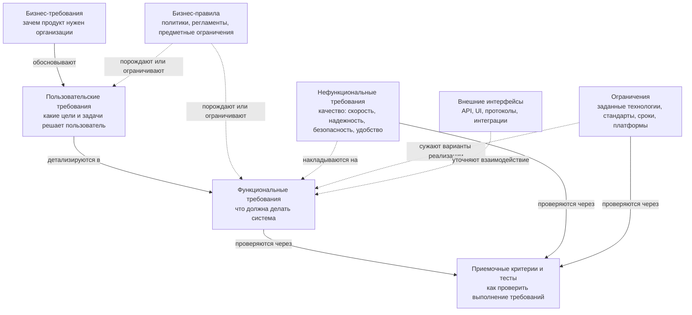
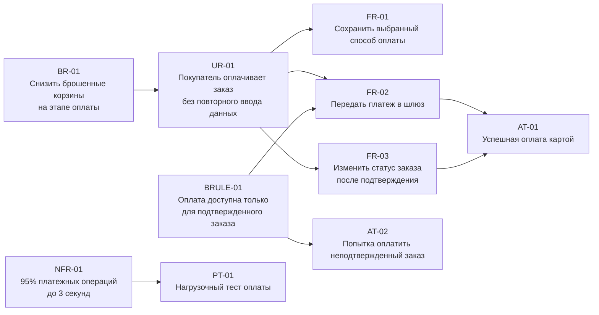

# 11. Уровни и типы требований по К. Вигерсу

## Краткое определение

В модели К. Вигерса требования к программному продукту удобно рассматривать не как один плоский список пожеланий, а как иерархию уровней и набор типов. Уровни показывают, **откуда возникает требование и насколько оно близко к реализации**: от бизнес-целей организации до конкретного поведения системы. Типы показывают, **какую природу имеет требование**: функция, качество, ограничение, интерфейс, бизнес-правило и так далее.

Главная идея схемы на [5, стр. 51]: требования должны прослеживаться сверху вниз. Сначала фиксируется, **зачем бизнесу нужен продукт**, затем - **какие задачи должны решать пользователи**, затем - **какое поведение должна обеспечить система**. Дополнительно на систему влияют бизнес-правила, нефункциональные требования и ограничения.

Если перепутать уровни, команда начинает реализовывать функции без понимания цели, спорить о деталях интерфейса вместо пользовательской задачи или записывать технические решения как будто это потребность заказчика. Поэтому схема Вигерса полезна не только для классификации, но и для управления изменениями, приоритизации, тестирования и трассировки.

## Схема уровней и типов требований

Комментарий к схеме:

- **Бизнес-требования** находятся на верхнем уровне. Они отвечают на вопрос: какую бизнес-проблему решаем и какой результат должен получить заказчик.
- **Пользовательские требования** связывают бизнес-цель с реальными задачами людей или внешних систем, которые будут пользоваться продуктом.
- **Функциональные требования** описывают поведение продукта, которое нужно разработать, протестировать и принять.
- **Бизнес-правила** не всегда являются требованиями к ПО сами по себе, но из них часто выводятся требования.
- **Нефункциональные требования** задают качество выполнения функций, а не отдельную функцию.
- **Ограничения** фиксируют границы допустимого решения: технологические, нормативные, организационные, контрактные.
- **Интерфейсные требования** уточняют взаимодействие с пользователями, устройствами и другими системами.
- **Тесты и приемочные критерии** должны быть связаны с требованиями, иначе невозможно доказать, что требование выполнено.

## Бизнес-требования

**Бизнес-требования** описывают цели организации, заказчика или спонсора проекта. Это самый высокий уровень требований. Они объясняют, почему проект вообще должен существовать.

Типичные вопросы:

- какую проблему бизнеса нужно решить;
- какую возможность нужно использовать;
- какой эффект ожидается: рост выручки, снижение затрат, сокращение времени операции, выполнение закона, повышение качества сервиса;
- какие показатели позволят понять, что проект успешен.

Примеры бизнес-требований:

| Ситуация | Бизнес-требование |
|---|---|
| Интернет-магазин теряет покупателей на этапе оплаты | Снизить долю брошенных корзин на этапе оплаты на 20% за полгода |
| Банк долго обрабатывает заявки | Сократить среднее время рассмотрения кредитной заявки с 2 дней до 30 минут |
| Университет ведет ведомости вручную | Уменьшить трудозатраты деканата на обработку ведомостей и снизить число ошибок ввода |
| Компания обязана выполнить закон | Обеспечить соответствие обработке персональных данных требованиям регулятора |

Бизнес-требование обычно не говорит, какую кнопку нарисовать или какой алгоритм использовать. Оно задает направление и критерий ценности. Документально такие требования часто фиксируют в концепции продукта, vision and scope, бизнес-кейсе, дорожной карте или уставе проекта.

## Пользовательские требования

**Пользовательские требования** описывают цели и задачи пользователей, которые система должна помочь выполнить. Это уровень между бизнесом и конкретной спецификацией поведения системы.

Пользовательское требование отвечает на вопрос: **что пользователь должен иметь возможность сделать с помощью продукта**.

Формы записи:

- пользовательские истории: "Как клиент, я хочу сохранить адрес доставки, чтобы не вводить его при каждом заказе";
- варианты использования: основной сценарий, альтернативные сценарии, исключения;
- сценарии работы;
- job stories;
- описания пользовательских задач.

Примеры:

| Роль | Пользовательское требование |
|---|---|
| Покупатель | Покупатель должен иметь возможность оплатить заказ банковской картой |
| Менеджер склада | Менеджер должен видеть список заказов, которые нужно отгрузить сегодня |
| Преподаватель | Преподаватель должен иметь возможность выставить оценки по ведомости |
| Оператор поддержки | Оператор должен найти обращение клиента по номеру телефона |

Пользовательское требование еще не обязано перечислять все поля, проверки и сообщения об ошибках. Оно фиксирует цель взаимодействия. На его основе аналитик уже выводит функциональные требования.

## Функциональные требования

**Функциональные требования** описывают конкретное поведение системы: какие действия она выполняет, какие данные принимает, какие результаты выдает, какие проверки делает, какие состояния меняет.

Функциональное требование отвечает на вопрос: **что именно должна делать система при определенных условиях**.

Примеры:

| Пользовательская задача | Функциональные требования |
|---|---|
| Покупатель оплачивает заказ картой | Система должна передавать сумму заказа в платежный шлюз. Система должна сохранять идентификатор платежа. Система должна переводить заказ в статус `Оплачен` после успешного подтверждения |
| Преподаватель выставляет оценки | Система должна отображать список студентов группы. Система должна разрешать ввод оценки из допустимого диапазона. Система должна сохранять дату и автора изменения |
| Оператор ищет обращение клиента | Система должна искать обращения по номеру телефона. Система должна показывать результаты, отсортированные по дате создания |

Хорошее функциональное требование обычно содержит:

- субъект: система, модуль, сервис;
- условие или событие: когда требование применяется;
- действие: что система должна сделать;
- объект действия: с какими данными работает система;
- ожидаемый результат: состояние, ответ, запись, уведомление.

Слабая формулировка: "Сделать удобную оплату".

Более инженерная формулировка: "После получения от платежного шлюза подтверждения успешной оплаты система должна изменить статус заказа на `Оплачен`, сохранить идентификатор транзакции и отправить клиенту уведомление на email".

## Нефункциональные требования

**Нефункциональные требования** описывают не отдельную бизнес-функцию, а свойства продукта и условия его работы. Их часто называют требованиями к качеству: производительность, надежность, безопасность, масштабируемость, сопровождаемость, удобство использования.

Важный признак: нефункциональное требование должно быть проверяемым. Формулировка "система должна быть быстрой" почти бесполезна, потому что не задает критерий приемки.

Примеры качественных формулировок:

| Тип | Плохая формулировка | Проверяемая формулировка |
|---|---|---|
| Производительность | Система должна быстро открывать каталог | При 1000 одновременных пользователях 95% запросов открытия каталога должны выполняться не дольше 2 секунд |
| Надежность | Система должна редко падать | Доступность сервиса оплаты должна быть не ниже 99,9% в месяц |
| Безопасность | Данные должны быть защищены | Персональные данные должны передаваться только по TLS 1.2 или выше и храниться в зашифрованном виде |
| Удобство | Интерфейс должен быть понятным | Новый оператор после 30 минут обучения должен оформить типовое обращение не более чем за 3 минуты |
| Сопровождаемость | Систему должно быть легко менять | Изменение ставки комиссии должно выполняться через конфигурацию без изменения программного кода |

Нефункциональные требования часто относятся не к одной функции, а ко всему продукту или к группе функций. Например, требование к доступности может относиться ко всей системе, а требование к времени ответа - только к поиску или оплате.

## Ограничения

**Ограничения** задают рамки, внутри которых команда должна искать решение. Они не описывают желаемое поведение пользователя, а сужают выбор архитектуры, технологий, платформ, сроков, инструментов или способов реализации.

Примеры ограничений:

| Тип ограничения | Пример |
|---|---|
| Технологическое | Backend должен быть реализован на Java 21, потому что компания сопровождает только JVM-стек |
| Платформенное | Мобильное приложение должно работать на Android 10 и выше |
| Интеграционное | Обмен с бухгалтерской системой должен выполняться через существующий SOAP API |
| Нормативное | Система должна хранить журналы доступа не менее 1 года |
| Организационное | Внедрение должно быть завершено до начала приемной кампании |
| Контрактное | Использование платных внешних сервисов допускается только после согласования с заказчиком |

Ограничение важно отличать от требования к качеству. "Система должна отвечать за 2 секунды" - это нефункциональное требование. "Система должна быть развернута в существующем Kubernetes-кластере заказчика" - это ограничение реализации.

## Бизнес-правила

**Бизнес-правило** - это утверждение о политике, регламенте, вычислении или ограничении предметной области, которое существует независимо от конкретной программы. Программа может автоматизировать применение правила, но само правило принадлежит бизнесу.

Примеры бизнес-правил:

| Предметная область | Бизнес-правило | Возможное требование к системе |
|---|---|---|
| Интернет-магазин | Заказ на сумму от 5000 рублей доставляется бесплатно | Система должна автоматически устанавливать стоимость доставки `0`, если сумма заказа не меньше 5000 рублей |
| Банк | Клиент младше 18 лет не может получить кредит | Система должна отклонять кредитную заявку, если возраст клиента меньше 18 лет |
| Университет | Студент допускается к экзамену только при закрытых лабораторных работах | Система должна блокировать выставление экзаменационной оценки, если у студента есть незачтенные лабораторные |
| Склад | Товар нельзя отгрузить, если остаток меньше количества в заказе | Система должна проверять остаток перед подтверждением отгрузки |

Бизнес-правило может порождать несколько требований: функциональные проверки, сообщения пользователю, права доступа, отчеты, аудит, исключения. Поэтому его полезно хранить отдельно и связывать с требованиями трассировкой.

## Другие типы требований у Вигерса

Хотя в экзаменационном вопросе обычно выделяют бизнес-, пользовательские, функциональные и нефункциональные требования, у Вигерса полезно помнить и смежные категории.

| Тип | Смысл | Пример |
|---|---|---|
| **Внешние интерфейсные требования** | Описывают взаимодействие с пользователями, устройствами, API, внешними системами | Система должна отправлять запрос в платежный шлюз по REST API в формате JSON |
| **Требования к данным** | Описывают сущности, атрибуты, связи, правила хранения и обработки данных | Для заказа должны храниться номер, дата создания, статус, сумма, клиент и состав позиций |
| **Требования к отчетности** | Описывают отчеты, выгрузки, показатели и периодичность | Система должна формировать отчет по продажам за выбранный период |
| **Требования к безопасности** | Часто рассматриваются как нефункциональные, но могут детализироваться отдельно | Пользователь должен проходить двухфакторную аутентификацию при входе администратора |
| **Требования к сопровождению** | Описывают диагностику, конфигурирование, мониторинг, обновления | Система должна записывать технические ошибки в централизованный журнал |

На практике границы между типами иногда пересекаются. Например, требование к безопасности может быть функциональным ("система должна требовать одноразовый код") и нефункциональным ("секреты должны храниться в зашифрованном виде"). Важно не название категории, а ясность формулировки, проверяемость и связь с целью.

## Схема трассировки требований

Трассировка показывает, от какой бизнес-цели возникла функция, какие правила на нее влияют и какими тестами она проверяется. Это помогает отвечать на вопросы:

- зачем нужна эта функция;
- какие требования затронет изменение бизнес-правила;
- какие тесты нужно обновить после изменения;
- какие требования не имеют обоснования;
- какие бизнес-цели не покрыты функциональностью.

В этой схеме бизнес-требование `BR-01` объясняет ценность: уменьшить потери клиентов при оплате. Пользовательское требование `UR-01` описывает задачу покупателя. Функциональные требования `FR-01`, `FR-02`, `FR-03` задают поведение системы. Бизнес-правило `BRULE-01` ограничивает допустимый сценарий. Нефункциональное требование `NFR-01` задает качество выполнения операции. Приемочные и нагрузочные тесты проверяют, что требования действительно реализованы.

## Сквозной пример

Рассмотрим систему электронной записи к врачу.

| Уровень или тип | Пример |
|---|---|
| Бизнес-требование | Снизить количество телефонных обращений в регистратуру на 40% за счет онлайн-записи |
| Пользовательское требование | Пациент должен иметь возможность выбрать врача, дату и свободное время приема |
| Функциональное требование | Система должна показывать только свободные интервалы выбранного врача |
| Функциональное требование | После подтверждения записи система должна создать запись приема и отправить пациенту уведомление |
| Бизнес-правило | Один пациент не может иметь две активные записи к одному специалисту на одну дату |
| Нефункциональное требование | 95% операций поиска свободного времени должны выполняться не дольше 2 секунд |
| Ограничение | Система должна интегрироваться с существующей медицинской информационной системой через утвержденный API |
| Интерфейсное требование | Уведомление пациенту должно отправляться через SMS-провайдера по HTTPS API |
| Приемочный критерий | Если пациент выбирает свободный интервал и подтверждает запись, система создает запись и больше не показывает этот интервал как свободный |

Такой пример показывает, что одна пользовательская задача раскладывается на несколько функциональных требований, а бизнес-правила и ограничения уточняют допустимое поведение.

## Как различать похожие категории

| Формулировка | Категория | Почему |
|---|---|---|
| "Увеличить долю онлайн-продаж до 60%" | Бизнес-требование | Описывает измеримую цель организации |
| "Клиент должен оформить заказ без звонка оператору" | Пользовательское требование | Описывает задачу пользователя |
| "Система должна рассчитать стоимость доставки по адресу" | Функциональное требование | Описывает поведение системы |
| "Расчет доставки должен выполняться не дольше 1 секунды" | Нефункциональное требование | Описывает качество выполнения функции |
| "Доставка бесплатна при заказе от 5000 рублей" | Бизнес-правило | Описывает правило предметной области |
| "Сервис должен быть реализован как часть существующего CRM-модуля" | Ограничение | Ограничивает вариант реализации |
| "Система должна обмениваться данными с CRM через REST API" | Интерфейсное требование | Описывает внешний интерфейс взаимодействия |

Короткая проверка: если формулировка отвечает на вопрос "зачем бизнесу?" - это бизнес-требование; "что пользователь хочет сделать?" - пользовательское; "что должна сделать система?" - функциональное; "насколько хорошо?" - нефункциональное; "по каким правилам предметной области?" - бизнес-правило; "в каких рамках обязаны реализовать?" - ограничение.

## Типичные ошибки

1. **Смешивают бизнес-цель и функцию.** Например, "добавить личный кабинет" называют бизнес-требованием. На самом деле бизнес-требование должно объяснять, зачем он нужен: снизить нагрузку на поддержку, повысить повторные продажи, ускорить обслуживание.

2. **Записывают решение вместо потребности.** "Использовать PostgreSQL" может быть ограничением, если это обязательное решение заказчика. Но если настоящая потребность - надежное хранение данных, то сначала нужно сформулировать требование к данным и надежности.

3. **Путают пользовательское и функциональное требование.** "Пользователь должен оплатить заказ" - пользовательский уровень. "Система должна отправить платежный запрос в шлюз и сохранить ответ" - функциональный уровень.

4. **Формулируют нефункциональные требования непроверяемо.** Слова "быстро", "удобно", "безопасно", "надежно" без метрик не дают критерия приемки.

5. **Не отделяют бизнес-правила от требований к системе.** Правило "скидка студентам 10%" принадлежит бизнесу. Требования к системе описывают, где это правило применяется, как проверяется статус студента и как отображается скидка.

6. **Не ведут трассировку.** В результате появляются функции без бизнес-обоснования, а при изменении правила непонятно, какие экраны, API и тесты нужно поменять.

7. **Игнорируют ограничения.** Команда может спроектировать хорошее решение, которое невозможно внедрить из-за обязательной платформы, стандартов безопасности, сроков или интеграций.

8. **Смешивают требования и задачи разработки.** "Сверстать экран", "написать миграцию", "добавить endpoint" - это задачи реализации. Требования должны описывать ожидаемое свойство или поведение продукта.

## Практическая польза классификации

Классификация требований по Вигерсу помогает:

- управлять объемом проекта: видеть, какие функции реально поддерживают бизнес-цели;
- приоритизировать backlog: сначала делать то, что дает измеримую ценность;
- проверять полноту: у бизнес-целей должны быть пользовательские сценарии и функции;
- проводить impact analysis: понимать последствия изменения правила или ограничения;
- строить тестирование: каждый важный функциональный и нефункциональный пункт должен иметь критерии проверки;
- разговаривать с разными участниками проекта на их языке: бизнес говорит о целях, пользователи - о задачах, разработчики - о поведении системы и ограничениях.

## Итоговый вывод

По К. Вигерсу требования нужно рассматривать на нескольких уровнях: **бизнес-требования** объясняют ценность продукта, **пользовательские требования** описывают цели пользователей, **функциональные требования** задают поведение системы. Рядом с ними находятся **нефункциональные требования**, которые определяют качество работы, **ограничения**, которые задают рамки реализации, и **бизнес-правила**, которые отражают правила предметной области и порождают конкретные требования к системе.

Смысл схемы на [5, стр. 51] - показать, что требования должны быть связаны. Нельзя качественно проектировать и тестировать систему, если функция не прослеживается к пользовательской задаче и бизнес-цели. Правильная классификация делает требования понятными, проверяемыми и управляемыми.

## Источники

1. Wiegers K., Beatty J. **Software Requirements**. 3rd ed. Microsoft Press, 2013.
2. Вигерс К., Битти Дж. **Разработка требований к программному обеспечению**. 3-е изд. Русское издание. Раздел об уровнях и типах требований, схема на стр. 51.
3. ISO/IEC/IEEE 29148:2018. **Systems and software engineering - Life cycle processes - Requirements engineering**.
4. IIBA. **A Guide to the Business Analysis Body of Knowledge (BABOK Guide)**. Требования, бизнес-правила, трассировка и анализ изменений.
