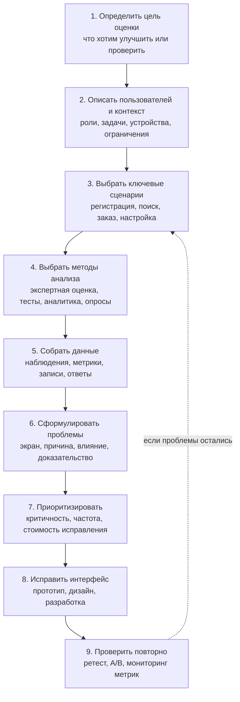

# 12. Методы анализа качества интерфейсов

## Краткое определение

**Анализ качества интерфейса** - это систематическая проверка того, насколько пользовательский интерфейс помогает целевой аудитории решать свои задачи эффективно, результативно, безопасно и с приемлемым уровнем удовлетворенности. В отличие от обычного поиска технических дефектов, анализ интерфейса оценивает не только "работает ли кнопка", но и "понимает ли пользователь, что делать", "сколько усилий требуется", "какие ошибки возникают" и "достигает ли интерфейс бизнес-цели".

Качество интерфейса обычно рассматривают через свойства usability и UX:

- **результативность**: пользователь достигает цели, например оформляет заказ или находит документ;
- **эффективность**: цель достигается за разумное время, с небольшим числом действий и без лишней нагрузки;
- **удовлетворенность**: пользователь воспринимает работу как понятную, удобную и надежную;
- **обучаемость**: новый пользователь быстро понимает, как пользоваться системой;
- **устойчивость к ошибкам**: интерфейс предотвращает ошибки, помогает их заметить и исправить;
- **доступность**: интерфейс пригоден для людей с разными возможностями, устройствами и контекстами использования.

Методы анализа качества интерфейсов делят на несколько групп: экспертные методы, пользовательские исследования, количественные эксперименты, продуктовую аналитику и опросные методы. На практике их комбинируют: экспертная оценка быстро находит очевидные проблемы, юзабилити-тестирование показывает реальное поведение пользователей, A/B-тесты проверяют влияние изменений на метрики, а аналитика выявляет масштаб проблемы на продуктивных данных.

## Что именно оценивают

Интерфейс нельзя оценивать "вообще". Нужно заранее определить контекст: кто пользователь, какую задачу он решает, в какой среде, на каком устройстве, с какими ограничениями и каким результатом должен завершиться сценарий.

| Объект анализа | Что проверяется | Пример вопроса |
|---|---|---|
| **Навигация** | Понятность структуры, меню, переходов, поиска | Может ли пользователь быстро найти нужный раздел? |
| **Информационная архитектура** | Группировка функций, названия, иерархия данных | Ожидает ли пользователь настройку уведомлений именно в этом разделе? |
| **Визуальная ясность** | Контраст, композиция, читаемость, акценты | Видно ли основное действие на экране? |
| **Формы и ввод** | Валидация, маски, подсказки, обработка ошибок | Понимает ли пользователь, почему поле заполнено неверно? |
| **Обратная связь** | Сообщения о состоянии, загрузке, успехе, ошибке | Ясно ли, что запрос отправлен и что будет дальше? |
| **Сценарии** | Последовательность шагов от цели до результата | Можно ли оформить заказ без лишних возвратов и тупиков? |
| **Доступность** | Клавиатурная навигация, контраст, подписи, screen reader | Можно ли пользоваться интерфейсом без мыши? |
| **Производительность восприятия** | Время реакции, задержки, прогресс-индикаторы | Не воспринимается ли система как зависшая? |

## Экспертная оценка

**Экспертная оценка** - это анализ интерфейса специалистом по UX, UI, продуктовой аналитике, accessibility или предметной области. Эксперт проходит ключевые экраны и сценарии, фиксирует проблемы, оценивает их серьезность и предлагает исправления.

Главная идея метода: опытный специалист знает типовые паттерны поведения пользователей и типовые дефекты интерфейсов, поэтому может быстро найти проблемы без привлечения большого числа респондентов.

### Как проводится экспертная оценка

1. Определяются цели оценки: например снизить ошибки при регистрации или проверить готовность интерфейса к запуску.
2. Выбираются пользовательские сценарии: вход, поиск, оформление заявки, оплата, настройка профиля.
3. Эксперт проходит сценарии как пользователь, но анализирует их профессионально.
4. Для каждой проблемы фиксируются экран, описание, причина, риск, серьезность и рекомендация.
5. Проблемы приоритизируются по влиянию на пользователя и бизнес.

Пример шкалы серьезности:

| Уровень | Значение | Пример |
|---|---|---|
| **Critical** | Сценарий невозможно завершить | Кнопка оплаты неактивна, но причина не объяснена |
| **High** | Сценарий завершается с большим риском ошибки | Пользователь может случайно удалить данные без подтверждения |
| **Medium** | Интерфейс замедляет работу или вызывает сомнения | Непонятные подписи полей в форме |
| **Low** | Локальная проблема восприятия | Неровные отступы, второстепенная неясность |

### Достоинства и ограничения

Преимущества экспертной оценки:

- быстро проводится;
- подходит на ранних этапах, когда еще нет готового продукта;
- не требует набора пользователей;
- хорошо выявляет нарушения стандартов, паттернов и визуальной логики;
- помогает подготовить интерфейс к более дорогим исследованиям.

Ограничения:

- эксперт может ошибаться относительно поведения реальных пользователей;
- результат зависит от квалификации эксперта;
- метод хуже выявляет неожиданные пользовательские стратегии;
- без данных нельзя точно оценить масштаб проблемы.

Экспертная оценка полезна как первый фильтр качества, но ее нельзя считать полной заменой юзабилити-тестирования.

## Эвристическая оценка

**Эвристическая оценка** - это разновидность экспертной оценки, при которой интерфейс проверяется по набору эвристик, то есть общих правил хорошего интерфейса. Наиболее известны эвристики Якоба Нильсена.

Классические эвристики включают:

1. **Видимость состояния системы**. Пользователь должен понимать, что происходит: загрузка, сохранение, ошибка, успешное завершение.
2. **Соответствие интерфейса реальному миру**. Термины, порядок действий и метафоры должны быть близки пользователю.
3. **Контроль и свобода пользователя**. Нужны отмена, возврат, выход из нежелательного действия.
4. **Согласованность и стандарты**. Одинаковые действия должны выглядеть и работать одинаково.
5. **Предотвращение ошибок**. Лучше не допустить ошибку, чем потом объяснять ее.
6. **Узнавание вместо вспоминания**. Пользователь не должен помнить скрытые команды и данные с предыдущих экранов.
7. **Гибкость и эффективность**. Новичкам нужны подсказки, опытным пользователям - быстрые способы работы.
8. **Минимализм и отсутствие лишнего**. Интерфейс не должен перегружать пользователя нерелевантной информацией.
9. **Помощь в распознавании и исправлении ошибок**. Сообщения об ошибках должны быть конкретными и полезными.
10. **Справка и документация**. Если справка нужна, она должна быть легко доступной и привязанной к задаче.

### Пример эвристической оценки

Допустим, пользователь заполняет форму регистрации в личном кабинете.

| Наблюдение | Нарушенная эвристика | Риск | Рекомендация |
|---|---|---|---|
| После нажатия "Создать аккаунт" кнопка не показывает состояние загрузки | Видимость состояния системы | Пользователь нажимает несколько раз и создает дублирующие запросы | Добавить disabled-состояние и индикатор "Создаем..." |
| Ошибка "Invalid input" выводится под полем телефона | Соответствие реальному миру; помощь в исправлении ошибок | Пользователь не понимает, что исправить | Писать: "Введите телефон в формате +7 900 000-00-00" |
| Пароль должен содержать спецсимвол, но это становится известно только после отправки формы | Предотвращение ошибок | Повторное заполнение и раздражение | Показать правила пароля до отправки |
| Ссылка "Назад" сбрасывает все введенные данные | Контроль и свобода пользователя | Потеря данных | Сохранять черновик или предупреждать о потере |

Эвристическая оценка хороша тем, что делает экспертную проверку менее субъективной: эксперт не просто говорит "мне неудобно", а связывает проблему с понятным принципом.

## Когнитивное прохождение

**Когнитивное прохождение** (cognitive walkthrough) - это метод, при котором исследователь пошагово проходит пользовательский сценарий и проверяет, сможет ли новый или неопытный пользователь понять, какое действие выполнить дальше.

Метод особенно полезен для оценки **обучаемости** интерфейса: насколько легко пользователь впервые выполняет задачу без обучения, инструкции и помощи специалиста.

Для каждого шага сценария обычно задают вопросы:

1. Поймет ли пользователь, что ему нужно сделать на этом шаге?
2. Увидит ли он нужный элемент управления?
3. Свяжет ли он этот элемент со своей целью?
4. Получит ли он понятную обратную связь после действия?

### Пример когнитивного прохождения

Сценарий: пользователь хочет подключить автоплатеж в банковском приложении.

| Шаг | Вопрос анализа | Возможная проблема |
|---|---|---|
| Открыть раздел платежей | Поймет ли пользователь, где искать автоплатеж? | Функция спрятана в "Прочее", а не в "Платежи" |
| Выбрать поставщика услуги | Видит ли пользователь поиск по поставщикам? | Поиск расположен только внизу длинного списка |
| Указать сумму и период | Ясны ли поля и ограничения? | Не объяснено, что сумма должна быть не меньше 100 рублей |
| Подтвердить настройку | Понимает ли пользователь последствия? | Нет явного текста, когда будет первое списание |
| Получить результат | Есть ли понятная обратная связь? | Экран закрывается без подтверждения подключения |

Когнитивное прохождение отличается от обычной экспертной оценки тем, что фокусируется не на всех аспектах интерфейса, а на логике обучения и понимания: "догадается ли пользователь, что делать дальше".

## Юзабилити-тестирование

**Юзабилити-тестирование** - это наблюдение за реальными или репрезентативными пользователями, которые выполняют типовые задания в интерфейсе. Исследователь фиксирует, где пользователи ошибаются, сомневаются, тратят лишнее время или не достигают цели.

Это один из самых сильных методов анализа, потому что он показывает не мнение эксперта, а фактическое поведение людей.

### Виды юзабилити-тестирования

| Вид | Описание | Когда применять |
|---|---|---|
| **Модерируемое** | Исследователь дает задания, наблюдает и задает уточняющие вопросы | Когда нужно понять причины поведения |
| **Немодерируемое** | Пользователь выполняет задания самостоятельно, данные записываются инструментом | Когда нужно быстро собрать больше наблюдений |
| **Очное** | Участник и исследователь находятся в одной среде | Для сложных продуктов, оборудования, специальных условий |
| **Удаленное** | Тест проводится через видеосвязь или платформу | Для веб- и мобильных продуктов с распределенной аудиторией |
| **Формативное** | Проводится во время проектирования для поиска проблем | На прототипах и ранних версиях |
| **Суммативное** | Проводится для итоговой оценки по метрикам | Перед релизом или для сравнения версий |

### Типовой план юзабилити-теста

1. Определить цели исследования: например проверить сценарий первого заказа.
2. Описать целевую аудиторию и критерии отбора участников.
3. Подготовить задания, которые формулируются как пользовательские цели, а не как инструкции по интерфейсу.
4. Подготовить прототип или рабочую версию продукта.
5. Провести пилотный тест на одном участнике.
6. Провести основные сессии, записать экран, действия, комментарии и ошибки.
7. Проанализировать проблемы, сгруппировать их и оценить серьезность.
8. Подготовить рекомендации и проверить исправления повторным тестом.

Важно формулировать задания нейтрально. Плохое задание: "Нажмите кнопку Фильтр и выберите дату". Хорошее задание: "Найдите все операции за прошлый месяц". Во втором случае проверяется, сможет ли пользователь сам обнаружить нужный путь.

### Что измеряют в юзабилити-тесте

| Метрика | Что показывает | Пример |
|---|---|---|
| **Task success rate** | Доля пользователей, завершивших задачу | 8 из 10 участников оформили заказ |
| **Time on task** | Время выполнения задачи | Среднее время поиска товара - 2 минуты 15 секунд |
| **Error rate** | Количество ошибок на задачу | 4 участника ввели дату в неверном формате |
| **Number of steps/clicks** | Сложность сценария | Для оплаты требуется 9 кликов вместо ожидаемых 4 |
| **Assistance rate** | Как часто нужна помощь модератора | 3 из 5 участников попросили подсказку |
| **SUS/SEQ** | Субъективная оценка удобства | После задания участник ставит 3 из 7 по шкале легкости |

Юзабилити-тестирование не обязано быть большим. Для раннего поиска проблем часто достаточно 5-8 участников на одну относительно однородную группу пользователей. Если аудитории разные, например новички и опытные операторы, их лучше тестировать отдельно.

## A/B-тестирование

**A/B-тестирование** - это количественный эксперимент, в котором пользователей случайно делят на группы и показывают разные версии интерфейса. Затем сравнивают заранее выбранные метрики: конверсию, время выполнения, количество ошибок, удержание, средний чек, клики по целевому действию.

Пример: часть пользователей видит старую форму заказа, часть - новую форму с упрощенными полями. Если новая версия статистически значимо повышает долю завершенных заказов и не ухудшает другие важные метрики, ее можно внедрять.

### Когда A/B-тест уместен

A/B-тестирование подходит, если:

- продукт уже имеет достаточный поток пользователей;
- изменение можно изолировать от других изменений;
- есть четкая гипотеза;
- заранее определена основная метрика;
- эксперимент не создает этических, юридических или репутационных рисков;
- результат можно оценить статистически.

Пример гипотезы: "Если заменить текст кнопки `Отправить` на `Получить расчет`, то конверсия в отправку заявки вырастет, потому что пользователь лучше понимает ценность действия".

### Ограничения A/B-тестов

A/B-тест показывает, **что** одна версия лучше другой по выбранной метрике, но не всегда объясняет, **почему**. Поэтому его полезно сочетать с юзабилити-тестами, интервью и аналитикой поведения.

Типичные ошибки A/B-тестирования:

- запускать тест без гипотезы;
- смотреть слишком много метрик и выбирать удачную постфактум;
- останавливать эксперимент сразу после первого "хорошего" результата;
- проводить тест на слишком малой выборке;
- не учитывать сезонность, каналы трафика и различия сегментов;
- улучшать конверсию ценой роста ошибок, отмен или обращений в поддержку.

## Продуктовая аналитика интерфейса

**Аналитика интерфейса** - это сбор и анализ событий, которые описывают действия пользователей в продукте: просмотры экранов, клики, ввод, отправку форм, ошибки, возвраты, завершение сценариев.

Аналитика отвечает на вопросы:

- где пользователи выходят из сценария;
- какие функции почти не используются;
- какие ошибки возникают чаще всего;
- сколько времени занимает путь до результата;
- какие сегменты пользователей сталкиваются с проблемой;
- как изменение интерфейса повлияло на поведение после релиза.

### Основные инструменты аналитики

| Инструмент | Что показывает | Пример использования |
|---|---|---|
| **Воронка** | Потери пользователей между шагами | 40% пользователей уходят на шаге выбора доставки |
| **Когортный анализ** | Поведение групп пользователей во времени | Новые пользователи хуже возвращаются после первой сессии |
| **Карты кликов** | Куда пользователи нажимают | Пользователи кликают на некликабельную картинку товара |
| **Записи сессий** | Реальные последовательности действий | Пользователь несколько раз открывает и закрывает фильтр |
| **Логи ошибок** | Технические и интерфейсные сбои | Частая ошибка валидации поля ИНН |
| **Поисковая аналитика** | Запросы и неудачные поиски | Пользователи ищут "возврат", но раздел называется "рекламации" |

Пример: воронка оформления заказа показывает, что 70% пользователей доходят до выбора доставки, но только 35% переходят к оплате. Юзабилити-тест может объяснить причину: пользователи не видят, что доставка в пункт выдачи выбирается отдельной вкладкой.

## Опросы и анкетирование

**Опросы** помогают собрать субъективные оценки пользователей: насколько интерфейс понятен, удобен, надежен, вызывает ли доверие, готовы ли пользователи рекомендовать продукт.

Опросы полезны, когда нужно:

- оценить удовлетворенность после выполнения сценария;
- сравнить версии продукта по восприятию;
- собрать массовую обратную связь;
- понять ожидания и боли аудитории;
- дополнить поведенческие данные объяснениями пользователей.

Популярные шкалы и опросники:

| Метод | Что измеряет | Как интерпретировать |
|---|---|---|
| **SUS (System Usability Scale)** | Общую субъективную удобность системы | Итоговый балл от 0 до 100 |
| **SEQ (Single Ease Question)** | Легкость конкретной задачи | Оценка после выполнения задания |
| **CSAT** | Удовлетворенность взаимодействием | "Насколько вы довольны?" |
| **NPS** | Готовность рекомендовать продукт | Индикатор лояльности, но не прямая мера usability |
| **UMUX-LITE** | Краткую оценку полезности и удобства | Удобен для регулярных продуктовых замеров |

Опросы нельзя использовать как единственный метод анализа качества интерфейса. Пользователи могут говорить, что интерфейс удобен, но при этом ошибаться в реальных задачах; или наоборот, критиковать интерфейс, который объективно работает быстрее. Поэтому опросные данные нужно сопоставлять с поведением.

## Метрики качества интерфейса

Метрики нужны, чтобы перейти от общих фраз к проверяемым критериям. Хорошая метрика связана с пользовательской задачей и помогает принять решение.

### Пользовательские метрики

| Метрика | Смысл | Пример целевого значения |
|---|---|---|
| **Доля успешного выполнения задачи** | Сколько пользователей достигли цели | Не менее 90% оформляют заявку без помощи |
| **Время выполнения задачи** | Насколько быстро пользователь достигает цели | Медиана поиска документа - до 60 секунд |
| **Число ошибок** | Сколько неправильных действий возникает | Не более 1 критической ошибки на сессию |
| **Число шагов** | Насколько длинный сценарий | Оплата не более чем за 4 основных шага |
| **Повторные попытки** | Где пользователь не понимает, как действовать | Не более 5% повторных отправок формы |
| **Уровень обращений в поддержку** | Какие интерфейсные проблемы доходят до поддержки | Снижение обращений по регистрации на 30% |

### Продуктовые и бизнес-метрики

| Метрика | Что отражает | Риск неправильной трактовки |
|---|---|---|
| **Conversion rate** | Доля пользователей, завершивших целевое действие | Рост конверсии может сопровождаться ростом возвратов |
| **Drop-off rate** | Потери на шаге сценария | Причина потерь может быть вне интерфейса, например цена |
| **Retention** | Возврат пользователей | Зависит не только от UI, но и от ценности продукта |
| **Activation rate** | Доля пользователей, дошедших до первого полезного результата | Нужно правильно определить "полезный результат" |
| **Support tickets** | Количество проблем, доходящих до поддержки | Часть пользователей не обращается, а просто уходит |

### Метрики доступности

Для доступности можно проверять:

- долю элементов с корректными текстовыми альтернативами;
- возможность пройти сценарий с клавиатуры;
- контраст текста и фона;
- корректность фокуса;
- понятность подписей полей;
- отсутствие ловушек фокуса в модальных окнах;
- совместимость со screen reader.

Доступность не должна быть финальной проверкой "перед релизом". Ее дешевле учитывать во время проектирования компонентов и дизайн-системы.

## Схема процесса оценки интерфейса

Эта схема подчеркивает, что оценка интерфейса - не одноразовая инспекция, а цикл. После исправлений нужно снова проверять, исчезла ли проблема и не появились ли новые дефекты.

## Как выбрать метод

| Ситуация | Подходящие методы | Почему |
|---|---|---|
| Есть только идея или ранний прототип | Экспертная оценка, когнитивное прохождение, интервью | Можно быстро проверить логику без разработки |
| Нужно найти основные проблемы перед релизом | Эвристическая оценка, юзабилити-тестирование | Комбинация экспертного и пользовательского взгляда |
| Есть работающий продукт и много пользователей | Аналитика, A/B-тесты, опросы | Можно оценивать реальные данные и масштаб |
| Нужно проверить новый сценарий для новичков | Когнитивное прохождение, модерируемый тест | Важна обучаемость и понимание первого шага |
| Нужно доказать влияние изменения | A/B-тест, анализ метрик до/после | Нужна количественная проверка |
| Есть жалобы, но причина неясна | Аналитика, записи сессий, интервью, юзабилити-тест | Нужно соединить масштаб и объяснение |
| Проверяется соответствие стандартам | Экспертная оценка, accessibility-аудит, чек-листы | Нужна проверка правил и ограничений |

Хорошая стратегия обычно выглядит так: сначала экспертная и эвристическая оценка убирают очевидные ошибки, затем юзабилити-тестирование проверяет реальные сценарии, после релиза аналитика и A/B-тесты отслеживают эффект на большой аудитории.

## Пример комплексной оценки

Допустим, интернет-магазин хочет улучшить оформление заказа. Пользователи добавляют товары в корзину, но часто не завершают оплату.

1. **Аналитика** показывает: самый большой отток происходит на шаге выбора доставки.
2. **Записи сессий** показывают: пользователи переключают вкладки доставки, возвращаются назад, снова открывают корзину.
3. **Эвристическая оценка** выявляет: стоимость доставки меняется без явного объяснения, состояние системы плохо видно.
4. **Юзабилити-тест** подтверждает: участники не понимают, почему выбранный пункт выдачи стал недоступен.
5. **Исправление**: интерфейс показывает причину недоступности, рекомендует ближайшие варианты и сразу пересчитывает стоимость.
6. **A/B-тест** сравнивает старую и новую версию по доле завершенных заказов, времени выбора доставки и обращениям в поддержку.
7. **Опрос после заказа** проверяет субъективную ясность сценария.

Итоговая оценка становится надежной, потому что проблема подтверждена разными типами данных: поведенческими метриками, наблюдением пользователей, экспертным анализом и экспериментом.

## Типичные ошибки при анализе качества интерфейсов

1. **Оценивать интерфейс без сценариев.** Фраза "экран неудобный" слишком общая. Нужно проверять конкретную задачу конкретного пользователя.
2. **Подменять пользователя мнением эксперта.** Экспертная оценка полезна, но реальные пользователи могут вести себя иначе.
3. **Спрашивать мнение вместо наблюдения за поведением.** Вопрос "вам удобно?" слабее, чем наблюдение, смог ли пользователь выполнить задачу.
4. **Тестировать только счастливый путь.** Важно проверять ошибки, отмену, возврат, пустые состояния, ограничения, медленную загрузку.
5. **Набирать нерепрезентативных участников.** Если продукт для бухгалтеров, тест на студентах не покажет всех предметных проблем.
6. **Давать подсказки во время юзабилити-теста.** Если модератор ведет пользователя по интерфейсу, тест перестает показывать самостоятельное поведение.
7. **Собирать метрики без гипотезы.** Большой набор чисел не помогает, если заранее не ясно, какое решение нужно принять.
8. **Оптимизировать одну метрику в ущерб другим.** Например, можно повысить конверсию агрессивной кнопкой, но увеличить возвраты и недоверие.
9. **Игнорировать доступность.** Интерфейс может выглядеть хорошим визуально, но быть непроходимым с клавиатуры или screen reader.
10. **Не проводить повторную проверку.** Исправление может не решить исходную проблему или создать новую.
11. **Путать корреляцию и причину.** Если после редизайна выросла конверсия, это могло быть связано с рекламной кампанией или сезонностью.
12. **Фиксировать проблемы без приоритета.** Список из 100 замечаний бесполезен, если не ясно, какие из них блокируют ключевые сценарии.

## Краткий вывод

Методы анализа качества интерфейсов нужны для того, чтобы оценивать интерфейс не по вкусу разработчика или дизайнера, а по тому, насколько успешно реальные пользователи решают свои задачи. Экспертная и эвристическая оценки быстро выявляют нарушения принципов проектирования. Когнитивное прохождение показывает, понятен ли сценарий новичку. Юзабилити-тестирование обнаруживает реальные проблемы поведения. A/B-тестирование и аналитика позволяют измерить эффект на большой аудитории. Опросы дают субъективную оценку удовлетворенности, но должны использоваться вместе с наблюдением и метриками.

Наиболее надежный подход - комбинировать методы. Качественные методы объясняют причины проблем, количественные методы показывают масштаб и эффект изменений. Поэтому анализ интерфейса должен быть циклом: определить цель, выбрать сценарии, собрать данные, исправить проблемы и проверить результат повторно.

## Источники

1. Источник из списка дисциплины, указанный в вопросе: **[5, стр. 125]**.
2. ISO 9241-11:2018. **Ergonomics of human-system interaction - Part 11: Usability: Definitions and concepts**.
3. Nielsen J. **10 Usability Heuristics for User Interface Design**. Nielsen Norman Group. URL: <https://www.nngroup.com/articles/ten-usability-heuristics/>
4. Nielsen J. **How to Conduct a Heuristic Evaluation**. Nielsen Norman Group. URL: <https://www.nngroup.com/articles/how-to-conduct-a-heuristic-evaluation/>
5. Lewis C., Wharton C. **Cognitive Walkthroughs**. In: Handbook of Human-Computer Interaction, 1997.
6. Brooke J. **SUS: A quick and dirty usability scale**. In: Usability Evaluation in Industry, 1996.
7. W3C. **Web Content Accessibility Guidelines (WCAG) 2.2**. URL: <https://www.w3.org/TR/WCAG22/>
