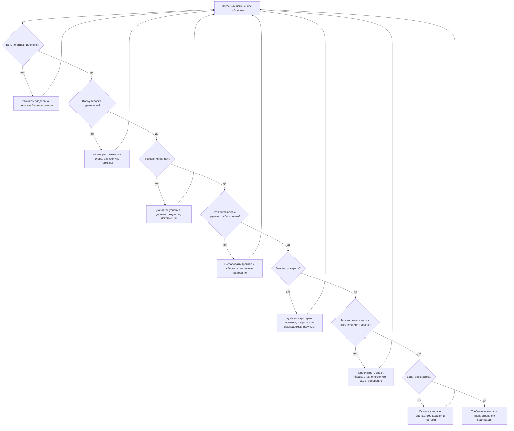

# 12. Свойства качественных требований

## Краткое определение

**Требование** - это зафиксированное описание того, что система должна делать, какими свойствами должна обладать или каким ограничениям должна соответствовать. Требование связывает потребность заинтересованной стороны с будущей реализацией, тестированием и приемкой продукта.

**Качественное требование** - это не "красиво написанное" требование, а требование, с которым можно работать инженерно: понять его смысл, оценить реализуемость, спроектировать решение, проверить результат и связать его с исходной бизнес-потребностью. В учебной формулировке [5, стр. 54] к таким требованиям обычно относят корректность, полноту, непротиворечивость, однозначность, проверяемость, реализуемость, трассируемость и близкие свойства.

Главная идея: требование должно уменьшать неопределенность, а не создавать новую. Если после чтения требования разные участники проекта представляют себе разные результаты, требование еще не готово к реализации.

## Зачем проверять качество требований

Ошибки в требованиях особенно дороги, потому что они попадают во все следующие этапы: проектирование, разработку, тестирование, документацию, внедрение. Чем позже обнаружена ошибка, тем дороже ее исправлять.

Плохое требование приводит к типичным последствиям:

- разработчики реализуют не то, что ожидал заказчик;
- тестировщики не могут сформулировать критерии приемки;
- заказчик не может объективно принять или отклонить результат;
- появляются споры о смысле слов "быстро", "удобно", "надежно", "автоматически";
- часть требований дублируется, противоречит друг другу или остается без владельца;
- изменения невозможно контролировать, потому что непонятно, от какой цели они произошли.

## Свойства хорошего требования

| Свойство | Смысл | Плохой пример | Хороший пример |
|---|---|---|---|
| **Корректность** | Требование действительно отражает потребность заказчика, пользователя, закона или бизнес-процесса. | "Система должна списывать деньги сразу после добавления товара в корзину." | "Система должна списывать деньги только после подтверждения заказа пользователем и успешной проверки платежа." |
| **Полнота** | Указаны все существенные условия: кто выполняет действие, когда, с какими данными, что считается результатом, какие есть исключения. | "Пользователь может восстановить пароль." | "Пользователь может запросить восстановление пароля по email; система отправляет одноразовую ссылку сроком действия 30 минут." |
| **Непротиворечивость** | Требование не конфликтует с другими требованиями, бизнес-правилами, ограничениями и терминологией. | "Пользователь может удалить заказ в любом статусе" и одновременно "Оплаченный заказ нельзя удалить." | "Пользователь может удалить только черновик заказа. Оплаченные заказы можно только отменить через отдельную операцию." |
| **Однозначность** | Формулировка допускает одно разумное толкование. Нет расплывчатых слов без критериев. | "Интерфейс должен быть удобным и современным." | "На странице оформления заказа пользователь должен видеть итоговую сумму, адрес доставки, способ оплаты и кнопку подтверждения без перехода на другие страницы." |
| **Проверяемость** | Можно объективно установить, выполнено требование или нет: тестом, инспекцией, метрикой, демонстрацией. | "Система должна работать быстро." | "Страница каталога должна открываться не дольше 2 секунд при 1000 одновременных пользователях и 95-м процентиле времени ответа." |
| **Реализуемость** | Требование можно выполнить в рамках доступных технологий, бюджета, сроков, компетенций и ограничений среды. | "Система должна гарантировать 100% защиту от любых атак." | "Система должна блокировать учетную запись на 15 минут после 5 неуспешных попыток входа подряд." |
| **Трассируемость** | Можно проследить происхождение требования и его связь с проектными артефактами: целью, задачей, дизайном, кодом, тестом. | "Добавить фильтр" без указания источника и связанных сценариев. | "`REQ-42`: фильтр заказов по статусу, источник - интервью с отделом поддержки, связан с user story `US-17` и тестами `TC-42.1`-`TC-42.4`." |
| **Атомарность** | Одно требование описывает одну проверяемую обязанность системы, а не набор разных функций. | "Система должна регистрировать пользователя, отправлять письмо, показывать подсказки и строить отчет." | "После успешной регистрации система должна отправить пользователю email с подтверждением адреса." |
| **Измеримость** | Для количественных свойств указаны метрики, пороги и условия измерения. | "Система должна быть надежной." | "Система должна сохранять доступность публичного API не ниже 99,9% в месяц, исключая согласованные окна обслуживания." |
| **Приоритетность** | Понятно, насколько требование важно для проекта: обязательно, желательно, отложено. | Все требования помечены как "важные". | "MUST: вход по email и паролю; SHOULD: вход через SSO; COULD: вход через социальные сети." |
| **Согласованность терминов** | Используются одни и те же понятия для одних и тех же сущностей. | В разных местах: "клиент", "покупатель", "пользователь" без различий. | "Пользователь - человек с учетной записью; покупатель - пользователь, оформивший хотя бы один заказ." |
| **Понятность для участников** | Требование написано так, чтобы его понимали аналитик, заказчик, разработчик и тестировщик. | "Реализовать фичу конкурентного омниканального матчинга." | "Система должна объединять обращения одного клиента из email, чата и телефона в одну карточку обращения." |

## Корректность

Требование корректно, если оно описывает действительно нужное поведение системы. Корректность проверяется не только логикой текста, но и источником: интервью, бизнес-правилом, договором, законом, пользовательским сценарием, архитектурным ограничением.

Плохая формулировка:

> Система должна автоматически отклонять заявку, если клиент не загрузил паспорт.

Проблема: в реальном бизнес-процессе может быть несколько допустимых документов, а паспорт требуется только для отдельных типов заявок.

Хорошая формулировка:

> Для заявки на потребительский кредит система должна отклонить отправку на скоринг, если пользователь не загрузил хотя бы один документ из списка: паспорт РФ, временное удостоверение личности, вид на жительство.

Такое требование точнее отражает предметную область и не навязывает неверное бизнес-правило.

## Полнота

Полнота означает, что в требовании хватает информации для проектирования и проверки. Часто полезно задавать вопросы: кто, что делает, когда, при каких условиях, какие данные нужны, какой результат ожидается, какие исключения возможны.

Неполное требование:

> Система должна уведомлять пользователя о заказе.

Что неясно: о каком событии уведомлять, каким каналом, кого именно, когда, с каким содержанием, что делать при ошибке доставки.

Более полное требование:

> После перехода заказа в статус `Передан в доставку` система должна отправить покупателю email и push-уведомление с номером заказа, службой доставки и ссылкой на отслеживание. Если push-уведомление не доставлено, повторная отправка не выполняется; email должен быть поставлен в очередь повторной отправки до 3 раз.

Полнота не означает чрезмерную детализацию реализации. Требование должно описывать нужный результат и существенные условия, но не обязательно диктовать внутренний код, если это не является ограничением проекта.

## Непротиворечивость

Непротиворечивость бывает внутренней и внешней.

**Внутренняя непротиворечивость** - одно требование не содержит конфликта внутри себя.

Плохой пример:

> Пользователь должен обязательно указать номер телефона, но поле телефона является необязательным.

**Внешняя непротиворечивость** - требование не конфликтует с другими требованиями.

Плохая пара требований:

- `REQ-10`: пользователь может изменить email без подтверждения.
- `REQ-21`: любое изменение email должно подтверждаться одноразовым кодом.

Хорошая согласованная версия:

- `REQ-10`: пользователь может изменить email в профиле.
- `REQ-21`: изменение email вступает в силу только после подтверждения одноразовым кодом, отправленным на новый адрес.

Противоречия часто появляются при изменениях: старые требования не удаляют, новые добавляют поверх, а связи между ними не проверяют.

## Однозначность

Однозначное требование не заставляет участников проекта угадывать смысл. Особенно опасны слова без критериев:

- "быстро";
- "удобно";
- "интуитивно";
- "безопасно";
- "надежно";
- "по возможности";
- "при необходимости";
- "обычно";
- "достаточно";
- "гибко";
- "современно".

Эти слова можно использовать в обсуждении, но в финальном требовании их нужно раскрывать через конкретные условия, сценарии, ограничения или метрики.

Плохой пример:

> По возможности система должна быстро показывать важные уведомления.

Хороший пример:

> Система должна показывать уведомление о блокировке платежа в личном кабинете не позднее чем через 5 секунд после получения события `payment.blocked` от платежного шлюза.

Однозначность также требует стабильной терминологии. Если "заявка", "обращение" и "тикет" означают разные вещи, это нужно явно определить в глоссарии.

## Проверяемость

Проверяемость означает, что для требования можно составить критерии приемки или тест-кейсы. Если требование нельзя проверить, его нельзя объективно принять.

Плохой пример:

> Система должна быть максимально защищенной.

Почему плохо: нет границы выполнения. Нельзя доказать "максимальность".

Хороший пример:

> Система должна требовать повторную аутентификацию пользователя перед изменением номера телефона, если с момента последнего входа прошло более 30 минут.

Это можно проверить:

- войти в систему;
- подождать или смоделировать истечение 30 минут;
- попытаться изменить номер телефона;
- убедиться, что система требует повторную аутентификацию.

Для нефункциональных требований проверяемость особенно важна. Производительность, доступность, безопасность, совместимость и удобство нужно описывать через измеримые признаки.

## Реализуемость

Реализуемость не означает, что требование легко выполнить. Оно означает, что требование не противоречит физическим, техническим, юридическим, организационным и экономическим ограничениям проекта.

Нереалистичное требование:

> Система должна обеспечивать нулевое время простоя при любых авариях дата-центра.

Более реализуемая версия:

> При отказе основного дата-центра система должна восстановить прием заказов в резервном дата-центре не позднее 15 минут после подтверждения инцидента; допустимая потеря данных - не более 5 минут.

Здесь указаны инженерные параметры: RTO и RPO. Их можно обсуждать, оценивать, проектировать и проверять.

## Трассируемость

Трассируемость нужна, чтобы понимать, откуда появилось требование, зачем оно нужно и где оно реализовано. Обычно требование связывают с:

- бизнес-целью;
- заинтересованной стороной или источником;
- пользовательским сценарием;
- архитектурным решением;
- задачами разработки;
- тест-кейсами;
- дефектами;
- изменениями в документации.

Пример трассируемого требования:

```text
REQ-INV-07
Название: Резервирование товара на складе
Источник: интервью с руководителем склада, 2026-05-12
Бизнес-цель: снизить число отмен из-за отсутствия товара
Требование: после подтверждения заказа система должна зарезервировать товар на складе на 30 минут.
Связанные сценарии: US-23, UC-05
Связанные тесты: TC-INV-07-01, TC-INV-07-02
Приоритет: MUST
```

Без трассируемости трудно отвечать на вопросы: "кто это просил?", "что сломается, если убрать?", "какие тесты нужно обновить?", "какие требования затронет изменение?".

## Атомарность и связность

Требование должно быть достаточно маленьким, чтобы его можно было отдельно проверить, но достаточно осмысленным, чтобы оно не превращалось в бессвязную техническую фразу.

Плохой пример, требование перегружено:

> Система должна регистрировать пользователя, проверять email, отправлять SMS, создавать профиль, начислять бонусы и строить отчет по регистрациям.

Лучше разделить:

- система должна создать учетную запись после отправки валидной регистрационной формы;
- система должна отправить email со ссылкой подтверждения;
- система должна начислить приветственные бонусы после подтверждения email;
- система должна включать подтвержденную регистрацию в отчет по регистрациям.

Так проще назначать ответственность, оценивать трудоемкость, писать тесты и отслеживать выполнение.

## Примеры улучшения требований

| Тип ошибки | Плохая формулировка | Что не так | Улучшенная формулировка |
|---|---|---|---|
| Расплывчатость | "Система должна быть удобной." | Нет сценария и критерия. | "Пользователь должен иметь возможность оформить заказ из корзины не более чем за 3 шага: адрес, оплата, подтверждение." |
| Нет метрики | "Отчет должен формироваться быстро." | Нельзя проверить скорость. | "Отчет по продажам за месяц должен формироваться не дольше 10 секунд при объеме до 100 000 заказов." |
| Смешение требований | "Система должна принимать платежи и отправлять чеки." | Две разные обязанности. | "Система должна принять оплату банковской картой через платежный шлюз." и "После успешной оплаты система должна отправить электронный чек на email покупателя." |
| Противоречие | "Пользователь может редактировать закрытую заявку." | Может конфликтовать с правилом неизменности закрытых заявок. | "Пользователь может добавить комментарий к закрытой заявке, но не может изменить ее тему, описание, категорию и вложения." |
| Скрытая реализация | "Система должна использовать PostgreSQL для хранения корзины." | Возможно, это не требование заказчика, а преждевременное решение. | "Система должна сохранять содержимое корзины авторизованного пользователя между сессиями не менее 30 дней." |
| Неполное условие | "Система должна блокировать пользователя при ошибках входа." | Не указано число попыток и срок блокировки. | "Система должна блокировать вход на 15 минут после 5 неуспешных попыток ввода пароля подряд для одной учетной записи." |
| Непонятный термин | "Оператор должен видеть проблемные заказы." | Не определено, что такое "проблемный". | "Оператор должен видеть заказы, у которых статус доставки не изменялся более 48 часов после передачи в службу доставки." |

## Схема проверки качества требования



## Практический чек-лист аналитика

Перед передачей требования в разработку полезно пройти короткий контрольный список.

1. **Источник**: понятно, кто или что породило требование?
2. **Цель**: понятно, какую проблему требование решает?
3. **Область действия**: ясно, к какой системе, модулю, роли или сценарию оно относится?
4. **Условия**: указано, когда требование применяется?
5. **Результат**: описано наблюдаемое поведение системы?
6. **Исключения**: описаны важные альтернативные случаи и ошибки?
7. **Термины**: нет ли слов с разным смыслом для разных участников?
8. **Метрики**: есть ли числовые критерии там, где они нужны?
9. **Проверка**: можно ли написать тест или критерий приемки?
10. **Конфликты**: не противоречит ли требование другим требованиям?
11. **Реализуемость**: укладывается ли оно в технические и организационные ограничения?
12. **Трассировка**: есть ли идентификатор, владелец, связь с задачами и тестами?

Если хотя бы по одному пункту ответ отрицательный, требование лучше уточнить до передачи в реализацию.

## Типичные ошибки при формулировании требований

**Использование оценочных слов без критериев.** Слова "удобный", "быстрый", "надежный" сами по себе не являются требованиями. Их нужно раскрывать через сценарии и измеримые параметры.

**Смешение цели, требования и решения.** Бизнес-цель: "снизить число звонков в поддержку". Требование: "пользователь должен видеть статус доставки в личном кабинете". Решение: "добавить endpoint `/delivery/status`". Если эти уровни смешать, можно преждевременно зафиксировать технический способ и потерять настоящую цель.

**Слишком крупные требования.** Большое требование трудно оценить, реализовать и протестировать. Его лучше разделить на атомарные требования, связанные общим сценарием.

**Отсутствие отрицательных и исключительных сценариев.** Часто описывают только успешный путь: пользователь ввел данные, оплата прошла, отчет построился. Но качество требования зависит и от описания ошибок: неверные данные, недоступный сервис, истекший срок ссылки, нет прав доступа.

**Неявные предположения.** Аналитик может считать очевидным, что "пользователь" - это авторизованный пользователь, а разработчик реализует действие и для гостя. Неявные предположения нужно превращать в явные условия.

**Дублирование требований.** Одно и то же правило записано в разных разделах разными словами. При изменении одно место обновляют, другое забывают, и появляется противоречие.

**Нет приоритета.** Если все требования одинаково важны, команда не может принимать решения при ограниченных сроках. Приоритет должен помогать выбирать, что делать сначала и что можно отложить.

**Нет связи с тестами.** Требование считается готовым слишком рано, хотя тестировщик еще не может проверить его выполнение. Хорошая практика - формулировать критерии приемки вместе с требованием.

## Связь с функциональными и нефункциональными требованиями

Свойства качества применяются и к функциональным, и к нефункциональным требованиям.

**Функциональное требование** описывает поведение: что система делает.

Пример:

> Система должна позволять пользователю отменить неоплаченный заказ до передачи его в доставку.

**Нефункциональное требование** описывает качество, ограничение или характеристику: насколько быстро, надежно, безопасно, совместимо, сопровождаемо должна работать система.

Пример:

> Операция отмены неоплаченного заказа должна завершаться не дольше 1 секунды при нормальной нагрузке до 500 запросов в минуту.

Оба требования должны быть корректными, полными, непротиворечивыми, однозначными, проверяемыми, реализуемыми и трассируемыми. Разница только в том, что нефункциональные требования чаще требуют метрик и условий измерения.

## Мини-шаблон хорошего требования

Удобная форма для записи:

```text
ID: REQ-...
Название: краткое имя требования
Источник: кто запросил или какой документ/правило является основанием
Приоритет: MUST / SHOULD / COULD / WON'T или высокий / средний / низкий
Роль/актор: кто взаимодействует с системой
Условие: когда применяется требование
Требование: что система должна сделать
Исключения: что происходит при ошибках или альтернативных условиях
Критерии приемки: как понять, что требование выполнено
Связи: бизнес-цель, сценарии, задачи, тесты, зависимые требования
```

Пример:

```text
ID: REQ-AUTH-03
Название: Блокировка входа после неуспешных попыток
Источник: политика информационной безопасности
Приоритет: MUST
Роль/актор: пользователь с учетной записью
Условие: пользователь вводит неверный пароль
Требование: система должна заблокировать вход в учетную запись на 15 минут после 5 неуспешных попыток подряд.
Исключения: успешный вход сбрасывает счетчик неуспешных попыток.
Критерии приемки: после пятой ошибки вход невозможен даже при верном пароле; после 15 минут вход снова доступен.
Связи: SEC-01, TC-AUTH-03-01, TC-AUTH-03-02
```

## Краткий ответ для экзамена

Свойства качественных требований - это признаки, по которым требование можно считать пригодным для разработки, тестирования и приемки. Хорошее требование должно быть:

- **корректным** - соответствовать реальной потребности;
- **полным** - содержать необходимые условия, данные, результат и исключения;
- **непротиворечивым** - не конфликтовать с другими требованиями;
- **однозначным** - иметь одно понятное толкование;
- **проверяемым** - позволять объективно установить выполнение;
- **реализуемым** - быть выполнимым в ограничениях проекта;
- **трассируемым** - иметь источник и связи с целями, задачами, тестами;
- **атомарным** - описывать одну проверяемую обязанность;
- **измеримым** для количественных характеристик;
- **приоритизированным** - иметь понятную важность.

Например, плохое требование "система должна работать быстро" не является проверяемым и однозначным. Хорошая версия: "страница каталога должна возвращать ответ не дольше 2 секунд при 1000 одновременных пользователях и 95-м процентиле времени ответа". Такое требование можно измерить, протестировать, обсудить с командой и использовать при приемке.

## Вывод

Качество требований определяет качество всей последующей разработки. Требование должно быть не просто записано, а доведено до состояния инженерного артефакта: оно понятно участникам проекта, связано с потребностью, не конфликтует с другими правилами, выполнимо, проверяемо и имеет трассировку. Чем лучше сформулированы требования, тем меньше риск переделок, споров при приемке и реализации ненужной функциональности.

## Источники

1. Учебный источник [5], стр. 54 - свойства качественных требований: корректность, полнота, непротиворечивость, однозначность, проверяемость, реализуемость, трассируемость.
2. ISO/IEC/IEEE 29148:2018, Systems and software engineering - Life cycle processes - Requirements engineering.
3. Karl Wiegers, Joy Beatty. Software Requirements. Microsoft Press.
4. SWEBOK Guide, раздел Software Requirements.
