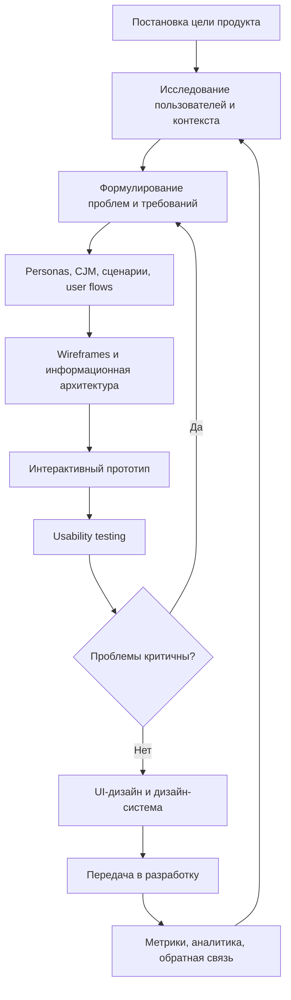

# 13. Проектирование интерфейсов на основе UX/UI-методов

## Краткое определение

**Проектирование интерфейсов на основе UX/UI-методов** - это системный процесс создания цифрового продукта, в котором решения о структуре, поведении и внешнем виде интерфейса принимаются не только по вкусу разработчика или заказчика, а на основании целей бизнеса, задач пользователей, контекста использования, прототипирования и проверки гипотез.

**UX (User Experience, пользовательский опыт)** отвечает за то, насколько продукт полезен, понятен, удобен и соответствует реальным сценариям пользователя. UX рассматривает весь путь взаимодействия человека с системой: от возникновения потребности до получения результата и последующих действий.

**UI (User Interface, пользовательский интерфейс)** отвечает за визуальную и интерактивную оболочку продукта: экраны, кнопки, формы, навигацию, типографику, цвет, иконки, состояния элементов, анимации и визуальную иерархию.

Главная мысль: **UX определяет, что пользователь должен сделать и почему ему должно быть удобно, а UI определяет, как это действие будет представлено на экране**.

## UX и UI: различия и связь

UX и UI часто употребляют вместе, но это разные уровни проектирования.

| Аспект | UX | UI |
|---|---|---|
| Основной вопрос | Что нужно пользователю и как он достигнет цели? | Как это будет выглядеть и восприниматься? |
| Фокус | Пользовательские задачи, сценарии, логика, удобство | Визуальный стиль, компоненты, состояния, композиция |
| Артефакты | Исследования, personas, CJM, сценарии, user flow, прототипы, результаты тестов | Макеты экранов, дизайн-система, UI-kit, спецификации компонентов |
| Методы проверки | Интервью, наблюдение, usability testing, аналитика | Визуальная проверка, дизайн-ревью, accessibility-аудит, проверка состояний |
| Ошибка при игнорировании | Продукт красивый, но не решает задачу | Продукт полезный, но неудобный, непонятный или визуально хаотичный |

Например, если проектируется приложение записи к врачу, UX-решение отвечает на вопросы: кому нужна запись, какие шаги проходит пациент, где он может ошибиться, какие данные обязательны, как быстро найти нужного специалиста. UI-решение отвечает на вопросы: как выглядит календарь, какие кнопки основные, как показать свободное время, как оформить подтверждение и ошибку.

## Общий дизайн-процесс

Проектирование интерфейса обычно строится итерационно: команда изучает пользователей, формулирует проблемы, проектирует решение, проверяет его и уточняет. В стандарте ISO 9241-210 человеко-ориентированное проектирование рассматривается как деятельность на протяжении жизненного цикла интерактивной системы, а не как разовая стадия перед разработкой.



Такой процесс не означает, что все этапы всегда выполняются долго и формально. В небольшом проекте исследование может состоять из нескольких интервью и анализа обращений пользователей, а прототип может быть собран в виде кликабельного макета. В крупной системе, например в банке или государственном сервисе, процесс требует глубокой аналитики, согласования ролей, проверки доступности и регулярных пользовательских тестов.

## Исследование пользователей

Исследование пользователей нужно, чтобы понять не абстрактного "среднего пользователя", а реальные группы людей, их цели, ограничения, мотивацию, ошибки и контекст работы. Без исследования команда часто проектирует интерфейс под себя: под свои знания предметной области, терминологию и привычки.

Основные методы исследования:

- **интервью** - разговор с пользователем о задачах, опыте, проблемах и ожиданиях;
- **контекстное наблюдение** - изучение того, как человек выполняет работу в реальной среде;
- **анкетирование** - сбор количественных данных у большой группы пользователей;
- **анализ обращений в поддержку** - выявление повторяющихся проблем, непонятных функций и ошибок;
- **анализ веб- и продуктовой аналитики** - изучение конверсий, отказов, времени выполнения задач, популярных маршрутов;
- **конкурентный анализ** - сравнение решений в аналогичных продуктах;
- **экспертная оценка** - проверка интерфейса по эвристикам, стандартам и типовым UX-паттернам.

Результат исследования должен быть прикладным. Недостаточно написать, что "пользователи хотят удобства". Нужно получить конкретные выводы: какие задачи они решают, что мешает, какие данные нужны на каждом шаге, какие термины им понятны, где цена ошибки особенно высока.

## Personas

**Persona** - это обобщенный образ типичного пользователя, основанный на исследовании. Persona помогает команде проектировать не для "всех сразу", а для конкретной роли с понятными задачами.

Обычно persona включает:

- имя или условное обозначение;
- роль и контекст использования;
- цели пользователя;
- частые задачи;
- боли и ограничения;
- уровень цифровой грамотности;
- критерии успешного результата.

Пример persona для сервиса записи к врачу:

| Поле | Пример |
|---|---|
| Persona | Анна, 34 года, работающий родитель |
| Цель | Быстро записать ребенка к педиатру на ближайшее удобное время |
| Контекст | Использует смартфон вечером после работы |
| Боль | Не хочет звонить в регистратуру и ждать ответа |
| Ограничение | Плохо ориентируется в медицинских терминах |
| Критерий успеха | Запись подтверждена, время и адрес понятны, есть напоминание |

Важное правило: persona не должна быть художественным рассказом без пользы. Если persona не влияет на решения в интерфейсе, значит она оформлена слишком декоративно. Хорошая persona помогает выбрать приоритеты: какие сценарии проектировать первыми, какие слова использовать, какие ошибки предотвращать.

## CJM: карта пути пользователя

**CJM (Customer Journey Map, карта пути пользователя/клиента)** описывает путь пользователя по этапам: что он делает, что думает, какие каналы использует, какие эмоции испытывает, где сталкивается с проблемами и где продукт может улучшить опыт.

Типичная структура CJM:

| Этап | Действия пользователя | Боли | Возможности улучшения |
|---|---|---|---|
| Осознал потребность | Понял, что нужно записаться к врачу | Не знает, к какому специалисту идти | Подсказки по симптомам и специализациям |
| Ищет вариант | Открывает сайт или приложение клиники | Много фильтров, непонятные названия | Простая форма поиска и понятные категории |
| Выбирает время | Сравнивает врачей и расписание | Не видно ближайших свободных слотов | Показ ближайшего доступного времени |
| Подтверждает запись | Вводит данные и отправляет форму | Боится ошибиться в телефоне или дате | Проверка данных, экран подтверждения |
| Приходит на прием | Получает напоминание и адрес | Может забыть документы | Напоминание со списком документов |

CJM полезна тем, что показывает не только экранную логику, но и весь пользовательский опыт вокруг продукта. Иногда проблема находится не в кнопке, а в предыдущем шаге: пользователь не понимает, что искать, не доверяет данным или не видит последствий действия.

## Информационная архитектура и user flow

**Информационная архитектура** определяет, как организованы разделы, данные, функции и навигация. Она отвечает за то, где пользователь ожидает найти нужный объект и как система группирует информацию.

**User flow** описывает последовательность шагов пользователя для достижения цели. Например, для интернет-магазина flow покупки может выглядеть так:

1. Открыть каталог.
2. Отфильтровать товары.
3. Открыть карточку товара.
4. Добавить товар в корзину.
5. Проверить состав заказа.
6. Указать доставку.
7. Выбрать оплату.
8. Подтвердить заказ.
9. Получить подтверждение.

На этом этапе важно учитывать не только "идеальный" путь, но и альтернативные сценарии: пользователь может вернуться назад, удалить товар, изменить адрес, получить ошибку оплаты, открыть интерфейс с мобильного устройства или прервать действие.

## Wireframes

**Wireframe** - это схематичный макет интерфейса без детальной визуальной стилистики. Он показывает структуру экрана, расположение основных блоков, логику навигации и приоритеты контента.

Wireframes бывают:

- **низкой детализации** - быстрые наброски на бумаге или в редакторе, без точных размеров и визуального стиля;
- **средней детализации** - экраны с сеткой, примерными текстами, расположением форм и кнопок;
- **высокой детализации** - почти готовая структура интерфейса, но еще без финального UI-оформления.

Wireframe нужен, чтобы дешево проверить логику до того, как команда потратит время на красивый визуальный дизайн и разработку. На этой стадии легче переставить блоки, убрать лишний шаг, изменить форму или переосмыслить навигацию.

Пример упрощенного wireframe экрана входа:

```text
+--------------------------------------+
| Логотип                               |
|--------------------------------------|
| Войти в личный кабинет                |
|                                      |
| [ Email или телефон              ]    |
| [ Пароль                         ]    |
|                                      |
| [ Войти ]                             |
|                                      |
| Забыли пароль?    Зарегистрироваться |
+--------------------------------------+
```

## Прототипирование

**Прототип** - это модель будущего интерфейса, на которой можно проверить сценарий до полноценной реализации. Прототип может быть бумажным, статическим, кликабельным или программным.

Виды прототипов:

- **бумажный прототип** - быстрый способ обсудить идею и порядок экранов;
- **кликабельный прототип** - макет в Figma, Axure, Sketch или другом инструменте, где можно переходить между экранами;
- **HTML/CSS/JS-прототип** - полезен, когда нужно проверить реальное поведение формы, адаптивность, сложное взаимодействие или анимацию;
- **MVP-прототип** - минимальная рабочая версия продукта для проверки ценности решения.

Прототипирование снижает риск разработки ненужной функции. Если пользователи не понимают прототип, то в готовом продукте проблема обычно станет только дороже: придется менять код, документацию, обучение и поддержку.

## Usability testing

**Usability testing** - это проверка интерфейса с участием пользователей, которые выполняют реалистичные задачи, а исследователь наблюдает, где возникают ошибки, задержки, непонимание или обходные действия.

Типичный сценарий usability testing:

1. Определить цель теста: например, проверить запись на услугу.
2. Выбрать целевых участников, похожих на реальных пользователей.
3. Подготовить задания без подсказок решения.
4. Провести сессии: пользователь думает вслух и выполняет задачи.
5. Зафиксировать ошибки, вопросы, время, незавершенные действия.
6. Приоритизировать проблемы по критичности.
7. Изменить интерфейс и провести повторную проверку.

Метрики usability testing:

| Метрика | Что показывает |
|---|---|
| Task success rate | Доля пользователей, успешно выполнивших задачу |
| Time on task | Время выполнения задачи |
| Error rate | Количество ошибок и неверных действий |
| Drop-off | На каком шаге пользователь прекращает сценарий |
| SUS или похожие шкалы | Субъективная оценка удобства |
| Количество обращений за помощью | Насколько интерфейс понятен без инструкций |

В качественных тестах часто достаточно малой выборки, чтобы найти основные проблемы интерфейса. Nielsen Norman Group в своих материалах рекомендует использовать небольшие итеративные тесты с реалистичными участниками; важнее не один большой тест в конце, а регулярные проверки и исправления по ходу проектирования.

## UI-дизайн

UI-дизайн превращает проверенную структуру и сценарии в конкретный визуальный интерфейс. Он должен поддерживать UX, а не маскировать его проблемы.

Ключевые принципы UI:

- **визуальная иерархия** - главное действие и ключевая информация должны быть заметны первыми;
- **единообразие** - одинаковые элементы должны выглядеть и вести себя одинаково;
- **обратная связь** - система должна показывать состояние: загрузка, успех, ошибка, недоступность действия;
- **понятные affordances** - пользователь должен понимать, на что можно нажать и что изменится;
- **читаемость** - текст, размеры, контраст и интервалы должны помогать восприятию;
- **доступность** - интерфейс должен быть применим для пользователей с разными возможностями;
- **адаптивность** - интерфейс должен работать на разных экранах и устройствах.

Пример: кнопка основного действия должна визуально отличаться от вторичных действий. Если на экране подтверждения заказа одинаково ярко показаны "Оплатить", "Назад", "Удалить" и "Отменить", пользователь может совершить ошибку. UI должен направлять внимание, но не манипулировать пользователем.

## Дизайн-системы

**Дизайн-система** - это набор правил, компонентов, токенов, паттернов и документации, которые обеспечивают единый интерфейс в продукте или группе продуктов.

Дизайн-система обычно включает:

- **design tokens** - базовые значения цвета, шрифтов, отступов, радиусов, теней;
- **UI-компоненты** - кнопки, поля ввода, таблицы, модальные окна, меню, карточки;
- **паттерны** - типовые решения для поиска, фильтрации, оформления заказа, авторизации;
- **контент-гайд** - правила текста, терминологии, сообщений об ошибках;
- **accessibility-гайд** - требования к контрасту, клавиатурной навигации, focus states, aria-атрибутам;
- **правила использования** - когда применять компонент, какие есть состояния, какие ошибки недопустимы;
- **библиотеку в коде** - reusable-компоненты для разработки.

Польза дизайн-системы:

- ускоряет разработку за счет готовых компонентов;
- уменьшает визуальный и поведенческий хаос;
- облегчает коммуникацию дизайнеров, аналитиков и разработчиков;
- повышает доступность и качество интерфейса;
- снижает стоимость поддержки продукта.

Примером зрелого подхода является U.S. Web Design System: он объединяет компоненты, паттерны, токены и рекомендации по доступности для государственных цифровых сервисов. Аналогичный принцип используют Material Design, Carbon Design System, Atlassian Design System и внутренние дизайн-системы крупных компаний.

## Доступность и инклюзивность

Проектирование интерфейса нельзя считать полным без учета доступности. Доступность означает, что продуктом могут пользоваться люди с разными возможностями: с нарушениями зрения, моторики, слуха, когнитивными особенностями, временными ограничениями или ситуационными барьерами.

Практические требования:

- достаточный цветовой контраст текста и фона;
- возможность работы с клавиатуры без мыши;
- видимый фокус интерактивных элементов;
- текстовые альтернативы для изображений;
- понятные подписи полей;
- ошибки формы с объяснением причины и способом исправления;
- отсутствие передачи смысла только цветом;
- корректная семантика HTML для экранных считывателей;
- предсказуемая навигация и структура заголовков.

WCAG формулирует четыре базовых принципа доступности: воспринимаемость, управляемость, понятность и надежность. Для экзамена важно запомнить: доступность - это не отдельная "добавка" после дизайна, а часть качества интерфейса.

## Пример применения UX/UI-методов

Допустим, нужно спроектировать интерфейс онлайн-записи в университетскую библиотеку.

**Плохой подход:** сразу нарисовать красивый экран с формой, где пользователь должен выбрать корпус, отдел, тип услуги, дату, время, номер читательского билета и тему обращения. Такой интерфейс может выглядеть аккуратно, но быть непонятным.

**UX/UI-подход:**

1. Исследовать пользователей: студенты, преподаватели, сотрудники библиотеки.
2. Выяснить задачи: получить книгу, забронировать место, заказать справку, продлить срок.
3. Составить personas: первокурсник, преподаватель, библиотекарь.
4. Построить CJM: от поиска услуги до получения подтверждения.
5. Спроектировать user flow: выбор услуги -> выбор даты -> ввод данных -> подтверждение.
6. Сделать wireframe и убрать лишние поля.
7. Собрать кликабельный прототип.
8. Провести usability testing со студентами.
9. Исправить непонятные термины и ошибки формы.
10. Оформить UI на основе дизайн-системы университета.

Результат: пользователь видит не бюрократическую форму, а понятный сценарий: "Что вы хотите сделать?", "Когда удобно?", "Как с вами связаться?", "Запись подтверждена".

## Типовые ошибки при проектировании интерфейсов

Частые ошибки:

- проектирование без исследования реальных пользователей;
- ориентация только на мнение заказчика или команды разработки;
- смешение UX и UI: попытка решить логическую проблему цветом или иконкой;
- слишком ранняя детализация визуального дизайна без проверки сценария;
- перегруженные формы и экраны;
- отсутствие состояний ошибки, загрузки, пустого списка, успеха;
- непонятные названия кнопок: "ОК", "Далее", "Применить" без контекста;
- нарушение единообразия компонентов;
- игнорирование мобильных устройств;
- отсутствие проверки доступности;
- темные паттерны: скрытые условия, навязанные согласия, сложная отмена действия;
- отсутствие метрик после запуска.

Главный риск этих ошибок - команда может сделать продукт, который формально работает, но пользователи не могут эффективно решить свою задачу.

## Практические правила для экзамена

Для краткого ответа можно запомнить такую формулу:

**UX/UI-проектирование = исследование пользователей + моделирование сценариев + прототипирование + тестирование + визуальное оформление + дизайн-система + постоянное улучшение по метрикам.**

Ключевые артефакты:

- исследовательские выводы;
- personas;
- CJM;
- информационная архитектура;
- user flow;
- wireframes;
- прототип;
- результаты usability testing;
- UI-макеты;
- дизайн-система;
- спецификация для разработки.

Ключевой принцип: каждое решение в интерфейсе должно иметь обоснование. Если элемент добавлен на экран, должно быть понятно, какую пользовательскую задачу он решает.

## Вывод

Проектирование интерфейсов на основе UX/UI-методов - это не только создание красивых экранов. Это инженерно-дизайнерский процесс, в котором команда изучает пользователей, формулирует задачи, строит сценарии, создает прототипы, проверяет их на реальных людях и только затем детализирует визуальный интерфейс. UX обеспечивает полезность и удобство продукта, UI обеспечивает понятное, единообразное и эстетичное взаимодействие. Дизайн-системы и требования доступности помогают сохранять качество интерфейса при масштабировании продукта.

Хороший интерфейс не заставляет пользователя думать о самой системе. Он помогает быстро, безопасно и понятно выполнить нужную задачу.

## Источники

1. ISO 9241-210:2019. Ergonomics of human-system interaction - Human-centred design for interactive systems. https://www.iso.org/standard/77520.html
2. NIST. Human Centered Design. https://www.nist.gov/itl/iad/visualization-and-usability-group/human-factors-human-centered-design
3. Nielsen Norman Group. Usability Testing 101. https://www.nngroup.com/articles/usability-testing-101/
4. Nielsen Norman Group. Why You Only Need to Test with 5 Users. https://www.nngroup.com/articles/why-you-only-need-to-test-with-5-users/
5. W3C Web Accessibility Initiative. Web Content Accessibility Guidelines (WCAG) 2 Overview. https://www.w3.org/WAI/standards-guidelines/wcag/
6. W3C. Web Content Accessibility Guidelines (WCAG) 2.2. https://www.w3.org/TR/WCAG22/
7. U.S. Web Design System. Design tokens. https://designsystem.digital.gov/design-tokens/
8. U.S. Web Design System. Design principles. https://designsystem.digital.gov/design-principles/
9. Norman D. The Design of Everyday Things. Basic Books.
10. Cooper A., Reimann R., Cronin D., Noessel C. About Face: The Essentials of Interaction Design. Wiley.
