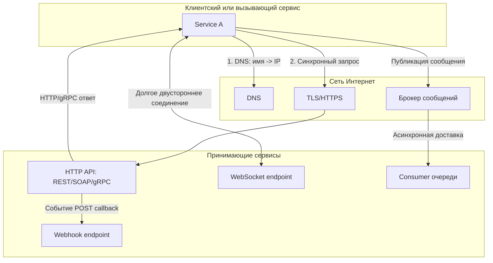
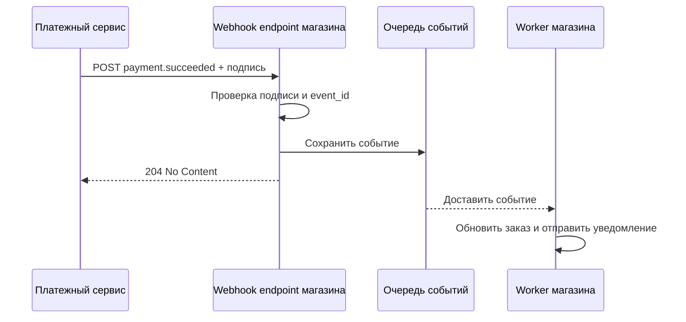
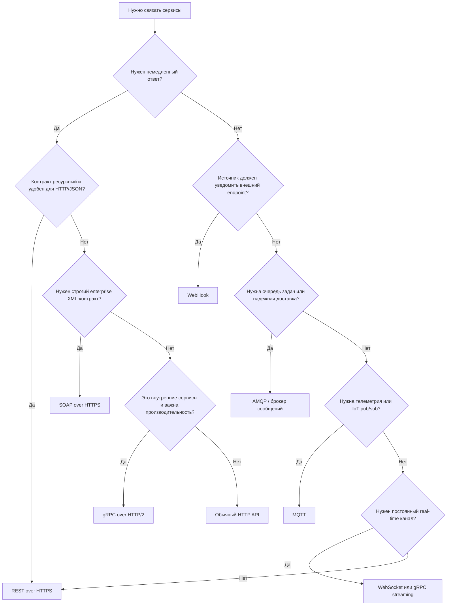

# 14. Протоколы взаимодействия между сервисами по сети Интернет

## Краткое определение

**Протокол взаимодействия между сервисами** - это набор правил, по которым две программные системы находят друг друга в сети, устанавливают соединение, передают запросы, ответы или события, кодируют данные, подтверждают доставку, обрабатывают ошибки и защищают обмен. В сервисной архитектуре протокол важен не только как "формат пакета", но и как договор о поведении: кто инициирует обмен, ожидается ли немедленный ответ, можно ли повторять запрос, как версионируется контракт, как передается ошибка и какие гарантии доставки дает система.

В Интернете сервисы обычно взаимодействуют поверх стека:

- **IP** - адресация и маршрутизация между узлами.
- **TCP** или **UDP/QUIC** - транспорт данных.
- **TLS** - шифрование, контроль целостности и проверка подлинности сервера, иногда и клиента.
- **HTTP/HTTPS, WebSocket, AMQP, MQTT** - прикладной обмен.
- **REST, SOAP, gRPC, WebHook** - архитектурные стили и протоколы/подходы уровня API.



Главное различие между протоколами - модель взаимодействия:

- **Синхронная модель**: вызывающий сервис отправляет запрос и ждет ответ в рамках того же взаимодействия. Типичные варианты: HTTP/HTTPS, REST, SOAP, gRPC unary RPC.
- **Асинхронная модель**: отправитель фиксирует событие или сообщение и не ждет немедленного выполнения всей бизнес-операции. Типичные варианты: WebHook, AMQP, MQTT, Kafka-подобные события.
- **Потоковая модель**: соединение живет долго, данные идут многократно и иногда в обе стороны. Типичные варианты: WebSocket, gRPC streaming, MQTT-подписки.

## HTTP и HTTPS

**HTTP** (Hypertext Transfer Protocol) - базовый прикладной протокол Интернета для модели "запрос - ответ". Он определяет методы, URL, заголовки, тело сообщения, коды состояния, кэширование, перенаправления и согласование форматов. **HTTPS** - это HTTP поверх TLS, то есть защищенный вариант HTTP.

HTTP широко используется как транспорт для REST API, SOAP over HTTP, WebHook, GraphQL и многих служебных API. Современные версии:

- **HTTP/1.1** - текстовый протокол, одно соединение может переиспользоваться для нескольких запросов.
- **HTTP/2** - бинарное фреймирование, мультиплексирование потоков в одном TCP-соединении, эффективные заголовки; используется gRPC.
- **HTTP/3** - HTTP поверх QUIC/UDP, уменьшает задержки установления соединения и решает часть проблем head-of-line blocking на уровне TCP.

### Структура HTTP-обмена

Пример запроса:

```http
GET /api/orders/42 HTTP/1.1
Host: shop.example.com
Accept: application/json
Authorization: Bearer eyJhbGciOi...
X-Correlation-Id: 9f5b3a1d
```

Пример ответа:

```http
HTTP/1.1 200 OK
Content-Type: application/json
Cache-Control: no-store
X-Correlation-Id: 9f5b3a1d

{
  "id": 42,
  "status": "paid",
  "total": 1990
}
```

Основные методы HTTP:

| Метод | Типичное назначение | Идемпотентность |
|---|---|---|
| `GET` | Получить ресурс | Да |
| `POST` | Создать ресурс или выполнить команду | Обычно нет |
| `PUT` | Полностью заменить ресурс | Да |
| `PATCH` | Частично изменить ресурс | Зависит от операции |
| `DELETE` | Удалить ресурс | Да с точки зрения результата |
| `HEAD` | Получить только заголовки | Да |
| `OPTIONS` | Узнать возможности endpoint, CORS | Да |

Коды состояния группируются так:

| Группа | Смысл | Примеры |
|---|---|---|
| `2xx` | Успех | `200 OK`, `201 Created`, `204 No Content` |
| `3xx` | Перенаправление или кэш | `301`, `302`, `304 Not Modified` |
| `4xx` | Ошибка клиента | `400`, `401`, `403`, `404`, `409`, `422`, `429` |
| `5xx` | Ошибка сервера | `500`, `502`, `503`, `504` |

Для межсервисного взаимодействия особенно важны:

- `401 Unauthorized` - нет корректной аутентификации.
- `403 Forbidden` - пользователь или сервис известен, но прав не хватает.
- `404 Not Found` - ресурс не найден.
- `409 Conflict` - конфликт состояния, например повторное создание заказа.
- `422 Unprocessable Entity` - данные синтаксически верны, но не проходят бизнес-валидацию.
- `429 Too Many Requests` - превышен лимит запросов.
- `503 Service Unavailable` - сервис временно недоступен.
- `504 Gateway Timeout` - промежуточный узел не дождался ответа upstream-сервиса.

## REST

**REST** (Representational State Transfer) - архитектурный стиль проектирования сетевых API. В REST система представляется как набор ресурсов, у каждого ресурса есть URI, а операции над ресурсами выражаются стандартными HTTP-методами. Обычно данные передаются в JSON, но REST не привязан строго к JSON: возможны XML, HTML, CSV, protobuf и другие представления.

Ключевые идеи REST:

- **Ресурсная модель**: API оперирует сущностями предметной области: `orders`, `users`, `payments`.
- **Единый интерфейс**: используются стандартные HTTP-методы и коды состояния.
- **Stateless**: каждый запрос содержит все, что нужно для его обработки; сервер не обязан хранить контекст диалога.
- **Представления ресурсов**: клиент получает не сам объект БД, а его сетевое представление.
- **Кэшируемость**: для чтения можно использовать HTTP-кэширование.
- **Слои**: между клиентом и сервером могут быть gateway, proxy, CDN, балансировщики.

Пример REST API:

```http
POST /api/orders HTTP/1.1
Host: shop.example.com
Content-Type: application/json
Idempotency-Key: create-order-7c2b

{
  "customerId": 10,
  "items": [
    { "sku": "BOOK-1", "quantity": 2 }
  ]
}
```

Ответ:

```http
HTTP/1.1 201 Created
Content-Type: application/json
Location: /api/orders/42

{
  "id": 42,
  "status": "created"
}
```

Типичная ресурсная схема:

```text
GET    /api/orders        - список заказов
POST   /api/orders        - создать заказ
GET    /api/orders/42     - получить заказ
PATCH  /api/orders/42     - изменить заказ
DELETE /api/orders/42     - отменить или удалить заказ
```

Плюсы REST:

- простота и понятность;
- хорошая совместимость с браузерами, proxy, gateway, логированием и мониторингом;
- удобство для публичных API;
- естественное использование HTTP-кодов, заголовков, кэширования;
- простая отладка через `curl`, Postman, браузерные инструменты.

Минусы REST:

- возможна избыточная передача данных;
- сложные операции иногда плохо укладываются в CRUD-модель;
- нет строгого встроенного контракта, если не использовать OpenAPI;
- трудно выразить двусторонний поток сообщений;
- при большом числе сервисов нужно отдельно решать трассировку, ретраи, таймауты и версионирование.

## SOAP

**SOAP** (Simple Object Access Protocol) - XML-протокол обмена сообщениями, часто используемый в enterprise-интеграциях. SOAP обычно работает поверх HTTP/HTTPS, но концептуально не ограничен HTTP. Вокруг SOAP исторически сложился набор стандартов WS-* для безопасности, надежной доставки, транзакций и описания контрактов.

Основные элементы SOAP:

- **Envelope** - корневой XML-элемент сообщения.
- **Header** - служебные данные: безопасность, трассировка, транзакционный контекст.
- **Body** - полезная нагрузка: запрос или ответ операции.
- **WSDL** - формальное описание сервиса, операций, типов данных и endpoint.
- **XSD** - XML Schema для строгой типизации сообщений.

Пример SOAP-запроса:

```xml
POST /PaymentService HTTP/1.1
Host: bank.example.com
Content-Type: application/soap+xml

<soap:Envelope xmlns:soap="http://www.w3.org/2003/05/soap-envelope">
  <soap:Header>
    <correlationId>9f5b3a1d</correlationId>
  </soap:Header>
  <soap:Body>
    <CreatePaymentRequest>
      <OrderId>42</OrderId>
      <Amount>1990</Amount>
      <Currency>RUB</Currency>
    </CreatePaymentRequest>
  </soap:Body>
</soap:Envelope>
```

Плюсы SOAP:

- строгий контракт через WSDL/XSD;
- развитые стандарты безопасности и enterprise-интеграции;
- хорошо подходит для систем, где требуется формальная схема сообщений;
- распространен в банковских, государственных и корпоративных системах.

Минусы SOAP:

- XML-сообщения крупнее JSON/protobuf;
- выше сложность разработки и отладки;
- многие современные web/mobile-клиенты предпочитают REST или gRPC;
- интеграция часто требует генерации клиентов и строгого соблюдения схем.

SOAP выбирают, когда важнее формальный контракт, совместимость с legacy/enterprise-системами и стандарты WS-Security, чем легкость и компактность API.

## gRPC

**gRPC** - высокопроизводительный RPC-фреймворк, в котором сервис описывается через `.proto`-контракт, сообщения кодируются в Protocol Buffers, а транспортом обычно служит HTTP/2. В отличие от REST, где акцент на ресурсах, gRPC ближе к вызову удаленной процедуры: клиент вызывает метод сервиса с типизированным запросом и получает типизированный ответ.

Пример `.proto`-контракта:

```proto
syntax = "proto3";

service OrderService {
  rpc GetOrder(GetOrderRequest) returns (Order);
  rpc CreateOrder(CreateOrderRequest) returns (Order);
  rpc WatchOrders(WatchOrdersRequest) returns (stream OrderEvent);
}

message GetOrderRequest {
  int64 id = 1;
}

message CreateOrderRequest {
  int64 customer_id = 1;
  repeated OrderItem items = 2;
}

message Order {
  int64 id = 1;
  string status = 2;
}

message OrderItem {
  string sku = 1;
  int32 quantity = 2;
}

message WatchOrdersRequest {
  int64 customer_id = 1;
}

message OrderEvent {
  int64 order_id = 1;
  string type = 2;
}
```

Варианты вызовов gRPC:

- **Unary RPC** - один запрос и один ответ.
- **Server streaming** - один запрос, поток ответов от сервера.
- **Client streaming** - поток запросов от клиента, один ответ.
- **Bidirectional streaming** - обе стороны обмениваются потоками сообщений.

Плюсы gRPC:

- строгая типизация и генерация клиентов;
- компактный бинарный формат protobuf;
- высокая производительность;
- поддержка streaming;
- удобен для внутренних микросервисных взаимодействий.

Минусы gRPC:

- хуже подходит для прямого вызова из обычного браузера без дополнительных прокси или gRPC-Web;
- бинарные сообщения сложнее читать при отладке;
- требует дисциплины в развитии `.proto`-контрактов;
- не всегда удобно использовать для публичных API, где ожидаются обычные HTTP/JSON-интерфейсы.

Типичные gRPC-коды ошибок:

| Код | Смысл |
|---|---|
| `OK` | Успех |
| `INVALID_ARGUMENT` | Некорректные входные данные |
| `NOT_FOUND` | Объект не найден |
| `ALREADY_EXISTS` | Объект уже существует |
| `PERMISSION_DENIED` | Нет прав |
| `UNAUTHENTICATED` | Нет аутентификации |
| `DEADLINE_EXCEEDED` | Истек deadline |
| `UNAVAILABLE` | Сервис недоступен |
| `INTERNAL` | Внутренняя ошибка |

## WebSocket

**WebSocket** - протокол для долговременного двустороннего обмена сообщениями между клиентом и сервером. Соединение начинается как HTTP-запрос с `Upgrade: websocket`, после чего сервер отвечает `101 Switching Protocols`, и стороны переходят к обмену WebSocket-кадрами.

Схема установления:

```http
GET /ws/orders HTTP/1.1
Host: shop.example.com
Upgrade: websocket
Connection: Upgrade
Sec-WebSocket-Key: dGhlIHNhbXBsZSBub25jZQ==
Sec-WebSocket-Version: 13
```

Ответ:

```http
HTTP/1.1 101 Switching Protocols
Upgrade: websocket
Connection: Upgrade
Sec-WebSocket-Accept: s3pPLMBiTxaQ9kYGzzhZRbK+xOo=
```

После открытия соединения:

```json
{ "type": "subscribe", "topic": "orders.42" }
```

Сервер может отправлять события без нового запроса:

```json
{ "type": "order.status.changed", "orderId": 42, "status": "shipped" }
```

WebSocket применяют для:

- чатов;
- торговых терминалов;
- онлайн-игр;
- совместного редактирования;
- live-уведомлений;
- интерфейсов мониторинга;
- сценариев, где обе стороны могут инициировать сообщения.

Плюсы:

- низкая задержка после установления соединения;
- двусторонний обмен;
- меньше накладных расходов, чем постоянный HTTP polling;
- подходит для real-time UI.

Минусы:

- сложнее масштабировать, чем короткие HTTP-запросы;
- нужно управлять reconnect, heartbeat, подписками и backpressure;
- соединения занимают ресурсы сервера;
- промежуточные proxy и балансировщики должны корректно поддерживать WebSocket.

Защищенный WebSocket использует схему `wss://`, то есть WebSocket поверх TLS.

## WebHook

**WebHook** - способ событийной интеграции, при котором один сервис вызывает заранее зарегистрированный HTTP endpoint другого сервиса при наступлении события. Обычно это `POST` с JSON-телом. В отличие от WebSocket, постоянное соединение не держится: каждое событие доставляется отдельным HTTP-запросом.

Пример события:

```http
POST /webhooks/payment HTTP/1.1
Host: shop.example.com
Content-Type: application/json
X-Event-Id: evt_1001
X-Event-Type: payment.succeeded
X-Signature: sha256=...

{
  "id": "evt_1001",
  "type": "payment.succeeded",
  "createdAt": "2026-06-03T10:00:00Z",
  "data": {
    "paymentId": "pay_55",
    "orderId": 42,
    "amount": 1990
  }
}
```

Получатель должен быстро вернуть `2xx`, чтобы подтвердить прием:

```http
HTTP/1.1 204 No Content
```

Правильная обработка WebHook:

1. Проверить TLS и домен endpoint.
2. Проверить подпись сообщения, например HMAC по телу запроса.
3. Проверить тип события.
4. Проверить уникальный `event_id`, чтобы не обработать дубль.
5. Быстро сохранить событие и вернуть `2xx`.
6. Выполнить бизнес-обработку асинхронно через очередь или фоновую задачу.

Плюсы WebHook:

- простая интеграция через HTTP;
- получатель узнает о событии без polling;
- хорошо подходит для платежей, CI/CD, CRM, репозиториев, уведомлений.

Минусы:

- endpoint получателя должен быть доступен извне;
- доставка обычно "at least once", поэтому возможны повторы;
- отправитель не контролирует внутреннюю обработку события у получателя;
- нужны подписи, защита от replay-атак и идемпотентность.



## AMQP и MQTT

HTTP-подходы удобны, когда есть явный endpoint и понятная модель запроса. Но для асинхронной интеграции часто используют брокеры сообщений.

### AMQP

**AMQP** (Advanced Message Queuing Protocol) - протокол обмена сообщениями через брокер. На практике часто ассоциируется с RabbitMQ. Сервис-производитель публикует сообщение в exchange, брокер маршрутизирует его в очереди, а consumer забирает и подтверждает обработку.

Типичная схема:

```text
Producer -> Exchange -> Queue -> Consumer
```

AMQP полезен, когда нужны:

- очереди заданий;
- подтверждения доставки;
- повторная доставка при сбоях;
- маршрутизация по ключам;
- отложенная или фоновая обработка;
- dead letter queue для сообщений, которые не удалось обработать.

Пример сообщения:

```json
{
  "messageId": "msg-1001",
  "type": "order.created",
  "occurredAt": "2026-06-03T10:00:00Z",
  "payload": {
    "orderId": 42
  }
}
```

### MQTT

**MQTT** (Message Queuing Telemetry Transport) - легковесный publish/subscribe-протокол. Его часто используют в IoT, телеметрии, мобильных и нестабильных сетях. Клиент публикует сообщения в topic, а другие клиенты подписываются на topics.

Особенности MQTT:

- малая служебная нагрузка;
- topics вида `devices/123/temperature`;
- уровни QoS:
  - `0` - доставить максимум один раз;
  - `1` - доставить минимум один раз;
  - `2` - доставить ровно один раз на уровне протокола;
- retained messages;
- last will message для уведомления об аварийном отключении клиента.

MQTT выбирают для телеметрии и устройств, а AMQP - для backend-очередей и enterprise messaging.

## Синхронные и асинхронные протоколы

Синхронность означает не конкретный протокол, а ожидание результата. Один и тот же HTTP может использоваться синхронно и асинхронно:

- REST-запрос `GET /orders/42` обычно синхронный: клиент ждет заказ.
- WebHook по HTTP асинхронен относительно бизнес-процесса: источник события отправляет уведомление, а получатель может обработать его позже.

Сравнение:

| Характеристика | Синхронное взаимодействие | Асинхронное взаимодействие |
|---|---|---|
| Типичный пример | REST, SOAP, gRPC unary | WebHook, AMQP, MQTT |
| Ожидание ответа | Да, вызывающий ждет результат | Нет, бизнес-обработка может идти позже |
| Связность сервисов | Выше: доступность вызываемого сервиса критична | Ниже: брокер или callback сглаживает сбои |
| Задержка результата | Малая, если сервис доступен | Может быть больше |
| Масштабирование | Нужно защищаться от каскадных отказов | Удобно сглаживать пики очередями |
| Ошибки | Видны сразу вызывающему | Требуют повторов, DLQ, мониторинга |
| Когда выбирать | Пользователю нужен ответ сейчас | Нужно обработать событие, задачу или поток |

Комбинированный вариант часто выглядит так:

1. Клиент вызывает REST API: `POST /orders`.
2. Сервис быстро создает заказ и возвращает `201 Created`.
3. Сервис публикует событие `order.created` в очередь.
4. Отдельные consumer-сервисы запускают оплату, складскую обработку и уведомления.
5. Клиент получает обновления через WebSocket или периодически читает статус по REST.

## Сравнение основных вариантов

| Подход | Транспорт и формат | Модель | Где лучше применять | Главные риски |
|---|---|---|---|---|
| HTTP/HTTPS | HTTP + JSON/XML/HTML/etc. | Запрос - ответ | Базовая web-инфраструктура | Неверные таймауты, небезопасный HTTP |
| REST | HTTP + чаще JSON | Ресурсы и представления | Публичные API, CRUD, web/mobile | Нечеткие контракты, overfetching |
| SOAP | HTTP + XML, WSDL | Формальные операции | Enterprise, банки, госинтеграции | Сложность, тяжелые XML-сообщения |
| gRPC | HTTP/2 + protobuf | RPC и streaming | Внутренние микросервисы | Сложнее браузерная и ручная отладка |
| WebSocket | TCP/TLS после HTTP Upgrade | Долгое двустороннее соединение | Real-time интерфейсы | Reconnect, масштабирование, backpressure |
| WebHook | HTTP callback | Событийное уведомление | Платежи, CI/CD, уведомления | Дубли, подписи, доступность endpoint |
| AMQP | Брокер, очереди | Асинхронные сообщения | Backend-задачи, интеграция сервисов | DLQ, порядок, повторная доставка |
| MQTT | Брокер, topics | Pub/sub телеметрия | IoT, датчики, нестабильные сети | QoS, безопасность устройств |

## Безопасность

Для межсервисного взаимодействия по Интернету базовое правило - использовать **TLS**. Открытый HTTP допустим только во внутренней контролируемой среде и обычно все равно заменяется HTTPS из-за рисков перехвата и подмены.

Основные меры безопасности:

- **HTTPS/TLS** для шифрования и проверки подлинности сервера.
- **mTLS** для взаимной аутентификации сервисов, когда клиентский сервис тоже предъявляет сертификат.
- **OAuth 2.0 / OpenID Connect** для делегированной авторизации и пользовательского контекста.
- **JWT** или opaque-токены для передачи прав доступа.
- **API keys** только для простых сценариев, обязательно с ограничениями по правам и ротацией.
- **HMAC-подпись WebHook** для проверки подлинности отправителя и целостности тела.
- **Защита от replay-атак**: timestamp, nonce, короткое окно допустимости подписи.
- **Валидация входных данных** на уровне схемы и бизнес-правил.
- **Rate limiting** и quotas для защиты от перегрузки и злоупотреблений.
- **CORS** для браузерных HTTP API, если API вызывается из web-страницы.
- **Проверка `Origin` для WebSocket**, потому что браузер может открыть WebSocket с другого сайта.
- **Секреты не логируются**: токены, пароли, подписи и персональные данные должны маскироваться.
- **Принцип минимальных привилегий**: сервисный токен должен иметь только нужные права.

Для gRPC и внутренних сервисов часто используют service mesh или API gateway: они централизуют TLS, mTLS, трассировку, балансировку, ретраи и политики доступа.

## Ошибки, надежность и эксплуатация

Сетевое взаимодействие ненадежно по природе: сервис может быть недоступен, DNS может вернуть устаревший адрес, соединение может оборваться, а ответ может прийти позже таймаута. Поэтому протокол нужно дополнять эксплуатационными правилами.

### Таймауты

У каждого сетевого вызова должен быть таймаут:

- connect timeout - сколько ждать установки соединения;
- request timeout - сколько ждать полного ответа;
- read timeout - сколько ждать следующую порцию данных;
- deadline - общий срок выполнения операции в распределенной системе.

Без таймаутов зависший upstream может исчерпать пул потоков или соединений вызывающего сервиса.

### Повторы

Ретраи помогают при временных сбоях, но опасны для неидемпотентных операций. Повторять безопаснее:

- `GET`, `HEAD`, `PUT`, `DELETE`, если API реализован корректно;
- операции с `Idempotency-Key`;
- сообщения, где consumer умеет распознавать дубли по `messageId` или `eventId`.

Ретраи должны использовать backoff и jitter, чтобы не создать лавину повторных запросов.

### Идемпотентность

**Идемпотентность** означает, что повторное выполнение операции не меняет итоговый результат сверх первого выполнения. Она критична для платежей, создания заказов, webhook и очередей.

Пример:

```http
POST /api/payments HTTP/1.1
Idempotency-Key: payment-order-42
```

Если клиент повторит запрос с тем же ключом, сервис должен вернуть тот же результат или понятное состояние, а не создать второй платеж.

### Circuit breaker

Circuit breaker временно прекращает вызовы к проблемному сервису, если ошибок слишком много. Это защищает систему от каскадного отказа. После паузы он может пропустить небольшое число тестовых запросов и восстановить нормальную работу, если upstream снова отвечает.

### Backpressure

Backpressure - управление ситуацией, когда производитель отправляет данные быстрее, чем получатель способен обработать. Он важен для WebSocket, gRPC streaming, очередей и брокеров. Без backpressure растут буферы, задержки и потребление памяти.

### Наблюдаемость

Для распределенных протоколов нужны:

- correlation ID / trace ID в заголовках и сообщениях;
- структурированные логи;
- метрики latency, error rate, throughput;
- distributed tracing;
- логирование версий API и кодов ошибок;
- мониторинг очередей, DLQ и потребительского lag.

## Типовые ошибки проектирования

Частые ошибки при выборе и реализации протоколов:

- использовать синхронный REST-вызов для долгой фоновой операции вместо очереди;
- делать `POST` без идемпотентного ключа для платежей и заказов;
- возвращать все ошибки как `200 OK` с полем `"error"`;
- не задавать таймауты и deadline;
- ретраить неидемпотентные операции;
- не проверять подпись WebHook;
- обрабатывать WebHook долго и не возвращать быстрый `2xx`;
- хранить состояние диалога на сервере в REST API без необходимости;
- не версионировать контракт;
- не документировать API через OpenAPI, WSDL или `.proto`;
- использовать WebSocket там, где достаточно WebHook или polling;
- использовать gRPC для публичного API без учета клиентов, которым нужен HTTP/JSON;
- не защищать API rate limiting и авторизацией;
- смешивать бизнес-ошибки, транспортные ошибки и ошибки валидации в один неструктурированный формат.

## Как выбрать протокол



Практические ориентиры:

- **REST over HTTPS** - выбор по умолчанию для публичного API и web/mobile-клиентов.
- **SOAP** - когда уже есть WSDL/XML-контракт, legacy или строгая enterprise-интеграция.
- **gRPC** - когда сервисы находятся внутри контролируемой инфраструктуры и важны скорость, типизация и streaming.
- **WebSocket** - когда нужен постоянный двусторонний real-time канал.
- **WebHook** - когда один сервис должен уведомить другой о событии без polling.
- **AMQP** - когда нужна очередь, сглаживание нагрузки, повторная доставка и фоновые задачи.
- **MQTT** - когда много легких клиентов, датчиков или нестабильных соединений.

## Вывод

Протоколы взаимодействия между сервисами по Интернету образуют несколько уровней. На транспортном и защитном уровне сервисы используют IP, TCP/UDP/QUIC и TLS. На прикладном уровне чаще всего применяется HTTP/HTTPS, поверх которого строятся REST, SOAP, WebHook и часть других API. Для высокопроизводительных внутренних вызовов используют gRPC поверх HTTP/2 и protobuf. Для постоянного real-time обмена подходит WebSocket. Для асинхронных задач и событий применяют WebHook, AMQP, MQTT и другие брокерные схемы.

Правильный выбор зависит от характера обмена. Если нужен простой ресурсный API - обычно выбирают REST. Если требуется строгий XML-контракт - SOAP. Если важны производительность и типизированный внутренний RPC - gRPC. Если требуется двусторонняя связь в реальном времени - WebSocket. Если нужно уведомить другой сервис о событии - WebHook. Если нужно развязать сервисы во времени и выдерживать пики нагрузки - очередь сообщений.

Для экзамена важно подчеркнуть: протокол - это не только формат передачи данных, но и гарантии взаимодействия. Надежная сервисная интеграция требует HTTPS/TLS, аутентификации, авторизации, таймаутов, идемпотентности, корректных кодов ошибок, повторов с backoff, версионирования контрактов, мониторинга и трассировки.

## Источники

1. Источник из списка дисциплины, указанный в вопросе: **[5, стр. 85]**.
2. RFC 9110. HTTP Semantics. IETF, 2022. https://www.rfc-editor.org/rfc/rfc9110.html
3. RFC 8446. The Transport Layer Security (TLS) Protocol Version 1.3. IETF, 2018. https://www.rfc-editor.org/rfc/rfc8446
4. RFC 6455. The WebSocket Protocol. IETF, 2011. https://www.rfc-editor.org/rfc/rfc6455
5. W3C. SOAP Version 1.2 Part 1: Messaging Framework. https://www.w3.org/TR/soap12/
6. gRPC Documentation. Core concepts. https://grpc.io/docs/what-is-grpc/core-concepts/
7. OASIS. Advanced Message Queuing Protocol (AMQP) Version 1.0. https://docs.oasis-open.org/amqp/core/v1.0/amqp-core-overview-v1.0.html
8. OASIS. MQTT Version 5.0 Specification. https://docs.oasis-open.org/mqtt/mqtt/v5.0/mqtt-v5.0.html
9. Fielding R. T. Architectural Styles and the Design of Network-based Software Architectures. University of California, Irvine, 2000.
