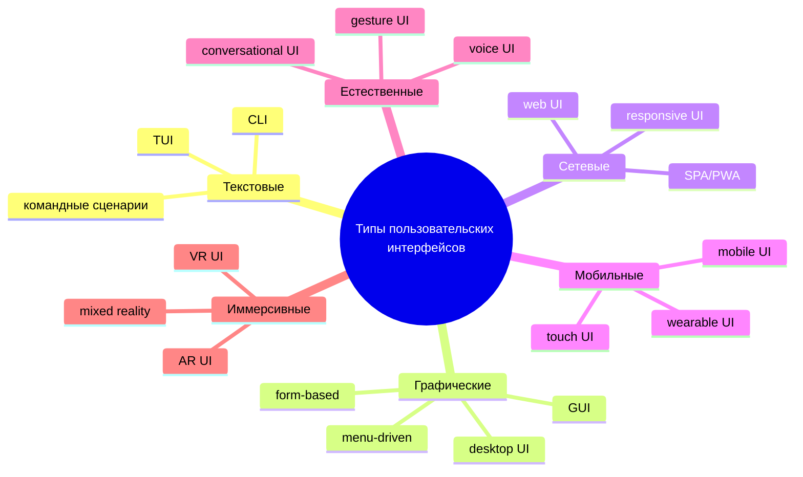
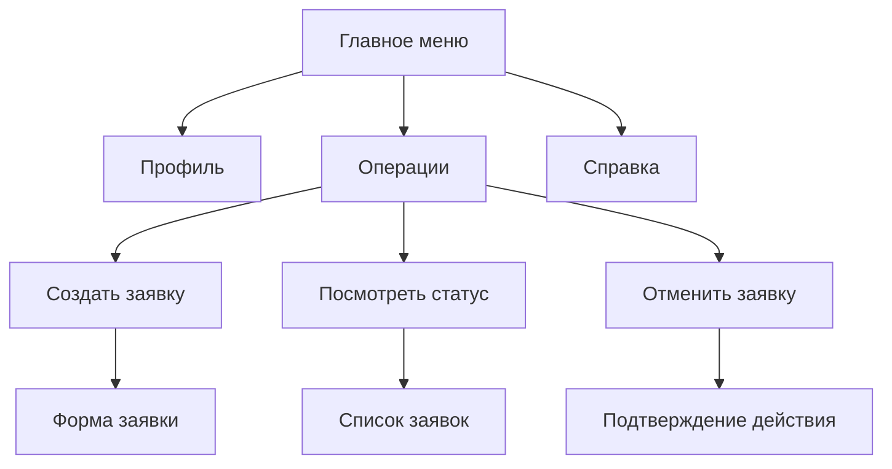
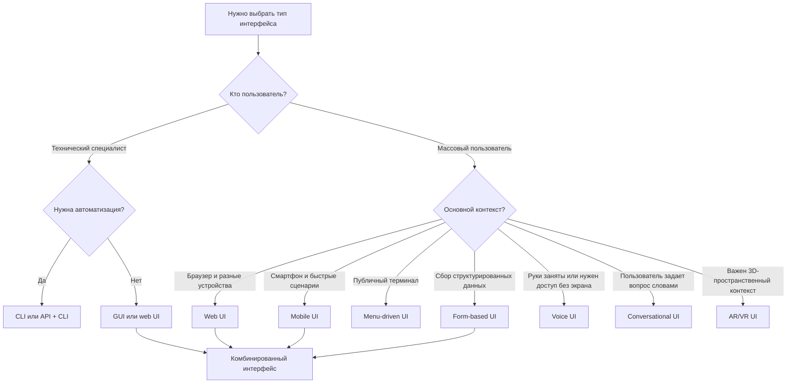
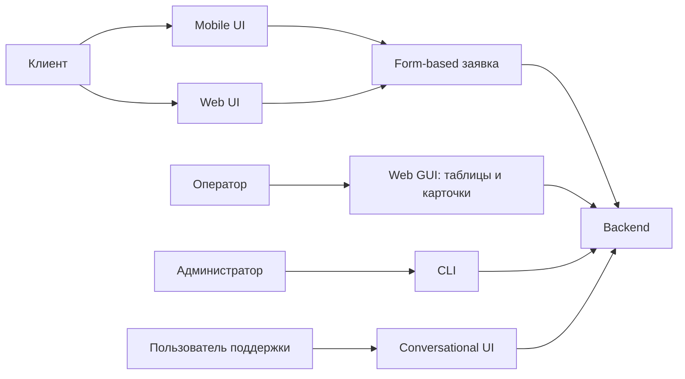

# 15. Типы пользовательских интерфейсов [5, стр.123]

## Краткое определение

**Пользовательский интерфейс (User Interface, UI)** - это совокупность средств, через которые пользователь взаимодействует с информационной системой: вводит команды и данные, получает результат, видит состояние системы, исправляет ошибки и управляет ходом работы.

Тип интерфейса определяется не только внешним видом. Важно, **какой способ взаимодействия является основным**: текстовые команды, графические элементы, меню, формы, веб-страницы, мобильные жесты, голос, диалог с ботом, движения тела или иммерсивная среда AR/VR.

Главная идея: **тип интерфейса выбирают под задачу, пользователя и контекст работы**. Один и тот же продукт может сочетать несколько типов: например, веб-сервис имеет GUI, form-based формы, menu-driven навигацию, conversational чат поддержки и CLI для администраторов.

## Общая классификация

Пользовательские интерфейсы можно классифицировать по каналу взаимодействия, способу ввода, степени свободы пользователя и среде использования.



Эта классификация не является взаимоисключающей. Например, мобильное банковское приложение одновременно является **mobile UI**, **GUI**, **form-based UI** для платежей, **menu-driven UI** для навигации и может иметь **voice UI** или **conversational UI** для поддержки.

## CLI: командная строка

**CLI (Command Line Interface)** - интерфейс, в котором пользователь вводит текстовые команды, параметры и аргументы, а система возвращает текстовый результат.

Типовые элементы CLI:

- приглашение командной строки;
- команда, например `git status`, `docker run`, `ipconfig`;
- аргументы и флаги, например `--help`, `-v`, `--output`;
- текстовый вывод;
- код завершения команды;
- справка и документация.

Пример:

```bash
git commit -m "Add interface types answer"
```

Преимущества CLI:

- высокая скорость для опытных пользователей;
- удобство автоматизации через скрипты;
- точность и воспроизводимость действий;
- низкие требования к графической среде;
- хорошо подходит для серверов, DevOps, администрирования, разработки.

Недостатки CLI:

- высокий порог входа;
- нужно помнить команды и синтаксис;
- ошибки могут иметь серьезные последствия;
- слабая визуализация сложных объектов;
- новичку трудно понять, какие действия доступны.

CLI хорошо подходит, когда пользователь технически подготовлен, операции повторяются, важна автоматизация и можно описать действие точной командой. Например, системный администратор быстрее создаст резервную копию через команду, чем через многоэкранный мастер.

CLI плохо подходит для массовых потребительских сервисов, визуального редактирования, выбора из большого числа изображений, работы с картами, дизайном или задач, где пользователь не знает точный синтаксис команды.

## GUI: графический интерфейс

**GUI (Graphical User Interface)** - интерфейс, в котором пользователь взаимодействует с системой через визуальные объекты: окна, кнопки, поля ввода, списки, иконки, вкладки, панели, меню, таблицы.

Классический GUI строится вокруг принципа WIMP:

- **Windows** - окна;
- **Icons** - иконки;
- **Menus** - меню;
- **Pointer** - указатель мыши или аналогичный инструмент.

Примеры GUI:

- операционные системы Windows, macOS, Linux desktop;
- графические редакторы;
- офисные приложения;
- CRM и ERP-системы;
- панели управления оборудованием;
- веб-приложения с визуальными компонентами.

Преимущества GUI:

- ниже порог входа по сравнению с CLI;
- пользователь видит доступные действия;
- удобно работать с визуальными объектами;
- проще поддерживать обратную связь и состояния;
- легче обучать массовую аудиторию.

Недостатки GUI:

- медленнее CLI для повторяемых операций;
- требует больше ресурсов;
- сложный GUI может быть перегружен;
- труднее автоматизировать действия;
- при плохой композиции пользователь теряется среди элементов.

GUI особенно эффективен, когда нужно выбрать объект, сравнить варианты, заполнить данные, редактировать визуальное содержимое или выполнить задачу без знания команд.

## Menu-driven UI: интерфейс на основе меню

**Menu-driven UI** - интерфейс, где пользователь выбирает действия из заранее заданных пунктов меню. Меню может быть текстовым, графическим, голосовым или встроенным в мобильное приложение.

Примеры:

- банкомат: "Снять наличные", "Проверить баланс", "Оплатить услуги";
- терминал самообслуживания;
- настройки приложения;
- навигационное меню сайта;
- IVR-меню в телефонии: "Нажмите 1 для связи с оператором";
- выпадающее меню в desktop-приложении.

Преимущества menu-driven UI:

- пользователь не должен помнить команды;
- хорошо ограничивает выбор и снижает риск ошибки;
- удобно для конечного набора действий;
- легко обучать новых пользователей;
- подходит для систем самообслуживания.

Недостатки:

- медленно, если меню глубокое;
- трудно найти пункт при плохой структуре;
- плохо подходит для сложных комбинаций параметров;
- пользователь ограничен заранее предусмотренными действиями;
- вложенные меню могут создавать "лабиринт".

Хороший menu-driven UI строится по принципу понятной информационной архитектуры: пункты меню должны быть названы языком пользователя, сгруппированы по смыслу и не требовать долгого поиска.



## Form-based UI: интерфейс на основе форм

**Form-based UI** - интерфейс, в котором основная работа пользователя состоит во вводе, выборе и проверке данных в полях формы.

Типовые элементы:

- текстовые поля;
- выпадающие списки;
- чекбоксы и радиокнопки;
- переключатели;
- календарь и выбор времени;
- поля загрузки файлов;
- подсказки и маски ввода;
- валидация и сообщения об ошибках;
- кнопки отправки, сохранения, отмены.

Примеры:

- регистрация пользователя;
- оформление заказа;
- налоговая декларация;
- заявка на кредит;
- медицинская анкета;
- создание задачи в системе управления проектами.

Преимущества form-based UI:

- хорошо подходит для структурированных данных;
- упрощает контроль обязательных полей;
- позволяет валидировать ввод до отправки;
- удобно сохранять данные в базу;
- стандартизирует бизнес-процесс.

Недостатки:

- длинные формы утомляют пользователя;
- плохо спроектированная валидация вызывает ошибки;
- пользователь может не понимать, зачем нужны поля;
- сложные формы требуют подсказок, группировки и пошагового режима;
- при неправильном порядке полей пользователь тратит лишние усилия.

Правила хорошей формы:

1. Поля должны соответствовать реальному сценарию пользователя.
2. Обязательные поля должны быть явно обозначены.
3. Ошибка должна объяснять, что именно неверно и как исправить.
4. Формат ввода должен быть очевиден или поддержан маской.
5. Длинные формы лучше делить на логические блоки или шаги.
6. Система должна сохранять введенные данные при ошибке или возврате назад.

## Web UI: веб-интерфейс

**Web UI** - пользовательский интерфейс, доступный через браузер. Он работает поверх веб-технологий и обычно использует HTML, CSS, JavaScript, HTTP/HTTPS и серверную или клиентскую логику.

Виды web UI:

- классические многостраничные сайты;
- личные кабинеты;
- административные панели;
- интернет-магазины;
- SPA (Single Page Application);
- PWA (Progressive Web App);
- веб-версии корпоративных систем.

Преимущества web UI:

- доступ с разных устройств через браузер;
- не требуется отдельная установка desktop-приложения;
- централизованное обновление;
- удобно связывать с веб-сервисами и API;
- проще масштабировать на массовую аудиторию;
- можно использовать адаптивную верстку.

Недостатки:

- зависимость от сети и браузера;
- ограничения безопасности браузерной среды;
- проблемы производительности при тяжелых интерфейсах;
- необходимость учитывать разные размеры экранов;
- риск плохой доступности при несемантической верстке.

Для web UI особенно важны:

- адаптивность;
- понятная навигация;
- производительность загрузки;
- доступность по WCAG;
- безопасность пользовательских данных;
- корректная обработка ошибок сети;
- совместимость с браузерами.

Пример: интернет-банк в браузере должен одновременно быть понятным для обычного клиента, защищенным, доступным с клавиатуры, устойчивым к ошибкам ввода и достаточно быстрым даже при нестабильном соединении.

## Mobile UI: мобильный интерфейс

**Mobile UI** - интерфейс для смартфонов, планшетов и других мобильных устройств. Его проектируют с учетом малого экрана, сенсорного ввода, мобильного контекста и ограниченного внимания пользователя.

Особенности mobile UI:

- управление пальцами, а не мышью;
- ограниченная площадь экрана;
- вертикальная прокрутка;
- жесты: касание, свайп, долгий тап, pinch-to-zoom;
- зависимость от ориентации экрана;
- работа в движении и при отвлечении;
- доступ к камере, геолокации, уведомлениям, биометрии.

Преимущества:

- устройство всегда рядом с пользователем;
- можно использовать контекст: местоположение, камеру, датчики;
- удобно для быстрых операций;
- push-уведомления поддерживают сценарии сопровождения;
- биометрия упрощает вход и подтверждение.

Недостатки:

- мало места для сложных таблиц и форм;
- жесты не всегда очевидны;
- пользователь чаще отвлекается;
- сложнее обеспечить точность ввода;
- интерфейс должен учитывать разные размеры экранов и плотность пикселей.

Хороший mobile UI обычно делает один главный сценарий на экране, не перегружает пользователя, использует крупные интерактивные зоны и дает немедленную обратную связь.

## Gesture/touch UI: жестовый и сенсорный интерфейс

**Touch UI** - интерфейс, основанный на касаниях экрана. **Gesture UI** - более широкий класс, где ввод выполняется жестами: пальцами, рукой, телом, контроллером или движением в пространстве.

Примеры:

- свайп для удаления письма;
- pinch-to-zoom на карте;
- drag-and-drop на доске задач;
- управление презентацией жестом руки;
- игровые интерфейсы с контроллерами движения;
- сенсорные киоски и панели.

Преимущества:

- естественность для простых действий;
- быстрые манипуляции с объектами;
- подходит для карт, изображений, игр, интерактивных досок;
- снижает потребность в клавиатуре;
- может работать в публичных терминалах.

Недостатки:

- скрытые жесты плохо обнаруживаются;
- неточность касаний;
- физическая усталость при длительном использовании;
- сложность поддержки людей с моторными ограничениями;
- жесты могут иметь разные значения в разных культурах и системах.

Жесты лучше использовать как ускорители, а не как единственный способ выполнения критически важного действия. Если пользователь может удалить объект свайпом, должна быть понятная обратная связь и возможность отмены.

## Voice UI: голосовой интерфейс

**Voice UI (VUI)** - интерфейс, в котором пользователь взаимодействует с системой голосом, а система отвечает голосом, текстом или действием.

Примеры:

- голосовые помощники;
- управление умным домом;
- голосовой набор текста;
- навигация в автомобиле;
- телефонные системы поддержки;
- голосовые команды в мобильном приложении.

Преимущества:

- руки и глаза могут быть заняты;
- подходит для водителей, операторов, людей с ограничениями зрения;
- естественен для простых команд;
- может ускорить поиск и управление;
- полезен там, где клавиатура неудобна.

Недостатки:

- ошибки распознавания речи;
- шумная среда ухудшает качество;
- пользователь не всегда знает допустимые команды;
- конфиденциальность: не все команды удобно произносить вслух;
- сложные данные трудно воспринимать на слух;
- система должна учитывать паузы, уточнения и неоднозначность.

Voice UI хорошо работает для коротких команд: "поставь таймер", "позвони Анне", "найди ближайшую аптеку". Он хуже подходит для сложного анализа таблиц, редактирования длинных форм и задач, где нужно сравнивать много вариантов одновременно.

## Conversational UI: диалоговый интерфейс

**Conversational UI** - интерфейс, построенный как диалог пользователя с системой. Диалог может быть текстовым, голосовым или смешанным. В отличие от обычного CLI, conversational UI допускает естественный язык, уточняющие вопросы и контекст.

Примеры:

- чат-бот поддержки;
- ассистент в интернет-магазине;
- бот записи к врачу;
- AI-помощник в IDE;
- внутренний корпоративный помощник;
- голосовой помощник с диалоговой логикой.

Преимущества:

- пользователь может формулировать задачу своими словами;
- удобно для поиска, консультации и поддержки;
- система может уточнять недостающие данные;
- хорошо работает как дополнительный канал помощи;
- снижает необходимость изучать структуру меню.

Недостатки:

- ответы могут быть неточными или неоднозначными;
- пользователь не видит полный набор возможностей;
- трудно контролировать сложные бизнес-процессы;
- нужна обработка намерений, контекста и ошибок;
- критические действия требуют подтверждения.

Диалоговый интерфейс особенно полезен, когда пользователь не знает, где искать функцию, или задача формулируется естественным языком: "помоги оформить возврат", "почему платеж не прошел", "подбери тариф для небольшой команды".

Для надежного conversational UI нужны:

- явное подтверждение важных действий;
- показ источника или основания ответа, если решение значимо;
- возможность перейти к обычной форме или оператору;
- сохранение контекста диалога;
- обработка отказов и непонимания;
- ограничение области ответственности бота.

## AR/VR UI: дополненная и виртуальная реальность

**AR UI (Augmented Reality UI)** - интерфейс, в котором цифровые объекты накладываются на реальный мир. **VR UI (Virtual Reality UI)** - интерфейс внутри полностью виртуальной среды.

Примеры AR:

- подсказки ремонта поверх реального оборудования;
- примерка мебели в комнате через камеру;
- навигационные указатели на местности;
- медицинские и инженерные визуализации;
- обучение работе с устройством.

Примеры VR:

- тренажеры для пилотов и операторов;
- виртуальные лаборатории;
- 3D-моделирование;
- игровые миры;
- обучение опасным операциям без риска.

Преимущества:

- пространственное восприятие сложных объектов;
- обучение через имитацию реальной среды;
- естественная работа с 3D-моделями;
- высокая вовлеченность;
- возможность показывать недоступные или опасные ситуации.

Недостатки:

- дорогое оборудование;
- риск укачивания и усталости;
- сложность проектирования навигации и ввода;
- ограничения доступности;
- высокая цена ошибки в промышленных и медицинских сценариях.

AR/VR оправданы, когда пространственный контекст действительно важен. Если задачу можно проще и надежнее решить обычной формой или веб-интерфейсом, иммерсивный интерфейс будет избыточным.

## Сравнение основных типов интерфейсов

| Тип интерфейса | Основной ввод | Сильные стороны | Ограничения | Типичные примеры |
|---|---|---|---|---|
| CLI | Текстовые команды | Скорость, автоматизация, точность | Высокий порог входа | Git, терминал, серверное администрирование |
| GUI | Мышь, клавиатура, визуальные элементы | Наглядность, понятность, визуальное управление | Может быть перегружен | ОС, офисные приложения, CRM |
| Menu-driven | Выбор из пунктов | Простота, контроль сценария | Глубокие меню замедляют работу | Банкомат, терминал, настройки |
| Form-based | Поля ввода и выбора | Структурированный сбор данных | Длинные формы утомляют | Регистрация, заявки, анкеты |
| Web UI | Браузер, мышь, клавиатура, touch | Доступность через сеть, обновляемость | Зависимость от браузера и сети | Личный кабинет, интернет-магазин |
| Mobile UI | Сенсорный ввод | Всегда рядом, быстрые сценарии | Малый экран, отвлечения | Банковское приложение, доставка |
| Touch/gesture UI | Касания и жесты | Естественные манипуляции | Скрытые жесты, неточность | Карты, доски, киоски |
| Voice UI | Голос | Hands-free, доступность | Шум, приватность, неоднозначность | Ассистенты, автонавигация |
| Conversational UI | Текстовый или голосовой диалог | Естественный язык, уточнения | Непредсказуемость, нужна проверка | Чат-бот, AI-ассистент |
| AR/VR UI | Пространственные действия | 3D-контекст, обучение, имитация | Цена, утомление, сложность | Тренажеры, AR-инструкции |

## Схема выбора типа интерфейса



На практике решение почти всегда комбинированное. Например, система доставки может иметь:

- web UI для сайта;
- mobile UI для приложения клиента;
- form-based UI для адреса и оплаты;
- menu-driven UI для каталога;
- conversational UI для поддержки;
- CLI для внутренних технических операций.

## Критерии выбора интерфейса

При выборе типа интерфейса нужно учитывать не "что современнее", а соответствие задаче.

### 1. Пользователь

Важные вопросы:

- кто будет работать с системой;
- какой у пользователя уровень подготовки;
- работает ли он постоянно или редко;
- есть ли ограничения зрения, слуха, моторики;
- какие термины ему понятны;
- насколько критична ошибка.

Для опытного администратора CLI может быть лучшим вариантом. Для клиента банка лучше использовать GUI, web UI или mobile UI с понятными формами и подтверждениями.

### 2. Задача

Нужно понять характер задачи:

- разовая или повторяющаяся;
- простая или сложная;
- требует ли визуального сравнения;
- требует ли точного ввода данных;
- нужна ли автоматизация;
- нужно ли показывать пространственный объект;
- нужно ли вести диалог и уточнять намерение.

Если задача - массово обработать файлы, CLI эффективен. Если задача - выбрать квартиру на карте, нужен визуальный web/mobile UI. Если задача - оформить заявление, нужна форма.

### 3. Контекст использования

Контекст часто важнее внешнего вида:

- офис, дом, улица, автомобиль, производство;
- стабильная или нестабильная сеть;
- большой монитор или маленький экран;
- заняты ли руки пользователя;
- можно ли говорить вслух;
- есть ли шум;
- работает ли пользователь под давлением времени.

Голосовой интерфейс удобен в автомобиле, но не подходит для ввода персональных данных в общественном месте. Мобильный интерфейс удобен в дороге, но сложную финансовую аналитику лучше показывать на большом экране.

### 4. Цена ошибки

Чем выше цена ошибки, тем больше нужны:

- подтверждение действия;
- предварительный просмотр результата;
- понятные сообщения;
- отмена или откат;
- журнал действий;
- ограничения опасных операций;
- проверка данных.

Например, удаление записи в CRM, перевод денег или изменение медицинских данных не должны выполняться скрытым жестом без подтверждения.

### 5. Доступность

Интерфейс должен учитывать разных пользователей и разные способы взаимодействия:

- навигация с клавиатуры;
- поддержка screen reader;
- достаточный контраст;
- понятные подписи;
- не только цветовое кодирование;
- крупные зоны касания;
- альтернативы голосу, жестам и изображению.

Доступность не является отдельным украшением. Это свойство качества интерфейса, которое влияет и на обычных пользователей: понятные подписи, хорошая структура и предсказуемые ошибки делают систему лучше для всех.

## Типичные ошибки проектирования

### Ошибка 1. Выбор интерфейса по моде

Например, команда добавляет чат-бота, хотя задача лучше решается простой формой с тремя полями. В результате пользователь вынужден вести диалог там, где ему нужен быстрый и предсказуемый ввод.

### Ошибка 2. Скрытые действия без альтернативы

Жест "свайп влево для удаления" может быть быстрым, но пользователь может не знать о нем или выполнить его случайно. Для критических операций нужна видимая команда, подтверждение и отмена.

### Ошибка 3. Перегруженный GUI

Если на одном экране слишком много кнопок, вкладок, фильтров и таблиц, интерфейс формально дает все возможности, но фактически мешает работе. Нужно выделять основные сценарии и группировать второстепенные действия.

### Ошибка 4. Слишком глубокое меню

Пользователь не должен проходить пять уровней навигации ради частой операции. Глубокие меню ухудшают обучаемость и увеличивают время выполнения задачи.

### Ошибка 5. Формы без нормальной валидации

Типичная проблема: пользователь отправляет форму, получает сообщение "Ошибка", но не понимает, какое поле неверно. Правильный интерфейс показывает ошибку рядом с полем, объясняет причину и сохраняет введенные данные.

### Ошибка 6. CLI без справки и предсказуемости

CLI для профессионалов тоже нуждается в хорошем дизайне: команды должны быть последовательными, флаги - понятными, `--help` - полезным, ошибки - конкретными. Команда, которая молча удаляет данные или выводит непонятный код ошибки, является плохим интерфейсом.

### Ошибка 7. Voice UI для сложных данных

Голос плохо подходит для выбора из десятков похожих вариантов или анализа таблицы. Если пользователь должен сравнивать данные, лучше показать экранный интерфейс, а голос оставить для поиска или простых команд.

### Ошибка 8. Conversational UI без границ ответственности

Если бот обещает решить любую проблему, но не умеет выполнять действия надежно, пользователь теряет доверие. Хороший бот честно показывает, что он может сделать, уточняет данные и передает человека оператору или форме, когда это необходимо.

### Ошибка 9. Игнорирование контекста мобильного использования

Desktop-интерфейс, просто уменьшенный до размера телефона, обычно не становится mobile UI. На мобильном устройстве нужны другие приоритеты: меньше элементов на экране, крупные зоны касания, короткие сценарии, понятные состояния загрузки и ошибок.

### Ошибка 10. Иммерсивность ради эффекта

AR/VR не должны использоваться только ради впечатления. Если пользователь оформляет заявку, VR-шлем не нужен. Если пользователь обучается ремонту сложного оборудования, AR-подсказки могут быть оправданы.

## Примеры выбора интерфейса для разных систем

| Система | Основной пользователь | Лучше использовать | Почему |
|---|---|---|---|
| Система администрирования серверов | DevOps, системный администратор | CLI + web dashboard | CLI для автоматизации, dashboard для мониторинга |
| Интернет-магазин | Массовый покупатель | Web UI + mobile UI + form-based | Нужны каталог, корзина, оформление заказа |
| Банкомат | Клиент банка | Menu-driven UI | Ограниченный набор операций и высокая цена ошибки |
| Медицинская анкета | Пациент и регистратор | Form-based UI | Нужно собрать структурированные данные |
| Навигация в автомобиле | Водитель | Voice UI + visual UI | Руки заняты, но маршрут полезно видеть на экране |
| Служба поддержки | Клиент | Conversational UI + оператор | Пользователь описывает проблему естественным языком |
| CAD/3D-моделирование | Инженер | GUI + gesture/3D controls | Важна визуальная работа с объектами |
| Обучение работе с оборудованием | Техник | AR UI | Подсказки полезны прямо поверх реального объекта |
| Корпоративная CRM | Менеджер | Web GUI + forms + tables | Нужны списки, карточки, фильтры, ввод данных |

## Комбинированные интерфейсы

Современные системы редко ограничиваются одним типом UI. Комбинированный интерфейс нужен, когда у системы разные пользователи и разные сценарии.

Пример: система управления заявками.



Здесь каждый интерфейс решает свою задачу:

- клиенту нужна простая форма и отслеживание статуса;
- оператору нужна таблица, фильтры и карточка заявки;
- администратору нужен CLI для обслуживания;
- пользователю поддержки нужен диалоговый канал для вопросов.

## Краткие правила проектирования по типам

| Тип | Главное правило |
|---|---|
| CLI | Делать команды последовательными, документированными и безопасными для опасных операций |
| GUI | Показывать доступные действия, состояния и обратную связь |
| Menu-driven | Не делать глубокую навигацию и называть пункты языком пользователя |
| Form-based | Минимизировать поля, валидировать понятно, сохранять введенные данные |
| Web UI | Обеспечить адаптивность, производительность, доступность и безопасность |
| Mobile UI | Проектировать под сенсорный ввод, малый экран и быстрые сценарии |
| Touch/gesture UI | Не прятать критические действия только в жестах |
| Voice UI | Использовать для коротких команд и сценариев без занятых рук |
| Conversational UI | Ограничивать область ответственности и подтверждать важные действия |
| AR/VR UI | Использовать только там, где пространственный контекст дает реальную пользу |

## Связь с качеством интерфейса

Независимо от типа интерфейса, качество оценивают через общие свойства:

- **результативность** - пользователь достигает цели;
- **эффективность** - цель достигается без лишних действий и затрат времени;
- **удовлетворенность** - интерфейс воспринимается как понятный и удобный;
- **обучаемость** - новый пользователь быстро понимает принцип работы;
- **предсказуемость** - одинаковые действия дают ожидаемый результат;
- **устойчивость к ошибкам** - система предотвращает ошибки и помогает исправлять их;
- **доступность** - интерфейс пригоден для людей с разными возможностями и устройствами.

Тип интерфейса влияет на эти свойства, но не гарантирует их автоматически. GUI может быть неудобным, CLI может быть хорошо спроектированным, а чат-бот может ухудшить опыт, если не понимает пользователя.

## Вывод

Типы пользовательских интерфейсов различаются способом взаимодействия: команды, графические элементы, меню, формы, веб-страницы, мобильные жесты, голос, диалог, дополненная и виртуальная реальность. У каждого типа есть область, где он особенно эффективен, и область, где он создает лишнюю сложность.

Правильный выбор интерфейса начинается с анализа пользователя, задачи, контекста, цены ошибки и требований доступности. В реальных системах чаще всего используют комбинацию типов: например, web UI для клиентов, form-based сценарии для ввода данных, menu-driven навигацию, mobile UI для быстрых действий, conversational UI для поддержки и CLI для технических специалистов.

Хороший интерфейс - не тот, который выглядит современно, а тот, который помогает конкретному пользователю безопасно, понятно и эффективно выполнить конкретную задачу.

## Источники

1. ISO 9241-110:2020. Ergonomics of human-system interaction - Interaction principles. https://www.iso.org/standard/75258.html
2. ISO 9241-210:2019. Ergonomics of human-system interaction - Human-centred design for interactive systems. https://www.iso.org/standard/77520.html
3. W3C. Web Content Accessibility Guidelines (WCAG) 2.2. https://www.w3.org/TR/WCAG22/
4. Apple. Human Interface Guidelines. https://developer.apple.com/design/human-interface-guidelines/
5. Google. Material Design. https://m3.material.io/
6. Microsoft Learn. Command-Line Syntax Key. https://learn.microsoft.com/en-us/windows-server/administration/windows-commands/command-line-syntax-key
7. Nielsen Norman Group. Usability and user interface design materials. https://www.nngroup.com/articles/
8. Shneiderman B., Plaisant C., Cohen M., Jacobs S., Elmqvist N. Designing the User Interface: Strategies for Effective Human-Computer Interaction.
