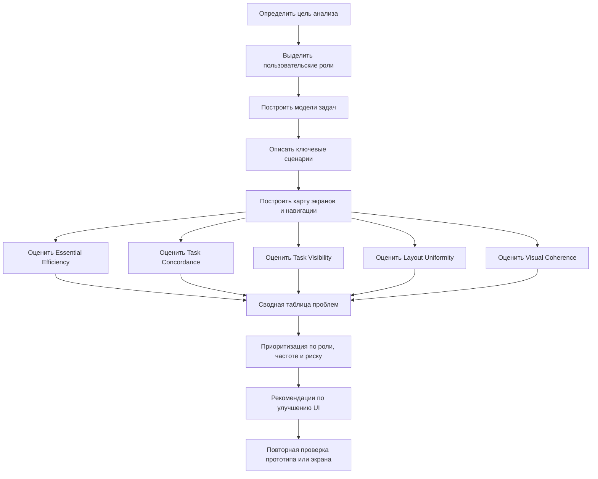

# 16. Метод анализа пользовательского интерфейса по метрикам Константайна и Локвуда

## Краткое определение

**Метод анализа пользовательского интерфейса по метрикам Константайна и Локвуда** - это способ экспертной и проектной оценки UI в рамках **usage-centered design**: интерфейс проверяется не "на красоту вообще", а на то, насколько хорошо он поддерживает пользовательские роли, задачи, сценарии и навигационные переходы. Метод связывает модели использования с измеримыми признаками интерфейса: количеством действий, видимостью нужных функций, соответствием структуры задачам, согласованностью компоновки и смысловой близостью связанных элементов.

В отличие от общей эвристической оценки, подход Константайна и Локвуда опирается на предварительные модели:

- **роли пользователей** - кто работает с системой и какие цели имеет;
- **модели задач** - какие существенные задачи выполняются, в каком порядке и с каким результатом;
- **сценарии использования** - конкретные прохождения задач через экраны;
- **модель навигации** - какие контексты, окна, страницы и переходы нужны для выполнения задач.

Главная идея: хороший интерфейс должен быть **пригодным к использованию** не абстрактно, а для конкретных ролей и типовых задач. Поэтому метрики оценивают, насколько интерфейс краток, понятен, видим, согласован и логически организован.

## Место метода в usage-centered design

**Usage-centered design** - это подход Константайна и Локвуда, ориентированный не столько на описание демографических "персон", сколько на **использование системы**: роли, цели, задачи и необходимые взаимодействия. Проектирование начинается с вопроса: "Какие роли какие задачи должны выполнить?", а не с вопроса: "Какие экраны хочется нарисовать?".

В этом подходе интерфейс строится вокруг трех уровней:

| Уровень | Что моделируется | Зачем нужно для анализа |
|---|---|---|
| **Роли** | Типы пользователей, их обязанности, права, цели, частота работы | Проверить, кому интерфейс помогает, а кому мешает |
| **Задачи** | Цели и существенные действия пользователя без привязки к конкретным кнопкам | Сравнить реальный UI с оптимальным ходом работы |
| **Сценарии** | Конкретные пути через экраны, формы, меню, состояния | Найти лишние шаги, тупики, ошибки и перегрузку |
| **Контексты взаимодействия** | Экраны, диалоги, рабочие области, панели | Оценить навигацию, группировку и видимость функций |

В usage-centered design важны **essential use cases** - "существенные варианты использования". Они описывают намерения пользователя и обязанности системы на уровне смысла, без преждевременного выбора UI-решения. Например, не "нажать синюю кнопку `Создать`", а "пользователь инициирует создание заявки; система запрашивает обязательные данные".

## Основные метрики Константайна и Локвуда

В учебном изложении метод обычно связывают с пятью метриками пригодности интерфейса. Их удобно разделять на процедурные, структурные и семантические.

| Метрика | Тип | Что оценивает | Признак хорошего интерфейса |
|---|---|---|---|
| **Essential Efficiency** | Процедурная | Насколько реальный сценарий близок к минимальному числу существенных шагов | Пользователь делает мало лишних действий |
| **Task Concordance** | Структурная | Насколько организация интерфейса соответствует модели задач и их приоритетам | Частые и важные задачи доступны проще редких |
| **Task Visibility** | Структурно-семантическая | Насколько нужные действия видимы в нужный момент | Пользователь видит, что делать дальше |
| **Layout Uniformity** | Структурная | Насколько одинаково устроены похожие экраны и элементы | Одинаковые действия выглядят и расположены одинаково |
| **Visual Coherence** | Семантическая | Насколько визуальная группировка соответствует смысловым связям | Связанные элементы находятся рядом и воспринимаются как группа |

Эти метрики не заменяют пользовательское тестирование, но хорошо подходят для раннего анализа прототипов, макетов, экранных форм и готовых интерфейсов.

## Показатели пригодности интерфейса

Пригодность интерфейса в этом методе раскрывается через несколько практических вопросов.

| Показатель | Проверочный вопрос | Как проявляется дефект |
|---|---|---|
| **Результативность** | Может ли роль завершить задачу? | Нужной функции нет, сценарий обрывается, права роли не учтены |
| **Эффективность** | Сколько действий, переходов и возвратов нужно? | Много экранов, повторный ввод, лишние подтверждения |
| **Понятность** | Ясно ли, что делать на каждом шаге? | Неочевидные кнопки, скрытые действия, непонятные названия |
| **Обучаемость** | Можно ли освоить интерфейс по его структуре? | Похожие действия оформлены по-разному |
| **Устойчивость к ошибкам** | Предотвращает ли UI неверные действия? | Нет валидации, опасные действия рядом с обычными |
| **Поддержка ролей** | Видит ли пользователь именно свои задачи? | Оператору показывают администрирование, руководителю - лишние технические формы |
| **Поддержка задач** | Совпадает ли UI с рабочим процессом? | Интерфейс требует шагов, которых нет в реальной задаче |

## Метрика Essential Efficiency

**Essential Efficiency** показывает, насколько интерфейс свободен от лишних механических действий. Сравниваются:

- **существенные шаги** - минимальные смысловые действия из модели задачи;
- **реальные шаги интерфейса** - клики, переходы, вводы, подтверждения, возвраты, ожидания.

Упрощенно метрику можно считать так:

```text
Essential Efficiency = Существенные шаги / Реальные шаги * 100%
```

Если для создания заявки по модели задачи нужно 4 смысловых шага, а в интерфейсе пользователь выполняет 10 действий, эффективность равна `4 / 10 * 100% = 40%`. Это сигнал, что сценарий перегружен: часть действий можно объединить, автоматизировать или убрать.

Важно: низкое значение не всегда означает плохой интерфейс. Иногда дополнительные шаги нужны из-за безопасности, юридического подтверждения или проверки данных. Но каждый такой шаг должен быть обоснован.

## Метрика Task Concordance

**Task Concordance** оценивает, насколько структура интерфейса согласована с реальной структурой задач. Если задача частая, критичная или выполняется под давлением времени, она должна быть доступнее, чем редкая вспомогательная операция.

Проверяются следующие признаки:

- основные задачи роли находятся в первом уровне навигации или в рабочей области;
- порядок действий на экране соответствует порядку работы пользователя;
- редкие настройки не мешают частым операциям;
- интерфейс не заставляет пользователя думать в терминах внутренней структуры системы;
- разные роли не получают одинаковый перегруженный экран, если их задачи различаются.

Пример нарушения: оператор call-центра каждый день оформляет обращения, но кнопка `Новое обращение` находится в меню второго уровня, а на главном экране крупно показаны отчеты, которые нужны только руководителю.

## Метрика Task Visibility

**Task Visibility** показывает, насколько пользователь видит доступные и необходимые действия в нужный момент. Интерфейс может формально поддерживать задачу, но быть плохим, если пользователь не понимает, как ее начать или продолжить.

Оцениваются:

- видимость главного действия на экране;
- понятность названий кнопок, пунктов меню, вкладок;
- наличие подсказок для обязательных полей;
- отображение текущего шага процесса;
- доступность следующего действия после завершения предыдущего;
- явная обратная связь после сохранения, отправки, ошибки.

Условная шкала:

| Балл | Интерпретация |
|---|---|
| **0** | действие скрыто или пользователь должен угадывать |
| **0.5** | действие есть, но плохо заметно или неясно названо |
| **1** | действие видно, понятно и доступно в нужный момент |

Для сценария можно усреднить оценки всех ключевых действий. Если в сценарии из 6 действий два скрыты, два частично понятны и два очевидны, видимость будет низкой: `(0 + 0 + 0.5 + 0.5 + 1 + 1) / 6 = 50%`.

## Метрика Layout Uniformity

**Layout Uniformity** оценивает согласованность компоновки: похожие элементы должны выглядеть и располагаться похоже. Это снижает когнитивную нагрузку, потому что пользователь переносит опыт с одного экрана на другой.

Проверяются:

- одинаковое расположение основных кнопок: `Сохранить`, `Отмена`, `Назад`;
- единая структура форм: заголовок, обязательные поля, дополнительные параметры, действия;
- одинаковые названия одинаковых операций;
- единый порядок колонок в похожих таблицах;
- единая логика ошибок, предупреждений и статусов;
- отсутствие случайных визуальных различий между одинаковыми компонентами.

Нарушение uniformity: на одном экране подтверждение находится справа и называется `Сохранить`, на другом - слева и называется `Применить`, хотя операция одинаковая.

## Метрика Visual Coherence

**Visual Coherence** оценивает, насколько визуальная группировка соответствует смысловым связям. Связанные элементы должны быть рядом, иметь общую область, заголовок, выравнивание или другой визуальный признак группы.

Хорошая визуальная согласованность означает:

- поля одного логического блока сгруппированы;
- главное действие визуально выделено сильнее вторичных;
- ошибки находятся рядом с проблемными полями;
- фильтры расположены рядом с таблицей, на которую влияют;
- статус объекта находится рядом с названием или ключевыми данными объекта;
- опасные действия отделены от повседневных.

Плохая визуальная согласованность возникает, когда экран визуально "разваливается": элементы, связанные по смыслу, разбросаны, а несвязанные выглядят как единая группа.

## Оценка сложности навигации

Навигационная сложность анализируется через сценарии и карту переходов. В методе Константайна и Локвуда это связано прежде всего с **Essential Efficiency**, **Task Visibility** и **Task Concordance**: чем больше лишних переходов и чем хуже видим следующий шаг, тем ниже пригодность интерфейса.

Практические показатели навигационной сложности:

| Показатель | Что измеряется | Плохой признак |
|---|---|---|
| **Длина маршрута** | Сколько экранов проходит пользователь до результата | Частая задача требует 5-7 переходов |
| **Глубина вложенности** | На каком уровне меню находится функция | Важная функция спрятана глубже второго уровня |
| **Ветвление** | Сколько вариантов выбора появляется на шаге | Пользователь видит много равнозначных пунктов |
| **Возвраты** | Сколько раз нужно возвращаться назад | После сохранения нельзя продолжить работу |
| **Тупики** | Есть ли состояния без понятного следующего шага | Нет `Далее`, `Назад`, `Отмена`, статуса |
| **Смена контекста** | Нужно ли переходить в другие разделы ради данных | Для одной заявки нужно открыть несколько несвязанных страниц |

Упрощенная оценка навигации для сценария:

```text
Навигационная сложность =
  количество переходов
+ количество возвратов
+ количество смен контекста
+ штраф за скрытые действия
+ штраф за тупики
```

Чем выше значение, тем больше вероятность ошибок и потери времени. Для частых сценариев навигационная сложность должна быть минимальной.

## Оценка поддержки пользовательских ролей

Роль в usage-centered design - это не должность и не конкретный человек, а устойчивый тип участия в системе. Например: `оператор`, `эксперт`, `руководитель`, `администратор`, `заявитель`.

Анализ поддержки ролей включает:

1. Определить роли и их цели.
2. Для каждой роли выделить частые, критичные и редкие задачи.
3. Проверить, какие задачи доступны на главном рабочем экране роли.
4. Найти лишние функции, которые не относятся к роли.
5. Проверить права, тексты, статусы и названия с точки зрения роли.
6. Сравнить маршруты выполнения одной задачи для разных ролей.

Пример: в системе согласования документов `автор` должен быстро создать и отправить документ, `согласующий` - увидеть очередь на проверку и принять решение, `администратор` - управлять маршрутами и справочниками. Если все три роли видят одинаковый экран с одинаковым меню, интерфейс формально универсален, но плохо поддерживает реальные рабочие задачи.

## Оценка поддержки задач и сценариев

Поддержка задач проверяется сравнением модели задачи с фактическим UI.

| Вопрос | Что выявляет |
|---|---|
| Есть ли у задачи явное начало? | Может ли пользователь быстро начать сценарий |
| Есть ли понятный конец? | Видит ли пользователь, что результат достигнут |
| Все ли обязательные данные запрашиваются вовремя? | Не требует ли UI возвращаться назад |
| Нет ли лишних решений? | Не вынужден ли пользователь выбирать технические параметры |
| Сохраняется ли контекст? | Не теряется ли введенная информация при переходах |
| Поддержаны ли исключения? | Что происходит при ошибке, отмене, нехватке прав |

Сценарий считается хорошо поддержанным, если пользователь может пройти его линейно, с понятной обратной связью, без лишнего знания внутренней архитектуры системы.

## Схема процесса анализа



## Пример оценки экрана

Предположим, анализируется экран `Создание заявки на ремонт оборудования` для роли `инженер цеха`.

**Модель задачи:**

1. Указать оборудование.
2. Описать проблему.
3. Указать срочность.
4. Отправить заявку.

**Фактический сценарий в интерфейсе:**

1. Открыть раздел `Сервис`.
2. Открыть подраздел `Документы`.
3. Выбрать `Заявки`.
4. Нажать `Создать`.
5. Выбрать тип документа `Ремонт`.
6. Найти оборудование через отдельный справочник.
7. Вернуться в форму.
8. Заполнить описание.
9. Открыть вкладку `Параметры`.
10. Выбрать срочность.
11. Нажать `Записать`.
12. Нажать `Провести`.
13. Нажать `Отправить`.

**Оценка по метрикам:**

| Метрика | Оценка | Обоснование |
|---|---:|---|
| Essential Efficiency | `4 / 13 = 31%` | Много технических действий: выбор типа, справочник, `Записать`, `Провести` |
| Task Concordance | Низкая | Частая задача инженера спрятана в разделе документов |
| Task Visibility | Средняя | Кнопка `Создать` есть, но непонятно, что после `Записать` нужно еще `Провести` и `Отправить` |
| Layout Uniformity | Средняя | Вкладки похожи на другие формы, но действия называются технически |
| Visual Coherence | Средняя | Оборудование и описание рядом, но срочность вынесена на отдельную вкладку |
| Навигационная сложность | Высокая | Есть глубокий путь, справочник, возврат и несколько подтверждений |

**Рекомендации:**

- вынести действие `Создать заявку на ремонт` на рабочий экран инженера;
- объединить `Записать`, `Провести`, `Отправить` в одно пользовательское действие `Отправить заявку`;
- выбирать тип `Ремонт` автоматически из контекста;
- расположить поле срочности на первом экране рядом с описанием проблемы;
- после отправки показывать статус: `Заявка N создана и отправлена диспетчеру`.

После улучшения сценарий может сократиться до 5-6 действий, а Essential Efficiency вырастет примерно до `4 / 6 = 67%`.

## Типичные ошибки при применении метода

1. **Оценивать экран без ролей.** Один и тот же интерфейс может быть удобен администратору и неудобен оператору.
2. **Подменять задачи функциями системы.** "Открыть справочник" - это функция, а не пользовательская цель.
3. **Считать все задачи одинаково важными.** Частые и критичные задачи должны иметь больший вес.
4. **Игнорировать исключения.** Ошибка, отмена, нехватка прав и неполные данные тоже являются частью сценария.
5. **Механически считать клики.** Не каждый дополнительный шаг плох: иногда он нужен для безопасности или юридического подтверждения.
6. **Оценивать визуальную согласованность только по стилю.** Важна не только одинаковая цветовая схема, но и смысловая группировка элементов.
7. **Не проверять навигационные тупики.** Пользователь должен понимать, что произошло и куда идти дальше.
8. **Не связывать выводы с исправлениями.** Метрика полезна только тогда, когда из нее следует конкретное проектное решение.

## Достоинства и ограничения

**Достоинства метода:**

- подходит для ранней оценки прототипов;
- связывает UI с задачами, а не только с визуальными правилами;
- помогает сравнивать варианты интерфейса количественно;
- хорошо выявляет лишние шаги и навигационную перегрузку;
- показывает, какие роли и сценарии плохо поддержаны.

**Ограничения:**

- требует предварительного описания ролей и задач;
- часть оценок остается экспертной и зависит от квалификации аналитика;
- метрики не показывают реальные эмоции и поведение пользователей так точно, как usability testing;
- сложные домены требуют весов: частота задачи, риск ошибки, цена задержки;
- нельзя автоматически считать хороший балл гарантией хорошего UX.

На практике метод лучше использовать вместе с эвристической оценкой, пользовательским тестированием, анализом логов и интервью.

## Вывод

Метод Константайна и Локвуда позволяет системно анализировать пользовательский интерфейс через связь **ролей, задач, сценариев, навигации и визуальной организации**. Его ключевая ценность в том, что интерфейс оценивается как инструмент выполнения работы: насколько быстро пользователь достигает цели, видит ли нужные действия, соответствует ли структура экрана модели задач, сохраняется ли согласованность и поддерживаются ли разные роли.

Для экзамена важно запомнить пять основных метрик: **Essential Efficiency**, **Task Concordance**, **Task Visibility**, **Layout Uniformity**, **Visual Coherence**. Через них оцениваются сложность сценария, навигационная перегрузка, соответствие задачам, видимость действий и согласованность интерфейса.

## Источники

1. Constantine L. L., Lockwood L. A. D. *Software for Use: A Practical Guide to the Models and Methods of Usage-Centered Design*. Addison-Wesley, 1999. URL: https://www.informit.com/store/software-for-use-a-practical-guide-to-the-models-and-9780768684711
2. Constantine L. L., Lockwood L. A. D. Usage-centered design: models, methods, and metrics for improving user interfaces. URL: https://www.researchgate.net/publication/221553765_Usage-Centered_Software_Engineering_An_Agile_Approach_to_Integrating_Users_User_Interfaces_and_Usability_into_Software_Engineering_Practice
3. ISO 9241-210:2019. *Ergonomics of human-system interaction - Human-centred design for interactive systems*.
4. Nielsen J. *Usability Engineering*. Morgan Kaufmann, 1993.
5. Учебный источник из списка дисциплины: метод анализа пользовательского интерфейса по метрикам Константайна и Локвуда, с. 126.
