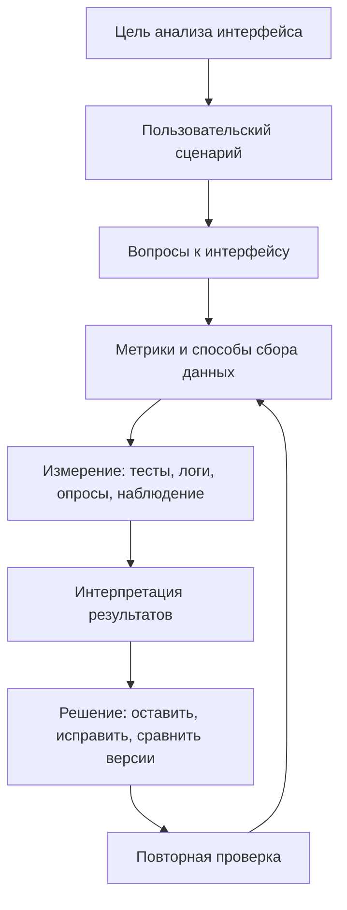

# 17. Метод анализа пользовательского интерфейса по метрикам GOSM

## Краткое определение

**GOSM** в контексте анализа пользовательского интерфейса удобно понимать как **goal-oriented metric approach**, то есть целеориентированный подход к выбору метрик. По смыслу он близок к классическому подходу **GQM (Goal - Question - Metric)**: сначала формулируют цель оценки интерфейса, затем переводят ее в проверочные вопросы, а потом подбирают метрики, которые дают численный или наблюдаемый ответ на эти вопросы.

Идея метода проста: интерфейс нельзя оценивать только словами "удобный", "понятный" или "красивый". Нужно заранее определить, **какая пользовательская или бизнес-цель важна**, **какие вопросы показывают достижение этой цели** и **какими измерениями это проверяется**. Тогда оценка UI становится не субъективным спором о вкусе, а управляемым анализом: если метрика ухудшилась, команда видит, какая цель пострадала; если улучшилась, можно доказать эффект изменения.

В экзаменационном ответе важно не путать этот подход с визуальной проверкой макета. GOSM/GQM применяется не к цветам и кнопкам сами по себе, а к тому, **как интерфейс помогает пользователю выполнить задачу**: найти нужную функцию, правильно заполнить форму, завершить заказ, понять ошибку, не потеряться в навигации и остаться удовлетворенным взаимодействием.

## Расшифровка и смысл подхода

В учебной формулировке вопроса GOSM можно раскрывать как подход, в котором анализ строится вокруг целей и метрик:

| Элемент | Смысл для UI-анализа | Пример |
|---|---|---|
| **Goal** | Цель оценки: что именно хотим улучшить или проверить | Уменьшить ошибки при заполнении формы регистрации |
| **Question** | Вопросы, на которые нужно ответить, чтобы понять достижение цели | На каких полях пользователи ошибаются чаще всего? Понимают ли они текст ошибок? |
| **Metric** | Количественные или качественно фиксируемые показатели | Доля успешно отправленных форм, число ошибок на пользователя, время заполнения |

Иногда в названиях методов встречаются близкие аббревиатуры и варианты. Для ответа по данному вопросу главное содержание такое: **от цели через вопросы к метрикам**. Это защищает от двух типичных крайностей: собирать много случайных чисел без смысла или оценивать интерфейс только экспертным мнением без проверяемых критериев.

## Общая логика GOSM

Метод начинается с цели, потому что одна и та же метрика может иметь разный смысл в разных задачах. Например, уменьшение времени на экране оплаты обычно хорошо, но уменьшение времени на экране подтверждения опасной операции может быть плохо: пользователь может быстрее нажимать кнопку, но хуже понимать последствия. Поэтому метрики выбираются не абстрактно, а относительно цели, сценария и контекста.

Главная польза схемы в том, что она связывает дизайн-решения с проверяемыми результатами. Команда не просто говорит "кнопка незаметная", а формулирует: "цель - повысить завершение оформления заказа; вопрос - видят ли пользователи основное действие после выбора доставки; метрика - доля пользователей, которые переходят к оплате без возврата назад".

## Цели, вопросы и метрики

В GOSM сначала задают цель на языке результата. Хорошая цель должна быть связана с конкретным экраном, сценарием, пользователем и ожидаемым изменением.

Примеры целей:

- повысить успешность выполнения сценария;
- сократить время выполнения типовой задачи;
- снизить количество пользовательских ошибок;
- повысить понятность навигации;
- улучшить субъективную удовлетворенность;
- проверить, не ухудшило ли изменение интерфейса важный сценарий;
- сравнить две версии экрана перед внедрением.

Далее цель декомпозируют в вопросы. Вопросы должны быть такими, чтобы на них можно было ответить наблюдением, логами, тестированием или опросом.

| Цель | Проверочные вопросы | Возможные метрики |
|---|---|---|
| Повысить успешность оформления заказа | Завершают ли пользователи заказ? На каком шаге они уходят? | Task completion rate, conversion rate, drop-off rate |
| Снизить ошибки в форме | Какие поля вызывают ошибки? Исправляют ли пользователи ошибку с первого раза? | Error rate, число повторных вводов, доля валидных отправок |
| Ускорить поиск информации | Сколько времени занимает поиск? Сколько лишних переходов делает пользователь? | Time on task, число кликов, длина пути |
| Улучшить понятность навигации | Попадает ли пользователь в нужный раздел без подсказок? | First-click success, число возвратов, pogo-sticking |
| Повысить удовлетворенность | Считает ли пользователь задачу легкой? Доверяет ли результату? | SUS, SEQ, CSAT, NPS, качественные комментарии |
| Проверить доступность | Может ли пользователь работать с клавиатуры и screen reader? | Число нарушений WCAG, keyboard completion rate, контраст |

## Процесс анализа пользовательского интерфейса по GOSM

Типовой процесс можно представить как последовательность шагов.

1. **Определить объект анализа.** Нужно выбрать экран, компонент или сценарий: регистрация, поиск товара, оформление заявки, настройка профиля, просмотр отчета.

2. **Описать пользователей и контекст.** Важно указать, кто выполняет задачу: новичок, эксперт, оператор, клиент, администратор. Для интерфейса оператора важны скорость и низкая нагрузка, для публичного сервиса - понятность и доверие, для критической системы - предотвращение ошибок.

3. **Сформулировать цель.** Цель должна быть проверяемой: "снизить долю ошибок при вводе даты", "увеличить долю успешного завершения регистрации", "сократить среднее время поиска документа".

4. **Сформулировать вопросы.** На этом этапе цель превращается в список диагностических вопросов: где возникает задержка, какой шаг непонятен, какие ошибки повторяются, какие элементы пользователь не замечает.

5. **Выбрать метрики.** Для каждого вопроса выбирают один или несколько показателей. Желательно сочетать поведенческие метрики, продуктовую аналитику и субъективную оценку.

6. **Определить способ сбора данных.** Метрики можно получать из usability-тестов, прототипов, веб-аналитики, логов продукта, A/B-тестов, опросов, записей сессий, экспертного аудита.

7. **Задать критерии интерпретации.** Нужно заранее определить, что считается хорошим результатом: например, не менее 90% пользователей завершают задачу, медианное время меньше 2 минут, критических ошибок нет.

8. **Собрать и проанализировать данные.** На этом этапе считают метрики, ищут узкие места, сравнивают группы пользователей или версии интерфейса.

9. **Сделать вывод и предложить изменения.** Результат должен быть прикладным: какие элементы изменить, какие тексты переписать, какие поля объединить, какие состояния добавить.

10. **Проверить повторно.** После исправлений метрики измеряют снова, иначе нельзя доказать, что интерфейс действительно стал лучше.

## Основные группы метрик

### Метрики результативности

**Результативность** показывает, достигает ли пользователь своей цели. Для интерфейса это базовая группа метрик: если задача не выполнена, красота и скорость уже вторичны.

| Метрика | Что показывает | Пример измерения |
|---|---|---|
| **Task completion rate** | Доля пользователей, успешно завершивших задачу | 18 из 20 участников оформили заказ |
| **Conversion rate** | Доля пользователей, дошедших до целевого действия | 12% посетителей отправили заявку |
| **Drop-off rate** | Где пользователи прекращают сценарий | 35% уходят на шаге выбора доставки |
| **First-click success** | Верно ли пользователь выбирает первое действие | 70% сразу нажимают нужный пункт меню |
| **Path completion** | Проходит ли пользователь сценарий без тупиков | 8 из 10 дошли до результата без помощи |

### Метрики эффективности и времени

**Эффективность** показывает, сколько усилий требуется для достижения цели. Здесь важны время, количество действий и когнитивная нагрузка.

| Метрика | Что показывает | Пример |
|---|---|---|
| **Time on task** | Время выполнения задачи | Среднее время заполнения формы - 3 минуты |
| **Number of clicks/taps** | Количество действий до результата | Для поиска справки требуется 7 кликов |
| **Navigation depth** | Глубина переходов | Нужная функция находится на четвертом уровне меню |
| **Time to first action** | Как быстро пользователь понимает, что делать | Первое осмысленное действие через 12 секунд |
| **Hesitation time** | Где пользователь останавливается и сомневается | Долгая пауза перед кнопкой "Подтвердить" |

Эти метрики нельзя трактовать механически. Минимальное время не всегда означает лучший интерфейс: для рискованных операций полезны подтверждения, предупреждения и возможность перепроверить данные.

### Метрики ошибок

Ошибки особенно важны для форм, финансовых операций, медицинских систем, административных панелей и любых интерфейсов, где неправильное действие дорого обходится.

| Метрика | Что показывает | Пример |
|---|---|---|
| **Error rate** | Доля действий или пользователей с ошибками | 40% пользователей неверно вводят номер телефона |
| **Errors per task** | Среднее число ошибок на задачу | 1,6 ошибки на заполнение анкеты |
| **Critical error count** | Ошибки, блокирующие завершение сценария | Пользователь не может оплатить заказ |
| **Correction success rate** | Исправляет ли пользователь ошибку | 80% исправляют email после подсказки |
| **Repeated error rate** | Повторяется ли ошибка после сообщения системы | 25% снова вводят дату в неверном формате |

При анализе ошибок важно разделять:

- **ошибки ввода**: неверный формат, пропущенное обязательное поле;
- **ошибки выбора**: пользователь нажимает не ту кнопку или выбирает не тот пункт;
- **ошибки понимания**: пользователь неверно интерпретирует термин или инструкцию;
- **ошибки навигации**: пользователь уходит не в тот раздел;
- **системные ошибки обратной связи**: интерфейс не объясняет, что произошло и что делать дальше.

### Метрики удовлетворенности

Удовлетворенность отражает субъективное восприятие интерфейса. Она не заменяет поведенческие данные, но показывает важную сторону UX: пользователь может выполнить задачу, но остаться раздраженным, неуверенным или не готовым вернуться к продукту.

| Метрика | Назначение | Как применяется |
|---|---|---|
| **SUS (System Usability Scale)** | Общая оценка удобства системы | Анкета после работы с продуктом |
| **SEQ (Single Ease Question)** | Легкость выполнения конкретной задачи | Один вопрос сразу после сценария |
| **CSAT** | Удовлетворенность взаимодействием | Оценка после обращения, заказа, заявки |
| **NPS** | Готовность рекомендовать продукт | Используется осторожно, чаще как продуктовая метрика |
| **Качественные комментарии** | Причины недовольства или доверия | Интервью, открытые ответы, наблюдения |

Субъективные метрики нужно сопоставлять с поведением. Если пользователи говорят, что экран понятен, но половина не завершает задачу, значит есть скрытая проблема. Если задача завершена быстро, но оценка SEQ низкая, возможно, интерфейс требует чрезмерного напряжения или вызывает недоверие.

## Пример применения к экрану

Рассмотрим экран регистрации в образовательном сервисе. Пользователь должен создать аккаунт, подтвердить email и перейти к выбору курса.

| Уровень GOSM | Формулировка |
|---|---|
| **Goal** | Повысить долю пользователей, которые успешно завершают регистрацию и переходят к выбору курса |
| **Question 1** | Понимает ли пользователь, какие поля обязательны? |
| **Metric 1** | Доля отправок формы без ошибок; число ошибок на обязательных полях |
| **Question 2** | Не путает ли пользователь пароль и подтверждение пароля? |
| **Metric 2** | Error rate по полям пароля; число повторных вводов |
| **Question 3** | Понятно ли, что делать после отправки формы? |
| **Metric 3** | Доля пользователей, перешедших к подтверждению email; время до следующего действия |
| **Question 4** | Не слишком ли длинным кажется процесс? |
| **Metric 4** | Time on task; SEQ после регистрации; drop-off rate |

Допустим, анализ показал:

- 92% пользователей начинают регистрацию;
- только 58% успешно отправляют форму с первой попытки;
- основная ошибка возникает в поле пароля из-за неочевидных требований;
- 22% пользователей после отправки формы не понимают, что нужно проверить почту;
- средний SEQ равен 4,1 из 7, то есть задача воспринимается как умеренно сложная.

Вывод по GOSM: проблема не просто в "некрасивой форме", а в несоответствии интерфейса цели регистрации. Основные решения: показать требования к паролю до ошибки, добавить индикатор выполнения требований, явно выделить следующий шаг после отправки формы, продублировать кнопку повторной отправки письма и измерить показатели снова.

## Пример матрицы анализа

Для практической работы удобно вести матрицу, где каждая метрика привязана к цели и вопросу.

| Цель | Вопрос | Метрика | Источник данных | Критерий |
|---|---|---|---|---|
| Снизить ошибки регистрации | Где пользователь ошибается? | Ошибки по каждому полю | Логи формы, usability-тест | Не более 10% ошибок на поле |
| Ускорить оформление заявки | Какие шаги занимают больше всего времени? | Медианное время шага | Веб-аналитика, запись сессий | Основной сценарий до 2 минут |
| Повысить понятность меню | Сразу ли найден нужный раздел? | First-click success | Tree testing, usability-тест | Не менее 80% верных первых кликов |
| Улучшить восприятие | Считает ли пользователь задачу легкой? | SEQ | Опрос после задачи | Средняя оценка не ниже 5,5 из 7 |
| Предотвратить критические ошибки | Можно ли случайно удалить данные? | Critical error count | Экспертный аудит, тестирование | 0 критических ошибок |

## Где брать данные для метрик

GOSM не предписывает один конкретный инструмент. Он задает логику выбора метрик, а данные можно получать разными методами.

| Источник | Что дает | Ограничение |
|---|---|---|
| **Usability-тестирование** | Видно реальное поведение и причины ошибок | Небольшая выборка, нужны участники |
| **Продуктовая аналитика** | Масштаб проблемы на реальных пользователях | Не всегда объясняет причину |
| **A/B-тест** | Проверяет эффект изменения интерфейса | Требует трафика и корректной статистики |
| **Логи системы** | Точные события, ошибки, повторные действия | Нужно заранее настроить события |
| **Опросы** | Субъективное восприятие и удовлетворенность | Есть риск смещения ответов |
| **Экспертная оценка** | Быстро выявляет очевидные нарушения | Не заменяет данные реальных пользователей |

Лучший результат обычно дает сочетание источников. Например, логи показывают, что пользователи бросают форму на шаге доставки; usability-тест объясняет, что они не понимают разницу между способами доставки; опрос показывает недоверие к срокам; повторное измерение после редизайна подтверждает улучшение.

## Типичные ошибки применения

1. **Собирать метрики без цели.** Если неизвестно, какое решение нужно принять, числа превращаются в отчет ради отчета.

2. **Выбирать только удобные метрики.** Например, считать клики по кнопке, но не смотреть, завершил ли пользователь задачу.

3. **Путать бизнес-метрику и UX-причину.** Конверсия может падать из-за цены, ассортимента или технической ошибки, а не только из-за интерфейса.

4. **Оптимизировать одну метрику в ущерб другим.** Можно сократить время оформления заказа, но увеличить число ошибочных заказов.

5. **Игнорировать сегменты пользователей.** Новички и опытные пользователи могут иметь разные проблемы; среднее значение скрывает различия.

6. **Не фиксировать критерий заранее.** Если порог успеха выбирается после измерения, результат легко подогнать под желаемый вывод.

7. **Доверять только самооценке.** Пользователь может сказать, что все понятно, но при этом выполнить задачу с ошибками.

8. **Доверять только логам.** Аналитика показывает, где пользователь ушел, но часто не показывает, почему он ушел.

9. **Сравнивать версии без одинаковых условий.** Разные аудитории, периоды и каналы трафика могут исказить вывод.

10. **Не проводить повторную проверку.** Исправление интерфейса должно подтверждаться теми же или сопоставимыми метриками.

## Достоинства и ограничения метода

Преимущества GOSM:

- связывает UI-решения с целями продукта и пользователя;
- помогает выбирать не случайные, а осмысленные метрики;
- делает анализ интерфейса проверяемым и воспроизводимым;
- подходит для сравнения версий интерфейса;
- помогает приоритизировать проблемы по влиянию на сценарий;
- хорошо сочетается с usability-тестами, A/B-тестами, аналитикой и экспертной оценкой.

Ограничения:

- метод не заменяет качественное исследование причин поведения;
- неверно выбранная цель приводит к неверным метрикам;
- количественные данные требуют корректной интерпретации;
- часть важных качеств интерфейса трудно свести к одному числу;
- малые выборки могут давать нестабильные выводы;
- метрики могут конфликтовать между собой, поэтому нужен баланс.

## Короткий пример ответа на экзамене

Если нужно ответить кратко, можно сформулировать так:

**Метод GOSM для анализа UI** заключается в том, что качество интерфейса оценивают через цепочку "цель - вопрос - метрика". Сначала определяется цель, например снизить ошибки при заполнении формы. Затем формулируются вопросы: какие поля вызывают ошибки, понимает ли пользователь подсказки, может ли он исправить ошибку. После этого выбираются метрики: доля успешных отправок, error rate, время заполнения, число повторных вводов, SEQ или SUS. Далее данные собираются в тестировании, логах, аналитике или опросах, интерпретируются относительно заранее заданных критериев, после чего интерфейс улучшается и проверяется повторно.

## Вывод

GOSM/GQM-подход нужен для того, чтобы анализ пользовательского интерфейса был связан с реальными целями, а не с субъективными впечатлениями. Он переводит общие требования "сделать удобно" и "уменьшить ошибки" в конкретную систему: цель, вопросы, метрики, сбор данных, интерпретация и повторная проверка. Для UI особенно важны метрики результативности, времени, ошибок и удовлетворенности. Правильно примененный метод позволяет понять не только то, хороший ли интерфейс, но и почему он мешает пользователю, какие изменения нужны и как доказать, что они сработали.

## Источники

1. Источник из списка дисциплины, указанный в вопросе: **[5, стр. 126]**.
2. Basili V. R., Caldiera G., Rombach H. D. **The Goal Question Metric Approach** - классическое описание подхода Goal-Question-Metric.
3. ISO 9241-11. **Ergonomics of human-system interaction - Usability: Definitions and concepts** - результативность, эффективность и удовлетворенность как базовые характеристики usability.
4. ISO 9241-210. **Human-centred design for interactive systems** - принципы человеко-ориентированного проектирования интерактивных систем.
5. Nielsen J. **Usability Engineering** - практические методы оценки удобства интерфейсов.
6. Sauro J., Lewis J. R. **Quantifying the User Experience** - метрики UX, SUS, SEQ, task completion, time on task и анализ ошибок.
