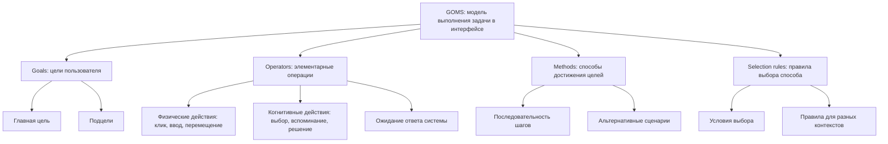
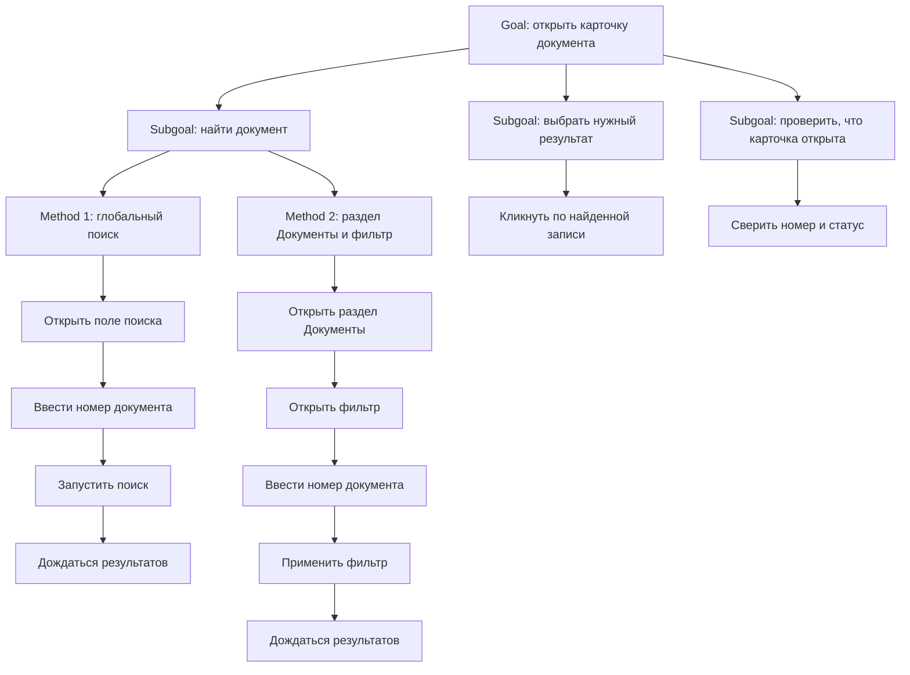
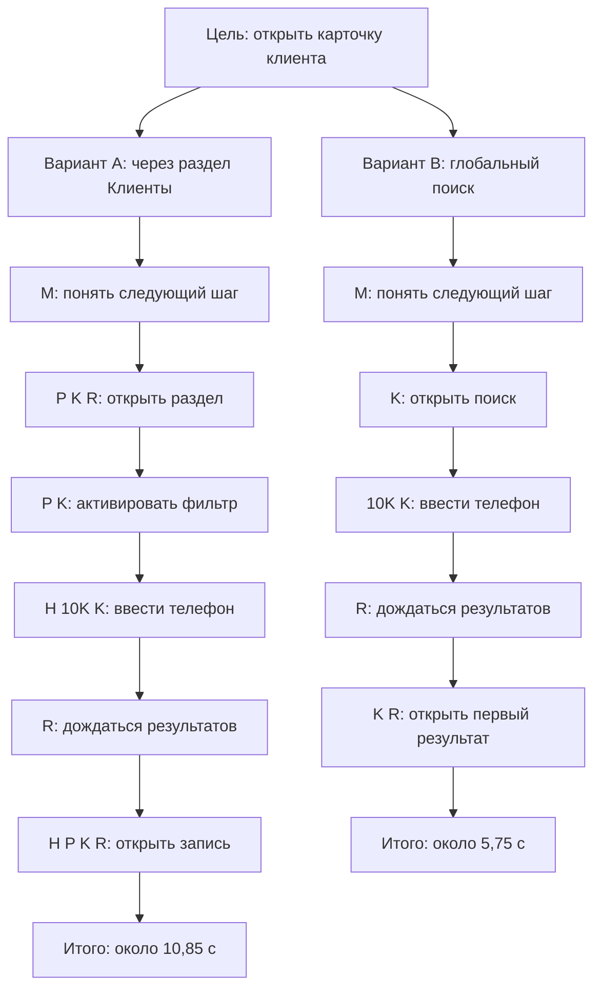

# 17. Метод анализа пользовательского интерфейса по метрикам GOSM

## Терминологическое уточнение: GOSM или GOMS

В формулировке вопроса указано **GOSM**, однако в контексте анализа пользовательского интерфейса по действиям пользователя, задачам и временным метрикам, вероятнее всего, имеется в виду **GOMS**. Это стандартный метод инженерного анализа UI, предложенный в области человеко-компьютерного взаимодействия.

**GOMS** расшифровывается как:

- **Goals** - цели пользователя;
- **Operators** - элементарные действия пользователя и системы;
- **Methods** - способы достижения целей, то есть процедуры выполнения задач;
- **Selection rules** - правила выбора метода, если одну цель можно выполнить несколькими способами.

Поэтому в экзаменационном ответе корректно сказать: в учебном материале может быть опечатка или перестановка букв **GOSM**, но стандартное название метода анализа интерфейсов - **GOMS**. Если преподаватель ожидает именно анализ UI, декомпозицию задач, расчет времени выполнения и варианты KLM-GOMS, CMN-GOMS, NGOMSL, CPM-GOMS, то отвечать нужно про **GOMS**, а не про GQM или абстрактный подбор метрик.

## Назначение метода

**GOMS** - это метод моделирования пользовательской деятельности в интерфейсе. Он описывает, какую цель пользователь хочет достичь, какими элементарными действиями он пользуется, каким способом выполняет задачу и как выбирает между альтернативными способами.

Главная идея метода: интерфейс можно оценивать не только субъективно, например "удобно" или "неудобно", а через формальную модель действий пользователя. Если задача раскладывается на элементарные операции, то можно:

- предсказать время выполнения типовой задачи;
- сравнить два варианта интерфейса до полноценного usability-тестирования;
- найти лишние шаги, избыточные переходы и когнитивные паузы;
- оценить, насколько интерфейс подходит опытному пользователю;
- проверить, не усложняет ли интерфейс часто повторяемые операции;
- выявить места, где пользователь должен слишком много вспоминать, искать или выбирать.

GOMS особенно полезен для анализа интерфейсов, где пользователь выполняет повторяемые, хорошо определенные задачи: оформление заказа, поиск записи, ввод данных, работа оператора в CRM, выполнение команды в графическом редакторе, заполнение формы, настройка параметров, обработка заявки.

Важно: GOMS не заменяет наблюдение за реальными пользователями. Он строит **аналитическую модель** поведения, обычно для пользователя, который уже знает интерфейс и выполняет задачу без случайных ошибок. Поэтому метод хорошо отвечает на вопрос "сколько действий и времени требует задача", но хуже отвечает на вопрос "понятен ли интерфейс новичку с первого раза".

## Структура GOMS

Классическая модель GOMS состоит из четырех элементов.

| Элемент | Смысл | Пример для UI |
|---|---|---|
| **Goals** | Цели и подцели пользователя | Оформить заказ, найти документ, сохранить отчет, изменить пароль |
| **Operators** | Элементарные действия пользователя или системы | Нажать кнопку, переместить указатель, ввести символ, прочитать сообщение, дождаться ответа |
| **Methods** | Последовательности операторов для достижения цели | Чтобы найти товар: открыть поиск, ввести запрос, нажать Enter, выбрать результат |
| **Selection rules** | Правила выбора между методами | Если известен артикул - искать по артикулу; если известна категория - открыть каталог |



## Goals: цели пользователя

**Goal** - это состояние, которого пользователь хочет достичь с помощью интерфейса. Цель формулируется не как действие разработчика и не как элемент экрана, а как пользовательский результат.

Неправильно:

- "нажать кнопку";
- "открыть модальное окно";
- "перейти на страницу оплаты".

Правильно:

- "оформить заказ";
- "найти нужный договор";
- "исправить ошибку в заявке";
- "создать новый отчет";
- "получить подтверждение оплаты".

Цели обычно декомпозируются на подцели. Например, цель "оформить заказ" может состоять из подцелей:

1. Проверить корзину.
2. Указать адрес доставки.
3. Выбрать способ доставки.
4. Выбрать способ оплаты.
5. Подтвердить заказ.

Такая декомпозиция важна, потому что GOMS анализирует не только конечный результат, но и путь пользователя к нему.

## Operators: операторы

**Operator** - минимальная операция, которую пользователь или система выполняет в модели. Операторы зависят от варианта GOMS. В KLM-GOMS они обычно имеют приближенные временные значения.

Типовые операторы:

| Оператор | Обозначение | Смысл | Типичное время в KLM |
|---|---:|---|---:|
| Нажатие клавиши или кнопки мыши | `K` | Ввод символа, клик, нажатие Enter | около 0,2-1,2 с в зависимости от пользователя и устройства |
| Перемещение указателя | `P` | Навести курсор на объект | около 1,1 с |
| Перенос руки | `H` | Перейти от клавиатуры к мыши или обратно | около 0,4 с |
| Ментальная подготовка | `M` | Принять решение, вспомнить следующий шаг, осознать результат | около 1,35 с |
| Ответ системы | `R` | Ожидание загрузки, поиска, обработки | зависит от системы |

В учебном ответе достаточно понимать, что операторы превращают описание интерфейса в расчетную модель. Например, фраза "пользователь вводит запрос и нажимает поиск" в KLM может быть разложена как:

`M + H + K...K + H + P + K + R`

То есть пользователь сначала осознает действие, переносит руку к клавиатуре, вводит символы, возвращается к мыши, наводит указатель, нажимает кнопку и ждет результат.

## Methods: методы выполнения целей

**Method** - это конкретная процедура достижения цели, состоящая из операторов и подцелей.

Одна и та же цель может иметь несколько методов. Например, цель "открыть карточку клиента" в CRM можно выполнить так:

- через глобальный поиск;
- через список последних клиентов;
- через раздел "Клиенты" и фильтр;
- через ссылку из связанной заявки.

Каждый метод имеет свою стоимость: количество шагов, время выполнения, когнитивную нагрузку, риск ошибки. GOMS позволяет явно сравнить эти методы.

Пример метода:

**Цель:** найти клиента по номеру телефона.

**Метод через поиск:**

1. Активировать поле поиска.
2. Ввести номер телефона.
3. Запустить поиск.
4. Дождаться результатов.
5. Выбрать найденного клиента.

**Метод через список клиентов:**

1. Открыть раздел "Клиенты".
2. Открыть фильтр.
3. Ввести номер телефона.
4. Применить фильтр.
5. Дождаться результатов.
6. Выбрать найденного клиента.

Если поиск доступен из любого места интерфейса, первый метод обычно быстрее и требует меньше переходов.

## Selection rules: правила выбора

**Selection rules** нужны, когда пользователь может выбрать один из нескольких методов. Эти правила описывают, при каких условиях применяется тот или иной метод.

Пример:

**Цель:** найти товар.

- Если пользователь знает точное название или артикул, использовать строку поиска.
- Если пользователь знает только тип товара, использовать каталог и фильтры.
- Если товар недавно просматривался, открыть историю просмотров.

В интерфейсном анализе это важно по двум причинам:

1. Можно проверить, поддерживает ли интерфейс естественные стратегии пользователя.
2. Можно увидеть, не заставляет ли интерфейс всех пользователей идти одним длинным путем, хотя для частых случаев должен быть короткий путь.

## Варианты GOMS

Существует несколько вариантов GOMS. Они различаются точностью, трудоемкостью и тем, какие аспекты поведения пользователя учитывают.

| Вариант | Расшифровка | Особенность | Когда применять |
|---|---|---|---|
| **KLM-GOMS** | Keystroke-Level Model | Самый простой расчет времени через элементарные операторы | Для быстрой оценки скорости выполнения хорошо известной задачи |
| **CMN-GOMS** | Card, Moran, Newell GOMS | Классическая иерархическая модель целей, методов и правил выбора | Для подробного описания структуры пользовательской задачи |
| **NGOMSL** | Natural GOMS Language | Более формальный язык описания методов; позволяет оценивать время выполнения и время обучения | Для анализа обучаемости и документирования процедур |
| **CPM-GOMS** | Cognitive-Perceptual-Motor GOMS | Учитывает параллельность когнитивных, перцептивных и моторных процессов | Для сложных задач, где действия могут перекрываться во времени |

### KLM-GOMS

**KLM-GOMS** - наиболее известный и простой вариант. Он оценивает время выполнения задачи опытным пользователем без ошибок. Задача раскладывается на последовательность операторов `K`, `P`, `H`, `M`, `R`, затем времена операторов суммируются.

Общая формула:

`Tзадачи = сумма времени всех операторов + время ожидания системы`

Например:

`T = 2M + 3P + 5K + H + R`

Если принять `M = 1,35 с`, `P = 1,1 с`, `K = 0,2 с`, `H = 0,4 с`, `R = 0,8 с`, то:

`T = 2 * 1,35 + 3 * 1,1 + 5 * 0,2 + 0,4 + 0,8 = 7,2 с`

Это не абсолютно точное время для любого человека, а расчетная оценка для сравнения вариантов интерфейса.

### CMN-GOMS

**CMN-GOMS** - классическая модель, названная по авторам Card, Moran, Newell. Она описывает:

- иерархию целей и подцелей;
- методы достижения целей;
- операторы внутри методов;
- правила выбора между методами.

CMN-GOMS полезен, когда нужно не просто посчитать клики, а показать структуру пользовательской деятельности. Например, он помогает понять, какие подцели интерфейс делает явными, а какие вынуждает пользователя держать в памяти.

### NGOMSL

**NGOMSL** использует более формальный, почти программный стиль описания методов на естественном языке. Он удобен для описания процедур, инструкций и обучения пользователей.

Пример в упрощенной форме:

```text
Goal: отправить отчет
Method:
  Step 1. Открыть раздел "Отчеты"
  Step 2. Выбрать нужный отчет
  Step 3. Нажать "Отправить"
  Step 4. Подтвердить отправку
Return with goal accomplished
```

NGOMSL может использоваться для оценки не только времени выполнения, но и сложности обучения: чем больше правил, шагов и исключений, тем труднее пользователю освоить интерфейс.

### CPM-GOMS

**CPM-GOMS** строит модель на основе сетевого графика и допускает параллельное выполнение некоторых процессов. Например, пользователь может читать часть информации, пока рука уже движется к мыши, или система может загружать данные, пока пользователь готовится к следующему действию.

Этот вариант сложнее, но точнее для интерфейсов, где важна высокая производительность: рабочие места операторов, системы управления, профессиональные инструменты.

## Процесс анализа интерфейса по GOMS

GOMS-анализ обычно выполняется последовательно.

1. **Определить пользователя и контекст.** Нужно понять, кого моделируем: новичка, опытного пользователя, оператора, администратора, клиента, сотрудника поддержки. GOMS чаще моделирует опытного пользователя, который знает интерфейс.

2. **Выбрать типовую задачу.** Задача должна быть конкретной и измеримой: "найти клиента по телефону", "создать заявку", "экспортировать отчет", "оформить заказ".

3. **Сформулировать главную цель.** Цель описывает пользовательский результат, а не элемент интерфейса.

4. **Разложить цель на подцели.** Большая задача делится на логические этапы.

5. **Описать методы.** Для каждой цели указывается последовательность действий, ведущая к результату.

6. **Определить операторы.** Действия переводятся в элементарные операции: клики, ввод, перемещение указателя, ментальные паузы, ожидание.

7. **Добавить правила выбора.** Если есть альтернативные пути, фиксируется, когда пользователь выбирает каждый путь.

8. **Рассчитать метрики.** Обычно считают время выполнения, количество действий, количество переключений между устройствами, число ментальных пауз, количество экранов и потенциальные точки ошибки.

9. **Сравнить варианты интерфейса.** Анализируют, какой вариант короче, быстрее, устойчивее к ошибкам и проще для пользователя.

10. **Сформулировать улучшения.** Убирают лишние шаги, сокращают переключения, делают частые действия доступнее, улучшают обратную связь системы.

```mermaid
flowchart LR
    A[Выбрать пользователя и контекст] --> B[Выбрать типовую задачу]
    B --> C[Сформулировать цель]
    C --> D[Разложить на подцели]
    D --> E[Описать методы выполнения]
    E --> F[Разложить методы на операторы]
    F --> G[Задать правила выбора]
    G --> H[Посчитать метрики: время, шаги, ошибки]
    H --> I[Сравнить варианты интерфейса]
    I --> J[Предложить улучшения]
    J --> K[Проверить новую модель или провести тестирование]
```



## Декомпозиция задачи

Декомпозиция - центральная часть GOMS. Она показывает, как пользовательская цель превращается в цепочку подцелей и операций.

Рассмотрим задачу: **пользователь хочет найти документ по номеру и открыть его карточку**.



Для этой задачи можно задать правило выбора:

- если пользователь знает точный номер документа, использовать глобальный поиск;
- если номер неизвестен, но известны дата, тип или статус, использовать раздел "Документы" и фильтр.

Такой анализ помогает увидеть, что интерфейс должен поддерживать разные стратегии поиска, а не только один универсальный путь.

## Метрики в GOMS-анализе

Слово "метрики" в данном вопросе уместно понимать не как произвольные UX-показатели, а как показатели, которые выводятся из GOMS-модели.

Основные метрики:

| Метрика | Что показывает | Как используется |
|---|---|---|
| **Время выполнения задачи** | Сколько секунд занимает сценарий | Сравнение вариантов UI, оценка производительности |
| **Количество операторов** | Сколько элементарных действий нужно выполнить | Поиск лишних шагов |
| **Количество кликов и вводов** | Насколько физически длинный сценарий | Оптимизация частых операций |
| **Количество ментальных операторов `M`** | Сколько раз пользователь должен подумать, выбрать, вспомнить | Оценка когнитивной нагрузки |
| **Количество переключений `H`** | Как часто пользователь переходит между клавиатурой и мышью | Улучшение эргономики |
| **Количество экранов или переходов** | Насколько длинный путь в интерфейсе | Упрощение навигации |
| **Потенциальные точки ошибки** | Где пользователь может выбрать не то действие или неверно ввести данные | Повышение надежности интерфейса |

В KLM-GOMS главная расчетная метрика - **предсказанное время выполнения задачи**. В более широком GOMS-анализе дополнительно оценивают сложность метода, количество правил выбора, число подцелей и понятность структуры задачи.

## Расчет времени через KLM

Для расчета времени нужно:

1. Записать точный сценарий.
2. Разложить его на KLM-операторы.
3. Назначить каждому оператору примерное время.
4. Сложить времена.
5. Сравнить с альтернативным интерфейсом или целевым значением.

Типовые значения в учебных расчетах:

| Оператор | Значение | Пример |
|---|---:|---|
| `K` | 0,2 с для простого нажатия опытным пользователем; для текста может быть больше | Нажать клавишу, кликнуть |
| `P` | 1,1 с | Навести указатель на кнопку |
| `H` | 0,4 с | Перенести руку с клавиатуры на мышь |
| `M` | 1,35 с | Подумать, выбрать следующий шаг |
| `R` | переменное | Дождаться загрузки или поиска |

Эти значения являются усредненными. В реальном проекте их можно уточнять под устройство, аудиторию и характер ввода.

## Пример оценки задачи в интерфейсе

Задача: **найти клиента по телефону в CRM и открыть его карточку**.

Сравним два варианта интерфейса.

### Вариант A: поиск доступен только через раздел "Клиенты"

Сценарий:

1. Пользователь решает искать клиента.
2. Наводит указатель на пункт меню "Клиенты".
3. Кликает.
4. Ждет загрузку раздела.
5. Наводит указатель на поле фильтра.
6. Кликает в поле.
7. Переносит руку на клавиатуру.
8. Вводит 10 цифр телефона.
9. Нажимает Enter.
10. Ждет результаты.
11. Переносит руку на мышь.
12. Наводит указатель на найденную запись.
13. Кликает по записи.
14. Ждет карточку клиента.

KLM-модель:

`M + P + K + R + P + K + H + 10K + K + R + H + P + K + R`

Примем:

- `M = 1,35 с`;
- `P = 1,1 с`;
- `K = 0,2 с`;
- `H = 0,4 с`;
- загрузка раздела `R1 = 1,0 с`;
- поиск `R2 = 0,8 с`;
- открытие карточки `R3 = 0,8 с`.

Расчет:

| Часть | Операторы | Время |
|---|---|---:|
| Осознать действие | `M` | 1,35 |
| Открыть раздел | `P + K + R1` | 1,1 + 0,2 + 1,0 = 2,3 |
| Активировать фильтр | `P + K` | 1,1 + 0,2 = 1,3 |
| Перейти к вводу и ввести телефон | `H + 10K + K` | 0,4 + 2,0 + 0,2 = 2,6 |
| Дождаться результатов | `R2` | 0,8 |
| Выбрать запись | `H + P + K + R3` | 0,4 + 1,1 + 0,2 + 0,8 = 2,5 |
| **Итого** |  | **10,85 с** |

### Вариант B: глобальный поиск всегда доступен горячей клавишей

Сценарий:

1. Пользователь решает искать клиента.
2. Нажимает горячую клавишу поиска.
3. Вводит 10 цифр телефона.
4. Нажимает Enter.
5. Ждет результаты.
6. Выбирает первый результат клавишей Enter или кликом.
7. Ждет карточку клиента.

KLM-модель при клавиатурном сценарии:

`M + K + 10K + K + R + K + R`

Расчет:

| Часть | Операторы | Время |
|---|---|---:|
| Осознать действие | `M` | 1,35 |
| Открыть поиск горячей клавишей | `K` | 0,2 |
| Ввести телефон и запустить поиск | `10K + K` | 2,0 + 0,2 = 2,2 |
| Дождаться результатов | `R` | 0,8 |
| Открыть первый результат | `K + R` | 0,2 + 0,8 = 1,0 |
| **Итого** |  | **5,75 с** |

Вывод из примера: вариант B почти в два раза быстрее для опытного пользователя, потому что убирает переход в раздел, наведение на поле фильтра и переключения между мышью и клавиатурой. GOMS показывает не просто "поиск лучше", а объясняет, за счет каких операторов экономится время.



## Что можно улучшить по результатам GOMS

После GOMS-анализа обычно предлагают изменения, которые уменьшают стоимость частых задач:

- сделать частые действия доступными с меньшим числом переходов;
- добавить глобальный поиск или быстрые команды;
- сохранить фокус в поле ввода, чтобы не требовать лишний клик;
- поддержать клавиатурные сценарии для опытных пользователей;
- уменьшить количество переключений между мышью и клавиатурой;
- объединить шаги, если они не требуют отдельного решения пользователя;
- показать результат без лишнего экрана подтверждения, если риск ошибки низкий;
- наоборот, добавить подтверждение, если операция опасная;
- улучшить подписи и обратную связь, чтобы уменьшить ментальные паузы;
- ускорить системные ответы, потому что `R` напрямую входит в время задачи.

Важный момент: не все шаги нужно удалять. Иногда дополнительное действие оправдано, если оно снижает риск критической ошибки. Например, подтверждение удаления увеличивает время, но защищает от случайной потери данных.

## Сильные стороны GOMS

Преимущества метода:

- **Формальность.** GOMS заставляет описать задачу явно: цели, действия, методы и правила выбора.
- **Измеримость.** Можно посчитать время, количество операций, число переключений и ментальных пауз.
- **Сравнимость.** Два варианта интерфейса можно сравнить до реализации или до массового тестирования.
- **Полезность для частых задач.** Метод особенно хорошо работает для операций, которые пользователь выполняет много раз в день.
- **Выявление лишних шагов.** GOMS показывает, какие действия не приближают пользователя к цели.
- **Поддержка проектирования.** Метод помогает обосновать горячие клавиши, быстрый поиск, автозаполнение, сохранение фокуса, сокращение переходов.
- **Связь с производительностью.** В операторских и профессиональных интерфейсах даже небольшая экономия времени на одной операции может быть важна.

## Ограничения и слабые стороны

Ограничения метода:

- **Ориентация на опытного пользователя.** Классический GOMS обычно моделирует пользователя, который знает интерфейс и не тратит время на обучение.
- **Слабый учет ошибок.** Метод не всегда хорошо предсказывает случайные ошибки, неверные гипотезы и непонимание интерфейса.
- **Слабый учет эмоций и доверия.** GOMS не отвечает напрямую, нравится ли интерфейс пользователю и вызывает ли он уверенность.
- **Трудоемкость для сложных систем.** Подробная модель большого интерфейса может быть слишком объемной.
- **Зависимость от правильной декомпозиции.** Если аналитик неверно описал задачу, расчет будет убедительным, но неправильным.
- **Приблизительность временных коэффициентов.** Значения KLM усреднены и зависят от устройства, навыка пользователя, контекста и типа ввода.
- **Не заменяет тестирование.** GOMS предсказывает поведение, а usability-тест показывает реальное поведение.

Поэтому GOMS лучше использовать вместе с другими методами: экспертной оценкой, когнитивным walkthrough, usability-тестированием, анализом логов, A/B-тестами и опросниками.

## Типичные ошибки применения

1. **Отвечать про GQM вместо GOMS.** GQM - это Goal-Question-Metric, общий подход к выбору метрик. Для вопроса об анализе UI по целям, операторам, методам и временным расчетам нужен GOMS.

2. **Путать цель с действием интерфейса.** "Нажать кнопку" - это оператор, а не цель. Цель - "отправить заявку" или "получить отчет".

3. **Считать только клики.** В GOMS важны не только клики, но и ввод, наведение, переключение между устройствами, ментальные паузы и ожидание системы.

4. **Игнорировать ментальные операторы.** Если пользователь должен решить, куда идти дальше, прочитать сообщение или выбрать из похожих пунктов, это не бесплатное действие.

5. **Не фиксировать правила выбора.** Если есть несколько способов выполнить задачу, нужно описать, когда выбирается каждый способ.

6. **Моделировать неопределенную задачу.** Задача должна быть конкретной: не "работа с заказами", а "найти заказ по номеру и изменить статус".

7. **Использовать GOMS для оценки первого впечатления.** Метод плохо описывает поведение пользователя, который впервые видит интерфейс и не знает доступных команд.

8. **Считать расчет абсолютной истиной.** KLM дает прогноз и инструмент сравнения, а не точное время для всех пользователей.

9. **Оптимизировать только скорость.** Быстрее не всегда лучше: для опасных операций нужны подтверждения, понятные предупреждения и защита от ошибок.

10. **Не проверять модель на практике.** После аналитического вывода желательно провести хотя бы небольшое наблюдение или тестирование.

## Связь GOMS с другими методами оценки UI

GOMS занимает место среди аналитических методов оценки интерфейса. Его удобно сравнить с другими подходами.

| Метод | Что оценивает | Чем отличается от GOMS |
|---|---|---|
| **GOMS** | Структуру задачи, действия пользователя, время выполнения | Формально моделирует выполнение задачи |
| **KLM** | Время выполнения через элементарные операции | Является простым вариантом GOMS |
| **Когнитивный walkthrough** | Поймет ли пользователь следующий шаг | Лучше подходит для новичков и обучаемости |
| **Эвристическая оценка** | Нарушения общих принципов usability | Быстрее, но менее расчетна |
| **Usability-тестирование** | Реальное поведение пользователей | Дает эмпирические данные, но требует участников |
| **Анализ логов** | Массовые паттерны поведения | Показывает факты, но не всегда объясняет причины |

Такой сравнительный контекст полезен на экзамене: GOMS - не универсальный метод всего UX-анализа, а именно метод моделирования задач и действий пользователя в интерфейсе.

## Краткий пример экзаменационного ответа

Если нужно ответить кратко, можно сформулировать так:

**GOMS** - это метод анализа пользовательского интерфейса, в котором деятельность пользователя описывается через **цели** (Goals), **операторы** (Operators), **методы выполнения** (Methods) и **правила выбора** (Selection rules). В вопросе может быть указано GOSM, но стандартный термин в HCI - GOMS. Метод позволяет разложить пользовательскую задачу на подцели и элементарные действия, после чего оценить интерфейс по расчетным метрикам: времени выполнения, количеству кликов, ввода, переключений, ментальных пауз и ожиданий системы. В варианте KLM-GOMS действия кодируются операторами `K`, `P`, `H`, `M`, `R`, каждому оператору задается примерное время, а итоговое время задачи получается суммированием. GOMS применяют для сравнения вариантов интерфейса, поиска лишних шагов и оптимизации частых сценариев. Основные ограничения метода: он лучше описывает опытного пользователя, плохо учитывает ошибки новичков и не заменяет реальное usability-тестирование.

## Вывод

Метод, который в вопросе назван GOSM, в контексте UI-анализа корректнее раскрывать как **GOMS**. Это классический способ формального анализа пользовательских задач: сначала определяются цели пользователя, затем задача раскладывается на операторы, методы и правила выбора, после чего можно оценить интерфейс по расчетным метрикам. Самый практичный вариант - **KLM-GOMS**, где время выполнения задачи считается как сумма времен элементарных действий. Метод помогает сравнивать интерфейсные решения, находить лишние действия и проектировать более быстрые сценарии, но его нужно дополнять тестированием на реальных пользователях, особенно если важны обучаемость, ошибки новичков и субъективное восприятие.

## Источники

1. Card S. K., Moran T. P., Newell A. **The Psychology of Human-Computer Interaction**. Lawrence Erlbaum Associates, 1983 - классическое изложение GOMS.
2. John B. E., Kieras D. E. **The GOMS Family of User Interface Analysis Techniques: Comparison and Contrast**. ACM Transactions on Computer-Human Interaction, 1996 - сравнение KLM-GOMS, CMN-GOMS, NGOMSL и CPM-GOMS.
3. Card S. K., Moran T. P., Newell A. **The Keystroke-Level Model for User Performance Time with Interactive Systems**. Communications of the ACM, 1980 - основа KLM-GOMS и расчетов времени.
4. Kieras D. E. **A Guide to GOMS Model Usability Evaluation using GOMSL and GLEAN** - практическое руководство по построению GOMS-моделей.
5. Dix A., Finlay J., Abowd G., Beale R. **Human-Computer Interaction** - обзор методов анализа и оценки пользовательских интерфейсов.
6. Nielsen J. **Usability Engineering** - методы инженерной оценки удобства интерфейсов и связь аналитических методов с usability-тестированием.
7. Учебный источник из списка дисциплины, указанный в вопросе: **[5, стр. 126]**. В ответе следует учитывать возможную опечатку GOSM и раскрывать стандартный метод **GOMS**.
